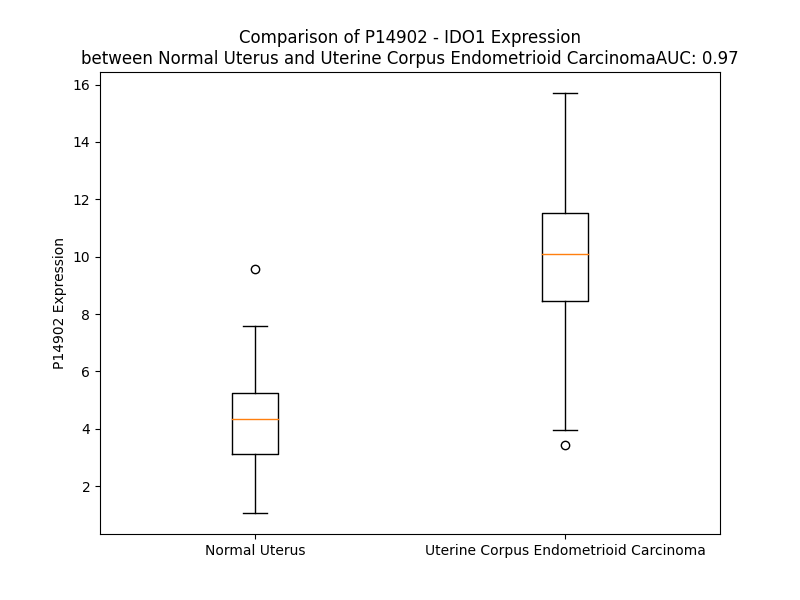

# Detailed Data for P14902

## Introduction to the Detailed Summary

### How to Interpret the Results

- **Summary & Metrics**: This section provides a quick reference to essential protein attributes, including expression changes, family classification, and biomarker applications. Regulation status (upregulated/downregulated) indicates the protein's behavior in a disease context. Some information comes from the original excel file with the proteins selected from literature, while others are derived from the analyses.
- **Expression Comparison**: A visual representation comparing protein expression between normal and disease states. It highlights significant changes in expression levels that might indicate diagnostic or therapeutic relevance. This is data coming from transcriptomics experiments and could not translate similarly to protein levels.
- **Isoform Alignment**: An interactive view of isoform alignments, revealing structural and functional differences between variants of the protein.
- **Interactors & Homologs**: Tables listing known interaction partners and homologous proteins, the more interactors and homologs, the more complex the protein is to design an antibody for.
- **Biological Assemblies**: Information about the structural arrangement of the protein in different assemblies, providing insights into its functional state but also the complexity of the protein to develop antibodies.
- **Combined Per-Residue Information**: A detailed table summarizing residue-level data. This includes predictions for epitope regions, aggregation tendencies, and modifications that might impact the protein's function. Each row corresponds to a residue in the protein, providing insights into specific sites that may be important for research or drug development.
## Summary & Metrics

- **UniProt Accession**: P14902
- **Gene Name**: IDO1
- **Protein Name**: Indoleamine 2,3-dioxygenase 1
- **Swiss Prot**: I23O1_HUMAN
- **Family**: enzyme
- **Biomarker Application**: diagnosis,disease progression,efficacy,prognosis,response to therapy
- **Number of Isoforms**: 0
- **Regulation**: 1
- **(transcriptomics) AUC**: 0.97
- **(transcriptomics) Fold Change**: 2.32
- **(transcriptomics) Regulation**: Upregulated
- **Discotope Epitope Count**: 74
- **Max n_uniprots (Homo)**: 2
- **Max n_uniprots (Hetero)**: N/A

## Expression Comparison

## Interactors

| preferredName_A   | preferredName_B   |   score |
|:------------------|:------------------|--------:|
| IDO1              | TDO2              |   0.99  |
| IDO1              | KYNU              |   0.983 |
| IDO1              | AFMID             |   0.968 |
| IDO1              | TPH1              |   0.957 |
| IDO1              | TPH2              |   0.953 |
| IDO1              | CYP1A1            |   0.944 |
| IDO1              | IL4I1             |   0.941 |
| IDO1              | MAOA              |   0.939 |
| IDO1              | CYP1B1            |   0.938 |
| IDO1              | MAOB              |   0.936 |
| IDO1              | AANAT             |   0.931 |
| IDO1              | IFNG              |   0.93  |
| IDO1              | DDC               |   0.93  |
| IDO1              | CYP1A2            |   0.93  |
| IDO1              | ASMT              |   0.927 |
| IDO1              | IDO2              |   0.919 |
| IDO1              | INMT              |   0.913 |
| IDO1              | CTLA4             |   0.91  |
| IDO1              | CD274             |   0.902 |

## Homologs

| uniprot_id   | gene_id   |
|--------------|-----------|

## Biological Assemblies

|   Unnamed: 0 |   assembly |   n_uniprots | composition   | crystal_id   |
|-------------:|-----------:|-------------:|:--------------|:-------------|
|            0 |          1 |            2 | Homo          | 5etw         |
|            0 |          1 |            1 | Homo          | 6azv         |
|            1 |          2 |            1 | Homo          | 6azv         |
|            2 |          3 |            1 | Homo          | 6azv         |
|            3 |          4 |            1 | Homo          | 6azv         |
|            0 |          1 |            1 | Homo          | 7e0p         |
|            1 |          2 |            1 | Homo          | 7e0p         |
|            0 |          1 |            1 | Homo          | 2d0t         |
|            1 |          2 |            1 | Homo          | 2d0t         |
|            0 |          1 |            1 | Homo          | 6e45         |
|            1 |          2 |            1 | Homo          | 6e45         |
|            2 |          3 |            1 | Homo          | 6e45         |
|            3 |          4 |            1 | Homo          | 6e45         |
|            0 |          1 |            1 | Homo          | 4u72         |
|            1 |          2 |            1 | Homo          | 4u72         |
|            0 |          1 |            1 | Homo          | 5wmu         |
|            1 |          2 |            1 | Homo          | 5wmu         |
|            0 |          1 |            1 | Homo          | 6wpe         |
|            1 |          2 |            1 | Homo          | 6wpe         |
|            0 |          1 |            1 | Homo          | 6cxv         |
|            1 |          2 |            1 | Homo          | 6cxv         |
|            0 |          1 |            1 | Homo          | 7rrc         |
|            1 |          2 |            1 | Homo          | 7rrc         |
|            0 |          1 |            1 | Homo          | 6azu         |
|            1 |          2 |            1 | Homo          | 6azu         |
|            2 |          3 |            1 | Homo          | 6azu         |
|            3 |          4 |            1 | Homo          | 6azu         |
|            0 |          1 |            2 | Homo          | 6e35         |
|            0 |          1 |            2 | Homo          | 7ah4         |
|            0 |          1 |            1 | Homo          | 7e0q         |
|            1 |          2 |            1 | Homo          | 7e0q         |
|            0 |          1 |            1 | Homo          | 6kw7         |
|            1 |          2 |            1 | Homo          | 6kw7         |
|            0 |          1 |            2 | Homo          | 6v52         |
|            0 |          1 |            1 | Homo          | 7e0u         |
|            1 |          2 |            1 | Homo          | 7e0u         |
|            0 |          1 |            2 | Homo          | 8fur         |
|            1 |          2 |            2 | Homo          | 8fur         |
|            0 |          1 |            1 | Homo          | 7rrd         |
|            1 |          2 |            1 | Homo          | 7rrd         |
|            0 |          1 |            1 | Homo          | 7e0o         |
|            1 |          2 |            1 | Homo          | 7e0o         |
|            0 |          1 |            1 | Homo          | 6o3i         |
|            1 |          2 |            1 | Homo          | 6o3i         |
|            0 |          1 |            1 | Homo          | 2d0u         |
|            1 |          2 |            1 | Homo          | 2d0u         |
|            0 |          1 |            1 | Homo          | 8abx         |
|            0 |          1 |            1 | Homo          | 7e0s         |
|            1 |          2 |            1 | Homo          | 7e0s         |
|            0 |          1 |            1 | Homo          | 6kof         |
|            1 |          2 |            1 | Homo          | 6kof         |
|            0 |          1 |            1 | Homo          | 7z2l         |
|            1 |          2 |            1 | Homo          | 7z2l         |
|            2 |          3 |            1 | Homo          | 7z2l         |
|            3 |          4 |            1 | Homo          | 7z2l         |
|            0 |          1 |            1 | Homo          | 6azw         |
|            1 |          2 |            1 | Homo          | 6azw         |
|            0 |          1 |            1 | Homo          | 7p0r         |
|            1 |          2 |            1 | Homo          | 7p0r         |
|            2 |          3 |            1 | Homo          | 7p0r         |
|            3 |          4 |            1 | Homo          | 7p0r         |
|            0 |          1 |            1 | Homo          | 7yxt         |
|            1 |          2 |            1 | Homo          | 7yxt         |
|            2 |          3 |            1 | Homo          | 7yxt         |
|            3 |          4 |            1 | Homo          | 7yxt         |
|            0 |          1 |            1 | Homo          | 6f0a         |
|            1 |          2 |            1 | Homo          | 6f0a         |
|            0 |          1 |            2 | Homo          | 8i7l         |
|            0 |          1 |            1 | Homo          | 6e44         |
|            1 |          2 |            1 | Homo          | 6e44         |
|            2 |          3 |            1 | Homo          | 6e44         |
|            3 |          4 |            1 | Homo          | 6e44         |
|            0 |          1 |            1 | Homo          | 6dpr         |
|            1 |          2 |            1 | Homo          | 6dpr         |
|            0 |          1 |            1 | Homo          | 4u74         |
|            1 |          2 |            1 | Homo          | 4u74         |
|            0 |          1 |            1 | Homo          | 6e42         |
|            1 |          2 |            1 | Homo          | 6e42         |
|            2 |          3 |            1 | Homo          | 6e42         |
|            3 |          4 |            1 | Homo          | 6e42         |
|            0 |          1 |            1 | Homo          | 5ek2         |
|            1 |          2 |            1 | Homo          | 5ek2         |
|            0 |          1 |            1 | Homo          | 6e46         |
|            1 |          2 |            1 | Homo          | 6e46         |
|            2 |          3 |            1 | Homo          | 6e46         |
|            3 |          4 |            1 | Homo          | 6e46         |
|            0 |          1 |            1 | Homo          | 6x5y         |
|            1 |          2 |            1 | Homo          | 6x5y         |
|            0 |          1 |            2 | Homo          | 7b1o         |
|            0 |          1 |            2 | Homo          | 5whr         |
|            0 |          1 |            1 | Homo          | 7m63         |
|            1 |          2 |            1 | Homo          | 7m63         |
|            0 |          1 |            1 | Homo          | 7nge         |
|            1 |          2 |            1 | Homo          | 7nge         |
|            2 |          3 |            1 | Homo          | 7nge         |
|            3 |          4 |            1 | Homo          | 7nge         |
|            0 |          1 |            2 | Homo          | 7ah5         |
|            0 |          1 |            1 | Homo          | 5wmx         |
|            1 |          2 |            1 | Homo          | 5wmx         |
|            0 |          1 |            1 | Homo          | 5ek3         |
|            1 |          2 |            1 | Homo          | 5ek3         |
|            0 |          1 |            1 | Homo          | 6mq6         |
|            1 |          2 |            1 | Homo          | 6mq6         |
|            0 |          1 |            1 | Homo          | 6pu7         |
|            1 |          2 |            1 | Homo          | 6pu7         |
|            0 |          1 |            1 | Homo          | 6wjy         |
|            1 |          2 |            1 | Homo          | 6wjy         |
|            0 |          1 |            1 | Homo          | 7a62         |
|            1 |          2 |            1 | Homo          | 7a62         |
|            2 |          3 |            1 | Homo          | 7a62         |
|            3 |          4 |            1 | Homo          | 7a62         |
|            0 |          1 |            1 | Homo          | 6ubp         |
|            1 |          2 |            1 | Homo          | 6ubp         |
|            0 |          1 |            1 | Homo          | 7e0t         |
|            1 |          2 |            1 | Homo          | 7e0t         |
|            0 |          1 |            1 | Homo          | 7m7d         |
|            1 |          2 |            1 | Homo          | 7m7d         |
|            0 |          1 |            1 | Homo          | 6e41         |
|            1 |          2 |            1 | Homo          | 6e41         |
|            2 |          3 |            1 | Homo          | 6e41         |
|            3 |          4 |            1 | Homo          | 6e41         |
|            0 |          1 |            2 | Homo          | 7ah6         |
|            0 |          1 |            1 | Homo          | 7rrb         |
|            1 |          2 |            1 | Homo          | 7rrb         |
|            0 |          1 |            1 | Homo          | 6kps         |
|            1 |          2 |            1 | Homo          | 6kps         |
|            0 |          1 |            1 | Homo          | 5wn8         |
|            1 |          2 |            1 | Homo          | 5wn8         |
|            0 |          1 |            2 | Homo          | 4pk6         |
|            0 |          1 |            1 | Homo          | 6e43         |
|            1 |          2 |            1 | Homo          | 6e43         |
|            2 |          3 |            1 | Homo          | 6e43         |
|            3 |          4 |            1 | Homo          | 6e43         |
|            0 |          1 |            2 | Homo          | 6r63         |
|            0 |          1 |            1 | Homo          | 5wmw         |
|            1 |          2 |            1 | Homo          | 5wmw         |
|            0 |          1 |            1 | Homo          | 7p0n         |
|            1 |          2 |            1 | Homo          | 7p0n         |
|            2 |          3 |            1 | Homo          | 7p0n         |
|            3 |          4 |            1 | Homo          | 7p0n         |
|            0 |          1 |            1 | Homo          | 6pz1         |
|            1 |          2 |            1 | Homo          | 6pz1         |
|            0 |          1 |            1 | Homo          | 6cxu         |
|            1 |          2 |            1 | Homo          | 6cxu         |
|            0 |          1 |            1 | Homo          | 6dpq         |
|            1 |          2 |            1 | Homo          | 6dpq         |
|            0 |          1 |            1 | Homo          | 5ek4         |
|            1 |          2 |            1 | Homo          | 5ek4         |
|            0 |          1 |            2 | Homo          | 7zv3         |
|            0 |          1 |            2 | Homo          | 5xe1         |
|            1 |          2 |            1 | Homo          | 5xe1         |
|            2 |          3 |            1 | Homo          | 5xe1         |
|            0 |          1 |            1 | Homo          | 5wmv         |
|            1 |          2 |            1 | Homo          | 5wmv         |
|            0 |          1 |            2 | Homo          | 4pk5         |
|            0 |          1 |            1 | Homo          | 6e40         |
|            1 |          2 |            1 | Homo          | 6e40         |
|            2 |          3 |            1 | Homo          | 6e40         |
|            3 |          4 |            1 | Homo          | 6e40         |

## Combined Per-Residue Information

|   res | aa   |   epitope_score | epitope   |   relative_surface_accessibility |   modeling_confidence |   Aggregation | modification   |
|------:|:-----|----------------:|:----------|---------------------------------:|----------------------:|--------------:|:---------------|
|     1 | M    |         0.14282 | False     |                          1.30721 |                 33.01 |         0     | N/A            |
|     2 | A    |         0.10878 | False     |                          0.89459 |                 42.36 |         0     | N/A            |
|     3 | H    |         0.12976 | False     |                          0.94202 |                 50.62 |         0     | N/A            |
|     4 | A    |         0.07099 | False     |                          0.3823  |                 51.63 |         0     | N/A            |
|     5 | M    |         0.03668 | False     |                          0.1257  |                 57.32 |         0     | N/A            |
|     6 | E    |         0.09939 | False     |                          0.60336 |                 52.43 |         0     | N/A            |
|     7 | N    |         0.11734 | False     |                          0.53672 |                 57.83 |         0     | N/A            |
|     8 | S    |         0.07625 | False     |                          0.49263 |                 58.44 |         0     | N/A            |
|     9 | W    |         0.1372  | False     |                          0.83762 |                 54.69 |         0     | N/A            |
|    10 | T    |         0.0741  | False     |                          0.41418 |                 66.74 |         0     | N/A            |
|    11 | I    |         0.02409 | False     |                          0.03417 |                 74.69 |         0     | N/A            |
|    12 | S    |         0.09129 | False     |                          0.30323 |                 75.83 |         0     | N/A            |
|    13 | K    |         0.17043 | False     |                          0.79928 |                 81.95 |         0     | N/A            |
|    14 | E    |         0.19829 | True      |                          0.55486 |                 87.97 |         0     | N/A            |
|    15 | Y    |         0.08365 | False     |                          0.10157 |                 94.65 |         0     | N/A            |
|    16 | H    |         0.105   | False     |                          0.51864 |                 94.71 |         0     | N/A            |
|    17 | I    |         0.05712 | False     |                          0.04087 |                 95.5  |         0     | N/A            |
|    18 | D    |         0.05342 | False     |                          0.23068 |                 95.37 |         0     | N/A            |
|    19 | E    |         0.11012 | False     |                          0.63841 |                 93.07 |         0     | N/A            |
|    20 | E    |         0.17964 | False     |                          0.55919 |                 94.55 |         0     | N/A            |
|    21 | V    |         0.03518 | False     |                          0.0238  |                 97.05 |         0     | N/A            |
|    22 | G    |         0.00429 | False     |                          0       |                 97    |         0     | N/A            |
|    23 | F    |         0.01158 | False     |                          0.01235 |                 98.08 |         0     | N/A            |
|    24 | A    |         0.00839 | False     |                          0.01226 |                 98.46 |         0     | N/A            |
|    25 | L    |         0.03001 | False     |                          0.09468 |                 98.09 |         0     | N/A            |
|    26 | P    |         0.10817 | False     |                          0.35363 |                 97.3  |         0     | N/A            |
|    27 | N    |         0.13243 | False     |                          0.66173 |                 97.43 |         0     | N/A            |
|    28 | P    |         0.02975 | False     |                          0.08696 |                 98.28 |         0     | N/A            |
|    29 | Q    |         0.12243 | False     |                          0.24945 |                 98.31 |         0     | N/A            |
|    30 | E    |         0.09967 | False     |                          0.32244 |                 98.57 |         0     | N/A            |
|    31 | N    |         0.21539 | True      |                          0.54754 |                 98.46 |         0     | N/A            |
|    32 | L    |         0.03825 | False     |                          0.07449 |                 98.58 |         0     | N/A            |
|    33 | P    |         0.1243  | False     |                          0.40136 |                 98    |         0     | N/A            |
|    34 | D    |         0.18967 | True      |                          0.72337 |                 98.04 |         0     | N/A            |
|    35 | F    |         0.18463 | False     |                          0.42891 |                 98.42 |         0     | N/A            |
|    36 | Y    |         0.00632 | False     |                          0       |                 98.69 |         0     | N/A            |
|    37 | N    |         0.17005 | False     |                          0.50146 |                 98.42 |         0     | N/A            |
|    38 | D    |         0.19701 | True      |                          0.43479 |                 98.59 |         0     | N/A            |
|    39 | W    |         0.0063  | False     |                          0       |                 98.79 |        47.995 | N/A            |
|    40 | M    |         0.03455 | False     |                          0.05178 |                 98.73 |        47.995 | N/A            |
|    41 | F    |         0.24457 | True      |                          0.44709 |                 98.72 |        47.995 | N/A            |
|    42 | I    |         0.04535 | False     |                          0.0208  |                 98.82 |        47.995 | N/A            |
|    43 | A    |         0.01384 | False     |                          0.01226 |                 98.74 |        47.995 | N/A            |
|    44 | K    |         0.11814 | False     |                          0.51725 |                 98.52 |         0     | N/A            |
|    45 | H    |         0.18908 | True      |                          0.38297 |                 98.67 |         0     | N/A            |
|    46 | L    |         0.00991 | False     |                          0       |                 98.74 |         0     | N/A            |
|    47 | P    |         0.10598 | False     |                          0.17945 |                 98.55 |         0     | N/A            |
|    48 | D    |         0.22806 | True      |                          0.54515 |                 98.5  |         0     | N/A            |
|    49 | L    |         0.08753 | False     |                          0.06348 |                 98.67 |         0     | N/A            |
|    50 | I    |         0.03456 | False     |                          0.01896 |                 98.47 |         0     | N/A            |
|    51 | E    |         0.12743 | False     |                          0.51234 |                 97.63 |         0     | N/A            |
|    52 | S    |         0.28882 | True      |                          0.53203 |                 97.83 |         0     | N/A            |
|    53 | G    |         0.19589 | True      |                          0.5499  |                 97.33 |         0     | N/A            |
|    54 | Q    |         0.2305  | True      |                          0.42341 |                 98.51 |         0     | N/A            |
|    55 | L    |         0.02708 | False     |                          0.0272  |                 98.72 |         0     | N/A            |
|    56 | R    |         0.21383 | True      |                          0.12937 |                 98.7  |         0     | N/A            |
|    57 | E    |         0.142   | False     |                          0.46443 |                 98.47 |         0     | N/A            |
|    58 | R    |         0.17314 | False     |                          0.43332 |                 98.54 |         0     | N/A            |
|    59 | V    |         0.0031  | False     |                          0.00282 |                 98.77 |         0     | N/A            |
|    60 | E    |         0.15316 | False     |                          0.48842 |                 98.63 |         0     | N/A            |
|    61 | K    |         0.25321 | True      |                          0.70982 |                 98.33 |         0     | N/A            |
|    62 | L    |         0.04493 | False     |                          0.08185 |                 98.43 |         0     | N/A            |
|    63 | N    |         0.1388  | False     |                          0.65651 |                 98.09 |         0     | N/A            |
|    64 | M    |         0.30431 | True      |                          0.44744 |                 98.47 |         0     | N/A            |
|    65 | L    |         0.07637 | False     |                          0.12939 |                 98.61 |         0     | N/A            |
|    66 | S    |         0.19041 | True      |                          0.35628 |                 98.22 |         0     | N/A            |
|    67 | I    |         0.13184 | False     |                          0.12597 |                 98.51 |         0     | N/A            |
|    68 | D    |         0.25156 | True      |                          0.70922 |                 97.95 |         0     | N/A            |
|    69 | H    |         0.22074 | True      |                          0.46824 |                 97.93 |         0     | N/A            |
|    70 | L    |         0.02201 | False     |                          0.0171  |                 98.34 |         0     | N/A            |
|    71 | T    |         0.28855 | True      |                          0.83442 |                 97.44 |         0     | N/A            |
|    72 | D    |         0.13115 | False     |                          0.38376 |                 97.86 |         0     | N/A            |
|    73 | H    |         0.13775 | False     |                          0.37573 |                 97.44 |         0     | N/A            |
|    74 | K    |         0.09214 | False     |                          0.35044 |                 98.16 |         0     | N/A            |
|    75 | S    |         0.04774 | False     |                          0.03029 |                 98.49 |         0     | N/A            |
|    76 | Q    |         0.08076 | False     |                          0.08624 |                 98.76 |         0     | N/A            |
|    77 | R    |         0.01896 | False     |                          0.0369  |                 98.75 |         0     | N/A            |
|    78 | L    |         0.00606 | False     |                          0.01614 |                 98.85 |         0     | N/A            |
|    79 | A    |         0.00182 | False     |                          0       |                 98.88 |         0     | N/A            |
|    80 | R    |         0.00443 | False     |                          0       |                 98.81 |         0     | N/A            |
|    81 | L    |         0.00132 | False     |                          0       |                 98.88 |        51.045 | N/A            |
|    82 | V    |         0.00379 | False     |                          0       |                 98.91 |        60.388 | N/A            |
|    83 | L    |         0.00483 | False     |                          0       |                 98.92 |        62.534 | N/A            |
|    84 | G    |         0.0015  | False     |                          0       |                 98.88 |        62.923 | N/A            |
|    85 | C    |         0.00995 | False     |                          0.02432 |                 98.81 |        67.29  | N/A            |
|    86 | I    |         0.00228 | False     |                          0       |                 98.9  |        80.596 | N/A            |
|    87 | T    |         0.00429 | False     |                          0       |                 98.92 |        81.495 | N/A            |
|    88 | M    |         0.00897 | False     |                          0.00739 |                 98.74 |        82.733 | N/A            |
|    89 | A    |         0.00143 | False     |                          0       |                 98.79 |        82.627 | N/A            |
|    90 | Y    |         0.07454 | False     |                          0.03426 |                 98.87 |        82.449 | N/A            |
|    91 | V    |         0.00693 | False     |                          0       |                 98.72 |        81.584 | N/A            |
|    92 | W    |         0.03576 | False     |                          0.01391 |                 98.33 |        71.146 | N/A            |
|    93 | G    |         0.02176 | False     |                          0.06921 |                 97.88 |         5.967 | N/A            |
|    94 | K    |         0.12727 | False     |                          0.44206 |                 97.44 |         0     | N/A            |
|    95 | G    |         0.13113 | False     |                          0.11013 |                 95.46 |         0     | N/A            |
|    96 | H    |         0.34418 | True      |                          0.86339 |                 93.51 |         0     | N/A            |
|    97 | G    |         0.26488 | True      |                          0.56519 |                 93.83 |         0     | N/A            |
|    98 | D    |         0.24002 | True      |                          0.53614 |                 96.69 |         0     | N/A            |
|    99 | V    |         0.09847 | False     |                          0.16197 |                 98.1  |         0     | N/A            |
|   100 | R    |         0.18017 | False     |                          0.33541 |                 98.5  |         0     | N/A            |
|   101 | K    |         0.16892 | False     |                          0.56935 |                 98.44 |         0     | N/A            |
|   102 | V    |         0.19    | True      |                          0.458   |                 98.74 |         0     | N/A            |
|   103 | L    |         0.00332 | False     |                          0       |                 98.85 |         0     | N/A            |
|   104 | P    |         0.03313 | False     |                          0.14016 |                 98.8  |         0     | N/A            |
|   105 | R    |         0.17924 | False     |                          0.53686 |                 98.77 |         0     | N/A            |
|   106 | N    |         0.09404 | False     |                          0.23046 |                 98.7  |         0     | N/A            |
|   107 | I    |         0.00506 | False     |                          0.0008  |                 98.88 |         0     | N/A            |
|   108 | A    |         0.00309 | False     |                          0       |                 98.88 |         0     | N/A            |
|   109 | V    |         0.08276 | False     |                          0.14281 |                 98.87 |         0     | N/A            |
|   110 | P    |         0.02076 | False     |                          0.00895 |                 98.84 |         0     | N/A            |
|   111 | Y    |         0.00421 | False     |                          0       |                 98.9  |         0     | N/A            |
|   112 | C    |         0.03138 | False     |                          0.01829 |                 98.88 |         0     | N/A            |
|   113 | Q    |         0.13141 | False     |                          0.39168 |                 98.82 |         0     | N/A            |
|   114 | L    |         0.00805 | False     |                          0.00247 |                 98.84 |         0     | N/A            |
|   115 | S    |         0.0083  | False     |                          0.0052  |                 98.83 |         0     | N/A            |
|   116 | K    |         0.22746 | True      |                          0.78043 |                 98.55 |         0     | N/A            |
|   117 | K    |         0.18318 | False     |                          0.59154 |                 98.36 |         0     | N/A            |
|   118 | L    |         0.05569 | False     |                          0.08757 |                 98.54 |         0     | N/A            |
|   119 | E    |         0.16757 | False     |                          0.52062 |                 98.73 |         0     | N/A            |
|   120 | L    |         0.02983 | False     |                          0.06176 |                 98.72 |         0     | N/A            |
|   121 | P    |         0.0639  | False     |                          0.11007 |                 98.6  |         0     | N/A            |
|   122 | P    |         0.01677 | False     |                          0.04772 |                 98.75 |         0.839 | N/A            |
|   123 | I    |         0.01136 | False     |                          0.0008  |                 98.79 |        31.043 | N/A            |
|   124 | L    |         0.01518 | False     |                          0.02136 |                 98.74 |        31.043 | N/A            |
|   125 | V    |         0.00386 | False     |                          0       |                 98.7  |        31.043 | N/A            |
|   126 | Y    |         0.03653 | False     |                          0.09913 |                 98.72 |        31.043 | N/A            |
|   127 | A    |         0.01092 | False     |                          0.01604 |                 98.76 |        30.572 | N/A            |
|   128 | D    |         0.00373 | False     |                          0       |                 98.84 |         0.147 | N/A            |
|   129 | C    |         0.03847 | False     |                          0.03474 |                 98.36 |         0.483 | N/A            |
|   130 | V    |         0.0158  | False     |                          0.01515 |                 98.79 |         1.112 | N/A            |
|   131 | L    |         0.00664 | False     |                          0.01978 |                 98.72 |         1.112 | N/A            |
|   132 | A    |         0.00409 | False     |                          0.01043 |                 98.79 |         1.112 | N/A            |
|   133 | N    |         0.01482 | False     |                          0.00731 |                 98.79 |         1.112 | N/A            |
|   134 | W    |         0.01712 | False     |                          0.02105 |                 98.8  |         1.112 | N/A            |
|   135 | K    |         0.05742 | False     |                          0.33081 |                 98.69 |         0.147 | N/A            |
|   136 | K    |         0.05849 | False     |                          0.22366 |                 98.59 |         0     | N/A            |
|   137 | K    |         0.20303 | True      |                          0.52611 |                 98.47 |         0     | N/A            |
|   138 | D    |         0.17563 | False     |                          0.26842 |                 98.13 |         0     | N/A            |
|   139 | P    |         0.18885 | True      |                          0.77443 |                 97.13 |         0     | N/A            |
|   140 | N    |         0.25509 | True      |                          0.90877 |                 97.53 |         0     | N/A            |
|   141 | K    |         0.24017 | True      |                          0.55122 |                 97.98 |         0     | N/A            |
|   142 | P    |         0.30661 | True      |                          0.67328 |                 97.45 |         0     | N/A            |
|   143 | L    |         0.08364 | False     |                          0.14242 |                 97.86 |         0     | N/A            |
|   144 | T    |         0.10059 | False     |                          0.36382 |                 97.99 |         0     | N/A            |
|   145 | Y    |         0.15219 | False     |                          0.13686 |                 98.45 |         0     | N/A            |
|   146 | E    |         0.2015  | True      |                          0.62981 |                 98.13 |         0     | N/A            |
|   147 | N    |         0.07836 | False     |                          0.06545 |                 98.57 |         0     | N/A            |
|   148 | M    |         0.00508 | False     |                          0       |                 98.72 |         0     | N/A            |
|   149 | D    |         0.09375 | False     |                          0.24026 |                 98.62 |         0     | N/A            |
|   150 | V    |         0.04693 | False     |                          0.13363 |                 98.65 |        42.719 | N/A            |
|   151 | L    |         0.09824 | False     |                          0.18635 |                 98.68 |        42.719 | N/A            |
|   152 | F    |         0.04315 | False     |                          0.03666 |                 98.61 |        42.719 | N/A            |
|   153 | S    |         0.07575 | False     |                          0.23484 |                 98.41 |        42.719 | N/A            |
|   154 | F    |         0.00815 | False     |                          0.00828 |                 98.36 |        42.719 | N/A            |
|   155 | R    |         0.18743 | True      |                          0.1493  |                 96.91 |         0     | N/A            |
|   156 | D    |         0.28216 | True      |                          0.76266 |                 95    |         0     | N/A            |
|   157 | G    |         0.22769 | True      |                          0.79443 |                 93.36 |         0     | N/A            |
|   158 | D    |         0.03778 | False     |                          0.02401 |                 92.65 |         0     | N/A            |
|   159 | C    |         0.13411 | False     |                          0.15024 |                 97.05 |         0.002 | N/A            |
|   160 | S    |         0.00821 | False     |                          0.01444 |                 97.27 |         0.014 | N/A            |
|   161 | K    |         0.04697 | False     |                          0.29544 |                 98.08 |         0.262 | N/A            |
|   162 | G    |         0.03755 | False     |                          0.02097 |                 98.3  |         8.163 | N/A            |
|   163 | F    |         0.0883  | False     |                          0.24    |                 98.46 |        98.108 | N/A            |
|   164 | F    |         0.0149  | False     |                          0.01901 |                 98.52 |        99.722 | N/A            |
|   165 | L    |         0.00881 | False     |                          0.0033  |                 98.63 |        99.853 | N/A            |
|   166 | V    |         0.01497 | False     |                          0.00571 |                 98.58 |        99.876 | N/A            |
|   167 | S    |         0.03756 | False     |                          0.13553 |                 98.4  |        99.855 | N/A            |
|   168 | L    |         0.00468 | False     |                          0.0033  |                 98.59 |        99.828 | N/A            |
|   169 | L    |         0.04524 | False     |                          0.08086 |                 98.46 |        99.609 | N/A            |
|   170 | V    |         0.03525 | False     |                          0.12853 |                 98.17 |        92.092 | N/A            |
|   171 | E    |         0.00616 | False     |                          0.00879 |                 98.03 |         3.589 | N/A            |
|   172 | I    |         0.06474 | False     |                          0.15749 |                 97.68 |         3.584 | N/A            |
|   173 | A    |         0.02254 | False     |                          0.0872  |                 96.99 |         3.513 | N/A            |
|   174 | A    |         0.00438 | False     |                          0.00638 |                 96.34 |         3.452 | N/A            |
|   175 | A    |         0.00586 | False     |                          0.01708 |                 95.97 |         3.401 | N/A            |
|   176 | S    |         0.02981 | False     |                          0.30606 |                 93.68 |         3.358 | N/A            |
|   177 | A    |         0.00249 | False     |                          0       |                 96.26 |         3.353 | N/A            |
|   178 | I    |         0.00531 | False     |                          0.0016  |                 95.74 |         3.349 | N/A            |
|   179 | K    |         0.0556  | False     |                          0.41468 |                 92.87 |         3.327 | N/A            |
|   180 | V    |         0.04174 | False     |                          0.13234 |                 95.44 |         3.053 | N/A            |
|   181 | I    |         0.00182 | False     |                          0       |                 96.4  |         0.048 | N/A            |
|   182 | P    |         0.01488 | False     |                          0.04867 |                 93.27 |         0.004 | N/A            |
|   183 | T    |         0.02377 | False     |                          0.36955 |                 95.4  |         0     | N/A            |
|   184 | V    |         0.00257 | False     |                          0       |                 97.56 |         0     | N/A            |
|   185 | F    |         0.04051 | False     |                          0.07795 |                 95.97 |         0     | N/A            |
|   186 | K    |         0.07828 | False     |                          0.49631 |                 95.01 |         0     | N/A            |
|   187 | A    |         0.02092 | False     |                          0.01201 |                 97.1  |         0     | N/A            |
|   188 | M    |         0.08908 | False     |                          0.03732 |                 97.14 |         0     | N/A            |
|   189 | Q    |         0.09011 | False     |                          0.61384 |                 95.63 |         0     | N/A            |
|   190 | M    |         0.11987 | False     |                          0.66298 |                 96.45 |         0     | N/A            |
|   191 | Q    |         0.25522 | True      |                          0.63014 |                 95.42 |         0     | N/A            |
|   192 | E    |         0.1288  | False     |                          0.45396 |                 97.21 |         0     | N/A            |
|   193 | R    |         0.10419 | False     |                          0.4257  |                 97.43 |         0     | N/A            |
|   194 | D    |         0.23502 | True      |                          0.60371 |                 98.16 |         0     | N/A            |
|   195 | T    |         0.045   | False     |                          0.34898 |                 98.22 |         3.894 | N/A            |
|   196 | L    |         0.00988 | False     |                          0.00577 |                 98.29 |         4.698 | N/A            |
|   197 | L    |         0.08156 | False     |                          0.21516 |                 98.61 |         5.042 | N/A            |
|   198 | K    |         0.15368 | False     |                          0.76734 |                 98.52 |         5.042 | N/A            |
|   199 | A    |         0.01164 | False     |                          0.03645 |                 98.28 |         5.042 | N/A            |
|   200 | L    |         0.00236 | False     |                          0       |                 98.67 |         5.042 | N/A            |
|   201 | L    |         0.0972  | False     |                          0.55066 |                 98.61 |         5.042 | N/A            |
|   202 | E    |         0.05308 | False     |                          0.40725 |                 98.01 |         5.042 | N/A            |
|   203 | I    |         0.00276 | False     |                          0       |                 98.42 |         4.883 | N/A            |
|   204 | A    |         0.01213 | False     |                          0.04464 |                 98.59 |         2.59  | N/A            |
|   205 | S    |         0.07158 | False     |                          0.46963 |                 98.22 |         0.803 | N/A            |
|   206 | C    |         0.03053 | False     |                          0.06403 |                 97.5  |         0.637 | N/A            |
|   207 | L    |         0.00888 | False     |                          0.01462 |                 98.23 |         0.637 | N/A            |
|   208 | E    |         0.07245 | False     |                          0.48709 |                 98.1  |         0     | N/A            |
|   209 | K    |         0.08329 | False     |                          0.63182 |                 96.91 |         0     | N/A            |
|   210 | A    |         0.02541 | False     |                          0.01786 |                 97.57 |         4.202 | N/A            |
|   211 | L    |         0.11067 | False     |                          0.17394 |                 98.2  |         4.202 | N/A            |
|   212 | Q    |         0.17334 | False     |                          0.59093 |                 97.95 |         4.202 | N/A            |
|   213 | V    |         0.08811 | False     |                          0.13601 |                 97.75 |         4.202 | N/A            |
|   214 | F    |         0.07353 | False     |                          0.17262 |                 97.84 |         4.202 | N/A            |
|   215 | H    |         0.2409  | True      |                          0.41038 |                 98.06 |         0     | N/A            |
|   216 | Q    |         0.11107 | False     |                          0.30026 |                 97.9  |         0     | N/A            |
|   217 | I    |         0.06277 | False     |                          0.0376  |                 98.16 |         0     | N/A            |
|   218 | H    |         0.19103 | True      |                          0.40552 |                 97.93 |         0     | N/A            |
|   219 | D    |         0.32979 | True      |                          0.72389 |                 97.79 |         0     | N/A            |
|   220 | H    |         0.12429 | False     |                          0.28549 |                 97.89 |         0     | N/A            |
|   221 | V    |         0.05318 | False     |                          0.02724 |                 98.44 |         0     | N/A            |
|   222 | N    |         0.15551 | False     |                          0.54771 |                 96.91 |         0     | N/A            |
|   223 | P    |         0.07144 | False     |                          0.24852 |                 96.78 |         0     | N/A            |
|   224 | K    |         0.33146 | True      |                          0.76732 |                 95.73 |         0     | N/A            |
|   225 | A    |         0.13274 | False     |                          0.15871 |                 96.8  |         8.372 | N/A            |
|   226 | F    |         0.10412 | False     |                          0.09491 |                 97.06 |        16.738 | N/A            |
|   227 | F    |         0.09489 | False     |                          0.08629 |                 94.52 |        16.738 | N/A            |
|   228 | S    |         0.32878 | True      |                          0.34373 |                 93.87 |        16.738 | N/A            |
|   229 | V    |         0.19536 | True      |                          0.27991 |                 95.94 |        16.738 | N/A            |
|   230 | L    |         0.00396 | False     |                          0       |                 96.99 |        15.44  | N/A            |
|   231 | R    |         0.1229  | False     |                          0.12421 |                 94.65 |         0     | N/A            |
|   232 | I    |         0.16269 | False     |                          0.27359 |                 95.37 |         0.142 | N/A            |
|   233 | Y    |         0.01099 | False     |                          0.00509 |                 97.77 |         0.142 | N/A            |
|   234 | L    |         0.03375 | False     |                          0.07989 |                 97.04 |         0.142 | N/A            |
|   235 | S    |         0.17037 | False     |                          0.15595 |                 96    |         0.142 | N/A            |
|   236 | G    |         0.03643 | False     |                          0.04016 |                 96.06 |         0.142 | N/A            |
|   237 | W    |         0.01092 | False     |                          0       |                 96.74 |         0.142 | N/A            |
|   238 | K    |         0.22294 | True      |                          0.39781 |                 94.3  |         0     | N/A            |
|   239 | G    |         0.30348 | True      |                          0.64219 |                 88.84 |         0     | N/A            |
|   240 | N    |         0.08536 | False     |                          0.15621 |                 91.48 |         0     | N/A            |
|   241 | P    |         0.30061 | True      |                          0.64513 |                 91.94 |         0     | N/A            |
|   242 | Q    |         0.27475 | True      |                          0.39584 |                 94.12 |         0     | N/A            |
|   243 | L    |         0.03403 | False     |                          0.00577 |                 95.65 |         0     | N/A            |
|   244 | S    |         0.45522 | True      |                          0.57579 |                 94.44 |         0     | N/A            |
|   245 | D    |         0.33882 | True      |                          0.64005 |                 96.13 |         0     | N/A            |
|   246 | G    |         0.04084 | False     |                          0.05591 |                 97.85 |         0     | N/A            |
|   247 | L    |         0.0068  | False     |                          0       |                 98.76 |         0     | N/A            |
|   248 | V    |         0.1826  | False     |                          0.23421 |                 98.79 |         0     | N/A            |
|   249 | Y    |         0.00799 | False     |                          0       |                 98.82 |         0     | N/A            |
|   250 | E    |         0.20649 | True      |                          0.36131 |                 98.79 |         0     | N/A            |
|   251 | G    |         0.34386 | True      |                          0.6842  |                 98.39 |         0     | N/A            |
|   252 | F    |         0.3259  | True      |                          0.32568 |                 98.5  |         0     | N/A            |
|   253 | W    |         0.31086 | True      |                          0.38215 |                 98.43 |         0     | N/A            |
|   254 | E    |         0.34115 | True      |                          0.89724 |                 96.42 |         0     | N/A            |
|   255 | D    |         0.32104 | True      |                          0.58952 |                 97.94 |         0     | N/A            |
|   256 | P    |         0.29354 | True      |                          0.36328 |                 98.4  |         0     | N/A            |
|   257 | K    |         0.18274 | False     |                          0.34074 |                 98.59 |         0     | N/A            |
|   258 | E    |         0.25121 | True      |                          0.42069 |                 97.85 |         0     | N/A            |
|   259 | F    |         0.08724 | False     |                          0.13631 |                 97.87 |         0     | N/A            |
|   260 | A    |         0.04996 | False     |                          0.01275 |                 96.34 |         0     | N/A            |
|   261 | G    |         0.00707 | False     |                          0.00322 |                 94.58 |         0     | N/A            |
|   262 | G    |         0.06175 | False     |                          0.14428 |                 89.23 |         0     | N/A            |
|   263 | S    |         0.07788 | False     |                          0.19512 |                 88.17 |         0     | N/A            |
|   264 | A    |         0.03753 | False     |                          0.39447 |                 88.89 |         0     | N/A            |
|   265 | G    |         0.02965 | False     |                          0.03733 |                 92.21 |         0     | N/A            |
|   266 | Q    |         0.03351 | False     |                          0.02019 |                 97.8  |         0     | N/A            |
|   267 | S    |         0.03431 | False     |                          0.06677 |                 98.36 |         0     | N/A            |
|   268 | S    |         0.00796 | False     |                          0.01674 |                 98.45 |         0     | N/A            |
|   269 | V    |         0.02884 | False     |                          0.12402 |                 98.33 |         0.293 | N/A            |
|   270 | F    |         0.03264 | False     |                          0.11948 |                 97.71 |         0.293 | N/A            |
|   271 | Q    |         0.01584 | False     |                          0.03239 |                 98.27 |         0.293 | N/A            |
|   272 | C    |         0.00436 | False     |                          0       |                 97.73 |         0.293 | N/A            |
|   273 | F    |         0.00359 | False     |                          0.0051  |                 98.32 |         0.293 | N/A            |
|   274 | D    |         0.00498 | False     |                          0.01377 |                 98.23 |         0     | N/A            |
|   275 | V    |         0.01926 | False     |                          0.15867 |                 97.37 |         7.748 | N/A            |
|   276 | L    |         0.00575 | False     |                          0.00814 |                 97.51 |         7.748 | N/A            |
|   277 | L    |         0.00132 | False     |                          0.00082 |                 98.24 |         7.748 | N/A            |
|   278 | G    |         0.0169  | False     |                          0.2798  |                 96.84 |         7.748 | N/A            |
|   279 | I    |         0.03279 | False     |                          0.02275 |                 97.54 |         7.748 | N/A            |
|   280 | Q    |         0.10322 | False     |                          0.67616 |                 94.84 |         0.291 | N/A            |
|   281 | Q    |         0.09259 | False     |                          0.09567 |                 95.67 |         0     | N/A            |
|   282 | T    |         0.07882 | False     |                          0.27673 |                 88.87 |         0     | N/A            |
|   283 | A    |         0.12254 | False     |                          0.50949 |                 84.09 |         0     | N/A            |
|   284 | G    |         0.20687 | True      |                          0.78383 |                 85.23 |         0     | N/A            |
|   285 | G    |         0.27897 | True      |                          0.78088 |                 83.62 |         0     | N/A            |
|   286 | G    |         0.17182 | False     |                          0.50942 |                 88.89 |         0     | N/A            |
|   287 | H    |         0.14294 | False     |                          0.6271  |                 89.47 |         0     | N/A            |
|   288 | A    |         0.03277 | False     |                          0.11886 |                 91.66 |         0     | N/A            |
|   289 | A    |         0.03005 | False     |                          0.05829 |                 94.01 |         0     | N/A            |
|   290 | Q    |         0.22101 | True      |                          0.53628 |                 93.8  |         0     | N/A            |
|   291 | F    |         0.04893 | False     |                          0.09384 |                 93.03 |         0     | N/A            |
|   292 | L    |         0.01457 | False     |                          0.01237 |                 95.86 |         0     | N/A            |
|   293 | Q    |         0.15266 | False     |                          0.46547 |                 95.87 |         0     | N/A            |
|   294 | D    |         0.09223 | False     |                          0.17453 |                 95.23 |         0     | N/A            |
|   295 | M    |         0.00719 | False     |                          0.0036  |                 96.66 |         0     | N/A            |
|   296 | R    |         0.04637 | False     |                          0.03257 |                 97.97 |         0     | N/A            |
|   297 | R    |         0.19502 | True      |                          0.4883  |                 97.88 |         0     | N/A            |
|   298 | Y    |         0.0224  | False     |                          0.00589 |                 98.52 |         0     | N/A            |
|   299 | M    |         0.00566 | False     |                          0.00216 |                 98.64 |         0     | N/A            |
|   300 | P    |         0.04451 | False     |                          0.08648 |                 98.48 |         0     | N/A            |
|   301 | P    |         0.12248 | False     |                          0.26741 |                 98.1  |         0     | N/A            |
|   302 | A    |         0.04897 | False     |                          0.13047 |                 97.73 |         0     | N/A            |
|   303 | H    |         0.0137  | False     |                          0.02038 |                 98.26 |         0     | N/A            |
|   304 | R    |         0.05943 | False     |                          0.24433 |                 97.89 |         0     | N/A            |
|   305 | N    |         0.14902 | False     |                          0.54971 |                 97.15 |         0     | N/A            |
|   306 | F    |         0.00253 | False     |                          0       |                 97.04 |         1.523 | N/A            |
|   307 | L    |         0.00241 | False     |                          0       |                 97.22 |         1.523 | N/A            |
|   308 | C    |         0.13743 | False     |                          0.49817 |                 96.11 |         1.523 | N/A            |
|   309 | S    |         0.04294 | False     |                          0.16108 |                 94.94 |         1.523 | N/A            |
|   310 | L    |         0.01614 | False     |                          0.01828 |                 95.37 |         1.523 | N/A            |
|   311 | E    |         0.08111 | False     |                          0.42406 |                 95.11 |         0     | N/A            |
|   312 | S    |         0.08425 | False     |                          0.64449 |                 94.09 |         0     | N/A            |
|   313 | N    |         0.05049 | False     |                          0.22768 |                 93.95 |         0     | N/A            |
|   314 | P    |         0.09833 | False     |                          0.66989 |                 94.13 |         0     | N/A            |
|   315 | S    |         0.05235 | False     |                          0.23029 |                 95.02 |         0     | N/A            |
|   316 | V    |         0.0029  | False     |                          0.00164 |                 97.42 |         0.166 | N/A            |
|   317 | R    |         0.04814 | False     |                          0.16358 |                 97.45 |         0.166 | N/A            |
|   318 | E    |         0.10844 | False     |                          0.61738 |                 95.93 |         0.166 | N/A            |
|   319 | F    |         0.11582 | False     |                          0.17617 |                 97.1  |         0.166 | N/A            |
|   320 | V    |         0.00302 | False     |                          0       |                 97.66 |         0.166 | N/A            |
|   321 | L    |         0.08211 | False     |                          0.41273 |                 96.26 |         0.166 | N/A            |
|   322 | S    |         0.1249  | False     |                          0.66344 |                 95.61 |         0     | N/A            |
|   323 | K    |         0.19139 | True      |                          0.42559 |                 94.78 |         0     | N/A            |
|   324 | G    |         0.17731 | False     |                          0.64656 |                 90.61 |         0     | N/A            |
|   325 | D    |         0.07824 | False     |                          0.18141 |                 96.83 |         0     | N/A            |
|   326 | A    |         0.14797 | False     |                          0.4979  |                 97.18 |         0     | N/A            |
|   327 | G    |         0.08387 | False     |                          0.23534 |                 97.9  |         0     | N/A            |
|   328 | L    |         0.01632 | False     |                          0.01484 |                 98.32 |         0     | N/A            |
|   329 | R    |         0.03867 | False     |                          0.34209 |                 98.37 |         0     | N/A            |
|   330 | E    |         0.13213 | False     |                          0.65392 |                 98.34 |         0     | N/A            |
|   331 | A    |         0.00987 | False     |                          0.00584 |                 98.59 |         0     | N/A            |
|   332 | Y    |         0.00419 | False     |                          0       |                 98.72 |         0     | N/A            |
|   333 | D    |         0.05248 | False     |                          0.13843 |                 98.59 |         0     | N/A            |
|   334 | A    |         0.02801 | False     |                          0.26588 |                 98.7  |         0     | N/A            |
|   335 | C    |         0.00202 | False     |                          0       |                 98.72 |         0     | N/A            |
|   336 | V    |         0.00227 | False     |                          0       |                 98.72 |         0     | N/A            |
|   337 | K    |         0.03977 | False     |                          0.57311 |                 98.69 |         0     | N/A            |
|   338 | A    |         0.01581 | False     |                          0.05973 |                 98.63 |         0.307 | N/A            |
|   339 | L    |         0.0125  | False     |                          0.01978 |                 98.54 |         0.307 | N/A            |
|   340 | V    |         0.02964 | False     |                          0.18185 |                 98.63 |         0.307 | N/A            |
|   341 | S    |         0.07971 | False     |                          0.37463 |                 98.49 |         0.307 | N/A            |
|   342 | L    |         0.04032 | False     |                          0.12966 |                 98.13 |         0.307 | N/A            |
|   343 | R    |         0.02544 | False     |                          0.03105 |                 97.96 |         0     | N/A            |
|   344 | S    |         0.06555 | False     |                          0.24514 |                 98.14 |         0     | N/A            |
|   345 | Y    |         0.07694 | False     |                          0.07132 |                 98.21 |         0     | N/A            |
|   346 | H    |         0.0608  | False     |                          0.12375 |                 96.9  |         0     | N/A            |
|   347 | L    |         0.09169 | False     |                          0.07627 |                 95.99 |         0.354 | N/A            |
|   348 | Q    |         0.26395 | True      |                          0.54896 |                 97.06 |         0.354 | N/A            |
|   349 | I    |         0.05808 | False     |                          0.0864  |                 96.55 |         0.354 | N/A            |
|   350 | V    |         0.04719 | False     |                          0.03237 |                 93.63 |         0.354 | N/A            |
|   351 | T    |         0.1952  | True      |                          0.34757 |                 93.21 |         0.354 | N/A            |
|   352 | K    |         0.14548 | False     |                          0.35927 |                 96.17 |         0     | N/A            |
|   353 | Y    |         0.06039 | False     |                          0.01186 |                 95.29 |         0.291 | N/A            |
|   354 | I    |         0.09262 | False     |                          0.0624  |                 91.87 |         0.291 | N/A            |
|   355 | L    |         0.09346 | False     |                          0.34294 |                 90.9  |         0.291 | N/A            |
|   356 | I    |         0.13545 | False     |                          0.49758 |                 92.62 |         0.291 | N/A            |
|   357 | P    |         0.0879  | False     |                          0.07149 |                 92.74 |         0.291 | N/A            |
|   358 | A    |         0.10666 | False     |                          0.1331  |                 88.93 |         0     | N/A            |
|   359 | S    |         0.22034 | True      |                          0.73404 |                 88.27 |         0     | N/A            |
|   360 | Q    |         0.32069 | True      |                          0.66608 |                 88.65 |         0     | N/A            |
|   361 | Q    |         0.27704 | True      |                          0.37092 |                 75.29 |         0     | N/A            |
|   362 | P    |         0.30236 | True      |                          0.69058 |                 67.57 |         0     | N/A            |
|   363 | K    |         0.23143 | True      |                          0.81018 |                 56.1  |         0     | N/A            |
|   364 | E    |         0.38719 | True      |                          0.87884 |                 49.34 |         0     | N/A            |
|   365 | N    |         0.31638 | True      |                          0.86478 |                 45.52 |         0     | N/A            |
|   366 | K    |         0.21109 | True      |                          0.49643 |                 38.21 |         0     | N/A            |
|   367 | T    |         0.2869  | True      |                          0.819   |                 37.2  |         0     | N/A            |
|   368 | S    |         0.25455 | True      |                          0.96244 |                 40.02 |         0     | N/A            |
|   369 | E    |         0.17371 | False     |                          0.70035 |                 37.77 |         0     | N/A            |
|   370 | D    |         0.12658 | False     |                          0.47653 |                 38.53 |         0     | N/A            |
|   371 | P    |         0.12421 | False     |                          0.20478 |                 36.47 |         0     | N/A            |
|   372 | S    |         0.16674 | False     |                          0.50689 |                 34.43 |         0     | N/A            |
|   373 | K    |         0.15603 | False     |                          0.6864  |                 42.83 |         0     | N/A            |
|   374 | L    |         0.23112 | True      |                          0.43167 |                 46.92 |         0     | N/A            |
|   375 | E    |         0.17438 | False     |                          0.27763 |                 52.03 |         0     | N/A            |
|   376 | A    |         0.13408 | False     |                          0.29031 |                 52.77 |         0     | N/A            |
|   377 | K    |         0.22482 | True      |                          0.41248 |                 68.53 |         0     | N/A            |
|   378 | G    |         0.16581 | False     |                          0.14995 |                 69.39 |         0     | N/A            |
|   379 | T    |         0.09681 | False     |                          0.1802  |                 69.53 |         0     | N/A            |
|   380 | G    |         0.09932 | False     |                          0.11186 |                 57.01 |         0     | N/A            |
|   381 | G    |         0.17278 | False     |                          0.39915 |                 60.86 |         0     | N/A            |
|   382 | T    |         0.18129 | False     |                          0.05772 |                 67.54 |         0     | N/A            |
|   383 | D    |         0.12096 | False     |                          0.361   |                 81.74 |         0     | N/A            |
|   384 | L    |         0.10576 | False     |                          0.19867 |                 86.66 |         2.72  | N/A            |
|   385 | M    |         0.11105 | False     |                          0.203   |                 87.38 |         2.72  | N/A            |
|   386 | N    |         0.22801 | True      |                          0.55961 |                 90.37 |         2.72  | N/A            |
|   387 | F    |         0.12713 | False     |                          0.0919  |                 92.9  |         2.72  | N/A            |
|   388 | L    |         0.03347 | False     |                          0.01896 |                 93.91 |         2.72  | N/A            |
|   389 | K    |         0.11717 | False     |                          0.47982 |                 95.34 |         0     | N/A            |
|   390 | T    |         0.12307 | False     |                          0.46072 |                 95.99 |         0     | N/A            |
|   391 | V    |         0.00614 | False     |                          0.00381 |                 97.05 |         0     | N/A            |
|   392 | R    |         0.07983 | False     |                          0.27584 |                 97.8  |         0     | N/A            |
|   393 | S    |         0.13496 | False     |                          0.32979 |                 97.15 |         0     | N/A            |
|   394 | T    |         0.02725 | False     |                          0.26367 |                 97.32 |         0     | N/A            |
|   395 | T    |         0.00233 | False     |                          0       |                 98.18 |         0     | N/A            |
|   396 | E    |         0.05707 | False     |                          0.31769 |                 97.96 |         0     | N/A            |
|   397 | K    |         0.10705 | False     |                          0.70125 |                 97.2  |         0     | N/A            |
|   398 | S    |         0.04341 | False     |                          0.08318 |                 97.23 |         0     | N/A            |
|   399 | L    |         0.04154 | False     |                          0.11871 |                 97.56 |         0     | N/A            |
|   400 | L    |         0.04716 | False     |                          0.13924 |                 96.17 |         0     | N/A            |
|   401 | K    |         0.24493 | True      |                          0.78453 |                 92.68 |         0     | N/A            |
|   402 | E    |         0.08319 | False     |                          0.53956 |                 87.44 |         0     | N/A            |
|   403 | G    |         0.07905 | False     |                          0.76822 |                 75.07 |         0     | N/A            |

