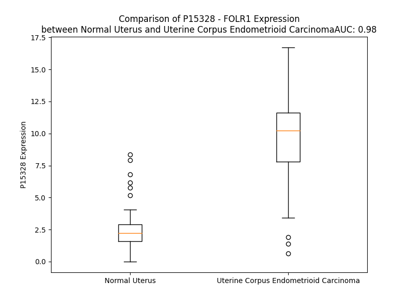

# Detailed Data for P15328

## Introduction to the Detailed Summary

### How to Interpret the Results

- **Summary & Metrics**: This section provides a quick reference to essential protein attributes, including expression changes, family classification, and biomarker applications. Regulation status (upregulated/downregulated) indicates the protein's behavior in a disease context. Some information comes from the original excel file with the proteins selected from literature, while others are derived from the analyses.
- **Expression Comparison**: A visual representation comparing protein expression between normal and disease states. It highlights significant changes in expression levels that might indicate diagnostic or therapeutic relevance. This is data coming from transcriptomics experiments and could not translate similarly to protein levels.
- **Isoform Alignment**: An interactive view of isoform alignments, revealing structural and functional differences between variants of the protein.
- **Interactors & Homologs**: Tables listing known interaction partners and homologous proteins, the more interactors and homologs, the more complex the protein is to design an antibody for.
- **Biological Assemblies**: Information about the structural arrangement of the protein in different assemblies, providing insights into its functional state but also the complexity of the protein to develop antibodies.
- **Combined Per-Residue Information**: A detailed table summarizing residue-level data. This includes predictions for epitope regions, aggregation tendencies, and modifications that might impact the protein's function. Each row corresponds to a residue in the protein, providing insights into specific sites that may be important for research or drug development.
## Summary & Metrics

- **UniProt Accession**: P15328
- **Gene Name**: FOLR1
- **Protein Name**: Folate receptor alpha
- **Swiss Prot**: FOLR1_HUMAN
- **Family**: transporter
- **Biomarker Application**: diagnosis
- **Number of Isoforms**: 0
- **Regulation**: 1
- **(transcriptomics) AUC**: 0.98
- **(transcriptomics) Fold Change**: 4.10
- **(transcriptomics) Regulation**: Upregulated
- **Discotope Epitope Count**: 52
- **Max n_uniprots (Homo)**: 1
- **Max n_uniprots (Hetero)**: N/A

## Expression Comparison

## Interactors

| preferredName_A   | preferredName_B   | score   |
|-------------------|-------------------|---------|

## Homologs

| uniprot_id   | gene_id   |
|:-------------|:----------|
| F5H3Z4       | FOLR2     |
| A0A087WYI3   | FOLR3     |
| A6ND01       | IZUMO1R   |
| K7ESG0       | RTBDN     |

## Biological Assemblies

|   Unnamed: 0 |   assembly |   n_uniprots | composition   | crystal_id   |
|-------------:|-----------:|-------------:|:--------------|:-------------|
|            0 |          1 |            1 | Homo          | 4km6         |
|            0 |          1 |            1 | Homo          | 4kmx         |
|            0 |          1 |            1 | Homo          | 4km7         |
|            1 |          2 |            1 | Homo          | 4km7         |
|            0 |          1 |            1 | Homo          | 4lrh         |
|            1 |          2 |            1 | Homo          | 4lrh         |
|            2 |          3 |            1 | Homo          | 4lrh         |
|            3 |          4 |            1 | Homo          | 4lrh         |
|            4 |          5 |            1 | Homo          | 4lrh         |
|            5 |          6 |            1 | Homo          | 4lrh         |
|            6 |          7 |            1 | Homo          | 4lrh         |
|            7 |          8 |            1 | Homo          | 4lrh         |
|            0 |          1 |            1 | Homo          | 5izq         |
|            1 |          2 |            1 | Homo          | 5izq         |
|            2 |          3 |            1 | Homo          | 5izq         |
|            3 |          4 |            1 | Homo          | 5izq         |
|            4 |          5 |            1 | Homo          | 5izq         |
|            5 |          6 |            1 | Homo          | 5izq         |
|            6 |          7 |            1 | Homo          | 5izq         |
|            7 |          8 |            1 | Homo          | 5izq         |

## Combined Per-Residue Information

|   res | aa   |   epitope_score | epitope   |   relative_surface_accessibility |   modeling_confidence |   Aggregation | modification   | glycosylation                   |
|------:|:-----|----------------:|:----------|---------------------------------:|----------------------:|--------------:|:---------------|:--------------------------------|
|     1 | M    |         0.10407 | False     |                          1.0684  |                 65.78 |         0     | N/A            | N/A                             |
|     2 | A    |         0.09534 | False     |                          0.73265 |                 76.95 |         0     | N/A            | N/A                             |
|     3 | Q    |         0.1024  | False     |                          0.77491 |                 76.89 |         0     | N/A            | N/A                             |
|     4 | R    |         0.08772 | False     |                          0.48303 |                 76.45 |         0     | N/A            | N/A                             |
|     5 | M    |         0.12258 | False     |                          0.63747 |                 76.65 |         6.502 | N/A            | N/A                             |
|     6 | T    |         0.04789 | False     |                          0.54001 |                 80.19 |        12.2   | N/A            | N/A                             |
|     7 | T    |         0.06054 | False     |                          0.50587 |                 80.09 |        13.791 | N/A            | N/A                             |
|     8 | Q    |         0.08172 | False     |                          0.05581 |                 77.41 |        16.464 | N/A            | N/A                             |
|     9 | L    |         0.09498 | False     |                          0.6059  |                 83.3  |        84.708 | N/A            | N/A                             |
|    10 | L    |         0.03165 | False     |                          0.61566 |                 84.25 |        97.204 | N/A            | N/A                             |
|    11 | L    |         0.07337 | False     |                          0.55933 |                 82.7  |        99.491 | N/A            | N/A                             |
|    12 | L    |         0.10181 | False     |                          0.17229 |                 81.32 |        99.909 | N/A            | N/A                             |
|    13 | L    |         0.0703  | False     |                          0.63562 |                 84.1  |        99.985 | N/A            | N/A                             |
|    14 | V    |         0.0319  | False     |                          0.65057 |                 83.46 |        99.996 | N/A            | N/A                             |
|    15 | W    |         0.06657 | False     |                          0.25724 |                 78.96 |        99.967 | N/A            | N/A                             |
|    16 | V    |         0.06259 | False     |                          0.6265  |                 83.22 |        99.839 | N/A            | N/A                             |
|    17 | A    |         0.03906 | False     |                          0.51031 |                 82.18 |        98.326 | N/A            | N/A                             |
|    18 | V    |         0.03286 | False     |                          0.60513 |                 80.29 |        97.045 | N/A            | N/A                             |
|    19 | V    |         0.08005 | False     |                          0.1628  |                 76.79 |        81.965 | N/A            | N/A                             |
|    20 | G    |         0.05995 | False     |                          0.35357 |                 78.01 |         6.772 | N/A            | N/A                             |
|    21 | E    |         0.06626 | False     |                          0.49474 |                 75.91 |         0.004 | N/A            | N/A                             |
|    22 | A    |         0.05065 | False     |                          0.31786 |                 74.12 |         0.003 | N/A            | N/A                             |
|    23 | Q    |         0.0845  | False     |                          0.58061 |                 73.56 |         0.003 | N/A            | N/A                             |
|    24 | T    |         0.06485 | False     |                          0.64955 |                 74.1  |         0.003 | N/A            | N/A                             |
|    25 | R    |         0.09196 | False     |                          0.60499 |                 71.3  |         0.003 | N/A            | N/A                             |
|    26 | I    |         0.07852 | False     |                          0.45886 |                 68.38 |         0.003 | N/A            | N/A                             |
|    27 | A    |         0.07804 | False     |                          0.51304 |                 72.59 |         0.001 | N/A            | N/A                             |
|    28 | W    |         0.10083 | False     |                          0.71503 |                 67.03 |         0     | N/A            | N/A                             |
|    29 | A    |         0.06757 | False     |                          0.44468 |                 71.86 |         0     | N/A            | N/A                             |
|    30 | R    |         0.16176 | False     |                          0.33358 |                 71.96 |         0     | N/A            | N/A                             |
|    31 | T    |         0.11006 | False     |                          0.62945 |                 76.8  |         0     | N/A            | N/A                             |
|    32 | E    |         0.11622 | False     |                          0.42082 |                 81.94 |         0     | N/A            | N/A                             |
|    33 | L    |         0.10064 | False     |                          0.29017 |                 90.41 |         0     | N/A            | N/A                             |
|    34 | L    |         0.13643 | False     |                          0.21813 |                 93.17 |         0     | N/A            | N/A                             |
|    35 | N    |         0.14058 | False     |                          0.49499 |                 95.56 |         0     | N/A            | N/A                             |
|    36 | V    |         0.13712 | False     |                          0.32056 |                 96.69 |         0     | N/A            | N/A                             |
|    37 | C    |         0.13673 | False     |                          0.07068 |                 98.01 |         0     | N/A            | N/A                             |
|    38 | M    |         0.07769 | False     |                          0.02714 |                 96.75 |         0     | N/A            | N/A                             |
|    39 | N    |         0.2093  | False     |                          0.57732 |                 95.39 |         0     | N/A            | N/A                             |
|    40 | A    |         0.18316 | False     |                          0.16004 |                 94.88 |         0     | N/A            | N/A                             |
|    41 | K    |         0.40412 | True      |                          0.54277 |                 93.9  |         0     | N/A            | N/A                             |
|    42 | H    |         0.39795 | True      |                          0.13583 |                 96.05 |         0     | N/A            | N/A                             |
|    43 | H    |         0.15524 | False     |                          0.14747 |                 97.77 |         0     | N/A            | N/A                             |
|    44 | K    |         0.13945 | False     |                          0.26469 |                 98.08 |         0     | N/A            | N/A                             |
|    45 | E    |         0.18398 | False     |                          0.7973  |                 96.61 |         0     | N/A            | N/A                             |
|    46 | K    |         0.15782 | False     |                          0.70999 |                 97.15 |         0     | N/A            | N/A                             |
|    47 | P    |         0.07513 | False     |                          0.19541 |                 97.81 |         0     | N/A            | N/A                             |
|    48 | G    |         0.10933 | False     |                          0.1706  |                 97.83 |         0     | N/A            | N/A                             |
|    49 | P    |         0.19984 | False     |                          0.75921 |                 97.66 |         0     | N/A            | N/A                             |
|    50 | E    |         0.17887 | False     |                          0.16581 |                 97.26 |         0     | N/A            | N/A                             |
|    51 | D    |         0.23578 | False     |                          0.72433 |                 94.38 |         0     | N/A            | N/A                             |
|    52 | K    |         0.15787 | False     |                          0.80787 |                 95.55 |         0     | N/A            | N/A                             |
|    53 | L    |         0.04179 | False     |                          0.01767 |                 95.32 |         0     | N/A            | N/A                             |
|    54 | H    |         0.24916 | False     |                          0.30297 |                 95.37 |         0     | N/A            | N/A                             |
|    55 | E    |         0.23314 | False     |                          0.48846 |                 96.83 |         0     | N/A            | N/A                             |
|    56 | Q    |         0.18521 | False     |                          0.14938 |                 98.27 |         0     | N/A            | N/A                             |
|    57 | C    |         0.0096  | False     |                          0.00374 |                 98.51 |         0     | N/A            | N/A                             |
|    58 | R    |         0.16289 | False     |                          0.53855 |                 98.03 |         0     | N/A            | N/A                             |
|    59 | P    |         0.09133 | False     |                          0.09297 |                 98.25 |         0     | N/A            | N/A                             |
|    60 | W    |         0.0291  | False     |                          0.02259 |                 98.45 |         0     | N/A            | N/A                             |
|    61 | R    |         0.21609 | False     |                          0.42104 |                 97.61 |         0     | N/A            | N/A                             |
|    62 | K    |         0.21593 | False     |                          0.80725 |                 96.81 |         0     | N/A            | N/A                             |
|    63 | N    |         0.09234 | False     |                          0.34976 |                 97.48 |         0     | N/A            | N/A                             |
|    64 | A    |         0.00313 | False     |                          0       |                 98.45 |         0     | N/A            | N/A                             |
|    65 | C    |         0.00798 | False     |                          0       |                 98.65 |         0     | N/A            | N/A                             |
|    66 | C    |         0.00296 | False     |                          0       |                 98.47 |         0     | N/A            | N/A                             |
|    67 | S    |         0.13207 | False     |                          0.28717 |                 98.21 |         0     | N/A            | N/A                             |
|    68 | T    |         0.06859 | False     |                          0.23056 |                 97.73 |         0     | N/A            | N/A                             |
|    69 | N    |         0.20061 | False     |                          0.47179 |                 97.8  |         0     | N/A            | N-linked (GlcNAc...) asparagine |
|    70 | T    |         0.04649 | False     |                          0.0429  |                 98.16 |         0     | N/A            | N/A                             |
|    71 | S    |         0.01167 | False     |                          0.0052  |                 98.05 |         0     | N/A            | N/A                             |
|    72 | Q    |         0.23284 | False     |                          0.41766 |                 98.12 |         0     | N/A            | N/A                             |
|    73 | E    |         0.16269 | False     |                          0.06463 |                 97.74 |         0     | N/A            | N/A                             |
|    74 | A    |         0.05374 | False     |                          0.04924 |                 97.07 |         0     | N/A            | N/A                             |
|    75 | H    |         0.14128 | False     |                          0.14099 |                 96.91 |         0     | N/A            | N/A                             |
|    76 | K    |         0.26274 | True      |                          0.50726 |                 95.49 |         0     | N/A            | N/A                             |
|    77 | D    |         0.22983 | False     |                          0.3736  |                 90.78 |         0     | N/A            | N/A                             |
|    78 | V    |         0.45124 | True      |                          0.4977  |                 91.63 |         5.398 | N/A            | N/A                             |
|    79 | S    |         0.17773 | False     |                          0.09511 |                 91.88 |         5.398 | N/A            | N/A                             |
|    80 | Y    |         0.47599 | True      |                          0.50641 |                 90.81 |         5.398 | N/A            | N/A                             |
|    81 | L    |         0.19329 | False     |                          0.01484 |                 92.1  |         5.398 | N/A            | N/A                             |
|    82 | Y    |         0.35767 | True      |                          0.32737 |                 92.85 |         5.398 | N/A            | N/A                             |
|    83 | R    |         0.4577  | True      |                          0.58532 |                 94.27 |         0     | N/A            | N/A                             |
|    84 | F    |         0.31899 | True      |                          0.08086 |                 95.41 |         0     | N/A            | N/A                             |
|    85 | N    |         0.24541 | False     |                          0.1466  |                 96.16 |         0     | N/A            | N/A                             |
|    86 | W    |         0.20797 | False     |                          0.10137 |                 95.15 |         0     | N/A            | N/A                             |
|    87 | N    |         0.19699 | False     |                          0.28141 |                 95.8  |         0     | N/A            | N/A                             |
|    88 | H    |         0.30418 | True      |                          0.13752 |                 96.02 |         0     | N/A            | N/A                             |
|    89 | C    |         0.21609 | False     |                          0.16779 |                 97.18 |         0     | N/A            | N/A                             |
|    90 | G    |         0.15086 | False     |                          0.56852 |                 95.37 |         0     | N/A            | N/A                             |
|    91 | E    |         0.27812 | True      |                          0.80528 |                 95.85 |         0     | N/A            | N/A                             |
|    92 | M    |         0.07323 | False     |                          0.04075 |                 96.93 |         0     | N/A            | N/A                             |
|    93 | A    |         0.10521 | False     |                          0.23961 |                 97.39 |         0     | N/A            | N/A                             |
|    94 | P    |         0.17188 | False     |                          0.79755 |                 97.47 |         0     | N/A            | N/A                             |
|    95 | A    |         0.12926 | False     |                          0.43315 |                 98.21 |         0     | N/A            | N/A                             |
|    96 | C    |         0.00456 | False     |                          0       |                 98.11 |         0     | N/A            | N/A                             |
|    97 | K    |         0.09985 | False     |                          0.19366 |                 97.52 |         0     | N/A            | N/A                             |
|    98 | R    |         0.43241 | True      |                          0.46391 |                 98.22 |         0     | N/A            | N/A                             |
|    99 | H    |         0.13567 | False     |                          0.08562 |                 98.43 |         0     | N/A            | N/A                             |
|   100 | F    |         0.01532 | False     |                          0       |                 97.68 |         0     | N/A            | N/A                             |
|   101 | I    |         0.10391 | False     |                          0.068   |                 98.2  |         0     | N/A            | N/A                             |
|   102 | Q    |         0.10598 | False     |                          0.05587 |                 98.55 |         0     | N/A            | N/A                             |
|   103 | D    |         0.1095  | False     |                          0.04527 |                 98.38 |         0     | N/A            | N/A                             |
|   104 | T    |         0.11766 | False     |                          0.10277 |                 97.89 |         0     | N/A            | N/A                             |
|   105 | C    |         0.00687 | False     |                          0.002   |                 98.56 |         0     | N/A            | N/A                             |
|   106 | L    |         0.00485 | False     |                          0.00082 |                 98.72 |         0     | N/A            | N/A                             |
|   107 | Y    |         0.16918 | False     |                          0.1146  |                 98.37 |         0     | N/A            | N/A                             |
|   108 | E    |         0.0122  | False     |                          0.0068  |                 98.26 |         0     | N/A            | N/A                             |
|   109 | C    |         0.00683 | False     |                          0.00281 |                 98.7  |         0     | N/A            | N/A                             |
|   110 | S    |         0.03098 | False     |                          0.03079 |                 98.58 |         0     | N/A            | N/A                             |
|   111 | P    |         0.0101  | False     |                          0.01889 |                 97.85 |         0     | N/A            | N/A                             |
|   112 | N    |         0.02924 | False     |                          0.0354  |                 97.94 |         0     | N/A            | N/A                             |
|   113 | L    |         0.01705 | False     |                          0.01896 |                 98.31 |         0     | N/A            | N/A                             |
|   114 | G    |         0.03484 | False     |                          0.02106 |                 96.78 |         0     | N/A            | N/A                             |
|   115 | P    |         0.06081 | False     |                          0.0762  |                 95.74 |         0     | N/A            | N/A                             |
|   116 | W    |         0.13307 | False     |                          0.08629 |                 97.46 |         0     | N/A            | N/A                             |
|   117 | I    |         0.16706 | False     |                          0.21036 |                 96.83 |         0     | N/A            | N/A                             |
|   118 | Q    |         0.23116 | False     |                          0.42563 |                 94.99 |         0     | N/A            | N/A                             |
|   119 | Q    |         0.23318 | False     |                          0.68442 |                 95.39 |         0     | N/A            | N/A                             |
|   120 | V    |         0.26104 | True      |                          0.23749 |                 93.45 |         0     | N/A            | N/A                             |
|   121 | D    |         0.37142 | True      |                          0.89756 |                 91.47 |         0     | N/A            | N/A                             |
|   122 | Q    |         0.35685 | True      |                          0.30125 |                 88.75 |         0     | N/A            | N/A                             |
|   123 | S    |         0.52658 | True      |                          0.96778 |                 86.33 |         0     | N/A            | N/A                             |
|   124 | W    |         0.47403 | True      |                          0.43328 |                 84.86 |         0     | N/A            | N/A                             |
|   125 | R    |         0.32091 | True      |                          0.04818 |                 90.77 |         0     | N/A            | N/A                             |
|   126 | K    |         0.34544 | True      |                          0.5658  |                 94.83 |         0     | N/A            | N/A                             |
|   127 | E    |         0.10281 | False     |                          0.12172 |                 97.32 |         0     | N/A            | N/A                             |
|   128 | R    |         0.26681 | True      |                          0.05984 |                 96.6  |         0     | N/A            | N/A                             |
|   129 | V    |         0.01396 | False     |                          0.0019  |                 97.87 |         0     | N/A            | N/A                             |
|   130 | L    |         0.29563 | True      |                          0.25387 |                 97.86 |         0     | N/A            | N/A                             |
|   131 | N    |         0.17614 | False     |                          0.45927 |                 98.19 |         0     | N/A            | N/A                             |
|   132 | V    |         0.00398 | False     |                          0       |                 98.74 |         0     | N/A            | N/A                             |
|   133 | P    |         0.06106 | False     |                          0.08251 |                 98.52 |         0     | N/A            | N/A                             |
|   134 | L    |         0.01032 | False     |                          0       |                 98.65 |         0     | N/A            | N/A                             |
|   135 | C    |         0.00349 | False     |                          0       |                 98.74 |         0     | N/A            | N/A                             |
|   136 | K    |         0.10432 | False     |                          0.43379 |                 98.54 |         0     | N/A            | N/A                             |
|   137 | E    |         0.2037  | False     |                          0.32208 |                 98.35 |         0     | N/A            | N/A                             |
|   138 | D    |         0.09248 | False     |                          0.10048 |                 98.4  |         0     | N/A            | N/A                             |
|   139 | C    |         0.00843 | False     |                          0.00094 |                 98.15 |         0     | N/A            | N/A                             |
|   140 | E    |         0.26331 | True      |                          0.36909 |                 98.57 |         0     | N/A            | N/A                             |
|   141 | Q    |         0.16034 | False     |                          0.44112 |                 98.66 |         0     | N/A            | N/A                             |
|   142 | W    |         0.03035 | False     |                          0.00557 |                 98.58 |         0     | N/A            | N/A                             |
|   143 | W    |         0.10434 | False     |                          0.21933 |                 98.54 |         0     | N/A            | N/A                             |
|   144 | E    |         0.19771 | False     |                          0.36932 |                 98.59 |         0     | N/A            | N/A                             |
|   145 | D    |         0.09657 | False     |                          0.22146 |                 98.56 |         0     | N/A            | N/A                             |
|   146 | C    |         0.01018 | False     |                          0.00401 |                 98.3  |         0     | N/A            | N/A                             |
|   147 | R    |         0.15358 | False     |                          0.45334 |                 95.67 |         0     | N/A            | N/A                             |
|   148 | T    |         0.13778 | False     |                          0.7519  |                 95.06 |         0     | N/A            | N/A                             |
|   149 | S    |         0.03491 | False     |                          0.01456 |                 97.95 |         0     | N/A            | N/A                             |
|   150 | Y    |         0.19498 | False     |                          0.49127 |                 98.31 |         0     | N/A            | N/A                             |
|   151 | T    |         0.01525 | False     |                          0       |                 98.08 |         0     | N/A            | N/A                             |
|   152 | C    |         0.04832 | False     |                          0.04722 |                 98.13 |         0     | N/A            | N/A                             |
|   153 | K    |         0.27651 | True      |                          0.15366 |                 97.23 |         0     | N/A            | N/A                             |
|   154 | S    |         0.18024 | False     |                          0.36495 |                 96.48 |         0     | N/A            | N/A                             |
|   155 | N    |         0.1745  | False     |                          0.14493 |                 97.62 |         0     | N/A            | N/A                             |
|   156 | W    |         0.10776 | False     |                          0.02157 |                 97.17 |         0     | N/A            | N/A                             |
|   157 | H    |         0.56054 | True      |                          0.34543 |                 93.8  |         0     | N/A            | N/A                             |
|   158 | K    |         0.52321 | True      |                          0.65317 |                 93.65 |         0     | N/A            | N/A                             |
|   159 | G    |         0.28501 | True      |                          0.66711 |                 94.45 |         0     | N/A            | N/A                             |
|   160 | W    |         0.32351 | True      |                          0.09337 |                 96.36 |         0     | N/A            | N/A                             |
|   161 | N    |         0.19348 | False     |                          0.30036 |                 96.68 |         0     | N/A            | N-linked (GlcNAc...) asparagine |
|   162 | W    |         0.40615 | True      |                          0.50375 |                 95.12 |         0     | N/A            | N/A                             |
|   163 | T    |         0.59298 | True      |                          0.93221 |                 95.37 |         0     | N/A            | N/A                             |
|   164 | S    |         0.33982 | True      |                          0.39681 |                 93.3  |         0     | N/A            | N/A                             |
|   165 | G    |         0.35672 | True      |                          0.40452 |                 93.77 |         0     | N/A            | N/A                             |
|   166 | F    |         0.39247 | True      |                          0.32216 |                 95.78 |         0     | N/A            | N/A                             |
|   167 | N    |         0.03462 | False     |                          0.00191 |                 96.62 |         0     | N/A            | N/A                             |
|   168 | K    |         0.29338 | True      |                          0.45939 |                 97.24 |         0     | N/A            | N/A                             |
|   169 | C    |         0.11382 | False     |                          0.16819 |                 97.84 |         0     | N/A            | N/A                             |
|   170 | A    |         0.15143 | False     |                          0.45977 |                 95.64 |         0     | N/A            | N/A                             |
|   171 | V    |         0.29215 | True      |                          1.01583 |                 93.23 |         0     | N/A            | N/A                             |
|   172 | G    |         0.25959 | True      |                          0.98117 |                 93.25 |         0     | N/A            | N/A                             |
|   173 | A    |         0.29961 | True      |                          0.38015 |                 96.28 |         0     | N/A            | N/A                             |
|   174 | A    |         0.20735 | False     |                          0.53702 |                 95.59 |         0     | N/A            | N/A                             |
|   175 | C    |         0.23247 | False     |                          0.40589 |                 97.96 |         0     | N/A            | N/A                             |
|   176 | Q    |         0.29732 | True      |                          0.30308 |                 97.9  |         0     | N/A            | N/A                             |
|   177 | P    |         0.14832 | False     |                          0.22963 |                 97.25 |         0     | N/A            | N/A                             |
|   178 | F    |         0.02745 | False     |                          0.01417 |                 97.11 |         0     | N/A            | N/A                             |
|   179 | H    |         0.20491 | False     |                          0.47876 |                 96.38 |         0     | N/A            | N/A                             |
|   180 | F    |         0.32973 | True      |                          0.65918 |                 97.64 |         0     | N/A            | N/A                             |
|   181 | Y    |         0.22778 | False     |                          0.19815 |                 97.35 |         0     | N/A            | N/A                             |
|   182 | F    |         0.00888 | False     |                          0.00137 |                 98.05 |         0     | N/A            | N/A                             |
|   183 | P    |         0.27464 | True      |                          0.58958 |                 97.82 |         0     | N/A            | N/A                             |
|   184 | T    |         0.24534 | False     |                          0.42299 |                 98.3  |         0     | N/A            | N/A                             |
|   185 | P    |         0.06309 | False     |                          0.22367 |                 98.14 |         0     | N/A            | N/A                             |
|   186 | T    |         0.13569 | False     |                          0.46179 |                 98.42 |         0     | N/A            | N/A                             |
|   187 | V    |         0.16062 | False     |                          0.3218  |                 98.36 |         0     | N/A            | N/A                             |
|   188 | L    |         0.00927 | False     |                          0.00165 |                 98.32 |         0     | N/A            | N/A                             |
|   189 | C    |         0.01116 | False     |                          0.00296 |                 98.27 |         0     | N/A            | N/A                             |
|   190 | N    |         0.21404 | False     |                          0.17873 |                 98.65 |         0     | N/A            | N/A                             |
|   191 | E    |         0.3304  | True      |                          0.29456 |                 98.44 |         0     | N/A            | N/A                             |
|   192 | I    |         0.01465 | False     |                          0       |                 98.19 |         0     | N/A            | N/A                             |
|   193 | W    |         0.26476 | True      |                          0.14248 |                 97.5  |         0     | N/A            | N/A                             |
|   194 | T    |         0.26151 | True      |                          0.27181 |                 96.91 |         0     | N/A            | N/A                             |
|   195 | H    |         0.24984 | False     |                          0.43668 |                 98.01 |         0     | N/A            | N/A                             |
|   196 | S    |         0.05868 | False     |                          0.02894 |                 98.38 |         0     | N/A            | N/A                             |
|   197 | Y    |         0.03283 | False     |                          0.01067 |                 98.65 |         0     | N/A            | N/A                             |
|   198 | K    |         0.09317 | False     |                          0.56062 |                 98.35 |         0     | N/A            | N/A                             |
|   199 | V    |         0.09907 | False     |                          0.21816 |                 98.08 |         0     | N/A            | N/A                             |
|   200 | S    |         0.15323 | False     |                          0.09497 |                 98.01 |         0     | N/A            | N/A                             |
|   201 | N    |         0.26147 | True      |                          0.92776 |                 97.61 |         0     | N/A            | N-linked (GlcNAc...) asparagine |
|   202 | Y    |         0.17747 | False     |                          0.45835 |                 98.41 |         0     | N/A            | N/A                             |
|   203 | S    |         0.0859  | False     |                          0.45699 |                 98.16 |         0     | N/A            | N/A                             |
|   204 | R    |         0.29588 | True      |                          0.37625 |                 97.89 |         0     | N/A            | N/A                             |
|   205 | G    |         0.22547 | False     |                          0.781   |                 96.11 |         0     | N/A            | N/A                             |
|   206 | S    |         0.27898 | True      |                          0.36439 |                 97.5  |         0     | N/A            | N/A                             |
|   207 | G    |         0.10915 | False     |                          0.08033 |                 97.01 |         0     | N/A            | N/A                             |
|   208 | R    |         0.28265 | True      |                          0.37989 |                 97.83 |         0     | N/A            | N/A                             |
|   209 | C    |         0.04495 | False     |                          0.01835 |                 98.69 |         3.696 | N/A            | N/A                             |
|   210 | I    |         0.00357 | False     |                          0.0016  |                 98.76 |         7.286 | N/A            | N/A                             |
|   211 | Q    |         0.08242 | False     |                          0.06594 |                 98.53 |         7.286 | N/A            | N/A                             |
|   212 | M    |         0.0621  | False     |                          0.02517 |                 97.71 |         7.286 | N/A            | N/A                             |
|   213 | W    |         0.27196 | True      |                          0.32366 |                 98.34 |         7.286 | N/A            | N/A                             |
|   214 | F    |         0.09284 | False     |                          0.02706 |                 97.99 |         7.006 | N/A            | N/A                             |
|   215 | D    |         0.29742 | True      |                          0.34456 |                 96    |         0     | N/A            | N/A                             |
|   216 | P    |         0.27365 | True      |                          0.40065 |                 93.49 |         0     | N/A            | N/A                             |
|   217 | A    |         0.39971 | True      |                          0.88727 |                 94.93 |         0     | N/A            | N/A                             |
|   218 | Q    |         0.41356 | True      |                          0.77936 |                 95.13 |         0     | N/A            | N/A                             |
|   219 | G    |         0.18253 | False     |                          0.43492 |                 95.1  |         0     | N/A            | N/A                             |
|   220 | N    |         0.07158 | False     |                          0.21571 |                 97.3  |         0     | N/A            | N/A                             |
|   221 | P    |         0.14985 | False     |                          0.29282 |                 97.89 |         0     | N/A            | N/A                             |
|   222 | N    |         0.01638 | False     |                          0.00086 |                 98.26 |         0     | N/A            | N/A                             |
|   223 | E    |         0.16188 | False     |                          0.42106 |                 96.61 |         0     | N/A            | N/A                             |
|   224 | E    |         0.17928 | False     |                          0.52501 |                 96.23 |         0     | N/A            | N/A                             |
|   225 | V    |         0.01978 | False     |                          0.01428 |                 97.84 |         0     | N/A            | N/A                             |
|   226 | A    |         0.00253 | False     |                          0       |                 96.82 |         0     | N/A            | N/A                             |
|   227 | R    |         0.20411 | False     |                          0.43182 |                 94.36 |         0     | N/A            | N/A                             |
|   228 | F    |         0.29617 | True      |                          0.37794 |                 94.21 |         1.13  | N/A            | N/A                             |
|   229 | Y    |         0.21836 | False     |                          0.23195 |                 94.16 |         1.13  | N/A            | N/A                             |
|   230 | A    |         0.01065 | False     |                          0       |                 91.25 |         1.13  | N/A            | N/A                             |
|   231 | A    |         0.08233 | False     |                          0.28668 |                 86.66 |         1.13  | N/A            | N/A                             |
|   232 | A    |         0.13277 | False     |                          0.6602  |                 83.01 |         1.13  | N/A            | N/A                             |
|   233 | M    |         0.27922 | True      |                          0.6306  |                 77.3  |         0.602 | N/A            | N/A                             |
|   234 | S    |         0.13945 | False     |                          0.21759 |                 65.6  |         0     | N/A            | N/A                             |
|   235 | G    |         0.1504  | False     |                          0.4901  |                 54.03 |         0     | N/A            | N/A                             |
|   236 | A    |         0.18882 | False     |                          0.69082 |                 50.75 |         0     | N/A            | N/A                             |
|   237 | G    |         0.17108 | False     |                          0.42387 |                 51.22 |         0     | N/A            | N/A                             |
|   238 | P    |         0.16122 | False     |                          0.92728 |                 50.1  |         0     | N/A            | N/A                             |
|   239 | W    |         0.19555 | False     |                          0.88285 |                 49.89 |         0     | N/A            | N/A                             |
|   240 | A    |         0.20651 | False     |                          0.3888  |                 52.67 |         0     | N/A            | N/A                             |
|   241 | A    |         0.18566 | False     |                          0.44097 |                 56.47 |         0     | N/A            | N/A                             |
|   242 | W    |         0.17784 | False     |                          0.65485 |                 56.76 |         0     | N/A            | N/A                             |
|   243 | P    |         0.22217 | False     |                          0.6045  |                 61.85 |         1.072 | N/A            | N/A                             |
|   244 | F    |         0.14015 | False     |                          0.48006 |                 63.75 |        88.471 | N/A            | N/A                             |
|   245 | L    |         0.10149 | False     |                          0.67857 |                 67.03 |        95.597 | N/A            | N/A                             |
|   246 | L    |         0.05248 | False     |                          0.59495 |                 68.06 |        96.902 | N/A            | N/A                             |
|   247 | S    |         0.04466 | False     |                          0.27103 |                 68.8  |        97.141 | N/A            | N/A                             |
|   248 | L    |         0.06221 | False     |                          0.37013 |                 69.24 |        99.066 | N/A            | N/A                             |
|   249 | A    |         0.0311  | False     |                          0.41899 |                 71.68 |        99.413 | N/A            | N/A                             |
|   250 | L    |         0.05494 | False     |                          0.69649 |                 72.91 |        99.822 | N/A            | N/A                             |
|   251 | M    |         0.11093 | False     |                          0.24657 |                 67.36 |        99.873 | N/A            | N/A                             |
|   252 | L    |         0.05294 | False     |                          0.50038 |                 70.72 |        99.907 | N/A            | N/A                             |
|   253 | L    |         0.05357 | False     |                          0.66743 |                 72.3  |        99.764 | N/A            | N/A                             |
|   254 | W    |         0.0849  | False     |                          0.72964 |                 66.92 |        98.981 | N/A            | N/A                             |
|   255 | L    |         0.15457 | False     |                          0.30545 |                 63.2  |        95.73  | N/A            | N/A                             |
|   256 | L    |         0.08095 | False     |                          0.93304 |                 71.73 |        89.261 | N/A            | N/A                             |
|   257 | S    |         0.03773 | False     |                          0.78313 |                 67.46 |         0     | N/A            | N/A                             |

