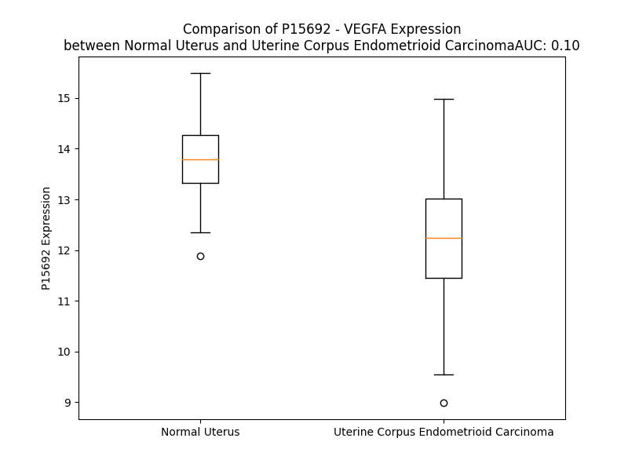

# Detailed Data for P15692

## Introduction to the Detailed Summary

### How to Interpret the Results

- **Summary & Metrics**: This section provides a quick reference to essential protein attributes, including expression changes, family classification, and biomarker applications. Regulation status (upregulated/downregulated) indicates the protein's behavior in a disease context. Some information comes from the original excel file with the proteins selected from literature, while others are derived from the analyses.
- **Expression Comparison**: A visual representation comparing protein expression between normal and disease states. It highlights significant changes in expression levels that might indicate diagnostic or therapeutic relevance. This is data coming from transcriptomics experiments and could not translate similarly to protein levels.
- **Isoform Alignment**: An interactive view of isoform alignments, revealing structural and functional differences between variants of the protein.
- **Interactors & Homologs**: Tables listing known interaction partners and homologous proteins, the more interactors and homologs, the more complex the protein is to design an antibody for.
- **Biological Assemblies**: Information about the structural arrangement of the protein in different assemblies, providing insights into its functional state but also the complexity of the protein to develop antibodies.
- **Combined Per-Residue Information**: A detailed table summarizing residue-level data. This includes predictions for epitope regions, aggregation tendencies, and modifications that might impact the protein's function. Each row corresponds to a residue in the protein, providing insights into specific sites that may be important for research or drug development.
## Summary & Metrics

- **UniProt Accession**: P15692
- **Gene Name**: VEGF 
- **Protein Name**: Vascular endothelial growth factor A 
- **Swiss Prot**: VEGFA_HUMAN
- **Family**: growth factor
- **Biomarker Application**: diagnosis,efficacy,prognosis,response to therapy,safety,unspecified application
- **Number of Isoforms**: 0
- **Regulation**: 2
- **(transcriptomics) AUC**: 0.12
- **(transcriptomics) Fold Change**: 1.13
- **(transcriptomics) Regulation**: Downregulated
- **Discotope Epitope Count**: 50
- **Max n_uniprots (Homo)**: 4.0
- **Max n_uniprots (Hetero)**: 8.0

## Expression Comparison

## Biological Assemblies

|   Unnamed: 0 |   assembly |   n_uniprots | composition   | crystal_id   |
|-------------:|-----------:|-------------:|:--------------|:-------------|
|            0 |          1 |            2 | Homo          | 2vpf         |
|            1 |          2 |            2 | Homo          | 2vpf         |
|            2 |          3 |            2 | Homo          | 2vpf         |
|            3 |          4 |            2 | Homo          | 2vpf         |
|            0 |          1 |            2 | Homo          | 6zbr         |
|            0 |          1 |            2 | Homo          | 4zff         |
|            0 |          1 |            2 | Hetero        | 5dn2         |
|            1 |          2 |            1 | Homo          | 5dn2         |
|            2 |          3 |            2 | Hetero        | 5dn2         |
|            3 |          4 |            2 | Hetero        | 5dn2         |
|            0 |          1 |            1 | Homo          | 2vgh         |
|            0 |          1 |            2 | Homo          | 6zcd         |
|            0 |          1 |            2 | Homo          | 6zfl         |
|            0 |          1 |            2 | Homo          | 5fv1         |
|            0 |          1 |            1 | Homo          | 1kmx         |
|            0 |          1 |            0 | Hetero        | 3bdy         |
|            1 |          2 |            1 | Homo          | 3bdy         |
|            0 |          1 |            2 | Homo          | 1cz8         |
|            0 |          1 |            1 | Homo          | 2fjh         |
|            1 |          2 |            1 | Homo          | 2fjh         |
|            0 |          1 |            2 | Homo          | 6z3f         |
|            0 |          1 |            2 | Homo          | 6v7k         |
|            0 |          1 |            2 | Hetero        | 3v2a         |
|            0 |          1 |            4 | Hetero        | 4qaf         |
|            0 |          1 |            1 | Homo          | 7kf1         |
|            1 |          2 |            1 | Homo          | 7kf1         |
|            2 |          3 |            2 | Homo          | 7kf1         |
|            3 |          4 |            2 | Homo          | 7kf1         |
|            0 |          1 |            4 | Homo          | 7ll9         |
|            0 |          1 |            2 | Homo          | 7kf0         |
|            0 |          1 |            2 | Homo          | 1mjv         |
|            0 |          1 |            1 | Homo          | 3p9w         |
|            1 |          2 |            1 | Homo          | 3p9w         |
|            2 |          3 |            1 | Homo          | 3p9w         |
|            3 |          4 |            1 | Homo          | 3p9w         |
|            0 |          1 |            2 | Homo          | 6d3o         |
|            0 |          1 |            2 | Homo          | 1mkg         |
|            1 |          2 |            2 | Homo          | 1mkg         |
|            2 |          3 |            4 | Homo          | 1mkg         |
|            0 |          1 |            1 | Homo          | 1vgh         |
|            0 |          1 |            2 | Homo          | 5hhc         |
|            0 |          1 |            2 | Homo          | 2qr0         |
|            1 |          2 |            2 | Homo          | 2qr0         |
|            2 |          3 |            2 | Homo          | 2qr0         |
|            3 |          4 |            2 | Homo          | 2qr0         |
|            0 |          1 |            2 | Homo          | 1vpp         |
|            0 |          1 |            2 | Homo          | 1kat         |
|            0 |          1 |            6 | Hetero        | 6bft         |
|            0 |          1 |            4 | Hetero        | 5t89         |
|            0 |          1 |            2 | Homo          | 4wpb         |
|            0 |          1 |            2 | Homo          | 6z13         |
|            0 |          1 |            2 | Homo          | 4gls         |
|            0 |          1 |            2 | Homo          | 1mkk         |
|            0 |          1 |            2 | Homo          | 1tzh         |
|            0 |          1 |            1 | Homo          | 4kzn         |
|            0 |          1 |            2 | Homo          | 5hhd         |
|            1 |          2 |            0 | Hetero        | 5hhd         |
|            0 |          1 |            1 | Homo          | 7kez         |
|            0 |          1 |            2 | Homo          | 7ll8         |
|            0 |          1 |            2 | Homo          | 2fjg         |
|            1 |          2 |            2 | Homo          | 2fjg         |
|            0 |          1 |            6 | Hetero        | 5o4e         |
|            0 |          1 |            2 | Homo          | 4gln         |
|            0 |          1 |            2 | Homo          | 3qtk         |
|            1 |          2 |            2 | Homo          | 3qtk         |
|            2 |          3 |            2 | Homo          | 3qtk         |
|            0 |          1 |            4 | Hetero        | 1qty         |
|            1 |          2 |            4 | Hetero        | 1qty         |
|            2 |          3 |            8 | Hetero        | 1qty         |
|            0 |          1 |            1 | Homo          | 3s1b         |
|            0 |          1 |            2 | Homo          | 1vpf         |
|            1 |          2 |            2 | Homo          | 1vpf         |
|            0 |          1 |            2 | Homo          | 5fv2         |
|            1 |          2 |            1 | Homo          | 5fv2         |
|            0 |          1 |            4 | Hetero        | 1flt         |
|            1 |          2 |            4 | Hetero        | 1flt         |
|            0 |          1 |            2 | Homo          | 4deq         |
|            1 |          2 |            1 | Homo          | 4deq         |
|            2 |          3 |            1 | Homo          | 4deq         |
|            0 |          1 |            2 | Homo          | 3s1k         |
|            0 |          1 |            2 | Homo          | 1bj1         |
|            0 |          1 |            1 | Homo          | 1tzi         |

## Combined Per-Residue Information

|   res | aa   |   epitope_score | epitope   |   relative_surface_accessibility |   modeling_confidence |   Aggregation | modification   | glycosylation   |
|------:|:-----|----------------:|:----------|---------------------------------:|----------------------:|--------------:|:---------------|:----------------|
|     1 | M    |         0.11154 | False     |                          1.13875 |                 61    |         0.001 | N/A            | N/A             |
|     2 | N    |         0.24824 | False     |                          0.8061  |                 67.08 |         6.181 | N/A            | N/A             |
|     3 | F    |         0.15392 | False     |                          0.91046 |                 71.43 |        68.984 | N/A            | N/A             |
|     4 | L    |         0.14514 | False     |                          0.84719 |                 77.34 |        79.487 | N/A            | N/A             |
|     5 | L    |         0.15117 | False     |                          0.78335 |                 76.56 |        81.398 | N/A            | N/A             |
|     6 | S    |         0.10691 | False     |                          0.38948 |                 77.15 |        81.747 | N/A            | N/A             |
|     7 | W    |         0.12616 | False     |                          0.86004 |                 81.12 |        84.565 | N/A            | N/A             |
|     8 | V    |         0.08831 | False     |                          0.69402 |                 84.82 |        85.207 | N/A            | N/A             |
|     9 | H    |         0.09502 | False     |                          0.71097 |                 84.34 |        84.772 | N/A            | N/A             |
|    10 | W    |         0.14549 | False     |                          0.8292  |                 85.4  |        90.351 | N/A            | N/A             |
|    11 | S    |         0.10289 | False     |                          0.42276 |                 86.87 |        90.993 | N/A            | N/A             |
|    12 | L    |         0.07656 | False     |                          0.6476  |                 87.51 |        96.849 | N/A            | N/A             |
|    13 | A    |         0.07137 | False     |                          0.504   |                 87.81 |        97.867 | N/A            | N/A             |
|    14 | L    |         0.08609 | False     |                          0.70307 |                 87.97 |        98.889 | N/A            | N/A             |
|    15 | L    |         0.08381 | False     |                          0.74762 |                 87.84 |        98.843 | N/A            | N/A             |
|    16 | L    |         0.13443 | False     |                          0.59825 |                 87.47 |        98.56  | N/A            | N/A             |
|    17 | Y    |         0.20391 | False     |                          0.71162 |                 86.36 |        96.767 | N/A            | N/A             |
|    18 | L    |         0.14191 | False     |                          0.60057 |                 83.22 |        82.058 | N/A            | N/A             |
|    19 | H    |         0.10912 | False     |                          0.56174 |                 80.63 |         0.704 | N/A            | N/A             |
|    20 | H    |         0.16471 | False     |                          0.68359 |                 75.35 |         0.001 | N/A            | N/A             |
|    21 | A    |         0.09271 | False     |                          0.31599 |                 71.07 |         0     | N/A            | N/A             |
|    22 | K    |         0.18606 | False     |                          0.76099 |                 71.57 |         0     | N/A            | N/A             |
|    23 | W    |         0.19943 | False     |                          0.81029 |                 62.69 |         0     | N/A            | N/A             |
|    24 | S    |         0.09569 | False     |                          0.51974 |                 58.66 |         0     | N/A            | N/A             |
|    25 | Q    |         0.13545 | False     |                          0.70151 |                 56.55 |         0     | N/A            | N/A             |
|    26 | A    |         0.21792 | False     |                          0.8533  |                 55.01 |         0     | N/A            | N/A             |
|    27 | A    |         0.08432 | False     |                          0.55987 |                 48.48 |         0     | N/A            | N/A             |
|    28 | P    |         0.14597 | False     |                          0.96036 |                 53.76 |         0     | N/A            | N/A             |
|    29 | M    |         0.2297  | False     |                          0.87816 |                 44.05 |         0     | N/A            | N/A             |
|    30 | A    |         0.16947 | False     |                          0.89963 |                 46.19 |         0     | N/A            | N/A             |
|    31 | E    |         0.19745 | False     |                          0.87904 |                 46.91 |         0     | N/A            | N/A             |
|    32 | G    |         0.20183 | False     |                          1.0724  |                 38.32 |         0     | N/A            | N/A             |
|    33 | G    |         0.16641 | False     |                          0.72602 |                 38.85 |         0     | N/A            | N/A             |
|    34 | G    |         0.20363 | False     |                          1.04993 |                 36.26 |         0     | N/A            | N/A             |
|    35 | Q    |         0.15967 | False     |                          0.77136 |                 50.44 |         0     | N/A            | N/A             |
|    36 | N    |         0.17635 | False     |                          1.07246 |                 50.61 |         0     | N/A            | N/A             |
|    37 | H    |         0.24569 | False     |                          0.84592 |                 61.87 |         0     | N/A            | N/A             |
|    38 | H    |         0.24741 | False     |                          0.87705 |                 75.5  |         0     | N/A            | N/A             |
|    39 | E    |         0.28817 | True      |                          0.82017 |                 85.55 |         0.268 | N/A            | N/A             |
|    40 | V    |         0.25739 | False     |                          0.82281 |                 90.48 |        17.599 | N/A            | N/A             |
|    41 | V    |         0.17635 | False     |                          0.56516 |                 92.64 |        19.106 | N/A            | N/A             |
|    42 | K    |         0.24567 | False     |                          0.75469 |                 96.28 |        19.106 | N/A            | N/A             |
|    43 | F    |         0.28981 | True      |                          0.77505 |                 96.51 |        19.106 | N/A            | N/A             |
|    44 | M    |         0.16527 | False     |                          0.66292 |                 97.24 |        18.981 | N/A            | N/A             |
|    45 | D    |         0.1001  | False     |                          0.30734 |                 96.08 |        18.838 | N/A            | N/A             |
|    46 | V    |         0.16546 | False     |                          0.54123 |                 96.62 |        18.838 | N/A            | N/A             |
|    47 | Y    |         0.25047 | False     |                          0.40287 |                 95.58 |        17.975 | N/A            | N/A             |
|    48 | Q    |         0.15286 | False     |                          0.63663 |                 95.59 |         0.621 | N/A            | N/A             |
|    49 | R    |         0.25134 | False     |                          0.67827 |                 96.17 |         0     | N/A            | N/A             |
|    50 | S    |         0.13536 | False     |                          0.31601 |                 96.59 |         0     | N/A            | N/A             |
|    51 | Y    |         0.17561 | False     |                          0.37965 |                 97.35 |         0     | N/A            | N/A             |
|    52 | C    |         0.04851 | False     |                          0.06392 |                 98.03 |         0     | N/A            | N/A             |
|    53 | H    |         0.14873 | False     |                          0.36532 |                 97.67 |         0     | N/A            | N/A             |
|    54 | P    |         0.16768 | False     |                          0.27026 |                 98.11 |         0     | N/A            | N/A             |
|    55 | I    |         0.24805 | False     |                          0.49038 |                 97.43 |         0     | N/A            | N/A             |
|    56 | E    |         0.13619 | False     |                          0.61131 |                 97.7  |         0     | N/A            | N/A             |
|    57 | T    |         0.14831 | False     |                          0.37053 |                 97.81 |         0     | N/A            | N/A             |
|    58 | L    |         0.19438 | False     |                          0.76979 |                 97.78 |         0     | N/A            | N/A             |
|    59 | V    |         0.06628 | False     |                          0.11044 |                 96.77 |         0     | N/A            | N/A             |
|    60 | D    |         0.18627 | False     |                          0.29255 |                 96.43 |         0     | N/A            | N/A             |
|    61 | I    |         0.00889 | False     |                          0       |                 95.67 |         0     | N/A            | N/A             |
|    62 | F    |         0.25886 | False     |                          0.37326 |                 93.7  |         0     | N/A            | N/A             |
|    63 | Q    |         0.33278 | True      |                          0.69305 |                 93.44 |         0     | N/A            | N/A             |
|    64 | E    |         0.32606 | True      |                          0.32209 |                 94.18 |         0     | N/A            | N/A             |
|    65 | Y    |         0.25257 | False     |                          0.31703 |                 94.17 |         0     | N/A            | N/A             |
|    66 | P    |         0.33339 | True      |                          0.63722 |                 93.03 |         0     | N/A            | N/A             |
|    67 | D    |         0.39274 | True      |                          0.82978 |                 91.63 |         0     | N/A            | N/A             |
|    68 | E    |         0.37863 | True      |                          0.20721 |                 87    |         0     | N/A            | N/A             |
|    69 | I    |         0.46161 | True      |                          0.85405 |                 87.66 |         0     | N/A            | N/A             |
|    70 | E    |         0.52814 | True      |                          0.55865 |                 89.38 |         0     | N/A            | N/A             |
|    71 | Y    |         0.42111 | True      |                          0.20658 |                 92.26 |         0     | N/A            | N/A             |
|    72 | I    |         0.20652 | False     |                          0.55038 |                 93.08 |         0     | N/A            | N/A             |
|    73 | F    |         0.09575 | False     |                          0.03247 |                 95.72 |         0     | N/A            | N/A             |
|    74 | K    |         0.27118 | False     |                          0.62791 |                 95.26 |         0     | N/A            | N/A             |
|    75 | P    |         0.19548 | False     |                          0.50783 |                 97.12 |         0     | N/A            | N/A             |
|    76 | S    |         0.16482 | False     |                          0.49983 |                 95.84 |         0     | N/A            | N/A             |
|    77 | C    |         0.2424  | False     |                          0.35044 |                 96.77 |         0     | N/A            | N/A             |
|    78 | V    |         0.02321 | False     |                          0.01142 |                 97.24 |         0     | N/A            | N/A             |
|    79 | P    |         0.13159 | False     |                          0.45748 |                 97.66 |         0     | N/A            | N/A             |
|    80 | L    |         0.02565 | False     |                          0.01649 |                 97.74 |         0     | N/A            | N/A             |
|    81 | M    |         0.15395 | False     |                          0.33646 |                 98.06 |         0     | N/A            | N/A             |
|    82 | R    |         0.26606 | False     |                          0.14987 |                 97.99 |         0     | N/A            | N/A             |
|    83 | C    |         0.05415 | False     |                          0.1949  |                 97.88 |         0     | N/A            | N/A             |
|    84 | G    |         0.20541 | False     |                          0.21651 |                 96.75 |         0     | N/A            | N/A             |
|    85 | G    |         0.14036 | False     |                          0.64062 |                 96.4  |         0     | N/A            | N/A             |
|    86 | C    |         0.2842  | True      |                          0.48828 |                 96.51 |         0     | N/A            | N/A             |
|    87 | C    |         0.12926 | False     |                          0.18559 |                 97.07 |         0     | N/A            | N/A             |
|    88 | N    |         0.31956 | True      |                          0.62392 |                 93.74 |         0     | N/A            | N/A             |
|    89 | D    |         0.37018 | True      |                          0.53774 |                 93.88 |         0     | N/A            | N/A             |
|    90 | E    |         0.31887 | True      |                          0.85566 |                 91.53 |         0     | N/A            | N/A             |
|    91 | G    |         0.29774 | True      |                          0.57363 |                 92.75 |         0     | N/A            | N/A             |
|    92 | L    |         0.2463  | False     |                          0.27831 |                 95.99 |         0     | N/A            | N/A             |
|    93 | E    |         0.20693 | False     |                          0.3547  |                 96.66 |         0     | N/A            | N/A             |
|    94 | C    |         0.06134 | False     |                          0.23571 |                 97.41 |         0     | N/A            | N/A             |
|    95 | V    |         0.11924 | False     |                          0.27705 |                 97.42 |         0     | N/A            | N/A             |
|    96 | P    |         0.11752 | False     |                          0.33877 |                 97.84 |         0     | N/A            | N/A             |
|    97 | T    |         0.25862 | False     |                          0.42716 |                 97.09 |         0     | N/A            | N/A             |
|    98 | E    |         0.20585 | False     |                          0.38195 |                 97.92 |         0     | N/A            | N/A             |
|    99 | E    |         0.24966 | False     |                          0.4635  |                 98.1  |         0     | N/A            | N/A             |
|   100 | S    |         0.19825 | False     |                          0.33905 |                 97.71 |         0     | N/A            | N/A             |
|   101 | N    |         0.27748 | False     |                          0.70842 |                 97.39 |         0     | N/A            | N/A             |
|   102 | I    |         0.16572 | False     |                          0.37118 |                 97.08 |         0     | N/A            | N/A             |
|   103 | T    |         0.20904 | False     |                          0.58182 |                 97.68 |         0     | N/A            | N/A             |
|   104 | M    |         0.22174 | False     |                          0.21417 |                 97.24 |         0     | N/A            | N/A             |
|   105 | Q    |         0.17937 | False     |                          0.65248 |                 97.97 |         0     | N/A            | N/A             |
|   106 | I    |         0.05242 | False     |                          0.0184  |                 96.82 |         0     | N/A            | N/A             |
|   107 | M    |         0.22857 | False     |                          0.24291 |                 95.77 |         0     | N/A            | N/A             |
|   108 | R    |         0.44167 | True      |                          0.18638 |                 95.49 |         0     | N/A            | N/A             |
|   109 | I    |         0.46192 | True      |                          0.28079 |                 94.36 |         0     | N/A            | N/A             |
|   110 | K    |         0.51887 | True      |                          0.26909 |                 93.34 |         0     | N/A            | N/A             |
|   111 | P    |         0.33394 | True      |                          0.50979 |                 90.92 |         0     | N/A            | N/A             |
|   112 | H    |         0.56527 | True      |                          1.06615 |                 89.92 |         0     | N/A            | N/A             |
|   113 | Q    |         0.67676 | True      |                          0.73071 |                 89.3  |         0     | N/A            | N/A             |
|   114 | G    |         0.44309 | True      |                          0.52912 |                 90.54 |         0     | N/A            | N/A             |
|   115 | Q    |         0.57352 | True      |                          0.59744 |                 94.46 |         0     | N/A            | N/A             |
|   116 | H    |         0.66545 | True      |                          0.49418 |                 94.67 |         0     | N/A            | N/A             |
|   117 | I    |         0.38241 | True      |                          0.67012 |                 95.87 |         0     | N/A            | N/A             |
|   118 | G    |         0.40734 | True      |                          0.14943 |                 94.29 |         0     | N/A            | N/A             |
|   119 | E    |         0.18544 | False     |                          0.63192 |                 96.37 |         0     | N/A            | N/A             |
|   120 | M    |         0.18973 | False     |                          0.04171 |                 95.3  |         0     | N/A            | N/A             |
|   121 | S    |         0.21854 | False     |                          0.38793 |                 96.91 |         0     | N/A            | N/A             |
|   122 | F    |         0.03828 | False     |                          0.01505 |                 97.59 |         0     | N/A            | N/A             |
|   123 | L    |         0.18413 | False     |                          0.44014 |                 97.54 |         0     | N/A            | N/A             |
|   124 | Q    |         0.20593 | False     |                          0.17719 |                 97.16 |         0     | N/A            | N/A             |
|   125 | H    |         0.09002 | False     |                          0.13442 |                 98.19 |         0     | N/A            | N/A             |
|   126 | N    |         0.20047 | False     |                          0.40473 |                 97.46 |         0     | N/A            | N/A             |
|   127 | K    |         0.15784 | False     |                          0.5921  |                 98.15 |         0     | N/A            | N/A             |
|   128 | C    |         0.09381 | False     |                          0.1338  |                 97.78 |         0     | N/A            | N/A             |
|   129 | E    |         0.15818 | False     |                          0.4057  |                 97.37 |         0     | N/A            | N/A             |
|   130 | C    |         0.10805 | False     |                          0.19106 |                 97.46 |         0     | N/A            | N/A             |
|   131 | R    |         0.29744 | True      |                          0.48167 |                 96.12 |         0     | N/A            | N/A             |
|   132 | P    |         0.21495 | False     |                          0.7523  |                 95.12 |         0     | N/A            | N/A             |
|   133 | K    |         0.30746 | True      |                          0.49911 |                 92.5  |         0     | N/A            | N/A             |
|   134 | K    |         0.24968 | False     |                          0.84899 |                 85.22 |         0     | N/A            | N/A             |
|   135 | D    |         0.28782 | True      |                          0.78603 |                 70.38 |         0     | N/A            | N/A             |
|   136 | R    |         0.39081 | True      |                          0.88621 |                 58.84 |         0     | N/A            | N/A             |
|   137 | A    |         0.28974 | True      |                          0.96131 |                 54.17 |         0     | N/A            | N/A             |
|   138 | R    |         0.47419 | True      |                          0.73841 |                 51.3  |         0     | N/A            | N/A             |
|   139 | Q    |         0.39037 | True      |                          0.87348 |                 50.28 |         0     | N/A            | N/A             |
|   140 | E    |         0.32701 | True      |                          0.91011 |                 53.49 |         0     | N/A            | N/A             |
|   141 | K    |         0.30098 | True      |                          0.96358 |                 53.79 |         0     | N/A            | N/A             |
|   142 | K    |         0.31168 | True      |                          0.77097 |                 46.85 |         0     | N/A            | N/A             |
|   143 | S    |         0.22963 | False     |                          0.83161 |                 49.91 |         0     | N/A            | N/A             |
|   144 | V    |         0.21429 | False     |                          0.98088 |                 54.8  |         0     | N/A            | N/A             |
|   145 | R    |         0.24453 | False     |                          0.97344 |                 48.82 |         0     | N/A            | N/A             |
|   146 | G    |         0.21274 | False     |                          0.7032  |                 47.87 |         0     | N/A            | N/A             |
|   147 | K    |         0.21788 | False     |                          1.05619 |                 50.32 |         0     | N/A            | N/A             |
|   148 | G    |         0.27496 | False     |                          0.82623 |                 48.92 |         0     | N/A            | N/A             |
|   149 | K    |         0.26186 | False     |                          1.02893 |                 52.12 |         0     | N/A            | N/A             |
|   150 | G    |         0.25625 | False     |                          0.89137 |                 49.54 |         0     | N/A            | N/A             |
|   151 | Q    |         0.32003 | True      |                          0.82841 |                 52.12 |         0     | N/A            | N/A             |
|   152 | K    |         0.19175 | False     |                          1.02384 |                 51.63 |         0     | N/A            | N/A             |
|   153 | R    |         0.30278 | True      |                          0.86346 |                 53.41 |         0     | N/A            | N/A             |
|   154 | K    |         0.17832 | False     |                          1.03233 |                 53.34 |         0     | N/A            | N/A             |
|   155 | R    |         0.2916  | True      |                          0.94811 |                 50.17 |         0     | N/A            | N/A             |
|   156 | K    |         0.15309 | False     |                          1.00841 |                 51.85 |         0     | N/A            | N/A             |
|   157 | K    |         0.26781 | False     |                          0.99023 |                 52.28 |         0     | N/A            | N/A             |
|   158 | S    |         0.21135 | False     |                          0.80193 |                 46.71 |         0     | N/A            | N/A             |
|   159 | R    |         0.20267 | False     |                          0.86096 |                 47.17 |         0     | N/A            | N/A             |
|   160 | Y    |         0.25991 | False     |                          0.93015 |                 47.79 |         0     | N/A            | N/A             |
|   161 | K    |         0.18579 | False     |                          0.78838 |                 46.72 |         0     | N/A            | N/A             |
|   162 | S    |         0.24134 | False     |                          0.71506 |                 43.94 |         1.438 | N/A            | N/A             |
|   163 | W    |         0.22517 | False     |                          0.91958 |                 39.9  |        12.594 | N/A            | N/A             |
|   164 | S    |         0.18789 | False     |                          0.64772 |                 47.76 |        12.594 | N/A            | N/A             |
|   165 | V    |         0.19126 | False     |                          0.62155 |                 46.43 |        13.434 | N/A            | N/A             |
|   166 | Y    |         0.22294 | False     |                          0.93074 |                 48.79 |        13.434 | N/A            | N/A             |
|   167 | V    |         0.19456 | False     |                          0.79095 |                 46    |        13.321 | N/A            | N/A             |
|   168 | G    |         0.2667  | False     |                          0.89085 |                 39.83 |         1.523 | N/A            | N/A             |
|   169 | A    |         0.17215 | False     |                          0.7546  |                 47.9  |         1.178 | N/A            | N/A             |
|   170 | R    |         0.25835 | False     |                          0.98049 |                 48.01 |         0     | N/A            | N/A             |
|   171 | C    |         0.15884 | False     |                          0.78125 |                 49.91 |         0     | N/A            | N/A             |
|   172 | C    |         0.16353 | False     |                          0.80047 |                 50    |         0     | N/A            | N/A             |
|   173 | L    |         0.277   | False     |                          0.95933 |                 49.41 |         0     | N/A            | N/A             |
|   174 | M    |         0.31468 | True      |                          0.93483 |                 52.48 |         0     | N/A            | N/A             |
|   175 | P    |         0.24302 | False     |                          0.9334  |                 57.13 |         0     | N/A            | N/A             |
|   176 | W    |         0.39004 | True      |                          1.07086 |                 43.84 |         0     | N/A            | N/A             |
|   177 | S    |         0.28762 | True      |                          0.82774 |                 43.01 |         0     | N/A            | N/A             |
|   178 | L    |         0.25382 | False     |                          1.04687 |                 50.91 |         0     | N/A            | N/A             |
|   179 | P    |         0.19042 | False     |                          0.93282 |                 56.39 |         0     | N/A            | N/A             |
|   180 | G    |         0.23929 | False     |                          0.52709 |                 54    |         0     | N/A            | N/A             |
|   181 | P    |         0.17579 | False     |                          0.99623 |                 62.41 |         0     | N/A            | N/A             |
|   182 | H    |         0.17094 | False     |                          0.82351 |                 59.17 |         0     | N/A            | N/A             |
|   183 | P    |         0.21183 | False     |                          0.9449  |                 70.54 |         0     | N/A            | N/A             |
|   184 | C    |         0.23059 | False     |                          0.28768 |                 71.33 |         0     | N/A            | N/A             |
|   185 | G    |         0.18307 | False     |                          0.59715 |                 70.78 |         0     | N/A            | N/A             |
|   186 | P    |         0.18889 | False     |                          0.75973 |                 72.12 |         0     | N/A            | N/A             |
|   187 | C    |         0.12438 | False     |                          0.15002 |                 72.53 |         0     | N/A            | N/A             |
|   188 | S    |         0.15666 | False     |                          0.68321 |                 67.91 |         0     | N/A            | N/A             |
|   189 | E    |         0.1917  | False     |                          0.80573 |                 62.14 |         0     | N/A            | N/A             |
|   190 | R    |         0.24802 | False     |                          0.85282 |                 56.46 |         0     | N/A            | N/A             |
|   191 | R    |         0.25348 | False     |                          0.31542 |                 61.7  |         0     | N/A            | N/A             |
|   192 | K    |         0.11374 | False     |                          0.76382 |                 63.66 |         0     | N/A            | N/A             |
|   193 | H    |         0.19317 | False     |                          0.71508 |                 74.26 |         0     | N/A            | N/A             |
|   194 | L    |         0.1835  | False     |                          0.14096 |                 75.47 |         0     | N/A            | N/A             |
|   195 | F    |         0.12628 | False     |                          0.20725 |                 77.51 |         0     | N/A            | N/A             |
|   196 | V    |         0.11662 | False     |                          0.53171 |                 80.25 |         0     | N/A            | N/A             |
|   197 | Q    |         0.21962 | False     |                          0.27517 |                 77.61 |         0     | N/A            | N/A             |
|   198 | D    |         0.24265 | False     |                          0.36299 |                 74.95 |         0     | N/A            | N/A             |
|   199 | P    |         0.25099 | False     |                          0.89144 |                 75.1  |         0     | N/A            | N/A             |
|   200 | Q    |         0.22846 | False     |                          0.87377 |                 73.42 |         0     | N/A            | N/A             |
|   201 | T    |         0.18667 | False     |                          0.65006 |                 81.72 |         0     | N/A            | N/A             |
|   202 | C    |         0.12187 | False     |                          0.3977  |                 79.73 |         0     | N/A            | N/A             |
|   203 | K    |         0.21685 | False     |                          0.73103 |                 82.84 |         0     | N/A            | N/A             |
|   204 | C    |         0.14767 | False     |                          0.39894 |                 81.89 |         0     | N/A            | N/A             |
|   205 | S    |         0.22194 | False     |                          0.4603  |                 85.39 |         0     | N/A            | N/A             |
|   206 | C    |         0.20035 | False     |                          0.22812 |                 86.71 |         0     | N/A            | N/A             |
|   207 | K    |         0.30816 | True      |                          0.64458 |                 85.87 |         0     | N/A            | N/A             |
|   208 | N    |         0.1456  | False     |                          0.18163 |                 84.83 |         0     | N/A            | N/A             |
|   209 | T    |         0.32975 | True      |                          0.56199 |                 85.9  |         0     | N/A            | N/A             |
|   210 | D    |         0.28184 | True      |                          0.36446 |                 86.47 |         0     | N/A            | N/A             |
|   211 | S    |         0.26053 | False     |                          0.61252 |                 86.76 |         0     | N/A            | N/A             |
|   212 | R    |         0.35428 | True      |                          0.59004 |                 87.71 |         0     | N/A            | N/A             |
|   213 | C    |         0.02321 | False     |                          0       |                 88.9  |         0     | N/A            | N/A             |
|   214 | K    |         0.38749 | True      |                          0.63972 |                 88.91 |         0     | N/A            | N/A             |
|   215 | A    |         0.25379 | False     |                          0.83653 |                 90.46 |         0     | N/A            | N/A             |
|   216 | R    |         0.41539 | True      |                          0.68456 |                 87.31 |         0     | N/A            | N/A             |
|   217 | Q    |         0.25166 | False     |                          0.82424 |                 85.64 |         0     | N/A            | N/A             |
|   218 | L    |         0.19952 | False     |                          0.22663 |                 90.35 |         0     | N/A            | N/A             |
|   219 | E    |         0.14362 | False     |                          0.48924 |                 86.63 |         0     | N/A            | N/A             |
|   220 | L    |         0.18073 | False     |                          0.18867 |                 88.28 |         0     | N/A            | N/A             |
|   221 | N    |         0.16562 | False     |                          0.29731 |                 84.89 |         0     | N/A            | N/A             |
|   222 | E    |         0.24644 | False     |                          0.7181  |                 82.64 |         0     | N/A            | N/A             |
|   223 | R    |         0.31487 | True      |                          0.8974  |                 78.87 |         0     | N/A            | N/A             |
|   224 | T    |         0.25422 | False     |                          0.32822 |                 81.03 |         0     | N/A            | N/A             |
|   225 | C    |         0.0129  | False     |                          0       |                 85.38 |         0     | N/A            | N/A             |
|   226 | R    |         0.18049 | False     |                          0.44217 |                 85.06 |         0     | N/A            | N/A             |
|   227 | C    |         0.19021 | False     |                          0.17181 |                 89.22 |         0     | N/A            | N/A             |
|   228 | D    |         0.24977 | False     |                          0.33222 |                 87.08 |         0     | N/A            | N/A             |
|   229 | K    |         0.16823 | False     |                          0.81408 |                 84.87 |         0     | N/A            | N/A             |
|   230 | P    |         0.32758 | True      |                          0.54502 |                 78.3  |         0     | N/A            | N/A             |
|   231 | R    |         0.15278 | False     |                          0.933   |                 71.47 |         0     | N/A            | N/A             |
|   232 | R    |         0.21097 | False     |                          1.2046  |                 67.49 |         0     | N/A            | N/A             |

