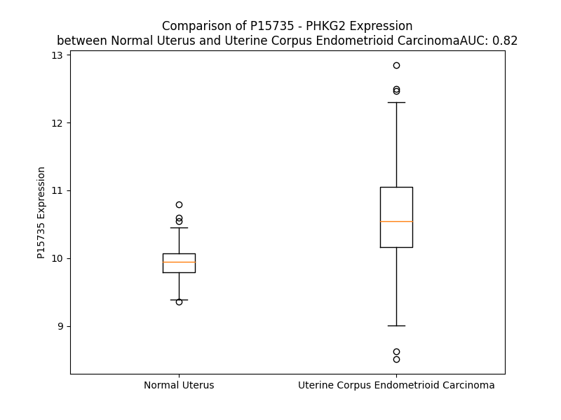

# Detailed Data for P15735

## Introduction to the Detailed Summary

### How to Interpret the Results

- **Summary & Metrics**: This section provides a quick reference to essential protein attributes, including expression changes, family classification, and biomarker applications. Regulation status (upregulated/downregulated) indicates the protein's behavior in a disease context. Some information comes from the original excel file with the proteins selected from literature, while others are derived from the analyses.
- **Expression Comparison**: A visual representation comparing protein expression between normal and disease states. It highlights significant changes in expression levels that might indicate diagnostic or therapeutic relevance. This is data coming from transcriptomics experiments and could not translate similarly to protein levels.
- **Isoform Alignment**: An interactive view of isoform alignments, revealing structural and functional differences between variants of the protein.
- **Interactors & Homologs**: Tables listing known interaction partners and homologous proteins, the more interactors and homologs, the more complex the protein is to design an antibody for.
- **Biological Assemblies**: Information about the structural arrangement of the protein in different assemblies, providing insights into its functional state but also the complexity of the protein to develop antibodies.
- **Combined Per-Residue Information**: A detailed table summarizing residue-level data. This includes predictions for epitope regions, aggregation tendencies, and modifications that might impact the protein's function. Each row corresponds to a residue in the protein, providing insights into specific sites that may be important for research or drug development.
## Summary & Metrics

- **UniProt Accession**: P15735
- **Gene Name**: PHKG2 
- **Protein Name**: phosphorylase kinase, gamma 2 (testis) 
- **Swiss Prot**: PHKG2_HUMAN
- **Family**: kinase
- **Biomarker Application**:  
- **Number of Isoforms**: 2
- **Regulation**: 1
- **(transcriptomics) AUC**: 0.77
- **(transcriptomics) Fold Change**: 1.05
- **(transcriptomics) Regulation**: Upregulated
- **Discotope Epitope Count**: 71
- **Max n_uniprots (Homo)**: 4
- **Max n_uniprots (Hetero)**: N/A

## Expression Comparison

## Isoform Alignment

<pre style='font-size:14px; font-family:monospace;'>P15735-1 MTLDVGPEDELPDWAAAKEFYQKYDPKDVIGRGVSSVVRRCVHRATGHEFAVKIMEVTAERLSPEQLEEVREATRRETHILRQVAGHPHIITLIDSYESSSFMFLVFDLMRKGELFDYLTEKVALSEKETRSIMRSLLEAVSFLHANNIVHRDLKPENILLDDNMQIRLSDFGFSCHLEPGEKLRELCGTPGYLAPEILKCSMDETHPGYGKEVDLWACGVILFTLLAGSPPFWHRRQILMLRMIMEGQYQFSSPEWDDRSSTVKDLISRLLQVDPEARLTAEQALQHPFFERCEGSQPWNLTPRQRFRVAVWTVLAAGRVALSTHRVRPLTKNALLRDPYALRSVRHLIDNCAFRLYGHWVKKGEQQNRAALFQHRPPGPFPIMGPEEEGDSAAITEDEAVLVLG
P15735-2 MTLDVGPEDELPDWAAAKEFYQKYDPKDVIGRGVSSVVRRCVHRATGHEFAVKIMEVTAERLSPEQLEEVREATRRETHILRQVAGHPHIITLIDSYESSSFMFLVFDLMRKGELFDYLTEKVALSEKETRSIMRSLLEAVSFLHANNIVHRDLKPENILLDDNMQIRLSDFGFSCHLEPGEKLRELCGTPGYLAPEILKCSMDETHPGYGKEVDLWACGVILFTLLAGSPPFWHRRQILMLRMIMEGQYQFSSPEWDDRSSTVKDLISRLLQVDPEARLTAEQALQHPFFERCEGSQPWNLTPRQRFRVAVWTVLAAGRVALSTHRVRPLTKNALLRDPYALRSVRHLIDNCAFRLYGHWIRKQWIGKLMACV--------------------------------
</pre>

## Interactors

| preferredName_A   | preferredName_B   |   score |
|:------------------|:------------------|--------:|
| PHKG2             | PHKA2             |   0.999 |
| PHKG2             | PHKB              |   0.999 |
| PHKG2             | PHKA1             |   0.999 |
| PHKG2             | CALM3             |   0.973 |
| PHKG2             | CALML3            |   0.968 |
| PHKG2             | CALM1             |   0.939 |
| PHKG2             | CALML5            |   0.922 |
| PHKG2             | CALML6            |   0.92  |
| PHKG2             | CALML4            |   0.92  |

## Homologs

| uniprot_id   | gene_id   |
|:-------------|:----------|
| Q86YV6       | MYLK4     |
| Q5SWX3       | CAMK2G    |
| Q96QS6       | PSKH2     |
| Q8N5S9       | CAMKK1    |
| Q9H1R3       | MYLK2     |
| C9J319       | STK33     |
| C9JEC5       | PNCK      |
| A0A8V8TQ13   | CAMK2B    |
| G5E9L9       | DCLK2     |
| O15075       | DCLK1     |
| P11801       | PSKH1     |
| Q96NX5       | CAMK1G    |
| A0A087WT72   | STK11     |
| F5GZ00       | CAMKK2    |
| A0A994J516   | CAMK2D    |
| A0A5F9ZHM9   | CAMK2A    |
| Q9C098       | DCLK3     |
| B4DM24       | CAMKV     |
| Q32MK0       | MYLK3     |
| Q16816       | PHKG1     |
| Q8IU85       | CAMK1D    |
| B0YIY3       | CAMK1     |

## Biological Assemblies

|   Unnamed: 0 |   assembly |   n_uniprots | composition   | crystal_id   |
|-------------:|-----------:|-------------:|:--------------|:-------------|
|            0 |          1 |            4 | Homo          | 2y7j         |

## Combined Per-Residue Information

|   res | aa   |   epitope_score | epitope   |   relative_surface_accessibility |   modeling_confidence |   Aggregation | modification   |
|------:|:-----|----------------:|:----------|---------------------------------:|----------------------:|--------------:|:---------------|
|     1 | M    |         0.14938 | False     |                          1.281   |                 39.03 |         0     | N/A            |
|     2 | T    |         0.15139 | False     |                          1.01591 |                 31.44 |         0     | N/A            |
|     3 | L    |         0.14332 | False     |                          0.9999  |                 35.08 |         0     | N/A            |
|     4 | D    |         0.15327 | False     |                          0.90833 |                 30.38 |         0     | N/A            |
|     5 | V    |         0.14124 | False     |                          0.99631 |                 29.49 |         0     | N/A            |
|     6 | G    |         0.22979 | True      |                          0.59253 |                 31.35 |         0     | N/A            |
|     7 | P    |         0.19675 | True      |                          0.96275 |                 35.81 |         0     | N/A            |
|     8 | E    |         0.31073 | True      |                          0.82924 |                 31.83 |         0     | N/A            |
|     9 | D    |         0.2404  | True      |                          0.87463 |                 30.88 |         0     | N/A            |
|    10 | E    |         0.24628 | True      |                          0.8228  |                 30.56 |         0     | N/A            |
|    11 | L    |         0.17571 | True      |                          0.76721 |                 33.09 |         0     | N/A            |
|    12 | P    |         0.12395 | False     |                          0.67593 |                 50.37 |         0     | N/A            |
|    13 | D    |         0.06082 | False     |                          0.29291 |                 55.83 |         0     | N/A            |
|    14 | W    |         0.12832 | False     |                          0.56436 |                 63.12 |         0     | N/A            |
|    15 | A    |         0.05047 | False     |                          0.39277 |                 74.31 |         0     | N/A            |
|    16 | A    |         0.02948 | False     |                          0.1108  |                 76.8  |         0     | N/A            |
|    17 | A    |         0.05415 | False     |                          0.19514 |                 81.44 |         0     | N/A            |
|    18 | K    |         0.08883 | False     |                          0.55142 |                 85.45 |         0     | N/A            |
|    19 | E    |         0.12836 | False     |                          0.52185 |                 90.64 |         0     | N/A            |
|    20 | F    |         0.00484 | False     |                          0       |                 93.48 |         0     | N/A            |
|    21 | Y    |         0.15412 | False     |                          0.4666  |                 93.29 |         0     | N/A            |
|    22 | Q    |         0.20253 | True      |                          0.65348 |                 94.77 |         0     | N/A            |
|    23 | K    |         0.0976  | False     |                          0.39501 |                 96.26 |         0     | N/A            |
|    24 | Y    |         0.03064 | False     |                          0.0125  |                 97.46 |         0     | N/A            |
|    25 | D    |         0.10774 | False     |                          0.22939 |                 95.84 |         0     | N/A            |
|    26 | P    |         0.06247 | False     |                          0.162   |                 94.87 |         0     | N/A            |
|    27 | K    |         0.15783 | False     |                          0.38158 |                 96.12 |         0     | N/A            |
|    28 | D    |         0.11258 | False     |                          0.44608 |                 95.14 |         0     | N/A            |
|    29 | V    |         0.12556 | False     |                          0.43947 |                 93.98 |         0     | N/A            |
|    30 | I    |         0.15691 | False     |                          0.5022  |                 92.15 |         0     | N/A            |
|    31 | G    |         0.07702 | False     |                          0.30396 |                 86.64 |         0     | N/A            |
|    32 | R    |         0.26048 | True      |                          0.77428 |                 85.8  |         0     | N/A            |
|    33 | G    |         0.13287 | False     |                          0.55669 |                 76.17 |         0     | N/A            |
|    34 | V    |         0.15866 | False     |                          1.15129 |                 75.49 |         0     | N/A            |
|    35 | S    |         0.16726 | False     |                          0.53062 |                 78.82 |         0     | N/A            |
|    36 | S    |         0.03604 | False     |                          0.18925 |                 87.03 |         0     | N/A            |
|    37 | V    |         0.05845 | False     |                          0.24714 |                 91.11 |         0     | N/A            |
|    38 | V    |         0.03272 | False     |                          0.2742  |                 93.42 |         0     | N/A            |
|    39 | R    |         0.11802 | False     |                          0.2764  |                 96.22 |         0     | N/A            |
|    40 | R    |         0.05623 | False     |                          0.24419 |                 97.35 |         0     | N/A            |
|    41 | C    |         0.00578 | False     |                          0       |                 97.38 |         0     | N/A            |
|    42 | V    |         0.0617  | False     |                          0.19232 |                 98.15 |         0     | N/A            |
|    43 | H    |         0.08799 | False     |                          0.14678 |                 98    |         0     | N/A            |
|    44 | R    |         0.2803  | True      |                          0.51195 |                 97.49 |         0     | N/A            |
|    45 | A    |         0.19661 | True      |                          0.87878 |                 97.13 |         0     | N/A            |
|    46 | T    |         0.20289 | True      |                          0.56737 |                 97.21 |         0     | N/A            |
|    47 | G    |         0.18925 | True      |                          0.58086 |                 96.45 |         0     | N/A            |
|    48 | H    |         0.15961 | False     |                          0.6387  |                 97.11 |         0     | N/A            |
|    49 | E    |         0.04944 | False     |                          0.28184 |                 97.81 |         0     | N/A            |
|    50 | F    |         0.04088 | False     |                          0.17071 |                 98.04 |         3.303 | N/A            |
|    51 | A    |         0.02441 | False     |                          0.08035 |                 97.57 |         3.303 | N/A            |
|    52 | V    |         0.00441 | False     |                          0       |                 96.46 |         3.941 | N/A            |
|    53 | K    |         0.01721 | False     |                          0.1747  |                 93.24 |         3.941 | N/A            |
|    54 | I    |         0.04092 | False     |                          0.09815 |                 91.57 |         3.941 | N/A            |
|    55 | M    |         0.02893 | False     |                          0.1618  |                 86.87 |         3.941 | N/A            |
|    56 | E    |         0.1015  | False     |                          0.53194 |                 81.26 |         3.941 | N/A            |
|    57 | V    |         0.044   | False     |                          0.04702 |                 73.32 |         3.941 | N/A            |
|    58 | T    |         0.14321 | False     |                          0.34095 |                 67.78 |         2.397 | N/A            |
|    59 | A    |         0.17751 | True      |                          0.60432 |                 55.49 |         2.12  | N/A            |
|    60 | E    |         0.41975 | True      |                          0.89348 |                 56.8  |         0     | N/A            |
|    61 | R    |         0.24512 | True      |                          0.86037 |                 63.67 |         0     | N/A            |
|    62 | L    |         0.23439 | True      |                          0.39035 |                 70.14 |         0     | N/A            |
|    63 | S    |         0.1835  | True      |                          0.34961 |                 81.48 |         0     | N/A            |
|    64 | P    |         0.19402 | True      |                          0.78074 |                 82    |         0     | N/A            |
|    65 | E    |         0.19547 | True      |                          0.59858 |                 84.65 |         0     | N/A            |
|    66 | Q    |         0.22612 | True      |                          0.41867 |                 82.4  |         0     | N/A            |
|    67 | L    |         0.09775 | False     |                          0.12695 |                 80.57 |         0     | N/A            |
|    68 | E    |         0.15561 | False     |                          0.43928 |                 83.93 |         0     | N/A            |
|    69 | E    |         0.1975  | True      |                          0.62284 |                 84.96 |         0     | N/A            |
|    70 | V    |         0.06149 | False     |                          0.36521 |                 82.29 |         0     | N/A            |
|    71 | R    |         0.08433 | False     |                          0.23744 |                 82.15 |         0     | N/A            |
|    72 | E    |         0.15739 | False     |                          0.39802 |                 86.88 |         0     | N/A            |
|    73 | A    |         0.06069 | False     |                          0.38672 |                 85.88 |         0     | N/A            |
|    74 | T    |         0.02325 | False     |                          0.02794 |                 84.61 |         0     | N/A            |
|    75 | R    |         0.1579  | False     |                          0.4206  |                 87.6  |         0     | N/A            |
|    76 | R    |         0.11382 | False     |                          0.40897 |                 90.43 |         0     | N/A            |
|    77 | E    |         0.01487 | False     |                          0.05158 |                 91.79 |         0     | N/A            |
|    78 | T    |         0.03026 | False     |                          0.04929 |                 92.52 |         0     | N/A            |
|    79 | H    |         0.09365 | False     |                          0.53914 |                 95.33 |         0     | N/A            |
|    80 | I    |         0.00514 | False     |                          0       |                 97.1  |         0     | N/A            |
|    81 | L    |         0.00675 | False     |                          0.01154 |                 96.83 |         0     | N/A            |
|    82 | R    |         0.13417 | False     |                          0.55071 |                 96.04 |         0     | N/A            |
|    83 | Q    |         0.12294 | False     |                          0.39185 |                 96.66 |         0     | N/A            |
|    84 | V    |         0.00984 | False     |                          0.00708 |                 97.43 |         0     | N/A            |
|    85 | A    |         0.10532 | False     |                          0.43716 |                 95.29 |         0     | N/A            |
|    86 | G    |         0.15937 | False     |                          0.80377 |                 94.17 |         0     | N/A            |
|    87 | H    |         0.08383 | False     |                          0.15172 |                 97.96 |         0     | N/A            |
|    88 | P    |         0.07852 | False     |                          0.61871 |                 97.36 |         0     | N/A            |
|    89 | H    |         0.12601 | False     |                          0.1257  |                 98.28 |         0.409 | N/A            |
|    90 | I    |         0.00602 | False     |                          0.00692 |                 98.54 |        55.76  | N/A            |
|    91 | I    |         0.0077  | False     |                          0.03656 |                 97.64 |        55.76  | N/A            |
|    92 | T    |         0.03683 | False     |                          0.20277 |                 96.88 |        55.76  | N/A            |
|    93 | L    |         0.02147 | False     |                          0.10732 |                 96.39 |        55.76  | N/A            |
|    94 | I    |         0.05216 | False     |                          0.39824 |                 96.01 |        55.76  | N/A            |
|    95 | D    |         0.12184 | False     |                          0.19592 |                 94.49 |         0     | N/A            |
|    96 | S    |         0.03273 | False     |                          0.31611 |                 92.67 |         0     | N/A            |
|    97 | Y    |         0.05361 | False     |                          0.11601 |                 91.29 |         0     | N/A            |
|    98 | E    |         0.10795 | False     |                          0.45018 |                 84.21 |         0     | N/A            |
|    99 | S    |         0.03083 | False     |                          0.09743 |                 80.45 |         0.059 | N/A            |
|   100 | S    |         0.07562 | False     |                          0.33116 |                 75.78 |         0.548 | N/A            |
|   101 | S    |         0.06573 | False     |                          0.19304 |                 80.23 |        10.743 | N/A            |
|   102 | F    |         0.0838  | False     |                          0.3411  |                 84.6  |        91.506 | N/A            |
|   103 | M    |         0.02482 | False     |                          0.03472 |                 87.93 |        97.597 | N/A            |
|   104 | F    |         0.01704 | False     |                          0.03121 |                 92.12 |        97.614 | N/A            |
|   105 | L    |         0.00219 | False     |                          0       |                 93.33 |        97.614 | N/A            |
|   106 | V    |         0.00314 | False     |                          0       |                 96.73 |        97.431 | N/A            |
|   107 | F    |         0.06946 | False     |                          0.09913 |                 97.25 |        90.569 | N/A            |
|   108 | D    |         0.05869 | False     |                          0.20942 |                 95.02 |         0.343 | N/A            |
|   109 | L    |         0.05844 | False     |                          0.18237 |                 96.67 |         0.343 | N/A            |
|   110 | M    |         0.04496 | False     |                          0.08864 |                 96.58 |         0.343 | N/A            |
|   111 | R    |         0.17323 | True      |                          0.54126 |                 94.43 |         0.343 | N/A            |
|   112 | K    |         0.11883 | False     |                          0.44131 |                 94.92 |         0.004 | N/A            |
|   113 | G    |         0.06264 | False     |                          0.32672 |                 94.41 |         0.004 | N/A            |
|   114 | E    |         0.13683 | False     |                          0.32188 |                 95.51 |         0.004 | N/A            |
|   115 | L    |         0.00373 | False     |                          0       |                 97.26 |         0.004 | N/A            |
|   116 | F    |         0.07241 | False     |                          0.44906 |                 94.79 |         0.004 | N/A            |
|   117 | D    |         0.18364 | True      |                          0.52487 |                 93.82 |         0     | N/A            |
|   118 | Y    |         0.10631 | False     |                          0.13158 |                 95.78 |         0     | N/A            |
|   119 | L    |         0.03752 | False     |                          0.05975 |                 94.85 |         0     | N/A            |
|   120 | T    |         0.15684 | False     |                          0.63651 |                 94.31 |         0     | N/A            |
|   121 | E    |         0.22303 | True      |                          0.68875 |                 94.38 |         0     | N/A            |
|   122 | K    |         0.15502 | False     |                          0.48374 |                 93.19 |         0     | N/A            |
|   123 | V    |         0.12751 | False     |                          0.78505 |                 92.58 |         0     | N/A            |
|   124 | A    |         0.07787 | False     |                          0.3538  |                 93.14 |         0     | N/A            |
|   125 | L    |         0.02768 | False     |                          0.01533 |                 95.04 |         0     | N/A            |
|   126 | S    |         0.10794 | False     |                          0.40252 |                 94.97 |         0     | N/A            |
|   127 | E    |         0.03036 | False     |                          0.17221 |                 95.69 |         0     | N/A            |
|   128 | K    |         0.0629  | False     |                          0.80242 |                 94.51 |         0     | N/A            |
|   129 | E    |         0.08935 | False     |                          0.36835 |                 95.26 |         0     | N/A            |
|   130 | T    |         0.0022  | False     |                          0       |                 97.13 |         0     | N/A            |
|   131 | R    |         0.04154 | False     |                          0.21009 |                 97.26 |         0     | N/A            |
|   132 | S    |         0.06411 | False     |                          0.43823 |                 96.31 |         0     | N/A            |
|   133 | I    |         0.02236 | False     |                          0.04309 |                 97.93 |         0     | N/A            |
|   134 | M    |         0.00214 | False     |                          0       |                 98.5  |         0     | N/A            |
|   135 | R    |         0.07231 | False     |                          0.32213 |                 98.25 |         0     | N/A            |
|   136 | S    |         0.02032 | False     |                          0.0811  |                 98.24 |         0     | N/A            |
|   137 | L    |         0.00145 | False     |                          0       |                 98.78 |         0     | N/A            |
|   138 | L    |         0.00238 | False     |                          0.00082 |                 98.8  |         0     | N/A            |
|   139 | E    |         0.05463 | False     |                          0.313   |                 98.65 |         0     | N/A            |
|   140 | A    |         0.00138 | False     |                          0       |                 98.71 |         1.874 | N/A            |
|   141 | V    |         0.00376 | False     |                          0       |                 98.82 |         1.874 | N/A            |
|   142 | S    |         0.02742 | False     |                          0.13678 |                 98.62 |         1.874 | N/A            |
|   143 | F    |         0.12883 | False     |                          0.32469 |                 98.72 |         1.874 | N/A            |
|   144 | L    |         0.0027  | False     |                          0       |                 98.64 |         1.874 | N/A            |
|   145 | H    |         0.03845 | False     |                          0.06955 |                 98.34 |         0     | N/A            |
|   146 | A    |         0.0783  | False     |                          0.76671 |                 97.62 |         0     | N/A            |
|   147 | N    |         0.12855 | False     |                          0.39944 |                 97.71 |         0     | N/A            |
|   148 | N    |         0.11573 | False     |                          0.29285 |                 98.01 |         0     | N/A            |
|   149 | I    |         0.01628 | False     |                          0.00875 |                 98.44 |         0     | N/A            |
|   150 | V    |         0.00244 | False     |                          0.00286 |                 98.29 |         0     | N/A            |
|   151 | H    |         0.00332 | False     |                          0       |                 98.52 |         0     | N/A            |
|   152 | R    |         0.03241 | False     |                          0.09445 |                 97.9  |         0     | N/A            |
|   153 | D    |         0.03944 | False     |                          0.02901 |                 97.47 |         0     | N/A            |
|   154 | L    |         0.00672 | False     |                          0.00708 |                 98.67 |         0     | N/A            |
|   155 | K    |         0.0518  | False     |                          0.1556  |                 97.41 |         0     | N/A            |
|   156 | P    |         0.00765 | False     |                          0.00199 |                 97.24 |         0     | N/A            |
|   157 | E    |         0.07185 | False     |                          0.29518 |                 95.08 |         0     | N/A            |
|   158 | N    |         0.06153 | False     |                          0.05001 |                 97.13 |         0     | N/A            |
|   159 | I    |         0.00382 | False     |                          0       |                 98.46 |         0     | N/A            |
|   160 | L    |         0.01888 | False     |                          0.22587 |                 97.72 |         0     | N/A            |
|   161 | L    |         0.00485 | False     |                          0       |                 97.61 |         0     | N/A            |
|   162 | D    |         0.02377 | False     |                          0.21849 |                 94.77 |         0     | N/A            |
|   163 | D    |         0.16588 | False     |                          0.52279 |                 92.1  |         0     | N/A            |
|   164 | N    |         0.16763 | False     |                          0.73537 |                 93.39 |         0     | N/A            |
|   165 | M    |         0.10449 | False     |                          0.28985 |                 93.05 |         0     | N/A            |
|   166 | Q    |         0.07706 | False     |                          0.39535 |                 95.92 |         0     | N/A            |
|   167 | I    |         0.02109 | False     |                          0.0102  |                 98.27 |         0     | N/A            |
|   168 | R    |         0.04535 | False     |                          0.22765 |                 98.4  |         0     | N/A            |
|   169 | L    |         0.00311 | False     |                          0       |                 98.62 |         0     | N/A            |
|   170 | S    |         0.01751 | False     |                          0.09848 |                 96.43 |         0     | N/A            |
|   171 | D    |         0.09617 | False     |                          0.33928 |                 92.69 |         0     | N/A            |
|   172 | F    |         0.00513 | False     |                          0.0038  |                 95.4  |         0     | N/A            |
|   173 | G    |         0.09099 | False     |                          0.45187 |                 91.89 |         0     | N/A            |
|   174 | F    |         0.13728 | False     |                          0.44598 |                 93.7  |         0     | N/A            |
|   175 | S    |         0.0187  | False     |                          0.03459 |                 97.16 |         0     | N/A            |
|   176 | C    |         0.03872 | False     |                          0.1157  |                 96.66 |         0     | N/A            |
|   177 | H    |         0.11457 | False     |                          0.36619 |                 97.31 |         0     | N/A            |
|   178 | L    |         0.05482 | False     |                          0.10889 |                 97.04 |         0     | N/A            |
|   179 | E    |         0.08394 | False     |                          0.45804 |                 95.07 |         0     | N/A            |
|   180 | P    |         0.26532 | True      |                          0.81471 |                 92.78 |         0     | N/A            |
|   181 | G    |         0.17311 | True      |                          0.90755 |                 90.67 |         0     | N/A            |
|   182 | E    |         0.27175 | True      |                          0.49766 |                 95.79 |         0     | N/A            |
|   183 | K    |         0.28826 | True      |                          0.49221 |                 96.59 |         0     | N/A            |
|   184 | L    |         0.10486 | False     |                          0.20691 |                 96.9  |         0     | N/A            |
|   185 | R    |         0.27775 | True      |                          0.4351  |                 96.54 |         0     | N/A            |
|   186 | E    |         0.1602  | False     |                          0.52022 |                 94.55 |         0     | N/A            |
|   187 | L    |         0.22242 | True      |                          0.60495 |                 95.12 |         0     | N/A            |
|   188 | C    |         0.04202 | False     |                          0.08257 |                 93.69 |         0     | N/A            |
|   189 | G    |         0.0591  | False     |                          0.25422 |                 92.61 |         0     | N/A            |
|   190 | T    |         0.09974 | False     |                          0.28829 |                 93.3  |         0     | N/A            |
|   191 | P    |         0.15524 | False     |                          0.34892 |                 95    |         0     | N/A            |
|   192 | G    |         0.05651 | False     |                          0.17754 |                 95.62 |         0     | N/A            |
|   193 | Y    |         0.08618 | False     |                          0.12944 |                 97.91 |         0     | N/A            |
|   194 | L    |         0.02617 | False     |                          0.05935 |                 97.86 |         0     | N/A            |
|   195 | A    |         0.00397 | False     |                          0.00219 |                 98.22 |         0     | N/A            |
|   196 | P    |         0.00339 | False     |                          0       |                 98.04 |         0     | N/A            |
|   197 | E    |         0.03897 | False     |                          0.01523 |                 97.78 |         0     | N/A            |
|   198 | I    |         0.04124 | False     |                          0.02219 |                 97.3  |         0     | N/A            |
|   199 | L    |         0.05516 | False     |                          0.02555 |                 96.34 |         0     | N/A            |
|   200 | K    |         0.16461 | False     |                          0.31109 |                 95.3  |         0     | N/A            |
|   201 | C    |         0.08748 | False     |                          0.04293 |                 94.53 |         0     | N/A            |
|   202 | S    |         0.14214 | False     |                          0.45276 |                 92.72 |         0     | N/A            |
|   203 | M    |         0.30546 | True      |                          0.60363 |                 92.2  |         0     | N/A            |
|   204 | D    |         0.2457  | True      |                          0.4106  |                 93.18 |         0     | N/A            |
|   205 | E    |         0.31966 | True      |                          0.82576 |                 91.89 |         0     | N/A            |
|   206 | T    |         0.30284 | True      |                          0.86773 |                 95.54 |         0     | N/A            |
|   207 | H    |         0.17053 | False     |                          0.22154 |                 95.55 |         0     | N/A            |
|   208 | P    |         0.24412 | True      |                          0.74284 |                 94.8  |         0     | N/A            |
|   209 | G    |         0.06647 | False     |                          0.06186 |                 96.56 |         0     | N/A            |
|   210 | Y    |         0.04663 | False     |                          0.01371 |                 97.65 |         0     | N/A            |
|   211 | G    |         0.03015 | False     |                          0.02668 |                 97.45 |         0     | N/A            |
|   212 | K    |         0.06165 | False     |                          0.45636 |                 97.97 |         0     | N/A            |
|   213 | E    |         0.05166 | False     |                          0.22161 |                 98.33 |         0     | N/A            |
|   214 | V    |         0.01178 | False     |                          0.02836 |                 98.52 |         0     | N/A            |
|   215 | D    |         0.00716 | False     |                          0.00512 |                 98.8  |         0     | N/A            |
|   216 | L    |         0.01411 | False     |                          0.01566 |                 98.88 |        31.456 | N/A            |
|   217 | W    |         0.00378 | False     |                          0       |                 98.85 |        37.216 | N/A            |
|   218 | A    |         0.03351 | False     |                          0.04719 |                 98.81 |        38.057 | N/A            |
|   219 | C    |         0.00173 | False     |                          0       |                 98.89 |        39.051 | N/A            |
|   220 | G    |         0.00318 | False     |                          0       |                 98.82 |        43.76  | N/A            |
|   221 | V    |         0.00936 | False     |                          0.0019  |                 98.78 |        94.732 | N/A            |
|   222 | I    |         0.00175 | False     |                          0       |                 98.77 |        99.321 | N/A            |
|   223 | L    |         0.00159 | False     |                          0       |                 98.78 |        99.69  | N/A            |
|   224 | F    |         0.03349 | False     |                          0.04777 |                 98.62 |        99.642 | N/A            |
|   225 | T    |         0.0339  | False     |                          0.06855 |                 97.63 |        98.521 | N/A            |
|   226 | L    |         0.00213 | False     |                          0       |                 97.87 |        97.055 | N/A            |
|   227 | L    |         0.00986 | False     |                          0.01297 |                 97.34 |        88.648 | N/A            |
|   228 | A    |         0.04565 | False     |                          0.11158 |                 95.5  |        42.538 | N/A            |
|   229 | G    |         0.09709 | False     |                          0.38395 |                 94.04 |         3.515 | N/A            |
|   230 | S    |         0.14278 | False     |                          0.42852 |                 93.44 |         0.002 | N/A            |
|   231 | P    |         0.12554 | False     |                          0.36556 |                 96.13 |         0     | N/A            |
|   232 | P    |         0.06061 | False     |                          0.08437 |                 97.34 |         0     | N/A            |
|   233 | F    |         0.01274 | False     |                          0.00668 |                 96.86 |         0     | N/A            |
|   234 | W    |         0.25073 | True      |                          0.76045 |                 93.3  |         0     | N/A            |
|   235 | H    |         0.12599 | False     |                          0.35095 |                 93.88 |         0     | N/A            |
|   236 | R    |         0.29645 | True      |                          0.89275 |                 92.68 |         0     | N/A            |
|   237 | R    |         0.40273 | True      |                          0.59337 |                 93.43 |         0     | N/A            |
|   238 | Q    |         0.21665 | True      |                          0.52602 |                 92.47 |         0     | N/A            |
|   239 | I    |         0.31375 | True      |                          0.6722  |                 93.38 |         0     | N/A            |
|   240 | L    |         0.19813 | True      |                          0.31813 |                 95.81 |         0     | N/A            |
|   241 | M    |         0.06332 | False     |                          0.10955 |                 95.91 |         0     | N/A            |
|   242 | L    |         0.11123 | False     |                          0.15498 |                 95.85 |         0     | N/A            |
|   243 | R    |         0.23746 | True      |                          0.58502 |                 96.67 |         0     | N/A            |
|   244 | M    |         0.11964 | False     |                          0.29252 |                 97.65 |         0     | N/A            |
|   245 | I    |         0.01478 | False     |                          0       |                 97.69 |         0     | N/A            |
|   246 | M    |         0.11708 | False     |                          0.26942 |                 96.26 |         0     | N/A            |
|   247 | E    |         0.10483 | False     |                          0.43509 |                 97    |         0     | N/A            |
|   248 | G    |         0.04711 | False     |                          0.17425 |                 97.08 |         0     | N/A            |
|   249 | Q    |         0.23276 | True      |                          0.53379 |                 96.62 |         0     | N/A            |
|   250 | Y    |         0.25434 | True      |                          0.23225 |                 97.33 |         0     | N/A            |
|   251 | Q    |         0.28731 | True      |                          0.67547 |                 95.9  |         0     | N/A            |
|   252 | F    |         0.14269 | False     |                          0.32553 |                 96.38 |         0     | N/A            |
|   253 | S    |         0.14092 | False     |                          0.31504 |                 90.44 |         0     | N/A            |
|   254 | S    |         0.36921 | True      |                          0.53304 |                 88.16 |         0     | N/A            |
|   255 | P    |         0.36014 | True      |                          0.68636 |                 90.15 |         0     | N/A            |
|   256 | E    |         0.14853 | False     |                          0.43614 |                 90.83 |         0     | N/A            |
|   257 | W    |         0.02582 | False     |                          0.02617 |                 94.53 |         0     | N/A            |
|   258 | D    |         0.17553 | True      |                          0.29409 |                 90.27 |         0     | N/A            |
|   259 | D    |         0.09713 | False     |                          0.47596 |                 87.84 |         0     | N/A            |
|   260 | R    |         0.08564 | False     |                          0.16896 |                 92.97 |         0     | N/A            |
|   261 | S    |         0.10469 | False     |                          0.32332 |                 94.18 |         0     | N/A            |
|   262 | S    |         0.07742 | False     |                          0.7052  |                 94.7  |         0     | N/A            |
|   263 | T    |         0.048   | False     |                          0.3556  |                 96.68 |         0     | N/A            |
|   264 | V    |         0.00968 | False     |                          0       |                 97.07 |         0     | N/A            |
|   265 | K    |         0.07808 | False     |                          0.24302 |                 98.06 |         0     | N/A            |
|   266 | D    |         0.07827 | False     |                          0.35993 |                 98.35 |         0     | N/A            |
|   267 | L    |         0.00268 | False     |                          0       |                 98.63 |         0     | N/A            |
|   268 | I    |         0.00781 | False     |                          0       |                 98.72 |         0     | N/A            |
|   269 | S    |         0.09564 | False     |                          0.3208  |                 98.58 |         0     | N/A            |
|   270 | R    |         0.12604 | False     |                          0.47513 |                 98.61 |         0     | N/A            |
|   271 | L    |         0.00609 | False     |                          0       |                 98.8  |         0     | N/A            |
|   272 | L    |         0.01428 | False     |                          0.03047 |                 98.75 |         0     | N/A            |
|   273 | Q    |         0.05946 | False     |                          0.34939 |                 98.6  |         0     | N/A            |
|   274 | V    |         0.07166 | False     |                          0.28583 |                 98.44 |         0     | N/A            |
|   275 | D    |         0.15265 | False     |                          0.4179  |                 97.99 |         0     | N/A            |
|   276 | P    |         0.07409 | False     |                          0.26844 |                 97.81 |         0     | N/A            |
|   277 | E    |         0.18628 | True      |                          0.87281 |                 97.12 |         0     | N/A            |
|   278 | A    |         0.12369 | False     |                          0.55829 |                 98.23 |         0     | N/A            |
|   279 | R    |         0.13179 | False     |                          0.03928 |                 98.63 |         0     | N/A            |
|   280 | L    |         0.08156 | False     |                          0.16648 |                 98.6  |         0     | N/A            |
|   281 | T    |         0.06218 | False     |                          0.38102 |                 98.65 |         0     | N/A            |
|   282 | A    |         0.00699 | False     |                          0.00839 |                 98.54 |         0     | N/A            |
|   283 | E    |         0.10713 | False     |                          0.41602 |                 98.03 |         0     | N/A            |
|   284 | Q    |         0.14161 | False     |                          0.45603 |                 98.39 |         0     | N/A            |
|   285 | A    |         0.00312 | False     |                          0       |                 98.59 |         0     | N/A            |
|   286 | L    |         0.05174 | False     |                          0.27899 |                 97.83 |         0     | N/A            |
|   287 | Q    |         0.12785 | False     |                          0.70546 |                 97.56 |         0     | N/A            |
|   288 | H    |         0.05563 | False     |                          0.07639 |                 98.15 |         0     | N/A            |
|   289 | P    |         0.13059 | False     |                          0.56987 |                 96.59 |         0     | N/A            |
|   290 | F    |         0.01738 | False     |                          0.0194  |                 96.68 |         0     | N/A            |
|   291 | F    |         0.05057 | False     |                          0.06356 |                 96    |         0     | N/A            |
|   292 | E    |         0.21078 | True      |                          0.55926 |                 89.02 |         0     | N/A            |
|   293 | R    |         0.20079 | True      |                          0.82271 |                 65.58 |         0     | N/A            |
|   294 | C    |         0.16782 | False     |                          0.881   |                 54.76 |         0     | N/A            |
|   295 | E    |         0.17873 | True      |                          0.81351 |                 40.62 |         0     | N/A            |
|   296 | G    |         0.28644 | True      |                          0.64257 |                 40.63 |         0     | N/A            |
|   297 | S    |         0.24227 | True      |                          0.88874 |                 37.89 |         0     | N/A            |
|   298 | Q    |         0.19149 | True      |                          0.77913 |                 45.83 |         0     | N/A            |
|   299 | P    |         0.28987 | True      |                          0.74322 |                 46.93 |         0     | N/A            |
|   300 | W    |         0.24859 | True      |                          0.94728 |                 55.86 |         0     | N/A            |
|   301 | N    |         0.24688 | True      |                          0.84879 |                 59.68 |         0     | N/A            |
|   302 | L    |         0.1889  | True      |                          0.27349 |                 67.98 |         0     | N/A            |
|   303 | T    |         0.13778 | False     |                          0.48237 |                 77.85 |         0     | N/A            |
|   304 | P    |         0.16179 | False     |                          0.8463  |                 81.57 |         0     | N/A            |
|   305 | R    |         0.24318 | True      |                          0.69679 |                 78.4  |         0     | N/A            |
|   306 | Q    |         0.05812 | False     |                          0.14988 |                 77.9  |         0     | N/A            |
|   307 | R    |         0.11878 | False     |                          0.56777 |                 83.6  |         0     | N/A            |
|   308 | F    |         0.10365 | False     |                          0.72411 |                 88.34 |         0     | N/A            |
|   309 | R    |         0.10604 | False     |                          0.42543 |                 82.94 |         0     | N/A            |
|   310 | V    |         0.0371  | False     |                          0.54001 |                 86.28 |        69.007 | N/A            |
|   311 | A    |         0.05215 | False     |                          0.48632 |                 90.4  |        74.836 | N/A            |
|   312 | V    |         0.0458  | False     |                          0.4222  |                 91.54 |        92.241 | N/A            |
|   313 | W    |         0.0503  | False     |                          0.76641 |                 87.92 |        93.025 | N/A            |
|   314 | T    |         0.02014 | False     |                          0.57729 |                 92.31 |        93.069 | N/A            |
|   315 | V    |         0.03101 | False     |                          0.74555 |                 93    |        92.608 | N/A            |
|   316 | L    |         0.03093 | False     |                          0.64368 |                 90.6  |        86.719 | N/A            |
|   317 | A    |         0.01819 | False     |                          0.50345 |                 90.09 |        46.389 | N/A            |
|   318 | A    |         0.0192  | False     |                          0.55529 |                 90.72 |        11.702 | N/A            |
|   319 | G    |         0.0294  | False     |                          0.35588 |                 87.06 |         0.963 | N/A            |
|   320 | R    |         0.02094 | False     |                          0.74762 |                 84.03 |         0     | N/A            |
|   321 | V    |         0.01122 | False     |                          0.68155 |                 82.26 |         0     | N/A            |
|   322 | A    |         0.01218 | False     |                          0.49826 |                 81.34 |         0     | N/A            |
|   323 | L    |         0.02462 | False     |                          0.64051 |                 76.91 |         0     | N/A            |
|   324 | S    |         0.05679 | False     |                          0.54108 |                 69.26 |         0     | N/A            |
|   325 | T    |         0.06073 | False     |                          0.64908 |                 67.07 |         0     | N/A            |
|   326 | H    |         0.12493 | False     |                          0.89933 |                 63.56 |         0     | N/A            |
|   327 | R    |         0.17511 | True      |                          0.73677 |                 56.71 |         0     | N/A            |
|   328 | V    |         0.11339 | False     |                          0.83488 |                 55.52 |         0     | N/A            |
|   329 | R    |         0.13661 | False     |                          0.84746 |                 56.59 |         0     | N/A            |
|   330 | P    |         0.07731 | False     |                          0.82621 |                 61.49 |         0     | N/A            |
|   331 | L    |         0.12253 | False     |                          0.59362 |                 62.32 |         0     | N/A            |
|   332 | T    |         0.10993 | False     |                          0.54586 |                 70.3  |         0     | N/A            |
|   333 | K    |         0.16355 | False     |                          0.80977 |                 71.85 |         0     | N/A            |
|   334 | N    |         0.11448 | False     |                          0.75727 |                 74.78 |         0     | N/A            |
|   335 | A    |         0.0655  | False     |                          0.42066 |                 69.83 |         0     | N/A            |
|   336 | L    |         0.05457 | False     |                          0.37456 |                 74.6  |         0     | N/A            |
|   337 | L    |         0.06737 | False     |                          0.83833 |                 78.61 |         0     | N/A            |
|   338 | R    |         0.11904 | False     |                          0.88705 |                 82.77 |         0     | N/A            |
|   339 | D    |         0.19019 | True      |                          0.42872 |                 79.44 |         0     | N/A            |
|   340 | P    |         0.08128 | False     |                          0.3857  |                 76.03 |         0     | N/A            |
|   341 | Y    |         0.06514 | False     |                          0.44759 |                 76.24 |         0     | N/A            |
|   342 | A    |         0.0728  | False     |                          0.59893 |                 73.54 |         0     | N/A            |
|   343 | L    |         0.13924 | False     |                          0.29759 |                 72.21 |         0     | N/A            |
|   344 | R    |         0.05838 | False     |                          0.72264 |                 69.94 |         0     | N/A            |
|   345 | S    |         0.0518  | False     |                          0.54639 |                 68.55 |         0     | Phosphoserine  |
|   346 | V    |         0.02268 | False     |                          0.16947 |                 77.21 |         0     | N/A            |
|   347 | R    |         0.06056 | False     |                          0.3564  |                 79.47 |         0     | N/A            |
|   348 | H    |         0.02848 | False     |                          0.45802 |                 72.93 |         0     | N/A            |
|   349 | L    |         0.02634 | False     |                          0.69856 |                 78.53 |         0     | N/A            |
|   350 | I    |         0.02022 | False     |                          0.32366 |                 80.89 |         0     | N/A            |
|   351 | D    |         0.03    | False     |                          0.17418 |                 76.21 |         0     | N/A            |
|   352 | N    |         0.01627 | False     |                          0.12547 |                 73.99 |         0     | N/A            |
|   353 | C    |         0.03082 | False     |                          0.5193  |                 79.63 |         0     | N/A            |
|   354 | A    |         0.01634 | False     |                          0.21775 |                 76.81 |         0     | N/A            |
|   355 | F    |         0.02567 | False     |                          0.0849  |                 74.5  |         0     | N/A            |
|   356 | R    |         0.06411 | False     |                          0.68143 |                 75.54 |         0     | N/A            |
|   357 | L    |         0.08068 | False     |                          0.89361 |                 77.57 |         0     | N/A            |
|   358 | Y    |         0.15312 | False     |                          0.60233 |                 71.82 |         0     | N/A            |
|   359 | G    |         0.11021 | False     |                          0.60124 |                 68.75 |         0     | N/A            |
|   360 | H    |         0.09129 | False     |                          0.53281 |                 68.58 |         0     | N/A            |
|   361 | W    |         0.06834 | False     |                          0.30747 |                 66.78 |         0     | N/A            |
|   362 | V    |         0.11658 | False     |                          0.59366 |                 60.9  |         0     | N/A            |
|   363 | K    |         0.14599 | False     |                          0.86493 |                 59.39 |         0     | N/A            |
|   364 | K    |         0.11514 | False     |                          1.0872  |                 48.19 |         0     | N/A            |
|   365 | G    |         0.25865 | True      |                          0.77835 |                 59.36 |         0     | N/A            |
|   366 | E    |         0.18725 | True      |                          0.9465  |                 54.12 |         0     | N/A            |
|   367 | Q    |         0.15697 | False     |                          0.92811 |                 50.21 |         0     | N/A            |
|   368 | Q    |         0.1676  | False     |                          0.65539 |                 52.9  |         0     | N/A            |
|   369 | N    |         0.22243 | True      |                          0.74476 |                 52.22 |         0     | N/A            |
|   370 | R    |         0.2763  | True      |                          0.79489 |                 55.39 |         0     | N/A            |
|   371 | A    |         0.14192 | False     |                          0.66603 |                 54.83 |         0     | N/A            |
|   372 | A    |         0.07772 | False     |                          0.29982 |                 55.5  |         0     | N/A            |
|   373 | L    |         0.18892 | True      |                          0.61167 |                 54.94 |         0     | N/A            |
|   374 | F    |         0.16154 | False     |                          0.79504 |                 55.09 |         0     | N/A            |
|   375 | Q    |         0.1444  | False     |                          0.43132 |                 58.41 |         0     | N/A            |
|   376 | H    |         0.17055 | False     |                          0.83942 |                 63    |         0     | N/A            |
|   377 | R    |         0.18633 | True      |                          0.80775 |                 59.64 |         0     | N/A            |
|   378 | P    |         0.05853 | False     |                          0.3599  |                 56.87 |         0     | N/A            |
|   379 | P    |         0.07004 | False     |                          0.43773 |                 52.24 |         0     | N/A            |
|   380 | G    |         0.13389 | False     |                          0.548   |                 57.81 |         0     | N/A            |
|   381 | P    |         0.07048 | False     |                          1.01449 |                 47.96 |         0     | N/A            |
|   382 | F    |         0.05731 | False     |                          0.4867  |                 45.52 |         0     | N/A            |
|   383 | P    |         0.07336 | False     |                          0.7967  |                 39.41 |         0     | N/A            |
|   384 | I    |         0.09411 | False     |                          0.98612 |                 37.37 |         0     | N/A            |
|   385 | M    |         0.12404 | False     |                          0.98129 |                 33.55 |         0     | N/A            |
|   386 | G    |         0.09288 | False     |                          0.53457 |                 34.6  |         0     | N/A            |
|   387 | P    |         0.11058 | False     |                          0.97047 |                 36.49 |         0     | N/A            |
|   388 | E    |         0.10191 | False     |                          0.89074 |                 34.26 |         0     | N/A            |
|   389 | E    |         0.13735 | False     |                          0.85398 |                 32.51 |         0     | N/A            |
|   390 | E    |         0.17493 | True      |                          0.90881 |                 32.81 |         0     | N/A            |
|   391 | G    |         0.20398 | True      |                          0.89401 |                 29.33 |         0     | N/A            |
|   392 | D    |         0.18316 | True      |                          0.91635 |                 31.39 |         0     | N/A            |
|   393 | S    |         0.12936 | False     |                          0.82456 |                 29.66 |         0     | N/A            |
|   394 | A    |         0.16324 | False     |                          0.96048 |                 33.71 |         0     | N/A            |
|   395 | A    |         0.08583 | False     |                          0.92742 |                 29.99 |         0     | N/A            |
|   396 | I    |         0.13046 | False     |                          1.03387 |                 32.75 |         0     | N/A            |
|   397 | T    |         0.12694 | False     |                          0.86699 |                 32.37 |         0     | N/A            |
|   398 | E    |         0.09335 | False     |                          0.89721 |                 28.55 |         0     | N/A            |
|   399 | D    |         0.15558 | False     |                          0.84014 |                 28.43 |         0     | N/A            |
|   400 | E    |         0.14098 | False     |                          0.86807 |                 29.12 |         0     | N/A            |
|   401 | A    |         0.07455 | False     |                          0.89566 |                 31.13 |        21.724 | N/A            |
|   402 | V    |         0.06812 | False     |                          0.95112 |                 31.93 |        21.724 | N/A            |
|   403 | L    |         0.07872 | False     |                          0.84841 |                 32.22 |        21.724 | N/A            |
|   404 | V    |         0.0546  | False     |                          0.90305 |                 29.76 |        21.724 | N/A            |
|   405 | L    |         0.05188 | False     |                          0.94982 |                 33.95 |        21.724 | N/A            |
|   406 | G    |         0.07385 | False     |                          1.5425  |                 37.61 |         0     | N/A            |

