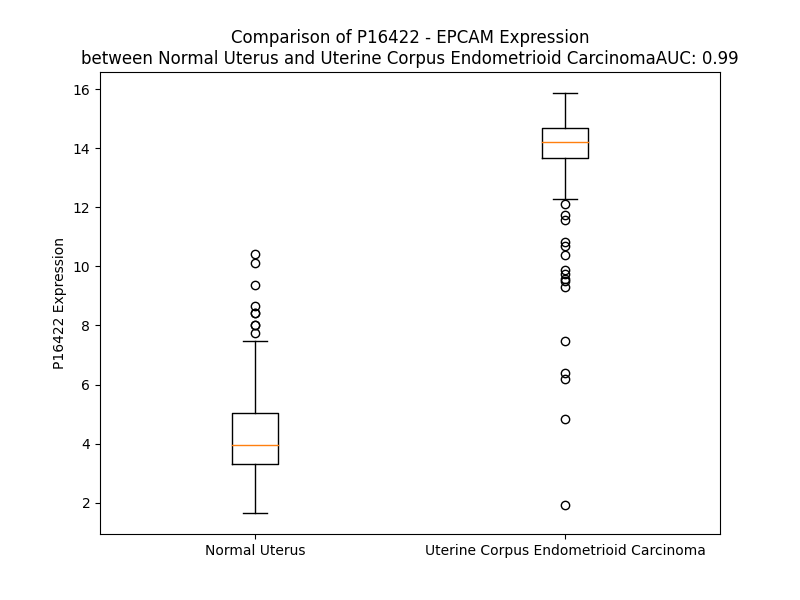

# Detailed Data for P16422

## Introduction to the Detailed Summary

### How to Interpret the Results

- **Summary & Metrics**: This section provides a quick reference to essential protein attributes, including expression changes, family classification, and biomarker applications. Regulation status (upregulated/downregulated) indicates the protein's behavior in a disease context. Some information comes from the original excel file with the proteins selected from literature, while others are derived from the analyses.
- **Expression Comparison**: A visual representation comparing protein expression between normal and disease states. It highlights significant changes in expression levels that might indicate diagnostic or therapeutic relevance. This is data coming from transcriptomics experiments and could not translate similarly to protein levels.
- **Isoform Alignment**: An interactive view of isoform alignments, revealing structural and functional differences between variants of the protein.
- **Interactors & Homologs**: Tables listing known interaction partners and homologous proteins, the more interactors and homologs, the more complex the protein is to design an antibody for.
- **Biological Assemblies**: Information about the structural arrangement of the protein in different assemblies, providing insights into its functional state but also the complexity of the protein to develop antibodies.
- **Combined Per-Residue Information**: A detailed table summarizing residue-level data. This includes predictions for epitope regions, aggregation tendencies, and modifications that might impact the protein's function. Each row corresponds to a residue in the protein, providing insights into specific sites that may be important for research or drug development.
## Summary & Metrics

- **UniProt Accession**: P16422
- **Gene Name**: EPCAM
- **Protein Name**: Epithelial cell adhesion molecule
- **Swiss Prot**: EPCAM_HUMAN
- **Family**: other
- **Biomarker Application**: unspecified application
- **Number of Isoforms**: 0
- **Regulation**: 1
- **(transcriptomics) AUC**: 0.98
- **(transcriptomics) Fold Change**: 2.62
- **(transcriptomics) Regulation**: Upregulated
- **Discotope Epitope Count**: 63
- **Max n_uniprots (Homo)**: 4
- **Max n_uniprots (Hetero)**: N/A

## Expression Comparison

## Interactors

| preferredName_A   | preferredName_B   |   score |
|:------------------|:------------------|--------:|
| EPCAM             | CLDN7             |   0.993 |
| EPCAM             | CD44              |   0.971 |
| EPCAM             | CD9               |   0.943 |
| EPCAM             | ERBB2             |   0.927 |
| EPCAM             | EGFR              |   0.923 |
| EPCAM             | MUC1              |   0.92  |
| EPCAM             | MSH2              |   0.914 |
| EPCAM             | CD24              |   0.91  |
| EPCAM             | CDH1              |   0.905 |

## Homologs

| uniprot_id   | gene_id   |
|:-------------|:----------|
| P09758       | TACSTD2   |

## Biological Assemblies

|   Unnamed: 0 |   assembly |   n_uniprots | composition   | crystal_id   |
|-------------:|-----------:|-------------:|:--------------|:-------------|
|            0 |          1 |            1 | Homo          | 4mzv         |
|            0 |          1 |            4 | Homo          | 6i07         |

## Combined Per-Residue Information

|   res | aa   |   epitope_score | epitope   |   relative_surface_accessibility |   modeling_confidence |   Aggregation | modification   | glycosylation                            |
|------:|:-----|----------------:|:----------|---------------------------------:|----------------------:|--------------:|:---------------|:-----------------------------------------|
|     1 | M    |         0.15072 | False     |                          1.3052  |                 42.34 |         0     | N/A            | N/A                                      |
|     2 | A    |         0.17096 | False     |                          0.98293 |                 44.29 |         0     | N/A            | N/A                                      |
|     3 | P    |         0.24373 | True      |                          0.90169 |                 51    |         0     | N/A            | N/A                                      |
|     4 | P    |         0.26687 | True      |                          0.8268  |                 46.4  |         0.028 | N/A            | N/A                                      |
|     5 | Q    |         0.20942 | False     |                          0.82821 |                 47.89 |         3.189 | N/A            | N/A                                      |
|     6 | V    |         0.18429 | False     |                          0.89147 |                 45.24 |        87.282 | N/A            | N/A                                      |
|     7 | L    |         0.30912 | True      |                          0.89261 |                 44.04 |        94.426 | N/A            | N/A                                      |
|     8 | A    |         0.14823 | False     |                          1.05963 |                 45.94 |        95.729 | N/A            | N/A                                      |
|     9 | F    |         0.19    | False     |                          1.00267 |                 42    |        97.242 | N/A            | N/A                                      |
|    10 | G    |         0.2465  | True      |                          0.75367 |                 44.62 |        97.332 | N/A            | N/A                                      |
|    11 | L    |         0.29348 | True      |                          0.97734 |                 47.67 |        98.403 | N/A            | N/A                                      |
|    12 | L    |         0.20293 | False     |                          1.11569 |                 47.86 |        98.286 | N/A            | N/A                                      |
|    13 | L    |         0.13945 | False     |                          0.91043 |                 50.48 |        96.629 | N/A            | N/A                                      |
|    14 | A    |         0.1303  | False     |                          0.93453 |                 53.71 |        87.275 | N/A            | N/A                                      |
|    15 | A    |         0.14534 | False     |                          0.77089 |                 55.02 |        79.357 | N/A            | N/A                                      |
|    16 | A    |         0.11901 | False     |                          0.91251 |                 54.38 |        72.569 | N/A            | N/A                                      |
|    17 | T    |         0.15694 | False     |                          0.82951 |                 54.63 |        66.813 | N/A            | N/A                                      |
|    18 | A    |         0.16411 | False     |                          0.67399 |                 54.96 |        63.39  | N/A            | N/A                                      |
|    19 | T    |         0.15735 | False     |                          0.85191 |                 51.89 |        60.491 | N/A            | N/A                                      |
|    20 | F    |         0.17543 | False     |                          0.97388 |                 51.74 |        58.766 | N/A            | N/A                                      |
|    21 | A    |         0.15528 | False     |                          0.86497 |                 57.7  |        37.584 | N/A            | N/A                                      |
|    22 | A    |         0.1588  | False     |                          0.83657 |                 62.1  |        19.668 | N/A            | N/A                                      |
|    23 | A    |         0.12863 | False     |                          0.97592 |                 72.17 |         4.518 | N/A            | N/A                                      |
|    24 | Q    |         0.1998  | False     |                          0.59296 |                 81.1  |         0.005 | N/A            | N/A                                      |
|    25 | E    |         0.1936  | False     |                          0.63096 |                 93.13 |         0     | N/A            | N/A                                      |
|    26 | E    |         0.12726 | False     |                          0.79133 |                 94.99 |         0     | N/A            | N/A                                      |
|    27 | C    |         0.04993 | False     |                          0.21158 |                 96.7  |         0     | N/A            | N/A                                      |
|    28 | V    |         0.12895 | False     |                          0.60578 |                 96.47 |         0     | N/A            | N/A                                      |
|    29 | C    |         0.03709 | False     |                          0.05051 |                 97.05 |         0     | N/A            | N/A                                      |
|    30 | E    |         0.10225 | False     |                          0.28905 |                 95.46 |         0     | N/A            | N/A                                      |
|    31 | N    |         0.05156 | False     |                          0.05696 |                 96.35 |         0     | N/A            | N/A                                      |
|    32 | Y    |         0.01828 | False     |                          0.00561 |                 97.42 |         0     | N/A            | N/A                                      |
|    33 | K    |         0.14358 | False     |                          0.44212 |                 96.72 |         0     | N/A            | N/A                                      |
|    34 | L    |         0.10619 | False     |                          0.24566 |                 96.1  |         1.384 | N/A            | N/A                                      |
|    35 | A    |         0.06264 | False     |                          0.16641 |                 96.54 |         1.635 | N/A            | N/A                                      |
|    36 | V    |         0.20422 | False     |                          0.49508 |                 96.15 |         2.446 | N/A            | N/A                                      |
|    37 | N    |         0.1656  | False     |                          0.72738 |                 96.2  |         2.446 | N/A            | N/A                                      |
|    38 | C    |         0.13435 | False     |                          0.18557 |                 97.66 |         2.446 | N/A            | N/A                                      |
|    39 | F    |         0.25045 | True      |                          0.272   |                 97.37 |         2.446 | N/A            | N/A                                      |
|    40 | V    |         0.16782 | False     |                          0.30206 |                 97.04 |         2.446 | N/A            | N/A                                      |
|    41 | N    |         0.11705 | False     |                          0.16979 |                 94.92 |         0     | N/A            | N/A                                      |
|    42 | N    |         0.26046 | True      |                          1.01915 |                 94.06 |         0     | N/A            | N/A                                      |
|    43 | N    |         0.17881 | False     |                          0.73172 |                 94.26 |         0     | N/A            | N/A                                      |
|    44 | R    |         0.19156 | False     |                          0.8762  |                 94.61 |         0     | N/A            | N/A                                      |
|    45 | Q    |         0.20065 | False     |                          0.3318  |                 95.36 |         0     | N/A            | N/A                                      |
|    46 | C    |         0.0927  | False     |                          0.17251 |                 97.46 |         0     | N/A            | N/A                                      |
|    47 | Q    |         0.15443 | False     |                          0.20063 |                 97.41 |         0     | N/A            | N/A                                      |
|    48 | C    |         0.01787 | False     |                          0.01909 |                 97.99 |         0     | N/A            | N/A                                      |
|    49 | T    |         0.13223 | False     |                          0.23964 |                 97.53 |         0     | N/A            | N/A                                      |
|    50 | S    |         0.00718 | False     |                          0.00692 |                 97.58 |         0     | N/A            | N/A                                      |
|    51 | V    |         0.1213  | False     |                          0.2761  |                 95.39 |         0     | N/A            | N/A                                      |
|    52 | G    |         0.10895 | False     |                          0.39408 |                 91.86 |         0     | N/A            | N/A                                      |
|    53 | A    |         0.10338 | False     |                          0.15767 |                 93.2  |         0     | N/A            | N/A                                      |
|    54 | Q    |         0.16432 | False     |                          0.86417 |                 93.16 |         0     | N/A            | N/A                                      |
|    55 | N    |         0.07682 | False     |                          0.13824 |                 97.34 |         0     | N/A            | N/A                                      |
|    56 | T    |         0.15172 | False     |                          0.56199 |                 96.47 |         0     | N/A            | N/A                                      |
|    57 | V    |         0.03258 | False     |                          0.07141 |                 96.59 |         0     | N/A            | N/A                                      |
|    58 | I    |         0.14384 | False     |                          0.37853 |                 96.16 |         0     | N/A            | N/A                                      |
|    59 | C    |         0.0453  | False     |                          0.0746  |                 95.84 |         0     | N/A            | N/A                                      |
|    60 | S    |         0.14671 | False     |                          0.4244  |                 93.05 |         0     | N/A            | N/A                                      |
|    61 | K    |         0.13713 | False     |                          0.35547 |                 92.42 |         0     | N/A            | N/A                                      |
|    62 | L    |         0.0352  | False     |                          0.10025 |                 96.52 |         0     | N/A            | N/A                                      |
|    63 | A    |         0.02381 | False     |                          0.05923 |                 96.81 |         0     | N/A            | N/A                                      |
|    64 | A    |         0.03947 | False     |                          0.15094 |                 96.94 |         0     | N/A            | N/A                                      |
|    65 | K    |         0.04358 | False     |                          0.06896 |                 96.75 |         0     | N/A            | N/A                                      |
|    66 | C    |         0.00584 | False     |                          0.00358 |                 97.1  |         0     | N/A            | N/A                                      |
|    67 | L    |         0.01301 | False     |                          0.03133 |                 97.59 |         0     | N/A            | N/A                                      |
|    68 | V    |         0.00246 | False     |                          0       |                 96.27 |         0     | N/A            | N/A                                      |
|    69 | M    |         0.02371 | False     |                          0.04896 |                 94.76 |         0     | N/A            | N/A                                      |
|    70 | K    |         0.05509 | False     |                          0.21169 |                 94.2  |         0     | N/A            | N/A                                      |
|    71 | A    |         0.02607 | False     |                          0.06411 |                 94.54 |         0     | N/A            | N/A                                      |
|    72 | E    |         0.11424 | False     |                          0.22896 |                 91.97 |         0     | N/A            | N/A                                      |
|    73 | M    |         0.05523 | False     |                          0.04992 |                 88.98 |         0     | N/A            | N/A                                      |
|    74 | N    |         0.19102 | False     |                          0.37808 |                 84.47 |         0     | N/A            | N-linked (GlcNAc...) asparagine; partial |
|    75 | G    |         0.223   | False     |                          0.64144 |                 70.86 |         0     | N/A            | N/A                                      |
|    76 | S    |         0.19979 | False     |                          0.38481 |                 66.34 |         0     | N/A            | N/A                                      |
|    77 | K    |         0.17978 | False     |                          0.48482 |                 61.09 |         0     | N/A            | N/A                                      |
|    78 | L    |         0.32492 | True      |                          1.04008 |                 54.11 |         0     | N/A            | N/A                                      |
|    79 | G    |         0.24248 | True      |                          0.88517 |                 53.04 |         0     | N/A            | N/A                                      |
|    80 | R    |         0.34571 | True      |                          0.51402 |                 54.7  |         0     | N/A            | N/A                                      |
|    81 | R    |         0.42888 | True      |                          0.93448 |                 56.9  |         0     | N/A            | N/A                                      |
|    82 | A    |         0.26293 | True      |                          0.87423 |                 64.2  |         0     | N/A            | N/A                                      |
|    83 | K    |         0.19143 | False     |                          0.47444 |                 61.24 |         0     | N/A            | N/A                                      |
|    84 | P    |         0.30227 | True      |                          0.71435 |                 68.58 |         0     | N/A            | N/A                                      |
|    85 | E    |         0.37607 | True      |                          0.95988 |                 70.64 |         0     | N/A            | N/A                                      |
|    86 | G    |         0.34084 | True      |                          0.89264 |                 64.88 |         0     | N/A            | N/A                                      |
|    87 | A    |         0.32879 | True      |                          0.36208 |                 61.33 |         0     | N/A            | N/A                                      |
|    88 | L    |         0.39039 | True      |                          1.03133 |                 58.76 |         0     | N/A            | N/A                                      |
|    89 | Q    |         0.36181 | True      |                          0.38622 |                 64.09 |         0     | N/A            | N/A                                      |
|    90 | N    |         0.38471 | True      |                          0.78577 |                 64.27 |         0     | N/A            | N/A                                      |
|    91 | N    |         0.11799 | False     |                          0.04153 |                 66.56 |         0     | N/A            | N/A                                      |
|    92 | D    |         0.37585 | True      |                          0.51085 |                 68.82 |         0     | N/A            | N/A                                      |
|    93 | G    |         0.19132 | False     |                          0.64348 |                 74.47 |         0     | N/A            | N/A                                      |
|    94 | L    |         0.2367  | True      |                          0.52624 |                 78.97 |         0     | N/A            | N/A                                      |
|    95 | Y    |         0.05192 | False     |                          0.04501 |                 86.19 |         0     | N/A            | N/A                                      |
|    96 | D    |         0.07298 | False     |                          0.26519 |                 91.31 |         0     | N/A            | N/A                                      |
|    97 | P    |         0.0047  | False     |                          0.00167 |                 94.19 |         0     | N/A            | N/A                                      |
|    98 | D    |         0.07965 | False     |                          0.36698 |                 94.74 |         0     | N/A            | N/A                                      |
|    99 | C    |         0.0605  | False     |                          0.1426  |                 96.35 |         0     | N/A            | N/A                                      |
|   100 | D    |         0.05214 | False     |                          0.18863 |                 96.1  |         0     | N/A            | N/A                                      |
|   101 | E    |         0.23184 | True      |                          0.88698 |                 95.03 |         0     | N/A            | N/A                                      |
|   102 | S    |         0.10095 | False     |                          0.67647 |                 93.39 |         0     | N/A            | N/A                                      |
|   103 | G    |         0.00279 | False     |                          0       |                 96.21 |         0     | N/A            | N/A                                      |
|   104 | L    |         0.07237 | False     |                          0.55149 |                 95.89 |         0     | N/A            | N/A                                      |
|   105 | F    |         0.01683 | False     |                          0.02788 |                 97.11 |         0     | N/A            | N/A                                      |
|   106 | K    |         0.09246 | False     |                          0.39719 |                 96.86 |         0     | N/A            | N/A                                      |
|   107 | A    |         0.02899 | False     |                          0.0815  |                 96.85 |         0     | N/A            | N/A                                      |
|   108 | K    |         0.13959 | False     |                          0.38228 |                 95.94 |         0     | N/A            | N/A                                      |
|   109 | Q    |         0.01936 | False     |                          0.00745 |                 95.14 |         0     | N/A            | N/A                                      |
|   110 | C    |         0.11086 | False     |                          0.38673 |                 92.06 |         0     | N/A            | N/A                                      |
|   111 | N    |         0.15219 | False     |                          0.21323 |                 84.64 |         0     | N/A            | N-linked (GlcNAc...) asparagine          |
|   112 | G    |         0.21466 | False     |                          0.94779 |                 77.88 |         0     | N/A            | N/A                                      |
|   113 | T    |         0.40852 | True      |                          0.48579 |                 78.54 |         0     | N/A            | N/A                                      |
|   114 | S    |         0.29002 | True      |                          0.54319 |                 83.7  |         0     | N/A            | N/A                                      |
|   115 | M    |         0.19722 | False     |                          0.30149 |                 90.08 |         0.604 | N/A            | N/A                                      |
|   116 | C    |         0.03766 | False     |                          0.06548 |                 93.46 |         0.604 | N/A            | N/A                                      |
|   117 | W    |         0.02175 | False     |                          0.01151 |                 94.33 |         0.604 | N/A            | N/A                                      |
|   118 | C    |         0.06557 | False     |                          0.05864 |                 95.37 |         0.604 | N/A            | N/A                                      |
|   119 | V    |         0.01048 | False     |                          0.0106  |                 96.22 |         0.604 | N/A            | N/A                                      |
|   120 | N    |         0.00668 | False     |                          0.02305 |                 95.78 |         0     | N/A            | N/A                                      |
|   121 | T    |         0.0466  | False     |                          0.25938 |                 95.92 |         0     | N/A            | N/A                                      |
|   122 | A    |         0.0024  | False     |                          0.00094 |                 96.03 |         0     | N/A            | N/A                                      |
|   123 | G    |         0.02089 | False     |                          0.06847 |                 95.19 |         0     | N/A            | N/A                                      |
|   124 | V    |         0.06189 | False     |                          0.36464 |                 94.21 |         0     | N/A            | N/A                                      |
|   125 | R    |         0.21803 | False     |                          0.24915 |                 93.41 |         0     | N/A            | N/A                                      |
|   126 | R    |         0.09358 | False     |                          0.05921 |                 92.92 |         0     | N/A            | N/A                                      |
|   127 | T    |         0.06517 | False     |                          0.05522 |                 92.57 |         0     | N/A            | N/A                                      |
|   128 | D    |         0.15302 | False     |                          0.3389  |                 90.57 |         0     | N/A            | N/A                                      |
|   129 | K    |         0.30471 | True      |                          0.31715 |                 90.67 |         0     | N/A            | N/A                                      |
|   130 | D    |         0.24867 | True      |                          0.42813 |                 91.18 |         0     | N/A            | N/A                                      |
|   131 | T    |         0.43268 | True      |                          0.49796 |                 89.8  |         0     | N/A            | N/A                                      |
|   132 | E    |         0.27039 | True      |                          0.81498 |                 89.57 |         0     | N/A            | N/A                                      |
|   133 | I    |         0.22383 | False     |                          0.15749 |                 92.46 |         0     | N/A            | N/A                                      |
|   134 | T    |         0.21153 | False     |                          0.80696 |                 93.41 |         0     | N/A            | N/A                                      |
|   135 | C    |         0.06576 | False     |                          0.16707 |                 95.5  |         0     | N/A            | N/A                                      |
|   136 | S    |         0.24911 | True      |                          0.83474 |                 90.12 |         0     | N/A            | N/A                                      |
|   137 | E    |         0.24987 | True      |                          0.43162 |                 92.11 |         0     | N/A            | N/A                                      |
|   138 | R    |         0.11776 | False     |                          0.40353 |                 91.93 |         0     | N/A            | N/A                                      |
|   139 | V    |         0.05032 | False     |                          0.04475 |                 95.07 |         0.797 | N/A            | N/A                                      |
|   140 | R    |         0.09658 | False     |                          0.09103 |                 95.85 |         0.806 | N/A            | N/A                                      |
|   141 | T    |         0.00478 | False     |                          0.00236 |                 96.68 |        39.508 | N/A            | N/A                                      |
|   142 | Y    |         0.15214 | False     |                          0.26595 |                 97.14 |        99.097 | N/A            | N/A                                      |
|   143 | W    |         0.13763 | False     |                          0.36356 |                 98.11 |        99.112 | N/A            | N/A                                      |
|   144 | I    |         0.00395 | False     |                          0       |                 98.57 |        99.116 | N/A            | N/A                                      |
|   145 | I    |         0.07828 | False     |                          0.18959 |                 98.63 |        99.116 | N/A            | N/A                                      |
|   146 | I    |         0.00383 | False     |                          0.0056  |                 98.41 |        95.874 | N/A            | N/A                                      |
|   147 | E    |         0.0472  | False     |                          0.2692  |                 98.05 |         0.889 | N/A            | N/A                                      |
|   148 | L    |         0.00853 | False     |                          0.0079  |                 97.33 |         0.764 | N/A            | N/A                                      |
|   149 | K    |         0.08521 | False     |                          0.36026 |                 95.25 |         0.083 | N/A            | N/A                                      |
|   150 | H    |         0.05337 | False     |                          0.0214  |                 92.89 |         0     | N/A            | N/A                                      |
|   151 | K    |         0.12107 | False     |                          0.56363 |                 86.51 |         0     | N/A            | N/A                                      |
|   152 | A    |         0.23133 | True      |                          0.96866 |                 85.85 |         0     | N/A            | N/A                                      |
|   153 | R    |         0.36806 | True      |                          0.29786 |                 88.61 |         0     | N/A            | N/A                                      |
|   154 | E    |         0.28351 | True      |                          0.93435 |                 87.04 |         0     | N/A            | N/A                                      |
|   155 | K    |         0.25504 | True      |                          0.77011 |                 90.9  |         0     | N/A            | N/A                                      |
|   156 | P    |         0.21545 | False     |                          0.72848 |                 91.46 |         0     | N/A            | N/A                                      |
|   157 | Y    |         0.07941 | False     |                          0.06223 |                 93.84 |         0     | N/A            | N/A                                      |
|   158 | D    |         0.18506 | False     |                          0.47972 |                 93.55 |         0     | N/A            | N/A                                      |
|   159 | S    |         0.09828 | False     |                          0.33684 |                 94.76 |         0     | N/A            | N/A                                      |
|   160 | K    |         0.18125 | False     |                          0.78601 |                 96.86 |         0     | N/A            | N/A                                      |
|   161 | S    |         0.1208  | False     |                          0.23596 |                 96.66 |         0     | N/A            | N/A                                      |
|   162 | L    |         0.00368 | False     |                          0       |                 96.76 |         0     | N/A            | N/A                                      |
|   163 | R    |         0.1595  | False     |                          0.40811 |                 97.47 |         0     | N/A            | N/A                                      |
|   164 | T    |         0.25925 | True      |                          0.58732 |                 97.44 |         0     | N/A            | N/A                                      |
|   165 | A    |         0.06803 | False     |                          0.1382  |                 97.52 |         0     | N/A            | N/A                                      |
|   166 | L    |         0.00304 | False     |                          0.00082 |                 97.88 |         0     | N/A            | N/A                                      |
|   167 | Q    |         0.09593 | False     |                          0.419   |                 97.93 |         0     | N/A            | N/A                                      |
|   168 | K    |         0.1875  | False     |                          0.67121 |                 97.23 |         0     | N/A            | N/A                                      |
|   169 | E    |         0.06083 | False     |                          0.07848 |                 96.99 |         0     | N/A            | N/A                                      |
|   170 | I    |         0.01057 | False     |                          0.0096  |                 98.08 |         0     | N/A            | N/A                                      |
|   171 | T    |         0.14349 | False     |                          0.20385 |                 97.5  |         0     | N/A            | N/A                                      |
|   172 | T    |         0.1912  | False     |                          0.62017 |                 95.94 |         0     | N/A            | N/A                                      |
|   173 | R    |         0.12831 | False     |                          0.06497 |                 96.61 |         0     | N/A            | N/A                                      |
|   174 | Y    |         0.01426 | False     |                          0       |                 97.37 |         0     | N/A            | N/A                                      |
|   175 | Q    |         0.18433 | False     |                          0.3026  |                 96.31 |         0     | N/A            | N/A                                      |
|   176 | L    |         0.02237 | False     |                          0.0131  |                 97.75 |         0     | N/A            | N/A                                      |
|   177 | D    |         0.13684 | False     |                          0.28911 |                 96.98 |         0     | N/A            | N/A                                      |
|   178 | P    |         0.22702 | True      |                          0.53199 |                 97.66 |         0     | N/A            | N/A                                      |
|   179 | K    |         0.16691 | False     |                          0.55372 |                 96.67 |         0     | N/A            | N/A                                      |
|   180 | F    |         0.02673 | False     |                          0.01147 |                 98.26 |        76.974 | N/A            | N/A                                      |
|   181 | I    |         0.11407 | False     |                          0.13917 |                 98.38 |        83.215 | N/A            | N/A                                      |
|   182 | T    |         0.32344 | True      |                          0.56657 |                 97.99 |        83.274 | N/A            | N/A                                      |
|   183 | S    |         0.12254 | False     |                          0.25456 |                 98.17 |        83.274 | N/A            | N/A                                      |
|   184 | I    |         0.14531 | False     |                          0.07801 |                 98.43 |        83.274 | N/A            | N/A                                      |
|   185 | L    |         0.16391 | False     |                          0.56772 |                 97.74 |        82.84  | N/A            | N/A                                      |
|   186 | Y    |         0.14153 | False     |                          0.12072 |                 96.94 |        64.231 | N/A            | N/A                                      |
|   187 | E    |         0.10387 | False     |                          0.64386 |                 94.18 |         0     | N/A            | N/A                                      |
|   188 | N    |         0.15271 | False     |                          0.79337 |                 90.72 |         0     | N/A            | N/A                                      |
|   189 | N    |         0.12717 | False     |                          0.3209  |                 91.44 |         0.279 | N/A            | N/A                                      |
|   190 | V    |         0.04114 | False     |                          0.39039 |                 95.75 |         0.279 | N/A            | N/A                                      |
|   191 | I    |         0.00386 | False     |                          0       |                 98.03 |         0.279 | N/A            | N/A                                      |
|   192 | T    |         0.02103 | False     |                          0.19403 |                 98.36 |         0.279 | N/A            | N/A                                      |
|   193 | I    |         0.0035  | False     |                          0       |                 98.66 |         0.279 | N/A            | N/A                                      |
|   194 | D    |         0.0638  | False     |                          0.11814 |                 98.69 |         0     | N/A            | N/A                                      |
|   195 | L    |         0.00444 | False     |                          0       |                 98.63 |         0     | N/A            | N/A                                      |
|   196 | V    |         0.09446 | False     |                          0.24779 |                 97.92 |         0     | N/A            | N/A                                      |
|   197 | Q    |         0.01119 | False     |                          0       |                 96.78 |         0     | N/A            | N/A                                      |
|   198 | N    |         0.29661 | True      |                          0.32709 |                 93.21 |         0     | N/A            | N-linked (GlcNAc...) asparagine          |
|   199 | S    |         0.3227  | True      |                          0.51681 |                 87.46 |         0     | N/A            | N/A                                      |
|   200 | S    |         0.32784 | True      |                          0.84188 |                 86.68 |         0     | N/A            | N/A                                      |
|   201 | Q    |         0.30421 | True      |                          0.47987 |                 83.75 |         0     | N/A            | N/A                                      |
|   202 | K    |         0.21162 | False     |                          0.3241  |                 84.77 |         0     | N/A            | N/A                                      |
|   203 | T    |         0.33029 | True      |                          0.52976 |                 87.77 |         0     | N/A            | N/A                                      |
|   204 | Q    |         0.35112 | True      |                          0.917   |                 84.35 |         0     | N/A            | N/A                                      |
|   205 | N    |         0.29758 | True      |                          0.72188 |                 88.27 |         0     | N/A            | N/A                                      |
|   206 | D    |         0.20526 | False     |                          0.13881 |                 94.14 |         0     | N/A            | N/A                                      |
|   207 | V    |         0.05044 | False     |                          0.08421 |                 95.69 |         0     | N/A            | N/A                                      |
|   208 | D    |         0.06963 | False     |                          0.12431 |                 96.68 |         0     | N/A            | N/A                                      |
|   209 | I    |         0.00506 | False     |                          0       |                 97.87 |         0     | N/A            | N/A                                      |
|   210 | A    |         0.01082 | False     |                          0.02806 |                 97.17 |         0     | N/A            | N/A                                      |
|   211 | D    |         0.04407 | False     |                          0.10438 |                 97.69 |         0     | N/A            | N/A                                      |
|   212 | V    |         0.00528 | False     |                          0.00381 |                 98.26 |        47.476 | N/A            | N/A                                      |
|   213 | A    |         0.00247 | False     |                          0       |                 98.15 |        47.476 | N/A            | N/A                                      |
|   214 | Y    |         0.0496  | False     |                          0.06593 |                 97.3  |        47.476 | N/A            | N/A                                      |
|   215 | Y    |         0.00672 | False     |                          0.00135 |                 97.86 |        47.476 | N/A            | N/A                                      |
|   216 | F    |         0.00755 | False     |                          0.00513 |                 97.42 |        47.476 | N/A            | N/A                                      |
|   217 | E    |         0.06365 | False     |                          0.17923 |                 95.72 |         0     | N/A            | N/A                                      |
|   218 | K    |         0.09608 | False     |                          0.11585 |                 94.79 |         0     | N/A            | N/A                                      |
|   219 | D    |         0.04407 | False     |                          0.06431 |                 95.43 |         0     | N/A            | N/A                                      |
|   220 | V    |         0.0493  | False     |                          0.09298 |                 94.61 |         0     | N/A            | N/A                                      |
|   221 | K    |         0.12173 | False     |                          0.4401  |                 92.5  |         0     | N/A            | N/A                                      |
|   222 | G    |         0.15935 | False     |                          0.82353 |                 92.13 |         0     | N/A            | N/A                                      |
|   223 | E    |         0.2003  | False     |                          0.45191 |                 92.88 |         0     | N/A            | N/A                                      |
|   224 | S    |         0.09028 | False     |                          0.24443 |                 95.73 |         0     | N/A            | N/A                                      |
|   225 | L    |         0.02671 | False     |                          0.01449 |                 96.89 |         0     | N/A            | N/A                                      |
|   226 | F    |         0.02112 | False     |                          0.02384 |                 97.59 |         0     | N/A            | N/A                                      |
|   227 | H    |         0.15248 | False     |                          0.56144 |                 95.73 |         0     | N/A            | N/A                                      |
|   228 | S    |         0.23035 | True      |                          0.55984 |                 92.46 |         0     | N/A            | N/A                                      |
|   229 | K    |         0.19555 | False     |                          0.44576 |                 89.05 |         0     | N/A            | N/A                                      |
|   230 | K    |         0.23617 | True      |                          0.87712 |                 88.97 |         0     | N/A            | N/A                                      |
|   231 | M    |         0.08077 | False     |                          0.23706 |                 92.66 |         0     | N/A            | N/A                                      |
|   232 | D    |         0.27734 | True      |                          0.58208 |                 88.84 |         0     | N/A            | N/A                                      |
|   233 | L    |         0.00897 | False     |                          0.0033  |                 93.53 |         0     | N/A            | N/A                                      |
|   234 | T    |         0.25245 | True      |                          0.39639 |                 94.05 |         0     | N/A            | N/A                                      |
|   235 | V    |         0.03915 | False     |                          0.02099 |                 94.8  |         0     | N/A            | N/A                                      |
|   236 | N    |         0.20093 | False     |                          0.7596  |                 91.51 |         0     | N/A            | N/A                                      |
|   237 | G    |         0.1987  | False     |                          0.87868 |                 89.85 |         0     | N/A            | N/A                                      |
|   238 | E    |         0.26091 | True      |                          0.41566 |                 91.61 |         0     | N/A            | N/A                                      |
|   239 | Q    |         0.23423 | True      |                          0.4668  |                 91.76 |         0     | N/A            | N/A                                      |
|   240 | L    |         0.05322 | False     |                          0.03778 |                 93.77 |         0     | N/A            | N/A                                      |
|   241 | D    |         0.22907 | True      |                          0.38316 |                 90.53 |         0     | N/A            | N/A                                      |
|   242 | L    |         0.08549 | False     |                          0.09173 |                 94.59 |         0     | N/A            | N/A                                      |
|   243 | D    |         0.13401 | False     |                          0.22371 |                 93.02 |         0     | N/A            | N/A                                      |
|   244 | P    |         0.13846 | False     |                          0.46437 |                 91.73 |         0     | N/A            | N/A                                      |
|   245 | G    |         0.26404 | True      |                          0.84489 |                 91.29 |         0     | N/A            | N/A                                      |
|   246 | Q    |         0.15366 | False     |                          0.41284 |                 93.01 |         1.008 | N/A            | N/A                                      |
|   247 | T    |         0.08129 | False     |                          0.11806 |                 92.48 |        23.368 | N/A            | N/A                                      |
|   248 | L    |         0.17433 | False     |                          0.56551 |                 95.66 |        53.844 | N/A            | N/A                                      |
|   249 | I    |         0.10048 | False     |                          0.18023 |                 96.17 |        53.844 | N/A            | N/A                                      |
|   250 | Y    |         0.16091 | False     |                          0.43842 |                 97.46 |        53.844 | N/A            | N/A                                      |
|   251 | Y    |         0.09068 | False     |                          0.24468 |                 96.12 |        53.712 | N/A            | N/A                                      |
|   252 | V    |         0.16641 | False     |                          0.32846 |                 96.8  |        49.322 | N/A            | N/A                                      |
|   253 | D    |         0.09744 | False     |                          0.14256 |                 95.61 |         0     | N/A            | N/A                                      |
|   254 | E    |         0.29568 | True      |                          0.45457 |                 94.33 |         0     | N/A            | N/A                                      |
|   255 | K    |         0.27125 | True      |                          0.49791 |                 93.16 |         0     | N/A            | N/A                                      |
|   256 | A    |         0.31964 | True      |                          0.76576 |                 92.48 |         0     | N/A            | N/A                                      |
|   257 | P    |         0.1695  | False     |                          0.5388  |                 91.54 |         0     | N/A            | N/A                                      |
|   258 | E    |         0.32342 | True      |                          0.59206 |                 89.64 |         0     | N/A            | N/A                                      |
|   259 | F    |         0.20744 | False     |                          0.47799 |                 86.55 |         0     | N/A            | N/A                                      |
|   260 | S    |         0.2783  | True      |                          0.42299 |                 78.38 |         0     | N/A            | N/A                                      |
|   261 | M    |         0.38873 | True      |                          0.80488 |                 65.74 |         0     | N/A            | N/A                                      |
|   262 | Q    |         0.25339 | True      |                          0.79827 |                 62.57 |         0     | N/A            | N/A                                      |
|   263 | G    |         0.35975 | True      |                          0.75869 |                 60.58 |         0     | N/A            | N/A                                      |
|   264 | L    |         0.19416 | False     |                          0.60165 |                 58.61 |         0     | N/A            | N/A                                      |
|   265 | K    |         0.27108 | True      |                          0.80349 |                 57.93 |         0     | N/A            | N/A                                      |
|   266 | A    |         0.23535 | True      |                          0.72132 |                 63.53 |         0.012 | N/A            | N/A                                      |
|   267 | G    |         0.2523  | True      |                          0.5346  |                 72.64 |         0.078 | N/A            | N/A                                      |
|   268 | V    |         0.13912 | False     |                          0.47523 |                 79.58 |        20.187 | N/A            | N/A                                      |
|   269 | I    |         0.16646 | False     |                          0.66717 |                 78.7  |        30.303 | N/A            | N/A                                      |
|   270 | A    |         0.0777  | False     |                          0.48994 |                 84.1  |        40.284 | N/A            | N/A                                      |
|   271 | V    |         0.12692 | False     |                          0.67654 |                 87.3  |        94.732 | N/A            | N/A                                      |
|   272 | I    |         0.11105 | False     |                          0.59017 |                 87.89 |        99.521 | N/A            | N/A                                      |
|   273 | V    |         0.11537 | False     |                          0.51958 |                 91.34 |        99.959 | N/A            | N/A                                      |
|   274 | V    |         0.07839 | False     |                          0.69017 |                 93.34 |        99.997 | N/A            | N/A                                      |
|   275 | V    |         0.07537 | False     |                          0.58648 |                 94.74 |       100     | N/A            | N/A                                      |
|   276 | V    |         0.07718 | False     |                          0.58743 |                 96.05 |       100     | N/A            | N/A                                      |
|   277 | I    |         0.08115 | False     |                          0.65771 |                 96.43 |       100     | N/A            | N/A                                      |
|   278 | A    |         0.13121 | False     |                          0.58394 |                 95.95 |        99.998 | N/A            | N/A                                      |
|   279 | V    |         0.05784 | False     |                          0.57723 |                 96.71 |        99.997 | N/A            | N/A                                      |
|   280 | V    |         0.07581 | False     |                          0.55887 |                 96.97 |        99.981 | N/A            | N/A                                      |
|   281 | A    |         0.06332 | False     |                          0.48417 |                 95.96 |        99.799 | N/A            | N/A                                      |
|   282 | G    |         0.08168 | False     |                          0.47371 |                 96.07 |        99.644 | N/A            | N/A                                      |
|   283 | I    |         0.0914  | False     |                          0.59507 |                 96.61 |        99.63  | N/A            | N/A                                      |
|   284 | V    |         0.06102 | False     |                          0.51412 |                 96.15 |        99.478 | N/A            | N/A                                      |
|   285 | V    |         0.06626 | False     |                          0.70424 |                 95.26 |        97.73  | N/A            | N/A                                      |
|   286 | L    |         0.07569 | False     |                          0.63958 |                 94.76 |        77.746 | N/A            | N/A                                      |
|   287 | V    |         0.05703 | False     |                          0.61541 |                 94.57 |        67.575 | N/A            | N/A                                      |
|   288 | I    |         0.06419 | False     |                          0.51577 |                 92.86 |        46.813 | N/A            | N/A                                      |
|   289 | S    |         0.06759 | False     |                          0.37531 |                 90.16 |         0.18  | N/A            | N/A                                      |
|   290 | R    |         0.07723 | False     |                          0.63157 |                 89.39 |         0     | N/A            | N/A                                      |
|   291 | K    |         0.09185 | False     |                          0.77025 |                 87.02 |         0     | N/A            | N/A                                      |
|   292 | K    |         0.06457 | False     |                          0.72214 |                 85.62 |         0     | N/A            | N/A                                      |
|   293 | R    |         0.09091 | False     |                          0.66509 |                 82.66 |         0     | N/A            | N/A                                      |
|   294 | M    |         0.0692  | False     |                          0.66418 |                 81.49 |         0     | N/A            | N/A                                      |
|   295 | A    |         0.0652  | False     |                          0.43106 |                 79.11 |         0     | N/A            | N/A                                      |
|   296 | K    |         0.10073 | False     |                          0.77752 |                 75.34 |         0     | N/A            | N/A                                      |
|   297 | Y    |         0.06661 | False     |                          0.65323 |                 76.33 |         0     | N/A            | N/A                                      |
|   298 | E    |         0.06279 | False     |                          0.55939 |                 74.29 |         0     | N/A            | N/A                                      |
|   299 | K    |         0.08764 | False     |                          0.75408 |                 72.71 |         0     | N/A            | N/A                                      |
|   300 | A    |         0.08025 | False     |                          0.45266 |                 73.05 |         0     | N/A            | N/A                                      |
|   301 | E    |         0.11368 | False     |                          0.53763 |                 72.02 |         0     | N/A            | N/A                                      |
|   302 | I    |         0.06238 | False     |                          0.63924 |                 74.94 |         0     | N/A            | N/A                                      |
|   303 | K    |         0.09375 | False     |                          0.64152 |                 78.93 |         0     | N/A            | N/A                                      |
|   304 | E    |         0.08274 | False     |                          0.55992 |                 76.77 |         0     | N/A            | N/A                                      |
|   305 | M    |         0.08299 | False     |                          0.52827 |                 74.99 |         0     | N/A            | N/A                                      |
|   306 | G    |         0.07723 | False     |                          0.41567 |                 77.31 |         0     | N/A            | N/A                                      |
|   307 | E    |         0.07852 | False     |                          0.45317 |                 80.9  |         0     | N/A            | N/A                                      |
|   308 | M    |         0.09834 | False     |                          0.631   |                 77.96 |         0     | N/A            | N/A                                      |
|   309 | H    |         0.08483 | False     |                          0.66927 |                 75.79 |         0     | N/A            | N/A                                      |
|   310 | R    |         0.16061 | False     |                          0.77798 |                 80.24 |         0     | N/A            | N/A                                      |
|   311 | E    |         0.10739 | False     |                          0.71833 |                 78.98 |         0     | N/A            | N/A                                      |
|   312 | L    |         0.13221 | False     |                          0.91089 |                 78.51 |         0     | N/A            | N/A                                      |
|   313 | N    |         0.1281  | False     |                          0.72605 |                 78.76 |         0     | N/A            | N/A                                      |
|   314 | A    |         0.04406 | False     |                          1.28917 |                 69.15 |         0     | N/A            | N/A                                      |

