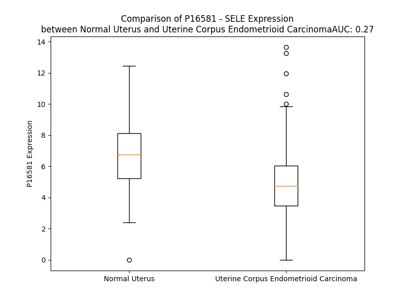

# Detailed Data for P16581

## Introduction to the Detailed Summary

### How to Interpret the Results

- **Summary & Metrics**: This section provides a quick reference to essential protein attributes, including expression changes, family classification, and biomarker applications. Regulation status (upregulated/downregulated) indicates the protein's behavior in a disease context. Some information comes from the original excel file with the proteins selected from literature, while others are derived from the analyses.
- **Expression Comparison**: A visual representation comparing protein expression between normal and disease states. It highlights significant changes in expression levels that might indicate diagnostic or therapeutic relevance. This is data coming from transcriptomics experiments and could not translate similarly to protein levels.
- **Isoform Alignment**: An interactive view of isoform alignments, revealing structural and functional differences between variants of the protein.
- **Interactors & Homologs**: Tables listing known interaction partners and homologous proteins, the more interactors and homologs, the more complex the protein is to design an antibody for.
- **Biological Assemblies**: Information about the structural arrangement of the protein in different assemblies, providing insights into its functional state but also the complexity of the protein to develop antibodies.
- **Combined Per-Residue Information**: A detailed table summarizing residue-level data. This includes predictions for epitope regions, aggregation tendencies, and modifications that might impact the protein's function. Each row corresponds to a residue in the protein, providing insights into specific sites that may be important for research or drug development.
## Summary & Metrics

- **UniProt Accession**: P16581
- **Gene Name**: SELE
- **Protein Name**: E-selectin
- **Swiss Prot**: LYAM2_HUMAN
- **Family**: transmembrane receptor
- **Biomarker Application**: diagnosis,disease progression,efficacy,unspecified application
- **Number of Isoforms**: 0
- **Regulation**: 2
- **(transcriptomics) AUC**: 0.27
- **(transcriptomics) Fold Change**: 1.36
- **(transcriptomics) Regulation**: Downregulated
- **Discotope Epitope Count**: 120
- **Max n_uniprots (Homo)**: 1
- **Max n_uniprots (Hetero)**: N/A

## Expression Comparison

## Interactors

| preferredName_A   | preferredName_B   |   score |
|:------------------|:------------------|--------:|
| SELE              | SELPLG            |   0.999 |
| SELE              | GLG1              |   0.999 |
| SELE              | CD44              |   0.997 |
| SELE              | ITGB2             |   0.993 |
| SELE              | SELL              |   0.988 |
| SELE              | SPN               |   0.988 |
| SELE              | CDH5              |   0.98  |
| SELE              | FUT4              |   0.979 |
| SELE              | VCAM1             |   0.979 |
| SELE              | PECAM1            |   0.959 |
| SELE              | CD34              |   0.953 |
| SELE              | ICAM1             |   0.949 |
| SELE              | SELP              |   0.937 |

## Homologs

| uniprot_id   | gene_id   |
|:-------------|:----------|
| Q92537       | SUSD6     |
| Q6UXD5       | SEZ6L2    |
| A0A8Q3WL76   | C7        |
| A0A8I5KWH5   | CSMD2     |
| Q9BYH1       | SEZ6L     |
| P20851       | C4BPB     |
| P14222       | PRF1      |
| Q4LDE5       | SVEP1     |
| P78539       | SRPX      |
| Q96L08       | SUSD3     |
| P14151       | SELL      |
| A0A8Q3WKM6   | C2        |
| A0A1W2PPV2   | CR2       |
| E5RIG2       | CSMD1     |
| A0A8Q3WKN4   | C8A       |
| Q5SR44       | CR1       |
| Q6NSD3       | CFHR3     |
| A0A8Q3SIC3   | CFH       |
| A0A384NKM6   | APOH      |
| A6PVY5       | C4BPA     |
| P13671       | C6        |
| Q13219       | PAPPA     |
| K7ELJ4       | SEZ6      |
| Q2VPA4       | CR1L      |
| Q9BXP8       | PAPPA2    |
| Q5R349       | SELP      |
| P05160       | F13B      |
| A0A1W2PNZ6   | SRPX2     |
| A0A8Q3WLA6   | CD46      |
| A0A8V8TNF4   | CFHR5     |
| Q92496       | CFHR4     |
| Q03591       | CFHR1     |
| A0A8V8TPL2   | CFHR2     |
| A0A8Q3SI51   | CD55      |
| A0A8Q3SIA7   | C8B       |
| H7BXX0       | CSMD3     |
| A0A8Q3SI37   | C9        |
| A0A0G2JH38   | CFB       |
| A0A7P0T8V7   | SUSD4     |

## Biological Assemblies

|   Unnamed: 0 |   assembly |   n_uniprots | composition   | crystal_id   |
|-------------:|-----------:|-------------:|:--------------|:-------------|
|            0 |          1 |            1 | Homo          | 4csy         |
|            1 |          2 |            1 | Homo          | 4csy         |
|            0 |          1 |            1 | Homo          | 6eyi         |
|            0 |          1 |            1 | Homo          | 6eyj         |
|            1 |          2 |            1 | Homo          | 6eyj         |
|            0 |          1 |            1 | Homo          | 6eyk         |
|            0 |          1 |            1 | Homo          | 1g1t         |
|            0 |          1 |            1 | Homo          | 4c16         |
|            1 |          2 |            1 | Homo          | 4c16         |
|            0 |          1 |            1 | Homo          | 1esl         |

## Combined Per-Residue Information

|   res | aa   |   epitope_score | epitope   |   relative_surface_accessibility |   modeling_confidence |   Aggregation | modification   | glycosylation                   |
|------:|:-----|----------------:|:----------|---------------------------------:|----------------------:|--------------:|:---------------|:--------------------------------|
|     1 | M    |         0.1279  | True      |                          1.27832 |                 34.74 |         0.001 | N/A            | N/A                             |
|     2 | I    |         0.1521  | True      |                          0.95538 |                 38.98 |         3.599 | N/A            | N/A                             |
|     3 | A    |         0.11891 | True      |                          0.97658 |                 41.51 |         3.73  | N/A            | N/A                             |
|     4 | S    |         0.11911 | True      |                          0.71761 |                 44.1  |         4.047 | N/A            | N/A                             |
|     5 | Q    |         0.15672 | True      |                          0.74861 |                 43.61 |         6.604 | N/A            | N/A                             |
|     6 | F    |         0.1228  | True      |                          0.99651 |                 44.78 |        71.916 | N/A            | N/A                             |
|     7 | L    |         0.11016 | False     |                          0.9251  |                 45.54 |        77.243 | N/A            | N/A                             |
|     8 | S    |         0.09206 | False     |                          0.6182  |                 49.25 |        78.219 | N/A            | N/A                             |
|     9 | A    |         0.0981  | False     |                          0.61696 |                 45.11 |        86.083 | N/A            | N/A                             |
|    10 | L    |         0.1244  | True      |                          0.89947 |                 42.36 |        95.375 | N/A            | N/A                             |
|    11 | T    |         0.08397 | False     |                          0.57586 |                 42.49 |        97.064 | N/A            | N/A                             |
|    12 | L    |         0.08889 | False     |                          0.81189 |                 43.74 |        99.872 | N/A            | N/A                             |
|    13 | V    |         0.10583 | False     |                          0.84395 |                 40.59 |        99.865 | N/A            | N/A                             |
|    14 | L    |         0.13564 | True      |                          0.91277 |                 38.82 |        99.77  | N/A            | N/A                             |
|    15 | L    |         0.15175 | True      |                          0.88758 |                 37.28 |        99.196 | N/A            | N/A                             |
|    16 | I    |         0.14421 | True      |                          0.77882 |                 40.54 |        98.031 | N/A            | N/A                             |
|    17 | K    |         0.13131 | True      |                          0.93201 |                 42.4  |         0.107 | N/A            | N/A                             |
|    18 | E    |         0.06958 | False     |                          0.73352 |                 47    |         0.107 | N/A            | N/A                             |
|    19 | S    |         0.07325 | False     |                          0.50111 |                 50.18 |         0.016 | N/A            | N/A                             |
|    20 | G    |         0.04794 | False     |                          0.34502 |                 61.42 |         0.005 | N/A            | N/A                             |
|    21 | A    |         0.03813 | False     |                          0.3995  |                 72.67 |         0.005 | N/A            | N/A                             |
|    22 | W    |         0.02557 | False     |                          0.05776 |                 80.49 |         0.004 | N/A            | N/A                             |
|    23 | S    |         0.04254 | False     |                          0.29304 |                 86.48 |         0.001 | N/A            | N/A                             |
|    24 | Y    |         0.03631 | False     |                          0.11092 |                 91.41 |         0.001 | N/A            | N/A                             |
|    25 | N    |         0.07303 | False     |                          0.30452 |                 93.08 |         0     | N/A            | N-linked (GlcNAc...) asparagine |
|    26 | T    |         0.05402 | False     |                          0.32979 |                 95.25 |         0     | N/A            | N/A                             |
|    27 | S    |         0.03492 | False     |                          0.03084 |                 95.43 |         0     | N/A            | N/A                             |
|    28 | T    |         0.12471 | True      |                          0.9534  |                 92.67 |         0     | N/A            | N/A                             |
|    29 | E    |         0.12756 | True      |                          0.66979 |                 95.56 |         0     | N/A            | N/A                             |
|    30 | A    |         0.07684 | False     |                          0.36509 |                 96.7  |         0     | N/A            | N/A                             |
|    31 | M    |         0.09878 | False     |                          0.14062 |                 97.6  |         0     | N/A            | N/A                             |
|    32 | T    |         0.06382 | False     |                          0.22112 |                 98.09 |         0     | N/A            | N/A                             |
|    33 | Y    |         0.00751 | False     |                          0.00509 |                 97.82 |         0     | N/A            | N/A                             |
|    34 | D    |         0.09417 | False     |                          0.52454 |                 96.94 |         0     | N/A            | N/A                             |
|    35 | E    |         0.08573 | False     |                          0.46327 |                 97.81 |         0     | N/A            | N/A                             |
|    36 | A    |         0.00223 | False     |                          0       |                 97.77 |         0     | N/A            | N/A                             |
|    37 | S    |         0.01902 | False     |                          0.11479 |                 96.3  |         0     | N/A            | N/A                             |
|    38 | A    |         0.10432 | False     |                          0.54792 |                 96.37 |         0     | N/A            | N/A                             |
|    39 | Y    |         0.10656 | False     |                          0.19438 |                 97.15 |         0     | N/A            | N/A                             |
|    40 | C    |         0.00509 | False     |                          0       |                 96.53 |         0     | N/A            | N/A                             |
|    41 | Q    |         0.05215 | False     |                          0.51112 |                 93.93 |         0     | N/A            | N/A                             |
|    42 | Q    |         0.1501  | True      |                          0.7141  |                 93.56 |         0     | N/A            | N/A                             |
|    43 | R    |         0.19455 | True      |                          0.56971 |                 92.27 |         0     | N/A            | N/A                             |
|    44 | Y    |         0.06531 | False     |                          0.27865 |                 92.15 |         0.528 | N/A            | N/A                             |
|    45 | T    |         0.06144 | False     |                          0.37207 |                 89.57 |         0.528 | N/A            | N/A                             |
|    46 | H    |         0.0532  | False     |                          0.09014 |                 93.91 |         0.791 | N/A            | N/A                             |
|    47 | L    |         0.00426 | False     |                          0.00427 |                 96.34 |         1.384 | N/A            | N/A                             |
|    48 | V    |         0.00128 | False     |                          0       |                 93.12 |         1.384 | N/A            | N/A                             |
|    49 | A    |         0.02943 | False     |                          0.17991 |                 88.37 |         1.384 | N/A            | N/A                             |
|    50 | I    |         0.0259  | False     |                          0.0511  |                 87.53 |         1.384 | N/A            | N/A                             |
|    51 | Q    |         0.09622 | False     |                          0.48926 |                 78.79 |         0.593 | N/A            | N/A                             |
|    52 | N    |         0.09275 | False     |                          0.42826 |                 82.87 |         0.134 | N/A            | N/A                             |
|    53 | K    |         0.12643 | True      |                          0.68558 |                 84.44 |         0     | N/A            | N/A                             |
|    54 | E    |         0.12746 | True      |                          0.55837 |                 85.09 |         0     | N/A            | N/A                             |
|    55 | E    |         0.02047 | False     |                          0.01465 |                 88.32 |         0     | N/A            | N/A                             |
|    56 | I    |         0.03171 | False     |                          0.0856  |                 89.96 |         0     | N/A            | N/A                             |
|    57 | E    |         0.09947 | False     |                          0.64109 |                 89.54 |         0     | N/A            | N/A                             |
|    58 | Y    |         0.11134 | False     |                          0.25069 |                 89.27 |         0     | N/A            | N/A                             |
|    59 | L    |         0.00355 | False     |                          0       |                 92.53 |         0     | N/A            | N/A                             |
|    60 | N    |         0.05006 | False     |                          0.2089  |                 92.15 |         0     | N/A            | N/A                             |
|    61 | S    |         0.14671 | True      |                          0.53337 |                 90.3  |         0.186 | N/A            | N/A                             |
|    62 | I    |         0.18075 | True      |                          0.47143 |                 90.65 |         0.186 | N/A            | N/A                             |
|    63 | L    |         0.03439 | False     |                          0.08491 |                 93.22 |         0.186 | N/A            | N/A                             |
|    64 | S    |         0.06119 | False     |                          0.60719 |                 93.1  |         0.186 | N/A            | N/A                             |
|    65 | Y    |         0.22512 | True      |                          0.55786 |                 94.02 |         0.186 | N/A            | N/A                             |
|    66 | S    |         0.03281 | False     |                          0.04189 |                 93.5  |         0     | N/A            | N/A                             |
|    67 | P    |         0.11601 | False     |                          0.82244 |                 92.36 |         0.145 | N/A            | N/A                             |
|    68 | S    |         0.09197 | False     |                          0.24758 |                 93.32 |        14.129 | N/A            | N/A                             |
|    69 | Y    |         0.07617 | False     |                          0.22153 |                 96.38 |        30.005 | N/A            | N/A                             |
|    70 | Y    |         0.03541 | False     |                          0.02798 |                 97.92 |        31.801 | N/A            | N/A                             |
|    71 | W    |         0.01695 | False     |                          0       |                 98.26 |        31.801 | N/A            | N/A                             |
|    72 | I    |         0.00748 | False     |                          0       |                 96.68 |        31.801 | N/A            | N/A                             |
|    73 | G    |         0.0039  | False     |                          0.00399 |                 96.13 |        19.641 | N/A            | N/A                             |
|    74 | I    |         0.0056  | False     |                          0       |                 96.13 |        16.065 | N/A            | N/A                             |
|    75 | R    |         0.08606 | False     |                          0.3173  |                 96.18 |         0     | N/A            | N/A                             |
|    76 | K    |         0.09306 | False     |                          0.19435 |                 96.24 |         0     | N/A            | N/A                             |
|    77 | V    |         0.0974  | False     |                          0.42533 |                 92.98 |         0.228 | N/A            | N/A                             |
|    78 | N    |         0.25408 | True      |                          0.9096  |                 92.14 |         0.273 | N/A            | N/A                             |
|    79 | N    |         0.19377 | True      |                          0.86237 |                 91.08 |         4.062 | N/A            | N/A                             |
|    80 | V    |         0.11514 | False     |                          0.5065  |                 95.1  |        94.466 | N/A            | N/A                             |
|    81 | W    |         0.08477 | False     |                          0.12205 |                 95.5  |        95.223 | N/A            | N/A                             |
|    82 | V    |         0.09131 | False     |                          0.09521 |                 94.57 |        95.256 | N/A            | N/A                             |
|    83 | W    |         0.0804  | False     |                          0.09303 |                 93.76 |        95.256 | N/A            | N/A                             |
|    84 | V    |         0.10923 | False     |                          0.12415 |                 92.65 |        94.97  | N/A            | N/A                             |
|    85 | G    |         0.11755 | False     |                          0.45223 |                 85.95 |        10.137 | N/A            | N/A                             |
|    86 | T    |         0.14627 | True      |                          0.54513 |                 85.29 |         1.884 | N/A            | N/A                             |
|    87 | Q    |         0.2473  | True      |                          0.61606 |                 90.24 |         0.062 | N/A            | N/A                             |
|    88 | K    |         0.16088 | True      |                          0.66254 |                 90.71 |         0     | N/A            | N/A                             |
|    89 | P    |         0.21962 | True      |                          0.60621 |                 92.56 |         0     | N/A            | N/A                             |
|    90 | L    |         0.06283 | False     |                          0.1157  |                 90.66 |         0     | N/A            | N/A                             |
|    91 | T    |         0.11923 | True      |                          0.51335 |                 88.47 |         0     | N/A            | N/A                             |
|    92 | E    |         0.15663 | True      |                          0.64829 |                 86.85 |         0     | N/A            | N/A                             |
|    93 | E    |         0.12743 | True      |                          0.7901  |                 83.04 |         0     | N/A            | N/A                             |
|    94 | A    |         0.06946 | False     |                          0.26968 |                 85.46 |         0     | N/A            | N/A                             |
|    95 | K    |         0.13251 | True      |                          0.38876 |                 90.31 |         0     | N/A            | N/A                             |
|    96 | N    |         0.10688 | False     |                          0.143   |                 92.75 |         0     | N/A            | N/A                             |
|    97 | W    |         0.08589 | False     |                          0.16311 |                 95.06 |         0     | N/A            | N/A                             |
|    98 | A    |         0.05151 | False     |                          0.05839 |                 94.83 |         0     | N/A            | N/A                             |
|    99 | P    |         0.2567  | True      |                          0.7162  |                 94.82 |         0     | N/A            | N/A                             |
|   100 | G    |         0.20831 | True      |                          0.80843 |                 94.21 |         0     | N/A            | N/A                             |
|   101 | E    |         0.15668 | True      |                          0.19067 |                 95.27 |         0     | N/A            | N/A                             |
|   102 | P    |         0.12659 | True      |                          0.41209 |                 94.99 |         0     | N/A            | N/A                             |
|   103 | N    |         0.07365 | False     |                          0.42742 |                 93.51 |         0     | N/A            | N/A                             |
|   104 | N    |         0.12364 | True      |                          0.42926 |                 91.84 |         0     | N/A            | N/A                             |
|   105 | R    |         0.23541 | True      |                          0.81737 |                 87.57 |         0     | N/A            | N/A                             |
|   106 | Q    |         0.16856 | True      |                          0.33355 |                 82.42 |         0     | N/A            | N/A                             |
|   107 | K    |         0.18229 | True      |                          0.79285 |                 83.99 |         0     | N/A            | N/A                             |
|   108 | D    |         0.13069 | True      |                          0.63001 |                 89.93 |         0     | N/A            | N/A                             |
|   109 | E    |         0.03719 | False     |                          0.02737 |                 94.56 |         0     | N/A            | N/A                             |
|   110 | D    |         0.06261 | False     |                          0.25932 |                 96.29 |         0     | N/A            | N/A                             |
|   111 | C    |         0.00495 | False     |                          0.00187 |                 97.04 |         0     | N/A            | N/A                             |
|   112 | V    |         0.00328 | False     |                          0       |                 97.33 |         0.617 | N/A            | N/A                             |
|   113 | E    |         0.02784 | False     |                          0.0263  |                 96.79 |         0.761 | N/A            | N/A                             |
|   114 | I    |         0.00789 | False     |                          0       |                 95.95 |         0.761 | N/A            | N/A                             |
|   115 | Y    |         0.08973 | False     |                          0.06688 |                 95.89 |         0.761 | N/A            | N/A                             |
|   116 | I    |         0.00808 | False     |                          0.00753 |                 94.41 |         0.761 | N/A            | N/A                             |
|   117 | K    |         0.11527 | False     |                          0.44906 |                 92.53 |         0.761 | N/A            | N/A                             |
|   118 | R    |         0.15798 | True      |                          0.25952 |                 91.05 |         0     | N/A            | N/A                             |
|   119 | E    |         0.16818 | True      |                          0.94914 |                 88.55 |         0     | N/A            | N/A                             |
|   120 | K    |         0.2276  | True      |                          0.68519 |                 91.6  |         0     | N/A            | N/A                             |
|   121 | D    |         0.08506 | False     |                          0.14122 |                 92.06 |         0     | N/A            | N/A                             |
|   122 | V    |         0.06366 | False     |                          0.44868 |                 93.05 |         0     | N/A            | N/A                             |
|   123 | G    |         0.01734 | False     |                          0.00644 |                 91.76 |         0     | N/A            | N/A                             |
|   124 | M    |         0.11427 | False     |                          0.33003 |                 94.51 |         0     | N/A            | N/A                             |
|   125 | W    |         0.00747 | False     |                          0.00055 |                 95.62 |         0     | N/A            | N/A                             |
|   126 | N    |         0.10046 | False     |                          0.1252  |                 96.62 |         0     | N/A            | N/A                             |
|   127 | D    |         0.02033 | False     |                          0.00554 |                 96.88 |         0     | N/A            | N/A                             |
|   128 | E    |         0.06907 | False     |                          0.09442 |                 96.38 |         0     | N/A            | N/A                             |
|   129 | R    |         0.19116 | True      |                          0.36541 |                 96.48 |         0     | N/A            | N/A                             |
|   130 | C    |         0.05164 | False     |                          0.21907 |                 96.63 |         0     | N/A            | N/A                             |
|   131 | S    |         0.15523 | True      |                          0.65076 |                 96.02 |         0     | N/A            | N/A                             |
|   132 | K    |         0.13363 | True      |                          0.44733 |                 96.24 |         0     | N/A            | N/A                             |
|   133 | K    |         0.1039  | False     |                          0.64662 |                 97.57 |         0     | N/A            | N/A                             |
|   134 | K    |         0.03992 | False     |                          0.06005 |                 97.73 |         0     | N/A            | N/A                             |
|   135 | L    |         0.02273 | False     |                          0.17888 |                 97.98 |         0.136 | N/A            | N/A                             |
|   136 | A    |         0.00186 | False     |                          0       |                 97.63 |         0.136 | N/A            | N/A                             |
|   137 | L    |         0.00328 | False     |                          0       |                 96.97 |         0.136 | N/A            | N/A                             |
|   138 | C    |         0.00339 | False     |                          0       |                 95.09 |         0.136 | N/A            | N/A                             |
|   139 | Y    |         0.03805 | False     |                          0.10165 |                 91.09 |         0.136 | N/A            | N/A                             |
|   140 | T    |         0.04533 | False     |                          0.3158  |                 87.1  |         0     | N/A            | N/A                             |
|   141 | A    |         0.04661 | False     |                          0.33328 |                 84.8  |         0     | N/A            | N/A                             |
|   142 | A    |         0.01778 | False     |                          0.03838 |                 84.2  |         0     | N/A            | N/A                             |
|   143 | C    |         0.02278 | False     |                          0.26767 |                 87.21 |         0     | N/A            | N/A                             |
|   144 | T    |         0.06538 | False     |                          0.59925 |                 84.18 |         0     | N/A            | N/A                             |
|   145 | N    |         0.08214 | False     |                          0.96818 |                 80.66 |         0     | N/A            | N-linked (GlcNAc...) asparagine |
|   146 | T    |         0.12383 | True      |                          0.77921 |                 84.9  |         0     | N/A            | N/A                             |
|   147 | S    |         0.03688 | False     |                          0.08549 |                 87.31 |         0     | N/A            | N/A                             |
|   148 | C    |         0.02957 | False     |                          0.02793 |                 91.49 |         0     | N/A            | N/A                             |
|   149 | S    |         0.08389 | False     |                          0.38135 |                 90.24 |         0     | N/A            | N/A                             |
|   150 | G    |         0.12897 | True      |                          0.64976 |                 88.12 |         0     | N/A            | N/A                             |
|   151 | H    |         0.07173 | False     |                          0.31934 |                 90.26 |         0     | N/A            | N/A                             |
|   152 | G    |         0.03703 | False     |                          0.27369 |                 91.23 |         0     | N/A            | N/A                             |
|   153 | E    |         0.07627 | False     |                          0.53559 |                 90.96 |         0     | N/A            | N/A                             |
|   154 | C    |         0.01716 | False     |                          0.24538 |                 89.32 |         0     | N/A            | N/A                             |
|   155 | V    |         0.04424 | False     |                          0.46842 |                 86.78 |         0     | N/A            | N/A                             |
|   156 | E    |         0.05077 | False     |                          0.1702  |                 82.92 |         0     | N/A            | N/A                             |
|   157 | T    |         0.06423 | False     |                          0.3252  |                 77.97 |         0     | N/A            | N/A                             |
|   158 | I    |         0.11425 | False     |                          0.37667 |                 73.37 |         0     | N/A            | N/A                             |
|   159 | N    |         0.10461 | False     |                          0.43905 |                 73.89 |         0     | N/A            | N/A                             |
|   160 | N    |         0.07844 | False     |                          0.50312 |                 80.79 |         0     | N/A            | N-linked (GlcNAc...) asparagine |
|   161 | Y    |         0.06133 | False     |                          0.08813 |                 85.25 |         0     | N/A            | N/A                             |
|   162 | T    |         0.07469 | False     |                          0.51023 |                 86.99 |         0     | N/A            | N/A                             |
|   163 | C    |         0.05568 | False     |                          0.17343 |                 91.17 |         0     | N/A            | N/A                             |
|   164 | K    |         0.12016 | True      |                          0.68134 |                 91.79 |         0     | N/A            | N/A                             |
|   165 | C    |         0.05423 | False     |                          0.28541 |                 93.15 |         0     | N/A            | N/A                             |
|   166 | D    |         0.06866 | False     |                          0.39679 |                 93.63 |         0     | N/A            | N/A                             |
|   167 | P    |         0.13167 | True      |                          0.69543 |                 93.01 |         0     | N/A            | N/A                             |
|   168 | G    |         0.01761 | False     |                          0.04286 |                 93.24 |         0     | N/A            | N/A                             |
|   169 | F    |         0.0636  | False     |                          0.13883 |                 94.68 |         0     | N/A            | N/A                             |
|   170 | S    |         0.06548 | False     |                          0.35753 |                 90.68 |         0     | N/A            | N/A                             |
|   171 | G    |         0.0899  | False     |                          0.36957 |                 88.54 |         0     | N/A            | N/A                             |
|   172 | L    |         0.061   | False     |                          0.98592 |                 88.08 |         0     | N/A            | N/A                             |
|   173 | K    |         0.05188 | False     |                          0.44901 |                 88.45 |         0     | N/A            | N/A                             |
|   174 | C    |         0.01172 | False     |                          0       |                 92.25 |         0     | N/A            | N/A                             |
|   175 | E    |         0.2307  | True      |                          0.48713 |                 90.74 |         0     | N/A            | N/A                             |
|   176 | Q    |         0.08429 | False     |                          0.52154 |                 91.49 |         0     | N/A            | N/A                             |
|   177 | I    |         0.07752 | False     |                          0.29572 |                 93.66 |         0     | N/A            | N/A                             |
|   178 | V    |         0.05999 | False     |                          0.22564 |                 93.99 |         0     | N/A            | N/A                             |
|   179 | N    |         0.103   | False     |                          0.61879 |                 94.43 |         0     | N/A            | N-linked (GlcNAc...) asparagine |
|   180 | C    |         0.035   | False     |                          0.07558 |                 95.3  |         0     | N/A            | N/A                             |
|   181 | T    |         0.082   | False     |                          0.71926 |                 94.14 |         0     | N/A            | N/A                             |
|   182 | A    |         0.07201 | False     |                          0.67838 |                 93.92 |         0     | N/A            | N/A                             |
|   183 | L    |         0.04639 | False     |                          0.18144 |                 94.08 |         0     | N/A            | N/A                             |
|   184 | E    |         0.09567 | False     |                          0.7384  |                 93.5  |         0     | N/A            | N/A                             |
|   185 | S    |         0.07801 | False     |                          0.50432 |                 93.79 |         0     | N/A            | N/A                             |
|   186 | P    |         0.05238 | False     |                          0.20609 |                 94.45 |         0     | N/A            | N/A                             |
|   187 | E    |         0.09766 | False     |                          0.72109 |                 94.24 |         0     | N/A            | N/A                             |
|   188 | H    |         0.06    | False     |                          0.40896 |                 93.66 |         0     | N/A            | N/A                             |
|   189 | G    |         0.02154 | False     |                          0.16975 |                 94.81 |         0     | N/A            | N/A                             |
|   190 | S    |         0.03184 | False     |                          0.4157  |                 96.01 |         0     | N/A            | N/A                             |
|   191 | L    |         0.05878 | False     |                          0.18268 |                 95.17 |         0     | N/A            | N/A                             |
|   192 | V    |         0.07179 | False     |                          0.67245 |                 95.47 |         0     | N/A            | N/A                             |
|   193 | C    |         0.06297 | False     |                          0.33944 |                 95.53 |         0     | N/A            | N/A                             |
|   194 | S    |         0.05893 | False     |                          0.50965 |                 96.59 |         0     | N/A            | N/A                             |
|   195 | H    |         0.17785 | True      |                          0.29972 |                 96.35 |         0     | N/A            | N/A                             |
|   196 | P    |         0.17613 | True      |                          0.65999 |                 93.9  |         0     | N/A            | N/A                             |
|   197 | L    |         0.12344 | True      |                          0.40994 |                 91.54 |         0     | N/A            | N/A                             |
|   198 | G    |         0.10348 | False     |                          0.39211 |                 91.45 |         0     | N/A            | N/A                             |
|   199 | N    |         0.14764 | True      |                          0.74045 |                 94.15 |         0     | N/A            | N-linked (GlcNAc...) asparagine |
|   200 | F    |         0.03746 | False     |                          0.22368 |                 94.73 |         0     | N/A            | N/A                             |
|   201 | S    |         0.03029 | False     |                          0.05402 |                 94.87 |         0     | N/A            | N/A                             |
|   202 | Y    |         0.06209 | False     |                          0.19182 |                 95    |         0     | N/A            | N/A                             |
|   203 | N    |         0.06122 | False     |                          0.51034 |                 94.74 |         0     | N/A            | N-linked (GlcNAc...) asparagine |
|   204 | S    |         0.00424 | False     |                          0.00079 |                 97.43 |         0     | N/A            | N/A                             |
|   205 | S    |         0.03021 | False     |                          0.26146 |                 97.01 |         0     | N/A            | N/A                             |
|   206 | C    |         0.0049  | False     |                          0.002   |                 96.45 |         0     | N/A            | N/A                             |
|   207 | S    |         0.09175 | False     |                          0.34003 |                 96.01 |         0     | N/A            | N/A                             |
|   208 | I    |         0.04185 | False     |                          0.11544 |                 95.94 |         0     | N/A            | N/A                             |
|   209 | S    |         0.06011 | False     |                          0.40287 |                 95.35 |         0     | N/A            | N/A                             |
|   210 | C    |         0.07449 | False     |                          0.22421 |                 95.76 |         0     | N/A            | N/A                             |
|   211 | D    |         0.11594 | False     |                          0.4532  |                 94.22 |         0     | N/A            | N/A                             |
|   212 | R    |         0.15358 | True      |                          0.74506 |                 93.08 |         0     | N/A            | N/A                             |
|   213 | G    |         0.02043 | False     |                          0.07003 |                 91.35 |         0     | N/A            | N/A                             |
|   214 | Y    |         0.10081 | False     |                          0.18743 |                 94.14 |         0     | N/A            | N/A                             |
|   215 | L    |         0.05276 | False     |                          0.68188 |                 93.01 |         0     | N/A            | N/A                             |
|   216 | P    |         0.03666 | False     |                          0.26439 |                 94.59 |         0     | N/A            | N/A                             |
|   217 | S    |         0.11645 | False     |                          0.5371  |                 94.16 |         0     | N/A            | N/A                             |
|   218 | S    |         0.0593  | False     |                          0.34455 |                 93.78 |         0     | N/A            | N/A                             |
|   219 | M    |         0.1626  | True      |                          0.83576 |                 93.19 |         0     | N/A            | N/A                             |
|   220 | E    |         0.09397 | False     |                          0.51978 |                 93.92 |         0     | N/A            | N/A                             |
|   221 | T    |         0.12195 | True      |                          0.4731  |                 95.04 |         0     | N/A            | N/A                             |
|   222 | M    |         0.01167 | False     |                          0.00283 |                 95.65 |         0     | N/A            | N/A                             |
|   223 | Q    |         0.06542 | False     |                          0.49226 |                 96.62 |         0     | N/A            | N/A                             |
|   224 | C    |         0.02346 | False     |                          0.01555 |                 96.83 |         0     | N/A            | N/A                             |
|   225 | M    |         0.06956 | False     |                          0.50574 |                 96.24 |         0     | N/A            | N/A                             |
|   226 | S    |         0.05743 | False     |                          0.38758 |                 93.86 |         0     | N/A            | N/A                             |
|   227 | S    |         0.11857 | True      |                          0.62014 |                 93.73 |         0     | N/A            | N/A                             |
|   228 | G    |         0.05125 | False     |                          0.2513  |                 92.42 |         0     | N/A            | N/A                             |
|   229 | E    |         0.08988 | False     |                          0.62106 |                 95.5  |         0     | N/A            | N/A                             |
|   230 | W    |         0.11153 | False     |                          0.15785 |                 95.89 |         0     | N/A            | N/A                             |
|   231 | S    |         0.09364 | False     |                          0.40599 |                 95.89 |         0     | N/A            | N/A                             |
|   232 | A    |         0.04056 | False     |                          0.10501 |                 94.6  |         0     | N/A            | N/A                             |
|   233 | P    |         0.12689 | True      |                          0.86484 |                 94.28 |         0     | N/A            | N/A                             |
|   234 | I    |         0.06955 | False     |                          0.3828  |                 94.43 |         0     | N/A            | N/A                             |
|   235 | P    |         0.01334 | False     |                          0.04573 |                 95.22 |         0     | N/A            | N/A                             |
|   236 | A    |         0.04464 | False     |                          0.48414 |                 94.74 |         0     | N/A            | N/A                             |
|   237 | C    |         0.0466  | False     |                          0.09951 |                 96.01 |         0     | N/A            | N/A                             |
|   238 | N    |         0.081   | False     |                          0.53334 |                 94.09 |         0     | N/A            | N/A                             |
|   239 | V    |         0.0568  | False     |                          0.35235 |                 93    |         0     | N/A            | N/A                             |
|   240 | V    |         0.04288 | False     |                          0.08759 |                 92.56 |         0     | N/A            | N/A                             |
|   241 | E    |         0.08652 | False     |                          0.52652 |                 90.43 |         0     | N/A            | N/A                             |
|   242 | C    |         0.04018 | False     |                          0.06342 |                 91.5  |         0     | N/A            | N/A                             |
|   243 | D    |         0.07692 | False     |                          0.73239 |                 90.64 |         0     | N/A            | N/A                             |
|   244 | A    |         0.09263 | False     |                          0.72187 |                 88.45 |         0     | N/A            | N/A                             |
|   245 | V    |         0.04802 | False     |                          0.14642 |                 88.28 |         0     | N/A            | N/A                             |
|   246 | T    |         0.07    | False     |                          0.62521 |                 89.9  |         0     | N/A            | N/A                             |
|   247 | N    |         0.1243  | True      |                          0.59013 |                 90.63 |         0     | N/A            | N/A                             |
|   248 | P    |         0.0331  | False     |                          0.06963 |                 91.62 |         0     | N/A            | N/A                             |
|   249 | A    |         0.07994 | False     |                          0.7783  |                 90.81 |         0     | N/A            | N/A                             |
|   250 | N    |         0.07684 | False     |                          0.39743 |                 90.64 |         0     | N/A            | N/A                             |
|   251 | G    |         0.02252 | False     |                          0.08518 |                 94    |         0     | N/A            | N/A                             |
|   252 | F    |         0.05745 | False     |                          0.41967 |                 94    |         0     | N/A            | N/A                             |
|   253 | V    |         0.03529 | False     |                          0.20181 |                 92.36 |         0     | N/A            | N/A                             |
|   254 | E    |         0.06512 | False     |                          0.57792 |                 91    |         0     | N/A            | N/A                             |
|   255 | C    |         0.06699 | False     |                          0.29294 |                 89.31 |         0     | N/A            | N/A                             |
|   256 | F    |         0.25639 | True      |                          0.79864 |                 76.86 |         0     | N/A            | N/A                             |
|   257 | Q    |         0.1321  | True      |                          0.58606 |                 67.2  |         0     | N/A            | N/A                             |
|   258 | N    |         0.12593 | True      |                          0.72868 |                 61.65 |         0     | N/A            | N/A                             |
|   259 | P    |         0.09235 | False     |                          1.02624 |                 67.58 |         0     | N/A            | N/A                             |
|   260 | G    |         0.0855  | False     |                          0.8093  |                 72.04 |         0     | N/A            | N/A                             |
|   261 | S    |         0.04739 | False     |                          0.35019 |                 82.02 |         0     | N/A            | N/A                             |
|   262 | F    |         0.02572 | False     |                          0.09271 |                 89.92 |         0     | N/A            | N/A                             |
|   263 | P    |         0.06185 | False     |                          0.23063 |                 90.81 |         0     | N/A            | N/A                             |
|   264 | W    |         0.16636 | True      |                          0.36086 |                 89.3  |         0     | N/A            | N/A                             |
|   265 | N    |         0.06979 | False     |                          0.57937 |                 88.56 |         0     | N/A            | N-linked (GlcNAc...) asparagine |
|   266 | T    |         0.0224  | False     |                          0.03442 |                 91.16 |         0     | N/A            | N/A                             |
|   267 | T    |         0.03255 | False     |                          0.27608 |                 92.2  |         0     | N/A            | N/A                             |
|   268 | C    |         0.00246 | False     |                          0       |                 92.56 |         0     | N/A            | N/A                             |
|   269 | T    |         0.05303 | False     |                          0.3518  |                 93.74 |         0     | N/A            | N/A                             |
|   270 | F    |         0.02438 | False     |                          0.05543 |                 94.99 |         0     | N/A            | N/A                             |
|   271 | D    |         0.08909 | False     |                          0.48058 |                 94.61 |         0     | N/A            | N/A                             |
|   272 | C    |         0.04213 | False     |                          0.12571 |                 94.65 |         0     | N/A            | N/A                             |
|   273 | E    |         0.08822 | False     |                          0.46687 |                 92.02 |         0     | N/A            | N/A                             |
|   274 | E    |         0.08837 | False     |                          0.70599 |                 88.33 |         0     | N/A            | N/A                             |
|   275 | G    |         0.01538 | False     |                          0.06914 |                 87.37 |         0     | N/A            | N/A                             |
|   276 | F    |         0.08851 | False     |                          0.22934 |                 92.06 |         0     | N/A            | N/A                             |
|   277 | E    |         0.04354 | False     |                          0.53603 |                 91.52 |         0     | N/A            | N/A                             |
|   278 | L    |         0.03274 | False     |                          0.23862 |                 93.78 |         0     | N/A            | N/A                             |
|   279 | M    |         0.07444 | False     |                          0.47624 |                 93.22 |         0     | N/A            | N/A                             |
|   280 | G    |         0.0811  | False     |                          0.71396 |                 93.89 |         0     | N/A            | N/A                             |
|   281 | A    |         0.04142 | False     |                          0.26959 |                 94.58 |         0     | N/A            | N/A                             |
|   282 | Q    |         0.11045 | False     |                          0.69986 |                 93.59 |         0     | N/A            | N/A                             |
|   283 | S    |         0.06263 | False     |                          0.33428 |                 94.01 |         0     | N/A            | N/A                             |
|   284 | L    |         0.01954 | False     |                          0.01401 |                 93.98 |         0     | N/A            | N/A                             |
|   285 | Q    |         0.04254 | False     |                          0.39304 |                 92.87 |         0     | N/A            | N/A                             |
|   286 | C    |         0.02632 | False     |                          0.0111  |                 92.84 |         0     | N/A            | N/A                             |
|   287 | T    |         0.04479 | False     |                          0.32082 |                 93.35 |         0     | N/A            | N/A                             |
|   288 | S    |         0.10453 | False     |                          0.28639 |                 91.65 |         0     | N/A            | N/A                             |
|   289 | S    |         0.10387 | False     |                          0.64667 |                 90.05 |         0     | N/A            | N/A                             |
|   290 | G    |         0.03193 | False     |                          0.2008  |                 90.66 |         0     | N/A            | N/A                             |
|   291 | N    |         0.08709 | False     |                          0.61768 |                 92.82 |         0     | N/A            | N/A                             |
|   292 | W    |         0.08775 | False     |                          0.18898 |                 93.72 |         0     | N/A            | N/A                             |
|   293 | D    |         0.19111 | True      |                          0.43293 |                 93.59 |         0     | N/A            | N/A                             |
|   294 | N    |         0.04839 | False     |                          0.45011 |                 94.57 |         0     | N/A            | N/A                             |
|   295 | E    |         0.08208 | False     |                          0.81891 |                 92.76 |         0     | N/A            | N/A                             |
|   296 | K    |         0.05267 | False     |                          0.42162 |                 92.7  |         0     | N/A            | N/A                             |
|   297 | P    |         0.00894 | False     |                          0.02053 |                 95.42 |         0     | N/A            | N/A                             |
|   298 | T    |         0.06369 | False     |                          0.5129  |                 94.81 |         0     | N/A            | N/A                             |
|   299 | C    |         0.0468  | False     |                          0.1158  |                 94.35 |         0     | N/A            | N/A                             |
|   300 | K    |         0.07738 | False     |                          0.5863  |                 91.67 |         0     | N/A            | N/A                             |
|   301 | A    |         0.03082 | False     |                          0.22094 |                 89.55 |         0     | N/A            | N/A                             |
|   302 | V    |         0.03709 | False     |                          0.14281 |                 92.33 |         0     | N/A            | N/A                             |
|   303 | T    |         0.07922 | False     |                          0.59189 |                 90.89 |         0     | N/A            | N/A                             |
|   304 | C    |         0.02601 | False     |                          0.05614 |                 91.85 |         0     | N/A            | N/A                             |
|   305 | R    |         0.12069 | True      |                          0.60738 |                 91.2  |         0     | N/A            | N/A                             |
|   306 | A    |         0.06484 | False     |                          0.67096 |                 91.53 |         0     | N/A            | N/A                             |
|   307 | V    |         0.04497 | False     |                          0.10275 |                 90.26 |         0     | N/A            | N/A                             |
|   308 | R    |         0.13027 | True      |                          0.85274 |                 88.5  |         0     | N/A            | N/A                             |
|   309 | Q    |         0.14783 | True      |                          0.65245 |                 85.83 |         0     | N/A            | N/A                             |
|   310 | P    |         0.04662 | False     |                          0.1422  |                 87.83 |         0     | N/A            | N/A                             |
|   311 | Q    |         0.10018 | False     |                          0.75754 |                 86.73 |         0     | N/A            | N/A                             |
|   312 | N    |         0.07888 | False     |                          0.40028 |                 87.78 |         0     | N/A            | N-linked (GlcNAc...) asparagine |
|   313 | G    |         0.02235 | False     |                          0.11471 |                 90.64 |         0     | N/A            | N/A                             |
|   314 | S    |         0.04757 | False     |                          0.4036  |                 91.28 |         0     | N/A            | N/A                             |
|   315 | V    |         0.04018 | False     |                          0.17381 |                 92.93 |         0     | N/A            | N/A                             |
|   316 | R    |         0.13989 | True      |                          0.82297 |                 94.21 |         0     | N/A            | N/A                             |
|   317 | C    |         0.04984 | False     |                          0.28615 |                 93.18 |         0     | N/A            | N/A                             |
|   318 | S    |         0.06898 | False     |                          0.5753  |                 93.56 |         0     | N/A            | N/A                             |
|   319 | H    |         0.09795 | False     |                          0.39884 |                 92.64 |         0     | N/A            | N/A                             |
|   320 | S    |         0.0419  | False     |                          0.14351 |                 87.05 |         0     | N/A            | N/A                             |
|   321 | P    |         0.2951  | True      |                          1.11338 |                 85.85 |         0     | N/A            | N/A                             |
|   322 | A    |         0.08267 | False     |                          0.50153 |                 82.93 |         0     | N/A            | N/A                             |
|   323 | G    |         0.06363 | False     |                          0.3573  |                 87.17 |         0     | N/A            | N/A                             |
|   324 | E    |         0.07017 | False     |                          0.62416 |                 90.43 |         0     | N/A            | N/A                             |
|   325 | F    |         0.02268 | False     |                          0.17512 |                 91.9  |         0     | N/A            | N/A                             |
|   326 | T    |         0.02425 | False     |                          0.02856 |                 91.29 |         0     | N/A            | N/A                             |
|   327 | F    |         0.04788 | False     |                          0.20001 |                 89.11 |         0     | N/A            | N/A                             |
|   328 | K    |         0.09908 | False     |                          0.64322 |                 88.53 |         0     | N/A            | N/A                             |
|   329 | S    |         0.0022  | False     |                          0       |                 93.63 |         0     | N/A            | N/A                             |
|   330 | S    |         0.02413 | False     |                          0.13465 |                 94.49 |         0     | N/A            | N/A                             |
|   331 | C    |         0.00342 | False     |                          0       |                 94.3  |         0     | N/A            | N/A                             |
|   332 | N    |         0.06323 | False     |                          0.4457  |                 95.47 |         0     | N/A            | N-linked (GlcNAc...) asparagine |
|   333 | F    |         0.01352 | False     |                          0.03449 |                 94.67 |         0     | N/A            | N/A                             |
|   334 | T    |         0.06043 | False     |                          0.60123 |                 92.49 |         0     | N/A            | N/A                             |
|   335 | C    |         0.04006 | False     |                          0.25469 |                 91.12 |         0     | N/A            | N/A                             |
|   336 | E    |         0.05354 | False     |                          0.4781  |                 86.66 |         0     | N/A            | N/A                             |
|   337 | E    |         0.09896 | False     |                          0.81359 |                 81.54 |         0     | N/A            | N/A                             |
|   338 | G    |         0.03685 | False     |                          0.07647 |                 73.74 |         0     | N/A            | N/A                             |
|   339 | F    |         0.11553 | False     |                          0.27332 |                 83.86 |         0     | N/A            | N/A                             |
|   340 | M    |         0.03714 | False     |                          0.45432 |                 83.4  |         0     | N/A            | N/A                             |
|   341 | L    |         0.035   | False     |                          0.30604 |                 89.93 |         0     | N/A            | N/A                             |
|   342 | Q    |         0.07842 | False     |                          0.41976 |                 87.8  |         0     | N/A            | N/A                             |
|   343 | G    |         0.05207 | False     |                          0.61707 |                 90.51 |         0     | N/A            | N/A                             |
|   344 | P    |         0.08391 | False     |                          0.19116 |                 92.24 |         0     | N/A            | N/A                             |
|   345 | A    |         0.09944 | False     |                          0.58116 |                 91.85 |         0     | N/A            | N/A                             |
|   346 | Q    |         0.10358 | False     |                          0.46038 |                 93.41 |         0     | N/A            | N/A                             |
|   347 | V    |         0.00918 | False     |                          0.00571 |                 94.58 |         0     | N/A            | N/A                             |
|   348 | E    |         0.0685  | False     |                          0.36603 |                 94.02 |         0     | N/A            | N/A                             |
|   349 | C    |         0.02156 | False     |                          0.01036 |                 93.72 |         0     | N/A            | N/A                             |
|   350 | T    |         0.04554 | False     |                          0.28319 |                 92.41 |         0     | N/A            | N/A                             |
|   351 | T    |         0.106   | False     |                          0.37241 |                 88.49 |         0     | N/A            | N/A                             |
|   352 | Q    |         0.11229 | False     |                          0.74081 |                 87.83 |         0     | N/A            | N/A                             |
|   353 | G    |         0.02956 | False     |                          0.23093 |                 88.88 |         0     | N/A            | N/A                             |
|   354 | Q    |         0.0521  | False     |                          0.58942 |                 92.26 |         0     | N/A            | N/A                             |
|   355 | W    |         0.05077 | False     |                          0.08833 |                 93.25 |         0     | N/A            | N/A                             |
|   356 | T    |         0.12622 | True      |                          0.53191 |                 90.79 |         0     | N/A            | N/A                             |
|   357 | Q    |         0.0842  | False     |                          0.53051 |                 92.45 |         0     | N/A            | N/A                             |
|   358 | Q    |         0.10033 | False     |                          0.78777 |                 90.72 |         0     | N/A            | N/A                             |
|   359 | I    |         0.02806 | False     |                          0.28294 |                 90.84 |         0     | N/A            | N/A                             |
|   360 | P    |         0.01123 | False     |                          0.03086 |                 92.92 |         0     | N/A            | N/A                             |
|   361 | V    |         0.04698 | False     |                          0.60837 |                 91.67 |         0     | N/A            | N/A                             |
|   362 | C    |         0.02948 | False     |                          0.0755  |                 90.22 |         0     | N/A            | N/A                             |
|   363 | E    |         0.07266 | False     |                          0.44676 |                 82.58 |         0     | N/A            | N/A                             |
|   364 | A    |         0.08167 | False     |                          0.22504 |                 76.9  |         0     | N/A            | N/A                             |
|   365 | F    |         0.06012 | False     |                          0.20765 |                 74.99 |         0     | N/A            | N/A                             |
|   366 | Q    |         0.10733 | False     |                          0.58615 |                 76.29 |         0     | N/A            | N/A                             |
|   367 | C    |         0.03323 | False     |                          0.05256 |                 82.19 |         0     | N/A            | N/A                             |
|   368 | T    |         0.07184 | False     |                          0.6923  |                 82.56 |         0     | N/A            | N/A                             |
|   369 | A    |         0.07272 | False     |                          0.77956 |                 83.78 |         0     | N/A            | N/A                             |
|   370 | L    |         0.03311 | False     |                          0.1575  |                 86.14 |         0     | N/A            | N/A                             |
|   371 | S    |         0.05396 | False     |                          0.51386 |                 86.64 |         0     | N/A            | N/A                             |
|   372 | N    |         0.1185  | True      |                          0.52361 |                 86.98 |         0     | N/A            | N/A                             |
|   373 | P    |         0.02283 | False     |                          0.04612 |                 89.06 |         0     | N/A            | N/A                             |
|   374 | E    |         0.07491 | False     |                          0.77422 |                 89.43 |         0     | N/A            | N/A                             |
|   375 | R    |         0.11794 | False     |                          0.47259 |                 88.82 |         0     | N/A            | N/A                             |
|   376 | G    |         0.01226 | False     |                          0.06662 |                 91.17 |         0     | N/A            | N/A                             |
|   377 | Y    |         0.03668 | False     |                          0.53759 |                 91.74 |         0     | N/A            | N/A                             |
|   378 | M    |         0.03017 | False     |                          0.15896 |                 90.09 |         0     | N/A            | N/A                             |
|   379 | N    |         0.04794 | False     |                          0.74128 |                 89.7  |         0     | N/A            | N/A                             |
|   380 | C    |         0.02572 | False     |                          0.07208 |                 87.32 |         0     | N/A            | N/A                             |
|   381 | L    |         0.12931 | True      |                          0.81054 |                 83.84 |         0     | N/A            | N/A                             |
|   382 | P    |         0.24096 | True      |                          0.8426  |                 76.45 |         0     | N/A            | N/A                             |
|   383 | S    |         0.06537 | False     |                          0.36893 |                 68.3  |         0     | N/A            | N/A                             |
|   384 | A    |         0.13344 | True      |                          0.75257 |                 64.2  |         0     | N/A            | N/A                             |
|   385 | S    |         0.13558 | True      |                          0.70922 |                 60.48 |         0     | N/A            | N/A                             |
|   386 | G    |         0.17043 | True      |                          0.75551 |                 61.89 |         0     | N/A            | N/A                             |
|   387 | S    |         0.09049 | False     |                          0.43589 |                 69.11 |         0     | N/A            | N/A                             |
|   388 | F    |         0.01194 | False     |                          0.01255 |                 79.75 |         0     | N/A            | N/A                             |
|   389 | R    |         0.23571 | True      |                          0.61906 |                 79.23 |         0     | N/A            | N/A                             |
|   390 | Y    |         0.15319 | True      |                          0.59201 |                 74.88 |         0     | N/A            | N/A                             |
|   391 | G    |         0.05706 | False     |                          0.50306 |                 79.81 |         0     | N/A            | N/A                             |
|   392 | S    |         0.02359 | False     |                          0.03156 |                 87.22 |         0     | N/A            | N/A                             |
|   393 | S    |         0.03469 | False     |                          0.17564 |                 89.76 |         0     | N/A            | N/A                             |
|   394 | C    |         0.00334 | False     |                          0       |                 91.1  |         0     | N/A            | N/A                             |
|   395 | E    |         0.04854 | False     |                          0.3077  |                 92.79 |         0     | N/A            | N/A                             |
|   396 | F    |         0.00944 | False     |                          0.00536 |                 93.61 |         0     | N/A            | N/A                             |
|   397 | S    |         0.03828 | False     |                          0.43668 |                 93.52 |         0     | N/A            | N/A                             |
|   398 | C    |         0.05185 | False     |                          0.21784 |                 92.83 |         0     | N/A            | N/A                             |
|   399 | E    |         0.05983 | False     |                          0.29508 |                 90.11 |         0     | N/A            | N/A                             |
|   400 | Q    |         0.10155 | False     |                          0.68724 |                 85.72 |         0.425 | N/A            | N/A                             |
|   401 | G    |         0.01918 | False     |                          0.06106 |                 84.81 |         0.425 | N/A            | N/A                             |
|   402 | F    |         0.08131 | False     |                          0.12798 |                 90.14 |         0.425 | N/A            | N/A                             |
|   403 | V    |         0.05905 | False     |                          0.64882 |                 89.16 |         0.425 | N/A            | N/A                             |
|   404 | L    |         0.04137 | False     |                          0.26133 |                 92.5  |         0.425 | N/A            | N/A                             |
|   405 | K    |         0.11301 | False     |                          0.61354 |                 91.66 |         0     | N/A            | N/A                             |
|   406 | G    |         0.05013 | False     |                          0.69304 |                 92.29 |         0     | N/A            | N/A                             |
|   407 | S    |         0.0469  | False     |                          0.28154 |                 93.03 |         0     | N/A            | N/A                             |
|   408 | K    |         0.08699 | False     |                          0.61176 |                 91.98 |         0     | N/A            | N/A                             |
|   409 | R    |         0.11022 | False     |                          0.45587 |                 92.8  |         0     | N/A            | N/A                             |
|   410 | L    |         0.00971 | False     |                          0.00495 |                 92.38 |         0     | N/A            | N/A                             |
|   411 | Q    |         0.05422 | False     |                          0.47766 |                 90.56 |         0     | N/A            | N/A                             |
|   412 | C    |         0.01438 | False     |                          0.00592 |                 88.32 |         0     | N/A            | N/A                             |
|   413 | G    |         0.0313  | False     |                          0.2205  |                 83.3  |         0     | N/A            | N/A                             |
|   414 | P    |         0.08493 | False     |                          0.39788 |                 76.23 |         0     | N/A            | N/A                             |
|   415 | T    |         0.09409 | False     |                          0.60633 |                 76.51 |         0     | N/A            | N/A                             |
|   416 | G    |         0.03495 | False     |                          0.13579 |                 80.21 |         0     | N/A            | N/A                             |
|   417 | E    |         0.08283 | False     |                          0.6303  |                 84.14 |         0     | N/A            | N/A                             |
|   418 | W    |         0.09828 | False     |                          0.1541  |                 88.13 |         0     | N/A            | N/A                             |
|   419 | D    |         0.18464 | True      |                          0.53278 |                 89.35 |         0     | N/A            | N/A                             |
|   420 | N    |         0.07969 | False     |                          0.40923 |                 90.44 |         0     | N/A            | N/A                             |
|   421 | E    |         0.12043 | True      |                          0.8152  |                 89.3  |         0     | N/A            | N/A                             |
|   422 | K    |         0.04297 | False     |                          0.39493 |                 89.68 |         0     | N/A            | N/A                             |
|   423 | P    |         0.01212 | False     |                          0.02105 |                 93.09 |         0     | N/A            | N/A                             |
|   424 | T    |         0.05352 | False     |                          0.55746 |                 93.44 |         0     | N/A            | N/A                             |
|   425 | C    |         0.05224 | False     |                          0.14515 |                 92.81 |         0     | N/A            | N/A                             |
|   426 | E    |         0.07215 | False     |                          0.46211 |                 90.11 |         0     | N/A            | N/A                             |
|   427 | A    |         0.02625 | False     |                          0.19001 |                 86.91 |         0     | N/A            | N/A                             |
|   428 | V    |         0.03338 | False     |                          0.11495 |                 89.1  |         0     | N/A            | N/A                             |
|   429 | R    |         0.09871 | False     |                          0.55783 |                 87.89 |         0     | N/A            | N/A                             |
|   430 | C    |         0.0231  | False     |                          0.06304 |                 90.33 |         0     | N/A            | N/A                             |
|   431 | D    |         0.09823 | False     |                          0.73145 |                 90.44 |         0     | N/A            | N/A                             |
|   432 | A    |         0.06226 | False     |                          0.5262  |                 89.91 |         0     | N/A            | N/A                             |
|   433 | V    |         0.04331 | False     |                          0.0972  |                 90.08 |         0     | N/A            | N/A                             |
|   434 | H    |         0.11189 | False     |                          0.76532 |                 88.87 |         0     | N/A            | N/A                             |
|   435 | Q    |         0.10976 | False     |                          0.52076 |                 88.6  |         0     | N/A            | N/A                             |
|   436 | P    |         0.03291 | False     |                          0.05856 |                 89.34 |         0     | N/A            | N/A                             |
|   437 | P    |         0.08766 | False     |                          0.85113 |                 90.95 |         0     | N/A            | N/A                             |
|   438 | K    |         0.08337 | False     |                          0.51054 |                 90.17 |         0     | N/A            | N/A                             |
|   439 | G    |         0.00893 | False     |                          0.00952 |                 91.23 |         0     | N/A            | N/A                             |
|   440 | L    |         0.03792 | False     |                          0.47458 |                 92.25 |         0     | N/A            | N/A                             |
|   441 | V    |         0.03702 | False     |                          0.20234 |                 92.77 |         0     | N/A            | N/A                             |
|   442 | R    |         0.07881 | False     |                          0.71502 |                 93.53 |         0     | N/A            | N/A                             |
|   443 | C    |         0.03272 | False     |                          0.30716 |                 92.08 |         0     | N/A            | N/A                             |
|   444 | A    |         0.05099 | False     |                          0.66364 |                 92.23 |         0     | N/A            | N/A                             |
|   445 | H    |         0.06311 | False     |                          0.38834 |                 91.36 |         0     | N/A            | N/A                             |
|   446 | S    |         0.03164 | False     |                          0.09748 |                 85.39 |         0     | N/A            | N/A                             |
|   447 | P    |         0.17824 | True      |                          1.08022 |                 82.76 |         0     | N/A            | N/A                             |
|   448 | I    |         0.08987 | False     |                          0.37198 |                 80.11 |         0     | N/A            | N/A                             |
|   449 | G    |         0.0477  | False     |                          0.27013 |                 83.71 |         0     | N/A            | N/A                             |
|   450 | E    |         0.06556 | False     |                          0.5406  |                 89.17 |         0     | N/A            | N/A                             |
|   451 | F    |         0.02158 | False     |                          0.1833  |                 90.67 |         0     | N/A            | N/A                             |
|   452 | T    |         0.01716 | False     |                          0.00381 |                 89.71 |         0     | N/A            | N/A                             |
|   453 | Y    |         0.05524 | False     |                          0.2054  |                 86.97 |         0     | N/A            | N/A                             |
|   454 | K    |         0.07334 | False     |                          0.62442 |                 88.07 |         0     | N/A            | N/A                             |
|   455 | S    |         0.00373 | False     |                          0       |                 92.71 |         0     | N/A            | N/A                             |
|   456 | S    |         0.04215 | False     |                          0.30618 |                 93.58 |         0     | N/A            | N/A                             |
|   457 | C    |         0.00349 | False     |                          0       |                 93.49 |         0     | N/A            | N/A                             |
|   458 | A    |         0.07687 | False     |                          0.49425 |                 94.44 |         0     | N/A            | N/A                             |
|   459 | F    |         0.02305 | False     |                          0.0698  |                 94.35 |         0     | N/A            | N/A                             |
|   460 | S    |         0.06166 | False     |                          0.41668 |                 93.23 |         0     | N/A            | N/A                             |
|   461 | C    |         0.03388 | False     |                          0.24474 |                 92.65 |         0     | N/A            | N/A                             |
|   462 | E    |         0.05629 | False     |                          0.41069 |                 90.76 |         0     | N/A            | N/A                             |
|   463 | E    |         0.08824 | False     |                          0.71899 |                 88.64 |         0     | N/A            | N/A                             |
|   464 | G    |         0.01271 | False     |                          0.05691 |                 87.37 |         0     | N/A            | N/A                             |
|   465 | F    |         0.0978  | False     |                          0.24998 |                 92.04 |         0     | N/A            | N/A                             |
|   466 | E    |         0.03864 | False     |                          0.62926 |                 89.88 |         0     | N/A            | N/A                             |
|   467 | L    |         0.02887 | False     |                          0.26795 |                 91.66 |         0     | N/A            | N/A                             |
|   468 | H    |         0.10805 | False     |                          0.65221 |                 92.35 |         0     | N/A            | N/A                             |
|   469 | G    |         0.05038 | False     |                          0.62002 |                 91.96 |         0     | N/A            | N/A                             |
|   470 | S    |         0.04817 | False     |                          0.2871  |                 92.19 |         0     | N/A            | N/A                             |
|   471 | T    |         0.08383 | False     |                          0.63289 |                 91.45 |         0     | N/A            | N/A                             |
|   472 | Q    |         0.10474 | False     |                          0.62445 |                 92.96 |         0     | N/A            | N/A                             |
|   473 | L    |         0.00851 | False     |                          0.00564 |                 93.89 |         0     | N/A            | N/A                             |
|   474 | E    |         0.0702  | False     |                          0.45463 |                 93.03 |         0     | N/A            | N/A                             |
|   475 | C    |         0.00708 | False     |                          0.00518 |                 92.98 |         0     | N/A            | N/A                             |
|   476 | T    |         0.0376  | False     |                          0.32314 |                 91.21 |         0     | N/A            | N/A                             |
|   477 | S    |         0.07729 | False     |                          0.25235 |                 87.16 |         0     | N/A            | N/A                             |
|   478 | Q    |         0.05824 | False     |                          0.75714 |                 86.34 |         0     | N/A            | N/A                             |
|   479 | G    |         0.03225 | False     |                          0.22995 |                 87.73 |         0     | N/A            | N/A                             |
|   480 | Q    |         0.08263 | False     |                          0.63265 |                 91.32 |         0     | N/A            | N/A                             |
|   481 | W    |         0.05853 | False     |                          0.19071 |                 91.78 |         0     | N/A            | N/A                             |
|   482 | T    |         0.1311  | True      |                          0.50504 |                 90.76 |         0     | N/A            | N/A                             |
|   483 | E    |         0.09902 | False     |                          0.52985 |                 92.82 |         0     | N/A            | N/A                             |
|   484 | E    |         0.07499 | False     |                          0.80928 |                 90.38 |         0     | N/A            | N/A                             |
|   485 | V    |         0.04668 | False     |                          0.51674 |                 91.21 |         0     | N/A            | N/A                             |
|   486 | P    |         0.01532 | False     |                          0.04233 |                 93.77 |         0     | N/A            | N/A                             |
|   487 | S    |         0.03331 | False     |                          0.38767 |                 93.31 |         0     | N/A            | N/A                             |
|   488 | C    |         0.027   | False     |                          0.12752 |                 93.33 |         0     | N/A            | N/A                             |
|   489 | Q    |         0.08663 | False     |                          0.48701 |                 90.89 |         0     | N/A            | N/A                             |
|   490 | V    |         0.06595 | False     |                          0.35054 |                 89.58 |         0     | N/A            | N/A                             |
|   491 | V    |         0.05159 | False     |                          0.19327 |                 90.96 |         0     | N/A            | N/A                             |
|   492 | K    |         0.05131 | False     |                          0.77972 |                 87.54 |         0     | N/A            | N/A                             |
|   493 | C    |         0.02082 | False     |                          0.05782 |                 86.87 |         0     | N/A            | N/A                             |
|   494 | S    |         0.07992 | False     |                          0.62403 |                 85.83 |         0     | N/A            | N/A                             |
|   495 | S    |         0.08871 | False     |                          0.77222 |                 84.3  |         0     | N/A            | N/A                             |
|   496 | L    |         0.03569 | False     |                          0.16859 |                 82.18 |         0     | N/A            | N/A                             |
|   497 | A    |         0.07078 | False     |                          0.80029 |                 79.87 |         0     | N/A            | N/A                             |
|   498 | V    |         0.06563 | False     |                          0.3068  |                 76.54 |         0     | N/A            | N/A                             |
|   499 | P    |         0.10492 | False     |                          0.75342 |                 68.34 |         0     | N/A            | N/A                             |
|   500 | G    |         0.11434 | False     |                          0.86808 |                 70.02 |         0     | N/A            | N/A                             |
|   501 | K    |         0.09173 | False     |                          0.70268 |                 71.64 |         0     | N/A            | N/A                             |
|   502 | I    |         0.04233 | False     |                          0.10535 |                 84.23 |         0     | N/A            | N/A                             |
|   503 | N    |         0.06104 | False     |                          0.72747 |                 86.38 |         0     | N/A            | N-linked (GlcNAc...) asparagine |
|   504 | M    |         0.03755 | False     |                          0.37578 |                 86.56 |         0     | N/A            | N/A                             |
|   505 | S    |         0.07954 | False     |                          0.55883 |                 90.17 |         0     | N/A            | N/A                             |
|   506 | C    |         0.03806 | False     |                          0.40676 |                 89.49 |         0     | N/A            | N/A                             |
|   507 | S    |         0.12948 | True      |                          0.70541 |                 87.9  |         0     | N/A            | N/A                             |
|   508 | G    |         0.1068  | False     |                          0.51347 |                 86.33 |         0     | N/A            | N/A                             |
|   509 | E    |         0.14631 | True      |                          0.68899 |                 86.58 |         0     | N/A            | N/A                             |
|   510 | P    |         0.04216 | False     |                          0.36468 |                 88.88 |         0.147 | N/A            | N/A                             |
|   511 | V    |         0.06258 | False     |                          0.25706 |                 90.19 |        14.727 | N/A            | N/A                             |
|   512 | F    |         0.08497 | False     |                          0.37166 |                 88.34 |        14.727 | N/A            | N/A                             |
|   513 | G    |         0.04212 | False     |                          0.5163  |                 87.27 |        14.727 | N/A            | N/A                             |
|   514 | T    |         0.02854 | False     |                          0.06793 |                 90.75 |        14.727 | N/A            | N/A                             |
|   515 | V    |         0.03809 | False     |                          0.34465 |                 89.88 |        14.727 | N/A            | N/A                             |
|   516 | C    |         0.01128 | False     |                          0.01122 |                 89.7  |         2.537 | N/A            | N/A                             |
|   517 | K    |         0.06108 | False     |                          0.642   |                 91.08 |         0     | N/A            | N/A                             |
|   518 | F    |         0.02049 | False     |                          0.04265 |                 89.99 |         0     | N/A            | N/A                             |
|   519 | A    |         0.03322 | False     |                          0.52957 |                 87.69 |         0     | N/A            | N/A                             |
|   520 | C    |         0.04677 | False     |                          0.21363 |                 87.35 |         0     | N/A            | N/A                             |
|   521 | P    |         0.05899 | False     |                          0.37358 |                 83.95 |         0     | N/A            | N/A                             |
|   522 | E    |         0.11398 | False     |                          0.92475 |                 81.96 |         0     | N/A            | N/A                             |
|   523 | G    |         0.11217 | False     |                          0.72115 |                 79.51 |         0     | N/A            | N/A                             |
|   524 | W    |         0.13541 | True      |                          0.38109 |                 86.21 |         0     | N/A            | N/A                             |
|   525 | T    |         0.06161 | False     |                          0.6919  |                 84.13 |         0     | N/A            | N/A                             |
|   526 | L    |         0.04706 | False     |                          0.3561  |                 85.78 |         0     | N/A            | N/A                             |
|   527 | N    |         0.07669 | False     |                          0.58911 |                 85.45 |         0     | N/A            | N-linked (GlcNAc...) asparagine |
|   528 | G    |         0.03757 | False     |                          0.63476 |                 85.87 |         0     | N/A            | N/A                             |
|   529 | S    |         0.04124 | False     |                          0.40406 |                 86.33 |         0     | N/A            | N/A                             |
|   530 | A    |         0.09722 | False     |                          0.53277 |                 87.48 |         0     | N/A            | N/A                             |
|   531 | A    |         0.07233 | False     |                          0.38784 |                 90.29 |         0     | N/A            | N/A                             |
|   532 | R    |         0.11169 | False     |                          0.09576 |                 90.52 |         0     | N/A            | N/A                             |
|   533 | T    |         0.04272 | False     |                          0.37444 |                 90.46 |         0     | N/A            | N/A                             |
|   534 | C    |         0.01241 | False     |                          0.0074  |                 91.35 |         0     | N/A            | N/A                             |
|   535 | G    |         0.0547  | False     |                          0.31223 |                 89.66 |         0     | N/A            | N/A                             |
|   536 | A    |         0.06355 | False     |                          0.2581  |                 86.24 |         0     | N/A            | N/A                             |
|   537 | T    |         0.11147 | False     |                          0.77176 |                 84.17 |         0     | N/A            | N/A                             |
|   538 | G    |         0.02589 | False     |                          0.15948 |                 85.87 |         0     | N/A            | N/A                             |
|   539 | H    |         0.0632  | False     |                          0.72725 |                 88.28 |         0     | N/A            | N/A                             |
|   540 | W    |         0.05932 | False     |                          0.10477 |                 87.9  |         0     | N/A            | N/A                             |
|   541 | S    |         0.09964 | False     |                          0.44478 |                 86.44 |         0     | N/A            | N/A                             |
|   542 | G    |         0.05667 | False     |                          0.63304 |                 83.58 |         0     | N/A            | N/A                             |
|   543 | L    |         0.14661 | True      |                          0.96583 |                 83.38 |         0     | N/A            | N/A                             |
|   544 | L    |         0.07584 | False     |                          0.38071 |                 84.78 |         0     | N/A            | N/A                             |
|   545 | P    |         0.02184 | False     |                          0.05386 |                 86.41 |         0     | N/A            | N/A                             |
|   546 | T    |         0.05472 | False     |                          0.60602 |                 86.28 |         0     | N/A            | N/A                             |
|   547 | C    |         0.0515  | False     |                          0.21414 |                 85.99 |         0     | N/A            | N/A                             |
|   548 | E    |         0.12702 | True      |                          0.57379 |                 82.08 |         0     | N/A            | N/A                             |
|   549 | A    |         0.07846 | False     |                          0.4876  |                 76.55 |         0     | N/A            | N/A                             |
|   550 | P    |         0.07212 | False     |                          0.73043 |                 70.76 |         0     | N/A            | N/A                             |
|   551 | T    |         0.1151  | False     |                          0.96548 |                 66.53 |         0     | N/A            | N/A                             |
|   552 | E    |         0.16072 | True      |                          0.95224 |                 47.92 |         0     | N/A            | N/A                             |
|   553 | S    |         0.13395 | True      |                          0.86281 |                 45.24 |         0     | N/A            | N/A                             |
|   554 | N    |         0.19324 | True      |                          0.92635 |                 35.28 |         0     | N/A            | N/A                             |
|   555 | I    |         0.13987 | True      |                          1.00999 |                 40.1  |         0     | N/A            | N/A                             |
|   556 | P    |         0.12593 | True      |                          0.80148 |                 39.53 |         0     | N/A            | N/A                             |
|   557 | L    |         0.10465 | False     |                          0.98163 |                 31.67 |         3.171 | N/A            | N/A                             |
|   558 | V    |         0.09924 | False     |                          0.87698 |                 32.44 |         3.306 | N/A            | N/A                             |
|   559 | A    |         0.10104 | False     |                          0.97957 |                 29.85 |         3.306 | N/A            | N/A                             |
|   560 | G    |         0.13631 | True      |                          0.75967 |                 30.11 |         3.306 | N/A            | N/A                             |
|   561 | L    |         0.10044 | False     |                          1.125   |                 32.07 |         3.456 | N/A            | N/A                             |
|   562 | S    |         0.09588 | False     |                          0.74244 |                 33.2  |         1.883 | N/A            | N/A                             |
|   563 | A    |         0.15478 | True      |                          1.01025 |                 30.73 |         1.911 | N/A            | N/A                             |
|   564 | A    |         0.06293 | False     |                          1.0851  |                 31.16 |         2.014 | N/A            | N/A                             |
|   565 | G    |         0.13664 | True      |                          0.90269 |                 32.05 |         2.197 | N/A            | N/A                             |
|   566 | L    |         0.11132 | False     |                          1.09513 |                 30.84 |         6.37  | N/A            | N/A                             |
|   567 | S    |         0.07411 | False     |                          0.76894 |                 36.43 |         7.016 | N/A            | N/A                             |
|   568 | L    |         0.21906 | True      |                          0.96835 |                 35.57 |         7.016 | N/A            | N/A                             |
|   569 | L    |         0.08522 | False     |                          0.8807  |                 35.7  |         7.016 | N/A            | N/A                             |
|   570 | T    |         0.13729 | True      |                          0.88681 |                 42.12 |         6.782 | N/A            | N/A                             |
|   571 | L    |         0.08256 | False     |                          1.00645 |                 39.54 |         5.992 | N/A            | N/A                             |
|   572 | A    |         0.1153  | False     |                          0.53326 |                 52.37 |         0     | N/A            | N/A                             |
|   573 | P    |         0.06418 | False     |                          0.78127 |                 47.53 |         0.684 | N/A            | N/A                             |
|   574 | F    |         0.19647 | True      |                          0.79892 |                 50.14 |        39.269 | N/A            | N/A                             |
|   575 | L    |         0.14077 | True      |                          0.85209 |                 53.77 |        39.269 | N/A            | N/A                             |
|   576 | L    |         0.13594 | True      |                          0.7911  |                 51.45 |        39.269 | N/A            | N/A                             |
|   577 | W    |         0.15742 | True      |                          0.79123 |                 53.54 |        39.269 | N/A            | N/A                             |
|   578 | L    |         0.08898 | False     |                          0.64939 |                 48.51 |        39.04  | N/A            | N/A                             |
|   579 | R    |         0.11587 | False     |                          0.77364 |                 48.98 |         0     | N/A            | N/A                             |
|   580 | K    |         0.16772 | True      |                          0.81799 |                 47.18 |         0     | N/A            | N/A                             |
|   581 | C    |         0.19762 | True      |                          0.70945 |                 39.08 |         0     | N/A            | N/A                             |
|   582 | L    |         0.09992 | False     |                          0.90633 |                 36.4  |         0     | N/A            | N/A                             |
|   583 | R    |         0.14179 | True      |                          0.84013 |                 31.5  |         0     | N/A            | N/A                             |
|   584 | K    |         0.07075 | False     |                          1.0437  |                 30.09 |         0     | N/A            | N/A                             |
|   585 | A    |         0.08272 | False     |                          0.92645 |                 33.14 |         0     | N/A            | N/A                             |
|   586 | K    |         0.08    | False     |                          0.97391 |                 28.31 |         0     | N/A            | N/A                             |
|   587 | K    |         0.15587 | True      |                          0.89062 |                 28.58 |         0     | N/A            | N/A                             |
|   588 | F    |         0.10172 | False     |                          0.86922 |                 25.56 |         0     | N/A            | N/A                             |
|   589 | V    |         0.09262 | False     |                          0.83216 |                 27.67 |         0     | N/A            | N/A                             |
|   590 | P    |         0.11405 | False     |                          0.85432 |                 39.44 |         0     | N/A            | N/A                             |
|   591 | A    |         0.13642 | True      |                          0.87613 |                 29.17 |         0     | N/A            | N/A                             |
|   592 | S    |         0.11023 | False     |                          0.78567 |                 30.79 |         0     | N/A            | N/A                             |
|   593 | S    |         0.08934 | False     |                          0.78364 |                 28.28 |         0     | N/A            | N/A                             |
|   594 | C    |         0.11066 | False     |                          0.80461 |                 30.9  |         0     | N/A            | N/A                             |
|   595 | Q    |         0.15419 | True      |                          0.81199 |                 31.18 |         0     | N/A            | N/A                             |
|   596 | S    |         0.12422 | True      |                          0.76854 |                 30.16 |         0     | N/A            | N/A                             |
|   597 | L    |         0.16503 | True      |                          1.08371 |                 26.7  |         0     | N/A            | N/A                             |
|   598 | E    |         0.13331 | True      |                          0.89425 |                 29.93 |         0     | N/A            | N/A                             |
|   599 | S    |         0.16843 | True      |                          0.74245 |                 31.7  |         0     | N/A            | N/A                             |
|   600 | D    |         0.1412  | True      |                          0.98194 |                 27.81 |         0     | N/A            | N/A                             |
|   601 | G    |         0.18871 | True      |                          0.78372 |                 29.21 |         0     | N/A            | N/A                             |
|   602 | S    |         0.123   | True      |                          0.75356 |                 28.94 |         0     | N/A            | N/A                             |
|   603 | Y    |         0.17715 | True      |                          0.89073 |                 30.42 |         0     | N/A            | N/A                             |
|   604 | Q    |         0.10252 | False     |                          0.92402 |                 26.34 |         0     | N/A            | N/A                             |
|   605 | K    |         0.08378 | False     |                          0.88247 |                 32.83 |         0     | N/A            | N/A                             |
|   606 | P    |         0.08566 | False     |                          0.8312  |                 31.69 |         0     | N/A            | N/A                             |
|   607 | S    |         0.12936 | True      |                          0.76448 |                 32.81 |         0     | N/A            | N/A                             |
|   608 | Y    |         0.24421 | True      |                          0.87514 |                 30.95 |         0     | N/A            | N/A                             |
|   609 | I    |         0.23666 | True      |                          0.86384 |                 34.96 |         0     | N/A            | N/A                             |
|   610 | L    |         0.16213 | True      |                          1.46353 |                 38.52 |         0     | N/A            | N/A                             |

