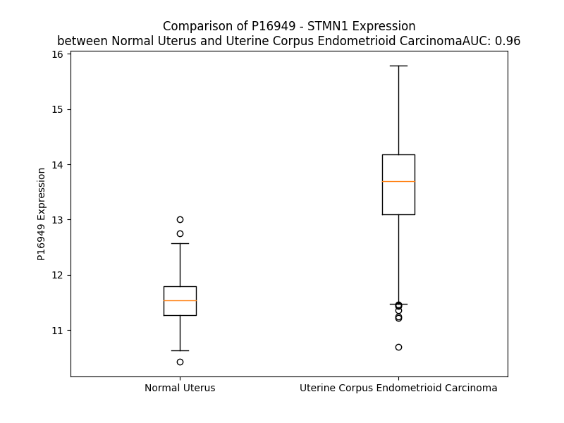

# Detailed Data for P16949

## Introduction to the Detailed Summary

### How to Interpret the Results

- **Summary & Metrics**: This section provides a quick reference to essential protein attributes, including expression changes, family classification, and biomarker applications. Regulation status (upregulated/downregulated) indicates the protein's behavior in a disease context. Some information comes from the original excel file with the proteins selected from literature, while others are derived from the analyses.
- **Expression Comparison**: A visual representation comparing protein expression between normal and disease states. It highlights significant changes in expression levels that might indicate diagnostic or therapeutic relevance. This is data coming from transcriptomics experiments and could not translate similarly to protein levels.
- **Isoform Alignment**: An interactive view of isoform alignments, revealing structural and functional differences between variants of the protein.
- **Interactors & Homologs**: Tables listing known interaction partners and homologous proteins, the more interactors and homologs, the more complex the protein is to design an antibody for.
- **Biological Assemblies**: Information about the structural arrangement of the protein in different assemblies, providing insights into its functional state but also the complexity of the protein to develop antibodies.
- **Combined Per-Residue Information**: A detailed table summarizing residue-level data. This includes predictions for epitope regions, aggregation tendencies, and modifications that might impact the protein's function. Each row corresponds to a residue in the protein, providing insights into specific sites that may be important for research or drug development.
## Summary & Metrics

- **UniProt Accession**: P16949
- **Gene Name**: STMN1
- **Protein Name**: stathmin 1
- **Swiss Prot**: STMN1_HUMAN
- **Family**: other
- **Biomarker Application**: efficacy
- **Number of Isoforms**: 2
- **Regulation**: 1
- **(transcriptomics) AUC**: 0.96
- **(transcriptomics) Fold Change**: 1.18
- **(transcriptomics) Regulation**: Upregulated
- **Discotope Epitope Count**: 11
- **Max n_uniprots (Homo)**: N/A
- **Max n_uniprots (Hetero)**: N/A

## Expression Comparison

## Isoform Alignment

<pre style='font-size:14px; font-family:monospace;'>P16949-1 MASSDIQVKELEKRASGQAFELILSPRSKESVPEFPLSPPKKKDLSLEEIQKKLEAAEERRKSHEAEVLKQLAEKREHEKEVLQKAIEENNNFSKMAEEKLTHKMEANKENREAQMAAKLERLREKDKHIEEVRKNKESKDPADETEAD-------------------------
P16949-2 MASSDIQVKELEKRASGQAFELILSPRSKESVPEFPLSPPKKKDLSLEEIQKKLEAAEERRKSHEAEVLKQLAEKREHEKEVLQKAIEENNNFSKMAEEKLTHKMEANKENREAQMAAKLERLREKMYFWTHGPGAHPAQISAEQSCLHSVPALCPALGLQSALITWSDLSHHH
</pre>

## Interactors

| preferredName_A   | preferredName_B   |   score |
|:------------------|:------------------|--------:|
| STMN1             | STAT3             |   0.954 |
| STMN1             | CDKN1B            |   0.951 |
| STMN1             | MAPK1             |   0.949 |
| STMN1             | MAPK3             |   0.931 |
| STMN1             | UHMK1             |   0.917 |

## Homologs

| uniprot_id   | gene_id   |
|:-------------|:----------|
| H3BQB6       | STMND1    |
| A0A0J9YXY4   | STMN3     |
| Q93045       | STMN2     |
| E7EVN3       | STMN4     |

## Combined Per-Residue Information

|   res | aa   |   epitope_score | epitope   |   relative_surface_accessibility |   modeling_confidence |   Aggregation | modification                            |
|------:|:-----|----------------:|:----------|---------------------------------:|----------------------:|--------------:|:----------------------------------------|
|     1 | M    |         0.23285 | False     |                          1.32064 |                 38.99 |             0 | N/A                                     |
|     2 | A    |         0.2296  | False     |                          0.96052 |                 54.82 |             0 | N-acetylalanine                         |
|     3 | S    |         0.27176 | False     |                          0.80388 |                 54.83 |             0 | N/A                                     |
|     4 | S    |         0.13199 | False     |                          0.64917 |                 61.85 |             0 | Phosphoserine                           |
|     5 | D    |         0.17345 | False     |                          0.70809 |                 71.57 |             0 | N/A                                     |
|     6 | I    |         0.2345  | False     |                          0.63269 |                 82.7  |             0 | N/A                                     |
|     7 | Q    |         0.16186 | False     |                          0.49838 |                 83.39 |             0 | N/A                                     |
|     8 | V    |         0.27377 | False     |                          0.58526 |                 88.32 |             0 | N/A                                     |
|     9 | K    |         0.26875 | False     |                          0.56795 |                 88.85 |             0 | N6-acetyllysine                         |
|    10 | E    |         0.26141 | False     |                          0.57228 |                 90.13 |             0 | N/A                                     |
|    11 | L    |         0.2294  | False     |                          0.63312 |                 91.45 |             0 | N/A                                     |
|    12 | E    |         0.44633 | True      |                          0.46995 |                 91.54 |             0 | N/A                                     |
|    13 | K    |         0.33142 | False     |                          0.63359 |                 91.49 |             0 | N/A                                     |
|    14 | R    |         0.42055 | True      |                          0.69002 |                 92.62 |             0 | N/A                                     |
|    15 | A    |         0.27622 | False     |                          1.17495 |                 91.88 |             0 | N/A                                     |
|    16 | S    |         0.33701 | False     |                          0.87028 |                 92.37 |             0 | Phosphoserine                           |
|    17 | G    |         0.31262 | False     |                          0.50734 |                 93.35 |             0 | N/A                                     |
|    18 | Q    |         0.28255 | False     |                          0.62076 |                 93.04 |             0 | N/A                                     |
|    19 | A    |         0.18949 | False     |                          0.47655 |                 94.04 |             0 | N/A                                     |
|    20 | F    |         0.29367 | False     |                          0.51243 |                 94.31 |             0 | N/A                                     |
|    21 | E    |         0.20811 | False     |                          0.3988  |                 91.18 |             0 | N/A                                     |
|    22 | L    |         0.23582 | False     |                          0.50918 |                 90.31 |             0 | N/A                                     |
|    23 | I    |         0.20033 | False     |                          0.30673 |                 86.16 |             0 | N/A                                     |
|    24 | L    |         0.33634 | False     |                          0.71684 |                 84.87 |             0 | N/A                                     |
|    25 | S    |         0.26628 | False     |                          0.62586 |                 80.48 |             0 | Phosphoserine; by CDK1, MAPK1 and MAPK3 |
|    26 | P    |         0.37705 | True      |                          0.78074 |                 72.54 |             0 | N/A                                     |
|    27 | R    |         0.33167 | False     |                          0.82253 |                 70.45 |             0 | N/A                                     |
|    28 | S    |         0.26965 | False     |                          0.62011 |                 63.06 |             0 | N/A                                     |
|    29 | K    |         0.41766 | True      |                          1.03276 |                 62.05 |             0 | N6-methyllysine                         |
|    30 | E    |         0.42004 | True      |                          0.85859 |                 59.17 |             0 | N/A                                     |
|    31 | S    |         0.2824  | False     |                          0.51796 |                 56.67 |             0 | Phosphoserine                           |
|    32 | V    |         0.32155 | False     |                          0.96723 |                 64.33 |             0 | N/A                                     |
|    33 | P    |         0.29832 | False     |                          0.69309 |                 64.71 |             0 | N/A                                     |
|    34 | E    |         0.35024 | False     |                          0.91587 |                 61.47 |             0 | N/A                                     |
|    35 | F    |         0.26121 | False     |                          0.71738 |                 61.29 |             0 | N/A                                     |
|    36 | P    |         0.27321 | False     |                          0.78783 |                 63.98 |             0 | N/A                                     |
|    37 | L    |         0.37688 | True      |                          0.93962 |                 62.71 |             0 | N/A                                     |
|    38 | S    |         0.31672 | False     |                          0.56728 |                 62.25 |             0 | Phosphoserine; by CDK1, MAPK1 and MAPK3 |
|    39 | P    |         0.33874 | False     |                          0.83122 |                 68.66 |             0 | N/A                                     |
|    40 | P    |         0.25166 | False     |                          0.80702 |                 66.28 |             0 | N/A                                     |
|    41 | K    |         0.33681 | False     |                          1.02053 |                 66.96 |             0 | N/A                                     |
|    42 | K    |         0.29228 | False     |                          0.85831 |                 70.7  |             0 | N/A                                     |
|    43 | K    |         0.25531 | False     |                          0.95222 |                 75.21 |             0 | N/A                                     |
|    44 | D    |         0.35348 | False     |                          0.87349 |                 77.39 |             0 | N/A                                     |
|    45 | L    |         0.31741 | False     |                          0.59765 |                 80.36 |             0 | N/A                                     |
|    46 | S    |         0.33865 | False     |                          0.41849 |                 90.54 |             0 | N/A                                     |
|    47 | L    |         0.2138  | False     |                          0.7982  |                 94.21 |             0 | N/A                                     |
|    48 | E    |         0.37284 | True      |                          0.68933 |                 94.71 |             0 | N/A                                     |
|    49 | E    |         0.29178 | False     |                          0.43482 |                 94.87 |             0 | N/A                                     |
|    50 | I    |         0.1944  | False     |                          0.44617 |                 94.81 |             0 | N/A                                     |
|    51 | Q    |         0.28426 | False     |                          0.44034 |                 97.04 |             0 | N/A                                     |
|    52 | K    |         0.32482 | False     |                          0.73153 |                 97.07 |             0 | N/A                                     |
|    53 | K    |         0.30394 | False     |                          0.6277  |                 96.79 |             0 | N/A                                     |
|    54 | L    |         0.28936 | False     |                          0.71686 |                 97.8  |             0 | N/A                                     |
|    55 | E    |         0.32802 | False     |                          0.55888 |                 97.74 |             0 | N/A                                     |
|    56 | A    |         0.22719 | False     |                          0.41036 |                 98.22 |             0 | N/A                                     |
|    57 | A    |         0.20421 | False     |                          0.42623 |                 98.31 |             0 | N/A                                     |
|    58 | E    |         0.2016  | False     |                          0.31945 |                 98.05 |             0 | N/A                                     |
|    59 | E    |         0.25939 | False     |                          0.50469 |                 98.23 |             0 | N/A                                     |
|    60 | R    |         0.2853  | False     |                          0.63255 |                 98.35 |             0 | N/A                                     |
|    61 | R    |         0.37131 | True      |                          0.58249 |                 98.19 |             0 | N/A                                     |
|    62 | K    |         0.2259  | False     |                          0.47523 |                 98.43 |             0 | N/A                                     |
|    63 | S    |         0.34008 | False     |                          0.56616 |                 98.22 |             0 | Phosphoserine; by PKA                   |
|    64 | H    |         0.27631 | False     |                          0.68837 |                 98.47 |             0 | N/A                                     |
|    65 | E    |         0.22762 | False     |                          0.51351 |                 98    |             0 | N/A                                     |
|    66 | A    |         0.2202  | False     |                          0.55188 |                 98.49 |             0 | N/A                                     |
|    67 | E    |         0.26122 | False     |                          0.40079 |                 98.43 |             0 | N/A                                     |
|    68 | V    |         0.21013 | False     |                          0.53544 |                 98.52 |             0 | N/A                                     |
|    69 | L    |         0.23572 | False     |                          0.63638 |                 98.42 |             0 | N/A                                     |
|    70 | K    |         0.34533 | False     |                          0.57343 |                 98.4  |             0 | N/A                                     |
|    71 | Q    |         0.29586 | False     |                          0.45776 |                 98.51 |             0 | N/A                                     |
|    72 | L    |         0.23272 | False     |                          0.48909 |                 98.37 |             0 | N/A                                     |
|    73 | A    |         0.19581 | False     |                          0.57266 |                 98.37 |             0 | N/A                                     |
|    74 | E    |         0.1938  | False     |                          0.46058 |                 98.29 |             0 | N/A                                     |
|    75 | K    |         0.31737 | False     |                          0.67126 |                 98.52 |             0 | N/A                                     |
|    76 | R    |         0.33375 | False     |                          0.53398 |                 98.33 |             0 | N/A                                     |
|    77 | E    |         0.25546 | False     |                          0.55436 |                 98.22 |             0 | N/A                                     |
|    78 | H    |         0.2297  | False     |                          0.59404 |                 98.64 |             0 | N/A                                     |
|    79 | E    |         0.24315 | False     |                          0.4918  |                 97.69 |             0 | N/A                                     |
|    80 | K    |         0.27475 | False     |                          0.71795 |                 98.5  |             0 | N/A                                     |
|    81 | E    |         0.18069 | False     |                          0.50623 |                 98.43 |             0 | N/A                                     |
|    82 | V    |         0.17835 | False     |                          0.55328 |                 98.65 |             0 | N/A                                     |
|    83 | L    |         0.26218 | False     |                          0.72644 |                 97.97 |             0 | N/A                                     |
|    84 | Q    |         0.20846 | False     |                          0.53853 |                 98.42 |             0 | N/A                                     |
|    85 | K    |         0.18176 | False     |                          0.61016 |                 98.45 |             0 | N/A                                     |
|    86 | A    |         0.24404 | False     |                          0.54255 |                 98.04 |             0 | N/A                                     |
|    87 | I    |         0.25686 | False     |                          0.63917 |                 98.09 |             0 | N/A                                     |
|    88 | E    |         0.14474 | False     |                          0.47019 |                 98.1  |             0 | N/A                                     |
|    89 | E    |         0.21223 | False     |                          0.53328 |                 98.26 |             0 | N/A                                     |
|    90 | N    |         0.26714 | False     |                          0.601   |                 97.77 |             0 | N/A                                     |
|    91 | N    |         0.1927  | False     |                          0.5408  |                 98.22 |             0 | N/A                                     |
|    92 | N    |         0.20355 | False     |                          0.48222 |                 98.32 |             0 | N/A                                     |
|    93 | F    |         0.1961  | False     |                          0.7118  |                 98.32 |             0 | N/A                                     |
|    94 | S    |         0.20946 | False     |                          0.47201 |                 97.64 |             0 | N/A                                     |
|    95 | K    |         0.25385 | False     |                          0.60499 |                 98.4  |             0 | N/A                                     |
|    96 | M    |         0.19926 | False     |                          0.45755 |                 98.32 |             0 | N/A                                     |
|    97 | A    |         0.29319 | False     |                          0.44635 |                 98.31 |             0 | N/A                                     |
|    98 | E    |         0.27351 | False     |                          0.62018 |                 98.26 |             0 | N/A                                     |
|    99 | E    |         0.17881 | False     |                          0.49374 |                 98.47 |             0 | N/A                                     |
|   100 | K    |         0.3003  | False     |                          0.67066 |                 98.53 |             0 | N6-acetyllysine                         |
|   101 | L    |         0.19622 | False     |                          0.67056 |                 98.48 |             0 | N/A                                     |
|   102 | T    |         0.15938 | False     |                          0.47801 |                 98.3  |             0 | N/A                                     |
|   103 | H    |         0.19713 | False     |                          0.67761 |                 98.48 |             0 | N/A                                     |
|   104 | K    |         0.24605 | False     |                          0.7009  |                 98.6  |             0 | N/A                                     |
|   105 | M    |         0.24255 | False     |                          0.63657 |                 98.53 |             0 | N/A                                     |
|   106 | E    |         0.18191 | False     |                          0.54237 |                 98.31 |             0 | N/A                                     |
|   107 | A    |         0.15619 | False     |                          0.36412 |                 98.5  |             0 | N/A                                     |
|   108 | N    |         0.23929 | False     |                          0.58592 |                 98.38 |             0 | N/A                                     |
|   109 | K    |         0.26066 | False     |                          0.63788 |                 98.61 |             0 | N/A                                     |
|   110 | E    |         0.13815 | False     |                          0.63876 |                 98.35 |             0 | N/A                                     |
|   111 | N    |         0.25356 | False     |                          0.56309 |                 98.37 |             0 | N/A                                     |
|   112 | R    |         0.28963 | False     |                          0.64645 |                 98.29 |             0 | N/A                                     |
|   113 | E    |         0.17701 | False     |                          0.4873  |                 98.44 |             0 | N/A                                     |
|   114 | A    |         0.14346 | False     |                          0.54375 |                 98.33 |             0 | N/A                                     |
|   115 | Q    |         0.28267 | False     |                          0.66039 |                 98.33 |             0 | N/A                                     |
|   116 | M    |         0.23083 | False     |                          0.49721 |                 98.06 |             0 | N/A                                     |
|   117 | A    |         0.18857 | False     |                          0.53657 |                 98.24 |             0 | N/A                                     |
|   118 | A    |         0.18133 | False     |                          0.45836 |                 98.14 |             0 | N/A                                     |
|   119 | K    |         0.29621 | False     |                          0.56029 |                 97.76 |             0 | N6-acetyllysine                         |
|   120 | L    |         0.25785 | False     |                          0.51458 |                 97.65 |             0 | N/A                                     |
|   121 | E    |         0.20352 | False     |                          0.53644 |                 97.53 |             0 | N/A                                     |
|   122 | R    |         0.2592  | False     |                          0.6104  |                 97.11 |             0 | N/A                                     |
|   123 | L    |         0.19885 | False     |                          0.54303 |                 97.04 |             0 | N/A                                     |
|   124 | R    |         0.27528 | False     |                          0.59936 |                 96.57 |             0 | N/A                                     |
|   125 | E    |         0.22273 | False     |                          0.52736 |                 97    |             0 | N/A                                     |
|   126 | K    |         0.23658 | False     |                          0.63654 |                 97.23 |             0 | N/A                                     |
|   127 | D    |         0.16506 | False     |                          0.52149 |                 96.34 |             0 | N/A                                     |
|   128 | K    |         0.22348 | False     |                          0.66909 |                 97.02 |             0 | N/A                                     |
|   129 | H    |         0.24349 | False     |                          0.60049 |                 96.51 |             0 | N/A                                     |
|   130 | I    |         0.22511 | False     |                          0.5509  |                 95.94 |             0 | N/A                                     |
|   131 | E    |         0.23592 | False     |                          0.4985  |                 95.25 |             0 | N/A                                     |
|   132 | E    |         0.18958 | False     |                          0.53698 |                 94.82 |             0 | N/A                                     |
|   133 | V    |         0.15081 | False     |                          0.57638 |                 95.07 |             0 | N/A                                     |
|   134 | R    |         0.26982 | False     |                          0.48402 |                 93.23 |             0 | N/A                                     |
|   135 | K    |         0.24557 | False     |                          0.70136 |                 94.05 |             0 | N/A                                     |
|   136 | N    |         0.2311  | False     |                          0.62211 |                 91.61 |             0 | N/A                                     |
|   137 | K    |         0.16349 | False     |                          0.79491 |                 91.62 |             0 | N/A                                     |
|   138 | E    |         0.2395  | False     |                          0.64492 |                 87.95 |             0 | N/A                                     |
|   139 | S    |         0.23602 | False     |                          0.64699 |                 80.07 |             0 | N/A                                     |
|   140 | K    |         0.27515 | False     |                          0.8487  |                 71.04 |             0 | N/A                                     |
|   141 | D    |         0.35223 | False     |                          0.71098 |                 56.66 |             0 | N/A                                     |
|   142 | P    |         0.37224 | True      |                          0.82398 |                 55.27 |             0 | N/A                                     |
|   143 | A    |         0.36433 | True      |                          0.86501 |                 53.95 |             0 | N/A                                     |
|   144 | D    |         0.41627 | True      |                          0.90067 |                 53.9  |             0 | N/A                                     |
|   145 | E    |         0.22824 | False     |                          0.83648 |                 51.82 |             0 | N/A                                     |
|   146 | T    |         0.23833 | False     |                          0.84191 |                 48.05 |             0 | N/A                                     |
|   147 | E    |         0.25064 | False     |                          0.91955 |                 46.36 |             0 | N/A                                     |
|   148 | A    |         0.15197 | False     |                          1.05507 |                 48.89 |             0 | N/A                                     |
|   149 | D    |         0.15114 | False     |                          1.33383 |                 44.5  |             0 | N/A                                     |

