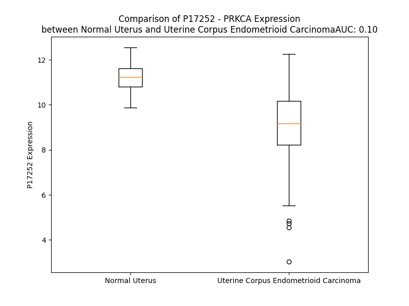

# Detailed Data for P17252

## Introduction to the Detailed Summary

### How to Interpret the Results

- **Summary & Metrics**: This section provides a quick reference to essential protein attributes, including expression changes, family classification, and biomarker applications. Regulation status (upregulated/downregulated) indicates the protein's behavior in a disease context. Some information comes from the original excel file with the proteins selected from literature, while others are derived from the analyses.
- **Expression Comparison**: A visual representation comparing protein expression between normal and disease states. It highlights significant changes in expression levels that might indicate diagnostic or therapeutic relevance. This is data coming from transcriptomics experiments and could not translate similarly to protein levels.
- **Isoform Alignment**: An interactive view of isoform alignments, revealing structural and functional differences between variants of the protein.
- **Interactors & Homologs**: Tables listing known interaction partners and homologous proteins, the more interactors and homologs, the more complex the protein is to design an antibody for.
- **Biological Assemblies**: Information about the structural arrangement of the protein in different assemblies, providing insights into its functional state but also the complexity of the protein to develop antibodies.
- **Combined Per-Residue Information**: A detailed table summarizing residue-level data. This includes predictions for epitope regions, aggregation tendencies, and modifications that might impact the protein's function. Each row corresponds to a residue in the protein, providing insights into specific sites that may be important for research or drug development.
## Summary & Metrics

- **UniProt Accession**: P17252
- **Gene Name**: PKCA
- **Protein Name**: Protein kinase C alpha type
- **Swiss Prot**: KPCA_HUMAN
- **Family**: nan
- **Biomarker Application**: nan
- **Number of Isoforms**: 0
- **Regulation**: -1
- **(transcriptomics) AUC**: 0.1
- **(transcriptomics) Fold Change**: 1.22
- **(transcriptomics) Regulation**: Downregulated
- **Discotope Epitope Count**: 155
- **Max n_uniprots (Homo)**: 1
- **Max n_uniprots (Hetero)**: N/A

## Expression Comparison

## Interactors

| preferredName_A   | preferredName_B   |   score |
|:------------------|:------------------|--------:|
| PRKCA             | SDC4              |   0.997 |
| PRKCA             | PICK1             |   0.996 |
| PRKCA             | PRKCG             |   0.984 |
| PRKCA             | RACK1             |   0.97  |
| PRKCA             | MTOR              |   0.969 |
| PRKCA             | NCF1              |   0.969 |
| PRKCA             | PRKCD             |   0.967 |
| PRKCA             | PRKCB             |   0.963 |
| PRKCA             | PLD1              |   0.96  |
| PRKCA             | PLCG1             |   0.958 |
| PRKCA             | DLG4              |   0.957 |
| PRKCA             | MAPK3             |   0.956 |
| PRKCA             | ACTB              |   0.955 |
| PRKCA             | EZR               |   0.953 |
| PRKCA             | CACNA1C           |   0.953 |
| PRKCA             | PLD2              |   0.952 |
| PRKCA             | PLCG2             |   0.949 |
| PRKCA             | CASP3             |   0.948 |
| PRKCA             | PLCB1             |   0.947 |
| PRKCA             | SLC9A3R1          |   0.947 |
| PRKCA             | FOS               |   0.946 |
| PRKCA             | PPP1R1A           |   0.945 |
| PRKCA             | PDPK1             |   0.943 |
| PRKCA             | BRAF              |   0.937 |
| PRKCA             | ITPR1             |   0.937 |
| PRKCA             | HRAS              |   0.937 |
| PRKCA             | PLCB3             |   0.936 |
| PRKCA             | TRPC3             |   0.935 |
| PRKCA             | ITPR3             |   0.934 |
| PRKCA             | PLCB4             |   0.933 |
| PRKCA             | EGFR              |   0.932 |
| PRKCA             | KRAS              |   0.932 |
| PRKCA             | SPHK1             |   0.932 |
| PRKCA             | MAPK1             |   0.931 |
| PRKCA             | PLCD1             |   0.931 |
| PRKCA             | EGLN2             |   0.929 |
| PRKCA             | NRAS              |   0.928 |
| PRKCA             | EEF2K             |   0.928 |
| PRKCA             | PPP2CA            |   0.928 |
| PRKCA             | PLCB2             |   0.928 |
| PRKCA             | PLCE1             |   0.926 |
| PRKCA             | CACNA1F           |   0.926 |
| PRKCA             | PLCD3             |   0.925 |
| PRKCA             | ITGB1             |   0.923 |
| PRKCA             | TRPV4             |   0.923 |
| PRKCA             | SPHK2             |   0.921 |
| PRKCA             | PPP2CB            |   0.92  |
| PRKCA             | CACNA1S           |   0.919 |
| PRKCA             | ITPR2             |   0.919 |
| PRKCA             | KCNN4             |   0.918 |

## Homologs

| uniprot_id   | gene_id   |
|:-------------|:----------|
| G3V4L3       | PRKCH     |
| Q6P5Z2       | PKN3      |
| P41743       | PRKCI     |
| D6RAN5       | PRKCZ     |
| L7RTI5       | PRKCE     |
| A0A804HIU5   | PRKCG     |
| B1AL79       | PKN2      |
| K7EKY9       | PKN1      |
| P05771       | PRKCB     |

## Biological Assemblies

|   Unnamed: 0 |   assembly |   n_uniprots | composition   | crystal_id   |
|-------------:|-----------:|-------------:|:--------------|:-------------|
|            0 |          1 |            1 | Homo          | 4dnl         |
|            0 |          1 |            1 | Homo          | 8uak         |
|            0 |          1 |            1 | Homo          | 3iw4         |
|            1 |          2 |            1 | Homo          | 3iw4         |
|            2 |          3 |            1 | Homo          | 3iw4         |
|            0 |          1 |            1 | Homo          | 4ra4         |
|            0 |          1 |            1 | Homo          | 2eli         |
|            0 |          1 |            1 | Homo          | 8u37         |

## Combined Per-Residue Information

|   res | aa   |   epitope_score | epitope   |   relative_surface_accessibility |   modeling_confidence |   Aggregation | modification                       |
|------:|:-----|----------------:|:----------|---------------------------------:|----------------------:|--------------:|:-----------------------------------|
|     1 | M    |         0.12195 | False     |                          1.32614 |                 33.71 |         0     | N/A                                |
|     2 | A    |         0.17511 | True      |                          1.03415 |                 36.09 |         0     | N-acetylalanine                    |
|     3 | D    |         0.18062 | True      |                          0.79627 |                 34.72 |         0     | N/A                                |
|     4 | V    |         0.14337 | True      |                          0.79046 |                 30.87 |         0     | N/A                                |
|     5 | F    |         0.15938 | True      |                          1.00332 |                 38.29 |         0     | N/A                                |
|     6 | P    |         0.09211 | False     |                          0.88031 |                 40.78 |         0     | N/A                                |
|     7 | G    |         0.14776 | True      |                          0.98319 |                 39.21 |         0     | N/A                                |
|     8 | N    |         0.1555  | True      |                          0.86186 |                 34.1  |         0     | N/A                                |
|     9 | D    |         0.15683 | True      |                          0.69243 |                 37.17 |         0     | N/A                                |
|    10 | S    |         0.08512 | False     |                          0.79961 |                 34.94 |         0     | Phosphoserine                      |
|    11 | T    |         0.1053  | False     |                          0.98055 |                 40.05 |         0     | N/A                                |
|    12 | A    |         0.12722 | True      |                          0.99096 |                 40.68 |         0     | N/A                                |
|    13 | S    |         0.12181 | False     |                          0.82046 |                 39.83 |         0     | N/A                                |
|    14 | Q    |         0.169   | True      |                          0.88424 |                 41.34 |         0     | N/A                                |
|    15 | D    |         0.20212 | True      |                          0.86959 |                 49.12 |         0     | N/A                                |
|    16 | V    |         0.12912 | True      |                          0.96809 |                 47.19 |         0     | N/A                                |
|    17 | A    |         0.1526  | True      |                          0.81233 |                 47.66 |         0     | N/A                                |
|    18 | N    |         0.18798 | True      |                          0.91757 |                 46.16 |         0     | N/A                                |
|    19 | R    |         0.21936 | True      |                          0.88858 |                 45.68 |         0     | N/A                                |
|    20 | F    |         0.17274 | True      |                          0.93679 |                 47.14 |         0     | N/A                                |
|    21 | A    |         0.10339 | False     |                          0.81216 |                 49.11 |         0     | N/A                                |
|    22 | R    |         0.14238 | True      |                          0.84194 |                 45.59 |         0     | N/A                                |
|    23 | K    |         0.11453 | False     |                          1.02423 |                 45.91 |         0     | N/A                                |
|    24 | G    |         0.15381 | True      |                          0.84489 |                 57.1  |         0     | N/A                                |
|    25 | A    |         0.08811 | False     |                          0.76691 |                 47.12 |         0     | N/A                                |
|    26 | L    |         0.10302 | False     |                          1.08328 |                 54.31 |         0     | N/A                                |
|    27 | R    |         0.13982 | True      |                          0.90686 |                 59.41 |         0     | N/A                                |
|    28 | Q    |         0.15509 | True      |                          0.85811 |                 61.72 |         0     | N/A                                |
|    29 | K    |         0.13151 | True      |                          0.56268 |                 73.88 |         0     | N/A                                |
|    30 | N    |         0.12728 | True      |                          0.7853  |                 85.59 |         0     | N/A                                |
|    31 | V    |         0.14592 | True      |                          0.49335 |                 91.48 |         0     | N/A                                |
|    32 | H    |         0.07851 | False     |                          0.39656 |                 92.27 |         0     | N/A                                |
|    33 | E    |         0.07929 | False     |                          0.59784 |                 92.28 |         0     | N/A                                |
|    34 | V    |         0.04499 | False     |                          0.19327 |                 89.93 |         0     | N/A                                |
|    35 | K    |         0.06821 | False     |                          0.48209 |                 87.68 |         0     | N/A                                |
|    36 | D    |         0.10106 | False     |                          0.4084  |                 91.39 |         0     | N/A                                |
|    37 | H    |         0.01337 | False     |                          0       |                 92.18 |         0     | N/A                                |
|    38 | K    |         0.09956 | False     |                          0.42984 |                 94.31 |         0     | N/A                                |
|    39 | F    |         0.00359 | False     |                          0       |                 96.21 |         0     | N/A                                |
|    40 | I    |         0.05457 | False     |                          0.1072  |                 94.57 |         0     | N/A                                |
|    41 | A    |         0.04253 | False     |                          0.26696 |                 94.63 |         0     | N/A                                |
|    42 | R    |         0.08579 | False     |                          0.43341 |                 93.22 |         0     | N/A                                |
|    43 | F    |         0.11372 | False     |                          0.54399 |                 93.14 |         0     | N/A                                |
|    44 | F    |         0.03378 | False     |                          0.11111 |                 93.09 |         0     | N/A                                |
|    45 | K    |         0.17414 | True      |                          0.91718 |                 90.32 |         0     | N/A                                |
|    46 | Q    |         0.17389 | True      |                          0.48012 |                 90.82 |         0     | N/A                                |
|    47 | P    |         0.14117 | True      |                          0.57641 |                 92.77 |         0     | N/A                                |
|    48 | T    |         0.02883 | False     |                          0.02223 |                 95.24 |         0     | N/A                                |
|    49 | F    |         0.08764 | False     |                          0.3211  |                 95.18 |         0     | N/A                                |
|    50 | C    |         0.03872 | False     |                          0.00835 |                 95.59 |         0     | N/A                                |
|    51 | S    |         0.01395 | False     |                          0.05575 |                 93.9  |         0     | N/A                                |
|    52 | H    |         0.01255 | False     |                          0.01724 |                 92.18 |         0     | N/A                                |
|    53 | C    |         0.03013 | False     |                          0.04095 |                 91.18 |         0     | N/A                                |
|    54 | T    |         0.05142 | False     |                          0.40183 |                 90.63 |         0     | N/A                                |
|    55 | D    |         0.1159  | False     |                          0.31098 |                 91.34 |         0     | N/A                                |
|    56 | F    |         0.12567 | True      |                          0.45438 |                 92.71 |        53.794 | N/A                                |
|    57 | I    |         0.0439  | False     |                          0.03784 |                 92.19 |        54.156 | N/A                                |
|    58 | W    |         0.19387 | True      |                          0.6193  |                 88.73 |        54.156 | N/A                                |
|    59 | G    |         0.12305 | False     |                          0.42686 |                 85.01 |        54.156 | N/A                                |
|    60 | F    |         0.21324 | True      |                          1.04853 |                 83.48 |        54.156 | N/A                                |
|    61 | G    |         0.13334 | True      |                          0.48078 |                 90.01 |         4.804 | N/A                                |
|    62 | K    |         0.23168 | True      |                          0.4678  |                 90.07 |         0     | N/A                                |
|    63 | Q    |         0.09482 | False     |                          0.14807 |                 90.95 |         0     | N/A                                |
|    64 | G    |         0.00454 | False     |                          0       |                 94.53 |         0     | N/A                                |
|    65 | F    |         0.04445 | False     |                          0.06752 |                 96.4  |         0     | N/A                                |
|    66 | Q    |         0.05626 | False     |                          0.10038 |                 96.35 |         0     | N/A                                |
|    67 | C    |         0.00476 | False     |                          0.00148 |                 95.45 |         0.105 | N/A                                |
|    68 | Q    |         0.09667 | False     |                          0.50843 |                 93.32 |         0.968 | N/A                                |
|    69 | V    |         0.09837 | False     |                          0.38324 |                 91.37 |        23.017 | N/A                                |
|    70 | C    |         0.00773 | False     |                          0.00187 |                 92.01 |        24.415 | N/A                                |
|    71 | C    |         0.06095 | False     |                          0.37853 |                 93.98 |        24.978 | N/A                                |
|    72 | F    |         0.01629 | False     |                          0.02298 |                 94.76 |        24.978 | N/A                                |
|    73 | V    |         0.00845 | False     |                          0.00952 |                 96.68 |        24.978 | N/A                                |
|    74 | V    |         0.00389 | False     |                          0       |                 96.4  |        21.899 | N/A                                |
|    75 | H    |         0.05487 | False     |                          0.05667 |                 94.58 |         4.102 | N/A                                |
|    76 | K    |         0.19082 | True      |                          0.47035 |                 93.22 |         0     | N/A                                |
|    77 | R    |         0.07424 | False     |                          0.27786 |                 90.84 |         0     | N/A                                |
|    78 | C    |         0.00563 | False     |                          0.00094 |                 94.25 |         0     | N/A                                |
|    79 | H    |         0.16199 | True      |                          0.07082 |                 93.54 |         0     | N/A                                |
|    80 | E    |         0.11273 | False     |                          0.61815 |                 91.06 |         0     | N/A                                |
|    81 | F    |         0.04516 | False     |                          0.13571 |                 90.79 |         3.405 | N/A                                |
|    82 | V    |         0.0142  | False     |                          0.04686 |                 89.25 |         3.405 | N/A                                |
|    83 | T    |         0.10002 | False     |                          0.52003 |                 84.02 |         3.405 | N/A                                |
|    84 | F    |         0.1079  | False     |                          0.09225 |                 85.49 |         3.405 | N/A                                |
|    85 | S    |         0.10327 | False     |                          0.45542 |                 86.98 |         3.405 | N/A                                |
|    86 | C    |         0.0116  | False     |                          0.0037  |                 89.04 |         0     | N/A                                |
|    87 | P    |         0.04779 | False     |                          0.08486 |                 85.14 |         0     | N/A                                |
|    88 | G    |         0.09714 | False     |                          0.48273 |                 79.61 |         0     | N/A                                |
|    89 | A    |         0.10039 | False     |                          0.47792 |                 73.88 |         0     | N/A                                |
|    90 | D    |         0.21016 | True      |                          0.71535 |                 63.43 |         0     | N/A                                |
|    91 | K    |         0.24333 | True      |                          0.73737 |                 57.1  |         0     | N/A                                |
|    92 | G    |         0.17771 | True      |                          0.34748 |                 54.01 |         0     | N/A                                |
|    93 | P    |         0.14514 | True      |                          0.90785 |                 53.87 |         0     | N/A                                |
|    94 | D    |         0.186   | True      |                          0.58958 |                 50.96 |         0     | N/A                                |
|    95 | T    |         0.12581 | True      |                          0.21363 |                 51.68 |         0     | N/A                                |
|    96 | D    |         0.27001 | True      |                          0.60198 |                 54.64 |         0     | N/A                                |
|    97 | D    |         0.1415  | True      |                          0.2389  |                 61.41 |         0     | N/A                                |
|    98 | P    |         0.12589 | True      |                          0.76445 |                 61.31 |         0     | N/A                                |
|    99 | R    |         0.15817 | True      |                          0.5436  |                 61.27 |         0     | N/A                                |
|   100 | S    |         0.07692 | False     |                          0.09424 |                 72.73 |         0     | N/A                                |
|   101 | K    |         0.08155 | False     |                          0.41798 |                 81.75 |         0     | N/A                                |
|   102 | H    |         0.06995 | False     |                          0.15743 |                 85.34 |         0     | N/A                                |
|   103 | K    |         0.15479 | True      |                          0.68972 |                 86.49 |         0     | N/A                                |
|   104 | F    |         0.04979 | False     |                          0.16466 |                 92.64 |         0     | N/A                                |
|   105 | K    |         0.12244 | False     |                          0.62217 |                 91.72 |         0     | N/A                                |
|   106 | I    |         0.11866 | False     |                          0.59703 |                 94.96 |         0     | N/A                                |
|   107 | H    |         0.07509 | False     |                          0.3743  |                 91.76 |         0     | N/A                                |
|   108 | T    |         0.34101 | True      |                          0.42812 |                 92.7  |         0     | N/A                                |
|   109 | Y    |         0.06646 | False     |                          0.1184  |                 90.33 |         0     | N/A                                |
|   110 | G    |         0.19098 | True      |                          1.10005 |                 86.74 |         0     | N/A                                |
|   111 | S    |         0.18149 | True      |                          0.56681 |                 89.24 |         0     | N/A                                |
|   112 | P    |         0.18908 | True      |                          0.84789 |                 91.65 |         0     | N/A                                |
|   113 | T    |         0.06505 | False     |                          0.19431 |                 93.44 |         0     | N/A                                |
|   114 | F    |         0.1225  | False     |                          0.26345 |                 94.81 |         0     | N/A                                |
|   115 | C    |         0.07323 | False     |                          0.01417 |                 95.79 |         0     | N/A                                |
|   116 | D    |         0.05793 | False     |                          0.34499 |                 94.05 |         0     | N/A                                |
|   117 | H    |         0.01192 | False     |                          0.00331 |                 94.12 |         0     | N/A                                |
|   118 | C    |         0.03174 | False     |                          0.10549 |                 94.66 |         0     | N/A                                |
|   119 | G    |         0.00966 | False     |                          0.01288 |                 94.44 |         0.27  | N/A                                |
|   120 | S    |         0.05542 | False     |                          0.23937 |                 94.91 |         3.205 | N/A                                |
|   121 | L    |         0.13215 | True      |                          0.25202 |                 94.92 |        29.176 | N/A                                |
|   122 | L    |         0.0288  | False     |                          0.05305 |                 94.3  |        33.542 | N/A                                |
|   123 | Y    |         0.24946 | True      |                          0.52039 |                 89.96 |        33.542 | N/A                                |
|   124 | G    |         0.17757 | True      |                          0.61736 |                 88.8  |        33.542 | N/A                                |
|   125 | L    |         0.19005 | True      |                          1.01185 |                 87.39 |        33.542 | N/A                                |
|   126 | I    |         0.13892 | True      |                          0.73366 |                 90.67 |        31.158 | N/A                                |
|   127 | H    |         0.14452 | True      |                          0.64586 |                 91.89 |         0.553 | N/A                                |
|   128 | Q    |         0.13356 | True      |                          0.11441 |                 94.51 |         0     | N/A                                |
|   129 | G    |         0.02278 | False     |                          0.02407 |                 95.43 |         0     | N/A                                |
|   130 | M    |         0.07745 | False     |                          0.12676 |                 96.02 |         0     | N/A                                |
|   131 | K    |         0.04012 | False     |                          0.24796 |                 93.7  |         0     | N/A                                |
|   132 | C    |         0.00778 | False     |                          0       |                 89.9  |         0     | N/A                                |
|   133 | D    |         0.07766 | False     |                          0.42511 |                 79.24 |         0     | N/A                                |
|   134 | T    |         0.05438 | False     |                          0.42024 |                 73.86 |         0     | N/A                                |
|   135 | C    |         0.05042 | False     |                          0.27194 |                 77.61 |         0     | N/A                                |
|   136 | D    |         0.03682 | False     |                          0.2092  |                 84.28 |         0     | N/A                                |
|   137 | M    |         0.02338 | False     |                          0.1085  |                 90.26 |         0     | N/A                                |
|   138 | N    |         0.07598 | False     |                          0.09301 |                 94.09 |         0     | N/A                                |
|   139 | V    |         0.00203 | False     |                          0       |                 96.05 |         0     | N/A                                |
|   140 | H    |         0.07517 | False     |                          0.14134 |                 96.08 |         0     | N/A                                |
|   141 | K    |         0.23264 | True      |                          0.75224 |                 94.41 |         0     | N/A                                |
|   142 | Q    |         0.12743 | True      |                          0.69439 |                 92.6  |         0     | N/A                                |
|   143 | C    |         0.0522  | False     |                          0.05358 |                 94.05 |         0     | N/A                                |
|   144 | V    |         0.09184 | False     |                          0.31862 |                 92.43 |         0     | N/A                                |
|   145 | I    |         0.13883 | True      |                          0.80853 |                 88.54 |         0     | N/A                                |
|   146 | N    |         0.04733 | False     |                          0.20821 |                 90.02 |         0     | N/A                                |
|   147 | V    |         0.0137  | False     |                          0.08553 |                 89.3  |         0     | N/A                                |
|   148 | P    |         0.02865 | False     |                          0.05541 |                 85.4  |         0     | N/A                                |
|   149 | S    |         0.06026 | False     |                          0.18851 |                 83.48 |         0     | N/A                                |
|   150 | L    |         0.09082 | False     |                          0.23688 |                 80.37 |         0     | N/A                                |
|   151 | C    |         0.03817 | False     |                          0.10336 |                 80.53 |         0     | N/A                                |
|   152 | G    |         0.09346 | False     |                          0.4238  |                 70.23 |         0     | N/A                                |
|   153 | M    |         0.14874 | True      |                          0.60357 |                 73.87 |         0     | N/A                                |
|   154 | D    |         0.09358 | False     |                          0.37537 |                 74.51 |         0     | N/A                                |
|   155 | H    |         0.13855 | True      |                          0.20447 |                 78.15 |         0     | N/A                                |
|   156 | T    |         0.04524 | False     |                          0.15705 |                 85.54 |         0     | N/A                                |
|   157 | E    |         0.01793 | False     |                          0.03569 |                 90.29 |         0     | N/A                                |
|   158 | K    |         0.12067 | False     |                          0.50864 |                 89.6  |         0     | N/A                                |
|   159 | R    |         0.0465  | False     |                          0.25233 |                 94.66 |         0     | N/A                                |
|   160 | G    |         0.00294 | False     |                          0.00553 |                 95.2  |         0     | N/A                                |
|   161 | R    |         0.0604  | False     |                          0.11176 |                 96.39 |         0     | N/A                                |
|   162 | I    |         0.00235 | False     |                          0       |                 98.18 |         1.173 | N/A                                |
|   163 | Y    |         0.1102  | False     |                          0.1598  |                 98.36 |         1.173 | N/A                                |
|   164 | L    |         0.00513 | False     |                          0.00247 |                 98.39 |         1.173 | N/A                                |
|   165 | K    |         0.0543  | False     |                          0.39474 |                 98.28 |         1.173 | N/A                                |
|   166 | A    |         0.00324 | False     |                          0.00383 |                 98.16 |         1.173 | N/A                                |
|   167 | E    |         0.04847 | False     |                          0.29748 |                 97.3  |         1.173 | N/A                                |
|   168 | V    |         0.04875 | False     |                          0.26045 |                 96.46 |         1.173 | N/A                                |
|   169 | A    |         0.04094 | False     |                          0.4658  |                 94.41 |         0.277 | N/A                                |
|   170 | D    |         0.14796 | True      |                          0.81085 |                 91.65 |         0     | N/A                                |
|   171 | E    |         0.16822 | True      |                          0.67777 |                 92.3  |         0     | N/A                                |
|   172 | K    |         0.09084 | False     |                          0.41276 |                 97.07 |         0     | N/A                                |
|   173 | L    |         0.00404 | False     |                          0       |                 98.03 |         1.569 | N/A                                |
|   174 | H    |         0.06472 | False     |                          0.36474 |                 98.25 |         1.569 | N/A                                |
|   175 | V    |         0.00455 | False     |                          0.00708 |                 98.51 |         1.569 | N/A                                |
|   176 | T    |         0.12417 | False     |                          0.30835 |                 98.53 |         1.569 | N/A                                |
|   177 | V    |         0.00367 | False     |                          0       |                 98.67 |         1.569 | N/A                                |
|   178 | R    |         0.09954 | False     |                          0.33787 |                 98.36 |         0     | N/A                                |
|   179 | D    |         0.05307 | False     |                          0.0636  |                 98.34 |         0     | N/A                                |
|   180 | A    |         0.00781 | False     |                          0.00471 |                 98.36 |         0     | N/A                                |
|   181 | K    |         0.09275 | False     |                          0.3771  |                 96.82 |         0     | N/A                                |
|   182 | N    |         0.03424 | False     |                          0.04001 |                 94.69 |         0     | N/A                                |
|   183 | L    |         0.00306 | False     |                          0.00244 |                 96.18 |         0     | N/A                                |
|   184 | I    |         0.06243 | False     |                          0.17119 |                 92.55 |         0     | N/A                                |
|   185 | P    |         0.07806 | False     |                          0.20008 |                 92.37 |         0     | N/A                                |
|   186 | M    |         0.13358 | True      |                          0.35779 |                 92.63 |         0     | N/A                                |
|   187 | D    |         0.12754 | True      |                          0.16697 |                 92.38 |         0     | N/A                                |
|   188 | P    |         0.25872 | True      |                          0.99941 |                 88.82 |         0     | N/A                                |
|   189 | N    |         0.23532 | True      |                          0.57265 |                 88.12 |         0     | N/A                                |
|   190 | G    |         0.06857 | False     |                          0.19601 |                 88.23 |         0     | N/A                                |
|   191 | L    |         0.1499  | True      |                          0.3891  |                 94    |         0     | N/A                                |
|   192 | S    |         0.00294 | False     |                          0       |                 96.07 |         0     | N/A                                |
|   193 | D    |         0.07734 | False     |                          0.11398 |                 97.84 |         0     | N/A                                |
|   194 | P    |         0.00417 | False     |                          0       |                 98.37 |         0     | N/A                                |
|   195 | Y    |         0.04841 | False     |                          0.03273 |                 98.61 |         0     | N/A                                |
|   196 | V    |         0.00194 | False     |                          0       |                 98.7  |         0     | N/A                                |
|   197 | K    |         0.12686 | True      |                          0.20957 |                 98.28 |         0     | N/A                                |
|   198 | L    |         0.0121  | False     |                          0       |                 98.49 |         0     | N/A                                |
|   199 | K    |         0.06375 | False     |                          0.24176 |                 97.5  |         0     | N/A                                |
|   200 | L    |         0.03202 | False     |                          0.02885 |                 96.97 |         0     | N/A                                |
|   201 | I    |         0.08897 | False     |                          0.16712 |                 94.34 |         0     | N/A                                |
|   202 | P    |         0.19689 | True      |                          0.72293 |                 91.91 |         0     | N/A                                |
|   203 | D    |         0.13903 | True      |                          0.15934 |                 92.11 |         0     | N/A                                |
|   204 | P    |         0.24245 | True      |                          0.93534 |                 87.75 |         0     | N/A                                |
|   205 | K    |         0.1847  | True      |                          0.7654  |                 90.39 |         0     | N/A                                |
|   206 | N    |         0.15726 | True      |                          0.50814 |                 90.35 |         0     | N/A                                |
|   207 | E    |         0.19456 | True      |                          0.68718 |                 92.73 |         0     | N/A                                |
|   208 | S    |         0.10124 | False     |                          0.14655 |                 95.17 |         0     | N/A                                |
|   209 | K    |         0.15272 | True      |                          0.4879  |                 97.1  |         0     | N/A                                |
|   210 | Q    |         0.07751 | False     |                          0.27904 |                 98.15 |         0     | N/A                                |
|   211 | K    |         0.22064 | True      |                          0.66185 |                 97.94 |         0     | N/A                                |
|   212 | T    |         0.03632 | False     |                          0.03296 |                 98.62 |         0     | N/A                                |
|   213 | K    |         0.24861 | True      |                          0.76109 |                 98.15 |         0     | N/A                                |
|   214 | T    |         0.25065 | True      |                          0.37372 |                 98.04 |         0     | N/A                                |
|   215 | I    |         0.18304 | True      |                          0.28239 |                 98.18 |         0     | N/A                                |
|   216 | R    |         0.31399 | True      |                          0.70898 |                 96.99 |         0     | N/A                                |
|   217 | S    |         0.10885 | False     |                          0.43889 |                 96.34 |         0     | N/A                                |
|   218 | T    |         0.1267  | True      |                          0.18249 |                 97.45 |         0     | N/A                                |
|   219 | L    |         0.0298  | False     |                          0.08023 |                 95.87 |         0     | N/A                                |
|   220 | N    |         0.10208 | False     |                          0.51119 |                 97.61 |         0     | N/A                                |
|   221 | P    |         0.0129  | False     |                          0.00596 |                 98.26 |         0     | N/A                                |
|   222 | Q    |         0.1655  | True      |                          0.63801 |                 98.35 |         0     | N/A                                |
|   223 | W    |         0.06258 | False     |                          0.08352 |                 98.52 |         0     | N/A                                |
|   224 | N    |         0.21852 | True      |                          0.63542 |                 98.02 |         0     | N/A                                |
|   225 | E    |         0.11291 | False     |                          0.19204 |                 98.66 |         0     | N/A                                |
|   226 | S    |         0.13682 | True      |                          0.63637 |                 98.39 |         0     | Phosphoserine                      |
|   227 | F    |         0.08803 | False     |                          0.11193 |                 98.38 |         0     | N/A                                |
|   228 | T    |         0.10956 | False     |                          0.43591 |                 97.96 |         0     | N/A                                |
|   229 | F    |         0.03952 | False     |                          0.04568 |                 97.46 |         0     | N/A                                |
|   230 | K    |         0.09101 | False     |                          0.83114 |                 95.82 |         0     | N/A                                |
|   231 | L    |         0.04105 | False     |                          0.13101 |                 95.58 |         0     | N/A                                |
|   232 | K    |         0.13583 | True      |                          0.67043 |                 92.8  |         0     | N/A                                |
|   233 | P    |         0.1326  | True      |                          0.93884 |                 87.77 |         0     | N/A                                |
|   234 | S    |         0.09489 | False     |                          0.58427 |                 87.55 |         0     | N/A                                |
|   235 | D    |         0.04467 | False     |                          0.02907 |                 92.25 |         0     | N/A                                |
|   236 | K    |         0.0694  | False     |                          0.45501 |                 89.85 |         0     | N/A                                |
|   237 | D    |         0.04923 | False     |                          0.37688 |                 88.11 |         0     | N/A                                |
|   238 | R    |         0.07351 | False     |                          0.19078 |                 93.33 |         0     | N/A                                |
|   239 | R    |         0.02353 | False     |                          0.0879  |                 96.23 |         0     | N/A                                |
|   240 | L    |         0.00269 | False     |                          0.00165 |                 97.92 |         0     | N/A                                |
|   241 | S    |         0.01324 | False     |                          0.01977 |                 98.15 |         0     | N/A                                |
|   242 | V    |         0.00226 | False     |                          0.00095 |                 98.58 |         0     | N/A                                |
|   243 | E    |         0.0669  | False     |                          0.07828 |                 98.34 |         0     | N/A                                |
|   244 | I    |         0.00237 | False     |                          0       |                 98.46 |         0     | N/A                                |
|   245 | W    |         0.08541 | False     |                          0.20121 |                 98.17 |         0     | N/A                                |
|   246 | D    |         0.01618 | False     |                          0.00568 |                 97.64 |         0     | N/A                                |
|   247 | W    |         0.16134 | True      |                          0.37835 |                 97.32 |         0     | N/A                                |
|   248 | D    |         0.11604 | False     |                          0.16715 |                 93.34 |         0     | N/A                                |
|   249 | R    |         0.36719 | True      |                          0.83446 |                 88.25 |         0     | N/A                                |
|   250 | T    |         0.28937 | True      |                          0.90394 |                 86.5  |         0     | N/A                                |
|   251 | T    |         0.22854 | True      |                          0.65645 |                 89.19 |         0     | N/A                                |
|   252 | R    |         0.42357 | True      |                          0.8922  |                 92.61 |         0     | N/A                                |
|   253 | N    |         0.24452 | True      |                          0.29821 |                 94.95 |         0     | N/A                                |
|   254 | D    |         0.11338 | False     |                          0.36576 |                 95.36 |         0     | N/A                                |
|   255 | F    |         0.02906 | False     |                          0.18885 |                 96.26 |         0     | N/A                                |
|   256 | M    |         0.00656 | False     |                          0       |                 96.07 |         0     | N/A                                |
|   257 | G    |         0.00314 | False     |                          0       |                 97.06 |         0     | N/A                                |
|   258 | S    |         0.02762 | False     |                          0.02742 |                 98.07 |         0     | N/A                                |
|   259 | L    |         0.00225 | False     |                          0       |                 98.09 |         0.203 | N/A                                |
|   260 | S    |         0.00231 | False     |                          0       |                 97.72 |         0.203 | N/A                                |
|   261 | F    |         0.0076  | False     |                          0.03704 |                 96.99 |         0.203 | N/A                                |
|   262 | G    |         0.00176 | False     |                          0       |                 95.06 |         0.203 | N/A                                |
|   263 | V    |         0.00348 | False     |                          0.00286 |                 95.32 |         0.203 | N/A                                |
|   264 | S    |         0.02436 | False     |                          0.14804 |                 91.51 |         0     | N/A                                |
|   265 | E    |         0.04207 | False     |                          0.24442 |                 92.15 |         0     | N/A                                |
|   266 | L    |         0.01184 | False     |                          0.03767 |                 94.89 |         0     | N/A                                |
|   267 | M    |         0.12282 | False     |                          0.5539  |                 92.3  |         0     | N/A                                |
|   268 | K    |         0.08913 | False     |                          0.68215 |                 90.77 |         0     | N/A                                |
|   269 | M    |         0.10082 | False     |                          0.64143 |                 91.56 |         0     | N/A                                |
|   270 | P    |         0.08338 | False     |                          0.60561 |                 95.45 |         0     | N/A                                |
|   271 | A    |         0.02025 | False     |                          0.09948 |                 95.66 |         0     | N/A                                |
|   272 | S    |         0.0774  | False     |                          0.53082 |                 96.54 |         0     | N/A                                |
|   273 | G    |         0.01312 | False     |                          0.14485 |                 97.05 |         0     | N/A                                |
|   274 | W    |         0.03916 | False     |                          0.10069 |                 96.79 |         0     | N/A                                |
|   275 | Y    |         0.0148  | False     |                          0.06028 |                 96.56 |         0     | N/A                                |
|   276 | K    |         0.0125  | False     |                          0.06665 |                 94.8  |         0     | N/A                                |
|   277 | L    |         0.00449 | False     |                          0.00609 |                 97.13 |         0     | N/A                                |
|   278 | L    |         0.01062 | False     |                          0.02061 |                 94.96 |         0     | N/A                                |
|   279 | N    |         0.05498 | False     |                          0.35266 |                 93.38 |         0     | N/A                                |
|   280 | Q    |         0.14709 | True      |                          0.48952 |                 92.49 |         0     | N/A                                |
|   281 | E    |         0.04026 | False     |                          0.36615 |                 91.01 |         0     | N/A                                |
|   282 | E    |         0.05475 | False     |                          0.15128 |                 92.15 |         0     | N/A                                |
|   283 | G    |         0.0055  | False     |                          0.00882 |                 94.69 |         0     | N/A                                |
|   284 | E    |         0.0305  | False     |                          0.27145 |                 94.84 |         0     | N/A                                |
|   285 | Y    |         0.04567 | False     |                          0.18176 |                 93.49 |         0     | N/A                                |
|   286 | Y    |         0.04159 | False     |                          0.14319 |                 94.35 |         0     | N/A                                |
|   287 | N    |         0.02358 | False     |                          0.25574 |                 94.11 |         0     | N/A                                |
|   288 | V    |         0.02119 | False     |                          0.21802 |                 92.13 |         0     | N/A                                |
|   289 | P    |         0.06066 | False     |                          0.6379  |                 92.17 |         0     | N/A                                |
|   290 | I    |         0.02812 | False     |                          0.12575 |                 88.96 |         0     | N/A                                |
|   291 | P    |         0.08667 | False     |                          0.52269 |                 79.39 |         0     | N/A                                |
|   292 | E    |         0.09979 | False     |                          0.50555 |                 72.06 |         0     | N/A                                |
|   293 | G    |         0.1712  | True      |                          0.6324  |                 55.63 |         0     | N/A                                |
|   294 | D    |         0.14633 | True      |                          0.68425 |                 46.38 |         0     | N/A                                |
|   295 | E    |         0.12927 | True      |                          0.76041 |                 42.66 |         0     | N/A                                |
|   296 | E    |         0.15659 | True      |                          0.71879 |                 40.36 |         0     | N/A                                |
|   297 | G    |         0.03713 | False     |                          0.34106 |                 41.46 |         0     | N/A                                |
|   298 | N    |         0.08253 | False     |                          0.48431 |                 44.36 |         0     | N/A                                |
|   299 | M    |         0.0964  | False     |                          0.54948 |                 44.91 |         0     | N/A                                |
|   300 | E    |         0.09346 | False     |                          0.4945  |                 46.49 |         0     | N/A                                |
|   301 | L    |         0.08267 | False     |                          0.48155 |                 52.17 |         0     | N/A                                |
|   302 | R    |         0.09531 | False     |                          0.48142 |                 48.42 |         0     | N/A                                |
|   303 | Q    |         0.05779 | False     |                          0.45892 |                 50.47 |         0     | N/A                                |
|   304 | K    |         0.05584 | False     |                          0.62971 |                 55.34 |         0     | N/A                                |
|   305 | F    |         0.10848 | False     |                          0.63806 |                 49.62 |         0     | N/A                                |
|   306 | E    |         0.06123 | False     |                          0.47144 |                 47.13 |         0     | N/A                                |
|   307 | K    |         0.09404 | False     |                          0.7606  |                 47.41 |         0     | N/A                                |
|   308 | A    |         0.08799 | False     |                          0.7769  |                 47.3  |         0     | N/A                                |
|   309 | K    |         0.10646 | False     |                          0.62316 |                 45    |         0     | N/A                                |
|   310 | L    |         0.18375 | True      |                          0.81823 |                 34.23 |         0     | N/A                                |
|   311 | G    |         0.17513 | True      |                          0.58184 |                 31.99 |         0     | N/A                                |
|   312 | P    |         0.11327 | False     |                          0.91142 |                 35.63 |         0     | N/A                                |
|   313 | A    |         0.13439 | True      |                          0.98446 |                 34.56 |         0     | N/A                                |
|   314 | G    |         0.0748  | False     |                          0.59816 |                 31.81 |         0     | N/A                                |
|   315 | N    |         0.1118  | False     |                          0.87945 |                 29.16 |         0     | N/A                                |
|   316 | K    |         0.10562 | False     |                          0.90088 |                 29.16 |         0     | N/A                                |
|   317 | V    |         0.11116 | False     |                          0.84977 |                 29.95 |         0     | N/A                                |
|   318 | I    |         0.15488 | True      |                          0.9134  |                 31.72 |         0     | N/A                                |
|   319 | S    |         0.11112 | False     |                          0.59781 |                 30.92 |         0     | Phosphoserine                      |
|   320 | P    |         0.10183 | False     |                          0.88145 |                 30.69 |         0     | N/A                                |
|   321 | S    |         0.08173 | False     |                          0.77831 |                 32.87 |         0     | N/A                                |
|   322 | E    |         0.13722 | True      |                          0.79729 |                 29.49 |         0     | N/A                                |
|   323 | D    |         0.09261 | False     |                          0.82666 |                 32.04 |         0     | N/A                                |
|   324 | R    |         0.14084 | True      |                          0.89937 |                 30.02 |         0     | N/A                                |
|   325 | K    |         0.14387 | True      |                          0.88317 |                 28.63 |         0     | N/A                                |
|   326 | Q    |         0.13945 | True      |                          0.81747 |                 34.64 |         0     | N/A                                |
|   327 | P    |         0.09216 | False     |                          0.77214 |                 32.77 |         0     | N/A                                |
|   328 | S    |         0.15468 | True      |                          0.86739 |                 33.6  |         0     | N/A                                |
|   329 | N    |         0.08546 | False     |                          0.66967 |                 34.83 |         0     | N/A                                |
|   330 | N    |         0.17788 | True      |                          0.98729 |                 36.74 |         0     | N/A                                |
|   331 | L    |         0.18123 | True      |                          0.81494 |                 44.96 |         0     | N/A                                |
|   332 | D    |         0.15064 | True      |                          0.82865 |                 52.35 |         0     | N/A                                |
|   333 | R    |         0.10682 | False     |                          0.74035 |                 71.65 |         0     | N/A                                |
|   334 | V    |         0.03602 | False     |                          0.15888 |                 85.81 |         2.122 | N/A                                |
|   335 | K    |         0.08634 | False     |                          0.6062  |                 87.39 |         2.122 | N/A                                |
|   336 | L    |         0.05137 | False     |                          0.32202 |                 86.75 |         2.122 | N/A                                |
|   337 | T    |         0.12268 | False     |                          0.66019 |                 87.9  |         2.122 | N/A                                |
|   338 | D    |         0.07125 | False     |                          0.30841 |                 90.87 |         2.122 | N/A                                |
|   339 | F    |         0.02624 | False     |                          0.04175 |                 93.31 |        64.077 | N/A                                |
|   340 | N    |         0.08749 | False     |                          0.39284 |                 91.57 |        69.102 | N/A                                |
|   341 | F    |         0.03868 | False     |                          0.2252  |                 91.69 |        86.05  | N/A                                |
|   342 | L    |         0.07215 | False     |                          0.33491 |                 89    |        86.164 | N/A                                |
|   343 | M    |         0.05318 | False     |                          0.14239 |                 88.45 |        86.117 | N/A                                |
|   344 | V    |         0.0482  | False     |                          0.0695  |                 89.33 |        85.947 | N/A                                |
|   345 | L    |         0.03182 | False     |                          0.06225 |                 86.11 |        83.842 | N/A                                |
|   346 | G    |         0.05625 | False     |                          0.18509 |                 84.94 |         7.027 | N/A                                |
|   347 | K    |         0.20023 | True      |                          0.71402 |                 82.15 |         0     | N/A                                |
|   348 | G    |         0.10598 | False     |                          0.54572 |                 72.62 |         0     | N/A                                |
|   349 | S    |         0.187   | True      |                          0.71288 |                 72.94 |         0     | N/A                                |
|   350 | F    |         0.1117  | False     |                          0.25576 |                 79.46 |         0     | N/A                                |
|   351 | G    |         0.049   | False     |                          0.17574 |                 84.85 |         0     | N/A                                |
|   352 | K    |         0.06717 | False     |                          0.25496 |                 91.29 |         0     | N/A                                |
|   353 | V    |         0.0227  | False     |                          0.27324 |                 92.08 |         0     | N/A                                |
|   354 | M    |         0.00902 | False     |                          0.00072 |                 92.71 |         0     | N/A                                |
|   355 | L    |         0.00198 | False     |                          0       |                 93.35 |         0     | N/A                                |
|   356 | A    |         0.00281 | False     |                          0       |                 93.84 |         0     | N/A                                |
|   357 | D    |         0.03999 | False     |                          0.08271 |                 92.48 |         0     | N/A                                |
|   358 | R    |         0.09653 | False     |                          0.37489 |                 91.54 |         0     | N/A                                |
|   359 | K    |         0.22874 | True      |                          0.52046 |                 90.69 |         0     | N/A                                |
|   360 | G    |         0.11604 | False     |                          1.06499 |                 88.39 |         0     | N/A                                |
|   361 | T    |         0.18969 | True      |                          0.42187 |                 89.11 |         0     | N/A                                |
|   362 | E    |         0.11088 | False     |                          0.77488 |                 85    |         0     | N/A                                |
|   363 | E    |         0.04875 | False     |                          0.20156 |                 90.85 |         2.248 | N/A                                |
|   364 | L    |         0.03016 | False     |                          0.16182 |                 92.81 |         2.248 | N/A                                |
|   365 | Y    |         0.00912 | False     |                          0.01353 |                 94.68 |         2.248 | N/A                                |
|   366 | A    |         0.00818 | False     |                          0.09438 |                 94.55 |         2.248 | N/A                                |
|   367 | I    |         0.00197 | False     |                          0       |                 95.64 |         2.248 | N/A                                |
|   368 | K    |         0.01336 | False     |                          0.16598 |                 95.29 |         2.248 | N/A                                |
|   369 | I    |         0.01814 | False     |                          0.01746 |                 94.99 |         2.248 | N/A                                |
|   370 | L    |         0.01456 | False     |                          0.03627 |                 93.91 |         1.495 | N/A                                |
|   371 | K    |         0.03314 | False     |                          0.26337 |                 92.28 |         0     | N/A                                |
|   372 | K    |         0.01929 | False     |                          0.00397 |                 92.95 |         0.394 | N/A                                |
|   373 | D    |         0.12735 | True      |                          0.26219 |                 90.01 |         0.394 | N/A                                |
|   374 | V    |         0.08336 | False     |                          0.27991 |                 90.18 |         0.394 | N/A                                |
|   375 | V    |         0.00444 | False     |                          0       |                 91.94 |         0.394 | N/A                                |
|   376 | I    |         0.20477 | True      |                          0.35505 |                 91.02 |         0.394 | N/A                                |
|   377 | Q    |         0.28885 | True      |                          0.77166 |                 88.54 |         0     | N/A                                |
|   378 | D    |         0.1844  | True      |                          0.44388 |                 88.82 |         0     | N/A                                |
|   379 | D    |         0.39193 | True      |                          0.802   |                 89.72 |         0     | N/A                                |
|   380 | D    |         0.07647 | False     |                          0.18519 |                 92.13 |         0     | N/A                                |
|   381 | V    |         0.07207 | False     |                          0.21612 |                 93.56 |         0     | N/A                                |
|   382 | E    |         0.15191 | True      |                          0.52019 |                 93.24 |         0     | N/A                                |
|   383 | C    |         0.13684 | True      |                          0.3856  |                 92.91 |         0     | N/A                                |
|   384 | T    |         0.01616 | False     |                          0.04365 |                 94.71 |         0     | N/A                                |
|   385 | M    |         0.08483 | False     |                          0.12081 |                 95.04 |         0     | N/A                                |
|   386 | V    |         0.0218  | False     |                          0.06664 |                 95.59 |         0     | N/A                                |
|   387 | E    |         0.01573 | False     |                          0.0331  |                 96.16 |         0     | N/A                                |
|   388 | K    |         0.02457 | False     |                          0.12765 |                 95.85 |         0     | N/A                                |
|   389 | R    |         0.09446 | False     |                          0.35584 |                 96.65 |         0     | N/A                                |
|   390 | V    |         0.00734 | False     |                          0.01184 |                 97.08 |        26.998 | N/A                                |
|   391 | L    |         0.00567 | False     |                          0.01154 |                 96.22 |        26.998 | N/A                                |
|   392 | A    |         0.05155 | False     |                          0.1484  |                 95.84 |        26.998 | N/A                                |
|   393 | L    |         0.03564 | False     |                          0.24319 |                 95.75 |        26.998 | N/A                                |
|   394 | L    |         0.05055 | False     |                          0.51118 |                 93.95 |        26.998 | N/A                                |
|   395 | D    |         0.10381 | False     |                          0.63851 |                 93.05 |         0     | N/A                                |
|   396 | K    |         0.03915 | False     |                          0.11104 |                 94.19 |         0     | N/A                                |
|   397 | P    |         0.07378 | False     |                          0.08436 |                 95.29 |         0     | N/A                                |
|   398 | P    |         0.02876 | False     |                          0.26571 |                 95.04 |         0     | N/A                                |
|   399 | F    |         0.00634 | False     |                          0.00064 |                 97.82 |         0.554 | N/A                                |
|   400 | L    |         0.0037  | False     |                          0.00412 |                 97.46 |         0.554 | N/A                                |
|   401 | T    |         0.00695 | False     |                          0.05141 |                 96.35 |         0.554 | N/A                                |
|   402 | Q    |         0.0233  | False     |                          0.19577 |                 95.34 |         0.554 | N/A                                |
|   403 | L    |         0.0026  | False     |                          0       |                 96.15 |         0.554 | N/A                                |
|   404 | H    |         0.03519 | False     |                          0.11489 |                 94.52 |         0     | N/A                                |
|   405 | S    |         0.00297 | False     |                          0.00104 |                 95.76 |         0     | N/A                                |
|   406 | C    |         0.01579 | False     |                          0.01999 |                 95.92 |         0     | N/A                                |
|   407 | F    |         0.0528  | False     |                          0.06877 |                 95.07 |         0     | N/A                                |
|   408 | Q    |         0.05851 | False     |                          0.28339 |                 93.95 |         0     | N/A                                |
|   409 | T    |         0.04111 | False     |                          0.32192 |                 91.4  |         0.166 | N/A                                |
|   410 | V    |         0.07618 | False     |                          0.67559 |                 88.39 |         0.446 | N/A                                |
|   411 | D    |         0.0388  | False     |                          0.1205  |                 90.09 |         0.446 | N/A                                |
|   412 | R    |         0.08305 | False     |                          0.05384 |                 93.48 |         1.3   | N/A                                |
|   413 | L    |         0.00217 | False     |                          0       |                 95.04 |        66.912 | N/A                                |
|   414 | Y    |         0.00613 | False     |                          0.00926 |                 95.99 |        66.912 | N/A                                |
|   415 | F    |         0.00113 | False     |                          0       |                 96.58 |        66.912 | N/A                                |
|   416 | V    |         0.00126 | False     |                          0       |                 96.5  |        66.912 | N/A                                |
|   417 | M    |         0.03161 | False     |                          0.109   |                 95.73 |        66.702 | N/A                                |
|   418 | E    |         0.01504 | False     |                          0.05361 |                 94.65 |         0.853 | N/A                                |
|   419 | Y    |         0.03629 | False     |                          0.10069 |                 93.2  |         0.853 | N/A                                |
|   420 | V    |         0.0117  | False     |                          0.04993 |                 93.26 |         0.786 | N/A                                |
|   421 | N    |         0.02766 | False     |                          0.18912 |                 89.71 |         0     | N/A                                |
|   422 | G    |         0.00146 | False     |                          0       |                 91.3  |         0     | N/A                                |
|   423 | G    |         0.00878 | False     |                          0.01609 |                 91.88 |         0     | N/A                                |
|   424 | D    |         0.07093 | False     |                          0.2151  |                 94.17 |         0     | N/A                                |
|   425 | L    |         0.00235 | False     |                          0       |                 96.35 |         0     | N/A                                |
|   426 | M    |         0.02867 | False     |                          0.20296 |                 94.32 |         0     | N/A                                |
|   427 | Y    |         0.08527 | False     |                          0.36361 |                 92.56 |         0     | N/A                                |
|   428 | H    |         0.06397 | False     |                          0.07754 |                 94.31 |         0     | N/A                                |
|   429 | I    |         0.0375  | False     |                          0.0312  |                 94.49 |         0     | N/A                                |
|   430 | Q    |         0.13931 | True      |                          0.63646 |                 93.24 |         0     | N/A                                |
|   431 | Q    |         0.15442 | True      |                          0.60097 |                 91.21 |         0     | N/A                                |
|   432 | V    |         0.15935 | True      |                          0.6681  |                 93.53 |         0     | N/A                                |
|   433 | G    |         0.15293 | True      |                          0.52419 |                 95.19 |         0     | N/A                                |
|   434 | K    |         0.09718 | False     |                          0.45461 |                 95.72 |         0     | N/A                                |
|   435 | F    |         0.0131  | False     |                          0.0326  |                 96.71 |         0     | N/A                                |
|   436 | K    |         0.0876  | False     |                          0.46455 |                 95.36 |         0     | N/A                                |
|   437 | E    |         0.04452 | False     |                          0.22324 |                 96.6  |         0     | N/A                                |
|   438 | P    |         0.01054 | False     |                          0.05096 |                 95.62 |         0     | N/A                                |
|   439 | Q    |         0.03808 | False     |                          0.11436 |                 96.42 |         0.342 | N/A                                |
|   440 | A    |         0.00089 | False     |                          0       |                 98.04 |         7.557 | N/A                                |
|   441 | V    |         0.00603 | False     |                          0.03903 |                 98.2  |         8.412 | N/A                                |
|   442 | F    |         0.01625 | False     |                          0.04097 |                 98.06 |         8.426 | N/A                                |
|   443 | Y    |         0.00295 | False     |                          0.00093 |                 98.61 |         8.426 | N/A                                |
|   444 | A    |         0.0009  | False     |                          0       |                 98.63 |         8.126 | N/A                                |
|   445 | A    |         0.00103 | False     |                          0       |                 98.65 |         1.634 | N/A                                |
|   446 | E    |         0.00222 | False     |                          0       |                 98.62 |         0.368 | N/A                                |
|   447 | I    |         0.00294 | False     |                          0       |                 98.72 |        74.111 | N/A                                |
|   448 | S    |         0.00127 | False     |                          0       |                 98.59 |        80.93  | N/A                                |
|   449 | I    |         0.01824 | False     |                          0.03012 |                 98.47 |        91.68  | N/A                                |
|   450 | G    |         0.00134 | False     |                          0       |                 98.18 |        92.334 | N/A                                |
|   451 | L    |         0.002   | False     |                          0       |                 98.33 |        92.353 | N/A                                |
|   452 | F    |         0.04734 | False     |                          0.04432 |                 97.57 |        92.342 | N/A                                |
|   453 | F    |         0.05603 | False     |                          0.09532 |                 97.76 |        92.185 | N/A                                |
|   454 | L    |         0.00142 | False     |                          0       |                 98.09 |        86.68  | N/A                                |
|   455 | H    |         0.0294  | False     |                          0.11666 |                 97.1  |         0.618 | N/A                                |
|   456 | K    |         0.10596 | False     |                          0.62805 |                 95.78 |         0.368 | N/A                                |
|   457 | R    |         0.1322  | True      |                          0.3745  |                 96.94 |         0     | N/A                                |
|   458 | G    |         0.00531 | False     |                          0.00483 |                 97.22 |         0     | N/A                                |
|   459 | I    |         0.0172  | False     |                          0.02617 |                 98.38 |         0     | N/A                                |
|   460 | I    |         0.00512 | False     |                          0.0032  |                 97.84 |         0     | N/A                                |
|   461 | Y    |         0.01008 | False     |                          0.00327 |                 98.17 |         0     | N/A                                |
|   462 | R    |         0.03297 | False     |                          0.11003 |                 97.69 |         0     | N/A                                |
|   463 | D    |         0.02964 | False     |                          0.07889 |                 96.81 |         0     | N/A                                |
|   464 | L    |         0.00403 | False     |                          0.00568 |                 98.31 |         0     | N/A                                |
|   465 | K    |         0.03255 | False     |                          0.18902 |                 97.14 |         0     | N/A                                |
|   466 | L    |         0.00317 | False     |                          0       |                 97.23 |         0     | N/A                                |
|   467 | D    |         0.09219 | False     |                          0.41552 |                 94.74 |         0     | N/A                                |
|   468 | N    |         0.03919 | False     |                          0.08305 |                 96.28 |         0     | N/A                                |
|   469 | V    |         0.00165 | False     |                          0       |                 98.05 |         0     | N/A                                |
|   470 | M    |         0.01349 | False     |                          0.1845  |                 96.34 |         0     | N/A                                |
|   471 | L    |         0.00191 | False     |                          0.00165 |                 95.33 |         0     | N/A                                |
|   472 | D    |         0.0093  | False     |                          0.1023  |                 93.23 |         0     | N/A                                |
|   473 | S    |         0.01712 | False     |                          0.32506 |                 89.67 |         0     | N/A                                |
|   474 | E    |         0.03154 | False     |                          0.33231 |                 89.75 |         0     | N/A                                |
|   475 | G    |         0.00211 | False     |                          0       |                 93.06 |         0     | N/A                                |
|   476 | H    |         0.0095  | False     |                          0.02707 |                 96.12 |         0     | N/A                                |
|   477 | I    |         0.00499 | False     |                          0.00059 |                 97.66 |         0     | N/A                                |
|   478 | K    |         0.01076 | False     |                          0.04945 |                 97.68 |         0     | N/A                                |
|   479 | I    |         0.00167 | False     |                          0       |                 98.37 |         0     | N/A                                |
|   480 | A    |         0.01166 | False     |                          0.1556  |                 95.33 |         0     | N/A                                |
|   481 | D    |         0.05164 | False     |                          0.40828 |                 92.58 |         0     | N/A                                |
|   482 | F    |         0.00409 | False     |                          0.00769 |                 95.16 |         0     | N/A                                |
|   483 | G    |         0.02447 | False     |                          0.18665 |                 92.04 |         0     | N/A                                |
|   484 | M    |         0.06815 | False     |                          0.36299 |                 94.01 |         0     | N/A                                |
|   485 | C    |         0.01201 | False     |                          0.02813 |                 97.65 |         0     | N/A                                |
|   486 | K    |         0.08099 | False     |                          0.40077 |                 97.31 |         0     | N/A                                |
|   487 | E    |         0.07397 | False     |                          0.13379 |                 96.92 |         0     | N/A                                |
|   488 | H    |         0.14625 | True      |                          0.80828 |                 95.98 |         0     | N/A                                |
|   489 | M    |         0.03931 | False     |                          0.06314 |                 95.96 |         0     | N/A                                |
|   490 | M    |         0.1205  | False     |                          0.55739 |                 92.99 |         0     | N/A                                |
|   491 | D    |         0.1278  | True      |                          0.7587  |                 87.87 |         0     | N/A                                |
|   492 | G    |         0.08122 | False     |                          0.97473 |                 89.15 |         0     | N/A                                |
|   493 | V    |         0.07723 | False     |                          0.50025 |                 96.22 |         0     | N/A                                |
|   494 | T    |         0.11789 | False     |                          0.55746 |                 96.98 |         0     | Phosphothreonine                   |
|   495 | T    |         0.14355 | True      |                          0.13118 |                 96.74 |         0     | Phosphothreonine                   |
|   496 | R    |         0.20778 | True      |                          0.67539 |                 96.65 |         0     | N/A                                |
|   497 | T    |         0.10825 | False     |                          0.48324 |                 95.54 |         0     | Phosphothreonine; by PDPK1         |
|   498 | F    |         0.1772  | True      |                          0.43925 |                 95.83 |         0     | N/A                                |
|   499 | C    |         0.04164 | False     |                          0.11817 |                 93.39 |         0     | N/A                                |
|   500 | G    |         0.06185 | False     |                          0.2797  |                 92.19 |         0     | N/A                                |
|   501 | T    |         0.13685 | True      |                          0.2086  |                 94.64 |         0     | Phosphothreonine                   |
|   502 | P    |         0.10923 | False     |                          0.30319 |                 96.1  |         0     | N/A                                |
|   503 | D    |         0.04567 | False     |                          0.32297 |                 96.04 |         0     | N/A                                |
|   504 | Y    |         0.06869 | False     |                          0.06236 |                 98.04 |         0     | N/A                                |
|   505 | I    |         0.07402 | False     |                          0.0312  |                 97.36 |         0     | N/A                                |
|   506 | A    |         0.00621 | False     |                          0.01132 |                 97.93 |         0     | N/A                                |
|   507 | P    |         0.0108  | False     |                          0.04798 |                 97.84 |         0     | N/A                                |
|   508 | E    |         0.06211 | False     |                          0.05367 |                 97.43 |         0     | N/A                                |
|   509 | I    |         0.02297 | False     |                          0.04052 |                 97.76 |         0     | N/A                                |
|   510 | I    |         0.10585 | False     |                          0.15683 |                 97.39 |         0     | N/A                                |
|   511 | A    |         0.09532 | False     |                          0.35114 |                 96.46 |         0     | N/A                                |
|   512 | Y    |         0.13297 | True      |                          0.65141 |                 96.49 |         0     | N/A                                |
|   513 | Q    |         0.11741 | False     |                          0.4832  |                 97.32 |         0     | N/A                                |
|   514 | P    |         0.08362 | False     |                          0.4476  |                 97.01 |         0     | N/A                                |
|   515 | Y    |         0.03027 | False     |                          0.02449 |                 96.99 |         0.202 | N/A                                |
|   516 | G    |         0.03744 | False     |                          0.18014 |                 95.83 |         0.202 | N/A                                |
|   517 | K    |         0.02482 | False     |                          0.28647 |                 96.25 |         0.547 | N/A                                |
|   518 | S    |         0.01858 | False     |                          0.09351 |                 96.88 |         0.547 | N/A                                |
|   519 | V    |         0.00994 | False     |                          0.03581 |                 98.06 |         0.547 | N/A                                |
|   520 | D    |         0.00622 | False     |                          0.0035  |                 98.41 |         0.547 | N/A                                |
|   521 | W    |         0.00546 | False     |                          0.01353 |                 98.51 |        58.148 | N/A                                |
|   522 | W    |         0.00555 | False     |                          0.00268 |                 98.64 |        71.908 | N/A                                |
|   523 | A    |         0.00811 | False     |                          0.0676  |                 98.62 |        74.275 | N/A                                |
|   524 | Y    |         0.00153 | False     |                          0.00113 |                 98.74 |        76.794 | N/A                                |
|   525 | G    |         0.00138 | False     |                          0       |                 98.56 |        77.36  | N/A                                |
|   526 | V    |         0.00217 | False     |                          0.00095 |                 98.58 |        77.31  | N/A                                |
|   527 | L    |         0.00217 | False     |                          0       |                 98.34 |        76.572 | N/A                                |
|   528 | L    |         0.00178 | False     |                          0       |                 98.64 |        72.35  | N/A                                |
|   529 | Y    |         0.02112 | False     |                          0.06837 |                 98.59 |        63.312 | N/A                                |
|   530 | E    |         0.02223 | False     |                          0.06416 |                 97.84 |         0     | N/A                                |
|   531 | M    |         0.00297 | False     |                          0       |                 98.26 |         0     | N/A                                |
|   532 | L    |         0.00815 | False     |                          0.02846 |                 98.07 |         0     | N/A                                |
|   533 | A    |         0.05677 | False     |                          0.24295 |                 97.05 |         0     | N/A                                |
|   534 | G    |         0.0417  | False     |                          0.12176 |                 95.73 |         0     | N/A                                |
|   535 | Q    |         0.10643 | False     |                          0.63252 |                 95.43 |         0     | N/A                                |
|   536 | P    |         0.0816  | False     |                          0.33657 |                 96.28 |         0     | N/A                                |
|   537 | P    |         0.01821 | False     |                          0.12939 |                 96.91 |         0     | N/A                                |
|   538 | F    |         0.01643 | False     |                          0.03803 |                 97.43 |         0     | N/A                                |
|   539 | D    |         0.09022 | False     |                          0.70399 |                 94.07 |         0     | N/A                                |
|   540 | G    |         0.11081 | False     |                          0.45844 |                 94.6  |         0     | N/A                                |
|   541 | E    |         0.11205 | False     |                          0.88322 |                 94.27 |         0     | N/A                                |
|   542 | D    |         0.15945 | True      |                          0.50125 |                 96.86 |         0     | N/A                                |
|   543 | E    |         0.15386 | True      |                          0.5444  |                 94.86 |         0     | N/A                                |
|   544 | D    |         0.09666 | False     |                          0.69601 |                 96.5  |         0     | N/A                                |
|   545 | E    |         0.10106 | False     |                          0.44226 |                 97.53 |         0     | N/A                                |
|   546 | L    |         0.03297 | False     |                          0.08573 |                 97.91 |         0     | N/A                                |
|   547 | F    |         0.04029 | False     |                          0.16022 |                 97.75 |         0     | N/A                                |
|   548 | Q    |         0.07936 | False     |                          0.46521 |                 97.1  |         0     | N/A                                |
|   549 | S    |         0.02207 | False     |                          0.03963 |                 97.31 |         0     | N/A                                |
|   550 | I    |         0.00428 | False     |                          0.0008  |                 97.47 |         0     | N/A                                |
|   551 | M    |         0.09163 | False     |                          0.36639 |                 95.93 |         0     | N/A                                |
|   552 | E    |         0.17561 | True      |                          0.58319 |                 93.72 |         0     | N/A                                |
|   553 | H    |         0.12354 | False     |                          0.59349 |                 93.5  |         0     | N/A                                |
|   554 | N    |         0.06744 | False     |                          0.8969  |                 91.72 |         0     | N/A                                |
|   555 | V    |         0.03097 | False     |                          0.16381 |                 93.53 |         0     | N/A                                |
|   556 | S    |         0.04844 | False     |                          0.66909 |                 94.6  |         0     | N/A                                |
|   557 | Y    |         0.03852 | False     |                          0.21342 |                 94.89 |         0     | N/A                                |
|   558 | P    |         0.08192 | False     |                          0.38149 |                 93.59 |         0     | N/A                                |
|   559 | K    |         0.1498  | True      |                          1.0539  |                 89.98 |         0     | N/A                                |
|   560 | S    |         0.07361 | False     |                          0.65456 |                 90.24 |         0     | N/A                                |
|   561 | L    |         0.02649 | False     |                          0.12697 |                 93.43 |         0     | N/A                                |
|   562 | S    |         0.08603 | False     |                          0.25258 |                 91.8  |         0     | N/A                                |
|   563 | K    |         0.07591 | False     |                          0.69094 |                 88.35 |         0     | N/A                                |
|   564 | E    |         0.01718 | False     |                          0.24608 |                 90.46 |         0     | N/A                                |
|   565 | A    |         0.0022  | False     |                          0       |                 95.93 |         0.182 | N/A                                |
|   566 | V    |         0.03599 | False     |                          0.20565 |                 95.64 |         0.182 | N/A                                |
|   567 | S    |         0.02148 | False     |                          0.26375 |                 94.04 |         0.182 | N/A                                |
|   568 | V    |         0.00581 | False     |                          0.0019  |                 96.52 |         0.182 | N/A                                |
|   569 | C    |         0.0019  | False     |                          0       |                 98.01 |         0.182 | N/A                                |
|   570 | K    |         0.08298 | False     |                          0.55165 |                 95.92 |         0     | N/A                                |
|   571 | G    |         0.02404 | False     |                          0.24511 |                 95.57 |         0     | N/A                                |
|   572 | L    |         0.0029  | False     |                          0.00165 |                 97.98 |         0     | N/A                                |
|   573 | M    |         0.0234  | False     |                          0.06879 |                 97.48 |         0     | N/A                                |
|   574 | T    |         0.04577 | False     |                          0.26818 |                 96.9  |         0     | N/A                                |
|   575 | K    |         0.06051 | False     |                          0.33784 |                 95.67 |         0     | N/A                                |
|   576 | H    |         0.06122 | False     |                          0.56188 |                 94.51 |         0     | N/A                                |
|   577 | P    |         0.02951 | False     |                          0.30455 |                 95.24 |         0     | N/A                                |
|   578 | A    |         0.14978 | True      |                          0.76022 |                 92.17 |         0     | N/A                                |
|   579 | K    |         0.09449 | False     |                          0.77362 |                 93.14 |         0     | N/A                                |
|   580 | R    |         0.12018 | False     |                          0.02101 |                 96.98 |         0     | N/A                                |
|   581 | L    |         0.02254 | False     |                          0.17748 |                 95.17 |         0     | N/A                                |
|   582 | G    |         0.00952 | False     |                          0.05566 |                 94.61 |         0     | N/A                                |
|   583 | C    |         0.0318  | False     |                          0.23147 |                 93.51 |         0     | N/A                                |
|   584 | G    |         0.0542  | False     |                          0.32629 |                 85.62 |         0     | N/A                                |
|   585 | P    |         0.10977 | False     |                          1.09031 |                 84.85 |         0     | N/A                                |
|   586 | E    |         0.07404 | False     |                          0.42527 |                 87.17 |         0     | N/A                                |
|   587 | G    |         0.02199 | False     |                          0.04996 |                 90.67 |         0     | N/A                                |
|   588 | E    |         0.03542 | False     |                          0.23625 |                 94.19 |         0     | N/A                                |
|   589 | R    |         0.12845 | True      |                          0.37577 |                 90.2  |         0     | N/A                                |
|   590 | D    |         0.07294 | False     |                          0.37032 |                 91.74 |         0     | N/A                                |
|   591 | V    |         0.00408 | False     |                          0.00381 |                 95.02 |         0     | N/A                                |
|   592 | R    |         0.05092 | False     |                          0.25092 |                 94.03 |         0     | N/A                                |
|   593 | E    |         0.07816 | False     |                          0.55327 |                 89.92 |         0     | N/A                                |
|   594 | H    |         0.02813 | False     |                          0.13092 |                 90.83 |         0     | N/A                                |
|   595 | A    |         0.01333 | False     |                          0.14544 |                 87.14 |         0     | N/A                                |
|   596 | F    |         0.01119 | False     |                          0.04151 |                 94.03 |         0     | N/A                                |
|   597 | F    |         0.00453 | False     |                          0.01397 |                 94.91 |         0     | N/A                                |
|   598 | R    |         0.07333 | False     |                          0.39814 |                 87.91 |         0     | N/A                                |
|   599 | R    |         0.03443 | False     |                          0.18524 |                 89.25 |         0     | N/A                                |
|   600 | I    |         0.03819 | False     |                          0.11151 |                 92.6  |         0     | N/A                                |
|   601 | D    |         0.06284 | False     |                          0.37701 |                 91.73 |         0     | N/A                                |
|   602 | W    |         0.01785 | False     |                          0.12619 |                 94.99 |         0     | N/A                                |
|   603 | E    |         0.09067 | False     |                          0.66547 |                 93.64 |         0     | N/A                                |
|   604 | K    |         0.06707 | False     |                          0.389   |                 92.88 |         0     | N/A                                |
|   605 | L    |         0.00218 | False     |                          0.00082 |                 95.33 |         0     | N/A                                |
|   606 | E    |         0.03577 | False     |                          0.37237 |                 95.09 |         0     | N/A                                |
|   607 | N    |         0.05759 | False     |                          0.55864 |                 92.7  |         0     | N/A                                |
|   608 | R    |         0.03974 | False     |                          0.22614 |                 92.55 |         0     | N/A                                |
|   609 | E    |         0.06294 | False     |                          0.38291 |                 89.96 |         0     | N/A                                |
|   610 | I    |         0.02326 | False     |                          0.21082 |                 90.42 |         0     | N/A                                |
|   611 | Q    |         0.03147 | False     |                          0.09954 |                 90.09 |         0     | N/A                                |
|   612 | P    |         0.00992 | False     |                          0.15685 |                 92.46 |         0     | N/A                                |
|   613 | P    |         0.02565 | False     |                          0.23501 |                 91.5  |         0     | N/A                                |
|   614 | F    |         0.10227 | False     |                          0.37696 |                 90.08 |         0     | N/A                                |
|   615 | K    |         0.03606 | False     |                          0.42407 |                 87.88 |         0     | N/A                                |
|   616 | P    |         0.0168  | False     |                          0.0373  |                 87.44 |         0     | N/A                                |
|   617 | K    |         0.09955 | False     |                          0.89173 |                 81.11 |         0     | N/A                                |
|   618 | V    |         0.03466 | False     |                          0.37557 |                 75.05 |         0     | N/A                                |
|   619 | C    |         0.15952 | True      |                          0.50853 |                 60.45 |         0     | N/A                                |
|   620 | G    |         0.06504 | False     |                          0.5959  |                 66.78 |         0     | N/A                                |
|   621 | K    |         0.09239 | False     |                          0.52112 |                 70.89 |         0     | N/A                                |
|   622 | G    |         0.12259 | False     |                          0.51398 |                 69.75 |         0     | N/A                                |
|   623 | A    |         0.03156 | False     |                          0.05317 |                 74.43 |         0     | N/A                                |
|   624 | E    |         0.19311 | True      |                          0.52772 |                 75.55 |         0     | N/A                                |
|   625 | N    |         0.04504 | False     |                          0.12578 |                 77.8  |         0     | N/A                                |
|   626 | F    |         0.02408 | False     |                          0.14238 |                 76.48 |         0.834 | N/A                                |
|   627 | D    |         0.10742 | False     |                          0.51262 |                 72.49 |         0.834 | N/A                                |
|   628 | K    |         0.08295 | False     |                          0.673   |                 77.87 |         0.834 | N6-acetyllysine                    |
|   629 | F    |         0.16253 | True      |                          0.81176 |                 72.22 |         0.834 | N/A                                |
|   630 | F    |         0.07387 | False     |                          0.29079 |                 75.39 |         0.834 | N/A                                |
|   631 | T    |         0.07319 | False     |                          0.21369 |                 75.08 |         0.311 | Phosphothreonine; by autocatalysis |
|   632 | R    |         0.22306 | True      |                          0.80389 |                 76.73 |         0     | N/A                                |
|   633 | G    |         0.15084 | True      |                          0.39651 |                 68.14 |         0     | N/A                                |
|   634 | Q    |         0.10465 | False     |                          0.73176 |                 68.75 |         0     | N/A                                |
|   635 | P    |         0.04908 | False     |                          0.39046 |                 74.66 |         0     | N/A                                |
|   636 | V    |         0.11497 | False     |                          0.6458  |                 75.68 |         0     | N/A                                |
|   637 | L    |         0.04592 | False     |                          0.26195 |                 75.69 |         0     | N/A                                |
|   638 | T    |         0.15276 | True      |                          0.47202 |                 77.43 |         0     | Phosphothreonine; by autocatalysis |
|   639 | P    |         0.09329 | False     |                          0.81385 |                 75.72 |         0     | N/A                                |
|   640 | P    |         0.09222 | False     |                          0.48991 |                 77.26 |         0     | N/A                                |
|   641 | D    |         0.17255 | True      |                          0.47738 |                 79.02 |         0     | N/A                                |
|   642 | Q    |         0.13546 | True      |                          0.74992 |                 79.97 |         0.527 | N/A                                |
|   643 | L    |         0.13621 | True      |                          0.85829 |                 78.73 |         2.777 | N/A                                |
|   644 | V    |         0.17462 | True      |                          0.42955 |                 78.12 |         3.81  | N/A                                |
|   645 | I    |         0.11577 | False     |                          0.20187 |                 75.88 |         3.81  | N/A                                |
|   646 | A    |         0.13413 | True      |                          0.81988 |                 78.47 |         3.81  | N/A                                |
|   647 | N    |         0.20958 | True      |                          0.82277 |                 81.27 |         3.282 | N/A                                |
|   648 | I    |         0.06709 | False     |                          0.10637 |                 81.77 |         3.093 | N/A                                |
|   649 | D    |         0.1607  | True      |                          0.49365 |                 84.27 |         0     | N/A                                |
|   650 | Q    |         0.11228 | False     |                          0.39404 |                 85.86 |         0     | N/A                                |
|   651 | S    |         0.06475 | False     |                          0.55324 |                 88.19 |         0     | Phosphoserine                      |
|   652 | D    |         0.21163 | True      |                          0.36786 |                 88.17 |         0     | N/A                                |
|   653 | F    |         0.00319 | False     |                          0       |                 91.84 |         0     | N/A                                |
|   654 | E    |         0.14605 | True      |                          0.71403 |                 90.67 |         0     | N/A                                |
|   655 | G    |         0.08347 | False     |                          0.59153 |                 91.06 |         0.13  | N/A                                |
|   656 | F    |         0.00258 | False     |                          0       |                 93.54 |         0.13  | N/A                                |
|   657 | S    |         0.03454 | False     |                          0.35932 |                 92.72 |         0.13  | Phosphoserine                      |
|   658 | Y    |         0.08999 | False     |                          0.25419 |                 93.42 |         0.13  | Phosphotyrosine; by SYK            |
|   659 | V    |         0.03074 | False     |                          0.44595 |                 92.78 |         0.13  | N/A                                |
|   660 | N    |         0.01703 | False     |                          0.06666 |                 92.2  |         0     | N/A                                |
|   661 | P    |         0.09376 | False     |                          0.81356 |                 89.55 |         0     | N/A                                |
|   662 | Q    |         0.07566 | False     |                          0.4185  |                 89.44 |         0     | N/A                                |
|   663 | F    |         0.05327 | False     |                          0.1565  |                 89.84 |         0     | N/A                                |
|   664 | V    |         0.05207 | False     |                          0.55332 |                 86.23 |         0     | N/A                                |
|   665 | H    |         0.04195 | False     |                          0.06321 |                 85.47 |         0     | N/A                                |
|   666 | P    |         0.02887 | False     |                          0.34417 |                 77.83 |         0     | N/A                                |
|   667 | I    |         0.20055 | True      |                          0.55128 |                 73.08 |         0     | N/A                                |
|   668 | L    |         0.16444 | True      |                          0.71056 |                 67.45 |         0     | N/A                                |
|   669 | Q    |         0.07243 | False     |                          0.45437 |                 63.83 |         0     | N/A                                |
|   670 | S    |         0.09145 | False     |                          0.53731 |                 55.23 |         0     | N/A                                |
|   671 | A    |         0.13581 | True      |                          0.85625 |                 39.54 |         0     | N/A                                |
|   672 | V    |         0.07401 | False     |                          1.16489 |                 32.2  |         0     | N/A                                |

