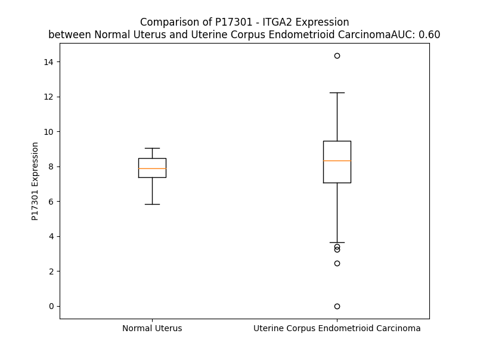

# Detailed Data for P17301

## Introduction to the Detailed Summary

### How to Interpret the Results

- **Summary & Metrics**: This section provides a quick reference to essential protein attributes, including expression changes, family classification, and biomarker applications. Regulation status (upregulated/downregulated) indicates the protein's behavior in a disease context. Some information comes from the original excel file with the proteins selected from literature, while others are derived from the analyses.
- **Expression Comparison**: A visual representation comparing protein expression between normal and disease states. It highlights significant changes in expression levels that might indicate diagnostic or therapeutic relevance. This is data coming from transcriptomics experiments and could not translate similarly to protein levels.
- **Isoform Alignment**: An interactive view of isoform alignments, revealing structural and functional differences between variants of the protein.
- **Interactors & Homologs**: Tables listing known interaction partners and homologous proteins, the more interactors and homologs, the more complex the protein is to design an antibody for.
- **Biological Assemblies**: Information about the structural arrangement of the protein in different assemblies, providing insights into its functional state but also the complexity of the protein to develop antibodies.
- **Combined Per-Residue Information**: A detailed table summarizing residue-level data. This includes predictions for epitope regions, aggregation tendencies, and modifications that might impact the protein's function. Each row corresponds to a residue in the protein, providing insights into specific sites that may be important for research or drug development.
## Summary & Metrics

- **UniProt Accession**: P17301
- **Gene Name**: ITGA2
- **Protein Name**: integrin, alpha 2 (CD49B, alpha 2 subunit of VLA-2 receptor)
- **Swiss Prot**: ITA2_HUMAN
- **Family**: transmembrane receptor
- **Biomarker Application**: disease progression,efficacy,prognosis
- **Number of Isoforms**: 0
- **Regulation**: 2
- **(transcriptomics) AUC**: 0.6
- **(transcriptomics) Fold Change**: 1.04
- **(transcriptomics) Regulation**: Upregulated
- **Discotope Epitope Count**: 237
- **Max n_uniprots (Homo)**: 2
- **Max n_uniprots (Hetero)**: 3

## Expression Comparison

## Interactors

| preferredName_A   | preferredName_B   |   score |
|:------------------|:------------------|--------:|
| ITGA2             | ITGB1             |   0.999 |
| ITGA2             | FN1               |   0.986 |
| ITGA2             | ITGB3             |   0.984 |
| ITGA2             | COL1A1            |   0.983 |
| ITGA2             | ITGB5             |   0.98  |
| ITGA2             | GP6               |   0.976 |
| ITGA2             | COL3A1            |   0.976 |
| ITGA2             | ITGB2             |   0.974 |
| ITGA2             | ITGB6             |   0.974 |
| ITGA2             | COL1A2            |   0.973 |
| ITGA2             | ITGA3             |   0.972 |
| ITGA2             | ITGA1             |   0.969 |
| ITGA2             | ITGAV             |   0.967 |
| ITGA2             | ITGB8             |   0.966 |
| ITGA2             | ITGA5             |   0.962 |
| ITGA2             | ITGA4             |   0.951 |
| ITGA2             | ITGA11            |   0.947 |
| ITGA2             | ITGB7             |   0.946 |
| ITGA2             | ITGA10            |   0.944 |
| ITGA2             | PTK2              |   0.94  |
| ITGA2             | HSPG2             |   0.937 |
| ITGA2             | ITGB4             |   0.924 |
| ITGA2             | CHAD              |   0.919 |
| ITGA2             | PIK3CB            |   0.918 |
| ITGA2             | ITGAL             |   0.917 |
| ITGA2             | PIK3R1            |   0.916 |
| ITGA2             | PIK3CA            |   0.913 |
| ITGA2             | PIK3R3            |   0.913 |
| ITGA2             | PRKACB            |   0.911 |
| ITGA2             | PIK3CD            |   0.91  |
| ITGA2             | PRKACG            |   0.908 |
| ITGA2             | PTPN6             |   0.908 |
| ITGA2             | PRKACA            |   0.908 |
| ITGA2             | PIK3R2            |   0.907 |

## Homologs

| uniprot_id   | gene_id   |
|:-------------|:----------|
| P13612       | ITGA4     |
| Q13349       | ITGAD     |
| O75578       | ITGA10    |
| A0A8V8TLP3   | ITGAV     |
| G3V3L8       | ITGA7     |
| P08514       | ITGA2B    |
| A0A7I2V498   | ITGAL     |
| P53708       | ITGA8     |
| Q13797       | ITGA9     |
| P38570       | ITGAE     |
| K7EMU3       | ITGA3     |
| A0A494C0F7   | ITGA1     |
| P11215       | ITGAM     |
| Q9UKX5       | ITGA11    |
| P20702       | ITGAX     |
| P08648       | ITGA5     |
| P23229       | ITGA6     |

## Biological Assemblies

|   Unnamed: 0 |   assembly |   n_uniprots | composition   | crystal_id   |
|-------------:|-----------:|-------------:|:--------------|:-------------|
|            0 |          1 |            3 | Hetero        | 5thp         |
|            1 |          2 |            3 | Hetero        | 5thp         |
|            2 |          3 |            3 | Hetero        | 5thp         |
|            3 |          4 |            3 | Hetero        | 5thp         |
|            4 |          5 |            3 | Hetero        | 5thp         |
|            5 |          6 |            3 | Hetero        | 5thp         |
|            0 |          1 |            2 | Homo          | 1aox         |
|            0 |          1 |            3 | Hetero        | 1v7p         |
|            0 |          1 |            2 | Homo          | 4bj3         |
|            0 |          1 |            3 | Hetero        | 6ndf         |
|            1 |          2 |            3 | Hetero        | 6ndf         |
|            2 |          3 |            3 | Hetero        | 6ndf         |
|            3 |          4 |            3 | Hetero        | 6ndf         |
|            4 |          5 |            3 | Hetero        | 6ndf         |
|            5 |          6 |            3 | Hetero        | 6ndf         |
|            0 |          1 |            3 | Hetero        | 6ndd         |
|            1 |          2 |            3 | Hetero        | 6ndd         |
|            2 |          3 |            3 | Hetero        | 6ndd         |
|            3 |          4 |            3 | Hetero        | 6ndd         |
|            4 |          5 |            3 | Hetero        | 6ndd         |
|            5 |          6 |            3 | Hetero        | 6ndd         |
|            0 |          1 |            3 | Hetero        | 6ndh         |
|            1 |          2 |            3 | Hetero        | 6ndh         |
|            2 |          3 |            3 | Hetero        | 6ndh         |
|            3 |          4 |            3 | Hetero        | 6ndh         |
|            4 |          5 |            3 | Hetero        | 6ndh         |
|            5 |          6 |            3 | Hetero        | 6ndh         |
|            0 |          1 |            3 | Hetero        | 6ndg         |
|            1 |          2 |            3 | Hetero        | 6ndg         |
|            2 |          3 |            3 | Hetero        | 6ndg         |
|            3 |          4 |            3 | Hetero        | 6ndg         |
|            4 |          5 |            3 | Hetero        | 6ndg         |
|            5 |          6 |            3 | Hetero        | 6ndg         |
|            0 |          1 |            1 | Homo          | 1dzi         |
|            0 |          1 |            3 | Hetero        | 6ndb         |
|            1 |          2 |            3 | Hetero        | 6ndb         |
|            2 |          3 |            3 | Hetero        | 6ndb         |
|            3 |          4 |            3 | Hetero        | 6ndb         |
|            4 |          5 |            3 | Hetero        | 6ndb         |
|            5 |          6 |            3 | Hetero        | 6ndb         |
|            0 |          1 |            3 | Hetero        | 6nde         |
|            1 |          2 |            3 | Hetero        | 6nde         |
|            2 |          3 |            3 | Hetero        | 6nde         |
|            3 |          4 |            3 | Hetero        | 6nde         |
|            4 |          5 |            3 | Hetero        | 6nde         |
|            5 |          6 |            3 | Hetero        | 6nde         |
|            0 |          1 |            3 | Hetero        | 6ndc         |
|            1 |          2 |            3 | Hetero        | 6ndc         |
|            2 |          3 |            3 | Hetero        | 6ndc         |
|            3 |          4 |            3 | Hetero        | 6ndc         |
|            4 |          5 |            3 | Hetero        | 6ndc         |
|            5 |          6 |            3 | Hetero        | 6ndc         |
|            0 |          1 |            1 | Homo          | 5hj2         |
|            1 |          2 |            1 | Homo          | 5hj2         |
|            2 |          3 |            1 | Homo          | 5hj2         |
|            3 |          4 |            1 | Homo          | 5hj2         |
|            4 |          5 |            1 | Homo          | 5hj2         |
|            5 |          6 |            1 | Homo          | 5hj2         |
|            0 |          1 |            3 | Hetero        | 6nd8         |
|            1 |          2 |            3 | Hetero        | 6nd8         |
|            2 |          3 |            3 | Hetero        | 6nd8         |
|            3 |          4 |            3 | Hetero        | 6nd8         |
|            4 |          5 |            3 | Hetero        | 6nd8         |
|            5 |          6 |            3 | Hetero        | 6nd8         |
|            0 |          1 |            3 | Hetero        | 6nda         |
|            1 |          2 |            3 | Hetero        | 6nda         |
|            2 |          3 |            3 | Hetero        | 6nda         |
|            3 |          4 |            3 | Hetero        | 6nda         |
|            4 |          5 |            3 | Hetero        | 6nda         |
|            5 |          6 |            3 | Hetero        | 6nda         |
|            0 |          1 |            3 | Hetero        | 6nd9         |
|            1 |          2 |            3 | Hetero        | 6nd9         |
|            2 |          3 |            3 | Hetero        | 6nd9         |
|            3 |          4 |            3 | Hetero        | 6nd9         |
|            4 |          5 |            3 | Hetero        | 6nd9         |
|            5 |          6 |            3 | Hetero        | 6nd9         |

## Combined Per-Residue Information

|   res | aa   |   epitope_score | epitope   |   relative_surface_accessibility |   modeling_confidence |   Aggregation | modification   | glycosylation                   |
|------:|:-----|----------------:|:----------|---------------------------------:|----------------------:|--------------:|:---------------|:--------------------------------|
|     1 | M    |         0.11964 | True      |                          1.32802 |                 37.33 |         0     | N/A            | N/A                             |
|     2 | G    |         0.12219 | True      |                          0.84837 |                 32.31 |         0     | N/A            | N/A                             |
|     3 | P    |         0.1918  | True      |                          1.00413 |                 37.25 |         0     | N/A            | N/A                             |
|     4 | E    |         0.13312 | True      |                          0.82829 |                 27.86 |         0     | N/A            | N/A                             |
|     5 | R    |         0.18533 | True      |                          0.97657 |                 34.7  |         0     | N/A            | N/A                             |
|     6 | T    |         0.13431 | True      |                          0.96734 |                 32.78 |         0     | N/A            | N/A                             |
|     7 | G    |         0.11583 | True      |                          0.94327 |                 33.19 |         0     | N/A            | N/A                             |
|     8 | A    |         0.14076 | True      |                          1.00149 |                 33.16 |         0     | N/A            | N/A                             |
|     9 | A    |         0.11582 | True      |                          0.81657 |                 37.22 |         0     | N/A            | N/A                             |
|    10 | P    |         0.14736 | True      |                          0.87317 |                 36.89 |         0     | N/A            | N/A                             |
|    11 | L    |         0.10514 | True      |                          0.82267 |                 42.18 |         0     | N/A            | N/A                             |
|    12 | P    |         0.08274 | False     |                          0.66639 |                 44.39 |         1.031 | N/A            | N/A                             |
|    13 | L    |         0.10561 | True      |                          0.83665 |                 43.87 |        83.123 | N/A            | N/A                             |
|    14 | L    |         0.11872 | True      |                          0.86787 |                 45.18 |        96.066 | N/A            | N/A                             |
|    15 | L    |         0.12002 | True      |                          0.64525 |                 44.7  |        98.109 | N/A            | N/A                             |
|    16 | V    |         0.08783 | False     |                          0.69899 |                 47.32 |        98.157 | N/A            | N/A                             |
|    17 | L    |         0.14571 | True      |                          0.66961 |                 46.19 |        98.132 | N/A            | N/A                             |
|    18 | A    |         0.10949 | True      |                          0.64915 |                 44.85 |        86.59  | N/A            | N/A                             |
|    19 | L    |         0.10429 | True      |                          0.63475 |                 39.28 |        75.07  | N/A            | N/A                             |
|    20 | S    |         0.09821 | True      |                          0.45359 |                 39.55 |        10.407 | N/A            | N/A                             |
|    21 | Q    |         0.16999 | True      |                          0.76494 |                 35.11 |         2.346 | N/A            | N/A                             |
|    22 | G    |         0.1148  | True      |                          0.57307 |                 31.72 |         2.032 | N/A            | N/A                             |
|    23 | I    |         0.13451 | True      |                          0.67336 |                 36.42 |         2.005 | N/A            | N/A                             |
|    24 | L    |         0.12121 | True      |                          0.90934 |                 34.49 |         1.696 | N/A            | N/A                             |
|    25 | N    |         0.17942 | True      |                          0.8414  |                 32.62 |         0.123 | N/A            | N/A                             |
|    26 | C    |         0.08545 | False     |                          0.75498 |                 33.06 |         0.068 | N/A            | N/A                             |
|    27 | C    |         0.0614  | False     |                          0.76372 |                 36.35 |         0.059 | N/A            | N/A                             |
|    28 | L    |         0.0334  | False     |                          0.48477 |                 46.29 |         0.42  | N/A            | N/A                             |
|    29 | A    |         0.04159 | False     |                          0.3552  |                 48.73 |         0.409 | N/A            | N/A                             |
|    30 | Y    |         0.04682 | False     |                          0.30824 |                 67.18 |         0.4   | N/A            | N/A                             |
|    31 | N    |         0.01499 | False     |                          0.07551 |                 81.36 |         0.362 | N/A            | N/A                             |
|    32 | V    |         0.00798 | False     |                          0.0184  |                 90.8  |         0.362 | N/A            | N/A                             |
|    33 | G    |         0.03376 | False     |                          0.04828 |                 88.76 |         0     | N/A            | N/A                             |
|    34 | L    |         0.03396 | False     |                          0.15841 |                 89.56 |         0     | N/A            | N/A                             |
|    35 | P    |         0.07996 | False     |                          0.55681 |                 83.77 |         0     | N/A            | N/A                             |
|    36 | E    |         0.11451 | True      |                          0.82336 |                 85.61 |         0     | N/A            | N/A                             |
|    37 | A    |         0.01996 | False     |                          0.1935  |                 90.85 |         0     | N/A            | N/A                             |
|    38 | K    |         0.09651 | True      |                          0.14028 |                 93.06 |         0     | N/A            | N/A                             |
|    39 | I    |         0.05688 | False     |                          0.21897 |                 94.3  |         0     | N/A            | N/A                             |
|    40 | F    |         0.00308 | False     |                          0       |                 95.64 |         0     | N/A            | N/A                             |
|    41 | S    |         0.06451 | False     |                          0.53188 |                 94.81 |         0     | N/A            | N/A                             |
|    42 | G    |         0.07069 | False     |                          0.28692 |                 94.59 |         0     | N/A            | N/A                             |
|    43 | P    |         0.15447 | True      |                          0.42604 |                 95.22 |         0     | N/A            | N/A                             |
|    44 | S    |         0.08406 | False     |                          0.35597 |                 95.29 |         0     | N/A            | N/A                             |
|    45 | S    |         0.12482 | True      |                          0.44625 |                 96.3  |         0     | N/A            | N/A                             |
|    46 | E    |         0.057   | False     |                          0.11591 |                 96.93 |         0     | N/A            | N/A                             |
|    47 | Q    |         0.05883 | False     |                          0.16626 |                 96.82 |         0     | N/A            | N/A                             |
|    48 | F    |         0.00814 | False     |                          0.00127 |                 98.01 |         0.991 | N/A            | N/A                             |
|    49 | G    |         0.0016  | False     |                          0       |                 97.44 |         0.991 | N/A            | N/A                             |
|    50 | Y    |         0.05283 | False     |                          0.42337 |                 98.05 |         1.405 | N/A            | N/A                             |
|    51 | A    |         0.01589 | False     |                          0.12882 |                 97.78 |         1.405 | N/A            | N/A                             |
|    52 | V    |         0.01887 | False     |                          0.07271 |                 97.93 |         1.547 | N/A            | N/A                             |
|    53 | Q    |         0.0064  | False     |                          0.04408 |                 97.23 |         0.723 | N/A            | N/A                             |
|    54 | Q    |         0.01087 | False     |                          0.01127 |                 96.72 |         0.723 | N/A            | N/A                             |
|    55 | F    |         0.02467 | False     |                          0.05415 |                 95.14 |         0.723 | N/A            | N/A                             |
|    56 | I    |         0.05361 | False     |                          0.50959 |                 92.75 |         0.723 | N/A            | N/A                             |
|    57 | N    |         0.03287 | False     |                          0.08971 |                 90.84 |         0     | N/A            | N/A                             |
|    58 | P    |         0.14018 | True      |                          1.05049 |                 87.11 |         0     | N/A            | N/A                             |
|    59 | K    |         0.13424 | True      |                          0.67187 |                 87.52 |         0     | N/A            | N/A                             |
|    60 | G    |         0.04454 | False     |                          0.23962 |                 90.58 |         0     | N/A            | N/A                             |
|    61 | N    |         0.03742 | False     |                          0.17092 |                 94.47 |         1.147 | N/A            | N/A                             |
|    62 | W    |         0.02615 | False     |                          0.17744 |                 95.25 |         8.388 | N/A            | N/A                             |
|    63 | L    |         0.00258 | False     |                          0       |                 96.81 |         8.388 | N/A            | N/A                             |
|    64 | L    |         0.00158 | False     |                          0       |                 97.7  |         8.388 | N/A            | N/A                             |
|    65 | V    |         0.002   | False     |                          0       |                 98.35 |         8.388 | N/A            | N/A                             |
|    66 | G    |         0.00211 | False     |                          0       |                 98.09 |         7.241 | N/A            | N/A                             |
|    67 | S    |         0.00376 | False     |                          0       |                 98.07 |         0     | N/A            | N/A                             |
|    68 | P    |         0.03603 | False     |                          0.01789 |                 97.4  |         0     | N/A            | N/A                             |
|    69 | W    |         0.14985 | True      |                          0.40765 |                 97.3  |         0     | N/A            | N/A                             |
|    70 | S    |         0.03375 | False     |                          0.0095  |                 96.9  |         0     | N/A            | N/A                             |
|    71 | G    |         0.08505 | False     |                          0.37111 |                 94.22 |         0     | N/A            | N/A                             |
|    72 | F    |         0.42489 | True      |                          0.4683  |                 93.9  |         0     | N/A            | N/A                             |
|    73 | P    |         0.49395 | True      |                          0.78574 |                 90.52 |         0     | N/A            | N/A                             |
|    74 | E    |         0.21009 | True      |                          0.86686 |                 90.16 |         0     | N/A            | N/A                             |
|    75 | N    |         0.07527 | False     |                          0.2557  |                 93.37 |         0     | N/A            | N/A                             |
|    76 | R    |         0.24241 | True      |                          0.3081  |                 93.9  |         0     | N/A            | N/A                             |
|    77 | M    |         0.09233 | False     |                          0.20616 |                 95.77 |         0     | N/A            | N/A                             |
|    78 | G    |         0.00449 | False     |                          0.00238 |                 96.69 |         0     | N/A            | N/A                             |
|    79 | D    |         0.00788 | False     |                          0       |                 96.96 |         0     | N/A            | N/A                             |
|    80 | V    |         0.00228 | False     |                          0       |                 97.82 |         0     | N/A            | N/A                             |
|    81 | Y    |         0.04017 | False     |                          0.08945 |                 97.77 |         0     | N/A            | N/A                             |
|    82 | K    |         0.06927 | False     |                          0.13794 |                 95.94 |         0     | N/A            | N/A                             |
|    83 | C    |         0.00353 | False     |                          0       |                 96.39 |         0     | N/A            | N/A                             |
|    84 | P    |         0.04157 | False     |                          0.10338 |                 95.14 |         0     | N/A            | N/A                             |
|    85 | V    |         0.02663 | False     |                          0.06152 |                 93.64 |         0     | N/A            | N/A                             |
|    86 | D    |         0.10708 | True      |                          0.55222 |                 88.91 |         0     | N/A            | N/A                             |
|    87 | L    |         0.08887 | False     |                          0.62544 |                 85.89 |         0     | N/A            | N/A                             |
|    88 | S    |         0.09334 | False     |                          0.9319  |                 78.24 |         0     | N/A            | N/A                             |
|    89 | T    |         0.09906 | True      |                          0.50796 |                 79.27 |         0     | N/A            | N/A                             |
|    90 | A    |         0.07848 | False     |                          0.38787 |                 80.28 |         0     | N/A            | N/A                             |
|    91 | T    |         0.131   | True      |                          0.67674 |                 90.51 |         0     | N/A            | N/A                             |
|    92 | C    |         0.04023 | False     |                          0.21113 |                 95.67 |         0     | N/A            | N/A                             |
|    93 | E    |         0.13147 | True      |                          0.50768 |                 94.76 |         0     | N/A            | N/A                             |
|    94 | K    |         0.12796 | True      |                          0.3003  |                 95.23 |         0     | N/A            | N/A                             |
|    95 | L    |         0.04954 | False     |                          0.16703 |                 95.76 |         0     | N/A            | N/A                             |
|    96 | N    |         0.09106 | False     |                          0.44306 |                 94.96 |         0     | N/A            | N/A                             |
|    97 | L    |         0.02065 | False     |                          0.03133 |                 95.26 |         0     | N/A            | N/A                             |
|    98 | Q    |         0.06816 | False     |                          0.06616 |                 92.26 |         0     | N/A            | N/A                             |
|    99 | T    |         0.19084 | True      |                          0.64971 |                 90.16 |         0     | N/A            | N/A                             |
|   100 | S    |         0.06734 | False     |                          0.44825 |                 91.1  |         0     | N/A            | N/A                             |
|   101 | T    |         0.00449 | False     |                          0.0007  |                 93.11 |         0     | N/A            | N/A                             |
|   102 | S    |         0.05883 | False     |                          0.40635 |                 91.82 |         0     | N/A            | N/A                             |
|   103 | I    |         0.03765 | False     |                          0.09304 |                 91.64 |         0     | N/A            | N/A                             |
|   104 | P    |         0.11975 | True      |                          0.73429 |                 86.34 |         0     | N/A            | N/A                             |
|   105 | N    |         0.14685 | True      |                          1.00762 |                 82.33 |         0     | N/A            | N-linked (GlcNAc...) asparagine |
|   106 | V    |         0.0362  | False     |                          0.25152 |                 84.45 |         0     | N/A            | N/A                             |
|   107 | T    |         0.06001 | False     |                          0.57154 |                 85.29 |         0     | N/A            | N/A                             |
|   108 | E    |         0.08263 | False     |                          0.21295 |                 89.04 |         0     | N/A            | N/A                             |
|   109 | M    |         0.16369 | True      |                          0.25919 |                 89.81 |         0     | N/A            | N/A                             |
|   110 | K    |         0.10559 | True      |                          0.22047 |                 90.86 |         0     | N/A            | N/A                             |
|   111 | T    |         0.13722 | True      |                          0.54469 |                 88.67 |         0     | N/A            | N/A                             |
|   112 | N    |         0.0881  | False     |                          0.38762 |                 91.88 |         0     | N/A            | N-linked (GlcNAc...) asparagine |
|   113 | M    |         0.0121  | False     |                          0       |                 94.11 |         0.969 | N/A            | N/A                             |
|   114 | S    |         0.04373 | False     |                          0.05812 |                 95.79 |         1.818 | N/A            | N/A                             |
|   115 | L    |         0.00332 | False     |                          0       |                 97    |         7.051 | N/A            | N/A                             |
|   116 | G    |         0.00114 | False     |                          0       |                 96.59 |         7.409 | N/A            | N/A                             |
|   117 | L    |         0.0371  | False     |                          0.19104 |                 97.16 |         7.409 | N/A            | N/A                             |
|   118 | I    |         0.02359 | False     |                          0.21039 |                 96.57 |         7.409 | N/A            | N/A                             |
|   119 | L    |         0.01984 | False     |                          0.13278 |                 95.03 |         6.974 | N/A            | N/A                             |
|   120 | T    |         0.01446 | False     |                          0.12403 |                 94.16 |         2.823 | N/A            | N/A                             |
|   121 | R    |         0.02447 | False     |                          0.18643 |                 92.44 |         0     | N/A            | N/A                             |
|   122 | N    |         0.02211 | False     |                          0.12039 |                 88.78 |         0     | N/A            | N/A                             |
|   123 | M    |         0.08331 | False     |                          0.56963 |                 81.03 |         0     | N/A            | N/A                             |
|   124 | G    |         0.09085 | False     |                          0.68544 |                 77.15 |         0     | N/A            | N/A                             |
|   125 | T    |         0.09318 | False     |                          0.52911 |                 83.02 |         0     | N/A            | N/A                             |
|   126 | G    |         0.04369 | False     |                          0.53686 |                 87.06 |         0     | N/A            | N/A                             |
|   127 | G    |         0.00999 | False     |                          0.02855 |                 93.3  |         0     | N/A            | N/A                             |
|   128 | F    |         0.0029  | False     |                          0.00101 |                 95.18 |         0     | N/A            | N/A                             |
|   129 | L    |         0.00527 | False     |                          0.00659 |                 95.5  |         0     | N/A            | N/A                             |
|   130 | T    |         0.00363 | False     |                          0       |                 97.04 |         0     | N/A            | N/A                             |
|   131 | C    |         0.00176 | False     |                          0       |                 97.57 |         0     | N/A            | N/A                             |
|   132 | G    |         0.00305 | False     |                          0       |                 96.94 |         0     | N/A            | N/A                             |
|   133 | P    |         0.01336 | False     |                          0.0169  |                 96.46 |         0     | N/A            | N/A                             |
|   134 | L    |         0.05041 | False     |                          0.46763 |                 95.82 |         0     | N/A            | N/A                             |
|   135 | W    |         0.00341 | False     |                          0       |                 95.89 |         0     | N/A            | N/A                             |
|   136 | A    |         0.02561 | False     |                          0.0676  |                 92.5  |         0     | N/A            | N/A                             |
|   137 | Q    |         0.03    | False     |                          0.02416 |                 88.71 |         0     | N/A            | N/A                             |
|   138 | Q    |         0.10545 | True      |                          0.26218 |                 82.61 |         0     | N/A            | N/A                             |
|   139 | C    |         0.01793 | False     |                          0.07295 |                 73.6  |         0     | N/A            | N/A                             |
|   140 | G    |         0.02194 | False     |                          0.27873 |                 67.54 |         0     | N/A            | N/A                             |
|   141 | N    |         0.05158 | False     |                          0.57618 |                 65.07 |         0     | N/A            | N/A                             |
|   142 | Q    |         0.06481 | False     |                          0.50063 |                 69.78 |         0     | N/A            | N/A                             |
|   143 | Y    |         0.17162 | True      |                          0.51686 |                 82.25 |         0.247 | N/A            | N/A                             |
|   144 | Y    |         0.03574 | False     |                          0.09671 |                 87.72 |         0.247 | N/A            | N/A                             |
|   145 | T    |         0.08833 | False     |                          0.17565 |                 92.26 |         0.247 | N/A            | N/A                             |
|   146 | T    |         0.00976 | False     |                          0.0238  |                 92.78 |         0.247 | N/A            | N/A                             |
|   147 | G    |         0.00129 | False     |                          0.00119 |                 95.48 |         0.247 | N/A            | N/A                             |
|   148 | V    |         0.00751 | False     |                          0.00476 |                 96.29 |         0.247 | N/A            | N/A                             |
|   149 | C    |         0.00312 | False     |                          0.00539 |                 95.98 |         0     | N/A            | N/A                             |
|   150 | S    |         0.00376 | False     |                          0       |                 95.44 |         0     | N/A            | N/A                             |
|   151 | D    |         0.01765 | False     |                          0.09754 |                 94.09 |         0     | N/A            | N/A                             |
|   152 | I    |         0.01605 | False     |                          0.00744 |                 95.62 |         0     | N/A            | N/A                             |
|   153 | S    |         0.04209 | False     |                          0.18682 |                 93.91 |         0     | N/A            | N/A                             |
|   154 | P    |         0.05062 | False     |                          0.33375 |                 93.29 |         0     | N/A            | N/A                             |
|   155 | D    |         0.11496 | True      |                          0.44683 |                 92.84 |         0     | N/A            | N/A                             |
|   156 | F    |         0.03206 | False     |                          0.09741 |                 94.11 |         0     | N/A            | N/A                             |
|   157 | Q    |         0.10481 | True      |                          0.5932  |                 93.06 |         0     | N/A            | N/A                             |
|   158 | L    |         0.08062 | False     |                          0.33932 |                 91.87 |         0     | N/A            | N/A                             |
|   159 | S    |         0.08732 | False     |                          0.56943 |                 90.62 |         0     | N/A            | N/A                             |
|   160 | A    |         0.09767 | True      |                          0.48721 |                 91.5  |         0     | N/A            | N/A                             |
|   161 | S    |         0.05375 | False     |                          0.16988 |                 94.31 |         0     | N/A            | N/A                             |
|   162 | F    |         0.05006 | False     |                          0.15685 |                 93.99 |         0     | N/A            | N/A                             |
|   163 | S    |         0.04585 | False     |                          0.10977 |                 94.36 |         0     | N/A            | N/A                             |
|   164 | P    |         0.01878 | False     |                          0.09358 |                 91.44 |         0     | N/A            | N/A                             |
|   165 | A    |         0.00612 | False     |                          0.02015 |                 90.15 |         0     | N/A            | N/A                             |
|   166 | T    |         0.02723 | False     |                          0.20984 |                 87.66 |         0     | N/A            | N/A                             |
|   167 | Q    |         0.0303  | False     |                          0.31853 |                 76.12 |         0     | N/A            | N/A                             |
|   168 | P    |         0.05053 | False     |                          0.767   |                 68.29 |         0     | N/A            | N/A                             |
|   169 | C    |         0.03093 | False     |                          0.38153 |                 64.81 |         0     | N/A            | N/A                             |
|   170 | P    |         0.0206  | False     |                          0.2251  |                 57.83 |         0     | N/A            | N/A                             |
|   171 | S    |         0.03435 | False     |                          0.35441 |                 62.07 |         0     | N/A            | N/A                             |
|   172 | L    |         0.0316  | False     |                          0.30655 |                 76.53 |         0     | N/A            | N/A                             |
|   173 | I    |         0.00828 | False     |                          0.01224 |                 84.21 |         0     | N/A            | N/A                             |
|   174 | D    |         0.009   | False     |                          0.00568 |                 92.6  |         0     | N/A            | N/A                             |
|   175 | V    |         0.00175 | False     |                          0       |                 94.22 |         9.968 | N/A            | N/A                             |
|   176 | V    |         0.00124 | False     |                          0.0019  |                 97.15 |         9.968 | N/A            | N/A                             |
|   177 | V    |         0.00591 | False     |                          0.01523 |                 96.85 |         9.968 | N/A            | N/A                             |
|   178 | V    |         0.0012  | False     |                          0       |                 97.36 |         9.968 | N/A            | N/A                             |
|   179 | C    |         0.00254 | False     |                          0       |                 95.99 |         9.968 | N/A            | N/A                             |
|   180 | D    |         0.00488 | False     |                          0       |                 95.44 |         0     | N/A            | N/A                             |
|   181 | E    |         0.01509 | False     |                          0.03134 |                 94.6  |         0     | N/A            | N/A                             |
|   182 | S    |         0.09638 | True      |                          0.02704 |                 94.37 |         0     | N/A            | N/A                             |
|   183 | N    |         0.3611  | True      |                          0.66775 |                 91.5  |         0     | N/A            | N/A                             |
|   184 | S    |         0.10271 | True      |                          0.17063 |                 90.02 |         0     | N/A            | N/A                             |
|   185 | I    |         0.01709 | False     |                          0       |                 90.24 |         0     | N/A            | N/A                             |
|   186 | Y    |         0.19817 | True      |                          0.66056 |                 88.66 |         0     | N/A            | N/A                             |
|   187 | P    |         0.16521 | True      |                          0.38471 |                 91.89 |         0     | N/A            | N/A                             |
|   188 | W    |         0.03562 | False     |                          0.09458 |                 92.68 |         0     | N/A            | N/A                             |
|   189 | D    |         0.10696 | True      |                          0.50111 |                 92.62 |         0     | N/A            | N/A                             |
|   190 | A    |         0.0527  | False     |                          0.10169 |                 91.82 |         0     | N/A            | N/A                             |
|   191 | V    |         0.00315 | False     |                          0       |                 92.36 |         0     | N/A            | N/A                             |
|   192 | K    |         0.0801  | False     |                          0.21337 |                 92.85 |         0     | N/A            | N/A                             |
|   193 | N    |         0.05335 | False     |                          0.49021 |                 92.03 |         0     | N/A            | N/A                             |
|   194 | F    |         0.00433 | False     |                          0.00127 |                 92.51 |         0.531 | N/A            | N/A                             |
|   195 | L    |         0.01513 | False     |                          0.02391 |                 92.63 |         0.531 | N/A            | N/A                             |
|   196 | E    |         0.04803 | False     |                          0.23903 |                 91.38 |         0.531 | N/A            | N/A                             |
|   197 | K    |         0.10284 | True      |                          0.4753  |                 89.1  |         0.531 | N/A            | N/A                             |
|   198 | F    |         0.00271 | False     |                          0.00127 |                 89.83 |         0.699 | N/A            | N/A                             |
|   199 | V    |         0.007   | False     |                          0.02951 |                 89.76 |         0.699 | N/A            | N/A                             |
|   200 | Q    |         0.04918 | False     |                          0.35068 |                 85.84 |         0.167 | N/A            | N/A                             |
|   201 | G    |         0.02089 | False     |                          0.34597 |                 81.87 |         0.167 | N/A            | N/A                             |
|   202 | L    |         0.00302 | False     |                          0       |                 84.18 |         0.167 | N/A            | N/A                             |
|   203 | D    |         0.02782 | False     |                          0.15231 |                 79.46 |         0     | N/A            | N/A                             |
|   204 | I    |         0.06562 | False     |                          0.09144 |                 86.81 |         0     | N/A            | N/A                             |
|   205 | G    |         0.01779 | False     |                          0.05904 |                 85.89 |         0     | N/A            | N/A                             |
|   206 | P    |         0.12806 | True      |                          0.56261 |                 85.41 |         0     | N/A            | N/A                             |
|   207 | T    |         0.06245 | False     |                          0.77546 |                 80.78 |         0     | N/A            | N/A                             |
|   208 | K    |         0.04183 | False     |                          0.46108 |                 80.83 |         0     | N/A            | N/A                             |
|   209 | T    |         0.01482 | False     |                          0.01831 |                 87.31 |         0     | N/A            | N/A                             |
|   210 | Q    |         0.03547 | False     |                          0.08112 |                 92.86 |         0     | N/A            | N/A                             |
|   211 | V    |         0.01253 | False     |                          0.01569 |                 94.64 |         1.085 | N/A            | N/A                             |
|   212 | G    |         0.01022 | False     |                          0.0338  |                 95.91 |         1.085 | N/A            | N/A                             |
|   213 | L    |         0.00916 | False     |                          0.01378 |                 97.17 |         1.491 | N/A            | N/A                             |
|   214 | I    |         0.01197 | False     |                          0.0104  |                 97.68 |         1.491 | N/A            | N/A                             |
|   215 | Q    |         0.00957 | False     |                          0.00707 |                 96.88 |         1.491 | N/A            | N/A                             |
|   216 | Y    |         0.00766 | False     |                          0.00183 |                 96.9  |         1.343 | N/A            | N/A                             |
|   217 | A    |         0.06196 | False     |                          0.04396 |                 94.98 |         0.835 | N/A            | N/A                             |
|   218 | N    |         0.12957 | True      |                          0.3089  |                 94.69 |         0     | N/A            | N/A                             |
|   219 | N    |         0.20115 | True      |                          0.71969 |                 94.73 |         0     | N/A            | N/A                             |
|   220 | P    |         0.05589 | False     |                          0.27374 |                 95.59 |         0     | N/A            | N/A                             |
|   221 | R    |         0.18868 | True      |                          0.28281 |                 95.42 |         0     | N/A            | N/A                             |
|   222 | V    |         0.09455 | False     |                          0.34232 |                 95.94 |         7.832 | N/A            | N/A                             |
|   223 | V    |         0.08355 | False     |                          0.38233 |                 95.13 |         7.832 | N/A            | N/A                             |
|   224 | F    |         0.07745 | False     |                          0.04147 |                 96.13 |         7.832 | N/A            | N/A                             |
|   225 | N    |         0.11599 | True      |                          0.29272 |                 96.81 |         7.832 | N/A            | N/A                             |
|   226 | L    |         0.00607 | False     |                          0.00633 |                 95.33 |         7.832 | N/A            | N/A                             |
|   227 | N    |         0.11607 | True      |                          0.44945 |                 93.36 |         0.502 | N/A            | N/A                             |
|   228 | T    |         0.19317 | True      |                          0.46367 |                 94.95 |         0.211 | N/A            | N/A                             |
|   229 | Y    |         0.08406 | False     |                          0.27842 |                 93.58 |         0.211 | N/A            | N/A                             |
|   230 | K    |         0.09522 | False     |                          0.67842 |                 89.39 |         0     | N/A            | N/A                             |
|   231 | T    |         0.08303 | False     |                          0.39938 |                 89.91 |         0     | N/A            | N/A                             |
|   232 | K    |         0.05732 | False     |                          0.25534 |                 89.18 |         0     | N/A            | N/A                             |
|   233 | E    |         0.13514 | True      |                          0.58765 |                 90.18 |         0     | N/A            | N/A                             |
|   234 | E    |         0.17065 | True      |                          0.41036 |                 92.18 |         0     | N/A            | N/A                             |
|   235 | M    |         0.00613 | False     |                          0.00575 |                 91.89 |         0.602 | N/A            | N/A                             |
|   236 | I    |         0.0361  | False     |                          0.24319 |                 91.13 |         0.781 | N/A            | N/A                             |
|   237 | V    |         0.09024 | False     |                          0.59028 |                 91.21 |         0.781 | N/A            | N/A                             |
|   238 | A    |         0.0686  | False     |                          0.12563 |                 90.58 |         0.781 | N/A            | N/A                             |
|   239 | T    |         0.01228 | False     |                          0.00861 |                 90.87 |         0.781 | N/A            | N/A                             |
|   240 | S    |         0.15503 | True      |                          0.41114 |                 88.27 |         0.179 | N/A            | N/A                             |
|   241 | Q    |         0.23266 | True      |                          0.68719 |                 89.86 |         0     | N/A            | N/A                             |
|   242 | T    |         0.05909 | False     |                          0.08155 |                 91.28 |         0     | N/A            | N/A                             |
|   243 | S    |         0.12868 | True      |                          0.45481 |                 91.94 |         0     | N/A            | N/A                             |
|   244 | Q    |         0.16984 | True      |                          0.27032 |                 93.32 |         0     | N/A            | N/A                             |
|   245 | Y    |         0.19257 | True      |                          0.76723 |                 90.68 |         0     | N/A            | N/A                             |
|   246 | G    |         0.18564 | True      |                          0.2487  |                 89    |         0     | N/A            | N/A                             |
|   247 | G    |         0.14025 | True      |                          0.19634 |                 89.75 |         0     | N/A            | N/A                             |
|   248 | D    |         0.26545 | True      |                          0.70058 |                 90.23 |         0     | N/A            | N/A                             |
|   249 | L    |         0.12605 | True      |                          0.38979 |                 92.43 |         0     | N/A            | N/A                             |
|   250 | T    |         0.08384 | False     |                          0.05067 |                 92.36 |         0     | N/A            | N/A                             |
|   251 | N    |         0.03206 | False     |                          0.1884  |                 95.56 |         0     | N/A            | N/A                             |
|   252 | T    |         0.00511 | False     |                          0       |                 96.11 |         0.36  | N/A            | N/A                             |
|   253 | F    |         0.00342 | False     |                          0       |                 96.65 |         0.36  | N/A            | N/A                             |
|   254 | G    |         0.04903 | False     |                          0.27298 |                 95.84 |         0.36  | N/A            | N/A                             |
|   255 | A    |         0.00086 | False     |                          0       |                 96.81 |         0.36  | N/A            | N/A                             |
|   256 | I    |         0.00269 | False     |                          0       |                 97.85 |         0.36  | N/A            | N/A                             |
|   257 | Q    |         0.06449 | False     |                          0.21046 |                 97.35 |         0     | N/A            | N/A                             |
|   258 | Y    |         0.08234 | False     |                          0.31299 |                 97.39 |         0     | N/A            | N/A                             |
|   259 | A    |         0.00131 | False     |                          0       |                 97.34 |         0     | N/A            | N/A                             |
|   260 | R    |         0.0913  | False     |                          0.1257  |                 96.72 |         0     | N/A            | N/A                             |
|   261 | K    |         0.1484  | True      |                          0.51964 |                 95.71 |         0     | N/A            | N/A                             |
|   262 | Y    |         0.31234 | True      |                          0.51285 |                 96.33 |         0     | N/A            | N/A                             |
|   263 | A    |         0.01307 | False     |                          0.07364 |                 96.25 |         0     | N/A            | N/A                             |
|   264 | Y    |         0.03093 | False     |                          0.09667 |                 95.06 |         0     | N/A            | N/A                             |
|   265 | S    |         0.07336 | False     |                          0.29592 |                 94.51 |         0     | N/A            | N/A                             |
|   266 | A    |         0.12112 | True      |                          0.84088 |                 90.97 |         0     | N/A            | N/A                             |
|   267 | A    |         0.15033 | True      |                          0.88684 |                 92.37 |         0     | N/A            | N/A                             |
|   268 | S    |         0.09146 | False     |                          0.12658 |                 94.68 |         0     | N/A            | N/A                             |
|   269 | G    |         0.03255 | False     |                          0.13525 |                 92.59 |         0     | N/A            | N/A                             |
|   270 | G    |         0.03071 | False     |                          0.1428  |                 91.07 |         0     | N/A            | N/A                             |
|   271 | R    |         0.13458 | True      |                          0.1586  |                 90.09 |         0     | N/A            | N/A                             |
|   272 | R    |         0.16176 | True      |                          1.00713 |                 81.73 |         0     | N/A            | N/A                             |
|   273 | S    |         0.05898 | False     |                          0.61104 |                 78.12 |         0     | N/A            | N/A                             |
|   274 | A    |         0.02852 | False     |                          0.11646 |                 85.76 |         0.032 | N/A            | N/A                             |
|   275 | T    |         0.01941 | False     |                          0.31431 |                 85.59 |         0.036 | N/A            | N/A                             |
|   276 | K    |         0.04019 | False     |                          0.28005 |                 92.29 |         0.044 | N/A            | N/A                             |
|   277 | V    |         0.00263 | False     |                          0       |                 93.12 |        95.348 | N/A            | N/A                             |
|   278 | M    |         0.00165 | False     |                          0       |                 96.63 |        98.368 | N/A            | N/A                             |
|   279 | V    |         0.00249 | False     |                          0       |                 96.2  |        98.368 | N/A            | N/A                             |
|   280 | V    |         0.00105 | False     |                          0       |                 96.85 |        98.368 | N/A            | N/A                             |
|   281 | V    |         0.00101 | False     |                          0       |                 95.69 |        98.368 | N/A            | N/A                             |
|   282 | T    |         0.00431 | False     |                          0.00095 |                 94.85 |        38.611 | N/A            | N/A                             |
|   283 | D    |         0.00433 | False     |                          0       |                 91.95 |         0.044 | N/A            | N/A                             |
|   284 | G    |         0.09937 | True      |                          0.13841 |                 88.88 |         0.003 | N/A            | N/A                             |
|   285 | E    |         0.11329 | True      |                          0.40022 |                 91.08 |         0     | N/A            | N/A                             |
|   286 | S    |         0.07296 | False     |                          0.12013 |                 92.64 |         0     | N/A            | N/A                             |
|   287 | H    |         0.18435 | True      |                          0.65165 |                 92.72 |         0     | N/A            | N/A                             |
|   288 | D    |         0.05851 | False     |                          0.13275 |                 94.09 |         0     | N/A            | N/A                             |
|   289 | G    |         0.15661 | True      |                          0.29905 |                 89.19 |         0     | N/A            | N/A                             |
|   290 | S    |         0.21173 | True      |                          0.91643 |                 92.85 |         0     | N/A            | N/A                             |
|   291 | M    |         0.09497 | False     |                          0.3458  |                 94.28 |         0     | N/A            | N/A                             |
|   292 | L    |         0.10753 | True      |                          0.27039 |                 93.89 |         0     | N/A            | N/A                             |
|   293 | K    |         0.1619  | True      |                          0.74433 |                 93.08 |         0     | N/A            | N/A                             |
|   294 | A    |         0.18135 | True      |                          0.55803 |                 95.79 |         0     | N/A            | N/A                             |
|   295 | V    |         0.0072  | False     |                          0.00381 |                 96.72 |         0     | N/A            | N/A                             |
|   296 | I    |         0.04136 | False     |                          0.0848  |                 96.48 |         0     | N/A            | N/A                             |
|   297 | D    |         0.10571 | True      |                          0.45832 |                 95.09 |         0     | N/A            | N/A                             |
|   298 | Q    |         0.08734 | False     |                          0.38196 |                 97.06 |         0     | N/A            | N/A                             |
|   299 | C    |         0.0021  | False     |                          0       |                 96.17 |         0     | N/A            | N/A                             |
|   300 | N    |         0.10879 | True      |                          0.49854 |                 92.84 |         0     | N/A            | N/A                             |
|   301 | H    |         0.15642 | True      |                          0.84844 |                 92.36 |         0     | N/A            | N/A                             |
|   302 | D    |         0.08167 | False     |                          0.30829 |                 92.79 |         0     | N/A            | N/A                             |
|   303 | N    |         0.15239 | True      |                          0.80097 |                 89.95 |         0     | N/A            | N/A                             |
|   304 | I    |         0.04839 | False     |                          0.03105 |                 93.45 |         0     | N/A            | N/A                             |
|   305 | L    |         0.03168 | False     |                          0.22766 |                 92.08 |         0     | N/A            | N/A                             |
|   306 | R    |         0.02429 | False     |                          0.02248 |                 95.26 |         0     | N/A            | N/A                             |
|   307 | F    |         0.00199 | False     |                          0.00064 |                 94.73 |        18.174 | N/A            | N/A                             |
|   308 | G    |         0.00134 | False     |                          0       |                 94.67 |        19.457 | N/A            | N/A                             |
|   309 | I    |         0.00292 | False     |                          0       |                 95.23 |        40.124 | N/A            | N/A                             |
|   310 | A    |         0.00229 | False     |                          0       |                 94.57 |        41.812 | N/A            | N/A                             |
|   311 | V    |         0.00271 | False     |                          0       |                 94.56 |        43.146 | N/A            | N/A                             |
|   312 | L    |         0.04335 | False     |                          0.10964 |                 92.58 |        41.649 | N/A            | N/A                             |
|   313 | G    |         0.02609 | False     |                          0.01246 |                 89.63 |        32.642 | N/A            | N/A                             |
|   314 | Y    |         0.22979 | True      |                          0.37589 |                 89.01 |        30.088 | N/A            | N/A                             |
|   315 | L    |         0.09052 | False     |                          0.07831 |                 88.87 |        20.708 | N/A            | N/A                             |
|   316 | N    |         0.18693 | True      |                          0.48917 |                 89.64 |         0.668 | N/A            | N/A                             |
|   317 | R    |         0.38889 | True      |                          0.52304 |                 88.28 |         0     | N/A            | N/A                             |
|   318 | N    |         0.25946 | True      |                          0.47889 |                 88.29 |         0     | N/A            | N/A                             |
|   319 | A    |         0.31716 | True      |                          0.92772 |                 87.34 |         0     | N/A            | N/A                             |
|   320 | L    |         0.29869 | True      |                          0.55687 |                 89.03 |         0     | N/A            | N/A                             |
|   321 | D    |         0.11377 | True      |                          0.50056 |                 89.28 |         0     | N/A            | N/A                             |
|   322 | T    |         0.06882 | False     |                          0.19646 |                 90.62 |         0     | N/A            | N/A                             |
|   323 | K    |         0.27128 | True      |                          0.70846 |                 91.6  |         0     | N/A            | N/A                             |
|   324 | N    |         0.12539 | True      |                          0.5277  |                 91.7  |         0     | N/A            | N/A                             |
|   325 | L    |         0.00294 | False     |                          0.00082 |                 92.04 |         0     | N/A            | N/A                             |
|   326 | I    |         0.08419 | False     |                          0.21679 |                 92.84 |         0     | N/A            | N/A                             |
|   327 | K    |         0.15719 | True      |                          0.75983 |                 93.77 |         0     | N/A            | N/A                             |
|   328 | E    |         0.07283 | False     |                          0.11368 |                 94.82 |         0     | N/A            | N/A                             |
|   329 | I    |         0.0034  | False     |                          0       |                 95.06 |         0     | N/A            | N/A                             |
|   330 | K    |         0.05758 | False     |                          0.4553  |                 94.51 |         0     | N/A            | N/A                             |
|   331 | A    |         0.08542 | False     |                          0.401   |                 93.86 |         0     | N/A            | N/A                             |
|   332 | I    |         0.00827 | False     |                          0       |                 95.52 |         0     | N/A            | N/A                             |
|   333 | A    |         0.01241 | False     |                          0.05845 |                 94.32 |         0     | N/A            | N/A                             |
|   334 | S    |         0.02587 | False     |                          0.07622 |                 92.6  |         0     | N/A            | N/A                             |
|   335 | I    |         0.06605 | False     |                          0.93256 |                 84.14 |         0     | N/A            | N/A                             |
|   336 | P    |         0.1031  | True      |                          0.45827 |                 84    |         0     | N/A            | N/A                             |
|   337 | T    |         0.08637 | False     |                          0.26543 |                 85.01 |         0     | N/A            | N/A                             |
|   338 | E    |         0.13077 | True      |                          0.75999 |                 80.85 |         0     | N/A            | N/A                             |
|   339 | R    |         0.067   | False     |                          0.19763 |                 77.41 |         0     | N/A            | N/A                             |
|   340 | Y    |         0.00976 | False     |                          0.03076 |                 89.39 |        12.254 | N/A            | N/A                             |
|   341 | F    |         0.06471 | False     |                          0.13111 |                 92.28 |        12.674 | N/A            | N/A                             |
|   342 | F    |         0.03593 | False     |                          0.1224  |                 92.18 |        12.674 | N/A            | N/A                             |
|   343 | N    |         0.0708  | False     |                          0.41518 |                 91.9  |        12.674 | N/A            | N-linked (GlcNAc...) asparagine |
|   344 | V    |         0.04028 | False     |                          0.047   |                 91.93 |        12.674 | N/A            | N/A                             |
|   345 | S    |         0.10195 | True      |                          0.4912  |                 90.13 |         0.949 | N/A            | N/A                             |
|   346 | D    |         0.09958 | True      |                          0.31331 |                 88.88 |         0     | N/A            | N/A                             |
|   347 | E    |         0.01164 | False     |                          0.00898 |                 90.82 |         0     | N/A            | N/A                             |
|   348 | A    |         0.16114 | True      |                          0.63653 |                 88.22 |         0     | N/A            | N/A                             |
|   349 | A    |         0.02426 | False     |                          0.18459 |                 90.03 |         0     | N/A            | N/A                             |
|   350 | L    |         0.00488 | False     |                          0       |                 87.78 |         0     | N/A            | N/A                             |
|   351 | L    |         0.07789 | False     |                          0.49802 |                 87.79 |         0     | N/A            | N/A                             |
|   352 | E    |         0.10128 | True      |                          0.66007 |                 84.65 |         0     | N/A            | N/A                             |
|   353 | K    |         0.08292 | False     |                          0.28697 |                 83.52 |         0     | N/A            | N/A                             |
|   354 | A    |         0.01463 | False     |                          0.00848 |                 82.4  |         0     | N/A            | N/A                             |
|   355 | G    |         0.0488  | False     |                          0.44058 |                 74.3  |         0     | N/A            | N/A                             |
|   356 | T    |         0.08548 | False     |                          0.39796 |                 75.94 |         0     | N/A            | N/A                             |
|   357 | L    |         0.00675 | False     |                          0       |                 81.24 |         0     | N/A            | N/A                             |
|   358 | G    |         0.01083 | False     |                          0.01609 |                 73.14 |         0     | N/A            | N/A                             |
|   359 | E    |         0.0913  | False     |                          0.63974 |                 67.94 |         0     | N/A            | N/A                             |
|   360 | Q    |         0.03517 | False     |                          0.20042 |                 71.08 |         0     | N/A            | N/A                             |
|   361 | I    |         0.01    | False     |                          0       |                 70.18 |         0     | N/A            | N/A                             |
|   362 | F    |         0.0304  | False     |                          0.13361 |                 59.2  |         0     | N/A            | N/A                             |
|   363 | S    |         0.01838 | False     |                          0.36573 |                 59.77 |         0     | N/A            | N/A                             |
|   364 | I    |         0.01869 | False     |                          0.09666 |                 60.02 |         0     | N/A            | N/A                             |
|   365 | E    |         0.01513 | False     |                          0.13185 |                 52.1  |         0     | N/A            | N/A                             |
|   366 | G    |         0.03737 | False     |                          0.05611 |                 48.57 |         0     | N/A            | N/A                             |
|   367 | T    |         0.0246  | False     |                          0.18466 |                 49.39 |         0     | N/A            | N/A                             |
|   368 | V    |         0.02924 | False     |                          0.68589 |                 46.51 |         0     | N/A            | N/A                             |
|   369 | Q    |         0.07572 | False     |                          0.80216 |                 42.9  |         0     | N/A            | N/A                             |
|   370 | G    |         0.07453 | False     |                          0.70292 |                 40.76 |         0     | N/A            | N/A                             |
|   371 | G    |         0.0802  | False     |                          0.45224 |                 45.16 |         0     | N/A            | N/A                             |
|   372 | D    |         0.06984 | False     |                          0.67754 |                 47.26 |         0     | N/A            | N/A                             |
|   373 | N    |         0.081   | False     |                          0.74942 |                 54.43 |         0     | N/A            | N/A                             |
|   374 | F    |         0.06545 | False     |                          0.53691 |                 64.34 |         0     | N/A            | N/A                             |
|   375 | Q    |         0.04617 | False     |                          0.32666 |                 81.1  |         0     | N/A            | N/A                             |
|   376 | M    |         0.0178  | False     |                          0.07104 |                 87.08 |         0     | N/A            | N/A                             |
|   377 | E    |         0.01657 | False     |                          0.03784 |                 84.77 |         0     | N/A            | N/A                             |
|   378 | M    |         0.0493  | False     |                          0.39998 |                 88.95 |         0     | N/A            | N/A                             |
|   379 | S    |         0.00355 | False     |                          0       |                 93.5  |         0     | N/A            | N/A                             |
|   380 | Q    |         0.02066 | False     |                          0.06475 |                 95.55 |         0     | N/A            | N/A                             |
|   381 | V    |         0.00693 | False     |                          0.00642 |                 97.13 |         0     | N/A            | N/A                             |
|   382 | G    |         0.00115 | False     |                          0       |                 96.74 |         0     | N/A            | N/A                             |
|   383 | F    |         0.02783 | False     |                          0.2458  |                 97.59 |         0     | N/A            | N/A                             |
|   384 | S    |         0.00999 | False     |                          0.08008 |                 97.96 |         0     | N/A            | N/A                             |
|   385 | A    |         0.00829 | False     |                          0.16931 |                 96.14 |         0     | N/A            | N/A                             |
|   386 | D    |         0.01721 | False     |                          0.2103  |                 94.45 |         0     | N/A            | N/A                             |
|   387 | Y    |         0.0162  | False     |                          0.1472  |                 91.41 |         0     | N/A            | N/A                             |
|   388 | S    |         0.00883 | False     |                          0.05754 |                 89.36 |         0     | N/A            | N/A                             |
|   389 | S    |         0.0767  | False     |                          0.67035 |                 76.67 |         0     | N/A            | N/A                             |
|   390 | Q    |         0.09396 | False     |                          0.41675 |                 76.1  |         0     | N/A            | N/A                             |
|   391 | N    |         0.12804 | True      |                          0.47116 |                 76.72 |         0     | N/A            | N/A                             |
|   392 | D    |         0.0582  | False     |                          0.36747 |                 84.73 |         0     | N/A            | N/A                             |
|   393 | I    |         0.03951 | False     |                          0.15759 |                 90.02 |        25.97  | N/A            | N/A                             |
|   394 | L    |         0.01003 | False     |                          0.07902 |                 92.12 |        28.072 | N/A            | N/A                             |
|   395 | M    |         0.00268 | False     |                          0.00072 |                 94.17 |        28.531 | N/A            | N/A                             |
|   396 | L    |         0.00129 | False     |                          0       |                 97    |        28.725 | N/A            | N/A                             |
|   397 | G    |         0.00207 | False     |                          0       |                 97.89 |        28.725 | N/A            | N/A                             |
|   398 | A    |         0.00102 | False     |                          0       |                 96.88 |        28.75  | N/A            | N/A                             |
|   399 | V    |         0.03093 | False     |                          0.01904 |                 95.41 |        28.488 | N/A            | N/A                             |
|   400 | G    |         0.01698 | False     |                          0.03688 |                 92.39 |        22.657 | N/A            | N/A                             |
|   401 | A    |         0.00237 | False     |                          0.00128 |                 92.29 |        22.196 | N/A            | N/A                             |
|   402 | F    |         0.08232 | False     |                          0.11046 |                 88.24 |        21.806 | N/A            | N/A                             |
|   403 | G    |         0.07933 | False     |                          0.28782 |                 84.6  |        15.791 | N/A            | N/A                             |
|   404 | W    |         0.18099 | True      |                          0.43918 |                 90.43 |        15.362 | N/A            | N/A                             |
|   405 | S    |         0.01926 | False     |                          0.02288 |                 91.49 |        13.108 | N/A            | N/A                             |
|   406 | G    |         0.01724 | False     |                          0.04759 |                 93.37 |        12.888 | N/A            | N/A                             |
|   407 | T    |         0.00691 | False     |                          0.00503 |                 94.88 |        12.888 | N/A            | N/A                             |
|   408 | I    |         0.0018  | False     |                          0       |                 96.3  |        12.888 | N/A            | N/A                             |
|   409 | V    |         0.00244 | False     |                          0       |                 95.48 |        12.76  | N/A            | N/A                             |
|   410 | Q    |         0.01822 | False     |                          0.04717 |                 93.14 |         0.441 | N/A            | N/A                             |
|   411 | K    |         0.06483 | False     |                          0.26489 |                 90.22 |         0     | N/A            | N/A                             |
|   412 | T    |         0.09819 | True      |                          0.3272  |                 86.41 |         0     | N/A            | N/A                             |
|   413 | S    |         0.105   | True      |                          0.692   |                 78.07 |         0     | N/A            | N/A                             |
|   414 | H    |         0.13789 | True      |                          0.97882 |                 75.93 |         0     | N/A            | N/A                             |
|   415 | G    |         0.13776 | True      |                          0.45735 |                 85.1  |         0     | N/A            | N/A                             |
|   416 | H    |         0.15085 | True      |                          0.56825 |                 88.84 |         0     | N/A            | N/A                             |
|   417 | L    |         0.06949 | False     |                          0.40146 |                 91.48 |         0     | N/A            | N/A                             |
|   418 | I    |         0.02559 | False     |                          0.28112 |                 92.63 |         0     | N/A            | N/A                             |
|   419 | F    |         0.01086 | False     |                          0.00764 |                 93.14 |         0     | N/A            | N/A                             |
|   420 | P    |         0.15725 | True      |                          0.55768 |                 90.02 |         0     | N/A            | N/A                             |
|   421 | K    |         0.07366 | False     |                          0.30833 |                 86.59 |         0     | N/A            | N/A                             |
|   422 | Q    |         0.19481 | True      |                          0.7068  |                 87.59 |         0     | N/A            | N/A                             |
|   423 | A    |         0.1246  | True      |                          0.29912 |                 90.02 |         0     | N/A            | N/A                             |
|   424 | F    |         0.01118 | False     |                          0.02274 |                 91.91 |         0     | N/A            | N/A                             |
|   425 | D    |         0.07937 | False     |                          0.37872 |                 84.61 |         0     | N/A            | N/A                             |
|   426 | Q    |         0.13671 | True      |                          0.83245 |                 85.38 |         0     | N/A            | N/A                             |
|   427 | I    |         0.10976 | True      |                          0.31739 |                 86.94 |         0     | N/A            | N/A                             |
|   428 | L    |         0.02362 | False     |                          0.03774 |                 85.41 |         0     | N/A            | N/A                             |
|   429 | Q    |         0.19084 | True      |                          0.59579 |                 76.2  |         0     | N/A            | N/A                             |
|   430 | D    |         0.19219 | True      |                          0.16125 |                 66.03 |         0     | N/A            | N/A                             |
|   431 | R    |         0.26202 | True      |                          0.89929 |                 62.51 |         0     | N/A            | N/A                             |
|   432 | N    |         0.25126 | True      |                          0.63699 |                 65.51 |         0     | N/A            | N-linked (GlcNAc...) asparagine |
|   433 | H    |         0.16533 | True      |                          0.49499 |                 66.71 |         0     | N/A            | N/A                             |
|   434 | S    |         0.12785 | True      |                          0.27027 |                 84.65 |         0     | N/A            | N/A                             |
|   435 | S    |         0.01519 | False     |                          0.02107 |                 92.71 |         0.384 | N/A            | N/A                             |
|   436 | Y    |         0.03878 | False     |                          0.21453 |                 95.09 |         5.521 | N/A            | N/A                             |
|   437 | L    |         0.0026  | False     |                          0       |                 96.66 |         6.806 | N/A            | N/A                             |
|   438 | G    |         0.00109 | False     |                          0       |                 97.3  |         6.994 | N/A            | N/A                             |
|   439 | Y    |         0.03632 | False     |                          0.2602  |                 98.11 |         9.571 | N/A            | N/A                             |
|   440 | S    |         0.00871 | False     |                          0.06864 |                 98.38 |        10.185 | N/A            | N/A                             |
|   441 | V    |         0.00993 | False     |                          0.07296 |                 97.83 |        10.933 | N/A            | N/A                             |
|   442 | A    |         0.00506 | False     |                          0.02551 |                 96.35 |        10.346 | N/A            | N/A                             |
|   443 | A    |         0.01411 | False     |                          0.13485 |                 94.54 |         9.962 | N/A            | N/A                             |
|   444 | I    |         0.00213 | False     |                          0       |                 94.3  |         9.443 | N/A            | N/A                             |
|   445 | S    |         0.02253 | False     |                          0.19082 |                 92.6  |         1.575 | N/A            | N/A                             |
|   446 | T    |         0.05811 | False     |                          0.16768 |                 88.92 |         0.134 | N/A            | N/A                             |
|   447 | G    |         0.09279 | False     |                          0.48016 |                 84.24 |         0     | N/A            | N/A                             |
|   448 | E    |         0.10763 | True      |                          0.90127 |                 83.63 |         0     | N/A            | N/A                             |
|   449 | S    |         0.10323 | True      |                          0.35365 |                 88.18 |         0     | N/A            | N/A                             |
|   450 | T    |         0.023   | False     |                          0.09499 |                 90.99 |         0     | N/A            | N/A                             |
|   451 | H    |         0.04332 | False     |                          0.12988 |                 94.21 |         0     | N/A            | N/A                             |
|   452 | F    |         0.00918 | False     |                          0.01847 |                 95.62 |         0     | N/A            | N/A                             |
|   453 | V    |         0.00096 | False     |                          0       |                 97.47 |         0     | N/A            | N/A                             |
|   454 | A    |         0.0013  | False     |                          0       |                 98.19 |         0     | N/A            | N/A                             |
|   455 | G    |         0.00225 | False     |                          0       |                 98.12 |         0     | N/A            | N/A                             |
|   456 | A    |         0.00221 | False     |                          0       |                 97.23 |         0     | N/A            | N/A                             |
|   457 | P    |         0.03791 | False     |                          0.0147  |                 96.96 |         0     | N/A            | N/A                             |
|   458 | R    |         0.12249 | True      |                          0.34969 |                 94.33 |         0     | N/A            | N/A                             |
|   459 | A    |         0.00918 | False     |                          0.00699 |                 93.5  |         0.06  | N/A            | N/A                             |
|   460 | N    |         0.12633 | True      |                          0.51772 |                 89.23 |         0.131 | N/A            | N-linked (GlcNAc...) asparagine |
|   461 | Y    |         0.19712 | True      |                          0.59318 |                 90.36 |         1.046 | N/A            | N/A                             |
|   462 | T    |         0.06272 | False     |                          0.12853 |                 93.26 |         1.255 | N/A            | N/A                             |
|   463 | G    |         0.00193 | False     |                          0       |                 95.09 |         1.674 | N/A            | N/A                             |
|   464 | Q    |         0.01223 | False     |                          0.0093  |                 95.67 |         5.939 | N/A            | N/A                             |
|   465 | I    |         0.00419 | False     |                          0.0024  |                 97.55 |        49.456 | N/A            | N/A                             |
|   466 | V    |         0.0026  | False     |                          0       |                 97.06 |        52.71  | N/A            | N/A                             |
|   467 | L    |         0.00659 | False     |                          0.00377 |                 96.72 |        52.71  | N/A            | N/A                             |
|   468 | Y    |         0.00968 | False     |                          0       |                 95.6  |        52.504 | N/A            | N/A                             |
|   469 | S    |         0.04211 | False     |                          0.21089 |                 93.23 |        49.045 | N/A            | N/A                             |
|   470 | V    |         0.03634 | False     |                          0.25644 |                 91.52 |        40.694 | N/A            | N/A                             |
|   471 | N    |         0.08278 | False     |                          0.48293 |                 87.81 |         1.453 | N/A            | N/A                             |
|   472 | E    |         0.14082 | True      |                          0.97308 |                 81.47 |         0     | N/A            | N/A                             |
|   473 | N    |         0.11862 | True      |                          0.81363 |                 82.56 |         0     | N/A            | N/A                             |
|   474 | G    |         0.04128 | False     |                          0.20979 |                 83.71 |         0     | N/A            | N/A                             |
|   475 | N    |         0.12938 | True      |                          0.5939  |                 88.21 |         1.76  | N/A            | N-linked (GlcNAc...) asparagine |
|   476 | I    |         0.09091 | False     |                          0.1925  |                 91.59 |         4.065 | N/A            | N/A                             |
|   477 | T    |         0.05638 | False     |                          0.5804  |                 92.98 |         4.065 | N/A            | N/A                             |
|   478 | V    |         0.04737 | False     |                          0.35504 |                 93.51 |         4.065 | N/A            | N/A                             |
|   479 | I    |         0.05442 | False     |                          0.36319 |                 93.69 |         4.065 | N/A            | N/A                             |
|   480 | Q    |         0.06725 | False     |                          0.22455 |                 94.67 |         2.305 | N/A            | N/A                             |
|   481 | A    |         0.09193 | False     |                          0.32693 |                 94.28 |         0.543 | N/A            | N/A                             |
|   482 | H    |         0.10937 | True      |                          0.24482 |                 95.45 |         0     | N/A            | N/A                             |
|   483 | R    |         0.1214  | True      |                          0.41421 |                 93.8  |         0     | N/A            | N/A                             |
|   484 | G    |         0.02766 | False     |                          0.069   |                 93.41 |         0     | N/A            | N/A                             |
|   485 | D    |         0.13546 | True      |                          0.55962 |                 93.91 |         0     | N/A            | N/A                             |
|   486 | Q    |         0.0675  | False     |                          0.25243 |                 94.7  |         0     | N/A            | N/A                             |
|   487 | I    |         0.16854 | True      |                          0.76429 |                 92.43 |         0     | N/A            | N/A                             |
|   488 | G    |         0.07502 | False     |                          0.44829 |                 92.85 |         0     | N/A            | N/A                             |
|   489 | S    |         0.00565 | False     |                          0       |                 96    |         0.198 | N/A            | N/A                             |
|   490 | Y    |         0.02855 | False     |                          0.17439 |                 96.8  |         2.601 | N/A            | N/A                             |
|   491 | F    |         0.00873 | False     |                          0.00382 |                 98.13 |         3.063 | N/A            | N/A                             |
|   492 | G    |         0.00118 | False     |                          0       |                 98.01 |         3.063 | N/A            | N/A                             |
|   493 | S    |         0.04093 | False     |                          0.08064 |                 97.93 |         3.063 | N/A            | N/A                             |
|   494 | V    |         0.01737 | False     |                          0.17709 |                 98.47 |         3.456 | N/A            | N/A                             |
|   495 | L    |         0.01134 | False     |                          0.11047 |                 98.38 |         3.162 | N/A            | N/A                             |
|   496 | C    |         0.01366 | False     |                          0.09405 |                 97.56 |         0.906 | N/A            | N/A                             |
|   497 | S    |         0.01456 | False     |                          0.25026 |                 95.99 |         0.57  | N/A            | N/A                             |
|   498 | V    |         0.00219 | False     |                          0.01333 |                 96.3  |         0.57  | N/A            | N/A                             |
|   499 | D    |         0.07925 | False     |                          0.22162 |                 95.31 |         0     | N/A            | N/A                             |
|   500 | V    |         0.00208 | False     |                          0       |                 96.96 |         0     | N/A            | N/A                             |
|   501 | D    |         0.05284 | False     |                          0.4079  |                 95.02 |         0     | N/A            | N/A                             |
|   502 | K    |         0.10077 | True      |                          0.45249 |                 91.94 |         0     | N/A            | N/A                             |
|   503 | D    |         0.08547 | False     |                          0.48016 |                 92.47 |         0     | N/A            | N/A                             |
|   504 | T    |         0.07075 | False     |                          0.7392  |                 89.54 |         0     | N/A            | N/A                             |
|   505 | I    |         0.11261 | True      |                          0.39586 |                 92.67 |         0     | N/A            | N/A                             |
|   506 | T    |         0.01385 | False     |                          0.07009 |                 94.56 |         0     | N/A            | N/A                             |
|   507 | D    |         0.0372  | False     |                          0.1545  |                 95.71 |         0     | N/A            | N/A                             |
|   508 | V    |         0.00292 | False     |                          0       |                 97.32 |         7.596 | N/A            | N/A                             |
|   509 | L    |         0.00121 | False     |                          0       |                 98.09 |         7.596 | N/A            | N/A                             |
|   510 | L    |         0.00202 | False     |                          0       |                 98.55 |         7.596 | N/A            | N/A                             |
|   511 | V    |         0.00115 | False     |                          0       |                 98.69 |         7.596 | N/A            | N/A                             |
|   512 | G    |         0.00127 | False     |                          0       |                 98.51 |         7.596 | N/A            | N/A                             |
|   513 | A    |         0.00329 | False     |                          0       |                 97.98 |         0     | N/A            | N/A                             |
|   514 | P    |         0.04471 | False     |                          0.06959 |                 97.28 |         0     | N/A            | N/A                             |
|   515 | M    |         0.09342 | False     |                          0.28074 |                 96.3  |         0     | N/A            | N/A                             |
|   516 | Y    |         0.05482 | False     |                          0.12186 |                 95.35 |         0     | N/A            | N/A                             |
|   517 | M    |         0.06301 | False     |                          0.43716 |                 93.21 |         0     | N/A            | N/A                             |
|   518 | S    |         0.08351 | False     |                          0.16454 |                 89    |         0     | N/A            | N/A                             |
|   519 | D    |         0.14728 | True      |                          0.92871 |                 84.46 |         0     | N/A            | N/A                             |
|   520 | L    |         0.24216 | True      |                          0.74156 |                 84.17 |         0     | N/A            | N/A                             |
|   521 | K    |         0.15984 | True      |                          0.82226 |                 83.9  |         0     | N/A            | N/A                             |
|   522 | K    |         0.13852 | True      |                          0.30334 |                 87.95 |         0     | N/A            | N/A                             |
|   523 | E    |         0.1324  | True      |                          0.19748 |                 91.35 |         0     | N/A            | N/A                             |
|   524 | E    |         0.06137 | False     |                          0.14123 |                 92.87 |         0     | N/A            | N/A                             |
|   525 | G    |         0.01394 | False     |                          0.07495 |                 95.34 |         0     | N/A            | N/A                             |
|   526 | R    |         0.05408 | False     |                          0.25367 |                 96.2  |         0     | N/A            | N/A                             |
|   527 | V    |         0.00141 | False     |                          0       |                 98.44 |        38.095 | N/A            | N/A                             |
|   528 | Y    |         0.00814 | False     |                          0.00735 |                 98.3  |        40.694 | N/A            | N/A                             |
|   529 | L    |         0.00605 | False     |                          0.0205  |                 97.95 |        40.694 | N/A            | N/A                             |
|   530 | F    |         0.00564 | False     |                          0.00828 |                 97.34 |        40.694 | N/A            | N/A                             |
|   531 | T    |         0.02077 | False     |                          0.30767 |                 95.56 |        40.694 | N/A            | N/A                             |
|   532 | I    |         0.02442 | False     |                          0.08637 |                 94.33 |        33.064 | N/A            | N/A                             |
|   533 | K    |         0.04033 | False     |                          0.73613 |                 88.26 |         0     | N/A            | N/A                             |
|   534 | K    |         0.12651 | True      |                          0.96767 |                 84.46 |         0     | N/A            | N/A                             |
|   535 | G    |         0.00445 | False     |                          0.00962 |                 84.86 |         0     | N/A            | N/A                             |
|   536 | I    |         0.0509  | False     |                          0.54832 |                 92.18 |         0     | N/A            | N/A                             |
|   537 | L    |         0.01254 | False     |                          0.03129 |                 93.41 |         0     | N/A            | N/A                             |
|   538 | G    |         0.07767 | False     |                          0.39137 |                 90.48 |         0     | N/A            | N/A                             |
|   539 | Q    |         0.09726 | True      |                          0.88368 |                 88.44 |         0     | N/A            | N/A                             |
|   540 | H    |         0.08122 | False     |                          0.34166 |                 90.18 |         0     | N/A            | N/A                             |
|   541 | Q    |         0.04181 | False     |                          0.54033 |                 95.26 |         0     | N/A            | N/A                             |
|   542 | F    |         0.05835 | False     |                          0.3913  |                 96.4  |         0     | N/A            | N/A                             |
|   543 | L    |         0.01064 | False     |                          0.03847 |                 97.68 |         0     | N/A            | N/A                             |
|   544 | E    |         0.05883 | False     |                          0.41013 |                 95.08 |         0     | N/A            | N/A                             |
|   545 | G    |         0.03469 | False     |                          0.23051 |                 90.78 |         0     | N/A            | N/A                             |
|   546 | P    |         0.08455 | False     |                          0.05649 |                 89.58 |         0     | N/A            | N/A                             |
|   547 | E    |         0.1369  | True      |                          0.83554 |                 82.85 |         0     | N/A            | N/A                             |
|   548 | G    |         0.13193 | True      |                          0.69338 |                 79.12 |         0     | N/A            | N/A                             |
|   549 | I    |         0.07998 | False     |                          0.39692 |                 77.95 |         0     | N/A            | N/A                             |
|   550 | E    |         0.18017 | True      |                          0.49467 |                 81.74 |         0     | N/A            | N/A                             |
|   551 | N    |         0.10414 | True      |                          0.3883  |                 86.65 |         0     | N/A            | N/A                             |
|   552 | T    |         0.00361 | False     |                          0       |                 94.2  |         0     | N/A            | N/A                             |
|   553 | R    |         0.09893 | True      |                          0.26529 |                 95.74 |         0     | N/A            | N/A                             |
|   554 | F    |         0.00422 | False     |                          0.00828 |                 97.94 |         0.798 | N/A            | N/A                             |
|   555 | G    |         0.00094 | False     |                          0       |                 97.97 |         0.798 | N/A            | N/A                             |
|   556 | S    |         0.02237 | False     |                          0.25503 |                 98.17 |         0.798 | N/A            | N/A                             |
|   557 | A    |         0.00933 | False     |                          0.11096 |                 98.45 |         1.581 | N/A            | N/A                             |
|   558 | I    |         0.0175  | False     |                          0.10503 |                 98.58 |         1.581 | N/A            | N/A                             |
|   559 | A    |         0.00958 | False     |                          0.12754 |                 97.62 |         1.581 | N/A            | N/A                             |
|   560 | A    |         0.01407 | False     |                          0.40215 |                 96.12 |         1.581 | N/A            | N/A                             |
|   561 | L    |         0.00293 | False     |                          0.00635 |                 95.82 |         1.581 | N/A            | N/A                             |
|   562 | S    |         0.0177  | False     |                          0.29141 |                 94.1  |         0     | N/A            | N/A                             |
|   563 | D    |         0.05596 | False     |                          0.10509 |                 93.3  |         0     | N/A            | N/A                             |
|   564 | I    |         0.00653 | False     |                          0.00873 |                 92.62 |         0     | N/A            | N/A                             |
|   565 | N    |         0.0083  | False     |                          0.03017 |                 90.52 |         0     | N/A            | N/A                             |
|   566 | M    |         0.04464 | False     |                          0.33348 |                 90.1  |         0     | N/A            | N/A                             |
|   567 | D    |         0.02907 | False     |                          0.32908 |                 90.57 |         0     | N/A            | N/A                             |
|   568 | G    |         0.04408 | False     |                          0.42055 |                 91.66 |         0     | N/A            | N/A                             |
|   569 | F    |         0.03269 | False     |                          0.24332 |                 95.46 |         0     | N/A            | N/A                             |
|   570 | N    |         0.02055 | False     |                          0.15132 |                 96.23 |         0     | N/A            | N/A                             |
|   571 | D    |         0.0016  | False     |                          0.00184 |                 96.19 |         0     | N/A            | N/A                             |
|   572 | V    |         0.00103 | False     |                          0       |                 97.71 |         0     | N/A            | N/A                             |
|   573 | I    |         0.0024  | False     |                          0.0016  |                 98.18 |         0     | N/A            | N/A                             |
|   574 | V    |         0.00108 | False     |                          0       |                 98.64 |         0     | N/A            | N/A                             |
|   575 | G    |         0.00164 | False     |                          0       |                 98.32 |         0     | N/A            | N/A                             |
|   576 | S    |         0.00328 | False     |                          0       |                 97.71 |         0     | N/A            | N/A                             |
|   577 | P    |         0.04242 | False     |                          0.07356 |                 97.66 |         0     | N/A            | N/A                             |
|   578 | L    |         0.08128 | False     |                          0.26853 |                 96.1  |         0     | N/A            | N/A                             |
|   579 | E    |         0.01104 | False     |                          0.00915 |                 94.77 |         0     | N/A            | N/A                             |
|   580 | N    |         0.08298 | False     |                          0.36684 |                 91.33 |         0     | N/A            | N/A                             |
|   581 | Q    |         0.16126 | True      |                          0.8483  |                 89.96 |         0     | N/A            | N/A                             |
|   582 | N    |         0.12944 | True      |                          0.39352 |                 93.46 |         0     | N/A            | N/A                             |
|   583 | S    |         0.01116 | False     |                          0.00491 |                 95    |         0.548 | N/A            | N/A                             |
|   584 | G    |         0.00186 | False     |                          0       |                 96.07 |         5.11  | N/A            | N/A                             |
|   585 | A    |         0.00656 | False     |                          0       |                 96.48 |        44.877 | N/A            | N/A                             |
|   586 | V    |         0.00253 | False     |                          0       |                 97.54 |        46.805 | N/A            | N/A                             |
|   587 | Y    |         0.00419 | False     |                          0.00673 |                 97.13 |        46.805 | N/A            | N/A                             |
|   588 | I    |         0.00378 | False     |                          0.0088  |                 96.26 |        46.805 | N/A            | N/A                             |
|   589 | Y    |         0.00285 | False     |                          0       |                 96.55 |        45.686 | N/A            | N/A                             |
|   590 | N    |         0.01662 | False     |                          0.03253 |                 95.16 |         3.678 | N/A            | N/A                             |
|   591 | G    |         0.00197 | False     |                          0.00257 |                 95.26 |         0.293 | N/A            | N/A                             |
|   592 | H    |         0.05243 | False     |                          0.33585 |                 93.83 |         0     | N/A            | N/A                             |
|   593 | Q    |         0.22653 | True      |                          0.71603 |                 89.43 |         0     | N/A            | N/A                             |
|   594 | G    |         0.05255 | False     |                          0.20385 |                 88.35 |         0     | N/A            | N/A                             |
|   595 | T    |         0.049   | False     |                          0.32718 |                 94.7  |         0     | N/A            | N/A                             |
|   596 | I    |         0.01249 | False     |                          0.01833 |                 96.57 |         0     | N/A            | N/A                             |
|   597 | R    |         0.04984 | False     |                          0.29398 |                 95.12 |         0     | N/A            | N/A                             |
|   598 | T    |         0.03855 | False     |                          0.32716 |                 95.91 |         0     | N/A            | N/A                             |
|   599 | K    |         0.06623 | False     |                          0.63078 |                 93.84 |         0     | N/A            | N/A                             |
|   600 | Y    |         0.03236 | False     |                          0.23655 |                 93.44 |         0     | N/A            | N/A                             |
|   601 | S    |         0.03764 | False     |                          0.14214 |                 91.86 |         0     | N/A            | N/A                             |
|   602 | Q    |         0.01843 | False     |                          0.01493 |                 92.12 |         0     | N/A            | N/A                             |
|   603 | K    |         0.0402  | False     |                          0.28317 |                 94.02 |         0     | N/A            | N/A                             |
|   604 | I    |         0.00963 | False     |                          0.012   |                 94.45 |         0     | N/A            | N/A                             |
|   605 | L    |         0.08567 | False     |                          0.39595 |                 94.44 |         0     | N/A            | N/A                             |
|   606 | G    |         0.00143 | False     |                          0       |                 94.56 |         0     | N/A            | N/A                             |
|   607 | S    |         0.08637 | False     |                          0.26537 |                 93.62 |         0     | N/A            | N/A                             |
|   608 | D    |         0.06145 | False     |                          0.3224  |                 91.11 |         0     | N/A            | N/A                             |
|   609 | G    |         0.1616  | True      |                          0.82929 |                 88.49 |         0     | N/A            | N/A                             |
|   610 | A    |         0.0442  | False     |                          0.41066 |                 86.81 |         0     | N/A            | N/A                             |
|   611 | F    |         0.0087  | False     |                          0.00931 |                 89.22 |         0     | N/A            | N/A                             |
|   612 | R    |         0.15674 | True      |                          0.9481  |                 80.2  |         0     | N/A            | N/A                             |
|   613 | S    |         0.07397 | False     |                          0.43203 |                 84.54 |         0     | N/A            | N/A                             |
|   614 | H    |         0.09405 | False     |                          0.64199 |                 86.7  |         0     | N/A            | N/A                             |
|   615 | L    |         0.00417 | False     |                          0.00638 |                 95.11 |         0     | N/A            | N/A                             |
|   616 | Q    |         0.09017 | False     |                          0.38994 |                 96.18 |         0     | N/A            | N/A                             |
|   617 | Y    |         0.0505  | False     |                          0.32455 |                 97.19 |         0     | N/A            | N/A                             |
|   618 | F    |         0.00199 | False     |                          0       |                 97.97 |         0     | N/A            | N/A                             |
|   619 | G    |         0.00143 | False     |                          0       |                 97.97 |         0     | N/A            | N/A                             |
|   620 | R    |         0.0756  | False     |                          0.16262 |                 97.79 |         0     | N/A            | N/A                             |
|   621 | S    |         0.01375 | False     |                          0.11232 |                 98.37 |         0     | N/A            | N/A                             |
|   622 | L    |         0.01743 | False     |                          0.10074 |                 98.34 |         0     | N/A            | N/A                             |
|   623 | D    |         0.01459 | False     |                          0.0753  |                 97.78 |         0     | N/A            | N/A                             |
|   624 | G    |         0.00532 | False     |                          0.00631 |                 95.87 |         0     | N/A            | N/A                             |
|   625 | Y    |         0.06272 | False     |                          0.47236 |                 91.88 |         0     | N/A            | N/A                             |
|   626 | G    |         0.06005 | False     |                          0.103   |                 90.4  |         0     | N/A            | N/A                             |
|   627 | D    |         0.06811 | False     |                          0.24468 |                 93.56 |         0     | N/A            | N/A                             |
|   628 | L    |         0.00735 | False     |                          0.01645 |                 93.99 |         0     | N/A            | N/A                             |
|   629 | N    |         0.04526 | False     |                          0.45535 |                 90.69 |         0     | N/A            | N/A                             |
|   630 | G    |         0.06927 | False     |                          0.75233 |                 88.34 |         0     | N/A            | N/A                             |
|   631 | D    |         0.02912 | False     |                          0.1191  |                 88.27 |         0     | N/A            | N/A                             |
|   632 | S    |         0.11529 | True      |                          0.57386 |                 88.78 |         0     | N/A            | N/A                             |
|   633 | I    |         0.0072  | False     |                          0.00787 |                 91.69 |         0     | N/A            | N/A                             |
|   634 | T    |         0.01956 | False     |                          0.1042  |                 93.35 |         0     | N/A            | N/A                             |
|   635 | D    |         0.00118 | False     |                          0       |                 95.01 |         0     | N/A            | N/A                             |
|   636 | V    |         0.0012  | False     |                          0.0019  |                 96.76 |         0.594 | N/A            | N/A                             |
|   637 | S    |         0.00116 | False     |                          0       |                 97.84 |         0.594 | N/A            | N/A                             |
|   638 | I    |         0.00189 | False     |                          0       |                 98.3  |         1.105 | N/A            | N/A                             |
|   639 | G    |         0.00127 | False     |                          0       |                 98.1  |         1.105 | N/A            | N/A                             |
|   640 | A    |         0.00203 | False     |                          0.00383 |                 97.62 |         1.624 | N/A            | N/A                             |
|   641 | F    |         0.05356 | False     |                          0.29622 |                 97.19 |         2.238 | N/A            | N/A                             |
|   642 | G    |         0.01072 | False     |                          0.03359 |                 96.18 |         1.917 | N/A            | N/A                             |
|   643 | Q    |         0.02259 | False     |                          0.1877  |                 96.13 |         2.178 | N/A            | N/A                             |
|   644 | V    |         0.00189 | False     |                          0       |                 96.8  |         9.741 | N/A            | N/A                             |
|   645 | V    |         0.00274 | False     |                          0       |                 96.1  |         9.741 | N/A            | N/A                             |
|   646 | Q    |         0.00177 | False     |                          0       |                 95.5  |         8.72  | N/A            | N/A                             |
|   647 | L    |         0.00223 | False     |                          0       |                 94.94 |         8.72  | N/A            | N/A                             |
|   648 | W    |         0.0172  | False     |                          0.21026 |                 93.02 |         8.72  | N/A            | N/A                             |
|   649 | S    |         0.0051  | False     |                          0.04151 |                 92.5  |         0.835 | N/A            | N/A                             |
|   650 | Q    |         0.02809 | False     |                          0.10379 |                 90.28 |         0     | N/A            | N/A                             |
|   651 | S    |         0.02517 | False     |                          0.0275  |                 90.25 |         0     | N/A            | N/A                             |
|   652 | I    |         0.00938 | False     |                          0.02137 |                 89.92 |         0     | N/A            | N/A                             |
|   653 | A    |         0.00276 | False     |                          0.00283 |                 90.52 |         0     | N/A            | N/A                             |
|   654 | D    |         0.02822 | False     |                          0.19316 |                 90.02 |         0     | N/A            | N/A                             |
|   655 | V    |         0.01139 | False     |                          0.07658 |                 91.64 |         0     | N/A            | N/A                             |
|   656 | A    |         0.0273  | False     |                          0.47723 |                 91.75 |         0     | N/A            | N/A                             |
|   657 | I    |         0.0212  | False     |                          0.02654 |                 92.7  |         0     | N/A            | N/A                             |
|   658 | E    |         0.0452  | False     |                          0.53157 |                 93.45 |         0     | N/A            | N/A                             |
|   659 | A    |         0.03293 | False     |                          0.2515  |                 93.52 |         0     | N/A            | N/A                             |
|   660 | S    |         0.03302 | False     |                          0.41651 |                 94.11 |         0     | N/A            | N/A                             |
|   661 | F    |         0.02168 | False     |                          0.12149 |                 93.68 |         0     | N/A            | N/A                             |
|   662 | T    |         0.04713 | False     |                          0.62238 |                 90.52 |         0     | N/A            | N/A                             |
|   663 | P    |         0.12148 | True      |                          0.48312 |                 88.49 |         0     | N/A            | N/A                             |
|   664 | E    |         0.09662 | True      |                          0.69611 |                 84.51 |         0     | N/A            | N/A                             |
|   665 | K    |         0.04956 | False     |                          0.47861 |                 81.13 |         0     | N/A            | N/A                             |
|   666 | I    |         0.01495 | False     |                          0.01356 |                 80.48 |         0.953 | N/A            | N/A                             |
|   667 | T    |         0.06954 | False     |                          0.40549 |                 73.21 |         0.953 | N/A            | N/A                             |
|   668 | L    |         0.10882 | True      |                          0.45588 |                 66.75 |         0.953 | N/A            | N/A                             |
|   669 | V    |         0.21684 | True      |                          0.99734 |                 62.12 |         0.953 | N/A            | N/A                             |
|   670 | N    |         0.08302 | False     |                          0.61295 |                 57.51 |         0.953 | N/A            | N/A                             |
|   671 | K    |         0.10612 | True      |                          0.86544 |                 59.83 |         0     | N/A            | N/A                             |
|   672 | N    |         0.14758 | True      |                          0.68924 |                 66.59 |         0     | N/A            | N/A                             |
|   673 | A    |         0.02938 | False     |                          0.15281 |                 80.36 |         0.171 | N/A            | N/A                             |
|   674 | Q    |         0.06734 | False     |                          0.37488 |                 87.85 |         0.171 | N/A            | N/A                             |
|   675 | I    |         0.01231 | False     |                          0.0152  |                 89.77 |         0.171 | N/A            | N/A                             |
|   676 | I    |         0.06689 | False     |                          0.40656 |                 92.4  |         0.171 | N/A            | N/A                             |
|   677 | L    |         0.00379 | False     |                          0       |                 94.16 |         0.171 | N/A            | N/A                             |
|   678 | K    |         0.04713 | False     |                          0.38988 |                 95.38 |         0     | N/A            | N/A                             |
|   679 | L    |         0.00452 | False     |                          0       |                 94.7  |         0     | N/A            | N/A                             |
|   680 | C    |         0.02692 | False     |                          0.09398 |                 95.03 |         0     | N/A            | N/A                             |
|   681 | F    |         0.00123 | False     |                          0       |                 94.83 |         0     | N/A            | N/A                             |
|   682 | S    |         0.03232 | False     |                          0.22855 |                 93.27 |         0     | N/A            | N/A                             |
|   683 | A    |         0.00856 | False     |                          0.03194 |                 91.76 |         0     | N/A            | N/A                             |
|   684 | K    |         0.05962 | False     |                          0.71111 |                 90.99 |         0     | N/A            | N/A                             |
|   685 | F    |         0.014   | False     |                          0.02812 |                 90.71 |         0     | N/A            | N/A                             |
|   686 | R    |         0.05494 | False     |                          0.23113 |                 88.99 |         0     | N/A            | N/A                             |
|   687 | P    |         0.07625 | False     |                          0.13321 |                 86.81 |         0     | N/A            | N/A                             |
|   688 | T    |         0.10532 | True      |                          0.67057 |                 81.5  |         0     | N/A            | N/A                             |
|   689 | K    |         0.20968 | True      |                          0.95031 |                 70.6  |         0     | N/A            | N/A                             |
|   690 | Q    |         0.11688 | True      |                          0.4711  |                 66.68 |         0     | N/A            | N/A                             |
|   691 | N    |         0.07873 | False     |                          0.25623 |                 71.18 |         0     | N/A            | N/A                             |
|   692 | N    |         0.07622 | False     |                          0.58531 |                 82.51 |         0.107 | N/A            | N/A                             |
|   693 | Q    |         0.08098 | False     |                          0.54304 |                 90.32 |         3.466 | N/A            | N/A                             |
|   694 | V    |         0.01203 | False     |                          0.01619 |                 90.42 |        78.623 | N/A            | N/A                             |
|   695 | A    |         0.03963 | False     |                          0.30862 |                 92.85 |        81.896 | N/A            | N/A                             |
|   696 | I    |         0.00746 | False     |                          0       |                 92.44 |        85.624 | N/A            | N/A                             |
|   697 | V    |         0.03733 | False     |                          0.14161 |                 93.89 |        85.822 | N/A            | N/A                             |
|   698 | Y    |         0.01859 | False     |                          0.01482 |                 94.22 |        85.405 | N/A            | N/A                             |
|   699 | N    |         0.0351  | False     |                          0.32963 |                 93.96 |        47.259 | N/A            | N-linked (GlcNAc...) asparagine |
|   700 | I    |         0.00185 | False     |                          0.00177 |                 93.29 |        45.655 | N/A            | N/A                             |
|   701 | T    |         0.02606 | False     |                          0.16116 |                 91.86 |        26.528 | N/A            | N/A                             |
|   702 | L    |         0.00266 | False     |                          0       |                 88.94 |        22.424 | N/A            | N/A                             |
|   703 | D    |         0.02854 | False     |                          0.0815  |                 82.83 |         0     | N/A            | N/A                             |
|   704 | A    |         0.06671 | False     |                          0.32142 |                 71.55 |         0     | N/A            | N/A                             |
|   705 | D    |         0.09812 | True      |                          0.50065 |                 67.13 |         0     | N/A            | N/A                             |
|   706 | G    |         0.08491 | False     |                          0.39782 |                 54.96 |         0     | N/A            | N/A                             |
|   707 | F    |         0.15248 | True      |                          1.07363 |                 50.19 |         0     | N/A            | N/A                             |
|   708 | S    |         0.07165 | False     |                          0.37391 |                 48.12 |         0     | N/A            | N/A                             |
|   709 | S    |         0.08718 | False     |                          0.92747 |                 52.08 |         0     | N/A            | N/A                             |
|   710 | R    |         0.1309  | True      |                          0.89293 |                 51.19 |         0     | N/A            | N/A                             |
|   711 | V    |         0.06497 | False     |                          0.54766 |                 59.01 |         0     | N/A            | N/A                             |
|   712 | T    |         0.07642 | False     |                          0.79304 |                 69.99 |         0     | N/A            | N/A                             |
|   713 | S    |         0.02168 | False     |                          0.05392 |                 80.86 |         0     | N/A            | N/A                             |
|   714 | R    |         0.06593 | False     |                          0.09976 |                 84.14 |         0     | N/A            | N/A                             |
|   715 | G    |         0.00728 | False     |                          0       |                 87.08 |         0     | N/A            | N/A                             |
|   716 | L    |         0.04557 | False     |                          0.22917 |                 89.94 |         0     | N/A            | N/A                             |
|   717 | F    |         0.00219 | False     |                          0       |                 92.73 |         0     | N/A            | N/A                             |
|   718 | K    |         0.07361 | False     |                          0.40896 |                 90.32 |         0     | N/A            | N/A                             |
|   719 | E    |         0.11858 | True      |                          0.40432 |                 90.01 |         0     | N/A            | N/A                             |
|   720 | N    |         0.07014 | False     |                          0.37167 |                 91.58 |         0     | N/A            | N/A                             |
|   721 | N    |         0.07533 | False     |                          0.61879 |                 88.67 |         0     | N/A            | N/A                             |
|   722 | E    |         0.09516 | False     |                          0.51247 |                 90.71 |         0     | N/A            | N/A                             |
|   723 | R    |         0.05918 | False     |                          0.35853 |                 88.21 |         0     | N/A            | N/A                             |
|   724 | C    |         0.05379 | False     |                          0.41054 |                 90.37 |         0     | N/A            | N/A                             |
|   725 | L    |         0.0226  | False     |                          0.06859 |                 92.92 |         0     | N/A            | N/A                             |
|   726 | Q    |         0.0616  | False     |                          0.58839 |                 94.18 |         0     | N/A            | N/A                             |
|   727 | K    |         0.07289 | False     |                          0.32525 |                 95.07 |         0     | N/A            | N/A                             |
|   728 | N    |         0.08077 | False     |                          0.56615 |                 93.97 |         0     | N/A            | N/A                             |
|   729 | M    |         0.06742 | False     |                          0.13107 |                 92.42 |         0     | N/A            | N/A                             |
|   730 | V    |         0.07712 | False     |                          0.55261 |                 92.98 |         0     | N/A            | N/A                             |
|   731 | V    |         0.00211 | False     |                          0       |                 92.5  |         0     | N/A            | N/A                             |
|   732 | N    |         0.088   | False     |                          0.37017 |                 91.71 |         0     | N/A            | N/A                             |
|   733 | Q    |         0.07976 | False     |                          0.4857  |                 88.07 |         0     | N/A            | N/A                             |
|   734 | A    |         0.06557 | False     |                          0.69769 |                 89.71 |         0     | N/A            | N/A                             |
|   735 | Q    |         0.09399 | False     |                          0.49155 |                 91.76 |         0     | N/A            | N/A                             |
|   736 | S    |         0.07167 | False     |                          0.37979 |                 93.1  |         0     | N/A            | N/A                             |
|   737 | C    |         0.03376 | False     |                          0.30039 |                 94.63 |         0     | N/A            | N/A                             |
|   738 | P    |         0.04582 | False     |                          0.22851 |                 95.06 |         0     | N/A            | N/A                             |
|   739 | E    |         0.08106 | False     |                          0.53188 |                 94.97 |         0     | N/A            | N/A                             |
|   740 | H    |         0.0159  | False     |                          0.09699 |                 94.81 |         0.714 | N/A            | N/A                             |
|   741 | I    |         0.02051 | False     |                          0.31999 |                 93.46 |         2.457 | N/A            | N/A                             |
|   742 | I    |         0.00493 | False     |                          0       |                 91.9  |         2.457 | N/A            | N/A                             |
|   743 | Y    |         0.07228 | False     |                          0.34357 |                 88.3  |         2.457 | N/A            | N/A                             |
|   744 | I    |         0.01469 | False     |                          0.08564 |                 85.31 |         2.457 | N/A            | N/A                             |
|   745 | Q    |         0.06031 | False     |                          0.36457 |                 79.6  |         1.743 | N/A            | N/A                             |
|   746 | E    |         0.09784 | True      |                          0.73138 |                 68.83 |         0     | N/A            | N/A                             |
|   747 | P    |         0.04387 | False     |                          0.11926 |                 67.56 |         0     | N/A            | N/A                             |
|   748 | S    |         0.06743 | False     |                          0.71713 |                 63.54 |         0     | N/A            | N/A                             |
|   749 | D    |         0.04598 | False     |                          0.19952 |                 64.75 |         0     | N/A            | N/A                             |
|   750 | V    |         0.01649 | False     |                          0.04015 |                 67.51 |         0     | N/A            | N/A                             |
|   751 | V    |         0.02756 | False     |                          0.18806 |                 64.32 |         0     | N/A            | N/A                             |
|   752 | N    |         0.08676 | False     |                          0.55424 |                 74.2  |         0     | N/A            | N/A                             |
|   753 | S    |         0.02872 | False     |                          0.21582 |                 80.28 |         0     | N/A            | N/A                             |
|   754 | L    |         0.00273 | False     |                          0       |                 85.41 |         0     | N/A            | N/A                             |
|   755 | D    |         0.03642 | False     |                          0.21134 |                 87.67 |         0     | N/A            | N/A                             |
|   756 | L    |         0.002   | False     |                          0       |                 91.09 |         0     | N/A            | N/A                             |
|   757 | R    |         0.06136 | False     |                          0.36413 |                 92.09 |         0     | N/A            | N/A                             |
|   758 | V    |         0.00112 | False     |                          0       |                 93.08 |         0     | N/A            | N/A                             |
|   759 | D    |         0.0343  | False     |                          0.21252 |                 92.39 |         0     | N/A            | N/A                             |
|   760 | I    |         0.02996 | False     |                          0.08639 |                 91.99 |         0     | N/A            | N/A                             |
|   761 | S    |         0.03627 | False     |                          0.4032  |                 91.32 |         0     | N/A            | N/A                             |
|   762 | L    |         0.02356 | False     |                          0.11889 |                 89.33 |         0     | N/A            | N/A                             |
|   763 | E    |         0.03807 | False     |                          0.36678 |                 88.62 |         0     | N/A            | N/A                             |
|   764 | N    |         0.06908 | False     |                          0.5055  |                 85.15 |         0     | N/A            | N/A                             |
|   765 | P    |         0.07116 | False     |                          0.78884 |                 80.83 |         0     | N/A            | N/A                             |
|   766 | G    |         0.05214 | False     |                          0.20633 |                 74.19 |         0     | N/A            | N/A                             |
|   767 | T    |         0.05346 | False     |                          0.48127 |                 80.06 |         0     | N/A            | N/A                             |
|   768 | S    |         0.11579 | True      |                          0.42925 |                 85.37 |         0     | N/A            | N/A                             |
|   769 | P    |         0.08451 | False     |                          0.08216 |                 88.83 |         0     | N/A            | N/A                             |
|   770 | A    |         0.00655 | False     |                          0.02041 |                 89.01 |         0     | N/A            | N/A                             |
|   771 | L    |         0.00494 | False     |                          0.0371  |                 89.41 |         0     | N/A            | N/A                             |
|   772 | E    |         0.02573 | False     |                          0.06447 |                 87.09 |         0     | N/A            | N/A                             |
|   773 | A    |         0.04083 | False     |                          0.39634 |                 81.17 |         0     | N/A            | N/A                             |
|   774 | Y    |         0.06637 | False     |                          0.37081 |                 82.51 |         0     | N/A            | N/A                             |
|   775 | S    |         0.03454 | False     |                          0.28933 |                 82.8  |         0     | N/A            | N/A                             |
|   776 | E    |         0.09478 | False     |                          0.64398 |                 78.57 |         0     | N/A            | N/A                             |
|   777 | T    |         0.04179 | False     |                          0.39192 |                 81.93 |         0     | N/A            | N/A                             |
|   778 | A    |         0.04731 | False     |                          0.40092 |                 87.26 |         0     | N/A            | N/A                             |
|   779 | K    |         0.04605 | False     |                          0.34764 |                 89.4  |         0     | N/A            | N/A                             |
|   780 | V    |         0.06681 | False     |                          0.52778 |                 90.46 |         0     | N/A            | N/A                             |
|   781 | F    |         0.03942 | False     |                          0.15842 |                 91.83 |         0     | N/A            | N/A                             |
|   782 | S    |         0.07146 | False     |                          0.46511 |                 86.91 |         0     | N/A            | N/A                             |
|   783 | I    |         0.00744 | False     |                          0       |                 86.15 |         0     | N/A            | N/A                             |
|   784 | P    |         0.05447 | False     |                          0.44733 |                 81.46 |         0     | N/A            | N/A                             |
|   785 | F    |         0.01723 | False     |                          0.04778 |                 78.08 |         0     | N/A            | N/A                             |
|   786 | H    |         0.06742 | False     |                          0.49528 |                 71.88 |         0     | N/A            | N/A                             |
|   787 | K    |         0.05234 | False     |                          0.3031  |                 66.02 |         0     | N/A            | N/A                             |
|   788 | D    |         0.10807 | True      |                          0.58887 |                 64.52 |         0     | N/A            | N/A                             |
|   789 | C    |         0.0398  | False     |                          0.04757 |                 71.13 |         0     | N/A            | N/A                             |
|   790 | G    |         0.13271 | True      |                          0.74538 |                 65.01 |         0     | N/A            | N/A                             |
|   791 | E    |         0.23476 | True      |                          0.99816 |                 64.51 |         0     | N/A            | N/A                             |
|   792 | D    |         0.19984 | True      |                          0.65252 |                 74.47 |         0     | N/A            | N/A                             |
|   793 | G    |         0.06047 | False     |                          0.52453 |                 66.8  |         0     | N/A            | N/A                             |
|   794 | L    |         0.16887 | True      |                          0.50863 |                 72.36 |         0     | N/A            | N/A                             |
|   795 | C    |         0.03145 | False     |                          0.05425 |                 78.42 |         0     | N/A            | N/A                             |
|   796 | I    |         0.05537 | False     |                          0.20719 |                 84.38 |         0     | N/A            | N/A                             |
|   797 | S    |         0.00287 | False     |                          0       |                 88.2  |         0     | N/A            | N/A                             |
|   798 | D    |         0.03671 | False     |                          0.11726 |                 92.13 |         0     | N/A            | N/A                             |
|   799 | L    |         0.00185 | False     |                          0       |                 94    |         0     | N/A            | N/A                             |
|   800 | V    |         0.02494 | False     |                          0.27175 |                 94.59 |         0     | N/A            | N/A                             |
|   801 | L    |         0.01081 | False     |                          0.05301 |                 95.61 |         0     | N/A            | N/A                             |
|   802 | D    |         0.02937 | False     |                          0.31545 |                 94.44 |         0     | N/A            | N/A                             |
|   803 | V    |         0.01419 | False     |                          0.08103 |                 94.44 |         0     | N/A            | N/A                             |
|   804 | R    |         0.07452 | False     |                          0.63758 |                 92.81 |         0     | N/A            | N/A                             |
|   805 | Q    |         0.03623 | False     |                          0.15851 |                 90.05 |         0     | N/A            | N/A                             |
|   806 | I    |         0.07506 | False     |                          0.51734 |                 86.05 |         0     | N/A            | N/A                             |
|   807 | P    |         0.26722 | True      |                          0.81505 |                 82.62 |         0     | N/A            | N/A                             |
|   808 | A    |         0.10609 | True      |                          0.78521 |                 77.34 |         0     | N/A            | N/A                             |
|   809 | A    |         0.08225 | False     |                          0.72053 |                 68.2  |         0     | N/A            | N/A                             |
|   810 | Q    |         0.10234 | True      |                          0.75431 |                 68.78 |         0     | N/A            | N/A                             |
|   811 | E    |         0.13868 | True      |                          0.96087 |                 72.03 |         0     | N/A            | N/A                             |
|   812 | Q    |         0.11956 | True      |                          0.6978  |                 76.46 |         0     | N/A            | N/A                             |
|   813 | P    |         0.07731 | False     |                          0.39504 |                 80.79 |         0     | N/A            | N/A                             |
|   814 | F    |         0.02969 | False     |                          0.24061 |                 84.17 |         0.458 | N/A            | N/A                             |
|   815 | I    |         0.0848  | False     |                          0.50758 |                 83.4  |         0.458 | N/A            | N/A                             |
|   816 | V    |         0.01427 | False     |                          0.02819 |                 84.92 |         0.458 | N/A            | N/A                             |
|   817 | S    |         0.04809 | False     |                          0.22639 |                 79.59 |         0.458 | N/A            | N/A                             |
|   818 | N    |         0.0747  | False     |                          0.68244 |                 71.33 |         0.458 | N/A            | N/A                             |
|   819 | Q    |         0.13227 | True      |                          0.86664 |                 72.85 |         0     | N/A            | N/A                             |
|   820 | N    |         0.05279 | False     |                          0.48622 |                 77.5  |         0     | N/A            | N/A                             |
|   821 | K    |         0.0916  | False     |                          0.48114 |                 80.21 |         0     | N/A            | N/A                             |
|   822 | R    |         0.09492 | False     |                          0.48053 |                 87.69 |         0     | N/A            | N/A                             |
|   823 | L    |         0.00777 | False     |                          0.00989 |                 91.03 |         0.989 | N/A            | N/A                             |
|   824 | T    |         0.02614 | False     |                          0.19894 |                 91.12 |         1.262 | N/A            | N/A                             |
|   825 | F    |         0.00229 | False     |                          0       |                 94.23 |         2.521 | N/A            | N/A                             |
|   826 | S    |         0.07484 | False     |                          0.17466 |                 93.3  |         2.521 | N/A            | N/A                             |
|   827 | V    |         0.00135 | False     |                          0       |                 94.54 |         2.521 | N/A            | N/A                             |
|   828 | T    |         0.039   | False     |                          0.15954 |                 93.5  |         2.068 | N/A            | N/A                             |
|   829 | L    |         0.00186 | False     |                          0       |                 93.92 |         2.068 | N/A            | N/A                             |
|   830 | K    |         0.0665  | False     |                          0.28331 |                 93    |         0     | N/A            | N/A                             |
|   831 | N    |         0.00637 | False     |                          0       |                 92.61 |         0     | N/A            | N/A                             |
|   832 | K    |         0.06111 | False     |                          0.34771 |                 90.42 |         0     | N/A            | N/A                             |
|   833 | R    |         0.0881  | False     |                          0.31082 |                 87.57 |         0     | N/A            | N/A                             |
|   834 | E    |         0.11783 | True      |                          0.2289  |                 88.32 |         0     | N/A            | N/A                             |
|   835 | S    |         0.05334 | False     |                          0.09312 |                 85.78 |         0     | N/A            | N/A                             |
|   836 | A    |         0.00253 | False     |                          0       |                 85.92 |         0     | N/A            | N/A                             |
|   837 | Y    |         0.03735 | False     |                          0.08829 |                 82.75 |         0.236 | N/A            | N/A                             |
|   838 | N    |         0.04066 | False     |                          0.28804 |                 81.59 |         0.236 | N/A            | N/A                             |
|   839 | T    |         0.00425 | False     |                          0.02193 |                 88.08 |         1.996 | N/A            | N/A                             |
|   840 | G    |         0.03527 | False     |                          0.14646 |                 90.13 |         1.996 | N/A            | N/A                             |
|   841 | I    |         0.00283 | False     |                          0.00137 |                 93.55 |         1.996 | N/A            | N/A                             |
|   842 | V    |         0.03339 | False     |                          0.28844 |                 93.05 |         1.996 | N/A            | N/A                             |
|   843 | V    |         0.00134 | False     |                          0       |                 95.02 |         1.996 | N/A            | N/A                             |
|   844 | D    |         0.0451  | False     |                          0.45617 |                 94.11 |         0     | N/A            | N/A                             |
|   845 | F    |         0.02085 | False     |                          0.06994 |                 93.88 |         0     | N/A            | N/A                             |
|   846 | S    |         0.04144 | False     |                          0.16775 |                 92.82 |         0     | N/A            | N/A                             |
|   847 | E    |         0.04235 | False     |                          0.35134 |                 86.87 |         0     | N/A            | N/A                             |
|   848 | N    |         0.00648 | False     |                          0       |                 88.66 |         1.051 | N/A            | N/A                             |
|   849 | L    |         0.00691 | False     |                          0.01036 |                 91.15 |        20.676 | N/A            | N/A                             |
|   850 | F    |         0.07437 | False     |                          0.48145 |                 89.02 |        29.852 | N/A            | N/A                             |
|   851 | F    |         0.02288 | False     |                          0.19631 |                 91.33 |        29.852 | N/A            | N/A                             |
|   852 | A    |         0.06424 | False     |                          0.37067 |                 88.69 |        29.852 | N/A            | N/A                             |
|   853 | S    |         0.1203  | True      |                          0.33086 |                 90.75 |        29.435 | N/A            | N/A                             |
|   854 | F    |         0.04107 | False     |                          0.33082 |                 92.01 |        28.107 | N/A            | N/A                             |
|   855 | S    |         0.06065 | False     |                          0.33554 |                 88.21 |         3.028 | N/A            | N/A                             |
|   856 | L    |         0.09361 | False     |                          0.81093 |                 81.58 |         0     | N/A            | N/A                             |
|   857 | P    |         0.02371 | False     |                          0.07871 |                 82.93 |         0     | N/A            | N/A                             |
|   858 | V    |         0.06648 | False     |                          1.08741 |                 77.98 |         0     | N/A            | N/A                             |
|   859 | D    |         0.26484 | True      |                          0.51083 |                 76.8  |         0     | N/A            | N/A                             |
|   860 | G    |         0.07752 | False     |                          0.81427 |                 75.3  |         0     | N/A            | N/A                             |
|   861 | T    |         0.02295 | False     |                          0.12391 |                 82.13 |         0     | N/A            | N/A                             |
|   862 | E    |         0.06718 | False     |                          0.56227 |                 77.81 |         0     | N/A            | N/A                             |
|   863 | V    |         0.00663 | False     |                          0.01271 |                 86.2  |         0     | N/A            | N/A                             |
|   864 | T    |         0.03521 | False     |                          0.47587 |                 83.78 |         0     | N/A            | N/A                             |
|   865 | C    |         0.02276 | False     |                          0.15385 |                 88.78 |         0     | N/A            | N/A                             |
|   866 | Q    |         0.04813 | False     |                          0.71013 |                 85.87 |         0     | N/A            | N/A                             |
|   867 | V    |         0.04242 | False     |                          0.35912 |                 84.25 |         0     | N/A            | N/A                             |
|   868 | A    |         0.04544 | False     |                          0.36871 |                 80.66 |         0     | N/A            | N/A                             |
|   869 | A    |         0.08523 | False     |                          1.09506 |                 75.22 |         0     | N/A            | N/A                             |
|   870 | S    |         0.13727 | True      |                          0.52244 |                 75.57 |         0     | N/A            | N/A                             |
|   871 | Q    |         0.06897 | False     |                          0.57279 |                 78.15 |         0     | N/A            | N/A                             |
|   872 | K    |         0.03964 | False     |                          0.49213 |                 84.21 |         0     | N/A            | N/A                             |
|   873 | S    |         0.05057 | False     |                          0.15238 |                 89.69 |         0     | N/A            | N/A                             |
|   874 | V    |         0.00335 | False     |                          0.0008  |                 92.29 |         0     | N/A            | N/A                             |
|   875 | A    |         0.0277  | False     |                          0.42444 |                 90.16 |         0     | N/A            | N/A                             |
|   876 | C    |         0.00157 | False     |                          0.0017  |                 90.22 |         0     | N/A            | N/A                             |
|   877 | D    |         0.02584 | False     |                          0.4325  |                 85.29 |         0     | N/A            | N/A                             |
|   878 | V    |         0.00249 | False     |                          0.00152 |                 86.51 |         0     | N/A            | N/A                             |
|   879 | G    |         0.02266 | False     |                          0.07082 |                 77.36 |         0     | N/A            | N/A                             |
|   880 | Y    |         0.10197 | True      |                          0.36887 |                 69.98 |         0     | N/A            | N/A                             |
|   881 | P    |         0.16522 | True      |                          0.41024 |                 68.15 |         0     | N/A            | N/A                             |
|   882 | A    |         0.03736 | False     |                          0.12243 |                 79.8  |         0     | N/A            | N/A                             |
|   883 | L    |         0.00179 | False     |                          0       |                 85.94 |         0     | N/A            | N/A                             |
|   884 | K    |         0.05667 | False     |                          0.67554 |                 85.03 |         0     | N/A            | N/A                             |
|   885 | R    |         0.13547 | True      |                          0.68444 |                 86.29 |         0     | N/A            | N/A                             |
|   886 | E    |         0.0633  | False     |                          0.5074  |                 87.74 |         0     | N/A            | N/A                             |
|   887 | Q    |         0.05215 | False     |                          0.24346 |                 90.43 |         0.101 | N/A            | N/A                             |
|   888 | Q    |         0.06888 | False     |                          0.48298 |                 91.9  |         0.445 | N/A            | N/A                             |
|   889 | V    |         0.00243 | False     |                          0       |                 92.47 |        29.022 | N/A            | N/A                             |
|   890 | T    |         0.04664 | False     |                          0.39881 |                 92.5  |        29.377 | N/A            | N/A                             |
|   891 | F    |         0.01361 | False     |                          0.02333 |                 93.55 |        29.975 | N/A            | N/A                             |
|   892 | T    |         0.04037 | False     |                          0.26645 |                 93.12 |        29.975 | N/A            | N/A                             |
|   893 | I    |         0.00197 | False     |                          0       |                 94.5  |        29.975 | N/A            | N/A                             |
|   894 | N    |         0.02689 | False     |                          0.12162 |                 93.44 |         5.479 | N/A            | N/A                             |
|   895 | F    |         0.00143 | False     |                          0       |                 93.84 |         5.137 | N/A            | N/A                             |
|   896 | D    |         0.04736 | False     |                          0.26856 |                 90.86 |         0     | N/A            | N/A                             |
|   897 | F    |         0.02262 | False     |                          0.09006 |                 88.51 |         0     | N/A            | N/A                             |
|   898 | N    |         0.01915 | False     |                          0.0992  |                 86.16 |         0     | N/A            | N/A                             |
|   899 | L    |         0.04239 | False     |                          0.39888 |                 78.88 |         0     | N/A            | N/A                             |
|   900 | Q    |         0.10333 | True      |                          0.88    |                 76.92 |         0     | N/A            | N/A                             |
|   901 | N    |         0.04816 | False     |                          0.32321 |                 82.23 |         0     | N/A            | N/A                             |
|   902 | L    |         0.02451 | False     |                          0.17874 |                 82.2  |         0     | N/A            | N/A                             |
|   903 | Q    |         0.02905 | False     |                          0.278   |                 86.94 |         0     | N/A            | N/A                             |
|   904 | N    |         0.04966 | False     |                          0.43404 |                 86.87 |         0     | N/A            | N/A                             |
|   905 | Q    |         0.05622 | False     |                          0.41954 |                 89.05 |         0     | N/A            | N/A                             |
|   906 | A    |         0.00133 | False     |                          0       |                 90.26 |         0     | N/A            | N/A                             |
|   907 | S    |         0.02993 | False     |                          0.28919 |                 92.1  |         0     | N/A            | N/A                             |
|   908 | L    |         0.00722 | False     |                          0.01877 |                 93.94 |         0     | N/A            | N/A                             |
|   909 | S    |         0.01845 | False     |                          0.23923 |                 94.69 |         0     | N/A            | N/A                             |
|   910 | F    |         0.0012  | False     |                          0       |                 95.84 |         0     | N/A            | N/A                             |
|   911 | Q    |         0.04569 | False     |                          0.38897 |                 94.99 |         0     | N/A            | N/A                             |
|   912 | A    |         0.00345 | False     |                          0.01508 |                 94.1  |         0     | N/A            | N/A                             |
|   913 | L    |         0.05885 | False     |                          0.47318 |                 90.4  |         0     | N/A            | N/A                             |
|   914 | S    |         0.02236 | False     |                          0.20702 |                 87.48 |         0     | N/A            | N/A                             |
|   915 | E    |         0.12697 | True      |                          0.45506 |                 80.08 |         0     | N/A            | N/A                             |
|   916 | S    |         0.02743 | False     |                          0.12238 |                 84.72 |         0     | N/A            | N/A                             |
|   917 | Q    |         0.16436 | True      |                          0.50917 |                 83.49 |         0     | N/A            | N/A                             |
|   918 | E    |         0.03331 | False     |                          0.09573 |                 88.49 |         0     | N/A            | N/A                             |
|   919 | E    |         0.19197 | True      |                          0.53092 |                 88.6  |         0     | N/A            | N/A                             |
|   920 | N    |         0.06346 | False     |                          0.36107 |                 89.52 |         0     | N/A            | N/A                             |
|   921 | K    |         0.13707 | True      |                          0.77578 |                 87.92 |         0     | N/A            | N/A                             |
|   922 | A    |         0.08182 | False     |                          0.79546 |                 87.56 |         0     | N/A            | N/A                             |
|   923 | D    |         0.04233 | False     |                          0.22867 |                 90.85 |         0     | N/A            | N/A                             |
|   924 | N    |         0.03073 | False     |                          0.06392 |                 93.04 |         0     | N/A            | N/A                             |
|   925 | L    |         0.0594  | False     |                          0.52139 |                 95.04 |         0     | N/A            | N/A                             |
|   926 | V    |         0.02917 | False     |                          0.22754 |                 95.15 |         0     | N/A            | N/A                             |
|   927 | N    |         0.05822 | False     |                          0.61755 |                 93.33 |         0     | N/A            | N/A                             |
|   928 | L    |         0.03536 | False     |                          0.25896 |                 91.85 |         0     | N/A            | N/A                             |
|   929 | K    |         0.05485 | False     |                          0.76784 |                 89.94 |         0     | N/A            | N/A                             |
|   930 | I    |         0.01261 | False     |                          0.0704  |                 88.99 |         0     | N/A            | N/A                             |
|   931 | P    |         0.06286 | False     |                          0.54391 |                 89.05 |         0     | N/A            | N/A                             |
|   932 | L    |         0.00423 | False     |                          0.01848 |                 88.27 |         0     | N/A            | N/A                             |
|   933 | L    |         0.03544 | False     |                          0.27863 |                 86.66 |         0     | N/A            | N/A                             |
|   934 | Y    |         0.00416 | False     |                          0.00113 |                 86.97 |         0     | N/A            | N/A                             |
|   935 | D    |         0.03872 | False     |                          0.20194 |                 85.17 |         0     | N/A            | N/A                             |
|   936 | A    |         0.00408 | False     |                          0.00377 |                 83.61 |         0     | N/A            | N/A                             |
|   937 | E    |         0.03603 | False     |                          0.2274  |                 83.84 |         0     | N/A            | N/A                             |
|   938 | I    |         0.01206 | False     |                          0.02058 |                 88.57 |         0     | N/A            | N/A                             |
|   939 | H    |         0.04342 | False     |                          0.5795  |                 89.01 |         0     | N/A            | N/A                             |
|   940 | L    |         0.01702 | False     |                          0.10259 |                 92.06 |         0     | N/A            | N/A                             |
|   941 | T    |         0.02859 | False     |                          0.47502 |                 92.5  |         0     | N/A            | N/A                             |
|   942 | R    |         0.04212 | False     |                          0.37809 |                 92.15 |         0     | N/A            | N/A                             |
|   943 | S    |         0.0419  | False     |                          0.4917  |                 92.85 |         0     | N/A            | N/A                             |
|   944 | T    |         0.03145 | False     |                          0.22411 |                 92.48 |         0     | N/A            | N/A                             |
|   945 | N    |         0.05709 | False     |                          0.47369 |                 92.97 |         0     | N/A            | N/A                             |
|   946 | I    |         0.06846 | False     |                          0.31279 |                 89.72 |         0     | N/A            | N/A                             |
|   947 | N    |         0.07972 | False     |                          0.60875 |                 86.94 |         0     | N/A            | N/A                             |
|   948 | F    |         0.07116 | False     |                          0.65792 |                 89    |         0     | N/A            | N/A                             |
|   949 | Y    |         0.04257 | False     |                          0.16145 |                 87.55 |         0     | N/A            | N/A                             |
|   950 | E    |         0.05154 | False     |                          0.5033  |                 86.93 |         0     | N/A            | N/A                             |
|   951 | I    |         0.00991 | False     |                          0.01729 |                 83.38 |         0     | N/A            | N/A                             |
|   952 | S    |         0.07908 | False     |                          0.64604 |                 73.91 |         0     | N/A            | N/A                             |
|   953 | S    |         0.06274 | False     |                          0.49707 |                 61.96 |         0     | N/A            | N/A                             |
|   954 | D    |         0.16705 | True      |                          0.90931 |                 57.78 |         0     | N/A            | N/A                             |
|   955 | G    |         0.08435 | False     |                          0.50909 |                 59.35 |         0     | N/A            | N/A                             |
|   956 | N    |         0.09116 | False     |                          0.96567 |                 60.99 |         0     | N/A            | N/A                             |
|   957 | V    |         0.06395 | False     |                          0.40572 |                 70.32 |         0     | N/A            | N/A                             |
|   958 | P    |         0.0736  | False     |                          0.42836 |                 72.44 |         0     | N/A            | N/A                             |
|   959 | S    |         0.07038 | False     |                          0.60318 |                 74.72 |         0     | N/A            | N/A                             |
|   960 | I    |         0.13997 | True      |                          0.47728 |                 79.87 |         0     | N/A            | N/A                             |
|   961 | V    |         0.00655 | False     |                          0.00952 |                 83.42 |         0     | N/A            | N/A                             |
|   962 | H    |         0.087   | False     |                          0.63895 |                 83.3  |         0     | N/A            | N/A                             |
|   963 | S    |         0.10164 | True      |                          0.33729 |                 86.11 |         0     | N/A            | N/A                             |
|   964 | F    |         0.05153 | False     |                          0.3303  |                 86.18 |         0     | N/A            | N/A                             |
|   965 | E    |         0.07427 | False     |                          0.59583 |                 85.64 |         0     | N/A            | N/A                             |
|   966 | D    |         0.09112 | False     |                          0.29054 |                 84.74 |         0     | N/A            | N/A                             |
|   967 | V    |         0.00552 | False     |                          0       |                 86.67 |         0     | N/A            | N/A                             |
|   968 | G    |         0.01885 | False     |                          0.13076 |                 88.29 |         0     | N/A            | N/A                             |
|   969 | P    |         0.07286 | False     |                          0.25634 |                 91.92 |         0     | N/A            | N/A                             |
|   970 | K    |         0.07469 | False     |                          0.48214 |                 92.41 |         0     | N/A            | N/A                             |
|   971 | F    |         0.00198 | False     |                          0       |                 94.28 |         8.381 | N/A            | N/A                             |
|   972 | I    |         0.07633 | False     |                          0.33852 |                 94.77 |         8.381 | N/A            | N/A                             |
|   973 | F    |         0.00726 | False     |                          0.00412 |                 95.01 |         8.381 | N/A            | N/A                             |
|   974 | S    |         0.03262 | False     |                          0.20537 |                 93.66 |         8.381 | N/A            | N/A                             |
|   975 | L    |         0.0024  | False     |                          0.00061 |                 94.44 |         8.381 | N/A            | N/A                             |
|   976 | K    |         0.02743 | False     |                          0.28569 |                 92.94 |         0     | N/A            | N/A                             |
|   977 | V    |         0.00245 | False     |                          0.00286 |                 91.91 |         0     | N/A            | N/A                             |
|   978 | T    |         0.03146 | False     |                          0.29471 |                 89.25 |         0     | N/A            | N/A                             |
|   979 | T    |         0.01084 | False     |                          0.06398 |                 87.32 |         0     | N/A            | N/A                             |
|   980 | G    |         0.02386 | False     |                          0.14301 |                 82.18 |         0     | N/A            | N/A                             |
|   981 | S    |         0.11096 | True      |                          0.4131  |                 78.99 |         0     | N/A            | N/A                             |
|   982 | V    |         0.02666 | False     |                          0.10196 |                 78.34 |         0     | N/A            | N/A                             |
|   983 | P    |         0.05808 | False     |                          0.32625 |                 77.27 |         0.309 | N/A            | N/A                             |
|   984 | V    |         0.02362 | False     |                          0.05176 |                 80.26 |        28.262 | N/A            | N/A                             |
|   985 | S    |         0.04913 | False     |                          0.57625 |                 82.17 |        30.605 | N/A            | N/A                             |
|   986 | M    |         0.05326 | False     |                          0.2756  |                 86.2  |        49.621 | N/A            | N/A                             |
|   987 | A    |         0.00209 | False     |                          0.00128 |                 89.21 |        64.901 | N/A            | N/A                             |
|   988 | T    |         0.01606 | False     |                          0.17259 |                 91.81 |        65.034 | N/A            | N/A                             |
|   989 | V    |         0.00105 | False     |                          0       |                 93.98 |        65.034 | N/A            | N/A                             |
|   990 | I    |         0.02325 | False     |                          0.23199 |                 94.35 |        64.822 | N/A            | N/A                             |
|   991 | I    |         0.00193 | False     |                          0       |                 96.32 |        60.728 | N/A            | N/A                             |
|   992 | H    |         0.03279 | False     |                          0.23216 |                 95.49 |         0.56  | N/A            | N/A                             |
|   993 | I    |         0.00258 | False     |                          0.0032  |                 95.3  |         0     | N/A            | N/A                             |
|   994 | P    |         0.00208 | False     |                          0       |                 94.9  |         0     | N/A            | N/A                             |
|   995 | Q    |         0.02848 | False     |                          0.08735 |                 91.86 |         0     | N/A            | N/A                             |
|   996 | Y    |         0.07007 | False     |                          0.28479 |                 91.99 |         0     | N/A            | N/A                             |
|   997 | T    |         0.01696 | False     |                          0.03399 |                 90.85 |         0     | N/A            | N/A                             |
|   998 | K    |         0.07414 | False     |                          0.82585 |                 83.8  |         0     | N/A            | N/A                             |
|   999 | E    |         0.04393 | False     |                          0.41978 |                 83.41 |         0     | N/A            | N/A                             |
|  1000 | K    |         0.11769 | True      |                          0.80973 |                 85.92 |         0     | N/A            | N/A                             |
|  1001 | N    |         0.01703 | False     |                          0.01917 |                 89.18 |         0     | N/A            | N/A                             |
|  1002 | P    |         0.04298 | False     |                          0.07257 |                 91.04 |         0     | N/A            | N/A                             |
|  1003 | L    |         0.00253 | False     |                          0.00142 |                 92.4  |         8.497 | N/A            | N/A                             |
|  1004 | M    |         0.00152 | False     |                          0.00159 |                 93.07 |         9.24  | N/A            | N/A                             |
|  1005 | Y    |         0.00948 | False     |                          0.00705 |                 92.76 |         9.892 | N/A            | N/A                             |
|  1006 | L    |         0.00796 | False     |                          0.03698 |                 93.82 |         9.892 | N/A            | N/A                             |
|  1007 | T    |         0.03057 | False     |                          0.17899 |                 92.01 |         9.892 | N/A            | N/A                             |
|  1008 | G    |         0.04638 | False     |                          0.22837 |                 93.1  |         6.056 | N/A            | N/A                             |
|  1009 | V    |         0.01914 | False     |                          0.21176 |                 93.37 |         5.711 | N/A            | N/A                             |
|  1010 | Q    |         0.05444 | False     |                          0.64192 |                 91.57 |         0.257 | N/A            | N/A                             |
|  1011 | T    |         0.03791 | False     |                          0.27623 |                 89.49 |         0.257 | N/A            | N/A                             |
|  1012 | D    |         0.08461 | False     |                          0.36314 |                 75.86 |         0     | N/A            | N/A                             |
|  1013 | K    |         0.09931 | True      |                          1.00792 |                 66.89 |         0     | N/A            | N/A                             |
|  1014 | A    |         0.11068 | True      |                          0.63539 |                 61.6  |         0     | N/A            | N/A                             |
|  1015 | G    |         0.05658 | False     |                          0.27929 |                 61.43 |         0     | N/A            | N/A                             |
|  1016 | D    |         0.10921 | True      |                          0.50669 |                 78.33 |         0     | N/A            | N/A                             |
|  1017 | I    |         0.02622 | False     |                          0.08584 |                 87.14 |         0     | N/A            | N/A                             |
|  1018 | S    |         0.02673 | False     |                          0.39271 |                 89.37 |         0     | N/A            | N/A                             |
|  1019 | C    |         0.03033 | False     |                          0.2912  |                 92.51 |         0     | N/A            | N/A                             |
|  1020 | N    |         0.04702 | False     |                          0.6182  |                 93.38 |         0     | N/A            | N/A                             |
|  1021 | A    |         0.02404 | False     |                          0.23708 |                 90.41 |         0     | N/A            | N/A                             |
|  1022 | D    |         0.07865 | False     |                          0.56584 |                 88.82 |         0     | N/A            | N/A                             |
|  1023 | I    |         0.05715 | False     |                          0.47729 |                 88.91 |         0     | N/A            | N/A                             |
|  1024 | N    |         0.04371 | False     |                          0.17567 |                 89.36 |         0     | N/A            | N/A                             |
|  1025 | P    |         0.03483 | False     |                          0.29447 |                 85.15 |         0     | N/A            | N/A                             |
|  1026 | L    |         0.07851 | False     |                          0.40081 |                 84.1  |         0     | N/A            | N/A                             |
|  1027 | K    |         0.09238 | False     |                          0.5882  |                 84.04 |         0     | N/A            | N/A                             |
|  1028 | I    |         0.0197  | False     |                          0.0288  |                 82.26 |         0     | N/A            | N/A                             |
|  1029 | G    |         0.10919 | True      |                          0.73819 |                 79.21 |         0     | N/A            | N/A                             |
|  1030 | Q    |         0.14524 | True      |                          0.73736 |                 77.52 |         0     | N/A            | N/A                             |
|  1031 | T    |         0.13887 | True      |                          0.57117 |                 71.67 |         0     | N/A            | N/A                             |
|  1032 | S    |         0.17495 | True      |                          0.61116 |                 68.09 |         0     | N/A            | N/A                             |
|  1033 | S    |         0.02916 | False     |                          0.14998 |                 70.58 |         0     | N/A            | N/A                             |
|  1034 | S    |         0.13145 | True      |                          0.76194 |                 75.08 |         0     | N/A            | N/A                             |
|  1035 | V    |         0.02722 | False     |                          0.14133 |                 76.38 |         0     | N/A            | N/A                             |
|  1036 | S    |         0.08554 | False     |                          0.83446 |                 77.66 |         0     | N/A            | N/A                             |
|  1037 | F    |         0.01989 | False     |                          0.19797 |                 80.63 |         0     | N/A            | N/A                             |
|  1038 | K    |         0.06948 | False     |                          0.5486  |                 81.75 |         0     | N/A            | N/A                             |
|  1039 | S    |         0.05795 | False     |                          0.70984 |                 78.48 |         0     | N/A            | N/A                             |
|  1040 | E    |         0.0545  | False     |                          0.11888 |                 83.84 |         0     | N/A            | N/A                             |
|  1041 | N    |         0.08103 | False     |                          0.54343 |                 83.69 |         0     | N/A            | N/A                             |
|  1042 | F    |         0.01258 | False     |                          0.04928 |                 84.22 |         0     | N/A            | N/A                             |
|  1043 | R    |         0.15449 | True      |                          0.33688 |                 77.4  |         0     | N/A            | N/A                             |
|  1044 | H    |         0.12688 | True      |                          0.89703 |                 79.61 |         0     | N/A            | N/A                             |
|  1045 | T    |         0.03597 | False     |                          0.24759 |                 83.09 |         0     | N/A            | N/A                             |
|  1046 | K    |         0.07824 | False     |                          0.90498 |                 83.93 |         0     | N/A            | N/A                             |
|  1047 | E    |         0.06262 | False     |                          0.27442 |                 88.87 |         0     | N/A            | N/A                             |
|  1048 | L    |         0.00912 | False     |                          0.03133 |                 92.4  |         0     | N/A            | N/A                             |
|  1049 | N    |         0.04843 | False     |                          0.18234 |                 92.33 |         0     | N/A            | N/A                             |
|  1050 | C    |         0.05114 | False     |                          0.41945 |                 90.39 |         0     | N/A            | N/A                             |
|  1051 | R    |         0.11772 | True      |                          0.91781 |                 89.08 |         0     | N/A            | N/A                             |
|  1052 | T    |         0.05186 | False     |                          0.36505 |                 89.19 |         0     | N/A            | N/A                             |
|  1053 | A    |         0.0178  | False     |                          0.08776 |                 90.99 |         0     | N/A            | N/A                             |
|  1054 | S    |         0.063   | False     |                          0.50815 |                 92.08 |         0     | N/A            | N/A                             |
|  1055 | C    |         0.04041 | False     |                          0.29965 |                 93.27 |         0     | N/A            | N/A                             |
|  1056 | S    |         0.0517  | False     |                          0.25095 |                 93.12 |         0     | N/A            | N/A                             |
|  1057 | N    |         0.06849 | False     |                          0.50742 |                 94.18 |         0.671 | N/A            | N-linked (GlcNAc...) asparagine |
|  1058 | V    |         0.00686 | False     |                          0.01238 |                 94.88 |        19.484 | N/A            | N/A                             |
|  1059 | T    |         0.01899 | False     |                          0.19436 |                 94.69 |        19.484 | N/A            | N/A                             |
|  1060 | C    |         0.00201 | False     |                          0       |                 93.57 |        19.484 | N/A            | N/A                             |
|  1061 | W    |         0.03118 | False     |                          0.37867 |                 91.7  |        19.484 | N/A            | N/A                             |
|  1062 | L    |         0.00695 | False     |                          0.00247 |                 89.44 |        19.484 | N/A            | N/A                             |
|  1063 | K    |         0.04843 | False     |                          0.41133 |                 85.04 |         0.13  | N/A            | N/A                             |
|  1064 | D    |         0.10813 | True      |                          0.64815 |                 79.42 |         0.13  | N/A            | N/A                             |
|  1065 | V    |         0.01635 | False     |                          0.09146 |                 79.77 |         0.13  | N/A            | N/A                             |
|  1066 | H    |         0.10257 | True      |                          0.61914 |                 82.06 |         0     | N/A            | N/A                             |
|  1067 | M    |         0.14799 | True      |                          0.60787 |                 80.17 |         0     | N/A            | N/A                             |
|  1068 | K    |         0.16501 | True      |                          0.74985 |                 80.99 |         0     | N/A            | N/A                             |
|  1069 | G    |         0.0423  | False     |                          0.16738 |                 85.34 |         0     | N/A            | N/A                             |
|  1070 | E    |         0.06487 | False     |                          0.43005 |                 88.12 |         0.092 | N/A            | N/A                             |
|  1071 | Y    |         0.00949 | False     |                          0.02274 |                 90.29 |        26.941 | N/A            | N/A                             |
|  1072 | F    |         0.03496 | False     |                          0.33599 |                 91.49 |        33.787 | N/A            | N/A                             |
|  1073 | V    |         0.00283 | False     |                          0.00286 |                 92.52 |        33.787 | N/A            | N/A                             |
|  1074 | N    |         0.04247 | False     |                          0.31394 |                 93.54 |        33.787 | N/A            | N-linked (GlcNAc...) asparagine |
|  1075 | V    |         0.00119 | False     |                          0       |                 94.29 |        33.787 | N/A            | N/A                             |
|  1076 | T    |         0.02579 | False     |                          0.26713 |                 94.79 |        30.462 | N/A            | N/A                             |
|  1077 | T    |         0.00127 | False     |                          0       |                 93.7  |        11.415 | N/A            | N/A                             |
|  1078 | R    |         0.06739 | False     |                          0.04027 |                 93.14 |         0.092 | N/A            | N/A                             |
|  1079 | I    |         0.00258 | False     |                          0       |                 92.25 |         0.092 | N/A            | N/A                             |
|  1080 | W    |         0.0076  | False     |                          0.0086  |                 91.04 |         0.092 | N/A            | N/A                             |
|  1081 | N    |         0.03848 | False     |                          0.29114 |                 88.67 |         0     | N/A            | N-linked (GlcNAc...) asparagine |
|  1082 | G    |         0.01278 | False     |                          0.0539  |                 87.24 |         0     | N/A            | N/A                             |
|  1083 | T    |         0.00757 | False     |                          0       |                 88.27 |         0     | N/A            | N/A                             |
|  1084 | F    |         0.00144 | False     |                          0       |                 88.73 |         0     | N/A            | N/A                             |
|  1085 | A    |         0.04303 | False     |                          0.26544 |                 84.49 |         0     | N/A            | N/A                             |
|  1086 | S    |         0.03175 | False     |                          0.27942 |                 83.65 |         0     | N/A            | N/A                             |
|  1087 | S    |         0.00417 | False     |                          0.00318 |                 86.1  |         0     | N/A            | N/A                             |
|  1088 | T    |         0.02518 | False     |                          0.28944 |                 84.75 |         0     | N/A            | N/A                             |
|  1089 | F    |         0.00934 | False     |                          0.00069 |                 86.23 |         0     | N/A            | N/A                             |
|  1090 | Q    |         0.05196 | False     |                          0.44583 |                 84.29 |         0     | N/A            | N/A                             |
|  1091 | T    |         0.06297 | False     |                          0.50326 |                 87.03 |         0     | N/A            | N/A                             |
|  1092 | V    |         0.00702 | False     |                          0.00762 |                 91.62 |         0     | N/A            | N/A                             |
|  1093 | Q    |         0.03098 | False     |                          0.26423 |                 91.8  |         0     | N/A            | N/A                             |
|  1094 | L    |         0.00151 | False     |                          0       |                 94.38 |         0     | N/A            | N/A                             |
|  1095 | T    |         0.03769 | False     |                          0.04537 |                 94.5  |         0     | N/A            | N/A                             |
|  1096 | A    |         0.00125 | False     |                          0       |                 96.04 |         0     | N/A            | N/A                             |
|  1097 | A    |         0.0323  | False     |                          0.28952 |                 95.41 |         0     | N/A            | N/A                             |
|  1098 | A    |         0.00517 | False     |                          0.01708 |                 96    |         0     | N/A            | N/A                             |
|  1099 | E    |         0.05236 | False     |                          0.25866 |                 94.24 |         0     | N/A            | N/A                             |
|  1100 | I    |         0.00361 | False     |                          0.00059 |                 92.57 |         0     | N/A            | N/A                             |
|  1101 | N    |         0.02617 | False     |                          0.36423 |                 89.8  |         0     | N/A            | N/A                             |
|  1102 | T    |         0.02814 | False     |                          0.13006 |                 86.63 |         0     | N/A            | N/A                             |
|  1103 | Y    |         0.08994 | False     |                          0.72076 |                 81.53 |         0     | N/A            | N/A                             |
|  1104 | N    |         0.07797 | False     |                          0.35174 |                 80.39 |         0     | N/A            | N/A                             |
|  1105 | P    |         0.10053 | True      |                          0.72268 |                 74.63 |         0     | N/A            | N/A                             |
|  1106 | E    |         0.12936 | True      |                          0.65669 |                 76.4  |         0     | N/A            | N/A                             |
|  1107 | I    |         0.0434  | False     |                          0.19199 |                 81.53 |         0     | N/A            | N/A                             |
|  1108 | Y    |         0.0219  | False     |                          0.10705 |                 84.08 |         0     | N/A            | N/A                             |
|  1109 | V    |         0.04659 | False     |                          0.38368 |                 83.55 |         0     | N/A            | N/A                             |
|  1110 | I    |         0.04822 | False     |                          0.15896 |                 82.23 |         0     | N/A            | N/A                             |
|  1111 | E    |         0.08239 | False     |                          0.82022 |                 78.27 |         0     | N/A            | N/A                             |
|  1112 | D    |         0.06002 | False     |                          0.68813 |                 80.05 |         0     | N/A            | N/A                             |
|  1113 | N    |         0.04211 | False     |                          0.34917 |                 88.36 |         0     | N/A            | N/A                             |
|  1114 | T    |         0.0672  | False     |                          0.66646 |                 89.97 |         0     | N/A            | N/A                             |
|  1115 | V    |         0.04451 | False     |                          0.21139 |                 93.74 |         0     | N/A            | N/A                             |
|  1116 | T    |         0.06126 | False     |                          0.58807 |                 92.8  |         0     | N/A            | N/A                             |
|  1117 | I    |         0.00316 | False     |                          0       |                 94.49 |         0     | N/A            | N/A                             |
|  1118 | P    |         0.03246 | False     |                          0.26863 |                 92.6  |         0     | N/A            | N/A                             |
|  1119 | L    |         0.00194 | False     |                          0.00165 |                 93.42 |         0     | N/A            | N/A                             |
|  1120 | M    |         0.02522 | False     |                          0.35997 |                 90.72 |         0     | N/A            | N/A                             |
|  1121 | I    |         0.00204 | False     |                          0       |                 90.73 |         0     | N/A            | N/A                             |
|  1122 | M    |         0.06073 | False     |                          0.31457 |                 87.73 |         0     | N/A            | N/A                             |
|  1123 | K    |         0.03747 | False     |                          0.12    |                 83.85 |         0     | N/A            | N/A                             |
|  1124 | P    |         0.11696 | True      |                          0.59971 |                 76.91 |         0     | N/A            | N/A                             |
|  1125 | D    |         0.11355 | True      |                          0.61986 |                 73.5  |         0     | N/A            | N/A                             |
|  1126 | E    |         0.07259 | False     |                          0.15811 |                 73.65 |         0     | N/A            | N/A                             |
|  1127 | K    |         0.10481 | True      |                          0.88743 |                 59.43 |         0     | N/A            | N/A                             |
|  1128 | A    |         0.09367 | False     |                          0.62566 |                 59.37 |         0     | N/A            | N/A                             |
|  1129 | E    |         0.09934 | True      |                          0.55382 |                 55.89 |         0     | N/A            | N/A                             |
|  1130 | V    |         0.07606 | False     |                          0.74141 |                 54.88 |         0     | N/A            | N/A                             |
|  1131 | P    |         0.05468 | False     |                          0.52785 |                 64.19 |         0     | N/A            | N/A                             |
|  1132 | T    |         0.08569 | False     |                          0.6409  |                 59.18 |         0.053 | N/A            | N/A                             |
|  1133 | G    |         0.08616 | False     |                          0.64455 |                 65.57 |         0.862 | N/A            | N/A                             |
|  1134 | V    |         0.08338 | False     |                          0.68053 |                 67.95 |        16.629 | N/A            | N/A                             |
|  1135 | I    |         0.08024 | False     |                          0.49156 |                 72.21 |        24.255 | N/A            | N/A                             |
|  1136 | I    |         0.09355 | False     |                          0.58717 |                 75.7  |        26.101 | N/A            | N/A                             |
|  1137 | G    |         0.04334 | False     |                          0.39034 |                 73.5  |        26.704 | N/A            | N/A                             |
|  1138 | S    |         0.06674 | False     |                          0.5161  |                 75.48 |        33.407 | N/A            | N/A                             |
|  1139 | I    |         0.06504 | False     |                          0.5784  |                 81.33 |        87.448 | N/A            | N/A                             |
|  1140 | I    |         0.05959 | False     |                          0.54718 |                 82.03 |        92.394 | N/A            | N/A                             |
|  1141 | A    |         0.05614 | False     |                          0.5383  |                 79.65 |        92.847 | N/A            | N/A                             |
|  1142 | G    |         0.03982 | False     |                          0.39831 |                 84.05 |        93.382 | N/A            | N/A                             |
|  1143 | I    |         0.04103 | False     |                          0.53313 |                 86.76 |        99.332 | N/A            | N/A                             |
|  1144 | L    |         0.09772 | True      |                          0.66602 |                 84.18 |        99.876 | N/A            | N/A                             |
|  1145 | L    |         0.06719 | False     |                          0.72146 |                 84.59 |        99.975 | N/A            | N/A                             |
|  1146 | L    |         0.03511 | False     |                          0.67079 |                 84.69 |        99.986 | N/A            | N/A                             |
|  1147 | L    |         0.05663 | False     |                          0.63681 |                 84.49 |        99.954 | N/A            | N/A                             |
|  1148 | A    |         0.04653 | False     |                          0.43843 |                 81.75 |        99.76  | N/A            | N/A                             |
|  1149 | L    |         0.05792 | False     |                          0.50345 |                 83.24 |        99.595 | N/A            | N/A                             |
|  1150 | V    |         0.06207 | False     |                          0.42177 |                 80.61 |        98.695 | N/A            | N/A                             |
|  1151 | A    |         0.04955 | False     |                          0.50266 |                 80.31 |        88.524 | N/A            | N/A                             |
|  1152 | I    |         0.07732 | False     |                          0.55257 |                 81.02 |        80.534 | N/A            | N/A                             |
|  1153 | L    |         0.09567 | False     |                          0.30336 |                 79.28 |        67.22  | N/A            | N/A                             |
|  1154 | W    |         0.10698 | True      |                          0.81959 |                 75.72 |        53.198 | N/A            | N/A                             |
|  1155 | K    |         0.08977 | False     |                          0.94111 |                 73.7  |         0     | N/A            | N/A                             |
|  1156 | L    |         0.14267 | True      |                          0.8372  |                 74.67 |         0     | N/A            | N/A                             |
|  1157 | G    |         0.04495 | False     |                          0.36366 |                 60.54 |         0     | N/A            | N/A                             |
|  1158 | F    |         0.11091 | True      |                          0.70334 |                 60.22 |         0     | N/A            | N/A                             |
|  1159 | F    |         0.11107 | True      |                          0.53324 |                 58.78 |         0     | N/A            | N/A                             |
|  1160 | K    |         0.09977 | True      |                          0.89627 |                 49.13 |         0     | N/A            | N/A                             |
|  1161 | R    |         0.22586 | True      |                          0.92223 |                 43.82 |         0     | N/A            | N/A                             |
|  1162 | K    |         0.10237 | True      |                          0.98854 |                 39.79 |         0     | N/A            | N/A                             |
|  1163 | Y    |         0.07491 | False     |                          0.87142 |                 33.59 |         0     | N/A            | N/A                             |
|  1164 | E    |         0.16958 | True      |                          0.7028  |                 34.07 |         0     | N/A            | N/A                             |
|  1165 | K    |         0.08243 | False     |                          0.81809 |                 36.49 |         0     | N/A            | N/A                             |
|  1166 | M    |         0.08862 | False     |                          0.99456 |                 37.74 |         0     | N/A            | N/A                             |
|  1167 | T    |         0.08188 | False     |                          0.75481 |                 32.11 |         0     | N/A            | N/A                             |
|  1168 | K    |         0.11096 | True      |                          0.92683 |                 28.87 |         0     | N/A            | N/A                             |
|  1169 | N    |         0.10904 | True      |                          0.89152 |                 36.95 |         0     | N/A            | N/A                             |
|  1170 | P    |         0.06247 | False     |                          0.69332 |                 36.82 |         0     | N/A            | N/A                             |
|  1171 | D    |         0.07696 | False     |                          0.67084 |                 34.95 |         0     | N/A            | N/A                             |
|  1172 | E    |         0.07473 | False     |                          0.8728  |                 41.23 |         0     | N/A            | N/A                             |
|  1173 | I    |         0.10108 | True      |                          0.84787 |                 37.92 |         0     | N/A            | N/A                             |
|  1174 | D    |         0.07566 | False     |                          0.80149 |                 36.14 |         0     | N/A            | N/A                             |
|  1175 | E    |         0.09572 | False     |                          0.82349 |                 34.83 |         0     | N/A            | N/A                             |
|  1176 | T    |         0.05702 | False     |                          0.85337 |                 42.68 |         0     | N/A            | N/A                             |
|  1177 | T    |         0.07554 | False     |                          0.84713 |                 32.21 |         0     | N/A            | N/A                             |
|  1178 | E    |         0.08808 | False     |                          0.76163 |                 37.77 |         0     | N/A            | N/A                             |
|  1179 | L    |         0.09801 | True      |                          0.98226 |                 39.04 |         0     | N/A            | N/A                             |
|  1180 | S    |         0.10121 | True      |                          0.64916 |                 27.01 |         0     | N/A            | N/A                             |
|  1181 | S    |         0.08134 | False     |                          1.30553 |                 32.07 |         0     | N/A            | N/A                             |

