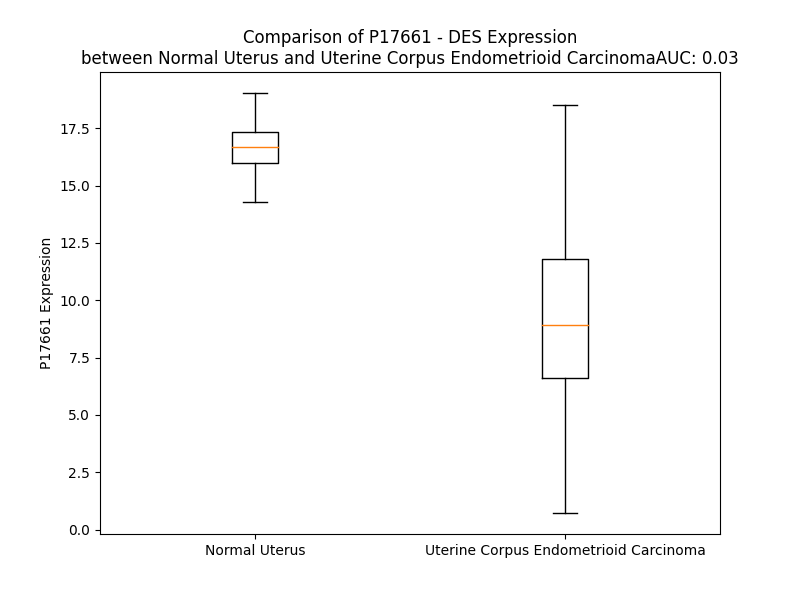

# Detailed Data for P17661

## Introduction to the Detailed Summary

### How to Interpret the Results

- **Summary & Metrics**: This section provides a quick reference to essential protein attributes, including expression changes, family classification, and biomarker applications. Regulation status (upregulated/downregulated) indicates the protein's behavior in a disease context. Some information comes from the original excel file with the proteins selected from literature, while others are derived from the analyses.
- **Expression Comparison**: A visual representation comparing protein expression between normal and disease states. It highlights significant changes in expression levels that might indicate diagnostic or therapeutic relevance. This is data coming from transcriptomics experiments and could not translate similarly to protein levels.
- **Isoform Alignment**: An interactive view of isoform alignments, revealing structural and functional differences between variants of the protein.
- **Interactors & Homologs**: Tables listing known interaction partners and homologous proteins, the more interactors and homologs, the more complex the protein is to design an antibody for.
- **Biological Assemblies**: Information about the structural arrangement of the protein in different assemblies, providing insights into its functional state but also the complexity of the protein to develop antibodies.
- **Combined Per-Residue Information**: A detailed table summarizing residue-level data. This includes predictions for epitope regions, aggregation tendencies, and modifications that might impact the protein's function. Each row corresponds to a residue in the protein, providing insights into specific sites that may be important for research or drug development.
## Summary & Metrics

- **UniProt Accession**: P17661
- **Gene Name**: DES
- **Protein Name**: desmin
- **Swiss Prot**: DESM_HUMAN
- **Family**: other
- **Biomarker Application**: diagnosis
- **Number of Isoforms**: 0
- **Regulation**: 1
- **(transcriptomics) AUC**: 0.03
- **(transcriptomics) Fold Change**: 1.82
- **(transcriptomics) Regulation**: Downregulated
- **Discotope Epitope Count**: 74
- **Max n_uniprots (Homo)**: N/A
- **Max n_uniprots (Hetero)**: N/A

## Expression Comparison

## Interactors

| preferredName_A   | preferredName_B   |   score |
|:------------------|:------------------|--------:|
| DES               | VIM               |   0.957 |
| DES               | SYNC              |   0.935 |

## Homologs

| uniprot_id   | gene_id   |
|:-------------|:----------|
| P05783       | KRT18     |
| Q7RTS7       | KRT74     |
| A0A1B0GVI3   | KRT10     |
| Q7Z3Z0       | KRT25     |
| P08727       | KRT19     |
| P19012       | KRT15     |
| Q03252       | LMNB2     |
| Q2M2I5       | KRT24     |
| P35908       | KRT2      |
| P02533       | KRT14     |
| P08779       | KRT16     |
| A0A0D9SFE5   | LMNB1     |
| Q7Z3Y7       | KRT28     |
| P35527       | KRT9      |
| H0YFE3       | LMNTD1    |
| Q8N1A0       | KRT222    |
| Q14CN4       | KRT72     |
| O76013       | KRT36     |
| Q92764       | KRT35     |
| Q5XKE5       | KRT79     |
| P78386       | KRT85     |
| F8VUG2       | KRT8      |
| O76009       | KRT33A    |
| A0A1X7SCE1   | GFAP      |
| O76011       | KRT34     |
| Q7Z3Y9       | KRT26     |
| P08729       | KRT7      |
| B0YJC4       | VIM       |
| O76015       | KRT38     |
| O76014       | KRT37     |
| O43790       | KRT86     |
| P78385       | KRT83     |
| Q14533       | KRT81     |
| Q7Z3Y8       | KRT27     |
| E7ESP9       | NEFM      |
| Q16352       | INA       |
| P04259       | KRT6B     |
| A0A0S2Z428   | KRT6A     |
| P48668       | KRT6C     |
| Q6KB66       | KRT80     |
| P48681       | NES       |
| P35900       | KRT20     |
| K7EMJ2       | KRT13     |
| O95678       | KRT75     |
| Q04695       | KRT17     |
| Q13515       | BFSP2     |
| J3QR55       | KRT23     |
| F8W0C6       | KRT5      |
| Q01546       | KRT76     |
| Q7Z794       | KRT77     |
| Q9NSB2       | KRT84     |
| Q9NSB4       | KRT82     |
| P04264       | KRT1      |
| P07196       | NEFL      |
| Q14532       | KRT32     |
| Q6A162       | KRT40     |
| O15061       | SYNM      |
| Q8N1N4       | KRT78     |
| Q6A163       | KRT39     |
| F8VZR6       | KRT4      |
| Q3SY84       | KRT71     |
| Q14525       | KRT33B    |
| Q15323       | KRT31     |
| A0A6Q8PHQ9   | LMNA      |
| Q99456       | KRT12     |
| P12035       | KRT3      |
| Q86Y46       | KRT73     |
| P41219       | PRPH      |

## Combined Per-Residue Information

|   res | aa   |   epitope_score | epitope   |   relative_surface_accessibility |   modeling_confidence |   Aggregation | modification                           |
|------:|:-----|----------------:|:----------|---------------------------------:|----------------------:|--------------:|:---------------------------------------|
|     1 | M    |         0.06638 | False     |                          1.3075  |                 44.19 |         0     | N/A                                    |
|     2 | S    |         0.08917 | False     |                          0.93216 |                 44.37 |         0     | N/A                                    |
|     3 | Q    |         0.13519 | True      |                          0.88872 |                 46.04 |         0     | N/A                                    |
|     4 | A    |         0.14442 | True      |                          0.92026 |                 50.95 |         0     | N/A                                    |
|     5 | Y    |         0.16696 | True      |                          1.00267 |                 49.93 |         0     | N/A                                    |
|     6 | S    |         0.10366 | False     |                          0.84962 |                 49.04 |         0     | N/A                                    |
|     7 | S    |         0.10409 | False     |                          0.78221 |                 43.17 |         0     | Phosphoserine; by CDK1                 |
|     8 | S    |         0.09889 | False     |                          0.7969  |                 47.06 |         0     | N/A                                    |
|     9 | Q    |         0.10292 | False     |                          0.81884 |                 46.08 |         0     | N/A                                    |
|    10 | R    |         0.1254  | False     |                          0.95357 |                 47.64 |         0     | N/A                                    |
|    11 | V    |         0.08743 | False     |                          0.95447 |                 47.75 |         0     | N/A                                    |
|    12 | S    |         0.11848 | False     |                          0.75613 |                 39.84 |         0     | Phosphoserine; by AURKB                |
|    13 | S    |         0.08775 | False     |                          0.82462 |                 45.93 |         0     | N/A                                    |
|    14 | Y    |         0.16043 | True      |                          0.8997  |                 37.28 |         0     | N/A                                    |
|    15 | R    |         0.14663 | True      |                          0.86146 |                 43.35 |         0     | N/A                                    |
|    16 | R    |         0.1343  | True      |                          0.78649 |                 43.35 |         0     | Omega-N-methylarginine                 |
|    17 | T    |         0.11533 | False     |                          0.83049 |                 46.99 |         0     | Phosphothreonine; by AURKB and ROCK1   |
|    18 | F    |         0.16466 | True      |                          1.0044  |                 36.87 |         0     | N/A                                    |
|    19 | G    |         0.15285 | True      |                          0.97005 |                 39    |         0     | N/A                                    |
|    20 | G    |         0.14518 | True      |                          0.90593 |                 37.3  |         0     | N/A                                    |
|    21 | A    |         0.11368 | False     |                          1.00248 |                 33.6  |         0     | N/A                                    |
|    22 | P    |         0.12504 | False     |                          0.96831 |                 43.06 |         0     | N/A                                    |
|    23 | G    |         0.20249 | True      |                          0.83155 |                 39.7  |         0     | N/A                                    |
|    24 | F    |         0.09727 | False     |                          1.05498 |                 34.53 |         0     | N/A                                    |
|    25 | P    |         0.09716 | False     |                          0.93545 |                 47.17 |         0     | N/A                                    |
|    26 | L    |         0.16321 | True      |                          1.10255 |                 33.7  |         0     | N/A                                    |
|    27 | G    |         0.12256 | False     |                          0.768   |                 35.52 |         0     | N/A                                    |
|    28 | S    |         0.12538 | False     |                          0.81261 |                 42.26 |         0     | Phosphoserine; by CDK1                 |
|    29 | P    |         0.11691 | False     |                          0.94266 |                 42.13 |         0     | N/A                                    |
|    30 | L    |         0.16018 | True      |                          1.02684 |                 39.01 |         0     | N/A                                    |
|    31 | S    |         0.11296 | False     |                          0.79093 |                 39.19 |         0     | Phosphoserine                          |
|    32 | S    |         0.08679 | False     |                          0.77623 |                 41.14 |         0     | Phosphoserine; by CDK1                 |
|    33 | P    |         0.119   | False     |                          0.75654 |                 56.93 |         0     | N/A                                    |
|    34 | V    |         0.10126 | False     |                          0.97899 |                 41.92 |         0     | N/A                                    |
|    35 | F    |         0.08807 | False     |                          0.87507 |                 44.14 |         0     | N/A                                    |
|    36 | P    |         0.08142 | False     |                          0.88278 |                 47.77 |         0     | N/A                                    |
|    37 | R    |         0.15508 | True      |                          0.96542 |                 39.05 |         0     | Asymmetric dimethylarginine; alternate |
|    37 | R    |         0.15508 | True      |                          0.96542 |                 39.05 |         0     | Omega-N-methylarginine; alternate      |
|    38 | A    |         0.09924 | False     |                          0.99728 |                 42.76 |         0     | N/A                                    |
|    39 | G    |         0.09831 | False     |                          0.51098 |                 33.83 |         0     | N/A                                    |
|    40 | F    |         0.09112 | False     |                          1.12122 |                 40.88 |         0     | N/A                                    |
|    41 | G    |         0.11624 | False     |                          0.82802 |                 37.63 |         0     | N/A                                    |
|    42 | S    |         0.10255 | False     |                          0.92842 |                 36.88 |         0     | N/A                                    |
|    43 | K    |         0.1046  | False     |                          0.98555 |                 44    |         0     | N/A                                    |
|    44 | G    |         0.0893  | False     |                          0.93217 |                 37.77 |         0     | N/A                                    |
|    45 | S    |         0.11524 | False     |                          0.84448 |                 41.14 |         0     | Phosphoserine                          |
|    46 | S    |         0.10028 | False     |                          0.91987 |                 38.61 |         0     | N/A                                    |
|    47 | S    |         0.10021 | False     |                          0.77286 |                 41.25 |         0     | N/A                                    |
|    48 | S    |         0.08994 | False     |                          0.81113 |                 38.35 |         0     | N/A                                    |
|    49 | V    |         0.10599 | False     |                          0.98928 |                 43.97 |         0     | N/A                                    |
|    50 | T    |         0.12358 | False     |                          0.85438 |                 37.18 |         0     | N/A                                    |
|    51 | S    |         0.08393 | False     |                          0.76203 |                 40.29 |         0     | N/A                                    |
|    52 | R    |         0.16699 | True      |                          0.84439 |                 40.45 |         0     | N/A                                    |
|    53 | V    |         0.06819 | False     |                          1.02564 |                 37.42 |         0     | N/A                                    |
|    54 | Y    |         0.09206 | False     |                          0.88433 |                 40.22 |         0     | N/A                                    |
|    55 | Q    |         0.1273  | False     |                          0.84511 |                 35    |         0     | N/A                                    |
|    56 | V    |         0.14999 | True      |                          0.84827 |                 35.62 |         0     | N/A                                    |
|    57 | S    |         0.10509 | False     |                          0.72584 |                 31.45 |         0     | N/A                                    |
|    58 | R    |         0.1932  | True      |                          0.90863 |                 38.31 |         0     | ADP-ribosylarginine                    |
|    59 | T    |         0.11689 | False     |                          0.93895 |                 37.49 |         0     | N/A                                    |
|    60 | S    |         0.13905 | True      |                          0.90628 |                 39.97 |         0     | Phosphoserine; by AURKB                |
|    61 | G    |         0.12203 | False     |                          0.98061 |                 36.08 |         0     | N/A                                    |
|    62 | G    |         0.13099 | False     |                          0.95279 |                 32.83 |         0     | N/A                                    |
|    63 | A    |         0.12363 | False     |                          1.05565 |                 40.78 |         0     | N/A                                    |
|    64 | G    |         0.12189 | False     |                          0.87034 |                 34.21 |         0     | N/A                                    |
|    65 | G    |         0.09255 | False     |                          0.89075 |                 31.5  |         0     | N/A                                    |
|    66 | L    |         0.15153 | True      |                          1.09728 |                 43.13 |         0     | N/A                                    |
|    67 | G    |         0.10323 | False     |                          0.90002 |                 31.15 |         0     | N/A                                    |
|    68 | S    |         0.12291 | False     |                          0.91798 |                 40.71 |         0     | Phosphoserine                          |
|    69 | L    |         0.17737 | True      |                          0.96613 |                 35.76 |         0     | N/A                                    |
|    70 | R    |         0.17493 | True      |                          0.86664 |                 32.94 |         0     | Omega-N-methylarginine                 |
|    71 | A    |         0.12857 | False     |                          0.90506 |                 41.66 |         0     | N/A                                    |
|    72 | S    |         0.0821  | False     |                          0.76123 |                 35.83 |         0     | N/A                                    |
|    73 | R    |         0.18562 | True      |                          0.94392 |                 42.55 |         0     | N/A                                    |
|    74 | L    |         0.16361 | True      |                          1.05362 |                 39.4  |         0     | N/A                                    |
|    75 | G    |         0.18489 | True      |                          0.83374 |                 33.78 |         0     | N/A                                    |
|    76 | T    |         0.18313 | True      |                          0.96843 |                 43.42 |         0     | Phosphothreonine; by ROCK1             |
|    77 | T    |         0.1229  | False     |                          0.84394 |                 29.89 |         0     | Phosphothreonine; by ROCK1             |
|    78 | R    |         0.19787 | True      |                          0.93674 |                 40.74 |         0     | N/A                                    |
|    79 | T    |         0.10909 | False     |                          0.83331 |                 36.95 |         0     | N/A                                    |
|    80 | P    |         0.13961 | True      |                          1.02496 |                 52.69 |         0     | N/A                                    |
|    81 | S    |         0.07747 | False     |                          0.65398 |                 37.14 |         0     | Phosphoserine                          |
|    82 | S    |         0.13835 | True      |                          0.78913 |                 33.69 |         0     | N/A                                    |
|    83 | Y    |         0.14237 | True      |                          0.95888 |                 46.09 |         0     | N/A                                    |
|    84 | G    |         0.12961 | False     |                          0.91716 |                 37.72 |         0     | N/A                                    |
|    85 | A    |         0.20831 | True      |                          1.07895 |                 40.35 |         0     | N/A                                    |
|    86 | G    |         0.16189 | True      |                          0.91763 |                 35.47 |         0     | N/A                                    |
|    87 | E    |         0.14093 | True      |                          0.8384  |                 39.96 |         0     | N/A                                    |
|    88 | L    |         0.19369 | True      |                          1.11148 |                 44.74 |         0     | N/A                                    |
|    89 | L    |         0.0975  | False     |                          0.83273 |                 47.68 |         0     | N/A                                    |
|    90 | D    |         0.15186 | True      |                          0.84374 |                 51.62 |         0     | N/A                                    |
|    91 | F    |         0.17354 | True      |                          0.71209 |                 54.17 |         0     | N/A                                    |
|    92 | S    |         0.119   | False     |                          0.64664 |                 65.09 |         0     | N/A                                    |
|    93 | L    |         0.11574 | False     |                          0.86373 |                 63.81 |         0     | N/A                                    |
|    94 | A    |         0.07575 | False     |                          0.53358 |                 66.03 |         0     | N/A                                    |
|    95 | D    |         0.08209 | False     |                          0.55865 |                 70.24 |         0     | N/A                                    |
|    96 | A    |         0.09054 | False     |                          0.5653  |                 75.44 |         0     | N/A                                    |
|    97 | V    |         0.08664 | False     |                          0.51099 |                 76.58 |         0     | N/A                                    |
|    98 | N    |         0.05731 | False     |                          0.47884 |                 78.34 |         0     | N/A                                    |
|    99 | Q    |         0.06658 | False     |                          0.63227 |                 79.07 |         0     | N/A                                    |
|   100 | E    |         0.11839 | False     |                          0.61267 |                 81.11 |         0     | N/A                                    |
|   101 | F    |         0.04391 | False     |                          0.68668 |                 80.73 |         0     | N/A                                    |
|   102 | L    |         0.03528 | False     |                          0.58742 |                 81.64 |         0     | N/A                                    |
|   103 | T    |         0.05443 | False     |                          0.5161  |                 82.77 |         0     | N/A                                    |
|   104 | T    |         0.03499 | False     |                          0.53885 |                 85.12 |         0     | N/A                                    |
|   105 | R    |         0.03825 | False     |                          0.67757 |                 84.74 |         0     | N/A                                    |
|   106 | T    |         0.04826 | False     |                          0.53278 |                 86.81 |         0     | N/A                                    |
|   107 | N    |         0.07844 | False     |                          0.58008 |                 86.72 |         0     | N/A                                    |
|   108 | E    |         0.05672 | False     |                          0.51134 |                 88.44 |         0     | N/A                                    |
|   109 | K    |         0.03778 | False     |                          0.69524 |                 88.38 |         0     | N/A                                    |
|   110 | V    |         0.08432 | False     |                          0.58933 |                 90.03 |         0     | N/A                                    |
|   111 | E    |         0.05661 | False     |                          0.61947 |                 90.76 |         0     | N/A                                    |
|   112 | L    |         0.02643 | False     |                          0.56484 |                 88.78 |         0     | N/A                                    |
|   113 | Q    |         0.05024 | False     |                          0.53478 |                 90.67 |         0     | N/A                                    |
|   114 | E    |         0.07316 | False     |                          0.48293 |                 91.16 |         0     | N/A                                    |
|   115 | L    |         0.04214 | False     |                          0.5429  |                 91.29 |         0     | N/A                                    |
|   116 | N    |         0.04642 | False     |                          0.58323 |                 91.41 |         0     | N/A                                    |
|   117 | D    |         0.07381 | False     |                          0.46893 |                 91.54 |         0     | N/A                                    |
|   118 | R    |         0.11318 | False     |                          0.6083  |                 93.23 |         0     | N/A                                    |
|   119 | F    |         0.04885 | False     |                          0.55601 |                 93.74 |         6.664 | N/A                                    |
|   120 | A    |         0.0532  | False     |                          0.54659 |                 93.75 |         6.664 | N/A                                    |
|   121 | N    |         0.09696 | False     |                          0.62705 |                 94.81 |         6.664 | N/A                                    |
|   122 | Y    |         0.06    | False     |                          0.6669  |                 95.8  |         6.664 | N/A                                    |
|   123 | I    |         0.04562 | False     |                          0.7002  |                 94.42 |         6.664 | N/A                                    |
|   124 | E    |         0.06696 | False     |                          0.62384 |                 94.86 |         0     | N/A                                    |
|   125 | K    |         0.07251 | False     |                          0.63476 |                 95.26 |         0     | N/A                                    |
|   126 | V    |         0.04405 | False     |                          0.55506 |                 96.83 |         0     | N/A                                    |
|   127 | R    |         0.07692 | False     |                          0.71767 |                 95.03 |         0     | N/A                                    |
|   128 | F    |         0.06755 | False     |                          0.61188 |                 96.39 |         0     | N/A                                    |
|   129 | L    |         0.04946 | False     |                          0.49522 |                 96.38 |         0     | N/A                                    |
|   130 | E    |         0.03221 | False     |                          0.54615 |                 96.01 |         0     | N/A                                    |
|   131 | Q    |         0.07324 | False     |                          0.65631 |                 96.38 |         0     | N/A                                    |
|   132 | Q    |         0.07511 | False     |                          0.43218 |                 96.18 |         0     | N/A                                    |
|   133 | N    |         0.03575 | False     |                          0.59858 |                 95.25 |         0     | N/A                                    |
|   134 | A    |         0.0418  | False     |                          0.59471 |                 96.37 |         0     | N/A                                    |
|   135 | A    |         0.05368 | False     |                          0.58379 |                 96.33 |         0     | N/A                                    |
|   136 | L    |         0.05699 | False     |                          0.62923 |                 94.54 |         0     | N/A                                    |
|   137 | A    |         0.034   | False     |                          0.49373 |                 93.27 |         0     | N/A                                    |
|   138 | A    |         0.0308  | False     |                          0.58553 |                 89.73 |         0     | N/A                                    |
|   139 | E    |         0.09736 | False     |                          0.3682  |                 89.72 |         0     | N/A                                    |
|   140 | V    |         0.0417  | False     |                          0.47794 |                 85.81 |         0     | N/A                                    |
|   141 | N    |         0.04918 | False     |                          0.6445  |                 85.08 |         0     | N/A                                    |
|   142 | R    |         0.09984 | False     |                          0.52525 |                 83.16 |         0     | N/A                                    |
|   143 | L    |         0.14613 | True      |                          0.50628 |                 78.99 |         0     | N/A                                    |
|   144 | K    |         0.06663 | False     |                          0.66021 |                 77.22 |         0     | N/A                                    |
|   145 | G    |         0.10552 | False     |                          0.72261 |                 70.56 |         0     | N/A                                    |
|   146 | R    |         0.21579 | True      |                          0.61543 |                 66.81 |         0     | N/A                                    |
|   147 | E    |         0.11832 | False     |                          0.40987 |                 64.48 |         0     | N/A                                    |
|   148 | P    |         0.11556 | False     |                          0.58465 |                 65.42 |         0     | N/A                                    |
|   149 | T    |         0.0828  | False     |                          0.5367  |                 74.08 |         0     | N/A                                    |
|   150 | R    |         0.14657 | True      |                          0.62606 |                 80.34 |         0     | N/A                                    |
|   151 | V    |         0.08014 | False     |                          0.49673 |                 83.2  |         0     | N/A                                    |
|   152 | A    |         0.02794 | False     |                          0.46552 |                 85.33 |         0     | N/A                                    |
|   153 | E    |         0.04775 | False     |                          0.46279 |                 87.81 |         0     | N/A                                    |
|   154 | L    |         0.11971 | False     |                          0.55649 |                 90.5  |         0     | N/A                                    |
|   155 | Y    |         0.12923 | False     |                          0.70702 |                 90.68 |         0     | N/A                                    |
|   156 | E    |         0.03815 | False     |                          0.49999 |                 93.25 |         0     | N/A                                    |
|   157 | E    |         0.07481 | False     |                          0.46014 |                 94.76 |         0     | N/A                                    |
|   158 | E    |         0.0845  | False     |                          0.52919 |                 95.89 |         0     | N/A                                    |
|   159 | L    |         0.0538  | False     |                          0.54255 |                 95.78 |         0     | N/A                                    |
|   160 | R    |         0.06214 | False     |                          0.52357 |                 95.92 |         0     | N/A                                    |
|   161 | E    |         0.06188 | False     |                          0.32967 |                 97.28 |         0     | N/A                                    |
|   162 | L    |         0.1244  | False     |                          0.59627 |                 97.4  |         0     | N/A                                    |
|   163 | R    |         0.05932 | False     |                          0.63255 |                 97.72 |         0     | N/A                                    |
|   164 | R    |         0.05928 | False     |                          0.50213 |                 97.51 |         0     | N/A                                    |
|   165 | Q    |         0.06888 | False     |                          0.41429 |                 98.24 |         0     | N/A                                    |
|   166 | V    |         0.04762 | False     |                          0.67473 |                 97.97 |         0     | N/A                                    |
|   167 | E    |         0.02592 | False     |                          0.56501 |                 97.52 |         0     | N/A                                    |
|   168 | V    |         0.02887 | False     |                          0.43626 |                 97.97 |         0     | N/A                                    |
|   169 | L    |         0.10387 | False     |                          0.69531 |                 97.61 |         0     | N/A                                    |
|   170 | T    |         0.03578 | False     |                          0.5434  |                 97.7  |         0     | N/A                                    |
|   171 | N    |         0.0462  | False     |                          0.58308 |                 97.84 |         0     | N/A                                    |
|   172 | Q    |         0.04724 | False     |                          0.49873 |                 97.99 |         0     | N/A                                    |
|   173 | R    |         0.09029 | False     |                          0.65469 |                 96.95 |         0     | N/A                                    |
|   174 | A    |         0.01975 | False     |                          0.47458 |                 97.05 |         0     | N/A                                    |
|   175 | R    |         0.06944 | False     |                          0.68403 |                 97.67 |         0     | N/A                                    |
|   176 | V    |         0.05571 | False     |                          0.66355 |                 96.28 |         0     | N/A                                    |
|   177 | D    |         0.02439 | False     |                          0.18906 |                 97.49 |         0     | N/A                                    |
|   178 | V    |         0.03406 | False     |                          0.6368  |                 97.17 |         0     | N/A                                    |
|   179 | E    |         0.03771 | False     |                          0.42553 |                 96.33 |         0     | N/A                                    |
|   180 | R    |         0.13064 | False     |                          0.47295 |                 95.53 |         0     | N/A                                    |
|   181 | D    |         0.03596 | False     |                          0.38962 |                 96.6  |         0     | N/A                                    |
|   182 | N    |         0.04694 | False     |                          0.52542 |                 92.92 |         0     | N/A                                    |
|   183 | L    |         0.06793 | False     |                          0.74686 |                 94.57 |         0     | N/A                                    |
|   184 | L    |         0.07056 | False     |                          0.51192 |                 94.4  |         0     | N/A                                    |
|   185 | D    |         0.04083 | False     |                          0.38014 |                 94.91 |         0     | N/A                                    |
|   186 | D    |         0.047   | False     |                          0.40513 |                 93.14 |         0     | N/A                                    |
|   187 | L    |         0.05394 | False     |                          0.49652 |                 90.96 |         0     | N/A                                    |
|   188 | Q    |         0.044   | False     |                          0.57463 |                 93.65 |         0     | N/A                                    |
|   189 | R    |         0.05236 | False     |                          0.54323 |                 90.18 |         0     | N/A                                    |
|   190 | L    |         0.06023 | False     |                          0.72906 |                 89.99 |         0     | N/A                                    |
|   191 | K    |         0.06209 | False     |                          0.63444 |                 92.27 |         0     | N/A                                    |
|   192 | A    |         0.03825 | False     |                          0.59826 |                 92.45 |         0     | N/A                                    |
|   193 | K    |         0.05997 | False     |                          0.62855 |                 92.72 |         0     | N/A                                    |
|   194 | L    |         0.04822 | False     |                          0.67033 |                 90.06 |         0     | N/A                                    |
|   195 | Q    |         0.07315 | False     |                          0.56514 |                 92.43 |         0     | N/A                                    |
|   196 | E    |         0.04553 | False     |                          0.5201  |                 90.29 |         0     | N/A                                    |
|   197 | E    |         0.0542  | False     |                          0.5579  |                 92.62 |         0     | N/A                                    |
|   198 | I    |         0.05699 | False     |                          0.48718 |                 92.79 |         0     | N/A                                    |
|   199 | Q    |         0.06699 | False     |                          0.4833  |                 90.09 |         0     | N/A                                    |
|   200 | L    |         0.09544 | False     |                          0.56763 |                 90.21 |         0     | N/A                                    |
|   201 | K    |         0.05827 | False     |                          0.61108 |                 89.68 |         0     | N/A                                    |
|   202 | E    |         0.04954 | False     |                          0.48094 |                 92.45 |         0     | N/A                                    |
|   203 | E    |         0.02851 | False     |                          0.50505 |                 90.98 |         0     | N/A                                    |
|   204 | A    |         0.03363 | False     |                          0.55428 |                 90.12 |         0     | N/A                                    |
|   205 | E    |         0.05889 | False     |                          0.47397 |                 92.38 |         0     | N/A                                    |
|   206 | N    |         0.05438 | False     |                          0.63713 |                 92.3  |         0     | N/A                                    |
|   207 | N    |         0.09499 | False     |                          0.53229 |                 92.75 |         0.249 | N/A                                    |
|   208 | L    |         0.08165 | False     |                          0.54718 |                 91.53 |         0.249 | N/A                                    |
|   209 | A    |         0.06745 | False     |                          0.5363  |                 94.23 |         0.249 | N/A                                    |
|   210 | A    |         0.0552  | False     |                          0.49895 |                 93.59 |         0.249 | N/A                                    |
|   211 | F    |         0.07434 | False     |                          0.70292 |                 94.81 |         0.249 | N/A                                    |
|   212 | R    |         0.08965 | False     |                          0.63355 |                 96.48 |         0     | N/A                                    |
|   213 | A    |         0.05254 | False     |                          0.5676  |                 96.16 |         0     | N/A                                    |
|   214 | D    |         0.05548 | False     |                          0.53767 |                 95.09 |         0     | N/A                                    |
|   215 | V    |         0.05233 | False     |                          0.67629 |                 97.09 |         0     | N/A                                    |
|   216 | D    |         0.06636 | False     |                          0.54842 |                 96.37 |         0     | N/A                                    |
|   217 | A    |         0.05319 | False     |                          0.55441 |                 95.95 |         0.236 | N/A                                    |
|   218 | A    |         0.05688 | False     |                          0.60235 |                 95.68 |         0.236 | N/A                                    |
|   219 | T    |         0.05723 | False     |                          0.40982 |                 96.43 |         0.236 | N/A                                    |
|   220 | L    |         0.10442 | False     |                          0.70192 |                 96.85 |         0.236 | N/A                                    |
|   221 | A    |         0.03094 | False     |                          0.49974 |                 96.73 |         0.236 | N/A                                    |
|   222 | R    |         0.14904 | True      |                          0.59832 |                 96.57 |         0     | N/A                                    |
|   223 | I    |         0.06645 | False     |                          0.33039 |                 97.75 |         0     | N/A                                    |
|   224 | D    |         0.06273 | False     |                          0.49692 |                 97.11 |         0     | N/A                                    |
|   225 | L    |         0.04182 | False     |                          0.71273 |                 97.03 |         0     | N/A                                    |
|   226 | E    |         0.0961  | False     |                          0.42094 |                 97.57 |         0     | N/A                                    |
|   227 | R    |         0.10975 | False     |                          0.61859 |                 96.84 |         0     | N/A                                    |
|   228 | R    |         0.04011 | False     |                          0.5499  |                 97.34 |         0     | N/A                                    |
|   229 | I    |         0.10368 | False     |                          0.61876 |                 97.41 |         0     | N/A                                    |
|   230 | E    |         0.10103 | False     |                          0.58334 |                 97.33 |         0     | N/A                                    |
|   231 | S    |         0.02957 | False     |                          0.38325 |                 96.85 |         0     | N/A                                    |
|   232 | L    |         0.04514 | False     |                          0.42845 |                 97.33 |         0     | N/A                                    |
|   233 | N    |         0.07898 | False     |                          0.54864 |                 97.36 |         0     | N/A                                    |
|   234 | E    |         0.06365 | False     |                          0.60248 |                 97.07 |         0     | N/A                                    |
|   235 | E    |         0.04341 | False     |                          0.47495 |                 96.65 |         0.257 | N/A                                    |
|   236 | I    |         0.0719  | False     |                          0.54255 |                 95.54 |         0.257 | N/A                                    |
|   237 | A    |         0.07192 | False     |                          0.55856 |                 96.58 |         0.257 | N/A                                    |
|   238 | F    |         0.0929  | False     |                          0.66136 |                 96.24 |         0.257 | N/A                                    |
|   239 | L    |         0.03565 | False     |                          0.54407 |                 96.95 |         0.257 | N/A                                    |
|   240 | K    |         0.12045 | False     |                          0.68889 |                 95.94 |         0.257 | N/A                                    |
|   241 | K    |         0.09079 | False     |                          0.68845 |                 96.72 |         0     | N/A                                    |
|   242 | V    |         0.03703 | False     |                          0.32033 |                 96.73 |         0     | N/A                                    |
|   243 | H    |         0.05583 | False     |                          0.50347 |                 93.69 |         0     | N/A                                    |
|   244 | E    |         0.06585 | False     |                          0.47897 |                 95.26 |         0     | N/A                                    |
|   245 | E    |         0.04503 | False     |                          0.47707 |                 95.2  |         0     | N/A                                    |
|   246 | E    |         0.02599 | False     |                          0.42005 |                 93.44 |         0     | N/A                                    |
|   247 | I    |         0.05218 | False     |                          0.54015 |                 92.44 |         0     | N/A                                    |
|   248 | R    |         0.08714 | False     |                          0.51451 |                 92.94 |         0     | N/A                                    |
|   249 | E    |         0.04742 | False     |                          0.52356 |                 92.67 |         0     | N/A                                    |
|   250 | L    |         0.02838 | False     |                          0.70029 |                 89.37 |         0     | N/A                                    |
|   251 | Q    |         0.05851 | False     |                          0.51509 |                 86.7  |         0     | N/A                                    |
|   252 | A    |         0.06003 | False     |                          0.50152 |                 87.52 |         0     | N/A                                    |
|   253 | Q    |         0.03218 | False     |                          0.38627 |                 85.83 |         0     | N/A                                    |
|   254 | L    |         0.04608 | False     |                          0.74852 |                 77.96 |         0     | N/A                                    |
|   255 | Q    |         0.09241 | False     |                          0.69727 |                 76.46 |         0     | N/A                                    |
|   256 | E    |         0.14049 | True      |                          0.67578 |                 73.94 |         0     | N/A                                    |
|   257 | Q    |         0.07258 | False     |                          0.58394 |                 61.87 |         0     | N/A                                    |
|   258 | Q    |         0.13029 | False     |                          0.75642 |                 45.62 |         0     | N/A                                    |
|   259 | V    |         0.06922 | False     |                          0.77735 |                 44.31 |         0     | N/A                                    |
|   260 | Q    |         0.1149  | False     |                          0.82426 |                 31.91 |         0     | N/A                                    |
|   261 | V    |         0.06185 | False     |                          0.7188  |                 40.39 |         0     | N/A                                    |
|   262 | E    |         0.12254 | False     |                          0.93848 |                 29.88 |         0     | N/A                                    |
|   263 | M    |         0.14676 | True      |                          0.78394 |                 43.04 |         0     | N/A                                    |
|   264 | D    |         0.19808 | True      |                          0.89644 |                 31.76 |         0     | N/A                                    |
|   265 | M    |         0.12184 | False     |                          0.67306 |                 38.16 |         0     | N/A                                    |
|   266 | S    |         0.12366 | False     |                          0.80397 |                 39.02 |         0     | N/A                                    |
|   267 | K    |         0.17911 | True      |                          0.96662 |                 40.8  |         0     | N/A                                    |
|   268 | P    |         0.0932  | False     |                          0.63026 |                 58.19 |         0     | N/A                                    |
|   269 | D    |         0.18477 | True      |                          0.61664 |                 58.93 |         0     | N/A                                    |
|   270 | L    |         0.24763 | True      |                          0.55965 |                 67.79 |         0.757 | N/A                                    |
|   271 | T    |         0.11261 | False     |                          0.52133 |                 79.55 |         0.757 | N/A                                    |
|   272 | A    |         0.08497 | False     |                          0.44651 |                 80.17 |         0.757 | N/A                                    |
|   273 | A    |         0.03582 | False     |                          0.37445 |                 83.69 |         0.757 | N/A                                    |
|   274 | L    |         0.07996 | False     |                          0.61378 |                 83.15 |         0.757 | N/A                                    |
|   275 | R    |         0.12664 | False     |                          0.63376 |                 86.55 |         0     | N/A                                    |
|   276 | D    |         0.04689 | False     |                          0.47003 |                 87.79 |         0     | N/A                                    |
|   277 | I    |         0.03906 | False     |                          0.51038 |                 89.87 |         0     | N/A                                    |
|   278 | R    |         0.07304 | False     |                          0.73793 |                 90.47 |         0     | N/A                                    |
|   279 | A    |         0.07789 | False     |                          0.49377 |                 91.28 |         0     | N/A                                    |
|   280 | Q    |         0.03258 | False     |                          0.4693  |                 91.95 |         0     | N/A                                    |
|   281 | Y    |         0.02825 | False     |                          0.68421 |                 90.55 |         0     | N/A                                    |
|   282 | E    |         0.07033 | False     |                          0.62263 |                 93.96 |         0     | N/A                                    |
|   283 | T    |         0.02608 | False     |                          0.46209 |                 94.08 |         0     | N/A                                    |
|   284 | I    |         0.03957 | False     |                          0.60255 |                 92.92 |         0     | N/A                                    |
|   285 | A    |         0.03949 | False     |                          0.48652 |                 92.85 |         0     | N/A                                    |
|   286 | A    |         0.07113 | False     |                          0.55461 |                 94.65 |         0     | N/A                                    |
|   287 | K    |         0.03007 | False     |                          0.57891 |                 95.37 |         0     | N/A                                    |
|   288 | N    |         0.02957 | False     |                          0.5921  |                 92.14 |         0     | N/A                                    |
|   289 | I    |         0.05479 | False     |                          0.64744 |                 95.24 |         0     | N/A                                    |
|   290 | S    |         0.05489 | False     |                          0.38911 |                 95.43 |         0     | Phosphoserine                          |
|   291 | E    |         0.02229 | False     |                          0.57264 |                 95.12 |         0     | N/A                                    |
|   292 | A    |         0.01968 | False     |                          0.37973 |                 94.51 |         0     | N/A                                    |
|   293 | E    |         0.04218 | False     |                          0.44391 |                 95.4  |         0     | N/A                                    |
|   294 | E    |         0.026   | False     |                          0.58534 |                 96.31 |         0     | N/A                                    |
|   295 | W    |         0.04101 | False     |                          0.68055 |                 95.1  |         0     | N/A                                    |
|   296 | Y    |         0.04587 | False     |                          0.61961 |                 94.28 |         0     | N/A                                    |
|   297 | K    |         0.07079 | False     |                          0.6462  |                 97.08 |         0     | N/A                                    |
|   298 | S    |         0.04542 | False     |                          0.46238 |                 95.66 |         0     | N/A                                    |
|   299 | K    |         0.0288  | False     |                          0.48878 |                 97.03 |         0     | N/A                                    |
|   300 | V    |         0.06851 | False     |                          0.65954 |                 96.56 |         0     | N/A                                    |
|   301 | S    |         0.06365 | False     |                          0.51709 |                 96.47 |         0     | N/A                                    |
|   302 | D    |         0.02391 | False     |                          0.50329 |                 95.72 |         0     | N/A                                    |
|   303 | L    |         0.03733 | False     |                          0.6547  |                 96    |         0     | N/A                                    |
|   304 | T    |         0.0469  | False     |                          0.49872 |                 96.34 |         0     | N/A                                    |
|   305 | Q    |         0.02439 | False     |                          0.50483 |                 96.03 |         0     | N/A                                    |
|   306 | A    |         0.02444 | False     |                          0.5257  |                 95.37 |         0     | N/A                                    |
|   307 | A    |         0.0394  | False     |                          0.47469 |                 95.05 |         0     | N/A                                    |
|   308 | N    |         0.06087 | False     |                          0.51306 |                 96.17 |         0     | N/A                                    |
|   309 | K    |         0.04244 | False     |                          0.61387 |                 95.98 |         0     | N/A                                    |
|   310 | N    |         0.03655 | False     |                          0.66399 |                 93.63 |         0     | N/A                                    |
|   311 | N    |         0.0393  | False     |                          0.4109  |                 95.87 |         0     | N/A                                    |
|   312 | D    |         0.0342  | False     |                          0.41046 |                 95.27 |         0     | N/A                                    |
|   313 | A    |         0.01957 | False     |                          0.52403 |                 94.36 |         0     | N/A                                    |
|   314 | L    |         0.04128 | False     |                          0.57788 |                 95.3  |         0     | N/A                                    |
|   315 | R    |         0.10799 | False     |                          0.59976 |                 96.48 |         0     | N/A                                    |
|   316 | Q    |         0.07979 | False     |                          0.58828 |                 95.57 |         0     | N/A                                    |
|   317 | A    |         0.04456 | False     |                          0.52537 |                 93.98 |         0     | N/A                                    |
|   318 | K    |         0.0668  | False     |                          0.5347  |                 95.42 |         0     | N/A                                    |
|   319 | Q    |         0.06588 | False     |                          0.44727 |                 96.16 |         0     | N/A                                    |
|   320 | E    |         0.04962 | False     |                          0.47568 |                 94.87 |         0     | N/A                                    |
|   321 | M    |         0.04228 | False     |                          0.6517  |                 93.89 |         0     | N/A                                    |
|   322 | M    |         0.07686 | False     |                          0.55824 |                 95.25 |         0     | N/A                                    |
|   323 | E    |         0.04258 | False     |                          0.41208 |                 96.18 |         0     | N/A                                    |
|   324 | Y    |         0.06045 | False     |                          0.61859 |                 93.52 |         0     | N/A                                    |
|   325 | R    |         0.08175 | False     |                          0.6234  |                 95    |         0     | N/A                                    |
|   326 | H    |         0.08745 | False     |                          0.68546 |                 92.54 |         0     | N/A                                    |
|   327 | Q    |         0.03983 | False     |                          0.41775 |                 97.02 |         0     | N/A                                    |
|   328 | I    |         0.05044 | False     |                          0.68213 |                 93.96 |         0     | N/A                                    |
|   329 | Q    |         0.05926 | False     |                          0.43533 |                 94.67 |         0     | N/A                                    |
|   330 | S    |         0.06231 | False     |                          0.45447 |                 92.04 |         0     | N/A                                    |
|   331 | Y    |         0.06971 | False     |                          0.614   |                 93.77 |         0     | N/A                                    |
|   332 | T    |         0.07324 | False     |                          0.47613 |                 93.48 |         0     | N/A                                    |
|   333 | C    |         0.11638 | False     |                          0.65133 |                 92.93 |         0     | N/A                                    |
|   334 | E    |         0.05622 | False     |                          0.47954 |                 94.16 |         0     | N/A                                    |
|   335 | I    |         0.0853  | False     |                          0.52676 |                 90.45 |         0     | N/A                                    |
|   336 | D    |         0.09155 | False     |                          0.48449 |                 94.13 |         0     | N/A                                    |
|   337 | A    |         0.05348 | False     |                          0.58146 |                 90.74 |         0     | N/A                                    |
|   338 | L    |         0.03455 | False     |                          0.66916 |                 88.83 |         0     | N/A                                    |
|   339 | K    |         0.05753 | False     |                          0.5834  |                 93.05 |         0     | N/A                                    |
|   340 | G    |         0.0625  | False     |                          0.46094 |                 89.69 |         0     | N/A                                    |
|   341 | T    |         0.05588 | False     |                          0.51954 |                 92.75 |         0     | N/A                                    |
|   342 | N    |         0.06202 | False     |                          0.52818 |                 85.75 |         0     | N/A                                    |
|   343 | D    |         0.07723 | False     |                          0.36134 |                 93.23 |         0     | N/A                                    |
|   344 | S    |         0.06309 | False     |                          0.3203  |                 91.54 |         0     | N/A                                    |
|   345 | L    |         0.04559 | False     |                          0.63515 |                 90.57 |         0     | N/A                                    |
|   346 | M    |         0.07058 | False     |                          0.41493 |                 93.19 |         0     | N/A                                    |
|   347 | R    |         0.09099 | False     |                          0.52025 |                 93.2  |         0     | N/A                                    |
|   348 | Q    |         0.08734 | False     |                          0.49805 |                 94.09 |         0     | N/A                                    |
|   349 | M    |         0.06299 | False     |                          0.61698 |                 91    |         0     | N/A                                    |
|   350 | R    |         0.0883  | False     |                          0.56502 |                 96.3  |         0     | N/A                                    |
|   351 | E    |         0.11317 | False     |                          0.47817 |                 95.34 |         0     | N/A                                    |
|   352 | L    |         0.04079 | False     |                          0.58095 |                 94.01 |         0     | N/A                                    |
|   353 | E    |         0.05234 | False     |                          0.53858 |                 96.36 |         0     | N/A                                    |
|   354 | D    |         0.08433 | False     |                          0.59075 |                 96.21 |         0     | N/A                                    |
|   355 | R    |         0.11001 | False     |                          0.60058 |                 96.95 |         0     | N/A                                    |
|   356 | F    |         0.0574  | False     |                          0.67023 |                 94.86 |         0     | N/A                                    |
|   357 | A    |         0.04431 | False     |                          0.60195 |                 95.24 |         0     | N/A                                    |
|   358 | S    |         0.08885 | False     |                          0.5834  |                 96.78 |         0     | Phosphoserine                          |
|   359 | E    |         0.03363 | False     |                          0.48127 |                 97.64 |         0     | N/A                                    |
|   360 | A    |         0.0369  | False     |                          0.54931 |                 96.6  |         0     | N/A                                    |
|   361 | S    |         0.05091 | False     |                          0.45984 |                 97.44 |         0     | Phosphoserine                          |
|   362 | G    |         0.07626 | False     |                          0.35991 |                 97.43 |         0     | N/A                                    |
|   363 | Y    |         0.06517 | False     |                          0.65963 |                 97.26 |         0     | N/A                                    |
|   364 | Q    |         0.04652 | False     |                          0.57327 |                 97.68 |         0     | N/A                                    |
|   365 | D    |         0.07224 | False     |                          0.56059 |                 98.16 |         0     | N/A                                    |
|   366 | N    |         0.04417 | False     |                          0.54201 |                 98.29 |         0     | N/A                                    |
|   367 | I    |         0.06262 | False     |                          0.51897 |                 97.68 |         0     | N/A                                    |
|   368 | A    |         0.06215 | False     |                          0.49    |                 97.75 |         0     | N/A                                    |
|   369 | R    |         0.16068 | True      |                          0.66092 |                 98.09 |         0     | N/A                                    |
|   370 | L    |         0.04899 | False     |                          0.61662 |                 97.99 |         0     | N/A                                    |
|   371 | E    |         0.04067 | False     |                          0.40652 |                 98.1  |         0     | N/A                                    |
|   372 | E    |         0.05677 | False     |                          0.49891 |                 98.11 |         0     | N/A                                    |
|   373 | E    |         0.04862 | False     |                          0.36285 |                 98.26 |         0     | N/A                                    |
|   374 | I    |         0.06873 | False     |                          0.55465 |                 98    |         0     | N/A                                    |
|   375 | R    |         0.09601 | False     |                          0.51382 |                 97.72 |         0     | N/A                                    |
|   376 | H    |         0.13003 | False     |                          0.55184 |                 97.39 |         0     | N/A                                    |
|   377 | L    |         0.08368 | False     |                          0.6904  |                 98.03 |         0     | N/A                                    |
|   378 | K    |         0.10623 | False     |                          0.59914 |                 97.29 |         0     | N/A                                    |
|   379 | D    |         0.11607 | False     |                          0.60942 |                 97.95 |         0     | N/A                                    |
|   380 | E    |         0.04732 | False     |                          0.33262 |                 98.01 |         0     | N/A                                    |
|   381 | M    |         0.08159 | False     |                          0.60982 |                 97.24 |         0     | N/A                                    |
|   382 | A    |         0.09586 | False     |                          0.43691 |                 96.74 |         0     | N/A                                    |
|   383 | R    |         0.12331 | False     |                          0.37973 |                 97.72 |         0     | N/A                                    |
|   384 | H    |         0.11041 | False     |                          0.54324 |                 96.86 |         0     | N/A                                    |
|   385 | L    |         0.14902 | True      |                          0.69873 |                 97.76 |         0     | N/A                                    |
|   386 | R    |         0.08484 | False     |                          0.63465 |                 97.36 |         0     | N/A                                    |
|   387 | E    |         0.08065 | False     |                          0.41374 |                 97.85 |         0     | N/A                                    |
|   388 | Y    |         0.09431 | False     |                          0.65047 |                 97.53 |         0     | N/A                                    |
|   389 | Q    |         0.07605 | False     |                          0.44786 |                 97.08 |         0     | N/A                                    |
|   390 | D    |         0.09569 | False     |                          0.52859 |                 97    |         0     | N/A                                    |
|   391 | L    |         0.0549  | False     |                          0.71956 |                 97.42 |         0     | N/A                                    |
|   392 | L    |         0.03416 | False     |                          0.41583 |                 96.74 |         0     | N/A                                    |
|   393 | N    |         0.07658 | False     |                          0.47479 |                 96.59 |         0     | N/A                                    |
|   394 | V    |         0.09993 | False     |                          0.58906 |                 97.24 |         0     | N/A                                    |
|   395 | K    |         0.05678 | False     |                          0.44737 |                 97.15 |         0     | N/A                                    |
|   396 | M    |         0.05475 | False     |                          0.50152 |                 95.73 |         0     | N/A                                    |
|   397 | A    |         0.051   | False     |                          0.49331 |                 96.61 |         0     | N/A                                    |
|   398 | L    |         0.06277 | False     |                          0.54078 |                 96.15 |         0     | N/A                                    |
|   399 | D    |         0.02331 | False     |                          0.29111 |                 96.49 |         0     | N/A                                    |
|   400 | V    |         0.06029 | False     |                          0.68359 |                 94.35 |         0     | N/A                                    |
|   401 | E    |         0.07396 | False     |                          0.42355 |                 95.7  |         0     | N/A                                    |
|   402 | I    |         0.0537  | False     |                          0.47678 |                 93.21 |         0     | N/A                                    |
|   403 | A    |         0.02962 | False     |                          0.53636 |                 94.74 |         0     | N/A                                    |
|   404 | T    |         0.06579 | False     |                          0.49293 |                 93.34 |         0     | N/A                                    |
|   405 | Y    |         0.06147 | False     |                          0.61313 |                 93.34 |         0     | N/A                                    |
|   406 | R    |         0.06    | False     |                          0.6023  |                 92.06 |         0     | N/A                                    |
|   407 | K    |         0.0503  | False     |                          0.77631 |                 91.16 |         0     | N/A                                    |
|   408 | L    |         0.07089 | False     |                          0.7293  |                 89.59 |         0     | N/A                                    |
|   409 | L    |         0.09984 | False     |                          0.70317 |                 87.9  |         0     | N/A                                    |
|   410 | E    |         0.06454 | False     |                          0.56132 |                 82.68 |         0     | N/A                                    |
|   411 | G    |         0.06102 | False     |                          0.44344 |                 79.99 |         0     | N/A                                    |
|   412 | E    |         0.08268 | False     |                          0.37427 |                 75.43 |         0     | N/A                                    |
|   413 | E    |         0.07493 | False     |                          0.52875 |                 69.33 |         0     | N/A                                    |
|   414 | S    |         0.04583 | False     |                          0.56269 |                 66.17 |         0     | N/A                                    |
|   415 | R    |         0.14707 | True      |                          0.65077 |                 69.21 |         0     | N/A                                    |
|   416 | I    |         0.19001 | True      |                          0.78039 |                 64.48 |         0     | N/A                                    |
|   417 | N    |         0.17705 | True      |                          0.72577 |                 60.76 |         0     | N/A                                    |
|   418 | L    |         0.13189 | True      |                          0.73454 |                 52.06 |         0     | N/A                                    |
|   419 | P    |         0.1723  | True      |                          0.78749 |                 49.14 |         0     | N/A                                    |
|   420 | I    |         0.221   | True      |                          1.034   |                 44.42 |         0     | N/A                                    |
|   421 | Q    |         0.14929 | True      |                          0.75132 |                 45.47 |         0     | N/A                                    |
|   422 | T    |         0.26941 | True      |                          0.77236 |                 40.02 |         0     | N/A                                    |
|   423 | Y    |         0.20391 | True      |                          0.96494 |                 37.49 |         0.166 | N/A                                    |
|   424 | S    |         0.13063 | False     |                          0.85268 |                 36.1  |         0.166 | Phosphoserine                          |
|   425 | A    |         0.09631 | False     |                          0.79433 |                 38.11 |         0.166 | N/A                                    |
|   426 | L    |         0.08673 | False     |                          1.07966 |                 34.58 |         0.166 | N/A                                    |
|   427 | N    |         0.10939 | False     |                          0.95194 |                 38.24 |         0.166 | N/A                                    |
|   428 | F    |         0.15112 | True      |                          0.92212 |                 31.79 |         0.166 | N/A                                    |
|   429 | R    |         0.14069 | True      |                          0.92883 |                 38.09 |         0     | N/A                                    |
|   430 | E    |         0.17413 | True      |                          0.64605 |                 32.01 |         0     | N/A                                    |
|   431 | T    |         0.13299 | True      |                          0.9167  |                 32.91 |         0     | N/A                                    |
|   432 | S    |         0.13338 | True      |                          0.7815  |                 31.02 |         0     | N/A                                    |
|   433 | P    |         0.13369 | True      |                          0.94687 |                 38.56 |         0     | N/A                                    |
|   434 | E    |         0.13858 | True      |                          0.86722 |                 34.08 |         0     | N/A                                    |
|   435 | Q    |         0.16295 | True      |                          0.88305 |                 37.5  |         0     | N/A                                    |
|   436 | R    |         0.13699 | True      |                          0.90902 |                 40.38 |         0     | N/A                                    |
|   437 | G    |         0.14642 | True      |                          0.89303 |                 38.6  |         0     | N/A                                    |
|   438 | S    |         0.12389 | False     |                          0.748   |                 46.42 |         0     | N/A                                    |
|   439 | E    |         0.13863 | True      |                          0.75827 |                 43.5  |         0     | N/A                                    |
|   440 | V    |         0.15779 | True      |                          0.9157  |                 48.69 |         0     | N/A                                    |
|   441 | H    |         0.0821  | False     |                          0.568   |                 47.66 |         0     | N/A                                    |
|   442 | T    |         0.08301 | False     |                          0.60005 |                 50.94 |         0     | N/A                                    |
|   443 | K    |         0.09864 | False     |                          0.7103  |                 53.21 |         0     | N/A                                    |
|   444 | K    |         0.05202 | False     |                          0.27185 |                 56.19 |         0     | N/A                                    |
|   445 | T    |         0.10157 | False     |                          0.49782 |                 63.57 |         0     | N/A                                    |
|   446 | V    |         0.03774 | False     |                          0.51602 |                 71.65 |         0     | N/A                                    |
|   447 | M    |         0.12818 | False     |                          0.61341 |                 72.84 |         0     | N/A                                    |
|   448 | I    |         0.0601  | False     |                          0.50933 |                 79.37 |         0     | N/A                                    |
|   449 | K    |         0.1474  | True      |                          0.60986 |                 77.37 |         0     | N/A                                    |
|   450 | T    |         0.05188 | False     |                          0.60031 |                 81.67 |         0     | N/A                                    |
|   451 | I    |         0.17549 | True      |                          0.62142 |                 80.04 |         0     | N/A                                    |
|   452 | E    |         0.09504 | False     |                          0.54266 |                 78.27 |         0     | N/A                                    |
|   453 | T    |         0.0826  | False     |                          0.59721 |                 82.18 |         0     | N/A                                    |
|   454 | R    |         0.16335 | True      |                          0.72375 |                 71.66 |         0     | N/A                                    |
|   455 | D    |         0.12772 | False     |                          0.88576 |                 76.03 |         0     | N/A                                    |
|   456 | G    |         0.15547 | True      |                          0.90245 |                 74.18 |         0     | N/A                                    |
|   457 | E    |         0.16377 | True      |                          0.69056 |                 72.78 |         0     | N/A                                    |
|   458 | V    |         0.13355 | True      |                          0.66009 |                 76.85 |         0     | N/A                                    |
|   459 | V    |         0.18652 | True      |                          0.68191 |                 78.72 |         0     | N/A                                    |
|   460 | S    |         0.11788 | False     |                          0.39199 |                 74.96 |         0     | N/A                                    |
|   461 | E    |         0.09713 | False     |                          0.53763 |                 80.61 |         0     | N/A                                    |
|   462 | A    |         0.09541 | False     |                          0.59285 |                 79.71 |         0     | N/A                                    |
|   463 | T    |         0.11739 | False     |                          0.49965 |                 76.9  |         0     | N/A                                    |
|   464 | Q    |         0.10944 | False     |                          0.60966 |                 74.33 |         0     | N/A                                    |
|   465 | Q    |         0.10132 | False     |                          0.53991 |                 67.21 |         0     | N/A                                    |
|   466 | Q    |         0.09957 | False     |                          0.51142 |                 64.28 |         0     | N/A                                    |
|   467 | H    |         0.09433 | False     |                          0.65742 |                 59.84 |         0     | N/A                                    |
|   468 | E    |         0.05883 | False     |                          0.5284  |                 51.27 |         0     | N/A                                    |
|   469 | V    |         0.06104 | False     |                          0.63324 |                 50.13 |         0     | N/A                                    |
|   470 | L    |         0.0454  | False     |                          0.75917 |                 48.57 |         0     | N/A                                    |

