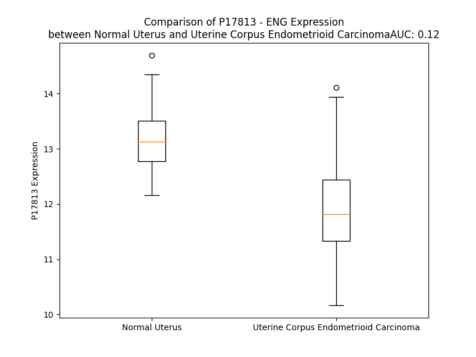

# Detailed Data for P17813

## Introduction to the Detailed Summary

### How to Interpret the Results

- **Summary & Metrics**: This section provides a quick reference to essential protein attributes, including expression changes, family classification, and biomarker applications. Regulation status (upregulated/downregulated) indicates the protein's behavior in a disease context. Some information comes from the original excel file with the proteins selected from literature, while others are derived from the analyses.
- **Expression Comparison**: A visual representation comparing protein expression between normal and disease states. It highlights significant changes in expression levels that might indicate diagnostic or therapeutic relevance. This is data coming from transcriptomics experiments and could not translate similarly to protein levels.
- **Isoform Alignment**: An interactive view of isoform alignments, revealing structural and functional differences between variants of the protein.
- **Interactors & Homologs**: Tables listing known interaction partners and homologous proteins, the more interactors and homologs, the more complex the protein is to design an antibody for.
- **Biological Assemblies**: Information about the structural arrangement of the protein in different assemblies, providing insights into its functional state but also the complexity of the protein to develop antibodies.
- **Combined Per-Residue Information**: A detailed table summarizing residue-level data. This includes predictions for epitope regions, aggregation tendencies, and modifications that might impact the protein's function. Each row corresponds to a residue in the protein, providing insights into specific sites that may be important for research or drug development.
## Summary & Metrics

- **UniProt Accession**: P17813
- **Gene Name**: ENG
- **Protein Name**: Endoglin /CD105
- **Swiss Prot**: EGLN_HUMAN
- **Family**: transmembrane receptor
- **Biomarker Application**: diagnosis,disease progression,efficacy,prognosis
- **Number of Isoforms**: 2
- **Regulation**: 1
- **(transcriptomics) AUC**: 0.07
- **(transcriptomics) Fold Change**: 1.12
- **(transcriptomics) Regulation**: Downregulated
- **Discotope Epitope Count**: 155
- **Max n_uniprots (Homo)**: 2
- **Max n_uniprots (Hetero)**: 3

## Expression Comparison

## Isoform Alignment

<pre style='font-size:14px; font-family:monospace;'>P17813-1 MDRGTLPLAVALLLASCSLSPTSLAETVHCDLQPVGPERGEVTYTTSQVSKGCVAQAPNAILEVHVLFLEFPTGPSQLELTLQASKQNGTWPREVLLVLSVNSSVFLHLQALGIPLHLAYNSSLVTFQEPPGVNTTELPSFPKTQILEWAAERGPITSAAELNDPQSILLRLGQAQGSLSFCMLEASQDMGRTLEWRPRTPALVRGCHLEGVAGHKEAHILRVLPGHSAGPRTVTVKVELSCAPGDLDAVLILQGPPYVSWLIDANHNMQIWTTGEYSFKIFPEKNIRGFKLPDTPQGLLGEARMLNASIVASFVELPLASIVSLHASSCGGRLQTSPAPIQTTPPKDTCSPELLMSLIQTKCADDAMTLVLKKELVAHLKCTITGLTFWDPSCEAEDRGDKFVLRSAYSSCGMQVSASMISNEAVVNILSSSSPQRKKVHCLNMDSLSFQLGLYLSPHFLQASNTIEPGQQSFVQVRVSPSVSEFLLQLDSCHLDLGPEGGTVELIQGRAAKGNCVSLLSPSPEGDPRFSFLLHFYTVPIPKTGTLSCTVALRPKTGSQDQEVHRTVFMRLNIISPDLSGCTSKGLVLPAVLGITFGAFLIGALLTAALWYIYSHTRSPSKREPVVAVAAPASSESSSTNHSIGSTQSTPCSTSSMA
P17813-2 MDRGTLPLAVALLLASCSLSPTSLAETVHCDLQPVGPERGEVTYTTSQVSKGCVAQAPNAILEVHVLFLEFPTGPSQLELTLQASKQNGTWPREVLLVLSVNSSVFLHLQALGIPLHLAYNSSLVTFQEPPGVNTTELPSFPKTQILEWAAERGPITSAAELNDPQSILLRLGQAQGSLSFCMLEASQDMGRTLEWRPRTPALVRGCHLEGVAGHKEAHILRVLPGHSAGPRTVTVKVELSCAPGDLDAVLILQGPPYVSWLIDANHNMQIWTTGEYSFKIFPEKNIRGFKLPDTPQGLLGEARMLNASIVASFVELPLASIVSLHASSCGGRLQTSPAPIQTTPPKDTCSPELLMSLIQTKCADDAMTLVLKKELVAHLKCTITGLTFWDPSCEAEDRGDKFVLRSAYSSCGMQVSASMISNEAVVNILSSSSPQRKKVHCLNMDSLSFQLGLYLSPHFLQASNTIEPGQQSFVQVRVSPSVSEFLLQLDSCHLDLGPEGGTVELIQGRAAKGNCVSLLSPSPEGDPRFSFLLHFYTVPIPKTGTLSCTVALRPKTGSQDQEVHRTVFMRLNIISPDLSGCTSKGLVLPAVLGITFGAFLIGALLTAALWYIYSHTREYPRPPQ---------------------------------
</pre>

## Interactors

| preferredName_A   | preferredName_B   |   score |
|:------------------|:------------------|--------:|
| ENG               | ACVRL1            |   0.999 |
| ENG               | TGFB1             |   0.998 |
| ENG               | TGFBR2            |   0.997 |
| ENG               | GDF2              |   0.996 |
| ENG               | TGFB3             |   0.995 |
| ENG               | BMPR2             |   0.979 |
| ENG               | BMP10             |   0.977 |
| ENG               | TGFBR1            |   0.969 |
| ENG               | THY1              |   0.941 |
| ENG               | LRG1              |   0.931 |
| ENG               | NT5E              |   0.928 |
| ENG               | PECAM1            |   0.923 |
| ENG               | ITGB1             |   0.92  |
| ENG               | CD34              |   0.919 |
| ENG               | PTPRC             |   0.91  |
| ENG               | GIPC1             |   0.902 |

## Homologs

| uniprot_id   | gene_id   |
|:-------------|:----------|
| E9PAW7       | TGFBR3    |
| H3BV60       | TGFBR3L   |

## Biological Assemblies

|   Unnamed: 0 |   assembly |   n_uniprots | composition   | crystal_id   |
|-------------:|-----------:|-------------:|:--------------|:-------------|
|            0 |          1 |            2 | Homo          | 5i04         |
|            0 |          1 |            2 | Homo          | 5hzv         |
|            0 |          1 |            3 | Hetero        | 5hzw         |

## Combined Per-Residue Information

|   res | aa   |   epitope_score | epitope   |   relative_surface_accessibility |   modeling_confidence |   Aggregation | modification             | glycosylation                   |
|------:|:-----|----------------:|:----------|---------------------------------:|----------------------:|--------------:|:-------------------------|:--------------------------------|
|     1 | M    |         0.09326 | False     |                          1.27411 |                 38.96 |         0     | N/A                      | N/A                             |
|     2 | D    |         0.12395 | True      |                          0.8178  |                 41.08 |         0     | N/A                      | N/A                             |
|     3 | R    |         0.12795 | True      |                          0.99144 |                 34.76 |         0     | N/A                      | N/A                             |
|     4 | G    |         0.12256 | False     |                          0.7604  |                 41.35 |         0     | N/A                      | N/A                             |
|     5 | T    |         0.0887  | False     |                          0.9509  |                 40.67 |         0     | N/A                      | N/A                             |
|     6 | L    |         0.1265  | True      |                          1.01635 |                 43.02 |         0     | N/A                      | N/A                             |
|     7 | P    |         0.07043 | False     |                          0.66207 |                 50.25 |         0.796 | N/A                      | N/A                             |
|     8 | L    |         0.07994 | False     |                          0.84718 |                 46.34 |        66.845 | N/A                      | N/A                             |
|     9 | A    |         0.05677 | False     |                          0.65868 |                 46.06 |        78.752 | N/A                      | N/A                             |
|    10 | V    |         0.03839 | False     |                          0.56458 |                 52.36 |        91.609 | N/A                      | N/A                             |
|    11 | A    |         0.09507 | False     |                          0.58104 |                 50.63 |        92.123 | N/A                      | N/A                             |
|    12 | L    |         0.09905 | False     |                          0.73379 |                 46.86 |        92.212 | N/A                      | N/A                             |
|    13 | L    |         0.0969  | False     |                          0.69259 |                 47.54 |        91.162 | N/A                      | N/A                             |
|    14 | L    |         0.11059 | False     |                          0.79205 |                 48.95 |        84.391 | N/A                      | N/A                             |
|    15 | A    |         0.0899  | False     |                          0.67883 |                 45.63 |        40.73  | N/A                      | N/A                             |
|    16 | S    |         0.0872  | False     |                          0.42405 |                 46.85 |         6.007 | N/A                      | N/A                             |
|    17 | C    |         0.10458 | False     |                          0.73569 |                 42.84 |         1.635 | N/A                      | N/A                             |
|    18 | S    |         0.11404 | False     |                          0.70531 |                 38.07 |         0.721 | N/A                      | N/A                             |
|    19 | L    |         0.14944 | True      |                          0.95512 |                 37.67 |         0.611 | N/A                      | N/A                             |
|    20 | S    |         0.14262 | True      |                          0.62989 |                 36.32 |         0     | N/A                      | N/A                             |
|    21 | P    |         0.12839 | True      |                          0.93177 |                 37.32 |         0     | N/A                      | N/A                             |
|    22 | T    |         0.10614 | False     |                          0.92883 |                 36.86 |         0     | N/A                      | N/A                             |
|    23 | S    |         0.12219 | False     |                          0.78619 |                 37.41 |         0     | N/A                      | N/A                             |
|    24 | L    |         0.14213 | True      |                          1.04713 |                 47.73 |         0     | N/A                      | N/A                             |
|    25 | A    |         0.12398 | True      |                          0.89722 |                 59.49 |         0     | N/A                      | N/A                             |
|    26 | E    |         0.19139 | True      |                          0.41043 |                 71.74 |         0     | N/A                      | N/A                             |
|    27 | T    |         0.1209  | False     |                          0.65856 |                 80.66 |         0     | N/A                      | N/A                             |
|    28 | V    |         0.11859 | False     |                          0.68543 |                 84.18 |         0     | N/A                      | N/A                             |
|    29 | H    |         0.12925 | True      |                          0.24759 |                 86.6  |         0     | N/A                      | N/A                             |
|    30 | C    |         0.02235 | False     |                          0.09514 |                 91.12 |         0     | N/A                      | N/A                             |
|    31 | D    |         0.09348 | False     |                          0.70283 |                 90.04 |         0     | N/A                      | N/A                             |
|    32 | L    |         0.03875 | False     |                          0.25377 |                 92.47 |         0     | N/A                      | N/A                             |
|    33 | Q    |         0.06865 | False     |                          0.62131 |                 91.36 |         0     | N/A                      | N/A                             |
|    34 | P    |         0.07104 | False     |                          0.74947 |                 92.3  |         0     | N/A                      | N/A                             |
|    35 | V    |         0.03396 | False     |                          0.21867 |                 88.38 |         0     | N/A                      | N/A                             |
|    36 | G    |         0.04703 | False     |                          0.30555 |                 85.05 |         0     | N/A                      | N/A                             |
|    37 | P    |         0.05122 | False     |                          0.74735 |                 84.52 |         0     | N/A                      | N/A                             |
|    38 | E    |         0.08787 | False     |                          0.62752 |                 83.05 |         0     | N/A                      | N/A                             |
|    39 | R    |         0.12776 | True      |                          0.64549 |                 84.62 |         0     | N/A                      | N/A                             |
|    40 | G    |         0.00537 | False     |                          0.02518 |                 85.94 |         0     | N/A                      | N/A                             |
|    41 | E    |         0.02677 | False     |                          0.36288 |                 92.44 |         0     | N/A                      | N/A                             |
|    42 | V    |         0.00661 | False     |                          0.00857 |                 94.19 |         0.189 | N/A                      | N/A                             |
|    43 | T    |         0.10903 | False     |                          0.33107 |                 94.64 |         0.189 | N/A                      | N/A                             |
|    44 | Y    |         0.029   | False     |                          0.1425  |                 95.9  |         0.189 | N/A                      | N/A                             |
|    45 | T    |         0.03831 | False     |                          0.09045 |                 95.21 |         0.189 | N/A                      | N/A                             |
|    46 | T    |         0.02134 | False     |                          0.01714 |                 94.02 |         0.189 | N/A                      | N/A                             |
|    47 | S    |         0.01169 | False     |                          0.07044 |                 93.03 |         0     | N/A                      | N/A                             |
|    48 | Q    |         0.02569 | False     |                          0.17462 |                 91.84 |         0     | N/A                      | N/A                             |
|    49 | V    |         0.01168 | False     |                          0.03491 |                 93.85 |         0     | N/A                      | N/A                             |
|    50 | S    |         0.06601 | False     |                          0.42473 |                 93.22 |         0     | N/A                      | N/A                             |
|    51 | K    |         0.14281 | True      |                          0.44118 |                 94.61 |         0     | N/A                      | N/A                             |
|    52 | G    |         0.0029  | False     |                          0.00119 |                 94.06 |         0     | N/A                      | N/A                             |
|    53 | C    |         0.01853 | False     |                          0.05355 |                 93.39 |         0     | N/A                      | N/A                             |
|    54 | V    |         0.02845 | False     |                          0.12991 |                 92.48 |         0     | N/A                      | N/A                             |
|    55 | A    |         0.00542 | False     |                          0.02229 |                 91.56 |         0     | N/A                      | N/A                             |
|    56 | Q    |         0.15148 | True      |                          0.36211 |                 86.52 |         0     | N/A                      | N/A                             |
|    57 | A    |         0.03501 | False     |                          0.12086 |                 85.44 |         0     | N/A                      | N/A                             |
|    58 | P    |         0.2296  | True      |                          0.79829 |                 74.64 |         0     | N/A                      | N/A                             |
|    59 | N    |         0.16687 | True      |                          0.93477 |                 78.53 |         0     | N/A                      | N/A                             |
|    60 | A    |         0.09038 | False     |                          0.19272 |                 82.38 |         0     | N/A                      | N/A                             |
|    61 | I    |         0.14377 | True      |                          0.92331 |                 85.51 |         0     | N/A                      | N/A                             |
|    62 | L    |         0.06905 | False     |                          0.17161 |                 89.62 |         0     | N/A                      | N/A                             |
|    63 | E    |         0.01891 | False     |                          0.03066 |                 90.46 |         0     | N/A                      | N/A                             |
|    64 | V    |         0.00302 | False     |                          0       |                 94.5  |         3.481 | N/A                      | N/A                             |
|    65 | H    |         0.01473 | False     |                          0.01647 |                 95.78 |         3.73  | N/A                      | N/A                             |
|    66 | V    |         0.0026  | False     |                          0.00141 |                 96.84 |         3.73  | N/A                      | N/A                             |
|    67 | L    |         0.00784 | False     |                          0.00824 |                 97.64 |         3.73  | N/A                      | N/A                             |
|    68 | F    |         0.0202  | False     |                          0.01142 |                 97.06 |         3.73  | N/A                      | N/A                             |
|    69 | L    |         0.01477 | False     |                          0.02593 |                 96.79 |         3.188 | N/A                      | N/A                             |
|    70 | E    |         0.0756  | False     |                          0.29487 |                 95.3  |         0     | N/A                      | N/A                             |
|    71 | F    |         0.02897 | False     |                          0.05193 |                 94.71 |         0     | N/A                      | N/A                             |
|    72 | P    |         0.11996 | False     |                          0.57874 |                 92.04 |         0     | N/A                      | N/A                             |
|    73 | T    |         0.2922  | True      |                          1.0612  |                 87.66 |         0     | N/A                      | N/A                             |
|    74 | G    |         0.09335 | False     |                          0.37332 |                 86.15 |         0     | N/A                      | N/A                             |
|    75 | P    |         0.19413 | True      |                          0.91338 |                 88.92 |         0     | N/A                      | N/A                             |
|    76 | S    |         0.06943 | False     |                          0.1066  |                 92.86 |         0     | N/A                      | N/A                             |
|    77 | Q    |         0.16237 | True      |                          0.65261 |                 93.99 |         0     | N/A                      | N/A                             |
|    78 | L    |         0.01221 | False     |                          0.01402 |                 96.23 |         0     | N/A                      | N/A                             |
|    79 | E    |         0.17575 | True      |                          0.5111  |                 96.36 |         0     | N/A                      | N/A                             |
|    80 | L    |         0.00379 | False     |                          0.00272 |                 96.48 |         0     | N/A                      | N/A                             |
|    81 | T    |         0.08506 | False     |                          0.32037 |                 95.19 |         0     | N/A                      | N/A                             |
|    82 | L    |         0.01738 | False     |                          0.03351 |                 93.05 |         0     | N/A                      | N/A                             |
|    83 | Q    |         0.05427 | False     |                          0.45293 |                 90.71 |         0     | N/A                      | N/A                             |
|    84 | A    |         0.09126 | False     |                          0.43905 |                 83.19 |         0     | N/A                      | N/A                             |
|    85 | S    |         0.06865 | False     |                          0.30162 |                 75.52 |         0     | N/A                      | N/A                             |
|    86 | K    |         0.18372 | True      |                          0.99558 |                 67.85 |         0     | N/A                      | N/A                             |
|    87 | Q    |         0.19401 | True      |                          0.48167 |                 58.59 |         0     | N/A                      | N/A                             |
|    88 | N    |         0.23865 | True      |                          1.04777 |                 50.92 |         0     | N/A                      | N-linked (GlcNAc...) asparagine |
|    89 | G    |         0.20269 | True      |                          0.59008 |                 47.61 |         0     | N/A                      | N/A                             |
|    90 | T    |         0.2407  | True      |                          0.94924 |                 45.81 |         0     | N/A                      | N/A                             |
|    91 | W    |         0.19782 | True      |                          0.96087 |                 52.59 |         0     | N/A                      | N/A                             |
|    92 | P    |         0.12216 | False     |                          0.56192 |                 62.05 |         0     | N/A                      | N/A                             |
|    93 | R    |         0.16993 | True      |                          0.33798 |                 77.53 |         0.029 | N/A                      | N/A                             |
|    94 | E    |         0.10767 | False     |                          0.3831  |                 88.32 |         0.029 | N/A                      | N/A                             |
|    95 | V    |         0.0117  | False     |                          0.00857 |                 92.09 |        98.036 | N/A                      | N/A                             |
|    96 | L    |         0.04068 | False     |                          0.04369 |                 94.56 |        98.834 | N/A                      | N/A                             |
|    97 | L    |         0.00309 | False     |                          0       |                 95.48 |        99.212 | N/A                      | N/A                             |
|    98 | V    |         0.00271 | False     |                          0       |                 96.38 |        99.238 | N/A                      | N/A                             |
|    99 | L    |         0.01399 | False     |                          0.01007 |                 95.41 |        99.238 | N/A                      | N/A                             |
|   100 | S    |         0.03091 | False     |                          0.16684 |                 95.28 |        71.34  | N/A                      | N/A                             |
|   101 | V    |         0.04784 | False     |                          0.12757 |                 94.32 |        67.842 | N/A                      | N/A                             |
|   102 | N    |         0.24843 | True      |                          0.56841 |                 92.43 |        26.424 | N/A                      | N-linked (GlcNAc...) asparagine |
|   103 | S    |         0.07474 | False     |                          0.14663 |                 91.7  |        24.818 | N/A                      | N/A                             |
|   104 | S    |         0.08507 | False     |                          0.39099 |                 93.29 |        24.624 | N/A                      | N/A                             |
|   105 | V    |         0.01909 | False     |                          0.01854 |                 94.81 |        24.667 | N/A                      | N/A                             |
|   106 | F    |         0.12348 | True      |                          0.39272 |                 94.42 |        24.375 | N/A                      | N/A                             |
|   107 | L    |         0.0308  | False     |                          0.02115 |                 94.7  |        20.79  | N/A                      | N/A                             |
|   108 | H    |         0.19508 | True      |                          0.41879 |                 93.87 |         1.205 | N/A                      | N/A                             |
|   109 | L    |         0.08998 | False     |                          0.23298 |                 93.64 |         1.061 | N/A                      | N/A                             |
|   110 | Q    |         0.1062  | False     |                          0.38526 |                 91.66 |         0.208 | N/A                      | N/A                             |
|   111 | A    |         0.04016 | False     |                          0.28801 |                 88.04 |         0.178 | N/A                      | N/A                             |
|   112 | L    |         0.19854 | True      |                          0.82034 |                 83.5  |         0.152 | N/A                      | N/A                             |
|   113 | G    |         0.14941 | True      |                          0.90632 |                 80.53 |         0     | N/A                      | N/A                             |
|   114 | I    |         0.09199 | False     |                          0.12312 |                 84.04 |         0     | N/A                      | N/A                             |
|   115 | P    |         0.12697 | True      |                          0.36409 |                 87.94 |         0     | N/A                      | N/A                             |
|   116 | L    |         0.05433 | False     |                          0.05394 |                 90.59 |         0     | N/A                      | N/A                             |
|   117 | H    |         0.11485 | False     |                          0.25527 |                 92.85 |         0     | N/A                      | N/A                             |
|   118 | L    |         0.00733 | False     |                          0.00122 |                 94.41 |         0     | N/A                      | N/A                             |
|   119 | A    |         0.00551 | False     |                          0       |                 95.08 |         0     | N/A                      | N/A                             |
|   120 | Y    |         0.05755 | False     |                          0.09565 |                 94.41 |         0     | N/A                      | N/A                             |
|   121 | N    |         0.05847 | False     |                          0.27424 |                 92.45 |         0     | N/A                      | N-linked (GlcNAc...) asparagine |
|   122 | S    |         0.17999 | True      |                          0.53592 |                 90.28 |         0.156 | N/A                      | N/A                             |
|   123 | S    |         0.12631 | True      |                          0.79388 |                 90.04 |         1.429 | N/A                      | N/A                             |
|   124 | L    |         0.09808 | False     |                          0.32788 |                 91.96 |         1.826 | N/A                      | N/A                             |
|   125 | V    |         0.07147 | False     |                          0.05374 |                 93.02 |         1.826 | N/A                      | N/A                             |
|   126 | T    |         0.12719 | True      |                          0.55056 |                 91.77 |         1.826 | N/A                      | N/A                             |
|   127 | F    |         0.04934 | False     |                          0.14484 |                 91.19 |         1.826 | N/A                      | N/A                             |
|   128 | Q    |         0.19355 | True      |                          0.53159 |                 82.3  |         0.396 | N/A                      | N/A                             |
|   129 | E    |         0.1935  | True      |                          0.68397 |                 80.23 |         0     | N/A                      | N/A                             |
|   130 | P    |         0.18755 | True      |                          0.88304 |                 72.06 |         0     | N/A                      | N/A                             |
|   131 | P    |         0.07359 | False     |                          0.234   |                 69.48 |         0     | N/A                      | N/A                             |
|   132 | G    |         0.102   | False     |                          1.04769 |                 69.92 |         0     | N/A                      | N/A                             |
|   133 | V    |         0.12132 | False     |                          0.36067 |                 75.93 |         0     | N/A                      | N/A                             |
|   134 | N    |         0.11718 | False     |                          0.63188 |                 83.44 |         0     | N/A                      | N-linked (GlcNAc...) asparagine |
|   135 | T    |         0.09513 | False     |                          0.50583 |                 89.81 |         0     | N/A                      | N/A                             |
|   136 | T    |         0.09359 | False     |                          0.39169 |                 92.04 |         0     | N/A                      | N/A                             |
|   137 | E    |         0.06085 | False     |                          0.50467 |                 92.16 |         0     | N/A                      | N/A                             |
|   138 | L    |         0.0412  | False     |                          0.08104 |                 89.8  |         0     | N/A                      | N/A                             |
|   139 | P    |         0.095   | False     |                          0.25453 |                 84.56 |         0     | N/A                      | N/A                             |
|   140 | S    |         0.19783 | True      |                          0.8748  |                 82.66 |         0     | N/A                      | N/A                             |
|   141 | F    |         0.21025 | True      |                          0.47402 |                 84.68 |         0     | N/A                      | N/A                             |
|   142 | P    |         0.15576 | True      |                          0.6091  |                 89.34 |         0     | N/A                      | N/A                             |
|   143 | K    |         0.08916 | False     |                          0.37643 |                 90.26 |         0     | N/A                      | N/A                             |
|   144 | T    |         0.10205 | False     |                          0.66318 |                 89.65 |         0     | N/A                      | N/A                             |
|   145 | Q    |         0.13996 | True      |                          0.4262  |                 91.72 |         0     | N/A                      | N/A                             |
|   146 | I    |         0.02536 | False     |                          0.0344  |                 93.21 |         0     | N/A                      | N/A                             |
|   147 | L    |         0.02255 | False     |                          0.19681 |                 93.67 |         0     | N/A                      | N/A                             |
|   148 | E    |         0.1199  | False     |                          0.59639 |                 93.16 |         0     | N/A                      | N/A                             |
|   149 | W    |         0.06187 | False     |                          0.2643  |                 94.47 |         0     | N/A                      | N/A                             |
|   150 | A    |         0.00233 | False     |                          0       |                 93.75 |         0     | N/A                      | N/A                             |
|   151 | A    |         0.06413 | False     |                          0.51464 |                 92.76 |         0     | N/A                      | N/A                             |
|   152 | E    |         0.26169 | True      |                          0.79923 |                 92.89 |         0     | N/A                      | N/A                             |
|   153 | R    |         0.18342 | True      |                          0.65057 |                 91.68 |         0     | N/A                      | N/A                             |
|   154 | G    |         0.05708 | False     |                          0.13172 |                 90.84 |         0     | N/A                      | N/A                             |
|   155 | P    |         0.08425 | False     |                          0.45814 |                 92.57 |         0     | N/A                      | N/A                             |
|   156 | I    |         0.02358 | False     |                          0.12928 |                 94.02 |         0     | N/A                      | N/A                             |
|   157 | T    |         0.01246 | False     |                          0.08465 |                 92.7  |         0     | N/A                      | N/A                             |
|   158 | S    |         0.00696 | False     |                          0.01631 |                 94.75 |         0     | N/A                      | N/A                             |
|   159 | A    |         0.00502 | False     |                          0.00383 |                 96.19 |         0     | N/A                      | N/A                             |
|   160 | A    |         0.00121 | False     |                          0.00128 |                 97.12 |         0     | N/A                      | N/A                             |
|   161 | E    |         0.03504 | False     |                          0.093   |                 97.23 |         0     | N/A                      | N/A                             |
|   162 | L    |         0.00232 | False     |                          0.00221 |                 96.62 |         0     | N/A                      | N/A                             |
|   163 | N    |         0.095   | False     |                          0.59692 |                 94.98 |         0     | N/A                      | N/A                             |
|   164 | D    |         0.05192 | False     |                          0.04549 |                 94.78 |         0     | N/A                      | N/A                             |
|   165 | P    |         0.0037  | False     |                          0       |                 96.95 |         0     | N/A                      | N/A                             |
|   166 | Q    |         0.02872 | False     |                          0.36822 |                 95.9  |         0.253 | N/A                      | N/A                             |
|   167 | S    |         0.03258 | False     |                          0.14383 |                 97.02 |         0.253 | N/A                      | N/A                             |
|   168 | I    |         0.01314 | False     |                          0.01945 |                 97.8  |         0.253 | N/A                      | N/A                             |
|   169 | L    |         0.04983 | False     |                          0.29525 |                 96.63 |         0.253 | N/A                      | N/A                             |
|   170 | L    |         0.00172 | False     |                          0       |                 95.5  |         0.253 | N/A                      | N/A                             |
|   171 | R    |         0.03544 | False     |                          0.23816 |                 92.13 |         0     | N/A                      | N/A                             |
|   172 | L    |         0.0125  | False     |                          0.04659 |                 88.39 |         0     | N/A                      | N/A                             |
|   173 | G    |         0.06398 | False     |                          0.5751  |                 79.19 |         0     | N/A                      | N/A                             |
|   174 | Q    |         0.08773 | False     |                          0.32525 |                 70.57 |         0     | N/A                      | N/A                             |
|   175 | A    |         0.06122 | False     |                          0.28948 |                 67.67 |         0     | N/A                      | N/A                             |
|   176 | Q    |         0.18346 | True      |                          0.58095 |                 63.24 |         0     | N/A                      | N/A                             |
|   177 | G    |         0.17949 | True      |                          0.62439 |                 66.28 |         0     | N/A                      | N/A                             |
|   178 | S    |         0.18858 | True      |                          0.81612 |                 63.51 |         0     | N/A                      | N/A                             |
|   179 | L    |         0.1469  | True      |                          0.69189 |                 78.32 |         0.224 | N/A                      | N/A                             |
|   180 | S    |         0.1302  | True      |                          0.59252 |                 80.37 |         0.224 | N/A                      | N/A                             |
|   181 | F    |         0.17213 | True      |                          0.8281  |                 86.07 |         0.224 | N/A                      | N/A                             |
|   182 | C    |         0.04273 | False     |                          0.22211 |                 90.82 |         0.224 | N/A                      | N/A                             |
|   183 | M    |         0.17709 | True      |                          0.72209 |                 91.34 |         0.224 | N/A                      | N/A                             |
|   184 | L    |         0.13315 | True      |                          0.34037 |                 92.31 |         0.224 | N/A                      | N/A                             |
|   185 | E    |         0.11484 | False     |                          0.51415 |                 92.44 |         0     | N/A                      | N/A                             |
|   186 | A    |         0.18691 | True      |                          0.66875 |                 92.29 |         0     | N/A                      | N/A                             |
|   187 | S    |         0.04507 | False     |                          0.36413 |                 88.49 |         0     | N/A                      | N/A                             |
|   188 | Q    |         0.06794 | False     |                          0.19869 |                 90.39 |         0     | N/A                      | N/A                             |
|   189 | D    |         0.02898 | False     |                          0.11783 |                 89.58 |         0     | N/A                      | N/A                             |
|   190 | M    |         0.017   | False     |                          0.01152 |                 90.45 |         0     | N/A                      | N/A                             |
|   191 | G    |         0.0167  | False     |                          0.20937 |                 87.33 |         0     | N/A                      | N/A                             |
|   192 | R    |         0.08379 | False     |                          0.61815 |                 88.1  |         0     | N/A                      | N/A                             |
|   193 | T    |         0.00883 | False     |                          0.03572 |                 91.81 |         0     | N/A                      | N/A                             |
|   194 | L    |         0.00237 | False     |                          0.00143 |                 94.34 |         0     | N/A                      | N/A                             |
|   195 | E    |         0.01435 | False     |                          0.14036 |                 95.14 |         0     | N/A                      | N/A                             |
|   196 | W    |         0.0487  | False     |                          0.09253 |                 97.41 |         0     | N/A                      | N/A                             |
|   197 | R    |         0.06194 | False     |                          0.33328 |                 96.99 |         0     | N/A                      | N/A                             |
|   198 | P    |         0.02062 | False     |                          0.08739 |                 95.35 |         0     | N/A                      | N/A                             |
|   199 | R    |         0.09892 | False     |                          0.35253 |                 92.87 |         0     | N/A                      | N/A                             |
|   200 | T    |         0.06851 | False     |                          0.57418 |                 87.49 |         0     | N/A                      | N/A                             |
|   201 | P    |         0.0647  | False     |                          0.48568 |                 87.67 |         0     | N/A                      | N/A                             |
|   202 | A    |         0.0309  | False     |                          0.15089 |                 90.36 |         0     | N/A                      | N/A                             |
|   203 | L    |         0.08851 | False     |                          0.71097 |                 91.96 |         0     | N/A                      | N/A                             |
|   204 | V    |         0.0106  | False     |                          0.04016 |                 93.79 |         0     | N/A                      | N/A                             |
|   205 | R    |         0.08319 | False     |                          0.21881 |                 95.01 |         0     | N/A                      | N/A                             |
|   206 | G    |         0.02159 | False     |                          0.06942 |                 93.82 |         0     | N/A                      | N/A                             |
|   207 | C    |         0.01658 | False     |                          0.0825  |                 94.16 |         0     | N/A                      | N/A                             |
|   208 | H    |         0.06816 | False     |                          0.69127 |                 93.4  |         0     | N/A                      | N/A                             |
|   209 | L    |         0.03157 | False     |                          0.03429 |                 91.16 |         0     | N/A                      | N/A                             |
|   210 | E    |         0.14211 | True      |                          0.7475  |                 87.68 |         0     | N/A                      | N/A                             |
|   211 | G    |         0.20724 | True      |                          1.04799 |                 83.92 |         0     | N/A                      | N/A                             |
|   212 | V    |         0.14004 | True      |                          0.19642 |                 86.2  |         0     | N/A                      | N/A                             |
|   213 | A    |         0.10743 | False     |                          0.90509 |                 82.7  |         0     | N/A                      | N/A                             |
|   214 | G    |         0.09333 | False     |                          0.60737 |                 80.24 |         0     | N/A                      | N/A                             |
|   215 | H    |         0.11172 | False     |                          0.87712 |                 83.29 |         0     | N/A                      | N/A                             |
|   216 | K    |         0.04166 | False     |                          0.07282 |                 89.93 |         0     | N/A                      | N/A                             |
|   217 | E    |         0.04332 | False     |                          0.10707 |                 91.41 |         0     | N/A                      | N/A                             |
|   218 | A    |         0.00126 | False     |                          0       |                 94.35 |         0     | N/A                      | N/A                             |
|   219 | H    |         0.00276 | False     |                          0.00471 |                 95.39 |         0     | N/A                      | N/A                             |
|   220 | I    |         0.00678 | False     |                          0.01753 |                 96.65 |         0     | N/A                      | N/A                             |
|   221 | L    |         0.01226 | False     |                          0.05358 |                 96.68 |         0     | N/A                      | N/A                             |
|   222 | R    |         0.04474 | False     |                          0.14938 |                 96.22 |         0     | N/A                      | N/A                             |
|   223 | V    |         0.00536 | False     |                          0.00985 |                 94.03 |         0     | N/A                      | N/A                             |
|   224 | L    |         0.0957  | False     |                          0.39895 |                 91.26 |         0     | N/A                      | N/A                             |
|   225 | P    |         0.20942 | True      |                          0.7211  |                 85.35 |         0     | N/A                      | N/A                             |
|   226 | G    |         0.06396 | False     |                          0.22221 |                 76.51 |         0     | N/A                      | N/A                             |
|   227 | H    |         0.18032 | True      |                          0.78901 |                 71.93 |         0     | N/A                      | N/A                             |
|   228 | S    |         0.14889 | True      |                          0.42207 |                 65.89 |         0     | N/A                      | N/A                             |
|   229 | A    |         0.25567 | True      |                          0.84592 |                 64.1  |         0     | N/A                      | N/A                             |
|   230 | G    |         0.11382 | False     |                          0.29179 |                 78.33 |         0     | N/A                      | N/A                             |
|   231 | P    |         0.17611 | True      |                          0.96097 |                 85.59 |         0     | N/A                      | N/A                             |
|   232 | R    |         0.07245 | False     |                          0.30532 |                 88.28 |         0     | N/A                      | N/A                             |
|   233 | T    |         0.13034 | True      |                          0.58788 |                 92.19 |         0.204 | N/A                      | N/A                             |
|   234 | V    |         0.00211 | False     |                          0       |                 94.42 |         0.547 | N/A                      | N/A                             |
|   235 | T    |         0.09024 | False     |                          0.18181 |                 95.76 |         0.547 | N/A                      | N/A                             |
|   236 | V    |         0.00975 | False     |                          0.00666 |                 96.22 |         0.547 | N/A                      | N/A                             |
|   237 | K    |         0.08789 | False     |                          0.42631 |                 95.76 |         0.547 | N/A                      | N/A                             |
|   238 | V    |         0.00696 | False     |                          0.02744 |                 93.37 |         0.547 | N/A                      | N/A                             |
|   239 | E    |         0.12129 | False     |                          0.51605 |                 91.71 |         0.547 | N/A                      | N/A                             |
|   240 | L    |         0.01541 | False     |                          0.05774 |                 88.13 |         0.547 | N/A                      | N/A                             |
|   241 | S    |         0.07666 | False     |                          0.31064 |                 84.74 |         0     | N/A                      | N/A                             |
|   242 | C    |         0.0961  | False     |                          0.57728 |                 77.93 |         0     | N/A                      | N/A                             |
|   243 | A    |         0.06675 | False     |                          0.21003 |                 66.44 |         0     | N/A                      | N/A                             |
|   244 | P    |         0.13517 | True      |                          0.54497 |                 63.89 |         0     | N/A                      | N/A                             |
|   245 | G    |         0.19332 | True      |                          1.02845 |                 62.86 |         0     | N/A                      | N/A                             |
|   246 | D    |         0.16162 | True      |                          0.89092 |                 64.17 |         0     | N/A                      | N/A                             |
|   247 | L    |         0.07413 | False     |                          0.16342 |                 71.69 |         0     | N/A                      | N/A                             |
|   248 | D    |         0.07161 | False     |                          0.41456 |                 83.94 |         0     | N/A                      | N/A                             |
|   249 | A    |         0.00814 | False     |                          0.01511 |                 90.93 |        40.725 | N/A                      | N/A                             |
|   250 | V    |         0.00424 | False     |                          0       |                 93.63 |        42.547 | N/A                      | N/A                             |
|   251 | L    |         0.00292 | False     |                          0.00247 |                 95.65 |        42.547 | N/A                      | N/A                             |
|   252 | I    |         0.00161 | False     |                          0       |                 96.78 |        42.547 | N/A                      | N/A                             |
|   253 | L    |         0.00199 | False     |                          0       |                 97.05 |        42.547 | N/A                      | N/A                             |
|   254 | Q    |         0.03848 | False     |                          0.04685 |                 96.15 |         3.355 | N/A                      | N/A                             |
|   255 | G    |         0.01772 | False     |                          0.04521 |                 93.56 |         0     | N/A                      | N/A                             |
|   256 | P    |         0.08365 | False     |                          0.08535 |                 91.69 |         0     | N/A                      | N/A                             |
|   257 | P    |         0.28122 | True      |                          0.95515 |                 88.79 |         0.404 | N/A                      | N/A                             |
|   258 | Y    |         0.16139 | True      |                          0.20065 |                 89.64 |        36.776 | N/A                      | N/A                             |
|   259 | V    |         0.01092 | False     |                          0.00874 |                 92.21 |        41.283 | N/A                      | N/A                             |
|   260 | S    |         0.13024 | True      |                          0.18986 |                 93.92 |        41.283 | N/A                      | N/A                             |
|   261 | W    |         0.00885 | False     |                          0.00616 |                 95.44 |        41.283 | N/A                      | N/A                             |
|   262 | L    |         0.0608  | False     |                          0.2506  |                 94.46 |        41.283 | N/A                      | N/A                             |
|   263 | I    |         0.01102 | False     |                          0.0071  |                 94.28 |        38.233 | N/A                      | N/A                             |
|   264 | D    |         0.15789 | True      |                          0.24245 |                 93.57 |         0     | N/A                      | N/A                             |
|   265 | A    |         0.0474  | False     |                          0.3674  |                 90.16 |         0     | N/A                      | N/A                             |
|   266 | N    |         0.16714 | True      |                          0.50769 |                 87.99 |         0     | N/A                      | N/A                             |
|   267 | H    |         0.12734 | True      |                          0.35761 |                 83.45 |         0     | N/A                      | N/A                             |
|   268 | N    |         0.15662 | True      |                          0.9359  |                 82.96 |         0     | N/A                      | N/A                             |
|   269 | M    |         0.03825 | False     |                          0.11042 |                 88.11 |         0     | N/A                      | N/A                             |
|   270 | Q    |         0.14416 | True      |                          0.36332 |                 90.43 |         0     | N/A                      | N/A                             |
|   271 | I    |         0.08433 | False     |                          0.10438 |                 93.11 |         0     | N/A                      | N/A                             |
|   272 | W    |         0.117   | False     |                          0.26741 |                 94.49 |         0     | N/A                      | N/A                             |
|   273 | T    |         0.00589 | False     |                          0       |                 95.09 |         0     | N/A                      | N/A                             |
|   274 | T    |         0.05037 | False     |                          0.09045 |                 94.01 |         0     | N/A                      | N/A                             |
|   275 | G    |         0.02968 | False     |                          0.35237 |                 90.64 |         0     | N/A                      | N/A                             |
|   276 | E    |         0.21406 | True      |                          0.3318  |                 93.34 |         0     | N/A                      | N/A                             |
|   277 | Y    |         0.12016 | False     |                          0.10514 |                 93.9  |         0     | N/A                      | N/A                             |
|   278 | S    |         0.08444 | False     |                          0.0734  |                 92.34 |         0     | N/A                      | N/A                             |
|   279 | F    |         0.05519 | False     |                          0.29948 |                 89.4  |         0     | N/A                      | N/A                             |
|   280 | K    |         0.25638 | True      |                          0.56394 |                 88.04 |         0     | N/A                      | N/A                             |
|   281 | I    |         0.18363 | True      |                          0.79274 |                 83.67 |         0     | N/A                      | N/A                             |
|   282 | F    |         0.20081 | True      |                          0.6191  |                 84.76 |         0     | N/A                      | N/A                             |
|   283 | P    |         0.25713 | True      |                          0.62828 |                 81.37 |         0     | N/A                      | N/A                             |
|   284 | E    |         0.26712 | True      |                          0.89224 |                 84.31 |         0     | N/A                      | N/A                             |
|   285 | K    |         0.21686 | True      |                          0.66269 |                 85.98 |         0     | N/A                      | N/A                             |
|   286 | N    |         0.23582 | True      |                          0.57946 |                 88.51 |         0     | N/A                      | N/A                             |
|   287 | I    |         0.17412 | True      |                          0.34398 |                 90.51 |         0     | N/A                      | N/A                             |
|   288 | R    |         0.2589  | True      |                          0.85843 |                 93.34 |         0     | N/A                      | N/A                             |
|   289 | G    |         0.06371 | False     |                          0.17555 |                 90    |         0     | N/A                      | N/A                             |
|   290 | F    |         0.26162 | True      |                          0.55755 |                 91.81 |         0     | N/A                      | N/A                             |
|   291 | K    |         0.19614 | True      |                          1.00817 |                 90.84 |         0     | N/A                      | N/A                             |
|   292 | L    |         0.05733 | False     |                          0.06366 |                 93.2  |         0     | N/A                      | N/A                             |
|   293 | P    |         0.07174 | False     |                          0.3184  |                 92.95 |         0     | N/A                      | N/A                             |
|   294 | D    |         0.13092 | True      |                          0.60294 |                 91.08 |         0     | N/A                      | N/A                             |
|   295 | T    |         0.09472 | False     |                          0.40311 |                 92.7  |         0     | N/A                      | N/A                             |
|   296 | P    |         0.04132 | False     |                          0.32705 |                 94.33 |         0     | N/A                      | N/A                             |
|   297 | Q    |         0.05367 | False     |                          0.19061 |                 93.4  |         0     | N/A                      | N/A                             |
|   298 | G    |         0.05587 | False     |                          0.11441 |                 93.63 |         0     | N/A                      | N/A                             |
|   299 | L    |         0.002   | False     |                          0       |                 95.24 |         0     | N/A                      | N/A                             |
|   300 | L    |         0.00202 | False     |                          0       |                 95.45 |         0     | N/A                      | N/A                             |
|   301 | G    |         0.03227 | False     |                          0.10414 |                 93.08 |         0     | N/A                      | N/A                             |
|   302 | E    |         0.02889 | False     |                          0.23084 |                 94.1  |         0     | N/A                      | N/A                             |
|   303 | A    |         0.00157 | False     |                          0       |                 94.3  |         0     | N/A                      | N/A                             |
|   304 | R    |         0.10175 | False     |                          0.29257 |                 92.9  |         0     | N/A                      | N/A                             |
|   305 | M    |         0.20219 | True      |                          0.8089  |                 92.48 |         4.933 | N/A                      | N/A                             |
|   306 | L    |         0.04655 | False     |                          0.14125 |                 92.52 |         9.259 | N/A                      | N/A                             |
|   307 | N    |         0.12114 | False     |                          0.61734 |                 92.18 |         9.357 | N/A                      | N-linked (GlcNAc...) asparagine |
|   308 | A    |         0.00385 | False     |                          0       |                 91.8  |        12.47  | N/A                      | N/A                             |
|   309 | S    |         0.02881 | False     |                          0.09106 |                 92.37 |        15.703 | N/A                      | N/A                             |
|   310 | I    |         0.02738 | False     |                          0.26719 |                 92.4  |        41.815 | N/A                      | N/A                             |
|   311 | V    |         0.00405 | False     |                          0.01056 |                 94.4  |        44.024 | N/A                      | N/A                             |
|   312 | A    |         0.02217 | False     |                          0.23551 |                 91.85 |        44.024 | N/A                      | N/A                             |
|   313 | S    |         0.00159 | False     |                          0.0052  |                 94.34 |        43.64  | N/A                      | N/A                             |
|   314 | F    |         0.00247 | False     |                          0       |                 96.42 |        43.64  | N/A                      | N/A                             |
|   315 | V    |         0.01014 | False     |                          0.01523 |                 96.19 |        40.403 | N/A                      | N/A                             |
|   316 | E    |         0.03607 | False     |                          0.25199 |                 95.26 |         0     | N/A                      | N/A                             |
|   317 | L    |         0.00706 | False     |                          0.00824 |                 93.92 |         0     | N/A                      | N/A                             |
|   318 | P    |         0.12672 | True      |                          0.25249 |                 90.8  |         0     | N/A                      | N/A                             |
|   319 | L    |         0.04174 | False     |                          0.11935 |                 86.39 |         7.433 | N/A                      | N/A                             |
|   320 | A    |         0.02088 | False     |                          0.05935 |                 91.42 |         7.943 | N/A                      | N/A                             |
|   321 | S    |         0.04712 | False     |                          0.32153 |                 92.6  |         8.546 | N/A                      | N/A                             |
|   322 | I    |         0.15609 | True      |                          0.40492 |                 95.03 |         8.546 | N/A                      | N/A                             |
|   323 | V    |         0.00196 | False     |                          0.0019  |                 96.3  |         8.546 | N/A                      | N/A                             |
|   324 | S    |         0.09067 | False     |                          0.3187  |                 95.42 |         4.411 | N/A                      | N/A                             |
|   325 | L    |         0.01108 | False     |                          0.05901 |                 93.74 |         3.9   | N/A                      | N/A                             |
|   326 | H    |         0.08281 | False     |                          0.36338 |                 92.65 |         0     | N/A                      | N/A                             |
|   327 | A    |         0.01092 | False     |                          0.05714 |                 87.65 |         0     | N/A                      | N/A                             |
|   328 | S    |         0.01924 | False     |                          0.23016 |                 82.03 |         0     | N/A                      | N/A                             |
|   329 | S    |         0.03247 | False     |                          0.27786 |                 66.5  |         0     | N/A                      | N/A                             |
|   330 | C    |         0.10047 | False     |                          0.59235 |                 64.21 |         0     | N/A                      | N/A                             |
|   331 | G    |         0.19364 | True      |                          0.79992 |                 48.13 |         0     | N/A                      | N/A                             |
|   332 | G    |         0.16897 | True      |                          1.05905 |                 37.28 |         0     | N/A                      | N/A                             |
|   333 | R    |         0.19741 | True      |                          0.84545 |                 32.07 |         0     | N/A                      | N/A                             |
|   334 | L    |         0.15756 | True      |                          1.01802 |                 32.1  |         0     | N/A                      | N/A                             |
|   335 | Q    |         0.18773 | True      |                          0.91315 |                 32.69 |         0     | N/A                      | N/A                             |
|   336 | T    |         0.19364 | True      |                          0.77947 |                 33.76 |         0     | N/A                      | N/A                             |
|   337 | S    |         0.11804 | False     |                          0.78225 |                 31.39 |         0     | N/A                      | N/A                             |
|   338 | P    |         0.1141  | False     |                          0.85869 |                 40.76 |         0     | N/A                      | N/A                             |
|   339 | A    |         0.15382 | True      |                          0.79083 |                 39.73 |         0     | N/A                      | N/A                             |
|   340 | P    |         0.11416 | False     |                          0.94788 |                 42.55 |         0     | N/A                      | N/A                             |
|   341 | I    |         0.11849 | False     |                          0.87145 |                 40.07 |         0     | N/A                      | N/A                             |
|   342 | Q    |         0.15689 | True      |                          0.90457 |                 34.53 |         0     | N/A                      | N/A                             |
|   343 | T    |         0.12372 | True      |                          0.78044 |                 41.29 |         0     | N/A                      | N/A                             |
|   344 | T    |         0.1981  | True      |                          0.91881 |                 35.91 |         0     | N/A                      | N/A                             |
|   345 | P    |         0.09009 | False     |                          0.76994 |                 39.54 |         0     | N/A                      | N/A                             |
|   346 | P    |         0.11889 | False     |                          0.91861 |                 43.07 |         0     | N/A                      | N/A                             |
|   347 | K    |         0.18319 | True      |                          0.95049 |                 46.79 |         0     | N/A                      | N/A                             |
|   348 | D    |         0.16592 | True      |                          0.70223 |                 54.94 |         0     | N/A                      | N/A                             |
|   349 | T    |         0.11814 | False     |                          0.79661 |                 64.03 |         0     | N/A                      | N/A                             |
|   350 | C    |         0.03559 | False     |                          0.17208 |                 75.37 |         0     | N/A                      | N/A                             |
|   351 | S    |         0.08215 | False     |                          0.23316 |                 79.24 |         0     | N/A                      | N/A                             |
|   352 | P    |         0.08079 | False     |                          0.28117 |                 76.93 |         0     | N/A                      | N/A                             |
|   353 | E    |         0.07935 | False     |                          0.69593 |                 77.68 |         0     | N/A                      | N/A                             |
|   354 | L    |         0.073   | False     |                          0.61332 |                 79.78 |         7.713 | N/A                      | N/A                             |
|   355 | L    |         0.00292 | False     |                          0       |                 83.72 |         9.042 | N/A                      | N/A                             |
|   356 | M    |         0.03501 | False     |                          0.09912 |                 81.03 |         9.042 | N/A                      | N/A                             |
|   357 | S    |         0.10187 | False     |                          0.5674  |                 79.17 |         9.042 | N/A                      | N/A                             |
|   358 | L    |         0.10553 | False     |                          0.27422 |                 83.57 |         9.042 | N/A                      | N/A                             |
|   359 | I    |         0.01574 | False     |                          0.04849 |                 84.03 |         8.584 | N/A                      | N/A                             |
|   360 | Q    |         0.05163 | False     |                          0.46828 |                 83.87 |         2.673 | N/A                      | N/A                             |
|   361 | T    |         0.03264 | False     |                          0.24095 |                 85.31 |         0.946 | N/A                      | N/A                             |
|   362 | K    |         0.0519  | False     |                          0.65262 |                 82.81 |         0     | N/A                      | N/A                             |
|   363 | C    |         0.02544 | False     |                          0.22006 |                 82.95 |         0     | N/A                      | N/A                             |
|   364 | A    |         0.05508 | False     |                          0.54429 |                 80.77 |         0     | N/A                      | N/A                             |
|   365 | D    |         0.11423 | False     |                          0.71732 |                 82.63 |         0     | N/A                      | N/A                             |
|   366 | D    |         0.06434 | False     |                          0.63209 |                 84.35 |         0     | N/A                      | N/A                             |
|   367 | A    |         0.03607 | False     |                          0.05994 |                 88.47 |        41.508 | N/A                      | N/A                             |
|   368 | M    |         0.00381 | False     |                          0       |                 88.92 |        47.929 | N/A                      | N/A                             |
|   369 | T    |         0.05435 | False     |                          0.20008 |                 89.96 |        47.929 | N/A                      | N/A                             |
|   370 | L    |         0.0028  | False     |                          0       |                 90.06 |        47.929 | N/A                      | N/A                             |
|   371 | V    |         0.05758 | False     |                          0.19865 |                 88.27 |        47.929 | N/A                      | N/A                             |
|   372 | L    |         0.00415 | False     |                          0       |                 88.4  |        46.935 | N/A                      | N/A                             |
|   373 | K    |         0.06663 | False     |                          0.47722 |                 87.46 |         0     | N/A                      | N/A                             |
|   374 | K    |         0.10377 | False     |                          0.28123 |                 85.83 |         0     | N/A                      | N/A                             |
|   375 | E    |         0.12989 | True      |                          0.61245 |                 83.84 |         0.293 | N/A                      | N/A                             |
|   376 | L    |         0.06047 | False     |                          0.39436 |                 81.48 |         0.42  | N/A                      | N/A                             |
|   377 | V    |         0.02157 | False     |                          0.0695  |                 83.09 |         0.42  | N/A                      | N/A                             |
|   378 | A    |         0.1214  | False     |                          0.66466 |                 80.01 |         0.42  | N/A                      | N/A                             |
|   379 | H    |         0.13471 | True      |                          0.74922 |                 79.6  |         0.42  | N/A                      | N/A                             |
|   380 | L    |         0.05438 | False     |                          0.20821 |                 79.56 |         0.42  | N/A                      | N/A                             |
|   381 | K    |         0.09281 | False     |                          0.62612 |                 77.33 |         0.293 | N/A                      | N/A                             |
|   382 | C    |         0.02333 | False     |                          0.07571 |                 80.18 |         6.888 | N/A                      | N/A                             |
|   383 | T    |         0.08273 | False     |                          0.51784 |                 82.84 |        15.084 | N/A                      | N/A                             |
|   384 | I    |         0.05311 | False     |                          0.13705 |                 84.49 |        16.956 | N/A                      | N/A                             |
|   385 | T    |         0.15214 | True      |                          0.58329 |                 81.43 |        17.105 | N/A                      | N/A                             |
|   386 | G    |         0.03924 | False     |                          0.14076 |                 84.79 |        17.356 | N/A                      | N/A                             |
|   387 | L    |         0.01377 | False     |                          0.01345 |                 89.65 |        17.356 | N/A                      | N/A                             |
|   388 | T    |         0.0353  | False     |                          0.13075 |                 91.7  |        17.356 | N/A                      | N/A                             |
|   389 | F    |         0.00666 | False     |                          0.00203 |                 91.43 |        17.356 | N/A                      | N/A                             |
|   390 | W    |         0.07048 | False     |                          0.62916 |                 86.72 |        15.059 | N/A                      | N/A                             |
|   391 | D    |         0.06441 | False     |                          0.27632 |                 88.31 |         0     | N/A                      | N/A                             |
|   392 | P    |         0.10585 | False     |                          0.80945 |                 85.77 |         0     | N/A                      | N/A                             |
|   393 | S    |         0.19127 | True      |                          0.73522 |                 87.42 |         0     | N/A                      | N/A                             |
|   394 | C    |         0.04195 | False     |                          0.14133 |                 89.62 |         0     | N/A                      | N/A                             |
|   395 | E    |         0.09479 | False     |                          0.5693  |                 89.69 |         0     | N/A                      | N/A                             |
|   396 | A    |         0.02459 | False     |                          0.15256 |                 89.84 |         0     | N/A                      | N/A                             |
|   397 | E    |         0.11846 | False     |                          0.50049 |                 89.05 |         0     | N/A                      | N/A                             |
|   398 | D    |         0.17292 | True      |                          0.55119 |                 86.21 |         0     | N/A                      | N/A                             |
|   399 | R    |         0.28951 | True      |                          0.57206 |                 84.28 |         0     | N/A                      | N/A                             |
|   400 | G    |         0.22505 | True      |                          0.73244 |                 82.05 |         0     | N/A                      | N/A                             |
|   401 | D    |         0.13404 | True      |                          0.60262 |                 85.51 |         0     | N/A                      | N/A                             |
|   402 | K    |         0.18453 | True      |                          0.36716 |                 88.32 |         0     | N/A                      | N/A                             |
|   403 | F    |         0.03689 | False     |                          0.19173 |                 87.28 |         0     | N/A                      | N/A                             |
|   404 | V    |         0.04515 | False     |                          0.1638  |                 90.66 |         0     | N/A                      | N/A                             |
|   405 | L    |         0.01643 | False     |                          0.01814 |                 91.79 |         0     | N/A                      | N/A                             |
|   406 | R    |         0.16146 | True      |                          0.59597 |                 91.65 |         0     | N/A                      | N/A                             |
|   407 | S    |         0.04456 | False     |                          0.05304 |                 91.45 |         0     | N/A                      | N/A                             |
|   408 | A    |         0.06535 | False     |                          0.45125 |                 91    |         0     | N/A                      | N/A                             |
|   409 | Y    |         0.09421 | False     |                          0.15071 |                 87.16 |         0     | N/A                      | N/A                             |
|   410 | S    |         0.13929 | True      |                          0.87174 |                 86.95 |         0     | N/A                      | N/A                             |
|   411 | S    |         0.10056 | False     |                          0.35667 |                 89.04 |         0     | N/A                      | N/A                             |
|   412 | C    |         0.02509 | False     |                          0.11118 |                 88.11 |         0     | N/A                      | N/A                             |
|   413 | G    |         0.15058 | True      |                          0.61293 |                 84.56 |         0     | N/A                      | N/A                             |
|   414 | M    |         0.03838 | False     |                          0.11806 |                 87.59 |         0     | N/A                      | N/A                             |
|   415 | Q    |         0.05866 | False     |                          0.65761 |                 86.15 |         0     | N/A                      | N/A                             |
|   416 | V    |         0.05512 | False     |                          0.64075 |                 81.67 |         0     | N/A                      | N/A                             |
|   417 | S    |         0.10072 | False     |                          0.3599  |                 73.65 |         0     | N/A                      | N/A                             |
|   418 | A    |         0.07704 | False     |                          0.89047 |                 68.02 |         0     | N/A                      | N/A                             |
|   419 | S    |         0.01552 | False     |                          0.03888 |                 70    |         0     | N/A                      | N/A                             |
|   420 | M    |         0.05255 | False     |                          0.17028 |                 76.73 |         0     | N/A                      | N/A                             |
|   421 | I    |         0.01371 | False     |                          0.0096  |                 85.03 |         0     | N/A                      | N/A                             |
|   422 | S    |         0.04152 | False     |                          0.2498  |                 86.1  |         0     | N/A                      | N/A                             |
|   423 | N    |         0.01982 | False     |                          0.0709  |                 89.96 |         0     | N/A                      | N/A                             |
|   424 | E    |         0.05678 | False     |                          0.22229 |                 89.25 |         0     | N/A                      | N/A                             |
|   425 | A    |         0.00214 | False     |                          0       |                 89.82 |         6.714 | N/A                      | N/A                             |
|   426 | V    |         0.01801 | False     |                          0.133   |                 90.36 |        13.543 | N/A                      | N/A                             |
|   427 | V    |         0.00223 | False     |                          0       |                 88.22 |        13.718 | N/A                      | N/A                             |
|   428 | N    |         0.0447  | False     |                          0.37257 |                 86.54 |        13.718 | N/A                      | N/A                             |
|   429 | I    |         0.02807 | False     |                          0.0556  |                 83.7  |        13.718 | N/A                      | N/A                             |
|   430 | L    |         0.15992 | True      |                          0.79892 |                 81.18 |        12.778 | N/A                      | N/A                             |
|   431 | S    |         0.25901 | True      |                          0.71127 |                 70.64 |         1.566 | N/A                      | N/A                             |
|   432 | S    |         0.09133 | False     |                          0.2636  |                 69.99 |         0     | N/A                      | N/A                             |
|   433 | S    |         0.18629 | True      |                          0.99544 |                 70.42 |         0     | N/A                      | N/A                             |
|   434 | S    |         0.10785 | False     |                          0.45536 |                 79.25 |         0     | N/A                      | N/A                             |
|   435 | P    |         0.12563 | True      |                          0.45794 |                 82.59 |         0     | N/A                      | N/A                             |
|   436 | Q    |         0.04664 | False     |                          0.2028  |                 84.73 |         0     | N/A                      | N/A                             |
|   437 | R    |         0.1286  | True      |                          0.58903 |                 87.79 |         0     | N/A                      | N/A                             |
|   438 | K    |         0.07327 | False     |                          0.3217  |                 84.94 |         0     | N/A                      | N/A                             |
|   439 | K    |         0.07657 | False     |                          0.76898 |                 86.2  |         0     | N/A                      | N/A                             |
|   440 | V    |         0.01453 | False     |                          0.01995 |                 85.49 |         0     | N/A                      | N/A                             |
|   441 | H    |         0.03223 | False     |                          0.19361 |                 84.04 |         0     | N/A                      | N/A                             |
|   442 | C    |         0.01447 | False     |                          0.03827 |                 79.22 |         0     | N/A                      | N/A                             |
|   443 | L    |         0.03606 | False     |                          0.10378 |                 77.12 |         0     | N/A                      | N/A                             |
|   444 | N    |         0.03289 | False     |                          0.21235 |                 78.34 |         0     | N/A                      | N/A                             |
|   445 | M    |         0.03904 | False     |                          0.16301 |                 75.19 |         0     | N/A                      | N/A                             |
|   446 | D    |         0.10478 | False     |                          0.7905  |                 75.09 |         0     | N/A                      | N/A                             |
|   447 | S    |         0.09073 | False     |                          0.34913 |                 75.62 |         0     | N/A                      | N/A                             |
|   448 | L    |         0.04096 | False     |                          0.08903 |                 79.83 |         0.333 | N/A                      | N/A                             |
|   449 | S    |         0.0381  | False     |                          0.41806 |                 84.26 |         0.499 | N/A                      | N/A                             |
|   450 | F    |         0.04266 | False     |                          0.18586 |                 87.43 |         2.109 | N/A                      | N/A                             |
|   451 | Q    |         0.06888 | False     |                          0.56086 |                 89.32 |         2.109 | N/A                      | N/A                             |
|   452 | L    |         0.03479 | False     |                          0.13105 |                 92.15 |         4.96  | N/A                      | N/A                             |
|   453 | G    |         0.0432  | False     |                          0.15201 |                 91.43 |         4.96  | N/A                      | N/A                             |
|   454 | L    |         0.00167 | False     |                          0       |                 92.09 |         4.96  | N/A                      | N/A                             |
|   455 | Y    |         0.01969 | False     |                          0.05621 |                 92.5  |         4.96  | N/A                      | N/A                             |
|   456 | L    |         0.08403 | False     |                          0.44221 |                 86.48 |         4.711 | N/A                      | N/A                             |
|   457 | S    |         0.07064 | False     |                          0.29376 |                 86.74 |         0     | N/A                      | N/A                             |
|   458 | P    |         0.06336 | False     |                          0.57925 |                 85.66 |         0     | N/A                      | N/A                             |
|   459 | H    |         0.08999 | False     |                          0.71922 |                 86.86 |         0     | N/A                      | N/A                             |
|   460 | F    |         0.05011 | False     |                          0.12074 |                 86.13 |         0     | N/A                      | N/A                             |
|   461 | L    |         0.15554 | True      |                          0.9325  |                 81.37 |         0     | N/A                      | N/A                             |
|   462 | Q    |         0.09993 | False     |                          0.73204 |                 84.02 |         0     | N/A                      | N/A                             |
|   463 | A    |         0.07985 | False     |                          0.64195 |                 86.51 |         0     | N/A                      | N/A                             |
|   464 | S    |         0.05426 | False     |                          0.1247  |                 87.33 |         0     | N/A                      | N/A                             |
|   465 | N    |         0.07684 | False     |                          0.49823 |                 88.09 |         0     | N/A                      | N/A                             |
|   466 | T    |         0.06263 | False     |                          0.29313 |                 84.75 |         0     | N/A                      | N/A                             |
|   467 | I    |         0.01063 | False     |                          0.00949 |                 84.09 |         0     | N/A                      | N/A                             |
|   468 | E    |         0.11388 | False     |                          0.45846 |                 79.31 |         0     | N/A                      | N/A                             |
|   469 | P    |         0.05071 | False     |                          0.29215 |                 75.22 |         0     | N/A                      | N/A                             |
|   470 | G    |         0.04034 | False     |                          0.49368 |                 73.25 |         0     | N/A                      | N/A                             |
|   471 | Q    |         0.08279 | False     |                          0.29333 |                 81.64 |         0     | N/A                      | N/A                             |
|   472 | Q    |         0.05851 | False     |                          0.44874 |                 85.93 |         0     | N/A                      | N/A                             |
|   473 | S    |         0.00399 | False     |                          0       |                 88.39 |         0.182 | N/A                      | N/A                             |
|   474 | F    |         0.04276 | False     |                          0.09427 |                 92.68 |         0.182 | N/A                      | N/A                             |
|   475 | V    |         0.0009  | False     |                          0.0007  |                 93.03 |         0.182 | N/A                      | N/A                             |
|   476 | Q    |         0.01814 | False     |                          0.0114  |                 92.93 |         0.182 | N/A                      | N/A                             |
|   477 | V    |         0.0037  | False     |                          0.0019  |                 91.75 |         0.182 | N/A                      | N/A                             |
|   478 | R    |         0.08589 | False     |                          0.39656 |                 88.34 |         0     | N/A                      | N/A                             |
|   479 | V    |         0.03069 | False     |                          0.08582 |                 85.28 |         0     | N/A                      | N/A                             |
|   480 | S    |         0.07727 | False     |                          0.42377 |                 80.03 |         0     | N/A                      | N/A                             |
|   481 | P    |         0.14354 | True      |                          0.51437 |                 77.36 |         0     | N/A                      | N/A                             |
|   482 | S    |         0.06223 | False     |                          0.60698 |                 69.39 |         0     | N/A                      | N/A                             |
|   483 | V    |         0.04064 | False     |                          0.09781 |                 68.41 |         0     | N/A                      | N/A                             |
|   484 | S    |         0.08593 | False     |                          0.67291 |                 69.02 |         0     | N/A                      | N/A                             |
|   485 | E    |         0.0655  | False     |                          0.38218 |                 69.61 |         0     | N/A                      | N/A                             |
|   486 | F    |         0.05126 | False     |                          0.06154 |                 71.08 |         0.631 | N/A                      | N/A                             |
|   487 | L    |         0.05394 | False     |                          0.49131 |                 78.36 |         0.631 | N/A                      | N/A                             |
|   488 | L    |         0.02056 | False     |                          0.18901 |                 83.21 |         0.631 | N/A                      | N/A                             |
|   489 | Q    |         0.04104 | False     |                          0.27965 |                 86.58 |         0.631 | N/A                      | N/A                             |
|   490 | L    |         0.01437 | False     |                          0.07564 |                 89.15 |         0.631 | N/A                      | N/A                             |
|   491 | D    |         0.06913 | False     |                          0.20922 |                 89.72 |         0     | N/A                      | N/A                             |
|   492 | S    |         0.03584 | False     |                          0.23009 |                 92.69 |         0     | N/A                      | N/A                             |
|   493 | C    |         0.00427 | False     |                          0.00475 |                 93.95 |         0     | N/A                      | N/A                             |
|   494 | H    |         0.09218 | False     |                          0.34768 |                 92.83 |         0     | N/A                      | N/A                             |
|   495 | L    |         0.00427 | False     |                          0.00495 |                 90.13 |         0     | N/A                      | N/A                             |
|   496 | D    |         0.04133 | False     |                          0.35003 |                 89.03 |         0     | N/A                      | N/A                             |
|   497 | L    |         0.02554 | False     |                          0.05817 |                 83.7  |         0     | N/A                      | N/A                             |
|   498 | G    |         0.04178 | False     |                          0.31574 |                 79.4  |         0     | N/A                      | N/A                             |
|   499 | P    |         0.11752 | False     |                          1.08935 |                 72.12 |         0     | N/A                      | N/A                             |
|   500 | E    |         0.16164 | True      |                          0.61303 |                 63.94 |         0     | N/A                      | N/A                             |
|   501 | G    |         0.07526 | False     |                          0.26793 |                 64.37 |         0     | N/A                      | N/A                             |
|   502 | G    |         0.06948 | False     |                          0.45486 |                 77.93 |         0     | N/A                      | N/A                             |
|   503 | T    |         0.05038 | False     |                          0.58206 |                 83.58 |         0     | N/A                      | N/A                             |
|   504 | V    |         0.0276  | False     |                          0.37036 |                 85.07 |         0     | N/A                      | N/A                             |
|   505 | E    |         0.0671  | False     |                          0.41068 |                 88.23 |         0     | N/A                      | N/A                             |
|   506 | L    |         0.0097  | False     |                          0.03215 |                 88.45 |         0     | N/A                      | N/A                             |
|   507 | I    |         0.00812 | False     |                          0.01301 |                 90.63 |         0     | N/A                      | N/A                             |
|   508 | Q    |         0.03975 | False     |                          0.40573 |                 89.19 |         0     | N/A                      | N/A                             |
|   509 | G    |         0.06578 | False     |                          0.69285 |                 84.72 |         0     | N/A                      | N/A                             |
|   510 | R    |         0.14296 | True      |                          0.37198 |                 86.92 |         0     | N/A                      | N/A                             |
|   511 | A    |         0.0559  | False     |                          0.51965 |                 87.3  |         0     | N/A                      | N/A                             |
|   512 | A    |         0.04938 | False     |                          0.38155 |                 86.96 |         0     | N/A                      | N/A                             |
|   513 | K    |         0.08337 | False     |                          0.60258 |                 83.93 |         0     | N/A                      | N/A                             |
|   514 | G    |         0.17237 | True      |                          0.44789 |                 75.2  |         0     | N/A                      | N/A                             |
|   515 | N    |         0.09304 | False     |                          1.03826 |                 79.49 |         0     | N/A                      | N/A                             |
|   516 | C    |         0.0525  | False     |                          0.44723 |                 82.75 |         0.515 | N/A                      | N/A                             |
|   517 | V    |         0.0212  | False     |                          0.1039  |                 87.72 |         0.515 | N/A                      | N/A                             |
|   518 | S    |         0.06591 | False     |                          0.42169 |                 88.24 |         0.515 | N/A                      | N/A                             |
|   519 | L    |         0.03862 | False     |                          0.53143 |                 89.69 |         0.515 | N/A                      | N/A                             |
|   520 | L    |         0.06924 | False     |                          0.37141 |                 88.98 |         0.515 | N/A                      | N/A                             |
|   521 | S    |         0.07055 | False     |                          0.70683 |                 86.79 |         0     | N/A                      | N/A                             |
|   522 | P    |         0.09043 | False     |                          0.63349 |                 85.6  |         0     | N/A                      | N/A                             |
|   523 | S    |         0.0697  | False     |                          0.07142 |                 84.33 |         0     | N/A                      | N/A                             |
|   524 | P    |         0.09404 | False     |                          1.00822 |                 81.96 |         0     | N/A                      | N/A                             |
|   525 | E    |         0.09421 | False     |                          0.62476 |                 76.94 |         0     | N/A                      | N/A                             |
|   526 | G    |         0.03382 | False     |                          0.45198 |                 79.5  |         0     | N/A                      | N/A                             |
|   527 | D    |         0.02291 | False     |                          0.04309 |                 86.58 |         0     | N/A                      | N/A                             |
|   528 | P    |         0.0114  | False     |                          0.09815 |                 90.21 |         0     | N/A                      | N/A                             |
|   529 | R    |         0.0418  | False     |                          0.17762 |                 92.98 |         0     | N/A                      | N/A                             |
|   530 | F    |         0.00389 | False     |                          0.00064 |                 93.59 |        18.396 | N/A                      | N/A                             |
|   531 | S    |         0.02378 | False     |                          0.01974 |                 92.35 |        19.198 | N/A                      | N/A                             |
|   532 | F    |         0.00665 | False     |                          0.00936 |                 91.53 |        39.038 | N/A                      | N/A                             |
|   533 | L    |         0.06029 | False     |                          0.33505 |                 85.93 |        40.486 | N/A                      | N/A                             |
|   534 | L    |         0.04048 | False     |                          0.05606 |                 77.57 |        40.585 | N/A                      | N/A                             |
|   535 | H    |         0.07152 | False     |                          0.46327 |                 73.9  |        33.223 | N/A                      | N/A                             |
|   536 | F    |         0.04943 | False     |                          0.19694 |                 68.31 |        33.223 | N/A                      | N/A                             |
|   537 | Y    |         0.11587 | False     |                          0.8795  |                 60.41 |        31.35  | N/A                      | N/A                             |
|   538 | T    |         0.09204 | False     |                          0.57884 |                 57.45 |        12.658 | N/A                      | N/A                             |
|   539 | V    |         0.1877  | True      |                          1.00133 |                 60.98 |         1.439 | N/A                      | N/A                             |
|   540 | P    |         0.23727 | True      |                          0.60859 |                 65.23 |         0.607 | N/A                      | N/A                             |
|   541 | I    |         0.06975 | False     |                          0.3158  |                 67.68 |         0     | N/A                      | N/A                             |
|   542 | P    |         0.02592 | False     |                          0.04944 |                 76.69 |         0     | N/A                      | N/A                             |
|   543 | K    |         0.09536 | False     |                          0.79884 |                 80.11 |         0     | N/A                      | N/A                             |
|   544 | T    |         0.07778 | False     |                          0.62099 |                 84.41 |         0     | N/A                      | N/A                             |
|   545 | G    |         0.01357 | False     |                          0.0597  |                 86.07 |         0     | N/A                      | N/A                             |
|   546 | T    |         0.03315 | False     |                          0.3097  |                 91.15 |         0     | N/A                      | N/A                             |
|   547 | L    |         0.0019  | False     |                          0       |                 92.93 |         0     | N/A                      | N/A                             |
|   548 | S    |         0.03689 | False     |                          0.10443 |                 93.36 |         0     | N/A                      | N/A                             |
|   549 | C    |         0.00156 | False     |                          0.002   |                 94.2  |         0.14  | N/A                      | N/A                             |
|   550 | T    |         0.02654 | False     |                          0.1504  |                 92.65 |         0.14  | N/A                      | N/A                             |
|   551 | V    |         0.00371 | False     |                          0       |                 90.15 |         0.14  | N/A                      | N/A                             |
|   552 | A    |         0.00954 | False     |                          0.00349 |                 87.51 |         0.14  | N/A                      | N/A                             |
|   553 | L    |         0.01086 | False     |                          0.00326 |                 82.41 |         0.14  | N/A                      | N/A                             |
|   554 | R    |         0.09966 | False     |                          0.33941 |                 78.91 |         0     | N/A                      | N/A                             |
|   555 | P    |         0.0296  | False     |                          0.0501  |                 71.71 |         0     | N/A                      | N/A                             |
|   556 | K    |         0.16772 | True      |                          0.63595 |                 70.12 |         0     | N/A                      | N/A                             |
|   557 | T    |         0.07907 | False     |                          0.69341 |                 60.97 |         0     | N/A                      | N/A                             |
|   558 | G    |         0.15115 | True      |                          1.00656 |                 48.14 |         0     | N/A                      | N/A                             |
|   559 | S    |         0.09118 | False     |                          0.34451 |                 51.43 |         0     | N/A                      | N/A                             |
|   560 | Q    |         0.1337  | True      |                          0.70444 |                 49.52 |         0     | N/A                      | N/A                             |
|   561 | D    |         0.17372 | True      |                          0.89593 |                 52.22 |         0     | N/A                      | N/A                             |
|   562 | Q    |         0.0631  | False     |                          0.21012 |                 62.17 |         0     | N/A                      | N/A                             |
|   563 | E    |         0.08744 | False     |                          0.30495 |                 71.77 |         0     | N/A                      | N/A                             |
|   564 | V    |         0.03661 | False     |                          0.29705 |                 76.62 |         0     | N/A                      | N/A                             |
|   565 | H    |         0.0593  | False     |                          0.52754 |                 83.76 |         0     | N/A                      | N/A                             |
|   566 | R    |         0.11744 | False     |                          0.41275 |                 85.48 |         0     | N/A                      | N/A                             |
|   567 | T    |         0.08099 | False     |                          0.5701  |                 88.95 |         0     | N/A                      | N/A                             |
|   568 | V    |         0.04772 | False     |                          0.11234 |                 90.98 |         0     | N/A                      | N/A                             |
|   569 | F    |         0.17335 | True      |                          0.7657  |                 93.21 |         0     | N/A                      | N/A                             |
|   570 | M    |         0.04277 | False     |                          0.19344 |                 91.2  |         0     | N/A                      | N/A                             |
|   571 | R    |         0.07957 | False     |                          0.81072 |                 90.37 |         0     | N/A                      | N/A                             |
|   572 | L    |         0.00382 | False     |                          0.01269 |                 89.08 |         0     | N/A                      | N/A                             |
|   573 | N    |         0.0269  | False     |                          0.44257 |                 86.76 |         0     | N/A                      | N/A                             |
|   574 | I    |         0.01058 | False     |                          0.06103 |                 81.72 |         0     | N/A                      | N/A                             |
|   575 | I    |         0.10875 | False     |                          0.51716 |                 77.9  |         0     | N/A                      | N/A                             |
|   576 | S    |         0.05084 | False     |                          0.39327 |                 62.52 |         0     | N/A                      | N/A                             |
|   577 | P    |         0.09843 | False     |                          0.63032 |                 56.27 |         0     | N/A                      | N/A                             |
|   578 | D    |         0.1373  | True      |                          0.82602 |                 43.85 |         0     | N/A                      | N/A                             |
|   579 | L    |         0.18203 | True      |                          1.06574 |                 43.1  |         0     | N/A                      | N/A                             |
|   580 | S    |         0.13227 | True      |                          0.86148 |                 39.4  |         0     | N/A                      | N/A                             |
|   581 | G    |         0.19817 | True      |                          0.79255 |                 34.96 |         0     | N/A                      | N/A                             |
|   582 | C    |         0.13401 | True      |                          0.9316  |                 33.19 |         0     | N/A                      | N/A                             |
|   583 | T    |         0.13776 | True      |                          1.00654 |                 30.65 |         0     | N/A                      | N/A                             |
|   584 | S    |         0.06786 | False     |                          0.69318 |                 37.53 |         0     | N/A                      | N/A                             |
|   585 | K    |         0.10785 | False     |                          1.01701 |                 34.8  |         0     | N/A                      | N/A                             |
|   586 | G    |         0.05384 | False     |                          0.8449  |                 41.54 |         0     | N/A                      | N/A                             |
|   587 | L    |         0.06432 | False     |                          0.70713 |                 44.26 |         0     | N/A                      | N/A                             |
|   588 | V    |         0.10664 | False     |                          0.75364 |                 56.19 |         0     | N/A                      | N/A                             |
|   589 | L    |         0.11561 | False     |                          0.87159 |                 59.59 |         0     | N/A                      | N/A                             |
|   590 | P    |         0.08942 | False     |                          0.69773 |                 64.82 |         0.004 | N/A                      | N/A                             |
|   591 | A    |         0.05171 | False     |                          0.405   |                 67.96 |         0.395 | N/A                      | N/A                             |
|   592 | V    |         0.05125 | False     |                          0.41225 |                 75.94 |         0.926 | N/A                      | N/A                             |
|   593 | L    |         0.08149 | False     |                          0.78345 |                 75.69 |         1.003 | N/A                      | N/A                             |
|   594 | G    |         0.06193 | False     |                          0.53492 |                 84.35 |         1.041 | N/A                      | N/A                             |
|   595 | I    |         0.06915 | False     |                          0.61027 |                 81.99 |         3.403 | N/A                      | N/A                             |
|   596 | T    |         0.03725 | False     |                          0.55172 |                 86.7  |         5.56  | N/A                      | N/A                             |
|   597 | F    |         0.10084 | False     |                          0.64264 |                 87.15 |        32.955 | N/A                      | N/A                             |
|   598 | G    |         0.04433 | False     |                          0.31371 |                 92.86 |        35.427 | N/A                      | N/A                             |
|   599 | A    |         0.07022 | False     |                          0.58511 |                 92.93 |        62.94  | N/A                      | N/A                             |
|   600 | F    |         0.05987 | False     |                          0.73338 |                 91.5  |        95.491 | N/A                      | N/A                             |
|   601 | L    |         0.08991 | False     |                          0.48307 |                 95.19 |        98.143 | N/A                      | N/A                             |
|   602 | I    |         0.03113 | False     |                          0.62797 |                 93.46 |        98.615 | N/A                      | N/A                             |
|   603 | G    |         0.03401 | False     |                          0.40815 |                 94.67 |        98.504 | N/A                      | N/A                             |
|   604 | A    |         0.03729 | False     |                          0.47817 |                 93.8  |        98.984 | N/A                      | N/A                             |
|   605 | L    |         0.05754 | False     |                          0.76233 |                 95.29 |        99.558 | N/A                      | N/A                             |
|   606 | L    |         0.05331 | False     |                          0.65597 |                 94.48 |        99.599 | N/A                      | N/A                             |
|   607 | T    |         0.03073 | False     |                          0.65449 |                 92.39 |        99.258 | N/A                      | N/A                             |
|   608 | A    |         0.05808 | False     |                          0.55839 |                 92.57 |        99.077 | N/A                      | N/A                             |
|   609 | A    |         0.04503 | False     |                          0.45789 |                 93.8  |        98.936 | N/A                      | N/A                             |
|   610 | L    |         0.05342 | False     |                          0.74614 |                 91.24 |        98.882 | N/A                      | N/A                             |
|   611 | W    |         0.06215 | False     |                          0.81127 |                 90.8  |        98.744 | N/A                      | N/A                             |
|   612 | Y    |         0.13117 | True      |                          0.60688 |                 91    |        98.3   | N/A                      | N/A                             |
|   613 | I    |         0.05057 | False     |                          0.58157 |                 89.46 |        95.224 | N/A                      | N/A                             |
|   614 | Y    |         0.04896 | False     |                          0.54118 |                 84.38 |        82.816 | N/A                      | N/A                             |
|   615 | S    |         0.07177 | False     |                          0.48155 |                 83.46 |         6.55  | N/A                      | N/A                             |
|   616 | H    |         0.16314 | True      |                          0.72165 |                 80.46 |         0.037 | N/A                      | N/A                             |
|   617 | T    |         0.12032 | False     |                          0.69026 |                 80.3  |         0.009 | N/A                      | N/A                             |
|   618 | R    |         0.15086 | True      |                          0.67535 |                 56.96 |         0     | N/A                      | N/A                             |
|   619 | S    |         0.10474 | False     |                          0.6495  |                 58.06 |         0     | N/A                      | N/A                             |
|   620 | P    |         0.09459 | False     |                          1.03835 |                 54.92 |         0     | N/A                      | N/A                             |
|   621 | S    |         0.09556 | False     |                          0.72129 |                 45.56 |         0     | N/A                      | N/A                             |
|   622 | K    |         0.12584 | True      |                          0.86938 |                 42.99 |         0     | N/A                      | N/A                             |
|   623 | R    |         0.13648 | True      |                          0.94716 |                 44.65 |         0     | N/A                      | N/A                             |
|   624 | E    |         0.13353 | True      |                          0.7698  |                 40.37 |         0     | N/A                      | N/A                             |
|   625 | P    |         0.06055 | False     |                          0.86373 |                 40.3  |         3.964 | N/A                      | N/A                             |
|   626 | V    |         0.11456 | False     |                          0.95114 |                 42.12 |        24.077 | N/A                      | N/A                             |
|   627 | V    |         0.11765 | False     |                          0.95894 |                 37.93 |        24.077 | N/A                      | N/A                             |
|   628 | A    |         0.12213 | False     |                          0.76649 |                 35.05 |        24.077 | N/A                      | N/A                             |
|   629 | V    |         0.12074 | False     |                          1.01064 |                 36.52 |        24.077 | N/A                      | N/A                             |
|   630 | A    |         0.10561 | False     |                          0.92339 |                 39.13 |        21.928 | N/A                      | N/A                             |
|   631 | A    |         0.1022  | False     |                          0.88175 |                 34.03 |         0.259 | N/A                      | N/A                             |
|   632 | P    |         0.13891 | True      |                          0.93905 |                 42.64 |         0.143 | N/A                      | N/A                             |
|   633 | A    |         0.08121 | False     |                          0.84139 |                 39.18 |         0     | N/A                      | N/A                             |
|   634 | S    |         0.12811 | True      |                          0.82194 |                 38.05 |         0     | N/A                      | N/A                             |
|   635 | S    |         0.10406 | False     |                          0.7446  |                 40.54 |         0     | N/A                      | N/A                             |
|   636 | E    |         0.12384 | True      |                          0.83291 |                 39.72 |         0     | N/A                      | N/A                             |
|   637 | S    |         0.09127 | False     |                          0.80361 |                 41.7  |         0     | N/A                      | N/A                             |
|   638 | S    |         0.14755 | True      |                          0.74713 |                 44.88 |         0     | N/A                      | N/A                             |
|   639 | S    |         0.171   | True      |                          0.88828 |                 51.32 |         0     | N/A                      | N/A                             |
|   640 | T    |         0.091   | False     |                          0.88841 |                 45.72 |         0     | N/A                      | N/A                             |
|   641 | N    |         0.12816 | True      |                          0.83906 |                 42.44 |         0     | N/A                      | N/A                             |
|   642 | H    |         0.04986 | False     |                          0.98449 |                 47.1  |         0     | N/A                      | N/A                             |
|   643 | S    |         0.07858 | False     |                          0.6476  |                 48.67 |         0     | N/A                      | N/A                             |
|   644 | I    |         0.16698 | True      |                          1.05835 |                 47.59 |         0     | N/A                      | N/A                             |
|   645 | G    |         0.12303 | False     |                          0.94285 |                 44.36 |         0     | N/A                      | N/A                             |
|   646 | S    |         0.06871 | False     |                          0.87747 |                 41.48 |         0     | Phosphoserine; by TGFBR1 | N/A                             |
|   647 | T    |         0.06817 | False     |                          0.90737 |                 56.1  |         0     | N/A                      | N/A                             |
|   648 | Q    |         0.15353 | True      |                          0.88013 |                 49.26 |         0     | N/A                      | N/A                             |
|   649 | S    |         0.12378 | True      |                          0.79829 |                 52.35 |         0     | Phosphoserine; by TGFBR1 | N/A                             |
|   650 | T    |         0.10999 | False     |                          0.8997  |                 47.45 |         0     | N/A                      | N/A                             |
|   651 | P    |         0.10427 | False     |                          0.83831 |                 50.94 |         0     | N/A                      | N/A                             |
|   652 | C    |         0.12258 | False     |                          0.86394 |                 41.66 |         0     | N/A                      | N/A                             |
|   653 | S    |         0.0974  | False     |                          0.76014 |                 43.73 |         0     | N/A                      | N/A                             |
|   654 | T    |         0.12398 | True      |                          0.89836 |                 44.33 |         0     | N/A                      | N/A                             |
|   655 | S    |         0.07254 | False     |                          0.77655 |                 46.09 |         0     | N/A                      | N/A                             |
|   656 | S    |         0.13394 | True      |                          0.75878 |                 47.36 |         0     | N/A                      | N/A                             |
|   657 | M    |         0.13321 | True      |                          1.00902 |                 39.11 |         0     | N/A                      | N/A                             |
|   658 | A    |         0.07176 | False     |                          1.53488 |                 40.46 |         0     | N/A                      | N/A                             |

