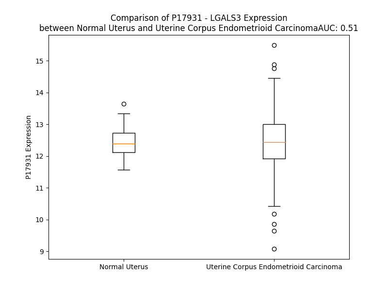

# Detailed Data for P17931

## Introduction to the Detailed Summary

### How to Interpret the Results

- **Summary & Metrics**: This section provides a quick reference to essential protein attributes, including expression changes, family classification, and biomarker applications. Regulation status (upregulated/downregulated) indicates the protein's behavior in a disease context. Some information comes from the original excel file with the proteins selected from literature, while others are derived from the analyses.
- **Expression Comparison**: A visual representation comparing protein expression between normal and disease states. It highlights significant changes in expression levels that might indicate diagnostic or therapeutic relevance. This is data coming from transcriptomics experiments and could not translate similarly to protein levels.
- **Isoform Alignment**: An interactive view of isoform alignments, revealing structural and functional differences between variants of the protein.
- **Interactors & Homologs**: Tables listing known interaction partners and homologous proteins, the more interactors and homologs, the more complex the protein is to design an antibody for.
- **Biological Assemblies**: Information about the structural arrangement of the protein in different assemblies, providing insights into its functional state but also the complexity of the protein to develop antibodies.
- **Combined Per-Residue Information**: A detailed table summarizing residue-level data. This includes predictions for epitope regions, aggregation tendencies, and modifications that might impact the protein's function. Each row corresponds to a residue in the protein, providing insights into specific sites that may be important for research or drug development.
## Summary & Metrics

- **UniProt Accession**: P17931
- **Gene Name**: LGALS3
- **Protein Name**: galectin 3
- **Swiss Prot**: LEG3_HUMAN
- **Family**: other
- **Biomarker Application**: diagnosis,unspecified application
- **Number of Isoforms**: 0
- **Regulation**: 2
- **(transcriptomics) AUC**: 0.51
- **(transcriptomics) Fold Change**: 1.00
- **(transcriptomics) Regulation**: Upregulated
- **Discotope Epitope Count**: 59
- **Max n_uniprots (Homo)**: 4
- **Max n_uniprots (Hetero)**: N/A

## Expression Comparison

## Interactors

| preferredName_A   | preferredName_B   |   score |
|:------------------|:------------------|--------:|
| LGALS3            | LGALS3BP          |   0.999 |
| LGALS3            | MUC1              |   0.995 |
| LGALS3            | CLEC7A            |   0.994 |
| LGALS3            | TRIM16            |   0.993 |
| LGALS3            | FCGR2B            |   0.992 |
| LGALS3            | LAG3              |   0.99  |
| LGALS3            | FN1               |   0.985 |
| LGALS3            | ELN               |   0.984 |
| LGALS3            | PTPRC             |   0.983 |
| LGALS3            | GP6               |   0.974 |
| LGALS3            | EGFR              |   0.964 |
| LGALS3            | KRAS              |   0.959 |
| LGALS3            | TLR2              |   0.948 |
| LGALS3            | MUC16             |   0.947 |
| LGALS3            | GEMIN4            |   0.945 |
| LGALS3            | TLR4              |   0.938 |
| LGALS3            | ITGB1             |   0.931 |
| LGALS3            | ANXA7             |   0.931 |
| LGALS3            | MERTK             |   0.918 |
| LGALS3            | BCL2              |   0.915 |
| LGALS3            | KDR               |   0.911 |
| LGALS3            | CD44              |   0.904 |

## Homologs

| uniprot_id   | gene_id   |
|:-------------|:----------|
| P47929       | LGALS7    |
| M0R281       | LGALS7    |
| A0A6Q8JG94   | LGALS12   |
| P09382       | LGALS1    |
| Q05315       | CLC       |
| P05162       | LGALS2    |
| M0R1B2       | LGALS4    |
| J3QKS2       | LGALS9C   |
| J3KS82       | LGALS9    |
| Q3B8N2       | LGALS9B   |
| A8MUM7       | LGALS16   |
| Q8TCE9       | LGALS14   |
| Q9UHV8       | LGALS13   |
| E9PN19       | LGALS8    |
| B9A055       | LGALSL    |
| A4D1Z8       | GRIFIN    |

## Biological Assemblies

|   Unnamed: 0 |   assembly |   n_uniprots | composition   | crystal_id   |
|-------------:|-----------:|-------------:|:--------------|:-------------|
|            0 |          1 |            1 | Homo          | 5nf9         |
|            0 |          1 |            1 | Homo          | 4rl7         |
|            0 |          1 |            1 | Homo          | 7rh0         |
|            0 |          1 |            1 | Homo          | 7rh4         |
|            0 |          1 |            1 | Homo          | 5h9r         |
|            0 |          1 |            1 | Homo          | 3ayc         |
|            1 |          2 |            1 | Homo          | 3ayc         |
|            0 |          1 |            1 | Homo          | 6kxa         |
|            0 |          1 |            1 | Homo          | 3t1m         |
|            0 |          1 |            1 | Homo          | 6h64         |
|            1 |          2 |            1 | Homo          | 6h64         |
|            2 |          3 |            1 | Homo          | 6h64         |
|            3 |          4 |            1 | Homo          | 6h64         |
|            4 |          5 |            1 | Homo          | 6h64         |
|            5 |          6 |            1 | Homo          | 6h64         |
|            0 |          1 |            1 | Homo          | 5oax         |
|            0 |          1 |            1 | Homo          | 4lbn         |
|            0 |          1 |            1 | Homo          | 4lbl         |
|            0 |          1 |            1 | Homo          | 6b8k         |
|            0 |          1 |            1 | Homo          | 3t1l         |
|            0 |          1 |            1 | Homo          | 6qlo         |
|            0 |          1 |            1 | Homo          | 6i77         |
|            0 |          1 |            1 | Homo          | 6zvf         |
|            0 |          1 |            1 | Homo          | 6rzl         |
|            0 |          1 |            1 | Homo          | 5nfa         |
|            0 |          1 |            1 | Homo          | 8itz         |
|            0 |          1 |            1 | Homo          | 6f6y         |
|            0 |          1 |            1 | Homo          | 7rgx         |
|            0 |          1 |            1 | Homo          | 2nmo         |
|            0 |          1 |            1 | Homo          | 2nn8         |
|            0 |          1 |            1 | Homo          | 2xg3         |
|            0 |          1 |            1 | Homo          | 4r9a         |
|            0 |          1 |            1 | Homo          | 3zsk         |
|            0 |          1 |            1 | Homo          | 6i78         |
|            0 |          1 |            1 | Homo          | 6q0q         |
|            0 |          1 |            1 | Homo          | 4bm8         |
|            0 |          1 |            1 | Homo          | 6qlq         |
|            0 |          1 |            1 | Homo          | 3aya         |
|            1 |          2 |            1 | Homo          | 3aya         |
|            0 |          1 |            1 | Homo          | 4xbn         |
|            0 |          1 |            1 | Homo          | 4lbo         |
|            0 |          1 |            1 | Homo          | 8oji         |
|            0 |          1 |            1 | Homo          | 5iuq         |
|            0 |          1 |            1 | Homo          | 4r9c         |
|            0 |          1 |            1 | Homo          | 6i75         |
|            0 |          1 |            1 | Homo          | 4jc1         |
|            0 |          1 |            1 | Homo          | 7rdp         |
|            0 |          1 |            1 | Homo          | 6qlu         |
|            0 |          1 |            1 | Homo          | 4lbj         |
|            0 |          1 |            1 | Homo          | 8bz3         |
|            0 |          1 |            1 | Homo          | 6eog         |
|            0 |          1 |            1 | Homo          | 4bli         |
|            0 |          1 |            2 | Homo          | 8itx         |
|            1 |          2 |            2 | Homo          | 8itx         |
|            0 |          1 |            1 | Homo          | 5exo         |
|            0 |          1 |            1 | Homo          | 6qln         |
|            0 |          1 |            1 | Homo          | 6q17         |
|            0 |          1 |            1 | Homo          | 6qlr         |
|            0 |          1 |            1 | Homo          | 6y78         |
|            0 |          1 |            1 | Homo          | 7zqx         |
|            0 |          1 |            1 | Homo          | 8pf9         |
|            0 |          1 |            1 | Homo          | 7rh1         |
|            0 |          1 |            1 | Homo          | 6qgf         |
|            0 |          1 |            1 | Homo          | 7cxa         |
|            1 |          2 |            1 | Homo          | 7cxa         |
|            0 |          1 |            1 | Homo          | 1kjl         |
|            0 |          1 |            1 | Homo          | 6f2q         |
|            0 |          1 |            1 | Homo          | 6rzi         |
|            0 |          1 |            1 | Homo          | 6eym         |
|            0 |          1 |            1 | Homo          | 6tf7         |
|            0 |          1 |            1 | Homo          | 7xfa         |
|            0 |          1 |            1 | Homo          | 8pbf         |
|            0 |          1 |            1 | Homo          | 6rhm         |
|            0 |          1 |            1 | Homo          | 7rgz         |
|            0 |          1 |            1 | Homo          | 6i76         |
|            0 |          1 |            1 | Homo          | 6rzf         |
|            0 |          1 |            1 | Homo          | 6y4c         |
|            0 |          1 |            1 | Homo          | 1kjr         |
|            0 |          1 |            1 | Homo          | 4lbk         |
|            0 |          1 |            1 | Homo          | 6exy         |
|            0 |          1 |            1 | Homo          | 7rh3         |
|            0 |          1 |            1 | Homo          | 6rzm         |
|            0 |          1 |            1 | Homo          | 6tf6         |
|            0 |          1 |            1 | Homo          | 2nmn         |
|            0 |          1 |            1 | Homo          | 4jck         |
|            0 |          1 |            1 | Homo          | 6i74         |
|            0 |          1 |            1 | Homo          | 5h9p         |
|            0 |          1 |            1 | Homo          | 6qlp         |
|            0 |          1 |            1 | Homo          | 4r9b         |
|            0 |          1 |            1 | Homo          | 8ojm         |
|            0 |          1 |            1 | Homo          | 3aye         |
|            1 |          2 |            1 | Homo          | 3aye         |
|            0 |          1 |            1 | Homo          | 5ody         |
|            0 |          1 |            1 | Homo          | 7df5         |
|            0 |          1 |            1 | Homo          | 5nfc         |
|            0 |          1 |            1 | Homo          | 6qlt         |
|            0 |          1 |            1 | Homo          | 8ojo         |
|            0 |          1 |            1 | Homo          | 6g0v         |
|            0 |          1 |            1 | Homo          | 7rgy         |
|            0 |          1 |            1 | Homo          | 4lbm         |
|            0 |          1 |            1 | Homo          | 5e89         |
|            0 |          1 |            1 | Homo          | 6eol         |
|            0 |          1 |            1 | Homo          | 5e8a         |
|            0 |          1 |            1 | Homo          | 5nfb         |
|            0 |          1 |            1 | Homo          | 4blj         |
|            0 |          1 |            1 | Homo          | 6kxb         |
|            0 |          1 |            1 | Homo          | 1a3k         |
|            0 |          1 |            4 | Homo          | 6fof         |
|            1 |          2 |            4 | Homo          | 6fof         |
|            2 |          3 |            4 | Homo          | 6fof         |
|            0 |          1 |            1 | Homo          | 8ojk         |
|            0 |          1 |            1 | Homo          | 8ppn         |
|            0 |          1 |            1 | Homo          | 5e88         |
|            0 |          1 |            1 | Homo          | 6qge         |
|            0 |          1 |            1 | Homo          | 6rzg         |
|            0 |          1 |            1 | Homo          | 3ayd         |
|            0 |          1 |            1 | Homo          | 6rhl         |
|            0 |          1 |            1 | Homo          | 6rzh         |
|            0 |          1 |            1 | Homo          | 3zsm         |
|            0 |          1 |            1 | Homo          | 6rzk         |
|            0 |          1 |            1 | Homo          | 7rdo         |
|            0 |          1 |            1 | Homo          | 3zsj         |
|            0 |          1 |            1 | Homo          | 6rzj         |
|            0 |          1 |            1 | Homo          | 7be3         |
|            0 |          1 |            1 | Homo          | 6qls         |
|            0 |          1 |            1 | Homo          | 3zsl         |
|            0 |          1 |            1 | Homo          | 6fk2         |
|            0 |          1 |            1 | Homo          | 8pff         |
|            0 |          1 |            1 | Homo          | 5nf7         |
|            0 |          1 |            1 | Homo          | 4r9d         |

## Combined Per-Residue Information

|   res | aa   |   epitope_score | epitope   |   relative_surface_accessibility |   modeling_confidence |   Aggregation | modification    |
|------:|:-----|----------------:|:----------|---------------------------------:|----------------------:|--------------:|:----------------|
|     1 | M    |         0.12187 | False     |                          1.27637 |                 37.25 |         0     | N/A             |
|     2 | A    |         0.17093 | False     |                          0.96672 |                 39.18 |         0     | N-acetylalanine |
|     3 | D    |         0.15301 | False     |                          0.87973 |                 44.67 |         0     | N/A             |
|     4 | N    |         0.16646 | False     |                          0.83599 |                 46.16 |         0     | N/A             |
|     5 | F    |         0.09467 | False     |                          0.25728 |                 48.28 |         0     | N/A             |
|     6 | S    |         0.14822 | False     |                          0.33663 |                 47.67 |         0     | Phosphoserine   |
|     7 | L    |         0.17713 | False     |                          0.54305 |                 49.65 |         0     | N/A             |
|     8 | H    |         0.16141 | False     |                          0.80628 |                 46.01 |         0     | N/A             |
|     9 | D    |         0.08986 | False     |                          0.59795 |                 53.57 |         0     | N/A             |
|    10 | A    |         0.08224 | False     |                          0.20269 |                 47.1  |         0     | N/A             |
|    11 | L    |         0.14964 | False     |                          0.65962 |                 45.33 |         0     | N/A             |
|    12 | S    |         0.15151 | False     |                          0.66238 |                 44.28 |         0     | Phosphoserine   |
|    13 | G    |         0.21075 | False     |                          0.64387 |                 40.43 |         0     | N/A             |
|    14 | S    |         0.2008  | False     |                          0.84824 |                 40.76 |         0     | N/A             |
|    15 | G    |         0.20888 | False     |                          0.82704 |                 37.22 |         0     | N/A             |
|    16 | N    |         0.17737 | False     |                          0.78205 |                 36.82 |         0     | N/A             |
|    17 | P    |         0.19133 | False     |                          0.80254 |                 37.04 |         0     | N/A             |
|    18 | N    |         0.17566 | False     |                          0.72549 |                 36.22 |         0     | N/A             |
|    19 | P    |         0.19151 | False     |                          0.78208 |                 38.61 |         0     | N/A             |
|    20 | Q    |         0.17834 | False     |                          0.50754 |                 38.78 |         0     | N/A             |
|    21 | G    |         0.18274 | False     |                          0.83582 |                 28.58 |         0     | N/A             |
|    22 | W    |         0.15296 | False     |                          0.91804 |                 35.36 |         0     | N/A             |
|    23 | P    |         0.19625 | False     |                          0.85721 |                 34.12 |         0     | N/A             |
|    24 | G    |         0.17198 | False     |                          0.75957 |                 32.04 |         0     | N/A             |
|    25 | A    |         0.19494 | False     |                          0.97671 |                 29.7  |         0     | N/A             |
|    26 | W    |         0.19751 | False     |                          1.11955 |                 31.01 |         0     | N/A             |
|    27 | G    |         0.21425 | False     |                          0.89443 |                 34.3  |         0     | N/A             |
|    28 | N    |         0.18533 | False     |                          0.99453 |                 35.15 |         0     | N/A             |
|    29 | Q    |         0.2105  | False     |                          0.85999 |                 35.5  |         0     | N/A             |
|    30 | P    |         0.17106 | False     |                          0.9567  |                 40.59 |         0     | N/A             |
|    31 | A    |         0.20028 | False     |                          0.94868 |                 37.83 |         0     | N/A             |
|    32 | G    |         0.29063 | True      |                          0.9864  |                 31.87 |         0     | N/A             |
|    33 | A    |         0.22996 | False     |                          0.9713  |                 37.32 |         0     | N/A             |
|    34 | G    |         0.30708 | True      |                          1.00009 |                 36.45 |         0     | N/A             |
|    35 | G    |         0.22441 | False     |                          0.79622 |                 36.29 |         0     | N/A             |
|    36 | Y    |         0.33949 | True      |                          0.99516 |                 41.76 |         0     | N/A             |
|    37 | P    |         0.19142 | False     |                          0.95694 |                 39.36 |         0     | N/A             |
|    38 | G    |         0.31591 | True      |                          0.8822  |                 40    |         0     | N/A             |
|    39 | A    |         0.21283 | False     |                          1.00378 |                 40.2  |         0     | N/A             |
|    40 | S    |         0.14209 | False     |                          0.67548 |                 36.1  |         0     | N/A             |
|    41 | Y    |         0.22199 | False     |                          0.94088 |                 42.58 |         0     | N/A             |
|    42 | P    |         0.14992 | False     |                          0.91332 |                 42.24 |         0     | N/A             |
|    43 | G    |         0.23402 | False     |                          0.92895 |                 42.15 |         0     | N/A             |
|    44 | A    |         0.18089 | False     |                          0.93777 |                 39.49 |         0     | N/A             |
|    45 | Y    |         0.30512 | True      |                          0.98969 |                 42.23 |         0     | N/A             |
|    46 | P    |         0.28282 | True      |                          0.92715 |                 40.59 |         0     | N/A             |
|    47 | G    |         0.23455 | False     |                          0.97684 |                 40.56 |         0     | N/A             |
|    48 | Q    |         0.21825 | False     |                          0.93593 |                 42.35 |         0     | N/A             |
|    49 | A    |         0.22837 | False     |                          0.83149 |                 47.18 |         0     | N/A             |
|    50 | P    |         0.2873  | True      |                          0.88245 |                 55.35 |         0     | N/A             |
|    51 | P    |         0.26856 | False     |                          0.98613 |                 56.14 |         0     | N/A             |
|    52 | G    |         0.26028 | False     |                          0.81306 |                 44.37 |         0     | N/A             |
|    53 | A    |         0.18224 | False     |                          0.97458 |                 39.69 |         0     | N/A             |
|    54 | Y    |         0.2445  | False     |                          0.97549 |                 47.19 |         0     | N/A             |
|    55 | P    |         0.1759  | False     |                          0.97642 |                 41.82 |         0     | N/A             |
|    56 | G    |         0.27814 | True      |                          0.90432 |                 45.07 |         0     | N/A             |
|    57 | Q    |         0.21459 | False     |                          0.92475 |                 44.7  |         0     | N/A             |
|    58 | A    |         0.13673 | False     |                          0.86888 |                 46.52 |         0     | N/A             |
|    59 | P    |         0.13473 | False     |                          0.90214 |                 57.55 |         0     | N/A             |
|    60 | P    |         0.11342 | False     |                          0.99322 |                 56.43 |         0     | N/A             |
|    61 | G    |         0.12203 | False     |                          0.72886 |                 44.27 |         0     | N/A             |
|    62 | A    |         0.1227  | False     |                          1.01287 |                 41.12 |         0     | N/A             |
|    63 | Y    |         0.17544 | False     |                          0.96979 |                 48.08 |         0     | N/A             |
|    64 | P    |         0.22649 | False     |                          0.96572 |                 41.26 |         0     | N/A             |
|    65 | G    |         0.29109 | True      |                          0.97368 |                 40.47 |         0     | N/A             |
|    66 | A    |         0.2894  | True      |                          0.93153 |                 45.43 |         0     | N/A             |
|    67 | P    |         0.1693  | False     |                          0.88062 |                 43.14 |         0     | N/A             |
|    68 | G    |         0.18015 | False     |                          1.0002  |                 39.97 |         0     | N/A             |
|    69 | A    |         0.18212 | False     |                          0.74656 |                 41.05 |         0     | N/A             |
|    70 | Y    |         0.27374 | True      |                          0.96671 |                 50.57 |         0     | N/A             |
|    71 | P    |         0.23471 | False     |                          1.01433 |                 39.37 |         0     | N/A             |
|    72 | G    |         0.27296 | True      |                          0.88908 |                 39.99 |         0     | N/A             |
|    73 | A    |         0.21241 | False     |                          0.94896 |                 52.1  |         0     | N/A             |
|    74 | P    |         0.2093  | False     |                          0.95989 |                 42.74 |         0     | N/A             |
|    75 | A    |         0.20354 | False     |                          0.83762 |                 45.35 |         0     | N/A             |
|    76 | P    |         0.2033  | False     |                          0.90468 |                 43.84 |         0     | N/A             |
|    77 | G    |         0.22355 | False     |                          0.87368 |                 40.59 |         0     | N/A             |
|    78 | V    |         0.14151 | False     |                          0.91402 |                 38.93 |         0     | N/A             |
|    79 | Y    |         0.30441 | True      |                          0.93257 |                 53.05 |         0     | N/A             |
|    80 | P    |         0.20189 | False     |                          0.89447 |                 44.65 |         0     | N/A             |
|    81 | G    |         0.26648 | False     |                          0.78823 |                 43.57 |         0     | N/A             |
|    82 | P    |         0.26311 | False     |                          0.95851 |                 60.8  |         0     | N/A             |
|    83 | P    |         0.20656 | False     |                          0.80459 |                 50.41 |         0     | N/A             |
|    84 | S    |         0.18089 | False     |                          0.89212 |                 46.16 |         0     | N/A             |
|    85 | G    |         0.29165 | True      |                          0.86697 |                 50.67 |         0     | N/A             |
|    86 | P    |         0.24383 | False     |                          1.06435 |                 45.1  |         0     | N/A             |
|    87 | G    |         0.33581 | True      |                          0.99457 |                 42.89 |         0     | N/A             |
|    88 | A    |         0.2255  | False     |                          0.70793 |                 36.9  |         0     | N/A             |
|    89 | Y    |         0.28931 | True      |                          0.93708 |                 48.63 |         0     | N/A             |
|    90 | P    |         0.20795 | False     |                          0.93819 |                 44.76 |         0     | N/A             |
|    91 | S    |         0.11894 | False     |                          0.8842  |                 40.85 |         0     | N/A             |
|    92 | S    |         0.3233  | True      |                          0.89192 |                 44.76 |         0     | N/A             |
|    93 | G    |         0.224   | False     |                          0.80419 |                 40.52 |         0     | N/A             |
|    94 | Q    |         0.2621  | False     |                          0.89548 |                 48.73 |         0     | N/A             |
|    95 | P    |         0.22866 | False     |                          0.79413 |                 43.22 |         0     | N/A             |
|    96 | S    |         0.13629 | False     |                          0.88684 |                 38.87 |         0     | N/A             |
|    97 | A    |         0.20587 | False     |                          1.00541 |                 40.56 |         0     | N/A             |
|    98 | T    |         0.24254 | False     |                          0.9912  |                 33.11 |         0     | N/A             |
|    99 | G    |         0.34524 | True      |                          0.8608  |                 35.32 |         0     | N/A             |
|   100 | A    |         0.24039 | False     |                          1.00278 |                 36.67 |         0     | N/A             |
|   101 | Y    |         0.25888 | False     |                          0.92638 |                 44.97 |         0     | N/A             |
|   102 | P    |         0.18048 | False     |                          0.92146 |                 45.74 |         0     | N/A             |
|   103 | A    |         0.19194 | False     |                          0.9989  |                 41.4  |         0     | N/A             |
|   104 | T    |         0.33482 | True      |                          0.92521 |                 40.56 |         0     | N/A             |
|   105 | G    |         0.36424 | True      |                          0.53509 |                 42.7  |         0     | N/A             |
|   106 | P    |         0.27577 | True      |                          1.00553 |                 37.18 |         0     | N/A             |
|   107 | Y    |         0.49565 | True      |                          0.90723 |                 48.94 |         0     | N/A             |
|   108 | G    |         0.34461 | True      |                          0.91624 |                 41.56 |         0     | N/A             |
|   109 | A    |         0.29497 | True      |                          0.80179 |                 52.11 |         0     | N/A             |
|   110 | P    |         0.28608 | True      |                          0.74707 |                 45.77 |         0     | N/A             |
|   111 | A    |         0.30895 | True      |                          1.13689 |                 56.87 |         0     | N/A             |
|   112 | G    |         0.25902 | False     |                          0.45529 |                 68.66 |         0     | N/A             |
|   113 | P    |         0.37162 | True      |                          0.79553 |                 79.66 |         0     | N/A             |
|   114 | L    |         0.06885 | False     |                          0.18713 |                 95.49 |         0     | N/A             |
|   115 | I    |         0.20579 | False     |                          0.84081 |                 97.46 |         0     | N/A             |
|   116 | V    |         0.15248 | False     |                          0.27846 |                 98.13 |         0     | N/A             |
|   117 | P    |         0.27338 | True      |                          0.82436 |                 98.27 |         0     | N/A             |
|   118 | Y    |         0.20007 | False     |                          0.25474 |                 98.39 |         0     | N/A             |
|   119 | N    |         0.28824 | True      |                          0.45247 |                 98.23 |         0     | N/A             |
|   120 | L    |         0.1004  | False     |                          0.09233 |                 98.32 |         0     | N/A             |
|   121 | P    |         0.21989 | False     |                          0.55301 |                 98.46 |         0     | N/A             |
|   122 | L    |         0.00405 | False     |                          0       |                 98.48 |         0     | N/A             |
|   123 | P    |         0.26392 | False     |                          0.75098 |                 97.4  |         0     | N/A             |
|   124 | G    |         0.18309 | False     |                          0.78844 |                 97.01 |         0     | N/A             |
|   125 | G    |         0.05738 | False     |                          0.05292 |                 98.47 |         0     | N/A             |
|   126 | V    |         0.01346 | False     |                          0.01689 |                 98.73 |         0     | N/A             |
|   127 | V    |         0.16841 | False     |                          0.52459 |                 98.53 |         0     | N/A             |
|   128 | P    |         0.11554 | False     |                          0.33946 |                 98.55 |         0     | N/A             |
|   129 | R    |         0.19165 | False     |                          0.60733 |                 98.36 |         0     | N/A             |
|   130 | M    |         0.04852 | False     |                          0.03739 |                 98.66 |        32.195 | N/A             |
|   131 | L    |         0.05434 | False     |                          0.06778 |                 98.76 |        57.018 | N/A             |
|   132 | I    |         0.00322 | False     |                          0.00059 |                 98.81 |        60.169 | N/A             |
|   133 | T    |         0.04589 | False     |                          0.20595 |                 98.72 |        60.365 | N/A             |
|   134 | I    |         0.00408 | False     |                          0.0024  |                 98.74 |        60.693 | N/A             |
|   135 | L    |         0.1533  | False     |                          0.39981 |                 98.52 |        56.821 | N/A             |
|   136 | G    |         0.05328 | False     |                          0.04568 |                 98.12 |        17.142 | N/A             |
|   137 | T    |         0.17794 | False     |                          0.34707 |                 98.58 |        12.735 | N/A             |
|   138 | V    |         0.01296 | False     |                          0.00381 |                 98.77 |        11.779 | N/A             |
|   139 | K    |         0.11553 | False     |                          0.37387 |                 98.54 |         0     | N/A             |
|   140 | P    |         0.2214  | False     |                          0.75438 |                 98.32 |         0     | N/A             |
|   141 | N    |         0.3328  | True      |                          0.92224 |                 97.56 |         0     | N/A             |
|   142 | A    |         0.12403 | False     |                          0.10354 |                 98.23 |         0     | N/A             |
|   143 | N    |         0.3113  | True      |                          0.55067 |                 98.48 |         0     | N/A             |
|   144 | R    |         0.33847 | True      |                          0.34152 |                 98.55 |         0     | N/A             |
|   145 | I    |         0.01046 | False     |                          0.0024  |                 98.82 |         0     | N/A             |
|   146 | A    |         0.00885 | False     |                          0       |                 98.89 |         0     | N/A             |
|   147 | L    |         0.00963 | False     |                          0.00577 |                 98.91 |         0     | N/A             |
|   148 | D    |         0.25871 | False     |                          0.15382 |                 98.91 |         0     | N/A             |
|   149 | F    |         0.0029  | False     |                          0       |                 98.87 |         0     | N/A             |
|   150 | Q    |         0.29087 | True      |                          0.19034 |                 98.83 |         0     | N/A             |
|   151 | R    |         0.43117 | True      |                          0.27709 |                 98.38 |         0     | N/A             |
|   152 | G    |         0.16363 | False     |                          0.58656 |                 96.7  |         0     | N/A             |
|   153 | N    |         0.44522 | True      |                          0.85771 |                 97.52 |         0     | N/A             |
|   154 | D    |         0.10632 | False     |                          0.10429 |                 98.61 |         0     | N/A             |
|   155 | V    |         0.23197 | False     |                          0.09616 |                 98.86 |         0.243 | N/A             |
|   156 | A    |         0.0224  | False     |                          0.02401 |                 98.86 |         0.243 | N/A             |
|   157 | F    |         0.00345 | False     |                          0       |                 98.92 |         0.243 | N/A             |
|   158 | H    |         0.20247 | False     |                          0.08629 |                 98.92 |         0.243 | N/A             |
|   159 | F    |         0.01028 | False     |                          0.00317 |                 98.91 |         0.243 | N/A             |
|   160 | N    |         0.17547 | False     |                          0.03002 |                 98.87 |         0     | N/A             |
|   161 | P    |         0.00566 | False     |                          0       |                 98.83 |         0     | N/A             |
|   162 | R    |         0.4252  | True      |                          0.24694 |                 98.77 |         0     | N/A             |
|   163 | F    |         0.08819 | False     |                          0.11372 |                 98.49 |         0     | N/A             |
|   164 | N    |         0.41053 | True      |                          0.57249 |                 97.56 |         0     | N/A             |
|   165 | E    |         0.42533 | True      |                          0.2437  |                 97.43 |         0     | N/A             |
|   166 | N    |         0.45675 | True      |                          0.86824 |                 97.17 |         0     | N/A             |
|   167 | N    |         0.46415 | True      |                          0.88192 |                 96.46 |         0     | N/A             |
|   168 | R    |         0.50273 | True      |                          0.74153 |                 97.58 |         0     | N/A             |
|   169 | R    |         0.30195 | True      |                          0.37749 |                 98.54 |         0     | N/A             |
|   170 | V    |         0.26888 | False     |                          0.10949 |                 98.74 |         0     | N/A             |
|   171 | I    |         0.00655 | False     |                          0.00059 |                 98.87 |         0     | N/A             |
|   172 | V    |         0.07611 | False     |                          0.00762 |                 98.83 |         0     | N/A             |
|   173 | C    |         0.04866 | False     |                          0.02558 |                 98.88 |         0     | N/A             |
|   174 | N    |         0.21833 | False     |                          0.03104 |                 98.79 |         0     | N/A             |
|   175 | T    |         0.04061 | False     |                          0.02513 |                 98.9  |         0     | N/A             |
|   176 | K    |         0.39531 | True      |                          0.17956 |                 98.84 |         0     | N/A             |
|   177 | L    |         0.2496  | False     |                          0.48456 |                 98.51 |         0     | N/A             |
|   178 | D    |         0.29124 | True      |                          0.76966 |                 97.59 |         0     | N/A             |
|   179 | N    |         0.39457 | True      |                          0.738   |                 97.3  |         0     | N/A             |
|   180 | N    |         0.27503 | True      |                          0.66326 |                 98.52 |         0     | N/A             |
|   181 | W    |         0.53469 | True      |                          0.55142 |                 98.73 |         0     | N/A             |
|   182 | G    |         0.21155 | False     |                          0.48705 |                 98.55 |         0     | N/A             |
|   183 | R    |         0.27026 | True      |                          0.77804 |                 98.49 |         0     | N/A             |
|   184 | E    |         0.39745 | True      |                          0.36056 |                 98.74 |         0     | N/A             |
|   185 | E    |         0.183   | False     |                          0.29576 |                 98.7  |         0     | N/A             |
|   186 | R    |         0.43608 | True      |                          0.49273 |                 98.65 |         0     | N/A             |
|   187 | Q    |         0.20545 | False     |                          0.23062 |                 97.4  |         0     | N/A             |
|   188 | S    |         0.41956 | True      |                          0.72256 |                 97.8  |         0     | Phosphoserine   |
|   189 | V    |         0.17123 | False     |                          0.61191 |                 98.31 |         0     | N/A             |
|   190 | F    |         0.16542 | False     |                          0.09656 |                 98.59 |         0     | N/A             |
|   191 | P    |         0.21582 | False     |                          0.32037 |                 98.5  |         0     | N/A             |
|   192 | F    |         0.01006 | False     |                          0.00686 |                 98.69 |         0     | N/A             |
|   193 | E    |         0.14625 | False     |                          0.32206 |                 98.58 |         0     | N/A             |
|   194 | S    |         0.20869 | False     |                          0.39715 |                 98.42 |         0     | N/A             |
|   195 | G    |         0.23722 | False     |                          0.49336 |                 98.42 |         0     | N/A             |
|   196 | K    |         0.25236 | False     |                          0.57766 |                 98.56 |         0     | N/A             |
|   197 | P    |         0.25085 | False     |                          0.76014 |                 98.6  |         0     | N/A             |
|   198 | F    |         0.09965 | False     |                          0.04846 |                 98.75 |         0     | N/A             |
|   199 | K    |         0.07563 | False     |                          0.24328 |                 98.74 |         0     | N/A             |
|   200 | I    |         0.00816 | False     |                          0.00299 |                 98.86 |        34.796 | N/A             |
|   201 | Q    |         0.08181 | False     |                          0.04115 |                 98.81 |        34.796 | N/A             |
|   202 | V    |         0.00964 | False     |                          0.00381 |                 98.86 |        34.796 | N/A             |
|   203 | L    |         0.09871 | False     |                          0.12637 |                 98.8  |        34.796 | N/A             |
|   204 | V    |         0.0041  | False     |                          0.00211 |                 98.82 |        34.796 | N/A             |
|   205 | E    |         0.17066 | False     |                          0.20985 |                 98.64 |         0     | N/A             |
|   206 | P    |         0.23834 | False     |                          0.72257 |                 98.39 |         0     | N/A             |
|   207 | D    |         0.19785 | False     |                          0.63349 |                 98.46 |         0     | N/A             |
|   208 | H    |         0.2005  | False     |                          0.11157 |                 98.79 |         0     | N/A             |
|   209 | F    |         0.01366 | False     |                          0.01083 |                 98.88 |         0     | N/A             |
|   210 | K    |         0.11898 | False     |                          0.15885 |                 98.78 |         0     | N/A             |
|   211 | V    |         0.00528 | False     |                          0.00095 |                 98.85 |         0     | N/A             |
|   212 | A    |         0.10571 | False     |                          0.1164  |                 98.74 |         0     | N/A             |
|   213 | V    |         0.02728 | False     |                          0.0113  |                 98.72 |         0     | N/A             |
|   214 | N    |         0.1326  | False     |                          0.45192 |                 98.23 |         0     | N/A             |
|   215 | D    |         0.17152 | False     |                          0.43483 |                 97.6  |         0     | N/A             |
|   216 | A    |         0.17954 | False     |                          0.5865  |                 98    |         0     | N/A             |
|   217 | H    |         0.27031 | True      |                          0.5814  |                 98.18 |         0     | N/A             |
|   218 | L    |         0.08723 | False     |                          0.07308 |                 98.47 |         0     | N/A             |
|   219 | L    |         0.08687 | False     |                          0.122   |                 98.74 |         0     | N/A             |
|   220 | Q    |         0.21658 | False     |                          0.49489 |                 98.78 |         0     | N/A             |
|   221 | Y    |         0.01946 | False     |                          0.00457 |                 98.86 |         0     | N/A             |
|   222 | N    |         0.18078 | False     |                          0.62881 |                 98.76 |         0     | N/A             |
|   223 | H    |         0.13548 | False     |                          0.04668 |                 98.71 |         0     | N/A             |
|   224 | R    |         0.23327 | False     |                          0.30148 |                 98.64 |         0     | N/A             |
|   225 | V    |         0.1921  | False     |                          0.07718 |                 98.51 |         0     | N/A             |
|   226 | K    |         0.43295 | True      |                          0.77864 |                 98.29 |         0     | N/A             |
|   227 | K    |         0.34521 | True      |                          0.55059 |                 98.34 |         0     | N/A             |
|   228 | L    |         0.15403 | False     |                          0.14182 |                 98.64 |         0     | N/A             |
|   229 | N    |         0.32237 | True      |                          0.65233 |                 98.33 |         0     | N/A             |
|   230 | E    |         0.22915 | False     |                          0.3251  |                 98.64 |         0     | N/A             |
|   231 | I    |         0.01071 | False     |                          0.0024  |                 98.74 |         0     | N/A             |
|   232 | S    |         0.16643 | False     |                          0.35238 |                 98.38 |         0     | N/A             |
|   233 | K    |         0.27209 | True      |                          0.32256 |                 98.64 |         0     | N/A             |
|   234 | L    |         0.00658 | False     |                          0       |                 98.83 |         0     | N/A             |
|   235 | G    |         0.27665 | True      |                          0.13308 |                 98.74 |         0     | N/A             |
|   236 | I    |         0.0168  | False     |                          0.00297 |                 98.82 |         0     | N/A             |
|   237 | S    |         0.36811 | True      |                          0.18409 |                 98.8  |         0     | N/A             |
|   238 | G    |         0.07557 | False     |                          0.2705  |                 98.52 |         0     | N/A             |
|   239 | D    |         0.17578 | False     |                          0.26579 |                 98.68 |         0     | N/A             |
|   240 | I    |         0.02473 | False     |                          0.004   |                 98.65 |         0     | N/A             |
|   241 | D    |         0.17479 | False     |                          0.42496 |                 98.18 |         0     | N/A             |
|   242 | L    |         0.01086 | False     |                          0.0054  |                 98.43 |         0     | N/A             |
|   243 | T    |         0.23876 | False     |                          0.66339 |                 97.61 |         0     | N/A             |
|   244 | S    |         0.12997 | False     |                          0.29657 |                 97.48 |         0     | N/A             |
|   245 | A    |         0.11312 | False     |                          0.11609 |                 98.29 |         0     | N/A             |
|   246 | S    |         0.27236 | True      |                          0.45232 |                 98.11 |         0     | N/A             |
|   247 | Y    |         0.16043 | False     |                          0.41958 |                 98.38 |         0     | N/A             |
|   248 | T    |         0.1469  | False     |                          0.4956  |                 98.11 |         0     | N/A             |
|   249 | M    |         0.09799 | False     |                          0.54677 |                 98.01 |         0     | N/A             |
|   250 | I    |         0.05926 | False     |                          0.37553 |                 94.95 |         0     | N/A             |

