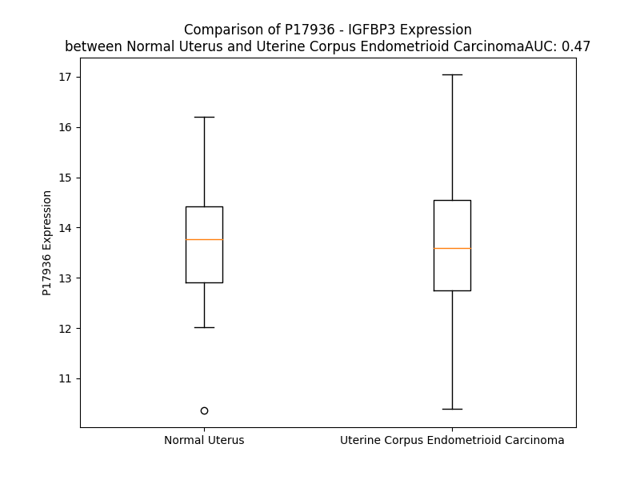

# Detailed Data for P17936

## Introduction to the Detailed Summary

### How to Interpret the Results

- **Summary & Metrics**: This section provides a quick reference to essential protein attributes, including expression changes, family classification, and biomarker applications. Regulation status (upregulated/downregulated) indicates the protein's behavior in a disease context. Some information comes from the original excel file with the proteins selected from literature, while others are derived from the analyses.
- **Expression Comparison**: A visual representation comparing protein expression between normal and disease states. It highlights significant changes in expression levels that might indicate diagnostic or therapeutic relevance. This is data coming from transcriptomics experiments and could not translate similarly to protein levels.
- **Isoform Alignment**: An interactive view of isoform alignments, revealing structural and functional differences between variants of the protein.
- **Interactors & Homologs**: Tables listing known interaction partners and homologous proteins, the more interactors and homologs, the more complex the protein is to design an antibody for.
- **Biological Assemblies**: Information about the structural arrangement of the protein in different assemblies, providing insights into its functional state but also the complexity of the protein to develop antibodies.
- **Combined Per-Residue Information**: A detailed table summarizing residue-level data. This includes predictions for epitope regions, aggregation tendencies, and modifications that might impact the protein's function. Each row corresponds to a residue in the protein, providing insights into specific sites that may be important for research or drug development.
## Summary & Metrics

- **UniProt Accession**: P17936
- **Gene Name**: uniprot_accession
P17936     IGFBP3
P17936    IGFBP-3
Name: gene_name, dtype: object
- **Protein Name**: uniprot_accession
P17936    Insulin-like growth factor-binding protein 3
P17936    Insulin-like growth factor-binding protein 3
Name: protein_name, dtype: object
- **Swiss Prot**: uniprot_accession
P17936    IBP3_HUMAN
P17936    IBP3_HUMAN
Name: swiss_prot, dtype: object
- **Family**: uniprot_accession
P17936    other
P17936      NaN
Name: family, dtype: object
- **Biomarker Application**: uniprot_accession
P17936    diagnosis,disease progression,efficacy,prognos...
P17936                                                  NaN
Name: biomarker_application, dtype: object
- **Number of Isoforms**: 2
- **Regulation**: uniprot_accession
P17936   -1
P17936   -1
Name: up_down_regulated, dtype: int64
- **(transcriptomics) AUC**: 0.47
- **(transcriptomics) Fold Change**: 1.01
- **(transcriptomics) Regulation**: Downregulated
- **Discotope Epitope Count**: 33
- **Max n_uniprots (Homo)**: N/A
- **Max n_uniprots (Hetero)**: 3

## Expression Comparison

## Isoform Alignment

<pre style='font-size:14px; font-family:monospace;'>P17936-1 MQRARPTLWAAALTLLVLLRGPPVARAGASSAGLGPVVRCEPCDARALAQCAPPPAVCAELVREPGCGCCLTCALSEGQPCGIYTERCGSGLRCQPSPDEARPLQALLDGRGLCVNASAVSRLRAYLLPAPPA------PGNASESEEDRSAGSVESPSVSSTHRVSDPKFHPLHSKIIIIKKGHAKDSQRYKVDYESQSTDTQNFSSESKRETEYGPCRREMEDTLNHLKFLNVLSPRGVHIPNCDKKGFYKKKQCRPSKGRKRGFCWCVDKYGQPLPGYTTKGKEDVHCYSMQSK
P17936-2 MQRARPTLWAAALTLLVLLRGPPVARAGASSAGLGPVVRCEPCDARALAQCAPPPAVCAELVREPGCGCCLTCALSEGQPCGIYTERCGSGLRCQPSPDEARPLQALLDGRGLCVNASAVSRLRAYLLPAPPAPGEPPAPGNASESEEDRSAGSVESPSVSSTHRVSDPKFHPLHSKIIIIKKGHAKDSQRYKVDYESQSTDTQNFSSESKRETEYGPCRREMEDTLNHLKFLNVLSPRGVHIPNCDKKGFYKKKQCRPSKGRKRGFCWCVDKYGQPLPGYTTKGKEDVHCYSMQSK
</pre>

## Interactors

| preferredName_A   | preferredName_B   |   score |
|:------------------|:------------------|--------:|
| IGFBP3            | IGFALS            |   0.999 |
| IGFBP3            | IGF2              |   0.999 |
| IGFBP3            | IGF1              |   0.999 |
| IGFBP3            | INS               |   0.995 |
| IGFBP3            | EGFR              |   0.981 |
| IGFBP3            | IGFBP5            |   0.978 |
| IGFBP3            | TMEM219           |   0.974 |
| IGFBP3            | FN1               |   0.967 |
| IGFBP3            | IGF1R             |   0.96  |
| IGFBP3            | RXRA              |   0.931 |
| IGFBP3            | TP53              |   0.901 |

## Homologs

| uniprot_id   | gene_id   |
|:-------------|:----------|
| P22692       | IGFBP4    |
| C9J6H2       | IGFBP1    |
| P24593       | IGFBP5    |
| H7C1H0       | IGFBP2    |
| F8VYK9       | IGFBP6    |

## Biological Assemblies

|   Unnamed: 0 |   assembly |   n_uniprots | composition   | crystal_id   |
|-------------:|-----------:|-------------:|:--------------|:-------------|
|            0 |          1 |            3 | Hetero        | 7wrq         |

## Combined Per-Residue Information

|   res | aa   |   epitope_score | epitope   |   relative_surface_accessibility |   modeling_confidence |   Aggregation | modification             | glycosylation                             |
|------:|:-----|----------------:|:----------|---------------------------------:|----------------------:|--------------:|:-------------------------|:------------------------------------------|
|     1 | M    |         0.12626 | False     |                          1.291   |                 41.09 |         0     | N/A                      | N/A                                       |
|     2 | Q    |         0.17056 | False     |                          0.96446 |                 44.16 |         0     | N/A                      | N/A                                       |
|     3 | R    |         0.17877 | False     |                          0.96024 |                 40.59 |         0     | N/A                      | N/A                                       |
|     4 | A    |         0.11136 | False     |                          0.85278 |                 52.53 |         0     | N/A                      | N/A                                       |
|     5 | R    |         0.1553  | False     |                          0.82064 |                 59.72 |         0     | N/A                      | N/A                                       |
|     6 | P    |         0.15846 | False     |                          0.80835 |                 56.06 |         0.159 | N/A                      | N/A                                       |
|     7 | T    |         0.15861 | False     |                          0.77849 |                 56.7  |        13.149 | N/A                      | N/A                                       |
|     8 | L    |         0.12135 | False     |                          0.92044 |                 56    |        72.857 | N/A                      | N/A                                       |
|     9 | W    |         0.11951 | False     |                          0.84904 |                 55.99 |        83.789 | N/A                      | N/A                                       |
|    10 | A    |         0.09097 | False     |                          0.6667  |                 56.7  |        86.432 | N/A                      | N/A                                       |
|    11 | A    |         0.1149  | False     |                          0.71303 |                 56.72 |        89.558 | N/A                      | N/A                                       |
|    12 | A    |         0.08961 | False     |                          0.61144 |                 56.38 |        93.249 | N/A                      | N/A                                       |
|    13 | L    |         0.13909 | False     |                          0.7159  |                 57.24 |        97.583 | N/A                      | N/A                                       |
|    14 | T    |         0.10606 | False     |                          0.65074 |                 55.83 |        98.292 | N/A                      | N/A                                       |
|    15 | L    |         0.12654 | False     |                          0.86413 |                 52.99 |        99.322 | N/A                      | N/A                                       |
|    16 | L    |         0.14785 | False     |                          0.7978  |                 54.66 |        99.223 | N/A                      | N/A                                       |
|    17 | V    |         0.18657 | False     |                          0.74204 |                 56.29 |        98.658 | N/A                      | N/A                                       |
|    18 | L    |         0.17079 | False     |                          0.86723 |                 51.49 |        91.689 | N/A                      | N/A                                       |
|    19 | L    |         0.12053 | False     |                          0.96678 |                 51.09 |        77.661 | N/A                      | N/A                                       |
|    20 | R    |         0.15866 | False     |                          0.81902 |                 49.17 |         0     | N/A                      | N/A                                       |
|    21 | G    |         0.18135 | False     |                          0.78949 |                 47.27 |         0     | N/A                      | N/A                                       |
|    22 | P    |         0.17386 | False     |                          0.86931 |                 54.48 |         0     | N/A                      | N/A                                       |
|    23 | P    |         0.12222 | False     |                          0.91944 |                 52.17 |         0     | N/A                      | N/A                                       |
|    24 | V    |         0.1129  | False     |                          0.97572 |                 55.6  |         0     | N/A                      | N/A                                       |
|    25 | A    |         0.15562 | False     |                          0.91443 |                 54.41 |         0     | N/A                      | N/A                                       |
|    26 | R    |         0.16832 | False     |                          0.91772 |                 47.94 |         0     | N/A                      | N/A                                       |
|    27 | A    |         0.11842 | False     |                          0.97041 |                 49.97 |         0     | N/A                      | N/A                                       |
|    28 | G    |         0.14402 | False     |                          0.81178 |                 44.28 |         0     | N/A                      | N/A                                       |
|    29 | A    |         0.11272 | False     |                          0.9614  |                 49.6  |         0     | N/A                      | N/A                                       |
|    30 | S    |         0.12872 | False     |                          0.826   |                 46.07 |         0     | N/A                      | N/A                                       |
|    31 | S    |         0.1607  | False     |                          0.81542 |                 48.59 |         0     | N/A                      | N/A                                       |
|    32 | A    |         0.14618 | False     |                          0.99897 |                 52.91 |         0     | N/A                      | N/A                                       |
|    33 | G    |         0.15324 | False     |                          0.69276 |                 55.14 |         0     | N/A                      | N/A                                       |
|    34 | L    |         0.17298 | False     |                          1.13383 |                 63.63 |         0     | N/A                      | N/A                                       |
|    35 | G    |         0.17411 | False     |                          0.52062 |                 62.67 |         0     | N/A                      | N/A                                       |
|    36 | P    |         0.20237 | False     |                          0.78307 |                 66.01 |         0     | N/A                      | N/A                                       |
|    37 | V    |         0.15991 | False     |                          1.06469 |                 75.1  |         0     | N/A                      | N/A                                       |
|    38 | V    |         0.21131 | False     |                          0.69585 |                 74.57 |         0     | N/A                      | N/A                                       |
|    39 | R    |         0.27378 | True      |                          0.70163 |                 79.2  |         0     | N/A                      | N/A                                       |
|    40 | C    |         0.26221 | True      |                          0.45331 |                 84.25 |         0     | N/A                      | N/A                                       |
|    41 | E    |         0.16195 | False     |                          0.42061 |                 86.75 |         0     | N/A                      | N/A                                       |
|    42 | P    |         0.20088 | False     |                          0.77758 |                 89.42 |         0     | N/A                      | N/A                                       |
|    43 | C    |         0.18198 | False     |                          0.36286 |                 92.23 |         0     | N/A                      | N/A                                       |
|    44 | D    |         0.1615  | False     |                          0.43105 |                 92.91 |         0     | N/A                      | N/A                                       |
|    45 | A    |         0.17351 | False     |                          0.79622 |                 93.87 |         0     | N/A                      | N/A                                       |
|    46 | R    |         0.2129  | False     |                          0.75647 |                 92.24 |         0     | N/A                      | N/A                                       |
|    47 | A    |         0.13961 | False     |                          0.1048  |                 88.86 |         0     | N/A                      | N/A                                       |
|    48 | L    |         0.22398 | False     |                          0.55383 |                 93.22 |         0     | N/A                      | N/A                                       |
|    49 | A    |         0.23194 | True      |                          0.83718 |                 93.11 |         0     | N/A                      | N/A                                       |
|    50 | Q    |         0.2313  | True      |                          0.7046  |                 91.55 |         0     | N/A                      | N/A                                       |
|    51 | C    |         0.16578 | False     |                          0.26383 |                 93.93 |         0     | N/A                      | N/A                                       |
|    52 | A    |         0.20556 | False     |                          0.72496 |                 92.22 |         0     | N/A                      | N/A                                       |
|    53 | P    |         0.22675 | False     |                          0.88039 |                 90.29 |         0     | N/A                      | N/A                                       |
|    54 | P    |         0.17267 | False     |                          0.32394 |                 88.61 |         0     | N/A                      | N/A                                       |
|    55 | P    |         0.233   | True      |                          0.60912 |                 88.6  |         0     | N/A                      | N/A                                       |
|    56 | A    |         0.19963 | False     |                          1.05666 |                 87.14 |         0     | N/A                      | N/A                                       |
|    57 | V    |         0.17738 | False     |                          1.02026 |                 90.69 |         0     | N/A                      | N/A                                       |
|    58 | C    |         0.09276 | False     |                          0.27598 |                 92.23 |         0     | N/A                      | N/A                                       |
|    59 | A    |         0.10776 | False     |                          1.10419 |                 92.24 |         0     | N/A                      | N/A                                       |
|    60 | E    |         0.17991 | False     |                          0.29085 |                 95.81 |         0     | N/A                      | N/A                                       |
|    61 | L    |         0.19502 | False     |                          0.51934 |                 95.31 |         0     | N/A                      | N/A                                       |
|    62 | V    |         0.07494 | False     |                          0.14757 |                 95.54 |         0     | N/A                      | N/A                                       |
|    63 | R    |         0.26226 | True      |                          0.45169 |                 93.01 |         0     | N/A                      | N/A                                       |
|    64 | E    |         0.15482 | False     |                          0.2681  |                 93.33 |         0     | N/A                      | N/A                                       |
|    65 | P    |         0.13888 | False     |                          0.25101 |                 91.65 |         0     | N/A                      | N/A                                       |
|    66 | G    |         0.16555 | False     |                          0.6087  |                 88.96 |         0     | N/A                      | N/A                                       |
|    67 | C    |         0.1646  | False     |                          0.15971 |                 88.7  |         0     | N/A                      | N/A                                       |
|    68 | G    |         0.11433 | False     |                          0.08709 |                 90.34 |         0     | N/A                      | N/A                                       |
|    69 | C    |         0.10478 | False     |                          0.06105 |                 92.04 |         0     | N/A                      | N/A                                       |
|    70 | C    |         0.13345 | False     |                          0.20935 |                 93.7  |         0     | N/A                      | N/A                                       |
|    71 | L    |         0.16633 | False     |                          0.54271 |                 94.05 |         0     | N/A                      | N/A                                       |
|    72 | T    |         0.10228 | False     |                          0.17899 |                 94.2  |         0     | N/A                      | N/A                                       |
|    73 | C    |         0.06311 | False     |                          0.21809 |                 95.67 |         0     | N/A                      | N/A                                       |
|    74 | A    |         0.07562 | False     |                          0.18965 |                 96.59 |         0     | N/A                      | N/A                                       |
|    75 | L    |         0.12372 | False     |                          0.21074 |                 96.86 |         0     | N/A                      | N/A                                       |
|    76 | S    |         0.1006  | False     |                          0.52878 |                 96.36 |         0     | N/A                      | N/A                                       |
|    77 | E    |         0.12958 | False     |                          0.59569 |                 96.35 |         0     | N/A                      | N/A                                       |
|    78 | G    |         0.11065 | False     |                          0.52878 |                 95.86 |         0     | N/A                      | N/A                                       |
|    79 | Q    |         0.10564 | False     |                          0.41172 |                 97.38 |         0     | N/A                      | N/A                                       |
|    80 | P    |         0.1923  | False     |                          0.57358 |                 97.92 |         0     | N/A                      | N/A                                       |
|    81 | C    |         0.00823 | False     |                          0.002   |                 97.71 |         0     | N/A                      | N/A                                       |
|    82 | G    |         0.07565 | False     |                          0.14374 |                 96.46 |         0     | N/A                      | N/A                                       |
|    83 | I    |         0.23279 | True      |                          0.48322 |                 93.85 |         0     | N/A                      | N/A                                       |
|    84 | Y    |         0.1051  | False     |                          0.46566 |                 92.11 |         0     | N/A                      | N/A                                       |
|    85 | T    |         0.19238 | False     |                          0.29456 |                 94.78 |         0     | N/A                      | N/A                                       |
|    86 | E    |         0.08928 | False     |                          0.30968 |                 94.83 |         0     | N/A                      | N/A                                       |
|    87 | R    |         0.09893 | False     |                          0.38492 |                 96.3  |         0     | N/A                      | N/A                                       |
|    88 | C    |         0.08385 | False     |                          0.11529 |                 97.12 |         0     | N/A                      | N/A                                       |
|    89 | G    |         0.09956 | False     |                          0.09394 |                 96.12 |         0     | N/A                      | N/A                                       |
|    90 | S    |         0.21328 | False     |                          0.73461 |                 94.98 |         0     | N/A                      | N/A                                       |
|    91 | G    |         0.12772 | False     |                          0.65145 |                 95.2  |         0     | N/A                      | N/A                                       |
|    92 | L    |         0.10289 | False     |                          0.2461  |                 96.69 |         0     | N/A                      | N/A                                       |
|    93 | R    |         0.19886 | False     |                          0.51131 |                 95.87 |         0     | N/A                      | N/A                                       |
|    94 | C    |         0.04794 | False     |                          0.2298  |                 96.78 |         0     | N/A                      | N/A                                       |
|    95 | Q    |         0.1559  | False     |                          0.23539 |                 95.85 |         0     | N/A                      | N/A                                       |
|    96 | P    |         0.1462  | False     |                          0.18499 |                 95.72 |         0     | N/A                      | N/A                                       |
|    97 | S    |         0.12195 | False     |                          0.37092 |                 93.02 |         0     | N/A                      | N/A                                       |
|    98 | P    |         0.24912 | True      |                          0.98916 |                 88.95 |         0     | N/A                      | N/A                                       |
|    99 | D    |         0.24753 | True      |                          0.83373 |                 91.39 |         0     | N/A                      | N/A                                       |
|   100 | E    |         0.16739 | False     |                          0.25913 |                 92.04 |         0     | N/A                      | N/A                                       |
|   101 | A    |         0.25492 | True      |                          0.96179 |                 94.32 |         0     | N/A                      | N/A                                       |
|   102 | R    |         0.48541 | True      |                          0.61262 |                 96.58 |         0     | N/A                      | N/A                                       |
|   103 | P    |         0.24799 | True      |                          0.43143 |                 95.52 |         0     | N/A                      | N/A                                       |
|   104 | L    |         0.20287 | False     |                          0.82954 |                 95.9  |         0.893 | N/A                      | N/A                                       |
|   105 | Q    |         0.22321 | False     |                          0.29846 |                 95.29 |         0.893 | N/A                      | N/A                                       |
|   106 | A    |         0.02388 | False     |                          0.0051  |                 95.9  |         0.893 | N/A                      | N/A                                       |
|   107 | L    |         0.18637 | False     |                          0.16218 |                 96.5  |         0.893 | N/A                      | N/A                                       |
|   108 | L    |         0.25429 | True      |                          0.46881 |                 94.35 |         0.893 | N/A                      | N/A                                       |
|   109 | D    |         0.1657  | False     |                          0.45939 |                 94.16 |         0     | N/A                      | N/A                                       |
|   110 | G    |         0.05335 | False     |                          0.17044 |                 96.25 |         0     | N/A                      | N/A                                       |
|   111 | R    |         0.17747 | False     |                          0.46093 |                 96.44 |         0     | N/A                      | N/A                                       |
|   112 | G    |         0.00598 | False     |                          0       |                 96.84 |         0     | N/A                      | N/A                                       |
|   113 | L    |         0.12929 | False     |                          0.47235 |                 97.29 |         0     | N/A                      | N/A                                       |
|   114 | C    |         0.00883 | False     |                          0       |                 97.4  |         0     | N/A                      | N/A                                       |
|   115 | V    |         0.08158 | False     |                          0.33037 |                 96.37 |         0     | N/A                      | N/A                                       |
|   116 | N    |         0.10591 | False     |                          0.42757 |                 95.3  |         0     | N/A                      | N-linked (GlcNAc...) (complex) asparagine |
|   117 | A    |         0.21581 | False     |                          0.33603 |                 90.31 |         0     | N/A                      | N/A                                       |
|   118 | S    |         0.22497 | False     |                          0.51465 |                 85.75 |         0     | N/A                      | N/A                                       |
|   119 | A    |         0.22639 | False     |                          0.50124 |                 74.77 |         0     | N/A                      | N/A                                       |
|   120 | V    |         0.19946 | False     |                          0.18516 |                 68.45 |         0     | N/A                      | N/A                                       |
|   121 | S    |         0.372   | True      |                          0.57887 |                 65.65 |         0     | N/A                      | N/A                                       |
|   122 | R    |         0.18438 | False     |                          0.70684 |                 59.29 |         0     | N/A                      | N/A                                       |
|   123 | L    |         0.4378  | True      |                          0.7117  |                 55.07 |         0     | N/A                      | N/A                                       |
|   124 | R    |         0.36669 | True      |                          0.62729 |                 58.44 |         0     | N/A                      | N/A                                       |
|   125 | A    |         0.12522 | False     |                          0.71059 |                 51.99 |         0     | N/A                      | N/A                                       |
|   126 | Y    |         0.28228 | True      |                          0.84926 |                 51.01 |         0     | N/A                      | N/A                                       |
|   127 | L    |         0.20901 | False     |                          0.85562 |                 47.77 |         0     | N/A                      | N/A                                       |
|   128 | L    |         0.24336 | True      |                          0.64579 |                 42.34 |         0     | N/A                      | N/A                                       |
|   129 | P    |         0.23827 | True      |                          0.86399 |                 39.8  |         0     | N/A                      | N/A                                       |
|   130 | A    |         0.13752 | False     |                          0.79253 |                 41.29 |         0     | N/A                      | N/A                                       |
|   131 | P    |         0.21442 | False     |                          0.86835 |                 38.68 |         0     | N/A                      | N/A                                       |
|   132 | P    |         0.22883 | False     |                          0.95294 |                 37.58 |         0     | N/A                      | N/A                                       |
|   133 | A    |         0.13253 | False     |                          0.77741 |                 40.14 |         0     | N/A                      | N/A                                       |
|   134 | P    |         0.1686  | False     |                          1.00204 |                 39.53 |         0     | N/A                      | N/A                                       |
|   135 | G    |         0.19636 | False     |                          0.85173 |                 33.57 |         0     | N/A                      | N/A                                       |
|   136 | N    |         0.17438 | False     |                          0.92329 |                 34.13 |         0     | N/A                      | N-linked (GlcNAc...) (complex) asparagine |
|   137 | A    |         0.14868 | False     |                          0.90484 |                 31.82 |         0     | N/A                      | N/A                                       |
|   138 | S    |         0.21296 | False     |                          0.84984 |                 41.36 |         0     | N/A                      | N/A                                       |
|   139 | E    |         0.17233 | False     |                          0.82251 |                 28.73 |         0     | N/A                      | N/A                                       |
|   140 | S    |         0.16536 | False     |                          0.90081 |                 34.94 |         0     | N/A                      | N/A                                       |
|   141 | E    |         0.18482 | False     |                          0.83723 |                 32.59 |         0     | N/A                      | N/A                                       |
|   142 | E    |         0.13507 | False     |                          0.8274  |                 36.64 |         0     | N/A                      | N/A                                       |
|   143 | D    |         0.13295 | False     |                          0.69058 |                 25.99 |         0     | N/A                      | N/A                                       |
|   144 | R    |         0.30032 | True      |                          0.81239 |                 35.44 |         0     | N/A                      | N/A                                       |
|   145 | S    |         0.09315 | False     |                          0.79811 |                 38.65 |         0     | N/A                      | N/A                                       |
|   146 | A    |         0.22176 | False     |                          1.03894 |                 24.6  |         0     | N/A                      | N/A                                       |
|   147 | G    |         0.13963 | False     |                          0.94892 |                 30.27 |         0     | N/A                      | N/A                                       |
|   148 | S    |         0.16073 | False     |                          0.71631 |                 29.19 |         0     | Phosphoserine; by FAM20C | N/A                                       |
|   149 | V    |         0.10419 | False     |                          0.90139 |                 33.35 |         0     | N/A                      | N/A                                       |
|   150 | E    |         0.18824 | False     |                          0.82525 |                 29.03 |         0     | N/A                      | N/A                                       |
|   151 | S    |         0.11407 | False     |                          0.77131 |                 24.61 |         0     | N/A                      | N/A                                       |
|   152 | P    |         0.13263 | False     |                          0.85671 |                 38.94 |         0     | N/A                      | N/A                                       |
|   153 | S    |         0.20264 | False     |                          0.74054 |                 25.04 |         0     | N/A                      | N/A                                       |
|   154 | V    |         0.17299 | False     |                          1.03486 |                 29.47 |         0     | N/A                      | N/A                                       |
|   155 | S    |         0.17649 | False     |                          0.8019  |                 33.18 |         0     | N/A                      | N/A                                       |
|   156 | S    |         0.13534 | False     |                          0.77133 |                 25.53 |         0     | N/A                      | N/A                                       |
|   157 | T    |         0.23997 | True      |                          0.86501 |                 27.48 |         0     | N/A                      | N/A                                       |
|   158 | H    |         0.12663 | False     |                          0.74116 |                 33.33 |         0     | N/A                      | N/A                                       |
|   159 | R    |         0.22836 | False     |                          0.80309 |                 28.59 |         0     | N/A                      | N/A                                       |
|   160 | V    |         0.17305 | False     |                          0.96681 |                 26.43 |         0     | N/A                      | N/A                                       |
|   161 | S    |         0.20451 | False     |                          0.8275  |                 32.76 |         0     | N/A                      | N/A                                       |
|   162 | D    |         0.16185 | False     |                          0.83752 |                 29    |         0     | N/A                      | N/A                                       |
|   163 | P    |         0.13607 | False     |                          0.68319 |                 45.36 |         0     | N/A                      | N/A                                       |
|   164 | K    |         0.2324  | True      |                          1.03433 |                 30.04 |         0     | N/A                      | N/A                                       |
|   165 | F    |         0.12584 | False     |                          0.96778 |                 26.9  |         0     | N/A                      | N/A                                       |
|   166 | H    |         0.23444 | True      |                          0.96327 |                 32.18 |         0     | N/A                      | N/A                                       |
|   167 | P    |         0.19952 | False     |                          0.81753 |                 41.09 |         0     | N/A                      | N/A                                       |
|   168 | L    |         0.19008 | False     |                          0.97641 |                 36.89 |         0     | N/A                      | N/A                                       |
|   169 | H    |         0.20324 | False     |                          0.6801  |                 40.91 |         0     | N/A                      | N/A                                       |
|   170 | S    |         0.17581 | False     |                          0.73356 |                 50.71 |         0     | N/A                      | N/A                                       |
|   171 | K    |         0.19511 | False     |                          0.7391  |                 40.62 |         0     | N/A                      | N/A                                       |
|   172 | I    |         0.15275 | False     |                          0.62971 |                 49.55 |         0     | N/A                      | N/A                                       |
|   173 | I    |         0.11011 | False     |                          0.76904 |                 49.21 |         0     | N/A                      | N/A                                       |
|   174 | I    |         0.09685 | False     |                          0.78379 |                 49.42 |         0     | N/A                      | N/A                                       |
|   175 | I    |         0.10812 | False     |                          0.66136 |                 52.3  |         0     | N/A                      | N/A                                       |
|   176 | K    |         0.13792 | False     |                          0.86027 |                 47.61 |         0     | N/A                      | N/A                                       |
|   177 | K    |         0.13379 | False     |                          0.8234  |                 47.73 |         0     | N/A                      | N/A                                       |
|   178 | G    |         0.0781  | False     |                          0.44288 |                 42.43 |         0     | N/A                      | N/A                                       |
|   179 | H    |         0.137   | False     |                          0.72637 |                 44.76 |         0     | N/A                      | N/A                                       |
|   180 | A    |         0.07669 | False     |                          0.7016  |                 47.43 |         0     | N/A                      | N/A                                       |
|   181 | K    |         0.09514 | False     |                          0.81583 |                 47.11 |         0     | N/A                      | N/A                                       |
|   182 | D    |         0.14909 | False     |                          0.64167 |                 44.63 |         0     | N/A                      | N/A                                       |
|   183 | S    |         0.14569 | False     |                          0.63391 |                 40.41 |         0     | N/A                      | N/A                                       |
|   184 | Q    |         0.21173 | False     |                          0.74466 |                 46.62 |         0     | N/A                      | N/A                                       |
|   185 | R    |         0.13916 | False     |                          0.83831 |                 45.48 |         0     | N/A                      | N/A                                       |
|   186 | Y    |         0.18151 | False     |                          0.91279 |                 44.3  |         0     | N/A                      | N/A                                       |
|   187 | K    |         0.10105 | False     |                          0.79052 |                 31.38 |         0     | N/A                      | N/A                                       |
|   188 | V    |         0.11486 | False     |                          0.93306 |                 47.45 |         0     | N/A                      | N/A                                       |
|   189 | D    |         0.13018 | False     |                          0.67369 |                 41.54 |         0     | N/A                      | N/A                                       |
|   190 | Y    |         0.16151 | False     |                          0.90262 |                 35.05 |         0     | N/A                      | N/A                                       |
|   191 | E    |         0.13575 | False     |                          0.86555 |                 44.87 |         0     | N/A                      | N/A                                       |
|   192 | S    |         0.13946 | False     |                          0.63696 |                 42.87 |         0     | N/A                      | N/A                                       |
|   193 | Q    |         0.16369 | False     |                          0.80985 |                 44.2  |         0     | N/A                      | N/A                                       |
|   194 | S    |         0.12931 | False     |                          0.80838 |                 44.28 |         0     | N/A                      | N/A                                       |
|   195 | T    |         0.10903 | False     |                          0.79994 |                 43.35 |         0     | N/A                      | N/A                                       |
|   196 | D    |         0.14767 | False     |                          0.82374 |                 46.07 |         0     | N/A                      | N/A                                       |
|   197 | T    |         0.1303  | False     |                          0.83574 |                 56.45 |         0     | N/A                      | N/A                                       |
|   198 | Q    |         0.12007 | False     |                          0.84066 |                 49.61 |         0     | N/A                      | N/A                                       |
|   199 | N    |         0.12566 | False     |                          0.65328 |                 49.6  |         0     | N/A                      | N-linked (GlcNAc...) (complex) asparagine |
|   200 | F    |         0.17624 | False     |                          0.84964 |                 43.78 |         0     | N/A                      | N/A                                       |
|   201 | S    |         0.09561 | False     |                          0.60035 |                 54.33 |         0     | Phosphoserine; by FAM20C | N/A                                       |
|   202 | S    |         0.07115 | False     |                          0.49284 |                 50.5  |         0     | N/A                      | N/A                                       |
|   203 | E    |         0.11405 | False     |                          0.41661 |                 54.72 |         0     | N/A                      | N/A                                       |
|   204 | S    |         0.17038 | False     |                          0.46077 |                 58.01 |         0     | N/A                      | N/A                                       |
|   205 | K    |         0.09824 | False     |                          0.76558 |                 54.65 |         0     | N/A                      | N/A                                       |
|   206 | R    |         0.16854 | False     |                          0.45281 |                 58.13 |         0     | N/A                      | N/A                                       |
|   207 | E    |         0.14518 | False     |                          0.53848 |                 56.75 |         0     | N/A                      | N/A                                       |
|   208 | T    |         0.23142 | True      |                          0.80386 |                 64.85 |         0     | N/A                      | N/A                                       |
|   209 | E    |         0.18658 | False     |                          0.76384 |                 76.47 |         0     | N/A                      | N/A                                       |
|   210 | Y    |         0.11854 | False     |                          0.44378 |                 83.05 |         0     | N/A                      | N/A                                       |
|   211 | G    |         0.11976 | False     |                          0.09498 |                 87.67 |         0     | N/A                      | N/A                                       |
|   212 | P    |         0.09857 | False     |                          0.33332 |                 91.85 |         0     | N/A                      | N/A                                       |
|   213 | C    |         0.0058  | False     |                          0       |                 94.6  |         0     | N/A                      | N/A                                       |
|   214 | R    |         0.09623 | False     |                          0.3604  |                 93.58 |         0     | N/A                      | N/A                                       |
|   215 | R    |         0.17568 | False     |                          0.46544 |                 91.68 |         0     | N/A                      | N/A                                       |
|   216 | E    |         0.14788 | False     |                          0.37806 |                 91.68 |         0     | N/A                      | N/A                                       |
|   217 | M    |         0.13495 | False     |                          0.22921 |                 90.7  |         0     | N/A                      | N/A                                       |
|   218 | E    |         0.12291 | False     |                          0.32878 |                 90.44 |         0     | N/A                      | N/A                                       |
|   219 | D    |         0.09185 | False     |                          0.61763 |                 90.12 |         0     | N/A                      | N/A                                       |
|   220 | T    |         0.06204 | False     |                          0.14091 |                 87.82 |         0     | N/A                      | N/A                                       |
|   221 | L    |         0.08609 | False     |                          0.35447 |                 86.34 |         0     | N/A                      | N/A                                       |
|   222 | N    |         0.07339 | False     |                          0.4226  |                 84.89 |         0     | N/A                      | N/A                                       |
|   223 | H    |         0.09645 | False     |                          0.5637  |                 81.11 |         0     | N/A                      | N/A                                       |
|   224 | L    |         0.06089 | False     |                          0.09215 |                 79.29 |         0     | N/A                      | N/A                                       |
|   225 | K    |         0.11904 | False     |                          0.58785 |                 76.88 |         0     | N/A                      | N/A                                       |
|   226 | F    |         0.141   | False     |                          0.86074 |                 73.54 |         3.667 | N/A                      | N/A                                       |
|   227 | L    |         0.12545 | False     |                          0.51738 |                 67.97 |         3.667 | N/A                      | N/A                                       |
|   228 | N    |         0.15249 | False     |                          0.89677 |                 64.72 |         3.667 | N/A                      | N/A                                       |
|   229 | V    |         0.11998 | False     |                          0.48477 |                 59.33 |         3.667 | N/A                      | N/A                                       |
|   230 | L    |         0.24275 | True      |                          1.05028 |                 59.63 |         3.667 | N/A                      | N/A                                       |
|   231 | S    |         0.12189 | False     |                          0.33444 |                 55.92 |         0     | N/A                      | N/A                                       |
|   232 | P    |         0.15228 | False     |                          0.47356 |                 54.87 |         0     | N/A                      | N/A                                       |
|   233 | R    |         0.13964 | False     |                          0.8375  |                 60.13 |         0     | N/A                      | N/A                                       |
|   234 | G    |         0.1444  | False     |                          0.65814 |                 62.88 |         0     | N/A                      | N/A                                       |
|   235 | V    |         0.11927 | False     |                          0.28063 |                 73.8  |         0     | N/A                      | N/A                                       |
|   236 | H    |         0.19199 | False     |                          0.19871 |                 78.36 |         0     | N/A                      | N/A                                       |
|   237 | I    |         0.0589  | False     |                          0.42718 |                 89.29 |         0     | N/A                      | N/A                                       |
|   238 | P    |         0.04143 | False     |                          0.04309 |                 91.79 |         0     | N/A                      | N/A                                       |
|   239 | N    |         0.08068 | False     |                          0.39291 |                 93.14 |         0     | N/A                      | N/A                                       |
|   240 | C    |         0.0937  | False     |                          0.16882 |                 94.02 |         0     | N/A                      | N/A                                       |
|   241 | D    |         0.18662 | False     |                          0.32002 |                 91.27 |         0     | N/A                      | N/A                                       |
|   242 | K    |         0.28209 | True      |                          1.06635 |                 89    |         0     | N/A                      | N/A                                       |
|   243 | K    |         0.12918 | False     |                          0.76387 |                 89.24 |         0     | N/A                      | N/A                                       |
|   244 | G    |         0.02355 | False     |                          0.02947 |                 91.62 |         0     | N/A                      | N/A                                       |
|   245 | F    |         0.07861 | False     |                          0.3356  |                 94.03 |         0     | N/A                      | N/A                                       |
|   246 | Y    |         0.10024 | False     |                          0.13973 |                 92.9  |         0     | N/A                      | N/A                                       |
|   247 | K    |         0.1277  | False     |                          0.45411 |                 92.71 |         0     | N/A                      | N/A                                       |
|   248 | K    |         0.10384 | False     |                          0.44882 |                 89.56 |         0     | N/A                      | N/A                                       |
|   249 | K    |         0.09731 | False     |                          0.35438 |                 90.74 |         0     | N/A                      | N/A                                       |
|   250 | Q    |         0.0255  | False     |                          0.02182 |                 91.62 |         0     | N/A                      | N/A                                       |
|   251 | C    |         0.08611 | False     |                          0.36191 |                 88.61 |         0     | N/A                      | N/A                                       |
|   252 | R    |         0.14198 | False     |                          0.43678 |                 86.66 |         0     | N/A                      | N/A                                       |
|   253 | P    |         0.14301 | False     |                          0.48937 |                 82.1  |         0     | N/A                      | N/A                                       |
|   254 | S    |         0.27345 | True      |                          0.57419 |                 76.37 |         0     | N/A                      | N/A                                       |
|   255 | K    |         0.13292 | False     |                          0.81007 |                 74.94 |         0     | N/A                      | N/A                                       |
|   256 | G    |         0.23988 | True      |                          0.3479  |                 74.42 |         0     | N/A                      | N/A                                       |
|   257 | R    |         0.33644 | True      |                          0.2745  |                 75.04 |         0     | N/A                      | N/A                                       |
|   258 | K    |         0.26011 | True      |                          0.8163  |                 77.3  |         0     | N/A                      | N/A                                       |
|   259 | R    |         0.26807 | True      |                          0.50301 |                 79.77 |         0     | N/A                      | N/A                                       |
|   260 | G    |         0.10108 | False     |                          0.17968 |                 81.63 |         0.2   | N/A                      | N/A                                       |
|   261 | F    |         0.16752 | False     |                          0.59536 |                 85.4  |         6.29  | N/A                      | N/A                                       |
|   262 | C    |         0.08043 | False     |                          0.21115 |                 88.97 |         6.29  | N/A                      | N/A                                       |
|   263 | W    |         0.12407 | False     |                          0.16625 |                 90.36 |         6.29  | N/A                      | N/A                                       |
|   264 | C    |         0.01218 | False     |                          0.00799 |                 91.45 |         6.29  | N/A                      | N/A                                       |
|   265 | V    |         0.02343 | False     |                          0.01465 |                 90.98 |         6.29  | N/A                      | N/A                                       |
|   266 | D    |         0.08633 | False     |                          0.26141 |                 90.79 |         0     | N/A                      | N/A                                       |
|   267 | K    |         0.13985 | False     |                          0.58446 |                 89.63 |         0     | N/A                      | N/A                                       |
|   268 | Y    |         0.13411 | False     |                          0.58179 |                 90.77 |         0     | N/A                      | N/A                                       |
|   269 | G    |         0.09294 | False     |                          0.28217 |                 89.54 |         0     | N/A                      | N/A                                       |
|   270 | Q    |         0.11789 | False     |                          0.62031 |                 89.79 |         0     | N/A                      | N/A                                       |
|   271 | P    |         0.20631 | False     |                          0.56071 |                 88.42 |         0     | N/A                      | N/A                                       |
|   272 | L    |         0.08194 | False     |                          0.3491  |                 81.57 |         0     | N/A                      | N/A                                       |
|   273 | P    |         0.24401 | True      |                          0.96497 |                 76.87 |         0     | N/A                      | N/A                                       |
|   274 | G    |         0.17965 | False     |                          0.91686 |                 69.79 |         0     | N/A                      | N/A                                       |
|   275 | Y    |         0.14851 | False     |                          0.37242 |                 63.14 |         0     | N/A                      | N/A                                       |
|   276 | T    |         0.24542 | True      |                          0.64754 |                 53.54 |         0     | N/A                      | N/A                                       |
|   277 | T    |         0.16494 | False     |                          0.74866 |                 52.75 |         0     | N/A                      | N/A                                       |
|   278 | K    |         0.10396 | False     |                          0.86303 |                 50.65 |         0     | N/A                      | N/A                                       |
|   279 | G    |         0.12079 | False     |                          0.80321 |                 49.41 |         0     | N/A                      | N/A                                       |
|   280 | K    |         0.13374 | False     |                          0.74391 |                 48.43 |         0     | N/A                      | N/A                                       |
|   281 | E    |         0.11533 | False     |                          0.57229 |                 57.82 |         0     | N/A                      | N/A                                       |
|   282 | D    |         0.14585 | False     |                          0.69347 |                 54.88 |         0     | N/A                      | N/A                                       |
|   283 | V    |         0.07128 | False     |                          0.04355 |                 64.16 |         0     | N/A                      | N/A                                       |
|   284 | H    |         0.18471 | False     |                          0.60109 |                 70.62 |         0     | N/A                      | N/A                                       |
|   285 | C    |         0.0566  | False     |                          0.16119 |                 78.82 |         0     | N/A                      | N/A                                       |
|   286 | Y    |         0.17862 | False     |                          0.82291 |                 66.47 |         0     | N/A                      | N/A                                       |
|   287 | S    |         0.10333 | False     |                          0.49305 |                 55.92 |         0     | N/A                      | N/A                                       |
|   288 | M    |         0.18651 | False     |                          1.04301 |                 46.49 |         0     | N/A                      | N/A                                       |
|   289 | Q    |         0.15775 | False     |                          0.78044 |                 45.39 |         0     | N/A                      | N/A                                       |
|   290 | S    |         0.16379 | False     |                          0.91813 |                 38.94 |         0     | N/A                      | N/A                                       |
|   291 | K    |         0.12914 | False     |                          1.32047 |                 32.53 |         0     | N/A                      | N/A                                       |

