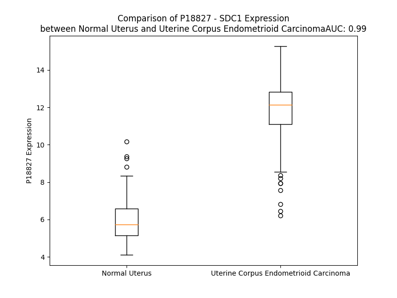

# Detailed Data for P18827

## Introduction to the Detailed Summary

### How to Interpret the Results

- **Summary & Metrics**: This section provides a quick reference to essential protein attributes, including expression changes, family classification, and biomarker applications. Regulation status (upregulated/downregulated) indicates the protein's behavior in a disease context. Some information comes from the original excel file with the proteins selected from literature, while others are derived from the analyses.
- **Expression Comparison**: A visual representation comparing protein expression between normal and disease states. It highlights significant changes in expression levels that might indicate diagnostic or therapeutic relevance. This is data coming from transcriptomics experiments and could not translate similarly to protein levels.
- **Isoform Alignment**: An interactive view of isoform alignments, revealing structural and functional differences between variants of the protein.
- **Interactors & Homologs**: Tables listing known interaction partners and homologous proteins, the more interactors and homologs, the more complex the protein is to design an antibody for.
- **Biological Assemblies**: Information about the structural arrangement of the protein in different assemblies, providing insights into its functional state but also the complexity of the protein to develop antibodies.
- **Combined Per-Residue Information**: A detailed table summarizing residue-level data. This includes predictions for epitope regions, aggregation tendencies, and modifications that might impact the protein's function. Each row corresponds to a residue in the protein, providing insights into specific sites that may be important for research or drug development.
## Summary & Metrics

- **UniProt Accession**: P18827
- **Gene Name**: SDC1
- **Protein Name**: Syndecan-1
- **Swiss Prot**: SDC1_HUMAN
- **Family**: enzyme
- **Biomarker Application**: efficacy
- **Number of Isoforms**: 0
- **Regulation**: 1
- **(transcriptomics) AUC**: 0.99
- **(transcriptomics) Fold Change**: 1.97
- **(transcriptomics) Regulation**: Upregulated
- **Discotope Epitope Count**: 10
- **Max n_uniprots (Homo)**: N/A
- **Max n_uniprots (Hetero)**: 2.0

## Expression Comparison

## Interactors

| preferredName_A   | preferredName_B   |   score |
|:------------------|:------------------|--------:|
| SDC1              | FN1               |   0.999 |
| SDC1              | FGF2              |   0.997 |
| SDC1              | SDCBP             |   0.997 |
| SDC1              | GPC1              |   0.996 |
| SDC1              | WDR82             |   0.989 |
| SDC1              | THBS1             |   0.989 |
| SDC1              | ASH2L             |   0.989 |
| SDC1              | RBBP5             |   0.989 |
| SDC1              | WDR5              |   0.987 |
| SDC1              | SDC2              |   0.982 |
| SDC1              | MMP9              |   0.968 |
| SDC1              | HSPG2             |   0.966 |
| SDC1              | HPSE              |   0.957 |
| SDC1              | XYLT1             |   0.95  |
| SDC1              | IL34              |   0.948 |
| SDC1              | SDC4              |   0.947 |
| SDC1              | THBS4             |   0.946 |
| SDC1              | HPSE2             |   0.944 |
| SDC1              | BGN               |   0.943 |
| SDC1              | DCN               |   0.935 |
| SDC1              | ITGB3             |   0.932 |
| SDC1              | APOE              |   0.932 |
| SDC1              | CD44              |   0.927 |
| SDC1              | ITGAV             |   0.924 |
| SDC1              | SDCBP2            |   0.923 |
| SDC1              | WNT1              |   0.922 |
| SDC1              | THBS2             |   0.921 |
| SDC1              | HMGB1             |   0.921 |
| SDC1              | TNC               |   0.912 |
| SDC1              | COMP              |   0.911 |
| SDC1              | THBS3             |   0.908 |
| SDC1              | TNXB              |   0.904 |
| SDC1              | TNN               |   0.902 |
| SDC1              | HGF               |   0.901 |

## Homologs

| uniprot_id   | gene_id   |
|:-------------|:----------|
| O75056       | SDC3      |
| P31431       | SDC4      |
| E5RJB8       | SDC2      |

## Biological Assemblies

|   Unnamed: 0 |   assembly |   n_uniprots | composition   | crystal_id   |
|-------------:|-----------:|-------------:|:--------------|:-------------|
|            0 |          1 |            2 | Hetero        | 6eje         |
|            0 |          1 |            2 | Hetero        | 4gvd         |
|            1 |          2 |            2 | Hetero        | 4gvd         |

## Combined Per-Residue Information

|   res | aa   |   epitope_score | epitope   |   relative_surface_accessibility |   modeling_confidence |   Aggregation | modification   | glycosylation                                  |
|------:|:-----|----------------:|:----------|---------------------------------:|----------------------:|--------------:|:---------------|:-----------------------------------------------|
|     1 | M    |         0.13286 | False     |                          1.18942 |                 63.84 |         0     | N/A            | N/A                                            |
|     2 | R    |         0.20514 | False     |                          0.85948 |                 74.34 |         0     | N/A            | N/A                                            |
|     3 | R    |         0.17092 | False     |                          0.86959 |                 76.45 |         0     | N/A            | N/A                                            |
|     4 | A    |         0.1356  | False     |                          0.60232 |                 75.68 |         5.944 | N/A            | N/A                                            |
|     5 | A    |         0.12395 | False     |                          0.56794 |                 76.77 |        25.235 | N/A            | N/A                                            |
|     6 | L    |         0.09364 | False     |                          0.69105 |                 82.39 |        87.708 | N/A            | N/A                                            |
|     7 | W    |         0.14452 | False     |                          0.59976 |                 79.63 |        99.095 | N/A            | N/A                                            |
|     8 | L    |         0.16301 | False     |                          0.78725 |                 84.25 |        99.691 | N/A            | N/A                                            |
|     9 | W    |         0.19774 | False     |                          0.72081 |                 86.82 |        99.797 | N/A            | N/A                                            |
|    10 | L    |         0.08293 | False     |                          0.59792 |                 85.69 |        99.775 | N/A            | N/A                                            |
|    11 | C    |         0.12078 | False     |                          0.3925  |                 81.37 |        99.332 | N/A            | N/A                                            |
|    12 | A    |         0.10086 | False     |                          0.54547 |                 81.31 |        97.312 | N/A            | N/A                                            |
|    13 | L    |         0.08838 | False     |                          0.51111 |                 82.74 |        95.594 | N/A            | N/A                                            |
|    14 | A    |         0.07362 | False     |                          0.54022 |                 78.8  |        86.191 | N/A            | N/A                                            |
|    15 | L    |         0.1253  | False     |                          0.80776 |                 76.17 |        78.239 | N/A            | N/A                                            |
|    16 | S    |         0.1234  | False     |                          0.63638 |                 74.56 |        34.82  | N/A            | N/A                                            |
|    17 | L    |         0.09491 | False     |                          0.8721  |                 64.45 |        29.433 | N/A            | N/A                                            |
|    18 | Q    |         0.13533 | False     |                          0.64513 |                 64.64 |         0.016 | N/A            | N/A                                            |
|    19 | P    |         0.10622 | False     |                          0.76203 |                 60.75 |         0.008 | N/A            | N/A                                            |
|    20 | A    |         0.12532 | False     |                          0.92685 |                 56.72 |         0     | N/A            | N/A                                            |
|    21 | L    |         0.11756 | False     |                          0.93622 |                 53.5  |         0     | N/A            | N/A                                            |
|    22 | P    |         0.08987 | False     |                          0.636   |                 53.98 |         0     | N/A            | N/A                                            |
|    23 | Q    |         0.11527 | False     |                          0.8666  |                 47.59 |         0.154 | N/A            | N/A                                            |
|    24 | I    |         0.15333 | False     |                          0.73987 |                 50.86 |         0.307 | N/A            | N/A                                            |
|    25 | V    |         0.13084 | False     |                          0.93716 |                 53.08 |         0.307 | N/A            | N/A                                            |
|    26 | A    |         0.09166 | False     |                          0.76303 |                 49.3  |         0.307 | N/A            | N/A                                            |
|    27 | T    |         0.15451 | False     |                          0.85639 |                 54.24 |         0.307 | N/A            | N/A                                            |
|    28 | N    |         0.16402 | False     |                          0.85979 |                 51.33 |         0.153 | N/A            | N/A                                            |
|    29 | L    |         0.15886 | False     |                          0.83968 |                 61.62 |         0     | N/A            | N/A                                            |
|    30 | P    |         0.13887 | False     |                          0.78536 |                 69.83 |         0     | N/A            | N/A                                            |
|    31 | P    |         0.14124 | False     |                          0.93879 |                 70.4  |         0     | N/A            | N/A                                            |
|    32 | E    |         0.11733 | False     |                          0.73921 |                 74.22 |         0     | N/A            | N/A                                            |
|    33 | D    |         0.14963 | False     |                          0.71718 |                 69.74 |         0     | N/A            | N/A                                            |
|    34 | Q    |         0.16683 | False     |                          0.87018 |                 66.11 |         0     | N/A            | N/A                                            |
|    35 | D    |         0.14575 | False     |                          0.70249 |                 64.31 |         0     | N/A            | N/A                                            |
|    36 | G    |         0.17121 | False     |                          1.0001  |                 62.08 |         0     | N/A            | N/A                                            |
|    37 | S    |         0.13147 | False     |                          0.72354 |                 62.63 |         0     | N/A            | O-linked (Xyl...) (chondroitin sulfate) serine |
|    38 | G    |         0.16538 | False     |                          0.90573 |                 65.42 |         0     | N/A            | N/A                                            |
|    39 | D    |         0.20538 | False     |                          0.74283 |                 65.95 |         0     | N/A            | N/A                                            |
|    40 | D    |         0.14658 | False     |                          0.74004 |                 61.96 |         0     | N/A            | N/A                                            |
|    41 | S    |         0.1568  | False     |                          0.87434 |                 62.08 |         0     | N/A            | N/A                                            |
|    42 | D    |         0.102   | False     |                          0.80773 |                 66.49 |         0     | N/A            | N/A                                            |
|    43 | N    |         0.15571 | False     |                          0.88193 |                 61.44 |         0     | N/A            | N-linked (GlcNAc...) asparagine                |
|    44 | F    |         0.15591 | False     |                          1.02081 |                 61.43 |         0     | N/A            | N/A                                            |
|    45 | S    |         0.16895 | False     |                          0.78086 |                 66.13 |         0     | N/A            | O-linked (Xyl...) (heparan sulfate) serine     |
|    46 | G    |         0.23593 | True      |                          0.88831 |                 65.71 |         0     | N/A            | N/A                                            |
|    47 | S    |         0.24607 | True      |                          0.97397 |                 59.95 |         0     | N/A            | O-linked (Xyl...) (heparan sulfate) serine     |
|    48 | G    |         0.18444 | False     |                          0.88302 |                 54.93 |         0     | N/A            | N/A                                            |
|    49 | A    |         0.16115 | False     |                          1.07828 |                 58.16 |         0     | N/A            | N/A                                            |
|    50 | G    |         0.19786 | False     |                          0.91899 |                 53.38 |         0     | N/A            | N/A                                            |
|    51 | A    |         0.14797 | False     |                          0.93001 |                 52.85 |         0     | N/A            | N/A                                            |
|    52 | L    |         0.14666 | False     |                          0.96682 |                 47.52 |         0     | N/A            | N/A                                            |
|    53 | Q    |         0.13557 | False     |                          0.84572 |                 51.23 |         0     | N/A            | N/A                                            |
|    54 | D    |         0.17707 | False     |                          0.8717  |                 40.51 |         0     | N/A            | N/A                                            |
|    55 | I    |         0.18902 | False     |                          0.91651 |                 49.79 |         0     | N/A            | N/A                                            |
|    56 | T    |         0.15044 | False     |                          0.89602 |                 38.55 |         0     | N/A            | N/A                                            |
|    57 | L    |         0.19011 | False     |                          0.83476 |                 45.07 |         0     | N/A            | N/A                                            |
|    58 | S    |         0.11195 | False     |                          0.93186 |                 36.62 |         0     | N/A            | N/A                                            |
|    59 | Q    |         0.15635 | False     |                          0.69864 |                 43.85 |         0     | N/A            | N/A                                            |
|    60 | Q    |         0.10444 | False     |                          0.77307 |                 42.65 |         0     | N/A            | N/A                                            |
|    61 | T    |         0.0969  | False     |                          0.96035 |                 38.13 |         0     | N/A            | N/A                                            |
|    62 | P    |         0.10718 | False     |                          0.8093  |                 47.64 |         0     | N/A            | N/A                                            |
|    63 | S    |         0.12154 | False     |                          0.82831 |                 39.17 |         0     | N/A            | N/A                                            |
|    64 | T    |         0.17222 | False     |                          0.82831 |                 42.17 |         0     | N/A            | N/A                                            |
|    65 | W    |         0.13224 | False     |                          0.82812 |                 41    |         0     | N/A            | N/A                                            |
|    66 | K    |         0.1053  | False     |                          0.83541 |                 42.87 |         0     | N/A            | N/A                                            |
|    67 | D    |         0.11533 | False     |                          0.70118 |                 39.92 |         0     | N/A            | N/A                                            |
|    68 | T    |         0.12566 | False     |                          0.78736 |                 45.75 |         0     | N/A            | N/A                                            |
|    69 | Q    |         0.18362 | False     |                          0.74799 |                 44.12 |         0     | N/A            | N/A                                            |
|    70 | L    |         0.1372  | False     |                          0.82261 |                 41.43 |         0     | N/A            | N/A                                            |
|    71 | L    |         0.16057 | False     |                          0.92046 |                 44.64 |         0     | N/A            | N/A                                            |
|    72 | T    |         0.10342 | False     |                          0.81345 |                 42.36 |         0     | N/A            | N/A                                            |
|    73 | A    |         0.14913 | False     |                          0.80825 |                 45.3  |         0     | N/A            | N/A                                            |
|    74 | I    |         0.13351 | False     |                          0.95872 |                 55.24 |         0     | N/A            | N/A                                            |
|    75 | P    |         0.14099 | False     |                          0.84618 |                 44.17 |         0     | N/A            | N/A                                            |
|    76 | T    |         0.25895 | True      |                          0.88536 |                 43.84 |         0     | N/A            | N/A                                            |
|    77 | S    |         0.12795 | False     |                          0.84772 |                 43    |         0     | N/A            | N/A                                            |
|    78 | P    |         0.10626 | False     |                          0.88677 |                 43.83 |         0     | N/A            | N/A                                            |
|    79 | E    |         0.10808 | False     |                          0.78366 |                 43.26 |         0     | N/A            | N/A                                            |
|    80 | P    |         0.13338 | False     |                          0.85543 |                 50.35 |         0     | N/A            | N/A                                            |
|    81 | T    |         0.15515 | False     |                          0.81926 |                 44.2  |         0     | N/A            | N/A                                            |
|    82 | G    |         0.13305 | False     |                          0.73927 |                 45.72 |         0     | N/A            | N/A                                            |
|    83 | L    |         0.15706 | False     |                          1.03379 |                 51.28 |         0     | N/A            | N/A                                            |
|    84 | E    |         0.12783 | False     |                          0.82617 |                 43.22 |         0     | N/A            | N/A                                            |
|    85 | A    |         0.13781 | False     |                          0.72671 |                 40.56 |         0     | N/A            | N/A                                            |
|    86 | T    |         0.10567 | False     |                          0.88937 |                 41.53 |         0     | N/A            | N/A                                            |
|    87 | A    |         0.0859  | False     |                          0.8446  |                 37.72 |         0     | N/A            | N/A                                            |
|    88 | A    |         0.14556 | False     |                          0.90538 |                 33.39 |         0     | N/A            | N/A                                            |
|    89 | S    |         0.09972 | False     |                          0.78992 |                 40.11 |         0     | N/A            | N/A                                            |
|    90 | T    |         0.10293 | False     |                          0.89097 |                 33.96 |         0     | N/A            | N/A                                            |
|    91 | S    |         0.10394 | False     |                          0.78936 |                 39.14 |         0     | N/A            | N/A                                            |
|    92 | T    |         0.11588 | False     |                          0.69861 |                 40.13 |         0     | N/A            | N/A                                            |
|    93 | L    |         0.09943 | False     |                          1.01013 |                 42.04 |         0     | N/A            | N/A                                            |
|    94 | P    |         0.06977 | False     |                          0.86452 |                 47.73 |         0     | N/A            | N/A                                            |
|    95 | A    |         0.12746 | False     |                          1.04133 |                 42.95 |         0     | N/A            | N/A                                            |
|    96 | G    |         0.11932 | False     |                          0.7997  |                 42.32 |         0     | N/A            | N/A                                            |
|    97 | E    |         0.13877 | False     |                          0.9793  |                 43.32 |         0     | N/A            | N/A                                            |
|    98 | G    |         0.15881 | False     |                          0.79371 |                 43.1  |         0     | N/A            | N/A                                            |
|    99 | P    |         0.10699 | False     |                          0.87822 |                 41.92 |         0     | N/A            | N/A                                            |
|   100 | K    |         0.16315 | False     |                          0.93741 |                 45.27 |         0     | N/A            | N/A                                            |
|   101 | E    |         0.1575  | False     |                          0.91266 |                 46.48 |         0     | N/A            | N/A                                            |
|   102 | G    |         0.11656 | False     |                          0.82353 |                 44.28 |         0     | N/A            | N/A                                            |
|   103 | E    |         0.18147 | False     |                          0.93934 |                 38.34 |         0     | N/A            | N/A                                            |
|   104 | A    |         0.07591 | False     |                          0.69455 |                 42.18 |         0     | N/A            | N/A                                            |
|   105 | V    |         0.15916 | False     |                          0.963   |                 38.23 |         0     | N/A            | N/A                                            |
|   106 | V    |         0.17421 | False     |                          0.92116 |                 41.34 |         0     | N/A            | N/A                                            |
|   107 | L    |         0.10716 | False     |                          0.97119 |                 39.03 |         0     | N/A            | N/A                                            |
|   108 | P    |         0.09358 | False     |                          0.88803 |                 46.35 |         0     | N/A            | N/A                                            |
|   109 | E    |         0.11143 | False     |                          0.78883 |                 37.5  |         0     | N/A            | N/A                                            |
|   110 | V    |         0.08029 | False     |                          1.06749 |                 50.36 |         0     | N/A            | N/A                                            |
|   111 | E    |         0.07088 | False     |                          0.75712 |                 39.47 |         0     | N/A            | N/A                                            |
|   112 | P    |         0.08659 | False     |                          0.84302 |                 42.95 |         0     | N/A            | N/A                                            |
|   113 | G    |         0.16941 | False     |                          0.77353 |                 39.98 |         0     | N/A            | N/A                                            |
|   114 | L    |         0.08834 | False     |                          1.00244 |                 41.13 |         0     | N/A            | N/A                                            |
|   115 | T    |         0.10454 | False     |                          0.83944 |                 36.78 |         0     | N/A            | N/A                                            |
|   116 | A    |         0.12851 | False     |                          0.94498 |                 45.03 |         0     | N/A            | N/A                                            |
|   117 | R    |         0.11004 | False     |                          0.81177 |                 40.98 |         0     | N/A            | N/A                                            |
|   118 | E    |         0.12943 | False     |                          0.67552 |                 45.3  |         0     | N/A            | N/A                                            |
|   119 | Q    |         0.08974 | False     |                          0.84215 |                 44.05 |         0     | N/A            | N/A                                            |
|   120 | E    |         0.16189 | False     |                          0.86109 |                 40.23 |         0     | N/A            | N/A                                            |
|   121 | A    |         0.0958  | False     |                          0.9769  |                 46.68 |         0     | N/A            | N/A                                            |
|   122 | T    |         0.08456 | False     |                          0.9001  |                 36.88 |         0     | N/A            | N/A                                            |
|   123 | P    |         0.11661 | False     |                          0.82741 |                 47.4  |         0     | N/A            | N/A                                            |
|   124 | R    |         0.18728 | False     |                          0.90263 |                 41.46 |         0     | N/A            | N/A                                            |
|   125 | P    |         0.12928 | False     |                          0.79013 |                 43.62 |         0     | N/A            | N/A                                            |
|   126 | R    |         0.13539 | False     |                          0.99201 |                 57.72 |         0     | N/A            | N/A                                            |
|   127 | E    |         0.15095 | False     |                          0.87543 |                 45.27 |         0     | N/A            | N/A                                            |
|   128 | T    |         0.20045 | False     |                          0.85825 |                 47.83 |         0     | N/A            | N/A                                            |
|   129 | T    |         0.1076  | False     |                          0.92344 |                 52.96 |         0     | N/A            | N/A                                            |
|   130 | Q    |         0.11491 | False     |                          0.77825 |                 47.72 |         0     | N/A            | N/A                                            |
|   131 | L    |         0.12033 | False     |                          1.05242 |                 54.17 |         0     | N/A            | N/A                                            |
|   132 | P    |         0.12865 | False     |                          0.91682 |                 45.14 |         0     | N/A            | N/A                                            |
|   133 | T    |         0.1155  | False     |                          0.83928 |                 62.86 |         0     | N/A            | N/A                                            |
|   134 | T    |         0.18699 | False     |                          0.75475 |                 54.27 |         0     | N/A            | N/A                                            |
|   135 | H    |         0.11231 | False     |                          0.97646 |                 66.51 |         0     | N/A            | N/A                                            |
|   136 | L    |         0.12952 | False     |                          0.96903 |                 57.4  |         0     | N/A            | N/A                                            |
|   137 | A    |         0.09221 | False     |                          0.84838 |                 46.52 |         0     | N/A            | N/A                                            |
|   138 | S    |         0.09205 | False     |                          0.93419 |                 55.22 |         0     | N/A            | N/A                                            |
|   139 | T    |         0.11676 | False     |                          0.90482 |                 55.57 |         0     | N/A            | N/A                                            |
|   140 | T    |         0.12098 | False     |                          0.88267 |                 54.55 |         0     | N/A            | N/A                                            |
|   141 | T    |         0.12065 | False     |                          0.81718 |                 54.57 |         0     | N/A            | N/A                                            |
|   142 | A    |         0.09319 | False     |                          0.98149 |                 45.97 |         0     | N/A            | N/A                                            |
|   143 | T    |         0.11366 | False     |                          0.95152 |                 56.48 |         0     | N/A            | N/A                                            |
|   144 | T    |         0.15046 | False     |                          0.83464 |                 50.74 |         0     | N/A            | N/A                                            |
|   145 | A    |         0.12027 | False     |                          0.9276  |                 49.85 |         0     | N/A            | N/A                                            |
|   146 | Q    |         0.18966 | False     |                          0.82133 |                 49.49 |         0     | N/A            | N/A                                            |
|   147 | E    |         0.07572 | False     |                          0.90646 |                 40.49 |         0     | N/A            | N/A                                            |
|   148 | P    |         0.1082  | False     |                          0.85831 |                 42.59 |         0     | N/A            | N/A                                            |
|   149 | A    |         0.08257 | False     |                          1.02747 |                 46.68 |         0     | N/A            | N/A                                            |
|   150 | T    |         0.10977 | False     |                          0.96528 |                 49    |         0     | N/A            | N/A                                            |
|   151 | S    |         0.11023 | False     |                          0.85995 |                 51.17 |         0     | N/A            | N/A                                            |
|   152 | H    |         0.07166 | False     |                          0.98563 |                 42.2  |         0     | N/A            | N/A                                            |
|   153 | P    |         0.08499 | False     |                          0.90732 |                 59.03 |         0     | N/A            | N/A                                            |
|   154 | H    |         0.14724 | False     |                          0.89129 |                 46.39 |         0     | N/A            | N/A                                            |
|   155 | R    |         0.12307 | False     |                          0.83452 |                 46.72 |         0     | N/A            | N/A                                            |
|   156 | D    |         0.11733 | False     |                          0.80834 |                 44    |         0     | N/A            | N/A                                            |
|   157 | M    |         0.14283 | False     |                          0.93865 |                 52.42 |         0     | N/A            | N/A                                            |
|   158 | Q    |         0.15025 | False     |                          0.86857 |                 40.11 |         0     | N/A            | N/A                                            |
|   159 | P    |         0.09971 | False     |                          0.93323 |                 45.98 |         0     | N/A            | N/A                                            |
|   160 | G    |         0.11648 | False     |                          0.673   |                 41.56 |         0     | N/A            | N/A                                            |
|   161 | H    |         0.12559 | False     |                          0.8493  |                 47.92 |         0     | N/A            | N/A                                            |
|   162 | H    |         0.09922 | False     |                          0.89398 |                 47.35 |         0     | N/A            | N/A                                            |
|   163 | E    |         0.21685 | True      |                          0.82751 |                 48.31 |         0     | N/A            | N/A                                            |
|   164 | T    |         0.1134  | False     |                          1.00621 |                 52.41 |         0     | N/A            | N/A                                            |
|   165 | S    |         0.11934 | False     |                          0.7237  |                 46.31 |         0     | N/A            | N/A                                            |
|   166 | T    |         0.09081 | False     |                          0.94837 |                 41.67 |         0     | N/A            | N/A                                            |
|   167 | P    |         0.08275 | False     |                          0.88111 |                 43.03 |         0     | N/A            | N/A                                            |
|   168 | A    |         0.0928  | False     |                          1.06054 |                 49.98 |         0     | N/A            | N/A                                            |
|   169 | G    |         0.13217 | False     |                          0.87407 |                 41.25 |         0     | N/A            | N/A                                            |
|   170 | P    |         0.11636 | False     |                          1.02229 |                 43.66 |         0     | N/A            | N/A                                            |
|   171 | S    |         0.08879 | False     |                          0.94503 |                 45.25 |         0     | N/A            | N/A                                            |
|   172 | Q    |         0.16362 | False     |                          0.92139 |                 43.73 |         0     | N/A            | N/A                                            |
|   173 | A    |         0.09884 | False     |                          0.86751 |                 50.8  |         0     | N/A            | N/A                                            |
|   174 | D    |         0.15829 | False     |                          0.81859 |                 40.55 |         0     | N/A            | N/A                                            |
|   175 | L    |         0.16503 | False     |                          0.85398 |                 44.35 |         0     | N/A            | N/A                                            |
|   176 | H    |         0.15344 | False     |                          0.90569 |                 42.94 |         0     | N/A            | N/A                                            |
|   177 | T    |         0.1092  | False     |                          0.85376 |                 37.63 |         0     | N/A            | N/A                                            |
|   178 | P    |         0.10565 | False     |                          0.78192 |                 50.47 |         0     | N/A            | N/A                                            |
|   179 | H    |         0.10729 | False     |                          0.9344  |                 44.98 |         0     | N/A            | N/A                                            |
|   180 | T    |         0.11772 | False     |                          0.71018 |                 48.06 |         0     | N/A            | N/A                                            |
|   181 | E    |         0.09445 | False     |                          0.81128 |                 54.19 |         0     | N/A            | N/A                                            |
|   182 | D    |         0.14918 | False     |                          0.94431 |                 48.04 |         0     | N/A            | N/A                                            |
|   183 | G    |         0.13344 | False     |                          0.92133 |                 49.49 |         0     | N/A            | N/A                                            |
|   184 | G    |         0.15597 | False     |                          0.90105 |                 44.85 |         0     | N/A            | N/A                                            |
|   185 | P    |         0.09055 | False     |                          1.04098 |                 48.83 |         0     | N/A            | N/A                                            |
|   186 | S    |         0.12454 | False     |                          0.90253 |                 45.5  |         0     | N/A            | N/A                                            |
|   187 | A    |         0.08864 | False     |                          0.86765 |                 48.94 |         0     | N/A            | N/A                                            |
|   188 | T    |         0.12981 | False     |                          0.89501 |                 53.36 |         0     | N/A            | N/A                                            |
|   189 | E    |         0.16637 | False     |                          0.72898 |                 47.8  |         0     | N/A            | N/A                                            |
|   190 | R    |         0.14382 | False     |                          0.8455  |                 46.4  |         0     | N/A            | N/A                                            |
|   191 | A    |         0.15743 | False     |                          0.87078 |                 41.38 |         0     | N/A            | N/A                                            |
|   192 | A    |         0.12878 | False     |                          0.94312 |                 46.02 |         0     | N/A            | N/A                                            |
|   193 | E    |         0.09    | False     |                          0.88184 |                 59.89 |         0     | N/A            | N/A                                            |
|   194 | D    |         0.13438 | False     |                          0.90917 |                 43.96 |         0     | N/A            | N/A                                            |
|   195 | G    |         0.1331  | False     |                          0.74475 |                 44.93 |         0     | N/A            | N/A                                            |
|   196 | A    |         0.13946 | False     |                          0.98968 |                 43.01 |         0     | N/A            | N/A                                            |
|   197 | S    |         0.10951 | False     |                          0.90703 |                 46.49 |         0     | N/A            | N/A                                            |
|   198 | S    |         0.13368 | False     |                          0.88119 |                 46.6  |         0     | N/A            | N/A                                            |
|   199 | Q    |         0.14882 | False     |                          0.92652 |                 43.04 |         0     | N/A            | N/A                                            |
|   200 | L    |         0.12145 | False     |                          0.96835 |                 41.92 |         0     | N/A            | N/A                                            |
|   201 | P    |         0.12993 | False     |                          0.88966 |                 49.36 |         0     | N/A            | N/A                                            |
|   202 | A    |         0.11711 | False     |                          0.84574 |                 45.07 |         0     | N/A            | N/A                                            |
|   203 | A    |         0.08098 | False     |                          1.03527 |                 53.52 |         0     | N/A            | N/A                                            |
|   204 | E    |         0.20645 | True      |                          0.91002 |                 48.86 |         0     | N/A            | N/A                                            |
|   205 | G    |         0.1765  | False     |                          0.85404 |                 49.48 |         0     | N/A            | N/A                                            |
|   206 | S    |         0.20758 | True      |                          0.96591 |                 48.71 |         0     | N/A            | O-linked (Xyl...) (chondroitin sulfate) serine |
|   207 | G    |         0.16929 | False     |                          0.87494 |                 56.01 |         0     | N/A            | N/A                                            |
|   208 | E    |         0.15294 | False     |                          0.85284 |                 53.55 |         0     | N/A            | N/A                                            |
|   209 | Q    |         0.19792 | False     |                          0.85573 |                 59.37 |         0     | N/A            | N/A                                            |
|   210 | D    |         0.14351 | False     |                          0.78989 |                 61.22 |         0     | N/A            | N/A                                            |
|   211 | F    |         0.12376 | False     |                          0.9746  |                 53.42 |         0     | N/A            | N/A                                            |
|   212 | T    |         0.10687 | False     |                          0.84497 |                 60.68 |         0     | N/A            | N/A                                            |
|   213 | F    |         0.11141 | False     |                          0.95216 |                 55.46 |         0     | N/A            | N/A                                            |
|   214 | E    |         0.16523 | False     |                          0.8632  |                 58.4  |         0     | N/A            | N/A                                            |
|   215 | T    |         0.17723 | False     |                          0.89399 |                 42.73 |         0     | N/A            | N/A                                            |
|   216 | S    |         0.13283 | False     |                          0.88144 |                 47.32 |         0     | N/A            | O-linked (Xyl...) (chondroitin sulfate) serine |
|   217 | G    |         0.14337 | False     |                          0.81039 |                 50.72 |         0     | N/A            | N/A                                            |
|   218 | E    |         0.17635 | False     |                          0.91153 |                 47.7  |         0     | N/A            | N/A                                            |
|   219 | N    |         0.14044 | False     |                          0.8682  |                 49.26 |         0.165 | N/A            | N/A                                            |
|   220 | T    |         0.18164 | False     |                          0.96006 |                 43.07 |         4.761 | N/A            | N/A                                            |
|   221 | A    |         0.137   | False     |                          0.69064 |                 46.18 |        24.262 | N/A            | N/A                                            |
|   222 | V    |         0.16561 | False     |                          0.99067 |                 48.66 |        24.262 | N/A            | N/A                                            |
|   223 | V    |         0.12796 | False     |                          0.88315 |                 52.02 |        24.262 | N/A            | N/A                                            |
|   224 | A    |         0.13751 | False     |                          1.01908 |                 40.23 |        24.262 | N/A            | N/A                                            |
|   225 | V    |         0.13005 | False     |                          0.8946  |                 57.52 |        23.902 | N/A            | N/A                                            |
|   226 | E    |         0.17081 | False     |                          0.77997 |                 54.27 |         0     | N/A            | N/A                                            |
|   227 | P    |         0.11864 | False     |                          0.82681 |                 56.31 |         0     | N/A            | N/A                                            |
|   228 | D    |         0.11666 | False     |                          0.63194 |                 45.27 |         0     | N/A            | N/A                                            |
|   229 | R    |         0.21664 | True      |                          0.95701 |                 51.86 |         0     | N/A            | N/A                                            |
|   230 | R    |         0.20261 | False     |                          0.77829 |                 50.46 |         0     | N/A            | N/A                                            |
|   231 | N    |         0.13559 | False     |                          0.88645 |                 52.85 |         0     | N/A            | N/A                                            |
|   232 | Q    |         0.15993 | False     |                          0.88752 |                 50.09 |         0     | N/A            | N/A                                            |
|   233 | S    |         0.111   | False     |                          0.64941 |                 49.75 |         0     | N/A            | N/A                                            |
|   234 | P    |         0.15073 | False     |                          1.02173 |                 50.05 |         0     | N/A            | N/A                                            |
|   235 | V    |         0.09501 | False     |                          0.81998 |                 60.27 |         0     | N/A            | N/A                                            |
|   236 | D    |         0.13816 | False     |                          0.84239 |                 54.29 |         0     | N/A            | N/A                                            |
|   237 | Q    |         0.11688 | False     |                          0.6247  |                 54.71 |         0     | N/A            | N/A                                            |
|   238 | G    |         0.17891 | False     |                          0.94322 |                 46.11 |         0     | N/A            | N/A                                            |
|   239 | A    |         0.12818 | False     |                          0.98551 |                 56.97 |         0     | N/A            | N/A                                            |
|   240 | T    |         0.11877 | False     |                          0.64772 |                 52.13 |         0     | N/A            | N/A                                            |
|   241 | G    |         0.2231  | True      |                          0.70391 |                 56.68 |         0     | N/A            | N/A                                            |
|   242 | A    |         0.12417 | False     |                          1.08793 |                 57.98 |         0     | N/A            | N/A                                            |
|   243 | S    |         0.10766 | False     |                          0.64936 |                 60.55 |         0     | N/A            | N/A                                            |
|   244 | Q    |         0.14395 | False     |                          0.43573 |                 62.31 |         0     | N/A            | N/A                                            |
|   245 | G    |         0.12496 | False     |                          0.5817  |                 68.9  |         0     | N/A            | N/A                                            |
|   246 | L    |         0.13036 | False     |                          0.7159  |                 70.51 |         0     | N/A            | N/A                                            |
|   247 | L    |         0.10938 | False     |                          0.63428 |                 72.6  |         0     | N/A            | N/A                                            |
|   248 | D    |         0.14519 | False     |                          0.78554 |                 78.85 |         0     | N/A            | N/A                                            |
|   249 | R    |         0.21729 | True      |                          0.46473 |                 86.54 |         0     | N/A            | N/A                                            |
|   250 | K    |         0.13609 | False     |                          0.86072 |                 87.16 |         0     | N/A            | N/A                                            |
|   251 | E    |         0.098   | False     |                          0.74259 |                 90.21 |         0     | N/A            | N/A                                            |
|   252 | V    |         0.06031 | False     |                          0.34341 |                 92.67 |         0.547 | N/A            | N/A                                            |
|   253 | L    |         0.08175 | False     |                          0.49873 |                 91.07 |         0.558 | N/A            | N/A                                            |
|   254 | G    |         0.08246 | False     |                          0.40754 |                 91.96 |         0.592 | N/A            | N/A                                            |
|   255 | G    |         0.06687 | False     |                          0.52996 |                 93.88 |         1     | N/A            | N/A                                            |
|   256 | V    |         0.06327 | False     |                          0.60355 |                 94.41 |         9.454 | N/A            | N/A                                            |
|   257 | I    |         0.1058  | False     |                          0.56478 |                 93.37 |        10.547 | N/A            | N/A                                            |
|   258 | A    |         0.06132 | False     |                          0.55076 |                 94.93 |        10.705 | N/A            | N/A                                            |
|   259 | G    |         0.06356 | False     |                          0.53289 |                 96.11 |        11.179 | N/A            | N/A                                            |
|   260 | G    |         0.06886 | False     |                          0.47004 |                 95.91 |        16.52  | N/A            | N/A                                            |
|   261 | L    |         0.10278 | False     |                          0.65454 |                 96.43 |        75.869 | N/A            | N/A                                            |
|   262 | V    |         0.05416 | False     |                          0.74084 |                 95.76 |        86.737 | N/A            | N/A                                            |
|   263 | G    |         0.06569 | False     |                          0.41479 |                 96.2  |        87.659 | N/A            | N/A                                            |
|   264 | L    |         0.08329 | False     |                          0.69589 |                 94.9  |        97.908 | N/A            | N/A                                            |
|   265 | I    |         0.09691 | False     |                          0.65336 |                 93.16 |        99.775 | N/A            | N/A                                            |
|   266 | F    |         0.04975 | False     |                          0.62191 |                 94.22 |        99.937 | N/A            | N/A                                            |
|   267 | A    |         0.0516  | False     |                          0.4413  |                 91.92 |        99.835 | N/A            | N/A                                            |
|   268 | V    |         0.0487  | False     |                          0.69256 |                 91.81 |        99.759 | N/A            | N/A                                            |
|   269 | C    |         0.04065 | False     |                          0.54242 |                 88.05 |        98.636 | N/A            | N/A                                            |
|   270 | L    |         0.07096 | False     |                          0.44667 |                 89.02 |        98.404 | N/A            | N/A                                            |
|   271 | V    |         0.05333 | False     |                          0.62157 |                 89.36 |        97.527 | N/A            | N/A                                            |
|   272 | G    |         0.07302 | False     |                          0.36393 |                 87.55 |        87.244 | N/A            | N/A                                            |
|   273 | F    |         0.06977 | False     |                          0.48329 |                 86.22 |        86.321 | N/A            | N/A                                            |
|   274 | M    |         0.08508 | False     |                          0.52889 |                 85.93 |        75.356 | N/A            | N/A                                            |
|   275 | L    |         0.0513  | False     |                          0.41894 |                 83.99 |        67.392 | N/A            | N/A                                            |
|   276 | Y    |         0.07748 | False     |                          0.51928 |                 80.67 |        51.835 | N/A            | N/A                                            |
|   277 | R    |         0.11932 | False     |                          0.16303 |                 79.82 |         0     | N/A            | N/A                                            |
|   278 | M    |         0.18027 | False     |                          0.76183 |                 74.28 |         0     | N/A            | N/A                                            |
|   279 | K    |         0.10978 | False     |                          0.90388 |                 79.64 |         0     | N/A            | N/A                                            |
|   280 | K    |         0.09095 | False     |                          0.54217 |                 69.79 |         0     | N/A            | N/A                                            |
|   281 | K    |         0.09957 | False     |                          0.86007 |                 59.02 |         0     | N/A            | N/A                                            |
|   282 | D    |         0.11255 | False     |                          0.52517 |                 60.38 |         0     | N/A            | N/A                                            |
|   283 | E    |         0.11294 | False     |                          0.56646 |                 54.84 |         0     | N/A            | N/A                                            |
|   284 | G    |         0.10501 | False     |                          0.5812  |                 60.01 |         0     | N/A            | N/A                                            |
|   285 | S    |         0.08286 | False     |                          0.60612 |                 57.1  |         0     | Phosphoserine  | N/A                                            |
|   286 | Y    |         0.14926 | False     |                          0.76608 |                 52.01 |         0     | N/A            | N/A                                            |
|   287 | S    |         0.1056  | False     |                          0.63816 |                 51.61 |         0     | N/A            | N/A                                            |
|   288 | L    |         0.10326 | False     |                          1.10807 |                 57.95 |         0     | N/A            | N/A                                            |
|   289 | E    |         0.17987 | False     |                          0.74366 |                 52.86 |         0     | N/A            | N/A                                            |
|   290 | E    |         0.22959 | True      |                          0.80187 |                 53.46 |         0     | N/A            | N/A                                            |
|   291 | P    |         0.19403 | False     |                          0.91504 |                 51.62 |         0     | N/A            | N/A                                            |
|   292 | K    |         0.12715 | False     |                          0.99404 |                 51.87 |         0     | N/A            | N/A                                            |
|   293 | Q    |         0.18035 | False     |                          0.95364 |                 48.94 |         0     | N/A            | N/A                                            |
|   294 | A    |         0.14108 | False     |                          0.81608 |                 53.98 |         0     | N/A            | N/A                                            |
|   295 | N    |         0.14576 | False     |                          1.02324 |                 49.84 |         0     | N/A            | N/A                                            |
|   296 | G    |         0.15143 | False     |                          0.94272 |                 51.96 |         0     | N/A            | N/A                                            |
|   297 | G    |         0.10846 | False     |                          0.96185 |                 52.49 |         0     | N/A            | N/A                                            |
|   298 | A    |         0.12121 | False     |                          0.92006 |                 53.82 |         0     | N/A            | N/A                                            |
|   299 | Y    |         0.14107 | False     |                          0.98073 |                 53.08 |         0     | N/A            | N/A                                            |
|   300 | Q    |         0.14549 | False     |                          0.86293 |                 55.45 |         0     | N/A            | N/A                                            |
|   301 | K    |         0.10759 | False     |                          0.77509 |                 57.67 |         0     | N/A            | N/A                                            |
|   302 | P    |         0.13068 | False     |                          0.90397 |                 61.99 |         0     | N/A            | N/A                                            |
|   303 | T    |         0.10697 | False     |                          0.87283 |                 59.42 |         0     | N/A            | N/A                                            |
|   304 | K    |         0.12309 | False     |                          0.88903 |                 55.05 |         0     | N/A            | N/A                                            |
|   305 | Q    |         0.11185 | False     |                          0.78628 |                 58.46 |         0     | N/A            | N/A                                            |
|   306 | E    |         0.09245 | False     |                          0.79883 |                 61.59 |         0     | N/A            | N/A                                            |
|   307 | E    |         0.10895 | False     |                          0.85678 |                 66.02 |         0     | N/A            | N/A                                            |
|   308 | F    |         0.10219 | False     |                          0.90362 |                 60.06 |         0     | N/A            | N/A                                            |
|   309 | Y    |         0.10421 | False     |                          1.02855 |                 53.22 |         0     | N/A            | N/A                                            |
|   310 | A    |         0.07721 | False     |                          1.53401 |                 61.87 |         0     | N/A            | N/A                                            |

