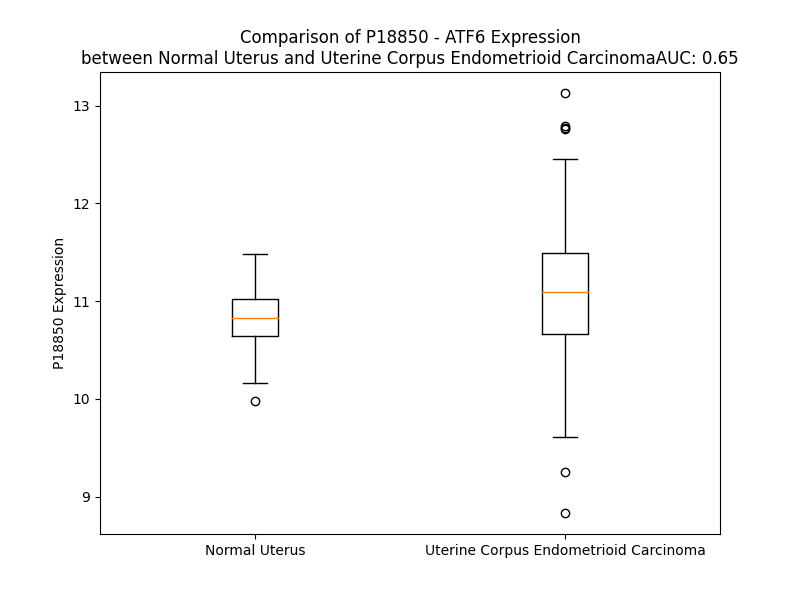

# Detailed Data for P18850

## Introduction to the Detailed Summary

### How to Interpret the Results

- **Summary & Metrics**: This section provides a quick reference to essential protein attributes, including expression changes, family classification, and biomarker applications. Regulation status (upregulated/downregulated) indicates the protein's behavior in a disease context. Some information comes from the original excel file with the proteins selected from literature, while others are derived from the analyses.
- **Expression Comparison**: A visual representation comparing protein expression between normal and disease states. It highlights significant changes in expression levels that might indicate diagnostic or therapeutic relevance. This is data coming from transcriptomics experiments and could not translate similarly to protein levels.
- **Isoform Alignment**: An interactive view of isoform alignments, revealing structural and functional differences between variants of the protein.
- **Interactors & Homologs**: Tables listing known interaction partners and homologous proteins, the more interactors and homologs, the more complex the protein is to design an antibody for.
- **Biological Assemblies**: Information about the structural arrangement of the protein in different assemblies, providing insights into its functional state but also the complexity of the protein to develop antibodies.
- **Combined Per-Residue Information**: A detailed table summarizing residue-level data. This includes predictions for epitope regions, aggregation tendencies, and modifications that might impact the protein's function. Each row corresponds to a residue in the protein, providing insights into specific sites that may be important for research or drug development.
## Summary & Metrics

- **UniProt Accession**: P18850
- **Gene Name**: ATF6
- **Protein Name**: Cyclic AMP-dependent transcription factor ATF-6 alpha
- **Swiss Prot**: ATF6A_HUMAN
- **Family**: transcription regulator
- **Biomarker Application**:  
- **Number of Isoforms**: 0
- **Regulation**: 1
- **(transcriptomics) AUC**: 0.65
- **(transcriptomics) Fold Change**: 1.02
- **(transcriptomics) Regulation**: Upregulated
- **Discotope Epitope Count**: 104
- **Max n_uniprots (Homo)**: N/A
- **Max n_uniprots (Hetero)**: N/A

## Expression Comparison

## Interactors

| preferredName_A   | preferredName_B   |   score |
|:------------------|:------------------|--------:|
| ATF6              | HSPA5             |   0.999 |
| ATF6              | XBP1              |   0.998 |
| ATF6              | VAPB              |   0.989 |
| ATF6              | DDIT3             |   0.989 |
| ATF6              | HSP90B1           |   0.981 |
| ATF6              | MBTPS2            |   0.978 |
| ATF6              | EIF2AK3           |   0.978 |
| ATF6              | ERN1              |   0.976 |
| ATF6              | MBTPS1            |   0.974 |
| ATF6              | WFS1              |   0.963 |
| ATF6              | ATF6B             |   0.961 |
| ATF6              | ATF4              |   0.942 |
| ATF6              | CALR              |   0.933 |
| ATF6              | ATF5              |   0.932 |
| ATF6              | CEBPB             |   0.929 |
| ATF6              | EIF2S1            |   0.923 |
| ATF6              | THBS4             |   0.918 |
| ATF6              | EIF2AK2           |   0.911 |
| ATF6              | SREBF2            |   0.911 |

## Homologs

| uniprot_id   | gene_id   |
|:-------------|:----------|
| Q5U0J5       | CREB1     |
| Q99941       | ATF6B     |
| F8WDF2       | CREM      |
| Q96BA8       | CREB3L1   |
| O43889       | CREB3     |
| Q68CJ9       | CREB3L3   |
| Q5T4K9       | CREB3L4   |
| F8VS03       | ATF1      |
| Q70SY1       | CREB3L2   |

## Combined Per-Residue Information

|   res | aa   |   epitope_score | epitope   |   relative_surface_accessibility |   modeling_confidence |   Aggregation | modification   | glycosylation                   |
|------:|:-----|----------------:|:----------|---------------------------------:|----------------------:|--------------:|:---------------|:--------------------------------|
|     1 | M    |         0.07713 | False     |                          1.31755 |                 47.02 |         0     | N/A            | N/A                             |
|     2 | G    |         0.06949 | False     |                          0.8946  |                 49.27 |         0     | N/A            | N/A                             |
|     3 | E    |         0.07477 | False     |                          0.77946 |                 48.75 |         0     | N/A            | N/A                             |
|     4 | P    |         0.07512 | False     |                          0.88297 |                 53.24 |         0     | N/A            | N/A                             |
|     5 | A    |         0.0722  | False     |                          0.87586 |                 41.92 |         0     | N/A            | N/A                             |
|     6 | G    |         0.06945 | False     |                          0.91828 |                 45.34 |         0     | N/A            | N/A                             |
|     7 | V    |         0.07318 | False     |                          1.10552 |                 43.3  |         0     | N/A            | N/A                             |
|     8 | A    |         0.09318 | False     |                          1.00628 |                 46.07 |         0     | N/A            | N/A                             |
|     9 | G    |         0.11485 | True      |                          0.86631 |                 38.8  |         0     | N/A            | N/A                             |
|    10 | T    |         0.10918 | True      |                          0.98812 |                 45.76 |         0     | N/A            | N/A                             |
|    11 | M    |         0.11016 | True      |                          1.04808 |                 38.05 |         0     | N/A            | N/A                             |
|    12 | E    |         0.09836 | False     |                          0.91472 |                 42.55 |         0     | N/A            | N/A                             |
|    13 | S    |         0.0614  | False     |                          0.76039 |                 38.94 |         0     | N/A            | N/A                             |
|    14 | P    |         0.08265 | False     |                          0.88369 |                 40.42 |         0     | N/A            | N/A                             |
|    15 | F    |         0.11123 | True      |                          1.01269 |                 35.64 |         0     | N/A            | N/A                             |
|    16 | S    |         0.09122 | False     |                          0.87101 |                 37.07 |         0     | N/A            | N/A                             |
|    17 | P    |         0.07437 | False     |                          1.0044  |                 40.66 |         0     | N/A            | N/A                             |
|    18 | G    |         0.08601 | False     |                          0.8237  |                 33.36 |         0     | N/A            | N/A                             |
|    19 | L    |         0.09434 | False     |                          1.10679 |                 30.72 |         0     | N/A            | N/A                             |
|    20 | F    |         0.08512 | False     |                          0.99792 |                 33.28 |         0     | N/A            | N/A                             |
|    21 | H    |         0.07949 | False     |                          0.99885 |                 32.55 |         0     | N/A            | N/A                             |
|    22 | R    |         0.11077 | True      |                          0.80077 |                 32.83 |         0     | N/A            | N/A                             |
|    23 | L    |         0.09597 | False     |                          0.92038 |                 34.84 |         0     | N/A            | N/A                             |
|    24 | D    |         0.0521  | False     |                          0.56809 |                 38.95 |         0     | N/A            | N/A                             |
|    25 | E    |         0.06957 | False     |                          0.8797  |                 44.62 |         0     | N/A            | N/A                             |
|    26 | D    |         0.10462 | False     |                          0.68028 |                 47.58 |         0     | N/A            | N/A                             |
|    27 | W    |         0.09062 | False     |                          0.8737  |                 46.24 |         0     | N/A            | N/A                             |
|    28 | D    |         0.06772 | False     |                          0.67899 |                 45.89 |         0     | N/A            | N/A                             |
|    29 | S    |         0.0614  | False     |                          0.54469 |                 52.49 |         0     | N/A            | N/A                             |
|    30 | A    |         0.10137 | False     |                          0.5053  |                 53.27 |         0     | N/A            | N/A                             |
|    31 | L    |         0.12931 | True      |                          0.68894 |                 43.72 |         0     | N/A            | N/A                             |
|    32 | F    |         0.08297 | False     |                          0.76149 |                 50.17 |         0     | N/A            | N/A                             |
|    33 | A    |         0.0821  | False     |                          0.57576 |                 56.56 |         0     | N/A            | N/A                             |
|    34 | E    |         0.09163 | False     |                          0.69074 |                 50.29 |         0     | N/A            | N/A                             |
|    35 | L    |         0.0582  | False     |                          0.77464 |                 46.44 |         0     | N/A            | N/A                             |
|    36 | G    |         0.06645 | False     |                          0.68714 |                 45.26 |         0     | N/A            | N/A                             |
|    37 | Y    |         0.10781 | True      |                          0.88628 |                 45.02 |         0     | N/A            | N/A                             |
|    38 | F    |         0.09092 | False     |                          0.90586 |                 39.74 |         0     | N/A            | N/A                             |
|    39 | T    |         0.09615 | False     |                          0.89049 |                 37.53 |         0     | N/A            | N/A                             |
|    40 | D    |         0.09318 | False     |                          0.85327 |                 32.55 |         0     | N/A            | N/A                             |
|    41 | T    |         0.10069 | False     |                          0.87444 |                 35.85 |         0     | N/A            | N/A                             |
|    42 | D    |         0.07951 | False     |                          0.79162 |                 40.73 |         0     | N/A            | N/A                             |
|    43 | E    |         0.06309 | False     |                          0.82417 |                 33.84 |         0     | N/A            | N/A                             |
|    44 | L    |         0.06285 | False     |                          1.07873 |                 39.02 |         0     | N/A            | N/A                             |
|    45 | Q    |         0.09921 | False     |                          0.80534 |                 28.51 |         0     | N/A            | N/A                             |
|    46 | L    |         0.16395 | True      |                          1.04714 |                 40.07 |         0     | N/A            | N/A                             |
|    47 | E    |         0.09889 | False     |                          0.82407 |                 34.39 |         0     | N/A            | N/A                             |
|    48 | A    |         0.06193 | False     |                          0.9707  |                 30.03 |         0     | N/A            | N/A                             |
|    49 | A    |         0.13332 | True      |                          0.9296  |                 38.41 |         0     | N/A            | N/A                             |
|    50 | N    |         0.1081  | True      |                          0.8833  |                 35.19 |         0     | N/A            | N/A                             |
|    51 | E    |         0.13219 | True      |                          0.77986 |                 35.61 |         0     | N/A            | N/A                             |
|    52 | T    |         0.10331 | False     |                          0.83539 |                 30.34 |         0     | N/A            | N/A                             |
|    53 | Y    |         0.08545 | False     |                          0.99958 |                 35.31 |         0     | N/A            | N/A                             |
|    54 | E    |         0.0877  | False     |                          0.67382 |                 35.91 |         0     | N/A            | N/A                             |
|    55 | N    |         0.08361 | False     |                          0.70675 |                 32.49 |         0     | N/A            | N/A                             |
|    56 | N    |         0.07713 | False     |                          0.991   |                 39.64 |         0     | N/A            | N/A                             |
|    57 | F    |         0.08384 | False     |                          0.9238  |                 32.41 |         0     | N/A            | N/A                             |
|    58 | D    |         0.05771 | False     |                          0.82575 |                 37.78 |         0     | N/A            | N/A                             |
|    59 | N    |         0.0667  | False     |                          0.88135 |                 42.51 |         0     | N/A            | N/A                             |
|    60 | L    |         0.06689 | False     |                          1.00527 |                 39.81 |         0     | N/A            | N/A                             |
|    61 | D    |         0.04253 | False     |                          0.70163 |                 46.18 |         0     | N/A            | N/A                             |
|    62 | F    |         0.101   | False     |                          0.8796  |                 42.33 |         0     | N/A            | N/A                             |
|    63 | D    |         0.07463 | False     |                          0.66229 |                 44.95 |         0     | N/A            | N/A                             |
|    64 | L    |         0.07317 | False     |                          0.60951 |                 51.36 |         0     | N/A            | N/A                             |
|    65 | D    |         0.08614 | False     |                          0.84497 |                 41.97 |         0     | N/A            | N/A                             |
|    66 | L    |         0.10038 | False     |                          0.94672 |                 38.9  |         0     | N/A            | N/A                             |
|    67 | M    |         0.06409 | False     |                          0.84402 |                 42.65 |         0     | N/A            | N/A                             |
|    68 | P    |         0.04799 | False     |                          0.80862 |                 40.27 |         0     | N/A            | N/A                             |
|    69 | W    |         0.05991 | False     |                          0.87967 |                 45.12 |         0     | N/A            | N/A                             |
|    70 | E    |         0.08546 | False     |                          0.58559 |                 35.34 |         0     | N/A            | N/A                             |
|    71 | S    |         0.03857 | False     |                          0.34815 |                 36.95 |         0     | N/A            | N/A                             |
|    72 | D    |         0.11469 | True      |                          0.59522 |                 37.78 |         0     | N/A            | N/A                             |
|    73 | I    |         0.06945 | False     |                          0.68155 |                 42.86 |         0     | N/A            | N/A                             |
|    74 | W    |         0.08457 | False     |                          0.92109 |                 40.33 |         0     | N/A            | N/A                             |
|    75 | D    |         0.05964 | False     |                          0.46795 |                 37.7  |         0     | N/A            | N/A                             |
|    76 | I    |         0.09384 | False     |                          0.72114 |                 40.64 |         0     | N/A            | N/A                             |
|    77 | N    |         0.0622  | False     |                          0.82391 |                 37.81 |         0     | N/A            | N/A                             |
|    78 | N    |         0.07519 | False     |                          0.66342 |                 37.68 |         0     | N/A            | N/A                             |
|    79 | Q    |         0.07934 | False     |                          0.73919 |                 35.45 |         0     | N/A            | N/A                             |
|    80 | I    |         0.09883 | False     |                          0.85086 |                 33.11 |         0     | N/A            | N/A                             |
|    81 | C    |         0.0735  | False     |                          0.84731 |                 31.82 |         0     | N/A            | N/A                             |
|    82 | T    |         0.08161 | False     |                          0.84537 |                 31.18 |         0     | N/A            | N/A                             |
|    83 | V    |         0.05234 | False     |                          0.98793 |                 35.3  |         0     | N/A            | N/A                             |
|    84 | K    |         0.10692 | True      |                          0.85672 |                 39.62 |         0     | N/A            | N/A                             |
|    85 | D    |         0.0668  | False     |                          0.84639 |                 32.64 |         0     | N/A            | N/A                             |
|    86 | I    |         0.09897 | False     |                          0.99231 |                 42.39 |         0     | N/A            | N/A                             |
|    87 | K    |         0.0771  | False     |                          0.94958 |                 35.59 |         0     | N/A            | N/A                             |
|    88 | A    |         0.06744 | False     |                          0.89278 |                 36.89 |         0     | N/A            | N/A                             |
|    89 | E    |         0.10575 | False     |                          0.89468 |                 36.12 |         0     | N/A            | N/A                             |
|    90 | P    |         0.08464 | False     |                          0.89077 |                 38.49 |         0     | N/A            | N/A                             |
|    91 | Q    |         0.08188 | False     |                          0.84422 |                 37.41 |         0     | N/A            | N/A                             |
|    92 | P    |         0.07867 | False     |                          0.978   |                 37.22 |         0     | N/A            | N/A                             |
|    93 | L    |         0.06655 | False     |                          1.08383 |                 38.37 |         0     | N/A            | N/A                             |
|    94 | S    |         0.07602 | False     |                          0.78263 |                 43.79 |         0     | N/A            | N/A                             |
|    95 | P    |         0.07861 | False     |                          1.03382 |                 37.73 |         0     | N/A            | N/A                             |
|    96 | A    |         0.05481 | False     |                          0.9246  |                 37.14 |         0     | N/A            | N/A                             |
|    97 | S    |         0.06355 | False     |                          0.94195 |                 32.74 |         0     | N/A            | N/A                             |
|    98 | S    |         0.05522 | False     |                          0.8048  |                 40.11 |         0     | N/A            | N/A                             |
|    99 | S    |         0.0986  | False     |                          0.81284 |                 35.75 |         0     | N/A            | N/A                             |
|   100 | Y    |         0.09067 | False     |                          0.94066 |                 37.82 |         0     | N/A            | N/A                             |
|   101 | S    |         0.11132 | True      |                          0.86045 |                 36.18 |         0     | N/A            | N/A                             |
|   102 | V    |         0.12082 | True      |                          0.9562  |                 38.7  |         0     | N/A            | N/A                             |
|   103 | S    |         0.06376 | False     |                          0.79906 |                 36.72 |         0     | N/A            | N/A                             |
|   104 | S    |         0.06673 | False     |                          0.8174  |                 36.92 |         0     | N/A            | N/A                             |
|   105 | P    |         0.07329 | False     |                          0.99584 |                 43.85 |         0     | N/A            | N/A                             |
|   106 | R    |         0.13889 | True      |                          0.91685 |                 36.91 |         0     | N/A            | N/A                             |
|   107 | S    |         0.13894 | True      |                          0.76472 |                 40.8  |         0     | N/A            | N/A                             |
|   108 | V    |         0.08172 | False     |                          0.86711 |                 42.22 |         0     | N/A            | N/A                             |
|   109 | D    |         0.12267 | True      |                          0.64845 |                 38.11 |         0     | N/A            | N/A                             |
|   110 | S    |         0.08053 | False     |                          0.80416 |                 43.1  |         0     | N/A            | N/A                             |
|   111 | Y    |         0.07952 | False     |                          0.86213 |                 39.72 |         0     | N/A            | N/A                             |
|   112 | S    |         0.06465 | False     |                          0.79151 |                 38.39 |         0     | N/A            | N/A                             |
|   113 | S    |         0.07012 | False     |                          0.66281 |                 39.26 |         0     | N/A            | N/A                             |
|   114 | T    |         0.13726 | True      |                          0.84839 |                 40.84 |         0     | N/A            | N/A                             |
|   115 | Q    |         0.08823 | False     |                          0.78568 |                 41.19 |         0     | N/A            | N/A                             |
|   116 | H    |         0.08683 | False     |                          0.88891 |                 37.33 |         0     | N/A            | N/A                             |
|   117 | V    |         0.06857 | False     |                          0.78878 |                 41.08 |         0     | N/A            | N/A                             |
|   118 | P    |         0.04112 | False     |                          0.87827 |                 42    |         0     | N/A            | N/A                             |
|   119 | E    |         0.07133 | False     |                          0.85046 |                 44.47 |         0     | N/A            | N/A                             |
|   120 | E    |         0.12408 | True      |                          0.73029 |                 48.17 |         0     | N/A            | N/A                             |
|   121 | L    |         0.09953 | False     |                          0.8524  |                 42.19 |         0     | N/A            | N/A                             |
|   122 | D    |         0.08718 | False     |                          0.71998 |                 38.58 |         0     | N/A            | N/A                             |
|   123 | L    |         0.08866 | False     |                          1.07078 |                 39.46 |         0     | N/A            | N/A                             |
|   124 | S    |         0.05142 | False     |                          0.74424 |                 33.67 |         0     | N/A            | N/A                             |
|   125 | S    |         0.06697 | False     |                          0.94932 |                 37.68 |         0     | N/A            | N/A                             |
|   126 | S    |         0.05488 | False     |                          0.87209 |                 37.43 |         0     | N/A            | N/A                             |
|   127 | S    |         0.04978 | False     |                          0.71505 |                 35.96 |         0     | N/A            | N/A                             |
|   128 | Q    |         0.10589 | True      |                          0.86055 |                 36.92 |         0     | N/A            | N/A                             |
|   129 | M    |         0.08716 | False     |                          0.92801 |                 39.25 |         0     | N/A            | N/A                             |
|   130 | S    |         0.06601 | False     |                          0.85922 |                 36.72 |         0     | N/A            | N/A                             |
|   131 | P    |         0.0714  | False     |                          0.83149 |                 43.14 |         0     | N/A            | N/A                             |
|   132 | L    |         0.09151 | False     |                          1.04771 |                 35.77 |         0     | N/A            | N/A                             |
|   133 | S    |         0.06759 | False     |                          0.80101 |                 39.58 |         0     | N/A            | N/A                             |
|   134 | L    |         0.08366 | False     |                          0.84275 |                 37.32 |         0     | N/A            | N/A                             |
|   135 | Y    |         0.08477 | False     |                          0.90467 |                 44.56 |         0     | N/A            | N/A                             |
|   136 | G    |         0.10672 | True      |                          0.79434 |                 37.04 |         0     | N/A            | N/A                             |
|   137 | E    |         0.06943 | False     |                          0.82885 |                 38.86 |         0     | N/A            | N/A                             |
|   138 | N    |         0.08034 | False     |                          0.84758 |                 36.89 |         0     | N/A            | N/A                             |
|   139 | S    |         0.05539 | False     |                          0.74851 |                 34.13 |         0     | N/A            | N/A                             |
|   140 | N    |         0.098   | False     |                          0.8542  |                 37.9  |         0     | N/A            | N/A                             |
|   141 | S    |         0.12062 | True      |                          0.76809 |                 33.4  |         0     | N/A            | N/A                             |
|   142 | L    |         0.08827 | False     |                          1.04712 |                 34.3  |         0     | N/A            | N/A                             |
|   143 | S    |         0.06193 | False     |                          0.74944 |                 31.37 |         0     | N/A            | N/A                             |
|   144 | S    |         0.06388 | False     |                          0.73569 |                 33.28 |         0     | N/A            | N/A                             |
|   145 | A    |         0.04832 | False     |                          0.88375 |                 37.99 |         0     | N/A            | N/A                             |
|   146 | E    |         0.08149 | False     |                          0.83102 |                 37.28 |         0     | N/A            | N/A                             |
|   147 | P    |         0.03742 | False     |                          0.85911 |                 37.97 |         0     | N/A            | N/A                             |
|   148 | L    |         0.05505 | False     |                          1.01782 |                 36.41 |         0     | N/A            | N/A                             |
|   149 | K    |         0.08022 | False     |                          0.93503 |                 38.01 |         0     | N/A            | N/A                             |
|   150 | E    |         0.08388 | False     |                          0.8688  |                 40.62 |         0     | N/A            | N/A                             |
|   151 | D    |         0.06494 | False     |                          0.67361 |                 41.35 |         0     | N/A            | N/A                             |
|   152 | K    |         0.08932 | False     |                          0.84165 |                 42.99 |         0     | N/A            | N/A                             |
|   153 | P    |         0.05775 | False     |                          0.79534 |                 36.3  |         0     | N/A            | N/A                             |
|   154 | V    |         0.06836 | False     |                          0.93203 |                 35.97 |         0     | N/A            | N/A                             |
|   155 | T    |         0.05042 | False     |                          0.90765 |                 37.8  |         0     | N/A            | N/A                             |
|   156 | G    |         0.06497 | False     |                          0.71135 |                 34.08 |         0     | N/A            | N/A                             |
|   157 | P    |         0.12908 | True      |                          0.96945 |                 44.2  |         0     | N/A            | N/A                             |
|   158 | R    |         0.09686 | False     |                          0.84376 |                 34.27 |         0     | N/A            | N/A                             |
|   159 | N    |         0.07574 | False     |                          0.81665 |                 35.4  |         0     | N/A            | N/A                             |
|   160 | K    |         0.07083 | False     |                          0.95742 |                 39.19 |         0     | N/A            | N/A                             |
|   161 | T    |         0.05718 | False     |                          0.80001 |                 34.47 |         0     | N/A            | N/A                             |
|   162 | E    |         0.11274 | True      |                          0.71477 |                 35.81 |         0     | N/A            | N/A                             |
|   163 | N    |         0.10232 | False     |                          0.88616 |                 38.51 |         0     | N/A            | N/A                             |
|   164 | G    |         0.08718 | False     |                          0.80408 |                 31.87 |         0     | N/A            | N/A                             |
|   165 | L    |         0.0688  | False     |                          1.11387 |                 40.37 |         0     | N/A            | N/A                             |
|   166 | T    |         0.05653 | False     |                          0.83165 |                 36.31 |         0     | N/A            | N/A                             |
|   167 | P    |         0.13242 | True      |                          0.86909 |                 39.72 |         0     | N/A            | N/A                             |
|   168 | K    |         0.0639  | False     |                          0.9762  |                 33.89 |         0     | N/A            | N/A                             |
|   169 | K    |         0.06566 | False     |                          1.03378 |                 38.69 |         0     | N/A            | N/A                             |
|   170 | K    |         0.0663  | False     |                          0.95339 |                 37.19 |         0     | N/A            | N/A                             |
|   171 | I    |         0.11057 | True      |                          1.05041 |                 39.36 |         0     | N/A            | N/A                             |
|   172 | Q    |         0.08839 | False     |                          0.81428 |                 42.4  |         0     | N/A            | N/A                             |
|   173 | V    |         0.05242 | False     |                          1.02372 |                 37.43 |         0     | N/A            | N/A                             |
|   174 | N    |         0.12602 | True      |                          0.93465 |                 38.67 |         0     | N/A            | N/A                             |
|   175 | S    |         0.06788 | False     |                          0.79113 |                 40.12 |         0     | N/A            | N/A                             |
|   176 | K    |         0.09031 | False     |                          0.97805 |                 34.45 |         0     | N/A            | N/A                             |
|   177 | P    |         0.10313 | False     |                          0.85509 |                 41.11 |         0     | N/A            | N/A                             |
|   178 | S    |         0.06481 | False     |                          0.86071 |                 34.08 |         0     | N/A            | N/A                             |
|   179 | I    |         0.07481 | False     |                          0.94607 |                 44.83 |         0     | N/A            | N/A                             |
|   180 | Q    |         0.08988 | False     |                          0.82376 |                 44.63 |         0     | N/A            | N/A                             |
|   181 | P    |         0.08633 | False     |                          0.963   |                 50.82 |         0     | N/A            | N/A                             |
|   182 | K    |         0.09056 | False     |                          0.9652  |                 45.94 |         0     | N/A            | N/A                             |
|   183 | P    |         0.0822  | False     |                          0.84073 |                 35.72 |         0     | N/A            | N/A                             |
|   184 | L    |         0.08327 | False     |                          1.09909 |                 39.54 |         0     | N/A            | N/A                             |
|   185 | L    |         0.07564 | False     |                          0.91618 |                 35.71 |         0     | N/A            | N/A                             |
|   186 | L    |         0.06756 | False     |                          0.95641 |                 39.47 |         0     | N/A            | N/A                             |
|   187 | P    |         0.0727  | False     |                          0.94367 |                 35.86 |         0     | N/A            | N/A                             |
|   188 | A    |         0.05026 | False     |                          0.89001 |                 33.57 |         0     | N/A            | N/A                             |
|   189 | A    |         0.0666  | False     |                          0.8863  |                 40.88 |         0     | N/A            | N/A                             |
|   190 | P    |         0.03575 | False     |                          0.99128 |                 37.92 |         0     | N/A            | N/A                             |
|   191 | K    |         0.05405 | False     |                          0.95092 |                 31.37 |         0     | N/A            | N/A                             |
|   192 | T    |         0.0389  | False     |                          0.80773 |                 28.81 |         0     | N/A            | N/A                             |
|   193 | Q    |         0.06025 | False     |                          0.85712 |                 32.57 |         0     | N/A            | N/A                             |
|   194 | T    |         0.0571  | False     |                          0.80094 |                 26.75 |         0     | N/A            | N/A                             |
|   195 | N    |         0.06785 | False     |                          0.9617  |                 34.88 |         0     | N/A            | N/A                             |
|   196 | S    |         0.08383 | False     |                          0.77357 |                 34.28 |         0     | N/A            | N/A                             |
|   197 | S    |         0.04647 | False     |                          0.70549 |                 35.64 |         0     | N/A            | N/A                             |
|   198 | V    |         0.10351 | False     |                          0.9721  |                 43.86 |         0     | N/A            | N/A                             |
|   199 | P    |         0.11236 | True      |                          0.83076 |                 42.8  |         0     | N/A            | N/A                             |
|   200 | A    |         0.09158 | False     |                          0.86837 |                 32.27 |         0     | N/A            | N/A                             |
|   201 | K    |         0.05829 | False     |                          0.98708 |                 42.12 |         0     | N/A            | N/A                             |
|   202 | T    |         0.06642 | False     |                          0.87329 |                 38.4  |         1.105 | N/A            | N/A                             |
|   203 | I    |         0.06977 | False     |                          0.84288 |                 39.59 |         1.797 | N/A            | N/A                             |
|   204 | I    |         0.07692 | False     |                          0.9794  |                 43.99 |         1.797 | N/A            | N/A                             |
|   205 | I    |         0.06885 | False     |                          0.87083 |                 38.22 |         1.797 | N/A            | N/A                             |
|   206 | Q    |         0.09556 | False     |                          0.88701 |                 45.83 |         1.797 | N/A            | N/A                             |
|   207 | T    |         0.08062 | False     |                          0.81706 |                 46.64 |         1.105 | N/A            | N/A                             |
|   208 | V    |         0.12425 | True      |                          0.94921 |                 38.96 |         0     | N/A            | N/A                             |
|   209 | P    |         0.11424 | True      |                          0.84515 |                 43.25 |         0     | N/A            | N/A                             |
|   210 | T    |         0.13907 | True      |                          0.77733 |                 34.21 |         0     | N/A            | N/A                             |
|   211 | L    |         0.11951 | True      |                          0.95933 |                 37.77 |         0     | N/A            | N/A                             |
|   212 | M    |         0.08631 | False     |                          0.90381 |                 39.3  |         0     | N/A            | N/A                             |
|   213 | P    |         0.09277 | False     |                          0.83079 |                 37.23 |         0     | N/A            | N/A                             |
|   214 | L    |         0.1357  | True      |                          1.09723 |                 33.61 |         0     | N/A            | N/A                             |
|   215 | A    |         0.10223 | False     |                          0.77375 |                 38.49 |         0     | N/A            | N/A                             |
|   216 | K    |         0.10285 | False     |                          0.94942 |                 35.62 |         0     | N/A            | N/A                             |
|   217 | Q    |         0.09751 | False     |                          0.92617 |                 37.85 |         0     | N/A            | N/A                             |
|   218 | Q    |         0.07086 | False     |                          0.83363 |                 30.57 |         0     | N/A            | N/A                             |
|   219 | P    |         0.06418 | False     |                          0.85751 |                 38.2  |         0     | N/A            | N/A                             |
|   220 | I    |         0.09912 | False     |                          0.90359 |                 31.1  |         0     | N/A            | N/A                             |
|   221 | I    |         0.06086 | False     |                          1.05112 |                 43.62 |         0     | N/A            | N/A                             |
|   222 | S    |         0.08282 | False     |                          0.70848 |                 31.36 |         0     | N/A            | N/A                             |
|   223 | L    |         0.09187 | False     |                          1.03305 |                 39.82 |         0     | N/A            | N/A                             |
|   224 | Q    |         0.10138 | False     |                          0.812   |                 36.51 |         0     | N/A            | N/A                             |
|   225 | P    |         0.08582 | False     |                          0.87548 |                 35.85 |         0     | N/A            | N/A                             |
|   226 | A    |         0.06975 | False     |                          0.90853 |                 31.75 |         0     | N/A            | N/A                             |
|   227 | P    |         0.10078 | False     |                          0.87201 |                 39.76 |         0     | N/A            | N/A                             |
|   228 | T    |         0.07564 | False     |                          0.88567 |                 40.19 |         0     | N/A            | N/A                             |
|   229 | K    |         0.07763 | False     |                          1.05587 |                 39.3  |         0     | N/A            | N/A                             |
|   230 | G    |         0.06669 | False     |                          0.86603 |                 31.87 |         0     | N/A            | N/A                             |
|   231 | Q    |         0.09138 | False     |                          0.96218 |                 41.17 |         0.184 | N/A            | N/A                             |
|   232 | T    |         0.10624 | True      |                          0.91813 |                 29.7  |         1.778 | N/A            | N/A                             |
|   233 | V    |         0.10133 | False     |                          0.96731 |                 39.48 |         1.778 | N/A            | N/A                             |
|   234 | L    |         0.08504 | False     |                          1.02507 |                 40.14 |         1.778 | N/A            | N/A                             |
|   235 | L    |         0.06629 | False     |                          1.05637 |                 30.24 |         1.778 | N/A            | N/A                             |
|   236 | S    |         0.05973 | False     |                          0.84033 |                 47.08 |         1.594 | N/A            | N/A                             |
|   237 | Q    |         0.11046 | True      |                          0.89836 |                 48.99 |         0     | N/A            | N/A                             |
|   238 | P    |         0.06119 | False     |                          0.92504 |                 42.24 |         0     | N/A            | N/A                             |
|   239 | T    |         0.0902  | False     |                          0.93959 |                 40.66 |         1.09  | N/A            | N/A                             |
|   240 | V    |         0.07731 | False     |                          0.93906 |                 36.14 |         1.09  | N/A            | N/A                             |
|   241 | V    |         0.10407 | False     |                          1.02099 |                 41.77 |         1.09  | N/A            | N/A                             |
|   242 | Q    |         0.1734  | True      |                          0.81175 |                 33.01 |         1.09  | N/A            | N/A                             |
|   243 | L    |         0.08901 | False     |                          1.06866 |                 36.26 |         1.09  | N/A            | N/A                             |
|   244 | Q    |         0.11246 | True      |                          0.87323 |                 35.81 |         0     | N/A            | N/A                             |
|   245 | A    |         0.0914  | False     |                          0.94316 |                 28.73 |         0     | N/A            | N/A                             |
|   246 | P    |         0.10334 | False     |                          0.94905 |                 38.55 |         0     | N/A            | N/A                             |
|   247 | G    |         0.10611 | True      |                          0.98004 |                 36.59 |         0     | N/A            | N/A                             |
|   248 | V    |         0.05801 | False     |                          0.99336 |                 34.29 |         0     | N/A            | N/A                             |
|   249 | L    |         0.07035 | False     |                          1.04185 |                 36.19 |         0     | N/A            | N/A                             |
|   250 | P    |         0.04942 | False     |                          0.89831 |                 37.88 |         0     | N/A            | N/A                             |
|   251 | S    |         0.09344 | False     |                          0.82681 |                 34.03 |         0     | N/A            | N/A                             |
|   252 | A    |         0.06871 | False     |                          0.94501 |                 36.59 |         0     | N/A            | N/A                             |
|   253 | Q    |         0.06798 | False     |                          0.84809 |                 34    |         0     | N/A            | N/A                             |
|   254 | P    |         0.06753 | False     |                          0.95264 |                 45.81 |         0.63  | N/A            | N/A                             |
|   255 | V    |         0.06143 | False     |                          0.99694 |                 34.91 |        30.109 | N/A            | N/A                             |
|   256 | L    |         0.07698 | False     |                          1.02612 |                 35.82 |        30.593 | N/A            | N/A                             |
|   257 | A    |         0.0774  | False     |                          0.97082 |                 35.92 |        30.593 | N/A            | N/A                             |
|   258 | V    |         0.08462 | False     |                          1.06221 |                 47.87 |        30.593 | N/A            | N/A                             |
|   259 | A    |         0.11463 | True      |                          0.98489 |                 38.84 |        30.252 | N/A            | N/A                             |
|   260 | G    |         0.11505 | True      |                          0.99259 |                 37.93 |         6.377 | N/A            | N/A                             |
|   261 | G    |         0.13486 | True      |                          0.95381 |                 38.79 |         4.074 | N/A            | N/A                             |
|   262 | V    |         0.09923 | False     |                          1.03825 |                 36.78 |         3.883 | N/A            | N/A                             |
|   263 | T    |         0.09681 | False     |                          0.94493 |                 41.57 |         1.444 | N/A            | N/A                             |
|   264 | Q    |         0.10328 | False     |                          0.88995 |                 35.34 |         0     | N/A            | N/A                             |
|   265 | L    |         0.10793 | True      |                          1.05927 |                 35.75 |         0     | N/A            | N/A                             |
|   266 | P    |         0.06297 | False     |                          0.8742  |                 42.49 |         0     | N/A            | N/A                             |
|   267 | N    |         0.07191 | False     |                          0.96164 |                 40.54 |         0     | N/A            | N/A                             |
|   268 | H    |         0.08028 | False     |                          0.88249 |                 41.04 |         0     | N/A            | N/A                             |
|   269 | V    |         0.07355 | False     |                          0.94229 |                 39.41 |         0.496 | N/A            | N/A                             |
|   270 | V    |         0.08208 | False     |                          0.72424 |                 45.47 |         0.496 | N/A            | N/A                             |
|   271 | N    |         0.14439 | True      |                          0.93214 |                 36.43 |         0.496 | N/A            | N/A                             |
|   272 | V    |         0.08867 | False     |                          0.90914 |                 49.71 |         0.496 | N/A            | N/A                             |
|   273 | V    |         0.08058 | False     |                          0.96698 |                 43.94 |         0.496 | N/A            | N/A                             |
|   274 | P    |         0.12493 | True      |                          0.85076 |                 39.64 |         0.21  | N/A            | N/A                             |
|   275 | A    |         0.10349 | False     |                          0.88336 |                 43.82 |         0     | N/A            | N/A                             |
|   276 | P    |         0.12322 | True      |                          0.90421 |                 46.59 |         0     | N/A            | N/A                             |
|   277 | S    |         0.09574 | False     |                          0.83862 |                 41.28 |         0     | N/A            | N/A                             |
|   278 | A    |         0.11723 | True      |                          0.76121 |                 41.36 |         0     | N/A            | N/A                             |
|   279 | N    |         0.08635 | False     |                          0.9576  |                 43.6  |         0     | N/A            | N/A                             |
|   280 | S    |         0.09321 | False     |                          0.81318 |                 40.46 |         0     | N/A            | N/A                             |
|   281 | P    |         0.07395 | False     |                          0.93327 |                 46.31 |         0     | N/A            | N/A                             |
|   282 | V    |         0.0492  | False     |                          1.07722 |                 53.58 |         0     | N/A            | N/A                             |
|   283 | N    |         0.07692 | False     |                          0.96823 |                 43.9  |         0     | N/A            | N/A                             |
|   284 | G    |         0.11332 | True      |                          0.96215 |                 52.64 |         0     | N/A            | N/A                             |
|   285 | K    |         0.09657 | False     |                          0.93764 |                 38.84 |         0     | N/A            | N/A                             |
|   286 | L    |         0.09832 | False     |                          1.07056 |                 45.59 |         0     | N/A            | N/A                             |
|   287 | S    |         0.10259 | False     |                          0.67936 |                 42.13 |         0     | N/A            | N/A                             |
|   288 | V    |         0.08969 | False     |                          0.97506 |                 46.34 |         0     | N/A            | N/A                             |
|   289 | T    |         0.08018 | False     |                          0.95856 |                 52.56 |         0     | N/A            | N/A                             |
|   290 | K    |         0.09441 | False     |                          0.88768 |                 43.93 |         0     | N/A            | N/A                             |
|   291 | P    |         0.1199  | True      |                          0.98553 |                 47.8  |         0     | N/A            | N/A                             |
|   292 | V    |         0.06469 | False     |                          0.78568 |                 43.24 |         0     | N/A            | N/A                             |
|   293 | L    |         0.08858 | False     |                          1.10644 |                 47.14 |         0     | N/A            | N/A                             |
|   294 | Q    |         0.10169 | False     |                          0.75455 |                 42.16 |         0     | N/A            | N/A                             |
|   295 | S    |         0.06343 | False     |                          0.80803 |                 42.66 |         0     | N/A            | N/A                             |
|   296 | T    |         0.05786 | False     |                          0.72153 |                 48.26 |         0     | N/A            | N/A                             |
|   297 | M    |         0.08942 | False     |                          0.99009 |                 51.11 |         0     | N/A            | N/A                             |
|   298 | R    |         0.10333 | False     |                          0.92839 |                 55.14 |         0     | N/A            | N/A                             |
|   299 | N    |         0.07285 | False     |                          0.46463 |                 55.77 |         0     | N/A            | N/A                             |
|   300 | V    |         0.06016 | False     |                          0.64225 |                 61.78 |         0     | N/A            | N/A                             |
|   301 | G    |         0.05397 | False     |                          0.60489 |                 69.43 |         0     | N/A            | N/A                             |
|   302 | S    |         0.05785 | False     |                          0.40121 |                 76.33 |         0     | N/A            | N/A                             |
|   303 | D    |         0.02293 | False     |                          0.41702 |                 87.69 |         0     | N/A            | N/A                             |
|   304 | I    |         0.02263 | False     |                          0.45577 |                 91.59 |         0     | N/A            | N/A                             |
|   305 | A    |         0.0278  | False     |                          0.53672 |                 92.64 |         0     | N/A            | N/A                             |
|   306 | V    |         0.02425 | False     |                          0.64474 |                 93.68 |         0     | N/A            | N/A                             |
|   307 | L    |         0.04314 | False     |                          0.66963 |                 95.36 |         0     | N/A            | N/A                             |
|   308 | R    |         0.0698  | False     |                          0.65458 |                 95.43 |         0     | N/A            | N/A                             |
|   309 | R    |         0.04364 | False     |                          0.6284  |                 95.53 |         0     | N/A            | N/A                             |
|   310 | Q    |         0.02244 | False     |                          0.43972 |                 96.16 |         0     | N/A            | N/A                             |
|   311 | Q    |         0.03546 | False     |                          0.47312 |                 96.94 |         0     | N/A            | N/A                             |
|   312 | R    |         0.03465 | False     |                          0.65969 |                 97.11 |         0     | N/A            | N/A                             |
|   313 | M    |         0.03585 | False     |                          0.59265 |                 97.73 |         0     | N/A            | N/A                             |
|   314 | I    |         0.03493 | False     |                          0.55078 |                 96.61 |         0     | N/A            | N/A                             |
|   315 | K    |         0.04827 | False     |                          0.62044 |                 98.13 |         0     | N/A            | N/A                             |
|   316 | N    |         0.02383 | False     |                          0.64122 |                 97.69 |         0     | N/A            | N/A                             |
|   317 | R    |         0.04843 | False     |                          0.74884 |                 98.21 |         0     | N/A            | N/A                             |
|   318 | E    |         0.02161 | False     |                          0.48311 |                 97.75 |         0     | N/A            | N/A                             |
|   319 | S    |         0.02238 | False     |                          0.46873 |                 97.33 |         0     | N/A            | N/A                             |
|   320 | A    |         0.02222 | False     |                          0.39632 |                 97.72 |         0     | N/A            | N/A                             |
|   321 | C    |         0.01907 | False     |                          0.54059 |                 98.04 |         0     | N/A            | N/A                             |
|   322 | Q    |         0.03293 | False     |                          0.46058 |                 97.84 |         0     | N/A            | N/A                             |
|   323 | S    |         0.02738 | False     |                          0.53557 |                 97.66 |         0     | N/A            | N/A                             |
|   324 | R    |         0.05325 | False     |                          0.74968 |                 98.21 |         0     | N/A            | N/A                             |
|   325 | K    |         0.0554  | False     |                          0.65527 |                 98.05 |         0     | N/A            | N/A                             |
|   326 | K    |         0.04172 | False     |                          0.68006 |                 98.12 |         0     | N/A            | N/A                             |
|   327 | K    |         0.05819 | False     |                          0.69487 |                 98.04 |         0     | N/A            | N/A                             |
|   328 | K    |         0.02378 | False     |                          0.63966 |                 97.99 |         0     | N/A            | N/A                             |
|   329 | E    |         0.02032 | False     |                          0.44461 |                 97.67 |         0     | N/A            | N/A                             |
|   330 | Y    |         0.02274 | False     |                          0.66227 |                 98.08 |         0.519 | N/A            | N/A                             |
|   331 | M    |         0.03509 | False     |                          0.52836 |                 97.32 |         0.519 | N/A            | N/A                             |
|   332 | L    |         0.04674 | False     |                          0.54393 |                 97.57 |         0.519 | N/A            | N/A                             |
|   333 | G    |         0.02455 | False     |                          0.36145 |                 98.01 |         0.519 | N/A            | N/A                             |
|   334 | L    |         0.04759 | False     |                          0.5025  |                 98.03 |         0.519 | N/A            | N/A                             |
|   335 | E    |         0.03622 | False     |                          0.37643 |                 98.02 |         0     | N/A            | N/A                             |
|   336 | A    |         0.02522 | False     |                          0.57899 |                 97.64 |         0     | N/A            | N/A                             |
|   337 | R    |         0.02357 | False     |                          0.70391 |                 97.83 |         0     | N/A            | N/A                             |
|   338 | L    |         0.03164 | False     |                          0.66774 |                 97.83 |         0     | N/A            | N/A                             |
|   339 | K    |         0.05761 | False     |                          0.71145 |                 97.72 |         0     | N/A            | N/A                             |
|   340 | A    |         0.052   | False     |                          0.5522  |                 97.76 |         0     | N/A            | N/A                             |
|   341 | A    |         0.0405  | False     |                          0.41667 |                 97.22 |         0     | N/A            | N/A                             |
|   342 | L    |         0.06223 | False     |                          0.65218 |                 97.17 |         0     | N/A            | N/A                             |
|   343 | S    |         0.05509 | False     |                          0.50589 |                 96.86 |         0     | N/A            | N/A                             |
|   344 | E    |         0.02487 | False     |                          0.53768 |                 96.92 |         0     | N/A            | N/A                             |
|   345 | N    |         0.03197 | False     |                          0.5199  |                 95.94 |         0     | N/A            | N/A                             |
|   346 | E    |         0.03674 | False     |                          0.47372 |                 96.6  |         0     | N/A            | N/A                             |
|   347 | Q    |         0.03608 | False     |                          0.53694 |                 96.96 |         0     | N/A            | N/A                             |
|   348 | L    |         0.03481 | False     |                          0.51756 |                 95.98 |         0     | N/A            | N/A                             |
|   349 | K    |         0.05418 | False     |                          0.56225 |                 96.45 |         0     | N/A            | N/A                             |
|   350 | K    |         0.05457 | False     |                          0.63017 |                 96.38 |         0     | N/A            | N/A                             |
|   351 | E    |         0.01774 | False     |                          0.38591 |                 96.72 |         0     | N/A            | N/A                             |
|   352 | N    |         0.02695 | False     |                          0.49911 |                 95.08 |         0     | N/A            | N/A                             |
|   353 | G    |         0.02778 | False     |                          0.29063 |                 96.31 |         0     | N/A            | N/A                             |
|   354 | T    |         0.0175  | False     |                          0.44489 |                 95.95 |         0     | N/A            | N/A                             |
|   355 | L    |         0.02298 | False     |                          0.68238 |                 96.28 |         0     | N/A            | N/A                             |
|   356 | K    |         0.03019 | False     |                          0.66217 |                 96.38 |         0     | N/A            | N/A                             |
|   357 | R    |         0.06889 | False     |                          0.6666  |                 94.4  |         0     | N/A            | N/A                             |
|   358 | Q    |         0.04908 | False     |                          0.48496 |                 95.74 |         0     | N/A            | N/A                             |
|   359 | L    |         0.02895 | False     |                          0.67845 |                 95.16 |         0     | N/A            | N/A                             |
|   360 | D    |         0.03191 | False     |                          0.56276 |                 93.97 |         0     | N/A            | N/A                             |
|   361 | E    |         0.04411 | False     |                          0.61935 |                 94.17 |         0     | N/A            | N/A                             |
|   362 | V    |         0.01591 | False     |                          0.58552 |                 93.3  |         0     | N/A            | N/A                             |
|   363 | V    |         0.02218 | False     |                          0.59666 |                 91.99 |         0     | N/A            | N/A                             |
|   364 | S    |         0.02242 | False     |                          0.52518 |                 89.13 |         0     | N/A            | N/A                             |
|   365 | E    |         0.01972 | False     |                          0.38958 |                 89.46 |         0     | N/A            | N/A                             |
|   366 | N    |         0.02783 | False     |                          0.50955 |                 85.84 |         0     | N/A            | N/A                             |
|   367 | Q    |         0.03615 | False     |                          0.54722 |                 84.52 |         0     | N/A            | N/A                             |
|   368 | R    |         0.04425 | False     |                          0.66231 |                 80.43 |         0     | N/A            | N/A                             |
|   369 | L    |         0.06106 | False     |                          0.79922 |                 73.92 |         0     | N/A            | N/A                             |
|   370 | K    |         0.05623 | False     |                          0.76478 |                 70.16 |         0     | N/A            | N/A                             |
|   371 | V    |         0.03811 | False     |                          0.60564 |                 60.4  |         0     | N/A            | N/A                             |
|   372 | P    |         0.06587 | False     |                          0.51729 |                 58.86 |         0     | N/A            | N/A                             |
|   373 | S    |         0.04438 | False     |                          0.31919 |                 62.93 |         0     | N/A            | N/A                             |
|   374 | P    |         0.11863 | True      |                          0.73164 |                 65.58 |         0     | N/A            | N/A                             |
|   375 | K    |         0.113   | True      |                          0.84677 |                 68.46 |         0     | N/A            | N/A                             |
|   376 | R    |         0.10896 | True      |                          0.71622 |                 69.05 |         0     | N/A            | N/A                             |
|   377 | R    |         0.04753 | False     |                          0.6233  |                 72.48 |         0     | N/A            | N/A                             |
|   378 | V    |         0.06619 | False     |                          0.67749 |                 79.53 |        63.322 | N/A            | N/A                             |
|   379 | V    |         0.04932 | False     |                          0.59885 |                 83.11 |        78.039 | N/A            | N/A                             |
|   380 | C    |         0.01715 | False     |                          0.54007 |                 80.59 |        81.383 | N/A            | N/A                             |
|   381 | V    |         0.02757 | False     |                          0.69427 |                 85.9  |        97.251 | N/A            | N/A                             |
|   382 | M    |         0.07499 | False     |                          0.61338 |                 85.55 |        98.599 | N/A            | N/A                             |
|   383 | I    |         0.02516 | False     |                          0.52937 |                 88.49 |        99.872 | N/A            | N/A                             |
|   384 | V    |         0.01898 | False     |                          0.55646 |                 87.43 |        99.988 | N/A            | N/A                             |
|   385 | L    |         0.05407 | False     |                          0.50769 |                 88.26 |        99.996 | N/A            | N/A                             |
|   386 | A    |         0.03851 | False     |                          0.52486 |                 87.08 |        99.987 | N/A            | N/A                             |
|   387 | F    |         0.0278  | False     |                          0.63401 |                 87.44 |        99.979 | N/A            | N/A                             |
|   388 | I    |         0.0421  | False     |                          0.48867 |                 86.14 |        99.868 | N/A            | N/A                             |
|   389 | I    |         0.05636 | False     |                          0.6686  |                 83.79 |        98.661 | N/A            | N/A                             |
|   390 | L    |         0.05918 | False     |                          0.77959 |                 81.42 |        85.464 | N/A            | N/A                             |
|   391 | N    |         0.0894  | False     |                          0.70849 |                 79.03 |        12.438 | N/A            | N/A                             |
|   392 | Y    |         0.09417 | False     |                          0.82242 |                 68.94 |         9.593 | N/A            | N/A                             |
|   393 | G    |         0.05191 | False     |                          0.3768  |                 65.7  |         0.008 | N/A            | N/A                             |
|   394 | P    |         0.09597 | False     |                          0.84759 |                 62.69 |         0.002 | N/A            | N/A                             |
|   395 | M    |         0.08484 | False     |                          0.95268 |                 59.92 |         0     | N/A            | N/A                             |
|   396 | S    |         0.0902  | False     |                          0.73027 |                 51.25 |         0     | N/A            | N/A                             |
|   397 | M    |         0.1059  | True      |                          0.91497 |                 53.62 |         0     | N/A            | N/A                             |
|   398 | L    |         0.10206 | False     |                          1.11581 |                 52.78 |         0     | N/A            | N/A                             |
|   399 | E    |         0.10112 | False     |                          0.9267  |                 40.33 |         0     | N/A            | N/A                             |
|   400 | Q    |         0.12639 | True      |                          0.85763 |                 44.65 |         0     | N/A            | N/A                             |
|   401 | D    |         0.105   | False     |                          0.83904 |                 39.37 |         0     | N/A            | N/A                             |
|   402 | S    |         0.14625 | True      |                          0.89173 |                 43.34 |         0     | N/A            | N/A                             |
|   403 | R    |         0.14331 | True      |                          0.88335 |                 39.83 |         0     | N/A            | N/A                             |
|   404 | R    |         0.17741 | True      |                          0.91006 |                 41.03 |         0     | N/A            | N/A                             |
|   405 | M    |         0.08108 | False     |                          1.00504 |                 42.38 |         0     | N/A            | N/A                             |
|   406 | N    |         0.1005  | False     |                          0.87959 |                 40.95 |         0     | N/A            | N/A                             |
|   407 | P    |         0.08751 | False     |                          0.91181 |                 44.27 |         0     | N/A            | N/A                             |
|   408 | S    |         0.20384 | True      |                          0.79565 |                 37.75 |         0     | N/A            | N/A                             |
|   409 | V    |         0.11218 | True      |                          0.96859 |                 45.6  |         0     | N/A            | N/A                             |
|   410 | S    |         0.08118 | False     |                          0.77157 |                 44.25 |         0     | N/A            | N/A                             |
|   411 | P    |         0.10519 | False     |                          0.98612 |                 43.07 |         0     | N/A            | N/A                             |
|   412 | A    |         0.05995 | False     |                          0.96619 |                 44.4  |         0     | N/A            | N/A                             |
|   413 | N    |         0.08895 | False     |                          0.9933  |                 44.35 |         0     | N/A            | N/A                             |
|   414 | Q    |         0.10081 | False     |                          0.78412 |                 48.75 |         0     | N/A            | N/A                             |
|   415 | R    |         0.08866 | False     |                          0.91757 |                 48.37 |         0     | N/A            | N/A                             |
|   416 | R    |         0.09382 | False     |                          0.93702 |                 56.72 |         0     | N/A            | N/A                             |
|   417 | H    |         0.09789 | False     |                          0.81792 |                 47.67 |         0     | N/A            | N/A                             |
|   418 | L    |         0.08811 | False     |                          1.00407 |                 54.11 |         0.188 | N/A            | N/A                             |
|   419 | L    |         0.07835 | False     |                          0.97192 |                 52.93 |         0.188 | N/A            | N/A                             |
|   420 | G    |         0.07023 | False     |                          0.74414 |                 44.74 |         0.188 | N/A            | N/A                             |
|   421 | F    |         0.0666  | False     |                          1.02156 |                 52.79 |         0.188 | N/A            | N/A                             |
|   422 | S    |         0.07164 | False     |                          0.83147 |                 50.72 |         0.188 | N/A            | N/A                             |
|   423 | A    |         0.06393 | False     |                          0.95238 |                 42.11 |         0.188 | N/A            | N/A                             |
|   424 | K    |         0.07774 | False     |                          0.97203 |                 45.75 |         0     | N/A            | N/A                             |
|   425 | E    |         0.10014 | False     |                          0.92243 |                 39.3  |         0     | N/A            | N/A                             |
|   426 | A    |         0.10561 | False     |                          0.9563  |                 42.27 |         0     | N/A            | N/A                             |
|   427 | Q    |         0.08958 | False     |                          0.81273 |                 39.26 |         0     | N/A            | N/A                             |
|   428 | D    |         0.07971 | False     |                          0.76343 |                 38.81 |         0     | N/A            | N/A                             |
|   429 | T    |         0.06352 | False     |                          0.85341 |                 40.86 |         0     | N/A            | N/A                             |
|   430 | S    |         0.07667 | False     |                          0.67867 |                 39.47 |         0     | N/A            | N/A                             |
|   431 | D    |         0.08833 | False     |                          0.91424 |                 37.34 |         0     | N/A            | N/A                             |
|   432 | G    |         0.10421 | False     |                          0.90136 |                 42.41 |         0     | N/A            | N/A                             |
|   433 | I    |         0.15976 | True      |                          0.9335  |                 42.56 |         0     | N/A            | N/A                             |
|   434 | I    |         0.08142 | False     |                          0.87837 |                 41.97 |         0     | N/A            | N/A                             |
|   435 | Q    |         0.11007 | True      |                          0.86831 |                 39.23 |         0     | N/A            | N/A                             |
|   436 | K    |         0.12915 | True      |                          0.89668 |                 42.74 |         0     | N/A            | N/A                             |
|   437 | N    |         0.06944 | False     |                          0.72164 |                 36.42 |         0     | N/A            | N/A                             |
|   438 | S    |         0.09784 | False     |                          0.82096 |                 43.38 |         0     | N/A            | N/A                             |
|   439 | Y    |         0.09929 | False     |                          0.95    |                 44.5  |         0     | N/A            | N/A                             |
|   440 | R    |         0.13233 | True      |                          0.79078 |                 38.52 |         0     | N/A            | N/A                             |
|   441 | Y    |         0.12704 | True      |                          0.98564 |                 40.7  |         0     | N/A            | N/A                             |
|   442 | D    |         0.07885 | False     |                          0.64325 |                 38.67 |         0     | N/A            | N/A                             |
|   443 | H    |         0.09746 | False     |                          0.84774 |                 43.59 |         0     | N/A            | N/A                             |
|   444 | S    |         0.12703 | True      |                          0.75378 |                 38.89 |         0     | N/A            | N/A                             |
|   445 | V    |         0.08469 | False     |                          0.68041 |                 43.26 |         0     | N/A            | N/A                             |
|   446 | S    |         0.0954  | False     |                          0.60352 |                 45.03 |         0     | N/A            | N/A                             |
|   447 | N    |         0.15786 | True      |                          0.90727 |                 47.13 |         0     | N/A            | N/A                             |
|   448 | D    |         0.16533 | True      |                          0.75811 |                 48.78 |         0     | N/A            | N/A                             |
|   449 | K    |         0.0789  | False     |                          0.71775 |                 48.97 |         0     | N/A            | N/A                             |
|   450 | A    |         0.10452 | False     |                          0.96741 |                 43.22 |        18.318 | N/A            | N/A                             |
|   451 | L    |         0.08814 | False     |                          0.84785 |                 44.86 |        28.923 | N/A            | N/A                             |
|   452 | M    |         0.07627 | False     |                          0.95409 |                 41.48 |        28.923 | N/A            | N/A                             |
|   453 | V    |         0.07546 | False     |                          0.85659 |                 45.66 |        28.923 | N/A            | N/A                             |
|   454 | L    |         0.11382 | True      |                          0.91525 |                 49.53 |        28.923 | N/A            | N/A                             |
|   455 | T    |         0.07818 | False     |                          0.82018 |                 49    |        13.875 | N/A            | N/A                             |
|   456 | E    |         0.09842 | False     |                          0.90203 |                 53.93 |         0     | N/A            | N/A                             |
|   457 | E    |         0.11349 | True      |                          0.77279 |                 49.52 |         0     | N/A            | N/A                             |
|   458 | P    |         0.09377 | False     |                          0.93783 |                 44.86 |         0     | N/A            | N/A                             |
|   459 | L    |         0.0925  | False     |                          1.04699 |                 38.71 |         0     | N/A            | N/A                             |
|   460 | L    |         0.08851 | False     |                          0.98405 |                 45.33 |         0     | N/A            | N/A                             |
|   461 | Y    |         0.16179 | True      |                          0.95425 |                 43.78 |         0     | N/A            | N/A                             |
|   462 | I    |         0.13384 | True      |                          0.83077 |                 60.48 |         0     | N/A            | N/A                             |
|   463 | P    |         0.15952 | True      |                          0.73834 |                 60.72 |         0     | N/A            | N/A                             |
|   464 | P    |         0.13008 | True      |                          0.82604 |                 59.83 |         0     | N/A            | N/A                             |
|   465 | P    |         0.11988 | True      |                          0.74858 |                 66.04 |         0     | N/A            | N/A                             |
|   466 | P    |         0.11016 | True      |                          0.8991  |                 62.61 |         0     | N/A            | N/A                             |
|   467 | C    |         0.11239 | True      |                          0.82937 |                 54.86 |         0     | N/A            | N/A                             |
|   468 | Q    |         0.11775 | True      |                          0.80876 |                 60.57 |         0     | N/A            | N/A                             |
|   469 | P    |         0.10932 | True      |                          0.68115 |                 58.11 |         0     | N/A            | N/A                             |
|   470 | L    |         0.12957 | True      |                          1.15656 |                 61.53 |         0     | N/A            | N/A                             |
|   471 | I    |         0.05891 | False     |                          0.66095 |                 60.77 |         0     | N/A            | N/A                             |
|   472 | N    |         0.06361 | False     |                          0.54882 |                 75.71 |         0     | N/A            | N-linked (GlcNAc...) asparagine |
|   473 | T    |         0.11778 | True      |                          0.75259 |                 79.14 |         0     | N/A            | N/A                             |
|   474 | T    |         0.05303 | False     |                          0.67072 |                 85.44 |         0     | N/A            | N/A                             |
|   475 | E    |         0.03791 | False     |                          0.40661 |                 83.98 |         0     | N/A            | N/A                             |
|   476 | S    |         0.04041 | False     |                          0.34901 |                 87.44 |         0     | N/A            | N/A                             |
|   477 | L    |         0.06479 | False     |                          0.83176 |                 87.48 |         0     | N/A            | N/A                             |
|   478 | R    |         0.07126 | False     |                          0.56807 |                 90.21 |         0     | N/A            | N/A                             |
|   479 | L    |         0.04631 | False     |                          0.6026  |                 92.39 |         0     | N/A            | N/A                             |
|   480 | N    |         0.04088 | False     |                          0.41829 |                 91.15 |         0     | N/A            | N/A                             |
|   481 | H    |         0.06433 | False     |                          0.75811 |                 90.55 |         0     | N/A            | N/A                             |
|   482 | E    |         0.01954 | False     |                          0.3889  |                 92.22 |         0     | N/A            | N/A                             |
|   483 | L    |         0.04104 | False     |                          0.65404 |                 94.33 |         0     | N/A            | N/A                             |
|   484 | R    |         0.07378 | False     |                          0.65497 |                 91.86 |         0     | N/A            | N/A                             |
|   485 | G    |         0.03695 | False     |                          0.39654 |                 90.4  |         0     | N/A            | N/A                             |
|   486 | W    |         0.061   | False     |                          0.61606 |                 91.98 |         0     | N/A            | N/A                             |
|   487 | V    |         0.03179 | False     |                          0.63213 |                 93.46 |         0     | N/A            | N/A                             |
|   488 | H    |         0.05926 | False     |                          0.68812 |                 88.43 |         0     | N/A            | N/A                             |
|   489 | R    |         0.06448 | False     |                          0.61986 |                 87.67 |         0     | N/A            | N/A                             |
|   490 | H    |         0.03541 | False     |                          0.34624 |                 87.47 |         0     | N/A            | N/A                             |
|   491 | E    |         0.03637 | False     |                          0.4977  |                 88.15 |         0     | N/A            | N/A                             |
|   492 | V    |         0.03568 | False     |                          0.5688  |                 87.57 |         0     | N/A            | N/A                             |
|   493 | E    |         0.0392  | False     |                          0.54606 |                 81.02 |         0     | N/A            | N/A                             |
|   494 | R    |         0.05848 | False     |                          0.62753 |                 81.79 |         0     | N/A            | N/A                             |
|   495 | T    |         0.08419 | False     |                          0.41587 |                 77.86 |         0     | N/A            | N/A                             |
|   496 | K    |         0.06598 | False     |                          0.65626 |                 80.53 |         0     | N/A            | N/A                             |
|   497 | S    |         0.04731 | False     |                          0.48138 |                 69.03 |         0     | N/A            | N/A                             |
|   498 | R    |         0.0995  | False     |                          0.791   |                 69.74 |         0     | N/A            | N/A                             |
|   499 | R    |         0.09833 | False     |                          0.70255 |                 66.46 |         0     | N/A            | N/A                             |
|   500 | M    |         0.1397  | True      |                          0.65348 |                 60.9  |         0     | N/A            | N/A                             |
|   501 | T    |         0.05625 | False     |                          0.52572 |                 59.18 |         0     | N/A            | N/A                             |
|   502 | N    |         0.05603 | False     |                          0.56053 |                 56.63 |         0     | N/A            | N/A                             |
|   503 | N    |         0.08169 | False     |                          0.63045 |                 56.95 |         0     | N/A            | N/A                             |
|   504 | Q    |         0.07127 | False     |                          0.61864 |                 55.04 |         0     | N/A            | N/A                             |
|   505 | Q    |         0.06882 | False     |                          0.56991 |                 51.16 |         0     | N/A            | N/A                             |
|   506 | K    |         0.08025 | False     |                          0.64538 |                 48.28 |         0     | N/A            | N/A                             |
|   507 | T    |         0.09349 | False     |                          0.68468 |                 48.65 |         0     | N/A            | N/A                             |
|   508 | R    |         0.09495 | False     |                          0.83614 |                 45.74 |         0     | N/A            | N/A                             |
|   509 | I    |         0.0924  | False     |                          0.78289 |                 46.36 |         0.166 | N/A            | N/A                             |
|   510 | L    |         0.128   | True      |                          0.83661 |                 49.95 |         0.166 | N/A            | N/A                             |
|   511 | Q    |         0.12669 | True      |                          0.83473 |                 44.4  |         0.166 | N/A            | N/A                             |
|   512 | G    |         0.11586 | True      |                          0.84289 |                 37.52 |         0.166 | N/A            | N/A                             |
|   513 | A    |         0.13977 | True      |                          0.8324  |                 40.51 |         0.166 | N/A            | N/A                             |
|   514 | L    |         0.09633 | False     |                          1.01564 |                 38.24 |         0.166 | N/A            | N/A                             |
|   515 | E    |         0.09729 | False     |                          0.89151 |                 38.1  |         0     | N/A            | N/A                             |
|   516 | Q    |         0.12506 | True      |                          0.92061 |                 32.83 |         0     | N/A            | N/A                             |
|   517 | G    |         0.08686 | False     |                          0.84389 |                 30.75 |         0     | N/A            | N/A                             |
|   518 | S    |         0.06133 | False     |                          0.76243 |                 37.69 |         0     | N/A            | N/A                             |
|   519 | N    |         0.09322 | False     |                          1.03405 |                 32.63 |         0     | N/A            | N/A                             |
|   520 | S    |         0.06701 | False     |                          0.80482 |                 42.57 |         0     | N/A            | N/A                             |
|   521 | Q    |         0.08531 | False     |                          0.89219 |                 33.75 |         0.149 | N/A            | N/A                             |
|   522 | L    |         0.05203 | False     |                          1.08726 |                 35.56 |         0.488 | N/A            | N/A                             |
|   523 | M    |         0.0719  | False     |                          0.95228 |                 35.43 |         0.488 | N/A            | N/A                             |
|   524 | A    |         0.05036 | False     |                          0.86104 |                 36.19 |         0.488 | N/A            | N/A                             |
|   525 | V    |         0.05344 | False     |                          0.81058 |                 38.56 |         0.488 | N/A            | N/A                             |
|   526 | Q    |         0.10547 | False     |                          0.7779  |                 30.25 |         0.339 | N/A            | N/A                             |
|   527 | Y    |         0.11032 | True      |                          0.9308  |                 39.21 |         0.189 | N/A            | N/A                             |
|   528 | T    |         0.1068  | True      |                          0.71713 |                 38.03 |         0     | N/A            | N/A                             |
|   529 | E    |         0.09235 | False     |                          0.83871 |                 33.29 |         0     | N/A            | N/A                             |
|   530 | T    |         0.10803 | True      |                          0.83183 |                 35.2  |         0     | N/A            | N/A                             |
|   531 | T    |         0.04748 | False     |                          0.90761 |                 34.98 |         0     | N/A            | N/A                             |
|   532 | S    |         0.09249 | False     |                          0.77593 |                 34.63 |         0     | N/A            | N/A                             |
|   533 | S    |         0.08586 | False     |                          0.78006 |                 32.97 |         0     | N/A            | N/A                             |
|   534 | I    |         0.11383 | True      |                          1.02248 |                 45.38 |         0     | N/A            | N/A                             |
|   535 | S    |         0.0689  | False     |                          0.76287 |                 40.63 |         0     | N/A            | N/A                             |
|   536 | R    |         0.0719  | False     |                          0.90833 |                 36.99 |         0     | N/A            | N/A                             |
|   537 | N    |         0.05042 | False     |                          0.97796 |                 39.48 |         0     | N/A            | N/A                             |
|   538 | S    |         0.09604 | False     |                          0.97156 |                 36.04 |         0     | N/A            | N/A                             |
|   539 | G    |         0.08962 | False     |                          0.79235 |                 38.53 |         0     | N/A            | N/A                             |
|   540 | S    |         0.10394 | False     |                          1.01272 |                 44.51 |         0     | N/A            | N/A                             |
|   541 | E    |         0.09406 | False     |                          0.8259  |                 40.7  |         0     | N/A            | N/A                             |
|   542 | L    |         0.03758 | False     |                          0.9319  |                 48.48 |         1.21  | N/A            | N/A                             |
|   543 | Q    |         0.06144 | False     |                          0.67608 |                 48.62 |         1.21  | N/A            | N/A                             |
|   544 | V    |         0.04744 | False     |                          0.62993 |                 54.89 |         1.21  | N/A            | N/A                             |
|   545 | Y    |         0.07598 | False     |                          0.77161 |                 45.89 |         1.21  | N/A            | N/A                             |
|   546 | Y    |         0.14119 | True      |                          0.85821 |                 48.17 |         1.21  | N/A            | N/A                             |
|   547 | A    |         0.0682  | False     |                          0.48467 |                 52.77 |         0.554 | N/A            | N/A                             |
|   548 | S    |         0.09203 | False     |                          0.56642 |                 53.27 |         0     | N/A            | N/A                             |
|   549 | P    |         0.08819 | False     |                          0.72572 |                 60.2  |         0     | N/A            | N/A                             |
|   550 | R    |         0.07974 | False     |                          0.79528 |                 62.32 |         0     | N/A            | N/A                             |
|   551 | S    |         0.05085 | False     |                          0.52856 |                 70.77 |         0     | N/A            | N/A                             |
|   552 | Y    |         0.04132 | False     |                          0.45024 |                 80.79 |         0     | N/A            | N/A                             |
|   553 | Q    |         0.03561 | False     |                          0.58138 |                 84.05 |         0     | N/A            | N/A                             |
|   554 | D    |         0.04345 | False     |                          0.57737 |                 85.43 |         0     | N/A            | N/A                             |
|   555 | F    |         0.02618 | False     |                          0.21905 |                 87.57 |         0     | N/A            | N/A                             |
|   556 | F    |         0.0202  | False     |                          0.20595 |                 89.43 |         0     | N/A            | N/A                             |
|   557 | E    |         0.05502 | False     |                          0.72202 |                 88.33 |         0     | N/A            | N/A                             |
|   558 | A    |         0.02931 | False     |                          0.67356 |                 87.39 |         0     | N/A            | N/A                             |
|   559 | I    |         0.02648 | False     |                          0.07899 |                 89.34 |         0     | N/A            | N/A                             |
|   560 | R    |         0.09397 | False     |                          0.72928 |                 90.38 |         0     | N/A            | N/A                             |
|   561 | R    |         0.05155 | False     |                          0.30159 |                 89.68 |         0     | N/A            | N/A                             |
|   562 | R    |         0.06375 | False     |                          0.4732  |                 89.96 |         0     | N/A            | N/A                             |
|   563 | G    |         0.029   | False     |                          0.34777 |                 88.91 |         0     | N/A            | N/A                             |
|   564 | D    |         0.04269 | False     |                          0.31829 |                 90.86 |         0.013 | N/A            | N/A                             |
|   565 | T    |         0.00938 | False     |                          0.02204 |                 93.03 |        37.919 | N/A            | N/A                             |
|   566 | F    |         0.01837 | False     |                          0.32952 |                 93.66 |        91.312 | N/A            | N/A                             |
|   567 | Y    |         0.00391 | False     |                          0.00288 |                 94.95 |        91.789 | N/A            | N/A                             |
|   568 | V    |         0.01223 | False     |                          0.23516 |                 94.48 |        91.789 | N/A            | N/A                             |
|   569 | V    |         0.00107 | False     |                          0       |                 93.46 |        91.789 | N/A            | N/A                             |
|   570 | S    |         0.01238 | False     |                          0.07093 |                 91.73 |        85.557 | N/A            | N/A                             |
|   571 | F    |         0.02728 | False     |                          0.33794 |                 81.2  |        70.04  | N/A            | N/A                             |
|   572 | R    |         0.0828  | False     |                          0.85809 |                 80.51 |         0.013 | N/A            | N/A                             |
|   573 | R    |         0.07788 | False     |                          0.65658 |                 76.52 |         0     | N/A            | N/A                             |
|   574 | D    |         0.04973 | False     |                          0.64438 |                 82.23 |         0     | N/A            | N/A                             |
|   575 | H    |         0.02673 | False     |                          0.68091 |                 88.41 |         0     | N/A            | N/A                             |
|   576 | L    |         0.03054 | False     |                          0.32481 |                 90.06 |         0     | N/A            | N/A                             |
|   577 | L    |         0.0322  | False     |                          0.61647 |                 91.92 |         0     | N/A            | N/A                             |
|   578 | L    |         0.02118 | False     |                          0.06925 |                 91.41 |         0     | N/A            | N/A                             |
|   579 | P    |         0.03265 | False     |                          0.62739 |                 92.63 |         0     | N/A            | N/A                             |
|   580 | A    |         0.02609 | False     |                          0.40022 |                 90.34 |         0     | N/A            | N/A                             |
|   581 | T    |         0.03241 | False     |                          0.72691 |                 88.63 |         0     | N/A            | N/A                             |
|   582 | T    |         0.10188 | False     |                          0.55154 |                 87.87 |         0     | N/A            | N/A                             |
|   583 | H    |         0.07805 | False     |                          0.8294  |                 83.5  |         0     | N/A            | N/A                             |
|   584 | N    |         0.06803 | False     |                          0.47374 |                 82.42 |         0     | N/A            | N-linked (GlcNAc...) asparagine |
|   585 | K    |         0.10603 | True      |                          0.94312 |                 83.25 |         0     | N/A            | N/A                             |
|   586 | T    |         0.07044 | False     |                          0.88974 |                 84.63 |         0     | N/A            | N/A                             |
|   587 | T    |         0.04867 | False     |                          0.52953 |                 84.3  |         0     | N/A            | N/A                             |
|   588 | R    |         0.06837 | False     |                          0.3977  |                 87.92 |         0     | N/A            | N/A                             |
|   589 | P    |         0.02351 | False     |                          0.57855 |                 90.77 |         0     | N/A            | N/A                             |
|   590 | K    |         0.0375  | False     |                          0.35448 |                 92.08 |         0     | N/A            | N/A                             |
|   591 | M    |         0.01699 | False     |                          0.33765 |                 93.04 |         0     | N/A            | N/A                             |
|   592 | S    |         0.00317 | False     |                          0       |                 94.7  |         0     | N/A            | N/A                             |
|   593 | I    |         0.01602 | False     |                          0.30479 |                 94.61 |         0     | N/A            | N/A                             |
|   594 | V    |         0.00694 | False     |                          0.01714 |                 93.47 |         0     | N/A            | N/A                             |
|   595 | L    |         0.02511 | False     |                          0.34293 |                 92.21 |         0     | N/A            | N/A                             |
|   596 | P    |         0.02788 | False     |                          0.43588 |                 90.23 |         0     | N/A            | N/A                             |
|   597 | A    |         0.0262  | False     |                          0.32722 |                 85.36 |         0     | N/A            | N/A                             |
|   598 | I    |         0.06683 | False     |                          0.92831 |                 79.38 |         0     | N/A            | N/A                             |
|   599 | N    |         0.06166 | False     |                          0.40241 |                 69.59 |         0     | N/A            | N/A                             |
|   600 | I    |         0.08209 | False     |                          0.88751 |                 66.44 |         0     | N/A            | N/A                             |
|   601 | N    |         0.11062 | True      |                          0.51172 |                 60.84 |         0     | N/A            | N/A                             |
|   602 | E    |         0.14548 | True      |                          0.72715 |                 61.15 |         0     | N/A            | N/A                             |
|   603 | N    |         0.18577 | True      |                          0.92805 |                 59.99 |         0     | N/A            | N/A                             |
|   604 | V    |         0.0687  | False     |                          0.73964 |                 58.03 |         0     | N/A            | N/A                             |
|   605 | I    |         0.05963 | False     |                          0.52228 |                 57.37 |         0     | N/A            | N/A                             |
|   606 | N    |         0.09914 | False     |                          0.84768 |                 53.86 |         0     | N/A            | N/A                             |
|   607 | G    |         0.07822 | False     |                          0.38074 |                 57.31 |         0     | N/A            | N/A                             |
|   608 | Q    |         0.15079 | True      |                          0.92204 |                 62.03 |         0     | N/A            | N/A                             |
|   609 | D    |         0.12235 | True      |                          0.79897 |                 69.62 |         0     | N/A            | N/A                             |
|   610 | Y    |         0.11387 | True      |                          0.72407 |                 74.35 |         0     | N/A            | N/A                             |
|   611 | E    |         0.03213 | False     |                          0.53959 |                 79.73 |         0     | N/A            | N/A                             |
|   612 | V    |         0.03367 | False     |                          0.3904  |                 84.08 |         0     | N/A            | N/A                             |
|   613 | M    |         0.01373 | False     |                          0.28154 |                 87.45 |         0     | N/A            | N/A                             |
|   614 | M    |         0.05226 | False     |                          0.45826 |                 90.11 |         0     | N/A            | N/A                             |
|   615 | Q    |         0.03499 | False     |                          0.34467 |                 93.4  |         0     | N/A            | N/A                             |
|   616 | I    |         0.02701 | False     |                          0.41598 |                 93.81 |         0     | N/A            | N/A                             |
|   617 | D    |         0.0558  | False     |                          0.49738 |                 94.06 |         0     | N/A            | N/A                             |
|   618 | C    |         0.02423 | False     |                          0.37068 |                 92.55 |         0     | N/A            | N/A                             |
|   619 | Q    |         0.03558 | False     |                          0.5448  |                 92.32 |         0     | N/A            | N/A                             |
|   620 | V    |         0.0237  | False     |                          0.22792 |                 90.65 |         0     | N/A            | N/A                             |
|   621 | M    |         0.05948 | False     |                          0.74732 |                 90.85 |         0     | N/A            | N/A                             |
|   622 | D    |         0.0563  | False     |                          0.53281 |                 88.43 |         0     | N/A            | N/A                             |
|   623 | T    |         0.04322 | False     |                          0.72125 |                 87.35 |         0     | N/A            | N/A                             |
|   624 | R    |         0.06283 | False     |                          0.77146 |                 90.53 |         0     | N/A            | N/A                             |
|   625 | I    |         0.02615 | False     |                          0.94731 |                 90.2  |         0     | N/A            | N/A                             |
|   626 | L    |         0.03608 | False     |                          0.81104 |                 90.56 |         0     | N/A            | N/A                             |
|   627 | H    |         0.0369  | False     |                          0.96164 |                 91.71 |         0     | N/A            | N/A                             |
|   628 | I    |         0.02854 | False     |                          0.71077 |                 87.88 |         0     | N/A            | N/A                             |
|   629 | K    |         0.02836 | False     |                          0.77091 |                 90.57 |         0     | N/A            | N/A                             |
|   630 | S    |         0.04723 | False     |                          0.64754 |                 87.2  |         0     | N/A            | N/A                             |
|   631 | S    |         0.05933 | False     |                          0.67411 |                 87.14 |         0     | N/A            | N/A                             |
|   632 | S    |         0.0635  | False     |                          0.60774 |                 88.51 |         0     | N/A            | N/A                             |
|   633 | V    |         0.01631 | False     |                          0.29657 |                 88.3  |         0     | N/A            | N/A                             |
|   634 | P    |         0.04013 | False     |                          0.37079 |                 86.49 |         0     | N/A            | N/A                             |
|   635 | P    |         0.0973  | False     |                          0.76312 |                 80.74 |         0     | N/A            | N/A                             |
|   636 | Y    |         0.13224 | True      |                          0.79567 |                 80.46 |         0     | N/A            | N/A                             |
|   637 | L    |         0.06675 | False     |                          0.72205 |                 75.95 |         0     | N/A            | N/A                             |
|   638 | R    |         0.08394 | False     |                          0.39141 |                 80.52 |         0     | N/A            | N/A                             |
|   639 | D    |         0.0784  | False     |                          0.84754 |                 71.99 |         0     | N/A            | N/A                             |
|   640 | Q    |         0.09219 | False     |                          0.88374 |                 55.51 |         0     | N/A            | N/A                             |
|   641 | Q    |         0.14069 | True      |                          0.84328 |                 50.24 |         0     | N/A            | N/A                             |
|   642 | R    |         0.09814 | False     |                          0.8714  |                 43.83 |         0     | N/A            | N/A                             |
|   643 | N    |         0.09592 | False     |                          0.82146 |                 39.83 |         0     | N/A            | N-linked (GlcNAc...) asparagine |
|   644 | Q    |         0.06499 | False     |                          0.79217 |                 34.41 |         0     | N/A            | N/A                             |
|   645 | T    |         0.08989 | False     |                          0.9111  |                 38.82 |         0.131 | N/A            | N/A                             |
|   646 | N    |         0.09212 | False     |                          0.77214 |                 32.64 |         0.131 | N/A            | N/A                             |
|   647 | T    |         0.0563  | False     |                          0.88454 |                 30.63 |         0.131 | N/A            | N/A                             |
|   648 | F    |         0.08686 | False     |                          1.00246 |                 32.47 |         0.131 | N/A            | N/A                             |
|   649 | F    |         0.08168 | False     |                          1.07438 |                 39.45 |         0.131 | N/A            | N/A                             |
|   650 | G    |         0.05661 | False     |                          0.97257 |                 29.32 |         0     | N/A            | N/A                             |
|   651 | S    |         0.09268 | False     |                          0.81388 |                 33.19 |         0     | N/A            | N/A                             |
|   652 | P    |         0.08116 | False     |                          0.9336  |                 39.54 |         0     | N/A            | N/A                             |
|   653 | P    |         0.07579 | False     |                          0.94973 |                 36.81 |         0     | N/A            | N/A                             |
|   654 | A    |         0.05024 | False     |                          1.03971 |                 44.35 |         0     | N/A            | N/A                             |
|   655 | A    |         0.10602 | True      |                          0.82176 |                 38.78 |         0     | N/A            | N/A                             |
|   656 | T    |         0.07299 | False     |                          0.9468  |                 37.9  |         0     | N/A            | N/A                             |
|   657 | E    |         0.08167 | False     |                          0.90268 |                 40.13 |         0     | N/A            | N/A                             |
|   658 | A    |         0.10713 | True      |                          0.76564 |                 38.84 |         0     | N/A            | N/A                             |
|   659 | T    |         0.055   | False     |                          0.82466 |                 37.15 |         0     | N/A            | N/A                             |
|   660 | H    |         0.05471 | False     |                          0.86374 |                 41.71 |         0     | N/A            | N/A                             |
|   661 | V    |         0.04698 | False     |                          0.85342 |                 37.41 |         0     | N/A            | N/A                             |
|   662 | V    |         0.04454 | False     |                          0.93731 |                 36.14 |         0     | N/A            | N/A                             |
|   663 | S    |         0.06824 | False     |                          0.68287 |                 31.73 |         0     | N/A            | N/A                             |
|   664 | T    |         0.05047 | False     |                          0.80928 |                 39.77 |         0     | N/A            | N/A                             |
|   665 | I    |         0.05887 | False     |                          0.93344 |                 40.72 |         0     | N/A            | N/A                             |
|   666 | P    |         0.08613 | False     |                          0.70499 |                 48.92 |         0     | N/A            | N/A                             |
|   667 | E    |         0.07358 | False     |                          0.77728 |                 40.92 |         0     | N/A            | N/A                             |
|   668 | S    |         0.14609 | True      |                          0.64384 |                 41.36 |         0     | N/A            | N/A                             |
|   669 | L    |         0.20759 | True      |                          1.1539  |                 44.08 |         0     | N/A            | N/A                             |
|   670 | Q    |         0.04535 | False     |                          1.06353 |                 29.12 |         0     | N/A            | N/A                             |

