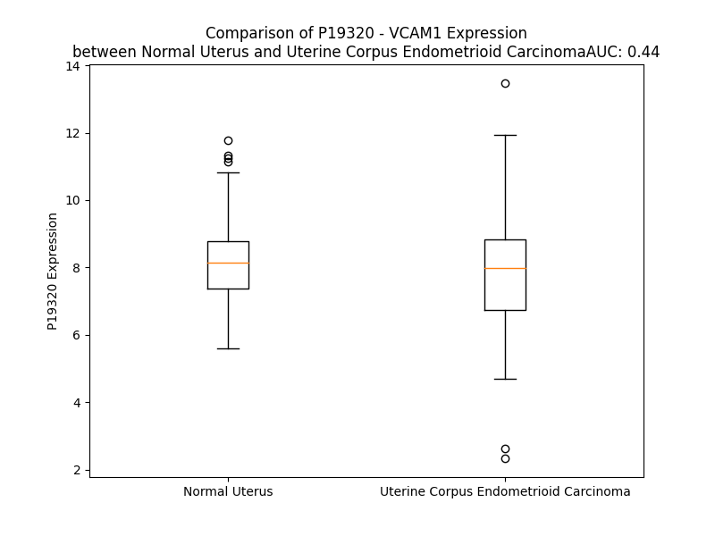

# Detailed Data for P19320

## Introduction to the Detailed Summary

### How to Interpret the Results

- **Summary & Metrics**: This section provides a quick reference to essential protein attributes, including expression changes, family classification, and biomarker applications. Regulation status (upregulated/downregulated) indicates the protein's behavior in a disease context. Some information comes from the original excel file with the proteins selected from literature, while others are derived from the analyses.
- **Expression Comparison**: A visual representation comparing protein expression between normal and disease states. It highlights significant changes in expression levels that might indicate diagnostic or therapeutic relevance. This is data coming from transcriptomics experiments and could not translate similarly to protein levels.
- **Isoform Alignment**: An interactive view of isoform alignments, revealing structural and functional differences between variants of the protein.
- **Interactors & Homologs**: Tables listing known interaction partners and homologous proteins, the more interactors and homologs, the more complex the protein is to design an antibody for.
- **Biological Assemblies**: Information about the structural arrangement of the protein in different assemblies, providing insights into its functional state but also the complexity of the protein to develop antibodies.
- **Combined Per-Residue Information**: A detailed table summarizing residue-level data. This includes predictions for epitope regions, aggregation tendencies, and modifications that might impact the protein's function. Each row corresponds to a residue in the protein, providing insights into specific sites that may be important for research or drug development.
## Summary & Metrics

- **UniProt Accession**: P19320
- **Gene Name**: VCAM1
- **Protein Name**: Vascular cell adhesion protein 1 / sVCAM-1
- **Swiss Prot**: VCAM1_HUMAN
- **Family**: transmembrane receptor
- **Biomarker Application**: diagnosis,disease progression,efficacy,prognosis,unspecified application
- **Number of Isoforms**: 3
- **Regulation**: -1
- **(transcriptomics) AUC**: 0.44
- **(transcriptomics) Fold Change**: 1.04
- **(transcriptomics) Regulation**: Downregulated
- **Discotope Epitope Count**: 159
- **Max n_uniprots (Homo)**: 2
- **Max n_uniprots (Hetero)**: N/A

## Expression Comparison

## Isoform Alignment

<pre style='font-size:14px; font-family:monospace;'>P19320-1 MPGKMVVILGASNILWIMFAASQAFKIETTPESRYLAQIGDSVSLTCSTTGCESPFFSWRTQIDSPLNGKVTNEGTTSTLTMNPVSFGNEHSYLCTATCESRKLEKGIQVEIYSFPKDPEIHLSGPLEAGKPITVKCSVADVYPFDRLEIDLLKGDHLMKSQEFLEDADRKSLETKSLEVTFTPVIEDIGKVLVCRAKLHIDEMDSVPTVRQAVKELQVYISPKNTVISVNPSTKLQEGGSVTMTCSSEGLPAPEIFWSKKLDNGNLQHLSGNATLTLIAMRMEDSGIYVCEGVNLIGKNRKEVELIVQEKPFTVEISPGPRIAAQIGDSVMLTCSVMGCESPSFSWRTQIDSPLSGKVRSEGTNSTLTLSPVSFENEHSYLCTVTCGHKKLEKGIQVELYSFPRDPEIEMSGGLVNGSSVTVSCKVPSVYPLDRLEIELLKGETILENIEFLEDTDMKSLENKSLEMTFIPTIEDTGKALVCQAKLHIDDMEFEPKQRQSTQTLYVNVAPRDTTVLVSPSSILEEGSSVNMTCLSQGFPAPKILWSRQLPNGELQPLSENATLTLISTKMEDSGVYLCEGINQAGRSRKEVELIIQVTPKDIKLTAFPSESVKEGDTVIISCTCGNVPETWIILKKKAETGDTVLKSIDGAYTIRKAQLKDAGVYECESKNKVGSQLRSLTLDVQGRENNKDYFSPELLVLYFASSLIIPAIGMIIYFARKANMKGSYSLVEAQKSKV
P19320-2 MPGKMVVILGASNILWIMFAASQAFKIETTPESRYLAQIGDSVSLTCSTTGCESPFFSWRTQIDSPLNGKVTNEGTTSTLTMNPVSFGNEHSYLCTATCESRKLEKGIQVEIYSFPKDPEIHLSGPLEAGKPITVKCSVADVYPFDRLEIDLLKGDHLMKSQEFLEDADRKSLETKSLEVTFTPVIEDIGKVLVCRAKLHIDEMDSVPTVRQAVKELQVYISPKNTVISVNPSTKLQEGGSVTMTCSSEGLPAPEIFWSKKLDNGNLQHLSGNATLTLIAMRMEDSGIYVCEGVNLIGKNRKEVELIVQ--------------------------------------------------------------------------------------------AFPRDPEIEMSGGLVNGSSVTVSCKVPSVYPLDRLEIELLKGETILENIEFLEDTDMKSLENKSLEMTFIPTIEDTGKALVCQAKLHIDDMEFEPKQRQSTQTLYVNVAPRDTTVLVSPSSILEEGSSVNMTCLSQGFPAPKILWSRQLPNGELQPLSENATLTLISTKMEDSGVYLCEGINQAGRSRKEVELIIQVTPKDIKLTAFPSESVKEGDTVIISCTCGNVPETWIILKKKAETGDTVLKSIDGAYTIRKAQLKDAGVYECESKNKVGSQLRSLTLDVQGRENNKDYFSPELLVLYFASSLIIPAIGMIIYFARKANMKGSYSLVEAQKSKV
P19320-3 MPGKMVVILGASNILWIMFAASQAFKIETTPESRYLAQIGDSVSLTCSTTG--------------------------------------------------------------SFPKDPEIHLSGPLEAGKPITVKCSVADVYPFDRLEIDLLKGDHLMKSQEFLEDADRKSLETKSLEVTFTPVIEDIGKVLVCRAKLHIDEMDSVPTVRQAVKELQVYISPKNTVISVNPSTKLQEGGSVTMTCSSEGLPAPEIFWSKKLDNGNLQHLSGNATLTLIAMRMEDSGIYVCEGVNLIGKNRKEVELIVQEKPFTVEISPGPRIAAQIGDSVMLTCSVMGCESPSFSWRTQIDSPLSGKVRSEGTNSTLTLSPVSFENEHSYLCTVTCGHKKLEKGIQVELYSFPRDPEIEMSGGLVNGSSVTVSCKVPSVYPLDRLEIELLKGETILENIEFLEDTDMKSLENKSLEMTFIPTIEDTGKALVCQAKLHIDDMEFEPKQRQSTQTLYVNVAPRDTTVLVSPSSILEEGSSVNMTCLSQGFPAPKILWSRQLPNGELQPLSENATLTLISTKMEDSGVYLCEGINQAGRSRKEVELIIQVTPKDIKLTAFPSESVKEGDTVIISCTCGNVPETWIILKKKAETGDTVLKSIDGAYTIRKAQLKDAGVYECESKNKVGSQLRSLTLDVQGRENNKDYFSPELLVLYFASSLIIPAIGMIIYFARKANMKGSYSLVEAQKSKV
</pre>

## Interactors

| preferredName_A   | preferredName_B   |   score |
|:------------------|:------------------|--------:|
| VCAM1             | ITGB1             |   0.999 |
| VCAM1             | ITGA4             |   0.999 |
| VCAM1             | ICAM1             |   0.999 |
| VCAM1             | ITGB2             |   0.998 |
| VCAM1             | CD44              |   0.994 |
| VCAM1             | ITGAL             |   0.992 |
| VCAM1             | ITGAM             |   0.991 |
| VCAM1             | SELPLG            |   0.99  |
| VCAM1             | ITGA9             |   0.989 |
| VCAM1             | FN1               |   0.983 |
| VCAM1             | MSN               |   0.982 |
| VCAM1             | EZR               |   0.98  |
| VCAM1             | SELE              |   0.979 |
| VCAM1             | CXCR4             |   0.978 |
| VCAM1             | ITGB7             |   0.974 |
| VCAM1             | ITGAD             |   0.973 |
| VCAM1             | SELL              |   0.97  |
| VCAM1             | SPARC             |   0.965 |
| VCAM1             | SELP              |   0.963 |
| VCAM1             | CYBB              |   0.959 |
| VCAM1             | NCF1              |   0.942 |
| VCAM1             | CYBA              |   0.938 |
| VCAM1             | ITGAX             |   0.936 |
| VCAM1             | NCF2              |   0.928 |
| VCAM1             | TNF               |   0.923 |
| VCAM1             | IL6               |   0.921 |
| VCAM1             | NCF4              |   0.92  |
| VCAM1             | IGBP1             |   0.91  |
| VCAM1             | CCL2              |   0.907 |

## Homologs

| uniprot_id   | gene_id   |
|:-------------|:----------|
| F8VWS7       | CNTN6     |
| P32004       | L1CAM     |
| Q9P232       | CNTN3     |
| C9JMQ2       | CNTN4     |
| F8W6X9       | SDK1      |
| A0A087X0M8   | CHL1      |
| Q58EX2       | SDK2      |
| A0A087WZ85   | ROBO1     |
| A0A087WUI7   | DSCAM     |
| A0A7P0Z4R6   | NFASC     |
| E9PP71       | DSCAML1   |
| Q6WRI0       | IGSF10    |
| F8W703       | ROBO2     |
| Q8N0Z9       | VSIG10    |
| A0A804HL16   | CDON      |
| Q96DN7       | BOC       |
| Q9NR99       | MXRA5     |
| H0YNQ1       | IGDCC3    |
| J3QKL2       | DCC       |
| Q9P2J2       | IGSF9     |
| B4DYV8       | ROBO4     |
| F8W122       | PTPRQ     |
| Q8TDY8       | IGDCC4    |
| O15394       | NCAM2     |
| A0A087WY63   | HMCN2     |
| Q9UPX0       | IGSF9B    |
| Q02246       | CNTN2     |
| O94779       | CNTN5     |
| F5H0K7       | ROBO3     |
| Q86VR7       | VSIG10L   |
| Q96ID5       | IGSF21    |
| Q12860       | CNTN1     |
| A0A087WWD4   | NCAM1     |
| Q59FP8       | NEO1      |
| C9JH43       | NRCAM     |
| H0YLT7       | PRTG      |

## Biological Assemblies

|   Unnamed: 0 |   assembly |   n_uniprots | composition   | crystal_id   |
|-------------:|-----------:|-------------:|:--------------|:-------------|
|            0 |          1 |            1 | Homo          | 1ij9         |
|            0 |          1 |            1 | Homo          | 1vca         |
|            1 |          2 |            1 | Homo          | 1vca         |
|            0 |          1 |            2 | Homo          | 1vsc         |

## Combined Per-Residue Information

|   res | aa   |   epitope_score | epitope   |   relative_surface_accessibility |   modeling_confidence |   Aggregation | modification   | glycosylation                   |
|------:|:-----|----------------:|:----------|---------------------------------:|----------------------:|--------------:|:---------------|:--------------------------------|
|     1 | M    |         0.11839 | True      |                          1.30871 |                 33.84 |         0     | N/A            | N/A                             |
|     2 | P    |         0.19911 | True      |                          1.03004 |                 46.19 |         0     | N/A            | N/A                             |
|     3 | G    |         0.24039 | True      |                          0.93591 |                 39.52 |         0     | N/A            | N/A                             |
|     4 | K    |         0.12892 | True      |                          0.98298 |                 34.2  |         0     | N/A            | N/A                             |
|     5 | M    |         0.14441 | True      |                          1.00516 |                 39.56 |        34.337 | N/A            | N/A                             |
|     6 | V    |         0.10699 | False     |                          0.79369 |                 34.41 |        63.424 | N/A            | N/A                             |
|     7 | V    |         0.12676 | True      |                          0.98519 |                 38.61 |        70.171 | N/A            | N/A                             |
|     8 | I    |         0.19445 | True      |                          0.7686  |                 34.2  |        70.745 | N/A            | N/A                             |
|     9 | L    |         0.26968 | True      |                          1.07625 |                 31.69 |        70.797 | N/A            | N/A                             |
|    10 | G    |         0.22305 | True      |                          0.90841 |                 34.72 |        69.612 | N/A            | N/A                             |
|    11 | A    |         0.10357 | False     |                          1.05056 |                 32.49 |        69.517 | N/A            | N/A                             |
|    12 | S    |         0.13431 | True      |                          0.77282 |                 34.5  |        69.458 | N/A            | N/A                             |
|    13 | N    |         0.10355 | False     |                          0.95618 |                 34.23 |        70.467 | N/A            | N/A                             |
|    14 | I    |         0.13093 | True      |                          0.99851 |                 40.91 |        96.209 | N/A            | N/A                             |
|    15 | L    |         0.14114 | True      |                          0.89826 |                 34.2  |        98.488 | N/A            | N/A                             |
|    16 | W    |         0.14899 | True      |                          0.82128 |                 32.64 |        98.711 | N/A            | N/A                             |
|    17 | I    |         0.08481 | False     |                          0.91078 |                 38.63 |        98.58  | N/A            | N/A                             |
|    18 | M    |         0.12918 | True      |                          0.81219 |                 34.03 |        96.789 | N/A            | N/A                             |
|    19 | F    |         0.10465 | False     |                          0.90189 |                 37.9  |        93.982 | N/A            | N/A                             |
|    20 | A    |         0.13306 | True      |                          1.00692 |                 38    |        58.709 | N/A            | N/A                             |
|    21 | A    |         0.09204 | False     |                          0.74707 |                 42.7  |        28.754 | N/A            | N/A                             |
|    22 | S    |         0.13482 | True      |                          0.87722 |                 50.83 |         3.4   | N/A            | N/A                             |
|    23 | Q    |         0.13259 | True      |                          0.65928 |                 61.28 |         0.256 | N/A            | N/A                             |
|    24 | A    |         0.13386 | True      |                          0.64301 |                 78.17 |         0.174 | N/A            | N/A                             |
|    25 | F    |         0.06099 | False     |                          0.12766 |                 86.44 |         0.16  | N/A            | N/A                             |
|    26 | K    |         0.09175 | False     |                          0.58909 |                 89.03 |         0.016 | N/A            | N/A                             |
|    27 | I    |         0.06209 | False     |                          0.13237 |                 91.34 |         0.016 | N/A            | N/A                             |
|    28 | E    |         0.06573 | False     |                          0.45615 |                 92.02 |         0.016 | N/A            | N/A                             |
|    29 | T    |         0.05223 | False     |                          0.02442 |                 91.41 |         0.006 | N/A            | N/A                             |
|    30 | T    |         0.09427 | False     |                          0.59861 |                 90.32 |         0     | N/A            | N/A                             |
|    31 | P    |         0.07734 | False     |                          0.26245 |                 89.22 |         0     | N/A            | N/A                             |
|    32 | E    |         0.0892  | False     |                          0.6942  |                 85.65 |         0     | N/A            | N/A                             |
|    33 | S    |         0.10279 | False     |                          0.53728 |                 85.75 |         0     | N/A            | N/A                             |
|    34 | R    |         0.08069 | False     |                          0.50562 |                 87.86 |         0     | N/A            | N/A                             |
|    35 | Y    |         0.0774  | False     |                          0.35109 |                 88.47 |         1.104 | N/A            | N/A                             |
|    36 | L    |         0.05039 | False     |                          0.15686 |                 88.82 |         1.104 | N/A            | N/A                             |
|    37 | A    |         0.00358 | False     |                          0.00765 |                 89.14 |         1.104 | N/A            | N/A                             |
|    38 | Q    |         0.01904 | False     |                          0.19069 |                 89.79 |         1.104 | N/A            | N/A                             |
|    39 | I    |         0.06624 | False     |                          0.16104 |                 91.4  |         1.104 | N/A            | N/A                             |
|    40 | G    |         0.11212 | True      |                          0.58516 |                 89.88 |         0     | N/A            | N/A                             |
|    41 | D    |         0.06416 | False     |                          0.43259 |                 90.17 |         0     | N/A            | N/A                             |
|    42 | S    |         0.14416 | True      |                          0.53904 |                 92.65 |         0     | N/A            | N/A                             |
|    43 | V    |         0.01765 | False     |                          0.04094 |                 91.08 |         0     | N/A            | N/A                             |
|    44 | S    |         0.15299 | True      |                          0.42646 |                 92.91 |         0     | N/A            | N/A                             |
|    45 | L    |         0.00259 | False     |                          0       |                 94.06 |         0     | N/A            | N/A                             |
|    46 | T    |         0.05337 | False     |                          0.25944 |                 93.97 |         0     | N/A            | N/A                             |
|    47 | C    |         0.00304 | False     |                          0       |                 94.03 |         0     | N/A            | N/A                             |
|    48 | S    |         0.04468 | False     |                          0.23138 |                 92.43 |         0     | N/A            | N/A                             |
|    49 | T    |         0.03503 | False     |                          0.03941 |                 91.61 |         0     | N/A            | N/A                             |
|    50 | T    |         0.07294 | False     |                          0.39919 |                 89.25 |         0     | N/A            | N/A                             |
|    51 | G    |         0.05804 | False     |                          0.40822 |                 86.36 |         0     | N/A            | N/A                             |
|    52 | C    |         0.05064 | False     |                          0.09047 |                 85.24 |         0     | N/A            | N/A                             |
|    53 | E    |         0.1693  | True      |                          0.89042 |                 81.53 |         0     | N/A            | N/A                             |
|    54 | S    |         0.23665 | True      |                          0.7699  |                 85.9  |         0     | N/A            | N/A                             |
|    55 | P    |         0.03503 | False     |                          0.12921 |                 90.24 |         0.162 | N/A            | N/A                             |
|    56 | F    |         0.1722  | True      |                          0.72119 |                 92.35 |         0.162 | N/A            | N/A                             |
|    57 | F    |         0.04058 | False     |                          0.06217 |                 93.48 |         0.162 | N/A            | N/A                             |
|    58 | S    |         0.10211 | False     |                          0.38096 |                 92.79 |         0.162 | N/A            | N/A                             |
|    59 | W    |         0.06128 | False     |                          0.09636 |                 94.08 |         0.162 | N/A            | N/A                             |
|    60 | R    |         0.18253 | True      |                          0.43094 |                 93.4  |         0     | N/A            | N/A                             |
|    61 | T    |         0.02128 | False     |                          0.00409 |                 92.77 |         0     | N/A            | N/A                             |
|    62 | Q    |         0.16765 | True      |                          0.60822 |                 88.91 |         0     | N/A            | N/A                             |
|    63 | I    |         0.13581 | True      |                          0.7332  |                 88.08 |         0     | N/A            | N/A                             |
|    64 | D    |         0.27871 | True      |                          0.7092  |                 84.41 |         0     | N/A            | N/A                             |
|    65 | S    |         0.0986  | False     |                          0.2165  |                 87.57 |         0     | N/A            | N/A                             |
|    66 | P    |         0.25891 | True      |                          0.73235 |                 88.69 |         0     | N/A            | N/A                             |
|    67 | L    |         0.09786 | False     |                          0.24561 |                 90.75 |         0     | N/A            | N/A                             |
|    68 | N    |         0.12655 | True      |                          0.4396  |                 89.41 |         0     | N/A            | N/A                             |
|    69 | G    |         0.0703  | False     |                          0.41922 |                 90.24 |         0     | N/A            | N/A                             |
|    70 | K    |         0.15443 | True      |                          0.72764 |                 92.75 |         0     | N/A            | N/A                             |
|    71 | V    |         0.08135 | False     |                          0.39108 |                 93.95 |         0     | N/A            | N/A                             |
|    72 | T    |         0.08145 | False     |                          0.39477 |                 93.04 |         0     | N/A            | N/A                             |
|    73 | N    |         0.12544 | True      |                          0.56821 |                 91.55 |         0     | N/A            | N/A                             |
|    74 | E    |         0.11451 | True      |                          0.67988 |                 88.6  |         0     | N/A            | N/A                             |
|    75 | G    |         0.16058 | True      |                          0.79058 |                 86.99 |         0     | N/A            | N/A                             |
|    76 | T    |         0.08325 | False     |                          0.37995 |                 91.2  |         0     | N/A            | N/A                             |
|    77 | T    |         0.07374 | False     |                          0.32709 |                 92.83 |         0     | N/A            | N/A                             |
|    78 | S    |         0.01096 | False     |                          0.00104 |                 94.18 |         0     | N/A            | N/A                             |
|    79 | T    |         0.07455 | False     |                          0.20306 |                 95.34 |         0     | N/A            | N/A                             |
|    80 | L    |         0.00971 | False     |                          0       |                 94.6  |         0     | N/A            | N/A                             |
|    81 | T    |         0.07645 | False     |                          0.25838 |                 94.22 |         0     | N/A            | N/A                             |
|    82 | M    |         0.01035 | False     |                          0       |                 94    |         0     | N/A            | N/A                             |
|    83 | N    |         0.26648 | True      |                          0.68858 |                 91.96 |         0     | N/A            | N/A                             |
|    84 | P    |         0.27902 | True      |                          0.62627 |                 91.98 |         0     | N/A            | N/A                             |
|    85 | V    |         0.02081 | False     |                          0.01619 |                 92.46 |         0     | N/A            | N/A                             |
|    86 | S    |         0.06658 | False     |                          0.35495 |                 91.85 |         0     | N/A            | N/A                             |
|    87 | F    |         0.04769 | False     |                          0.27781 |                 90.62 |         0     | N/A            | N/A                             |
|    88 | G    |         0.07908 | False     |                          0.31603 |                 88.17 |         0     | N/A            | N/A                             |
|    89 | N    |         0.00675 | False     |                          0.00382 |                 91.58 |         0     | N/A            | N/A                             |
|    90 | E    |         0.06488 | False     |                          0.22725 |                 89.97 |         0     | N/A            | N/A                             |
|    91 | H    |         0.0372  | False     |                          0.19574 |                 90.64 |         0     | N/A            | N/A                             |
|    92 | S    |         0.12839 | True      |                          0.26691 |                 92.45 |         0     | N/A            | N/A                             |
|    93 | Y    |         0.00554 | False     |                          0.00045 |                 93.66 |         0     | N/A            | N/A                             |
|    94 | L    |         0.11819 | True      |                          0.18713 |                 93.75 |         0     | N/A            | N/A                             |
|    95 | C    |         0.00177 | False     |                          0       |                 93.73 |         0     | N/A            | N/A                             |
|    96 | T    |         0.06314 | False     |                          0.09451 |                 93.55 |         0     | N/A            | N/A                             |
|    97 | A    |         0.00528 | False     |                          0       |                 92.59 |         0     | N/A            | N/A                             |
|    98 | T    |         0.06611 | False     |                          0.16518 |                 91.95 |         0     | N/A            | N/A                             |
|    99 | C    |         0.04319 | False     |                          0.17073 |                 88.2  |         0     | N/A            | N/A                             |
|   100 | E    |         0.1587  | True      |                          0.89508 |                 83.15 |         0     | N/A            | N/A                             |
|   101 | S    |         0.23375 | True      |                          0.82163 |                 83.24 |         0     | N/A            | N/A                             |
|   102 | R    |         0.27391 | True      |                          0.67109 |                 88.24 |         0     | N/A            | N/A                             |
|   103 | K    |         0.28881 | True      |                          0.71462 |                 90.63 |         0     | N/A            | N/A                             |
|   104 | L    |         0.10825 | False     |                          0.4097  |                 92.9  |         0     | N/A            | N/A                             |
|   105 | E    |         0.20189 | True      |                          0.4417  |                 92.29 |         0     | N/A            | N/A                             |
|   106 | K    |         0.07757 | False     |                          0.32221 |                 92.82 |         0     | N/A            | N/A                             |
|   107 | G    |         0.14734 | True      |                          0.42177 |                 91.2  |         0     | N/A            | N/A                             |
|   108 | I    |         0.00924 | False     |                          0.0064  |                 92.97 |         0     | N/A            | N/A                             |
|   109 | Q    |         0.09711 | False     |                          0.44831 |                 91.88 |         0     | N/A            | N/A                             |
|   110 | V    |         0.00843 | False     |                          0.01196 |                 91.28 |         0     | N/A            | N/A                             |
|   111 | E    |         0.03303 | False     |                          0.39843 |                 89.88 |         0     | N/A            | N/A                             |
|   112 | I    |         0.02686 | False     |                          0.03725 |                 90.19 |         0     | N/A            | N/A                             |
|   113 | Y    |         0.05361 | False     |                          0.0898  |                 90.91 |         0     | N/A            | N/A                             |
|   114 | S    |         0.02895 | False     |                          0.02135 |                 91.25 |         0     | N/A            | N/A                             |
|   115 | F    |         0.01693 | False     |                          0.02522 |                 91.13 |         0     | N/A            | N/A                             |
|   116 | P    |         0.07706 | False     |                          0.36172 |                 88.77 |         0     | N/A            | N/A                             |
|   117 | K    |         0.11072 | False     |                          0.5248  |                 89.91 |         0     | N/A            | N/A                             |
|   118 | D    |         0.07855 | False     |                          0.48005 |                 93.56 |         0     | N/A            | N/A                             |
|   119 | P    |         0.00978 | False     |                          0.03747 |                 94.73 |         0     | N/A            | N/A                             |
|   120 | E    |         0.0557  | False     |                          0.48042 |                 95.51 |         0     | N/A            | N/A                             |
|   121 | I    |         0.05174 | False     |                          0.172   |                 94.82 |         0     | N/A            | N/A                             |
|   122 | H    |         0.08134 | False     |                          0.47707 |                 93.87 |         0     | N/A            | N/A                             |
|   123 | L    |         0.06264 | False     |                          0.31922 |                 92.51 |         0     | N/A            | N/A                             |
|   124 | S    |         0.15071 | True      |                          0.66516 |                 92.09 |         0     | N/A            | N/A                             |
|   125 | G    |         0.03614 | False     |                          0.37133 |                 87.34 |         0     | N/A            | N/A                             |
|   126 | P    |         0.08003 | False     |                          0.64337 |                 86.9  |         0     | N/A            | N/A                             |
|   127 | L    |         0.02022 | False     |                          0.04642 |                 89.14 |         0     | N/A            | N/A                             |
|   128 | E    |         0.02149 | False     |                          0.10994 |                 89.75 |         0     | N/A            | N/A                             |
|   129 | A    |         0.07474 | False     |                          0.29666 |                 89.36 |         0     | N/A            | N/A                             |
|   130 | G    |         0.10343 | False     |                          0.65149 |                 87.96 |         0     | N/A            | N/A                             |
|   131 | K    |         0.06526 | False     |                          0.56756 |                 87.88 |         0     | N/A            | N/A                             |
|   132 | P    |         0.09833 | False     |                          0.71255 |                 92.63 |         0     | N/A            | N/A                             |
|   133 | I    |         0.02315 | False     |                          0.0408  |                 92.6  |         0     | N/A            | N/A                             |
|   134 | T    |         0.05723 | False     |                          0.30969 |                 94.07 |         0     | N/A            | N/A                             |
|   135 | V    |         0.00175 | False     |                          0       |                 94.28 |         0     | N/A            | N/A                             |
|   136 | K    |         0.05894 | False     |                          0.37234 |                 95.26 |         0     | N/A            | N/A                             |
|   137 | C    |         0.00094 | False     |                          0       |                 95.67 |         0     | N/A            | N/A                             |
|   138 | S    |         0.02549 | False     |                          0.08399 |                 94.97 |         0     | N/A            | N/A                             |
|   139 | V    |         0.00334 | False     |                          0.00095 |                 94.6  |         0     | N/A            | N/A                             |
|   140 | A    |         0.04976 | False     |                          0.27049 |                 93.01 |         0     | N/A            | N/A                             |
|   141 | D    |         0.0338  | False     |                          0.26814 |                 91.47 |         0     | N/A            | N/A                             |
|   142 | V    |         0.00465 | False     |                          0       |                 91.11 |         0     | N/A            | N/A                             |
|   143 | Y    |         0.06043 | False     |                          0.0903  |                 89.86 |         0     | N/A            | N/A                             |
|   144 | P    |         0.07546 | False     |                          0.19782 |                 88.79 |         0     | N/A            | N/A                             |
|   145 | F    |         0.04129 | False     |                          0.04058 |                 87.05 |         0     | N/A            | N/A                             |
|   146 | D    |         0.10904 | False     |                          0.28257 |                 86    |         0     | N/A            | N/A                             |
|   147 | R    |         0.06474 | False     |                          0.42204 |                 88.04 |         0     | N/A            | N/A                             |
|   148 | L    |         0.0063  | False     |                          0.01192 |                 90.91 |         0     | N/A            | N/A                             |
|   149 | E    |         0.03714 | False     |                          0.18889 |                 92.57 |         0     | N/A            | N/A                             |
|   150 | I    |         0.00395 | False     |                          0       |                 94.6  |         0     | N/A            | N/A                             |
|   151 | D    |         0.03385 | False     |                          0.04902 |                 94.91 |         0     | N/A            | N/A                             |
|   152 | L    |         0.00527 | False     |                          0       |                 94.86 |         0     | N/A            | N/A                             |
|   153 | L    |         0.06786 | False     |                          0.1657  |                 94.43 |         0     | N/A            | N/A                             |
|   154 | K    |         0.09599 | False     |                          0.18989 |                 92.38 |         0     | N/A            | N/A                             |
|   155 | G    |         0.058   | False     |                          0.27983 |                 87.12 |         0     | N/A            | N/A                             |
|   156 | D    |         0.16977 | True      |                          0.93188 |                 85.74 |         0     | N/A            | N/A                             |
|   157 | H    |         0.1465  | True      |                          0.67707 |                 91.32 |         0     | N/A            | N/A                             |
|   158 | L    |         0.10606 | False     |                          0.53812 |                 92.93 |         0     | N/A            | N/A                             |
|   159 | M    |         0.05002 | False     |                          0.20823 |                 91.9  |         0     | N/A            | N/A                             |
|   160 | K    |         0.10642 | False     |                          0.4234  |                 94.02 |         0     | N/A            | N/A                             |
|   161 | S    |         0.13207 | True      |                          0.40523 |                 93.33 |         0     | N/A            | N/A                             |
|   162 | Q    |         0.07841 | False     |                          0.32409 |                 91.62 |         0     | N/A            | N/A                             |
|   163 | E    |         0.15317 | True      |                          0.53652 |                 88.88 |         0     | N/A            | N/A                             |
|   164 | F    |         0.07077 | False     |                          0.12226 |                 84.74 |         0     | N/A            | N/A                             |
|   165 | L    |         0.13023 | True      |                          0.9386  |                 73.75 |         0     | N/A            | N/A                             |
|   166 | E    |         0.12996 | True      |                          0.47259 |                 67.44 |         0     | N/A            | N/A                             |
|   167 | D    |         0.11997 | True      |                          0.8045  |                 60.83 |         0     | N/A            | N/A                             |
|   168 | A    |         0.14659 | True      |                          0.74093 |                 59.7  |         0     | N/A            | N/A                             |
|   169 | D    |         0.18672 | True      |                          0.86754 |                 63.57 |         0     | N/A            | N/A                             |
|   170 | R    |         0.18867 | True      |                          0.64738 |                 69.81 |         0     | N/A            | N/A                             |
|   171 | K    |         0.14875 | True      |                          0.50985 |                 80.23 |         0     | N/A            | N/A                             |
|   172 | S    |         0.08222 | False     |                          0.19838 |                 85.93 |         0     | N/A            | N/A                             |
|   173 | L    |         0.1383  | True      |                          0.45382 |                 89.44 |         0     | N/A            | N/A                             |
|   174 | E    |         0.11866 | True      |                          0.17764 |                 87.71 |         0     | N/A            | N/A                             |
|   175 | T    |         0.13086 | True      |                          0.59152 |                 91.73 |         0     | N/A            | N/A                             |
|   176 | K    |         0.11166 | True      |                          0.08694 |                 92.22 |         0     | N/A            | N/A                             |
|   177 | S    |         0.11466 | True      |                          0.29968 |                 93.41 |         0     | N/A            | N/A                             |
|   178 | L    |         0.04206 | False     |                          0.01566 |                 93.12 |         0     | N/A            | N/A                             |
|   179 | E    |         0.13724 | True      |                          0.42297 |                 94.23 |         0     | N/A            | N/A                             |
|   180 | V    |         0.05485 | False     |                          0.15696 |                 93.8  |         0     | N/A            | N/A                             |
|   181 | T    |         0.11213 | True      |                          0.57971 |                 93.73 |         0     | N/A            | N/A                             |
|   182 | F    |         0.08733 | False     |                          0.11583 |                 92.75 |         0     | N/A            | N/A                             |
|   183 | T    |         0.17958 | True      |                          0.4541  |                 92.69 |         0     | N/A            | N/A                             |
|   184 | P    |         0.00437 | False     |                          0       |                 91.06 |         0     | N/A            | N/A                             |
|   185 | V    |         0.06613 | False     |                          0.47128 |                 91.3  |         0     | N/A            | N/A                             |
|   186 | I    |         0.09218 | False     |                          0.56702 |                 86.11 |         0     | N/A            | N/A                             |
|   187 | E    |         0.14357 | True      |                          0.71569 |                 88.45 |         0     | N/A            | N/A                             |
|   188 | D    |         0.00755 | False     |                          0.0037  |                 89.51 |         0.187 | N/A            | N/A                             |
|   189 | I    |         0.1087  | False     |                          0.49807 |                 88.09 |         0.187 | N/A            | N/A                             |
|   190 | G    |         0.12855 | True      |                          0.52428 |                 85.82 |         0.187 | N/A            | N/A                             |
|   191 | K    |         0.10681 | False     |                          0.38756 |                 91.39 |         0.187 | N/A            | N/A                             |
|   192 | V    |         0.05647 | False     |                          0.35554 |                 93.28 |         0.187 | N/A            | N/A                             |
|   193 | L    |         0.00281 | False     |                          0       |                 94.19 |         0.187 | N/A            | N/A                             |
|   194 | V    |         0.05944 | False     |                          0.1828  |                 95.42 |         0.187 | N/A            | N/A                             |
|   195 | C    |         0.00137 | False     |                          0       |                 95.71 |         0     | N/A            | N/A                             |
|   196 | R    |         0.09826 | False     |                          0.38887 |                 95.09 |         0     | N/A            | N/A                             |
|   197 | A    |         0.00349 | False     |                          0       |                 94.11 |         0     | N/A            | N/A                             |
|   198 | K    |         0.08168 | False     |                          0.36802 |                 92.1  |         0     | N/A            | N/A                             |
|   199 | L    |         0.00566 | False     |                          0.00082 |                 89.93 |         0     | N/A            | N/A                             |
|   200 | H    |         0.07718 | False     |                          0.45203 |                 86.61 |         0     | N/A            | N/A                             |
|   201 | I    |         0.04675 | False     |                          0.18896 |                 80.34 |         0     | N/A            | N/A                             |
|   202 | D    |         0.10184 | False     |                          0.65795 |                 68.86 |         0     | N/A            | N/A                             |
|   203 | E    |         0.13843 | True      |                          0.82093 |                 58.33 |         0     | N/A            | N/A                             |
|   204 | M    |         0.10921 | False     |                          0.37415 |                 59.14 |         0     | N/A            | N/A                             |
|   205 | D    |         0.20405 | True      |                          0.99106 |                 57.32 |         0     | N/A            | N/A                             |
|   206 | S    |         0.14005 | True      |                          0.73134 |                 64.28 |         0     | N/A            | N/A                             |
|   207 | V    |         0.08419 | False     |                          0.2329  |                 66.2  |         0     | N/A            | N/A                             |
|   208 | P    |         0.11358 | True      |                          0.64242 |                 67.84 |         0     | N/A            | N/A                             |
|   209 | T    |         0.08357 | False     |                          0.29859 |                 81.72 |         0     | N/A            | N/A                             |
|   210 | V    |         0.14662 | True      |                          0.46625 |                 90.39 |         0     | N/A            | N/A                             |
|   211 | R    |         0.09315 | False     |                          0.22765 |                 92.3  |         0     | N/A            | N/A                             |
|   212 | Q    |         0.18314 | True      |                          0.51771 |                 94.16 |         0     | N/A            | N/A                             |
|   213 | A    |         0.03532 | False     |                          0.20407 |                 94.31 |         0     | N/A            | N/A                             |
|   214 | V    |         0.1342  | True      |                          0.60345 |                 94.14 |         0.151 | N/A            | N/A                             |
|   215 | K    |         0.08529 | False     |                          0.49428 |                 92.33 |         0.151 | N/A            | N/A                             |
|   216 | E    |         0.08966 | False     |                          0.554   |                 91.91 |         0.151 | N/A            | N/A                             |
|   217 | L    |         0.00824 | False     |                          0.00366 |                 89.79 |        14.022 | N/A            | N/A                             |
|   218 | Q    |         0.06941 | False     |                          0.54712 |                 86.8  |        14.022 | N/A            | N/A                             |
|   219 | V    |         0.02812 | False     |                          0.05081 |                 89.43 |        14.022 | N/A            | N/A                             |
|   220 | Y    |         0.05671 | False     |                          0.22952 |                 90.44 |        14.022 | N/A            | N/A                             |
|   221 | I    |         0.11766 | True      |                          0.15599 |                 89.15 |        14.022 | N/A            | N/A                             |
|   222 | S    |         0.07068 | False     |                          0.23901 |                 90.68 |         0     | N/A            | N/A                             |
|   223 | P    |         0.03893 | False     |                          0.05878 |                 93.21 |         0     | N/A            | N/A                             |
|   224 | K    |         0.126   | True      |                          0.5092  |                 91.02 |         0     | N/A            | N/A                             |
|   225 | N    |         0.14409 | True      |                          0.57586 |                 91.94 |         0     | N/A            | N/A                             |
|   226 | T    |         0.02611 | False     |                          0.06461 |                 92.94 |         2.403 | N/A            | N/A                             |
|   227 | V    |         0.09139 | False     |                          0.59786 |                 93.98 |         2.403 | N/A            | N/A                             |
|   228 | I    |         0.08174 | False     |                          0.1955  |                 95.13 |         2.403 | N/A            | N/A                             |
|   229 | S    |         0.05527 | False     |                          0.53688 |                 94.57 |         2.403 | N/A            | N/A                             |
|   230 | V    |         0.08749 | False     |                          0.27296 |                 94.32 |         2.403 | N/A            | N/A                             |
|   231 | N    |         0.07378 | False     |                          0.67255 |                 92.02 |         0     | N/A            | N/A                             |
|   232 | P    |         0.19248 | True      |                          0.71804 |                 90.22 |         0     | N/A            | N/A                             |
|   233 | S    |         0.07783 | False     |                          0.36629 |                 90.76 |         0     | N/A            | N/A                             |
|   234 | T    |         0.08251 | False     |                          0.37422 |                 91.31 |         0     | N/A            | N/A                             |
|   235 | K    |         0.07227 | False     |                          0.65642 |                 89.94 |         0     | N/A            | N/A                             |
|   236 | L    |         0.01718 | False     |                          0.07613 |                 87.88 |         0     | N/A            | N/A                             |
|   237 | Q    |         0.05619 | False     |                          0.5064  |                 83.29 |         0     | N/A            | N/A                             |
|   238 | E    |         0.04216 | False     |                          0.38485 |                 81.61 |         0     | N/A            | N/A                             |
|   239 | G    |         0.03698 | False     |                          0.61866 |                 80.79 |         0     | N/A            | N/A                             |
|   240 | G    |         0.06162 | False     |                          0.30262 |                 85.22 |         0     | N/A            | N/A                             |
|   241 | S    |         0.08333 | False     |                          0.45494 |                 91.43 |         0     | N/A            | N/A                             |
|   242 | V    |         0.0154  | False     |                          0.01388 |                 93.54 |         0     | N/A            | N/A                             |
|   243 | T    |         0.07673 | False     |                          0.34825 |                 94.56 |         0     | N/A            | N/A                             |
|   244 | M    |         0.00263 | False     |                          0       |                 94.8  |         0     | N/A            | N/A                             |
|   245 | T    |         0.05556 | False     |                          0.3759  |                 95.73 |         0     | N/A            | N/A                             |
|   246 | C    |         0.00581 | False     |                          0.02099 |                 95.27 |         0     | N/A            | N/A                             |
|   247 | S    |         0.06775 | False     |                          0.47957 |                 94.3  |         0     | N/A            | N/A                             |
|   248 | S    |         0.03235 | False     |                          0.14051 |                 93.9  |         0     | N/A            | N/A                             |
|   249 | E    |         0.14743 | True      |                          0.48297 |                 92.68 |         0     | N/A            | N/A                             |
|   250 | G    |         0.06973 | False     |                          0.20539 |                 89.66 |         0     | N/A            | N/A                             |
|   251 | L    |         0.13817 | True      |                          0.51414 |                 89.14 |         0     | N/A            | N/A                             |
|   252 | P    |         0.1554  | True      |                          0.409   |                 90.44 |         0     | N/A            | N/A                             |
|   253 | A    |         0.06365 | False     |                          0.79781 |                 91.21 |         0     | N/A            | N/A                             |
|   254 | P    |         0.0179  | False     |                          0.13578 |                 93.04 |         0     | N/A            | N/A                             |
|   255 | E    |         0.07325 | False     |                          0.60641 |                 94.08 |         0     | N/A            | N/A                             |
|   256 | I    |         0.02358 | False     |                          0.11326 |                 94.83 |         0     | N/A            | N/A                             |
|   257 | F    |         0.04541 | False     |                          0.3606  |                 94.99 |         0     | N/A            | N/A                             |
|   258 | W    |         0.0089  | False     |                          0       |                 96    |         0     | N/A            | N/A                             |
|   259 | S    |         0.03412 | False     |                          0.10216 |                 95.23 |         0     | N/A            | N/A                             |
|   260 | K    |         0.03798 | False     |                          0.16156 |                 93.71 |         0     | N/A            | N/A                             |
|   261 | K    |         0.07759 | False     |                          0.35794 |                 92.94 |         0     | N/A            | N/A                             |
|   262 | L    |         0.12539 | True      |                          0.43945 |                 89.7  |         0     | N/A            | N/A                             |
|   263 | D    |         0.15799 | True      |                          1.01843 |                 82.79 |         0     | N/A            | N/A                             |
|   264 | N    |         0.2187  | True      |                          0.67782 |                 85.76 |         0     | N/A            | N/A                             |
|   265 | G    |         0.12384 | True      |                          0.54673 |                 83.09 |         0     | N/A            | N/A                             |
|   266 | N    |         0.16434 | True      |                          0.56419 |                 88.49 |         0     | N/A            | N/A                             |
|   267 | L    |         0.13815 | True      |                          0.51111 |                 90.03 |         0     | N/A            | N/A                             |
|   268 | Q    |         0.12146 | True      |                          0.46709 |                 91.76 |         0     | N/A            | N/A                             |
|   269 | H    |         0.13748 | True      |                          0.60702 |                 92.71 |         0     | N/A            | N/A                             |
|   270 | L    |         0.07564 | False     |                          0.38975 |                 92.59 |         0     | N/A            | N/A                             |
|   271 | S    |         0.05445 | False     |                          0.17029 |                 92    |         0     | N/A            | N/A                             |
|   272 | G    |         0.21017 | True      |                          0.56037 |                 91.3  |         0     | N/A            | N/A                             |
|   273 | N    |         0.10281 | False     |                          0.61682 |                 91.37 |         0.175 | N/A            | N-linked (GlcNAc...) asparagine |
|   274 | A    |         0.07283 | False     |                          0.46167 |                 92.27 |         8.022 | N/A            | N/A                             |
|   275 | T    |         0.11059 | False     |                          0.46711 |                 93.42 |        16.843 | N/A            | N/A                             |
|   276 | L    |         0.04468 | False     |                          0.08326 |                 94.28 |        22.742 | N/A            | N/A                             |
|   277 | T    |         0.06519 | False     |                          0.55377 |                 93.33 |        23.324 | N/A            | N/A                             |
|   278 | L    |         0.05675 | False     |                          0.16734 |                 92.45 |        23.324 | N/A            | N/A                             |
|   279 | I    |         0.12557 | True      |                          0.7617  |                 90.83 |        22.914 | N/A            | N/A                             |
|   280 | A    |         0.056   | False     |                          0.62254 |                 88.01 |        12.946 | N/A            | N/A                             |
|   281 | M    |         0.01975 | False     |                          0.05645 |                 87.41 |         7.164 | N/A            | N/A                             |
|   282 | R    |         0.05602 | False     |                          0.58079 |                 87.45 |         0     | N/A            | N/A                             |
|   283 | M    |         0.04493 | False     |                          0.42358 |                 83.19 |         0     | N/A            | N/A                             |
|   284 | E    |         0.12336 | True      |                          0.67454 |                 84.97 |         0     | N/A            | N/A                             |
|   285 | D    |         0.06253 | False     |                          0.22678 |                 88.75 |         0     | N/A            | N/A                             |
|   286 | S    |         0.0474  | False     |                          0.2966  |                 90.17 |         0     | N/A            | N/A                             |
|   287 | G    |         0.02838 | False     |                          0.27778 |                 91.97 |         0     | N/A            | N/A                             |
|   288 | I    |         0.08978 | False     |                          0.34903 |                 94.57 |         0     | N/A            | N/A                             |
|   289 | Y    |         0.03378 | False     |                          0.02294 |                 94.62 |         0     | N/A            | N/A                             |
|   290 | V    |         0.01717 | False     |                          0.01424 |                 95.53 |         0     | N/A            | N/A                             |
|   291 | C    |         0.00142 | False     |                          0       |                 95.37 |         0     | N/A            | N/A                             |
|   292 | E    |         0.08494 | False     |                          0.14785 |                 95.11 |         0     | N/A            | N/A                             |
|   293 | G    |         0.00256 | False     |                          0       |                 94.75 |         0.385 | N/A            | N/A                             |
|   294 | V    |         0.07863 | False     |                          0.31828 |                 93.58 |         0.789 | N/A            | N/A                             |
|   295 | N    |         0.02249 | False     |                          0.11702 |                 91.11 |         0.789 | N/A            | N/A                             |
|   296 | L    |         0.17719 | True      |                          0.70036 |                 89.2  |         0.789 | N/A            | N/A                             |
|   297 | I    |         0.04343 | False     |                          0.17826 |                 89.38 |         0.789 | N/A            | N/A                             |
|   298 | G    |         0.06963 | False     |                          0.27679 |                 90.13 |         0.404 | N/A            | N/A                             |
|   299 | K    |         0.1567  | True      |                          0.59127 |                 93.18 |         0     | N/A            | N/A                             |
|   300 | N    |         0.06725 | False     |                          0.34799 |                 94.44 |         0     | N/A            | N/A                             |
|   301 | R    |         0.18199 | True      |                          0.57349 |                 94.1  |         0     | N/A            | N/A                             |
|   302 | K    |         0.0835  | False     |                          0.50294 |                 94.8  |         0     | N/A            | N/A                             |
|   303 | E    |         0.15929 | True      |                          0.39087 |                 95    |         0     | N/A            | N/A                             |
|   304 | V    |         0.07284 | False     |                          0.14281 |                 94.37 |         0     | N/A            | N/A                             |
|   305 | E    |         0.06422 | False     |                          0.52946 |                 94.6  |         0     | N/A            | N/A                             |
|   306 | L    |         0.00273 | False     |                          0.00552 |                 93.05 |         0     | N/A            | N/A                             |
|   307 | I    |         0.04091 | False     |                          0.40958 |                 91.08 |         0     | N/A            | N/A                             |
|   308 | V    |         0.00893 | False     |                          0.02186 |                 85.84 |         0     | N/A            | N/A                             |
|   309 | Q    |         0.0815  | False     |                          0.47966 |                 77    |         0     | N/A            | N/A                             |
|   310 | E    |         0.04807 | False     |                          0.31754 |                 67.52 |         0     | N/A            | N/A                             |
|   311 | K    |         0.07741 | False     |                          0.60628 |                 66.3  |         0     | N/A            | N/A                             |
|   312 | P    |         0.1508  | True      |                          0.6242  |                 73.24 |         0     | N/A            | N/A                             |
|   313 | F    |         0.05593 | False     |                          0.06123 |                 82.76 |         0     | N/A            | N/A                             |
|   314 | T    |         0.03521 | False     |                          0.51262 |                 87.59 |         0     | N/A            | N/A                             |
|   315 | V    |         0.02159 | False     |                          0.07794 |                 91.58 |         0     | N/A            | N/A                             |
|   316 | E    |         0.04949 | False     |                          0.50333 |                 92.76 |         0     | N/A            | N/A                             |
|   317 | I    |         0.04243 | False     |                          0.15577 |                 92.75 |         0     | N/A            | N/A                             |
|   318 | S    |         0.06828 | False     |                          0.45607 |                 91.49 |         0     | N/A            | N/A                             |
|   319 | P    |         0.18573 | True      |                          0.6478  |                 91.02 |         0     | N/A            | N/A                             |
|   320 | G    |         0.03132 | False     |                          0.18    |                 85.99 |         0     | N/A            | N/A                             |
|   321 | P    |         0.10399 | False     |                          0.75758 |                 89.11 |         0     | N/A            | N/A                             |
|   322 | R    |         0.05535 | False     |                          0.43503 |                 88.95 |         0     | N/A            | N/A                             |
|   323 | I    |         0.04706 | False     |                          0.22903 |                 89.38 |         0.557 | N/A            | N/A                             |
|   324 | A    |         0.02888 | False     |                          0.25835 |                 88.72 |         0.557 | N/A            | N/A                             |
|   325 | A    |         0.01286 | False     |                          0.06122 |                 89.04 |         0.557 | N/A            | N/A                             |
|   326 | Q    |         0.01616 | False     |                          0.23941 |                 88.66 |         0.557 | N/A            | N/A                             |
|   327 | I    |         0.09839 | False     |                          0.24761 |                 90.77 |         0.557 | N/A            | N/A                             |
|   328 | G    |         0.04567 | False     |                          0.57013 |                 89.49 |         0     | N/A            | N/A                             |
|   329 | D    |         0.06214 | False     |                          0.4516  |                 89.64 |         0     | N/A            | N/A                             |
|   330 | S    |         0.08118 | False     |                          0.54949 |                 91.28 |         0     | N/A            | N/A                             |
|   331 | V    |         0.01732 | False     |                          0.05617 |                 91.85 |         0.765 | N/A            | N/A                             |
|   332 | M    |         0.13103 | True      |                          0.60431 |                 93.39 |         0.765 | N/A            | N/A                             |
|   333 | L    |         0.0028  | False     |                          0       |                 94.52 |         0.765 | N/A            | N/A                             |
|   334 | T    |         0.04841 | False     |                          0.22718 |                 95.42 |         0.765 | N/A            | N/A                             |
|   335 | C    |         0.00118 | False     |                          0       |                 95.36 |         0.765 | N/A            | N/A                             |
|   336 | S    |         0.03606 | False     |                          0.24417 |                 93.92 |         0.574 | N/A            | N/A                             |
|   337 | V    |         0.0365  | False     |                          0.03237 |                 92.76 |         0.574 | N/A            | N/A                             |
|   338 | M    |         0.08462 | False     |                          0.5727  |                 89.44 |         0.295 | N/A            | N/A                             |
|   339 | G    |         0.04243 | False     |                          0.64623 |                 84.96 |         0     | N/A            | N/A                             |
|   340 | C    |         0.01874 | False     |                          0.05593 |                 85.08 |         0     | N/A            | N/A                             |
|   341 | E    |         0.12528 | True      |                          0.92117 |                 82.72 |         0     | N/A            | N/A                             |
|   342 | S    |         0.10805 | False     |                          0.75732 |                 86.5  |         0     | N/A            | N/A                             |
|   343 | P    |         0.02918 | False     |                          0.17834 |                 92.26 |         0     | N/A            | N/A                             |
|   344 | S    |         0.06083 | False     |                          0.50926 |                 93.48 |         0     | N/A            | N/A                             |
|   345 | F    |         0.03434 | False     |                          0.18064 |                 94.5  |         0     | N/A            | N/A                             |
|   346 | S    |         0.04993 | False     |                          0.48849 |                 93.67 |         0     | N/A            | N/A                             |
|   347 | W    |         0.02709 | False     |                          0.07357 |                 94.22 |         0     | N/A            | N/A                             |
|   348 | R    |         0.14249 | True      |                          0.40192 |                 92.94 |         0     | N/A            | N/A                             |
|   349 | T    |         0.00721 | False     |                          0.00177 |                 92.75 |         0     | N/A            | N/A                             |
|   350 | Q    |         0.10687 | False     |                          0.59231 |                 87.5  |         0     | N/A            | N/A                             |
|   351 | I    |         0.14089 | True      |                          0.71598 |                 86.37 |         0     | N/A            | N/A                             |
|   352 | D    |         0.33245 | True      |                          0.65448 |                 82.85 |         0     | N/A            | N/A                             |
|   353 | S    |         0.10305 | False     |                          0.24061 |                 81.8  |         0     | N/A            | N/A                             |
|   354 | P    |         0.20589 | True      |                          0.80921 |                 84.58 |         0     | N/A            | N/A                             |
|   355 | L    |         0.08378 | False     |                          0.24201 |                 84.73 |         0     | N/A            | N/A                             |
|   356 | S    |         0.12285 | True      |                          0.46932 |                 81.45 |         0     | N/A            | N/A                             |
|   357 | G    |         0.04547 | False     |                          0.41512 |                 86.47 |         0     | N/A            | N/A                             |
|   358 | K    |         0.10413 | False     |                          0.75581 |                 91.74 |         0     | N/A            | N/A                             |
|   359 | V    |         0.04886 | False     |                          0.46467 |                 93.52 |         0     | N/A            | N/A                             |
|   360 | R    |         0.07613 | False     |                          0.65881 |                 93.42 |         0     | N/A            | N/A                             |
|   361 | S    |         0.03919 | False     |                          0.49196 |                 91.2  |         0     | N/A            | N/A                             |
|   362 | E    |         0.09643 | False     |                          0.70423 |                 89.01 |         0     | N/A            | N/A                             |
|   363 | G    |         0.08822 | False     |                          0.80831 |                 88.67 |         0     | N/A            | N/A                             |
|   364 | T    |         0.02548 | False     |                          0.44245 |                 92    |         0     | N/A            | N/A                             |
|   365 | N    |         0.05297 | False     |                          0.4026  |                 93.79 |         0     | N/A            | N-linked (GlcNAc...) asparagine |
|   366 | S    |         0.00548 | False     |                          0       |                 95.15 |         0     | N/A            | N/A                             |
|   367 | T    |         0.03101 | False     |                          0.2166  |                 95.39 |         0     | N/A            | N/A                             |
|   368 | L    |         0.00338 | False     |                          0       |                 94.8  |         0     | N/A            | N/A                             |
|   369 | T    |         0.04039 | False     |                          0.2457  |                 94.31 |         0     | N/A            | N/A                             |
|   370 | L    |         0.00373 | False     |                          0.00082 |                 93.14 |         0     | N/A            | N/A                             |
|   371 | S    |         0.17807 | True      |                          0.5599  |                 90.07 |         0     | N/A            | N/A                             |
|   372 | P    |         0.28425 | True      |                          0.71129 |                 92.32 |         0     | N/A            | N/A                             |
|   373 | V    |         0.00936 | False     |                          0.01408 |                 91.29 |         0     | N/A            | N/A                             |
|   374 | S    |         0.05981 | False     |                          0.33859 |                 91.3  |         0     | N/A            | N/A                             |
|   375 | F    |         0.0474  | False     |                          0.24135 |                 89.28 |         0     | N/A            | N/A                             |
|   376 | E    |         0.11884 | True      |                          0.61844 |                 87.16 |         0     | N/A            | N/A                             |
|   377 | N    |         0.0085  | False     |                          0.02543 |                 90.12 |         0     | N/A            | N/A                             |
|   378 | E    |         0.04096 | False     |                          0.17969 |                 89.21 |         0     | N/A            | N/A                             |
|   379 | H    |         0.05036 | False     |                          0.1984  |                 90.55 |         0     | N/A            | N/A                             |
|   380 | S    |         0.07582 | False     |                          0.26646 |                 92.47 |         0     | N/A            | N/A                             |
|   381 | Y    |         0.00909 | False     |                          0.00463 |                 94.11 |         2.75  | N/A            | N/A                             |
|   382 | L    |         0.05719 | False     |                          0.20362 |                 94.55 |         3.001 | N/A            | N/A                             |
|   383 | C    |         0.00085 | False     |                          0       |                 94.66 |         3.001 | N/A            | N/A                             |
|   384 | T    |         0.0387  | False     |                          0.11881 |                 94.32 |         3.001 | N/A            | N/A                             |
|   385 | V    |         0.00166 | False     |                          0       |                 94.07 |         3.001 | N/A            | N/A                             |
|   386 | T    |         0.03408 | False     |                          0.19677 |                 91.83 |         1.379 | N/A            | N/A                             |
|   387 | C    |         0.02478 | False     |                          0.23443 |                 87.5  |         0.163 | N/A            | N/A                             |
|   388 | G    |         0.07795 | False     |                          0.79571 |                 82.67 |         0     | N/A            | N/A                             |
|   389 | H    |         0.18112 | True      |                          1.00061 |                 79.58 |         0     | N/A            | N/A                             |
|   390 | K    |         0.09905 | False     |                          0.44857 |                 82.36 |         0     | N/A            | N/A                             |
|   391 | K    |         0.13749 | True      |                          0.68495 |                 88.94 |         0     | N/A            | N/A                             |
|   392 | L    |         0.05175 | False     |                          0.47071 |                 91.83 |         0     | N/A            | N/A                             |
|   393 | E    |         0.10373 | False     |                          0.43835 |                 92.28 |         0     | N/A            | N/A                             |
|   394 | K    |         0.10231 | False     |                          0.49221 |                 93.22 |         0     | N/A            | N/A                             |
|   395 | G    |         0.09186 | False     |                          0.37992 |                 92.44 |         0     | N/A            | N/A                             |
|   396 | I    |         0.01281 | False     |                          0.00947 |                 92.96 |         0     | N/A            | N/A                             |
|   397 | Q    |         0.03145 | False     |                          0.33113 |                 91.87 |         0     | N/A            | N/A                             |
|   398 | V    |         0.00462 | False     |                          0.00915 |                 90.75 |         0     | N/A            | N/A                             |
|   399 | E    |         0.01902 | False     |                          0.13259 |                 89.03 |         0     | N/A            | N/A                             |
|   400 | L    |         0.01024 | False     |                          0.02707 |                 90.31 |         0     | N/A            | N/A                             |
|   401 | Y    |         0.06753 | False     |                          0.09791 |                 90.1  |         0     | N/A            | N/A                             |
|   402 | S    |         0.04875 | False     |                          0.0506  |                 90.7  |         0     | N/A            | N/A                             |
|   403 | F    |         0.01521 | False     |                          0.03061 |                 89.75 |         0     | N/A            | N/A                             |
|   404 | P    |         0.07174 | False     |                          0.39431 |                 88.83 |         0     | N/A            | N/A                             |
|   405 | R    |         0.15983 | True      |                          0.53443 |                 89.75 |         0     | N/A            | N/A                             |
|   406 | D    |         0.06976 | False     |                          0.44433 |                 93.28 |         0     | N/A            | N/A                             |
|   407 | P    |         0.0081  | False     |                          0.03454 |                 94.89 |         0     | N/A            | N/A                             |
|   408 | E    |         0.05564 | False     |                          0.34165 |                 94.36 |         0     | N/A            | N/A                             |
|   409 | I    |         0.04188 | False     |                          0.22173 |                 94.27 |         0     | N/A            | N/A                             |
|   410 | E    |         0.111   | False     |                          0.45578 |                 92.93 |         0     | N/A            | N/A                             |
|   411 | M    |         0.07433 | False     |                          0.37577 |                 91.04 |         0     | N/A            | N/A                             |
|   412 | S    |         0.09087 | False     |                          0.68498 |                 89.28 |         0     | N/A            | N/A                             |
|   413 | G    |         0.06808 | False     |                          0.47002 |                 84.24 |         0     | N/A            | N/A                             |
|   414 | G    |         0.13928 | True      |                          0.73063 |                 83.88 |         0     | N/A            | N/A                             |
|   415 | L    |         0.01464 | False     |                          0.06021 |                 89.26 |         0     | N/A            | N/A                             |
|   416 | V    |         0.0221  | False     |                          0.24034 |                 90.63 |         0     | N/A            | N/A                             |
|   417 | N    |         0.1021  | False     |                          0.38655 |                 89.14 |         0     | N/A            | N-linked (GlcNAc...) asparagine |
|   418 | G    |         0.06782 | False     |                          0.63396 |                 86.61 |         0     | N/A            | N/A                             |
|   419 | S    |         0.05881 | False     |                          0.43485 |                 89.1  |         0     | N/A            | N/A                             |
|   420 | S    |         0.09438 | False     |                          0.60006 |                 91.21 |         0     | N/A            | N/A                             |
|   421 | V    |         0.01385 | False     |                          0.03142 |                 91.94 |         0     | N/A            | N/A                             |
|   422 | T    |         0.04435 | False     |                          0.31616 |                 93.11 |         0     | N/A            | N/A                             |
|   423 | V    |         0.00196 | False     |                          0.00095 |                 93    |         0     | N/A            | N/A                             |
|   424 | S    |         0.06744 | False     |                          0.13556 |                 94.29 |         0     | N/A            | N/A                             |
|   425 | C    |         0.00126 | False     |                          0       |                 94.88 |         0     | N/A            | N/A                             |
|   426 | K    |         0.08053 | False     |                          0.28609 |                 94.24 |         0     | N/A            | N/A                             |
|   427 | V    |         0.00177 | False     |                          0       |                 94.17 |         0     | N/A            | N/A                             |
|   428 | P    |         0.03317 | False     |                          0.02684 |                 92.15 |         0     | N/A            | N/A                             |
|   429 | S    |         0.02011 | False     |                          0.23806 |                 89.84 |         0     | N/A            | N/A                             |
|   430 | V    |         0.00444 | False     |                          0       |                 90.42 |         0     | N/A            | N/A                             |
|   431 | Y    |         0.04276 | False     |                          0.10047 |                 89.34 |         0     | N/A            | N/A                             |
|   432 | P    |         0.04467 | False     |                          0.16303 |                 88.49 |         0     | N/A            | N/A                             |
|   433 | L    |         0.08455 | False     |                          0.10533 |                 86.11 |         0     | N/A            | N/A                             |
|   434 | D    |         0.09086 | False     |                          0.45194 |                 84.63 |         0     | N/A            | N/A                             |
|   435 | R    |         0.07143 | False     |                          0.28907 |                 86.9  |         0     | N/A            | N/A                             |
|   436 | L    |         0.01134 | False     |                          0.01513 |                 90.1  |         0     | N/A            | N/A                             |
|   437 | E    |         0.03487 | False     |                          0.12458 |                 92    |         0     | N/A            | N/A                             |
|   438 | I    |         0.0059  | False     |                          0       |                 94.09 |         0     | N/A            | N/A                             |
|   439 | E    |         0.05246 | False     |                          0.09972 |                 94.22 |         0     | N/A            | N/A                             |
|   440 | L    |         0.00385 | False     |                          0.00082 |                 94.11 |         0     | N/A            | N/A                             |
|   441 | L    |         0.06041 | False     |                          0.16817 |                 93.7  |         0     | N/A            | N/A                             |
|   442 | K    |         0.05998 | False     |                          0.16654 |                 91.53 |         0     | N/A            | N/A                             |
|   443 | G    |         0.04578 | False     |                          0.34054 |                 85.6  |         0     | N/A            | N/A                             |
|   444 | E    |         0.17013 | True      |                          0.90626 |                 85.57 |         0     | N/A            | N/A                             |
|   445 | T    |         0.13295 | True      |                          0.60549 |                 88.39 |         0     | N/A            | N/A                             |
|   446 | I    |         0.10123 | False     |                          0.57501 |                 89.6  |         0     | N/A            | N/A                             |
|   447 | L    |         0.06835 | False     |                          0.20849 |                 88.3  |         0     | N/A            | N/A                             |
|   448 | E    |         0.08983 | False     |                          0.35117 |                 90.58 |         0     | N/A            | N/A                             |
|   449 | N    |         0.18445 | True      |                          0.57728 |                 91.5  |         0     | N/A            | N/A                             |
|   450 | I    |         0.1632  | True      |                          0.35918 |                 90.12 |         0     | N/A            | N/A                             |
|   451 | E    |         0.13106 | True      |                          0.53164 |                 86.48 |         0     | N/A            | N/A                             |
|   452 | F    |         0.10175 | False     |                          0.1804  |                 80.56 |         0     | N/A            | N/A                             |
|   453 | L    |         0.16808 | True      |                          0.88123 |                 69.35 |         0     | N/A            | N/A                             |
|   454 | E    |         0.17705 | True      |                          0.75249 |                 62.69 |         0     | N/A            | N/A                             |
|   455 | D    |         0.17589 | True      |                          0.84717 |                 53.55 |         0     | N/A            | N/A                             |
|   456 | T    |         0.10299 | False     |                          0.62079 |                 54.11 |         0     | N/A            | N/A                             |
|   457 | D    |         0.14032 | True      |                          0.88398 |                 56.28 |         0     | N/A            | N/A                             |
|   458 | M    |         0.15695 | True      |                          0.7255  |                 62.27 |         0     | N/A            | N/A                             |
|   459 | K    |         0.10377 | False     |                          0.46191 |                 74.88 |         0     | N/A            | N/A                             |
|   460 | S    |         0.08409 | False     |                          0.23986 |                 82.01 |         0     | N/A            | N/A                             |
|   461 | L    |         0.07592 | False     |                          0.5026  |                 86.83 |         0     | N/A            | N/A                             |
|   462 | E    |         0.08403 | False     |                          0.31154 |                 84.5  |         0     | N/A            | N/A                             |
|   463 | N    |         0.13349 | True      |                          0.55901 |                 89.65 |         0     | N/A            | N-linked (GlcNAc...) asparagine |
|   464 | K    |         0.1207  | True      |                          0.26183 |                 90.2  |         0     | N/A            | N/A                             |
|   465 | S    |         0.09872 | False     |                          0.3982  |                 91.68 |         0     | N/A            | N/A                             |
|   466 | L    |         0.06129 | False     |                          0.0577  |                 92.37 |         0     | N/A            | N/A                             |
|   467 | E    |         0.18262 | True      |                          0.58786 |                 92.39 |         0     | N/A            | N/A                             |
|   468 | M    |         0.11599 | True      |                          0.28079 |                 92.11 |         0     | N/A            | N/A                             |
|   469 | T    |         0.0751  | False     |                          0.49746 |                 91.58 |         0     | N/A            | N/A                             |
|   470 | F    |         0.07163 | False     |                          0.09049 |                 90.81 |         0     | N/A            | N/A                             |
|   471 | I    |         0.07848 | False     |                          0.62539 |                 91.41 |         0     | N/A            | N/A                             |
|   472 | P    |         0.0044  | False     |                          0.00493 |                 91.08 |         0     | N/A            | N/A                             |
|   473 | T    |         0.03396 | False     |                          0.44025 |                 91.01 |         0     | N/A            | N/A                             |
|   474 | I    |         0.06172 | False     |                          0.52108 |                 87.54 |         0     | N/A            | N/A                             |
|   475 | E    |         0.11605 | True      |                          0.72787 |                 88.93 |         0     | N/A            | N/A                             |
|   476 | D    |         0.01139 | False     |                          0.0141  |                 90.1  |         0     | N/A            | N/A                             |
|   477 | T    |         0.07352 | False     |                          0.36854 |                 89.85 |         0     | N/A            | N/A                             |
|   478 | G    |         0.04843 | False     |                          0.62267 |                 88.86 |         0     | N/A            | N/A                             |
|   479 | K    |         0.05922 | False     |                          0.37609 |                 91.95 |         0     | N/A            | N/A                             |
|   480 | A    |         0.06183 | False     |                          0.33311 |                 92.95 |         0     | N/A            | N/A                             |
|   481 | L    |         0.00163 | False     |                          0       |                 93.78 |         0     | N/A            | N/A                             |
|   482 | V    |         0.03605 | False     |                          0.16756 |                 95.28 |         0     | N/A            | N/A                             |
|   483 | C    |         0.0013  | False     |                          0       |                 95.39 |         0     | N/A            | N/A                             |
|   484 | Q    |         0.05838 | False     |                          0.13804 |                 94.29 |         0     | N/A            | N/A                             |
|   485 | A    |         0.00143 | False     |                          0       |                 93.62 |         0     | N/A            | N/A                             |
|   486 | K    |         0.06441 | False     |                          0.17309 |                 91.89 |         0     | N/A            | N/A                             |
|   487 | L    |         0.00378 | False     |                          0       |                 89.37 |         0     | N/A            | N/A                             |
|   488 | H    |         0.06598 | False     |                          0.41822 |                 84.95 |         0     | N/A            | N/A                             |
|   489 | I    |         0.04341 | False     |                          0.11651 |                 76.83 |         0     | N/A            | N/A                             |
|   490 | D    |         0.1231  | True      |                          0.58638 |                 61.77 |         0     | N/A            | N/A                             |
|   491 | D    |         0.10856 | False     |                          0.63875 |                 57.72 |         0     | N/A            | N/A                             |
|   492 | M    |         0.1092  | False     |                          0.39797 |                 53.42 |         0     | N/A            | N/A                             |
|   493 | E    |         0.18443 | True      |                          0.88255 |                 52.68 |         0     | N/A            | N/A                             |
|   494 | F    |         0.20306 | True      |                          0.81408 |                 47.58 |         0     | N/A            | N/A                             |
|   495 | E    |         0.1225  | True      |                          0.81424 |                 52.72 |         0     | N/A            | N/A                             |
|   496 | P    |         0.07019 | False     |                          0.42876 |                 58.88 |         0     | N/A            | N/A                             |
|   497 | K    |         0.03864 | False     |                          0.35317 |                 78.76 |         0     | N/A            | N/A                             |
|   498 | Q    |         0.06376 | False     |                          0.44144 |                 88.66 |         0     | N/A            | N/A                             |
|   499 | R    |         0.03901 | False     |                          0.29997 |                 92.04 |         0     | N/A            | N/A                             |
|   500 | Q    |         0.14735 | True      |                          0.47589 |                 93.97 |         0     | N/A            | N/A                             |
|   501 | S    |         0.04155 | False     |                          0.20694 |                 95.08 |         0     | N/A            | N/A                             |
|   502 | T    |         0.08521 | False     |                          0.5579  |                 94.3  |         0.172 | N/A            | N/A                             |
|   503 | Q    |         0.07268 | False     |                          0.36521 |                 92.05 |         0.593 | N/A            | N/A                             |
|   504 | T    |         0.05275 | False     |                          0.39701 |                 91.94 |         4.262 | N/A            | N/A                             |
|   505 | L    |         0.00462 | False     |                          0.00165 |                 90.49 |         9.948 | N/A            | N/A                             |
|   506 | Y    |         0.1011  | False     |                          0.61721 |                 88.81 |         9.948 | N/A            | N/A                             |
|   507 | V    |         0.00628 | False     |                          0.00774 |                 90.85 |         9.948 | N/A            | N/A                             |
|   508 | N    |         0.03878 | False     |                          0.10112 |                 89.85 |         9.487 | N/A            | N/A                             |
|   509 | V    |         0.0393  | False     |                          0.12091 |                 90.3  |         9.199 | N/A            | N/A                             |
|   510 | A    |         0.01694 | False     |                          0.373   |                 90.59 |         0     | N/A            | N/A                             |
|   511 | P    |         0.00925 | False     |                          0.06613 |                 92.72 |         0     | N/A            | N/A                             |
|   512 | R    |         0.09715 | False     |                          0.52124 |                 90.18 |         0     | N/A            | N/A                             |
|   513 | D    |         0.12614 | True      |                          0.55112 |                 90.05 |         0     | N/A            | N/A                             |
|   514 | T    |         0.02198 | False     |                          0.08773 |                 92.67 |        30.911 | N/A            | N/A                             |
|   515 | T    |         0.04855 | False     |                          0.44974 |                 93.46 |        30.911 | N/A            | N/A                             |
|   516 | V    |         0.04677 | False     |                          0.18189 |                 94.42 |        30.911 | N/A            | N/A                             |
|   517 | L    |         0.0419  | False     |                          0.64533 |                 94.1  |        30.911 | N/A            | N/A                             |
|   518 | V    |         0.05037 | False     |                          0.27714 |                 94.21 |        30.911 | N/A            | N/A                             |
|   519 | S    |         0.06333 | False     |                          0.51781 |                 92.6  |         0     | N/A            | N/A                             |
|   520 | P    |         0.15291 | True      |                          0.74786 |                 90.93 |         0     | N/A            | N/A                             |
|   521 | S    |         0.06335 | False     |                          0.35677 |                 90.82 |         0     | N/A            | N/A                             |
|   522 | S    |         0.04102 | False     |                          0.3127  |                 89.54 |         0     | N/A            | N/A                             |
|   523 | I    |         0.09464 | False     |                          0.55626 |                 88.03 |         0     | N/A            | N/A                             |
|   524 | L    |         0.01756 | False     |                          0.08426 |                 88.01 |         0     | N/A            | N/A                             |
|   525 | E    |         0.05228 | False     |                          0.5614  |                 84.91 |         0     | N/A            | N/A                             |
|   526 | E    |         0.0805  | False     |                          0.38385 |                 86.61 |         0     | N/A            | N/A                             |
|   527 | G    |         0.03078 | False     |                          0.53767 |                 86.43 |         0     | N/A            | N/A                             |
|   528 | S    |         0.03201 | False     |                          0.27882 |                 90.59 |         0     | N/A            | N/A                             |
|   529 | S    |         0.08514 | False     |                          0.4452  |                 92.98 |         0     | N/A            | N/A                             |
|   530 | V    |         0.01215 | False     |                          0.0147  |                 94.13 |         0     | N/A            | N/A                             |
|   531 | N    |         0.06025 | False     |                          0.42091 |                 94.92 |         0     | N/A            | N-linked (GlcNAc...) asparagine |
|   532 | M    |         0.00239 | False     |                          0.00067 |                 95.05 |         0     | N/A            | N/A                             |
|   533 | T    |         0.05243 | False     |                          0.25413 |                 95.8  |         0     | N/A            | N/A                             |
|   534 | C    |         0.00379 | False     |                          0.01258 |                 95.05 |         0     | N/A            | N/A                             |
|   535 | L    |         0.02621 | False     |                          0.5662  |                 94.25 |         0     | N/A            | N/A                             |
|   536 | S    |         0.02127 | False     |                          0.16217 |                 93.3  |         0     | N/A            | N/A                             |
|   537 | Q    |         0.06064 | False     |                          0.5454  |                 91.32 |         0     | N/A            | N/A                             |
|   538 | G    |         0.04187 | False     |                          0.28658 |                 89.46 |         0     | N/A            | N/A                             |
|   539 | F    |         0.05375 | False     |                          0.51716 |                 87.03 |         0     | N/A            | N/A                             |
|   540 | P    |         0.11773 | True      |                          0.40459 |                 89.38 |         0     | N/A            | N/A                             |
|   541 | A    |         0.05417 | False     |                          0.83781 |                 90.42 |         0     | N/A            | N/A                             |
|   542 | P    |         0.01134 | False     |                          0.14464 |                 92.81 |         0     | N/A            | N/A                             |
|   543 | K    |         0.05451 | False     |                          0.55455 |                 93.75 |         0     | N/A            | N/A                             |
|   544 | I    |         0.01365 | False     |                          0.11511 |                 94.99 |         0     | N/A            | N/A                             |
|   545 | L    |         0.0306  | False     |                          0.31057 |                 95.25 |         0     | N/A            | N/A                             |
|   546 | W    |         0.00793 | False     |                          0       |                 95.91 |         0     | N/A            | N/A                             |
|   547 | S    |         0.01855 | False     |                          0.0429  |                 95.16 |         0     | N/A            | N/A                             |
|   548 | R    |         0.02983 | False     |                          0.22571 |                 93.7  |         0     | N/A            | N/A                             |
|   549 | Q    |         0.08495 | False     |                          0.37981 |                 93.03 |         0     | N/A            | N/A                             |
|   550 | L    |         0.06407 | False     |                          0.35332 |                 90.71 |         0     | N/A            | N/A                             |
|   551 | P    |         0.08065 | False     |                          1.08128 |                 84.78 |         0     | N/A            | N/A                             |
|   552 | N    |         0.19771 | True      |                          0.66104 |                 86.92 |         0     | N/A            | N/A                             |
|   553 | G    |         0.06792 | False     |                          0.52932 |                 82.53 |         0     | N/A            | N/A                             |
|   554 | E    |         0.11846 | True      |                          0.56553 |                 88.09 |         0     | N/A            | N/A                             |
|   555 | L    |         0.08242 | False     |                          0.52708 |                 89.72 |         0     | N/A            | N/A                             |
|   556 | Q    |         0.06533 | False     |                          0.42753 |                 92.66 |         0     | N/A            | N/A                             |
|   557 | P    |         0.06822 | False     |                          0.73444 |                 93.38 |         0     | N/A            | N/A                             |
|   558 | L    |         0.05505 | False     |                          0.4362  |                 93.24 |         0     | N/A            | N/A                             |
|   559 | S    |         0.03058 | False     |                          0.20343 |                 92.49 |         0     | N/A            | N/A                             |
|   560 | E    |         0.18241 | True      |                          0.51838 |                 93.34 |         0     | N/A            | N/A                             |
|   561 | N    |         0.05052 | False     |                          0.64533 |                 92.57 |         0     | N/A            | N-linked (GlcNAc...) asparagine |
|   562 | A    |         0.07498 | False     |                          0.48062 |                 92.41 |         4.955 | N/A            | N/A                             |
|   563 | T    |         0.04205 | False     |                          0.35473 |                 93.66 |        11.649 | N/A            | N/A                             |
|   564 | L    |         0.02147 | False     |                          0.08821 |                 94.4  |        12.407 | N/A            | N/A                             |
|   565 | T    |         0.03572 | False     |                          0.47401 |                 93.46 |        12.407 | N/A            | N/A                             |
|   566 | L    |         0.03503 | False     |                          0.20197 |                 92.64 |        12.407 | N/A            | N/A                             |
|   567 | I    |         0.08478 | False     |                          0.81894 |                 90.65 |        12.23  | N/A            | N/A                             |
|   568 | S    |         0.07616 | False     |                          0.50496 |                 91.48 |         4.057 | N/A            | N/A                             |
|   569 | T    |         0.01519 | False     |                          0.00993 |                 90.22 |         1.511 | N/A            | N/A                             |
|   570 | K    |         0.05842 | False     |                          0.53521 |                 88.74 |         0     | N/A            | N/A                             |
|   571 | M    |         0.05303 | False     |                          0.47347 |                 83.84 |         0     | N/A            | N/A                             |
|   572 | E    |         0.08198 | False     |                          0.58054 |                 85.52 |         0     | N/A            | N/A                             |
|   573 | D    |         0.03716 | False     |                          0.19965 |                 89.79 |         0     | N/A            | N/A                             |
|   574 | S    |         0.02004 | False     |                          0.29601 |                 90.08 |         0     | N/A            | N/A                             |
|   575 | G    |         0.02631 | False     |                          0.27317 |                 91.21 |         0     | N/A            | N/A                             |
|   576 | V    |         0.04321 | False     |                          0.31434 |                 94.11 |         0     | N/A            | N/A                             |
|   577 | Y    |         0.02279 | False     |                          0.01589 |                 94.6  |         0     | N/A            | N/A                             |
|   578 | L    |         0.02918 | False     |                          0.04864 |                 94.67 |         0     | N/A            | N/A                             |
|   579 | C    |         0.00125 | False     |                          0       |                 94.75 |         0     | N/A            | N/A                             |
|   580 | E    |         0.05414 | False     |                          0.11728 |                 94.54 |         0     | N/A            | N/A                             |
|   581 | G    |         0.00301 | False     |                          0       |                 94.83 |         0     | N/A            | N/A                             |
|   582 | I    |         0.06477 | False     |                          0.34774 |                 93.23 |         0     | N/A            | N/A                             |
|   583 | N    |         0.01445 | False     |                          0.12444 |                 91.39 |         0     | N/A            | N/A                             |
|   584 | Q    |         0.13151 | True      |                          0.67254 |                 88.15 |         0     | N/A            | N/A                             |
|   585 | A    |         0.0109  | False     |                          0.18883 |                 86.9  |         0     | N/A            | N/A                             |
|   586 | G    |         0.03537 | False     |                          0.33668 |                 89.76 |         0     | N/A            | N/A                             |
|   587 | R    |         0.11868 | True      |                          0.69595 |                 92.98 |         0     | N/A            | N/A                             |
|   588 | S    |         0.02833 | False     |                          0.20816 |                 93.92 |         0     | N/A            | N/A                             |
|   589 | R    |         0.13007 | True      |                          0.62819 |                 93.54 |         0     | N/A            | N/A                             |
|   590 | K    |         0.0526  | False     |                          0.48071 |                 93.86 |         0     | N/A            | N/A                             |
|   591 | E    |         0.09032 | False     |                          0.51869 |                 94.02 |         0     | N/A            | N/A                             |
|   592 | V    |         0.01834 | False     |                          0.14757 |                 93.34 |         0     | N/A            | N/A                             |
|   593 | E    |         0.05558 | False     |                          0.54465 |                 93.59 |         0     | N/A            | N/A                             |
|   594 | L    |         0.00356 | False     |                          0.00817 |                 92.73 |         6.316 | N/A            | N/A                             |
|   595 | I    |         0.03372 | False     |                          0.42798 |                 88.99 |         6.316 | N/A            | N/A                             |
|   596 | I    |         0.01555 | False     |                          0.05736 |                 87.54 |         6.316 | N/A            | N/A                             |
|   597 | Q    |         0.09042 | False     |                          0.32978 |                 79.13 |         6.316 | N/A            | N/A                             |
|   598 | V    |         0.04163 | False     |                          0.08917 |                 77.17 |         6.316 | N/A            | N/A                             |
|   599 | T    |         0.0555  | False     |                          0.39886 |                 76.4  |         0.187 | N/A            | N/A                             |
|   600 | P    |         0.00727 | False     |                          0.04681 |                 75.34 |         0     | N/A            | N/A                             |
|   601 | K    |         0.0599  | False     |                          0.50339 |                 73.04 |         0     | N/A            | N/A                             |
|   602 | D    |         0.08931 | False     |                          0.63766 |                 79.86 |         0     | N/A            | N/A                             |
|   603 | I    |         0.02393 | False     |                          0.04183 |                 85.81 |         0     | N/A            | N/A                             |
|   604 | K    |         0.04114 | False     |                          0.60691 |                 88.46 |         0     | N/A            | N/A                             |
|   605 | L    |         0.02137 | False     |                          0.08491 |                 92.46 |         0     | N/A            | N/A                             |
|   606 | T    |         0.05362 | False     |                          0.53385 |                 92.78 |         0     | N/A            | N/A                             |
|   607 | A    |         0.03286 | False     |                          0.15441 |                 91.81 |         0     | N/A            | N/A                             |
|   608 | F    |         0.0614  | False     |                          0.72508 |                 90.5  |         0     | N/A            | N/A                             |
|   609 | P    |         0.16038 | True      |                          0.61552 |                 86.88 |         0     | N/A            | N/A                             |
|   610 | S    |         0.0649  | False     |                          0.36085 |                 89.7  |         0     | N/A            | N/A                             |
|   611 | E    |         0.08997 | False     |                          0.45732 |                 90.79 |         0     | N/A            | N/A                             |
|   612 | S    |         0.1028  | False     |                          0.45907 |                 91.23 |         0     | N/A            | N/A                             |
|   613 | V    |         0.01234 | False     |                          0.04019 |                 89.19 |         0     | N/A            | N/A                             |
|   614 | K    |         0.04156 | False     |                          0.65594 |                 87.13 |         0     | N/A            | N/A                             |
|   615 | E    |         0.08078 | False     |                          0.28115 |                 88.44 |         0     | N/A            | N/A                             |
|   616 | G    |         0.04406 | False     |                          0.47688 |                 85.8  |         0     | N/A            | N/A                             |
|   617 | D    |         0.0562  | False     |                          0.34972 |                 90.32 |         0     | N/A            | N/A                             |
|   618 | T    |         0.04987 | False     |                          0.48772 |                 92.4  |         2.698 | N/A            | N/A                             |
|   619 | V    |         0.00415 | False     |                          0       |                 92.43 |         3.776 | N/A            | N/A                             |
|   620 | I    |         0.04769 | False     |                          0.37692 |                 93.63 |         3.776 | N/A            | N/A                             |
|   621 | I    |         0.00318 | False     |                          0       |                 94.09 |         3.776 | N/A            | N/A                             |
|   622 | S    |         0.05718 | False     |                          0.23608 |                 93.12 |         3.776 | N/A            | N/A                             |
|   623 | C    |         0.00211 | False     |                          0.00222 |                 90.8  |         1.719 | N/A            | N/A                             |
|   624 | T    |         0.03801 | False     |                          0.50112 |                 88.14 |         0.641 | N/A            | N/A                             |
|   625 | C    |         0.04169 | False     |                          0.16891 |                 81.26 |         0     | N/A            | N/A                             |
|   626 | G    |         0.08964 | False     |                          0.32342 |                 69.29 |         0     | N/A            | N/A                             |
|   627 | N    |         0.09089 | False     |                          0.92075 |                 58.71 |         0     | N/A            | N/A                             |
|   628 | V    |         0.02927 | False     |                          0.11413 |                 64.9  |         0     | N/A            | N/A                             |
|   629 | P    |         0.12083 | True      |                          0.88034 |                 61.54 |         0     | N/A            | N/A                             |
|   630 | E    |         0.09899 | False     |                          0.5511  |                 67.87 |         0     | N/A            | N/A                             |
|   631 | T    |         0.02431 | False     |                          0.2834  |                 73.83 |        49.358 | N/A            | N/A                             |
|   632 | W    |         0.06629 | False     |                          0.56636 |                 85.36 |        49.358 | N/A            | N/A                             |
|   633 | I    |         0.01974 | False     |                          0.34873 |                 87.1  |        49.358 | N/A            | N/A                             |
|   634 | I    |         0.03817 | False     |                          0.31679 |                 89.32 |        49.358 | N/A            | N/A                             |
|   635 | L    |         0.00674 | False     |                          0.00354 |                 91.33 |        49.358 | N/A            | N/A                             |
|   636 | K    |         0.03882 | False     |                          0.1909  |                 92.32 |         0     | N/A            | N/A                             |
|   637 | K    |         0.05129 | False     |                          0.18866 |                 91.47 |         0     | N/A            | N/A                             |
|   638 | K    |         0.06307 | False     |                          0.3665  |                 91.15 |         0     | N/A            | N/A                             |
|   639 | A    |         0.08549 | False     |                          0.49442 |                 83.43 |         0     | N/A            | N/A                             |
|   640 | E    |         0.16118 | True      |                          0.98607 |                 78.64 |         0     | N/A            | N/A                             |
|   641 | T    |         0.15878 | True      |                          1.00451 |                 76.39 |         0     | N/A            | N/A                             |
|   642 | G    |         0.11435 | True      |                          0.49037 |                 81.98 |         0     | N/A            | N/A                             |
|   643 | D    |         0.12426 | True      |                          0.39475 |                 87.28 |         0     | N/A            | N/A                             |
|   644 | T    |         0.09055 | False     |                          0.55844 |                 87.23 |         0     | N/A            | N/A                             |
|   645 | V    |         0.0788  | False     |                          0.67259 |                 88.58 |         0     | N/A            | N/A                             |
|   646 | L    |         0.04257 | False     |                          0.10401 |                 89.5  |         0     | N/A            | N/A                             |
|   647 | K    |         0.0821  | False     |                          0.93883 |                 88.12 |         0     | N/A            | N/A                             |
|   648 | S    |         0.03137 | False     |                          0.25807 |                 86    |         0     | N/A            | N/A                             |
|   649 | I    |         0.07317 | False     |                          0.82334 |                 84.48 |         0     | N/A            | N/A                             |
|   650 | D    |         0.13128 | True      |                          0.85181 |                 80.43 |         0     | N/A            | N/A                             |
|   651 | G    |         0.01738 | False     |                          0.06244 |                 84.65 |         0     | N/A            | N/A                             |
|   652 | A    |         0.03789 | False     |                          0.29995 |                 90.54 |         0     | N/A            | N/A                             |
|   653 | Y    |         0.0692  | False     |                          0.26798 |                 93.05 |         0     | N/A            | N/A                             |
|   654 | T    |         0.04781 | False     |                          0.43712 |                 92.43 |         0     | N/A            | N/A                             |
|   655 | I    |         0.05178 | False     |                          0.0752  |                 91.72 |         0     | N/A            | N/A                             |
|   656 | R    |         0.07011 | False     |                          0.80397 |                 88.46 |         0     | N/A            | N/A                             |
|   657 | K    |         0.09061 | False     |                          0.74399 |                 88.56 |         0     | N/A            | N/A                             |
|   658 | A    |         0.00231 | False     |                          0       |                 89.54 |         0     | N/A            | N/A                             |
|   659 | Q    |         0.05381 | False     |                          0.36935 |                 90.73 |         0     | N/A            | N/A                             |
|   660 | L    |         0.05729 | False     |                          0.68138 |                 88.33 |         0     | N/A            | N/A                             |
|   661 | K    |         0.09224 | False     |                          0.80361 |                 88.19 |         0     | N/A            | N/A                             |
|   662 | D    |         0.02961 | False     |                          0.16382 |                 91.08 |         0     | N/A            | N/A                             |
|   663 | A    |         0.04118 | False     |                          0.34617 |                 90.91 |         0     | N/A            | N/A                             |
|   664 | G    |         0.024   | False     |                          0.29802 |                 91.44 |         0     | N/A            | N/A                             |
|   665 | V    |         0.07344 | False     |                          0.40452 |                 93.5  |         0     | N/A            | N/A                             |
|   666 | Y    |         0.01598 | False     |                          0.01296 |                 93.7  |         0     | N/A            | N/A                             |
|   667 | E    |         0.03657 | False     |                          0.14729 |                 93.66 |         0     | N/A            | N/A                             |
|   668 | C    |         0.00116 | False     |                          0       |                 91.89 |         0     | N/A            | N/A                             |
|   669 | E    |         0.04084 | False     |                          0.15492 |                 90.85 |         0     | N/A            | N/A                             |
|   670 | S    |         0.00506 | False     |                          0       |                 87.4  |         0     | N/A            | N/A                             |
|   671 | K    |         0.07751 | False     |                          0.47421 |                 85.26 |         0     | N/A            | N/A                             |
|   672 | N    |         0.02135 | False     |                          0.07078 |                 80.14 |         0     | N/A            | N/A                             |
|   673 | K    |         0.13025 | True      |                          0.77223 |                 76.47 |         0     | N/A            | N/A                             |
|   674 | V    |         0.04816 | False     |                          0.35712 |                 76.17 |         0     | N/A            | N/A                             |
|   675 | G    |         0.03155 | False     |                          0.26511 |                 79.05 |         0     | N/A            | N/A                             |
|   676 | S    |         0.14763 | True      |                          0.5327  |                 85.09 |         0     | N/A            | N/A                             |
|   677 | Q    |         0.05666 | False     |                          0.36712 |                 85.07 |         0     | N/A            | N/A                             |
|   678 | L    |         0.13122 | True      |                          0.64035 |                 90.22 |         0     | N/A            | N/A                             |
|   679 | R    |         0.08531 | False     |                          0.49068 |                 91.18 |         0     | N/A            | N/A                             |
|   680 | S    |         0.1415  | True      |                          0.46879 |                 92.65 |         0     | N/A            | N/A                             |
|   681 | L    |         0.03628 | False     |                          0.09622 |                 92.47 |         0     | N/A            | N/A                             |
|   682 | T    |         0.07593 | False     |                          0.54913 |                 93.46 |         0     | N/A            | N/A                             |
|   683 | L    |         0.00549 | False     |                          0.01036 |                 91.84 |         0     | N/A            | N/A                             |
|   684 | D    |         0.03445 | False     |                          0.38473 |                 90.57 |         0     | N/A            | N/A                             |
|   685 | V    |         0.01065 | False     |                          0.04434 |                 88.31 |         0     | N/A            | N/A                             |
|   686 | Q    |         0.06023 | False     |                          0.47597 |                 80.87 |         0     | N/A            | N/A                             |
|   687 | G    |         0.08198 | False     |                          0.52193 |                 71.4  |         0     | N/A            | N/A                             |
|   688 | R    |         0.11763 | True      |                          0.82839 |                 59.11 |         0     | N/A            | N/A                             |
|   689 | E    |         0.0979  | False     |                          0.88077 |                 54.56 |         0     | N/A            | N/A                             |
|   690 | N    |         0.06412 | False     |                          0.84679 |                 44.42 |         0     | N/A            | N/A                             |
|   691 | N    |         0.14546 | True      |                          0.95647 |                 36.46 |         0     | N/A            | N/A                             |
|   692 | K    |         0.10078 | False     |                          0.8928  |                 33.67 |         0     | N/A            | N/A                             |
|   693 | D    |         0.12165 | True      |                          0.69098 |                 37.71 |         0     | N/A            | N/A                             |
|   694 | Y    |         0.10355 | False     |                          0.9868  |                 43.9  |         0     | N/A            | N/A                             |
|   695 | F    |         0.07269 | False     |                          0.27461 |                 43.76 |         0     | N/A            | N/A                             |
|   696 | S    |         0.06612 | False     |                          0.53425 |                 46.98 |         0     | N/A            | N/A                             |
|   697 | P    |         0.10123 | False     |                          0.80819 |                 52.32 |         0     | N/A            | N/A                             |
|   698 | E    |         0.14169 | True      |                          0.71299 |                 54.72 |         0     | N/A            | N/A                             |
|   699 | L    |         0.08272 | False     |                          0.5966  |                 52.19 |        79.324 | N/A            | N/A                             |
|   700 | L    |         0.05182 | False     |                          0.44901 |                 52.17 |        93.456 | N/A            | N/A                             |
|   701 | V    |         0.05568 | False     |                          0.75652 |                 57.53 |        98.102 | N/A            | N/A                             |
|   702 | L    |         0.05414 | False     |                          0.6962  |                 55.86 |        98.322 | N/A            | N/A                             |
|   703 | Y    |         0.08147 | False     |                          0.53299 |                 59.41 |        98.357 | N/A            | N/A                             |
|   704 | F    |         0.07352 | False     |                          0.62283 |                 57.9  |        96.204 | N/A            | N/A                             |
|   705 | A    |         0.02136 | False     |                          0.371   |                 58.36 |        64.857 | N/A            | N/A                             |
|   706 | S    |         0.03287 | False     |                          0.2811  |                 57.54 |        36.3   | N/A            | N/A                             |
|   707 | S    |         0.07896 | False     |                          0.38545 |                 59.8  |        32.736 | N/A            | N/A                             |
|   708 | L    |         0.07408 | False     |                          0.80606 |                 59.88 |        32.294 | N/A            | N/A                             |
|   709 | I    |         0.0628  | False     |                          0.52398 |                 60.61 |        29.877 | N/A            | N/A                             |
|   710 | I    |         0.0564  | False     |                          0.69802 |                 58.59 |         3.47  | N/A            | N/A                             |
|   711 | P    |         0.04946 | False     |                          0.54706 |                 60.28 |         1.608 | N/A            | N/A                             |
|   712 | A    |         0.04333 | False     |                          0.43825 |                 62.75 |        18.252 | N/A            | N/A                             |
|   713 | I    |         0.04161 | False     |                          0.49758 |                 63.76 |        43.276 | N/A            | N/A                             |
|   714 | G    |         0.04781 | False     |                          0.41517 |                 64.2  |        45.823 | N/A            | N/A                             |
|   715 | M    |         0.06094 | False     |                          0.5606  |                 65.47 |        69.995 | N/A            | N/A                             |
|   716 | I    |         0.0579  | False     |                          0.69767 |                 64.07 |        74.994 | N/A            | N/A                             |
|   717 | I    |         0.04306 | False     |                          0.48158 |                 61.14 |        74.927 | N/A            | N/A                             |
|   718 | Y    |         0.0583  | False     |                          0.5291  |                 64.07 |        73.176 | N/A            | N/A                             |
|   719 | F    |         0.03914 | False     |                          0.60198 |                 61.45 |        66.76  | N/A            | N/A                             |
|   720 | A    |         0.03897 | False     |                          0.53666 |                 59.22 |        19.569 | N/A            | N/A                             |
|   721 | R    |         0.09718 | False     |                          0.80301 |                 53.35 |         0     | N/A            | N/A                             |
|   722 | K    |         0.06678 | False     |                          0.74379 |                 56.09 |         0     | N/A            | N/A                             |
|   723 | A    |         0.09798 | False     |                          0.73493 |                 52.21 |         0     | N/A            | N/A                             |
|   724 | N    |         0.08642 | False     |                          0.77723 |                 41.85 |         0     | N/A            | N/A                             |
|   725 | M    |         0.07121 | False     |                          0.86457 |                 35.94 |         0     | N/A            | N/A                             |
|   726 | K    |         0.14158 | True      |                          0.98298 |                 38.47 |         0     | N/A            | N/A                             |
|   727 | G    |         0.12379 | True      |                          0.88444 |                 38.99 |         0     | N/A            | N/A                             |
|   728 | S    |         0.10485 | False     |                          0.69422 |                 36.68 |         0.553 | N/A            | N/A                             |
|   729 | Y    |         0.09485 | False     |                          0.96874 |                 39.65 |         0.553 | N/A            | N/A                             |
|   730 | S    |         0.10633 | False     |                          0.56999 |                 39.04 |         0.553 | N/A            | N/A                             |
|   731 | L    |         0.09504 | False     |                          0.98052 |                 34.1  |         0.553 | N/A            | N/A                             |
|   732 | V    |         0.09368 | False     |                          0.6986  |                 34.97 |         0.553 | N/A            | N/A                             |
|   733 | E    |         0.07546 | False     |                          0.82925 |                 41    |         0     | N/A            | N/A                             |
|   734 | A    |         0.08278 | False     |                          0.74573 |                 34.22 |         0     | N/A            | N/A                             |
|   735 | Q    |         0.07818 | False     |                          0.78049 |                 35.05 |         0     | N/A            | N/A                             |
|   736 | K    |         0.13471 | True      |                          0.86056 |                 37.08 |         0     | N/A            | N/A                             |
|   737 | S    |         0.08756 | False     |                          0.68936 |                 36.55 |         0     | N/A            | N/A                             |
|   738 | K    |         0.14252 | True      |                          0.8677  |                 37.59 |         0     | N/A            | N/A                             |
|   739 | V    |         0.05898 | False     |                          1.45959 |                 41.3  |         0     | N/A            | N/A                             |

