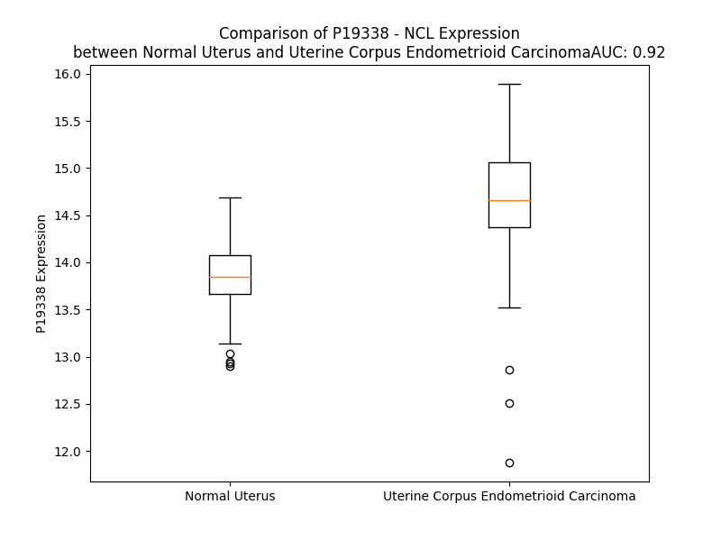

# Detailed Data for P19338

## Introduction to the Detailed Summary

### How to Interpret the Results

- **Summary & Metrics**: This section provides a quick reference to essential protein attributes, including expression changes, family classification, and biomarker applications. Regulation status (upregulated/downregulated) indicates the protein's behavior in a disease context. Some information comes from the original excel file with the proteins selected from literature, while others are derived from the analyses.
- **Expression Comparison**: A visual representation comparing protein expression between normal and disease states. It highlights significant changes in expression levels that might indicate diagnostic or therapeutic relevance. This is data coming from transcriptomics experiments and could not translate similarly to protein levels.
- **Isoform Alignment**: An interactive view of isoform alignments, revealing structural and functional differences between variants of the protein.
- **Interactors & Homologs**: Tables listing known interaction partners and homologous proteins, the more interactors and homologs, the more complex the protein is to design an antibody for.
- **Biological Assemblies**: Information about the structural arrangement of the protein in different assemblies, providing insights into its functional state but also the complexity of the protein to develop antibodies.
- **Combined Per-Residue Information**: A detailed table summarizing residue-level data. This includes predictions for epitope regions, aggregation tendencies, and modifications that might impact the protein's function. Each row corresponds to a residue in the protein, providing insights into specific sites that may be important for research or drug development.
## Summary & Metrics

- **UniProt Accession**: P19338
- **Gene Name**: NCL
- **Protein Name**: nucleolin
- **Swiss Prot**: nan
- **Family**: other
- **Biomarker Application**: diagnosis
- **Number of Isoforms**: 0
- **Regulation**: 2
- **(transcriptomics) AUC**: 0.99
- **(transcriptomics) Fold Change**: 1.08
- **(transcriptomics) Regulation**: Upregulated
- **Discotope Epitope Count**: 179
- **Max n_uniprots (Homo)**: 1.0
- **Max n_uniprots (Hetero)**: N/A

## Expression Comparison

## Interactors

| preferredName_A   | preferredName_B   |   score |
|:------------------|:------------------|--------:|
| NCL               | NPM1              |   0.999 |
| NCL               | FBL               |   0.997 |
| NCL               | HNRNPK            |   0.993 |
| NCL               | YY1               |   0.974 |
| NCL               | HNRNPD            |   0.971 |
| NCL               | COL18A1           |   0.966 |
| NCL               | CALR              |   0.966 |
| NCL               | HNRNPU            |   0.961 |
| NCL               | MDK               |   0.957 |
| NCL               | MYC               |   0.947 |
| NCL               | RIOK1             |   0.94  |
| NCL               | YBX1              |   0.937 |
| NCL               | PTBP1             |   0.937 |
| NCL               | HNRNPA2B1         |   0.913 |
| NCL               | TP53              |   0.911 |
| NCL               | NOP56             |   0.907 |
| NCL               | EGFR              |   0.905 |

## Homologs

| uniprot_id   | gene_id   |
|:-------------|:----------|
| A0A7I2V5D8   | HNRNPA3   |
| E9PLB0       | RBM4B     |
| D6R9K7       | RBM4      |
| Q8TBY0       | RBM46     |
| F8WE16       | TIA1      |
| Q9NQ94       | A1CF      |
| F2Z2U1       | RBMY1B    |
| Q15415       | RBMY1F    |
| F2Z2U1       | RBMY1B    |
| F2Z2U1       | RBMY1B    |
| F2Z2U1       | RBMY1B    |
| Q15415       | RBMY1F    |
| Q9Y4C8       | RBM19     |
| D6RCT1       | RBM47     |
| O75526       | RBMXL2    |
| Q8N7X1       | RBMXL3    |
| A0A0S2Z569   | DAZAP1    |
| A0A7I2V3P1   | HNRNPA2B1 |
| A0A1B0GUK8   | RBMXL1    |
| H3BT71       | RBMX      |
| Q9NX07       | TRNAU1AP  |
| Q9H5V0       | RBM3      |
| K7ER40       | CIRBP     |
| A0A2R8Y4L2   | HNRNPA1L3 |
| A0A7I2V2Z4   | HNRNPA1   |
| Q32P51       | HNRNPA1L2 |
| D6R9P3       | HNRNPAB   |
| Q8IYX4       | DND1      |
| B4DM51       | MSI2      |
| O43347       | MSI1      |
| Q13151       | HNRNPA0   |
| D6RBP9       | HNRNPD    |
| G3XAP0       | RBM23     |
| Q01085       | TIAL1     |
| A0A087WUK2   | HNRNPDL   |
| A0A087X122   | RBM39     |

## Biological Assemblies

|   Unnamed: 0 |   assembly |   n_uniprots | composition   | crystal_id   |
|-------------:|-----------:|-------------:|:--------------|:-------------|
|            0 |          1 |            1 | Homo          | 2krr         |
|            0 |          1 |            1 | Homo          | 2fc9         |

## Combined Per-Residue Information

|   res | aa   |   epitope_score | epitope   |   relative_surface_accessibility |   modeling_confidence |   Aggregation | modification                           |
|------:|:-----|----------------:|:----------|---------------------------------:|----------------------:|--------------:|:---------------------------------------|
|     1 | M    |         0.11072 | False     |                          1.2509  |                 42.17 |         0     | N/A                                    |
|     2 | V    |         0.11789 | True      |                          0.88806 |                 45.8  |         0     | N/A                                    |
|     3 | K    |         0.10065 | False     |                          0.82474 |                 48.1  |         0     | N/A                                    |
|     4 | L    |         0.09627 | False     |                          0.98307 |                 50.33 |         0     | N/A                                    |
|     5 | A    |         0.12254 | True      |                          0.80354 |                 52.92 |         0     | N/A                                    |
|     6 | K    |         0.09517 | False     |                          0.9325  |                 46.01 |         0     | N/A                                    |
|     7 | A    |         0.06716 | False     |                          0.99918 |                 45.1  |         0     | N/A                                    |
|     8 | G    |         0.0777  | False     |                          0.77324 |                 40.81 |         0     | N/A                                    |
|     9 | K    |         0.12025 | True      |                          1.00108 |                 42.17 |         0     | N6-acetyllysine                        |
|    10 | N    |         0.11382 | True      |                          0.93482 |                 43.43 |         0     | N/A                                    |
|    11 | Q    |         0.09304 | False     |                          0.94043 |                 39.6  |         0     | N/A                                    |
|    12 | G    |         0.16168 | True      |                          0.95031 |                 43.54 |         0     | N/A                                    |
|    13 | D    |         0.10927 | False     |                          0.82726 |                 45.95 |         0     | N/A                                    |
|    14 | P    |         0.13026 | True      |                          0.74883 |                 55.42 |         0     | N/A                                    |
|    15 | K    |         0.1465  | True      |                          0.79685 |                 46.14 |         0     | N6-acetyllysine                        |
|    16 | K    |         0.14479 | True      |                          0.80999 |                 46.52 |         0     | N6-acetyllysine                        |
|    17 | M    |         0.12984 | True      |                          0.86974 |                 44.22 |         0     | N/A                                    |
|    18 | A    |         0.09399 | False     |                          0.84949 |                 49.83 |         0     | N/A                                    |
|    19 | P    |         0.11084 | False     |                          0.87653 |                 48.96 |         0     | N/A                                    |
|    20 | P    |         0.09355 | False     |                          0.87264 |                 59.76 |         0     | N/A                                    |
|    21 | P    |         0.12848 | True      |                          0.83754 |                 53.94 |         0     | N/A                                    |
|    22 | K    |         0.0726  | False     |                          0.79876 |                 48.65 |         0     | N/A                                    |
|    23 | E    |         0.03269 | False     |                          0.45578 |                 44.49 |         0     | N/A                                    |
|    24 | V    |         0.04463 | False     |                          0.73695 |                 53.08 |         0     | N/A                                    |
|    25 | E    |         0.04552 | False     |                          0.41999 |                 45.28 |         0     | N/A                                    |
|    26 | E    |         0.0634  | False     |                          0.80549 |                 47.33 |         0     | N/A                                    |
|    27 | D    |         0.12765 | True      |                          0.73721 |                 46.85 |         0     | N/A                                    |
|    28 | S    |         0.08519 | False     |                          0.68146 |                 49.04 |         0     | Phosphoserine                          |
|    29 | E    |         0.15078 | True      |                          0.87651 |                 43.37 |         0     | N/A                                    |
|    30 | D    |         0.15899 | True      |                          0.81193 |                 48.22 |         0     | N/A                                    |
|    31 | E    |         0.14969 | True      |                          0.80695 |                 49.91 |         0     | N/A                                    |
|    32 | E    |         0.11658 | True      |                          0.77996 |                 47.01 |         0     | N/A                                    |
|    33 | M    |         0.15482 | True      |                          0.90533 |                 47.27 |         0     | N/A                                    |
|    34 | S    |         0.11679 | True      |                          0.67819 |                 49.14 |         0     | Phosphoserine                          |
|    35 | E    |         0.13021 | True      |                          0.85256 |                 48.52 |         0     | N/A                                    |
|    36 | D    |         0.12216 | True      |                          0.81499 |                 49.31 |         0     | N/A                                    |
|    37 | E    |         0.14553 | True      |                          0.83002 |                 52.56 |         0     | N/A                                    |
|    38 | E    |         0.13224 | True      |                          0.82125 |                 54.27 |         0     | N/A                                    |
|    39 | D    |         0.14157 | True      |                          0.94639 |                 49.23 |         0     | N/A                                    |
|    40 | D    |         0.1474  | True      |                          0.79417 |                 50.21 |         0     | N/A                                    |
|    41 | S    |         0.15552 | True      |                          0.7047  |                 51.74 |         0     | Phosphoserine                          |
|    42 | S    |         0.12859 | True      |                          0.82611 |                 48.64 |         0     | Phosphoserine                          |
|    43 | G    |         0.12057 | True      |                          0.91517 |                 46.53 |         0     | N/A                                    |
|    44 | E    |         0.16011 | True      |                          0.89667 |                 42.71 |         0     | N/A                                    |
|    45 | E    |         0.12729 | True      |                          0.74401 |                 36.03 |         0     | N/A                                    |
|    46 | V    |         0.10167 | False     |                          0.95068 |                 39.53 |         0     | N/A                                    |
|    47 | V    |         0.11954 | True      |                          0.744   |                 36.37 |         0     | N/A                                    |
|    48 | I    |         0.10222 | False     |                          0.90622 |                 38.21 |         0     | N/A                                    |
|    49 | P    |         0.05005 | False     |                          0.95881 |                 41.55 |         0     | N/A                                    |
|    50 | Q    |         0.06827 | False     |                          0.68582 |                 34.54 |         0     | N/A                                    |
|    51 | K    |         0.05002 | False     |                          0.40647 |                 37.92 |         0     | N/A                                    |
|    52 | K    |         0.05105 | False     |                          0.76039 |                 36.33 |         0     | N/A                                    |
|    53 | G    |         0.09265 | False     |                          0.87488 |                 37.77 |         0     | N/A                                    |
|    54 | K    |         0.11472 | True      |                          0.93833 |                 42.59 |         0     | N/A                                    |
|    55 | K    |         0.13655 | True      |                          0.92263 |                 39.28 |         0     | N/A                                    |
|    56 | A    |         0.15905 | True      |                          0.95599 |                 38.55 |         0     | N/A                                    |
|    57 | A    |         0.16646 | True      |                          0.85334 |                 40.41 |         0     | N/A                                    |
|    58 | A    |         0.11067 | False     |                          0.88345 |                 43.37 |         0     | N/A                                    |
|    59 | T    |         0.11382 | True      |                          0.91117 |                 42.74 |         0     | N/A                                    |
|    60 | S    |         0.14102 | True      |                          0.70852 |                 48.13 |         0     | N/A                                    |
|    61 | A    |         0.1272  | True      |                          0.83225 |                 49.23 |         0     | N/A                                    |
|    62 | K    |         0.21517 | True      |                          0.8802  |                 47.15 |         0     | N/A                                    |
|    63 | K    |         0.17169 | True      |                          0.90293 |                 46.02 |         0     | N/A                                    |
|    64 | V    |         0.16496 | True      |                          0.80124 |                 42.52 |         0     | N/A                                    |
|    65 | V    |         0.13368 | True      |                          0.89335 |                 42.44 |         0     | N/A                                    |
|    66 | V    |         0.10919 | False     |                          0.91211 |                 42.14 |         0     | N/A                                    |
|    67 | S    |         0.15853 | True      |                          0.70346 |                 42.9  |         0     | Phosphoserine                          |
|    68 | P    |         0.09953 | False     |                          0.83708 |                 46.15 |         0     | N/A                                    |
|    69 | T    |         0.13804 | True      |                          0.81198 |                 38.01 |         0     | Phosphothreonine                       |
|    70 | K    |         0.17568 | True      |                          0.85443 |                 43.85 |         0     | N/A                                    |
|    71 | K    |         0.14205 | True      |                          0.86932 |                 43.15 |         0     | N/A                                    |
|    72 | V    |         0.17551 | True      |                          0.976   |                 38.19 |         0     | N/A                                    |
|    73 | A    |         0.12909 | True      |                          0.88927 |                 41.14 |         0     | N/A                                    |
|    74 | V    |         0.13783 | True      |                          0.97132 |                 39.97 |         0     | N/A                                    |
|    75 | A    |         0.12802 | True      |                          0.77122 |                 41.45 |         0     | N/A                                    |
|    76 | T    |         0.13044 | True      |                          0.8662  |                 41.6  |         0     | Phosphothreonine                       |
|    77 | P    |         0.25279 | True      |                          0.90321 |                 48.86 |         0     | N/A                                    |
|    78 | A    |         0.16905 | True      |                          0.94309 |                 43.09 |         0     | N/A                                    |
|    79 | K    |         0.21096 | True      |                          0.94473 |                 44.2  |         0     | N/A                                    |
|    80 | K    |         0.20449 | True      |                          0.94215 |                 41.97 |         0     | N/A                                    |
|    81 | A    |         0.16375 | True      |                          0.83918 |                 39.59 |         0     | N/A                                    |
|    82 | A    |         0.16765 | True      |                          0.93158 |                 35.98 |         0     | N/A                                    |
|    83 | V    |         0.16027 | True      |                          1.02158 |                 39.06 |         0     | N/A                                    |
|    84 | T    |         0.15524 | True      |                          0.84807 |                 42.09 |         0     | Phosphothreonine                       |
|    85 | P    |         0.15868 | True      |                          0.98184 |                 42.16 |         0     | N/A                                    |
|    86 | G    |         0.15346 | True      |                          0.92564 |                 39.06 |         0     | N/A                                    |
|    87 | K    |         0.14279 | True      |                          0.98093 |                 44.2  |         0     | N/A                                    |
|    88 | K    |         0.25193 | True      |                          0.95423 |                 42.38 |         0     | N/A                                    |
|    89 | A    |         0.17489 | True      |                          0.94146 |                 41.66 |         0     | N/A                                    |
|    90 | A    |         0.10742 | False     |                          0.97247 |                 37.91 |         0     | N/A                                    |
|    91 | A    |         0.12174 | True      |                          0.91046 |                 38.91 |         0     | N/A                                    |
|    92 | T    |         0.09635 | False     |                          0.91427 |                 36.74 |         0     | Phosphothreonine                       |
|    93 | P    |         0.14187 | True      |                          0.91154 |                 39.78 |         0     | N/A                                    |
|    94 | A    |         0.11229 | True      |                          0.81387 |                 39.93 |         0     | N/A                                    |
|    95 | K    |         0.12553 | True      |                          0.93726 |                 38.99 |         0     | N/A                                    |
|    96 | K    |         0.10771 | False     |                          0.91099 |                 45.04 |         0     | N6-acetyllysine                        |
|    97 | T    |         0.11911 | True      |                          0.79629 |                 38.77 |         0     | N/A                                    |
|    98 | V    |         0.11866 | True      |                          0.87907 |                 42.87 |         0     | N/A                                    |
|    99 | T    |         0.08722 | False     |                          0.84608 |                 48.14 |         0     | Phosphothreonine                       |
|   100 | P    |         0.09472 | False     |                          0.72916 |                 43.86 |         0     | N/A                                    |
|   101 | A    |         0.04368 | False     |                          0.36452 |                 44.48 |         0     | N/A                                    |
|   102 | K    |         0.07291 | False     |                          0.71267 |                 47.92 |         0     | N6-acetyllysine                        |
|   103 | A    |         0.02894 | False     |                          0.34543 |                 45.81 |         0     | N/A                                    |
|   104 | V    |         0.08987 | False     |                          0.81766 |                 44.37 |         0     | N/A                                    |
|   105 | T    |         0.04042 | False     |                          0.39898 |                 37.85 |         0     | N/A                                    |
|   106 | T    |         0.06295 | False     |                          0.7403  |                 45.95 |         0     | Phosphothreonine                       |
|   107 | P    |         0.12119 | True      |                          0.94617 |                 46.86 |         0     | N/A                                    |
|   108 | G    |         0.12415 | True      |                          0.86815 |                 44.92 |         0     | N/A                                    |
|   109 | K    |         0.1946  | True      |                          0.88162 |                 44.89 |         0     | N6-acetyllysine                        |
|   110 | K    |         0.15943 | True      |                          0.96276 |                 40.4  |         0     | N/A                                    |
|   111 | G    |         0.15995 | True      |                          0.8883  |                 38.63 |         0     | N/A                                    |
|   112 | A    |         0.14195 | True      |                          0.91318 |                 38.29 |         0     | N/A                                    |
|   113 | T    |         0.12579 | True      |                          0.99572 |                 43.5  |         0     | Phosphothreonine                       |
|   114 | P    |         0.09155 | False     |                          0.9727  |                 47.98 |         0     | N/A                                    |
|   115 | G    |         0.15292 | True      |                          0.83988 |                 40.38 |         0     | N/A                                    |
|   116 | K    |         0.15601 | True      |                          0.9704  |                 44.15 |         0     | N6-acetyllysine                        |
|   117 | A    |         0.10384 | False     |                          0.76353 |                 39.98 |         0     | N/A                                    |
|   118 | L    |         0.16213 | True      |                          0.97481 |                 37.53 |         0     | N/A                                    |
|   119 | V    |         0.13133 | True      |                          0.91562 |                 39.33 |         0     | N/A                                    |
|   120 | A    |         0.1257  | True      |                          0.72959 |                 38.79 |         0     | N/A                                    |
|   121 | T    |         0.15245 | True      |                          0.89521 |                 42.28 |         0     | Phosphothreonine                       |
|   122 | P    |         0.15225 | True      |                          0.94607 |                 48.08 |         0     | N/A                                    |
|   123 | G    |         0.11704 | True      |                          0.865   |                 41.77 |         0     | N/A                                    |
|   124 | K    |         0.15379 | True      |                          0.91565 |                 43.58 |         0     | N6-acetyllysine                        |
|   125 | K    |         0.128   | True      |                          0.98219 |                 41.03 |         0     | N/A                                    |
|   126 | G    |         0.14992 | True      |                          0.87629 |                 38.11 |         0     | N/A                                    |
|   127 | A    |         0.09309 | False     |                          1.03511 |                 38.13 |         0     | N/A                                    |
|   128 | A    |         0.10842 | False     |                          0.79943 |                 37.89 |         0     | N/A                                    |
|   129 | I    |         0.11519 | True      |                          0.95313 |                 42.5  |         0     | N/A                                    |
|   130 | P    |         0.08385 | False     |                          0.81182 |                 43.11 |         0     | N/A                                    |
|   131 | A    |         0.0772  | False     |                          0.72691 |                 40.87 |         0     | N/A                                    |
|   132 | K    |         0.06283 | False     |                          0.83954 |                 39.96 |         0     | N/A                                    |
|   133 | G    |         0.05466 | False     |                          0.50508 |                 36.94 |         0     | N/A                                    |
|   134 | A    |         0.06057 | False     |                          0.55114 |                 37.76 |         0     | N/A                                    |
|   135 | K    |         0.09414 | False     |                          0.94755 |                 40.01 |         0     | N/A                                    |
|   136 | N    |         0.09427 | False     |                          0.97637 |                 33.22 |         0     | N/A                                    |
|   137 | G    |         0.09983 | False     |                          0.81772 |                 37.55 |         0     | N/A                                    |
|   138 | K    |         0.12889 | True      |                          0.97333 |                 39.79 |         0     | N/A                                    |
|   139 | N    |         0.16927 | True      |                          0.81957 |                 33.55 |         0     | N/A                                    |
|   140 | A    |         0.08928 | False     |                          0.83101 |                 36.04 |         0     | N/A                                    |
|   141 | K    |         0.12669 | True      |                          0.8515  |                 36.39 |         0     | N/A                                    |
|   142 | K    |         0.09531 | False     |                          0.7262  |                 36.41 |         0     | N/A                                    |
|   143 | E    |         0.14661 | True      |                          0.63042 |                 37.38 |         0     | N/A                                    |
|   144 | D    |         0.09388 | False     |                          0.76605 |                 41.82 |         0     | N/A                                    |
|   145 | S    |         0.13534 | True      |                          0.67039 |                 39.45 |         0     | Phosphoserine                          |
|   146 | D    |         0.15355 | True      |                          0.71953 |                 40.4  |         0     | N/A                                    |
|   147 | E    |         0.09234 | False     |                          0.78275 |                 46.19 |         0     | N/A                                    |
|   148 | E    |         0.13127 | True      |                          0.78647 |                 42.48 |         0     | N/A                                    |
|   149 | E    |         0.10403 | False     |                          0.83881 |                 46.69 |         0     | N/A                                    |
|   150 | D    |         0.12931 | True      |                          0.81375 |                 40.82 |         0     | N/A                                    |
|   151 | D    |         0.07535 | False     |                          0.82538 |                 42.7  |         0     | N/A                                    |
|   152 | D    |         0.13919 | True      |                          0.86108 |                 45.12 |         0     | N/A                                    |
|   153 | S    |         0.1059  | False     |                          0.61026 |                 43.13 |         0     | Phosphoserine                          |
|   154 | E    |         0.12802 | True      |                          0.72994 |                 41.6  |         0     | N/A                                    |
|   155 | E    |         0.07698 | False     |                          0.79735 |                 44.03 |         0     | N/A                                    |
|   156 | D    |         0.08343 | False     |                          0.74701 |                 42.5  |         0     | N/A                                    |
|   157 | E    |         0.13128 | True      |                          0.90705 |                 42.61 |         0     | N/A                                    |
|   158 | E    |         0.0642  | False     |                          0.90697 |                 44.26 |         0     | N/A                                    |
|   159 | D    |         0.04956 | False     |                          0.86032 |                 38.89 |         0     | N/A                                    |
|   160 | D    |         0.08044 | False     |                          0.90373 |                 41.99 |         0     | N/A                                    |
|   161 | E    |         0.08741 | False     |                          0.89559 |                 37.23 |         0     | N/A                                    |
|   162 | D    |         0.09359 | False     |                          0.89606 |                 42.2  |         0     | N/A                                    |
|   163 | E    |         0.10632 | False     |                          0.8909  |                 37.98 |         0     | N/A                                    |
|   164 | D    |         0.12494 | True      |                          0.95216 |                 42.66 |         0     | N/A                                    |
|   165 | E    |         0.08602 | False     |                          0.88454 |                 37.87 |         0     | N/A                                    |
|   166 | D    |         0.0927  | False     |                          0.94681 |                 45.87 |         0     | N/A                                    |
|   167 | E    |         0.06853 | False     |                          0.92225 |                 38.75 |         0     | N/A                                    |
|   168 | D    |         0.08421 | False     |                          0.92406 |                 46.41 |         0     | N/A                                    |
|   169 | E    |         0.08668 | False     |                          0.79561 |                 37.97 |         0     | N/A                                    |
|   170 | I    |         0.10544 | False     |                          0.83587 |                 42.48 |         0     | N/A                                    |
|   171 | E    |         0.03189 | False     |                          0.36126 |                 41.61 |         0     | N/A                                    |
|   172 | P    |         0.08812 | False     |                          0.80956 |                 48    |         0     | N/A                                    |
|   173 | A    |         0.06951 | False     |                          0.58421 |                 41.64 |         0     | N/A                                    |
|   174 | A    |         0.07004 | False     |                          0.85535 |                 38.92 |         0     | N/A                                    |
|   175 | M    |         0.14243 | True      |                          0.97426 |                 41.66 |         0     | N/A                                    |
|   176 | K    |         0.09454 | False     |                          0.91058 |                 41.58 |         0     | N/A                                    |
|   177 | A    |         0.08581 | False     |                          0.93629 |                 41.43 |         0     | N/A                                    |
|   178 | A    |         0.07818 | False     |                          0.90591 |                 40.84 |         0     | N/A                                    |
|   179 | A    |         0.07335 | False     |                          0.97899 |                 39.87 |         0     | N/A                                    |
|   180 | A    |         0.10809 | False     |                          0.8834  |                 42.32 |         0     | N/A                                    |
|   181 | A    |         0.08237 | False     |                          0.88588 |                 45.42 |         0     | N/A                                    |
|   182 | P    |         0.13676 | True      |                          0.89657 |                 57.33 |         0     | N/A                                    |
|   183 | A    |         0.13224 | True      |                          0.89197 |                 47.94 |         0     | N/A                                    |
|   184 | S    |         0.11305 | True      |                          0.66496 |                 51.86 |         0     | Phosphoserine                          |
|   185 | E    |         0.14257 | True      |                          0.75727 |                 47.9  |         0     | N/A                                    |
|   186 | D    |         0.11766 | True      |                          0.81064 |                 50.92 |         0     | N/A                                    |
|   187 | E    |         0.10728 | False     |                          0.86415 |                 50.1  |         0     | N/A                                    |
|   188 | D    |         0.09345 | False     |                          0.86785 |                 45.31 |         0     | N/A                                    |
|   189 | D    |         0.13486 | True      |                          0.82099 |                 46.55 |         0     | N/A                                    |
|   190 | E    |         0.10324 | False     |                          0.81332 |                 44.44 |         0     | N/A                                    |
|   191 | D    |         0.12484 | True      |                          0.75492 |                 46.09 |         0     | N/A                                    |
|   192 | D    |         0.11234 | True      |                          0.78848 |                 45.17 |         0     | N/A                                    |
|   193 | E    |         0.10387 | False     |                          0.79915 |                 43.26 |         0     | N/A                                    |
|   194 | D    |         0.17275 | True      |                          0.78986 |                 43.14 |         0     | N/A                                    |
|   195 | D    |         0.09652 | False     |                          0.76842 |                 46.04 |         0     | N/A                                    |
|   196 | E    |         0.07745 | False     |                          0.74296 |                 42.34 |         0     | N/A                                    |
|   197 | D    |         0.13803 | True      |                          0.80374 |                 42.49 |         0     | N/A                                    |
|   198 | D    |         0.14139 | True      |                          0.85468 |                 45.13 |         0     | N/A                                    |
|   199 | D    |         0.14654 | True      |                          0.81675 |                 43.93 |         0     | N/A                                    |
|   200 | D    |         0.13483 | True      |                          0.82145 |                 44.83 |         0     | N/A                                    |
|   201 | D    |         0.11318 | True      |                          0.85982 |                 44.58 |         0     | N/A                                    |
|   202 | E    |         0.11959 | True      |                          0.84442 |                 46.72 |         0     | N/A                                    |
|   203 | E    |         0.15787 | True      |                          0.86074 |                 48.61 |         0     | N/A                                    |
|   204 | D    |         0.09592 | False     |                          0.85406 |                 45.69 |         0     | N/A                                    |
|   205 | D    |         0.12247 | True      |                          0.82538 |                 46.96 |         0     | N/A                                    |
|   206 | S    |         0.13565 | True      |                          0.67353 |                 45.09 |         0     | Phosphoserine                          |
|   207 | E    |         0.15941 | True      |                          0.81462 |                 46.02 |         0     | N/A                                    |
|   208 | E    |         0.10902 | False     |                          0.76185 |                 48.36 |         0     | N/A                                    |
|   209 | E    |         0.06615 | False     |                          0.69059 |                 44.45 |         0     | N/A                                    |
|   210 | A    |         0.05084 | False     |                          0.43765 |                 41.04 |         0     | N/A                                    |
|   211 | M    |         0.05704 | False     |                          0.65459 |                 42.61 |         0     | N/A                                    |
|   212 | E    |         0.08027 | False     |                          0.6889  |                 38.19 |         0     | N/A                                    |
|   213 | T    |         0.07709 | False     |                          0.73712 |                 35.88 |         0     | N/A                                    |
|   214 | T    |         0.07127 | False     |                          0.82805 |                 36.97 |         0     | Phosphothreonine                       |
|   215 | P    |         0.08609 | False     |                          0.87252 |                 38.62 |         0     | N/A                                    |
|   216 | A    |         0.03548 | False     |                          0.69987 |                 34.32 |         0     | N/A                                    |
|   217 | K    |         0.06339 | False     |                          0.87204 |                 32.4  |         0     | N/A                                    |
|   218 | G    |         0.03934 | False     |                          0.47721 |                 34.61 |         0     | N/A                                    |
|   219 | K    |         0.07571 | False     |                          0.61921 |                 36.54 |         0     | N/A                                    |
|   220 | K    |         0.08096 | False     |                          0.8283  |                 35.77 |         0     | N/A                                    |
|   221 | A    |         0.07026 | False     |                          1.03787 |                 34.58 |         0     | N/A                                    |
|   222 | A    |         0.08283 | False     |                          0.92214 |                 37.14 |         0     | N/A                                    |
|   223 | K    |         0.1358  | True      |                          0.94612 |                 37.8  |         0     | N/A                                    |
|   224 | V    |         0.08856 | False     |                          0.75597 |                 37.64 |         0     | N/A                                    |
|   225 | V    |         0.15344 | True      |                          1.0172  |                 39.32 |         0     | N/A                                    |
|   226 | P    |         0.11197 | True      |                          0.71179 |                 49.79 |         0     | N/A                                    |
|   227 | V    |         0.16211 | True      |                          0.75642 |                 37.8  |         0     | N/A                                    |
|   228 | K    |         0.08475 | False     |                          0.94585 |                 36.11 |         0     | N/A                                    |
|   229 | A    |         0.08973 | False     |                          0.75247 |                 38.49 |         0     | N/A                                    |
|   230 | K    |         0.0976  | False     |                          0.91965 |                 42.8  |         0     | N/A                                    |
|   231 | N    |         0.08601 | False     |                          0.70355 |                 39.7  |         0     | N/A                                    |
|   232 | V    |         0.13718 | True      |                          0.81329 |                 44.32 |         0     | N/A                                    |
|   233 | A    |         0.08185 | False     |                          0.73545 |                 45.69 |         0     | N/A                                    |
|   234 | E    |         0.09115 | False     |                          0.74447 |                 44.89 |         0     | N/A                                    |
|   235 | D    |         0.12617 | True      |                          0.759   |                 47.96 |         0     | N/A                                    |
|   236 | E    |         0.12258 | True      |                          0.83615 |                 46.07 |         0     | N/A                                    |
|   237 | D    |         0.10222 | False     |                          0.82082 |                 45.91 |         0     | N/A                                    |
|   238 | E    |         0.06521 | False     |                          0.95991 |                 48.14 |         0     | N/A                                    |
|   239 | E    |         0.11459 | True      |                          0.85064 |                 41.85 |         0     | N/A                                    |
|   240 | E    |         0.12024 | True      |                          0.93188 |                 50.86 |         0     | N/A                                    |
|   241 | D    |         0.10551 | False     |                          0.841   |                 40.03 |         0     | N/A                                    |
|   242 | D    |         0.10036 | False     |                          0.94119 |                 47.95 |         0     | N/A                                    |
|   243 | E    |         0.09809 | False     |                          0.79689 |                 41.71 |         0     | N/A                                    |
|   244 | D    |         0.07427 | False     |                          0.81242 |                 42.13 |         0     | N/A                                    |
|   245 | E    |         0.09963 | False     |                          0.92218 |                 47.31 |         0     | N/A                                    |
|   246 | D    |         0.07319 | False     |                          0.90763 |                 39.26 |         0     | N/A                                    |
|   247 | D    |         0.12903 | True      |                          0.94442 |                 45.49 |         0     | N/A                                    |
|   248 | D    |         0.08126 | False     |                          0.82013 |                 40.29 |         0     | N/A                                    |
|   249 | D    |         0.10473 | False     |                          0.80212 |                 44.46 |         0     | N/A                                    |
|   250 | D    |         0.10739 | False     |                          0.96565 |                 44.93 |         0     | N/A                                    |
|   251 | E    |         0.06603 | False     |                          0.78679 |                 43.33 |         0     | N/A                                    |
|   252 | D    |         0.10914 | False     |                          0.83202 |                 44.6  |         0     | N/A                                    |
|   253 | D    |         0.08613 | False     |                          0.86137 |                 46.89 |         0     | N/A                                    |
|   254 | E    |         0.07113 | False     |                          0.83078 |                 39    |         0     | N/A                                    |
|   255 | D    |         0.06797 | False     |                          0.83103 |                 43.53 |         0     | N/A                                    |
|   256 | D    |         0.09893 | False     |                          0.83996 |                 47.07 |         0     | N/A                                    |
|   257 | D    |         0.08009 | False     |                          0.91206 |                 38.64 |         0     | N/A                                    |
|   258 | D    |         0.11569 | True      |                          0.87252 |                 41.35 |         0     | N/A                                    |
|   259 | E    |         0.12073 | True      |                          0.95409 |                 46.84 |         0     | N/A                                    |
|   260 | D    |         0.11418 | True      |                          0.91696 |                 42.93 |         0     | N/A                                    |
|   261 | D    |         0.08992 | False     |                          0.8112  |                 39.97 |         0     | N/A                                    |
|   262 | E    |         0.09645 | False     |                          0.93869 |                 46.61 |         0     | N/A                                    |
|   263 | E    |         0.07449 | False     |                          0.90722 |                 44.11 |         0     | N/A                                    |
|   264 | E    |         0.09231 | False     |                          0.87354 |                 38.73 |         0     | N/A                                    |
|   265 | E    |         0.15144 | True      |                          0.94308 |                 42.93 |         0     | N/A                                    |
|   266 | E    |         0.10306 | False     |                          0.87853 |                 38.57 |         0     | N/A                                    |
|   267 | E    |         0.13708 | True      |                          0.94094 |                 43.54 |         0     | N/A                                    |
|   268 | E    |         0.10022 | False     |                          0.86059 |                 39.52 |         0     | N/A                                    |
|   269 | E    |         0.12386 | True      |                          0.87952 |                 42.2  |         0     | N/A                                    |
|   270 | E    |         0.09704 | False     |                          0.81548 |                 41.82 |         0     | N/A                                    |
|   271 | E    |         0.09475 | False     |                          0.74908 |                 46.5  |         0     | N/A                                    |
|   272 | P    |         0.10823 | False     |                          0.74518 |                 50.05 |         0     | N/A                                    |
|   273 | V    |         0.08978 | False     |                          0.70099 |                 43.8  |         0     | N/A                                    |
|   274 | K    |         0.10349 | False     |                          0.84246 |                 44.54 |         0     | N/A                                    |
|   275 | E    |         0.10316 | False     |                          0.74501 |                 41.33 |         0     | N/A                                    |
|   276 | A    |         0.08928 | False     |                          0.86662 |                 47.83 |         0     | N/A                                    |
|   277 | P    |         0.08874 | False     |                          0.91413 |                 47.49 |         0     | N/A                                    |
|   278 | G    |         0.10676 | False     |                          0.92063 |                 41.33 |         0     | N/A                                    |
|   279 | K    |         0.07568 | False     |                          0.84652 |                 40.03 |         0     | N/A                                    |
|   280 | R    |         0.12739 | True      |                          0.83206 |                 44.72 |         0     | N/A                                    |
|   281 | K    |         0.11201 | True      |                          0.93142 |                 39.57 |         0     | N/A                                    |
|   282 | K    |         0.11164 | False     |                          0.78896 |                 41.94 |         0     | N/A                                    |
|   283 | E    |         0.11938 | True      |                          0.68928 |                 35.26 |         0     | N/A                                    |
|   284 | M    |         0.10464 | False     |                          1.02657 |                 34.63 |         0     | N/A                                    |
|   285 | A    |         0.07152 | False     |                          0.97559 |                 36.03 |         0     | N/A                                    |
|   286 | K    |         0.06642 | False     |                          0.9143  |                 37.72 |         0     | N/A                                    |
|   287 | Q    |         0.09474 | False     |                          0.85271 |                 39.63 |         0     | N/A                                    |
|   288 | K    |         0.18606 | True      |                          1.00672 |                 35.33 |         0     | N/A                                    |
|   289 | A    |         0.10219 | False     |                          0.98846 |                 35.29 |         0     | N/A                                    |
|   290 | A    |         0.11369 | True      |                          0.85363 |                 39.64 |         0     | N/A                                    |
|   291 | P    |         0.09591 | False     |                          0.85183 |                 39.36 |         0     | N/A                                    |
|   292 | E    |         0.08412 | False     |                          0.82186 |                 40.87 |         0     | N/A                                    |
|   293 | A    |         0.07143 | False     |                          0.79478 |                 34.95 |         0     | N/A                                    |
|   294 | K    |         0.12195 | True      |                          0.99603 |                 42.45 |         0     | N/A                                    |
|   295 | K    |         0.08759 | False     |                          1.02665 |                 33.96 |         0     | N/A                                    |
|   296 | Q    |         0.11195 | True      |                          0.84096 |                 36.59 |         0     | N/A                                    |
|   297 | K    |         0.09675 | False     |                          0.96969 |                 31.58 |         0     | N/A                                    |
|   298 | V    |         0.10757 | False     |                          0.95472 |                 34.56 |         0     | N/A                                    |
|   299 | E    |         0.10764 | False     |                          0.75014 |                 40.74 |         0     | N/A                                    |
|   300 | G    |         0.11524 | True      |                          0.84197 |                 43.55 |         0     | N/A                                    |
|   301 | T    |         0.07657 | False     |                          0.65232 |                 55.27 |         0     | Phosphothreonine                       |
|   302 | E    |         0.12764 | True      |                          0.73124 |                 60.05 |         0     | N/A                                    |
|   303 | P    |         0.10174 | False     |                          0.58206 |                 65.16 |         0     | N/A                                    |
|   304 | T    |         0.06589 | False     |                          0.52572 |                 65.06 |         1.958 | N/A                                    |
|   305 | T    |         0.06783 | False     |                          0.20364 |                 70.48 |        10.611 | N/A                                    |
|   306 | A    |         0.13187 | True      |                          0.83896 |                 73.9  |        25.155 | N/A                                    |
|   307 | F    |         0.03164 | False     |                          0.36562 |                 83.07 |        41.127 | N/A                                    |
|   308 | N    |         0.02382 | False     |                          0.09046 |                 84.68 |        41.233 | N/A                                    |
|   309 | L    |         0.00344 | False     |                          0       |                 88.29 |        42.014 | N/A                                    |
|   310 | F    |         0.0217  | False     |                          0.25323 |                 89.21 |        42.12  | N/A                                    |
|   311 | V    |         0.0023  | False     |                          0       |                 89.69 |        40.331 | N/A                                    |
|   312 | G    |         0.0246  | False     |                          0.05794 |                 88.96 |         4.931 | N/A                                    |
|   313 | N    |         0.02742 | False     |                          0.448   |                 89.36 |         1.639 | N/A                                    |
|   314 | L    |         0.00547 | False     |                          0.02011 |                 88.11 |         1.534 | N/A                                    |
|   315 | N    |         0.03427 | False     |                          0.14185 |                 86.09 |         0.206 | N/A                                    |
|   316 | F    |         0.17362 | True      |                          0.56952 |                 86.86 |         0.206 | N/A                                    |
|   317 | N    |         0.1357  | True      |                          0.73655 |                 87.17 |         0     | N/A                                    |
|   318 | K    |         0.0993  | False     |                          0.29527 |                 87.07 |         0     | N6-acetyllysine                        |
|   319 | S    |         0.09139 | False     |                          0.32801 |                 88.43 |         0     | N/A                                    |
|   320 | A    |         0.03824 | False     |                          0.36442 |                 86.57 |         0     | N/A                                    |
|   321 | P    |         0.10096 | False     |                          0.65959 |                 89.19 |         0     | N/A                                    |
|   322 | E    |         0.05949 | False     |                          0.32471 |                 89.88 |         0     | N/A                                    |
|   323 | L    |         0.00301 | False     |                          0       |                 88.4  |         0     | N/A                                    |
|   324 | K    |         0.0465  | False     |                          0.38836 |                 90.69 |         0     | N/A                                    |
|   325 | T    |         0.08642 | False     |                          0.61336 |                 91.84 |         0     | N/A                                    |
|   326 | G    |         0.06951 | False     |                          0.14483 |                 90.55 |         0     | N/A                                    |
|   327 | I    |         0.0016  | False     |                          0.0008  |                 90.47 |         0     | N/A                                    |
|   328 | S    |         0.02116 | False     |                          0.30956 |                 90.4  |         0     | N/A                                    |
|   329 | D    |         0.09167 | False     |                          0.46629 |                 90.85 |         0     | N/A                                    |
|   330 | V    |         0.0202  | False     |                          0.16136 |                 89.52 |         0     | N/A                                    |
|   331 | F    |         0.00194 | False     |                          0       |                 90.01 |         0     | N/A                                    |
|   332 | A    |         0.0627  | False     |                          0.59898 |                 88.5  |         0     | N/A                                    |
|   333 | K    |         0.10783 | False     |                          0.71389 |                 90    |         0     | N/A                                    |
|   334 | N    |         0.07847 | False     |                          0.34262 |                 87.51 |         0     | N/A                                    |
|   335 | D    |         0.07925 | False     |                          0.85328 |                 86.49 |         0     | N/A                                    |
|   336 | L    |         0.01451 | False     |                          0.05682 |                 87.18 |         1.966 | N/A                                    |
|   337 | A    |         0.01883 | False     |                          0.3593  |                 84.84 |         2.295 | N/A                                    |
|   338 | V    |         0.0302  | False     |                          0.27343 |                 87.62 |         2.899 | N/A                                    |
|   339 | V    |         0.02613 | False     |                          0.52117 |                 85.32 |         2.899 | N/A                                    |
|   340 | D    |         0.02776 | False     |                          0.24406 |                 87.26 |         2.899 | N/A                                    |
|   341 | V    |         0.01238 | False     |                          0.04491 |                 89.59 |         2.899 | N/A                                    |
|   342 | R    |         0.03422 | False     |                          0.12442 |                 89.04 |         2.899 | N/A                                    |
|   343 | I    |         0.03372 | False     |                          0.18813 |                 89.62 |         2.899 | N/A                                    |
|   344 | G    |         0.03362 | False     |                          0.14016 |                 83.08 |         1.091 | N/A                                    |
|   345 | M    |         0.09696 | False     |                          1.02612 |                 82.16 |         1.091 | N/A                                    |
|   346 | T    |         0.03068 | False     |                          0.56633 |                 82.97 |         0.169 | N/A                                    |
|   347 | R    |         0.11673 | True      |                          0.43409 |                 87.08 |         0     | N/A                                    |
|   348 | K    |         0.06055 | False     |                          0.61261 |                 85.87 |         0.158 | N6-acetyllysine                        |
|   349 | F    |         0.02925 | False     |                          0.31663 |                 89.96 |         0.158 | N/A                                    |
|   350 | G    |         0.00418 | False     |                          0.00161 |                 89.88 |         0.158 | N/A                                    |
|   351 | Y    |         0.03438 | False     |                          0.28573 |                 89.99 |         0.158 | N/A                                    |
|   352 | V    |         0.00291 | False     |                          0.00095 |                 90.88 |         0.158 | N/A                                    |
|   353 | D    |         0.00387 | False     |                          0       |                 88.13 |         0.158 | N/A                                    |
|   354 | F    |         0.00292 | False     |                          0.00051 |                 89.68 |         0.158 | N/A                                    |
|   355 | E    |         0.07052 | False     |                          0.63803 |                 83.15 |         0     | N/A                                    |
|   356 | S    |         0.0577  | False     |                          0.26993 |                 84.94 |         0     | Phosphoserine                          |
|   357 | A    |         0.04394 | False     |                          0.44898 |                 85.14 |         0     | N/A                                    |
|   358 | E    |         0.07807 | False     |                          0.56483 |                 86.39 |         0     | N/A                                    |
|   359 | D    |         0.0239  | False     |                          0.07912 |                 88.53 |         0     | N/A                                    |
|   360 | L    |         0.01411 | False     |                          0.11129 |                 85.61 |         0     | N/A                                    |
|   361 | E    |         0.08253 | False     |                          0.5149  |                 85.8  |         0     | N/A                                    |
|   362 | K    |         0.04161 | False     |                          0.41963 |                 87.47 |         0     | N/A                                    |
|   363 | A    |         0.00182 | False     |                          0       |                 87.73 |         0.424 | N/A                                    |
|   364 | L    |         0.03925 | False     |                          0.27497 |                 85.35 |         0.424 | N/A                                    |
|   365 | E    |         0.07771 | False     |                          0.75433 |                 86.69 |         0.424 | N/A                                    |
|   366 | L    |         0.06377 | False     |                          0.27835 |                 84.99 |         0.424 | N/A                                    |
|   367 | T    |         0.11459 | True      |                          0.87583 |                 81.24 |         0.424 | Phosphothreonine                       |
|   368 | G    |         0.08466 | False     |                          0.55405 |                 81.35 |         0.424 | N/A                                    |
|   369 | L    |         0.02728 | False     |                          0.17806 |                 84.34 |         0.424 | N/A                                    |
|   370 | K    |         0.12017 | True      |                          0.59764 |                 87.3  |         0.424 | N/A                                    |
|   371 | V    |         0.01243 | False     |                          0.01714 |                 85.16 |         0.424 | N/A                                    |
|   372 | F    |         0.0824  | False     |                          0.4213  |                 86.01 |         0.424 | N/A                                    |
|   373 | G    |         0.13287 | True      |                          0.78895 |                 83.5  |         0     | N/A                                    |
|   374 | N    |         0.04668 | False     |                          0.27616 |                 86.44 |         0     | N/A                                    |
|   375 | E    |         0.05812 | False     |                          0.44419 |                 88.88 |         0     | N/A                                    |
|   376 | I    |         0.01632 | False     |                          0.05085 |                 89.8  |         0     | N/A                                    |
|   377 | K    |         0.06147 | False     |                          0.62542 |                 87.36 |         0     | N6-acetyllysine; alternate             |
|   378 | L    |         0.03604 | False     |                          0.18539 |                 89.33 |         0     | N/A                                    |
|   379 | E    |         0.06254 | False     |                          0.37761 |                 83.5  |         0     | N/A                                    |
|   380 | K    |         0.10608 | False     |                          0.5625  |                 79.53 |         0     | N/A                                    |
|   381 | P    |         0.07888 | False     |                          0.31556 |                 66.43 |         0     | N/A                                    |
|   382 | K    |         0.11562 | True      |                          0.86743 |                 59.76 |         0     | N/A                                    |
|   383 | G    |         0.08006 | False     |                          0.52834 |                 52.29 |         0     | N/A                                    |
|   384 | K    |         0.12157 | True      |                          0.93569 |                 50.58 |         0     | N/A                                    |
|   385 | D    |         0.06313 | False     |                          0.29112 |                 57.84 |         0     | N/A                                    |
|   386 | S    |         0.06147 | False     |                          0.38294 |                 66.16 |         0     | N/A                                    |
|   387 | K    |         0.06426 | False     |                          0.76777 |                 76.47 |         0     | N/A                                    |
|   388 | K    |         0.15881 | True      |                          0.6087  |                 75.58 |         0     | N/A                                    |
|   389 | E    |         0.07473 | False     |                          0.53583 |                 77.55 |         0     | N/A                                    |
|   390 | R    |         0.03248 | False     |                          0.30952 |                 81.29 |         0     | N/A                                    |
|   391 | D    |         0.01863 | False     |                          0.15578 |                 85.24 |         0     | N/A                                    |
|   392 | A    |         0.01267 | False     |                          0.19026 |                 85.5  |         0     | N/A                                    |
|   393 | R    |         0.0198  | False     |                          0.20845 |                 88.12 |         0     | N/A                                    |
|   394 | T    |         0.00834 | False     |                          0.0444  |                 90.64 |         0     | N/A                                    |
|   395 | L    |         0.00195 | False     |                          0.00082 |                 92.26 |         0     | N/A                                    |
|   396 | L    |         0.01944 | False     |                          0.17888 |                 92.35 |         0     | N/A                                    |
|   397 | A    |         0.00222 | False     |                          0       |                 91.03 |         0     | N/A                                    |
|   398 | K    |         0.0308  | False     |                          0.23031 |                 89.46 |         0     | N6-acetyllysine                        |
|   399 | N    |         0.02101 | False     |                          0.29583 |                 85.49 |         0     | N/A                                    |
|   400 | L    |         0.00523 | False     |                          0.00631 |                 88.02 |         0     | N/A                                    |
|   401 | P    |         0.02976 | False     |                          0.0574  |                 84.97 |         0     | N/A                                    |
|   402 | Y    |         0.11016 | False     |                          0.57356 |                 86.05 |         0     | N/A                                    |
|   403 | K    |         0.0939  | False     |                          0.89312 |                 86.3  |         0     | N6-acetyllysine                        |
|   404 | V    |         0.02458 | False     |                          0.04136 |                 86.98 |         0     | N/A                                    |
|   405 | T    |         0.0712  | False     |                          0.43351 |                 87.9  |         0     | Phosphothreonine                       |
|   406 | Q    |         0.06999 | False     |                          0.36231 |                 87.54 |         0     | N/A                                    |
|   407 | D    |         0.09627 | False     |                          0.53324 |                 87.59 |         0     | N/A                                    |
|   408 | E    |         0.09221 | False     |                          0.35278 |                 88.41 |         0     | N/A                                    |
|   409 | L    |         0.00243 | False     |                          0       |                 88.86 |         0     | N/A                                    |
|   410 | K    |         0.07403 | False     |                          0.42609 |                 88.77 |         0     | N/A                                    |
|   411 | E    |         0.07811 | False     |                          0.7347  |                 87.9  |         0     | N/A                                    |
|   412 | V    |         0.04814 | False     |                          0.32184 |                 87.25 |         0     | N/A                                    |
|   413 | F    |         0.00768 | False     |                          0.00677 |                 89.25 |         0     | N/A                                    |
|   414 | E    |         0.04933 | False     |                          0.45666 |                 87.8  |         0     | N/A                                    |
|   415 | D    |         0.02014 | False     |                          0.0751  |                 87.69 |         0     | N/A                                    |
|   416 | A    |         0.01761 | False     |                          0.22371 |                 88.04 |         0     | N/A                                    |
|   417 | A    |         0.05823 | False     |                          0.58367 |                 87.72 |         0     | N/A                                    |
|   418 | E    |         0.03365 | False     |                          0.41935 |                 88.29 |         0     | N/A                                    |
|   419 | I    |         0.03758 | False     |                          0.03242 |                 90.96 |         0     | N/A                                    |
|   420 | R    |         0.06546 | False     |                          0.37609 |                 88.9  |         0     | N/A                                    |
|   421 | L    |         0.07321 | False     |                          0.36057 |                 89.36 |         0     | N/A                                    |
|   422 | V    |         0.04289 | False     |                          0.27701 |                 87.78 |         0     | N/A                                    |
|   423 | S    |         0.18608 | True      |                          0.48986 |                 84.01 |         0     | N/A                                    |
|   424 | K    |         0.1292  | True      |                          0.56895 |                 78.22 |         0     | N/A                                    |
|   425 | D    |         0.13767 | True      |                          0.62655 |                 79.38 |         0     | N/A                                    |
|   426 | G    |         0.17841 | True      |                          0.97703 |                 75.6  |         0     | N/A                                    |
|   427 | K    |         0.13538 | True      |                          0.76886 |                 76.98 |         0     | N6-acetyllysine                        |
|   428 | S    |         0.06    | False     |                          0.26609 |                 83.42 |         0     | N/A                                    |
|   429 | K    |         0.10525 | False     |                          0.50183 |                 84.98 |         0     | N/A                                    |
|   430 | G    |         0.00981 | False     |                          0.05532 |                 85.93 |         5.331 | N/A                                    |
|   431 | I    |         0.02782 | False     |                          0.28414 |                 91.04 |         8.133 | N/A                                    |
|   432 | A    |         0.00194 | False     |                          0       |                 91.66 |         8.133 | N/A                                    |
|   433 | Y    |         0.06543 | False     |                          0.38248 |                 93.11 |         8.133 | N/A                                    |
|   434 | I    |         0.00163 | False     |                          0       |                 93.14 |         8.133 | N/A                                    |
|   435 | E    |         0.01893 | False     |                          0.06276 |                 91.5  |         2.96  | N/A                                    |
|   436 | F    |         0.00769 | False     |                          0.00507 |                 91.85 |         2.96  | N/A                                    |
|   437 | K    |         0.02751 | False     |                          0.57856 |                 87.48 |         2.96  | N/A                                    |
|   438 | T    |         0.03464 | False     |                          0.23707 |                 85.68 |         1.045 | N/A                                    |
|   439 | E    |         0.04818 | False     |                          0.3917  |                 88.39 |         0     | N/A                                    |
|   440 | A    |         0.0354  | False     |                          0.50613 |                 87.75 |         0     | N/A                                    |
|   441 | D    |         0.01927 | False     |                          0.04749 |                 90.53 |         0     | N/A                                    |
|   442 | A    |         0.00173 | False     |                          0       |                 89.65 |         0     | N/A                                    |
|   443 | E    |         0.05562 | False     |                          0.30505 |                 88.88 |         0     | N/A                                    |
|   444 | K    |         0.0483  | False     |                          0.32246 |                 89.52 |         0     | N6-acetyllysine                        |
|   445 | T    |         0.00776 | False     |                          0.01615 |                 89.96 |         0     | N/A                                    |
|   446 | F    |         0.02762 | False     |                          0.20128 |                 88.65 |         0     | N/A                                    |
|   447 | E    |         0.09421 | False     |                          0.72598 |                 86.79 |         0     | N/A                                    |
|   448 | E    |         0.06502 | False     |                          0.53015 |                 87.3  |         0     | N/A                                    |
|   449 | K    |         0.03642 | False     |                          0.17327 |                 85.01 |         0     | N/A                                    |
|   450 | Q    |         0.08451 | False     |                          0.29898 |                 86.9  |         0     | N/A                                    |
|   451 | G    |         0.02617 | False     |                          0.30758 |                 80.36 |         0     | N/A                                    |
|   452 | T    |         0.05042 | False     |                          0.27882 |                 84.15 |         0     | N/A                                    |
|   453 | E    |         0.05342 | False     |                          0.62634 |                 83.47 |         0     | N/A                                    |
|   454 | I    |         0.03579 | False     |                          0.1024  |                 83.39 |         0     | N/A                                    |
|   455 | D    |         0.17758 | True      |                          0.68951 |                 81.13 |         0     | N/A                                    |
|   456 | G    |         0.07346 | False     |                          0.82584 |                 79.13 |         0     | N/A                                    |
|   457 | R    |         0.05566 | False     |                          0.18553 |                 79.9  |         0     | N/A                                    |
|   458 | S    |         0.01365 | False     |                          0.03253 |                 83.42 |         1.219 | Phosphoserine                          |
|   459 | I    |         0.0042  | False     |                          0.0016  |                 86.12 |        11.318 | N/A                                    |
|   460 | S    |         0.00371 | False     |                          0.00624 |                 84.96 |        11.318 | Phosphoserine                          |
|   461 | L    |         0.00301 | False     |                          0.00122 |                 89.79 |        11.857 | N/A                                    |
|   462 | Y    |         0.01448 | False     |                          0.08334 |                 88.33 |        11.857 | N/A                                    |
|   463 | Y    |         0.02006 | False     |                          0.10235 |                 89.37 |        11.857 | N/A                                    |
|   464 | T    |         0.0559  | False     |                          0.09684 |                 86.95 |         9.818 | N/A                                    |
|   465 | G    |         0.03661 | False     |                          0.31911 |                 80.77 |         0.803 | N/A                                    |
|   466 | E    |         0.14736 | True      |                          0.46102 |                 74.72 |         0     | N/A                                    |
|   467 | K    |         0.08915 | False     |                          0.35021 |                 69.58 |         0     | N6-acetyllysine                        |
|   468 | G    |         0.0448  | False     |                          0.22894 |                 68.29 |         0     | N/A                                    |
|   469 | Q    |         0.10224 | False     |                          0.61379 |                 62.59 |         0     | N/A                                    |
|   470 | N    |         0.11172 | False     |                          0.84115 |                 52.83 |         0     | N/A                                    |
|   471 | Q    |         0.05972 | False     |                          0.37546 |                 54.39 |         0     | N/A                                    |
|   472 | D    |         0.07104 | False     |                          0.69448 |                 42.74 |         0     | N/A                                    |
|   473 | Y    |         0.055   | False     |                          0.37685 |                 45.22 |         0     | N/A                                    |
|   474 | R    |         0.14554 | True      |                          0.80902 |                 38.23 |         0     | N/A                                    |
|   475 | G    |         0.11546 | True      |                          1.02333 |                 32.59 |         0     | N/A                                    |
|   476 | G    |         0.09503 | False     |                          0.72752 |                 33    |         0     | N/A                                    |
|   477 | K    |         0.19346 | True      |                          1.03383 |                 38.79 |         0     | N6-acetyllysine                        |
|   478 | N    |         0.17249 | True      |                          0.91668 |                 32.93 |         0     | N/A                                    |
|   479 | S    |         0.09919 | False     |                          0.76817 |                 38.09 |         0     | N/A                                    |
|   480 | T    |         0.12137 | True      |                          0.99308 |                 36.66 |         0     | N/A                                    |
|   481 | W    |         0.12963 | True      |                          1.07804 |                 37.69 |         0     | N/A                                    |
|   482 | S    |         0.07344 | False     |                          0.55179 |                 39.01 |         0     | N/A                                    |
|   483 | G    |         0.08719 | False     |                          0.69191 |                 54.97 |         0     | N/A                                    |
|   484 | E    |         0.04954 | False     |                          0.4567  |                 63.44 |         0     | N/A                                    |
|   485 | S    |         0.02569 | False     |                          0.23005 |                 67.88 |         0     | N/A                                    |
|   486 | K    |         0.04841 | False     |                          0.50291 |                 82.49 |         0     | N/A                                    |
|   487 | T    |         0.01677 | False     |                          0.09014 |                 84.22 |         0.759 | N/A                                    |
|   488 | L    |         0.00594 | False     |                          0       |                 85.59 |         0.986 | N/A                                    |
|   489 | V    |         0.02413 | False     |                          0.20565 |                 86.79 |         0.986 | N/A                                    |
|   490 | L    |         0.00506 | False     |                          0       |                 86.4  |         0.986 | N/A                                    |
|   491 | S    |         0.06404 | False     |                          0.25556 |                 84.53 |         0.986 | N/A                                    |
|   492 | N    |         0.04092 | False     |                          0.46865 |                 83.17 |         0.363 | N/A                                    |
|   493 | L    |         0.00726 | False     |                          0.0148  |                 83.93 |         0.363 | N/A                                    |
|   494 | S    |         0.02164 | False     |                          0.07735 |                 82.86 |         0     | N/A                                    |
|   495 | Y    |         0.0974  | False     |                          0.62374 |                 83.29 |         0     | N/A                                    |
|   496 | S    |         0.04885 | False     |                          0.60358 |                 81.47 |         0     | N/A                                    |
|   497 | A    |         0.01959 | False     |                          0.02107 |                 79.79 |         0     | N/A                                    |
|   498 | T    |         0.08389 | False     |                          0.43281 |                 82.45 |         0     | N/A                                    |
|   499 | E    |         0.02279 | False     |                          0.18652 |                 84.8  |         0     | N/A                                    |
|   500 | E    |         0.1188  | True      |                          0.56101 |                 83.81 |         0     | N/A                                    |
|   501 | T    |         0.06199 | False     |                          0.28409 |                 85.66 |         0     | N/A                                    |
|   502 | L    |         0.003   | False     |                          0.00082 |                 85.94 |         0     | N/A                                    |
|   503 | Q    |         0.05047 | False     |                          0.37671 |                 84.95 |         0     | N/A                                    |
|   504 | E    |         0.07265 | False     |                          0.70179 |                 85.03 |         0     | N/A                                    |
|   505 | V    |         0.02945 | False     |                          0.19116 |                 84.98 |         4.586 | N/A                                    |
|   506 | F    |         0.01639 | False     |                          0.03083 |                 85.67 |         4.944 | N/A                                    |
|   507 | E    |         0.09609 | False     |                          0.77558 |                 84.25 |         4.944 | N/A                                    |
|   508 | K    |         0.09696 | False     |                          0.52053 |                 82.46 |         4.944 | N/A                                    |
|   509 | A    |         0.01373 | False     |                          0.10101 |                 83.38 |         4.944 | N/A                                    |
|   510 | T    |         0.08427 | False     |                          0.53201 |                 83.76 |         4.944 | N/A                                    |
|   511 | F    |         0.0207  | False     |                          0.09865 |                 81.42 |         4.944 | N/A                                    |
|   512 | I    |         0.02322 | False     |                          0.02198 |                 87.13 |         4.559 | N/A                                    |
|   513 | K    |         0.02383 | False     |                          0.2525  |                 83.69 |         0     | N6-acetyllysine; alternate             |
|   514 | V    |         0.02014 | False     |                          0.13672 |                 85.88 |         0     | N/A                                    |
|   515 | P    |         0.03932 | False     |                          0.18887 |                 81.33 |         0     | N/A                                    |
|   516 | Q    |         0.04544 | False     |                          0.36663 |                 81.77 |         0     | N/A                                    |
|   517 | N    |         0.09774 | False     |                          0.42776 |                 76.7  |         0     | N/A                                    |
|   518 | Q    |         0.1592  | True      |                          0.9281  |                 76.8  |         0     | N/A                                    |
|   519 | N    |         0.1293  | True      |                          0.79496 |                 75.46 |         0     | N/A                                    |
|   520 | G    |         0.05175 | False     |                          0.46024 |                 72.51 |         0     | N/A                                    |
|   521 | K    |         0.07421 | False     |                          0.72115 |                 74.49 |         0     | N6-acetyllysine                        |
|   522 | S    |         0.01547 | False     |                          0.11148 |                 80.83 |         0     | N/A                                    |
|   523 | K    |         0.11152 | False     |                          0.41733 |                 79.47 |         0     | N/A                                    |
|   524 | G    |         0.02139 | False     |                          0.12465 |                 81.11 |         5.945 | N/A                                    |
|   525 | Y    |         0.03264 | False     |                          0.31935 |                 87.37 |         5.945 | N/A                                    |
|   526 | A    |         0.00242 | False     |                          0       |                 85.99 |         5.945 | N/A                                    |
|   527 | F    |         0.01949 | False     |                          0.17255 |                 88.49 |         5.945 | N/A                                    |
|   528 | I    |         0.00491 | False     |                          0.0016  |                 87.86 |         5.945 | N/A                                    |
|   529 | E    |         0.0274  | False     |                          0.24694 |                 85.69 |         0     | N/A                                    |
|   530 | F    |         0.007   | False     |                          0.025   |                 87.26 |         0     | N/A                                    |
|   531 | A    |         0.02616 | False     |                          0.60936 |                 84.07 |         0     | N/A                                    |
|   532 | S    |         0.0471  | False     |                          0.25118 |                 83.28 |         0     | N/A                                    |
|   533 | F    |         0.0302  | False     |                          0.13685 |                 83.02 |         0     | N/A                                    |
|   534 | E    |         0.08639 | False     |                          0.59758 |                 84.59 |         0     | N/A                                    |
|   535 | D    |         0.02911 | False     |                          0.1396  |                 86.4  |         0     | N/A                                    |
|   536 | A    |         0.00173 | False     |                          0       |                 85    |         0     | N/A                                    |
|   537 | K    |         0.04123 | False     |                          0.48409 |                 84.72 |         0     | N/A                                    |
|   538 | E    |         0.0417  | False     |                          0.44992 |                 85.42 |         0     | N/A                                    |
|   539 | A    |         0.00691 | False     |                          0.09402 |                 85.47 |         0     | N/A                                    |
|   540 | L    |         0.02285 | False     |                          0.20308 |                 84.88 |         0     | N/A                                    |
|   541 | N    |         0.06577 | False     |                          0.7603  |                 82.86 |         0     | N/A                                    |
|   542 | S    |         0.10025 | False     |                          0.70177 |                 83.46 |         0     | N/A                                    |
|   543 | C    |         0.02807 | False     |                          0.09728 |                 79    |         0     | N/A                                    |
|   544 | N    |         0.12557 | True      |                          0.32283 |                 79.43 |         0     | N/A                                    |
|   545 | K    |         0.07261 | False     |                          0.76586 |                 76.95 |         0     | N/A                                    |
|   546 | R    |         0.11462 | True      |                          0.40008 |                 81.25 |         0     | N/A                                    |
|   547 | E    |         0.06959 | False     |                          0.68533 |                 82.19 |         0     | N/A                                    |
|   548 | I    |         0.02359 | False     |                          0.0536  |                 78.67 |         0     | N/A                                    |
|   549 | E    |         0.06626 | False     |                          0.4601  |                 76.37 |         0     | N/A                                    |
|   550 | G    |         0.08149 | False     |                          0.81943 |                 75.58 |         0     | N/A                                    |
|   551 | R    |         0.06369 | False     |                          0.33559 |                 78    |         0     | N/A                                    |
|   552 | A    |         0.05636 | False     |                          0.40622 |                 82.69 |         0     | N/A                                    |
|   553 | I    |         0.00816 | False     |                          0.00059 |                 86.08 |         0     | N/A                                    |
|   554 | R    |         0.04775 | False     |                          0.63505 |                 81.57 |         0     | N/A                                    |
|   555 | L    |         0.01977 | False     |                          0.04692 |                 84.95 |         0     | N/A                                    |
|   556 | E    |         0.05841 | False     |                          0.56604 |                 80.94 |         0     | N/A                                    |
|   557 | L    |         0.04757 | False     |                          0.34841 |                 79.79 |         0     | N/A                                    |
|   558 | Q    |         0.07981 | False     |                          0.16755 |                 68.35 |         0     | N/A                                    |
|   559 | G    |         0.0496  | False     |                          0.55072 |                 60.13 |         0     | N/A                                    |
|   560 | P    |         0.07645 | False     |                          0.8166  |                 50.41 |         0     | N/A                                    |
|   561 | R    |         0.10233 | False     |                          0.61216 |                 44.7  |         0     | N/A                                    |
|   562 | G    |         0.09642 | False     |                          0.85778 |                 46.25 |         0     | N/A                                    |
|   563 | S    |         0.0485  | False     |                          0.50802 |                 43.4  |         0     | Phosphoserine                          |
|   564 | P    |         0.06096 | False     |                          0.74914 |                 40.86 |         0     | N/A                                    |
|   565 | N    |         0.04333 | False     |                          0.43374 |                 46.22 |         0     | N/A                                    |
|   566 | A    |         0.06017 | False     |                          0.66723 |                 50.03 |         0     | N/A                                    |
|   567 | R    |         0.0831  | False     |                          0.31142 |                 50.85 |         0     | N/A                                    |
|   568 | S    |         0.05965 | False     |                          0.59588 |                 57.38 |         0     | N/A                                    |
|   569 | Q    |         0.06487 | False     |                          0.57487 |                 65.82 |         0     | N/A                                    |
|   570 | P    |         0.08948 | False     |                          0.58383 |                 72.19 |         0     | N/A                                    |
|   571 | S    |         0.02204 | False     |                          0.07592 |                 79.23 |         0     | N/A                                    |
|   572 | K    |         0.08774 | False     |                          0.50296 |                 86.51 |         0     | N6-acetyllysine                        |
|   573 | T    |         0.01407 | False     |                          0.25917 |                 87.86 |         0     | N/A                                    |
|   574 | L    |         0.00218 | False     |                          0       |                 88.91 |         0     | N/A                                    |
|   575 | F    |         0.01388 | False     |                          0.09569 |                 88.62 |         0     | N/A                                    |
|   576 | V    |         0.0016  | False     |                          0       |                 88.69 |         0     | N/A                                    |
|   577 | K    |         0.04733 | False     |                          0.56178 |                 88.84 |         0     | N6-acetyllysine; alternate             |
|   578 | G    |         0.0195  | False     |                          0.31472 |                 85.35 |         0     | N/A                                    |
|   579 | L    |         0.00952 | False     |                          0.04326 |                 87.25 |         0     | N/A                                    |
|   580 | S    |         0.02767 | False     |                          0.13528 |                 85.58 |         0     | Phosphoserine                          |
|   581 | E    |         0.09803 | False     |                          0.66998 |                 84.14 |         0     | N/A                                    |
|   582 | D    |         0.06863 | False     |                          0.75607 |                 83.26 |         0     | N/A                                    |
|   583 | T    |         0.00955 | False     |                          0.03378 |                 84.65 |         0     | N/A                                    |
|   584 | T    |         0.05163 | False     |                          0.46458 |                 86.75 |         0     | N/A                                    |
|   585 | E    |         0.05325 | False     |                          0.44713 |                 88.72 |         0     | N/A                                    |
|   586 | E    |         0.06875 | False     |                          0.70668 |                 86.67 |         0     | N/A                                    |
|   587 | T    |         0.04203 | False     |                          0.35889 |                 86.93 |         0     | N/A                                    |
|   588 | L    |         0.00163 | False     |                          0       |                 88.4  |         0     | N/A                                    |
|   589 | K    |         0.01968 | False     |                          0.44622 |                 88.28 |         0     | N/A                                    |
|   590 | E    |         0.04719 | False     |                          0.77627 |                 86.49 |         0     | N/A                                    |
|   591 | S    |         0.0511  | False     |                          0.20921 |                 84.86 |         0     | Phosphoserine                          |
|   592 | F    |         0.01166 | False     |                          0.02168 |                 85.77 |         0     | N/A                                    |
|   593 | D    |         0.05594 | False     |                          0.84985 |                 80.82 |         0     | N/A                                    |
|   594 | G    |         0.03996 | False     |                          0.58327 |                 78.22 |         0     | N/A                                    |
|   595 | S    |         0.01725 | False     |                          0.08966 |                 84.2  |         0     | N/A                                    |
|   596 | V    |         0.06865 | False     |                          0.53267 |                 85.86 |         0     | N/A                                    |
|   597 | R    |         0.04885 | False     |                          0.59216 |                 86.12 |         0     | N/A                                    |
|   598 | A    |         0.01152 | False     |                          0.08419 |                 89.4  |         0     | N/A                                    |
|   599 | R    |         0.04549 | False     |                          0.54098 |                 88.86 |         0     | N/A                                    |
|   600 | I    |         0.02068 | False     |                          0.07276 |                 89.14 |         0     | N/A                                    |
|   601 | V    |         0.03179 | False     |                          0.2523  |                 88.03 |         0     | N/A                                    |
|   602 | T    |         0.04767 | False     |                          0.51126 |                 86.17 |         0     | N/A                                    |
|   603 | D    |         0.0354  | False     |                          0.30906 |                 82.62 |         0     | N/A                                    |
|   604 | R    |         0.12427 | True      |                          0.88121 |                 80.15 |         0     | N/A                                    |
|   605 | E    |         0.06643 | False     |                          0.77288 |                 76.57 |         0     | N/A                                    |
|   606 | T    |         0.09241 | False     |                          0.74108 |                 79.93 |         0     | N/A                                    |
|   607 | G    |         0.05327 | False     |                          0.60164 |                 78.99 |         0     | N/A                                    |
|   608 | S    |         0.06514 | False     |                          0.36669 |                 79.52 |         0     | N/A                                    |
|   609 | S    |         0.02364 | False     |                          0.113   |                 84.06 |         0     | N/A                                    |
|   610 | K    |         0.12354 | True      |                          0.46411 |                 83.38 |         0     | N/A                                    |
|   611 | G    |         0.03092 | False     |                          0.25019 |                 83.24 |         2.5   | N/A                                    |
|   612 | F    |         0.04751 | False     |                          0.28095 |                 89.87 |         2.5   | N/A                                    |
|   613 | G    |         0.00367 | False     |                          0       |                 90    |         2.5   | N/A                                    |
|   614 | F    |         0.03823 | False     |                          0.3298  |                 91.69 |         2.5   | N/A                                    |
|   615 | V    |         0.00176 | False     |                          0       |                 91    |         2.5   | N/A                                    |
|   616 | D    |         0.0208  | False     |                          0.26237 |                 90.63 |         0     | N/A                                    |
|   617 | F    |         0.01023 | False     |                          0.05136 |                 90.96 |         0     | N/A                                    |
|   618 | N    |         0.03711 | False     |                          0.65527 |                 87.38 |         0     | N/A                                    |
|   619 | S    |         0.04825 | False     |                          0.25041 |                 86.68 |         0     | Phosphoserine                          |
|   620 | E    |         0.06409 | False     |                          0.38041 |                 87.42 |         0     | N/A                                    |
|   621 | E    |         0.06908 | False     |                          0.69078 |                 86.12 |         0     | N/A                                    |
|   622 | D    |         0.01913 | False     |                          0.3084  |                 88.1  |         0     | N/A                                    |
|   623 | A    |         0.00169 | False     |                          0       |                 87.04 |         0     | N/A                                    |
|   624 | K    |         0.10948 | False     |                          0.53593 |                 86.93 |         0     | N/A                                    |
|   625 | A    |         0.02773 | False     |                          0.55158 |                 86.33 |         0     | N/A                                    |
|   626 | A    |         0.0091  | False     |                          0.10771 |                 86.36 |         0     | N/A                                    |
|   627 | K    |         0.0371  | False     |                          0.1992  |                 86.39 |         0     | N/A                                    |
|   628 | E    |         0.05446 | False     |                          0.55182 |                 84.8  |         0     | N/A                                    |
|   629 | A    |         0.07153 | False     |                          0.81182 |                 83.84 |         0     | N/A                                    |
|   630 | M    |         0.03433 | False     |                          0.29331 |                 76.78 |         0     | N/A                                    |
|   631 | E    |         0.14194 | True      |                          0.5312  |                 72.49 |         0     | N/A                                    |
|   632 | D    |         0.07584 | False     |                          0.66418 |                 68.48 |         0     | N/A                                    |
|   633 | G    |         0.03148 | False     |                          0.18831 |                 75.31 |         0     | N/A                                    |
|   634 | E    |         0.09185 | False     |                          0.62234 |                 82.2  |         0     | N/A                                    |
|   635 | I    |         0.01871 | False     |                          0.048   |                 82.02 |         0     | N/A                                    |
|   636 | D    |         0.09965 | False     |                          0.48724 |                 79.53 |         0     | N/A                                    |
|   637 | G    |         0.07846 | False     |                          0.79036 |                 79.45 |         0     | N/A                                    |
|   638 | N    |         0.0842  | False     |                          0.39316 |                 80.57 |         0     | N/A                                    |
|   639 | K    |         0.03471 | False     |                          0.67781 |                 83.72 |         0     | N/A                                    |
|   640 | V    |         0.00634 | False     |                          0.00352 |                 85.92 |         0     | N/A                                    |
|   641 | T    |         0.02736 | False     |                          0.48849 |                 84.52 |         0     | N/A                                    |
|   642 | L    |         0.02001 | False     |                          0.09524 |                 87.21 |         0     | N/A                                    |
|   643 | D    |         0.04739 | False     |                          0.3254  |                 86.58 |         0     | N/A                                    |
|   644 | W    |         0.0326  | False     |                          0.11    |                 87.11 |         0     | N/A                                    |
|   645 | A    |         0.02807 | False     |                          0.05096 |                 81.12 |         0     | N/A                                    |
|   646 | K    |         0.07653 | False     |                          0.5217  |                 73.54 |         0     | N6-acetyllysine                        |
|   647 | P    |         0.12526 | True      |                          0.69406 |                 62.86 |         0     | N/A                                    |
|   648 | K    |         0.14854 | True      |                          0.92205 |                 56.09 |         0     | N/A                                    |
|   649 | G    |         0.08993 | False     |                          0.79851 |                 46.77 |         0     | N/A                                    |
|   650 | E    |         0.08633 | False     |                          0.97196 |                 41.81 |         0     | N/A                                    |
|   651 | G    |         0.05789 | False     |                          0.93431 |                 36.38 |         0     | N/A                                    |
|   652 | G    |         0.11462 | True      |                          0.82887 |                 35.57 |         0     | N/A                                    |
|   653 | F    |         0.05544 | False     |                          1.15271 |                 35.28 |         0     | N/A                                    |
|   654 | G    |         0.05576 | False     |                          0.83143 |                 35.38 |         0     | N/A                                    |
|   655 | G    |         0.0657  | False     |                          0.89601 |                 39.46 |         0     | N/A                                    |
|   656 | R    |         0.04818 | False     |                          1.01292 |                 38.19 |         0     | Asymmetric dimethylarginine            |
|   657 | G    |         0.07958 | False     |                          1.06488 |                 34.53 |         0     | N/A                                    |
|   658 | G    |         0.10574 | False     |                          0.89889 |                 41.58 |         0     | N/A                                    |
|   659 | G    |         0.07902 | False     |                          0.86275 |                 43.48 |         0     | N/A                                    |
|   660 | R    |         0.07516 | False     |                          1.0053  |                 37.17 |         0     | Asymmetric dimethylarginine            |
|   661 | G    |         0.04402 | False     |                          0.91904 |                 35.34 |         0     | N/A                                    |
|   662 | G    |         0.08331 | False     |                          0.72605 |                 39.44 |         0     | N/A                                    |
|   663 | F    |         0.04741 | False     |                          1.13178 |                 39.14 |         0     | N/A                                    |
|   664 | G    |         0.07557 | False     |                          0.9768  |                 36.81 |         0     | N/A                                    |
|   665 | G    |         0.09331 | False     |                          0.9587  |                 44.4  |         0     | N/A                                    |
|   666 | R    |         0.10916 | False     |                          1.02029 |                 39.27 |         0     | Asymmetric dimethylarginine            |
|   667 | G    |         0.05421 | False     |                          0.91499 |                 36.73 |         0     | N/A                                    |
|   668 | G    |         0.06791 | False     |                          1.053   |                 37.41 |         0     | N/A                                    |
|   669 | G    |         0.08315 | False     |                          1.02515 |                 46.09 |         0     | N/A                                    |
|   670 | R    |         0.10185 | False     |                          0.98322 |                 44.76 |         0     | Asymmetric dimethylarginine            |
|   671 | G    |         0.07096 | False     |                          0.92657 |                 40    |         0     | N/A                                    |
|   672 | G    |         0.09851 | False     |                          0.9243  |                 43.68 |         0     | N/A                                    |
|   673 | R    |         0.0748  | False     |                          0.99652 |                 44.88 |         0     | Asymmetric dimethylarginine            |
|   674 | G    |         0.05164 | False     |                          0.97561 |                 38.85 |         0     | N/A                                    |
|   675 | G    |         0.05991 | False     |                          0.85082 |                 42.19 |         0     | N/A                                    |
|   676 | F    |         0.15918 | True      |                          1.1313  |                 41.77 |         0     | N/A                                    |
|   677 | G    |         0.0776  | False     |                          0.97679 |                 40.28 |         0     | N/A                                    |
|   678 | G    |         0.09938 | False     |                          0.88137 |                 45.52 |         0     | N/A                                    |
|   679 | R    |         0.06038 | False     |                          1.01985 |                 45.94 |         0     | Asymmetric dimethylarginine            |
|   680 | G    |         0.08289 | False     |                          0.83943 |                 44.19 |         0     | N/A                                    |
|   681 | R    |         0.05968 | False     |                          1.00475 |                 48.52 |         0     | Asymmetric dimethylarginine            |
|   682 | G    |         0.0438  | False     |                          0.96661 |                 45.09 |         0     | N/A                                    |
|   683 | G    |         0.08839 | False     |                          0.81731 |                 48.04 |         0     | N/A                                    |
|   684 | F    |         0.04722 | False     |                          1.15105 |                 45.6  |         0     | N/A                                    |
|   685 | G    |         0.07667 | False     |                          0.90498 |                 43.97 |         0     | N/A                                    |
|   686 | G    |         0.04101 | False     |                          0.9616  |                 47.43 |         0     | N/A                                    |
|   687 | R    |         0.06108 | False     |                          0.98359 |                 47.14 |         0     | Asymmetric dimethylarginine            |
|   688 | G    |         0.05904 | False     |                          0.96416 |                 44.26 |         0     | N/A                                    |
|   689 | G    |         0.05693 | False     |                          0.74771 |                 46.68 |         0     | N/A                                    |
|   690 | F    |         0.07769 | False     |                          1.03312 |                 45.26 |         0     | N/A                                    |
|   691 | R    |         0.08216 | False     |                          0.90078 |                 48.05 |         0     | Asymmetric dimethylarginine            |
|   692 | G    |         0.03957 | False     |                          0.96486 |                 45.28 |         0     | N/A                                    |
|   693 | G    |         0.07449 | False     |                          0.90315 |                 49.47 |         0     | N/A                                    |
|   694 | R    |         0.0926  | False     |                          0.98562 |                 44.48 |         0     | Asymmetric dimethylarginine; alternate |
|   694 | R    |         0.0926  | False     |                          0.98562 |                 44.48 |         0     | Omega-N-methylarginine; alternate      |
|   695 | G    |         0.06708 | False     |                          0.86079 |                 42.52 |         0     | N/A                                    |
|   696 | G    |         0.03706 | False     |                          1.03096 |                 42.9  |         0     | N/A                                    |
|   697 | G    |         0.06755 | False     |                          1.0539  |                 41.79 |         0     | N/A                                    |
|   698 | G    |         0.0443  | False     |                          0.95991 |                 41.52 |         0     | N/A                                    |
|   699 | D    |         0.04345 | False     |                          0.80985 |                 46.06 |         0     | N/A                                    |
|   700 | H    |         0.05064 | False     |                          1.02967 |                 52.22 |         0     | N/A                                    |
|   701 | K    |         0.06345 | False     |                          0.99513 |                 48.83 |         0     | N/A                                    |
|   702 | P    |         0.04646 | False     |                          0.79992 |                 56.3  |         0     | N/A                                    |
|   703 | Q    |         0.04751 | False     |                          0.95593 |                 43.22 |         0     | N/A                                    |
|   704 | G    |         0.0669  | False     |                          0.905   |                 48.75 |         0     | N/A                                    |
|   705 | K    |         0.03746 | False     |                          1.04277 |                 51.97 |         0     | N/A                                    |
|   706 | K    |         0.06526 | False     |                          0.99401 |                 46.17 |         0     | N/A                                    |
|   707 | T    |         0.05124 | False     |                          0.94838 |                 63.4  |         0     | N/A                                    |
|   708 | K    |         0.0411  | False     |                          0.95405 |                 59.08 |         0     | N/A                                    |
|   709 | F    |         0.07479 | False     |                          1.00667 |                 69.05 |         0     | N/A                                    |
|   710 | E    |         0.06543 | False     |                          1.22998 |                 61.85 |         0     | N/A                                    |

