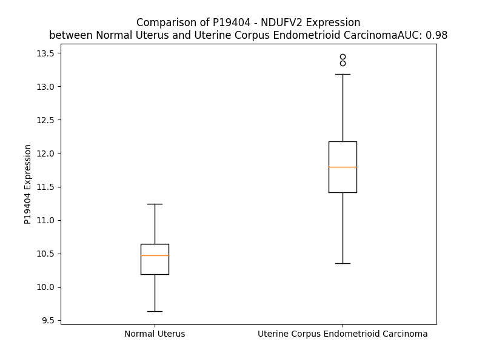

# Detailed Data for P19404

## Introduction to the Detailed Summary

### How to Interpret the Results

- **Summary & Metrics**: This section provides a quick reference to essential protein attributes, including expression changes, family classification, and biomarker applications. Regulation status (upregulated/downregulated) indicates the protein's behavior in a disease context. Some information comes from the original excel file with the proteins selected from literature, while others are derived from the analyses.
- **Expression Comparison**: A visual representation comparing protein expression between normal and disease states. It highlights significant changes in expression levels that might indicate diagnostic or therapeutic relevance. This is data coming from transcriptomics experiments and could not translate similarly to protein levels.
- **Isoform Alignment**: An interactive view of isoform alignments, revealing structural and functional differences between variants of the protein.
- **Interactors & Homologs**: Tables listing known interaction partners and homologous proteins, the more interactors and homologs, the more complex the protein is to design an antibody for.
- **Biological Assemblies**: Information about the structural arrangement of the protein in different assemblies, providing insights into its functional state but also the complexity of the protein to develop antibodies.
- **Combined Per-Residue Information**: A detailed table summarizing residue-level data. This includes predictions for epitope regions, aggregation tendencies, and modifications that might impact the protein's function. Each row corresponds to a residue in the protein, providing insights into specific sites that may be important for research or drug development.
## Summary & Metrics

- **UniProt Accession**: P19404
- **Gene Name**: NDUFV2
- **Protein Name**: NADH dehydrogenase (ubiquinone) flavoprotein 2, 24kDa
- **Swiss Prot**: NDUV2_HUMAN
- **Family**: enzyme
- **Biomarker Application**:  
- **Number of Isoforms**: 0
- **Regulation**: -1
- **(transcriptomics) AUC**: 0.98
- **(transcriptomics) Fold Change**: 1.11
- **(transcriptomics) Regulation**: Upregulated
- **Discotope Epitope Count**: 58
- **Max n_uniprots (Homo)**: N/A
- **Max n_uniprots (Hetero)**: 10.0

## Expression Comparison

## Interactors

| preferredName_A   | preferredName_B   |   score |
|:------------------|:------------------|--------:|
| NDUFV2            | NDUFS7            |   0.999 |
| NDUFV2            | NDUFB4            |   0.999 |
| NDUFV2            | NDUFB6            |   0.999 |
| NDUFV2            | NDUFA10           |   0.999 |
| NDUFV2            | NDUFS8            |   0.999 |
| NDUFV2            | NDUFA8            |   0.999 |
| NDUFV2            | NDUFA2            |   0.999 |
| NDUFV2            | NDUFS5            |   0.999 |
| NDUFV2            | NDUFS2            |   0.999 |
| NDUFV2            | NDUFB10           |   0.999 |
| NDUFV2            | NDUFV3            |   0.999 |
| NDUFV2            | MT-ND2            |   0.999 |
| NDUFV2            | UQCRFS1           |   0.999 |
| NDUFV2            | NDUFV1            |   0.999 |
| NDUFV2            | NDUFS3            |   0.999 |
| NDUFV2            | MT-ND1            |   0.999 |
| NDUFV2            | NDUFB9            |   0.999 |
| NDUFV2            | NDUFA3            |   0.999 |
| NDUFV2            | NDUFB7            |   0.999 |
| NDUFV2            | NDUFA11           |   0.999 |
| NDUFV2            | NDUFA1            |   0.999 |
| NDUFV2            | CYC1              |   0.999 |
| NDUFV2            | NDUFS4            |   0.999 |
| NDUFV2            | NDUFA7            |   0.999 |
| NDUFV2            | NDUFA9            |   0.999 |
| NDUFV2            | MT-ND5            |   0.999 |
| NDUFV2            | NDUFA5            |   0.999 |
| NDUFV2            | NDUFB11           |   0.999 |
| NDUFV2            | NDUFS6            |   0.999 |
| NDUFV2            | NDUFA6            |   0.999 |
| NDUFV2            | NDUFB8            |   0.999 |
| NDUFV2            | SDHB              |   0.999 |
| NDUFV2            | UQCRB             |   0.999 |
| NDUFV2            | NDUFA12           |   0.999 |
| NDUFV2            | MT-ND4            |   0.999 |
| NDUFV2            | MT-ND3            |   0.999 |
| NDUFV2            | NDUFB5            |   0.999 |
| NDUFV2            | NDUFA13           |   0.999 |
| NDUFV2            | NDUFC2            |   0.999 |
| NDUFV2            | NDUFB3            |   0.999 |
| NDUFV2            | NDUFS1            |   0.999 |
| NDUFV2            | NDUFAB1           |   0.999 |
| NDUFV2            | NDUFC1            |   0.999 |
| NDUFV2            | NDUFB1            |   0.998 |
| NDUFV2            | MT-ND4L           |   0.998 |
| NDUFV2            | UQCR10            |   0.997 |
| NDUFV2            | NDUFB2            |   0.997 |
| NDUFV2            | UQCRC2            |   0.996 |
| NDUFV2            | UQCRC1            |   0.996 |
| NDUFV2            | UQCRQ             |   0.995 |

## Homologs

| uniprot_id   | gene_id   |
|--------------|-----------|

## Biological Assemblies

|   Unnamed: 0 |   assembly |   n_uniprots | composition   | crystal_id   |
|-------------:|-----------:|-------------:|:--------------|:-------------|
|            0 |          1 |           10 | Hetero        | 5xtb         |
|            0 |          1 |           10 | Hetero        | 5xtd         |

## Combined Per-Residue Information

|   res | aa   |   epitope_score | epitope   |   relative_surface_accessibility |   modeling_confidence |   Aggregation | modification            |
|------:|:-----|----------------:|:----------|---------------------------------:|----------------------:|--------------:|:------------------------|
|     1 | M    |         0.1764  | False     |                          1.25137 |                 38.05 |         0     | N/A                     |
|     2 | F    |         0.21802 | False     |                          0.91613 |                 40.75 |         2.187 | N/A                     |
|     3 | F    |         0.30138 | True      |                          0.94306 |                 39.05 |         2.187 | N/A                     |
|     4 | S    |         0.18142 | False     |                          0.77714 |                 40.08 |         2.187 | N/A                     |
|     5 | A    |         0.20178 | False     |                          0.82989 |                 43.24 |         2.187 | N/A                     |
|     6 | A    |         0.16481 | False     |                          0.82892 |                 42.17 |         2.187 | N/A                     |
|     7 | L    |         0.29709 | True      |                          0.9106  |                 37.98 |         1.848 | N/A                     |
|     8 | R    |         0.29419 | True      |                          0.87079 |                 37.24 |         0     | N/A                     |
|     9 | A    |         0.15603 | False     |                          0.94647 |                 33.04 |         0     | N/A                     |
|    10 | R    |         0.25435 | False     |                          0.99222 |                 35.87 |         0     | N/A                     |
|    11 | A    |         0.19502 | False     |                          0.95178 |                 31.48 |         0     | N/A                     |
|    12 | A    |         0.2214  | False     |                          1.04811 |                 37.17 |         0     | N/A                     |
|    13 | G    |         0.21761 | False     |                          0.79867 |                 32.75 |         0     | N/A                     |
|    14 | L    |         0.12609 | False     |                          1.17497 |                 30.69 |         0     | N/A                     |
|    15 | T    |         0.13382 | False     |                          0.9055  |                 35.49 |         0     | N/A                     |
|    16 | A    |         0.13967 | False     |                          0.89023 |                 35.61 |         0     | N/A                     |
|    17 | H    |         0.15953 | False     |                          0.99602 |                 38.32 |         0     | N/A                     |
|    18 | W    |         0.21937 | False     |                          1.0619  |                 37.12 |         0     | N/A                     |
|    19 | G    |         0.21037 | False     |                          0.74991 |                 37.66 |         0     | N/A                     |
|    20 | R    |         0.18429 | False     |                          0.87031 |                 40.16 |         0     | N/A                     |
|    21 | H    |         0.22101 | False     |                          0.69975 |                 42.9  |         0     | N/A                     |
|    22 | V    |         0.11671 | False     |                          0.78909 |                 46.98 |         0     | N/A                     |
|    23 | R    |         0.16176 | False     |                          0.30036 |                 49.47 |         0     | N/A                     |
|    24 | N    |         0.19982 | False     |                          0.76129 |                 40.56 |         0     | N/A                     |
|    25 | L    |         0.33286 | True      |                          0.97811 |                 43.55 |         0     | N/A                     |
|    26 | H    |         0.23175 | False     |                          0.95898 |                 40.45 |         0     | N/A                     |
|    27 | K    |         0.28695 | True      |                          0.79428 |                 37.57 |         0     | N/A                     |
|    28 | T    |         0.17493 | False     |                          0.4586  |                 38.12 |         0     | N/A                     |
|    29 | V    |         0.22425 | False     |                          0.81001 |                 41.59 |         0     | N/A                     |
|    30 | M    |         0.25381 | False     |                          0.85695 |                 38.2  |         0     | N/A                     |
|    31 | Q    |         0.17213 | False     |                          0.71923 |                 36.6  |         0     | N/A                     |
|    32 | N    |         0.1283  | False     |                          0.52488 |                 38.33 |         0     | N/A                     |
|    33 | G    |         0.15465 | False     |                          0.49856 |                 37.43 |         0     | N/A                     |
|    34 | A    |         0.06507 | False     |                          0.11374 |                 41.14 |         0     | N/A                     |
|    35 | G    |         0.11123 | False     |                          0.23174 |                 40.57 |         0     | N/A                     |
|    36 | G    |         0.16466 | False     |                          0.08722 |                 51.92 |         1.339 | N/A                     |
|    37 | A    |         0.1517  | False     |                          0.59376 |                 65.97 |         2.165 | N/A                     |
|    38 | L    |         0.1727  | False     |                          0.58708 |                 85.07 |         2.165 | N/A                     |
|    39 | F    |         0.34775 | True      |                          0.72179 |                 91.54 |         2.165 | N/A                     |
|    40 | V    |         0.24008 | False     |                          0.64586 |                 92.81 |         2.165 | N/A                     |
|    41 | H    |         0.28998 | True      |                          0.44396 |                 93.62 |         0.826 | N/A                     |
|    42 | R    |         0.23209 | False     |                          0.63728 |                 93.51 |         0     | N/A                     |
|    43 | D    |         0.33304 | True      |                          0.61732 |                 94.48 |         0     | N/A                     |
|    44 | T    |         0.11101 | False     |                          0.4043  |                 93.85 |         0     | N/A                     |
|    45 | P    |         0.27104 | False     |                          0.94472 |                 92.79 |         0     | N/A                     |
|    46 | E    |         0.2413  | False     |                          0.6486  |                 89.99 |         0     | N/A                     |
|    47 | N    |         0.11796 | False     |                          0.12393 |                 93.47 |         0     | N/A                     |
|    48 | N    |         0.21575 | False     |                          0.19722 |                 93.35 |         0     | N/A                     |
|    49 | P    |         0.20803 | False     |                          0.51956 |                 93.41 |         0     | N/A                     |
|    50 | D    |         0.22216 | False     |                          0.81563 |                 93.51 |         0     | N/A                     |
|    51 | T    |         0.16002 | False     |                          0.17495 |                 93.32 |         0     | N/A                     |
|    52 | P    |         0.17761 | False     |                          0.97159 |                 93.22 |         0     | N/A                     |
|    53 | F    |         0.22208 | False     |                          0.13589 |                 95.96 |         0     | N/A                     |
|    54 | D    |         0.31731 | True      |                          0.48412 |                 96.59 |         0     | N/A                     |
|    55 | F    |         0.05221 | False     |                          0.0371  |                 96.68 |         0     | N/A                     |
|    56 | T    |         0.16739 | False     |                          0.41079 |                 97.25 |         0     | N/A                     |
|    57 | P    |         0.26697 | False     |                          0.78761 |                 97.03 |         0     | N/A                     |
|    58 | E    |         0.19802 | False     |                          0.53659 |                 97.4  |         0     | N/A                     |
|    59 | N    |         0.14387 | False     |                          0.08624 |                 97.3  |         0     | N/A                     |
|    60 | Y    |         0.3318  | True      |                          0.33743 |                 97.5  |         0     | N/A                     |
|    61 | K    |         0.25936 | False     |                          0.72091 |                 97.63 |         0     | N6-acetyllysine         |
|    62 | R    |         0.31546 | True      |                          0.47511 |                 97.57 |         0     | N/A                     |
|    63 | I    |         0.10515 | False     |                          0.028   |                 97.23 |         0     | N/A                     |
|    64 | E    |         0.32446 | True      |                          0.52186 |                 96.81 |         0     | N/A                     |
|    65 | A    |         0.25317 | False     |                          0.53886 |                 97.59 |         0     | N/A                     |
|    66 | I    |         0.35238 | True      |                          0.17748 |                 97.41 |         0     | N/A                     |
|    67 | V    |         0.13775 | False     |                          0.22548 |                 96.5  |         0     | N/A                     |
|    68 | K    |         0.31686 | True      |                          0.81206 |                 96.85 |         0     | N/A                     |
|    69 | N    |         0.34269 | True      |                          0.7502  |                 97.35 |         0     | N/A                     |
|    70 | Y    |         0.28934 | True      |                          0.30315 |                 96.79 |         0     | N/A                     |
|    71 | P    |         0.31679 | True      |                          0.69756 |                 96.32 |         0     | N/A                     |
|    72 | E    |         0.30723 | True      |                          0.88781 |                 94.59 |         0     | N/A                     |
|    73 | G    |         0.28333 | True      |                          0.95336 |                 93.98 |         0     | N/A                     |
|    74 | H    |         0.32563 | True      |                          0.63214 |                 95.68 |         0     | N/A                     |
|    75 | K    |         0.20455 | False     |                          0.32713 |                 94.31 |         0     | N/A                     |
|    76 | A    |         0.19507 | False     |                          0.52505 |                 95.81 |         0     | N/A                     |
|    77 | A    |         0.22661 | False     |                          0.44735 |                 96.46 |         0     | N/A                     |
|    78 | A    |         0.00305 | False     |                          0       |                 97.13 |         0     | N/A                     |
|    79 | V    |         0.1057  | False     |                          0.05236 |                 97.48 |         0     | N/A                     |
|    80 | L    |         0.38748 | True      |                          0.41713 |                 97.18 |         0     | N/A                     |
|    81 | P    |         0.35712 | True      |                          0.35138 |                 97.49 |         0     | N/A                     |
|    82 | V    |         0.0031  | False     |                          0       |                 97.52 |         0     | N/A                     |
|    83 | L    |         0.00278 | False     |                          0       |                 97.3  |         0     | N/A                     |
|    84 | D    |         0.16142 | False     |                          0.22935 |                 97.14 |         0     | N/A                     |
|    85 | L    |         0.08875 | False     |                          0.09832 |                 97.28 |         0     | N/A                     |
|    86 | A    |         0.0029  | False     |                          0       |                 97.16 |         0     | N/A                     |
|    87 | Q    |         0.08093 | False     |                          0.12461 |                 96.63 |         0     | N/A                     |
|    88 | R    |         0.2758  | True      |                          0.59736 |                 95.71 |         0     | N/A                     |
|    89 | Q    |         0.19978 | False     |                          0.33002 |                 95.42 |         0     | N/A                     |
|    90 | N    |         0.18702 | False     |                          0.38677 |                 93.29 |         0     | N/A                     |
|    91 | G    |         0.12295 | False     |                          0.48433 |                 91.99 |         0     | N/A                     |
|    92 | W    |         0.16667 | False     |                          0.1535  |                 94.42 |         0     | N/A                     |
|    93 | L    |         0.01149 | False     |                          0.00366 |                 95.35 |         0     | N/A                     |
|    94 | P    |         0.02801 | False     |                          0.0169  |                 95.24 |         0     | N/A                     |
|    95 | I    |         0.07946 | False     |                          0.12332 |                 95.8  |         0     | N/A                     |
|    96 | S    |         0.03334 | False     |                          0.06963 |                 96.06 |         0     | N/A                     |
|    97 | A    |         0.0043  | False     |                          0       |                 96.61 |         0     | N/A                     |
|    98 | M    |         0.09509 | False     |                          0.06532 |                 96.82 |         0     | N/A                     |
|    99 | N    |         0.15995 | False     |                          0.26295 |                 97.22 |         0     | N/A                     |
|   100 | K    |         0.11916 | False     |                          0.21938 |                 96.9  |         0     | N/A                     |
|   101 | V    |         0.00392 | False     |                          0       |                 97.21 |         0     | N/A                     |
|   102 | A    |         0.03065 | False     |                          0.02487 |                 97.5  |         0     | N/A                     |
|   103 | E    |         0.32889 | True      |                          0.5796  |                 96.51 |         0     | N/A                     |
|   104 | V    |         0.19182 | False     |                          0.22337 |                 95.09 |         0     | N/A                     |
|   105 | L    |         0.03893 | False     |                          0.01828 |                 95.68 |         0     | N/A                     |
|   106 | Q    |         0.307   | True      |                          0.77632 |                 96.13 |         0     | N/A                     |
|   107 | V    |         0.17918 | False     |                          0.14208 |                 96.45 |         0     | N/A                     |
|   108 | P    |         0.31377 | True      |                          0.62855 |                 97.14 |         0     | N/A                     |
|   109 | P    |         0.20954 | False     |                          0.4523  |                 97.11 |         0     | N/A                     |
|   110 | M    |         0.36659 | True      |                          0.62304 |                 97.3  |         0.86  | N/A                     |
|   111 | R    |         0.45152 | True      |                          0.54313 |                 96.49 |         1.614 | N/A                     |
|   112 | V    |         0.0076  | False     |                          0       |                 97.27 |         1.614 | N/A                     |
|   113 | Y    |         0.30649 | True      |                          0.26584 |                 96.86 |         1.614 | N/A                     |
|   114 | E    |         0.38597 | True      |                          0.35975 |                 96.91 |         1.614 | N/A                     |
|   115 | V    |         0.26404 | False     |                          0.19599 |                 96.75 |        50.363 | N/A                     |
|   116 | A    |         0.02153 | False     |                          0.01037 |                 95.91 |        54.274 | N/A                     |
|   117 | T    |         0.17198 | False     |                          0.29818 |                 94.57 |        55.312 | N/A                     |
|   118 | F    |         0.41233 | True      |                          0.79384 |                 95.75 |        56.286 | N/A                     |
|   119 | Y    |         0.43635 | True      |                          0.41483 |                 95.24 |        56.148 | N/A                     |
|   120 | T    |         0.19721 | False     |                          0.92157 |                 93.27 |        53.219 | N/A                     |
|   121 | M    |         0.21262 | False     |                          0.66869 |                 94.11 |        51.37  | N/A                     |
|   122 | Y    |         0.07981 | False     |                          0.07287 |                 95.59 |        48.8   | N/A                     |
|   123 | N    |         0.06331 | False     |                          0.04602 |                 94.73 |         0.624 | N/A                     |
|   124 | R    |         0.21047 | False     |                          0.16015 |                 93.17 |         0     | N/A                     |
|   125 | K    |         0.14551 | False     |                          0.47732 |                 90.58 |         0     | N/A                     |
|   126 | P    |         0.18384 | False     |                          0.64607 |                 92.02 |         0     | N/A                     |
|   127 | V    |         0.10636 | False     |                          0.20175 |                 92.7  |         0     | N/A                     |
|   128 | G    |         0.04276 | False     |                          0.04808 |                 91.7  |         0     | N/A                     |
|   129 | K    |         0.1595  | False     |                          0.67661 |                 93.97 |         0     | N/A                     |
|   130 | Y    |         0.09306 | False     |                          0.10996 |                 95.83 |         0     | N/A                     |
|   131 | H    |         0.05116 | False     |                          0.07519 |                 95.22 |         0     | N/A                     |
|   132 | I    |         0.00393 | False     |                          0       |                 96.68 |         0     | N/A                     |
|   133 | Q    |         0.10097 | False     |                          0.13017 |                 96.59 |         0     | N/A                     |
|   134 | V    |         0.00616 | False     |                          0.00381 |                 96.91 |         0     | N/A                     |
|   135 | C    |         0.03057 | False     |                          0.01964 |                 96.73 |         0     | N/A                     |
|   136 | T    |         0.09827 | False     |                          0.12771 |                 95.04 |         0     | N/A                     |
|   137 | T    |         0.19287 | False     |                          0.19925 |                 95.56 |         0     | N/A                     |
|   138 | T    |         0.35247 | True      |                          0.57039 |                 96.87 |         0     | N/A                     |
|   139 | P    |         0.27497 | True      |                          0.40666 |                 96.53 |         0     | N/A                     |
|   140 | C    |         0.0426  | False     |                          0.01871 |                 96.62 |         0     | N/A                     |
|   141 | M    |         0.18664 | False     |                          0.31116 |                 95.72 |         0     | N/A                     |
|   142 | L    |         0.25735 | False     |                          0.82229 |                 96.93 |         0     | N/A                     |
|   143 | R    |         0.2341  | False     |                          0.56437 |                 95.81 |         0     | N/A                     |
|   144 | N    |         0.16613 | False     |                          0.51525 |                 95.66 |         0     | N/A                     |
|   145 | S    |         0.01606 | False     |                          0.00416 |                 95.65 |         0     | N/A                     |
|   146 | D    |         0.09711 | False     |                          0.1444  |                 95.08 |         0     | N/A                     |
|   147 | S    |         0.11722 | False     |                          0.30701 |                 95.47 |         0     | N/A                     |
|   148 | I    |         0.03249 | False     |                          0.0136  |                 96.42 |         0     | N/A                     |
|   149 | L    |         0.03359 | False     |                          0.04287 |                 95.42 |         0     | N/A                     |
|   150 | E    |         0.20336 | False     |                          0.59792 |                 95.85 |         0     | N/A                     |
|   151 | A    |         0.09731 | False     |                          0.11126 |                 96.48 |         0     | N/A                     |
|   152 | I    |         0.01022 | False     |                          0.0008  |                 96.65 |         0     | N/A                     |
|   153 | Q    |         0.15837 | False     |                          0.26421 |                 96.01 |         0     | N/A                     |
|   154 | K    |         0.30525 | True      |                          0.8877  |                 96.15 |         0     | N/A                     |
|   155 | K    |         0.20125 | False     |                          0.32316 |                 94.58 |         0     | N/A                     |
|   156 | L    |         0.12979 | False     |                          0.11137 |                 95.43 |         0     | N/A                     |
|   157 | G    |         0.24246 | False     |                          0.81209 |                 95.14 |         0     | N/A                     |
|   158 | I    |         0.18566 | False     |                          0.07172 |                 95.3  |         0     | N/A                     |
|   159 | K    |         0.1478  | False     |                          0.66989 |                 93.88 |         0     | N/A                     |
|   160 | V    |         0.08822 | False     |                          0.15552 |                 93.69 |         0     | N/A                     |
|   161 | G    |         0.07173 | False     |                          0.25878 |                 90.42 |         0     | N/A                     |
|   162 | E    |         0.12774 | False     |                          0.41247 |                 93.27 |         0     | N/A                     |
|   163 | T    |         0.05436 | False     |                          0.27894 |                 94.71 |         0     | N/A                     |
|   164 | T    |         0.0534  | False     |                          0.04185 |                 95.57 |         0     | N/A                     |
|   165 | P    |         0.14568 | False     |                          0.92782 |                 94.08 |         0     | N/A                     |
|   166 | D    |         0.23882 | False     |                          0.49613 |                 94.12 |         0     | N/A                     |
|   167 | K    |         0.16331 | False     |                          0.70019 |                 92.88 |         0.217 | N/A                     |
|   168 | L    |         0.15808 | False     |                          0.3487  |                 94.84 |        59.369 | N/A                     |
|   169 | F    |         0.00678 | False     |                          0.00064 |                 96.56 |        59.369 | N/A                     |
|   170 | T    |         0.00637 | False     |                          0       |                 95.9  |        59.369 | N/A                     |
|   171 | L    |         0.00454 | False     |                          0       |                 96.56 |        59.369 | N/A                     |
|   172 | I    |         0.10762 | False     |                          0.0896  |                 94.59 |        59.369 | N/A                     |
|   173 | E    |         0.14035 | False     |                          0.21946 |                 94.3  |         0.217 | N/A                     |
|   174 | V    |         0.23848 | False     |                          0.18071 |                 95.13 |         0.217 | N/A                     |
|   175 | E    |         0.26774 | False     |                          0.55214 |                 95.74 |         0     | N/A                     |
|   176 | C    |         0.2475  | False     |                          0.53995 |                 96.94 |         0     | N/A                     |
|   177 | L    |         0.3491  | True      |                          0.1885  |                 95.72 |         0     | N/A                     |
|   178 | G    |         0.42786 | True      |                          0.76155 |                 96.04 |         0     | N/A                     |
|   179 | A    |         0.21795 | False     |                          0.11111 |                 96.63 |         0     | N/A                     |
|   180 | C    |         0.30269 | True      |                          0.38416 |                 96.76 |         0     | N/A                     |
|   181 | V    |         0.3599  | True      |                          0.68485 |                 97.24 |         0     | N/A                     |
|   182 | N    |         0.08098 | False     |                          0.04074 |                 97.01 |         0     | N/A                     |
|   183 | A    |         0.01833 | False     |                          0.00094 |                 96.05 |         0     | N/A                     |
|   184 | P    |         0.10235 | False     |                          0.0835  |                 96.53 |         0     | N/A                     |
|   185 | M    |         0.03028 | False     |                          0.01181 |                 96.83 |         0     | N/A                     |
|   186 | V    |         0.00337 | False     |                          0       |                 97.52 |         0     | N/A                     |
|   187 | Q    |         0.11064 | False     |                          0.10541 |                 97.61 |         0     | N/A                     |
|   188 | I    |         0.07102 | False     |                          0.03043 |                 96.72 |         0     | N/A                     |
|   189 | N    |         0.14168 | False     |                          0.39286 |                 93.86 |         0     | N/A                     |
|   190 | D    |         0.30532 | True      |                          0.59043 |                 93.86 |         0     | N/A                     |
|   191 | N    |         0.11447 | False     |                          0.26987 |                 96.88 |         0     | N/A                     |
|   192 | Y    |         0.19279 | False     |                          0.34882 |                 97.77 |         0     | N/A                     |
|   193 | Y    |         0.01692 | False     |                          0.00751 |                 97.77 |         0     | Phosphotyrosine; by SRC |
|   194 | E    |         0.10046 | False     |                          0.10326 |                 97.7  |         0     | N/A                     |
|   195 | D    |         0.06727 | False     |                          0.08981 |                 97.2  |         0     | N/A                     |
|   196 | L    |         0.03724 | False     |                          0.039   |                 96.67 |         0     | N/A                     |
|   197 | T    |         0.16799 | False     |                          0.5481  |                 96.39 |         0     | N/A                     |
|   198 | A    |         0.12888 | False     |                          0.40688 |                 95.44 |         0     | N/A                     |
|   199 | K    |         0.23727 | False     |                          0.74774 |                 96.25 |         0     | N/A                     |
|   200 | D    |         0.15971 | False     |                          0.17126 |                 96.46 |         0     | N/A                     |
|   201 | I    |         0.00788 | False     |                          0.0008  |                 96.05 |         0     | N/A                     |
|   202 | E    |         0.18581 | False     |                          0.3406  |                 96.29 |         0     | N/A                     |
|   203 | E    |         0.25641 | False     |                          0.41601 |                 96.56 |         0     | N/A                     |
|   204 | I    |         0.01056 | False     |                          0       |                 96.96 |         0     | N/A                     |
|   205 | I    |         0.00898 | False     |                          0       |                 96.21 |         0     | N/A                     |
|   206 | D    |         0.19646 | False     |                          0.40135 |                 96.54 |         0     | N/A                     |
|   207 | E    |         0.20479 | False     |                          0.26797 |                 95.96 |         0     | N/A                     |
|   208 | L    |         0.1178  | False     |                          0.04792 |                 96.09 |         0     | N/A                     |
|   209 | K    |         0.21624 | False     |                          0.45289 |                 94.43 |         0     | N/A                     |
|   210 | A    |         0.26246 | False     |                          0.66353 |                 95.5  |         0     | N/A                     |
|   211 | G    |         0.20004 | False     |                          0.70567 |                 93.98 |         0     | N/A                     |
|   212 | K    |         0.1938  | False     |                          0.64303 |                 94.96 |         0     | N/A                     |
|   213 | I    |         0.12973 | False     |                          0.82217 |                 93.91 |         0     | N/A                     |
|   214 | P    |         0.03889 | False     |                          0.03427 |                 94.63 |         0     | N/A                     |
|   215 | K    |         0.20553 | False     |                          0.85172 |                 95.41 |         0     | N/A                     |
|   216 | P    |         0.33462 | True      |                          0.60631 |                 95.99 |         0     | N/A                     |
|   217 | G    |         0.14573 | False     |                          0.21276 |                 95.26 |         0     | N/A                     |
|   218 | P    |         0.15196 | False     |                          0.18387 |                 96.41 |         0     | N/A                     |
|   219 | R    |         0.28875 | True      |                          0.27648 |                 95.53 |         0     | N/A                     |
|   220 | S    |         0.24186 | False     |                          0.39868 |                 93.48 |         0     | N/A                     |
|   221 | G    |         0.31703 | True      |                          0.99487 |                 92.69 |         0     | N/A                     |
|   222 | R    |         0.38037 | True      |                          0.13698 |                 94.67 |         0     | N/A                     |
|   223 | F    |         0.26872 | False     |                          0.93488 |                 94.41 |         0     | N/A                     |
|   224 | S    |         0.3531  | True      |                          0.47367 |                 95.95 |         0     | N/A                     |
|   225 | C    |         0.47678 | True      |                          0.63685 |                 96.37 |         0     | N/A                     |
|   226 | E    |         0.30064 | True      |                          0.1573  |                 95.59 |         0     | N/A                     |
|   227 | P    |         0.36092 | True      |                          0.46659 |                 96.26 |         0     | N/A                     |
|   228 | A    |         0.35157 | True      |                          0.8196  |                 93.86 |         0     | N/A                     |
|   229 | G    |         0.32039 | True      |                          1.03121 |                 94.28 |         0     | N/A                     |
|   230 | G    |         0.23723 | False     |                          0.45657 |                 92.53 |         0     | N/A                     |
|   231 | L    |         0.43069 | True      |                          0.66034 |                 95.89 |         0     | N/A                     |
|   232 | T    |         0.38503 | True      |                          0.78958 |                 96.48 |         0     | N/A                     |
|   233 | S    |         0.3818  | True      |                          0.55558 |                 96.55 |         0     | N/A                     |
|   234 | L    |         0.43775 | True      |                          1.00504 |                 96.3  |         0     | N/A                     |
|   235 | T    |         0.24858 | False     |                          0.65632 |                 96.57 |         0     | N/A                     |
|   236 | E    |         0.22935 | False     |                          0.62536 |                 96.67 |         0     | N/A                     |
|   237 | P    |         0.26169 | False     |                          0.70223 |                 96.83 |         0     | N/A                     |
|   238 | P    |         0.3179  | True      |                          0.94955 |                 97.2  |         0     | N/A                     |
|   239 | K    |         0.28262 | True      |                          0.62141 |                 96.34 |         0     | N/A                     |
|   240 | G    |         0.17748 | False     |                          0.52191 |                 95.56 |         0     | N/A                     |
|   241 | P    |         0.39772 | True      |                          1.06643 |                 95.09 |         0     | N/A                     |
|   242 | G    |         0.22147 | False     |                          0.65109 |                 93.67 |         0     | N/A                     |
|   243 | F    |         0.39567 | True      |                          0.73475 |                 94.15 |         0     | N/A                     |
|   244 | G    |         0.25667 | False     |                          0.90227 |                 94.07 |         0     | N/A                     |
|   245 | V    |         0.2033  | False     |                          0.60305 |                 95.75 |         0     | N/A                     |
|   246 | Q    |         0.25929 | False     |                          0.67201 |                 95.01 |         0     | N/A                     |
|   247 | A    |         0.17496 | False     |                          1.0279  |                 93.41 |         0     | N/A                     |
|   248 | G    |         0.14107 | False     |                          1.07311 |                 93.03 |         0     | N/A                     |
|   249 | L    |         0.1402  | False     |                          1.1018  |                 87.48 |         0     | N/A                     |

