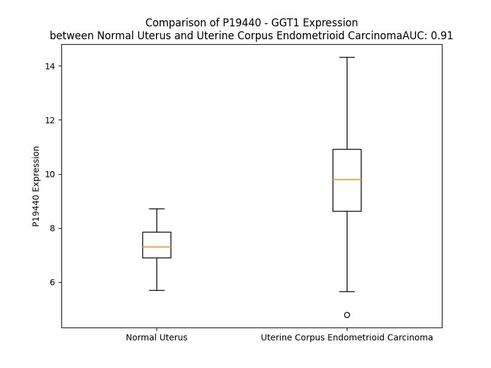

# Detailed Data for P19440

## Introduction to the Detailed Summary

### How to Interpret the Results

- **Summary & Metrics**: This section provides a quick reference to essential protein attributes, including expression changes, family classification, and biomarker applications. Regulation status (upregulated/downregulated) indicates the protein's behavior in a disease context. Some information comes from the original excel file with the proteins selected from literature, while others are derived from the analyses.
- **Expression Comparison**: A visual representation comparing protein expression between normal and disease states. It highlights significant changes in expression levels that might indicate diagnostic or therapeutic relevance. This is data coming from transcriptomics experiments and could not translate similarly to protein levels.
- **Isoform Alignment**: An interactive view of isoform alignments, revealing structural and functional differences between variants of the protein.
- **Interactors & Homologs**: Tables listing known interaction partners and homologous proteins, the more interactors and homologs, the more complex the protein is to design an antibody for.
- **Biological Assemblies**: Information about the structural arrangement of the protein in different assemblies, providing insights into its functional state but also the complexity of the protein to develop antibodies.
- **Combined Per-Residue Information**: A detailed table summarizing residue-level data. This includes predictions for epitope regions, aggregation tendencies, and modifications that might impact the protein's function. Each row corresponds to a residue in the protein, providing insights into specific sites that may be important for research or drug development.
## Summary & Metrics

- **UniProt Accession**: P19440
- **Gene Name**: GGT1
- **Protein Name**: gamma-glutamyltransferase 1
- **Swiss Prot**: GGT1_HUMAN
- **Family**: enzyme
- **Biomarker Application**: diagnosis,efficacy,safety,unspecified application
- **Number of Isoforms**: 0
- **Regulation**: 2
- **(transcriptomics) AUC**: 0.68
- **(transcriptomics) Fold Change**: 1.11
- **(transcriptomics) Regulation**: Upregulated
- **Discotope Epitope Count**: 108
- **Max n_uniprots (Homo)**: 2
- **Max n_uniprots (Hetero)**: N/A

## Expression Comparison

## Interactors

| preferredName_A   | preferredName_B   |   score |
|:------------------|:------------------|--------:|
| GGT1              | GGCT              |   0.968 |
| GGT1              | GSS               |   0.96  |
| GGT1              | GGT6              |   0.947 |
| GGT1              | ANPEP             |   0.946 |
| GGT1              | GCLC              |   0.944 |
| GGT1              | OPLAH             |   0.936 |
| GGT1              | GCLM              |   0.935 |
| GGT1              | GSR               |   0.933 |
| GGT1              | GGT7              |   0.93  |
| GGT1              | LAP3              |   0.924 |
| GGT1              | GPX4              |   0.924 |
| GGT1              | GGT5              |   0.923 |
| GGT1              | LTC4S             |   0.921 |
| GGT1              | GAD1              |   0.915 |
| GGT1              | CHAC1             |   0.914 |
| GGT1              | BAAT              |   0.914 |
| GGT1              | GAD2              |   0.911 |
| GGT1              | PRDX6             |   0.909 |
| GGT1              | CSAD              |   0.907 |
| GGT1              | CHAC2             |   0.907 |
| GGT1              | TXNDC12           |   0.904 |

## Homologs

| uniprot_id   | gene_id   |
|:-------------|:----------|
| A0A494C1E1   | GGTLC2    |
| Q9BX51       | GGTLC1    |
| B5MD39       | GGTLC3    |
| J3KPJ0       | GGT6      |
| Q9UJ14       | GGT7      |
| C9JU68       | GGT5      |

## Biological Assemblies

|   Unnamed: 0 |   assembly |   n_uniprots | composition   | crystal_id   |
|-------------:|-----------:|-------------:|:--------------|:-------------|
|            0 |          1 |            2 | Homo          | 5v4q         |
|            0 |          1 |            2 | Homo          | 4zbk         |
|            0 |          1 |            2 | Homo          | 4zc6         |
|            0 |          1 |            2 | Homo          | 4z9o         |
|            0 |          1 |            2 | Homo          | 4zcg         |
|            0 |          1 |            2 | Homo          | 4gg2         |
|            0 |          1 |            2 | Homo          | 4gdx         |

## Combined Per-Residue Information

|   res | aa   |   epitope_score | epitope   |   relative_surface_accessibility |   modeling_confidence |   Aggregation | modification   | glycosylation                   |
|------:|:-----|----------------:|:----------|---------------------------------:|----------------------:|--------------:|:---------------|:--------------------------------|
|     1 | M    |         0.09097 | False     |                          1.08312 |                 61.94 |         0     | N/A            | N/A                             |
|     2 | K    |         0.1038  | False     |                          0.87717 |                 73.27 |         0     | N/A            | N/A                             |
|     3 | K    |         0.14754 | True      |                          0.89818 |                 76.32 |         0     | N/A            | N/A                             |
|     4 | K    |         0.13914 | True      |                          0.79946 |                 77.45 |         0     | N/A            | N/A                             |
|     5 | L    |         0.10007 | False     |                          0.74737 |                 80.19 |        51.468 | N/A            | N/A                             |
|     6 | V    |         0.07237 | False     |                          0.6693  |                 82.81 |        78.687 | N/A            | N/A                             |
|     7 | V    |         0.05552 | False     |                          0.60908 |                 84.18 |        86.349 | N/A            | N/A                             |
|     8 | L    |         0.0754  | False     |                          0.72135 |                 84.66 |        89.838 | N/A            | N/A                             |
|     9 | G    |         0.06765 | False     |                          0.43217 |                 87.18 |        90.496 | N/A            | N/A                             |
|    10 | L    |         0.08912 | False     |                          0.67113 |                 88.23 |        98.038 | N/A            | N/A                             |
|    11 | L    |         0.09306 | False     |                          0.68399 |                 90.02 |        99.42  | N/A            | N/A                             |
|    12 | A    |         0.08329 | False     |                          0.51981 |                 90    |        99.673 | N/A            | N/A                             |
|    13 | V    |         0.06628 | False     |                          0.60919 |                 91.5  |        99.972 | N/A            | N/A                             |
|    14 | V    |         0.06813 | False     |                          0.58552 |                 91.58 |        99.997 | N/A            | N/A                             |
|    15 | L    |         0.10427 | False     |                          0.69376 |                 92.3  |        99.999 | N/A            | N/A                             |
|    16 | V    |         0.06929 | False     |                          0.61409 |                 91.73 |        99.999 | N/A            | N/A                             |
|    17 | L    |         0.10296 | False     |                          0.69929 |                 91.97 |        99.994 | N/A            | N/A                             |
|    18 | V    |         0.08263 | False     |                          0.55663 |                 90.67 |        99.962 | N/A            | N/A                             |
|    19 | I    |         0.06314 | False     |                          0.54078 |                 89.77 |        99.587 | N/A            | N/A                             |
|    20 | V    |         0.04901 | False     |                          0.50745 |                 85.74 |        95.492 | N/A            | N/A                             |
|    21 | G    |         0.0466  | False     |                          0.32491 |                 82.94 |        47.293 | N/A            | N/A                             |
|    22 | L    |         0.05642 | False     |                          0.62794 |                 80.1  |        42.356 | N/A            | N/A                             |
|    23 | C    |         0.06528 | False     |                          0.64303 |                 76.41 |        15.4   | N/A            | N/A                             |
|    24 | L    |         0.16404 | True      |                          0.86114 |                 75.52 |        13.564 | N/A            | N/A                             |
|    25 | W    |         0.14153 | True      |                          0.96174 |                 64.44 |        11.212 | N/A            | N/A                             |
|    26 | L    |         0.11405 | False     |                          0.70981 |                 56.34 |         0.577 | N/A            | N/A                             |
|    27 | P    |         0.10371 | False     |                          0.80698 |                 51.07 |         0.285 | N/A            | N/A                             |
|    28 | S    |         0.08667 | False     |                          0.78696 |                 53.88 |         0     | N/A            | N/A                             |
|    29 | A    |         0.08838 | False     |                          0.84401 |                 48.44 |         0     | N/A            | N/A                             |
|    30 | S    |         0.1428  | True      |                          0.68441 |                 46.84 |         0     | N/A            | N/A                             |
|    31 | K    |         0.17576 | True      |                          0.91745 |                 45.55 |         0     | N/A            | N/A                             |
|    32 | E    |         0.15512 | True      |                          0.78633 |                 41.86 |         0     | N/A            | N/A                             |
|    33 | P    |         0.12699 | False     |                          0.70636 |                 52.74 |         0     | N/A            | N/A                             |
|    34 | D    |         0.12856 | False     |                          0.54773 |                 66.76 |         0     | N/A            | N/A                             |
|    35 | N    |         0.07455 | False     |                          0.59122 |                 75.55 |         0     | N/A            | N/A                             |
|    36 | H    |         0.0496  | False     |                          0.15425 |                 90.83 |         0     | N/A            | N/A                             |
|    37 | V    |         0.07063 | False     |                          0.4681  |                 95.94 |         0     | N/A            | N/A                             |
|    38 | Y    |         0.02907 | False     |                          0.15269 |                 97.14 |         0     | N/A            | N/A                             |
|    39 | T    |         0.08404 | False     |                          0.66514 |                 96.53 |         0     | N/A            | N/A                             |
|    40 | R    |         0.12192 | False     |                          0.52554 |                 97.18 |         0     | N/A            | N/A                             |
|    41 | A    |         0.00349 | False     |                          0       |                 98.42 |         0.995 | N/A            | N/A                             |
|    42 | A    |         0.00141 | False     |                          0       |                 98.65 |         0.995 | N/A            | N/A                             |
|    43 | V    |         0.0014  | False     |                          0       |                 98.83 |         0.995 | N/A            | N/A                             |
|    44 | A    |         0.00231 | False     |                          0       |                 98.67 |         0.995 | N/A            | N/A                             |
|    45 | A    |         0.00255 | False     |                          0       |                 97.95 |         0.995 | N/A            | N/A                             |
|    46 | D    |         0.01026 | False     |                          0.01042 |                 91.86 |         0     | N/A            | N/A                             |
|    47 | A    |         0.03978 | False     |                          0.07652 |                 94.58 |         0     | N/A            | N/A                             |
|    48 | K    |         0.04836 | False     |                          0.42276 |                 95.66 |         0     | N/A            | N/A                             |
|    49 | Q    |         0.13647 | False     |                          0.34449 |                 97.74 |         0     | N/A            | N/A                             |
|    50 | C    |         0.00253 | False     |                          0       |                 98.6  |         0     | N/A            | N/A                             |
|    51 | S    |         0.00152 | False     |                          0       |                 98.73 |         0     | N/A            | N/A                             |
|    52 | K    |         0.0529  | False     |                          0.34122 |                 98.63 |         0     | N/A            | N/A                             |
|    53 | I    |         0.02847 | False     |                          0.05217 |                 98.84 |         0     | N/A            | N/A                             |
|    54 | G    |         0.00168 | False     |                          0       |                 98.86 |         0     | N/A            | N/A                             |
|    55 | R    |         0.03209 | False     |                          0.15621 |                 98.7  |         0     | N/A            | N/A                             |
|    56 | D    |         0.05295 | False     |                          0.30029 |                 98.84 |         0     | N/A            | N/A                             |
|    57 | A    |         0.00157 | False     |                          0       |                 98.86 |         0     | N/A            | N/A                             |
|    58 | L    |         0.01597 | False     |                          0.0552  |                 98.79 |         0     | N/A            | N/A                             |
|    59 | R    |         0.15377 | True      |                          0.58642 |                 98.46 |         0     | N/A            | N/A                             |
|    60 | D    |         0.08897 | False     |                          0.47382 |                 98.43 |         0     | N/A            | N/A                             |
|    61 | G    |         0.05932 | False     |                          0.57346 |                 98.14 |         0     | N/A            | N/A                             |
|    62 | G    |         0.02873 | False     |                          0.07852 |                 98.64 |         0     | N/A            | N/A                             |
|    63 | S    |         0.01312 | False     |                          0.05824 |                 98.74 |         0     | N/A            | N/A                             |
|    64 | A    |         0.00317 | False     |                          0.03081 |                 98.81 |         0     | N/A            | N/A                             |
|    65 | V    |         0.00487 | False     |                          0.01496 |                 98.88 |         0     | N/A            | N/A                             |
|    66 | D    |         0.00349 | False     |                          0       |                 98.92 |         0     | N/A            | N/A                             |
|    67 | A    |         0.00123 | False     |                          0       |                 98.91 |         8.708 | N/A            | N/A                             |
|    68 | A    |         0.00061 | False     |                          0       |                 98.92 |        19.008 | N/A            | N/A                             |
|    69 | I    |         0.00222 | False     |                          0       |                 98.91 |        51.474 | N/A            | N/A                             |
|    70 | A    |         0.00088 | False     |                          0       |                 98.92 |        53.947 | N/A            | N/A                             |
|    71 | A    |         0.00102 | False     |                          0       |                 98.87 |        56.763 | N/A            | N/A                             |
|    72 | L    |         0.00187 | False     |                          0.00165 |                 98.83 |        58.538 | N/A            | N/A                             |
|    73 | L    |         0.00432 | False     |                          0.00577 |                 98.88 |        58.325 | N/A            | N/A                             |
|    74 | C    |         0.00311 | False     |                          0       |                 98.87 |        50.63  | N/A            | N/A                             |
|    75 | V    |         0.00444 | False     |                          0.00381 |                 98.46 |        48.916 | N/A            | N/A                             |
|    76 | G    |         0.0113  | False     |                          0.03968 |                 98.34 |        27.421 | N/A            | N/A                             |
|    77 | L    |         0.00397 | False     |                          0       |                 98.51 |        25.347 | N/A            | N/A                             |
|    78 | M    |         0.02898 | False     |                          0.11765 |                 97.89 |        13.888 | N/A            | N/A                             |
|    79 | N    |         0.0129  | False     |                          0.03055 |                 96.72 |         0.817 | N/A            | N/A                             |
|    80 | A    |         0.02405 | False     |                          0.07231 |                 97.24 |         0.401 | N/A            | N/A                             |
|    81 | H    |         0.01057 | False     |                          0.00568 |                 96.15 |         0.05  | N/A            | N/A                             |
|    82 | S    |         0.00466 | False     |                          0.00158 |                 96.2  |         0     | N/A            | N/A                             |
|    83 | M    |         0.01284 | False     |                          0.01194 |                 97.61 |         0.039 | N/A            | N/A                             |
|    84 | G    |         0.03057 | False     |                          0.10622 |                 97.99 |         0.077 | N/A            | N/A                             |
|    85 | I    |         0.01908 | False     |                          0.02682 |                 98.61 |         0.661 | N/A            | N/A                             |
|    86 | G    |         0.00319 | False     |                          0.00415 |                 98.6  |         0.7   | N/A            | N/A                             |
|    87 | G    |         0.00338 | False     |                          0       |                 98.49 |         1.294 | N/A            | N/A                             |
|    88 | G    |         0.00818 | False     |                          0       |                 98.38 |         7.831 | N/A            | N/A                             |
|    89 | L    |         0.00387 | False     |                          0       |                 98.15 |        79.111 | N/A            | N/A                             |
|    90 | F    |         0.00356 | False     |                          0.00069 |                 98.18 |        89.319 | N/A            | N/A                             |
|    91 | L    |         0.00199 | False     |                          0       |                 98.81 |        89.35  | N/A            | N/A                             |
|    92 | T    |         0.00202 | False     |                          0       |                 98.88 |        89.311 | N/A            | N/A                             |
|    93 | I    |         0.00926 | False     |                          0.02758 |                 98.89 |        89.184 | N/A            | N/A                             |
|    94 | Y    |         0.01246 | False     |                          0.00987 |                 98.79 |        72.056 | N/A            | N/A                             |
|    95 | N    |         0.02339 | False     |                          0.24197 |                 98.26 |         3.098 | N/A            | N-linked (GlcNAc...) asparagine |
|    96 | S    |         0.03495 | False     |                          0.20613 |                 96.79 |         0.385 | N/A            | N/A                             |
|    97 | T    |         0.09759 | False     |                          0.82303 |                 95.19 |         0.056 | N/A            | N/A                             |
|    98 | T    |         0.1141  | False     |                          0.54809 |                 96.33 |         0     | N/A            | N/A                             |
|    99 | R    |         0.18143 | True      |                          0.61005 |                 97.22 |         0     | N/A            | N/A                             |
|   100 | K    |         0.17799 | True      |                          0.72346 |                 97.8  |         0     | N/A            | N/A                             |
|   101 | A    |         0.01527 | False     |                          0.07576 |                 98.6  |         0     | N/A            | N/A                             |
|   102 | E    |         0.05287 | False     |                          0.08666 |                 98.61 |         0     | N/A            | N/A                             |
|   103 | V    |         0.00283 | False     |                          0.0019  |                 98.8  |         0     | N/A            | N/A                             |
|   104 | I    |         0.00438 | False     |                          0       |                 98.7  |         0     | N/A            | N/A                             |
|   105 | N    |         0.01725 | False     |                          0.02773 |                 98.39 |         0     | N/A            | N/A                             |
|   106 | A    |         0.00262 | False     |                          0       |                 98.36 |         0     | N/A            | N/A                             |
|   107 | R    |         0.0058  | False     |                          0.00468 |                 98    |         0     | N/A            | N/A                             |
|   108 | E    |         0.00235 | False     |                          0       |                 98.54 |         0     | N/A            | N/A                             |
|   109 | V    |         0.03549 | False     |                          0.17518 |                 98.62 |         0     | N/A            | N/A                             |
|   110 | A    |         0.00896 | False     |                          0.01226 |                 98.67 |         0     | N/A            | N/A                             |
|   111 | P    |         0.00304 | False     |                          0.00099 |                 98.76 |         0     | N/A            | N/A                             |
|   112 | R    |         0.18086 | True      |                          0.51362 |                 98.27 |         0     | N/A            | N/A                             |
|   113 | L    |         0.21377 | True      |                          0.54801 |                 98.32 |         9.309 | N/A            | N/A                             |
|   114 | A    |         0.02018 | False     |                          0.03582 |                 98    |        10.81  | N/A            | N/A                             |
|   115 | F    |         0.16122 | True      |                          0.57251 |                 97.01 |        15.482 | N/A            | N/A                             |
|   116 | A    |         0.13471 | False     |                          0.32215 |                 95.02 |        15.482 | N/A            | N/A                             |
|   117 | T    |         0.21964 | True      |                          0.60533 |                 93.89 |        15.482 | N/A            | N/A                             |
|   118 | M    |         0.18036 | True      |                          0.06685 |                 94.52 |        14.935 | N/A            | N/A                             |
|   119 | F    |         0.03009 | False     |                          0.01471 |                 92.94 |        14.203 | N/A            | N/A                             |
|   120 | N    |         0.32551 | True      |                          0.78705 |                 85.8  |         0.742 | N/A            | N-linked (GlcNAc...) asparagine |
|   121 | S    |         0.29066 | True      |                          0.37366 |                 85.16 |         0.273 | N/A            | N/A                             |
|   122 | S    |         0.22664 | True      |                          0.38022 |                 84.56 |         0     | N/A            | N/A                             |
|   123 | E    |         0.24669 | True      |                          0.54101 |                 87.6  |         0     | N/A            | N/A                             |
|   124 | Q    |         0.18315 | True      |                          0.37317 |                 91.02 |         0     | N/A            | N/A                             |
|   125 | S    |         0.06221 | False     |                          0.04768 |                 93    |         0     | N/A            | N/A                             |
|   126 | Q    |         0.16041 | True      |                          0.30043 |                 93.31 |         0     | N/A            | N/A                             |
|   127 | K    |         0.24452 | True      |                          0.40835 |                 94.16 |         0     | N/A            | N/A                             |
|   128 | G    |         0.06618 | False     |                          0.30584 |                 95.78 |         0     | N/A            | N/A                             |
|   129 | G    |         0.00265 | False     |                          0.00138 |                 97.38 |         0     | N/A            | N/A                             |
|   130 | L    |         0.07712 | False     |                          0.3055  |                 97.38 |         0     | N/A            | N/A                             |
|   131 | S    |         0.00154 | False     |                          0       |                 97.57 |         0     | N/A            | N/A                             |
|   132 | V    |         0.00386 | False     |                          0       |                 98.67 |         0     | N/A            | N/A                             |
|   133 | A    |         0.0031  | False     |                          0       |                 98.73 |         0     | N/A            | N/A                             |
|   134 | V    |         0.00506 | False     |                          0.00476 |                 98.85 |         0     | N/A            | N/A                             |
|   135 | P    |         0.0019  | False     |                          0       |                 98.78 |         0     | N/A            | N/A                             |
|   136 | G    |         0.00146 | False     |                          0       |                 98.61 |         0     | N/A            | N/A                             |
|   137 | E    |         0.00148 | False     |                          0.0006  |                 98.72 |         0     | N/A            | N/A                             |
|   138 | I    |         0.00204 | False     |                          0       |                 98.76 |         0     | N/A            | N/A                             |
|   139 | R    |         0.06354 | False     |                          0.13254 |                 98.67 |         0     | N/A            | N/A                             |
|   140 | G    |         0.00105 | False     |                          0       |                 98.83 |         0     | N/A            | N/A                             |
|   141 | Y    |         0.00187 | False     |                          0.00093 |                 98.89 |         0     | N/A            | N/A                             |
|   142 | E    |         0.03791 | False     |                          0.18729 |                 98.81 |         0     | N/A            | N/A                             |
|   143 | L    |         0.03094 | False     |                          0.2406  |                 98.85 |         0     | N/A            | N/A                             |
|   144 | A    |         0.00116 | False     |                          0       |                 98.84 |         0     | N/A            | N/A                             |
|   145 | H    |         0.04287 | False     |                          0.16862 |                 98.81 |         0     | N/A            | N/A                             |
|   146 | Q    |         0.14232 | True      |                          0.65763 |                 98.51 |         0     | N/A            | N/A                             |
|   147 | R    |         0.16373 | True      |                          0.39891 |                 98.08 |         0     | N/A            | N/A                             |
|   148 | H    |         0.05478 | False     |                          0.19405 |                 98.44 |         0     | N/A            | N/A                             |
|   149 | G    |         0.04506 | False     |                          0.33914 |                 98.39 |         0     | N/A            | N/A                             |
|   150 | R    |         0.06659 | False     |                          0.58981 |                 98.5  |         0     | N/A            | N/A                             |
|   151 | L    |         0.02101 | False     |                          0.11383 |                 98.76 |         0     | N/A            | N/A                             |
|   152 | P    |         0.10902 | False     |                          0.69899 |                 98.65 |         0     | N/A            | N/A                             |
|   153 | W    |         0.03638 | False     |                          0.16949 |                 98.73 |         0     | N/A            | N/A                             |
|   154 | A    |         0.03432 | False     |                          0.36024 |                 98.71 |         0     | N/A            | N/A                             |
|   155 | R    |         0.07121 | False     |                          0.256   |                 98.58 |         0     | N/A            | N/A                             |
|   156 | L    |         0.00218 | False     |                          0       |                 98.87 |         0     | N/A            | N/A                             |
|   157 | F    |         0.00308 | False     |                          0       |                 98.88 |         0     | N/A            | N/A                             |
|   158 | Q    |         0.12436 | False     |                          0.36078 |                 98.78 |         0     | N/A            | N/A                             |
|   159 | P    |         0.05447 | False     |                          0.21855 |                 98.8  |         0     | N/A            | N/A                             |
|   160 | S    |         0.00709 | False     |                          0       |                 98.84 |         0     | N/A            | N/A                             |
|   161 | I    |         0.03864 | False     |                          0.0192  |                 98.9  |         0     | N/A            | N/A                             |
|   162 | Q    |         0.18018 | True      |                          0.48692 |                 98.74 |         0     | N/A            | N/A                             |
|   163 | L    |         0.07948 | False     |                          0.14968 |                 98.62 |         0     | N/A            | N/A                             |
|   164 | A    |         0.00452 | False     |                          0       |                 98.73 |         0     | N/A            | N/A                             |
|   165 | R    |         0.25196 | True      |                          0.40823 |                 98.28 |         0     | N/A            | N/A                             |
|   166 | Q    |         0.19341 | True      |                          0.5794  |                 98.13 |         0     | N/A            | N/A                             |
|   167 | G    |         0.09793 | False     |                          0.14514 |                 98.03 |         0     | N/A            | N/A                             |
|   168 | F    |         0.06014 | False     |                          0.03206 |                 98.18 |         0     | N/A            | N/A                             |
|   169 | P    |         0.0985  | False     |                          0.59733 |                 97.96 |         0     | N/A            | N/A                             |
|   170 | V    |         0.01498 | False     |                          0.01362 |                 98.27 |         0     | N/A            | N/A                             |
|   171 | G    |         0.07198 | False     |                          0.32973 |                 96.25 |         0     | N/A            | N/A                             |
|   172 | K    |         0.14303 | True      |                          0.46187 |                 94.38 |         0     | N/A            | N/A                             |
|   173 | G    |         0.05778 | False     |                          0.08922 |                 92.98 |         0.25  | N/A            | N/A                             |
|   174 | L    |         0.00261 | False     |                          0       |                 96.35 |         3.028 | N/A            | N/A                             |
|   175 | A    |         0.10214 | False     |                          0.14229 |                 97.01 |         3.028 | N/A            | N/A                             |
|   176 | A    |         0.21468 | True      |                          0.54461 |                 94.29 |         3.028 | N/A            | N/A                             |
|   177 | A    |         0.01599 | False     |                          0.00675 |                 94.83 |         3.028 | N/A            | N/A                             |
|   178 | L    |         0.00775 | False     |                          0.00082 |                 97.83 |         3.028 | N/A            | N/A                             |
|   179 | E    |         0.20279 | True      |                          0.46347 |                 96.98 |         0     | N/A            | N/A                             |
|   180 | N    |         0.27757 | True      |                          0.62616 |                 93.89 |         0     | N/A            | N/A                             |
|   181 | K    |         0.16219 | True      |                          0.31029 |                 95.13 |         0     | N/A            | N/A                             |
|   182 | R    |         0.26551 | True      |                          0.36014 |                 97.52 |         0     | N/A            | N/A                             |
|   183 | T    |         0.34459 | True      |                          0.61902 |                 97.11 |         0     | N/A            | N/A                             |
|   184 | V    |         0.15003 | True      |                          0.3042  |                 95.04 |         0     | N/A            | N/A                             |
|   185 | I    |         0.00852 | False     |                          0       |                 97.62 |         0     | N/A            | N/A                             |
|   186 | E    |         0.10978 | False     |                          0.21396 |                 97.49 |         0     | N/A            | N/A                             |
|   187 | Q    |         0.27093 | True      |                          0.69398 |                 96.02 |         0     | N/A            | N/A                             |
|   188 | Q    |         0.16801 | True      |                          0.27603 |                 94.63 |         0     | N/A            | N/A                             |
|   189 | P    |         0.25461 | True      |                          0.78549 |                 94.48 |         0     | N/A            | N/A                             |
|   190 | V    |         0.10088 | False     |                          0.32561 |                 94.59 |         0     | N/A            | N/A                             |
|   191 | L    |         0.00882 | False     |                          0       |                 97.15 |         0     | N/A            | N/A                             |
|   192 | C    |         0.07274 | False     |                          0.11802 |                 97.67 |         0     | N/A            | N/A                             |
|   193 | E    |         0.16204 | True      |                          0.5309  |                 96.6  |         0     | N/A            | N/A                             |
|   194 | V    |         0.06999 | False     |                          0.09554 |                 97.15 |         0     | N/A            | N/A                             |
|   195 | F    |         0.02182 | False     |                          0.02293 |                 98.23 |         0     | N/A            | N/A                             |
|   196 | C    |         0.1048  | False     |                          0.1389  |                 98.46 |         0     | N/A            | N/A                             |
|   197 | R    |         0.18369 | True      |                          0.44358 |                 97.33 |         0     | N/A            | N/A                             |
|   198 | D    |         0.21204 | True      |                          0.80395 |                 94.87 |         0     | N/A            | N/A                             |
|   199 | R    |         0.17334 | True      |                          0.80508 |                 94.23 |         0     | N/A            | N/A                             |
|   200 | K    |         0.28659 | True      |                          0.56142 |                 97.99 |         0     | N/A            | N/A                             |
|   201 | V    |         0.05593 | False     |                          0.06002 |                 98.37 |         0     | N/A            | N/A                             |
|   202 | L    |         0.06001 | False     |                          0.02767 |                 98.58 |         0     | N/A            | N/A                             |
|   203 | R    |         0.31932 | True      |                          0.6835  |                 98.05 |         0     | N/A            | N/A                             |
|   204 | E    |         0.20178 | True      |                          0.56754 |                 97.63 |         0     | N/A            | N/A                             |
|   205 | G    |         0.19024 | True      |                          0.61665 |                 97.65 |         0     | N/A            | N/A                             |
|   206 | E    |         0.10301 | False     |                          0.2058  |                 98.17 |         0     | N/A            | N/A                             |
|   207 | R    |         0.15685 | True      |                          0.52925 |                 97.99 |         0     | N/A            | N/A                             |
|   208 | L    |         0.02746 | False     |                          0.01319 |                 98.44 |         0     | N/A            | N/A                             |
|   209 | T    |         0.13251 | False     |                          0.3811  |                 98.17 |         0     | N/A            | N/A                             |
|   210 | L    |         0.05997 | False     |                          0.04946 |                 98.39 |         0     | N/A            | N/A                             |
|   211 | P    |         0.20985 | True      |                          0.47664 |                 98.1  |         0     | N/A            | N/A                             |
|   212 | Q    |         0.05116 | False     |                          0.21527 |                 98.34 |         0     | N/A            | N/A                             |
|   213 | L    |         0.02343 | False     |                          0.08185 |                 98.64 |         0     | N/A            | N/A                             |
|   214 | A    |         0.00525 | False     |                          0       |                 98.83 |         0     | N/A            | N/A                             |
|   215 | D    |         0.18841 | True      |                          0.45168 |                 98.79 |         0     | N/A            | N/A                             |
|   216 | T    |         0.03639 | False     |                          0.02799 |                 98.85 |         0     | N/A            | N/A                             |
|   217 | Y    |         0.00657 | False     |                          0.00463 |                 98.84 |         0     | N/A            | N/A                             |
|   218 | E    |         0.09851 | False     |                          0.2716  |                 98.88 |         0     | N/A            | N/A                             |
|   219 | T    |         0.10832 | False     |                          0.21404 |                 98.87 |         0     | N/A            | N/A                             |
|   220 | L    |         0.00313 | False     |                          0       |                 98.86 |         0     | N/A            | N/A                             |
|   221 | A    |         0.03873 | False     |                          0.06455 |                 98.82 |         0     | N/A            | N/A                             |
|   222 | I    |         0.37898 | True      |                          0.8093  |                 98.75 |         0     | N/A            | N/A                             |
|   223 | E    |         0.23899 | True      |                          0.47177 |                 98.6  |         0     | N/A            | N/A                             |
|   224 | G    |         0.09222 | False     |                          0.22605 |                 98.59 |         0     | N/A            | N/A                             |
|   225 | A    |         0.01533 | False     |                          0.02191 |                 98.29 |         0     | N/A            | N/A                             |
|   226 | Q    |         0.09792 | False     |                          0.37372 |                 97.98 |         0     | N/A            | N/A                             |
|   227 | A    |         0.01701 | False     |                          0.02042 |                 98.6  |         0     | N/A            | N/A                             |
|   228 | F    |         0.00787 | False     |                          0.00064 |                 98.64 |         0     | N/A            | N/A                             |
|   229 | Y    |         0.00726 | False     |                          0.00139 |                 98.5  |         0     | N/A            | N/A                             |
|   230 | N    |         0.24391 | True      |                          0.52682 |                 97.99 |         0     | N/A            | N-linked (GlcNAc...) asparagine |
|   231 | G    |         0.07548 | False     |                          0.44356 |                 97.83 |         0     | N/A            | N/A                             |
|   232 | S    |         0.20579 | True      |                          0.54828 |                 97.97 |         0.271 | N/A            | N/A                             |
|   233 | L    |         0.05669 | False     |                          0.13168 |                 98.5  |         2.464 | N/A            | N/A                             |
|   234 | T    |         0.04923 | False     |                          0.06379 |                 98.52 |         2.866 | N/A            | N/A                             |
|   235 | A    |         0.22028 | True      |                          0.74397 |                 98.28 |         2.866 | N/A            | N/A                             |
|   236 | Q    |         0.14544 | True      |                          0.20835 |                 98.2  |         2.866 | N/A            | N/A                             |
|   237 | I    |         0.00967 | False     |                          0.0024  |                 98.62 |         3.001 | N/A            | N/A                             |
|   238 | V    |         0.04832 | False     |                          0.10854 |                 98.67 |         3.001 | N/A            | N/A                             |
|   239 | K    |         0.2956  | True      |                          0.63983 |                 98.51 |         0.136 | N/A            | N/A                             |
|   240 | D    |         0.12884 | False     |                          0.08956 |                 98.07 |         0.136 | N/A            | N/A                             |
|   241 | I    |         0.01775 | False     |                          0       |                 98.43 |         0.136 | N/A            | N/A                             |
|   242 | Q    |         0.21536 | True      |                          0.41421 |                 98.32 |         0     | N/A            | N/A                             |
|   243 | A    |         0.23229 | True      |                          0.84763 |                 97.54 |         0     | N/A            | N/A                             |
|   244 | A    |         0.12487 | False     |                          0.36971 |                 96.77 |         0     | N/A            | N/A                             |
|   245 | G    |         0.15907 | True      |                          0.56272 |                 97.45 |         0     | N/A            | N/A                             |
|   246 | G    |         0.05894 | False     |                          0.10469 |                 98.24 |         0     | N/A            | N/A                             |
|   247 | I    |         0.15351 | True      |                          0.19279 |                 98.42 |         0     | N/A            | N/A                             |
|   248 | V    |         0.00286 | False     |                          0       |                 98.77 |         0     | N/A            | N/A                             |
|   249 | T    |         0.05576 | False     |                          0.17518 |                 98.72 |         0     | N/A            | N/A                             |
|   250 | A    |         0.1238  | False     |                          0.42859 |                 98.48 |         0     | N/A            | N/A                             |
|   251 | E    |         0.13907 | True      |                          0.41328 |                 98.48 |         0     | N/A            | N/A                             |
|   252 | D    |         0.06799 | False     |                          0.0912  |                 98.79 |         0     | N/A            | N/A                             |
|   253 | L    |         0.00688 | False     |                          0       |                 98.76 |         0     | N/A            | N/A                             |
|   254 | N    |         0.17578 | True      |                          0.33253 |                 98.26 |         0     | N/A            | N/A                             |
|   255 | N    |         0.17736 | True      |                          0.59583 |                 98.08 |         0     | N/A            | N/A                             |
|   256 | Y    |         0.07144 | False     |                          0.03768 |                 98.56 |         0     | N/A            | N/A                             |
|   257 | R    |         0.30276 | True      |                          0.60702 |                 97.9  |         0     | N/A            | N/A                             |
|   258 | A    |         0.01671 | False     |                          0.15704 |                 98.22 |         0     | N/A            | N/A                             |
|   259 | E    |         0.06757 | False     |                          0.29024 |                 97.89 |         0     | N/A            | N/A                             |
|   260 | L    |         0.07319 | False     |                          0.32033 |                 98.33 |         0     | N/A            | N/A                             |
|   261 | I    |         0.06915 | False     |                          0.25839 |                 98.03 |         0     | N/A            | N/A                             |
|   262 | E    |         0.13592 | False     |                          0.5093  |                 97.01 |         0     | N/A            | N/A                             |
|   263 | H    |         0.12981 | False     |                          0.89665 |                 96.23 |         0     | N/A            | N/A                             |
|   264 | P    |         0.02574 | False     |                          0.06246 |                 97.68 |         0     | N/A            | N/A                             |
|   265 | L    |         0.05797 | False     |                          0.16489 |                 98.08 |         0     | N/A            | N/A                             |
|   266 | N    |         0.08332 | False     |                          0.48935 |                 97.8  |         0     | N/A            | N-linked (GlcNAc...) asparagine |
|   267 | I    |         0.07323 | False     |                          0.064   |                 97.84 |         0     | N/A            | N/A                             |
|   268 | S    |         0.06681 | False     |                          0.46136 |                 96.8  |         0     | N/A            | N/A                             |
|   269 | L    |         0.02904 | False     |                          0.05232 |                 95.13 |         0     | N/A            | N/A                             |
|   270 | G    |         0.08234 | False     |                          0.60383 |                 91.28 |         0     | N/A            | N/A                             |
|   271 | D    |         0.0807  | False     |                          0.62218 |                 93.36 |         0     | N/A            | N/A                             |
|   272 | V    |         0.04004 | False     |                          0.10647 |                 97.46 |         0.886 | N/A            | N/A                             |
|   273 | V    |         0.02571 | False     |                          0.29419 |                 98.15 |         0.886 | N/A            | N/A                             |
|   274 | L    |         0.00291 | False     |                          0       |                 98.56 |         0.886 | N/A            | N/A                             |
|   275 | Y    |         0.01515 | False     |                          0.18602 |                 98.68 |         0.886 | N/A            | N/A                             |
|   276 | M    |         0.00271 | False     |                          0.00072 |                 98.27 |         0.886 | N/A            | N/A                             |
|   277 | P    |         0.00547 | False     |                          0.00596 |                 97.92 |         0.442 | N/A            | N/A                             |
|   278 | S    |         0.02703 | False     |                          0.22678 |                 97.48 |         0     | N/A            | N/A                             |
|   279 | A    |         0.0657  | False     |                          0.06644 |                 96.74 |         0     | N/A            | N/A                             |
|   280 | P    |         0.01649 | False     |                          0.01193 |                 95.67 |         0     | N/A            | N/A                             |
|   281 | L    |         0.0135  | False     |                          0.01072 |                 96.2  |         0     | N/A            | N/A                             |
|   282 | S    |         0.00362 | False     |                          0.0042  |                 97.4  |         0     | N/A            | N/A                             |
|   283 | G    |         0.001   | False     |                          0       |                 98.37 |         0     | N/A            | N/A                             |
|   284 | P    |         0.00209 | False     |                          0       |                 98.62 |         1.072 | N/A            | N/A                             |
|   285 | V    |         0.00188 | False     |                          0       |                 98.49 |        87.799 | N/A            | N/A                             |
|   286 | L    |         0.00099 | False     |                          0       |                 98.72 |        94.563 | N/A            | N/A                             |
|   287 | A    |         0.00202 | False     |                          0       |                 98.71 |        95.195 | N/A            | N/A                             |
|   288 | L    |         0.0013  | False     |                          0       |                 98.73 |        95.915 | N/A            | N/A                             |
|   289 | I    |         0.00223 | False     |                          0       |                 98.83 |        96.018 | N/A            | N/A                             |
|   290 | L    |         0.00176 | False     |                          0       |                 98.79 |        88.795 | N/A            | N/A                             |
|   291 | N    |         0.00917 | False     |                          0.03468 |                 98.39 |        46.043 | N/A            | N/A                             |
|   292 | I    |         0.00549 | False     |                          0       |                 98.74 |        44.354 | N/A            | N/A                             |
|   293 | L    |         0.00268 | False     |                          0.00122 |                 98.7  |        37.506 | N/A            | N/A                             |
|   294 | K    |         0.05195 | False     |                          0.29991 |                 96.96 |         0     | N/A            | N/A                             |
|   295 | G    |         0.11397 | False     |                          0.43989 |                 97.07 |         0     | N/A            | N/A                             |
|   296 | Y    |         0.13596 | False     |                          0.20752 |                 98.01 |         0     | N/A            | N/A                             |
|   297 | N    |         0.19791 | True      |                          0.81427 |                 96.73 |         0     | N/A            | N-linked (GlcNAc...) asparagine |
|   298 | F    |         0.06128 | False     |                          0.08056 |                 97.95 |         0     | N/A            | N/A                             |
|   299 | S    |         0.0989  | False     |                          0.32531 |                 97.41 |         0     | N/A            | N/A                             |
|   300 | R    |         0.20291 | True      |                          0.68246 |                 96.99 |         0     | N/A            | N/A                             |
|   301 | E    |         0.1957  | True      |                          0.58541 |                 97.37 |         0     | N/A            | N/A                             |
|   302 | S    |         0.06992 | False     |                          0.14725 |                 97.97 |         0     | N/A            | N/A                             |
|   303 | V    |         0.09142 | False     |                          0.1335  |                 97.29 |         0     | N/A            | N/A                             |
|   304 | E    |         0.18044 | True      |                          0.57916 |                 94.87 |         0     | N/A            | N/A                             |
|   305 | S    |         0.14044 | True      |                          0.31393 |                 96.76 |         0     | N/A            | N/A                             |
|   306 | P    |         0.11056 | False     |                          0.68842 |                 96.42 |         0     | N/A            | N/A                             |
|   307 | E    |         0.09068 | False     |                          0.72859 |                 95.98 |         0     | N/A            | N/A                             |
|   308 | Q    |         0.06793 | False     |                          0.40208 |                 97.78 |         0     | N/A            | N/A                             |
|   309 | K    |         0.04881 | False     |                          0.12173 |                 98.06 |         0     | N/A            | N/A                             |
|   310 | G    |         0.00388 | False     |                          0.00161 |                 98.02 |         0     | N/A            | N/A                             |
|   311 | L    |         0.04384 | False     |                          0.25555 |                 98.38 |         0     | N/A            | N/A                             |
|   312 | T    |         0.0228  | False     |                          0.03113 |                 98.62 |         0     | N/A            | N/A                             |
|   313 | Y    |         0.00626 | False     |                          0.00859 |                 98.56 |         0     | N/A            | N/A                             |
|   314 | H    |         0.00524 | False     |                          0       |                 98.63 |         0     | N/A            | N/A                             |
|   315 | R    |         0.06443 | False     |                          0.16671 |                 98.76 |         0     | N/A            | N/A                             |
|   316 | I    |         0.00358 | False     |                          0       |                 98.81 |         0.777 | N/A            | N/A                             |
|   317 | V    |         0.00231 | False     |                          0       |                 98.71 |         0.777 | N/A            | N/A                             |
|   318 | E    |         0.00187 | False     |                          0       |                 98.7  |         0.777 | N/A            | N/A                             |
|   319 | A    |         0.00158 | False     |                          0       |                 98.75 |         0.777 | N/A            | N/A                             |
|   320 | F    |         0.00198 | False     |                          0       |                 98.6  |         0.777 | N/A            | N/A                             |
|   321 | R    |         0.00489 | False     |                          0.00654 |                 97.83 |         0.777 | N/A            | N/A                             |
|   322 | F    |         0.02289 | False     |                          0.01834 |                 97.81 |         0.777 | N/A            | N/A                             |
|   323 | A    |         0.00104 | False     |                          0       |                 98.05 |         0.509 | N/A            | N/A                             |
|   324 | Y    |         0.0142  | False     |                          0.04385 |                 95.89 |         0.282 | N/A            | N/A                             |
|   325 | A    |         0.0066  | False     |                          0.00693 |                 94.85 |         0     | N/A            | N/A                             |
|   326 | K    |         0.0969  | False     |                          0.15146 |                 95.29 |         0     | N/A            | N/A                             |
|   327 | R    |         0.01813 | False     |                          0.02871 |                 95.05 |         0     | N/A            | N/A                             |
|   328 | T    |         0.03242 | False     |                          0.06664 |                 92    |         0     | N/A            | N/A                             |
|   329 | L    |         0.08013 | False     |                          0.21437 |                 94.48 |         0     | N/A            | N/A                             |
|   330 | L    |         0.00262 | False     |                          0.00082 |                 96.74 |         0     | N/A            | N/A                             |
|   331 | G    |         0.00484 | False     |                          0.00161 |                 96.49 |         0     | N/A            | N/A                             |
|   332 | D    |         0.02599 | False     |                          0.00812 |                 97.81 |         0     | N/A            | N/A                             |
|   333 | P    |         0.14406 | True      |                          0.52927 |                 97.04 |         0     | N/A            | N/A                             |
|   334 | K    |         0.15511 | True      |                          0.60577 |                 96.51 |         0     | N/A            | N/A                             |
|   335 | F    |         0.21631 | True      |                          0.39462 |                 97.71 |         0     | N/A            | N/A                             |
|   336 | V    |         0.10977 | False     |                          0.27989 |                 96.2  |         0     | N/A            | N/A                             |
|   337 | D    |         0.16915 | True      |                          0.74735 |                 96.82 |         0     | N/A            | N/A                             |
|   338 | V    |         0.04212 | False     |                          0.05496 |                 96.22 |         0     | N/A            | N/A                             |
|   339 | T    |         0.1708  | True      |                          0.64585 |                 96.64 |         0     | N/A            | N/A                             |
|   340 | E    |         0.20721 | True      |                          0.4881  |                 96.89 |         0     | N/A            | N/A                             |
|   341 | V    |         0.04512 | False     |                          0.21302 |                 96.54 |         0     | N/A            | N/A                             |
|   342 | V    |         0.0145  | False     |                          0.14471 |                 97.72 |         0     | N/A            | N/A                             |
|   343 | R    |         0.17178 | True      |                          0.5776  |                 97.45 |         0     | N/A            | N/A                             |
|   344 | N    |         0.14194 | True      |                          0.34537 |                 97.13 |         0     | N/A            | N-linked (GlcNAc...) asparagine |
|   345 | M    |         0.00746 | False     |                          0.00863 |                 98.15 |         0     | N/A            | N/A                             |
|   346 | T    |         0.06562 | False     |                          0.20232 |                 97.41 |         0     | N/A            | N/A                             |
|   347 | S    |         0.11553 | False     |                          0.26153 |                 97.2  |         0     | N/A            | N/A                             |
|   348 | E    |         0.08508 | False     |                          0.48568 |                 96.4  |         0     | N/A            | N/A                             |
|   349 | F    |         0.13779 | False     |                          0.74883 |                 97.46 |         4.276 | N/A            | N/A                             |
|   350 | F    |         0.08332 | False     |                          0.20501 |                 97.84 |         4.57  | N/A            | N/A                             |
|   351 | A    |         0.00174 | False     |                          0       |                 98.36 |         4.57  | N/A            | N/A                             |
|   352 | A    |         0.06744 | False     |                          0.34805 |                 98.2  |         4.57  | N/A            | N/A                             |
|   353 | Q    |         0.17268 | True      |                          0.43808 |                 98.07 |         4.57  | N/A            | N/A                             |
|   354 | L    |         0.04119 | False     |                          0.07584 |                 98.11 |         3.909 | N/A            | N/A                             |
|   355 | R    |         0.08702 | False     |                          0.21716 |                 98.51 |         0     | N/A            | N/A                             |
|   356 | A    |         0.14    | True      |                          0.84514 |                 98.12 |         0     | N/A            | N/A                             |
|   357 | Q    |         0.11224 | False     |                          0.28621 |                 98.13 |         0     | N/A            | N/A                             |
|   358 | I    |         0.05771 | False     |                          0.10246 |                 98.58 |         0     | N/A            | N/A                             |
|   359 | S    |         0.07311 | False     |                          0.25189 |                 98.26 |         0     | N/A            | N/A                             |
|   360 | D    |         0.06819 | False     |                          0.36648 |                 98.29 |         0     | N/A            | N/A                             |
|   361 | D    |         0.11254 | False     |                          0.6422  |                 97.86 |         0     | N/A            | N/A                             |
|   362 | T    |         0.06328 | False     |                          0.24238 |                 98.17 |         0     | N/A            | N/A                             |
|   363 | T    |         0.02315 | False     |                          0.13449 |                 97.82 |         0     | N/A            | N/A                             |
|   364 | H    |         0.09334 | False     |                          0.21341 |                 96.61 |         0     | N/A            | N/A                             |
|   365 | P    |         0.24725 | True      |                          0.69189 |                 93.5  |         0     | N/A            | N/A                             |
|   366 | I    |         0.15095 | True      |                          0.20322 |                 91.29 |         0     | N/A            | N/A                             |
|   367 | S    |         0.17574 | True      |                          0.68655 |                 90.67 |         0     | N/A            | N/A                             |
|   368 | Y    |         0.15498 | True      |                          0.31109 |                 94.47 |         0     | N/A            | N/A                             |
|   369 | Y    |         0.02192 | False     |                          0.01132 |                 92.67 |         0     | N/A            | N/A                             |
|   370 | K    |         0.22544 | True      |                          0.6498  |                 87.7  |         0     | N/A            | N/A                             |
|   371 | P    |         0.12212 | False     |                          0.19718 |                 83.42 |         0     | N/A            | N/A                             |
|   372 | E    |         0.15417 | True      |                          0.45421 |                 79.35 |         0     | N/A            | N/A                             |
|   373 | F    |         0.06088 | False     |                          0.24778 |                 83.25 |         0     | N/A            | N/A                             |
|   374 | Y    |         0.13252 | False     |                          0.17965 |                 82.13 |         0     | N/A            | N/A                             |
|   375 | T    |         0.0783  | False     |                          0.11805 |                 74.02 |         0     | N/A            | N/A                             |
|   376 | P    |         0.08054 | False     |                          0.17271 |                 72.22 |         0     | N/A            | N/A                             |
|   377 | D    |         0.23981 | True      |                          0.50799 |                 70.95 |         0     | N/A            | N/A                             |
|   378 | D    |         0.07111 | False     |                          0.12076 |                 69.76 |         0     | N/A            | N/A                             |
|   379 | G    |         0.0935  | False     |                          0.15857 |                 68.87 |         0     | N/A            | N/A                             |
|   380 | G    |         0.03849 | False     |                          0.07439 |                 69.02 |         0     | N/A            | N/A                             |
|   381 | T    |         0.04321 | False     |                          0.02863 |                 90.56 |         0     | N/A            | N/A                             |
|   382 | A    |         0.00892 | False     |                          0.00128 |                 93.42 |         0     | N/A            | N/A                             |
|   383 | H    |         0.00558 | False     |                          0.00217 |                 97.85 |         0     | N/A            | N/A                             |
|   384 | L    |         0.0028  | False     |                          0       |                 97.67 |         0.814 | N/A            | N/A                             |
|   385 | S    |         0.00247 | False     |                          0       |                 98.81 |         0.814 | N/A            | N/A                             |
|   386 | V    |         0.00078 | False     |                          0       |                 98.86 |         0.814 | N/A            | N/A                             |
|   387 | V    |         0.0023  | False     |                          0       |                 98.79 |         0.814 | N/A            | N/A                             |
|   388 | A    |         0.00625 | False     |                          0.03316 |                 98.53 |         0.814 | N/A            | N/A                             |
|   389 | E    |         0.059   | False     |                          0.49105 |                 96.95 |         0     | N/A            | N/A                             |
|   390 | D    |         0.05923 | False     |                          0.34968 |                 96.43 |         0     | N/A            | N/A                             |
|   391 | G    |         0.02071 | False     |                          0.1779  |                 97.53 |         0     | N/A            | N/A                             |
|   392 | S    |         0.03766 | False     |                          0.10504 |                 98.72 |         0     | N/A            | N/A                             |
|   393 | A    |         0.00067 | False     |                          0.00094 |                 98.89 |         0.243 | N/A            | N/A                             |
|   394 | V    |         0.00181 | False     |                          0       |                 98.92 |         0.534 | N/A            | N/A                             |
|   395 | S    |         0.00175 | False     |                          0       |                 98.9  |         0.534 | N/A            | N/A                             |
|   396 | A    |         0.00177 | False     |                          0       |                 98.76 |         0.734 | N/A            | N/A                             |
|   397 | T    |         0.00976 | False     |                          0.0029  |                 98.41 |         0.97  | N/A            | N/A                             |
|   398 | S    |         0.0041  | False     |                          0       |                 98.15 |         1.367 | N/A            | N/A                             |
|   399 | T    |         0.01129 | False     |                          0.02636 |                 98.04 |         4.832 | N/A            | N/A                             |
|   400 | I    |         0.00374 | False     |                          0.0032  |                 97.69 |        10.393 | N/A            | N/A                             |
|   401 | N    |         0.01075 | False     |                          0.00794 |                 96.48 |        10.393 | N/A            | N/A                             |
|   402 | L    |         0.08811 | False     |                          0.25143 |                 94.93 |        10.393 | N/A            | N/A                             |
|   403 | Y    |         0.12527 | False     |                          0.30216 |                 95.41 |        10.393 | N/A            | N/A                             |
|   404 | F    |         0.00362 | False     |                          0       |                 97.18 |        10.132 | N/A            | N/A                             |
|   405 | G    |         0.00247 | False     |                          0       |                 96.93 |         0.177 | N/A            | N/A                             |
|   406 | S    |         0.00577 | False     |                          0.00231 |                 97.16 |         0     | N/A            | N/A                             |
|   407 | K    |         0.03714 | False     |                          0.06166 |                 96.83 |         0     | N/A            | N/A                             |
|   408 | V    |         0.05371 | False     |                          0.0914  |                 97.41 |         0     | N/A            | N/A                             |
|   409 | R    |         0.0694  | False     |                          0.04646 |                 97.78 |         0     | N/A            | N/A                             |
|   410 | S    |         0.00636 | False     |                          0       |                 97.68 |         0     | N/A            | N/A                             |
|   411 | P    |         0.10843 | False     |                          0.47824 |                 95.58 |         0     | N/A            | N/A                             |
|   412 | V    |         0.17654 | True      |                          0.63408 |                 97.48 |         6.084 | N/A            | N/A                             |
|   413 | S    |         0.04601 | False     |                          0.03407 |                 97.71 |         6.562 | N/A            | N/A                             |
|   414 | G    |         0.02456 | False     |                          0.062   |                 98.13 |         6.562 | N/A            | N/A                             |
|   415 | I    |         0.01544 | False     |                          0.0048  |                 98.65 |         6.562 | N/A            | N/A                             |
|   416 | L    |         0.07003 | False     |                          0.11107 |                 98.44 |         6.562 | N/A            | N/A                             |
|   417 | F    |         0.0019  | False     |                          0       |                 98.61 |         6.103 | N/A            | N/A                             |
|   418 | N    |         0.00411 | False     |                          0       |                 98.59 |         0     | N/A            | N/A                             |
|   419 | N    |         0.00386 | False     |                          0       |                 97.8  |         0     | N/A            | N/A                             |
|   420 | E    |         0.00533 | False     |                          0.00361 |                 97.79 |         0     | N/A            | N/A                             |
|   421 | M    |         0.00993 | False     |                          0.00694 |                 97.65 |         0     | N/A            | N/A                             |
|   422 | D    |         0.07116 | False     |                          0.05205 |                 95.69 |         0     | N/A            | N/A                             |
|   423 | D    |         0.04298 | False     |                          0.04671 |                 95.43 |         0     | N/A            | N/A                             |
|   424 | F    |         0.02102 | False     |                          0.02232 |                 96.01 |         0     | N/A            | N/A                             |
|   425 | S    |         0.00857 | False     |                          0.00104 |                 92.9  |         0     | N/A            | N/A                             |
|   426 | S    |         0.06665 | False     |                          0.05654 |                 87.59 |         0     | N/A            | N/A                             |
|   427 | P    |         0.20461 | True      |                          0.37655 |                 86.24 |         0     | N/A            | N/A                             |
|   428 | S    |         0.25116 | True      |                          0.60178 |                 79.51 |         0     | N/A            | N/A                             |
|   429 | I    |         0.24122 | True      |                          0.22218 |                 76.68 |         0     | N/A            | N/A                             |
|   430 | T    |         0.25967 | True      |                          0.57852 |                 75.34 |         0     | N/A            | N/A                             |
|   431 | N    |         0.22354 | True      |                          0.15518 |                 70.97 |         0     | N/A            | N/A                             |
|   432 | E    |         0.38113 | True      |                          0.89564 |                 60.94 |         0     | N/A            | N/A                             |
|   433 | F    |         0.37584 | True      |                          0.54426 |                 56.95 |         0     | N/A            | N/A                             |
|   434 | G    |         0.3058  | True      |                          0.68575 |                 64.82 |         0     | N/A            | N/A                             |
|   435 | V    |         0.27542 | True      |                          0.15519 |                 72.31 |         0     | N/A            | N/A                             |
|   436 | P    |         0.34754 | True      |                          0.47119 |                 81.65 |         0     | N/A            | N/A                             |
|   437 | P    |         0.05198 | False     |                          0.05329 |                 87.27 |         0     | N/A            | N/A                             |
|   438 | S    |         0.00998 | False     |                          0       |                 92.2  |         0     | N/A            | N/A                             |
|   439 | P    |         0.21234 | True      |                          0.46893 |                 93.69 |         0     | N/A            | N/A                             |
|   440 | A    |         0.03415 | False     |                          0.1305  |                 95.2  |         0     | N/A            | N/A                             |
|   441 | N    |         0.0085  | False     |                          0.00403 |                 96.6  |         0     | N/A            | N/A                             |
|   442 | F    |         0.06012 | False     |                          0.21295 |                 96.83 |         0     | N/A            | N/A                             |
|   443 | I    |         0.01807 | False     |                          0.01026 |                 97.34 |         0     | N/A            | N/A                             |
|   444 | Q    |         0.12353 | False     |                          0.37457 |                 97.73 |         0     | N/A            | N/A                             |
|   445 | P    |         0.07448 | False     |                          0.47427 |                 98.31 |         0     | N/A            | N/A                             |
|   446 | G    |         0.10025 | False     |                          0.44527 |                 97.85 |         0     | N/A            | N/A                             |
|   447 | K    |         0.01117 | False     |                          0.00057 |                 98.31 |         0     | N/A            | N/A                             |
|   448 | Q    |         0.04282 | False     |                          0.04341 |                 98.21 |         0     | N/A            | N/A                             |
|   449 | P    |         0.00286 | False     |                          0       |                 97.58 |         0     | N/A            | N/A                             |
|   450 | L    |         0.01883 | False     |                          0.02612 |                 95.55 |         0     | N/A            | N/A                             |
|   451 | S    |         0.01291 | False     |                          0.00576 |                 96.38 |         0     | N/A            | N/A                             |
|   452 | S    |         0.00331 | False     |                          0.00104 |                 96.65 |         0     | N/A            | N/A                             |
|   453 | M    |         0.04184 | False     |                          0.02445 |                 97.65 |         0     | N/A            | N/A                             |
|   454 | C    |         0.00632 | False     |                          0.00428 |                 98    |         0     | N/A            | N/A                             |
|   455 | P    |         0.00701 | False     |                          0.0027  |                 98.71 |         0     | N/A            | N/A                             |
|   456 | T    |         0.00091 | False     |                          0.0019  |                 98.87 |         0.164 | N/A            | N/A                             |
|   457 | I    |         0.00106 | False     |                          0       |                 98.89 |         0.164 | N/A            | N/A                             |
|   458 | M    |         0.01107 | False     |                          0.03811 |                 98.61 |         0.164 | N/A            | N/A                             |
|   459 | V    |         0.01769 | False     |                          0.04996 |                 98.57 |         0.164 | N/A            | N/A                             |
|   460 | G    |         0.02493 | False     |                          0.08453 |                 97.64 |         0.164 | N/A            | N/A                             |
|   461 | Q    |         0.10775 | False     |                          0.7108  |                 94.51 |         0     | N/A            | N/A                             |
|   462 | D    |         0.07619 | False     |                          0.33379 |                 94.99 |         0     | N/A            | N/A                             |
|   463 | G    |         0.04314 | False     |                          0.12117 |                 96.58 |         0     | N/A            | N/A                             |
|   464 | Q    |         0.04926 | False     |                          0.36832 |                 97.38 |         0     | N/A            | N/A                             |
|   465 | V    |         0.00692 | False     |                          0.01813 |                 98.56 |         0     | N/A            | N/A                             |
|   466 | R    |         0.06294 | False     |                          0.37154 |                 98.11 |         0     | N/A            | N/A                             |
|   467 | M    |         0.00139 | False     |                          0.00139 |                 98.67 |         0.478 | N/A            | N/A                             |
|   468 | V    |         0.00089 | False     |                          0       |                 98.9  |         0.66  | N/A            | N/A                             |
|   469 | V    |         0.00169 | False     |                          0.0019  |                 98.8  |         0.66  | N/A            | N/A                             |
|   470 | G    |         0.00439 | False     |                          0.00161 |                 98.53 |         0.66  | N/A            | N/A                             |
|   471 | A    |         0.00296 | False     |                          0.00329 |                 98.12 |         0.66  | N/A            | N/A                             |
|   472 | A    |         0.02308 | False     |                          0.01097 |                 94.83 |         0.39  | N/A            | N/A                             |
|   473 | G    |         0.07654 | False     |                          0.33822 |                 90.85 |         0     | N/A            | N/A                             |
|   474 | G    |         0.01544 | False     |                          0.01127 |                 89.92 |         0.051 | N/A            | N/A                             |
|   475 | T    |         0.03245 | False     |                          0.089   |                 91.39 |         0.646 | N/A            | N/A                             |
|   476 | Q    |         0.04422 | False     |                          0.23668 |                 95.85 |         1.849 | N/A            | N/A                             |
|   477 | I    |         0.0151  | False     |                          0.0144  |                 97.56 |        32.576 | N/A            | N/A                             |
|   478 | T    |         0.00103 | False     |                          0.00145 |                 98.02 |        35.388 | N/A            | N/A                             |
|   479 | T    |         0.00188 | False     |                          0       |                 98.54 |        40.129 | N/A            | N/A                             |
|   480 | A    |         0.00095 | False     |                          0.00128 |                 98.58 |        48.098 | N/A            | N/A                             |
|   481 | T    |         0.00079 | False     |                          0       |                 98.74 |        57.523 | N/A            | N/A                             |
|   482 | A    |         0.001   | False     |                          0       |                 98.82 |        73.352 | N/A            | N/A                             |
|   483 | L    |         0.00276 | False     |                          0.00165 |                 98.79 |        91.908 | N/A            | N/A                             |
|   484 | A    |         0.00228 | False     |                          0.00693 |                 98.7  |        95.199 | N/A            | N/A                             |
|   485 | I    |         0.00568 | False     |                          0.008   |                 98.7  |        99.086 | N/A            | N/A                             |
|   486 | I    |         0.0029  | False     |                          0.0008  |                 98.63 |        99.394 | N/A            | N/A                             |
|   487 | Y    |         0.00382 | False     |                          0.00113 |                 98.46 |        98.771 | N/A            | N/A                             |
|   488 | N    |         0.04493 | False     |                          0.15336 |                 97.74 |        95.946 | N/A            | N/A                             |
|   489 | L    |         0.071   | False     |                          0.34964 |                 97.04 |        95.852 | N/A            | N/A                             |
|   490 | W    |         0.06438 | False     |                          0.14614 |                 97.75 |        95.203 | N/A            | N/A                             |
|   491 | F    |         0.01231 | False     |                          0.00659 |                 97.7  |        89.422 | N/A            | N/A                             |
|   492 | G    |         0.09336 | False     |                          0.73628 |                 95.94 |        19.231 | N/A            | N/A                             |
|   493 | Y    |         0.09117 | False     |                          0.05384 |                 96.89 |        16.922 | N/A            | N/A                             |
|   494 | D    |         0.07906 | False     |                          0.56235 |                 96.39 |         0.207 | N/A            | N/A                             |
|   495 | V    |         0.0105  | False     |                          0.02832 |                 97.49 |         0.207 | N/A            | N/A                             |
|   496 | K    |         0.04074 | False     |                          0.44721 |                 96.53 |         0.207 | N/A            | N/A                             |
|   497 | R    |         0.11726 | False     |                          0.45773 |                 96.51 |         0     | N/A            | N/A                             |
|   498 | A    |         0.00445 | False     |                          0.00377 |                 98.04 |         0     | N/A            | N/A                             |
|   499 | V    |         0.0026  | False     |                          0.00095 |                 97.86 |         0     | N/A            | N/A                             |
|   500 | E    |         0.05777 | False     |                          0.29821 |                 96.83 |         0     | N/A            | N/A                             |
|   501 | E    |         0.0761  | False     |                          0.12367 |                 97.31 |         0     | N/A            | N/A                             |
|   502 | P    |         0.05239 | False     |                          0.22855 |                 97.72 |         0     | N/A            | N/A                             |
|   503 | R    |         0.00537 | False     |                          0.00281 |                 97.96 |         0     | N/A            | N/A                             |
|   504 | L    |         0.00302 | False     |                          0.00061 |                 98.25 |         0     | N/A            | N/A                             |
|   505 | H    |         0.0235  | False     |                          0.05499 |                 98.05 |         0     | N/A            | N/A                             |
|   506 | N    |         0.01051 | False     |                          0.01208 |                 97.24 |         0     | N/A            | N/A                             |
|   507 | Q    |         0.1037  | False     |                          0.13628 |                 94.49 |         0     | N/A            | N/A                             |
|   508 | L    |         0.02186 | False     |                          0.01978 |                 94.18 |         0     | N/A            | N/A                             |
|   509 | L    |         0.11488 | False     |                          0.1185  |                 88.61 |         0     | N/A            | N/A                             |
|   510 | P    |         0.29735 | True      |                          0.47241 |                 88.53 |         0     | N/A            | N/A                             |
|   511 | N    |         0.03918 | False     |                          0.34684 |                 90.94 |         0.323 | N/A            | N-linked (GlcNAc...) asparagine |
|   512 | V    |         0.07585 | False     |                          0.228   |                 95.28 |         0.323 | N/A            | N/A                             |
|   513 | T    |         0.00299 | False     |                          0.00824 |                 97.75 |         0.323 | N/A            | N/A                             |
|   514 | T    |         0.04625 | False     |                          0.22372 |                 97.56 |         0.323 | N/A            | N/A                             |
|   515 | V    |         0.00786 | False     |                          0.02475 |                 98.03 |         0.323 | N/A            | N/A                             |
|   516 | E    |         0.0363  | False     |                          0.05794 |                 97.76 |         0     | N/A            | N/A                             |
|   517 | R    |         0.18053 | True      |                          0.71979 |                 94.59 |         0     | N/A            | N/A                             |
|   518 | N    |         0.10619 | False     |                          0.78369 |                 94.14 |         0     | N/A            | N/A                             |
|   519 | I    |         0.05642 | False     |                          0.09729 |                 96.01 |         0     | N/A            | N/A                             |
|   520 | D    |         0.15973 | True      |                          0.34667 |                 95.23 |         0     | N/A            | N/A                             |
|   521 | Q    |         0.12957 | False     |                          0.7772  |                 95.45 |         0     | N/A            | N/A                             |
|   522 | A    |         0.08037 | False     |                          0.25092 |                 95.44 |         0.19  | N/A            | N/A                             |
|   523 | V    |         0.00599 | False     |                          0.00095 |                 97.81 |         0.806 | N/A            | N/A                             |
|   524 | T    |         0.04017 | False     |                          0.20923 |                 97.27 |         0.806 | N/A            | N/A                             |
|   525 | A    |         0.08799 | False     |                          0.48815 |                 97.36 |         0.806 | N/A            | N/A                             |
|   526 | A    |         0.0412  | False     |                          0.12883 |                 97.87 |         0.806 | N/A            | N/A                             |
|   527 | L    |         0.00248 | False     |                          0       |                 98.47 |         0.806 | N/A            | N/A                             |
|   528 | E    |         0.0958  | False     |                          0.46753 |                 97.82 |         0     | N/A            | N/A                             |
|   529 | T    |         0.15207 | True      |                          0.68966 |                 97.67 |         0     | N/A            | N/A                             |
|   530 | R    |         0.08348 | False     |                          0.15474 |                 98.16 |         0     | N/A            | N/A                             |
|   531 | H    |         0.11478 | False     |                          0.70818 |                 97.99 |         0     | N/A            | N/A                             |
|   532 | H    |         0.03972 | False     |                          0.04774 |                 97.96 |         0     | N/A            | N/A                             |
|   533 | H    |         0.15565 | True      |                          0.64955 |                 96.93 |         0.002 | N/A            | N/A                             |
|   534 | T    |         0.03442 | False     |                          0.18429 |                 97.34 |         0.505 | N/A            | N/A                             |
|   535 | Q    |         0.18154 | True      |                          0.55094 |                 96.94 |         1.457 | N/A            | N/A                             |
|   536 | I    |         0.0936  | False     |                          0.60605 |                 96.79 |        28.664 | N/A            | N/A                             |
|   537 | A    |         0.02101 | False     |                          0.08457 |                 93.88 |        31.153 | N/A            | N/A                             |
|   538 | S    |         0.18732 | True      |                          0.84528 |                 86.62 |        34.088 | N/A            | N/A                             |
|   539 | T    |         0.14514 | True      |                          0.7259  |                 85.83 |        57.69  | N/A            | N/A                             |
|   540 | F    |         0.11415 | False     |                          0.29612 |                 91.45 |        96.175 | N/A            | N/A                             |
|   541 | I    |         0.00747 | False     |                          0.0008  |                 94.69 |        98.169 | N/A            | N/A                             |
|   542 | A    |         0.0154  | False     |                          0.01769 |                 95.67 |        98.256 | N/A            | N/A                             |
|   543 | V    |         0.01017 | False     |                          0.00476 |                 96.69 |        98.379 | N/A            | N/A                             |
|   544 | V    |         0.0012  | False     |                          0       |                 98.35 |        96.677 | N/A            | N/A                             |
|   545 | Q    |         0.00492 | False     |                          0       |                 98.65 |        62.498 | N/A            | N/A                             |
|   546 | A    |         0.00066 | False     |                          0       |                 98.72 |        61.115 | N/A            | N/A                             |
|   547 | I    |         0.00123 | False     |                          0       |                 98.74 |        59.942 | N/A            | N/A                             |
|   548 | V    |         0.01351 | False     |                          0.1133  |                 98.42 |        55.249 | N/A            | N/A                             |
|   549 | R    |         0.05272 | False     |                          0.33408 |                 97.22 |         0     | N/A            | N/A                             |
|   550 | T    |         0.05457 | False     |                          0.3814  |                 95.22 |         0     | N/A            | N/A                             |
|   551 | A    |         0.08627 | False     |                          1.1507  |                 92.08 |         0     | N/A            | N/A                             |
|   552 | G    |         0.23522 | True      |                          0.59676 |                 89.64 |         0     | N/A            | N/A                             |
|   553 | G    |         0.05154 | False     |                          0.16584 |                 95.48 |         0     | N/A            | N/A                             |
|   554 | W    |         0.02652 | False     |                          0.09101 |                 97.84 |         0     | N/A            | N/A                             |
|   555 | A    |         0.033   | False     |                          0.07397 |                 97.89 |         0     | N/A            | N/A                             |
|   556 | A    |         0.00387 | False     |                          0.00848 |                 98.35 |         0     | N/A            | N/A                             |
|   557 | A    |         0.0124  | False     |                          0.04336 |                 97.98 |         0     | N/A            | N/A                             |
|   558 | S    |         0.01942 | False     |                          0.07544 |                 97.86 |         0     | N/A            | N/A                             |
|   559 | D    |         0.0079  | False     |                          0       |                 96.92 |         0     | N/A            | N/A                             |
|   560 | S    |         0.0859  | False     |                          0.43343 |                 94.61 |         0     | N/A            | N/A                             |
|   561 | R    |         0.06609 | False     |                          0.11561 |                 93.54 |         0     | N/A            | N/A                             |
|   562 | K    |         0.08842 | False     |                          0.06731 |                 91.19 |         0     | N/A            | N/A                             |
|   563 | G    |         0.14452 | True      |                          0.49072 |                 90.89 |         0     | N/A            | N/A                             |
|   564 | G    |         0.02733 | False     |                          0.138   |                 91.67 |         0     | N/A            | N/A                             |
|   565 | E    |         0.06226 | False     |                          0.2679  |                 96.01 |         0     | N/A            | N/A                             |
|   566 | P    |         0.00782 | False     |                          0.05641 |                 97.86 |         0     | N/A            | N/A                             |
|   567 | A    |         0.00931 | False     |                          0.05357 |                 98.24 |         0     | N/A            | N/A                             |
|   568 | G    |         0.01832 | False     |                          0.11222 |                 97.51 |         0     | N/A            | N/A                             |
|   569 | Y    |         0.04055 | False     |                          0.23014 |                 96.53 |         0     | N/A            | N/A                             |

