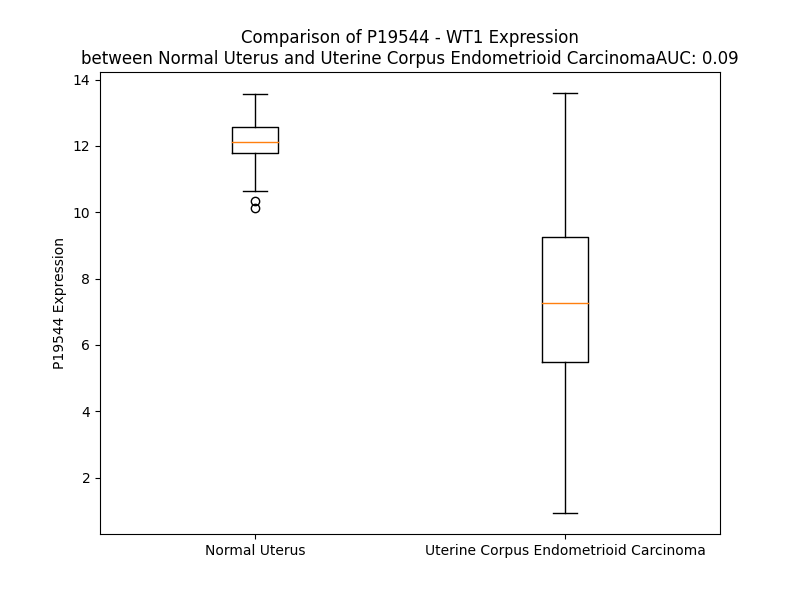

# Detailed Data for P19544

## Introduction to the Detailed Summary

### How to Interpret the Results

- **Summary & Metrics**: This section provides a quick reference to essential protein attributes, including expression changes, family classification, and biomarker applications. Regulation status (upregulated/downregulated) indicates the protein's behavior in a disease context. Some information comes from the original excel file with the proteins selected from literature, while others are derived from the analyses.
- **Expression Comparison**: A visual representation comparing protein expression between normal and disease states. It highlights significant changes in expression levels that might indicate diagnostic or therapeutic relevance. This is data coming from transcriptomics experiments and could not translate similarly to protein levels.
- **Isoform Alignment**: An interactive view of isoform alignments, revealing structural and functional differences between variants of the protein.
- **Interactors & Homologs**: Tables listing known interaction partners and homologous proteins, the more interactors and homologs, the more complex the protein is to design an antibody for.
- **Biological Assemblies**: Information about the structural arrangement of the protein in different assemblies, providing insights into its functional state but also the complexity of the protein to develop antibodies.
- **Combined Per-Residue Information**: A detailed table summarizing residue-level data. This includes predictions for epitope regions, aggregation tendencies, and modifications that might impact the protein's function. Each row corresponds to a residue in the protein, providing insights into specific sites that may be important for research or drug development.
## Summary & Metrics

- **UniProt Accession**: P19544
- **Gene Name**: WT1
- **Protein Name**: Wilms tumor 1
- **Swiss Prot**: WT1_HUMAN
- **Family**: transcription regulator
- **Biomarker Application**: diagnosis,disease progression,prognosis
- **Number of Isoforms**: 0
- **Regulation**: 2
- **(transcriptomics) AUC**: 0.09
- **(transcriptomics) Fold Change**: 1.62
- **(transcriptomics) Regulation**: Downregulated
- **Discotope Epitope Count**: 35
- **Max n_uniprots (Homo)**: 1
- **Max n_uniprots (Hetero)**: 3

## Expression Comparison

## Interactors

| preferredName_A   | preferredName_B   |   score |
|:------------------|:------------------|--------:|
| WT1               | WTAP              |   0.997 |
| WT1               | TP53              |   0.983 |
| WT1               | NR5A1             |   0.969 |
| WT1               | SRY               |   0.938 |
| WT1               | NPHS1             |   0.935 |
| WT1               | GATA4             |   0.935 |
| WT1               | NPHS2             |   0.921 |
| WT1               | SOX9              |   0.908 |
| WT1               | NR0B1             |   0.907 |
| WT1               | PAWR              |   0.906 |

## Homologs

| uniprot_id   | gene_id   |
|:-------------|:----------|
| Q05215       | EGR4      |
| Q546S1       | EGR1      |
| Q06889       | EGR3      |
| A0A8I5QL03   | EGR2      |

## Biological Assemblies

|   Unnamed: 0 |   assembly |   n_uniprots | composition   | crystal_id   |
|-------------:|-----------:|-------------:|:--------------|:-------------|
|            0 |          1 |            1 | Homo          | 6blw         |
|            0 |          1 |            1 | Homo          | 6wlh         |
|            0 |          1 |            1 | Homo          | 6b0r         |
|            1 |          2 |            1 | Homo          | 6b0r         |
|            0 |          1 |            2 | Hetero        | 4wuu         |
|            0 |          1 |            1 | Homo          | 6b0q         |
|            1 |          2 |            1 | Homo          | 6b0q         |
|            0 |          1 |            1 | Homo          | 4r2r         |
|            0 |          1 |            1 | Homo          | 5kl3         |
|            0 |          1 |            1 | Homo          | 5kl4         |
|            1 |          2 |            1 | Homo          | 5kl4         |
|            0 |          1 |            1 | Homo          | 5kl7         |
|            0 |          1 |            1 | Homo          | 2prt         |
|            0 |          1 |            2 | Hetero        | 6rsy         |
|            1 |          2 |            2 | Hetero        | 6rsy         |
|            0 |          1 |            1 | Homo          | 6b0o         |
|            1 |          2 |            1 | Homo          | 6b0o         |
|            0 |          1 |            1 | Homo          | 1xf7         |
|            0 |          1 |            3 | Hetero        | 3myj         |
|            1 |          2 |            3 | Hetero        | 3myj         |
|            0 |          1 |            1 | Homo          | 4r2e         |
|            0 |          1 |            1 | Homo          | 6b0p         |
|            1 |          2 |            1 | Homo          | 6b0p         |
|            0 |          1 |            1 | Homo          | 5kl2         |
|            0 |          1 |            1 | Homo          | 2jpa         |
|            0 |          1 |            1 | Homo          | 5kl5         |
|            0 |          1 |            1 | Homo          | 4r2s         |
|            0 |          1 |            1 | Homo          | 4r2q         |
|            0 |          1 |            3 | Hetero        | 3hpj         |
|            1 |          2 |            3 | Hetero        | 3hpj         |
|            0 |          1 |            2 | Hetero        | 7bbg         |
|            0 |          1 |            1 | Homo          | 5kl6         |
|            0 |          1 |            1 | Homo          | 4r2p         |
|            0 |          1 |            1 | Homo          | 2jp9         |
|            0 |          1 |            2 | Hetero        | 8isn         |
|            1 |          2 |            2 | Hetero        | 8isn         |

## Combined Per-Residue Information

|   res | aa   |   epitope_score | epitope   |   relative_surface_accessibility |   modeling_confidence |   Aggregation | modification   |
|------:|:-----|----------------:|:----------|---------------------------------:|----------------------:|--------------:|:---------------|
|     1 | M    |         0.09867 | False     |                          1.33867 |                 45.52 |         0     | N/A            |
|     2 | G    |         0.07631 | False     |                          0.88657 |                 34.58 |         0     | N/A            |
|     3 | S    |         0.06713 | False     |                          0.87736 |                 40.2  |         0     | N/A            |
|     4 | D    |         0.07256 | False     |                          0.85412 |                 36.36 |         0     | N/A            |
|     5 | V    |         0.0861  | False     |                          1.06308 |                 46.65 |         0     | N/A            |
|     6 | R    |         0.09933 | False     |                          0.86658 |                 41.59 |         0     | N/A            |
|     7 | D    |         0.08895 | False     |                          0.82256 |                 37.64 |         0     | N/A            |
|     8 | L    |         0.09543 | False     |                          1.10493 |                 47.31 |         0     | N/A            |
|     9 | N    |         0.08699 | False     |                          0.94637 |                 36.57 |         0     | N/A            |
|    10 | A    |         0.07864 | False     |                          0.77677 |                 41.26 |         0     | N/A            |
|    11 | L    |         0.08143 | False     |                          1.04315 |                 47.07 |         0     | N/A            |
|    12 | L    |         0.08071 | False     |                          1.07353 |                 39.72 |         0     | N/A            |
|    13 | P    |         0.09128 | False     |                          0.88091 |                 41.59 |         0     | N/A            |
|    14 | A    |         0.06161 | False     |                          0.95963 |                 43.33 |         0     | N/A            |
|    15 | V    |         0.05209 | False     |                          0.99047 |                 39.5  |         0     | N/A            |
|    16 | P    |         0.05266 | False     |                          0.93388 |                 46.44 |         0     | N/A            |
|    17 | S    |         0.06609 | False     |                          0.79042 |                 36.57 |         0     | N/A            |
|    18 | L    |         0.08479 | False     |                          1.15528 |                 42.3  |         0     | N/A            |
|    19 | G    |         0.06446 | False     |                          0.8565  |                 39.98 |         0     | N/A            |
|    20 | G    |         0.06766 | False     |                          1.05656 |                 43.39 |         0     | N/A            |
|    21 | G    |         0.0926  | False     |                          1.02393 |                 41.91 |         0     | N/A            |
|    22 | G    |         0.10081 | False     |                          0.98499 |                 45.43 |         0     | N/A            |
|    23 | G    |         0.12265 | False     |                          0.9149  |                 39.59 |         0     | N/A            |
|    24 | C    |         0.08024 | False     |                          1.02667 |                 41.38 |         0     | N/A            |
|    25 | A    |         0.07165 | False     |                          0.85994 |                 40.41 |         0     | N/A            |
|    26 | L    |         0.08102 | False     |                          1.07741 |                 42.23 |         0     | N/A            |
|    27 | P    |         0.0593  | False     |                          0.82705 |                 46.05 |         0     | N/A            |
|    28 | V    |         0.08705 | False     |                          1.07881 |                 42.63 |         0     | N/A            |
|    29 | S    |         0.09594 | False     |                          0.88302 |                 42.79 |         0     | N/A            |
|    30 | G    |         0.11241 | False     |                          0.97976 |                 43.94 |         0     | N/A            |
|    31 | A    |         0.0985  | False     |                          1.01118 |                 39.55 |         0     | N/A            |
|    32 | A    |         0.08306 | False     |                          0.90918 |                 43.49 |         0     | N/A            |
|    33 | Q    |         0.10372 | False     |                          0.90605 |                 37.56 |         0     | N/A            |
|    34 | W    |         0.11476 | False     |                          1.07827 |                 37.35 |         0     | N/A            |
|    35 | A    |         0.05885 | False     |                          0.84826 |                 42.93 |         0     | N/A            |
|    36 | P    |         0.0732  | False     |                          0.94143 |                 42.13 |         0     | N/A            |
|    37 | V    |         0.08234 | False     |                          1.04168 |                 46.08 |         0     | N/A            |
|    38 | L    |         0.08132 | False     |                          1.00316 |                 41.28 |         0     | N/A            |
|    39 | D    |         0.08219 | False     |                          0.73773 |                 35.78 |         0     | N/A            |
|    40 | F    |         0.10588 | False     |                          1.07216 |                 39.99 |         0     | N/A            |
|    41 | A    |         0.09678 | False     |                          0.75074 |                 44.06 |         0     | N/A            |
|    42 | P    |         0.08657 | False     |                          0.90574 |                 55.25 |         0     | N/A            |
|    43 | P    |         0.10416 | False     |                          0.99992 |                 44.69 |         0     | N/A            |
|    44 | G    |         0.10101 | False     |                          0.98038 |                 47.84 |         0     | N/A            |
|    45 | A    |         0.10604 | False     |                          0.99648 |                 37.6  |         0     | N/A            |
|    46 | S    |         0.11379 | False     |                          0.90276 |                 41.91 |         0     | N/A            |
|    47 | A    |         0.07539 | False     |                          0.88754 |                 39.28 |         0     | N/A            |
|    48 | Y    |         0.08801 | False     |                          1.0243  |                 49.03 |         0     | N/A            |
|    49 | G    |         0.09552 | False     |                          0.82836 |                 39.73 |         0     | N/A            |
|    50 | S    |         0.09404 | False     |                          0.92284 |                 41.6  |         0     | N/A            |
|    51 | L    |         0.12958 | False     |                          1.07408 |                 53.27 |         0     | N/A            |
|    52 | G    |         0.13186 | False     |                          0.97044 |                 43.7  |         0     | N/A            |
|    53 | G    |         0.11583 | False     |                          0.79797 |                 61.09 |         0     | N/A            |
|    54 | P    |         0.15698 | True      |                          0.99119 |                 60.15 |         0     | N/A            |
|    55 | A    |         0.09787 | False     |                          0.85438 |                 60.98 |         0     | N/A            |
|    56 | P    |         0.12211 | False     |                          0.86718 |                 70.23 |         0     | N/A            |
|    57 | P    |         0.13    | False     |                          0.87894 |                 71.56 |         0     | N/A            |
|    58 | P    |         0.15706 | True      |                          0.92842 |                 72.38 |         0     | N/A            |
|    59 | A    |         0.12408 | False     |                          0.88097 |                 74.45 |         0     | N/A            |
|    60 | P    |         0.15044 | True      |                          0.87319 |                 75.76 |         0     | N/A            |
|    61 | P    |         0.15498 | True      |                          0.8607  |                 73.44 |         0     | N/A            |
|    62 | P    |         0.12183 | False     |                          0.87383 |                 69.38 |         0     | N/A            |
|    63 | P    |         0.14782 | True      |                          0.877   |                 69.61 |         0     | N/A            |
|    64 | P    |         0.15359 | True      |                          0.85482 |                 64.63 |         0     | N/A            |
|    65 | P    |         0.13185 | False     |                          0.86241 |                 57.25 |         0     | N/A            |
|    66 | P    |         0.13547 | False     |                          0.81035 |                 55.19 |         0     | N/A            |
|    67 | P    |         0.11674 | False     |                          0.78899 |                 50.54 |         0     | N/A            |
|    68 | P    |         0.09803 | False     |                          0.93131 |                 44.11 |         0     | N/A            |
|    69 | H    |         0.08038 | False     |                          0.92184 |                 45.46 |         0     | N/A            |
|    70 | S    |         0.0818  | False     |                          0.753   |                 35.1  |         0     | N/A            |
|    71 | F    |         0.08058 | False     |                          0.97882 |                 33.96 |         0     | N/A            |
|    72 | I    |         0.09362 | False     |                          0.87734 |                 36.63 |         0     | N/A            |
|    73 | K    |         0.07492 | False     |                          0.76894 |                 38.82 |         0     | N/A            |
|    74 | Q    |         0.10032 | False     |                          0.83038 |                 34.58 |         0     | N/A            |
|    75 | E    |         0.09607 | False     |                          0.6321  |                 33.69 |         0     | N/A            |
|    76 | P    |         0.0897  | False     |                          0.78615 |                 40.9  |         0     | N/A            |
|    77 | S    |         0.0987  | False     |                          0.87596 |                 33.47 |         0     | N/A            |
|    78 | W    |         0.12435 | False     |                          1.00267 |                 36.98 |         0     | N/A            |
|    79 | G    |         0.0903  | False     |                          0.89794 |                 33.86 |         0     | N/A            |
|    80 | G    |         0.07501 | False     |                          0.9717  |                 28.24 |         0     | N/A            |
|    81 | A    |         0.08623 | False     |                          0.95377 |                 34.22 |         0     | N/A            |
|    82 | E    |         0.08534 | False     |                          0.91716 |                 32.57 |         0     | N/A            |
|    83 | P    |         0.08428 | False     |                          0.9048  |                 38.51 |         0     | N/A            |
|    84 | H    |         0.12304 | False     |                          0.96374 |                 34.11 |         0     | N/A            |
|    85 | E    |         0.09678 | False     |                          0.71274 |                 29.6  |         0     | N/A            |
|    86 | E    |         0.11016 | False     |                          0.88204 |                 34.72 |         0     | N/A            |
|    87 | Q    |         0.07786 | False     |                          0.80828 |                 32.12 |         0     | N/A            |
|    88 | C    |         0.09207 | False     |                          1.00889 |                 32.53 |         0.754 | N/A            |
|    89 | L    |         0.07532 | False     |                          1.14584 |                 28.55 |         3.843 | N/A            |
|    90 | S    |         0.08865 | False     |                          0.70278 |                 34.86 |         4.324 | N/A            |
|    91 | A    |         0.0654  | False     |                          0.94223 |                 28.54 |         4.704 | N/A            |
|    92 | F    |         0.09725 | False     |                          0.90789 |                 31.4  |         5.152 | N/A            |
|    93 | T    |         0.05833 | False     |                          0.85936 |                 30.41 |         5.152 | N/A            |
|    94 | V    |         0.06271 | False     |                          0.73209 |                 32.49 |         4.928 | N/A            |
|    95 | H    |         0.05872 | False     |                          0.91805 |                 35.31 |         1.618 | N/A            |
|    96 | F    |         0.06046 | False     |                          0.75124 |                 29.39 |         1.618 | N/A            |
|    97 | S    |         0.07828 | False     |                          0.84853 |                 37.95 |         0     | N/A            |
|    98 | G    |         0.08767 | False     |                          0.85928 |                 32.49 |         0     | N/A            |
|    99 | Q    |         0.09608 | False     |                          0.95114 |                 32.12 |         0     | N/A            |
|   100 | F    |         0.10122 | False     |                          1.0112  |                 27.73 |         0     | N/A            |
|   101 | T    |         0.09338 | False     |                          1.01045 |                 35.72 |         0     | N/A            |
|   102 | G    |         0.11555 | False     |                          0.83831 |                 28.48 |         0     | N/A            |
|   103 | T    |         0.06443 | False     |                          0.99747 |                 33.3  |         0     | N/A            |
|   104 | A    |         0.07049 | False     |                          1.08541 |                 29.58 |         0     | N/A            |
|   105 | G    |         0.06807 | False     |                          0.87594 |                 30.99 |         0     | N/A            |
|   106 | A    |         0.05274 | False     |                          0.94888 |                 33.79 |         0     | N/A            |
|   107 | C    |         0.08469 | False     |                          0.94189 |                 28.48 |         0     | N/A            |
|   108 | R    |         0.12595 | False     |                          0.93802 |                 34.95 |         0     | N/A            |
|   109 | Y    |         0.0951  | False     |                          0.9759  |                 33.68 |         0     | N/A            |
|   110 | G    |         0.08039 | False     |                          0.67852 |                 35.25 |         0     | N/A            |
|   111 | P    |         0.11543 | False     |                          1.01361 |                 45.3  |         0     | N/A            |
|   112 | F    |         0.10121 | False     |                          1.03881 |                 38.14 |         0     | N/A            |
|   113 | G    |         0.09121 | False     |                          0.76408 |                 38.48 |         0     | N/A            |
|   114 | P    |         0.12721 | False     |                          0.95107 |                 51.52 |         0     | N/A            |
|   115 | P    |         0.09558 | False     |                          0.88128 |                 47.12 |         0     | N/A            |
|   116 | P    |         0.09112 | False     |                          0.9055  |                 49.05 |         0     | N/A            |
|   117 | P    |         0.09821 | False     |                          0.98257 |                 43.86 |         0     | N/A            |
|   118 | S    |         0.07879 | False     |                          0.862   |                 39.57 |         0     | N/A            |
|   119 | Q    |         0.07878 | False     |                          0.95647 |                 35.91 |         0     | N/A            |
|   120 | A    |         0.06199 | False     |                          0.99219 |                 31.78 |         0     | N/A            |
|   121 | S    |         0.08508 | False     |                          0.81554 |                 37.9  |         0     | N/A            |
|   122 | S    |         0.14429 | True      |                          0.8864  |                 38.96 |         0     | N/A            |
|   123 | G    |         0.07314 | False     |                          0.98235 |                 36.06 |         0     | N/A            |
|   124 | Q    |         0.09273 | False     |                          0.93104 |                 36.79 |         0     | N/A            |
|   125 | A    |         0.06318 | False     |                          0.80716 |                 28.76 |         0     | N/A            |
|   126 | R    |         0.10128 | False     |                          0.85967 |                 35    |         0     | N/A            |
|   127 | M    |         0.08568 | False     |                          0.90757 |                 35.89 |         0     | N/A            |
|   128 | F    |         0.0685  | False     |                          1.01756 |                 30.36 |         0     | N/A            |
|   129 | P    |         0.12942 | False     |                          0.81901 |                 40.13 |         0     | N/A            |
|   130 | N    |         0.10041 | False     |                          0.92705 |                 34.8  |         0     | N/A            |
|   131 | A    |         0.08894 | False     |                          0.87778 |                 33.99 |         0     | N/A            |
|   132 | P    |         0.16986 | True      |                          0.77661 |                 42.81 |         0     | N/A            |
|   133 | Y    |         0.10508 | False     |                          0.95332 |                 34.89 |         0     | N/A            |
|   134 | L    |         0.07696 | False     |                          0.98307 |                 31    |         0     | N/A            |
|   135 | P    |         0.06447 | False     |                          0.91345 |                 37.77 |         0     | N/A            |
|   136 | S    |         0.05312 | False     |                          0.82842 |                 31.89 |         0     | N/A            |
|   137 | C    |         0.05009 | False     |                          0.93029 |                 27.23 |         0     | N/A            |
|   138 | L    |         0.08267 | False     |                          1.05704 |                 35.65 |         0     | N/A            |
|   139 | E    |         0.08389 | False     |                          0.74603 |                 32.36 |         0     | N/A            |
|   140 | S    |         0.06151 | False     |                          0.71887 |                 34.26 |         0     | N/A            |
|   141 | Q    |         0.11425 | False     |                          0.88575 |                 34.36 |         0     | N/A            |
|   142 | P    |         0.06534 | False     |                          0.95958 |                 36.45 |         0     | N/A            |
|   143 | A    |         0.08141 | False     |                          0.84086 |                 33.83 |         0     | N/A            |
|   144 | I    |         0.10946 | False     |                          0.90519 |                 33.83 |         0     | N/A            |
|   145 | R    |         0.08419 | False     |                          0.89857 |                 31.63 |         0     | N/A            |
|   146 | N    |         0.08021 | False     |                          0.742   |                 31.19 |         0     | N/A            |
|   147 | Q    |         0.07028 | False     |                          0.78488 |                 36.21 |         0     | N/A            |
|   148 | G    |         0.0504  | False     |                          0.71014 |                 32.56 |         0     | N/A            |
|   149 | Y    |         0.05996 | False     |                          0.88115 |                 25.6  |         0.476 | N/A            |
|   150 | S    |         0.07558 | False     |                          0.87093 |                 29.87 |         0.615 | N/A            |
|   151 | T    |         0.06533 | False     |                          0.96274 |                 24.07 |         0.615 | N/A            |
|   152 | V    |         0.06162 | False     |                          0.98636 |                 30.48 |         0.615 | N/A            |
|   153 | T    |         0.07897 | False     |                          0.88501 |                 25.95 |         0.615 | N/A            |
|   154 | F    |         0.0947  | False     |                          1.01951 |                 33.23 |         0.615 | N/A            |
|   155 | D    |         0.08452 | False     |                          0.87835 |                 28.07 |         0     | N/A            |
|   156 | G    |         0.0908  | False     |                          0.91961 |                 33.33 |         0     | N/A            |
|   157 | T    |         0.05604 | False     |                          0.96307 |                 30.1  |         0     | N/A            |
|   158 | P    |         0.04964 | False     |                          0.96355 |                 33.18 |         0     | N/A            |
|   159 | S    |         0.04574 | False     |                          0.86463 |                 32.59 |         0     | N/A            |
|   160 | Y    |         0.12232 | False     |                          1.03341 |                 31.4  |         0     | N/A            |
|   161 | G    |         0.09928 | False     |                          0.71844 |                 28.75 |         0     | N/A            |
|   162 | H    |         0.06589 | False     |                          1.0272  |                 33.43 |         0     | N/A            |
|   163 | T    |         0.05405 | False     |                          0.88161 |                 30.74 |         0     | N/A            |
|   164 | P    |         0.05775 | False     |                          0.90687 |                 35.69 |         0     | N/A            |
|   165 | S    |         0.07596 | False     |                          0.83102 |                 29.13 |         0     | N/A            |
|   166 | H    |         0.12245 | False     |                          0.98809 |                 39.1  |         0     | N/A            |
|   167 | H    |         0.07259 | False     |                          0.95223 |                 36.59 |         0     | N/A            |
|   168 | A    |         0.07034 | False     |                          0.76879 |                 32.1  |         0     | N/A            |
|   169 | A    |         0.05381 | False     |                          0.89504 |                 35.46 |         0     | N/A            |
|   170 | Q    |         0.11187 | False     |                          0.85638 |                 35.6  |         0     | N/A            |
|   171 | F    |         0.09309 | False     |                          0.92749 |                 35.28 |         0     | N/A            |
|   172 | P    |         0.0657  | False     |                          0.7619  |                 44.09 |         0     | N/A            |
|   173 | N    |         0.06262 | False     |                          0.9372  |                 31.29 |         0     | N/A            |
|   174 | H    |         0.08442 | False     |                          0.8777  |                 35.43 |         0     | N/A            |
|   175 | S    |         0.11184 | False     |                          0.76866 |                 32    |         0     | N/A            |
|   176 | F    |         0.08722 | False     |                          0.93244 |                 33.34 |         0     | N/A            |
|   177 | K    |         0.06374 | False     |                          0.83384 |                 34.47 |         0     | N/A            |
|   178 | H    |         0.10445 | False     |                          0.921   |                 36.23 |         0     | N/A            |
|   179 | E    |         0.0709  | False     |                          0.74847 |                 35.12 |         0     | N/A            |
|   180 | D    |         0.06675 | False     |                          0.88973 |                 31.9  |         0     | N/A            |
|   181 | P    |         0.09382 | False     |                          0.9326  |                 42.37 |         0     | N/A            |
|   182 | M    |         0.10911 | False     |                          1.05094 |                 36.64 |         0     | N/A            |
|   183 | G    |         0.09061 | False     |                          0.9372  |                 35.6  |         0     | N/A            |
|   184 | Q    |         0.11994 | False     |                          0.82042 |                 39.11 |         0     | N/A            |
|   185 | Q    |         0.07918 | False     |                          0.89226 |                 34.04 |         0     | N/A            |
|   186 | G    |         0.09686 | False     |                          0.97545 |                 33.54 |         0     | N/A            |
|   187 | S    |         0.06525 | False     |                          0.83282 |                 31.3  |         0     | N/A            |
|   188 | L    |         0.09077 | False     |                          1.11134 |                 35.23 |         0     | N/A            |
|   189 | G    |         0.10443 | False     |                          0.89253 |                 32.32 |         0     | N/A            |
|   190 | E    |         0.10097 | False     |                          0.86764 |                 28.73 |         0     | N/A            |
|   191 | Q    |         0.11122 | False     |                          0.9131  |                 34.49 |         0     | N/A            |
|   192 | Q    |         0.08522 | False     |                          0.79796 |                 28.08 |         0     | N/A            |
|   193 | Y    |         0.064   | False     |                          1.01476 |                 28.91 |         0     | N/A            |
|   194 | S    |         0.04748 | False     |                          0.77313 |                 29.59 |         0     | N/A            |
|   195 | V    |         0.0575  | False     |                          1.0038  |                 27.97 |         0     | N/A            |
|   196 | P    |         0.06512 | False     |                          0.77518 |                 34.39 |         0     | N/A            |
|   197 | P    |         0.05145 | False     |                          0.81869 |                 30.19 |         0     | N/A            |
|   198 | P    |         0.06243 | False     |                          0.87039 |                 29.61 |         0     | N/A            |
|   199 | V    |         0.06482 | False     |                          0.9972  |                 29.57 |         0     | N/A            |
|   200 | Y    |         0.09866 | False     |                          0.94381 |                 28.03 |         0     | N/A            |
|   201 | G    |         0.07894 | False     |                          0.7382  |                 26.88 |         0     | N/A            |
|   202 | C    |         0.05803 | False     |                          0.9029  |                 26.31 |         0     | N/A            |
|   203 | H    |         0.05574 | False     |                          1.02605 |                 28.6  |         0     | N/A            |
|   204 | T    |         0.09077 | False     |                          0.78848 |                 28.02 |         0     | N/A            |
|   205 | P    |         0.07901 | False     |                          0.81195 |                 34.97 |         0     | N/A            |
|   206 | T    |         0.06994 | False     |                          0.87012 |                 28.05 |         0     | N/A            |
|   207 | D    |         0.13502 | False     |                          0.89178 |                 27.68 |         0     | N/A            |
|   208 | S    |         0.07532 | False     |                          0.79297 |                 25.93 |         0     | N/A            |
|   209 | C    |         0.0981  | False     |                          0.97524 |                 32.91 |         0     | N/A            |
|   210 | T    |         0.15686 | True      |                          1.03449 |                 29.98 |         0     | N/A            |
|   211 | G    |         0.15762 | True      |                          0.89852 |                 29.45 |         0     | N/A            |
|   212 | S    |         0.09134 | False     |                          0.8336  |                 26.42 |         0     | N/A            |
|   213 | Q    |         0.11334 | False     |                          0.92794 |                 30.54 |         0     | N/A            |
|   214 | A    |         0.05293 | False     |                          0.90711 |                 26.05 |         0     | N/A            |
|   215 | L    |         0.12555 | False     |                          1.05052 |                 31.93 |         0     | N/A            |
|   216 | L    |         0.05104 | False     |                          1.04733 |                 25.5  |         0     | N/A            |
|   217 | L    |         0.09998 | False     |                          1.05046 |                 30.56 |         0     | N/A            |
|   218 | R    |         0.14026 | True      |                          0.85753 |                 27.77 |         0     | N/A            |
|   219 | T    |         0.06825 | False     |                          0.74964 |                 30.31 |         0     | N/A            |
|   220 | P    |         0.127   | False     |                          0.97407 |                 33.5  |         0     | N/A            |
|   221 | Y    |         0.09608 | False     |                          0.65929 |                 31.57 |         0     | N/A            |
|   222 | S    |         0.08594 | False     |                          0.67239 |                 31.12 |         0     | N/A            |
|   223 | S    |         0.12248 | False     |                          0.74754 |                 33.12 |         0     | N/A            |
|   224 | D    |         0.16863 | True      |                          0.71523 |                 35.7  |         0     | N/A            |
|   225 | N    |         0.10332 | False     |                          0.45296 |                 36    |         0     | N/A            |
|   226 | L    |         0.10962 | False     |                          0.6004  |                 35.3  |         0     | N/A            |
|   227 | Y    |         0.14963 | True      |                          0.89699 |                 35.76 |         0     | N/A            |
|   228 | Q    |         0.11106 | False     |                          0.75463 |                 38.18 |         0     | N/A            |
|   229 | M    |         0.05818 | False     |                          0.43663 |                 30.08 |         0     | N/A            |
|   230 | T    |         0.0807  | False     |                          0.64579 |                 35.67 |         0     | N/A            |
|   231 | S    |         0.07179 | False     |                          0.58518 |                 34.06 |         0     | N/A            |
|   232 | Q    |         0.10126 | False     |                          0.67104 |                 35.75 |         0     | N/A            |
|   233 | L    |         0.07779 | False     |                          0.78097 |                 36.82 |         0     | N/A            |
|   234 | E    |         0.07044 | False     |                          0.61705 |                 35.71 |         0     | N/A            |
|   235 | C    |         0.07004 | False     |                          0.6774  |                 33.56 |         0     | N/A            |
|   236 | M    |         0.09809 | False     |                          0.77786 |                 36.16 |         0     | N/A            |
|   237 | T    |         0.06419 | False     |                          0.55478 |                 41.79 |         0     | N/A            |
|   238 | W    |         0.11174 | False     |                          0.93339 |                 32.1  |         0     | N/A            |
|   239 | N    |         0.0894  | False     |                          0.89968 |                 39.32 |         0     | N/A            |
|   240 | Q    |         0.09734 | False     |                          0.79042 |                 41.36 |         0     | N/A            |
|   241 | M    |         0.11464 | False     |                          0.84851 |                 36.35 |         0     | N/A            |
|   242 | N    |         0.14137 | True      |                          0.87919 |                 37.88 |         0     | N/A            |
|   243 | L    |         0.11672 | False     |                          1.16003 |                 35.09 |         0     | N/A            |
|   244 | G    |         0.12253 | False     |                          0.97063 |                 30.66 |         0     | N/A            |
|   245 | A    |         0.08164 | False     |                          0.99143 |                 36.23 |         0     | N/A            |
|   246 | T    |         0.07978 | False     |                          0.93015 |                 31.4  |         0     | N/A            |
|   247 | L    |         0.11051 | False     |                          1.09274 |                 34.44 |         0     | N/A            |
|   248 | K    |         0.1089  | False     |                          0.98857 |                 35.61 |         0     | N/A            |
|   249 | G    |         0.14507 | True      |                          0.79955 |                 32.04 |         0     | N/A            |
|   250 | V    |         0.09469 | False     |                          1.05285 |                 33.89 |         0     | N/A            |
|   251 | A    |         0.08441 | False     |                          0.84596 |                 35.21 |         0     | N/A            |
|   252 | A    |         0.12835 | False     |                          1.04995 |                 33.8  |         0     | N/A            |
|   253 | G    |         0.08334 | False     |                          0.96936 |                 33.47 |         0     | N/A            |
|   254 | S    |         0.09065 | False     |                          0.89205 |                 34.54 |         0     | N/A            |
|   255 | S    |         0.07282 | False     |                          0.88695 |                 29.13 |         0     | N/A            |
|   256 | S    |         0.10573 | False     |                          0.80327 |                 33.16 |         0     | N/A            |
|   257 | S    |         0.08601 | False     |                          0.84029 |                 26.69 |         0     | N/A            |
|   258 | V    |         0.10226 | False     |                          1.04326 |                 33.63 |         0     | N/A            |
|   259 | K    |         0.11446 | False     |                          0.79963 |                 28.93 |         0     | N/A            |
|   260 | W    |         0.07795 | False     |                          0.95451 |                 24    |         0     | N/A            |
|   261 | T    |         0.09824 | False     |                          1.00664 |                 33.95 |         0     | N/A            |
|   262 | E    |         0.0992  | False     |                          0.92532 |                 25.92 |         0     | N/A            |
|   263 | G    |         0.12231 | False     |                          0.77684 |                 31.52 |         0     | N/A            |
|   264 | Q    |         0.13258 | False     |                          0.98567 |                 33.81 |         0     | N/A            |
|   265 | S    |         0.07742 | False     |                          0.77502 |                 33.14 |         0     | N/A            |
|   266 | N    |         0.12212 | False     |                          0.9069  |                 34.64 |         0     | N/A            |
|   267 | H    |         0.13117 | False     |                          0.94783 |                 35.34 |         0     | N/A            |
|   268 | S    |         0.16797 | True      |                          0.78859 |                 33.88 |         0     | N/A            |
|   269 | T    |         0.09946 | False     |                          1.02863 |                 35    |         0     | N/A            |
|   270 | G    |         0.15717 | True      |                          0.77461 |                 31.58 |         0     | N/A            |
|   271 | Y    |         0.06904 | False     |                          0.94247 |                 35.94 |         0     | N/A            |
|   272 | E    |         0.13774 | False     |                          0.86696 |                 35.79 |         0     | N/A            |
|   273 | S    |         0.12066 | False     |                          0.78141 |                 39.97 |         0     | N/A            |
|   274 | D    |         0.13902 | False     |                          0.68299 |                 34.27 |         0     | N/A            |
|   275 | N    |         0.12845 | False     |                          0.86203 |                 37.51 |         0     | N/A            |
|   276 | H    |         0.10723 | False     |                          0.92704 |                 34.09 |         0     | N/A            |
|   277 | T    |         0.10807 | False     |                          0.83949 |                 33.55 |         0     | N/A            |
|   278 | T    |         0.0812  | False     |                          0.80332 |                 33.47 |         0     | N/A            |
|   279 | P    |         0.0608  | False     |                          0.83317 |                 31.34 |         0     | N/A            |
|   280 | I    |         0.06646 | False     |                          1.01142 |                 27.37 |         0     | N/A            |
|   281 | L    |         0.09301 | False     |                          1.01864 |                 29.75 |         0     | N/A            |
|   282 | C    |         0.11627 | False     |                          0.96183 |                 26.74 |         0     | N/A            |
|   283 | G    |         0.14742 | True      |                          0.90384 |                 28.48 |         0     | N/A            |
|   284 | A    |         0.08981 | False     |                          0.87903 |                 32.39 |         0     | N/A            |
|   285 | Q    |         0.06035 | False     |                          0.84667 |                 32.29 |         0     | N/A            |
|   286 | Y    |         0.11253 | False     |                          0.9734  |                 27.25 |         0     | N/A            |
|   287 | R    |         0.10963 | False     |                          0.78168 |                 31.88 |         0     | N/A            |
|   288 | I    |         0.10782 | False     |                          0.92816 |                 32.11 |         0     | N/A            |
|   289 | H    |         0.13691 | False     |                          0.85055 |                 31.66 |         0     | N/A            |
|   290 | T    |         0.16655 | True      |                          0.70128 |                 32.8  |         0     | N/A            |
|   291 | H    |         0.09422 | False     |                          1.00804 |                 28.22 |         0     | N/A            |
|   292 | G    |         0.08794 | False     |                          0.85281 |                 31.74 |         0     | N/A            |
|   293 | V    |         0.04609 | False     |                          0.89525 |                 30.87 |         0     | N/A            |
|   294 | F    |         0.11396 | False     |                          1.04227 |                 32.26 |         0     | N/A            |
|   295 | R    |         0.14954 | True      |                          0.72561 |                 29.2  |         0     | N/A            |
|   296 | G    |         0.18511 | True      |                          0.77507 |                 30.59 |         0     | N/A            |
|   297 | I    |         0.0989  | False     |                          0.94001 |                 33.38 |         0     | N/A            |
|   298 | Q    |         0.07407 | False     |                          0.81401 |                 31.81 |         0     | N/A            |
|   299 | D    |         0.08109 | False     |                          0.86394 |                 24.86 |         0     | N/A            |
|   300 | V    |         0.08801 | False     |                          0.97834 |                 33.35 |         0     | N/A            |
|   301 | R    |         0.10561 | False     |                          0.85943 |                 34.22 |         0     | N/A            |
|   302 | R    |         0.18083 | True      |                          0.91861 |                 33.08 |         0     | N/A            |
|   303 | V    |         0.08676 | False     |                          0.71221 |                 31.64 |         0     | N/A            |
|   304 | P    |         0.15663 | True      |                          0.95604 |                 36.67 |         0     | N/A            |
|   305 | G    |         0.06128 | False     |                          1.03829 |                 42.83 |         0     | N/A            |
|   306 | V    |         0.07864 | False     |                          0.76535 |                 36.19 |         0     | N/A            |
|   307 | A    |         0.06314 | False     |                          0.75583 |                 41.03 |         0     | N/A            |
|   308 | P    |         0.06853 | False     |                          0.8047  |                 47.78 |         0     | N/A            |
|   309 | T    |         0.07837 | False     |                          0.91797 |                 45.11 |         0     | N/A            |
|   310 | L    |         0.07877 | False     |                          0.61703 |                 48.29 |         0     | N/A            |
|   311 | V    |         0.07661 | False     |                          0.90034 |                 44.5  |         0     | N/A            |
|   312 | R    |         0.11835 | False     |                          0.93727 |                 38.95 |         0     | N/A            |
|   313 | S    |         0.07133 | False     |                          0.45337 |                 44.3  |         0     | N/A            |
|   314 | A    |         0.08276 | False     |                          1.02725 |                 34.45 |         0     | N/A            |
|   315 | S    |         0.10722 | False     |                          0.57886 |                 44.55 |         0     | N/A            |
|   316 | E    |         0.15579 | True      |                          0.87994 |                 39.21 |         0     | N/A            |
|   317 | T    |         0.10402 | False     |                          0.9743  |                 45.62 |         0     | N/A            |
|   318 | S    |         0.06934 | False     |                          0.22687 |                 51.39 |         0     | N/A            |
|   319 | E    |         0.13552 | False     |                          0.94016 |                 54.39 |         0     | N/A            |
|   320 | K    |         0.12082 | False     |                          0.81521 |                 73.47 |         0     | N/A            |
|   321 | R    |         0.26893 | True      |                          0.47711 |                 80.8  |         0     | N/A            |
|   322 | P    |         0.08197 | False     |                          0.58064 |                 84.72 |         0     | N/A            |
|   323 | F    |         0.0735  | False     |                          0.26498 |                 87.24 |         0     | N/A            |
|   324 | M    |         0.05083 | False     |                          0.46554 |                 87.9  |         0     | N/A            |
|   325 | C    |         0.05268 | False     |                          0.06578 |                 90.69 |         0     | N/A            |
|   326 | A    |         0.02504 | False     |                          0.91891 |                 86.53 |         0     | N/A            |
|   327 | Y    |         0.0934  | False     |                          0.52634 |                 86.48 |         0     | N/A            |
|   328 | P    |         0.08701 | False     |                          0.79807 |                 85.14 |         0     | N/A            |
|   329 | G    |         0.09633 | False     |                          1.01701 |                 86.09 |         0     | N/A            |
|   330 | C    |         0.03347 | False     |                          0.13024 |                 85.77 |         0     | N/A            |
|   331 | N    |         0.07235 | False     |                          0.90904 |                 86.15 |         0     | N/A            |
|   332 | K    |         0.0738  | False     |                          0.37201 |                 88.15 |         0     | N/A            |
|   333 | R    |         0.05901 | False     |                          0.34198 |                 90.59 |         0     | N/A            |
|   334 | Y    |         0.06167 | False     |                          0.22306 |                 89.64 |         0     | N/A            |
|   335 | F    |         0.07445 | False     |                          0.6321  |                 88.92 |         0     | N/A            |
|   336 | K    |         0.07196 | False     |                          0.6128  |                 88.19 |         0     | N/A            |
|   337 | L    |         0.04043 | False     |                          0.39067 |                 88.4  |         0     | N/A            |
|   338 | S    |         0.0464  | False     |                          0.43939 |                 88.12 |         0     | N/A            |
|   339 | H    |         0.07564 | False     |                          0.4277  |                 89.38 |         0     | N/A            |
|   340 | L    |         0.02135 | False     |                          0.09563 |                 89.73 |         0     | N/A            |
|   341 | Q    |         0.04157 | False     |                          0.49888 |                 86.38 |         0     | N/A            |
|   342 | M    |         0.04527 | False     |                          0.31631 |                 87.06 |         0     | N/A            |
|   343 | H    |         0.01401 | False     |                          0.05622 |                 88.67 |         0     | N/A            |
|   344 | S    |         0.01835 | False     |                          0.24016 |                 86.21 |         0     | N/A            |
|   345 | R    |         0.04159 | False     |                          0.28967 |                 87.01 |         0     | N/A            |
|   346 | K    |         0.09123 | False     |                          0.72976 |                 86.57 |         0     | N/A            |
|   347 | H    |         0.03885 | False     |                          0.3006  |                 86.53 |         0     | N/A            |
|   348 | T    |         0.05696 | False     |                          0.64456 |                 84.53 |         0     | N/A            |
|   349 | G    |         0.05639 | False     |                          0.53019 |                 84.24 |         0     | N/A            |
|   350 | E    |         0.06107 | False     |                          0.45367 |                 83.82 |         0     | N/A            |
|   351 | K    |         0.15172 | True      |                          0.53746 |                 88.11 |         0     | N/A            |
|   352 | P    |         0.12012 | False     |                          0.46634 |                 87.47 |         0     | N/A            |
|   353 | Y    |         0.08981 | False     |                          0.34634 |                 89    |         0     | N/A            |
|   354 | Q    |         0.05053 | False     |                          0.4183  |                 89.6  |         0     | N/A            |
|   355 | C    |         0.05515 | False     |                          0.02887 |                 92.88 |         0     | N/A            |
|   356 | D    |         0.10595 | False     |                          0.76984 |                 91.15 |         0     | N/A            |
|   357 | F    |         0.06923 | False     |                          0.38642 |                 87.89 |         0     | N/A            |
|   358 | K    |         0.16162 | True      |                          0.87489 |                 86.45 |         0     | N/A            |
|   359 | D    |         0.13561 | False     |                          0.83099 |                 86.72 |         0     | N/A            |
|   360 | C    |         0.02759 | False     |                          0.08873 |                 88.42 |         0     | N/A            |
|   361 | E    |         0.10195 | False     |                          0.80973 |                 89.44 |         0     | N/A            |
|   362 | R    |         0.13629 | False     |                          0.53576 |                 89.68 |         0     | N/A            |
|   363 | R    |         0.08262 | False     |                          0.51031 |                 90.36 |         0     | N/A            |
|   364 | F    |         0.04406 | False     |                          0.19374 |                 88.67 |         0     | N/A            |
|   365 | S    |         0.02121 | False     |                          0.14431 |                 88.33 |         0     | N/A            |
|   366 | R    |         0.05764 | False     |                          0.35629 |                 87.87 |         0     | N/A            |
|   367 | S    |         0.04596 | False     |                          0.39317 |                 90.24 |         0     | N/A            |
|   368 | D    |         0.05508 | False     |                          0.42282 |                 89.39 |         0     | N/A            |
|   369 | Q    |         0.03758 | False     |                          0.26262 |                 90.91 |         0     | N/A            |
|   370 | L    |         0.02202 | False     |                          0.12283 |                 92.27 |         0     | N/A            |
|   371 | K    |         0.04365 | False     |                          0.69243 |                 90.63 |         0     | N/A            |
|   372 | R    |         0.05397 | False     |                          0.4082  |                 90.67 |         0     | N/A            |
|   373 | H    |         0.02121 | False     |                          0.05724 |                 91.61 |         0     | N/A            |
|   374 | Q    |         0.03112 | False     |                          0.22678 |                 90.93 |         0     | N/A            |
|   375 | R    |         0.0563  | False     |                          0.31068 |                 90.87 |         0     | N/A            |
|   376 | R    |         0.16051 | True      |                          0.61203 |                 89.14 |         0     | N/A            |
|   377 | H    |         0.05721 | False     |                          0.44339 |                 89.54 |         0     | N/A            |
|   378 | T    |         0.08804 | False     |                          0.54025 |                 90.16 |         0     | N/A            |
|   379 | G    |         0.09998 | False     |                          0.54139 |                 87.54 |         0     | N/A            |
|   380 | V    |         0.10731 | False     |                          0.56458 |                 90.74 |         0     | N/A            |
|   381 | K    |         0.20237 | True      |                          0.57242 |                 90.74 |         0     | N/A            |
|   382 | P    |         0.17646 | True      |                          0.5482  |                 89.87 |         0     | N/A            |
|   383 | F    |         0.10578 | False     |                          0.31677 |                 91.17 |         0     | N/A            |
|   384 | Q    |         0.04175 | False     |                          0.40834 |                 90.97 |         0     | N/A            |
|   385 | C    |         0.02643 | False     |                          0.00488 |                 92.48 |         0     | N/A            |
|   386 | K    |         0.12597 | False     |                          0.94817 |                 90.81 |         0     | N/A            |
|   387 | T    |         0.08803 | False     |                          0.70221 |                 88.67 |         0     | N/A            |
|   388 | C    |         0.06519 | False     |                          0.41864 |                 91.46 |         0     | N/A            |
|   389 | Q    |         0.12657 | False     |                          0.53451 |                 90.89 |         0     | N/A            |
|   390 | R    |         0.12959 | False     |                          0.62717 |                 90.17 |         0     | N/A            |
|   391 | K    |         0.12677 | False     |                          0.56012 |                 92.29 |         0     | N/A            |
|   392 | F    |         0.05409 | False     |                          0.15783 |                 89.1  |         0     | N/A            |
|   393 | S    |         0.03025 | False     |                          0.26952 |                 90.65 |         0     | N/A            |
|   394 | R    |         0.05755 | False     |                          0.28115 |                 90.08 |         0     | N/A            |
|   395 | S    |         0.07802 | False     |                          0.47853 |                 91.01 |         0     | N/A            |
|   396 | D    |         0.04373 | False     |                          0.40511 |                 88.48 |         0     | N/A            |
|   397 | H    |         0.06952 | False     |                          0.41704 |                 89.96 |         0     | N/A            |
|   398 | L    |         0.04225 | False     |                          0.18795 |                 91.36 |         0     | N/A            |
|   399 | K    |         0.08016 | False     |                          0.69824 |                 88.48 |         0     | N/A            |
|   400 | T    |         0.04114 | False     |                          0.36096 |                 86.23 |         0     | N/A            |
|   401 | H    |         0.03488 | False     |                          0.15559 |                 88.94 |         0     | N/A            |
|   402 | T    |         0.05859 | False     |                          0.32691 |                 86.54 |         0     | N/A            |
|   403 | R    |         0.03654 | False     |                          0.27276 |                 83.94 |         0     | N/A            |
|   404 | T    |         0.11857 | False     |                          0.70272 |                 82.26 |         0     | N/A            |
|   405 | H    |         0.06764 | False     |                          0.35397 |                 81.92 |         0     | N/A            |
|   406 | T    |         0.07342 | False     |                          0.52177 |                 71.42 |         0     | N/A            |
|   407 | G    |         0.15973 | True      |                          0.74533 |                 61.57 |         0     | N/A            |
|   408 | K    |         0.16855 | True      |                          0.68764 |                 53.68 |         0     | N/A            |
|   409 | T    |         0.14476 | True      |                          0.68748 |                 51.67 |         0     | N/A            |
|   410 | S    |         0.12651 | False     |                          0.81668 |                 54.18 |         0     | N/A            |
|   411 | E    |         0.12586 | False     |                          0.40755 |                 62.53 |         0     | N/A            |
|   412 | K    |         0.15036 | True      |                          0.36413 |                 67.46 |         0     | N/A            |
|   413 | P    |         0.13678 | False     |                          0.60681 |                 76.84 |         0     | N/A            |
|   414 | F    |         0.17714 | True      |                          0.33706 |                 78.09 |         0     | N/A            |
|   415 | S    |         0.05974 | False     |                          0.47519 |                 83.16 |         0     | N/A            |
|   416 | C    |         0.06266 | False     |                          0.09125 |                 88.75 |         0     | N/A            |
|   417 | R    |         0.1049  | False     |                          0.85351 |                 83.79 |         0     | N/A            |
|   418 | W    |         0.08254 | False     |                          0.29712 |                 82.42 |         0     | N/A            |
|   419 | P    |         0.12328 | False     |                          0.93703 |                 80.97 |         0     | N/A            |
|   420 | S    |         0.08137 | False     |                          0.75676 |                 82.21 |         0     | N/A            |
|   421 | C    |         0.04021 | False     |                          0.09425 |                 84.34 |         0     | N/A            |
|   422 | Q    |         0.1224  | False     |                          0.87223 |                 83.83 |         0     | N/A            |
|   423 | K    |         0.1182  | False     |                          0.58775 |                 85.12 |         0     | N/A            |
|   424 | K    |         0.06882 | False     |                          0.59497 |                 86.36 |         0     | N/A            |
|   425 | F    |         0.07239 | False     |                          0.18913 |                 82.73 |         0     | N/A            |
|   426 | A    |         0.0399  | False     |                          0.28808 |                 80.82 |         0     | N/A            |
|   427 | R    |         0.09109 | False     |                          0.36606 |                 80.44 |         0     | N/A            |
|   428 | S    |         0.05477 | False     |                          0.44111 |                 85.76 |         0     | N/A            |
|   429 | D    |         0.05846 | False     |                          0.3578  |                 85.68 |         0     | N/A            |
|   430 | E    |         0.0356  | False     |                          0.19659 |                 86.39 |         0     | N/A            |
|   431 | L    |         0.03074 | False     |                          0.22505 |                 89.16 |         0     | N/A            |
|   432 | V    |         0.03313 | False     |                          0.43605 |                 88.79 |         0     | N/A            |
|   433 | R    |         0.03356 | False     |                          0.57636 |                 88.51 |         0     | N/A            |
|   434 | H    |         0.02225 | False     |                          0.08804 |                 88.99 |         0     | N/A            |
|   435 | H    |         0.03726 | False     |                          0.32623 |                 87.34 |         0     | N/A            |
|   436 | N    |         0.03586 | False     |                          0.40653 |                 87.88 |         0     | N/A            |
|   437 | M    |         0.05549 | False     |                          0.43079 |                 87.16 |         0     | N/A            |
|   438 | H    |         0.05688 | False     |                          0.13328 |                 84.84 |         0     | N/A            |
|   439 | Q    |         0.05074 | False     |                          0.47498 |                 81.27 |         0     | N/A            |
|   440 | R    |         0.05454 | False     |                          0.591   |                 78.54 |         0     | N/A            |
|   441 | N    |         0.06381 | False     |                          0.40561 |                 74.15 |         0     | N/A            |
|   442 | M    |         0.07753 | False     |                          0.39197 |                 68.99 |         0     | N/A            |
|   443 | T    |         0.06251 | False     |                          0.50518 |                 71.78 |         0     | N/A            |
|   444 | K    |         0.07896 | False     |                          0.71889 |                 71.32 |         0     | N/A            |
|   445 | L    |         0.07827 | False     |                          0.64453 |                 65.4  |         0     | N/A            |
|   446 | Q    |         0.10987 | False     |                          0.61257 |                 65.3  |         0     | N/A            |
|   447 | L    |         0.08711 | False     |                          0.93784 |                 68.94 |         0     | N/A            |
|   448 | A    |         0.04995 | False     |                          0.83714 |                 67.12 |         0     | N/A            |
|   449 | L    |         0.07276 | False     |                          1.19813 |                 62.39 |         0     | N/A            |

