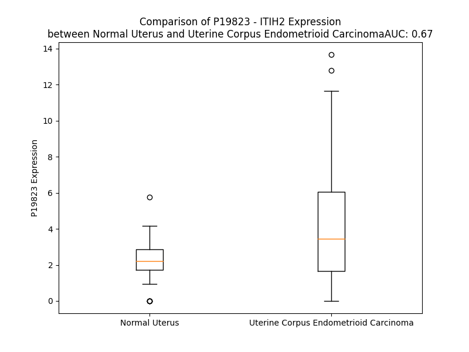

# Detailed Data for P19823

## Introduction to the Detailed Summary

### How to Interpret the Results

- **Summary & Metrics**: This section provides a quick reference to essential protein attributes, including expression changes, family classification, and biomarker applications. Regulation status (upregulated/downregulated) indicates the protein's behavior in a disease context. Some information comes from the original excel file with the proteins selected from literature, while others are derived from the analyses.
- **Expression Comparison**: A visual representation comparing protein expression between normal and disease states. It highlights significant changes in expression levels that might indicate diagnostic or therapeutic relevance. This is data coming from transcriptomics experiments and could not translate similarly to protein levels.
- **Isoform Alignment**: An interactive view of isoform alignments, revealing structural and functional differences between variants of the protein.
- **Interactors & Homologs**: Tables listing known interaction partners and homologous proteins, the more interactors and homologs, the more complex the protein is to design an antibody for.
- **Biological Assemblies**: Information about the structural arrangement of the protein in different assemblies, providing insights into its functional state but also the complexity of the protein to develop antibodies.
- **Combined Per-Residue Information**: A detailed table summarizing residue-level data. This includes predictions for epitope regions, aggregation tendencies, and modifications that might impact the protein's function. Each row corresponds to a residue in the protein, providing insights into specific sites that may be important for research or drug development.
## Summary & Metrics

- **UniProt Accession**: P19823
- **Gene Name**: ITIH2
- **Protein Name**: inter-alpha-trypsin inhibitor heavy chain 2
- **Swiss Prot**: nan
- **Family**: other
- **Biomarker Application**:  
- **Number of Isoforms**: 0
- **Regulation**: 2
- **(transcriptomics) AUC**: 0.67
- **(transcriptomics) Fold Change**: 1.77
- **(transcriptomics) Regulation**: Upregulated
- **Discotope Epitope Count**: 218
- **Max n_uniprots (Homo)**: N/A
- **Max n_uniprots (Hetero)**: N/A

## Expression Comparison

## Interactors

| preferredName_A   | preferredName_B   |   score |
|:------------------|:------------------|--------:|
| ITIH2             | AMBP              |   0.97  |
| ITIH2             | AHSG              |   0.922 |

## Homologs

| uniprot_id   | gene_id   |
|:-------------|:----------|
| H3BUS3       | VWA3A     |
| Q9UKK3       | PARP4     |
| F8W737       | VWA3B     |
| Q06033       | ITIH3     |
| B7ZKJ8       | ITIH4     |
| P19827       | ITIH1     |
| Q5TIE3       | VWA5B1    |
| A0A096LP62   | ITIH5     |
| E9PF42       | VWA5B2    |
| B4DHS6       | VWA5A     |
| Q6UXX5       | ITIH6     |

## Combined Per-Residue Information

|   res | aa   |   epitope_score | epitope   |   relative_surface_accessibility |   modeling_confidence |   Aggregation | modification                              | glycosylation                             |
|------:|:-----|----------------:|:----------|---------------------------------:|----------------------:|--------------:|:------------------------------------------|:------------------------------------------|
|     1 | M    |         0.14157 | True      |                          1.27196 |                 29.15 |         0     | N/A                                       | N/A                                       |
|     2 | K    |         0.1411  | True      |                          0.96038 |                 32.5  |         0     | N/A                                       | N/A                                       |
|     3 | R    |         0.15918 | True      |                          0.93987 |                 34.28 |         0.019 | N/A                                       | N/A                                       |
|     4 | L    |         0.17572 | True      |                          1.07904 |                 35.88 |        39.796 | N/A                                       | N/A                                       |
|     5 | T    |         0.12166 | True      |                          0.9672  |                 30.87 |        59.731 | N/A                                       | N/A                                       |
|     6 | C    |         0.08984 | False     |                          0.88559 |                 31.72 |        66.241 | N/A                                       | N/A                                       |
|     7 | F    |         0.1368  | True      |                          1.01259 |                 30.08 |        97.073 | N/A                                       | N/A                                       |
|     8 | F    |         0.21118 | True      |                          1.07631 |                 26.86 |        99.526 | N/A                                       | N/A                                       |
|     9 | I    |         0.14199 | True      |                          0.97339 |                 29.94 |        99.672 | N/A                                       | N/A                                       |
|    10 | C    |         0.1881  | True      |                          0.78073 |                 26.2  |        99.623 | N/A                                       | N/A                                       |
|    11 | F    |         0.12927 | True      |                          1.02336 |                 28.72 |        99.602 | N/A                                       | N/A                                       |
|    12 | F    |         0.18483 | True      |                          0.97914 |                 30.19 |        98.583 | N/A                                       | N/A                                       |
|    13 | L    |         0.12431 | True      |                          1.15368 |                 26.37 |        85.335 | N/A                                       | N/A                                       |
|    14 | S    |         0.11744 | True      |                          0.70612 |                 30.77 |         9.433 | N/A                                       | N/A                                       |
|    15 | E    |         0.13378 | True      |                          0.83487 |                 30.61 |         0.017 | N/A                                       | N/A                                       |
|    16 | V    |         0.0585  | False     |                          1.11557 |                 30.52 |         0.016 | N/A                                       | N/A                                       |
|    17 | S    |         0.0867  | False     |                          0.66652 |                 31.78 |         0.009 | N/A                                       | N/A                                       |
|    18 | G    |         0.09363 | False     |                          0.87826 |                 28.33 |         0.008 | N/A                                       | N/A                                       |
|    19 | F    |         0.08118 | False     |                          0.96778 |                 27.82 |         0.007 | N/A                                       | N/A                                       |
|    20 | E    |         0.08704 | False     |                          0.87231 |                 25    |         0     | N/A                                       | N/A                                       |
|    21 | I    |         0.09406 | False     |                          0.92169 |                 28.29 |         0     | N/A                                       | N/A                                       |
|    22 | P    |         0.11141 | True      |                          0.82522 |                 27.23 |         0     | N/A                                       | N/A                                       |
|    23 | I    |         0.12891 | True      |                          1.02205 |                 24    |         0     | N/A                                       | N/A                                       |
|    24 | N    |         0.19854 | True      |                          0.94835 |                 26.7  |         0     | N/A                                       | N/A                                       |
|    25 | G    |         0.19321 | True      |                          0.83035 |                 28.58 |         0     | N/A                                       | N/A                                       |
|    26 | L    |         0.17576 | True      |                          1.06903 |                 26.23 |         0     | N/A                                       | N/A                                       |
|    27 | S    |         0.12175 | True      |                          0.69027 |                 23.72 |         0     | N/A                                       | N/A                                       |
|    28 | E    |         0.08141 | False     |                          0.90743 |                 27.73 |         0     | N/A                                       | N/A                                       |
|    29 | F    |         0.11452 | True      |                          0.94364 |                 22.58 |         0     | N/A                                       | N/A                                       |
|    30 | V    |         0.12701 | True      |                          0.9365  |                 28.35 |         0     | N/A                                       | N/A                                       |
|    31 | D    |         0.15447 | True      |                          0.71832 |                 25.32 |         0     | N/A                                       | N/A                                       |
|    32 | Y    |         0.19152 | True      |                          0.9859  |                 28.01 |         0     | N/A                                       | N/A                                       |
|    33 | E    |         0.17114 | True      |                          0.79427 |                 26.21 |         0     | N/A                                       | N/A                                       |
|    34 | D    |         0.15327 | True      |                          0.75295 |                 25.62 |         0     | N/A                                       | N/A                                       |
|    35 | L    |         0.11468 | True      |                          1.08676 |                 27.8  |         0     | N/A                                       | N/A                                       |
|    36 | V    |         0.0982  | False     |                          0.93475 |                 24.53 |         0     | N/A                                       | N/A                                       |
|    37 | E    |         0.15555 | True      |                          0.81694 |                 27.55 |         0     | N/A                                       | N/A                                       |
|    38 | L    |         0.2567  | True      |                          0.98566 |                 26.9  |         0     | N/A                                       | N/A                                       |
|    39 | A    |         0.16354 | True      |                          0.89211 |                 28.59 |         0     | N/A                                       | N/A                                       |
|    40 | P    |         0.1606  | True      |                          0.95912 |                 34.22 |         0     | N/A                                       | N/A                                       |
|    41 | G    |         0.13925 | True      |                          0.79465 |                 29.03 |         0     | N/A                                       | N/A                                       |
|    42 | K    |         0.12532 | True      |                          0.96974 |                 27.67 |         0     | N/A                                       | N/A                                       |
|    43 | F    |         0.08895 | False     |                          1.053   |                 26.99 |         4.192 | N/A                                       | N/A                                       |
|    44 | Q    |         0.10341 | True      |                          0.84778 |                 25.92 |         4.192 | N/A                                       | N/A                                       |
|    45 | L    |         0.11312 | True      |                          1.07936 |                 24.14 |         4.192 | N/A                                       | N/A                                       |
|    46 | V    |         0.167   | True      |                          0.85394 |                 27.91 |         4.192 | N/A                                       | N/A                                       |
|    47 | A    |         0.13954 | True      |                          0.96943 |                 29.27 |         4.192 | N/A                                       | N/A                                       |
|    48 | E    |         0.12446 | True      |                          0.75627 |                 28.37 |         0     | N/A                                       | N/A                                       |
|    49 | N    |         0.14768 | True      |                          0.84534 |                 29.88 |         0     | N/A                                       | N/A                                       |
|    50 | R    |         0.17217 | True      |                          0.9665  |                 24.89 |         0     | N/A                                       | N/A                                       |
|    51 | R    |         0.18881 | True      |                          0.83764 |                 27.69 |         0     | N/A                                       | N/A                                       |
|    52 | Y    |         0.19046 | True      |                          0.86547 |                 31.34 |         0     | N/A                                       | N/A                                       |
|    53 | Q    |         0.11558 | True      |                          0.96382 |                 26.02 |         0     | N/A                                       | N/A                                       |
|    54 | R    |         0.17369 | True      |                          0.86799 |                 32.19 |         0     | N/A                                       | N/A                                       |
|    55 | S    |         0.14515 | True      |                          0.83668 |                 28.23 |         0     | N/A                                       | N/A                                       |
|    56 | L    |         0.15454 | True      |                          0.94786 |                 34.59 |         0     | N/A                                       | N/A                                       |
|    57 | P    |         0.14922 | True      |                          0.87567 |                 31.88 |         0     | N/A                                       | N/A                                       |
|    58 | G    |         0.12928 | True      |                          0.96694 |                 30.77 |         0     | N/A                                       | N/A                                       |
|    59 | E    |         0.09209 | False     |                          0.79891 |                 35.96 |         0     | N/A                                       | N/A                                       |
|    60 | S    |         0.13055 | True      |                          0.83778 |                 34.09 |         0     | Phosphoserine; by FAM20C                  | N/A                                       |
|    61 | E    |         0.1217  | True      |                          0.74938 |                 35.07 |         0     | N/A                                       | N/A                                       |
|    62 | E    |         0.14179 | True      |                          0.80658 |                 37.73 |         0     | N/A                                       | N/A                                       |
|    63 | M    |         0.14388 | True      |                          0.9396  |                 37.32 |         0     | N/A                                       | N/A                                       |
|    64 | M    |         0.14846 | True      |                          0.94311 |                 36.7  |         0     | N/A                                       | N/A                                       |
|    65 | E    |         0.12356 | True      |                          0.8043  |                 47.41 |         0     | N/A                                       | N/A                                       |
|    66 | E    |         0.12498 | True      |                          0.65944 |                 54.21 |         0     | N/A                                       | N/A                                       |
|    67 | V    |         0.104   | True      |                          0.79308 |                 64.36 |         0     | N/A                                       | N/A                                       |
|    68 | D    |         0.0843  | False     |                          0.33899 |                 74.7  |         0     | N/A                                       | N/A                                       |
|    69 | Q    |         0.13464 | True      |                          0.57542 |                 86.73 |         0.314 | N/A                                       | N/A                                       |
|    70 | V    |         0.0364  | False     |                          0.10413 |                 89.92 |        10.672 | N/A                                       | N/A                                       |
|    71 | T    |         0.02876 | False     |                          0.13684 |                 93.81 |        10.672 | N/A                                       | N/A                                       |
|    72 | L    |         0.02068 | False     |                          0.02992 |                 95.13 |        10.672 | N/A                                       | N/A                                       |
|    73 | Y    |         0.18806 | True      |                          0.60995 |                 95.72 |        10.672 | N/A                                       | N/A                                       |
|    74 | S    |         0.07491 | False     |                          0.08305 |                 98.14 |        10.672 | N/A                                       | N/A                                       |
|    75 | Y    |         0.00847 | False     |                          0.02698 |                 98.33 |         8.343 | N/A                                       | N/A                                       |
|    76 | K    |         0.06501 | False     |                          0.25121 |                 98.58 |         0     | N/A                                       | N/A                                       |
|    77 | V    |         0.00141 | False     |                          0       |                 98.72 |         0     | N/A                                       | N/A                                       |
|    78 | Q    |         0.05865 | False     |                          0.31353 |                 98.45 |         0     | N/A                                       | N/A                                       |
|    79 | S    |         0.00286 | False     |                          0.00104 |                 98.47 |         0     | N/A                                       | N/A                                       |
|    80 | T    |         0.02491 | False     |                          0.16138 |                 98.15 |         0     | N/A                                       | N/A                                       |
|    81 | I    |         0.00115 | False     |                          0       |                 98.24 |         0     | N/A                                       | N/A                                       |
|    82 | T    |         0.00411 | False     |                          0.00154 |                 96.37 |         0     | N/A                                       | N/A                                       |
|    83 | S    |         0.00167 | False     |                          0       |                 94.62 |         0     | N/A                                       | N/A                                       |
|    84 | R    |         0.00168 | False     |                          0.0021  |                 94.68 |         0     | N/A                                       | N/A                                       |
|    85 | M    |         0.00788 | False     |                          0.00763 |                 95.18 |         0     | N/A                                       | N/A                                       |
|    86 | A    |         0.00146 | False     |                          0.00921 |                 96.35 |         0     | N/A                                       | N/A                                       |
|    87 | T    |         0.01102 | False     |                          0.25942 |                 96.14 |         0     | N/A                                       | N/A                                       |
|    88 | T    |         0.00377 | False     |                          0.00362 |                 97.6  |         0     | N/A                                       | N/A                                       |
|    89 | M    |         0.02948 | False     |                          0.13561 |                 97.55 |         0     | N/A                                       | N/A                                       |
|    90 | I    |         0.0019  | False     |                          0.0024  |                 98.16 |         0     | N/A                                       | N/A                                       |
|    91 | Q    |         0.0328  | False     |                          0.12484 |                 98.03 |         0     | N/A                                       | N/A                                       |
|    92 | S    |         0.01398 | False     |                          0.05476 |                 97.52 |         0     | N/A                                       | N/A                                       |
|    93 | K    |         0.0515  | False     |                          0.37493 |                 97.05 |         0     | N/A                                       | N/A                                       |
|    94 | V    |         0.02621 | False     |                          0.07201 |                 95.29 |         0     | N/A                                       | N/A                                       |
|    95 | V    |         0.03903 | False     |                          0.23516 |                 94.26 |         0     | N/A                                       | N/A                                       |
|    96 | N    |         0.01516 | False     |                          0.00148 |                 94.24 |         0     | N/A                                       | N/A                                       |
|    97 | N    |         0.11442 | True      |                          0.42194 |                 93.34 |         0     | N/A                                       | N/A                                       |
|    98 | S    |         0.05234 | False     |                          0.05089 |                 90.96 |         0     | N/A                                       | N/A                                       |
|    99 | P    |         0.13508 | True      |                          0.90447 |                 91.14 |         0     | N/A                                       | N/A                                       |
|   100 | Q    |         0.11473 | True      |                          0.60975 |                 92.47 |         0     | N/A                                       | N/A                                       |
|   101 | P    |         0.10463 | True      |                          0.50552 |                 89.61 |         0     | N/A                                       | N/A                                       |
|   102 | Q    |         0.08187 | False     |                          0.21411 |                 89.71 |         0     | N/A                                       | N/A                                       |
|   103 | N    |         0.05431 | False     |                          0.542   |                 86.82 |         0     | N/A                                       | N/A                                       |
|   104 | V    |         0.0168  | False     |                          0.03713 |                 87.76 |         0     | N/A                                       | N/A                                       |
|   105 | V    |         0.07269 | False     |                          0.44814 |                 87.35 |         0     | N/A                                       | N/A                                       |
|   106 | F    |         0.02645 | False     |                          0.03543 |                 89.68 |         0     | N/A                                       | N/A                                       |
|   107 | D    |         0.08522 | False     |                          0.28938 |                 89.61 |         0     | N/A                                       | N/A                                       |
|   108 | V    |         0.01341 | False     |                          0.01999 |                 90.88 |         0     | N/A                                       | N/A                                       |
|   109 | Q    |         0.05334 | False     |                          0.16349 |                 90.66 |         0     | N/A                                       | N/A                                       |
|   110 | I    |         0.00546 | False     |                          0.0016  |                 89.62 |         0     | N/A                                       | N/A                                       |
|   111 | P    |         0.01553 | False     |                          0.10114 |                 87.88 |         0     | N/A                                       | N/A                                       |
|   112 | K    |         0.03669 | False     |                          0.19535 |                 76.09 |         0     | N/A                                       | N/A                                       |
|   113 | G    |         0.01974 | False     |                          0.13991 |                 73.62 |         0     | N/A                                       | N/A                                       |
|   114 | A    |         0.01155 | False     |                          0.07542 |                 86.54 |         1.246 | N/A                                       | N/A                                       |
|   115 | F    |         0.02356 | False     |                          0.04926 |                 83.52 |         1.909 | N/A                                       | N/A                                       |
|   116 | I    |         0.00612 | False     |                          0       |                 86.35 |         1.909 | N/A                                       | N/A                                       |
|   117 | S    |         0.06783 | False     |                          0.2213  |                 85.93 |         1.909 | N/A                                       | N/A                                       |
|   118 | N    |         0.05418 | False     |                          0.41449 |                 90.67 |         1.909 | N/A                                       | N-linked (GlcNAc...) (complex) asparagine |
|   119 | F    |         0.00173 | False     |                          0.00064 |                 92.3  |         2.179 | N/A                                       | N/A                                       |
|   120 | S    |         0.06831 | False     |                          0.1915  |                 93.04 |         1.538 | N/A                                       | N/A                                       |
|   121 | M    |         0.01858 | False     |                          0.01294 |                 90.76 |         1.538 | N/A                                       | N/A                                       |
|   122 | T    |         0.04282 | False     |                          0.29997 |                 92.1  |         1.538 | N/A                                       | N/A                                       |
|   123 | V    |         0.02415 | False     |                          0.16533 |                 87.51 |         1.538 | N/A                                       | N/A                                       |
|   124 | D    |         0.08843 | False     |                          0.55641 |                 84.6  |         0     | N/A                                       | N/A                                       |
|   125 | G    |         0.11408 | True      |                          0.81957 |                 83.83 |         0     | N/A                                       | N/A                                       |
|   126 | K    |         0.07313 | False     |                          0.59765 |                 86.53 |         0     | N/A                                       | N/A                                       |
|   127 | T    |         0.05311 | False     |                          0.22885 |                 90.49 |         0     | N/A                                       | N/A                                       |
|   128 | F    |         0.02875 | False     |                          0.04268 |                 88.52 |         0     | N/A                                       | N/A                                       |
|   129 | R    |         0.12283 | True      |                          0.61421 |                 91.45 |         0     | N/A                                       | N/A                                       |
|   130 | S    |         0.02403 | False     |                          0.15653 |                 89.78 |         0     | N/A                                       | N/A                                       |
|   131 | S    |         0.04898 | False     |                          0.26598 |                 90.99 |         0     | N/A                                       | N/A                                       |
|   132 | I    |         0.03961 | False     |                          0.09412 |                 88.83 |         0     | N/A                                       | N/A                                       |
|   133 | K    |         0.11383 | True      |                          0.3611  |                 90.97 |         0     | N/A                                       | N/A                                       |
|   134 | E    |         0.11054 | True      |                          0.32342 |                 92.62 |         0     | N/A                                       | N/A                                       |
|   135 | K    |         0.06578 | False     |                          0.25938 |                 87.07 |         0     | N/A                                       | N/A                                       |
|   136 | T    |         0.09462 | False     |                          0.63791 |                 89.58 |         0     | N/A                                       | N/A                                       |
|   137 | V    |         0.14955 | True      |                          0.48828 |                 90.57 |         0     | N/A                                       | N/A                                       |
|   138 | G    |         0.00457 | False     |                          0       |                 85.23 |         0     | N/A                                       | N/A                                       |
|   139 | R    |         0.14186 | True      |                          0.49974 |                 84.5  |         0     | N/A                                       | N/A                                       |
|   140 | A    |         0.18367 | True      |                          0.58454 |                 87.05 |         0     | N/A                                       | N/A                                       |
|   141 | L    |         0.0909  | False     |                          0.25378 |                 81.72 |         0     | N/A                                       | N/A                                       |
|   142 | Y    |         0.06497 | False     |                          0.21396 |                 79.01 |         0     | N/A                                       | N/A                                       |
|   143 | A    |         0.1252  | True      |                          0.41195 |                 81.35 |         0     | N/A                                       | N/A                                       |
|   144 | Q    |         0.17862 | True      |                          0.46646 |                 79.22 |         0     | N/A                                       | N/A                                       |
|   145 | A    |         0.03108 | False     |                          0.02788 |                 73.95 |         0     | N/A                                       | N/A                                       |
|   146 | R    |         0.17412 | True      |                          0.59534 |                 73.66 |         0     | N/A                                       | N/A                                       |
|   147 | A    |         0.23944 | True      |                          0.88181 |                 74.13 |         0     | N/A                                       | N/A                                       |
|   148 | K    |         0.27042 | True      |                          0.61277 |                 71.03 |         0     | N/A                                       | N/A                                       |
|   149 | G    |         0.25314 | True      |                          0.82938 |                 61.94 |         0     | N/A                                       | N/A                                       |
|   150 | K    |         0.09977 | False     |                          0.39131 |                 62.11 |         0     | N/A                                       | N/A                                       |
|   151 | T    |         0.17041 | True      |                          0.39335 |                 56.52 |         0     | N/A                                       | N/A                                       |
|   152 | A    |         0.02008 | False     |                          0.17841 |                 58.26 |         0     | N/A                                       | N/A                                       |
|   153 | G    |         0.06513 | False     |                          0.54953 |                 59.3  |         0     | N/A                                       | N/A                                       |
|   154 | L    |         0.03589 | False     |                          0.09167 |                 58.97 |         0     | N/A                                       | N/A                                       |
|   155 | V    |         0.11012 | True      |                          0.61048 |                 57.74 |         0     | N/A                                       | N/A                                       |
|   156 | R    |         0.10108 | False     |                          0.0855  |                 63.61 |         0     | N/A                                       | N/A                                       |
|   157 | S    |         0.12143 | True      |                          0.37422 |                 59.66 |         0     | N/A                                       | N/A                                       |
|   158 | S    |         0.08046 | False     |                          0.33713 |                 54.69 |         0     | N/A                                       | N/A                                       |
|   159 | A    |         0.17048 | True      |                          0.30405 |                 55.05 |         0     | N/A                                       | N/A                                       |
|   160 | L    |         0.26281 | True      |                          0.56496 |                 63.36 |         0     | N/A                                       | N/A                                       |
|   161 | D    |         0.09979 | False     |                          0.50117 |                 65.86 |         0     | N/A                                       | N/A                                       |
|   162 | M    |         0.06902 | False     |                          0.05371 |                 74.2  |         0     | N/A                                       | N/A                                       |
|   163 | E    |         0.0385  | False     |                          0.10996 |                 77.18 |         0     | N/A                                       | N/A                                       |
|   164 | N    |         0.06414 | False     |                          0.19933 |                 83.83 |         0     | N/A                                       | N/A                                       |
|   165 | F    |         0.00524 | False     |                          0.00412 |                 85.97 |         0     | N/A                                       | N/A                                       |
|   166 | R    |         0.13676 | True      |                          0.43127 |                 87.11 |         0     | N/A                                       | N/A                                       |
|   167 | T    |         0.0052  | False     |                          0.0043  |                 83.28 |         0     | N/A                                       | N/A                                       |
|   168 | E    |         0.08427 | False     |                          0.32644 |                 84.21 |         0     | N/A                                       | N/A                                       |
|   169 | V    |         0.02997 | False     |                          0.07236 |                 84.09 |         0     | N/A                                       | N/A                                       |
|   170 | N    |         0.10012 | False     |                          0.60406 |                 85.06 |         0     | N/A                                       | N/A                                       |
|   171 | V    |         0.00752 | False     |                          0.00666 |                 86.14 |         0     | N/A                                       | N/A                                       |
|   172 | L    |         0.06565 | False     |                          0.64879 |                 90.45 |         0     | N/A                                       | N/A                                       |
|   173 | P    |         0.04992 | False     |                          0.44115 |                 92.22 |         0     | N/A                                       | N/A                                       |
|   174 | G    |         0.06739 | False     |                          0.62289 |                 90.81 |         0     | N/A                                       | N/A                                       |
|   175 | A    |         0.0297  | False     |                          0.06545 |                 92.01 |         0     | N/A                                       | N/A                                       |
|   176 | K    |         0.10094 | False     |                          0.70185 |                 93.52 |         0     | N/A                                       | N/A                                       |
|   177 | V    |         0.01749 | False     |                          0.02384 |                 93.34 |         0     | N/A                                       | N/A                                       |
|   178 | Q    |         0.04265 | False     |                          0.2816  |                 95.71 |         0     | N/A                                       | N/A                                       |
|   179 | F    |         0.00148 | False     |                          0.00318 |                 94.91 |         0     | N/A                                       | N/A                                       |
|   180 | E    |         0.02983 | False     |                          0.18359 |                 96.14 |         0     | N/A                                       | N/A                                       |
|   181 | L    |         0.00162 | False     |                          0       |                 94.67 |         0     | N/A                                       | N/A                                       |
|   182 | H    |         0.03492 | False     |                          0.25889 |                 94.52 |         0     | N/A                                       | N/A                                       |
|   183 | Y    |         0.01024 | False     |                          0.01141 |                 93.63 |         0     | N/A                                       | N/A                                       |
|   184 | Q    |         0.0361  | False     |                          0.06287 |                 93.26 |         0     | N/A                                       | N/A                                       |
|   185 | E    |         0.01997 | False     |                          0.11506 |                 92.11 |         0     | N/A                                       | N/A                                       |
|   186 | V    |         0.00585 | False     |                          0.01718 |                 92.92 |         0     | N/A                                       | N/A                                       |
|   187 | K    |         0.01163 | False     |                          0.03409 |                 93.82 |         0     | N/A                                       | N/A                                       |
|   188 | W    |         0.02718 | False     |                          0.18279 |                 90.6  |         0     | N/A                                       | N/A                                       |
|   189 | R    |         0.02107 | False     |                          0.04197 |                 93.24 |         0     | N/A                                       | N/A                                       |
|   190 | K    |         0.05019 | False     |                          0.36572 |                 89.67 |         0     | N/A                                       | N/A                                       |
|   191 | L    |         0.13807 | True      |                          0.53966 |                 91.02 |         0     | N/A                                       | N/A                                       |
|   192 | G    |         0.05059 | False     |                          0.23091 |                 92.64 |         0     | N/A                                       | N/A                                       |
|   193 | S    |         0.04855 | False     |                          0.13339 |                 95.84 |         0     | N/A                                       | N/A                                       |
|   194 | Y    |         0.00205 | False     |                          0       |                 96.55 |         0     | N/A                                       | N/A                                       |
|   195 | E    |         0.09857 | False     |                          0.39824 |                 95.31 |         0     | N/A                                       | N/A                                       |
|   196 | H    |         0.00334 | False     |                          0.00409 |                 96.69 |         0     | N/A                                       | N/A                                       |
|   197 | R    |         0.06731 | False     |                          0.32551 |                 94.73 |         0     | N/A                                       | N/A                                       |
|   198 | I    |         0.00396 | False     |                          0.0032  |                 95.94 |         0     | N/A                                       | N/A                                       |
|   199 | Y    |         0.10681 | True      |                          0.19638 |                 94.38 |         0     | N/A                                       | N/A                                       |
|   200 | L    |         0.00249 | False     |                          0       |                 95.89 |         0     | N/A                                       | N/A                                       |
|   201 | Q    |         0.08125 | False     |                          0.32915 |                 92.42 |         0     | N/A                                       | N/A                                       |
|   202 | P    |         0.02106 | False     |                          0.10678 |                 94.23 |         0     | N/A                                       | N/A                                       |
|   203 | G    |         0.10032 | False     |                          0.71025 |                 89.52 |         0     | N/A                                       | N/A                                       |
|   204 | R    |         0.12818 | True      |                          0.39786 |                 91.7  |         0     | N/A                                       | N/A                                       |
|   205 | L    |         0.04912 | False     |                          0.14567 |                 94.61 |         0     | N/A                                       | N/A                                       |
|   206 | A    |         0.00299 | False     |                          0       |                 95.8  |         0     | N/A                                       | N/A                                       |
|   207 | K    |         0.09318 | False     |                          0.60573 |                 95.83 |         0     | N/A                                       | N/A                                       |
|   208 | H    |         0.10259 | True      |                          0.45954 |                 97.96 |         0     | N/A                                       | N/A                                       |
|   209 | L    |         0.01545 | False     |                          0.02872 |                 98.54 |         0     | N/A                                       | N/A                                       |
|   210 | E    |         0.02165 | False     |                          0.12079 |                 98.42 |         0     | N/A                                       | N/A                                       |
|   211 | V    |         0.00223 | False     |                          0       |                 98.75 |         0     | N/A                                       | N/A                                       |
|   212 | D    |         0.05266 | False     |                          0.04922 |                 98.67 |         0     | N/A                                       | N/A                                       |
|   213 | V    |         0.00169 | False     |                          0       |                 98.76 |         0     | N/A                                       | N/A                                       |
|   214 | W    |         0.07733 | False     |                          0.2771  |                 98.58 |         0     | N/A                                       | N/A                                       |
|   215 | V    |         0.00139 | False     |                          0       |                 98.46 |         0     | N/A                                       | N/A                                       |
|   216 | I    |         0.01907 | False     |                          0.0096  |                 96.82 |         0     | N/A                                       | N/A                                       |
|   217 | E    |         0.00272 | False     |                          0       |                 95.36 |         0     | N/A                                       | N/A                                       |
|   218 | P    |         0.04277 | False     |                          0.18344 |                 90.22 |         0     | N/A                                       | N/A                                       |
|   219 | Q    |         0.03722 | False     |                          0.22529 |                 88.33 |         0     | N/A                                       | N/A                                       |
|   220 | G    |         0.02416 | False     |                          0.02092 |                 93.16 |         0     | N/A                                       | N/A                                       |
|   221 | L    |         0.01946 | False     |                          0.02742 |                 96.48 |         0     | N/A                                       | N/A                                       |
|   222 | R    |         0.11293 | True      |                          0.58704 |                 95.16 |         0     | N/A                                       | N/A                                       |
|   223 | F    |         0.21888 | True      |                          0.32919 |                 97.03 |         0     | N/A                                       | N/A                                       |
|   224 | L    |         0.05396 | False     |                          0.09789 |                 98.07 |         0     | N/A                                       | N/A                                       |
|   225 | H    |         0.18094 | True      |                          0.42854 |                 96.51 |         0     | N/A                                       | N/A                                       |
|   226 | V    |         0.07256 | False     |                          0.19838 |                 97.14 |         0     | N/A                                       | N/A                                       |
|   227 | P    |         0.15574 | True      |                          0.35026 |                 95.4  |         0     | N/A                                       | N/A                                       |
|   228 | D    |         0.11935 | True      |                          0.53738 |                 92.25 |         0     | N/A                                       | N/A                                       |
|   229 | T    |         0.10236 | True      |                          0.4009  |                 90.51 |         0     | N/A                                       | N/A                                       |
|   230 | F    |         0.08407 | False     |                          0.11968 |                 90.27 |         0     | N/A                                       | N/A                                       |
|   231 | E    |         0.40099 | True      |                          0.90902 |                 88.49 |         0     | N/A                                       | N/A                                       |
|   232 | G    |         0.15035 | True      |                          0.35126 |                 89.13 |         0     | N/A                                       | N/A                                       |
|   233 | H    |         0.17332 | True      |                          0.43355 |                 92.59 |         0     | N/A                                       | N/A                                       |
|   234 | F    |         0.06282 | False     |                          0.02937 |                 94.72 |         0     | N/A                                       | N/A                                       |
|   235 | D    |         0.26395 | True      |                          0.67296 |                 90.81 |         0     | N/A                                       | N/A                                       |
|   236 | G    |         0.18221 | True      |                          0.89069 |                 90.91 |         0     | N/A                                       | N/A                                       |
|   237 | V    |         0.06571 | False     |                          0.1104  |                 95.96 |         0     | N/A                                       | N/A                                       |
|   238 | P    |         0.06481 | False     |                          0.29594 |                 96.64 |         0     | N/A                                       | N/A                                       |
|   239 | V    |         0.12259 | True      |                          0.66256 |                 97.49 |         0     | N/A                                       | N/A                                       |
|   240 | I    |         0.16428 | True      |                          0.42887 |                 97.63 |         0     | N/A                                       | N/A                                       |
|   241 | S    |         0.12112 | True      |                          0.54354 |                 97.09 |         0     | N/A                                       | N/A                                       |
|   242 | K    |         0.15649 | True      |                          0.49611 |                 92.55 |         0     | N/A                                       | N/A                                       |
|   243 | G    |         0.11201 | True      |                          0.48673 |                 93.2  |         0     | N/A                                       | N/A                                       |
|   244 | Q    |         0.19086 | True      |                          0.7146  |                 92.81 |         0     | N/A                                       | N/A                                       |
|   245 | Q    |         0.07452 | False     |                          0.34875 |                 93.97 |         0     | N/A                                       | N/A                                       |
|   246 | K    |         0.06124 | False     |                          0.33997 |                 95.08 |         0     | N/A                                       | N/A                                       |
|   247 | A    |         0.01056 | False     |                          0.03223 |                 97.95 |         0     | N/A                                       | N/A                                       |
|   248 | H    |         0.07555 | False     |                          0.18284 |                 98.41 |         0     | N/A                                       | N/A                                       |
|   249 | V    |         0.00288 | False     |                          0       |                 98.56 |         0     | N/A                                       | N/A                                       |
|   250 | S    |         0.05856 | False     |                          0.11073 |                 98.56 |         0     | N/A                                       | N/A                                       |
|   251 | F    |         0.0078  | False     |                          0.00191 |                 98.49 |         0     | N/A                                       | N/A                                       |
|   252 | K    |         0.13712 | True      |                          0.45996 |                 98.04 |         0     | N/A                                       | N/A                                       |
|   253 | P    |         0.02159 | False     |                          0.02866 |                 97.92 |         0     | N/A                                       | N/A                                       |
|   254 | T    |         0.0851  | False     |                          0.56398 |                 96.42 |         0     | N/A                                       | N/A                                       |
|   255 | V    |         0.0592  | False     |                          0.31532 |                 94.9  |         0     | N/A                                       | N/A                                       |
|   256 | A    |         0.13053 | True      |                          0.73004 |                 93.41 |         0     | N/A                                       | N/A                                       |
|   257 | Q    |         0.12844 | True      |                          0.38584 |                 95.11 |         0     | N/A                                       | N/A                                       |
|   258 | Q    |         0.00463 | False     |                          0.00235 |                 96.1  |         0     | N/A                                       | N/A                                       |
|   259 | R    |         0.27186 | True      |                          0.29696 |                 94.07 |         0     | N/A                                       | N/A                                       |
|   260 | I    |         0.20899 | True      |                          0.58304 |                 89.01 |         0     | N/A                                       | N/A                                       |
|   261 | C    |         0.26334 | True      |                          0.36494 |                 87.1  |         0     | N/A                                       | N/A                                       |
|   262 | P    |         0.19176 | True      |                          0.89722 |                 82.51 |         0     | N/A                                       | N/A                                       |
|   263 | N    |         0.26885 | True      |                          0.84711 |                 82.06 |         0     | N/A                                       | N/A                                       |
|   264 | C    |         0.14933 | True      |                          0.2642  |                 83.52 |         0     | N/A                                       | N/A                                       |
|   265 | R    |         0.25761 | True      |                          0.51948 |                 80.46 |         0     | N/A                                       | N/A                                       |
|   266 | E    |         0.20262 | True      |                          0.60993 |                 85.93 |         0     | N/A                                       | N/A                                       |
|   267 | T    |         0.05653 | False     |                          0.1017  |                 92.38 |         0     | N/A                                       | N/A                                       |
|   268 | A    |         0.09303 | False     |                          0.1891  |                 93.27 |         0     | N/A                                       | N/A                                       |
|   269 | V    |         0.0051  | False     |                          0.0007  |                 94.67 |         0     | N/A                                       | N/A                                       |
|   270 | D    |         0.12309 | True      |                          0.50458 |                 92.58 |         0     | N/A                                       | N/A                                       |
|   271 | G    |         0.04136 | False     |                          0.15612 |                 92.05 |         0     | N/A                                       | N/A                                       |
|   272 | E    |         0.08794 | False     |                          0.18616 |                 93.08 |         0     | N/A                                       | N/A                                       |
|   273 | L    |         0.00999 | False     |                          0.01688 |                 96.86 |        56.658 | N/A                                       | N/A                                       |
|   274 | V    |         0.02404 | False     |                          0.03604 |                 96.83 |        57.958 | N/A                                       | N/A                                       |
|   275 | V    |         0.00297 | False     |                          0.00095 |                 98.16 |        58.26  | N/A                                       | N/A                                       |
|   276 | L    |         0.0489  | False     |                          0.21021 |                 98.12 |        58.26  | N/A                                       | N/A                                       |
|   277 | Y    |         0.00252 | False     |                          0       |                 98.14 |        58.26  | N/A                                       | N/A                                       |
|   278 | D    |         0.01264 | False     |                          0.00315 |                 97.27 |         8.695 | N/A                                       | N/A                                       |
|   279 | V    |         0.00546 | False     |                          0.00704 |                 95.79 |         8.695 | N/A                                       | N/A                                       |
|   280 | K    |         0.081   | False     |                          0.51022 |                 93.1  |         8.695 | N/A                                       | N/A                                       |
|   281 | R    |         0.0486  | False     |                          0.19666 |                 86.61 |         0     | N/A                                       | N/A                                       |
|   282 | E    |         0.05281 | False     |                          0.49039 |                 74.43 |         0     | 4-carboxyglutamate                        | N/A                                       |
|   283 | E    |         0.03588 | False     |                          0.44254 |                 68.91 |         0     | 4-carboxyglutamate                        | N/A                                       |
|   284 | K    |         0.01557 | False     |                          0.02434 |                 77.09 |         0     | N/A                                       | N/A                                       |
|   285 | A    |         0.00733 | False     |                          0.08895 |                 86.11 |         0     | N/A                                       | N/A                                       |
|   286 | G    |         0.01166 | False     |                          0.04419 |                 88.99 |         0     | N/A                                       | N/A                                       |
|   287 | E    |         0.01563 | False     |                          0.08948 |                 89.7  |         0     | N/A                                       | N/A                                       |
|   288 | L    |         0.01632 | False     |                          0.10504 |                 91.23 |         0     | N/A                                       | N/A                                       |
|   289 | E    |         0.01642 | False     |                          0.07651 |                 91.23 |         0     | N/A                                       | N/A                                       |
|   290 | V    |         0.0305  | False     |                          0.01511 |                 87.94 |         9.831 | N/A                                       | N/A                                       |
|   291 | F    |         0.03207 | False     |                          0.06497 |                 86.31 |        10.603 | N/A                                       | N/A                                       |
|   292 | N    |         0.10995 | True      |                          0.5085  |                 82.9  |        10.732 | N/A                                       | N/A                                       |
|   293 | G    |         0.01919 | False     |                          0.1247  |                 89.93 |        14.315 | N/A                                       | N/A                                       |
|   294 | Y    |         0.03417 | False     |                          0.15921 |                 93.82 |        54.333 | N/A                                       | N/A                                       |
|   295 | F    |         0.0028  | False     |                          0       |                 93.82 |        58.281 | N/A                                       | N/A                                       |
|   296 | V    |         0.00065 | False     |                          0       |                 94.71 |        58.088 | N/A                                       | N/A                                       |
|   297 | H    |         0.00653 | False     |                          0       |                 94.95 |        55.62  | N/A                                       | N/A                                       |
|   298 | F    |         0.00388 | False     |                          0.0227  |                 94.94 |        55.62  | N/A                                       | N/A                                       |
|   299 | F    |         0.00251 | False     |                          0       |                 94.53 |        51.787 | N/A                                       | N/A                                       |
|   300 | A    |         0.01208 | False     |                          0.044   |                 93.5  |         0.176 | N/A                                       | N/A                                       |
|   301 | P    |         0.01357 | False     |                          0.02784 |                 90.59 |         0.097 | N/A                                       | N/A                                       |
|   302 | D    |         0.04225 | False     |                          0.24852 |                 84.18 |         0     | N/A                                       | N/A                                       |
|   303 | N    |         0.08424 | False     |                          0.64115 |                 80.87 |         0     | N/A                                       | N/A                                       |
|   304 | L    |         0.021   | False     |                          0.09331 |                 87    |         0     | N/A                                       | N/A                                       |
|   305 | D    |         0.05108 | False     |                          0.28929 |                 87.5  |         0     | N/A                                       | N/A                                       |
|   306 | P    |         0.04893 | False     |                          0.38207 |                 91.73 |         0     | N/A                                       | N/A                                       |
|   307 | I    |         0.00338 | False     |                          0       |                 93.06 |         0     | N/A                                       | N/A                                       |
|   308 | P    |         0.02159 | False     |                          0.17993 |                 93.58 |         0     | N/A                                       | N/A                                       |
|   309 | K    |         0.01801 | False     |                          0.02742 |                 94.46 |         0.031 | N/A                                       | N/A                                       |
|   310 | N    |         0.01104 | False     |                          0.02152 |                 97.24 |         4.085 | N/A                                       | N/A                                       |
|   311 | I    |         0.00581 | False     |                          0.0032  |                 97.13 |        99.411 | N/A                                       | N/A                                       |
|   312 | L    |         0.00394 | False     |                          0       |                 97.89 |        99.411 | N/A                                       | N/A                                       |
|   313 | F    |         0.00433 | False     |                          0.00318 |                 97.73 |        99.411 | N/A                                       | N/A                                       |
|   314 | V    |         0.00172 | False     |                          0       |                 98.4  |        99.411 | N/A                                       | N/A                                       |
|   315 | I    |         0.00523 | False     |                          0.0072  |                 97.33 |        99.071 | N/A                                       | N/A                                       |
|   316 | D    |         0.00578 | False     |                          0       |                 96.35 |         0.031 | N/A                                       | N/A                                       |
|   317 | V    |         0.00209 | False     |                          0       |                 96.33 |         0.029 | N/A                                       | N/A                                       |
|   318 | S    |         0.07361 | False     |                          0.01456 |                 95.55 |         0.003 | N/A                                       | N/A                                       |
|   319 | G    |         0.18738 | True      |                          0.44785 |                 91.7  |         0     | N/A                                       | N/A                                       |
|   320 | S    |         0.10805 | True      |                          0.40046 |                 88.16 |         0     | N/A                                       | N/A                                       |
|   321 | M    |         0.00503 | False     |                          0       |                 91    |         0     | N/A                                       | N/A                                       |
|   322 | W    |         0.29384 | True      |                          0.84707 |                 89.13 |         0     | N/A                                       | N/A                                       |
|   323 | G    |         0.12602 | True      |                          0.38099 |                 88.59 |         0     | N/A                                       | N/A                                       |
|   324 | V    |         0.17268 | True      |                          0.68065 |                 85.5  |         0     | N/A                                       | N/A                                       |
|   325 | K    |         0.0781  | False     |                          0.16093 |                 86.67 |         0     | N/A                                       | N/A                                       |
|   326 | M    |         0.03009 | False     |                          0.06075 |                 90.77 |         0     | N/A                                       | N/A                                       |
|   327 | K    |         0.17615 | True      |                          0.66409 |                 89.77 |         0     | N/A                                       | N/A                                       |
|   328 | Q    |         0.0549  | False     |                          0.0839  |                 87.66 |         0     | N/A                                       | N/A                                       |
|   329 | T    |         0.00356 | False     |                          0.00857 |                 90.34 |         0     | N/A                                       | N/A                                       |
|   330 | V    |         0.03598 | False     |                          0.13995 |                 92.91 |         0     | N/A                                       | N/A                                       |
|   331 | E    |         0.08896 | False     |                          0.40633 |                 91.21 |         0     | N/A                                       | N/A                                       |
|   332 | A    |         0.00829 | False     |                          0.00383 |                 91.03 |         0     | N/A                                       | N/A                                       |
|   333 | M    |         0.01132 | False     |                          0.02782 |                 93.59 |         0     | N/A                                       | N/A                                       |
|   334 | K    |         0.0579  | False     |                          0.29711 |                 93.57 |         0     | N/A                                       | N/A                                       |
|   335 | T    |         0.07666 | False     |                          0.34454 |                 90.56 |         0     | N/A                                       | N/A                                       |
|   336 | I    |         0.01405 | False     |                          0.0352  |                 93.02 |         0     | N/A                                       | N/A                                       |
|   337 | L    |         0.00255 | False     |                          0       |                 95.68 |         0     | N/A                                       | N/A                                       |
|   338 | D    |         0.10902 | True      |                          0.54252 |                 93.87 |         0     | N/A                                       | N/A                                       |
|   339 | D    |         0.12211 | True      |                          0.49037 |                 92.55 |         0     | N/A                                       | N/A                                       |
|   340 | L    |         0.01444 | False     |                          0.08309 |                 94.71 |         0     | N/A                                       | N/A                                       |
|   341 | R    |         0.05065 | False     |                          0.28357 |                 92.83 |         0     | N/A                                       | N/A                                       |
|   342 | A    |         0.10451 | True      |                          0.64203 |                 92.37 |         0     | N/A                                       | N/A                                       |
|   343 | E    |         0.06237 | False     |                          0.51941 |                 90.94 |         0     | N/A                                       | N/A                                       |
|   344 | D    |         0.00534 | False     |                          0.00252 |                 95.27 |         0     | N/A                                       | N/A                                       |
|   345 | H    |         0.06204 | False     |                          0.27736 |                 96.51 |         0     | N/A                                       | N/A                                       |
|   346 | F    |         0.00429 | False     |                          0       |                 97.58 |         0     | N/A                                       | N/A                                       |
|   347 | S    |         0.00427 | False     |                          0       |                 97.64 |         0     | N/A                                       | N/A                                       |
|   348 | V    |         0.00181 | False     |                          0       |                 98.38 |         0     | N/A                                       | N/A                                       |
|   349 | I    |         0.00205 | False     |                          0       |                 98.34 |         0     | N/A                                       | N/A                                       |
|   350 | D    |         0.01876 | False     |                          0.01387 |                 97.62 |         0     | N/A                                       | N/A                                       |
|   351 | F    |         0.00313 | False     |                          0       |                 98.28 |         0     | N/A                                       | N/A                                       |
|   352 | N    |         0.03685 | False     |                          0.02885 |                 96.79 |         0     | N/A                                       | N/A                                       |
|   353 | Q    |         0.13044 | True      |                          0.34441 |                 95.94 |         0     | N/A                                       | N/A                                       |
|   354 | N    |         0.11347 | True      |                          0.53316 |                 96.63 |         0     | N/A                                       | N/A                                       |
|   355 | I    |         0.07782 | False     |                          0.33615 |                 97.02 |         0     | N/A                                       | N/A                                       |
|   356 | R    |         0.16124 | True      |                          0.36339 |                 97.3  |         0     | N/A                                       | N/A                                       |
|   357 | T    |         0.10372 | True      |                          0.2552  |                 97.01 |         0     | N/A                                       | N/A                                       |
|   358 | W    |         0.03725 | False     |                          0.10751 |                 96.72 |         0     | N/A                                       | N/A                                       |
|   359 | R    |         0.0867  | False     |                          0.39223 |                 94.48 |         0     | N/A                                       | N/A                                       |
|   360 | N    |         0.14303 | True      |                          0.57346 |                 90.31 |         0     | N/A                                       | N/A                                       |
|   361 | D    |         0.09625 | False     |                          0.52496 |                 93.1  |         0     | N/A                                       | N/A                                       |
|   362 | L    |         0.03816 | False     |                          0.11856 |                 94.91 |         0.636 | N/A                                       | N/A                                       |
|   363 | I    |         0.09478 | False     |                          0.28479 |                 95.69 |         0.636 | N/A                                       | N/A                                       |
|   364 | S    |         0.08324 | False     |                          0.28854 |                 96.09 |         0.636 | N/A                                       | N/A                                       |
|   365 | A    |         0.02151 | False     |                          0.05939 |                 96.14 |         0.636 | N/A                                       | N/A                                       |
|   366 | T    |         0.06293 | False     |                          0.42192 |                 96.75 |         0.636 | N/A                                       | N/A                                       |
|   367 | K    |         0.06252 | False     |                          0.92394 |                 96.11 |         0     | N/A                                       | N/A                                       |
|   368 | T    |         0.1242  | True      |                          0.72518 |                 97.32 |         0     | N/A                                       | N/A                                       |
|   369 | Q    |         0.04777 | False     |                          0.2635  |                 97.22 |         0     | N/A                                       | N/A                                       |
|   370 | V    |         0.02224 | False     |                          0.08473 |                 97.86 |         0     | N/A                                       | N/A                                       |
|   371 | A    |         0.06933 | False     |                          0.55031 |                 97.74 |         0     | N/A                                       | N/A                                       |
|   372 | D    |         0.06227 | False     |                          0.31712 |                 98.11 |         0     | N/A                                       | N/A                                       |
|   373 | A    |         0.0021  | False     |                          0       |                 97.82 |         0     | N/A                                       | N/A                                       |
|   374 | K    |         0.0524  | False     |                          0.19667 |                 97.81 |         0     | N/A                                       | N/A                                       |
|   375 | R    |         0.17017 | True      |                          0.60039 |                 97.85 |         0     | N/A                                       | N/A                                       |
|   376 | Y    |         0.09526 | False     |                          0.24415 |                 97.75 |         0     | N/A                                       | N/A                                       |
|   377 | I    |         0.01213 | False     |                          0.00939 |                 95.89 |         0     | N/A                                       | N/A                                       |
|   378 | E    |         0.13308 | True      |                          0.485   |                 95.71 |         0     | N/A                                       | N/A                                       |
|   379 | K    |         0.21963 | True      |                          0.70908 |                 95.35 |         0     | N/A                                       | N/A                                       |
|   380 | I    |         0.06033 | False     |                          0.12162 |                 92.45 |         0     | N/A                                       | N/A                                       |
|   381 | Q    |         0.18613 | True      |                          0.72814 |                 91.41 |         0     | N/A                                       | N/A                                       |
|   382 | P    |         0.0828  | False     |                          0.19519 |                 94.33 |         0     | N/A                                       | N/A                                       |
|   383 | S    |         0.1121  | True      |                          0.45115 |                 95.15 |         0     | N/A                                       | N/A                                       |
|   384 | G    |         0.1411  | True      |                          0.52237 |                 94.38 |         0     | N/A                                       | N/A                                       |
|   385 | G    |         0.16271 | True      |                          0.20915 |                 95.41 |         0     | N/A                                       | N/A                                       |
|   386 | T    |         0.08553 | False     |                          0.03619 |                 95.61 |         0     | N/A                                       | N/A                                       |
|   387 | N    |         0.0181  | False     |                          0.06267 |                 97.81 |         0     | N/A                                       | N/A                                       |
|   388 | I    |         0.00685 | False     |                          0.00069 |                 97.36 |         0.142 | N/A                                       | N/A                                       |
|   389 | N    |         0.02105 | False     |                          0.04438 |                 98.46 |         0.142 | N/A                                       | N/A                                       |
|   390 | E    |         0.1018  | True      |                          0.4062  |                 98.41 |         0.487 | N/A                                       | N/A                                       |
|   391 | A    |         0.00109 | False     |                          0       |                 98.5  |         0.487 | N/A                                       | N/A                                       |
|   392 | L    |         0.00293 | False     |                          0.00082 |                 98.67 |         0.497 | N/A                                       | N/A                                       |
|   393 | L    |         0.04147 | False     |                          0.26001 |                 98.58 |         0.497 | N/A                                       | N/A                                       |
|   394 | R    |         0.06603 | False     |                          0.30197 |                 98.35 |         0.497 | N/A                                       | N/A                                       |
|   395 | A    |         0.00106 | False     |                          0       |                 98.41 |        86.325 | N/A                                       | N/A                                       |
|   396 | I    |         0.02704 | False     |                          0.016   |                 98.19 |        90.132 | N/A                                       | N/A                                       |
|   397 | F    |         0.16891 | True      |                          0.52002 |                 97.04 |        90.132 | N/A                                       | N/A                                       |
|   398 | I    |         0.01732 | False     |                          0.0209  |                 97.11 |        90.121 | N/A                                       | N/A                                       |
|   399 | L    |         0.00674 | False     |                          0.00878 |                 96.63 |        89.962 | N/A                                       | N/A                                       |
|   400 | N    |         0.03178 | False     |                          0.16174 |                 94.91 |         7.035 | N/A                                       | N/A                                       |
|   401 | E    |         0.08655 | False     |                          0.3644  |                 94.63 |         0.01  | N/A                                       | N/A                                       |
|   402 | A    |         0.01753 | False     |                          0.07708 |                 94.17 |         0     | N/A                                       | N/A                                       |
|   403 | N    |         0.05172 | False     |                          0.378   |                 92.18 |         0     | N/A                                       | N/A                                       |
|   404 | N    |         0.11464 | True      |                          0.73574 |                 91.63 |         0     | N/A                                       | N/A                                       |
|   405 | L    |         0.1123  | True      |                          0.72249 |                 93.39 |         0     | N/A                                       | N/A                                       |
|   406 | G    |         0.13127 | True      |                          0.75208 |                 90.37 |         0     | N/A                                       | N/A                                       |
|   407 | L    |         0.1378  | True      |                          0.71081 |                 89.85 |         0     | N/A                                       | N/A                                       |
|   408 | L    |         0.0362  | False     |                          0.12057 |                 89.41 |         0     | N/A                                       | N/A                                       |
|   409 | D    |         0.09349 | False     |                          0.41089 |                 87.91 |         0     | N/A                                       | N/A                                       |
|   410 | P    |         0.11018 | True      |                          0.86135 |                 85.39 |         0     | N/A                                       | N/A                                       |
|   411 | N    |         0.10265 | True      |                          0.28228 |                 85.64 |         0.094 | N/A                                       | N/A                                       |
|   412 | S    |         0.0342  | False     |                          0.11449 |                 92.37 |         6.904 | N/A                                       | N/A                                       |
|   413 | V    |         0.00997 | False     |                          0.04951 |                 93.8  |        61.657 | N/A                                       | N/A                                       |
|   414 | S    |         0.01008 | False     |                          0.04728 |                 96.57 |        66.168 | N/A                                       | N/A                                       |
|   415 | L    |         0.003   | False     |                          0.0033  |                 96.79 |        96.39  | N/A                                       | N/A                                       |
|   416 | I    |         0.00112 | False     |                          0.0016  |                 98.2  |        97.001 | N/A                                       | N/A                                       |
|   417 | I    |         0.00921 | False     |                          0.0256  |                 97.22 |        96.982 | N/A                                       | N/A                                       |
|   418 | L    |         0.00142 | False     |                          0.00082 |                 97.65 |        95.109 | N/A                                       | N/A                                       |
|   419 | V    |         0.00548 | False     |                          0.01238 |                 95.3  |        84.098 | N/A                                       | N/A                                       |
|   420 | S    |         0.00489 | False     |                          0.00089 |                 93.28 |         9.824 | N/A                                       | N/A                                       |
|   421 | D    |         0.01454 | False     |                          0.04447 |                 86.39 |         0     | N/A                                       | N/A                                       |
|   422 | G    |         0.00944 | False     |                          0.00476 |                 86.95 |         0     | N/A                                       | N/A                                       |
|   423 | D    |         0.23093 | True      |                          0.48315 |                 91.54 |         0     | N/A                                       | N/A                                       |
|   424 | P    |         0.03219 | False     |                          0.08506 |                 93.97 |         0     | N/A                                       | N/A                                       |
|   425 | T    |         0.12202 | True      |                          0.52472 |                 95.1  |         0     | N/A                                       | N/A                                       |
|   426 | V    |         0.1818  | True      |                          0.4346  |                 96.81 |         0     | N/A                                       | N/A                                       |
|   427 | G    |         0.0537  | False     |                          0.59928 |                 96.19 |         0     | N/A                                       | N/A                                       |
|   428 | E    |         0.10491 | True      |                          0.26266 |                 97.38 |         0     | N/A                                       | N/A                                       |
|   429 | L    |         0.20159 | True      |                          0.60233 |                 95.55 |         0     | N/A                                       | N/A                                       |
|   430 | K    |         0.18718 | True      |                          0.71492 |                 94.38 |         0     | N/A                                       | N/A                                       |
|   431 | L    |         0.08695 | False     |                          0.30046 |                 91.84 |         0     | N/A                                       | N/A                                       |
|   432 | S    |         0.06568 | False     |                          0.62061 |                 90.07 |         0     | N/A                                       | N/A                                       |
|   433 | K    |         0.13053 | True      |                          0.40293 |                 94.99 |         0     | N/A                                       | N/A                                       |
|   434 | I    |         0.00507 | False     |                          0       |                 96.1  |         0     | N/A                                       | N/A                                       |
|   435 | Q    |         0.03887 | False     |                          0.05444 |                 93.03 |         0     | N/A                                       | N/A                                       |
|   436 | K    |         0.0926  | False     |                          0.53468 |                 94.12 |         0     | N/A                                       | N/A                                       |
|   437 | N    |         0.10514 | True      |                          0.13455 |                 98.06 |         0     | N/A                                       | N/A                                       |
|   438 | V    |         0.00544 | False     |                          0.00095 |                 97.76 |         0     | N/A                                       | N/A                                       |
|   439 | K    |         0.05174 | False     |                          0.4503  |                 93.22 |         0     | N/A                                       | N/A                                       |
|   440 | E    |         0.17154 | True      |                          0.58284 |                 95.73 |         0     | N/A                                       | N/A                                       |
|   441 | N    |         0.07271 | False     |                          0.4601  |                 96.99 |         0     | N/A                                       | N/A                                       |
|   442 | I    |         0.064   | False     |                          0.10666 |                 95.19 |         0     | N/A                                       | N/A                                       |
|   443 | Q    |         0.063   | False     |                          0.30114 |                 91.1  |         0     | N/A                                       | N/A                                       |
|   444 | D    |         0.06411 | False     |                          0.60388 |                 85.83 |         0     | N/A                                       | N/A                                       |
|   445 | N    |         0.08287 | False     |                          0.51486 |                 85.75 |         0     | N/A                                       | N-linked (GlcNAc...) asparagine           |
|   446 | I    |         0.02016 | False     |                          0.01925 |                 94.54 |         1.778 | N/A                                       | N/A                                       |
|   447 | S    |         0.00518 | False     |                          0.01028 |                 95.24 |         2.124 | N/A                                       | N/A                                       |
|   448 | L    |         0.00348 | False     |                          0.0033  |                 96.25 |         2.662 | N/A                                       | N/A                                       |
|   449 | F    |         0.00465 | False     |                          0.01656 |                 95.71 |         2.662 | N/A                                       | N/A                                       |
|   450 | S    |         0.00083 | False     |                          0       |                 94.56 |         2.662 | N/A                                       | N/A                                       |
|   451 | L    |         0.01554 | False     |                          0.02346 |                 92.79 |         2.409 | N/A                                       | N/A                                       |
|   452 | G    |         0.0024  | False     |                          0       |                 89.87 |         0.68  | N/A                                       | N/A                                       |
|   453 | M    |         0.00618 | False     |                          0.00216 |                 87.56 |         0.429 | N/A                                       | N/A                                       |
|   454 | G    |         0.03392 | False     |                          0.01081 |                 78.49 |         0     | N/A                                       | N/A                                       |
|   455 | F    |         0.22039 | True      |                          0.66082 |                 74.43 |         0     | N/A                                       | N/A                                       |
|   456 | D    |         0.15718 | True      |                          0.59771 |                 72.63 |         0     | N/A                                       | N/A                                       |
|   457 | V    |         0.03612 | False     |                          0.10083 |                 76.78 |         0     | N/A                                       | N/A                                       |
|   458 | D    |         0.06419 | False     |                          0.32163 |                 78.99 |         0     | N/A                                       | N/A                                       |
|   459 | Y    |         0.01408 | False     |                          0.01982 |                 82.63 |         0     | N/A                                       | N/A                                       |
|   460 | D    |         0.05353 | False     |                          0.29606 |                 81.1  |         0     | N/A                                       | N/A                                       |
|   461 | F    |         0.00881 | False     |                          0.00128 |                 89.37 |         0     | N/A                                       | N/A                                       |
|   462 | L    |         0.002   | False     |                          0.00082 |                 91.62 |         0     | N/A                                       | N/A                                       |
|   463 | K    |         0.01923 | False     |                          0.17033 |                 87.47 |         0     | N/A                                       | N/A                                       |
|   464 | R    |         0.07375 | False     |                          0.21389 |                 87.12 |         0     | N/A                                       | N/A                                       |
|   465 | L    |         0.00228 | False     |                          0       |                 92.14 |         0     | N/A                                       | N/A                                       |
|   466 | S    |         0.00262 | False     |                          0       |                 92.04 |         0     | Phosphoserine; by FAM20C                  | N/A                                       |
|   467 | N    |         0.02076 | False     |                          0.11883 |                 87.27 |         0     | N/A                                       | N/A                                       |
|   468 | E    |         0.07124 | False     |                          0.22728 |                 87.49 |         0     | N/A                                       | N/A                                       |
|   469 | N    |         0.00427 | False     |                          0.00344 |                 91.89 |         0     | N/A                                       | N/A                                       |
|   470 | H    |         0.01679 | False     |                          0.18933 |                 89.78 |         0     | N/A                                       | N/A                                       |
|   471 | G    |         0.00268 | False     |                          0.02414 |                 89.34 |         0     | N/A                                       | N/A                                       |
|   472 | I    |         0.01745 | False     |                          0.092   |                 87.46 |         0     | N/A                                       | N/A                                       |
|   473 | A    |         0.01307 | False     |                          0.05606 |                 87.96 |         0     | N/A                                       | N/A                                       |
|   474 | Q    |         0.03277 | False     |                          0.19274 |                 88.33 |         0     | N/A                                       | N/A                                       |
|   475 | R    |         0.03951 | False     |                          0.13232 |                 85.81 |         0     | N/A                                       | N/A                                       |
|   476 | I    |         0.00412 | False     |                          0       |                 86.45 |         0     | N/A                                       | N/A                                       |
|   477 | Y    |         0.05216 | False     |                          0.11965 |                 80.14 |         0     | N/A                                       | N/A                                       |
|   478 | G    |         0.1482  | True      |                          0.36285 |                 72.46 |         0     | N/A                                       | N/A                                       |
|   479 | N    |         0.14797 | True      |                          0.3499  |                 73.14 |         0     | N/A                                       | N/A                                       |
|   480 | Q    |         0.27502 | True      |                          0.8462  |                 68.36 |         0     | N/A                                       | N/A                                       |
|   481 | D    |         0.12984 | True      |                          0.45741 |                 75.82 |         0     | N/A                                       | N/A                                       |
|   482 | T    |         0.0089  | False     |                          0       |                 79.57 |         0     | N/A                                       | N/A                                       |
|   483 | S    |         0.09868 | False     |                          0.12854 |                 83.4  |         0     | N/A                                       | N/A                                       |
|   484 | S    |         0.11251 | True      |                          0.35161 |                 87    |         0     | N/A                                       | N/A                                       |
|   485 | Q    |         0.02977 | False     |                          0.15927 |                 87.65 |         0     | N/A                                       | N/A                                       |
|   486 | L    |         0.01308 | False     |                          0.02391 |                 87.38 |         0     | N/A                                       | N/A                                       |
|   487 | K    |         0.06023 | False     |                          0.30337 |                 88.69 |         0     | N/A                                       | N/A                                       |
|   488 | K    |         0.07646 | False     |                          0.5349  |                 88.79 |         0     | N/A                                       | N/A                                       |
|   489 | F    |         0.00269 | False     |                          0.00064 |                 89.96 |         0     | N/A                                       | N/A                                       |
|   490 | Y    |         0.01559 | False     |                          0.01397 |                 90.18 |         0     | N/A                                       | N/A                                       |
|   491 | N    |         0.05504 | False     |                          0.38971 |                 91.73 |         0     | N/A                                       | N/A                                       |
|   492 | Q    |         0.0226  | False     |                          0.08265 |                 91.72 |         0     | N/A                                       | N/A                                       |
|   493 | V    |         0.01086 | False     |                          0.00737 |                 90.51 |         0     | N/A                                       | N/A                                       |
|   494 | S    |         0.01596 | False     |                          0.1668  |                 91.12 |         0     | N/A                                       | N/A                                       |
|   495 | T    |         0.0396  | False     |                          0.34338 |                 92.94 |         0     | N/A                                       | N/A                                       |
|   496 | P    |         0.00239 | False     |                          0       |                 94.14 |         0     | N/A                                       | N/A                                       |
|   497 | L    |         0.01686 | False     |                          0.07749 |                 92.9  |         0     | N/A                                       | N/A                                       |
|   498 | L    |         0.00091 | False     |                          0.00082 |                 93.84 |         0     | N/A                                       | N/A                                       |
|   499 | R    |         0.02888 | False     |                          0.17227 |                 92.29 |         0     | N/A                                       | N/A                                       |
|   500 | N    |         0.08251 | False     |                          0.51571 |                 91.28 |         0     | N/A                                       | N/A                                       |
|   501 | V    |         0.00105 | False     |                          0       |                 93.71 |         0     | N/A                                       | N/A                                       |
|   502 | Q    |         0.02597 | False     |                          0.22824 |                 94.89 |         0     | N/A                                       | N/A                                       |
|   503 | F    |         0.00155 | False     |                          0       |                 94.4  |         0     | N/A                                       | N/A                                       |
|   504 | N    |         0.02085 | False     |                          0.05125 |                 93.25 |         0     | N/A                                       | N/A                                       |
|   505 | Y    |         0.01241 | False     |                          0.05397 |                 90.93 |         0     | N/A                                       | N/A                                       |
|   506 | P    |         0.05498 | False     |                          0.36639 |                 84.61 |         0     | N/A                                       | N/A                                       |
|   507 | H    |         0.15411 | True      |                          0.46759 |                 74.7  |         0     | N/A                                       | N/A                                       |
|   508 | T    |         0.19582 | True      |                          0.86284 |                 75.45 |         0     | N/A                                       | N/A                                       |
|   509 | S    |         0.05915 | False     |                          0.08912 |                 80.21 |         0     | N/A                                       | N/A                                       |
|   510 | V    |         0.02559 | False     |                          0.06015 |                 89.72 |         0     | N/A                                       | N/A                                       |
|   511 | T    |         0.06148 | False     |                          0.53346 |                 91.98 |         0     | N/A                                       | N/A                                       |
|   512 | D    |         0.08119 | False     |                          0.45449 |                 92.18 |         0     | N/A                                       | N/A                                       |
|   513 | V    |         0.02406 | False     |                          0.17383 |                 94.12 |         0     | N/A                                       | N/A                                       |
|   514 | T    |         0.00801 | False     |                          0.0464  |                 93.66 |         0     | N/A                                       | N/A                                       |
|   515 | Q    |         0.05337 | False     |                          0.08621 |                 89.24 |         0     | N/A                                       | N/A                                       |
|   516 | N    |         0.01202 | False     |                          0.07421 |                 93.13 |         0     | N/A                                       | N/A                                       |
|   517 | N    |         0.01853 | False     |                          0.19071 |                 91.99 |         0     | N/A                                       | N/A                                       |
|   518 | F    |         0.00951 | False     |                          0.04699 |                 92.19 |         0     | N/A                                       | N/A                                       |
|   519 | H    |         0.02538 | False     |                          0.23244 |                 90.45 |         0     | N/A                                       | N/A                                       |
|   520 | N    |         0.01309 | False     |                          0.06538 |                 92.26 |         0     | N/A                                       | N/A                                       |
|   521 | Y    |         0.00234 | False     |                          0.00278 |                 93.47 |         0     | N/A                                       | N/A                                       |
|   522 | F    |         0.00431 | False     |                          0.01852 |                 93.1  |         0     | N/A                                       | N/A                                       |
|   523 | G    |         0.03055 | False     |                          0.21159 |                 91.9  |         0     | N/A                                       | N/A                                       |
|   524 | G    |         0.0238  | False     |                          0.24785 |                 91.49 |         0     | N/A                                       | N/A                                       |
|   525 | S    |         0.00839 | False     |                          0.02096 |                 93.06 |         0     | N/A                                       | N/A                                       |
|   526 | E    |         0.02649 | False     |                          0.03851 |                 93.36 |         0     | N/A                                       | N/A                                       |
|   527 | I    |         0.00484 | False     |                          0.008   |                 93.95 |        16.516 | N/A                                       | N/A                                       |
|   528 | V    |         0.00614 | False     |                          0.09051 |                 94.06 |        16.516 | N/A                                       | N/A                                       |
|   529 | V    |         0.00085 | False     |                          0       |                 95.37 |        16.516 | N/A                                       | N/A                                       |
|   530 | A    |         0.00153 | False     |                          0       |                 95.67 |        16.516 | N/A                                       | N/A                                       |
|   531 | G    |         0.00086 | False     |                          0       |                 95.5  |        16.516 | N/A                                       | N/A                                       |
|   532 | K    |         0.0416  | False     |                          0.2644  |                 94.56 |         0     | N/A                                       | N/A                                       |
|   533 | F    |         0.03925 | False     |                          0.05949 |                 90.67 |         0     | N/A                                       | N/A                                       |
|   534 | D    |         0.06808 | False     |                          0.29518 |                 86.97 |         0     | N/A                                       | N/A                                       |
|   535 | P    |         0.07645 | False     |                          0.53322 |                 81.13 |         0     | N/A                                       | N/A                                       |
|   536 | A    |         0.12755 | True      |                          0.94103 |                 81.7  |         0     | N/A                                       | N/A                                       |
|   537 | K    |         0.09507 | False     |                          0.65772 |                 78.14 |         0     | N/A                                       | N/A                                       |
|   538 | L    |         0.06615 | False     |                          0.23143 |                 69.94 |         0     | N/A                                       | N/A                                       |
|   539 | D    |         0.09394 | False     |                          0.7604  |                 71.36 |         0     | N/A                                       | N/A                                       |
|   540 | Q    |         0.03932 | False     |                          0.36612 |                 78.09 |         0     | N/A                                       | N/A                                       |
|   541 | I    |         0.00621 | False     |                          0.00789 |                 84.97 |         0     | N/A                                       | N/A                                       |
|   542 | E    |         0.02298 | False     |                          0.21403 |                 86.05 |         0     | N/A                                       | N/A                                       |
|   543 | S    |         0.00102 | False     |                          0       |                 91.45 |         0.181 | N/A                                       | N/A                                       |
|   544 | V    |         0.01895 | False     |                          0.07045 |                 91.93 |         1.052 | N/A                                       | N/A                                       |
|   545 | I    |         0.00096 | False     |                          0       |                 94.23 |         1.052 | N/A                                       | N/A                                       |
|   546 | T    |         0.01061 | False     |                          0.04837 |                 94.53 |         1.052 | N/A                                       | N/A                                       |
|   547 | A    |         0.0047  | False     |                          0.03726 |                 93.71 |         1.052 | N/A                                       | N/A                                       |
|   548 | T    |         0.02177 | False     |                          0.18451 |                 91.78 |         0.87  | N/A                                       | N/A                                       |
|   549 | S    |         0.01569 | False     |                          0.04431 |                 89.57 |         0     | N/A                                       | N/A                                       |
|   550 | A    |         0.0326  | False     |                          0.11024 |                 84.25 |         0     | N/A                                       | N/A                                       |
|   551 | N    |         0.08545 | False     |                          0.39668 |                 79.88 |         0     | N/A                                       | N/A                                       |
|   552 | T    |         0.01492 | False     |                          0.06034 |                 85.33 |         0.186 | N/A                                       | N/A                                       |
|   553 | Q    |         0.03185 | False     |                          0.39567 |                 90.05 |         0.186 | N/A                                       | N/A                                       |
|   554 | L    |         0.01168 | False     |                          0.01237 |                 91.04 |         0.186 | N/A                                       | N/A                                       |
|   555 | V    |         0.01266 | False     |                          0.02475 |                 92.11 |         0.186 | N/A                                       | N/A                                       |
|   556 | L    |         0.00634 | False     |                          0.01401 |                 91.88 |         0.186 | N/A                                       | N/A                                       |
|   557 | E    |         0.01683 | False     |                          0.15965 |                 90.29 |         0     | N/A                                       | N/A                                       |
|   558 | T    |         0.02679 | False     |                          0.09977 |                 89.29 |         0     | N/A                                       | N/A                                       |
|   559 | L    |         0.06948 | False     |                          0.52467 |                 85.92 |         0     | N/A                                       | N/A                                       |
|   560 | A    |         0.01542 | False     |                          0.0854  |                 83.58 |         0     | N/A                                       | N/A                                       |
|   561 | Q    |         0.10448 | True      |                          0.45587 |                 75.87 |         0     | N/A                                       | N/A                                       |
|   562 | M    |         0.04099 | False     |                          0.17794 |                 70.89 |         0     | N/A                                       | N/A                                       |
|   563 | D    |         0.15231 | True      |                          0.70198 |                 69.69 |         0     | N/A                                       | N/A                                       |
|   564 | D    |         0.14228 | True      |                          0.67468 |                 73.47 |         0     | N/A                                       | N/A                                       |
|   565 | L    |         0.0226  | False     |                          0.08562 |                 81.25 |         0     | N/A                                       | N/A                                       |
|   566 | Q    |         0.06359 | False     |                          0.46541 |                 80.81 |         0     | N/A                                       | N/A                                       |
|   567 | D    |         0.05803 | False     |                          0.42528 |                 81.54 |         0     | N/A                                       | N/A                                       |
|   568 | F    |         0.04363 | False     |                          0.15495 |                 83.77 |         0     | N/A                                       | N/A                                       |
|   569 | L    |         0.01799 | False     |                          0.03406 |                 85.88 |         0     | N/A                                       | N/A                                       |
|   570 | S    |         0.12534 | True      |                          0.68743 |                 83.83 |         0     | N/A                                       | N/A                                       |
|   571 | K    |         0.10255 | True      |                          0.73041 |                 85.26 |         0     | N/A                                       | N/A                                       |
|   572 | D    |         0.04272 | False     |                          0.12323 |                 85.53 |         0     | N/A                                       | N/A                                       |
|   573 | K    |         0.16634 | True      |                          0.90323 |                 88.35 |         0     | N/A                                       | N/A                                       |
|   574 | H    |         0.0507  | False     |                          0.29295 |                 91.18 |         0     | N/A                                       | N/A                                       |
|   575 | A    |         0.01016 | False     |                          0.11003 |                 90.88 |         0     | N/A                                       | N/A                                       |
|   576 | D    |         0.0176  | False     |                          0.11892 |                 90.26 |         0     | N/A                                       | N/A                                       |
|   577 | P    |         0.05938 | False     |                          0.53753 |                 84.91 |         0     | N/A                                       | N/A                                       |
|   578 | D    |         0.03801 | False     |                          0.26258 |                 88.97 |         0     | N/A                                       | N/A                                       |
|   579 | F    |         0.00371 | False     |                          0       |                 92.09 |         0     | N/A                                       | N/A                                       |
|   580 | T    |         0.00389 | False     |                          0.00362 |                 92.73 |         0     | N/A                                       | N/A                                       |
|   581 | R    |         0.05098 | False     |                          0.34249 |                 94.25 |         0     | N/A                                       | N/A                                       |
|   582 | K    |         0.02004 | False     |                          0.24582 |                 93.35 |         0     | N/A                                       | N/A                                       |
|   583 | L    |         0.00113 | False     |                          0       |                 93.71 |        32.52  | N/A                                       | N/A                                       |
|   584 | W    |         0.01936 | False     |                          0.04367 |                 95.69 |        47.374 | N/A                                       | N/A                                       |
|   585 | A    |         0.00183 | False     |                          0.00255 |                 94.13 |        50.693 | N/A                                       | N/A                                       |
|   586 | Y    |         0.01673 | False     |                          0.08192 |                 91.11 |        51.187 | N/A                                       | N/A                                       |
|   587 | L    |         0.01026 | False     |                          0.10874 |                 91.49 |        51.292 | N/A                                       | N/A                                       |
|   588 | T    |         0.0166  | False     |                          0.14925 |                 93.48 |        48.388 | N/A                                       | N/A                                       |
|   589 | I    |         0.01144 | False     |                          0.0216  |                 90.72 |        45.818 | N/A                                       | N/A                                       |
|   590 | N    |         0.02301 | False     |                          0.11968 |                 85.6  |        14.828 | N/A                                       | N/A                                       |
|   591 | Q    |         0.03005 | False     |                          0.12315 |                 87.91 |        13.487 | N/A                                       | N/A                                       |
|   592 | L    |         0.0381  | False     |                          0.17229 |                 89.72 |        13.487 | N/A                                       | N/A                                       |
|   593 | L    |         0.01907 | False     |                          0.20538 |                 85.04 |        13.254 | N/A                                       | N/A                                       |
|   594 | A    |         0.01437 | False     |                          0.14105 |                 81.32 |         3.714 | N/A                                       | N/A                                       |
|   595 | E    |         0.03667 | False     |                          0.34306 |                 85.54 |         0     | N/A                                       | N/A                                       |
|   596 | R    |         0.0713  | False     |                          0.23203 |                 86.38 |         0     | N/A                                       | N/A                                       |
|   597 | S    |         0.04729 | False     |                          0.39483 |                 78.82 |         0     | N/A                                       | N/A                                       |
|   598 | L    |         0.07222 | False     |                          0.39146 |                 77.69 |         0     | N/A                                       | N/A                                       |
|   599 | A    |         0.0208  | False     |                          0.21732 |                 84.1  |         0     | N/A                                       | N/A                                       |
|   600 | P    |         0.09823 | False     |                          0.92429 |                 82.09 |         0     | N/A                                       | N/A                                       |
|   601 | T    |         0.12899 | True      |                          0.53571 |                 88.27 |         0     | N/A                                       | N/A                                       |
|   602 | A    |         0.11349 | True      |                          0.61561 |                 92.35 |         0     | N/A                                       | N/A                                       |
|   603 | A    |         0.09069 | False     |                          0.62539 |                 95.41 |         0     | N/A                                       | N/A                                       |
|   604 | A    |         0.03404 | False     |                          0.21393 |                 91.84 |         0     | N/A                                       | N/A                                       |
|   605 | K    |         0.05046 | False     |                          0.42753 |                 91.35 |         0     | N/A                                       | N/A                                       |
|   606 | R    |         0.12273 | True      |                          0.70427 |                 96.11 |         0     | N/A                                       | N/A                                       |
|   607 | R    |         0.15746 | True      |                          0.70135 |                 96.68 |         0     | N/A                                       | N/A                                       |
|   608 | I    |         0.02749 | False     |                          0.17279 |                 92.46 |         0     | N/A                                       | N/A                                       |
|   609 | T    |         0.04888 | False     |                          0.24918 |                 93.58 |         0     | N/A                                       | N/A                                       |
|   610 | R    |         0.15993 | True      |                          0.73375 |                 97.09 |         0     | N/A                                       | N/A                                       |
|   611 | S    |         0.04908 | False     |                          0.36182 |                 96.44 |         0     | N/A                                       | N/A                                       |
|   612 | I    |         0.00572 | False     |                          0       |                 91.69 |         0.31  | N/A                                       | N/A                                       |
|   613 | L    |         0.05025 | False     |                          0.20197 |                 94.57 |         0.31  | N/A                                       | N/A                                       |
|   614 | Q    |         0.10941 | True      |                          0.48973 |                 96.9  |         0.31  | N/A                                       | N/A                                       |
|   615 | M    |         0.03515 | False     |                          0.14919 |                 94.51 |         0.31  | N/A                                       | N/A                                       |
|   616 | S    |         0.00244 | False     |                          0       |                 91.71 |         0.31  | N/A                                       | N/A                                       |
|   617 | L    |         0.05678 | False     |                          0.35625 |                 92.92 |         0.31  | N/A                                       | N/A                                       |
|   618 | D    |         0.06862 | False     |                          0.49375 |                 93.91 |         0     | N/A                                       | N/A                                       |
|   619 | H    |         0.05115 | False     |                          0.23205 |                 91.95 |         0     | N/A                                       | N/A                                       |
|   620 | H    |         0.04732 | False     |                          0.57569 |                 88.83 |         0     | N/A                                       | N/A                                       |
|   621 | I    |         0.01273 | False     |                          0.0456  |                 85.7  |         0     | N/A                                       | N/A                                       |
|   622 | V    |         0.0097  | False     |                          0.10163 |                 81.85 |         0     | N/A                                       | N/A                                       |
|   623 | T    |         0.01461 | False     |                          0.04094 |                 82.41 |         0     | N/A                                       | N/A                                       |
|   624 | P    |         0.04059 | False     |                          0.36578 |                 78.38 |         0     | N/A                                       | N/A                                       |
|   625 | L    |         0.044   | False     |                          0.16964 |                 86.57 |         6.637 | N/A                                       | N/A                                       |
|   626 | T    |         0.00841 | False     |                          0.00282 |                 88.37 |         7.75  | N/A                                       | N/A                                       |
|   627 | S    |         0.00328 | False     |                          0       |                 85.58 |         7.75  | N/A                                       | N/A                                       |
|   628 | L    |         0.00202 | False     |                          0.00165 |                 87.04 |         7.75  | N/A                                       | N/A                                       |
|   629 | V    |         0.00861 | False     |                          0.00476 |                 86.84 |         7.75  | N/A                                       | N/A                                       |
|   630 | I    |         0.00163 | False     |                          0       |                 85.93 |         7.193 | N/A                                       | N/A                                       |
|   631 | E    |         0.06568 | False     |                          0.24529 |                 86.58 |         0     | N/A                                       | N/A                                       |
|   632 | N    |         0.03351 | False     |                          0.10562 |                 85.63 |         0     | N/A                                       | N/A                                       |
|   633 | E    |         0.17622 | True      |                          0.82571 |                 83.71 |         0     | N/A                                       | N/A                                       |
|   634 | A    |         0.08601 | False     |                          0.77262 |                 79.37 |         0     | N/A                                       | N/A                                       |
|   635 | G    |         0.04921 | False     |                          0.27694 |                 73.95 |         0     | N/A                                       | N/A                                       |
|   636 | D    |         0.09279 | False     |                          0.26903 |                 73.34 |         0     | N/A                                       | N/A                                       |
|   637 | E    |         0.04318 | False     |                          0.24299 |                 76.69 |         0     | N/A                                       | N/A                                       |
|   638 | R    |         0.10958 | True      |                          0.13088 |                 76.79 |         0     | N/A                                       | N/A                                       |
|   639 | M    |         0.0261  | False     |                          0.05006 |                 75.54 |         0     | N/A                                       | N/A                                       |
|   640 | L    |         0.03567 | False     |                          0.12226 |                 75.94 |         0     | N/A                                       | N/A                                       |
|   641 | A    |         0.01055 | False     |                          0.0051  |                 68.75 |         0     | N/A                                       | N/A                                       |
|   642 | D    |         0.04559 | False     |                          0.17618 |                 67.48 |         0     | N/A                                       | N/A                                       |
|   643 | A    |         0.02525 | False     |                          0.14687 |                 59.34 |         0     | N/A                                       | N/A                                       |
|   644 | P    |         0.05363 | False     |                          0.13779 |                 57.08 |         0     | N/A                                       | N/A                                       |
|   645 | P    |         0.12101 | True      |                          0.87591 |                 53.12 |         0     | N/A                                       | N/A                                       |
|   646 | Q    |         0.06194 | False     |                          0.69266 |                 46.52 |         0     | N/A                                       | N/A                                       |
|   647 | D    |         0.05161 | False     |                          0.24424 |                 41.62 |         0     | N/A                                       | N/A                                       |
|   648 | P    |         0.07401 | False     |                          0.34149 |                 40.91 |         0     | N/A                                       | N/A                                       |
|   649 | S    |         0.04481 | False     |                          0.06706 |                 40.02 |         0     | N/A                                       | N/A                                       |
|   650 | C    |         0.03618 | False     |                          0.37811 |                 37.96 |         0     | N/A                                       | N/A                                       |
|   651 | C    |         0.02324 | False     |                          0.10877 |                 40.82 |         0     | N/A                                       | N/A                                       |
|   652 | S    |         0.04123 | False     |                          0.44849 |                 37.4  |         0     | N/A                                       | N/A                                       |
|   653 | G    |         0.02989 | False     |                          0.19656 |                 38.53 |         0.28  | N/A                                       | N/A                                       |
|   654 | A    |         0.01578 | False     |                          0.22499 |                 43.89 |         0.28  | N/A                                       | N/A                                       |
|   655 | L    |         0.02888 | False     |                          0.08653 |                 41.31 |         0.28  | N/A                                       | N/A                                       |
|   656 | Y    |         0.03205 | False     |                          0.11681 |                 45.23 |         0.28  | N/A                                       | N/A                                       |
|   657 | Y    |         0.03305 | False     |                          0.14888 |                 47.53 |         0.28  | N/A                                       | N/A                                       |
|   658 | G    |         0.03601 | False     |                          0.33363 |                 51.3  |         0     | N/A                                       | N/A                                       |
|   659 | S    |         0.06827 | False     |                          0.48069 |                 55.71 |         0     | N/A                                       | N/A                                       |
|   660 | K    |         0.07755 | False     |                          0.53566 |                 57.42 |         0     | N/A                                       | N/A                                       |
|   661 | V    |         0.06366 | False     |                          0.12518 |                 52.87 |         0     | N/A                                       | N/A                                       |
|   662 | V    |         0.07895 | False     |                          0.74753 |                 51.1  |         0     | N/A                                       | N/A                                       |
|   663 | P    |         0.07907 | False     |                          0.67109 |                 49.39 |         0     | N/A                                       | N/A                                       |
|   664 | D    |         0.22386 | True      |                          0.74931 |                 50    |         0     | N/A                                       | N/A                                       |
|   665 | S    |         0.11396 | True      |                          0.35432 |                 52.22 |         0     | N/A                                       | N/A                                       |
|   666 | T    |         0.0614  | False     |                          0.31414 |                 51.72 |         0     | N/A                                       | O-linked (GalNAc...) threonine; partial   |
|   667 | P    |         0.03982 | False     |                          0.31115 |                 51.61 |         0     | N/A                                       | N/A                                       |
|   668 | S    |         0.16242 | True      |                          0.76333 |                 50.3  |         0     | N/A                                       | N/A                                       |
|   669 | W    |         0.07337 | False     |                          0.43614 |                 51.35 |         0     | N/A                                       | N/A                                       |
|   670 | A    |         0.0176  | False     |                          0.01464 |                 50.16 |         0     | N/A                                       | N/A                                       |
|   671 | N    |         0.11285 | True      |                          0.61712 |                 52.72 |         0     | N/A                                       | N/A                                       |
|   672 | P    |         0.06863 | False     |                          0.45901 |                 43.5  |         0     | N/A                                       | N/A                                       |
|   673 | S    |         0.07423 | False     |                          0.33483 |                 43.18 |         0     | N/A                                       | O-linked (GalNAc...) serine               |
|   674 | P    |         0.07808 | False     |                          0.9439  |                 34.89 |         0     | N/A                                       | N/A                                       |
|   675 | T    |         0.06525 | False     |                          0.6209  |                 33.84 |         0     | N/A                                       | O-linked (GalNAc...) threonine            |
|   676 | P    |         0.06722 | False     |                          0.81074 |                 30.42 |         0     | N/A                                       | N/A                                       |
|   677 | V    |         0.11608 | True      |                          0.96747 |                 25.15 |        10.464 | N/A                                       | N/A                                       |
|   678 | I    |         0.10521 | True      |                          0.90406 |                 26.82 |        10.864 | N/A                                       | N/A                                       |
|   679 | S    |         0.0924  | False     |                          0.7137  |                 24.92 |        10.864 | N/A                                       | N/A                                       |
|   680 | M    |         0.12877 | True      |                          0.95563 |                 25.03 |        10.864 | N/A                                       | N/A                                       |
|   681 | L    |         0.07809 | False     |                          0.86693 |                 27.61 |        10.864 | N/A                                       | N/A                                       |
|   682 | A    |         0.189   | True      |                          1.09288 |                 26.4  |         5.292 | N/A                                       | N/A                                       |
|   683 | Q    |         0.09756 | False     |                          0.72508 |                 30.35 |         0.184 | N/A                                       | N/A                                       |
|   684 | G    |         0.20039 | True      |                          1.00418 |                 25.09 |         0     | N/A                                       | N/A                                       |
|   685 | S    |         0.10736 | True      |                          0.72509 |                 23.52 |         0     | N/A                                       | N/A                                       |
|   686 | Q    |         0.07223 | False     |                          0.91501 |                 26.28 |         0     | N/A                                       | N/A                                       |
|   687 | V    |         0.08025 | False     |                          1.03118 |                 24.92 |         0     | N/A                                       | N/A                                       |
|   688 | L    |         0.10192 | True      |                          0.93965 |                 25.51 |         0     | N/A                                       | N/A                                       |
|   689 | E    |         0.07253 | False     |                          0.83153 |                 25.21 |         0     | N/A                                       | N/A                                       |
|   690 | S    |         0.06011 | False     |                          0.80801 |                 28.77 |         0     | N/A                                       | N/A                                       |
|   691 | T    |         0.06743 | False     |                          0.83786 |                 24.41 |         0     | N/A                                       | O-linked (GalNAc...) threonine            |
|   692 | P    |         0.06357 | False     |                          0.8447  |                 33.87 |         0     | N/A                                       | N/A                                       |
|   693 | P    |         0.04532 | False     |                          0.46994 |                 44.39 |         0     | N/A                                       | N/A                                       |
|   694 | P    |         0.06507 | False     |                          0.75608 |                 46.57 |         0     | N/A                                       | N/A                                       |
|   695 | H    |         0.05472 | False     |                          0.48526 |                 56.9  |         0     | N/A                                       | N/A                                       |
|   696 | V    |         0.03216 | False     |                          0.13313 |                 60.94 |         0     | N/A                                       | N/A                                       |
|   697 | M    |         0.01104 | False     |                          0.01294 |                 66.5  |         0     | N/A                                       | N/A                                       |
|   698 | R    |         0.03512 | False     |                          0.01846 |                 62.83 |         0     | N/A                                       | N/A                                       |
|   699 | V    |         0.01053 | False     |                          0.01722 |                 56.82 |         0     | N/A                                       | N/A                                       |
|   700 | E    |         0.05    | False     |                          0.03718 |                 61.31 |         0     | N/A                                       | N/A                                       |
|   701 | N    |         0.04702 | False     |                          0.39553 |                 61.18 |         0     | N/A                                       | N/A                                       |
|   702 | D    |         0.07032 | False     |                          0.08499 |                 59.61 |         0     | Aspartate 1-(chondroitin 4-sulfate)-ester | N/A                                       |
|   703 | P    |         0.00859 | False     |                          0.00398 |                 58.5  |         0     | N/A                                       | N/A                                       |
|   704 | H    |         0.05729 | False     |                          0.16271 |                 71.06 |         3.252 | N/A                                       | N/A                                       |
|   705 | F    |         0.00304 | False     |                          0.00688 |                 89.71 |        10.332 | N/A                                       | N/A                                       |
|   706 | I    |         0.00772 | False     |                          0.0496  |                 88.62 |        10.626 | N/A                                       | N/A                                       |
|   707 | I    |         0.00372 | False     |                          0       |                 90.46 |        10.626 | N/A                                       | N/A                                       |
|   708 | Y    |         0.03346 | False     |                          0.06712 |                 89.04 |        10.626 | N/A                                       | N/A                                       |
|   709 | L    |         0.00526 | False     |                          0.00495 |                 88.24 |         8.557 | N/A                                       | N/A                                       |
|   710 | P    |         0.03577 | False     |                          0.38074 |                 83.44 |         4.509 | N/A                                       | N/A                                       |
|   711 | K    |         0.05596 | False     |                          0.86751 |                 85.34 |         0     | N/A                                       | N/A                                       |
|   712 | S    |         0.04091 | False     |                          0.2615  |                 86.28 |         0     | N/A                                       | N/A                                       |
|   713 | Q    |         0.07104 | False     |                          0.60362 |                 86.95 |         0     | N/A                                       | N/A                                       |
|   714 | K    |         0.06151 | False     |                          0.44366 |                 87.91 |         0     | N/A                                       | N/A                                       |
|   715 | N    |         0.01798 | False     |                          0.22575 |                 90.08 |         0     | N/A                                       | N/A                                       |
|   716 | I    |         0.00258 | False     |                          0       |                 92.25 |         1.895 | N/A                                       | N/A                                       |
|   717 | C    |         0.00202 | False     |                          0       |                 91.73 |         1.895 | N/A                                       | N/A                                       |
|   718 | F    |         0.00153 | False     |                          0       |                 91.38 |         1.895 | N/A                                       | N/A                                       |
|   719 | N    |         0.05686 | False     |                          0.16341 |                 88.87 |         1.895 | N/A                                       | N/A                                       |
|   720 | I    |         0.00733 | False     |                          0       |                 87.14 |         1.895 | N/A                                       | N/A                                       |
|   721 | D    |         0.07264 | False     |                          0.41704 |                 76.88 |         0     | N/A                                       | N/A                                       |
|   722 | S    |         0.03864 | False     |                          0.11372 |                 86.45 |         0     | N/A                                       | N/A                                       |
|   723 | E    |         0.06213 | False     |                          0.60814 |                 87.45 |         0     | N/A                                       | N/A                                       |
|   724 | P    |         0.06233 | False     |                          0.41654 |                 88.94 |         0     | N/A                                       | N/A                                       |
|   725 | G    |         0.03655 | False     |                          0.51601 |                 90.5  |         0     | N/A                                       | N/A                                       |
|   726 | K    |         0.07301 | False     |                          0.41861 |                 94.01 |         0     | N/A                                       | N/A                                       |
|   727 | I    |         0.02309 | False     |                          0.11614 |                 95.28 |        22.214 | N/A                                       | N/A                                       |
|   728 | L    |         0.00137 | False     |                          0       |                 94.28 |        22.438 | N/A                                       | N/A                                       |
|   729 | N    |         0.00237 | False     |                          0       |                 95.71 |        22.438 | N/A                                       | N/A                                       |
|   730 | L    |         0.00088 | False     |                          0.00082 |                 94.72 |        22.438 | N/A                                       | N/A                                       |
|   731 | V    |         0.00089 | False     |                          0       |                 94.97 |        22.438 | N/A                                       | N/A                                       |
|   732 | S    |         0.02108 | False     |                          0.02398 |                 95.9  |         2.666 | N/A                                       | N/A                                       |
|   733 | D    |         0.00889 | False     |                          0       |                 94.56 |         0     | N/A                                       | N/A                                       |
|   734 | P    |         0.08048 | False     |                          0.59224 |                 91.59 |         0     | N/A                                       | N/A                                       |
|   735 | E    |         0.15326 | True      |                          0.52675 |                 91.43 |         0     | N/A                                       | N/A                                       |
|   736 | S    |         0.11005 | True      |                          0.31537 |                 89.61 |         0.36  | N/A                                       | N/A                                       |
|   737 | G    |         0.01254 | False     |                          0.06546 |                 92.62 |         0.36  | N/A                                       | N/A                                       |
|   738 | I    |         0.01101 | False     |                          0.0256  |                 94.29 |         1.446 | N/A                                       | N/A                                       |
|   739 | V    |         0.0036  | False     |                          0.00261 |                 96.31 |         1.446 | N/A                                       | N/A                                       |
|   740 | V    |         0.00114 | False     |                          0       |                 96.68 |         1.446 | N/A                                       | N/A                                       |
|   741 | N    |         0.00266 | False     |                          0       |                 96.99 |         1.086 | N/A                                       | N/A                                       |
|   742 | G    |         0.00178 | False     |                          0       |                 95.19 |         1.086 | N/A                                       | N/A                                       |
|   743 | Q    |         0.04028 | False     |                          0.26222 |                 95.18 |         0.777 | N/A                                       | N/A                                       |
|   744 | L    |         0.0033  | False     |                          0.0114  |                 92.8  |         0.777 | N/A                                       | N/A                                       |
|   745 | V    |         0.02074 | False     |                          0.34846 |                 90.25 |         0.777 | N/A                                       | N/A                                       |
|   746 | G    |         0.04309 | False     |                          0.22345 |                 88.62 |         0     | N/A                                       | N/A                                       |
|   747 | A    |         0.02506 | False     |                          0.08302 |                 86.08 |         0     | N/A                                       | N/A                                       |
|   748 | K    |         0.04731 | False     |                          0.51778 |                 84.97 |         0     | N/A                                       | N/A                                       |
|   749 | K    |         0.06797 | False     |                          0.58804 |                 81.11 |         0     | N/A                                       | N/A                                       |
|   750 | P    |         0.1066  | True      |                          0.6143  |                 78.9  |         0     | N/A                                       | N/A                                       |
|   751 | N    |         0.19347 | True      |                          0.64741 |                 70.36 |         0     | N/A                                       | N/A                                       |
|   752 | N    |         0.29907 | True      |                          0.98225 |                 67.65 |         0     | N/A                                       | N/A                                       |
|   753 | G    |         0.17354 | True      |                          0.91817 |                 70.72 |         0     | N/A                                       | N/A                                       |
|   754 | K    |         0.07932 | False     |                          0.46454 |                 75.43 |         0     | N/A                                       | N/A                                       |
|   755 | L    |         0.05548 | False     |                          0.40295 |                 81.39 |         0.137 | N/A                                       | N/A                                       |
|   756 | S    |         0.03434 | False     |                          0.21859 |                 84.67 |         0.137 | N/A                                       | N/A                                       |
|   757 | T    |         0.0057  | False     |                          0.0048  |                 87.93 |         0.137 | N/A                                       | N/A                                       |
|   758 | Y    |         0.02598 | False     |                          0.05823 |                 88.86 |         0.137 | N/A                                       | N/A                                       |
|   759 | F    |         0.00608 | False     |                          0.02031 |                 92.32 |         0.137 | N/A                                       | N/A                                       |
|   760 | G    |         0.01977 | False     |                          0.05675 |                 92.24 |         0     | N/A                                       | N/A                                       |
|   761 | K    |         0.03876 | False     |                          0.37171 |                 95.47 |         0     | N/A                                       | N/A                                       |
|   762 | L    |         0.00072 | False     |                          0       |                 96.93 |         6.846 | N/A                                       | N/A                                       |
|   763 | G    |         0.00668 | False     |                          0.00238 |                 97.46 |         7.13  | N/A                                       | N/A                                       |
|   764 | F    |         0.00288 | False     |                          0       |                 97.08 |         7.13  | N/A                                       | N/A                                       |
|   765 | Y    |         0.03384 | False     |                          0.1345  |                 96.64 |         7.13  | N/A                                       | N/A                                       |
|   766 | F    |         0.00858 | False     |                          0.00613 |                 94.1  |         7.13  | N/A                                       | N/A                                       |
|   767 | Q    |         0.08283 | False     |                          0.46291 |                 91.82 |         1.833 | N/A                                       | N/A                                       |
|   768 | S    |         0.03927 | False     |                          0.63635 |                 88.03 |         0     | N/A                                       | N/A                                       |
|   769 | E    |         0.0525  | False     |                          0.06955 |                 84.5  |         0     | N/A                                       | N/A                                       |
|   770 | D    |         0.05281 | False     |                          0.3863  |                 90.39 |         0     | N/A                                       | N/A                                       |
|   771 | I    |         0.00323 | False     |                          0       |                 92.46 |         0     | N/A                                       | N/A                                       |
|   772 | K    |         0.0451  | False     |                          0.33838 |                 95.26 |         0     | N/A                                       | N/A                                       |
|   773 | I    |         0.00181 | False     |                          0       |                 96.53 |         0     | N/A                                       | N/A                                       |
|   774 | E    |         0.01441 | False     |                          0.21003 |                 97.1  |         0     | N/A                                       | N/A                                       |
|   775 | I    |         0.00102 | False     |                          0       |                 97.37 |         0     | N/A                                       | N/A                                       |
|   776 | S    |         0.03462 | False     |                          0.06806 |                 95.83 |         0     | N/A                                       | N/A                                       |
|   777 | T    |         0.02841 | False     |                          0.17297 |                 91.92 |         0     | N/A                                       | N/A                                       |
|   778 | E    |         0.10231 | True      |                          0.71647 |                 89.21 |         0     | N/A                                       | N/A                                       |
|   779 | T    |         0.06384 | False     |                          0.4613  |                 91.22 |         0     | N/A                                       | N/A                                       |
|   780 | I    |         0.00492 | False     |                          0.00797 |                 93.53 |         0     | N/A                                       | N/A                                       |
|   781 | T    |         0.05693 | False     |                          0.28989 |                 91.87 |         0     | N/A                                       | N/A                                       |
|   782 | L    |         0.01739 | False     |                          0.03966 |                 91.21 |         0     | N/A                                       | N/A                                       |
|   783 | S    |         0.03726 | False     |                          0.20862 |                 89.06 |         0     | N/A                                       | N/A                                       |
|   784 | H    |         0.04238 | False     |                          0.26416 |                 85.64 |         0     | N/A                                       | N/A                                       |
|   785 | G    |         0.07851 | False     |                          0.71887 |                 77.96 |         0     | N/A                                       | N/A                                       |
|   786 | S    |         0.13685 | True      |                          0.92809 |                 71.73 |         0     | N/A                                       | N/A                                       |
|   787 | S    |         0.03834 | False     |                          0.18092 |                 76.25 |         0     | N/A                                       | N/A                                       |
|   788 | T    |         0.05021 | False     |                          0.55018 |                 81.34 |         0     | N/A                                       | N/A                                       |
|   789 | F    |         0.01613 | False     |                          0.07366 |                 84.27 |         0     | N/A                                       | N/A                                       |
|   790 | S    |         0.06033 | False     |                          0.31298 |                 86.2  |         0     | N/A                                       | N/A                                       |
|   791 | L    |         0.0085  | False     |                          0.03959 |                 87.83 |         0     | N/A                                       | N/A                                       |
|   792 | S    |         0.04135 | False     |                          0.2293  |                 87.57 |         0     | N/A                                       | N/A                                       |
|   793 | W    |         0.01388 | False     |                          0.0071  |                 89.25 |         0     | N/A                                       | N/A                                       |
|   794 | S    |         0.0641  | False     |                          0.41028 |                 84.98 |         0     | N/A                                       | N/A                                       |
|   795 | D    |         0.02181 | False     |                          0.08969 |                 86.45 |         0     | N/A                                       | N/A                                       |
|   796 | T    |         0.01567 | False     |                          0.25539 |                 89.73 |         0     | N/A                                       | N/A                                       |
|   797 | A    |         0.00404 | False     |                          0.03284 |                 90.54 |         0     | N/A                                       | N/A                                       |
|   798 | Q    |         0.01739 | False     |                          0.19245 |                 91.16 |         0     | N/A                                       | N/A                                       |
|   799 | V    |         0.00271 | False     |                          0.00402 |                 90.84 |         0     | N/A                                       | N/A                                       |
|   800 | T    |         0.02372 | False     |                          0.20881 |                 89.84 |         0     | N/A                                       | N/A                                       |
|   801 | N    |         0.01052 | False     |                          0.03474 |                 87.3  |         0     | N/A                                       | N/A                                       |
|   802 | Q    |         0.09306 | False     |                          0.55862 |                 84.17 |         0     | N/A                                       | N/A                                       |
|   803 | R    |         0.08761 | False     |                          0.45547 |                 86.73 |         0     | N/A                                       | N/A                                       |
|   804 | V    |         0.00385 | False     |                          0.00919 |                 91.02 |         0     | N/A                                       | N/A                                       |
|   805 | Q    |         0.023   | False     |                          0.21702 |                 91.47 |         0     | N/A                                       | N/A                                       |
|   806 | I    |         0.00822 | False     |                          0.0096  |                 93.42 |         0     | N/A                                       | N/A                                       |
|   807 | S    |         0.01455 | False     |                          0.21514 |                 93.61 |         0     | N/A                                       | N/A                                       |
|   808 | V    |         0.00317 | False     |                          0.00563 |                 92.54 |         0     | N/A                                       | N/A                                       |
|   809 | K    |         0.01728 | False     |                          0.44006 |                 89.16 |         0     | N/A                                       | N/A                                       |
|   810 | K    |         0.05729 | False     |                          0.52417 |                 87.44 |         0     | N/A                                       | N/A                                       |
|   811 | E    |         0.05263 | False     |                          0.29115 |                 85.71 |         0.011 | N/A                                       | N/A                                       |
|   812 | K    |         0.08735 | False     |                          0.53912 |                 87.76 |         0.158 | N/A                                       | N/A                                       |
|   813 | V    |         0.03798 | False     |                          0.2061  |                 92.19 |        92.47  | N/A                                       | N/A                                       |
|   814 | V    |         0.00084 | False     |                          0       |                 94.97 |        93.496 | N/A                                       | N/A                                       |
|   815 | T    |         0.0152  | False     |                          0.26309 |                 94.13 |        93.496 | N/A                                       | N/A                                       |
|   816 | I    |         0.00167 | False     |                          0       |                 94.84 |        93.496 | N/A                                       | N/A                                       |
|   817 | T    |         0.02186 | False     |                          0.19508 |                 92.28 |        93.496 | N/A                                       | N/A                                       |
|   818 | L    |         0.02443 | False     |                          0.0952  |                 89.93 |        91.285 | N/A                                       | N/A                                       |
|   819 | D    |         0.1419  | True      |                          0.40991 |                 77.36 |         0.166 | N/A                                       | N/A                                       |
|   820 | K    |         0.08216 | False     |                          0.9453  |                 73.1  |         0.02  | N/A                                       | N/A                                       |
|   821 | E    |         0.06721 | False     |                          0.53956 |                 82.15 |         0     | N/A                                       | N/A                                       |
|   822 | M    |         0.02266 | False     |                          0.06039 |                 88.78 |         5.751 | N/A                                       | N/A                                       |
|   823 | S    |         0.03129 | False     |                          0.26395 |                 91.25 |        14.65  | N/A                                       | N/A                                       |
|   824 | F    |         0.00169 | False     |                          0.00137 |                 93.08 |        24.025 | N/A                                       | N/A                                       |
|   825 | S    |         0.0296  | False     |                          0.23894 |                 92.64 |        24.025 | N/A                                       | N/A                                       |
|   826 | V    |         0.00151 | False     |                          0       |                 93.43 |        24.025 | N/A                                       | N/A                                       |
|   827 | L    |         0.01577 | False     |                          0.04781 |                 92.16 |        23.693 | N/A                                       | N/A                                       |
|   828 | L    |         0.0156  | False     |                          0.05344 |                 91.05 |        21.67  | N/A                                       | N/A                                       |
|   829 | H    |         0.0282  | False     |                          0.09358 |                 87.85 |         0     | N/A                                       | N/A                                       |
|   830 | R    |         0.08954 | False     |                          0.59767 |                 86.3  |         0     | N/A                                       | N/A                                       |
|   831 | V    |         0.04802 | False     |                          0.21278 |                 81.67 |         0     | N/A                                       | N/A                                       |
|   832 | W    |         0.28067 | True      |                          0.75945 |                 75.69 |         0     | N/A                                       | N/A                                       |
|   833 | K    |         0.16932 | True      |                          0.93865 |                 72.77 |         0     | N/A                                       | N/A                                       |
|   834 | K    |         0.25939 | True      |                          0.80505 |                 74.15 |         0     | N/A                                       | N/A                                       |
|   835 | H    |         0.09204 | False     |                          0.28397 |                 76.46 |         0     | N/A                                       | N/A                                       |
|   836 | P    |         0.22257 | True      |                          0.58214 |                 75.31 |         0     | N/A                                       | N/A                                       |
|   837 | V    |         0.16415 | True      |                          0.32561 |                 76.8  |         0     | N/A                                       | N/A                                       |
|   838 | N    |         0.06112 | False     |                          0.33292 |                 81.91 |         0     | N/A                                       | N/A                                       |
|   839 | V    |         0.0433  | False     |                          0.22754 |                 86.77 |         0     | N/A                                       | N/A                                       |
|   840 | D    |         0.02251 | False     |                          0.28588 |                 90.4  |         0     | N/A                                       | N/A                                       |
|   841 | F    |         0.04081 | False     |                          0.12548 |                 90.74 |         5.295 | N/A                                       | N/A                                       |
|   842 | L    |         0.00315 | False     |                          0.00487 |                 92.79 |         5.295 | N/A                                       | N/A                                       |
|   843 | G    |         0.00336 | False     |                          0       |                 90.76 |         5.295 | N/A                                       | N/A                                       |
|   844 | I    |         0.00569 | False     |                          0.0056  |                 92.22 |         5.295 | N/A                                       | N/A                                       |
|   845 | Y    |         0.00991 | False     |                          0.00956 |                 90.44 |         5.295 | N/A                                       | N/A                                       |
|   846 | I    |         0.00249 | False     |                          0       |                 90.1  |         0.37  | N/A                                       | N/A                                       |
|   847 | P    |         0.02029 | False     |                          0.15806 |                 86.47 |         0     | N/A                                       | N/A                                       |
|   848 | P    |         0.0248  | False     |                          0.25476 |                 79.68 |         0     | N/A                                       | N/A                                       |
|   849 | T    |         0.03345 | False     |                          0.70116 |                 81.56 |         0     | N/A                                       | N/A                                       |
|   850 | N    |         0.03052 | False     |                          0.05729 |                 86.81 |         0     | N/A                                       | N/A                                       |
|   851 | K    |         0.17528 | True      |                          0.71441 |                 84.56 |         0     | N/A                                       | N/A                                       |
|   852 | F    |         0.01226 | False     |                          0.124   |                 88.58 |         0     | N/A                                       | N/A                                       |
|   853 | S    |         0.08605 | False     |                          0.11695 |                 90.9  |         0     | N/A                                       | N/A                                       |
|   854 | P    |         0.06467 | False     |                          0.75044 |                 87.92 |         0     | N/A                                       | N/A                                       |
|   855 | K    |         0.06935 | False     |                          0.61324 |                 90.46 |         0     | N/A                                       | N/A                                       |
|   856 | A    |         0.00862 | False     |                          0.12578 |                 92.17 |         0     | N/A                                       | N/A                                       |
|   857 | H    |         0.04076 | False     |                          0.25089 |                 93.96 |         0     | N/A                                       | N/A                                       |
|   858 | G    |         0.00255 | False     |                          0       |                 93.31 |         0     | N/A                                       | N/A                                       |
|   859 | L    |         0.00217 | False     |                          0       |                 92.57 |         0.146 | N/A                                       | N/A                                       |
|   860 | I    |         0.00177 | False     |                          0       |                 92.45 |         0.146 | N/A                                       | N/A                                       |
|   861 | G    |         0.00162 | False     |                          0.00357 |                 91.45 |         0.146 | N/A                                       | N/A                                       |
|   862 | Q    |         0.06334 | False     |                          0.07948 |                 92.28 |         0.146 | N/A                                       | N/A                                       |
|   863 | F    |         0.00683 | False     |                          0.02351 |                 90.96 |         0.146 | N/A                                       | N/A                                       |
|   864 | M    |         0.0237  | False     |                          0.21893 |                 84.4  |         0     | N/A                                       | N/A                                       |
|   865 | Q    |         0.02466 | False     |                          0.57013 |                 84.36 |         0     | N/A                                       | N/A                                       |
|   866 | E    |         0.04766 | False     |                          0.15438 |                 87.86 |         0     | N/A                                       | N/A                                       |
|   867 | P    |         0.02576 | False     |                          0.12505 |                 88.97 |         0     | N/A                                       | N/A                                       |
|   868 | K    |         0.06177 | False     |                          0.95832 |                 88.9  |         0     | N/A                                       | N/A                                       |
|   869 | I    |         0.02017 | False     |                          0.17116 |                 91.13 |         0     | N/A                                       | N/A                                       |
|   870 | H    |         0.07603 | False     |                          0.6064  |                 91.79 |         0     | N/A                                       | N/A                                       |
|   871 | I    |         0.05942 | False     |                          0.24196 |                 91.43 |         0     | N/A                                       | N/A                                       |
|   872 | F    |         0.09493 | False     |                          0.26357 |                 92.93 |         0     | N/A                                       | N/A                                       |
|   873 | N    |         0.1332  | True      |                          0.6133  |                 90.85 |         0     | N/A                                       | N/A                                       |
|   874 | E    |         0.04819 | False     |                          0.48816 |                 89.43 |         0     | N/A                                       | N/A                                       |
|   875 | R    |         0.12777 | True      |                          0.34968 |                 91.14 |         0     | N/A                                       | N/A                                       |
|   876 | P    |         0.11202 | True      |                          0.87068 |                 86.14 |         0     | N/A                                       | N/A                                       |
|   877 | G    |         0.02546 | False     |                          0.18504 |                 81.05 |         0     | N/A                                       | N/A                                       |
|   878 | K    |         0.1316  | True      |                          1.01936 |                 81.54 |         0     | N/A                                       | N/A                                       |
|   879 | D    |         0.09716 | False     |                          0.33521 |                 80.39 |         0     | N/A                                       | N/A                                       |
|   880 | P    |         0.15831 | True      |                          0.87005 |                 78.18 |         0     | N/A                                       | N/A                                       |
|   881 | E    |         0.11506 | True      |                          0.78985 |                 80.01 |         0     | N/A                                       | N/A                                       |
|   882 | K    |         0.105   | True      |                          0.50407 |                 85.89 |         0     | N/A                                       | N/A                                       |
|   883 | P    |         0.06473 | False     |                          0.19384 |                 90.61 |         0     | N/A                                       | N/A                                       |
|   884 | E    |         0.06967 | False     |                          0.18638 |                 93.02 |         0     | N/A                                       | N/A                                       |
|   885 | A    |         0.00169 | False     |                          0       |                 93.61 |         0     | N/A                                       | N/A                                       |
|   886 | S    |         0.03615 | False     |                          0.05585 |                 93.79 |         0     | Phosphoserine; by FAM20C                  | N/A                                       |
|   887 | M    |         0.00302 | False     |                          0       |                 94.53 |         0     | N/A                                       | N/A                                       |
|   888 | E    |         0.12123 | True      |                          0.38443 |                 93.03 |         0     | N/A                                       | N/A                                       |
|   889 | V    |         0.01659 | False     |                          0.01374 |                 92    |         0     | N/A                                       | N/A                                       |
|   890 | K    |         0.08496 | False     |                          0.40511 |                 88.61 |         0     | N/A                                       | N/A                                       |
|   891 | G    |         0.09749 | False     |                          1.07041 |                 85.87 |         0     | N/A                                       | N/A                                       |
|   892 | Q    |         0.03973 | False     |                          0.45734 |                 89.34 |         0     | N/A                                       | N/A                                       |
|   893 | K    |         0.08334 | False     |                          0.62282 |                 92.12 |         0     | N/A                                       | N/A                                       |
|   894 | L    |         0.01834 | False     |                          0.15134 |                 93.5  |         0     | N/A                                       | N/A                                       |
|   895 | I    |         0.06665 | False     |                          0.61757 |                 92.54 |         0     | N/A                                       | N/A                                       |
|   896 | I    |         0.00272 | False     |                          0       |                 93.65 |         0     | N/A                                       | N/A                                       |
|   897 | T    |         0.03043 | False     |                          0.14901 |                 93.05 |         0     | N/A                                       | N/A                                       |
|   898 | R    |         0.05247 | False     |                          0.30463 |                 91.61 |         0     | N/A                                       | N/A                                       |
|   899 | G    |         0.04577 | False     |                          0.19263 |                 87.01 |         0     | N/A                                       | N/A                                       |
|   900 | L    |         0.10201 | True      |                          0.69634 |                 86.75 |         0     | N/A                                       | N/A                                       |
|   901 | Q    |         0.02067 | False     |                          0.18343 |                 85.5  |         0     | N/A                                       | N/A                                       |
|   902 | K    |         0.04289 | False     |                          0.4187  |                 83.23 |         0     | N/A                                       | N/A                                       |
|   903 | D    |         0.01321 | False     |                          0.06762 |                 80.82 |         0     | N/A                                       | N/A                                       |
|   904 | Y    |         0.05169 | False     |                          0.22215 |                 80.63 |         0.142 | N/A                                       | N/A                                       |
|   905 | R    |         0.03581 | False     |                          0.29453 |                 77.06 |         0.142 | N/A                                       | N/A                                       |
|   906 | T    |         0.04801 | False     |                          0.693   |                 72.37 |         0.142 | N/A                                       | N/A                                       |
|   907 | D    |         0.05896 | False     |                          0.2949  |                 75.48 |         0.142 | N/A                                       | N/A                                       |
|   908 | L    |         0.03559 | False     |                          0.37251 |                 73.69 |         0.31  | N/A                                       | N/A                                       |
|   909 | V    |         0.11129 | True      |                          0.81395 |                 70.03 |         0.31  | N/A                                       | N/A                                       |
|   910 | F    |         0.22124 | True      |                          0.76795 |                 74.94 |         0.31  | N/A                                       | N/A                                       |
|   911 | G    |         0.05781 | False     |                          0.1035  |                 77.47 |         0.168 | N/A                                       | N/A                                       |
|   912 | T    |         0.0312  | False     |                          0.46395 |                 83.01 |         0.168 | N/A                                       | N/A                                       |
|   913 | D    |         0.07201 | False     |                          0.44918 |                 84.35 |         0     | N/A                                       | N/A                                       |
|   914 | V    |         0.0195  | False     |                          0.22183 |                 84.14 |        48.68  | N/A                                       | N/A                                       |
|   915 | T    |         0.06886 | False     |                          0.50498 |                 88.54 |        52.503 | N/A                                       | N/A                                       |
|   916 | C    |         0.00678 | False     |                          0.01774 |                 91.01 |        55.402 | N/A                                       | N/A                                       |
|   917 | W    |         0.04665 | False     |                          0.06454 |                 93.19 |        55.402 | N/A                                       | N/A                                       |
|   918 | F    |         0.01841 | False     |                          0.1961  |                 92.45 |        55.402 | N/A                                       | N/A                                       |
|   919 | V    |         0.00583 | False     |                          0.01854 |                 92.23 |        52.178 | N/A                                       | N/A                                       |
|   920 | H    |         0.06478 | False     |                          0.42029 |                 88.85 |        11.152 | N/A                                       | N/A                                       |
|   921 | N    |         0.1061  | True      |                          0.77884 |                 87.9  |         0.641 | N/A                                       | N/A                                       |
|   922 | S    |         0.06471 | False     |                          0.1279  |                 88.79 |         0.256 | N/A                                       | N/A                                       |
|   923 | G    |         0.00233 | False     |                          0       |                 89.48 |         0     | N/A                                       | N/A                                       |
|   924 | K    |         0.09587 | False     |                          0.66034 |                 90.61 |         0     | N/A                                       | N/A                                       |
|   925 | G    |         0.04354 | False     |                          0.07647 |                 89.2  |         0     | N/A                                       | N/A                                       |
|   926 | F    |         0.00112 | False     |                          0       |                 92.42 |         0     | N/A                                       | N/A                                       |
|   927 | I    |         0.0154  | False     |                          0.02706 |                 92.32 |         0     | N/A                                       | N/A                                       |
|   928 | D    |         0.03661 | False     |                          0.29932 |                 91.79 |         0     | N/A                                       | N/A                                       |
|   929 | G    |         0.06742 | False     |                          0.63581 |                 90.02 |         0     | N/A                                       | N/A                                       |
|   930 | H    |         0.07926 | False     |                          0.46024 |                 91.37 |         0     | N/A                                       | N/A                                       |
|   931 | Y    |         0.09811 | False     |                          0.11433 |                 89.47 |         0     | N/A                                       | N/A                                       |
|   932 | K    |         0.1156  | True      |                          0.5549  |                 91.88 |         0     | N/A                                       | N/A                                       |
|   933 | D    |         0.06424 | False     |                          0.38151 |                 93.87 |         0     | N/A                                       | N/A                                       |
|   934 | Y    |         0.00648 | False     |                          0       |                 94.15 |         0     | N/A                                       | N/A                                       |
|   935 | F    |         0.04081 | False     |                          0.31643 |                 94.59 |         0     | N/A                                       | N/A                                       |
|   936 | V    |         0.01034 | False     |                          0.08009 |                 95.67 |         0     | N/A                                       | N/A                                       |
|   937 | P    |         0.07625 | False     |                          0.80209 |                 94.11 |         0     | N/A                                       | N/A                                       |
|   938 | Q    |         0.07147 | False     |                          0.62763 |                 95.32 |         0     | N/A                                       | N/A                                       |
|   939 | L    |         0.01715 | False     |                          0.12173 |                 95.64 |         1.303 | N/A                                       | N/A                                       |
|   940 | Y    |         0.03793 | False     |                          0.27147 |                 96.16 |         1.303 | N/A                                       | N/A                                       |
|   941 | S    |         0.03814 | False     |                          0.19485 |                 94.82 |         1.303 | N/A                                       | N/A                                       |
|   942 | F    |         0.03821 | False     |                          0.26276 |                 94.64 |         1.303 | N/A                                       | N/A                                       |
|   943 | L    |         0.01955 | False     |                          0.13923 |                 93.7  |         1.303 | N/A                                       | N/A                                       |
|   944 | K    |         0.04007 | False     |                          0.8647  |                 85.01 |         0     | N/A                                       | N/A                                       |
|   945 | R    |         0.08563 | False     |                          0.93623 |                 67.97 |         0     | N/A                                       | N/A                                       |
|   946 | P    |         0.05216 | False     |                          0.63672 |                 55.54 |         0     | N/A                                       | N/A                                       |

