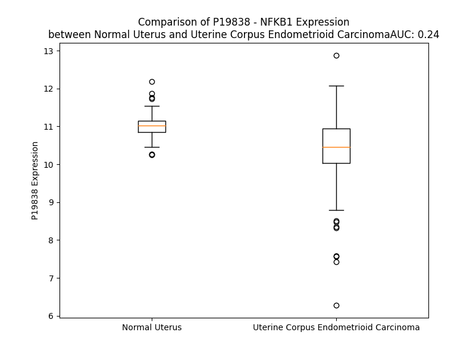

# Detailed Data for P19838

## Introduction to the Detailed Summary

### How to Interpret the Results

- **Summary & Metrics**: This section provides a quick reference to essential protein attributes, including expression changes, family classification, and biomarker applications. Regulation status (upregulated/downregulated) indicates the protein's behavior in a disease context. Some information comes from the original excel file with the proteins selected from literature, while others are derived from the analyses.
- **Expression Comparison**: A visual representation comparing protein expression between normal and disease states. It highlights significant changes in expression levels that might indicate diagnostic or therapeutic relevance. This is data coming from transcriptomics experiments and could not translate similarly to protein levels.
- **Isoform Alignment**: An interactive view of isoform alignments, revealing structural and functional differences between variants of the protein.
- **Interactors & Homologs**: Tables listing known interaction partners and homologous proteins, the more interactors and homologs, the more complex the protein is to design an antibody for.
- **Biological Assemblies**: Information about the structural arrangement of the protein in different assemblies, providing insights into its functional state but also the complexity of the protein to develop antibodies.
- **Combined Per-Residue Information**: A detailed table summarizing residue-level data. This includes predictions for epitope regions, aggregation tendencies, and modifications that might impact the protein's function. Each row corresponds to a residue in the protein, providing insights into specific sites that may be important for research or drug development.
## Summary & Metrics

- **UniProt Accession**: P19838
- **Gene Name**: NFKB1
- **Protein Name**: Nuclear factor NF-kappa-B p105 subunit
- **Swiss Prot**: NFKB1_HUMAN
- **Family**: transcription regulator
- **Biomarker Application**: prognosis
- **Number of Isoforms**: 3
- **Regulation**: -1
- **(transcriptomics) AUC**: 0.24
- **(transcriptomics) Fold Change**: 1.06
- **(transcriptomics) Regulation**: Downregulated
- **Discotope Epitope Count**: 254
- **Max n_uniprots (Homo)**: 1
- **Max n_uniprots (Hetero)**: 4

## Expression Comparison

## Isoform Alignment

<pre style='font-size:14px; font-family:monospace;'>P19838-1 MAEDDPYLGRPEQMFHLDPSLTHTIFNPEVFQPQMALPT-DGPYLQILEQPKQRGFRFRYVCEGPSHGGLPGASSEKNKKSYPQVKICNYVGPAKVIVQLVTNGKNIHLHAHSLVGKHCEDGICTVTAGPKDMVVGFANLGILHVTKKKVFETLEARMTEACIRGYNPGLLVHPDLAYLQAEGGGDRQLGDREKELIRQAALQQTKEMDLSVVRLMFTAFLPDSTGSFTRRLEPVVSDAIYDSKAPNASNLKIVRMDRTAGCVTGGEEIYLLCDKVQKDDIQIRFYEEEENGGVWEGFGDFSPTDVHRQFAIVFKTPKYKDINITKPASVFVQLRRKSDLETSEPKPFLYYPEIKDKEEVQRKRQKLMPNFSDSFGGGSGAGAGGGGMFGSGGGGGGTGSTGPGYSFPHYGFPTYGGITFHPGTTKSNAGMKHGTMDTESKKDPEGCDKSDDKNTVNLFGKVIETTEQDQEPSEATVGNGEVTLTYATGTKEESAGVQDNLFLEKAMQLAKRHANALFDYAVTGDVKMLLAVQRHLTAVQDENGDSVLHLAIIHLHSQLVRDLLEVTSGLISDDIINMRNDLYQTPLHLAVITKQEDVVEDLLRAGADLSLLDRLGNSVLHLAAKEGHDKVLSILLKHKKAALLLDHPNGDGLNAIHLAMMSNSLPCLLLLVAAGADVNAQEQKSGRTALHLAVEHDNISLAGCLLLEGDAHVDSTTYDGTTPLHIAAGRGSTRLAALLKAAGADPLVENFEPLYDLDDSWENAGEDEGVVPGTTPLDMATSWQVFDILNGKPYEPEFTSDDLLAQGDMKQLAEDVKLQLYKLLEIPDPDKNWATLAQKLGLGILNNAFRLSPAPSKTLMDNYEVSGGTVRELVEALRQMGYTEAIEVIQAASSPVKTTSQAHSLPLSPASTRQQIDELRDSDSVCDSGVETSFRKLSFTESLTSGASLLTLNKMPHDYGQEGPLEGKI
P19838-2 MAEDDPYLGRPEQMFHLDPSLTHTIFNPEVFQPQMALPTADGPYLQILEQPKQRGFRFRYVCEGPSHGGLPGASSEKNKKSYPQVKICNYVGPAKVIVQLVTNGKNIHLHAHSLVGKHCEDGICTVTAGPKDMVVGFANLGILHVTKKKVFETLEARMTEACIRGYNPGLLVHPDLAYLQAEGGGDRQLGDREKELIRQAALQQTKEMDLSVVRLMFTAFLPDSTGSFTRRLEPVVSDAIYDSKAPNASNLKIVRMDRTAGCVTGGEEIYLLCDKVQKDDIQIRFYEEEENGGVWEGFGDFSPTDVHRQFAIVFKTPKYKDINITKPASVFVQLRRKSDLETSEPKPFLYYPEIKDKEEVQRKRQKLMPNFSDSFGGGSGAGAGGGGMFGSGGGGGGTGSTGPGYSFPHYGFPTYGGITFHPGTTKSNAGMKHGTMDTESKKDPEGCDKSDDKNTVNLFGKVIETTEQDQEPSEATVGNGEVTLTYATGTKEESAGVQDNLFLEKAMQLAKRHANALFDYAVTGDVKMLLAVQRHLTAVQDENGDSVLHLAIIHLHSQLVRDLLEVTSGLISDDIINMRNDLYQTPLHLAVITKQEDVVEDLLRAGADLSLLDRLGNSVLHLAAKEGHDKVLSILLKHKKAALLLDHPNGDGLNAIHLAMMSNSLPCLLLLVAAGADVNAQEQKSGRTALHLAVEHDNISLAGCLLLEGDAHVDSTTYDGTTPLHIAAGRGSTRLAALLKAAGADPLVENFEPLYDLDDSWENAGEDEGVVPGTTPLDMATSWQVFDILNGKPYEPEFTSDDLLAQGDMKQLAEDVKLQLYKLLEIPDPDKNWATLAQKLGLGILNNAFRLSPAPSKTLMDNYEVSGGTVRELVEALRQMGYTEAIEVIQAASSPVKTTSQAHSLPLSPASTRQQIDELRDSDSVCDSGVETSFRKLSFTESLTSGASLLTLNKMPHDYGQEGPLEGKI
P19838-3 -------------------------------------------------------------------------------------------------------------------------------------------------------------------------------------MNGLCCMALDREKELIRQAALQQTKEMDLSVVRLMFTAFLPDSTGSFTRRLEPVVSDAIYDSKAPNASNLKIVRMDRTAGCVTGGEEIYLLCDKVQKDDIQIRFYEEEENGGVWEGFGDFSPTDVHRQFAIVFKTPKYKDINITKPASVFVQLRRKSDLETSEPKPFLYYPEIKDKEEVQRKRQKLMPNFSDSFGGGSGAGAGGGGMFGSGGGGGGTGSTGPGYSFPHYGFPTYGGITFHPGTTKSNAGMKHGTMDTESKKDPEGCDKSDDKNTVNLFGKVIETTEQDQEPSEATVGNGEVTLTYATGTKEESAGVQDNLFLEKAMQLAKRHANALFDYAVTGDVKMLLAVQRHLTAVQDENGDSVLHLAIIHLHSQLVRDLLEVTSGLISDDIINMRNDLYQTPLHLAVITKQEDVVEDLLRAGADLSLLDRLGNSVLHLAAKEGHDKVLSILLKHKKAALLLDHPNGDGLNAIHLAMMSNSLPCLLLLVAAGADVNAQEQKSGRTALHLAVEHDNISLAGCLLLEGDAHVDSTTYDGTTPLHIAAGRGSTRLAALLKAAGADPLVENFEPLYDLDDSWENAGEDEGVVPGTTPLDMATSWQVFDILNGKPYEPEFTSDDLLAQGDMKQLAEDVKLQLYKLLEIPDPDKNWATLAQKLGLGILNNAFRLSPAPSKTLMDNYEVSGGTVRELVEALRQMGYTEAIEVIQAASSPVKTTSQAHSLPLSPASTRQQIDELRDSDSVCDSGVETSFRKLSFTESLTSGASLLTLNKMPHDYGQEGPLEGKI
</pre>

## Interactors

| preferredName_A   | preferredName_B   |   score |
|:------------------|:------------------|--------:|
| NFKB1             | TNF               |   0.999 |
| NFKB1             | CHUK              |   0.999 |
| NFKB1             | IKBKB             |   0.999 |
| NFKB1             | BCL3              |   0.999 |
| NFKB1             | REL               |   0.999 |
| NFKB1             | RELB              |   0.999 |
| NFKB1             | RELA              |   0.999 |
| NFKB1             | IKBKG             |   0.999 |
| NFKB1             | NFKB2             |   0.999 |
| NFKB1             | NFKBIA            |   0.999 |
| NFKB1             | EP300             |   0.998 |
| NFKB1             | NFKBIB            |   0.998 |
| NFKB1             | IL1B              |   0.996 |
| NFKB1             | HDAC1             |   0.996 |
| NFKB1             | MAP3K8            |   0.996 |
| NFKB1             | NFKBIE            |   0.995 |
| NFKB1             | TNIP2             |   0.995 |
| NFKB1             | IL6               |   0.994 |
| NFKB1             | JUN               |   0.994 |
| NFKB1             | TLR4              |   0.993 |
| NFKB1             | KPNA4             |   0.992 |
| NFKB1             | TLR2              |   0.992 |
| NFKB1             | TBK1              |   0.99  |
| NFKB1             | TP53              |   0.989 |
| NFKB1             | CXCL8             |   0.988 |
| NFKB1             | NFKBIZ            |   0.988 |
| NFKB1             | MAPK8             |   0.987 |
| NFKB1             | TXN               |   0.983 |
| NFKB1             | SIRT1             |   0.983 |
| NFKB1             | CCL2              |   0.982 |
| NFKB1             | NLRP3             |   0.981 |
| NFKB1             | IL18              |   0.979 |
| NFKB1             | TLR5              |   0.977 |
| NFKB1             | CCL5              |   0.975 |
| NFKB1             | PPARG             |   0.972 |
| NFKB1             | MYD88             |   0.972 |
| NFKB1             | CXCL2             |   0.969 |
| NFKB1             | CTNNB1            |   0.964 |
| NFKB1             | BTRC              |   0.964 |
| NFKB1             | CXCL1             |   0.963 |
| NFKB1             | STAT3             |   0.962 |
| NFKB1             | ESR1              |   0.957 |
| NFKB1             | NLRP12            |   0.954 |
| NFKB1             | PRKCQ             |   0.953 |
| NFKB1             | TRAF6             |   0.951 |
| NFKB1             | KPNA3             |   0.949 |
| NFKB1             | IL1A              |   0.946 |
| NFKB1             | PRKACB            |   0.944 |
| NFKB1             | PRKACG            |   0.944 |
| NFKB1             | PRKACA            |   0.944 |

## Homologs

| uniprot_id   | gene_id   |
|:-------------|:----------|
| Q00653       | NFKB2     |
| Q04864       | REL       |
| E9PJZ9       | RELA      |
| D6R992       | RELB      |

## Biological Assemblies

|   Unnamed: 0 |   assembly |   n_uniprots | composition   | crystal_id   |
|-------------:|-----------:|-------------:|:--------------|:-------------|
|            0 |          1 |            2 | Hetero        | 1mdi         |
|            0 |          1 |            2 | Hetero        | 7lfc         |
|            0 |          1 |            2 | Hetero        | 2o61         |
|            0 |          1 |            1 | Homo          | 8tqd         |
|            0 |          1 |            2 | Hetero        | 7rg4         |
|            0 |          1 |            3 | Hetero        | 7lf4         |
|            1 |          2 |            3 | Hetero        | 7lf4         |
|            0 |          1 |            2 | Hetero        | 7leq         |
|            0 |          1 |            3 | Hetero        | 7let         |
|            0 |          1 |            2 | Hetero        | 1mdk         |
|            0 |          1 |            2 | Hetero        | 7rg5         |
|            0 |          1 |            1 | Homo          | 2dbf         |
|            0 |          1 |            2 | Hetero        | 1mdj         |
|            0 |          1 |            1 | Homo          | 1svc         |
|            0 |          1 |            4 | Hetero        | 3gut         |
|            1 |          2 |            4 | Hetero        | 3gut         |
|            0 |          1 |            3 | Hetero        | 1nfi         |
|            1 |          2 |            3 | Hetero        | 1nfi         |

## Combined Per-Residue Information

|   res | aa   |   epitope_score | epitope   |   relative_surface_accessibility |   modeling_confidence |   Aggregation | modification                                 |
|------:|:-----|----------------:|:----------|---------------------------------:|----------------------:|--------------:|:---------------------------------------------|
|     1 | M    |         0.12836 | True      |                          1.36278 |                 33.51 |         0     | N/A                                          |
|     2 | A    |         0.16677 | True      |                          0.85604 |                 35.07 |         0     | N/A                                          |
|     3 | E    |         0.11087 | True      |                          0.83681 |                 37.69 |         0     | N/A                                          |
|     4 | D    |         0.12038 | True      |                          0.79824 |                 39.18 |         0     | N/A                                          |
|     5 | D    |         0.14839 | True      |                          0.8086  |                 38.61 |         0     | N/A                                          |
|     6 | P    |         0.08355 | False     |                          0.6934  |                 41.96 |         0     | N/A                                          |
|     7 | Y    |         0.14675 | True      |                          0.97859 |                 40.45 |         0     | N/A                                          |
|     8 | L    |         0.14655 | True      |                          1.11263 |                 32.4  |         0     | N/A                                          |
|     9 | G    |         0.18595 | True      |                          0.8088  |                 31.93 |         0     | N/A                                          |
|    10 | R    |         0.14057 | True      |                          0.9699  |                 32.99 |         0     | N/A                                          |
|    11 | P    |         0.12504 | True      |                          0.85537 |                 33.23 |         0     | N/A                                          |
|    12 | E    |         0.15545 | True      |                          0.77825 |                 29.65 |         0     | N/A                                          |
|    13 | Q    |         0.11059 | True      |                          0.90365 |                 33.12 |         0     | N/A                                          |
|    14 | M    |         0.06797 | False     |                          0.84094 |                 27.71 |         0     | N/A                                          |
|    15 | F    |         0.10357 | True      |                          1.06055 |                 30.89 |         0     | N/A                                          |
|    16 | H    |         0.14203 | True      |                          0.89522 |                 28.34 |         0     | N/A                                          |
|    17 | L    |         0.21016 | True      |                          1.08344 |                 33.55 |         0     | N/A                                          |
|    18 | D    |         0.19178 | True      |                          0.77915 |                 28.74 |         0     | N/A                                          |
|    19 | P    |         0.14626 | True      |                          0.86392 |                 35.65 |         0     | N/A                                          |
|    20 | S    |         0.13155 | True      |                          0.79377 |                 28.63 |         0     | N/A                                          |
|    21 | L    |         0.11276 | True      |                          1.12202 |                 32.27 |         0     | N/A                                          |
|    22 | T    |         0.1064  | True      |                          0.75073 |                 27.81 |         0     | N/A                                          |
|    23 | H    |         0.12026 | True      |                          0.91743 |                 28.85 |         0     | N/A                                          |
|    24 | T    |         0.10699 | True      |                          0.79255 |                 28.79 |         0     | N/A                                          |
|    25 | I    |         0.18513 | True      |                          0.91036 |                 30.2  |         0     | N/A                                          |
|    26 | F    |         0.10727 | True      |                          0.98454 |                 26.32 |         0     | N/A                                          |
|    27 | N    |         0.1388  | True      |                          0.79489 |                 28.92 |         0     | N/A                                          |
|    28 | P    |         0.17843 | True      |                          0.93998 |                 29.78 |         0     | N/A                                          |
|    29 | E    |         0.144   | True      |                          0.57076 |                 26.47 |         0     | N/A                                          |
|    30 | V    |         0.12416 | True      |                          0.9921  |                 30.96 |         0     | N/A                                          |
|    31 | F    |         0.16401 | True      |                          0.99205 |                 27.48 |         0     | N/A                                          |
|    32 | Q    |         0.10517 | True      |                          0.56718 |                 25.52 |         0     | N/A                                          |
|    33 | P    |         0.17556 | True      |                          0.74772 |                 29.97 |         0     | N/A                                          |
|    34 | Q    |         0.08889 | False     |                          0.76588 |                 27.91 |         0     | N/A                                          |
|    35 | M    |         0.10224 | True      |                          0.87698 |                 31.2  |         0     | N/A                                          |
|    36 | A    |         0.09005 | False     |                          0.89232 |                 33.04 |         0     | N/A                                          |
|    37 | L    |         0.09697 | True      |                          0.6689  |                 44.26 |         0     | N/A                                          |
|    38 | P    |         0.09438 | True      |                          0.80274 |                 45.61 |         0     | N/A                                          |
|    39 | T    |         0.14712 | True      |                          0.8212  |                 52.23 |         0     | N/A                                          |
|    40 | D    |         0.15594 | True      |                          0.91957 |                 74.39 |         0     | N/A                                          |
|    41 | G    |         0.04093 | False     |                          0.3043  |                 86.04 |         0     | N/A                                          |
|    42 | P    |         0.03829 | False     |                          0.39975 |                 92.76 |         0     | N/A                                          |
|    43 | Y    |         0.05982 | False     |                          0.29503 |                 94.06 |         0.985 | N/A                                          |
|    44 | L    |         0.01025 | False     |                          0.03855 |                 95.05 |         0.985 | N/A                                          |
|    45 | Q    |         0.03894 | False     |                          0.3857  |                 95.54 |         0.985 | N/A                                          |
|    46 | I    |         0.04146 | False     |                          0.18212 |                 96.91 |         0.985 | N/A                                          |
|    47 | L    |         0.15078 | True      |                          0.54959 |                 96.06 |         0.985 | N/A                                          |
|    48 | E    |         0.06435 | False     |                          0.10453 |                 96.41 |         0     | N/A                                          |
|    49 | Q    |         0.04982 | False     |                          0.24959 |                 97.51 |         0     | N/A                                          |
|    50 | P    |         0.0021  | False     |                          0       |                 96.65 |         0     | N/A                                          |
|    51 | K    |         0.04982 | False     |                          0.3856  |                 93.73 |         0     | N/A                                          |
|    52 | Q    |         0.07469 | False     |                          0.40182 |                 93.27 |         0     | N/A                                          |
|    53 | R    |         0.14128 | True      |                          0.16623 |                 90.49 |         0     | N/A                                          |
|    54 | G    |         0.04302 | False     |                          0.50506 |                 87.63 |         0     | N/A                                          |
|    55 | F    |         0.03498 | False     |                          0.10011 |                 92.4  |         0     | N/A                                          |
|    56 | R    |         0.05418 | False     |                          0.31887 |                 93.76 |         0     | N/A                                          |
|    57 | F    |         0.00692 | False     |                          0.01573 |                 94.95 |         0     | N/A                                          |
|    58 | R    |         0.09358 | False     |                          0.19403 |                 94.26 |         0     | N/A                                          |
|    59 | Y    |         0.05347 | False     |                          0.35922 |                 94.75 |         0     | N/A                                          |
|    60 | V    |         0.12901 | True      |                          0.81933 |                 91.84 |         0     | N/A                                          |
|    61 | C    |         0.17237 | True      |                          0.89428 |                 91.32 |         0     | S-nitrosocysteine; alternate                 |
|    62 | E    |         0.11421 | True      |                          0.21413 |                 90.65 |         0     | N/A                                          |
|    63 | G    |         0.10276 | True      |                          0.3685  |                 84.6  |         0     | N/A                                          |
|    64 | P    |         0.12908 | True      |                          0.93718 |                 80.47 |         0     | N/A                                          |
|    65 | S    |         0.20083 | True      |                          0.77453 |                 65.08 |         0     | N/A                                          |
|    66 | H    |         0.17974 | True      |                          0.5113  |                 64.22 |         0     | N/A                                          |
|    67 | G    |         0.12079 | True      |                          0.61573 |                 78.88 |         0     | N/A                                          |
|    68 | G    |         0.06334 | False     |                          0.27438 |                 89.94 |         0     | N/A                                          |
|    69 | L    |         0.00172 | False     |                          0       |                 94.13 |         0     | N/A                                          |
|    70 | P    |         0.03705 | False     |                          0.23261 |                 94.76 |         0     | N/A                                          |
|    71 | G    |         0.00492 | False     |                          0       |                 95.59 |         0     | N/A                                          |
|    72 | A    |         0.05561 | False     |                          0.53989 |                 94.43 |         0     | N/A                                          |
|    73 | S    |         0.12687 | True      |                          0.59784 |                 93.23 |         0     | N/A                                          |
|    74 | S    |         0.11743 | True      |                          0.10241 |                 91.95 |         0     | N/A                                          |
|    75 | E    |         0.17231 | True      |                          0.60278 |                 88.28 |         0     | N/A                                          |
|    76 | K    |         0.17018 | True      |                          0.96123 |                 83.46 |         0     | N/A                                          |
|    77 | N    |         0.1917  | True      |                          0.93761 |                 86.35 |         0     | N/A                                          |
|    78 | K    |         0.20092 | True      |                          0.73197 |                 90.45 |         0     | N/A                                          |
|    79 | K    |         0.20138 | True      |                          0.75298 |                 91.03 |         0     | N/A                                          |
|    80 | S    |         0.03131 | False     |                          0.12556 |                 93.79 |         0     | N/A                                          |
|    81 | Y    |         0.05871 | False     |                          0.28682 |                 94.55 |         0     | N/A                                          |
|    82 | P    |         0.00093 | False     |                          0       |                 95.91 |         0     | N/A                                          |
|    83 | Q    |         0.06258 | False     |                          0.2815  |                 96.04 |         0     | N/A                                          |
|    84 | V    |         0.00371 | False     |                          0.00095 |                 96.65 |         0     | N/A                                          |
|    85 | K    |         0.07156 | False     |                          0.37345 |                 95.43 |         0     | N/A                                          |
|    86 | I    |         0.01581 | False     |                          0.00946 |                 95.14 |         0     | N/A                                          |
|    87 | C    |         0.04989 | False     |                          0.09845 |                 93.1  |         0     | N/A                                          |
|    88 | N    |         0.04443 | False     |                          0.55797 |                 92.46 |         0     | N/A                                          |
|    89 | Y    |         0.12155 | True      |                          0.22815 |                 90.55 |         0     | N/A                                          |
|    90 | V    |         0.10579 | True      |                          0.83    |                 89.48 |         0     | N/A                                          |
|    91 | G    |         0.0228  | False     |                          0.1014  |                 90.51 |         0     | N/A                                          |
|    92 | P    |         0.13722 | True      |                          0.47417 |                 93.03 |         0     | N/A                                          |
|    93 | A    |         0.00132 | False     |                          0.00094 |                 94.1  |         0     | N/A                                          |
|    94 | K    |         0.05711 | False     |                          0.20769 |                 94.33 |         0     | N/A                                          |
|    95 | V    |         0.00138 | False     |                          0       |                 96.02 |        56.082 | N/A                                          |
|    96 | I    |         0.00238 | False     |                          0.0008  |                 95.97 |        60.585 | N/A                                          |
|    97 | V    |         0.00252 | False     |                          0       |                 97.18 |        61.005 | N/A                                          |
|    98 | Q    |         0.00421 | False     |                          0.01062 |                 96.95 |        61.005 | N/A                                          |
|    99 | L    |         0.00833 | False     |                          0.02099 |                 97.62 |        61.005 | N/A                                          |
|   100 | V    |         0.00188 | False     |                          0       |                 97.72 |        58.18  | N/A                                          |
|   101 | T    |         0.02563 | False     |                          0.10522 |                 97.46 |        22.127 | N/A                                          |
|   102 | N    |         0.06737 | False     |                          0.36982 |                 94.66 |         0.281 | N/A                                          |
|   103 | G    |         0.04337 | False     |                          0.43302 |                 90.48 |         0     | N/A                                          |
|   104 | K    |         0.07187 | False     |                          1.03947 |                 89.5  |         0     | N/A                                          |
|   105 | N    |         0.05595 | False     |                          0.60466 |                 92.05 |         0     | N/A                                          |
|   106 | I    |         0.03108 | False     |                          0.30845 |                 95.11 |         0     | N/A                                          |
|   107 | H    |         0.04036 | False     |                          0.19262 |                 96.16 |         0     | N/A                                          |
|   108 | L    |         0.00573 | False     |                          0.03462 |                 96.48 |         0     | N/A                                          |
|   109 | H    |         0.0033  | False     |                          0.00442 |                 97.72 |         0     | N/A                                          |
|   110 | A    |         0.00124 | False     |                          0.00283 |                 97.27 |         0     | N/A                                          |
|   111 | H    |         0.01094 | False     |                          0.00725 |                 97.06 |         0     | N/A                                          |
|   112 | S    |         0.02957 | False     |                          0.0989  |                 95.31 |         0     | N/A                                          |
|   113 | L    |         0.01304 | False     |                          0.00853 |                 95.08 |         0     | N/A                                          |
|   114 | V    |         0.07583 | False     |                          0.31704 |                 93.66 |         0     | N/A                                          |
|   115 | G    |         0.07895 | False     |                          0.59198 |                 89.03 |         0     | N/A                                          |
|   116 | K    |         0.2089  | True      |                          0.62028 |                 85.52 |         0     | N/A                                          |
|   117 | H    |         0.11153 | True      |                          0.5378  |                 91.37 |         0     | N/A                                          |
|   118 | C    |         0.04843 | False     |                          0.21581 |                 92.53 |         0     | N/A                                          |
|   119 | E    |         0.05175 | False     |                          0.61172 |                 91.96 |         0     | N/A                                          |
|   120 | D    |         0.11468 | True      |                          0.47348 |                 90.25 |         0     | N/A                                          |
|   121 | G    |         0.01076 | False     |                          0.08282 |                 91.34 |         0     | N/A                                          |
|   122 | I    |         0.01834 | False     |                          0.04553 |                 95.11 |         0.366 | N/A                                          |
|   123 | C    |         0.01304 | False     |                          0.01122 |                 95.18 |         0.366 | N/A                                          |
|   124 | T    |         0.05278 | False     |                          0.35933 |                 94.74 |         0.366 | N/A                                          |
|   125 | V    |         0.04113 | False     |                          0.20946 |                 94.34 |         0.366 | N/A                                          |
|   126 | T    |         0.0694  | False     |                          0.65844 |                 92.29 |         0.366 | N/A                                          |
|   127 | A    |         0.03189 | False     |                          0.04165 |                 89.68 |         0.167 | N/A                                          |
|   128 | G    |         0.11645 | True      |                          0.37216 |                 79.89 |         0     | N/A                                          |
|   129 | P    |         0.2165  | True      |                          0.68068 |                 80.38 |         0     | N/A                                          |
|   130 | K    |         0.1256  | True      |                          0.95312 |                 85.08 |         0     | N/A                                          |
|   131 | D    |         0.17966 | True      |                          0.51002 |                 89.53 |         0     | N/A                                          |
|   132 | M    |         0.06619 | False     |                          0.08614 |                 91.36 |        46.223 | N/A                                          |
|   133 | V    |         0.10984 | True      |                          0.38886 |                 94.11 |        51.102 | N/A                                          |
|   134 | V    |         0.0194  | False     |                          0.0457  |                 94.28 |        51.615 | N/A                                          |
|   135 | G    |         0.10176 | True      |                          0.52931 |                 93.48 |        51.615 | N/A                                          |
|   136 | F    |         0.01399 | False     |                          0.01975 |                 93.72 |        52.033 | N/A                                          |
|   137 | A    |         0.07263 | False     |                          0.39533 |                 90.8  |        37.857 | N/A                                          |
|   138 | N    |         0.13153 | True      |                          0.52027 |                 90    |        24.467 | N/A                                          |
|   139 | L    |         0.0047  | False     |                          0.00247 |                 92.91 |        24     | N/A                                          |
|   140 | G    |         0.03333 | False     |                          0.15593 |                 93.97 |        21.083 | N/A                                          |
|   141 | I    |         0.00843 | False     |                          0.01199 |                 95.67 |        20.853 | N/A                                          |
|   142 | L    |         0.06203 | False     |                          0.25795 |                 95.02 |        17.92  | N/A                                          |
|   143 | H    |         0.02555 | False     |                          0.11998 |                 95.63 |         1.903 | N/A                                          |
|   144 | V    |         0.03221 | False     |                          0.11615 |                 95.71 |         1.802 | N/A                                          |
|   145 | T    |         0.19761 | True      |                          0.47929 |                 94.29 |         0.322 | N/A                                          |
|   146 | K    |         0.08437 | False     |                          0.87674 |                 94.02 |         0     | N/A                                          |
|   147 | K    |         0.1128  | True      |                          0.96099 |                 94.26 |         0     | N/A                                          |
|   148 | K    |         0.08428 | False     |                          0.58481 |                 94.78 |         0     | N/A                                          |
|   149 | V    |         0.01671 | False     |                          0.06066 |                 96.32 |         0     | N/A                                          |
|   150 | F    |         0.06797 | False     |                          0.2447  |                 96.72 |         0     | N/A                                          |
|   151 | E    |         0.11466 | True      |                          0.54638 |                 96.1  |         0     | N/A                                          |
|   152 | T    |         0.01983 | False     |                          0.2401  |                 96.11 |         0     | N/A                                          |
|   153 | L    |         0.00151 | False     |                          0       |                 96.49 |         0     | N/A                                          |
|   154 | E    |         0.04177 | False     |                          0.19934 |                 96.69 |         0     | N/A                                          |
|   155 | A    |         0.05521 | False     |                          0.57231 |                 95.85 |         0     | N/A                                          |
|   156 | R    |         0.0319  | False     |                          0.08523 |                 95.13 |         0     | N/A                                          |
|   157 | M    |         0.00397 | False     |                          0       |                 95.41 |         0     | N/A                                          |
|   158 | T    |         0.09665 | True      |                          0.31006 |                 94.14 |         0     | N/A                                          |
|   159 | E    |         0.05156 | False     |                          0.15808 |                 92.57 |         0     | N/A                                          |
|   160 | A    |         0.00254 | False     |                          0.00255 |                 92.87 |         0     | N/A                                          |
|   161 | C    |         0.00432 | False     |                          0       |                 92.7  |         0     | N/A                                          |
|   162 | I    |         0.09361 | False     |                          0.3699  |                 91.54 |         0     | N/A                                          |
|   163 | R    |         0.0448  | False     |                          0.31301 |                 90.21 |         0     | N/A                                          |
|   164 | G    |         0.00746 | False     |                          0.03688 |                 91.32 |         0     | N/A                                          |
|   165 | Y    |         0.0196  | False     |                          0.0829  |                 93.43 |         0     | N/A                                          |
|   166 | N    |         0.01236 | False     |                          0.06752 |                 92.57 |         0     | N/A                                          |
|   167 | P    |         0.01139 | False     |                          0.02883 |                 92.23 |         0     | N/A                                          |
|   168 | G    |         0.02896 | False     |                          0.25402 |                 89.68 |         0     | N/A                                          |
|   169 | L    |         0.05359 | False     |                          0.53288 |                 91.87 |         0     | N/A                                          |
|   170 | L    |         0.00239 | False     |                          0       |                 93.8  |         0     | N/A                                          |
|   171 | V    |         0.02543 | False     |                          0.04486 |                 93.42 |         0     | N/A                                          |
|   172 | H    |         0.08815 | False     |                          0.31535 |                 92.08 |         0     | N/A                                          |
|   173 | P    |         0.07145 | False     |                          0.70313 |                 92.08 |         0     | N/A                                          |
|   174 | D    |         0.13467 | True      |                          0.42202 |                 91.53 |         0     | N/A                                          |
|   175 | L    |         0.00637 | False     |                          0.00082 |                 90.58 |         0     | N/A                                          |
|   176 | A    |         0.17577 | True      |                          0.53937 |                 88.91 |         0     | N/A                                          |
|   177 | Y    |         0.19986 | True      |                          0.6081  |                 88.03 |         0     | N/A                                          |
|   178 | L    |         0.02096 | False     |                          0.02401 |                 86.03 |         0     | N/A                                          |
|   179 | Q    |         0.04907 | False     |                          0.61534 |                 81.26 |         0     | N/A                                          |
|   180 | A    |         0.07431 | False     |                          0.1519  |                 77.72 |         0     | N/A                                          |
|   181 | E    |         0.1265  | True      |                          0.60091 |                 75.11 |         0     | N/A                                          |
|   182 | G    |         0.3209  | True      |                          0.75778 |                 59.92 |         0     | N/A                                          |
|   183 | G    |         0.15377 | True      |                          0.6541  |                 57.4  |         0     | N/A                                          |
|   184 | G    |         0.1574  | True      |                          0.82959 |                 56.27 |         0     | N/A                                          |
|   185 | D    |         0.15465 | True      |                          0.84872 |                 62.62 |         0     | N/A                                          |
|   186 | R    |         0.14593 | True      |                          0.22394 |                 77.8  |         0     | N/A                                          |
|   187 | Q    |         0.14689 | True      |                          0.86241 |                 81.35 |         0     | N/A                                          |
|   188 | L    |         0.05642 | False     |                          0.1104  |                 87.01 |         0     | N/A                                          |
|   189 | G    |         0.1729  | True      |                          0.45898 |                 89.36 |         0     | N/A                                          |
|   190 | D    |         0.18453 | True      |                          0.67399 |                 91.62 |         0     | N/A                                          |
|   191 | R    |         0.21246 | True      |                          0.70919 |                 92.91 |         0     | N/A                                          |
|   192 | E    |         0.06445 | False     |                          0.11946 |                 93.17 |         0     | N/A                                          |
|   193 | K    |         0.1131  | True      |                          0.49756 |                 94.09 |         0     | N/A                                          |
|   194 | E    |         0.09991 | True      |                          0.42487 |                 94.82 |         0     | N/A                                          |
|   195 | L    |         0.07634 | False     |                          0.22562 |                 94.98 |         0     | N/A                                          |
|   196 | I    |         0.01767 | False     |                          0.0088  |                 95.52 |         0     | N/A                                          |
|   197 | R    |         0.10199 | True      |                          0.42357 |                 96.19 |         0     | N/A                                          |
|   198 | Q    |         0.15454 | True      |                          0.48866 |                 96.18 |         0     | N/A                                          |
|   199 | A    |         0.01938 | False     |                          0.09167 |                 95.54 |         0     | N/A                                          |
|   200 | A    |         0.00203 | False     |                          0       |                 96.43 |         0     | N/A                                          |
|   201 | L    |         0.1204  | True      |                          0.47788 |                 95.1  |         0     | N/A                                          |
|   202 | Q    |         0.11706 | True      |                          0.43124 |                 94.64 |         0     | N/A                                          |
|   203 | Q    |         0.02537 | False     |                          0.06636 |                 94.15 |         0     | N/A                                          |
|   204 | T    |         0.08542 | False     |                          0.27855 |                 94.82 |         0     | N/A                                          |
|   205 | K    |         0.19858 | True      |                          0.76053 |                 92.87 |         0     | N/A                                          |
|   206 | E    |         0.08577 | False     |                          0.57168 |                 91.29 |         0     | N/A                                          |
|   207 | M    |         0.02778 | False     |                          0.11043 |                 94.15 |         4.563 | N/A                                          |
|   208 | D    |         0.06007 | False     |                          0.44374 |                 94.39 |         4.964 | N/A                                          |
|   209 | L    |         0.03148 | False     |                          0.09317 |                 95.25 |         4.964 | N/A                                          |
|   210 | S    |         0.03026 | False     |                          0.12162 |                 93.97 |         4.964 | N/A                                          |
|   211 | V    |         0.01505 | False     |                          0.06826 |                 95.54 |         4.964 | N/A                                          |
|   212 | V    |         0.00133 | False     |                          0       |                 97.24 |         4.964 | N/A                                          |
|   213 | R    |         0.04368 | False     |                          0.17183 |                 98.02 |         4.964 | N/A                                          |
|   214 | L    |         0.00245 | False     |                          0       |                 97.72 |        18.509 | N/A                                          |
|   215 | M    |         0.01394 | False     |                          0.0106  |                 97.8  |        20.867 | N/A                                          |
|   216 | F    |         0.00147 | False     |                          0       |                 97.49 |        20.867 | N/A                                          |
|   217 | T    |         0.00333 | False     |                          0.00145 |                 96.55 |        20.312 | N/A                                          |
|   218 | A    |         0.00107 | False     |                          0       |                 95.73 |        19.982 | N/A                                          |
|   219 | F    |         0.00688 | False     |                          0.00892 |                 94.81 |        19.035 | N/A                                          |
|   220 | L    |         0.02481 | False     |                          0.0577  |                 93.4  |         5.527 | N/A                                          |
|   221 | P    |         0.06569 | False     |                          0.25682 |                 92.36 |         2.818 | N/A                                          |
|   222 | D    |         0.06635 | False     |                          0.253   |                 89.34 |         0     | N/A                                          |
|   223 | S    |         0.16239 | True      |                          0.97001 |                 88.06 |         0     | N/A                                          |
|   224 | T    |         0.14631 | True      |                          0.80424 |                 88.21 |         0     | N/A                                          |
|   225 | G    |         0.12558 | True      |                          0.5481  |                 85.71 |         0     | N/A                                          |
|   226 | S    |         0.07504 | False     |                          0.24657 |                 89.58 |         0     | N/A                                          |
|   227 | F    |         0.05691 | False     |                          0.31715 |                 91.54 |         0     | N/A                                          |
|   228 | T    |         0.03479 | False     |                          0.22528 |                 90.48 |         0     | N/A                                          |
|   229 | R    |         0.16104 | True      |                          0.62026 |                 90.94 |         0     | N/A                                          |
|   230 | R    |         0.07721 | False     |                          0.43949 |                 93.07 |         0     | N/A                                          |
|   231 | L    |         0.06304 | False     |                          0.1014  |                 93.99 |         0     | N/A                                          |
|   232 | E    |         0.07403 | False     |                          0.59947 |                 93.55 |         0     | N/A                                          |
|   233 | P    |         0.01558 | False     |                          0.1566  |                 95.53 |         0     | N/A                                          |
|   234 | V    |         0.05817 | False     |                          0.29609 |                 96.82 |         0     | N/A                                          |
|   235 | V    |         0.03482 | False     |                          0.26601 |                 97.58 |         0     | N/A                                          |
|   236 | S    |         0.01915 | False     |                          0.05016 |                 97.63 |         0     | N/A                                          |
|   237 | D    |         0.04862 | False     |                          0.27908 |                 97.17 |         0     | N/A                                          |
|   238 | A    |         0.02633 | False     |                          0.12107 |                 96.42 |         0     | N/A                                          |
|   239 | I    |         0.00159 | False     |                          0       |                 96.27 |         0     | N/A                                          |
|   240 | Y    |         0.0394  | False     |                          0.26706 |                 94.65 |         0     | N/A                                          |
|   241 | D    |         0.01729 | False     |                          0.03279 |                 94.16 |         0     | N/A                                          |
|   242 | S    |         0.05446 | False     |                          0.19376 |                 91.63 |         0     | N/A                                          |
|   243 | K    |         0.19895 | True      |                          0.6427  |                 89.54 |         0     | N/A                                          |
|   244 | A    |         0.03902 | False     |                          0.11479 |                 87.99 |         0     | N/A                                          |
|   245 | P    |         0.05295 | False     |                          0.38842 |                 79.65 |         0     | N/A                                          |
|   246 | N    |         0.07481 | False     |                          0.41955 |                 83.6  |         0     | N/A                                          |
|   247 | A    |         0.01324 | False     |                          0.00377 |                 82.4  |         0     | N/A                                          |
|   248 | S    |         0.03851 | False     |                          0.11963 |                 82.58 |         0     | N/A                                          |
|   249 | N    |         0.04487 | False     |                          0.45607 |                 86.22 |         0     | N/A                                          |
|   250 | L    |         0.02464 | False     |                          0.06669 |                 91.9  |         0     | N/A                                          |
|   251 | K    |         0.04602 | False     |                          0.5148  |                 93.61 |         0     | N/A                                          |
|   252 | I    |         0.02701 | False     |                          0.03251 |                 96.55 |         0     | N/A                                          |
|   253 | V    |         0.0705  | False     |                          0.52795 |                 95.77 |         0     | N/A                                          |
|   254 | R    |         0.09837 | True      |                          0.67463 |                 94.95 |         0     | N/A                                          |
|   255 | M    |         0.04468 | False     |                          0.07812 |                 95.46 |         0     | N/A                                          |
|   256 | D    |         0.09904 | True      |                          0.51139 |                 93.55 |         0     | N/A                                          |
|   257 | R    |         0.11988 | True      |                          0.42608 |                 93.54 |         0     | N/A                                          |
|   258 | T    |         0.07362 | False     |                          0.56215 |                 94.93 |         0     | N/A                                          |
|   259 | A    |         0.07502 | False     |                          0.3533  |                 94.81 |         0     | N/A                                          |
|   260 | G    |         0.00299 | False     |                          0.00483 |                 93.68 |         0     | N/A                                          |
|   261 | C    |         0.03257 | False     |                          0.12443 |                 93.41 |         0     | N/A                                          |
|   262 | V    |         0.00442 | False     |                          0       |                 94.42 |         0     | N/A                                          |
|   263 | T    |         0.12528 | True      |                          0.40165 |                 92.72 |         0     | N/A                                          |
|   264 | G    |         0.05167 | False     |                          0.13346 |                 93.08 |         0     | N/A                                          |
|   265 | G    |         0.07512 | False     |                          0.61642 |                 94.06 |         0     | N/A                                          |
|   266 | E    |         0.06184 | False     |                          0.21494 |                 94.4  |         0     | N/A                                          |
|   267 | E    |         0.1282  | True      |                          0.39609 |                 96.79 |         0     | N/A                                          |
|   268 | I    |         0.00259 | False     |                          0.0024  |                 96.88 |         4.995 | N/A                                          |
|   269 | Y    |         0.13987 | True      |                          0.52543 |                 97.33 |         4.995 | N/A                                          |
|   270 | L    |         0.00257 | False     |                          0       |                 97.3  |         4.995 | N/A                                          |
|   271 | L    |         0.06789 | False     |                          0.50368 |                 97.25 |         4.995 | N/A                                          |
|   272 | C    |         0.0303  | False     |                          0.03861 |                 95.21 |         4.995 | N/A                                          |
|   273 | D    |         0.05475 | False     |                          0.30969 |                 92.92 |         0.247 | N/A                                          |
|   274 | K    |         0.05534 | False     |                          0.38631 |                 91.98 |         0.247 | N/A                                          |
|   275 | V    |         0.00485 | False     |                          0.01002 |                 92.86 |         0.247 | N/A                                          |
|   276 | Q    |         0.11409 | True      |                          0.31692 |                 92.49 |         0     | N/A                                          |
|   277 | K    |         0.06643 | False     |                          0.48586 |                 93.47 |         0     | N/A                                          |
|   278 | D    |         0.14334 | True      |                          0.53279 |                 93.67 |         0     | N/A                                          |
|   279 | D    |         0.08765 | False     |                          0.16356 |                 94.07 |         0     | N/A                                          |
|   280 | I    |         0.0147  | False     |                          0.01057 |                 95.95 |         0     | N/A                                          |
|   281 | Q    |         0.037   | False     |                          0.13714 |                 96.89 |         0     | N/A                                          |
|   282 | I    |         0.00277 | False     |                          0.00137 |                 97.57 |         0     | N/A                                          |
|   283 | R    |         0.06508 | False     |                          0.12091 |                 97.66 |         0     | N/A                                          |
|   284 | F    |         0.00336 | False     |                          0       |                 97.63 |         0     | N/A                                          |
|   285 | Y    |         0.03604 | False     |                          0.09549 |                 96.66 |         0     | N/A                                          |
|   286 | E    |         0.06038 | False     |                          0.20577 |                 94.43 |         0     | N/A                                          |
|   287 | E    |         0.07635 | False     |                          0.6329  |                 91.45 |         0     | N/A                                          |
|   288 | E    |         0.07847 | False     |                          0.27476 |                 87.33 |         0     | N/A                                          |
|   289 | E    |         0.11902 | True      |                          1.01006 |                 83.98 |         0     | N/A                                          |
|   290 | N    |         0.11978 | True      |                          0.75122 |                 84.88 |         0     | N/A                                          |
|   291 | G    |         0.05568 | False     |                          0.84213 |                 81.46 |         0     | N/A                                          |
|   292 | G    |         0.07307 | False     |                          0.37153 |                 86.1  |         0     | N/A                                          |
|   293 | V    |         0.1181  | True      |                          0.52913 |                 90.03 |         0     | N/A                                          |
|   294 | W    |         0.13168 | True      |                          0.14357 |                 93.72 |         0     | N/A                                          |
|   295 | E    |         0.09953 | True      |                          0.38963 |                 95.26 |         0     | N/A                                          |
|   296 | G    |         0.05568 | False     |                          0.12715 |                 95.91 |         0     | N/A                                          |
|   297 | F    |         0.05293 | False     |                          0.4184  |                 97.21 |         0     | N/A                                          |
|   298 | G    |         0.01496 | False     |                          0.09755 |                 96.9  |         0     | N/A                                          |
|   299 | D    |         0.10909 | True      |                          0.57991 |                 97.24 |         0     | N/A                                          |
|   300 | F    |         0.06217 | False     |                          0.22568 |                 97.26 |         0     | N/A                                          |
|   301 | S    |         0.1089  | True      |                          0.34036 |                 95.52 |         0     | N/A                                          |
|   302 | P    |         0.14552 | True      |                          0.45753 |                 95.62 |         0     | N/A                                          |
|   303 | T    |         0.13517 | True      |                          0.87603 |                 95.21 |         0     | N/A                                          |
|   304 | D    |         0.10413 | True      |                          0.3325  |                 96.8  |         0     | N/A                                          |
|   305 | V    |         0.03396 | False     |                          0.07555 |                 96.07 |         0     | N/A                                          |
|   306 | H    |         0.09901 | True      |                          0.60343 |                 95.06 |         0     | N/A                                          |
|   307 | R    |         0.13814 | True      |                          0.50326 |                 93.82 |         0     | N/A                                          |
|   308 | Q    |         0.08688 | False     |                          0.30035 |                 92.36 |         2.127 | N/A                                          |
|   309 | F    |         0.08567 | False     |                          0.55459 |                 95.33 |        58.379 | N/A                                          |
|   310 | A    |         0.04542 | False     |                          0.15797 |                 97.06 |        58.379 | N/A                                          |
|   311 | I    |         0.00269 | False     |                          0.00127 |                 97.7  |        58.379 | N/A                                          |
|   312 | V    |         0.0403  | False     |                          0.24245 |                 97.55 |        58.379 | N/A                                          |
|   313 | F    |         0.01418 | False     |                          0.01784 |                 97.83 |        58.219 | N/A                                          |
|   314 | K    |         0.06636 | False     |                          0.44912 |                 97.32 |         0     | N/A                                          |
|   315 | T    |         0.0156  | False     |                          0.03448 |                 97.34 |         0     | N/A                                          |
|   316 | P    |         0.0186  | False     |                          0.11631 |                 97.21 |         0     | N/A                                          |
|   317 | K    |         0.08604 | False     |                          0.58622 |                 95.91 |         0     | N/A                                          |
|   318 | Y    |         0.05565 | False     |                          0.08874 |                 94.98 |         0     | N/A                                          |
|   319 | K    |         0.11914 | True      |                          0.5944  |                 90.91 |         0     | N/A                                          |
|   320 | D    |         0.09617 | True      |                          0.38204 |                 89.05 |         0     | N/A                                          |
|   321 | I    |         0.1497  | True      |                          0.35052 |                 88.62 |         0     | N/A                                          |
|   322 | N    |         0.11084 | True      |                          0.64309 |                 87.98 |         0     | N/A                                          |
|   323 | I    |         0.10775 | True      |                          0.22886 |                 88.55 |         0     | N/A                                          |
|   324 | T    |         0.08237 | False     |                          0.90281 |                 85.77 |         0     | N/A                                          |
|   325 | K    |         0.11756 | True      |                          0.77976 |                 88.48 |         0     | N/A                                          |
|   326 | P    |         0.14695 | True      |                          0.5633  |                 92.75 |         0     | N/A                                          |
|   327 | A    |         0.03866 | False     |                          0.14667 |                 93.06 |         3.788 | N/A                                          |
|   328 | S    |         0.05294 | False     |                          0.55034 |                 94.81 |         4.313 | N/A                                          |
|   329 | V    |         0.00311 | False     |                          0.00411 |                 95.81 |         7.127 | N/A                                          |
|   330 | F    |         0.06287 | False     |                          0.41658 |                 97.18 |         7.127 | N/A                                          |
|   331 | V    |         0.00143 | False     |                          0       |                 97.45 |         7.127 | N/A                                          |
|   332 | Q    |         0.04671 | False     |                          0.07932 |                 96.83 |         3.338 | N/A                                          |
|   333 | L    |         0.00191 | False     |                          0       |                 97.15 |         3.163 | N/A                                          |
|   334 | R    |         0.08171 | False     |                          0.17367 |                 95.94 |         0     | N/A                                          |
|   335 | R    |         0.01545 | False     |                          0.017   |                 94.05 |         0     | N/A                                          |
|   336 | K    |         0.12514 | True      |                          0.50426 |                 93.71 |         0     | N/A                                          |
|   337 | S    |         0.08295 | False     |                          0.67071 |                 90.95 |         0     | Phosphoserine; by PKA                        |
|   338 | D    |         0.09236 | False     |                          0.36352 |                 87.64 |         0     | N/A                                          |
|   339 | L    |         0.13004 | True      |                          0.6927  |                 92.17 |         0     | N/A                                          |
|   340 | E    |         0.04443 | False     |                          0.26989 |                 90.7  |         0     | N/A                                          |
|   341 | T    |         0.07071 | False     |                          0.41564 |                 93.83 |         0     | N/A                                          |
|   342 | S    |         0.0081  | False     |                          0.03839 |                 94.78 |         0     | N/A                                          |
|   343 | E    |         0.05293 | False     |                          0.73733 |                 93.82 |         0     | N/A                                          |
|   344 | P    |         0.05213 | False     |                          0.42482 |                 96.1  |         0     | N/A                                          |
|   345 | K    |         0.08468 | False     |                          0.29886 |                 96.39 |         0     | N/A                                          |
|   346 | P    |         0.12116 | True      |                          0.62787 |                 96.91 |         0     | N/A                                          |
|   347 | F    |         0.00607 | False     |                          0.01151 |                 97.03 |         0.674 | N/A                                          |
|   348 | L    |         0.05515 | False     |                          0.45481 |                 96.66 |         0.674 | N/A                                          |
|   349 | Y    |         0.00358 | False     |                          0       |                 96.54 |         0.674 | N/A                                          |
|   350 | Y    |         0.16576 | True      |                          0.34384 |                 93.6  |         0.674 | N/A                                          |
|   351 | P    |         0.05001 | False     |                          0.27851 |                 91.65 |         0.674 | N/A                                          |
|   352 | E    |         0.11417 | True      |                          0.37766 |                 82.27 |         0     | N/A                                          |
|   353 | I    |         0.13434 | True      |                          0.74095 |                 71.05 |         0     | N/A                                          |
|   354 | K    |         0.25221 | True      |                          0.72219 |                 64.52 |         0     | N/A                                          |
|   355 | D    |         0.1075  | True      |                          0.42743 |                 59    |         0     | N/A                                          |
|   356 | K    |         0.19253 | True      |                          0.8229  |                 57.14 |         0     | N/A                                          |
|   357 | E    |         0.14029 | True      |                          0.6245  |                 59.46 |         0     | N/A                                          |
|   358 | E    |         0.08599 | False     |                          0.3007  |                 60.13 |         0     | N/A                                          |
|   359 | V    |         0.0447  | False     |                          0.45269 |                 59.51 |         0     | N/A                                          |
|   360 | Q    |         0.06569 | False     |                          0.54733 |                 61.3  |         0     | N/A                                          |
|   361 | R    |         0.13247 | True      |                          0.52791 |                 63.19 |         0     | N/A                                          |
|   362 | K    |         0.07752 | False     |                          0.64672 |                 62.76 |         0     | N/A                                          |
|   363 | R    |         0.15905 | True      |                          0.84293 |                 64.44 |         0     | N/A                                          |
|   364 | Q    |         0.18961 | True      |                          0.65244 |                 61.37 |         0     | N/A                                          |
|   365 | K    |         0.19157 | True      |                          0.82374 |                 49.83 |         0     | N/A                                          |
|   366 | L    |         0.18067 | True      |                          0.952   |                 46.93 |         0     | N/A                                          |
|   367 | M    |         0.15729 | True      |                          0.91227 |                 45.98 |         0     | N/A                                          |
|   368 | P    |         0.1122  | True      |                          0.84134 |                 48.7  |         0     | N/A                                          |
|   369 | N    |         0.10538 | True      |                          0.8528  |                 38.85 |         0     | N/A                                          |
|   370 | F    |         0.12074 | True      |                          1.06257 |                 43.14 |         0     | N/A                                          |
|   371 | S    |         0.10532 | True      |                          0.65579 |                 42.06 |         0     | N/A                                          |
|   372 | D    |         0.08749 | False     |                          0.89277 |                 34.09 |         0     | N/A                                          |
|   373 | S    |         0.0967  | True      |                          0.77373 |                 41.98 |         0     | N/A                                          |
|   374 | F    |         0.10379 | True      |                          1.02372 |                 38.25 |         0     | N/A                                          |
|   375 | G    |         0.16142 | True      |                          0.81833 |                 38.18 |         0     | N/A                                          |
|   376 | G    |         0.15582 | True      |                          0.9707  |                 36.61 |         0     | N/A                                          |
|   377 | G    |         0.08882 | False     |                          0.91204 |                 34.23 |         0     | N/A                                          |
|   378 | S    |         0.09136 | False     |                          1.01296 |                 37.66 |         0     | N/A                                          |
|   379 | G    |         0.15765 | True      |                          0.82032 |                 37.11 |         0     | N/A                                          |
|   380 | A    |         0.10169 | True      |                          1.08747 |                 40.26 |         0     | N/A                                          |
|   381 | G    |         0.09741 | True      |                          0.85501 |                 33.51 |         0     | N/A                                          |
|   382 | A    |         0.06715 | False     |                          1.04357 |                 38.13 |         0     | N/A                                          |
|   383 | G    |         0.14027 | True      |                          0.98081 |                 33.47 |         0     | N/A                                          |
|   384 | G    |         0.15078 | True      |                          0.99918 |                 35.22 |         0     | N/A                                          |
|   385 | G    |         0.1041  | True      |                          1.04624 |                 31.81 |         0     | N/A                                          |
|   386 | G    |         0.16449 | True      |                          0.95127 |                 34.49 |         0     | N/A                                          |
|   387 | M    |         0.06675 | False     |                          0.95425 |                 37.26 |         0     | N/A                                          |
|   388 | F    |         0.09109 | False     |                          1.0196  |                 38.29 |         0     | N/A                                          |
|   389 | G    |         0.05682 | False     |                          0.92707 |                 39.12 |         0     | N/A                                          |
|   390 | S    |         0.08317 | False     |                          0.92012 |                 38.35 |         0     | N/A                                          |
|   391 | G    |         0.04979 | False     |                          0.98626 |                 38.58 |         0     | N/A                                          |
|   392 | G    |         0.09997 | True      |                          0.98191 |                 37.49 |         0     | N/A                                          |
|   393 | G    |         0.06248 | False     |                          1.06275 |                 37.04 |         0     | N/A                                          |
|   394 | G    |         0.11414 | True      |                          1.01355 |                 36.62 |         0     | N/A                                          |
|   395 | G    |         0.09505 | True      |                          1.08003 |                 36.07 |         0     | N/A                                          |
|   396 | G    |         0.1198  | True      |                          0.99143 |                 36.51 |         0     | N/A                                          |
|   397 | T    |         0.07652 | False     |                          1.04795 |                 36.21 |         0     | N/A                                          |
|   398 | G    |         0.08494 | False     |                          0.91539 |                 38.14 |         0     | N/A                                          |
|   399 | S    |         0.14386 | True      |                          0.81408 |                 37.45 |         0     | N/A                                          |
|   400 | T    |         0.0961  | True      |                          1.00766 |                 37.05 |         0     | N/A                                          |
|   401 | G    |         0.1293  | True      |                          0.83172 |                 37.79 |         0     | N/A                                          |
|   402 | P    |         0.13058 | True      |                          1.08325 |                 39.46 |         0     | N/A                                          |
|   403 | G    |         0.13683 | True      |                          0.84769 |                 34.99 |         0     | N/A                                          |
|   404 | Y    |         0.13844 | True      |                          1.02603 |                 33.08 |         0     | N/A                                          |
|   405 | S    |         0.15079 | True      |                          0.84151 |                 29.31 |         0     | N/A                                          |
|   406 | F    |         0.09344 | False     |                          1.06118 |                 34.25 |         0     | N/A                                          |
|   407 | P    |         0.1474  | True      |                          0.86209 |                 35.17 |         0     | N/A                                          |
|   408 | H    |         0.10503 | True      |                          0.97832 |                 32.24 |         0     | N/A                                          |
|   409 | Y    |         0.1724  | True      |                          0.9742  |                 33.69 |         0     | N/A                                          |
|   410 | G    |         0.16556 | True      |                          0.79079 |                 29.93 |         0     | N/A                                          |
|   411 | F    |         0.16042 | True      |                          1.03636 |                 32.13 |         0     | N/A                                          |
|   412 | P    |         0.14195 | True      |                          0.84414 |                 33.91 |         0     | N/A                                          |
|   413 | T    |         0.14758 | True      |                          0.97089 |                 29.9  |         0     | N/A                                          |
|   414 | Y    |         0.18526 | True      |                          0.96766 |                 35.26 |         0.13  | N/A                                          |
|   415 | G    |         0.11849 | True      |                          0.80071 |                 31.86 |         0.13  | N/A                                          |
|   416 | G    |         0.14502 | True      |                          0.89352 |                 29.76 |         0.13  | N/A                                          |
|   417 | I    |         0.10654 | True      |                          0.90113 |                 30.8  |         0.13  | N/A                                          |
|   418 | T    |         0.12356 | True      |                          0.90236 |                 27.51 |         0.13  | N/A                                          |
|   419 | F    |         0.08222 | False     |                          0.88892 |                 29.8  |         0.13  | N/A                                          |
|   420 | H    |         0.1111  | True      |                          0.95147 |                 29.99 |         0     | N/A                                          |
|   421 | P    |         0.10136 | True      |                          0.9307  |                 31.64 |         0     | N/A                                          |
|   422 | G    |         0.17725 | True      |                          0.87991 |                 30.01 |         0     | N/A                                          |
|   423 | T    |         0.09382 | False     |                          0.95733 |                 31.29 |         0     | N/A                                          |
|   424 | T    |         0.12159 | True      |                          0.95775 |                 33.66 |         0     | N/A                                          |
|   425 | K    |         0.13527 | True      |                          1.04877 |                 29.7  |         0     | N/A                                          |
|   426 | S    |         0.09766 | True      |                          0.82809 |                 30.37 |         0     | N/A                                          |
|   427 | N    |         0.07198 | False     |                          0.7584  |                 30.64 |         0     | N/A                                          |
|   428 | A    |         0.10422 | True      |                          0.89963 |                 29.61 |         0     | N/A                                          |
|   429 | G    |         0.10738 | True      |                          0.88995 |                 29.52 |         0     | N/A                                          |
|   430 | M    |         0.07894 | False     |                          0.92572 |                 28.04 |         0     | N/A                                          |
|   431 | K    |         0.08381 | False     |                          0.80726 |                 34.69 |         0     | N6-acetyllysine; by EP300                    |
|   432 | H    |         0.08505 | False     |                          0.99274 |                 31.95 |         0     | N/A                                          |
|   433 | G    |         0.1038  | True      |                          0.91314 |                 29.59 |         0     | N/A                                          |
|   434 | T    |         0.12556 | True      |                          0.97399 |                 27.58 |         0     | N/A                                          |
|   435 | M    |         0.18866 | True      |                          0.95631 |                 32.12 |         0     | N/A                                          |
|   436 | D    |         0.1375  | True      |                          0.88986 |                 27.31 |         0     | N/A                                          |
|   437 | T    |         0.18512 | True      |                          0.8564  |                 32.05 |         0     | N/A                                          |
|   438 | E    |         0.10823 | True      |                          0.93419 |                 30.27 |         0     | N/A                                          |
|   439 | S    |         0.13535 | True      |                          0.81453 |                 31.83 |         0     | N/A                                          |
|   440 | K    |         0.14543 | True      |                          0.9738  |                 34.59 |         0     | N6-acetyllysine; by EP300                    |
|   441 | K    |         0.07567 | False     |                          0.85119 |                 32.67 |         0     | N6-acetyllysine; by EP300                    |
|   442 | D    |         0.12659 | True      |                          0.75297 |                 34.35 |         0     | N/A                                          |
|   443 | P    |         0.085   | False     |                          0.85789 |                 37.78 |         0     | N/A                                          |
|   444 | E    |         0.13631 | True      |                          0.94482 |                 37.77 |         0     | N/A                                          |
|   445 | G    |         0.12143 | True      |                          0.83802 |                 35.08 |         0     | N/A                                          |
|   446 | C    |         0.10579 | True      |                          0.91935 |                 32.92 |         0     | N/A                                          |
|   447 | D    |         0.1463  | True      |                          0.635   |                 36.64 |         0     | N/A                                          |
|   448 | K    |         0.12386 | True      |                          0.86087 |                 37.98 |         0     | N/A                                          |
|   449 | S    |         0.10359 | True      |                          0.83721 |                 37.92 |         0     | Phosphoserine                                |
|   450 | D    |         0.11027 | True      |                          0.8113  |                 35    |         0     | N/A                                          |
|   451 | D    |         0.11638 | True      |                          0.91248 |                 40.43 |         0     | N/A                                          |
|   452 | K    |         0.0881  | False     |                          0.85058 |                 37.44 |         0     | N/A                                          |
|   453 | N    |         0.09797 | True      |                          0.97355 |                 32.73 |         0     | N/A                                          |
|   454 | T    |         0.07462 | False     |                          0.87514 |                 26.79 |         0.146 | N/A                                          |
|   455 | V    |         0.09597 | True      |                          0.94557 |                 32.78 |         0.146 | N/A                                          |
|   456 | N    |         0.10841 | True      |                          0.87477 |                 26.71 |         0.146 | N/A                                          |
|   457 | L    |         0.13313 | True      |                          1.07164 |                 30.33 |         0.146 | N/A                                          |
|   458 | F    |         0.10584 | True      |                          1.08614 |                 26.27 |         0.146 | N/A                                          |
|   459 | G    |         0.09821 | True      |                          0.82787 |                 29.02 |         0     | N/A                                          |
|   460 | K    |         0.06966 | False     |                          0.94693 |                 33.5  |         0     | N/A                                          |
|   461 | V    |         0.04066 | False     |                          0.85147 |                 26.59 |         0     | N/A                                          |
|   462 | I    |         0.07523 | False     |                          0.9432  |                 35.07 |         0     | N/A                                          |
|   463 | E    |         0.07577 | False     |                          0.7575  |                 27.36 |         0     | N/A                                          |
|   464 | T    |         0.06686 | False     |                          1.02157 |                 32.71 |         0     | N/A                                          |
|   465 | T    |         0.06652 | False     |                          0.87304 |                 28.51 |         0     | N/A                                          |
|   466 | E    |         0.1047  | True      |                          0.82819 |                 34.01 |         0     | N/A                                          |
|   467 | Q    |         0.09839 | True      |                          0.8174  |                 30.57 |         0     | N/A                                          |
|   468 | D    |         0.09034 | False     |                          0.73993 |                 32.84 |         0     | N/A                                          |
|   469 | Q    |         0.06361 | False     |                          0.83864 |                 33.55 |         0     | N/A                                          |
|   470 | E    |         0.04739 | False     |                          0.77524 |                 33.01 |         0     | N/A                                          |
|   471 | P    |         0.07341 | False     |                          0.89129 |                 35.5  |         0     | N/A                                          |
|   472 | S    |         0.02885 | False     |                          0.68478 |                 32.53 |         0     | N/A                                          |
|   473 | E    |         0.07971 | False     |                          0.87156 |                 35.86 |         0     | N/A                                          |
|   474 | A    |         0.07261 | False     |                          0.87014 |                 33.38 |         0     | N/A                                          |
|   475 | T    |         0.08751 | False     |                          0.84092 |                 32.97 |         0     | N/A                                          |
|   476 | V    |         0.0557  | False     |                          0.98465 |                 33.3  |         0     | N/A                                          |
|   477 | G    |         0.09597 | True      |                          0.89816 |                 35.22 |         0     | N/A                                          |
|   478 | N    |         0.08948 | False     |                          0.99668 |                 32.29 |         0     | N/A                                          |
|   479 | G    |         0.11607 | True      |                          1.00617 |                 35.05 |         0     | N/A                                          |
|   480 | E    |         0.0613  | False     |                          0.77797 |                 30.51 |         0     | N/A                                          |
|   481 | V    |         0.0724  | False     |                          1.07766 |                 35.89 |         4.53  | N/A                                          |
|   482 | T    |         0.06123 | False     |                          0.65814 |                 27.81 |         4.53  | N/A                                          |
|   483 | L    |         0.10052 | True      |                          1.03267 |                 34.44 |         4.863 | N/A                                          |
|   484 | T    |         0.05608 | False     |                          0.58747 |                 30.37 |         4.863 | N/A                                          |
|   485 | Y    |         0.10615 | True      |                          0.92755 |                 33.48 |         4.863 | N/A                                          |
|   486 | A    |         0.07737 | False     |                          0.73824 |                 32.44 |         3.221 | N/A                                          |
|   487 | T    |         0.08505 | False     |                          1.01377 |                 30.77 |         1.832 | N/A                                          |
|   488 | G    |         0.10124 | True      |                          0.97553 |                 31.3  |         0.675 | N/A                                          |
|   489 | T    |         0.11608 | True      |                          0.89978 |                 31.48 |         0.121 | N/A                                          |
|   490 | K    |         0.11228 | True      |                          0.9363  |                 32.42 |         0     | N/A                                          |
|   491 | E    |         0.09819 | True      |                          0.90514 |                 34.98 |         0     | N/A                                          |
|   492 | E    |         0.08498 | False     |                          0.9375  |                 33.77 |         0     | N/A                                          |
|   493 | S    |         0.07958 | False     |                          0.77524 |                 38.19 |         0     | N/A                                          |
|   494 | A    |         0.07657 | False     |                          0.7217  |                 36.97 |         0     | N/A                                          |
|   495 | G    |         0.07671 | False     |                          0.42838 |                 42.61 |         0     | N/A                                          |
|   496 | V    |         0.06179 | False     |                          0.81273 |                 45.97 |         0     | N/A                                          |
|   497 | Q    |         0.0972  | True      |                          0.75351 |                 49.39 |         0     | N/A                                          |
|   498 | D    |         0.06382 | False     |                          0.58272 |                 55.48 |         0     | N/A                                          |
|   499 | N    |         0.09213 | False     |                          0.6412  |                 63.29 |         0     | N/A                                          |
|   500 | L    |         0.093   | False     |                          0.60438 |                 75.05 |         0     | N/A                                          |
|   501 | F    |         0.08353 | False     |                          0.77185 |                 82.41 |         0     | N/A                                          |
|   502 | L    |         0.04306 | False     |                          0.61991 |                 82.21 |         0     | N/A                                          |
|   503 | E    |         0.0401  | False     |                          0.46843 |                 83.39 |         0     | N/A                                          |
|   504 | K    |         0.0504  | False     |                          0.61976 |                 84.55 |         0     | N/A                                          |
|   505 | A    |         0.0148  | False     |                          0.37787 |                 86.97 |         0     | N/A                                          |
|   506 | M    |         0.05887 | False     |                          0.68458 |                 87.74 |         0     | N/A                                          |
|   507 | Q    |         0.04395 | False     |                          0.4968  |                 87.63 |         0     | N/A                                          |
|   508 | L    |         0.05552 | False     |                          0.53419 |                 87.26 |         0     | N/A                                          |
|   509 | A    |         0.022   | False     |                          0.55662 |                 89.89 |         0     | N/A                                          |
|   510 | K    |         0.06164 | False     |                          0.69826 |                 91.37 |         0     | N/A                                          |
|   511 | R    |         0.04383 | False     |                          0.65516 |                 88.78 |         0     | N/A                                          |
|   512 | H    |         0.05809 | False     |                          0.29925 |                 91.71 |         0     | N/A                                          |
|   513 | A    |         0.02813 | False     |                          0.54649 |                 91.37 |         0.282 | N/A                                          |
|   514 | N    |         0.05016 | False     |                          0.52332 |                 92.31 |         0.282 | N/A                                          |
|   515 | A    |         0.01257 | False     |                          0.06323 |                 91.18 |         0.282 | N/A                                          |
|   516 | L    |         0.03951 | False     |                          0.63439 |                 92.96 |         0.282 | N/A                                          |
|   517 | F    |         0.05224 | False     |                          0.69527 |                 93.08 |         0.282 | N/A                                          |
|   518 | D    |         0.02052 | False     |                          0.36424 |                 92.19 |         0     | N/A                                          |
|   519 | Y    |         0.12123 | True      |                          0.35996 |                 93.37 |         1.758 | N/A                                          |
|   520 | A    |         0.05925 | False     |                          0.78895 |                 93.05 |         2.27  | N/A                                          |
|   521 | V    |         0.05049 | False     |                          0.74264 |                 92.74 |         2.27  | N/A                                          |
|   522 | T    |         0.10253 | True      |                          0.54993 |                 92.19 |         2.27  | N/A                                          |
|   523 | G    |         0.06003 | False     |                          0.65284 |                 88.34 |         2.27  | N/A                                          |
|   524 | D    |         0.04861 | False     |                          0.26653 |                 89.17 |         2.4   | N/A                                          |
|   525 | V    |         0.06048 | False     |                          0.50136 |                 89.41 |         2.4   | N/A                                          |
|   526 | K    |         0.05684 | False     |                          0.25878 |                 88.92 |         2.4   | N/A                                          |
|   527 | M    |         0.05974 | False     |                          0.38038 |                 88.5  |         4.877 | N/A                                          |
|   528 | L    |         0.04353 | False     |                          0.2882  |                 88.91 |         4.877 | N/A                                          |
|   529 | L    |         0.01334 | False     |                          0.17598 |                 87.44 |         4.877 | N/A                                          |
|   530 | A    |         0.02964 | False     |                          0.45384 |                 84.73 |         4.877 | N/A                                          |
|   531 | V    |         0.024   | False     |                          0.18164 |                 85.26 |         4.877 | N/A                                          |
|   532 | Q    |         0.05885 | False     |                          0.38896 |                 84.61 |         0     | N/A                                          |
|   533 | R    |         0.07962 | False     |                          0.4477  |                 83.61 |         0     | N/A                                          |
|   534 | H    |         0.08193 | False     |                          0.57491 |                 80.14 |         0     | N/A                                          |
|   535 | L    |         0.07812 | False     |                          0.50565 |                 85.56 |         0     | N/A                                          |
|   536 | T    |         0.01604 | False     |                          0.05236 |                 84.91 |         0     | N/A                                          |
|   537 | A    |         0.02377 | False     |                          0.38447 |                 85.45 |         0     | N/A                                          |
|   538 | V    |         0.06906 | False     |                          0.54223 |                 88.33 |         0     | N/A                                          |
|   539 | Q    |         0.06397 | False     |                          0.29876 |                 90.91 |         0     | N/A                                          |
|   540 | D    |         0.10552 | True      |                          0.35158 |                 91.66 |         0     | N/A                                          |
|   541 | E    |         0.12847 | True      |                          0.74736 |                 92.27 |         0     | N/A                                          |
|   542 | N    |         0.07018 | False     |                          0.54279 |                 89.58 |         0     | N/A                                          |
|   543 | G    |         0.01522 | False     |                          0.0996  |                 90.72 |         0     | N/A                                          |
|   544 | D    |         0.01788 | False     |                          0.07551 |                 92.79 |         0     | N/A                                          |
|   545 | S    |         0.00413 | False     |                          0       |                 92.23 |         0.603 | N/A                                          |
|   546 | V    |         0.01509 | False     |                          0.38082 |                 92.38 |         6.703 | N/A                                          |
|   547 | L    |         0.00287 | False     |                          0.03451 |                 92.78 |         7.952 | N/A                                          |
|   548 | H    |         0.00314 | False     |                          0       |                 94.73 |         8.183 | N/A                                          |
|   549 | L    |         0.03394 | False     |                          0.37708 |                 93.88 |         9.388 | N/A                                          |
|   550 | A    |         0.00724 | False     |                          0.02935 |                 94.18 |         9.571 | N/A                                          |
|   551 | I    |         0.00177 | False     |                          0       |                 95.81 |         9.571 | N/A                                          |
|   552 | I    |         0.03059 | False     |                          0.29039 |                 94.38 |         9.082 | N/A                                          |
|   553 | H    |         0.07262 | False     |                          0.60051 |                 94.92 |         1.655 | N/A                                          |
|   554 | L    |         0.08783 | False     |                          0.55473 |                 93.71 |         1.448 | N/A                                          |
|   555 | H    |         0.0737  | False     |                          0.53756 |                 93.99 |         0     | N/A                                          |
|   556 | S    |         0.03105 | False     |                          0.28057 |                 92.57 |         0     | N/A                                          |
|   557 | Q    |         0.054   | False     |                          0.48897 |                 91.87 |         0     | N/A                                          |
|   558 | L    |         0.03266 | False     |                          0.36263 |                 92.36 |         0     | N/A                                          |
|   559 | V    |         0.00112 | False     |                          0.0019  |                 92.63 |         0     | N/A                                          |
|   560 | R    |         0.04879 | False     |                          0.32286 |                 92.54 |         0     | N/A                                          |
|   561 | D    |         0.02937 | False     |                          0.14565 |                 90.24 |         0     | N/A                                          |
|   562 | L    |         0.00542 | False     |                          0.02529 |                 89.97 |         0     | N/A                                          |
|   563 | L    |         0.0112  | False     |                          0.12042 |                 89.09 |         0     | N/A                                          |
|   564 | E    |         0.06719 | False     |                          0.51497 |                 87.31 |         0     | N/A                                          |
|   565 | V    |         0.01892 | False     |                          0.16062 |                 85.31 |         0     | N/A                                          |
|   566 | T    |         0.03363 | False     |                          0.11504 |                 80.77 |         0     | N/A                                          |
|   567 | S    |         0.04445 | False     |                          0.62215 |                 74.74 |         0     | N/A                                          |
|   568 | G    |         0.10321 | True      |                          0.79592 |                 65.49 |         0     | N/A                                          |
|   569 | L    |         0.17401 | True      |                          0.94224 |                 58.15 |         0     | N/A                                          |
|   570 | I    |         0.04001 | False     |                          0.42616 |                 60.69 |         0     | N/A                                          |
|   571 | S    |         0.04118 | False     |                          0.24424 |                 65.04 |         0     | N/A                                          |
|   572 | D    |         0.07547 | False     |                          0.63781 |                 67.18 |         0     | N/A                                          |
|   573 | D    |         0.06676 | False     |                          0.64839 |                 78.44 |         0     | N/A                                          |
|   574 | I    |         0.00836 | False     |                          0.0288  |                 85.25 |         0     | N/A                                          |
|   575 | I    |         0.01697 | False     |                          0.02795 |                 89.65 |         0     | N/A                                          |
|   576 | N    |         0.03699 | False     |                          0.21215 |                 91.4  |         0     | N/A                                          |
|   577 | M    |         0.02135 | False     |                          0.18985 |                 90.53 |         0     | N/A                                          |
|   578 | R    |         0.05397 | False     |                          0.33353 |                 93.71 |         0     | N/A                                          |
|   579 | N    |         0.01694 | False     |                          0.06749 |                 92.86 |         0     | N/A                                          |
|   580 | D    |         0.19122 | True      |                          0.54048 |                 92.4  |         0     | N/A                                          |
|   581 | L    |         0.08522 | False     |                          0.59325 |                 91.01 |         0     | N/A                                          |
|   582 | Y    |         0.0628  | False     |                          0.55893 |                 92.51 |         0     | N/A                                          |
|   583 | Q    |         0.02288 | False     |                          0.11939 |                 94.35 |         0     | N/A                                          |
|   584 | T    |         0.00837 | False     |                          0.01128 |                 94.29 |         0     | N/A                                          |
|   585 | P    |         0.00092 | False     |                          0       |                 94.55 |         0     | N/A                                          |
|   586 | L    |         0.00225 | False     |                          0.00412 |                 95.48 |         0.94  | N/A                                          |
|   587 | H    |         0.00349 | False     |                          0.00136 |                 95.79 |         0.94  | N/A                                          |
|   588 | L    |         0.01963 | False     |                          0.08821 |                 94.98 |         7.634 | N/A                                          |
|   589 | A    |         0.00071 | False     |                          0       |                 96.15 |         7.634 | N/A                                          |
|   590 | V    |         0.00079 | False     |                          0       |                 95.98 |         7.634 | N/A                                          |
|   591 | I    |         0.03044 | False     |                          0.42027 |                 94.75 |         7.506 | N/A                                          |
|   592 | T    |         0.03012 | False     |                          0.19473 |                 94.79 |         6.997 | N/A                                          |
|   593 | K    |         0.04975 | False     |                          0.48254 |                 94.63 |         0     | N/A                                          |
|   594 | Q    |         0.04603 | False     |                          0.10108 |                 94.41 |         0     | N/A                                          |
|   595 | E    |         0.02562 | False     |                          0.24835 |                 95.07 |         0     | N/A                                          |
|   596 | D    |         0.06657 | False     |                          0.58115 |                 94.7  |         0     | N/A                                          |
|   597 | V    |         0.01172 | False     |                          0.00857 |                 95.27 |         0     | N/A                                          |
|   598 | V    |         0.00111 | False     |                          0       |                 95.25 |         0     | N/A                                          |
|   599 | E    |         0.0529  | False     |                          0.35882 |                 94.46 |         0     | N/A                                          |
|   600 | D    |         0.02126 | False     |                          0.10682 |                 92.73 |         0     | N/A                                          |
|   601 | L    |         0.00171 | False     |                          0       |                 93.01 |         0     | N/A                                          |
|   602 | L    |         0.02348 | False     |                          0.12401 |                 91.91 |         0     | N/A                                          |
|   603 | R    |         0.07778 | False     |                          0.66117 |                 90.48 |         0     | N/A                                          |
|   604 | A    |         0.02522 | False     |                          0.37383 |                 88.7  |         0     | N/A                                          |
|   605 | G    |         0.04746 | False     |                          0.58194 |                 88.15 |         0     | N/A                                          |
|   606 | A    |         0.00923 | False     |                          0.03533 |                 91.18 |         0     | N/A                                          |
|   607 | D    |         0.05274 | False     |                          0.15369 |                 89.84 |         0     | N/A                                          |
|   608 | L    |         0.00633 | False     |                          0       |                 91.91 |         0     | N/A                                          |
|   609 | S    |         0.06362 | False     |                          0.51517 |                 89.8  |         0     | N/A                                          |
|   610 | L    |         0.02494 | False     |                          0.23577 |                 91.85 |         0     | N/A                                          |
|   611 | L    |         0.03708 | False     |                          0.26638 |                 93.36 |         0     | N/A                                          |
|   612 | D    |         0.02559 | False     |                          0.07448 |                 92.28 |         0     | N/A                                          |
|   613 | R    |         0.15354 | True      |                          0.66069 |                 91.99 |         0     | N/A                                          |
|   614 | L    |         0.10653 | True      |                          0.66965 |                 90.69 |         0     | N/A                                          |
|   615 | G    |         0.02708 | False     |                          0.19785 |                 91.49 |         0     | N/A                                          |
|   616 | N    |         0.01524 | False     |                          0.03831 |                 93.92 |         0     | N/A                                          |
|   617 | S    |         0.0029  | False     |                          0       |                 93.58 |         0     | N/A                                          |
|   618 | V    |         0.00101 | False     |                          0.00095 |                 94.42 |         0.297 | N/A                                          |
|   619 | L    |         0.00104 | False     |                          0       |                 94.9  |         0.297 | N/A                                          |
|   620 | H    |         0.00201 | False     |                          0.00062 |                 94.99 |         0.297 | N/A                                          |
|   621 | L    |         0.02554 | False     |                          0.06265 |                 94.38 |         0.297 | N/A                                          |
|   622 | A    |         0.00059 | False     |                          0       |                 95.25 |         0.297 | N/A                                          |
|   623 | A    |         0.00103 | False     |                          0       |                 94.8  |         0.297 | N/A                                          |
|   624 | K    |         0.04173 | False     |                          0.50004 |                 94.13 |         0     | N/A                                          |
|   625 | E    |         0.04394 | False     |                          0.43118 |                 92.15 |         0     | N/A                                          |
|   626 | G    |         0.01606 | False     |                          0.25892 |                 91.98 |         0     | N/A                                          |
|   627 | H    |         0.02775 | False     |                          0.13075 |                 93.91 |         0     | N/A                                          |
|   628 | D    |         0.01643 | False     |                          0.2896  |                 93.22 |         0     | N/A                                          |
|   629 | K    |         0.05765 | False     |                          0.5386  |                 94.28 |         0     | N/A                                          |
|   630 | V    |         0.00178 | False     |                          0.00082 |                 94.62 |        63.538 | N/A                                          |
|   631 | L    |         0.00096 | False     |                          0       |                 94.54 |        64.148 | N/A                                          |
|   632 | S    |         0.01588 | False     |                          0.20171 |                 94.51 |        64.148 | N/A                                          |
|   633 | I    |         0.02634 | False     |                          0.20236 |                 93.29 |        64.148 | N/A                                          |
|   634 | L    |         0.00113 | False     |                          0       |                 93.79 |        64.148 | N/A                                          |
|   635 | L    |         0.02282 | False     |                          0.20921 |                 92.7  |        54.309 | N/A                                          |
|   636 | K    |         0.08303 | False     |                          0.77388 |                 90.89 |         0     | N/A                                          |
|   637 | H    |         0.06007 | False     |                          0.35854 |                 87.74 |         0     | N/A                                          |
|   638 | K    |         0.07035 | False     |                          0.95105 |                 82.59 |         0     | N/A                                          |
|   639 | K    |         0.04007 | False     |                          0.4599  |                 83.67 |         0     | N/A                                          |
|   640 | A    |         0.00219 | False     |                          0.00638 |                 84.67 |         6.448 | N/A                                          |
|   641 | A    |         0.08471 | False     |                          0.63621 |                 83.98 |         6.448 | N/A                                          |
|   642 | L    |         0.08548 | False     |                          0.89703 |                 85.04 |         6.448 | N/A                                          |
|   643 | L    |         0.02025 | False     |                          0.07666 |                 87.3  |         6.448 | N/A                                          |
|   644 | L    |         0.02124 | False     |                          0.05082 |                 88.3  |         6.448 | N/A                                          |
|   645 | D    |         0.07597 | False     |                          0.39258 |                 89.38 |         0     | N/A                                          |
|   646 | H    |         0.04975 | False     |                          0.41245 |                 90.56 |         0     | N/A                                          |
|   647 | P    |         0.06878 | False     |                          0.29779 |                 93.04 |         0     | N/A                                          |
|   648 | N    |         0.02672 | False     |                          0.07537 |                 92.85 |         0     | N/A                                          |
|   649 | G    |         0.09993 | True      |                          0.81571 |                 91.28 |         0     | N/A                                          |
|   650 | D    |         0.07898 | False     |                          0.39991 |                 91.1  |         0     | N/A                                          |
|   651 | G    |         0.02556 | False     |                          0.05762 |                 91.6  |         0     | N/A                                          |
|   652 | L    |         0.02487 | False     |                          0.13437 |                 94.19 |         0     | N/A                                          |
|   653 | N    |         0.02363 | False     |                          0.05856 |                 93.23 |         0     | N/A                                          |
|   654 | A    |         0.00041 | False     |                          0.00128 |                 93.69 |         0     | N/A                                          |
|   655 | I    |         0.00448 | False     |                          0.00857 |                 94.11 |         0     | N/A                                          |
|   656 | H    |         0.00531 | False     |                          0.00194 |                 94.34 |         0     | N/A                                          |
|   657 | L    |         0.03022 | False     |                          0.07706 |                 93.53 |         0     | N/A                                          |
|   658 | A    |         0.00077 | False     |                          0       |                 93.08 |         0     | N/A                                          |
|   659 | M    |         0.00668 | False     |                          0.03089 |                 91.72 |         0     | N/A                                          |
|   660 | M    |         0.06028 | False     |                          0.5763  |                 90.02 |         0     | N/A                                          |
|   661 | S    |         0.01336 | False     |                          0.28459 |                 90.31 |         0     | N/A                                          |
|   662 | N    |         0.05901 | False     |                          0.65557 |                 90.4  |         0     | N/A                                          |
|   663 | S    |         0.03813 | False     |                          0.09415 |                 90.84 |         0     | N/A                                          |
|   664 | L    |         0.02921 | False     |                          0.38863 |                 91.41 |         0     | N/A                                          |
|   665 | P    |         0.04974 | False     |                          0.49673 |                 93.16 |         0.186 | N/A                                          |
|   666 | C    |         0.00151 | False     |                          0       |                 93.47 |        15.629 | N/A                                          |
|   667 | L    |         0.00108 | False     |                          0.00082 |                 93.13 |        86.6   | N/A                                          |
|   668 | L    |         0.0481  | False     |                          0.36415 |                 93.03 |        94.606 | N/A                                          |
|   669 | L    |         0.02046 | False     |                          0.33412 |                 93.21 |        95.352 | N/A                                          |
|   670 | L    |         0.00103 | False     |                          0       |                 93.25 |        95.352 | N/A                                          |
|   671 | V    |         0.02504 | False     |                          0.20905 |                 91.86 |        94.858 | N/A                                          |
|   672 | A    |         0.06922 | False     |                          0.87035 |                 91.76 |        61.781 | N/A                                          |
|   673 | A    |         0.02894 | False     |                          0.38488 |                 90.96 |        29.601 | N/A                                          |
|   674 | G    |         0.0533  | False     |                          0.67321 |                 89.97 |         1.691 | N/A                                          |
|   675 | A    |         0.01976 | False     |                          0.07298 |                 91.51 |         0.775 | N/A                                          |
|   676 | D    |         0.05886 | False     |                          0.39894 |                 92.12 |         0     | N/A                                          |
|   677 | V    |         0.01355 | False     |                          0.06255 |                 92.38 |         0     | N/A                                          |
|   678 | N    |         0.0445  | False     |                          0.27969 |                 93.21 |         0     | (3S)-3-hydroxyasparagine; by HIF1AN; partial |
|   679 | A    |         0.01694 | False     |                          0.13647 |                 93.38 |         0     | N/A                                          |
|   680 | Q    |         0.04132 | False     |                          0.40912 |                 94.24 |         0     | N/A                                          |
|   681 | E    |         0.08723 | False     |                          0.03705 |                 93.42 |         0     | N/A                                          |
|   682 | Q    |         0.09009 | False     |                          0.56379 |                 91.79 |         0     | N/A                                          |
|   683 | K    |         0.087   | False     |                          0.66405 |                 90.45 |         0     | N/A                                          |
|   684 | S    |         0.07793 | False     |                          0.23737 |                 91.21 |         0     | N/A                                          |
|   685 | G    |         0.0027  | False     |                          0       |                 92.63 |         0     | N/A                                          |
|   686 | R    |         0.03871 | False     |                          0.29279 |                 93.46 |         0     | N/A                                          |
|   687 | T    |         0.01235 | False     |                          0.02438 |                 94.75 |         0.185 | N/A                                          |
|   688 | A    |         0.00038 | False     |                          0       |                 94.3  |         0.498 | N/A                                          |
|   689 | L    |         0.00252 | False     |                          0.00989 |                 95.24 |         0.498 | N/A                                          |
|   690 | H    |         0.004   | False     |                          0       |                 95.09 |         0.498 | N/A                                          |
|   691 | L    |         0.01955 | False     |                          0.08695 |                 93.37 |         0.498 | N/A                                          |
|   692 | A    |         0.00206 | False     |                          0.0102  |                 93.89 |         0.498 | N/A                                          |
|   693 | V    |         0.00098 | False     |                          0.00211 |                 94.33 |         0.498 | N/A                                          |
|   694 | E    |         0.0269  | False     |                          0.20998 |                 92.55 |         0     | N/A                                          |
|   695 | H    |         0.04798 | False     |                          0.55485 |                 90.13 |         0     | N/A                                          |
|   696 | D    |         0.03199 | False     |                          0.49247 |                 90.27 |         0     | N/A                                          |
|   697 | N    |         0.01895 | False     |                          0.1431  |                 91.27 |         0     | N/A                                          |
|   698 | I    |         0.02447 | False     |                          0.30454 |                 91.17 |         0.146 | N/A                                          |
|   699 | S    |         0.02149 | False     |                          0.54655 |                 91.43 |         0.146 | N/A                                          |
|   700 | L    |         0.00418 | False     |                          0.01319 |                 92.24 |         0.442 | N/A                                          |
|   701 | A    |         0.00046 | False     |                          0       |                 92.47 |         0.442 | N/A                                          |
|   702 | G    |         0.02319 | False     |                          0.10199 |                 90.55 |         0.442 | N/A                                          |
|   703 | C    |         0.02295 | False     |                          0.08873 |                 91.04 |         0.442 | N/A                                          |
|   704 | L    |         0.00117 | False     |                          0.00247 |                 91.37 |         0.442 | N/A                                          |
|   705 | L    |         0.01392 | False     |                          0.14345 |                 91.18 |         0.442 | N/A                                          |
|   706 | L    |         0.07572 | False     |                          0.61007 |                 88.48 |         0.442 | N/A                                          |
|   707 | E    |         0.07211 | False     |                          0.58533 |                 84.58 |         0     | N/A                                          |
|   708 | G    |         0.03451 | False     |                          0.12075 |                 78.45 |         0     | N/A                                          |
|   709 | D    |         0.04778 | False     |                          0.77833 |                 86.45 |         0     | N/A                                          |
|   710 | A    |         0.00599 | False     |                          0.08601 |                 91.02 |         0     | N/A                                          |
|   711 | H    |         0.0564  | False     |                          0.66448 |                 92.8  |         0     | N/A                                          |
|   712 | V    |         0.02165 | False     |                          0.17093 |                 92.85 |         0     | N/A                                          |
|   713 | D    |         0.0712  | False     |                          0.34548 |                 92.98 |         0     | N/A                                          |
|   714 | S    |         0.02016 | False     |                          0.14523 |                 93.02 |         0     | N/A                                          |
|   715 | T    |         0.03899 | False     |                          0.40748 |                 93.53 |         0     | N/A                                          |
|   716 | T    |         0.02993 | False     |                          0.05887 |                 93.87 |         0     | N/A                                          |
|   717 | Y    |         0.09997 | True      |                          0.54396 |                 92.99 |         0     | N/A                                          |
|   718 | D    |         0.06677 | False     |                          0.41181 |                 90.5  |         0     | N/A                                          |
|   719 | G    |         0.01074 | False     |                          0.03541 |                 91.55 |         0     | N/A                                          |
|   720 | T    |         0.02481 | False     |                          0.11483 |                 93.54 |         0     | N/A                                          |
|   721 | T    |         0.00254 | False     |                          0.00095 |                 94.84 |         0     | N/A                                          |
|   722 | P    |         0.00138 | False     |                          0       |                 95.17 |         0     | N/A                                          |
|   723 | L    |         0.00148 | False     |                          0.00082 |                 94.69 |         0     | N/A                                          |
|   724 | H    |         0.00358 | False     |                          0.00116 |                 94.44 |         0     | N/A                                          |
|   725 | I    |         0.01391 | False     |                          0.11356 |                 93.29 |         0     | N/A                                          |
|   726 | A    |         0.00123 | False     |                          0.00383 |                 94.07 |         0     | N/A                                          |
|   727 | A    |         0.00142 | False     |                          0       |                 93.09 |         0     | N/A                                          |
|   728 | G    |         0.04394 | False     |                          0.34491 |                 90.81 |         0     | N/A                                          |
|   729 | R    |         0.05776 | False     |                          0.50592 |                 90.71 |         0     | N/A                                          |
|   730 | G    |         0.0232  | False     |                          0.22789 |                 88.86 |         0     | N/A                                          |
|   731 | S    |         0.01363 | False     |                          0.1529  |                 90.75 |         0     | N/A                                          |
|   732 | T    |         0.01758 | False     |                          0.17914 |                 90.87 |         0     | N/A                                          |
|   733 | R    |         0.03441 | False     |                          0.5027  |                 91.57 |         0     | N/A                                          |
|   734 | L    |         0.00096 | False     |                          0.00082 |                 92.54 |         0.841 | N/A                                          |
|   735 | A    |         0.00185 | False     |                          0       |                 92.46 |         0.841 | N/A                                          |
|   736 | A    |         0.01415 | False     |                          0.16422 |                 91.32 |         0.841 | N/A                                          |
|   737 | L    |         0.01445 | False     |                          0.21063 |                 92.71 |         0.841 | N/A                                          |
|   738 | L    |         0.00096 | False     |                          0.00082 |                 93    |         0.841 | N/A                                          |
|   739 | K    |         0.02908 | False     |                          0.3277  |                 90.62 |         0     | N/A                                          |
|   740 | A    |         0.04516 | False     |                          0.86163 |                 90.58 |         0     | N/A                                          |
|   741 | A    |         0.01322 | False     |                          0.39224 |                 91.04 |         0     | N/A                                          |
|   742 | G    |         0.02397 | False     |                          0.62203 |                 90.09 |         0     | N/A                                          |
|   743 | A    |         0.00113 | False     |                          0.00222 |                 92.27 |         0     | N/A                                          |
|   744 | D    |         0.04785 | False     |                          0.37808 |                 91.82 |         0     | N/A                                          |
|   745 | P    |         0.01738 | False     |                          0.08549 |                 90.41 |         0     | N/A                                          |
|   746 | L    |         0.11838 | True      |                          0.778   |                 90.14 |         0     | N/A                                          |
|   747 | V    |         0.0229  | False     |                          0.2863  |                 90.17 |         0     | N/A                                          |
|   748 | E    |         0.07276 | False     |                          0.46838 |                 89.12 |         0     | N/A                                          |
|   749 | N    |         0.0163  | False     |                          0.04524 |                 90.12 |         0     | N/A                                          |
|   750 | F    |         0.08587 | False     |                          0.7959  |                 87.31 |         0     | N/A                                          |
|   751 | E    |         0.05881 | False     |                          0.47017 |                 84.09 |         0     | N/A                                          |
|   752 | P    |         0.07801 | False     |                          0.52099 |                 78.43 |         0     | N/A                                          |
|   753 | L    |         0.06513 | False     |                          0.51729 |                 71.29 |         0     | N/A                                          |
|   754 | Y    |         0.05697 | False     |                          0.50078 |                 70.23 |         0     | N/A                                          |
|   755 | D    |         0.08757 | False     |                          0.81774 |                 60.9  |         0     | N/A                                          |
|   756 | L    |         0.04711 | False     |                          0.49169 |                 59.85 |         0     | N/A                                          |
|   757 | D    |         0.17913 | True      |                          0.91371 |                 54.33 |         0     | N/A                                          |
|   758 | D    |         0.09703 | True      |                          0.91089 |                 50.46 |         0     | N/A                                          |
|   759 | S    |         0.11224 | True      |                          0.70796 |                 42.59 |         0     | Phosphoserine                                |
|   760 | W    |         0.06656 | False     |                          0.62684 |                 44.28 |         0     | N/A                                          |
|   761 | E    |         0.09515 | True      |                          0.91951 |                 46.37 |         0     | N/A                                          |
|   762 | N    |         0.06645 | False     |                          0.73158 |                 47.85 |         0     | N/A                                          |
|   763 | A    |         0.07041 | False     |                          1.03687 |                 42.04 |         0     | N/A                                          |
|   764 | G    |         0.07953 | False     |                          0.95416 |                 52.03 |         0     | N/A                                          |
|   765 | E    |         0.08056 | False     |                          0.76061 |                 49.01 |         0     | N/A                                          |
|   766 | D    |         0.07432 | False     |                          0.89218 |                 55.27 |         0     | N/A                                          |
|   767 | E    |         0.08432 | False     |                          0.8213  |                 51.89 |         0     | N/A                                          |
|   768 | G    |         0.06964 | False     |                          0.67585 |                 58.35 |         0     | N/A                                          |
|   769 | V    |         0.06818 | False     |                          1.04535 |                 65.91 |         0     | N/A                                          |
|   770 | V    |         0.02374 | False     |                          0.29163 |                 69.01 |         0     | N/A                                          |
|   771 | P    |         0.04733 | False     |                          0.43441 |                 77.82 |         0     | N/A                                          |
|   772 | G    |         0.01401 | False     |                          0.10743 |                 84.27 |         0     | N/A                                          |
|   773 | T    |         0.01735 | False     |                          0.10854 |                 88.97 |         0     | N/A                                          |
|   774 | T    |         0.03574 | False     |                          0.14404 |                 91.28 |         0     | N/A                                          |
|   775 | P    |         0.00179 | False     |                          0       |                 89.87 |         0     | N/A                                          |
|   776 | L    |         0.04065 | False     |                          0.26552 |                 88.23 |         0     | N/A                                          |
|   777 | D    |         0.09267 | False     |                          0.48587 |                 88.34 |         0     | N/A                                          |
|   778 | M    |         0.03399 | False     |                          0.30091 |                 88.6  |         0     | N/A                                          |
|   779 | A    |         0.00898 | False     |                          0.20604 |                 88.32 |         0     | N/A                                          |
|   780 | T    |         0.06533 | False     |                          0.71952 |                 86.25 |         0     | N/A                                          |
|   781 | S    |         0.03576 | False     |                          0.21851 |                 86.13 |         0     | N/A                                          |
|   782 | W    |         0.046   | False     |                          0.74741 |                 85.77 |         0     | N/A                                          |
|   783 | Q    |         0.01522 | False     |                          0.22175 |                 86.41 |         0     | N/A                                          |
|   784 | V    |         0.00208 | False     |                          0       |                 87.6  |         0     | N/A                                          |
|   785 | F    |         0.04859 | False     |                          0.48979 |                 88.44 |         0     | N/A                                          |
|   786 | D    |         0.01424 | False     |                          0.1824  |                 88.45 |         0     | N/A                                          |
|   787 | I    |         0.01963 | False     |                          0.07349 |                 88.59 |         0     | N/A                                          |
|   788 | L    |         0.01351 | False     |                          0.03908 |                 87.64 |         0     | N/A                                          |
|   789 | N    |         0.06242 | False     |                          0.55557 |                 86.69 |         0     | N/A                                          |
|   790 | G    |         0.0418  | False     |                          0.66242 |                 81.15 |         0     | N/A                                          |
|   791 | K    |         0.0882  | False     |                          0.57606 |                 81.93 |         0     | N/A                                          |
|   792 | P    |         0.06278 | False     |                          0.78632 |                 77.63 |         0     | N/A                                          |
|   793 | Y    |         0.07306 | False     |                          0.29769 |                 75.89 |         0     | N/A                                          |
|   794 | E    |         0.07212 | False     |                          0.73342 |                 68.98 |         0     | N/A                                          |
|   795 | P    |         0.07999 | False     |                          0.47925 |                 61.34 |         0     | N/A                                          |
|   796 | E    |         0.09748 | True      |                          0.56966 |                 52.27 |         0     | N/A                                          |
|   797 | F    |         0.0692  | False     |                          0.94186 |                 38.97 |         0     | N/A                                          |
|   798 | T    |         0.07038 | False     |                          0.70536 |                 36.89 |         0     | N/A                                          |
|   799 | S    |         0.10761 | True      |                          0.71046 |                 36.93 |         0     | N/A                                          |
|   800 | D    |         0.05191 | False     |                          0.92496 |                 37.52 |         0     | N/A                                          |
|   801 | D    |         0.037   | False     |                          0.7559  |                 37.72 |         0     | N/A                                          |
|   802 | L    |         0.09726 | True      |                          0.79654 |                 34.29 |         0     | N/A                                          |
|   803 | L    |         0.1046  | True      |                          1.00337 |                 41.22 |         0     | N/A                                          |
|   804 | A    |         0.05763 | False     |                          0.76244 |                 42.83 |         0     | N/A                                          |
|   805 | Q    |         0.05967 | False     |                          0.75345 |                 47.78 |         0     | N/A                                          |
|   806 | G    |         0.02333 | False     |                          0.15167 |                 57.52 |         0     | N/A                                          |
|   807 | D    |         0.06255 | False     |                          0.26987 |                 72.57 |         0     | N/A                                          |
|   808 | M    |         0.01842 | False     |                          0.01798 |                 72.31 |         0     | N/A                                          |
|   809 | K    |         0.12943 | True      |                          0.72464 |                 70.88 |         0     | N/A                                          |
|   810 | Q    |         0.07353 | False     |                          0.76083 |                 70.17 |         0     | N/A                                          |
|   811 | L    |         0.02254 | False     |                          0.10072 |                 73.66 |         0     | N/A                                          |
|   812 | A    |         0.04877 | False     |                          0.52969 |                 79.15 |         0     | N/A                                          |
|   813 | E    |         0.10278 | True      |                          0.54053 |                 76.88 |         0     | N/A                                          |
|   814 | D    |         0.0651  | False     |                          0.51968 |                 80.24 |         0     | N/A                                          |
|   815 | V    |         0.0256  | False     |                          0.05236 |                 81.67 |         0     | N/A                                          |
|   816 | K    |         0.02006 | False     |                          0.09604 |                 81.74 |         0     | N/A                                          |
|   817 | L    |         0.04997 | False     |                          0.59419 |                 82.08 |         0     | N/A                                          |
|   818 | Q    |         0.02455 | False     |                          0.41571 |                 80.98 |         0     | N/A                                          |
|   819 | L    |         0.00367 | False     |                          0.00989 |                 82.17 |         0     | N/A                                          |
|   820 | Y    |         0.02265 | False     |                          0.08749 |                 84.14 |         0     | N/A                                          |
|   821 | K    |         0.06908 | False     |                          0.71244 |                 82.03 |         0     | N/A                                          |
|   822 | L    |         0.03818 | False     |                          0.19598 |                 82.76 |         0     | N/A                                          |
|   823 | L    |         0.00262 | False     |                          0.00061 |                 80.87 |         0     | N/A                                          |
|   824 | E    |         0.0724  | False     |                          0.45303 |                 79.42 |         0     | N/A                                          |
|   825 | I    |         0.06939 | False     |                          0.51919 |                 75.01 |         0     | N/A                                          |
|   826 | P    |         0.17737 | True      |                          0.95726 |                 69.16 |         0     | N/A                                          |
|   827 | D    |         0.05649 | False     |                          0.26736 |                 75.3  |         0     | N/A                                          |
|   828 | P    |         0.11653 | True      |                          0.82834 |                 72.78 |         0     | N/A                                          |
|   829 | D    |         0.07456 | False     |                          0.60412 |                 75.4  |         0     | N/A                                          |
|   830 | K    |         0.05925 | False     |                          0.35259 |                 81.39 |         0     | N/A                                          |
|   831 | N    |         0.0338  | False     |                          0.17286 |                 85.77 |         0     | N/A                                          |
|   832 | W    |         0.02696 | False     |                          0.13676 |                 88.19 |         0     | N/A                                          |
|   833 | A    |         0.03769 | False     |                          0.16079 |                 87.08 |         0     | N/A                                          |
|   834 | T    |         0.02819 | False     |                          0.27599 |                 86.25 |         0     | N/A                                          |
|   835 | L    |         0.00172 | False     |                          0       |                 87.81 |         0     | N/A                                          |
|   836 | A    |         0.00126 | False     |                          0       |                 87.98 |         0     | N/A                                          |
|   837 | Q    |         0.07001 | False     |                          0.68352 |                 86.12 |         0     | N/A                                          |
|   838 | K    |         0.05828 | False     |                          0.49324 |                 85.87 |         0     | N/A                                          |
|   839 | L    |         0.01485 | False     |                          0.14935 |                 85.19 |         0.308 | N/A                                          |
|   840 | G    |         0.05579 | False     |                          0.72205 |                 80.85 |         0.308 | N/A                                          |
|   841 | L    |         0.01445 | False     |                          0.15992 |                 83.77 |         0.308 | N/A                                          |
|   842 | G    |         0.04222 | False     |                          0.25638 |                 80.29 |         0.308 | N/A                                          |
|   843 | I    |         0.13197 | True      |                          0.97924 |                 79.33 |         0.308 | N/A                                          |
|   844 | L    |         0.05099 | False     |                          0.3792  |                 82.59 |         0.308 | N/A                                          |
|   845 | N    |         0.03979 | False     |                          0.13981 |                 82.41 |         0     | N/A                                          |
|   846 | N    |         0.06005 | False     |                          0.63622 |                 81.64 |         0     | N/A                                          |
|   847 | A    |         0.04434 | False     |                          0.55169 |                 81.68 |         0     | N/A                                          |
|   848 | F    |         0.00683 | False     |                          0.01975 |                 84.96 |         0     | N/A                                          |
|   849 | R    |         0.11809 | True      |                          0.61374 |                 84.09 |         0     | N/A                                          |
|   850 | L    |         0.06137 | False     |                          0.96797 |                 83.16 |         0     | N/A                                          |
|   851 | S    |         0.02886 | False     |                          0.21387 |                 83.3  |         0     | N/A                                          |
|   852 | P    |         0.09703 | True      |                          1.06809 |                 81.38 |         0     | N/A                                          |
|   853 | A    |         0.02112 | False     |                          0.33033 |                 84.62 |         0     | N/A                                          |
|   854 | P    |         0.01537 | False     |                          0.19285 |                 86.07 |         0     | N/A                                          |
|   855 | S    |         0.00301 | False     |                          0       |                 85.89 |         0     | N/A                                          |
|   856 | K    |         0.05058 | False     |                          0.45071 |                 86.22 |         0     | N/A                                          |
|   857 | T    |         0.01005 | False     |                          0.24699 |                 86.9  |         0     | N/A                                          |
|   858 | L    |         0.00156 | False     |                          0       |                 88.18 |         0     | N/A                                          |
|   859 | M    |         0.00821 | False     |                          0.0289  |                 85.36 |         0     | N/A                                          |
|   860 | D    |         0.02507 | False     |                          0.33669 |                 84.58 |         0     | N/A                                          |
|   861 | N    |         0.0256  | False     |                          0.33284 |                 85.21 |         0     | N/A                                          |
|   862 | Y    |         0.02246 | False     |                          0.05103 |                 86.29 |         0     | N/A                                          |
|   863 | E    |         0.0227  | False     |                          0.26158 |                 85.31 |         0     | N/A                                          |
|   864 | V    |         0.03305 | False     |                          0.95937 |                 82.8  |         0     | N/A                                          |
|   865 | S    |         0.03369 | False     |                          0.57239 |                 78.23 |         0     | N/A                                          |
|   866 | G    |         0.02696 | False     |                          0.33088 |                 77.35 |         0     | N/A                                          |
|   867 | G    |         0.01967 | False     |                          0.09734 |                 78.65 |         0     | N/A                                          |
|   868 | T    |         0.02251 | False     |                          0.21437 |                 84.03 |         0     | N/A                                          |
|   869 | V    |         0.03288 | False     |                          0.15043 |                 83.63 |         0     | N/A                                          |
|   870 | R    |         0.0684  | False     |                          0.79193 |                 84.2  |         0     | N/A                                          |
|   871 | E    |         0.03052 | False     |                          0.48506 |                 85.1  |         0     | N/A                                          |
|   872 | L    |         0.00139 | False     |                          0       |                 86.96 |         0     | N/A                                          |
|   873 | V    |         0.01205 | False     |                          0.16376 |                 86.62 |         0     | N/A                                          |
|   874 | E    |         0.0411  | False     |                          0.35824 |                 86.99 |         0     | N/A                                          |
|   875 | A    |         0.0102  | False     |                          0.04338 |                 87.34 |         0     | N/A                                          |
|   876 | L    |         0.00212 | False     |                          0       |                 88.02 |         0     | N/A                                          |
|   877 | R    |         0.06932 | False     |                          0.5546  |                 88.29 |         0     | N/A                                          |
|   878 | Q    |         0.05451 | False     |                          0.54393 |                 86.37 |         0     | N/A                                          |
|   879 | M    |         0.07279 | False     |                          0.09498 |                 84.39 |         0     | N/A                                          |
|   880 | G    |         0.08751 | False     |                          0.52237 |                 83.24 |         0     | N/A                                          |
|   881 | Y    |         0.02342 | False     |                          0.04108 |                 83.21 |         0     | N/A                                          |
|   882 | T    |         0.1259  | True      |                          0.60378 |                 82.89 |         0     | N/A                                          |
|   883 | E    |         0.04434 | False     |                          0.51962 |                 83.62 |         0     | N/A                                          |
|   884 | A    |         0.00276 | False     |                          0       |                 82.6  |         0     | N/A                                          |
|   885 | I    |         0.02438 | False     |                          0.12559 |                 85.43 |         0     | N/A                                          |
|   886 | E    |         0.06165 | False     |                          0.59612 |                 84.49 |         0     | N/A                                          |
|   887 | V    |         0.0268  | False     |                          0.22617 |                 84.55 |         0     | N/A                                          |
|   888 | I    |         0.01271 | False     |                          0.02574 |                 81.69 |         0     | N/A                                          |
|   889 | Q    |         0.09    | False     |                          0.50761 |                 80.32 |         0     | N/A                                          |
|   890 | A    |         0.06108 | False     |                          0.68558 |                 75.94 |         0     | N/A                                          |
|   891 | A    |         0.05665 | False     |                          0.59457 |                 67.76 |         0     | N/A                                          |
|   892 | S    |         0.06136 | False     |                          0.64213 |                 59.51 |         0     | Phosphoserine                                |
|   893 | S    |         0.03349 | False     |                          0.58184 |                 42.64 |         0     | N/A                                          |
|   894 | P    |         0.08815 | False     |                          0.95149 |                 40.93 |         0     | N/A                                          |
|   895 | V    |         0.05178 | False     |                          1.04923 |                 35.09 |         0     | N/A                                          |
|   896 | K    |         0.13534 | True      |                          0.90212 |                 29.82 |         0     | N/A                                          |
|   897 | T    |         0.09795 | True      |                          0.88376 |                 28.97 |         0     | N/A                                          |
|   898 | T    |         0.03997 | False     |                          0.83831 |                 30.79 |         0     | N/A                                          |
|   899 | S    |         0.07667 | False     |                          0.72142 |                 28.59 |         0     | N/A                                          |
|   900 | Q    |         0.05614 | False     |                          0.91121 |                 31.26 |         0     | N/A                                          |
|   901 | A    |         0.08003 | False     |                          0.70376 |                 27.95 |         0     | N/A                                          |
|   902 | H    |         0.06887 | False     |                          1.03542 |                 32.38 |         0     | N/A                                          |
|   903 | S    |         0.08007 | False     |                          0.74461 |                 27.43 |         0     | Phosphoserine; by GSK3-beta; in vitro        |
|   904 | L    |         0.07455 | False     |                          1.05019 |                 29.8  |         0     | N/A                                          |
|   905 | P    |         0.09193 | False     |                          0.75411 |                 30.27 |         0     | N/A                                          |
|   906 | L    |         0.06748 | False     |                          1.02193 |                 27.09 |         0     | N/A                                          |
|   907 | S    |         0.05439 | False     |                          0.84688 |                 28.13 |         0     | Phosphoserine; by GSK3-beta; in vitro        |
|   908 | P    |         0.03677 | False     |                          0.98977 |                 29.22 |         0     | N/A                                          |
|   909 | A    |         0.03986 | False     |                          0.89816 |                 30.96 |         0     | N/A                                          |
|   910 | S    |         0.06668 | False     |                          0.82035 |                 26.45 |         0     | N/A                                          |
|   911 | T    |         0.06045 | False     |                          0.91538 |                 29.1  |         0     | N/A                                          |
|   912 | R    |         0.12023 | True      |                          0.82051 |                 26.07 |         0     | N/A                                          |
|   913 | Q    |         0.06255 | False     |                          0.72589 |                 27.03 |         0     | N/A                                          |
|   914 | Q    |         0.06748 | False     |                          0.73125 |                 29.94 |         0     | N/A                                          |
|   915 | I    |         0.05059 | False     |                          0.83721 |                 30.05 |         0     | N/A                                          |
|   916 | D    |         0.05719 | False     |                          0.70758 |                 28.18 |         0     | N/A                                          |
|   917 | E    |         0.0522  | False     |                          0.78809 |                 26.83 |         0     | N/A                                          |
|   918 | L    |         0.05211 | False     |                          0.9338  |                 31.62 |         0     | N/A                                          |
|   919 | R    |         0.10621 | True      |                          0.7933  |                 32.05 |         0     | N/A                                          |
|   920 | D    |         0.06587 | False     |                          0.73622 |                 30.54 |         0     | N/A                                          |
|   921 | S    |         0.06838 | False     |                          0.79604 |                 32.47 |         0     | N/A                                          |
|   922 | D    |         0.09029 | False     |                          0.80557 |                 34.59 |         0     | N/A                                          |
|   923 | S    |         0.03547 | False     |                          0.67842 |                 32.84 |         0     | Phosphoserine                                |
|   924 | V    |         0.06051 | False     |                          1.0338  |                 33.1  |         0     | N/A                                          |
|   925 | C    |         0.07416 | False     |                          0.91251 |                 33.43 |         0     | N/A                                          |
|   926 | D    |         0.13482 | True      |                          0.9002  |                 33.03 |         0     | N/A                                          |
|   927 | S    |         0.05187 | False     |                          0.72707 |                 38.44 |         0     | Phosphoserine; by IKKB                       |
|   928 | G    |         0.10703 | True      |                          0.96539 |                 32.52 |         0     | N/A                                          |
|   929 | V    |         0.04251 | False     |                          0.81846 |                 36.77 |         0     | N/A                                          |
|   930 | E    |         0.08294 | False     |                          0.70784 |                 32.45 |         0     | N/A                                          |
|   931 | T    |         0.05778 | False     |                          0.88824 |                 32.93 |         0     | N/A                                          |
|   932 | S    |         0.09221 | False     |                          0.70309 |                 30.7  |         0     | Phosphoserine; by IKKB                       |
|   933 | F    |         0.05949 | False     |                          1.02571 |                 35.69 |         0     | N/A                                          |
|   934 | R    |         0.05    | False     |                          0.59088 |                 33.21 |         0     | N/A                                          |
|   935 | K    |         0.0868  | False     |                          0.94635 |                 28.13 |         0     | N/A                                          |
|   936 | L    |         0.04388 | False     |                          1.00393 |                 29.65 |         0     | N/A                                          |
|   937 | S    |         0.09056 | False     |                          0.71915 |                 28.78 |         0     | Phosphoserine                                |
|   938 | F    |         0.04882 | False     |                          0.96772 |                 27.73 |         0     | N/A                                          |
|   939 | T    |         0.04086 | False     |                          0.82728 |                 25.24 |         0     | N/A                                          |
|   940 | E    |         0.05488 | False     |                          0.92974 |                 26.19 |         0     | N/A                                          |
|   941 | S    |         0.04174 | False     |                          0.78549 |                 24.19 |         0     | N/A                                          |
|   942 | L    |         0.04391 | False     |                          1.11812 |                 28.11 |         0     | N/A                                          |
|   943 | T    |         0.05816 | False     |                          0.88412 |                 26.86 |         0     | Phosphothreonine                             |
|   944 | S    |         0.06336 | False     |                          0.9103  |                 25.89 |         0     | N/A                                          |
|   945 | G    |         0.05803 | False     |                          0.96529 |                 29.54 |         0     | N/A                                          |
|   946 | A    |         0.03842 | False     |                          0.92454 |                 29.65 |         0.224 | N/A                                          |
|   947 | S    |         0.04433 | False     |                          0.79097 |                 31.02 |         0.489 | N/A                                          |
|   948 | L    |         0.04651 | False     |                          0.75107 |                 28.86 |         0.489 | N/A                                          |
|   949 | L    |         0.06355 | False     |                          0.8847  |                 29.91 |         0.489 | N/A                                          |
|   950 | T    |         0.06176 | False     |                          0.93136 |                 29.59 |         0.489 | N/A                                          |
|   951 | L    |         0.09204 | False     |                          0.6613  |                 29.15 |         0.489 | N/A                                          |
|   952 | N    |         0.079   | False     |                          0.84505 |                 31.7  |         0     | N/A                                          |
|   953 | K    |         0.15331 | True      |                          0.9865  |                 31    |         0     | N/A                                          |
|   954 | M    |         0.07811 | False     |                          0.8581  |                 32.38 |         0     | N/A                                          |
|   955 | P    |         0.07727 | False     |                          0.89475 |                 33.31 |         0     | N/A                                          |
|   956 | H    |         0.04933 | False     |                          1.01089 |                 33.8  |         0     | N/A                                          |
|   957 | D    |         0.04743 | False     |                          0.76328 |                 29.83 |         0     | N/A                                          |
|   958 | Y    |         0.06159 | False     |                          0.96506 |                 33.23 |         0     | N/A                                          |
|   959 | G    |         0.06544 | False     |                          0.84611 |                 32.58 |         0     | N/A                                          |
|   960 | Q    |         0.04647 | False     |                          0.8504  |                 34.84 |         0     | N/A                                          |
|   961 | E    |         0.10505 | True      |                          0.83372 |                 34.96 |         0     | N/A                                          |
|   962 | G    |         0.06871 | False     |                          0.88707 |                 35.34 |         0     | N/A                                          |
|   963 | P    |         0.03656 | False     |                          0.9018  |                 35.93 |         0     | N/A                                          |
|   964 | L    |         0.03494 | False     |                          1.13241 |                 39.57 |         0     | N/A                                          |
|   965 | E    |         0.03959 | False     |                          0.9484  |                 36.16 |         0     | N/A                                          |
|   966 | G    |         0.06528 | False     |                          0.85001 |                 37.07 |         0     | N/A                                          |
|   967 | K    |         0.06826 | False     |                          0.97352 |                 39.33 |         0     | N/A                                          |
|   968 | I    |         0.0604  | False     |                          1.42929 |                 41.65 |         0     | N/A                                          |

