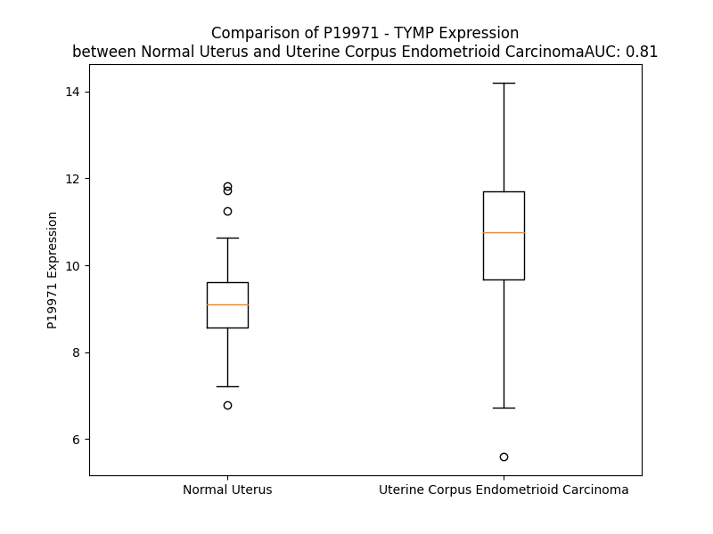

# Detailed Data for P19971

## Introduction to the Detailed Summary

### How to Interpret the Results

- **Summary & Metrics**: This section provides a quick reference to essential protein attributes, including expression changes, family classification, and biomarker applications. Regulation status (upregulated/downregulated) indicates the protein's behavior in a disease context. Some information comes from the original excel file with the proteins selected from literature, while others are derived from the analyses.
- **Expression Comparison**: A visual representation comparing protein expression between normal and disease states. It highlights significant changes in expression levels that might indicate diagnostic or therapeutic relevance. This is data coming from transcriptomics experiments and could not translate similarly to protein levels.
- **Isoform Alignment**: An interactive view of isoform alignments, revealing structural and functional differences between variants of the protein.
- **Interactors & Homologs**: Tables listing known interaction partners and homologous proteins, the more interactors and homologs, the more complex the protein is to design an antibody for.
- **Biological Assemblies**: Information about the structural arrangement of the protein in different assemblies, providing insights into its functional state but also the complexity of the protein to develop antibodies.
- **Combined Per-Residue Information**: A detailed table summarizing residue-level data. This includes predictions for epitope regions, aggregation tendencies, and modifications that might impact the protein's function. Each row corresponds to a residue in the protein, providing insights into specific sites that may be important for research or drug development.
## Summary & Metrics

- **UniProt Accession**: P19971
- **Gene Name**: TYMP
- **Protein Name**: Thymidine phosphorylase
- **Swiss Prot**: TYPH_HUMAN
- **Family**: growth factor
- **Biomarker Application**: diagnosis,efficacy,prognosis,response to therapy
- **Number of Isoforms**: 2
- **Regulation**: 2
- **(transcriptomics) AUC**: 0.81
- **(transcriptomics) Fold Change**: 1.17
- **(transcriptomics) Regulation**: Upregulated
- **Discotope Epitope Count**: 83
- **Max n_uniprots (Homo)**: 2
- **Max n_uniprots (Hetero)**: N/A

## Expression Comparison

## Isoform Alignment

<pre style='font-size:14px; font-family:monospace;'>P19971-1 MAALMTPGTGAPPAPGDFSGEGSQGLPDPSPEPKQLPELIRMKRDGGRLSEADIRGFVAAVVNGSAQGAQIGAMLMAIRLRGMDLEETSVLTQALAQSGQQLEWPEAWRQQLVDKHSTGGVGDKVSLVLAPALAACGCKVPMISGRGLGHTGGTLDKLESIPGFNVIQSPEQMQVLLDQAGCCIVGQSEQLVPADGILYAARDVTATVDSLPLITASILSKKLVEGLSALVVDVKFGGAAVFPNQEQARELAKTLVGVGASLGLRVAAALTAMDKPLGRCVGHALEVEEALLCMDGAGPPDLRDLVTTLGGALLWLSGHAGTQAQGAARVAAALDDGSALGRFERMLAAQGVDPGLARALCSGSPAERRQLLPRAREQEELLAPAD-----GTVELVRALPLALVLHELGAGRSRAGEPLRLGVGAELLVDVGQRLRRGTPWLRVHRDGPALSGPQSRALQEALVLSDRAPFAAPSPFAELVLPPQQ
P19971-2 MAALMTPGTGAPPAPGDFSGEGSQGLPDPSPEPKQLPELIRMKRDGGRLSEADIRGFVAAVVNGSAQGAQIGAMLMAIRLRGMDLEETSVLTQALAQSGQQLEWPEAWRQQLVDKHSTGGVGDKVSLVLAPALAACGCKVPMISGRGLGHTGGTLDKLESIPGFNVIQSPEQMQVLLDQAGCCIVGQSEQLVPADGILYAARDVTATVDSLPLITASILSKKLVEGLSALVVDVKFGGAAVFPNQEQARELAKTLVGVGASLGLRVAAALTAMDKPLGRCVGHALEVEEALLCMDGAGPPDLRDLVTTLGGALLWLSGHAGTQAQGAARVAAALDDGSALGRFERMLAAQGVDPGLARALCSGSPAERRQLLPRAREQEELLAPADAPLPAGTVELVRALPLALVLHELGAGRSRAGEPLRLGVGAELLVDVGQRLRRGTPWLRVHRDGPALSGPQSRALQEALVLSDRAPFAAPSPFAELVLPPQQ
</pre>

## Interactors

| preferredName_A   | preferredName_B   |   score |
|:------------------|:------------------|--------:|
| TYMP              | UPP1              |   0.999 |
| TYMP              | CDA               |   0.997 |
| TYMP              | UPP2              |   0.997 |
| TYMP              | DPYD              |   0.996 |
| TYMP              | TK2               |   0.983 |
| TYMP              | UMPS              |   0.981 |
| TYMP              | UPRT              |   0.979 |
| TYMP              | NT5M              |   0.978 |
| TYMP              | PNP               |   0.965 |
| TYMP              | NT5C              |   0.964 |
| TYMP              | DERA              |   0.959 |
| TYMP              | TK1               |   0.948 |
| TYMP              | NT5E              |   0.931 |
| TYMP              | TYMS              |   0.927 |
| TYMP              | CYP2A6            |   0.917 |
| TYMP              | APRT              |   0.915 |
| TYMP              | NT5C1B            |   0.911 |
| TYMP              | NT5C1A            |   0.907 |
| TYMP              | NT5C3A            |   0.907 |
| TYMP              | NT5C2             |   0.906 |
| TYMP              | NT5C1B-RDH14      |   0.902 |

## Homologs

| uniprot_id   | gene_id   |
|--------------|-----------|

## Biological Assemblies

|   Unnamed: 0 |   assembly |   n_uniprots | composition   | crystal_id   |
|-------------:|-----------:|-------------:|:--------------|:-------------|
|            0 |          1 |            2 | Homo          | 2j0f         |
|            1 |          2 |            2 | Homo          | 2j0f         |
|            0 |          1 |            2 | Homo          | 2wk6         |
|            0 |          1 |            1 | Homo          | 1uou         |
|            0 |          1 |            1 | Homo          | 2wk5         |
|            1 |          2 |            1 | Homo          | 2wk5         |
|            2 |          3 |            1 | Homo          | 2wk5         |
|            3 |          4 |            1 | Homo          | 2wk5         |

## Combined Per-Residue Information

|   res | aa   |   epitope_score | epitope   |   relative_surface_accessibility |   modeling_confidence |   Aggregation | modification     |
|------:|:-----|----------------:|:----------|---------------------------------:|----------------------:|--------------:|:-----------------|
|     1 | M    |         0.13433 | False     |                          1.30649 |                 43.51 |         0     | N/A              |
|     2 | A    |         0.12981 | False     |                          1.00613 |                 42.54 |         0     | N/A              |
|     3 | A    |         0.14922 | True      |                          1.04055 |                 45.1  |         0     | N/A              |
|     4 | L    |         0.11928 | False     |                          1.00192 |                 40.64 |         0     | N/A              |
|     5 | M    |         0.22286 | True      |                          1.07225 |                 51.63 |         0     | N/A              |
|     6 | T    |         0.179   | True      |                          0.83818 |                 55.17 |         0     | Phosphothreonine |
|     7 | P    |         0.10508 | False     |                          0.94106 |                 45.24 |         0     | N/A              |
|     8 | G    |         0.11443 | False     |                          1.00083 |                 53.88 |         0     | N/A              |
|     9 | T    |         0.14816 | True      |                          1.02322 |                 43.01 |         0     | N/A              |
|    10 | G    |         0.18414 | True      |                          0.94487 |                 51.5  |         0     | N/A              |
|    11 | A    |         0.24795 | True      |                          0.94808 |                 51.26 |         0     | N/A              |
|    12 | P    |         0.14302 | False     |                          0.89695 |                 50.73 |         0     | N/A              |
|    13 | P    |         0.09732 | False     |                          0.97469 |                 60.55 |         0     | N/A              |
|    14 | A    |         0.17561 | True      |                          0.91282 |                 54.02 |         0     | N/A              |
|    15 | P    |         0.14167 | False     |                          1.00733 |                 43.76 |         0     | N/A              |
|    16 | G    |         0.09259 | False     |                          0.76828 |                 47.23 |         0     | N/A              |
|    17 | D    |         0.16971 | True      |                          0.9389  |                 38.14 |         0     | N/A              |
|    18 | F    |         0.17001 | True      |                          1.00942 |                 46.97 |         0     | N/A              |
|    19 | S    |         0.20792 | True      |                          0.97326 |                 39.89 |         0     | N/A              |
|    20 | G    |         0.1456  | False     |                          0.72624 |                 41.69 |         0     | N/A              |
|    21 | E    |         0.12272 | False     |                          0.97586 |                 38.84 |         0     | N/A              |
|    22 | G    |         0.11647 | False     |                          0.76021 |                 37.85 |         0     | N/A              |
|    23 | S    |         0.12862 | False     |                          0.87016 |                 43.28 |         0     | N/A              |
|    24 | Q    |         0.19778 | True      |                          0.87576 |                 42.97 |         0     | N/A              |
|    25 | G    |         0.24637 | True      |                          0.77877 |                 40.38 |         0     | N/A              |
|    26 | L    |         0.13761 | False     |                          1.00575 |                 47.86 |         0     | N/A              |
|    27 | P    |         0.19371 | True      |                          0.87773 |                 49.32 |         0     | N/A              |
|    28 | D    |         0.16379 | True      |                          0.82278 |                 44.68 |         0     | N/A              |
|    29 | P    |         0.15479 | True      |                          0.84778 |                 44.83 |         0     | N/A              |
|    30 | S    |         0.15191 | True      |                          0.75937 |                 54.9  |         0     | N/A              |
|    31 | P    |         0.14795 | True      |                          0.92942 |                 64.37 |         0     | N/A              |
|    32 | E    |         0.16114 | True      |                          0.80488 |                 70.77 |         0     | N/A              |
|    33 | P    |         0.11936 | False     |                          0.84942 |                 82.26 |         0     | N/A              |
|    34 | K    |         0.11658 | False     |                          0.42673 |                 91.36 |         0     | N/A              |
|    35 | Q    |         0.21622 | True      |                          0.58841 |                 95.12 |         0     | N/A              |
|    36 | L    |         0.04307 | False     |                          0.14615 |                 97.13 |         0     | N/A              |
|    37 | P    |         0.14938 | True      |                          0.54951 |                 97.83 |         0     | N/A              |
|    38 | E    |         0.16124 | True      |                          0.40152 |                 97.81 |         0     | N/A              |
|    39 | L    |         0.02674 | False     |                          0.01649 |                 97.77 |         0     | N/A              |
|    40 | I    |         0.10715 | False     |                          0.15279 |                 98.53 |         0     | N/A              |
|    41 | R    |         0.25136 | True      |                          0.54315 |                 98.5  |         0     | N/A              |
|    42 | M    |         0.06694 | False     |                          0.32297 |                 98.29 |         0     | N/A              |
|    43 | K    |         0.04133 | False     |                          0.03512 |                 98.61 |         0     | N/A              |
|    44 | R    |         0.15907 | True      |                          0.4938  |                 98.51 |         0     | N/A              |
|    45 | D    |         0.16798 | True      |                          0.51573 |                 98.52 |         0     | N/A              |
|    46 | G    |         0.1475  | False     |                          0.55588 |                 98.1  |         0     | N/A              |
|    47 | G    |         0.11771 | False     |                          0.35119 |                 98.08 |         0     | N/A              |
|    48 | R    |         0.1728  | True      |                          0.43975 |                 98.08 |         0     | N/A              |
|    49 | L    |         0.02869 | False     |                          0.03178 |                 98.34 |         0     | N/A              |
|    50 | S    |         0.07677 | False     |                          0.39949 |                 97.8  |         0     | N/A              |
|    51 | E    |         0.03911 | False     |                          0.45428 |                 97.88 |         0     | N/A              |
|    52 | A    |         0.06084 | False     |                          0.73069 |                 97.67 |         0.024 | N/A              |
|    53 | D    |         0.04018 | False     |                          0.05099 |                 98.06 |         0.053 | N/A              |
|    54 | I    |         0.01563 | False     |                          0.0168  |                 98.48 |         0.053 | N/A              |
|    55 | R    |         0.08028 | False     |                          0.31345 |                 97.96 |         0.053 | N/A              |
|    56 | G    |         0.05265 | False     |                          0.41977 |                 97.67 |         5.744 | N/A              |
|    57 | F    |         0.01473 | False     |                          0.03004 |                 98.38 |        68.813 | N/A              |
|    58 | V    |         0.01715 | False     |                          0.03142 |                 98.37 |        81.859 | N/A              |
|    59 | A    |         0.06325 | False     |                          0.49898 |                 97.11 |        81.9   | N/A              |
|    60 | A    |         0.01769 | False     |                          0.07417 |                 97.95 |        81.9   | N/A              |
|    61 | V    |         0.01264 | False     |                          0.02534 |                 97.75 |        81.864 | N/A              |
|    62 | V    |         0.07255 | False     |                          0.44144 |                 96.22 |        76.685 | N/A              |
|    63 | N    |         0.16012 | True      |                          0.65202 |                 96.16 |         3.166 | N/A              |
|    64 | G    |         0.13476 | False     |                          0.68066 |                 96.15 |         0.264 | N/A              |
|    65 | S    |         0.15427 | True      |                          0.56506 |                 96.95 |         0.024 | N/A              |
|    66 | A    |         0.03519 | False     |                          0.06599 |                 97.59 |         0     | N/A              |
|    67 | Q    |         0.15196 | True      |                          0.6114  |                 97.78 |         0     | N/A              |
|    68 | G    |         0.08954 | False     |                          0.7144  |                 96.39 |         0     | N/A              |
|    69 | A    |         0.12522 | False     |                          0.75595 |                 98.1  |         0     | N/A              |
|    70 | Q    |         0.06188 | False     |                          0.19786 |                 98.51 |         0     | N/A              |
|    71 | I    |         0.03922 | False     |                          0.0584  |                 98.53 |         1.648 | N/A              |
|    72 | G    |         0.05157 | False     |                          0.16594 |                 98.2  |         1.648 | N/A              |
|    73 | A    |         0.06466 | False     |                          0.41706 |                 98.73 |         2.726 | N/A              |
|    74 | M    |         0.00625 | False     |                          0.00288 |                 98.81 |         4.002 | N/A              |
|    75 | L    |         0.00418 | False     |                          0.00082 |                 98.71 |         4.002 | N/A              |
|    76 | M    |         0.11229 | False     |                          0.38898 |                 98.74 |         3.727 | N/A              |
|    77 | A    |         0.03445 | False     |                          0.06779 |                 98.77 |         3.412 | N/A              |
|    78 | I    |         0.01789 | False     |                          0.02417 |                 98.81 |         3.412 | N/A              |
|    79 | R    |         0.09966 | False     |                          0.30946 |                 98.41 |         0     | N/A              |
|    80 | L    |         0.18772 | True      |                          0.83191 |                 98.56 |         0     | N/A              |
|    81 | R    |         0.26383 | True      |                          0.57002 |                 98.48 |         0     | N/A              |
|    82 | G    |         0.09343 | False     |                          0.31762 |                 97.9  |         0     | N/A              |
|    83 | M    |         0.04639 | False     |                          0.13812 |                 98.36 |         0     | N/A              |
|    84 | D    |         0.0684  | False     |                          0.39265 |                 96.31 |         0     | N/A              |
|    85 | L    |         0.07554 | False     |                          0.70454 |                 94.92 |         0     | N/A              |
|    86 | E    |         0.09007 | False     |                          0.54077 |                 96.11 |         0     | N/A              |
|    87 | E    |         0.018   | False     |                          0.02239 |                 98.22 |         0     | N/A              |
|    88 | T    |         0.00835 | False     |                          0.01665 |                 98.23 |         0     | N/A              |
|    89 | S    |         0.02719 | False     |                          0.11325 |                 97.6  |         0     | N/A              |
|    90 | V    |         0.03742 | False     |                          0.10378 |                 98.2  |         0.739 | N/A              |
|    91 | L    |         0.00537 | False     |                          0.01649 |                 98.68 |         0.739 | N/A              |
|    92 | T    |         0.00195 | False     |                          0       |                 98.37 |         0.739 | N/A              |
|    93 | Q    |         0.05675 | False     |                          0.26942 |                 98.05 |         0.739 | N/A              |
|    94 | A    |         0.02508 | False     |                          0.05379 |                 98.26 |         0.739 | N/A              |
|    95 | L    |         0.01124 | False     |                          0.01896 |                 97.92 |         0.739 | N/A              |
|    96 | A    |         0.00802 | False     |                          0.07025 |                 96.22 |         0.338 | N/A              |
|    97 | Q    |         0.08523 | False     |                          0.56882 |                 96.71 |         0     | N/A              |
|    98 | S    |         0.08421 | False     |                          0.18699 |                 95.61 |         0     | N/A              |
|    99 | G    |         0.05598 | False     |                          0.31062 |                 92.43 |         0     | N/A              |
|   100 | Q    |         0.14082 | False     |                          0.42812 |                 92.55 |         0     | N/A              |
|   101 | Q    |         0.0943  | False     |                          0.49734 |                 93.07 |         0     | N/A              |
|   102 | L    |         0.04257 | False     |                          0.04846 |                 95.2  |         0     | N/A              |
|   103 | E    |         0.12526 | False     |                          0.70976 |                 95.79 |         0     | N/A              |
|   104 | W    |         0.06543 | False     |                          0.15114 |                 97.73 |         0     | N/A              |
|   105 | P    |         0.131   | False     |                          0.47971 |                 97.25 |         0     | N/A              |
|   106 | E    |         0.23492 | True      |                          0.63383 |                 96.83 |         0     | N/A              |
|   107 | A    |         0.17507 | True      |                          0.75891 |                 97.79 |         0     | N/A              |
|   108 | W    |         0.11793 | False     |                          0.12962 |                 98.19 |         0     | N/A              |
|   109 | R    |         0.17563 | True      |                          0.61611 |                 97.1  |         0     | N/A              |
|   110 | Q    |         0.12947 | False     |                          0.50792 |                 96.93 |         0     | N/A              |
|   111 | Q    |         0.04402 | False     |                          0.24208 |                 98.2  |         0     | N/A              |
|   112 | L    |         0.0093  | False     |                          0.01978 |                 98.69 |         0     | N/A              |
|   113 | V    |         0.00132 | False     |                          0.0019  |                 98.77 |         0     | N/A              |
|   114 | D    |         0.00138 | False     |                          0       |                 98.72 |         0     | N/A              |
|   115 | K    |         0.00757 | False     |                          0.0134  |                 98.41 |         0     | N/A              |
|   116 | H    |         0.02514 | False     |                          0.12198 |                 97.7  |         0     | N/A              |
|   117 | S    |         0.02248 | False     |                          0.19128 |                 95.87 |         0     | N/A              |
|   118 | T    |         0.02757 | False     |                          0.12323 |                 93.14 |         0     | N/A              |
|   119 | G    |         0.08191 | False     |                          0.20395 |                 88.69 |         0     | N/A              |
|   120 | G    |         0.01382 | False     |                          0.01585 |                 92.34 |         0     | N/A              |
|   121 | V    |         0.02251 | False     |                          0.019   |                 95.6  |         0     | N/A              |
|   122 | G    |         0.0102  | False     |                          0.02765 |                 96.69 |         0     | N/A              |
|   123 | D    |         0.04103 | False     |                          0.09533 |                 97.4  |         0     | N/A              |
|   124 | K    |         0.00358 | False     |                          0.00659 |                 98.21 |         0     | N/A              |
|   125 | V    |         0.00268 | False     |                          0       |                 98.59 |        46.513 | N/A              |
|   126 | S    |         0.01102 | False     |                          0.08061 |                 98.7  |        46.513 | N/A              |
|   127 | L    |         0.00158 | False     |                          0.00247 |                 98.82 |        46.597 | N/A              |
|   128 | V    |         0.00102 | False     |                          0       |                 98.9  |        46.597 | N/A              |
|   129 | L    |         0.00141 | False     |                          0.00165 |                 98.82 |        46.597 | N/A              |
|   130 | A    |         0.00128 | False     |                          0.00237 |                 98.89 |         0.683 | N/A              |
|   131 | P    |         0.00241 | False     |                          0       |                 98.91 |         0.416 | N/A              |
|   132 | A    |         0.00102 | False     |                          0       |                 98.89 |         0     | N/A              |
|   133 | L    |         0.00227 | False     |                          0.00495 |                 98.9  |         0     | N/A              |
|   134 | A    |         0.00678 | False     |                          0.09805 |                 98.88 |         0     | N/A              |
|   135 | A    |         0.02584 | False     |                          0.31771 |                 98.79 |         0     | N/A              |
|   136 | C    |         0.02384 | False     |                          0.08206 |                 98.71 |         0     | N/A              |
|   137 | G    |         0.06879 | False     |                          0.54433 |                 98.32 |         0     | N/A              |
|   138 | C    |         0.00938 | False     |                          0.0148  |                 98.79 |         0     | N/A              |
|   139 | K    |         0.06228 | False     |                          0.16648 |                 98.83 |         0     | N/A              |
|   140 | V    |         0.00112 | False     |                          0       |                 98.86 |         0     | N/A              |
|   141 | P    |         0.00274 | False     |                          0       |                 98.51 |         0     | N/A              |
|   142 | M    |         0.00699 | False     |                          0.01866 |                 98.52 |         0     | N/A              |
|   143 | I    |         0.00267 | False     |                          0       |                 96.16 |         0     | N/A              |
|   144 | S    |         0.01985 | False     |                          0.07132 |                 93.1  |         0     | N/A              |
|   145 | G    |         0.05019 | False     |                          0.12765 |                 86.75 |         0     | N/A              |
|   146 | R    |         0.06962 | False     |                          0.35455 |                 90.55 |         0     | N/A              |
|   147 | G    |         0.13478 | False     |                          0.2888  |                 83.79 |         0     | N/A              |
|   148 | L    |         0.07534 | False     |                          0.13773 |                 76.62 |         0     | N/A              |
|   149 | G    |         0.16655 | True      |                          0.51027 |                 76.36 |         0     | N/A              |
|   150 | H    |         0.19537 | True      |                          0.26709 |                 80.77 |         0     | N/A              |
|   151 | T    |         0.09232 | False     |                          0.09509 |                 77.27 |         0     | N/A              |
|   152 | G    |         0.11527 | False     |                          0.40331 |                 81.96 |         0     | N/A              |
|   153 | G    |         0.0268  | False     |                          0.07725 |                 91.91 |         0     | N/A              |
|   154 | T    |         0.01816 | False     |                          0.1364  |                 96.1  |         0     | N/A              |
|   155 | L    |         0.02784 | False     |                          0.02473 |                 95.26 |         0     | N/A              |
|   156 | D    |         0.01178 | False     |                          0.00568 |                 95.13 |         0     | N/A              |
|   157 | K    |         0.01074 | False     |                          0.01    |                 98.05 |         0     | N/A              |
|   158 | L    |         0.00247 | False     |                          0       |                 98.53 |         0     | N/A              |
|   159 | E    |         0.05347 | False     |                          0.27688 |                 97.6  |         0     | N/A              |
|   160 | S    |         0.00534 | False     |                          0.00719 |                 98.07 |         0     | N/A              |
|   161 | I    |         0.01063 | False     |                          0.00671 |                 98.74 |         0     | N/A              |
|   162 | P    |         0.10822 | False     |                          0.46961 |                 98.44 |         0     | N/A              |
|   163 | G    |         0.09725 | False     |                          0.62843 |                 98.03 |         0.337 | N/A              |
|   164 | F    |         0.06237 | False     |                          0.07439 |                 98.6  |         0.483 | N/A              |
|   165 | N    |         0.13936 | False     |                          0.44826 |                 97.23 |         0.483 | N/A              |
|   166 | V    |         0.02715 | False     |                          0.04244 |                 96.12 |         0.483 | N/A              |
|   167 | I    |         0.15362 | True      |                          0.66575 |                 94.3  |         0.483 | N/A              |
|   168 | Q    |         0.07681 | False     |                          0.07905 |                 95.29 |         0.146 | N/A              |
|   169 | S    |         0.11691 | False     |                          0.23654 |                 93.86 |         0     | N/A              |
|   170 | P    |         0.04842 | False     |                          0.10653 |                 93.28 |         0     | N/A              |
|   171 | E    |         0.23154 | True      |                          0.55353 |                 94.98 |         0     | N/A              |
|   172 | Q    |         0.08111 | False     |                          0.45207 |                 96.64 |         0     | N/A              |
|   173 | M    |         0.00388 | False     |                          0       |                 97.87 |         0.129 | N/A              |
|   174 | Q    |         0.11127 | False     |                          0.34385 |                 97.1  |         0.129 | N/A              |
|   175 | V    |         0.16508 | True      |                          0.54812 |                 98.14 |         0.129 | N/A              |
|   176 | L    |         0.03538 | False     |                          0.0338  |                 98.56 |         0.129 | N/A              |
|   177 | L    |         0.0033  | False     |                          0       |                 98.57 |         0.129 | N/A              |
|   178 | D    |         0.15552 | True      |                          0.58377 |                 98.11 |         0     | N/A              |
|   179 | Q    |         0.07089 | False     |                          0.41379 |                 98.01 |         0     | N/A              |
|   180 | A    |         0.00318 | False     |                          0       |                 98.67 |         0     | N/A              |
|   181 | G    |         0.02577 | False     |                          0.08464 |                 98.77 |         0     | N/A              |
|   182 | C    |         0.00151 | False     |                          0       |                 98.87 |         0     | N/A              |
|   183 | C    |         0.00259 | False     |                          0       |                 98.75 |         0     | N/A              |
|   184 | I    |         0.00172 | False     |                          0       |                 98.62 |         0     | N/A              |
|   185 | V    |         0.00557 | False     |                          0.00286 |                 97.04 |         0     | N/A              |
|   186 | G    |         0.04297 | False     |                          0.06522 |                 91.87 |         0     | N/A              |
|   187 | Q    |         0.06242 | False     |                          0.20352 |                 88.34 |         0     | N/A              |
|   188 | S    |         0.06275 | False     |                          0.20398 |                 86.06 |         0     | N/A              |
|   189 | E    |         0.1308  | False     |                          0.84727 |                 87.55 |         0     | N/A              |
|   190 | Q    |         0.11784 | False     |                          0.36995 |                 87.47 |         0     | N/A              |
|   191 | L    |         0.00739 | False     |                          0.00247 |                 89.3  |         0     | N/A              |
|   192 | V    |         0.00677 | False     |                          0       |                 92.16 |         0     | N/A              |
|   193 | P    |         0.03957 | False     |                          0.1447  |                 93.81 |         0     | N/A              |
|   194 | A    |         0.00276 | False     |                          0       |                 96.51 |         0     | N/A              |
|   195 | D    |         0.01639 | False     |                          0.00736 |                 95.58 |         0     | N/A              |
|   196 | G    |         0.05781 | False     |                          0.30027 |                 90.56 |         3.031 | N/A              |
|   197 | I    |         0.11476 | False     |                          0.41282 |                 93.83 |        10.989 | N/A              |
|   198 | L    |         0.02696 | False     |                          0.02968 |                 95.65 |        10.989 | N/A              |
|   199 | Y    |         0.0704  | False     |                          0.19649 |                 91.16 |        10.989 | N/A              |
|   200 | A    |         0.09639 | False     |                          0.45982 |                 87.85 |        10.989 | N/A              |
|   201 | A    |         0.03688 | False     |                          0.19625 |                 92.33 |         8.675 | N/A              |
|   202 | R    |         0.04246 | False     |                          0.0255  |                 91.84 |         0     | N/A              |
|   203 | D    |         0.15467 | True      |                          0.31261 |                 84.8  |         0     | N/A              |
|   204 | V    |         0.17007 | True      |                          0.67087 |                 84.4  |         2.521 | N/A              |
|   205 | T    |         0.13533 | False     |                          0.31773 |                 90.71 |         2.521 | N/A              |
|   206 | A    |         0.14249 | False     |                          0.70859 |                 91.68 |         2.521 | N/A              |
|   207 | T    |         0.00664 | False     |                          0       |                 95.13 |         2.521 | N/A              |
|   208 | V    |         0.07588 | False     |                          0.16947 |                 90.89 |         2.521 | N/A              |
|   209 | D    |         0.09115 | False     |                          0.3068  |                 92.23 |         0     | N/A              |
|   210 | S    |         0.04551 | False     |                          0.03599 |                 95.7  |         0     | N/A              |
|   211 | L    |         0.02773 | False     |                          0.23756 |                 96.34 |         0     | N/A              |
|   212 | P    |         0.01474 | False     |                          0.0835  |                 97.94 |         0     | N/A              |
|   213 | L    |         0.01249 | False     |                          0.02889 |                 97.79 |         7.24  | N/A              |
|   214 | I    |         0.01896 | False     |                          0.0632  |                 96.18 |         8.491 | N/A              |
|   215 | T    |         0.00232 | False     |                          0       |                 98.01 |         8.491 | N/A              |
|   216 | A    |         0.00165 | False     |                          0.00128 |                 98.03 |         8.491 | N/A              |
|   217 | S    |         0.02916 | False     |                          0.03861 |                 95.68 |         8.491 | N/A              |
|   218 | I    |         0.01092 | False     |                          0.056   |                 96.54 |         8.282 | N/A              |
|   219 | L    |         0.00336 | False     |                          0.00247 |                 97.92 |         5.582 | N/A              |
|   220 | S    |         0.0013  | False     |                          0       |                 96.85 |         0.204 | N/A              |
|   221 | K    |         0.00876 | False     |                          0.01376 |                 96.03 |         0     | N/A              |
|   222 | K    |         0.00272 | False     |                          0       |                 97.65 |         0.757 | N/A              |
|   223 | L    |         0.04797 | False     |                          0.1857  |                 96.51 |         0.757 | N/A              |
|   224 | V    |         0.00445 | False     |                          0.0019  |                 95.6  |         0.757 | N/A              |
|   225 | E    |         0.00275 | False     |                          0       |                 97.39 |         0.757 | N/A              |
|   226 | G    |         0.04407 | False     |                          0.37107 |                 96.28 |         1.138 | N/A              |
|   227 | L    |         0.02254 | False     |                          0.11139 |                 98.04 |         5.994 | N/A              |
|   228 | S    |         0.0259  | False     |                          0.18821 |                 97.19 |         8.12  | N/A              |
|   229 | A    |         0.00135 | False     |                          0       |                 98.16 |        16.38  | N/A              |
|   230 | L    |         0.00334 | False     |                          0       |                 98.56 |        26.155 | N/A              |
|   231 | V    |         0.00199 | False     |                          0       |                 98.51 |        27.947 | N/A              |
|   232 | V    |         0.0013  | False     |                          0       |                 98.45 |        27.849 | N/A              |
|   233 | D    |         0.00144 | False     |                          0       |                 97.95 |        22.968 | N/A              |
|   234 | V    |         0.00176 | False     |                          0.0019  |                 97.56 |        22.968 | N/A              |
|   235 | K    |         0.00912 | False     |                          0.03212 |                 95.8  |        22.968 | N/A              |
|   236 | F    |         0.07691 | False     |                          0.12994 |                 96.01 |        21.529 | N/A              |
|   237 | G    |         0.0481  | False     |                          0.06438 |                 93.65 |         2.784 | N/A              |
|   238 | G    |         0.24744 | True      |                          0.51151 |                 90.71 |         1.196 | N/A              |
|   239 | A    |         0.03789 | False     |                          0.01058 |                 90.3  |         1.196 | N/A              |
|   240 | A    |         0.03865 | False     |                          0.05468 |                 91.21 |         1.196 | N/A              |
|   241 | V    |         0.06867 | False     |                          0.20971 |                 88.76 |         1.196 | N/A              |
|   242 | F    |         0.10132 | False     |                          0.06238 |                 90.48 |         0     | N/A              |
|   243 | P    |         0.17053 | True      |                          0.57562 |                 90.1  |         0     | N/A              |
|   244 | N    |         0.18408 | True      |                          0.5317  |                 92.47 |         0     | N/A              |
|   245 | Q    |         0.20278 | True      |                          0.3595  |                 93.63 |         0     | N/A              |
|   246 | E    |         0.22948 | True      |                          0.7164  |                 95.32 |         0     | N/A              |
|   247 | Q    |         0.16616 | True      |                          0.37252 |                 93.89 |         0     | N/A              |
|   248 | A    |         0.00153 | False     |                          0       |                 95.81 |         0     | N/A              |
|   249 | R    |         0.08517 | False     |                          0.2728  |                 96.19 |         0     | N/A              |
|   250 | E    |         0.16488 | True      |                          0.46449 |                 96.06 |         0     | N/A              |
|   251 | L    |         0.00415 | False     |                          0.00165 |                 96.88 |         0     | N/A              |
|   252 | A    |         0.00263 | False     |                          0       |                 97.34 |         0     | N/A              |
|   253 | K    |         0.14264 | False     |                          0.60001 |                 96.49 |         0     | N/A              |
|   254 | T    |         0.02388 | False     |                          0.15116 |                 96.56 |         0.882 | N/A              |
|   255 | L    |         0.00187 | False     |                          0       |                 97.59 |         1.013 | N/A              |
|   256 | V    |         0.02464 | False     |                          0.0219  |                 96.8  |         1.013 | N/A              |
|   257 | G    |         0.06519 | False     |                          0.37432 |                 94.78 |         1.013 | N/A              |
|   258 | V    |         0.01154 | False     |                          0.01796 |                 95.72 |         1.013 | N/A              |
|   259 | G    |         0.00508 | False     |                          0.00322 |                 95.97 |         0.131 | N/A              |
|   260 | A    |         0.03698 | False     |                          0.2778  |                 93.93 |         0     | N/A              |
|   261 | S    |         0.10999 | False     |                          0.62553 |                 93.19 |         0     | N/A              |
|   262 | L    |         0.0883  | False     |                          0.24613 |                 93.93 |         0     | N/A              |
|   263 | G    |         0.11402 | False     |                          0.89304 |                 93.04 |         0     | N/A              |
|   264 | L    |         0.05752 | False     |                          0.04571 |                 95.44 |         0     | N/A              |
|   265 | R    |         0.08224 | False     |                          0.4867  |                 96.52 |         0     | N/A              |
|   266 | V    |         0.00308 | False     |                          0.00082 |                 97.39 |         5.547 | N/A              |
|   267 | A    |         0.01485 | False     |                          0.0102  |                 97.57 |         5.804 | N/A              |
|   268 | A    |         0.00168 | False     |                          0       |                 97.9  |         6.148 | N/A              |
|   269 | A    |         0.00287 | False     |                          0       |                 97.67 |         6.556 | N/A              |
|   270 | L    |         0.00545 | False     |                          0       |                 97.61 |         6.556 | N/A              |
|   271 | T    |         0.00694 | False     |                          0.0019  |                 97.04 |         5.754 | N/A              |
|   272 | A    |         0.02418 | False     |                          0.34769 |                 94.76 |         5.277 | N/A              |
|   273 | M    |         0.0133  | False     |                          0.02948 |                 90.47 |         2.004 | N/A              |
|   274 | D    |         0.14549 | False     |                          0.4094  |                 92.08 |         0     | N/A              |
|   275 | K    |         0.04911 | False     |                          0.16819 |                 94.74 |         0     | N/A              |
|   276 | P    |         0.00771 | False     |                          0.01496 |                 96.33 |         0     | N/A              |
|   277 | L    |         0.02301 | False     |                          0.06171 |                 96.57 |         0     | N/A              |
|   278 | G    |         0.02366 | False     |                          0.09226 |                 96.97 |         0     | N/A              |
|   279 | R    |         0.08397 | False     |                          0.32846 |                 97.99 |         0     | N/A              |
|   280 | C    |         0.02785 | False     |                          0.09728 |                 98.43 |         0     | N/A              |
|   281 | V    |         0.0176  | False     |                          0.0914  |                 98.22 |         0     | N/A              |
|   282 | G    |         0.01392 | False     |                          0.08094 |                 97.32 |         0     | N/A              |
|   283 | H    |         0.00675 | False     |                          0.01904 |                 97.96 |         0     | N/A              |
|   284 | A    |         0.00419 | False     |                          0.01002 |                 98.4  |         0     | N/A              |
|   285 | L    |         0.02251 | False     |                          0.07231 |                 98.59 |         0     | N/A              |
|   286 | E    |         0.00721 | False     |                          0.01288 |                 98.74 |         0     | N/A              |
|   287 | V    |         0.00244 | False     |                          0.00095 |                 98.78 |         0     | N/A              |
|   288 | E    |         0.029   | False     |                          0.11286 |                 98.61 |         0     | N/A              |
|   289 | E    |         0.02399 | False     |                          0.04012 |                 98.73 |         0     | N/A              |
|   290 | A    |         0.00327 | False     |                          0       |                 98.82 |         0     | N/A              |
|   291 | L    |         0.0043  | False     |                          0.00165 |                 98.81 |         0     | N/A              |
|   292 | L    |         0.04729 | False     |                          0.35942 |                 98.52 |         0     | N/A              |
|   293 | C    |         0.00212 | False     |                          0.00281 |                 98.64 |         0     | N/A              |
|   294 | M    |         0.00289 | False     |                          0.00106 |                 98.76 |         0     | N/A              |
|   295 | D    |         0.12826 | False     |                          0.39053 |                 98.32 |         0     | N/A              |
|   296 | G    |         0.05308 | False     |                          0.36325 |                 97.63 |         0     | N/A              |
|   297 | A    |         0.09875 | False     |                          0.43997 |                 97.02 |         0     | N/A              |
|   298 | G    |         0.05627 | False     |                          0.32369 |                 94.75 |         0     | N/A              |
|   299 | P    |         0.06505 | False     |                          0.0838  |                 95.85 |         0     | N/A              |
|   300 | P    |         0.09668 | False     |                          0.82996 |                 95.15 |         0     | N/A              |
|   301 | D    |         0.03255 | False     |                          0.13505 |                 96.11 |         0     | N/A              |
|   302 | L    |         0.00158 | False     |                          0       |                 97.69 |         0     | N/A              |
|   303 | R    |         0.05921 | False     |                          0.21637 |                 97.73 |         0     | N/A              |
|   304 | D    |         0.04949 | False     |                          0.32553 |                 96.85 |         0     | N/A              |
|   305 | L    |         0.00267 | False     |                          0.00577 |                 97.65 |        50.82  | N/A              |
|   306 | V    |         0.0009  | False     |                          0       |                 98.49 |        51.809 | N/A              |
|   307 | T    |         0.03259 | False     |                          0.11462 |                 98.41 |        51.985 | N/A              |
|   308 | T    |         0.02874 | False     |                          0.17396 |                 98.06 |        52.335 | N/A              |
|   309 | L    |         0.00292 | False     |                          0.00391 |                 98.51 |        52.985 | N/A              |
|   310 | G    |         0.0016  | False     |                          0       |                 98.65 |        45.228 | N/A              |
|   311 | G    |         0.00238 | False     |                          0       |                 98.25 |        45.936 | N/A              |
|   312 | A    |         0.00684 | False     |                          0.02096 |                 97.77 |        59.557 | N/A              |
|   313 | L    |         0.00142 | False     |                          0.00069 |                 98.27 |        61.449 | N/A              |
|   314 | L    |         0.00247 | False     |                          0.00082 |                 98.62 |        61.198 | N/A              |
|   315 | W    |         0.09366 | False     |                          0.37569 |                 97.7  |        59.831 | N/A              |
|   316 | L    |         0.02341 | False     |                          0.04778 |                 96.64 |        53.715 | N/A              |
|   317 | S    |         0.00632 | False     |                          0.01107 |                 96.94 |         8.006 | N/A              |
|   318 | G    |         0.09723 | False     |                          0.76809 |                 97.03 |         0.638 | N/A              |
|   319 | H    |         0.101   | False     |                          0.26605 |                 97.8  |         0     | N/A              |
|   320 | A    |         0.03135 | False     |                          0.06244 |                 98.13 |         0     | N/A              |
|   321 | G    |         0.15122 | True      |                          0.73218 |                 97.67 |         0     | N/A              |
|   322 | T    |         0.12259 | False     |                          0.53089 |                 97.59 |         0     | N/A              |
|   323 | Q    |         0.08391 | False     |                          0.2859  |                 96.58 |         0     | N/A              |
|   324 | A    |         0.09561 | False     |                          0.70461 |                 97.79 |         0     | N/A              |
|   325 | Q    |         0.10124 | False     |                          0.47229 |                 98.52 |         0     | N/A              |
|   326 | G    |         0.00211 | False     |                          0       |                 98.59 |         0     | N/A              |
|   327 | A    |         0.01832 | False     |                          0.20998 |                 98.49 |         0     | N/A              |
|   328 | A    |         0.04976 | False     |                          0.57991 |                 98.74 |         0     | N/A              |
|   329 | R    |         0.07507 | False     |                          0.35406 |                 98.72 |         0     | N/A              |
|   330 | V    |         0.0027  | False     |                          0       |                 98.83 |         2.286 | N/A              |
|   331 | A    |         0.03164 | False     |                          0.21172 |                 98.77 |         2.286 | N/A              |
|   332 | A    |         0.08585 | False     |                          0.49166 |                 98.76 |         2.286 | N/A              |
|   333 | A    |         0.01984 | False     |                          0.05121 |                 98.81 |         2.286 | N/A              |
|   334 | L    |         0.00741 | False     |                          0.00305 |                 98.73 |         2.286 | N/A              |
|   335 | D    |         0.16324 | True      |                          0.54786 |                 98.68 |         0     | N/A              |
|   336 | D    |         0.12226 | False     |                          0.62486 |                 98.46 |         0     | N/A              |
|   337 | G    |         0.04722 | False     |                          0.39018 |                 98.04 |         0     | N/A              |
|   338 | S    |         0.05227 | False     |                          0.32736 |                 98.73 |         0     | N/A              |
|   339 | A    |         0.00145 | False     |                          0       |                 98.83 |         0     | N/A              |
|   340 | L    |         0.02493 | False     |                          0.15333 |                 98.77 |         0     | N/A              |
|   341 | G    |         0.0886  | False     |                          0.3639  |                 98.78 |         0     | N/A              |
|   342 | R    |         0.07211 | False     |                          0.34714 |                 98.85 |         0     | N/A              |
|   343 | F    |         0.00331 | False     |                          0       |                 98.89 |         0     | N/A              |
|   344 | E    |         0.04812 | False     |                          0.19444 |                 98.87 |         0     | N/A              |
|   345 | R    |         0.10319 | False     |                          0.49561 |                 98.78 |         0     | N/A              |
|   346 | M    |         0.00253 | False     |                          0.00216 |                 98.89 |         0     | N/A              |
|   347 | L    |         0.00449 | False     |                          0.00082 |                 98.83 |         0     | N/A              |
|   348 | A    |         0.05596 | False     |                          0.35763 |                 98.72 |         0     | N/A              |
|   349 | A    |         0.04624 | False     |                          0.28464 |                 98.46 |         0     | N/A              |
|   350 | Q    |         0.00853 | False     |                          0.00288 |                 98.67 |         0     | N/A              |
|   351 | G    |         0.13995 | False     |                          0.59662 |                 98.44 |         0     | N/A              |
|   352 | V    |         0.02103 | False     |                          0.01408 |                 98.75 |         0     | N/A              |
|   353 | D    |         0.13037 | False     |                          0.52588 |                 98.63 |         0     | N/A              |
|   354 | P    |         0.14297 | False     |                          0.68912 |                 98.35 |         0     | N/A              |
|   355 | G    |         0.12835 | False     |                          0.55074 |                 98.54 |         0     | N/A              |
|   356 | L    |         0.07252 | False     |                          0.20706 |                 98.67 |         0     | N/A              |
|   357 | A    |         0.00321 | False     |                          0.00255 |                 98.71 |         0     | N/A              |
|   358 | R    |         0.15696 | True      |                          0.56683 |                 98.64 |         0     | N/A              |
|   359 | A    |         0.06345 | False     |                          0.34994 |                 98.59 |         0     | N/A              |
|   360 | L    |         0.00478 | False     |                          0.00082 |                 98.62 |         0     | N/A              |
|   361 | C    |         0.01688 | False     |                          0.0313  |                 98.61 |         0     | N/A              |
|   362 | S    |         0.18804 | True      |                          0.62453 |                 98.02 |         0     | N/A              |
|   363 | G    |         0.06715 | False     |                          0.11752 |                 97.27 |         0     | N/A              |
|   364 | S    |         0.11686 | False     |                          0.38602 |                 98.02 |         0     | N/A              |
|   365 | P    |         0.06966 | False     |                          0.45001 |                 97.3  |         0     | N/A              |
|   366 | A    |         0.0838  | False     |                          0.51636 |                 97.36 |         0     | N/A              |
|   367 | E    |         0.12599 | False     |                          0.48585 |                 98.19 |         0     | N/A              |
|   368 | R    |         0.03307 | False     |                          0.02255 |                 98.48 |         0     | N/A              |
|   369 | R    |         0.07791 | False     |                          0.39238 |                 97.2  |         0     | N/A              |
|   370 | Q    |         0.13466 | False     |                          0.57875 |                 97.56 |         0     | N/A              |
|   371 | L    |         0.10419 | False     |                          0.36685 |                 98.23 |         0     | N/A              |
|   372 | L    |         0.01932 | False     |                          0.03619 |                 98.44 |         0     | N/A              |
|   373 | P    |         0.06399 | False     |                          0.35261 |                 97.91 |         0     | N/A              |
|   374 | R    |         0.1113  | False     |                          0.49822 |                 97.96 |         0     | N/A              |
|   375 | A    |         0.04068 | False     |                          0.11222 |                 97.74 |         0     | N/A              |
|   376 | R    |         0.18525 | True      |                          0.8131  |                 97.46 |         0     | N/A              |
|   377 | E    |         0.06781 | False     |                          0.49877 |                 98.09 |         0     | N/A              |
|   378 | Q    |         0.06068 | False     |                          0.5088  |                 98.23 |         0     | N/A              |
|   379 | E    |         0.11873 | False     |                          0.24328 |                 98.37 |         0     | N/A              |
|   380 | E    |         0.05387 | False     |                          0.39612 |                 98.6  |         0     | N/A              |
|   381 | L    |         0.06487 | False     |                          0.09563 |                 98.49 |         0     | N/A              |
|   382 | L    |         0.09172 | False     |                          0.56298 |                 98.51 |         0     | N/A              |
|   383 | A    |         0.03168 | False     |                          0.02263 |                 98.42 |         0     | N/A              |
|   384 | P    |         0.11739 | False     |                          0.55915 |                 97.47 |         0     | N/A              |
|   385 | A    |         0.10456 | False     |                          0.4719  |                 97.82 |         0     | N/A              |
|   386 | D    |         0.15359 | True      |                          0.51494 |                 98.35 |         0     | N/A              |
|   387 | G    |         0.01272 | False     |                          0.00966 |                 98.29 |         0     | N/A              |
|   388 | T    |         0.01096 | False     |                          0       |                 98.55 |         0     | N/A              |
|   389 | V    |         0.00709 | False     |                          0.00476 |                 98.12 |         0     | N/A              |
|   390 | E    |         0.11598 | False     |                          0.18737 |                 97.38 |         0     | N/A              |
|   391 | L    |         0.11661 | False     |                          0.2605  |                 96.69 |         0     | N/A              |
|   392 | V    |         0.01088 | False     |                          0.03292 |                 97.52 |         0     | N/A              |
|   393 | R    |         0.12443 | False     |                          0.47653 |                 97.43 |         0     | N/A              |
|   394 | A    |         0.0042  | False     |                          0.00548 |                 96.17 |         0     | N/A              |
|   395 | L    |         0.1512  | True      |                          0.38534 |                 94.81 |         0     | N/A              |
|   396 | P    |         0.07645 | False     |                          0.23063 |                 96.27 |         0.485 | N/A              |
|   397 | L    |         0.00939 | False     |                          0.00247 |                 96.6  |        27.071 | N/A              |
|   398 | A    |         0.02071 | False     |                          0.04819 |                 94.82 |        27.071 | N/A              |
|   399 | L    |         0.15882 | True      |                          0.59208 |                 94.69 |        27.071 | N/A              |
|   400 | V    |         0.03996 | False     |                          0.04951 |                 96.78 |        27.071 | N/A              |
|   401 | L    |         0.00995 | False     |                          0.01896 |                 96.41 |        26.909 | N/A              |
|   402 | H    |         0.0687  | False     |                          0.23301 |                 93.15 |         0.195 | N/A              |
|   403 | E    |         0.09925 | False     |                          0.59501 |                 93.44 |         0     | N/A              |
|   404 | L    |         0.05545 | False     |                          0.10089 |                 94.86 |         0     | N/A              |
|   405 | G    |         0.04787 | False     |                          0.16857 |                 92.62 |         0     | N/A              |
|   406 | A    |         0.0389  | False     |                          0.13055 |                 91.44 |         0     | N/A              |
|   407 | G    |         0.06722 | False     |                          0.20238 |                 86.47 |         0     | N/A              |
|   408 | R    |         0.21481 | True      |                          0.21683 |                 82.14 |         0     | N/A              |
|   409 | S    |         0.18725 | True      |                          0.60522 |                 80.96 |         0     | N/A              |
|   410 | R    |         0.42725 | True      |                          0.75291 |                 79.33 |         0     | N/A              |
|   411 | A    |         0.24994 | True      |                          0.82091 |                 71.86 |         0     | N/A              |
|   412 | G    |         0.20516 | True      |                          0.9028  |                 77.42 |         0     | N/A              |
|   413 | E    |         0.19652 | True      |                          0.35653 |                 84.24 |         0     | N/A              |
|   414 | P    |         0.25056 | True      |                          0.87189 |                 88.29 |         0     | N/A              |
|   415 | L    |         0.11121 | False     |                          0.17072 |                 91.93 |         0     | N/A              |
|   416 | R    |         0.1482  | True      |                          0.44719 |                 95.64 |         0     | N/A              |
|   417 | L    |         0.05629 | False     |                          0.2525  |                 97.11 |         0     | N/A              |
|   418 | G    |         0.01317 | False     |                          0.07431 |                 97.78 |         0     | N/A              |
|   419 | V    |         0.00833 | False     |                          0.00493 |                 97.69 |         0     | N/A              |
|   420 | G    |         0.00162 | False     |                          0       |                 98.17 |         0     | N/A              |
|   421 | A    |         0.00949 | False     |                          0.0076  |                 98.52 |         0     | N/A              |
|   422 | E    |         0.0606  | False     |                          0.22463 |                 98.55 |         0     | N/A              |
|   423 | L    |         0.02649 | False     |                          0.07502 |                 98.41 |         0     | N/A              |
|   424 | L    |         0.04219 | False     |                          0.24799 |                 98.12 |         0     | N/A              |
|   425 | V    |         0.03935 | False     |                          0.05009 |                 97.18 |         0     | N/A              |
|   426 | D    |         0.05047 | False     |                          0.45194 |                 94.68 |         0     | N/A              |
|   427 | V    |         0.0393  | False     |                          0.16953 |                 94.9  |         0     | N/A              |
|   428 | G    |         0.01012 | False     |                          0.02614 |                 95.53 |         0     | N/A              |
|   429 | Q    |         0.1016  | False     |                          0.36196 |                 96.8  |         0     | N/A              |
|   430 | R    |         0.18599 | True      |                          0.43187 |                 97.82 |         0     | N/A              |
|   431 | L    |         0.03154 | False     |                          0.01728 |                 96.68 |         0     | N/A              |
|   432 | R    |         0.19869 | True      |                          0.75973 |                 97.83 |         0     | N/A              |
|   433 | R    |         0.12565 | False     |                          0.73921 |                 98.19 |         0     | N/A              |
|   434 | G    |         0.07582 | False     |                          0.43003 |                 98.29 |         0     | N/A              |
|   435 | T    |         0.12772 | False     |                          0.34787 |                 98.33 |         0     | N/A              |
|   436 | P    |         0.0705  | False     |                          0.33047 |                 98.61 |         0     | N/A              |
|   437 | W    |         0.00734 | False     |                          0       |                 98.64 |         0     | N/A              |
|   438 | L    |         0.00278 | False     |                          0       |                 98.76 |         0     | N/A              |
|   439 | R    |         0.05877 | False     |                          0.24256 |                 98.7  |         0     | N/A              |
|   440 | V    |         0.00409 | False     |                          0       |                 98.66 |         0     | N/A              |
|   441 | H    |         0.02256 | False     |                          0.04468 |                 98.59 |         0     | N/A              |
|   442 | R    |         0.10059 | False     |                          0.06158 |                 97.61 |         0     | N/A              |
|   443 | D    |         0.07728 | False     |                          0.26959 |                 96.27 |         0     | N/A              |
|   444 | G    |         0.13297 | False     |                          0.32204 |                 93.03 |         0     | N/A              |
|   445 | P    |         0.2302  | True      |                          0.83532 |                 95.27 |         0     | N/A              |
|   446 | A    |         0.15455 | True      |                          0.63713 |                 97.09 |         0     | N/A              |
|   447 | L    |         0.04075 | False     |                          0.10527 |                 97.31 |         0     | N/A              |
|   448 | S    |         0.1524  | True      |                          0.37209 |                 97.31 |         0     | N/A              |
|   449 | G    |         0.13658 | False     |                          0.47337 |                 97.57 |         0     | N/A              |
|   450 | P    |         0.19281 | True      |                          0.63797 |                 97.74 |         0     | N/A              |
|   451 | Q    |         0.0853  | False     |                          0.12382 |                 97.84 |         0     | N/A              |
|   452 | S    |         0.04543 | False     |                          0.24762 |                 97.92 |         0     | N/A              |
|   453 | R    |         0.19649 | True      |                          0.58205 |                 98.03 |         0     | N/A              |
|   454 | A    |         0.08131 | False     |                          0.30137 |                 97.8  |         0     | N/A              |
|   455 | L    |         0.00396 | False     |                          0       |                 98.3  |         0     | N/A              |
|   456 | Q    |         0.07148 | False     |                          0.22555 |                 97.94 |         0     | N/A              |
|   457 | E    |         0.14075 | False     |                          0.64711 |                 96.66 |         0     | N/A              |
|   458 | A    |         0.0033  | False     |                          0       |                 97.93 |         2.206 | N/A              |
|   459 | L    |         0.05364 | False     |                          0.09448 |                 98.46 |         2.206 | N/A              |
|   460 | V    |         0.06009 | False     |                          0.26468 |                 98.08 |         2.206 | N/A              |
|   461 | L    |         0.09032 | False     |                          0.28334 |                 98.27 |         2.206 | N/A              |
|   462 | S    |         0.21941 | True      |                          0.22627 |                 97.79 |         2.206 | N/A              |
|   463 | D    |         0.29937 | True      |                          0.82977 |                 97.54 |         0     | N/A              |
|   464 | R    |         0.41294 | True      |                          0.52154 |                 96.38 |         0     | N/A              |
|   465 | A    |         0.23586 | True      |                          0.75578 |                 96.37 |         0     | N/A              |
|   466 | P    |         0.24286 | True      |                          0.67204 |                 95.57 |         0     | N/A              |
|   467 | F    |         0.29886 | True      |                          0.33665 |                 95.58 |         0     | N/A              |
|   468 | A    |         0.1299  | False     |                          0.87801 |                 91.14 |         0     | N/A              |
|   469 | A    |         0.12312 | False     |                          0.50356 |                 88.78 |         0     | N/A              |
|   470 | P    |         0.17453 | True      |                          0.62667 |                 89.69 |         0     | N/A              |
|   471 | S    |         0.14822 | True      |                          0.48313 |                 90.61 |         0     | N/A              |
|   472 | P    |         0.03215 | False     |                          0.05867 |                 91.57 |         0     | N/A              |
|   473 | F    |         0.04768 | False     |                          0.31989 |                 92.55 |         0     | N/A              |
|   474 | A    |         0.25633 | True      |                          0.50004 |                 91.36 |         0     | N/A              |
|   475 | E    |         0.2293  | True      |                          0.30952 |                 94.7  |         0     | N/A              |
|   476 | L    |         0.04928 | False     |                          0.27555 |                 93.91 |         0     | N/A              |
|   477 | V    |         0.03567 | False     |                          0.12187 |                 95.02 |         0     | N/A              |
|   478 | L    |         0.09821 | False     |                          0.47549 |                 91.12 |         0     | N/A              |
|   479 | P    |         0.03375 | False     |                          0.19726 |                 82.71 |         0     | N/A              |
|   480 | P    |         0.16026 | True      |                          0.72541 |                 75.35 |         0     | N/A              |
|   481 | Q    |         0.19134 | True      |                          0.94014 |                 63.66 |         0     | N/A              |
|   482 | Q    |         0.12507 | False     |                          1.11498 |                 45.14 |         0     | N/A              |

