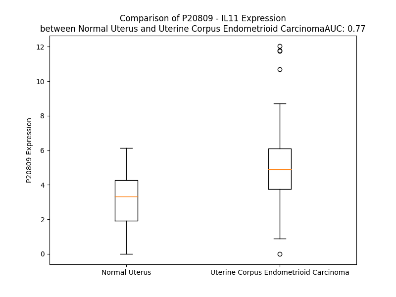

# Detailed Data for P20809

## Introduction to the Detailed Summary

### How to Interpret the Results

- **Summary & Metrics**: This section provides a quick reference to essential protein attributes, including expression changes, family classification, and biomarker applications. Regulation status (upregulated/downregulated) indicates the protein's behavior in a disease context. Some information comes from the original excel file with the proteins selected from literature, while others are derived from the analyses.
- **Expression Comparison**: A visual representation comparing protein expression between normal and disease states. It highlights significant changes in expression levels that might indicate diagnostic or therapeutic relevance. This is data coming from transcriptomics experiments and could not translate similarly to protein levels.
- **Isoform Alignment**: An interactive view of isoform alignments, revealing structural and functional differences between variants of the protein.
- **Interactors & Homologs**: Tables listing known interaction partners and homologous proteins, the more interactors and homologs, the more complex the protein is to design an antibody for.
- **Biological Assemblies**: Information about the structural arrangement of the protein in different assemblies, providing insights into its functional state but also the complexity of the protein to develop antibodies.
- **Combined Per-Residue Information**: A detailed table summarizing residue-level data. This includes predictions for epitope regions, aggregation tendencies, and modifications that might impact the protein's function. Each row corresponds to a residue in the protein, providing insights into specific sites that may be important for research or drug development.
## Summary & Metrics

- **UniProt Accession**: P20809
- **Gene Name**: IL11
- **Protein Name**: Interleukin-11
- **Swiss Prot**: IL11_HUMAN
- **Family**: cytokine
- **Biomarker Application**: unspecified application
- **Number of Isoforms**: 2
- **Regulation**: 1
- **(transcriptomics) AUC**: 0.77
- **(transcriptomics) Fold Change**: 1.56
- **(transcriptomics) Regulation**: Upregulated
- **Discotope Epitope Count**: 50
- **Max n_uniprots (Homo)**: 1.0
- **Max n_uniprots (Hetero)**: 6.0

## Expression Comparison

## Isoform Alignment

<pre style='font-size:14px; font-family:monospace;'>P20809-1 MNCVCRLVLVVLSLWPDTAVAPGPPPGPPRVSPDPRAELDSTVLLTRSLLADTRQLAAQLRDKFPADGDHNLDSLPTLAMSAGALGALQLPGVLTRLRADLLSYLRHVQWLRRAGGSSLKTLEPELGTLQARLDRLLRRLQLLMSRLALPQPPPDPPAPPLAPPSSAWGGIRAAHAILGGLHLTLDWAVRGLLLLKTRL
P20809-2 -------------------------------------------------------------------------------MSAGALGALQLPGVLTRLRADLLSYLRHVQWLRRAGGSSLKTLEPELGTLQARLDRLLRRLQLLMSRLALPQPPPDPPAPPLAPPSSAWGGIRAAHAILGGLHLTLDWAVRGLLLLKTRL
</pre>

## Interactors

| preferredName_A   | preferredName_B   |   score |
|:------------------|:------------------|--------:|
| IL11              | IL11RA            |   0.999 |
| IL11              | IL6ST             |   0.997 |
| IL11              | IL6R              |   0.993 |
| IL11              | IL6               |   0.959 |
| IL11              | OSMR              |   0.956 |
| IL11              | LIFR              |   0.939 |
| IL11              | CNTFR             |   0.937 |
| IL11              | OSM               |   0.936 |
| IL11              | LIF               |   0.932 |
| IL11              | CNTF              |   0.927 |

## Homologs

| uniprot_id   | gene_id   |
|--------------|-----------|

## Biological Assemblies

|   Unnamed: 0 |   assembly |   n_uniprots | composition   | crystal_id   |
|-------------:|-----------:|-------------:|:--------------|:-------------|
|            0 |          1 |            6 | Hetero        | 8dps         |
|            0 |          1 |            1 | Homo          | 8dpv         |
|            0 |          1 |            6 | Hetero        | 8qy4         |
|            0 |          1 |            1 | Homo          | 8dpw         |
|            0 |          1 |            6 | Hetero        | 8dpt         |
|            0 |          1 |            6 | Hetero        | 8dpu         |
|            1 |          2 |            6 | Hetero        | 8dpu         |
|            2 |          3 |            6 | Hetero        | 8dpu         |
|            0 |          1 |            1 | Homo          | 6o4o         |

## Combined Per-Residue Information

|   res | aa   |   epitope_score | epitope   |   relative_surface_accessibility |   modeling_confidence |   Aggregation | modification   |
|------:|:-----|----------------:|:----------|---------------------------------:|----------------------:|--------------:|:---------------|
|     1 | M    |         0.16612 | False     |                          1.18255 |                 54.84 |         0     | N/A            |
|     2 | N    |         0.29425 | False     |                          0.81865 |                 58.79 |         0     | N/A            |
|     3 | C    |         0.1633  | False     |                          0.76847 |                 58.42 |         0.001 | N/A            |
|     4 | V    |         0.1308  | False     |                          0.77023 |                 56.57 |         0.001 | N/A            |
|     5 | C    |         0.12111 | False     |                          0.62807 |                 57.08 |         0.001 | N/A            |
|     6 | R    |         0.14367 | False     |                          0.76447 |                 56.12 |         0.001 | N/A            |
|     7 | L    |         0.11945 | False     |                          0.74565 |                 58.66 |        85.403 | N/A            |
|     8 | V    |         0.06825 | False     |                          0.5868  |                 60.08 |        98.096 | N/A            |
|     9 | L    |         0.10318 | False     |                          0.73537 |                 59.73 |        99.257 | N/A            |
|    10 | V    |         0.08175 | False     |                          0.58648 |                 63.9  |        99.438 | N/A            |
|    11 | V    |         0.10508 | False     |                          0.63855 |                 58.68 |        99.438 | N/A            |
|    12 | L    |         0.15084 | False     |                          0.61954 |                 55.42 |        92.33  | N/A            |
|    13 | S    |         0.12491 | False     |                          0.69482 |                 58.65 |        47.378 | N/A            |
|    14 | L    |         0.16803 | False     |                          0.80316 |                 54.49 |        41.623 | N/A            |
|    15 | W    |         0.21017 | False     |                          0.8262  |                 47.22 |        10.019 | N/A            |
|    16 | P    |         0.19971 | False     |                          0.79911 |                 45.94 |         4.671 | N/A            |
|    17 | D    |         0.23791 | False     |                          0.80013 |                 46.51 |         0     | N/A            |
|    18 | T    |         0.23208 | False     |                          0.81066 |                 42.95 |         0     | N/A            |
|    19 | A    |         0.19566 | False     |                          0.70829 |                 43.54 |         0     | N/A            |
|    20 | V    |         0.21401 | False     |                          0.9505  |                 45.61 |         0     | N/A            |
|    21 | A    |         0.1546  | False     |                          0.70346 |                 51.99 |         0     | N/A            |
|    22 | P    |         0.2438  | False     |                          0.95376 |                 51.16 |         0     | N/A            |
|    23 | G    |         0.24421 | False     |                          0.61564 |                 46.25 |         0     | N/A            |
|    24 | P    |         0.30821 | False     |                          0.90672 |                 58.57 |         0     | N/A            |
|    25 | P    |         0.21789 | False     |                          0.82673 |                 58.69 |         0     | N/A            |
|    26 | P    |         0.25176 | False     |                          0.97372 |                 52.61 |         0     | N/A            |
|    27 | G    |         0.23562 | False     |                          0.63495 |                 51.88 |         0     | N/A            |
|    28 | P    |         0.18407 | False     |                          0.85521 |                 52.14 |         0     | N/A            |
|    29 | P    |         0.20233 | False     |                          0.85555 |                 51.52 |         0     | N/A            |
|    30 | R    |         0.31324 | False     |                          0.9542  |                 51.76 |         0     | N/A            |
|    31 | V    |         0.28206 | False     |                          0.91008 |                 54.48 |         0     | N/A            |
|    32 | S    |         0.2392  | False     |                          0.72971 |                 58.84 |         0     | N/A            |
|    33 | P    |         0.21727 | False     |                          0.46169 |                 65.96 |         0     | N/A            |
|    34 | D    |         0.23781 | False     |                          0.45789 |                 81.57 |         0     | N/A            |
|    35 | P    |         0.19234 | False     |                          0.39167 |                 80.19 |         0     | N/A            |
|    36 | R    |         0.33186 | True      |                          0.44501 |                 84.47 |         0     | N/A            |
|    37 | A    |         0.17516 | False     |                          0.54529 |                 88.74 |         0     | N/A            |
|    38 | E    |         0.20248 | False     |                          0.1317  |                 87.03 |         0     | N/A            |
|    39 | L    |         0.01091 | False     |                          0       |                 88.91 |         0     | N/A            |
|    40 | D    |         0.27968 | False     |                          0.30429 |                 92.04 |         0     | N/A            |
|    41 | S    |         0.20138 | False     |                          0.27166 |                 92.32 |         5.36  | N/A            |
|    42 | T    |         0.00532 | False     |                          0.00145 |                 92.89 |        21.513 | N/A            |
|    43 | V    |         0.08004 | False     |                          0.05332 |                 94.44 |        21.513 | N/A            |
|    44 | L    |         0.37186 | True      |                          0.74747 |                 96.2  |        21.513 | N/A            |
|    45 | L    |         0.2483  | False     |                          0.13909 |                 95.37 |        21.513 | N/A            |
|    46 | T    |         0.01814 | False     |                          0.00552 |                 95.83 |        18.153 | N/A            |
|    47 | R    |         0.33111 | True      |                          0.49765 |                 97.6  |         0     | N/A            |
|    48 | S    |         0.23293 | False     |                          0.29582 |                 97.07 |         0     | N/A            |
|    49 | L    |         0.01209 | False     |                          0.00165 |                 97.43 |         0     | N/A            |
|    50 | L    |         0.2535  | False     |                          0.19043 |                 97.47 |         0     | N/A            |
|    51 | A    |         0.2429  | False     |                          0.54096 |                 97.82 |         0     | N/A            |
|    52 | D    |         0.27331 | False     |                          0.25187 |                 96.51 |         0     | N/A            |
|    53 | T    |         0.00601 | False     |                          0       |                 97.45 |         0     | N/A            |
|    54 | R    |         0.31454 | False     |                          0.64231 |                 96.9  |         0     | N/A            |
|    55 | Q    |         0.32058 | False     |                          0.63109 |                 96.86 |         0     | N/A            |
|    56 | L    |         0.04722 | False     |                          0.02933 |                 96.11 |         0     | N/A            |
|    57 | A    |         0.12399 | False     |                          0.23252 |                 95.56 |         0     | N/A            |
|    58 | A    |         0.25367 | False     |                          0.42739 |                 95.55 |         0     | N/A            |
|    59 | Q    |         0.28063 | False     |                          0.23425 |                 95.95 |         0     | N/A            |
|    60 | L    |         0.00647 | False     |                          0.00165 |                 95.27 |         0     | N/A            |
|    61 | R    |         0.32391 | True      |                          0.5949  |                 95.03 |         0     | N/A            |
|    62 | D    |         0.54585 | True      |                          0.74438 |                 95.01 |         0     | N/A            |
|    63 | K    |         0.44117 | True      |                          0.44844 |                 94.05 |         0     | N/A            |
|    64 | F    |         0.37145 | True      |                          0.14778 |                 93.7  |         0     | N/A            |
|    65 | P    |         0.36962 | True      |                          0.83711 |                 91.04 |         0     | N/A            |
|    66 | A    |         0.2618  | False     |                          0.30965 |                 83.93 |         0     | N/A            |
|    67 | D    |         0.42297 | True      |                          0.89099 |                 78.19 |         0     | N/A            |
|    68 | G    |         0.39036 | True      |                          0.71564 |                 78.02 |         0     | N/A            |
|    69 | D    |         0.35559 | True      |                          0.88708 |                 79.49 |         0     | N/A            |
|    70 | H    |         0.39531 | True      |                          0.22232 |                 83.99 |         0     | N/A            |
|    71 | N    |         0.34704 | True      |                          0.85549 |                 81.26 |         0     | N/A            |
|    72 | L    |         0.31543 | False     |                          0.31661 |                 81.76 |         0     | N/A            |
|    73 | D    |         0.39913 | True      |                          1.00071 |                 84.75 |         0     | N/A            |
|    74 | S    |         0.31578 | False     |                          0.43915 |                 86.22 |         0     | N/A            |
|    75 | L    |         0.19814 | False     |                          0.15132 |                 87.69 |         0     | N/A            |
|    76 | P    |         0.16195 | False     |                          0.23621 |                 84.12 |         0     | N/A            |
|    77 | T    |         0.25463 | False     |                          0.82963 |                 83.72 |         0     | N/A            |
|    78 | L    |         0.20694 | False     |                          0.25198 |                 76.13 |         0     | N/A            |
|    79 | A    |         0.14735 | False     |                          0.389   |                 66.15 |         0     | N/A            |
|    80 | M    |         0.21368 | False     |                          0.67596 |                 61.05 |         0     | N/A            |
|    81 | S    |         0.17361 | False     |                          0.34418 |                 54.93 |         0     | N/A            |
|    82 | A    |         0.17528 | False     |                          0.55194 |                 51.49 |         0     | N/A            |
|    83 | G    |         0.2338  | False     |                          0.78211 |                 51.99 |         0     | N/A            |
|    84 | A    |         0.09248 | False     |                          0.26444 |                 52.27 |         0     | N/A            |
|    85 | L    |         0.13764 | False     |                          0.16189 |                 50.83 |         0     | N/A            |
|    86 | G    |         0.24653 | False     |                          0.44546 |                 51.82 |         0     | N/A            |
|    87 | A    |         0.20505 | False     |                          0.86226 |                 51.61 |         0     | N/A            |
|    88 | L    |         0.14877 | False     |                          0.46985 |                 53.1  |         0     | N/A            |
|    89 | Q    |         0.28611 | False     |                          0.75097 |                 67.07 |         0     | N/A            |
|    90 | L    |         0.11494 | False     |                          0.2637  |                 70.27 |         0     | N/A            |
|    91 | P    |         0.17694 | False     |                          0.26029 |                 77.14 |         0     | N/A            |
|    92 | G    |         0.19343 | False     |                          0.40031 |                 80.99 |         0     | N/A            |
|    93 | V    |         0.11536 | False     |                          0.19816 |                 80.68 |         0     | N/A            |
|    94 | L    |         0.01698 | False     |                          0.00742 |                 84.34 |         0     | N/A            |
|    95 | T    |         0.16072 | False     |                          0.25756 |                 86.9  |         0     | N/A            |
|    96 | R    |         0.21107 | False     |                          0.50483 |                 86.84 |         0     | N/A            |
|    97 | L    |         0.07854 | False     |                          0.11118 |                 89.29 |         0     | N/A            |
|    98 | R    |         0.17288 | False     |                          0.16205 |                 91.19 |         0     | N/A            |
|    99 | A    |         0.17011 | False     |                          0.44091 |                 90.5  |         0     | N/A            |
|   100 | D    |         0.08497 | False     |                          0.09965 |                 92.64 |         0     | N/A            |
|   101 | L    |         0.00649 | False     |                          0.00082 |                 94.52 |         9.374 | N/A            |
|   102 | L    |         0.30718 | False     |                          0.52816 |                 93.81 |         9.374 | N/A            |
|   103 | S    |         0.16521 | False     |                          0.16195 |                 93.89 |         9.374 | N/A            |
|   104 | Y    |         0.02293 | False     |                          0.01898 |                 96.34 |         9.374 | N/A            |
|   105 | L    |         0.13608 | False     |                          0.07831 |                 96.25 |         9.374 | N/A            |
|   106 | R    |         0.23099 | False     |                          0.31204 |                 95.39 |         0     | N/A            |
|   107 | H    |         0.05706 | False     |                          0.02182 |                 96.4  |         0     | N/A            |
|   108 | V    |         0.00424 | False     |                          0       |                 96.6  |         0     | N/A            |
|   109 | Q    |         0.38197 | True      |                          0.26554 |                 95.93 |         0     | N/A            |
|   110 | W    |         0.17633 | False     |                          0.11592 |                 95.57 |         0     | N/A            |
|   111 | L    |         0.03031 | False     |                          0.01384 |                 95.2  |         0     | N/A            |
|   112 | R    |         0.32479 | True      |                          0.4185  |                 95.18 |         0     | N/A            |
|   113 | R    |         0.56769 | True      |                          0.76273 |                 93.56 |         0     | N/A            |
|   114 | A    |         0.38772 | True      |                          0.33705 |                 91.77 |         0     | N/A            |
|   115 | G    |         0.04091 | False     |                          0.01505 |                 85.91 |         0     | N/A            |
|   116 | G    |         0.30697 | False     |                          0.4655  |                 88.8  |         0     | N/A            |
|   117 | S    |         0.35327 | True      |                          0.65555 |                 91.37 |         0     | N/A            |
|   118 | S    |         0.36876 | True      |                          0.2568  |                 90.6  |         0     | N/A            |
|   119 | L    |         0.05178 | False     |                          0.02709 |                 93.4  |         0     | N/A            |
|   120 | K    |         0.46545 | True      |                          0.72976 |                 92.95 |         0     | N/A            |
|   121 | T    |         0.4044  | True      |                          0.46729 |                 93.21 |         0     | N/A            |
|   122 | L    |         0.01033 | False     |                          0       |                 94.05 |         0     | N/A            |
|   123 | E    |         0.30731 | False     |                          0.32128 |                 95.91 |         0     | N/A            |
|   124 | P    |         0.50071 | True      |                          0.71988 |                 96.12 |         0     | N/A            |
|   125 | E    |         0.25475 | False     |                          0.32939 |                 96.48 |         0     | N/A            |
|   126 | L    |         0.0167  | False     |                          0.00659 |                 95.4  |         0     | N/A            |
|   127 | G    |         0.36241 | True      |                          0.1931  |                 97.15 |         0     | N/A            |
|   128 | T    |         0.26292 | False     |                          0.50611 |                 97.13 |         0     | N/A            |
|   129 | L    |         0.03537 | False     |                          0.0152  |                 97.14 |         0     | N/A            |
|   130 | Q    |         0.22259 | False     |                          0.15354 |                 97.4  |         0     | N/A            |
|   131 | A    |         0.35746 | True      |                          0.5596  |                 97.8  |         0     | N/A            |
|   132 | R    |         0.39537 | True      |                          0.35815 |                 96.94 |         0     | N/A            |
|   133 | L    |         0.0083  | False     |                          0       |                 97.23 |         0     | N/A            |
|   134 | D    |         0.32746 | True      |                          0.22546 |                 97.07 |         0     | N/A            |
|   135 | R    |         0.34273 | True      |                          0.57603 |                 96.53 |         0     | N/A            |
|   136 | L    |         0.01083 | False     |                          0.00495 |                 96.04 |         0     | N/A            |
|   137 | L    |         0.1724  | False     |                          0.09963 |                 95.11 |         0     | N/A            |
|   138 | R    |         0.52369 | True      |                          0.5844  |                 94.61 |         0     | N/A            |
|   139 | R    |         0.29256 | False     |                          0.26713 |                 93.02 |         0     | N/A            |
|   140 | L    |         0.00709 | False     |                          0.00226 |                 91.55 |         0     | N/A            |
|   141 | Q    |         0.38601 | True      |                          0.4282  |                 91.37 |         0     | N/A            |
|   142 | L    |         0.32324 | True      |                          0.49533 |                 90.47 |         0     | N/A            |
|   143 | L    |         0.03661 | False     |                          0.01932 |                 88.19 |         0     | N/A            |
|   144 | M    |         0.01441 | False     |                          0       |                 88.59 |         0     | N/A            |
|   145 | S    |         0.32835 | True      |                          0.49718 |                 89.33 |         0     | N/A            |
|   146 | R    |         0.17747 | False     |                          0.43513 |                 86.04 |         0     | N/A            |
|   147 | L    |         0.17105 | False     |                          0.2128  |                 84.12 |         0     | N/A            |
|   148 | A    |         0.32902 | True      |                          0.86743 |                 86.07 |         0     | N/A            |
|   149 | L    |         0.19633 | False     |                          0.1495  |                 84.39 |         0     | N/A            |
|   150 | P    |         0.36806 | True      |                          0.70031 |                 83.91 |         0     | N/A            |
|   151 | Q    |         0.23053 | False     |                          0.41206 |                 84.18 |         0     | N/A            |
|   152 | P    |         0.19546 | False     |                          0.23481 |                 81.12 |         0     | N/A            |
|   153 | P    |         0.35572 | True      |                          0.76854 |                 82.86 |         0     | N/A            |
|   154 | P    |         0.3955  | True      |                          0.99298 |                 81.28 |         0     | N/A            |
|   155 | D    |         0.4     | True      |                          0.6178  |                 77.76 |         0     | N/A            |
|   156 | P    |         0.46273 | True      |                          0.83324 |                 79.93 |         0     | N/A            |
|   157 | P    |         0.36202 | True      |                          0.94209 |                 79.14 |         0     | N/A            |
|   158 | A    |         0.28243 | False     |                          0.47822 |                 82.14 |         0     | N/A            |
|   159 | P    |         0.4136  | True      |                          0.76319 |                 87.13 |         0     | N/A            |
|   160 | P    |         0.391   | True      |                          0.97375 |                 88.21 |         0     | N/A            |
|   161 | L    |         0.27692 | False     |                          0.26987 |                 91.14 |         0     | N/A            |
|   162 | A    |         0.32105 | True      |                          0.73967 |                 90.81 |         0     | N/A            |
|   163 | P    |         0.5671  | True      |                          0.75429 |                 90.02 |         0     | N/A            |
|   164 | P    |         0.32175 | True      |                          0.24688 |                 89.47 |         0     | N/A            |
|   165 | S    |         0.51653 | True      |                          0.92727 |                 88.48 |         0     | N/A            |
|   166 | S    |         0.45939 | True      |                          0.42993 |                 91.11 |         0     | N/A            |
|   167 | A    |         0.16756 | False     |                          0.54473 |                 90.29 |         0     | N/A            |
|   168 | W    |         0.52918 | True      |                          0.6478  |                 90.38 |         0     | N/A            |
|   169 | G    |         0.19373 | False     |                          0.22549 |                 91.34 |         0     | N/A            |
|   170 | G    |         0.00733 | False     |                          0       |                 92.72 |         0     | N/A            |
|   171 | I    |         0.22268 | False     |                          0.0456  |                 93.74 |         0     | N/A            |
|   172 | R    |         0.36387 | True      |                          0.53098 |                 93.68 |         0     | N/A            |
|   173 | A    |         0.01586 | False     |                          0.02515 |                 94.28 |         0     | N/A            |
|   174 | A    |         0.0027  | False     |                          0       |                 95.88 |         0     | N/A            |
|   175 | H    |         0.19702 | False     |                          0.14464 |                 95.61 |         0     | N/A            |
|   176 | A    |         0.05576 | False     |                          0.04459 |                 95.01 |         0     | N/A            |
|   177 | I    |         0.00477 | False     |                          0       |                 95.97 |         0.144 | N/A            |
|   178 | L    |         0.00998 | False     |                          0.00165 |                 96.41 |         0.144 | N/A            |
|   179 | G    |         0.35639 | True      |                          0.36293 |                 94.51 |         0.144 | N/A            |
|   180 | G    |         0.18954 | False     |                          0.20326 |                 94.02 |         0.144 | N/A            |
|   181 | L    |         0.00631 | False     |                          0       |                 96.16 |         0.144 | N/A            |
|   182 | H    |         0.23013 | False     |                          0.29945 |                 95.66 |         0     | N/A            |
|   183 | L    |         0.35233 | True      |                          0.61289 |                 93.06 |         0.575 | N/A            |
|   184 | T    |         0.02536 | False     |                          0.01963 |                 93.66 |         0.575 | N/A            |
|   185 | L    |         0.00767 | False     |                          0       |                 95.06 |         0.774 | N/A            |
|   186 | D    |         0.2889  | False     |                          0.26536 |                 93.16 |         0.774 | N/A            |
|   187 | W    |         0.13524 | False     |                          0.16888 |                 89.38 |         0.774 | N/A            |
|   188 | A    |         0.03656 | False     |                          0.05874 |                 90.33 |         0.774 | N/A            |
|   189 | V    |         0.12622 | False     |                          0.0914  |                 91.91 |         0.774 | N/A            |
|   190 | R    |         0.31037 | False     |                          0.5633  |                 87.79 |         0.774 | N/A            |
|   191 | G    |         0.08378 | False     |                          0.07996 |                 83.99 |         1.398 | N/A            |
|   192 | L    |         0.03173 | False     |                          0.01261 |                 86.12 |         1.398 | N/A            |
|   193 | L    |         0.27256 | False     |                          0.39707 |                 87.92 |         1.398 | N/A            |
|   194 | L    |         0.24292 | False     |                          0.52856 |                 83.09 |         1.398 | N/A            |
|   195 | L    |         0.06171 | False     |                          0.07656 |                 80.57 |         1.398 | N/A            |
|   196 | K    |         0.19235 | False     |                          0.32278 |                 83.59 |         0     | N/A            |
|   197 | T    |         0.21317 | False     |                          0.76443 |                 83.42 |         0     | N/A            |
|   198 | R    |         0.23146 | False     |                          0.62882 |                 76.88 |         0     | N/A            |
|   199 | L    |         0.10343 | False     |                          0.4423  |                 75.03 |         0     | N/A            |

