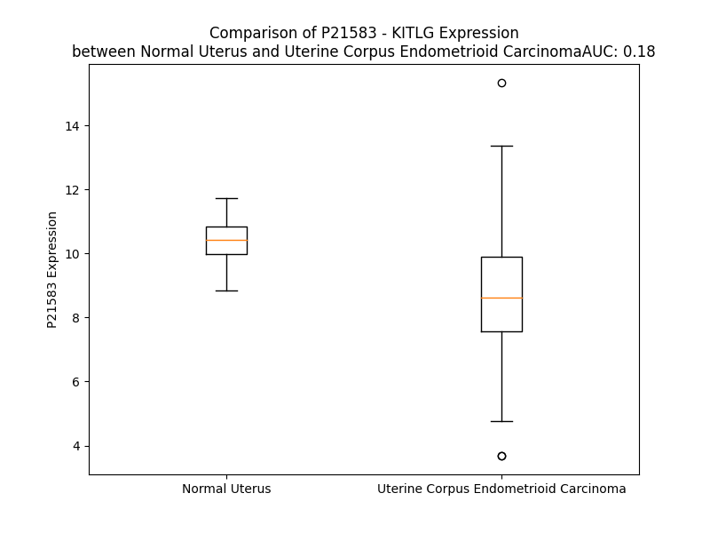

# Detailed Data for P21583

## Introduction to the Detailed Summary

### How to Interpret the Results

- **Summary & Metrics**: This section provides a quick reference to essential protein attributes, including expression changes, family classification, and biomarker applications. Regulation status (upregulated/downregulated) indicates the protein's behavior in a disease context. Some information comes from the original excel file with the proteins selected from literature, while others are derived from the analyses.
- **Expression Comparison**: A visual representation comparing protein expression between normal and disease states. It highlights significant changes in expression levels that might indicate diagnostic or therapeutic relevance. This is data coming from transcriptomics experiments and could not translate similarly to protein levels.
- **Isoform Alignment**: An interactive view of isoform alignments, revealing structural and functional differences between variants of the protein.
- **Interactors & Homologs**: Tables listing known interaction partners and homologous proteins, the more interactors and homologs, the more complex the protein is to design an antibody for.
- **Biological Assemblies**: Information about the structural arrangement of the protein in different assemblies, providing insights into its functional state but also the complexity of the protein to develop antibodies.
- **Combined Per-Residue Information**: A detailed table summarizing residue-level data. This includes predictions for epitope regions, aggregation tendencies, and modifications that might impact the protein's function. Each row corresponds to a residue in the protein, providing insights into specific sites that may be important for research or drug development.
## Summary & Metrics

- **UniProt Accession**: P21583
- **Gene Name**: SCF
- **Protein Name**: Kit ligand / stem cell factor
- **Swiss Prot**: SCF_HUMAN
- **Family**: growth factor
- **Biomarker Application**: diagnosis,efficacy,unspecified application
- **Number of Isoforms**: 3
- **Regulation**: 1
- **(transcriptomics) AUC**: 0.18
- **(transcriptomics) Fold Change**: 1.19
- **(transcriptomics) Regulation**: Downregulated
- **Discotope Epitope Count**: 33
- **Max n_uniprots (Homo)**: 4
- **Max n_uniprots (Hetero)**: 4

## Expression Comparison

## Isoform Alignment

<pre style='font-size:14px; font-family:monospace;'>P21583-1 MKKTQTWILTCIYLQLLLFNPLVKTEGICRNRVTNNVKDVTKLVANLPKDYMITLKYVPGMDVLPSHCWISEMVVQLSDSLTDLLDKFSNISEGLSNYSIIDKLVNIVDDLVECVKENSSKDLKKSFKSPEPRLFTPEEFFRIFNRSIDAFKDFVVASETSDCVVSSTLSPEKDSRVSVTKPFMLPPVAASSLRNDSSSSNRKAKNPPGDSSLHWAAMALPALFSLIIGFAFGALYWKKRQPSLTRAVENIQINEEDNEISMLQEKEREFQEV
P21583-2 MKKTQTWILTCIYLQLLLFNPLVKTEGICRNRVTNNVKDVTKLVANLPKDYMITLKYVPGMDVLPSHCWISEMVVQLSDSLTDLLDKFSNISEGLSNYSIIDKLVNIVDDLVECVKENSSKDLKKSFKSPEPRLFTPEEFFRIFNRSIDAFKDFVVASETSDCVVSSTLSPEKG----------------------------KAKNPPGDSSLHWAAMALPALFSLIIGFAFGALYWKKRQPSLTRAVENIQINEEDNEISMLQEKEREFQEV
P21583-3 -----------------------------------MPSCLAAQVANLPKDYMITLKYVPGMDVLPSHCWISEMVVQLSDSLTDLLDKFSNISEGLSNYSIIDKLVNIVDDLVECVKENSSKDLKKSFKSPEPRLFTPEEFFRIFNRSIDAFKDFVVASETSDCVVSSTLSPEKDSRVSVTKPFMLPPVAASSLRNDSSSSNRKAKNPPGDSSLHWAAMALPALFSLIIGFAFGALYWKKRQPSLTRAVENIQINEEDNEISMLQEKEREFQEV
</pre>

## Interactors

| preferredName_A   | preferredName_B   |   score |
|:------------------|:------------------|--------:|
| KITLG             | KIT               |   0.999 |
| KITLG             | NTRK1             |   0.998 |
| KITLG             | IL3               |   0.996 |
| KITLG             | FLT3              |   0.983 |
| KITLG             | FLT3LG            |   0.982 |
| KITLG             | PDGFRA            |   0.981 |
| KITLG             | THPO              |   0.974 |
| KITLG             | CXCR4             |   0.96  |
| KITLG             | PDGFRB            |   0.951 |
| KITLG             | EGFR              |   0.95  |
| KITLG             | CSF1R             |   0.949 |
| KITLG             | KDR               |   0.934 |
| KITLG             | CD34              |   0.934 |
| KITLG             | TEK               |   0.922 |
| KITLG             | IL6               |   0.921 |
| KITLG             | MMP9              |   0.921 |
| KITLG             | INSR              |   0.916 |
| KITLG             | CMA1              |   0.907 |

## Homologs

| uniprot_id   | gene_id   |
|--------------|-----------|

## Biological Assemblies

|   Unnamed: 0 |   assembly |   n_uniprots | composition   | crystal_id   |
|-------------:|-----------:|-------------:|:--------------|:-------------|
|            0 |          1 |            4 | Hetero        | 8dfq         |
|            0 |          1 |            4 | Hetero        | 2e9w         |
|            0 |          1 |            4 | Hetero        | 8dfm         |
|            0 |          1 |            2 | Homo          | 1exz         |
|            1 |          2 |            2 | Homo          | 1exz         |
|            2 |          3 |            4 | Homo          | 1exz         |
|            0 |          1 |            2 | Homo          | 1scf         |
|            1 |          2 |            2 | Homo          | 1scf         |
|            2 |          3 |            4 | Homo          | 1scf         |
|            0 |          1 |            4 | Hetero        | 8dfp         |

## Combined Per-Residue Information

|   res | aa   |   epitope_score | epitope   |   relative_surface_accessibility |   modeling_confidence |   Aggregation | modification   | glycosylation                            |
|------:|:-----|----------------:|:----------|---------------------------------:|----------------------:|--------------:|:---------------|:-----------------------------------------|
|     1 | M    |         0.10861 | False     |                          1.18511 |                 53.69 |         0     | N/A            | N/A                                      |
|     2 | K    |         0.13284 | False     |                          0.92235 |                 68.09 |         0     | N/A            | N/A                                      |
|     3 | K    |         0.09169 | False     |                          0.91966 |                 69.42 |         0     | N/A            | N/A                                      |
|     4 | T    |         0.04906 | False     |                          0.64988 |                 73.76 |         0.11  | N/A            | N/A                                      |
|     5 | Q    |         0.07496 | False     |                          0.70528 |                 76.62 |         0.617 | N/A            | N/A                                      |
|     6 | T    |         0.04088 | False     |                          0.63046 |                 81.48 |        36.153 | N/A            | N/A                                      |
|     7 | W    |         0.06556 | False     |                          0.82591 |                 82.49 |        95.861 | N/A            | N/A                                      |
|     8 | I    |         0.06573 | False     |                          0.60904 |                 83.77 |        99.05  | N/A            | N/A                                      |
|     9 | L    |         0.06261 | False     |                          0.57693 |                 85.27 |        99.341 | N/A            | N/A                                      |
|    10 | T    |         0.06319 | False     |                          0.57631 |                 86.24 |        99.394 | N/A            | N/A                                      |
|    11 | C    |         0.03558 | False     |                          0.3205  |                 83.29 |        99.481 | N/A            | N/A                                      |
|    12 | I    |         0.07101 | False     |                          0.50895 |                 85    |        99.895 | N/A            | N/A                                      |
|    13 | Y    |         0.08793 | False     |                          0.61163 |                 82.76 |        99.873 | N/A            | N/A                                      |
|    14 | L    |         0.03472 | False     |                          0.5581  |                 83.32 |        99.676 | N/A            | N/A                                      |
|    15 | Q    |         0.03413 | False     |                          0.48188 |                 80.11 |        98.541 | N/A            | N/A                                      |
|    16 | L    |         0.06486 | False     |                          0.61754 |                 75.26 |        98.496 | N/A            | N/A                                      |
|    17 | L    |         0.07446 | False     |                          0.77982 |                 77.11 |        98.252 | N/A            | N/A                                      |
|    18 | L    |         0.11484 | False     |                          0.73114 |                 71.61 |        96.915 | N/A            | N/A                                      |
|    19 | F    |         0.08007 | False     |                          0.6912  |                 64.82 |        89.612 | N/A            | N/A                                      |
|    20 | N    |         0.12108 | False     |                          0.56425 |                 59.42 |         0.042 | N/A            | N/A                                      |
|    21 | P    |         0.13372 | False     |                          0.61163 |                 54.12 |         0.018 | N/A            | N/A                                      |
|    22 | L    |         0.20109 | False     |                          0.91342 |                 46.36 |         0     | N/A            | N/A                                      |
|    23 | V    |         0.10248 | False     |                          0.74321 |                 50.29 |         0     | N/A            | N/A                                      |
|    24 | K    |         0.19537 | False     |                          0.55671 |                 49.06 |         0     | N/A            | N/A                                      |
|    25 | T    |         0.14687 | False     |                          0.46513 |                 47.36 |         0     | N/A            | N/A                                      |
|    26 | E    |         0.14605 | False     |                          0.84137 |                 51.43 |         0     | N/A            | N/A                                      |
|    27 | G    |         0.20572 | False     |                          0.36026 |                 54.41 |         0     | N/A            | N/A                                      |
|    28 | I    |         0.08946 | False     |                          0.39138 |                 58.12 |         0     | N/A            | N/A                                      |
|    29 | C    |         0.05847 | False     |                          0.13382 |                 69.9  |         0     | N/A            | N/A                                      |
|    30 | R    |         0.24103 | True      |                          0.76129 |                 66.56 |         0     | N/A            | N/A                                      |
|    31 | N    |         0.18187 | False     |                          0.72956 |                 62.67 |         0     | N/A            | N/A                                      |
|    32 | R    |         0.16492 | False     |                          0.51355 |                 64.04 |         0     | N/A            | N/A                                      |
|    33 | V    |         0.07217 | False     |                          0.06143 |                 64.93 |         0     | N/A            | N/A                                      |
|    34 | T    |         0.17971 | False     |                          0.68398 |                 60.95 |         0     | N/A            | N/A                                      |
|    35 | N    |         0.13379 | False     |                          0.645   |                 59.41 |         0     | N/A            | N/A                                      |
|    36 | N    |         0.09711 | False     |                          0.2819  |                 63.63 |         0     | N/A            | N/A                                      |
|    37 | V    |         0.13935 | False     |                          0.24119 |                 76.12 |         0     | N/A            | N/A                                      |
|    38 | K    |         0.24225 | True      |                          0.82157 |                 79.8  |         0     | N/A            | N/A                                      |
|    39 | D    |         0.10866 | False     |                          0.3352  |                 87.48 |         0     | N/A            | N/A                                      |
|    40 | V    |         0.08992 | False     |                          0.05522 |                 92.35 |         0     | N/A            | N/A                                      |
|    41 | T    |         0.26546 | True      |                          0.75361 |                 92.39 |         0     | N/A            | N/A                                      |
|    42 | K    |         0.2507  | True      |                          0.5524  |                 91.43 |         0     | N/A            | N/A                                      |
|    43 | L    |         0.00655 | False     |                          0       |                 93.12 |         0     | N/A            | N/A                                      |
|    44 | V    |         0.14735 | False     |                          0.21989 |                 94.67 |         0     | N/A            | N/A                                      |
|    45 | A    |         0.20854 | False     |                          0.80248 |                 92.85 |         0     | N/A            | N/A                                      |
|    46 | N    |         0.1839  | False     |                          0.45887 |                 91.61 |         0     | N/A            | N/A                                      |
|    47 | L    |         0.08801 | False     |                          0.05989 |                 92.05 |         0     | N/A            | N/A                                      |
|    48 | P    |         0.11932 | False     |                          0.57771 |                 92.84 |         0     | N/A            | N/A                                      |
|    49 | K    |         0.19524 | False     |                          0.86082 |                 93.23 |         0     | N/A            | N/A                                      |
|    50 | D    |         0.17596 | False     |                          0.69675 |                 95.21 |         0     | N/A            | N/A                                      |
|    51 | Y    |         0.28606 | True      |                          0.23389 |                 94.68 |         8.237 | N/A            | N/A                                      |
|    52 | M    |         0.16168 | False     |                          0.44412 |                 97.64 |         8.237 | N/A            | N/A                                      |
|    53 | I    |         0.02737 | False     |                          0.0264  |                 98.02 |         8.237 | N/A            | N/A                                      |
|    54 | T    |         0.1155  | False     |                          0.48573 |                 98.05 |         8.237 | N/A            | N/A                                      |
|    55 | L    |         0.02478 | False     |                          0.00659 |                 98.25 |         8.237 | N/A            | N/A                                      |
|    56 | K    |         0.20216 | False     |                          0.49267 |                 97.41 |         0     | N/A            | N/A                                      |
|    57 | Y    |         0.11315 | False     |                          0.08414 |                 95.9  |         0     | N/A            | N/A                                      |
|    58 | V    |         0.05574 | False     |                          0.04665 |                 93.51 |         0     | N/A            | N/A                                      |
|    59 | P    |         0.17834 | False     |                          0.1747  |                 90.04 |         0     | N/A            | N/A                                      |
|    60 | G    |         0.09765 | False     |                          0.2088  |                 86.14 |         0     | N/A            | N/A                                      |
|    61 | M    |         0.02031 | False     |                          0.00255 |                 89.67 |         0     | N/A            | N/A                                      |
|    62 | D    |         0.26992 | True      |                          0.59426 |                 89.16 |         0     | N/A            | N/A                                      |
|    63 | V    |         0.29133 | True      |                          0.77361 |                 89.08 |         0     | N/A            | N/A                                      |
|    64 | L    |         0.11223 | False     |                          0.12394 |                 86.46 |         0     | N/A            | N/A                                      |
|    65 | P    |         0.14387 | False     |                          0.45729 |                 86.66 |         0     | N/A            | N/A                                      |
|    66 | S    |         0.07695 | False     |                          0.17875 |                 87.32 |         0     | N/A            | N/A                                      |
|    67 | H    |         0.07448 | False     |                          0.16959 |                 84.72 |         0     | N/A            | N/A                                      |
|    68 | C    |         0.05807 | False     |                          0.08587 |                 85.8  |         0     | N/A            | N/A                                      |
|    69 | W    |         0.03824 | False     |                          0.0296  |                 90.2  |         0     | N/A            | N/A                                      |
|    70 | I    |         0.00824 | False     |                          0       |                 90.59 |         0     | N/A            | N/A                                      |
|    71 | S    |         0.04805 | False     |                          0.27743 |                 90.47 |         0     | N/A            | N/A                                      |
|    72 | E    |         0.11566 | False     |                          0.22625 |                 91.98 |         0     | N/A            | N/A                                      |
|    73 | M    |         0.0039  | False     |                          0       |                 94.68 |         0.285 | N/A            | N/A                                      |
|    74 | V    |         0.01359 | False     |                          0.01047 |                 94.42 |         0.285 | N/A            | N/A                                      |
|    75 | V    |         0.13141 | False     |                          0.39701 |                 95.9  |         0.285 | N/A            | N/A                                      |
|    76 | Q    |         0.10792 | False     |                          0.08787 |                 97.65 |         0.285 | N/A            | N/A                                      |
|    77 | L    |         0.00714 | False     |                          0.00495 |                 97.98 |         0.285 | N/A            | N/A                                      |
|    78 | S    |         0.08149 | False     |                          0.11622 |                 97.57 |         0     | N/A            | N/A                                      |
|    79 | D    |         0.16964 | False     |                          0.4531  |                 98.22 |         0     | N/A            | N/A                                      |
|    80 | S    |         0.05258 | False     |                          0.03765 |                 98.31 |         0     | N/A            | N/A                                      |
|    81 | L    |         0.00537 | False     |                          0       |                 97.41 |         0     | N/A            | N/A                                      |
|    82 | T    |         0.20245 | False     |                          0.38241 |                 97.37 |         0     | N/A            | N/A                                      |
|    83 | D    |         0.14399 | False     |                          0.52765 |                 96.52 |         0     | N/A            | N/A                                      |
|    84 | L    |         0.02736 | False     |                          0.01508 |                 94.51 |         0     | N/A            | N/A                                      |
|    85 | L    |         0.1344  | False     |                          0.12365 |                 94.41 |         0     | N/A            | N/A                                      |
|    86 | D    |         0.22238 | False     |                          0.55455 |                 93.16 |         0     | N/A            | N/A                                      |
|    87 | K    |         0.36658 | True      |                          0.55258 |                 90.06 |         0     | N/A            | N/A                                      |
|    88 | F    |         0.26835 | True      |                          0.14366 |                 88.64 |         0     | N/A            | N/A                                      |
|    89 | S    |         0.28109 | True      |                          0.5     |                 86.09 |         0     | N/A            | N/A                                      |
|    90 | N    |         0.22345 | False     |                          0.90933 |                 80.89 |         0     | N/A            | N-linked (GlcNAc...) asparagine; partial |
|    91 | I    |         0.29302 | True      |                          0.52566 |                 76.32 |         0     | N/A            | N/A                                      |
|    92 | S    |         0.22552 | False     |                          0.71178 |                 65.33 |         0     | N/A            | N/A                                      |
|    93 | E    |         0.2674  | True      |                          0.84986 |                 59.36 |         0     | N/A            | N/A                                      |
|    94 | G    |         0.10091 | False     |                          0.02552 |                 63.26 |         0     | N/A            | N/A                                      |
|    95 | L    |         0.27858 | True      |                          0.78694 |                 73.76 |         0     | N/A            | N/A                                      |
|    96 | S    |         0.19348 | False     |                          0.39632 |                 87.18 |         0     | N/A            | N/A                                      |
|    97 | N    |         0.17496 | False     |                          0.07915 |                 90.53 |         0.329 | N/A            | N/A                                      |
|    98 | Y    |         0.14595 | False     |                          0.35265 |                 92.73 |         0.834 | N/A            | N/A                                      |
|    99 | S    |         0.1855  | False     |                          0.36411 |                 91.31 |         0.834 | N/A            | N/A                                      |
|   100 | I    |         0.0769  | False     |                          0.0552  |                 92.26 |         2.016 | N/A            | N/A                                      |
|   101 | I    |         0.01009 | False     |                          0       |                 93.62 |         2.016 | N/A            | N/A                                      |
|   102 | D    |         0.22009 | False     |                          0.31701 |                 92.74 |         1.687 | N/A            | N/A                                      |
|   103 | K    |         0.09806 | False     |                          0.4068  |                 91.8  |         1.687 | N/A            | N/A                                      |
|   104 | L    |         0.00422 | False     |                          0       |                 93.87 |         8.468 | N/A            | N/A                                      |
|   105 | V    |         0.06334 | False     |                          0.10949 |                 94.78 |         8.468 | N/A            | N/A                                      |
|   106 | N    |         0.18383 | False     |                          0.47735 |                 92.03 |         7.456 | N/A            | N/A                                      |
|   107 | I    |         0.03546 | False     |                          0.01547 |                 91.23 |         7.456 | N/A            | N/A                                      |
|   108 | V    |         0.0134  | False     |                          0.00476 |                 93.65 |         7.456 | N/A            | N/A                                      |
|   109 | D    |         0.15098 | False     |                          0.38408 |                 93.09 |         0     | N/A            | N/A                                      |
|   110 | D    |         0.04518 | False     |                          0.12387 |                 89.17 |         0     | N/A            | N/A                                      |
|   111 | L    |         0.01884 | False     |                          0.01814 |                 89.62 |         0     | N/A            | N/A                                      |
|   112 | V    |         0.09502 | False     |                          0.27428 |                 92.05 |         0     | N/A            | N/A                                      |
|   113 | E    |         0.12656 | False     |                          0.38184 |                 88.5  |         0     | N/A            | N/A                                      |
|   114 | C    |         0.03046 | False     |                          0.01617 |                 86.3  |         0     | N/A            | N/A                                      |
|   115 | V    |         0.02834 | False     |                          0.02095 |                 84.86 |         0     | N/A            | N/A                                      |
|   116 | K    |         0.13851 | False     |                          0.78631 |                 84.49 |         0     | N/A            | N/A                                      |
|   117 | E    |         0.14983 | False     |                          0.51882 |                 75.79 |         0     | N/A            | N/A                                      |
|   118 | N    |         0.25076 | True      |                          0.58084 |                 72.38 |         0     | N/A            | N-linked (GlcNAc...) asparagine; partial |
|   119 | S    |         0.15087 | False     |                          0.30251 |                 68.46 |         0     | N/A            | N/A                                      |
|   120 | S    |         0.16906 | False     |                          0.61548 |                 59.8  |         0     | N/A            | N/A                                      |
|   121 | K    |         0.20105 | False     |                          1.01826 |                 55.72 |         0     | N/A            | N/A                                      |
|   122 | D    |         0.20178 | False     |                          0.75322 |                 49.06 |         0     | N/A            | N/A                                      |
|   123 | L    |         0.11442 | False     |                          0.42522 |                 55.09 |         0     | N/A            | N/A                                      |
|   124 | K    |         0.17052 | False     |                          0.90728 |                 52.78 |         0     | N/A            | N/A                                      |
|   125 | K    |         0.2293  | False     |                          0.85862 |                 57.39 |         0     | N/A            | N/A                                      |
|   126 | S    |         0.19398 | False     |                          0.50583 |                 52.03 |         0     | N/A            | N/A                                      |
|   127 | F    |         0.15366 | False     |                          0.23485 |                 65.54 |         0     | N/A            | N/A                                      |
|   128 | K    |         0.29396 | True      |                          0.75173 |                 75.67 |         0     | N/A            | N/A                                      |
|   129 | S    |         0.21661 | False     |                          0.64279 |                 85.37 |         0     | N/A            | N/A                                      |
|   130 | P    |         0.16498 | False     |                          0.24014 |                 92.15 |         0     | N/A            | N/A                                      |
|   131 | E    |         0.29516 | True      |                          0.32065 |                 92.77 |         0     | N/A            | N/A                                      |
|   132 | P    |         0.3059  | True      |                          0.71817 |                 96.1  |         0     | N/A            | N/A                                      |
|   133 | R    |         0.37348 | True      |                          0.41186 |                 96.9  |         0     | N/A            | N/A                                      |
|   134 | L    |         0.2124  | False     |                          0.71992 |                 98.09 |         0     | N/A            | N/A                                      |
|   135 | F    |         0.11645 | False     |                          0.13901 |                 98.12 |         0     | N/A            | N/A                                      |
|   136 | T    |         0.19685 | False     |                          0.27401 |                 97.9  |         0     | N/A            | N/A                                      |
|   137 | P    |         0.02111 | False     |                          0.02585 |                 97.38 |         0     | N/A            | N/A                                      |
|   138 | E    |         0.1922  | False     |                          0.59787 |                 97.17 |         0     | N/A            | N/A                                      |
|   139 | E    |         0.16812 | False     |                          0.31833 |                 97.46 |         2.205 | N/A            | N/A                                      |
|   140 | F    |         0.00462 | False     |                          0       |                 98.09 |         2.205 | N/A            | N/A                                      |
|   141 | F    |         0.04388 | False     |                          0.01958 |                 97.01 |         2.205 | N/A            | N/A                                      |
|   142 | R    |         0.288   | True      |                          0.63832 |                 96.54 |         2.205 | N/A            | N/A                                      |
|   143 | I    |         0.09734 | False     |                          0.0784  |                 96.77 |         2.205 | N/A            | N/A                                      |
|   144 | F    |         0.00497 | False     |                          0       |                 95.95 |         2.205 | N/A            | N/A                                      |
|   145 | N    |         0.17457 | False     |                          0.36883 |                 93.9  |         0     | N/A            | N-linked (GlcNAc...) asparagine          |
|   146 | R    |         0.27231 | True      |                          0.37793 |                 93.92 |         0     | N/A            | N/A                                      |
|   147 | S    |         0.00414 | False     |                          0.0052  |                 93.35 |         0     | N/A            | N/A                                      |
|   148 | I    |         0.04355 | False     |                          0.0432  |                 90.58 |         0     | N/A            | N/A                                      |
|   149 | D    |         0.22218 | False     |                          0.46503 |                 89.45 |         0     | N/A            | N/A                                      |
|   150 | A    |         0.0803  | False     |                          0.09659 |                 89.47 |         0.771 | N/A            | N/A                                      |
|   151 | F    |         0.0238  | False     |                          0.01147 |                 86.25 |         1.685 | N/A            | N/A                                      |
|   152 | K    |         0.19909 | False     |                          0.47286 |                 82.6  |         1.841 | N/A            | N/A                                      |
|   153 | D    |         0.19423 | False     |                          0.54147 |                 74.85 |         1.841 | N/A            | N/A                                      |
|   154 | F    |         0.09153 | False     |                          0.13508 |                 75.27 |        11.85  | N/A            | N/A                                      |
|   155 | V    |         0.21333 | False     |                          0.49604 |                 71.43 |        11.85  | N/A            | N/A                                      |
|   156 | V    |         0.19117 | False     |                          0.88808 |                 66.66 |        11.85  | N/A            | N/A                                      |
|   157 | A    |         0.15598 | False     |                          0.49265 |                 62.25 |        10.407 | N/A            | N/A                                      |
|   158 | S    |         0.19123 | False     |                          0.85453 |                 54.31 |        10.009 | N/A            | N/A                                      |
|   159 | E    |         0.29084 | True      |                          0.72475 |                 56.37 |         0     | N/A            | N/A                                      |
|   160 | T    |         0.18784 | False     |                          0.94779 |                 61.32 |         0     | N/A            | N/A                                      |
|   161 | S    |         0.22159 | False     |                          0.42241 |                 67.84 |         0     | N/A            | N/A                                      |
|   162 | D    |         0.21822 | False     |                          0.78029 |                 73.93 |         0     | N/A            | N/A                                      |
|   163 | C    |         0.1286  | False     |                          0.16798 |                 79.39 |         0     | N/A            | N/A                                      |
|   164 | V    |         0.24636 | True      |                          0.69622 |                 78.76 |         0.15  | N/A            | N/A                                      |
|   165 | V    |         0.23343 | False     |                          0.4391  |                 67.55 |         0.15  | N/A            | N/A                                      |
|   166 | S    |         0.27458 | True      |                          0.65136 |                 55.63 |         0.15  | N/A            | N/A                                      |
|   167 | S    |         0.29312 | True      |                          0.8201  |                 47.41 |         0.15  | N/A            | O-linked (GalNAc...) serine              |
|   168 | T    |         0.36689 | True      |                          0.86005 |                 44.89 |         0.15  | N/A            | O-linked (GalNAc...) threonine           |
|   169 | L    |         0.33398 | True      |                          1.0916  |                 42.18 |         0.15  | N/A            | N/A                                      |
|   170 | S    |         0.1731  | False     |                          0.66644 |                 37.35 |         0     | N/A            | N/A                                      |
|   171 | P    |         0.17244 | False     |                          0.87942 |                 43.78 |         0     | N/A            | N/A                                      |
|   172 | E    |         0.13655 | False     |                          0.81745 |                 45.61 |         0     | N/A            | N/A                                      |
|   173 | K    |         0.17592 | False     |                          0.93843 |                 40.95 |         0     | N/A            | N/A                                      |
|   174 | D    |         0.16759 | False     |                          0.54183 |                 40.33 |         0     | N/A            | N/A                                      |
|   175 | S    |         0.31423 | True      |                          0.795   |                 52.25 |         0     | N/A            | N/A                                      |
|   176 | R    |         0.30406 | True      |                          0.87193 |                 49.44 |         0     | N/A            | N/A                                      |
|   177 | V    |         0.22688 | False     |                          0.92519 |                 45.11 |         0     | N/A            | N/A                                      |
|   178 | S    |         0.18209 | False     |                          0.69465 |                 37.68 |         0     | N/A            | N/A                                      |
|   179 | V    |         0.16617 | False     |                          0.95485 |                 39.05 |         0     | N/A            | N/A                                      |
|   180 | T    |         0.21698 | False     |                          0.92482 |                 41.46 |         0     | N/A            | O-linked (GalNAc...) threonine           |
|   181 | K    |         0.21022 | False     |                          0.87104 |                 45.49 |         0     | N/A            | N/A                                      |
|   182 | P    |         0.16935 | False     |                          0.84297 |                 46.5  |         0     | N/A            | N/A                                      |
|   183 | F    |         0.21616 | False     |                          0.96434 |                 52.88 |         0     | N/A            | N/A                                      |
|   184 | M    |         0.23556 | False     |                          0.93804 |                 45.43 |         0     | N/A            | N/A                                      |
|   185 | L    |         0.21442 | False     |                          0.91684 |                 51.14 |         0     | N/A            | N/A                                      |
|   186 | P    |         0.18224 | False     |                          0.76591 |                 44.13 |         0     | N/A            | N/A                                      |
|   187 | P    |         0.17425 | False     |                          0.98827 |                 52.7  |         0     | N/A            | N/A                                      |
|   188 | V    |         0.17346 | False     |                          1.01773 |                 46.27 |         0     | N/A            | N/A                                      |
|   189 | A    |         0.17778 | False     |                          0.78381 |                 46.07 |         0     | N/A            | N/A                                      |
|   190 | A    |         0.20885 | False     |                          1.02134 |                 40.65 |         0     | N/A            | N/A                                      |
|   191 | S    |         0.19235 | False     |                          0.74588 |                 42.42 |         0     | N/A            | N/A                                      |
|   192 | S    |         0.13234 | False     |                          0.70765 |                 45.51 |         0     | N/A            | N/A                                      |
|   193 | L    |         0.18429 | False     |                          1.07781 |                 43.09 |         0     | N/A            | N/A                                      |
|   194 | R    |         0.2008  | False     |                          0.83917 |                 39.77 |         0     | N/A            | N/A                                      |
|   195 | N    |         0.21389 | False     |                          0.89339 |                 37.52 |         0     | N/A            | N-linked (GlcNAc...) asparagine          |
|   196 | D    |         0.23855 | True      |                          0.74185 |                 40.3  |         0     | N/A            | N/A                                      |
|   197 | S    |         0.1909  | False     |                          0.79533 |                 43.82 |         0     | N/A            | N/A                                      |
|   198 | S    |         0.24057 | True      |                          0.77886 |                 43.58 |         0     | N/A            | N/A                                      |
|   199 | S    |         0.19046 | False     |                          0.80839 |                 42.3  |         0     | N/A            | N/A                                      |
|   200 | S    |         0.16356 | False     |                          0.67449 |                 45.48 |         0     | N/A            | N/A                                      |
|   201 | N    |         0.16938 | False     |                          0.94301 |                 34.42 |         0     | N/A            | N/A                                      |
|   202 | R    |         0.28131 | True      |                          0.90277 |                 36.98 |         0     | N/A            | N/A                                      |
|   203 | K    |         0.20543 | False     |                          0.90567 |                 32.76 |         0     | N/A            | N/A                                      |
|   204 | A    |         0.15456 | False     |                          0.87753 |                 36.04 |         0     | N/A            | N/A                                      |
|   205 | K    |         0.25932 | True      |                          0.9251  |                 32.89 |         0     | N/A            | N/A                                      |
|   206 | N    |         0.19018 | False     |                          0.80004 |                 35.24 |         0     | N/A            | N/A                                      |
|   207 | P    |         0.20125 | False     |                          0.82984 |                 38.34 |         0     | N/A            | N/A                                      |
|   208 | P    |         0.21469 | False     |                          0.96125 |                 39.84 |         0     | N/A            | N/A                                      |
|   209 | G    |         0.28225 | True      |                          0.62806 |                 40.39 |         0     | N/A            | N/A                                      |
|   210 | D    |         0.23323 | False     |                          0.60692 |                 44.21 |         0     | N/A            | N/A                                      |
|   211 | S    |         0.15868 | False     |                          0.68264 |                 48.49 |         0     | N/A            | N/A                                      |
|   212 | S    |         0.10449 | False     |                          0.50184 |                 50.04 |         0     | N/A            | N/A                                      |
|   213 | L    |         0.16438 | False     |                          0.78202 |                 53.03 |         0     | N/A            | N/A                                      |
|   214 | H    |         0.10391 | False     |                          0.71049 |                 50.94 |         0     | N/A            | N/A                                      |
|   215 | W    |         0.15518 | False     |                          0.72629 |                 53.27 |         0.061 | N/A            | N/A                                      |
|   216 | A    |         0.09757 | False     |                          0.24085 |                 53.38 |         0.061 | N/A            | N/A                                      |
|   217 | A    |         0.12055 | False     |                          0.69105 |                 58.21 |         0.061 | N/A            | N/A                                      |
|   218 | M    |         0.20973 | False     |                          0.83559 |                 59.71 |         0.061 | N/A            | N/A                                      |
|   219 | A    |         0.08195 | False     |                          0.26656 |                 58.26 |         0.061 | N/A            | N/A                                      |
|   220 | L    |         0.08838 | False     |                          0.59189 |                 60.71 |         0     | N/A            | N/A                                      |
|   221 | P    |         0.08599 | False     |                          0.51469 |                 68.17 |         0.471 | N/A            | N/A                                      |
|   222 | A    |         0.05784 | False     |                          0.57814 |                 72.11 |        38.894 | N/A            | N/A                                      |
|   223 | L    |         0.06698 | False     |                          0.55385 |                 73.55 |        84.314 | N/A            | N/A                                      |
|   224 | F    |         0.06437 | False     |                          0.62979 |                 78.34 |        92.614 | N/A            | N/A                                      |
|   225 | S    |         0.04954 | False     |                          0.52022 |                 77.54 |        93.276 | N/A            | N/A                                      |
|   226 | L    |         0.10197 | False     |                          0.75264 |                 82.94 |        98.601 | N/A            | N/A                                      |
|   227 | I    |         0.05648 | False     |                          0.62891 |                 80.94 |        99.545 | N/A            | N/A                                      |
|   228 | I    |         0.05237 | False     |                          0.55998 |                 82.13 |        99.464 | N/A            | N/A                                      |
|   229 | G    |         0.04016 | False     |                          0.51071 |                 80.53 |        97.471 | N/A            | N/A                                      |
|   230 | F    |         0.06003 | False     |                          0.79833 |                 84.16 |        97.351 | N/A            | N/A                                      |
|   231 | A    |         0.0279  | False     |                          0.44096 |                 81.83 |        95.004 | N/A            | N/A                                      |
|   232 | F    |         0.04311 | False     |                          0.6165  |                 80.26 |        92.999 | N/A            | N/A                                      |
|   233 | G    |         0.02999 | False     |                          0.43137 |                 80.74 |        68.328 | N/A            | N/A                                      |
|   234 | A    |         0.03448 | False     |                          0.46221 |                 80.24 |        66.107 | N/A            | N/A                                      |
|   235 | L    |         0.09438 | False     |                          0.70187 |                 77.43 |        64.245 | N/A            | N/A                                      |
|   236 | Y    |         0.06654 | False     |                          0.71933 |                 75.77 |        54.076 | N/A            | N/A                                      |
|   237 | W    |         0.09839 | False     |                          0.84322 |                 67.88 |        41.292 | N/A            | N/A                                      |
|   238 | K    |         0.13087 | False     |                          0.8247  |                 71.16 |         0     | N/A            | N/A                                      |
|   239 | K    |         0.1614  | False     |                          0.90387 |                 63.97 |         0     | N/A            | N/A                                      |
|   240 | R    |         0.23541 | False     |                          0.81361 |                 50.48 |         0     | N/A            | N/A                                      |
|   241 | Q    |         0.1864  | False     |                          0.62276 |                 46    |         0     | N/A            | N/A                                      |
|   242 | P    |         0.16082 | False     |                          0.72248 |                 47.59 |         0     | N/A            | N/A                                      |
|   243 | S    |         0.16906 | False     |                          0.54278 |                 46.45 |         0     | N/A            | N/A                                      |
|   244 | L    |         0.18294 | False     |                          0.85799 |                 47.28 |         0     | N/A            | N/A                                      |
|   245 | T    |         0.15713 | False     |                          0.76532 |                 48.12 |         0     | N/A            | N/A                                      |
|   246 | R    |         0.19216 | False     |                          0.6769  |                 47.89 |         0     | N/A            | N/A                                      |
|   247 | A    |         0.09873 | False     |                          0.5855  |                 49.8  |         0     | N/A            | N/A                                      |
|   248 | V    |         0.08935 | False     |                          0.62853 |                 52.38 |         0     | N/A            | N/A                                      |
|   249 | E    |         0.12542 | False     |                          0.52629 |                 53.61 |         0     | N/A            | N/A                                      |
|   250 | N    |         0.1335  | False     |                          0.46603 |                 52.97 |         0     | N/A            | N/A                                      |
|   251 | I    |         0.15356 | False     |                          0.6975  |                 56.77 |         0     | N/A            | N/A                                      |
|   252 | Q    |         0.1687  | False     |                          0.57753 |                 55.92 |         0     | N/A            | N/A                                      |
|   253 | I    |         0.16243 | False     |                          0.51097 |                 58.35 |         0     | N/A            | N/A                                      |
|   254 | N    |         0.13349 | False     |                          0.6442  |                 59.27 |         0     | N/A            | N/A                                      |
|   255 | E    |         0.14026 | False     |                          0.54768 |                 65.98 |         0     | N/A            | N/A                                      |
|   256 | E    |         0.16519 | False     |                          0.54957 |                 62.6  |         0     | N/A            | N/A                                      |
|   257 | D    |         0.12009 | False     |                          0.52249 |                 66.14 |         0     | N/A            | N/A                                      |
|   258 | N    |         0.06823 | False     |                          0.51228 |                 69.64 |         0     | N/A            | N/A                                      |
|   259 | E    |         0.10119 | False     |                          0.51042 |                 68.61 |         0     | N/A            | N/A                                      |
|   260 | I    |         0.10759 | False     |                          0.57197 |                 69.07 |         0     | N/A            | N/A                                      |
|   261 | S    |         0.06856 | False     |                          0.51864 |                 73.31 |         0     | N/A            | N/A                                      |
|   262 | M    |         0.12144 | False     |                          0.66686 |                 74.34 |         0     | N/A            | N/A                                      |
|   263 | L    |         0.12881 | False     |                          0.60283 |                 70.25 |         0     | N/A            | N/A                                      |
|   264 | Q    |         0.1352  | False     |                          0.56315 |                 73.33 |         0     | N/A            | N/A                                      |
|   265 | E    |         0.11857 | False     |                          0.59449 |                 76.32 |         0     | N/A            | N/A                                      |
|   266 | K    |         0.12548 | False     |                          0.55863 |                 77.73 |         0     | N/A            | N/A                                      |
|   267 | E    |         0.1267  | False     |                          0.62847 |                 75.6  |         0     | N/A            | N/A                                      |
|   268 | R    |         0.16673 | False     |                          0.66962 |                 77.62 |         0     | N/A            | N/A                                      |
|   269 | E    |         0.18796 | False     |                          0.60561 |                 76.34 |         0     | N/A            | N/A                                      |
|   270 | F    |         0.15768 | False     |                          0.75502 |                 73.61 |         0     | N/A            | N/A                                      |
|   271 | Q    |         0.15699 | False     |                          0.79933 |                 71.56 |         0     | N/A            | N/A                                      |
|   272 | E    |         0.08201 | False     |                          0.7574  |                 66.52 |         0     | N/A            | N/A                                      |
|   273 | V    |         0.05233 | False     |                          1.28616 |                 63.62 |         0     | N/A            | N/A                                      |

