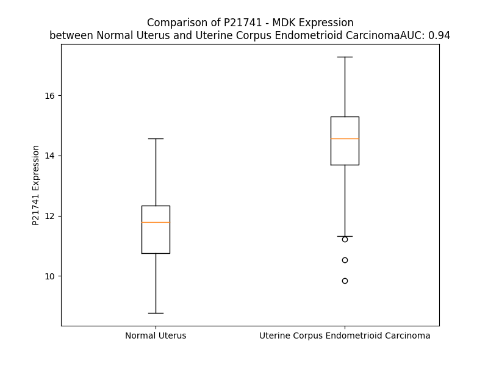

# Detailed Data for P21741

## Introduction to the Detailed Summary

### How to Interpret the Results

- **Summary & Metrics**: This section provides a quick reference to essential protein attributes, including expression changes, family classification, and biomarker applications. Regulation status (upregulated/downregulated) indicates the protein's behavior in a disease context. Some information comes from the original excel file with the proteins selected from literature, while others are derived from the analyses.
- **Expression Comparison**: A visual representation comparing protein expression between normal and disease states. It highlights significant changes in expression levels that might indicate diagnostic or therapeutic relevance. This is data coming from transcriptomics experiments and could not translate similarly to protein levels.
- **Isoform Alignment**: An interactive view of isoform alignments, revealing structural and functional differences between variants of the protein.
- **Interactors & Homologs**: Tables listing known interaction partners and homologous proteins, the more interactors and homologs, the more complex the protein is to design an antibody for.
- **Biological Assemblies**: Information about the structural arrangement of the protein in different assemblies, providing insights into its functional state but also the complexity of the protein to develop antibodies.
- **Combined Per-Residue Information**: A detailed table summarizing residue-level data. This includes predictions for epitope regions, aggregation tendencies, and modifications that might impact the protein's function. Each row corresponds to a residue in the protein, providing insights into specific sites that may be important for research or drug development.
## Summary & Metrics

- **UniProt Accession**: P21741
- **Gene Name**: MDK
- **Protein Name**: midkine / MK
- **Swiss Prot**: MK_HUMAN
- **Family**: growth factor
- **Biomarker Application**: diagnosis
- **Number of Isoforms**: 2
- **Regulation**: 1
- **(transcriptomics) AUC**: 0.98
- **(transcriptomics) Fold Change**: 1.26
- **(transcriptomics) Regulation**: Upregulated
- **Discotope Epitope Count**: 18
- **Max n_uniprots (Homo)**: 1
- **Max n_uniprots (Hetero)**: N/A

## Expression Comparison

## Isoform Alignment

<pre style='font-size:14px; font-family:monospace;'>P21741-1 MQHRGFLLLTLLALLALTSAVAKKKDKVKKGGPGSECAEWAWGPCTPSSKDCGVGFREGTCGAQTQRIRCRVPCNWKKEFGADCKYKFENWGACDGGTGTKVRQGTLKKARYNAQCQETIRVTKPCTPKTKAKAKAKKGKGKD
P21741-2 MQHRGFLLLTLLALLALTSAVAKK--------------------------------------------------------KADCKYKFENWGACDGGTGTKVRQGTLKKARYNAQCQETIRVTKPCTPKTKAKAKAKKGKGKD
</pre>

## Interactors

| preferredName_A   | preferredName_B   |   score |
|:------------------|:------------------|--------:|
| MDK               | ALK               |   0.997 |
| MDK               | PTPRZ1            |   0.978 |
| MDK               | NOTCH2            |   0.972 |
| MDK               | NCL               |   0.957 |
| MDK               | HDGF              |   0.934 |

## Homologs

| uniprot_id   | gene_id   |
|:-------------|:----------|
| P21246       | PTN       |

## Biological Assemblies

|   Unnamed: 0 |   assembly |   n_uniprots | composition   | crystal_id   |
|-------------:|-----------:|-------------:|:--------------|:-------------|
|            0 |          1 |            1 | Homo          | 1mkc         |
|            0 |          1 |            1 | Homo          | 1mkn         |

## Combined Per-Residue Information

|   res | aa   |   epitope_score | epitope   |   relative_surface_accessibility |   modeling_confidence |   Aggregation | modification   |
|------:|:-----|----------------:|:----------|---------------------------------:|----------------------:|--------------:|:---------------|
|     1 | M    |         0.18007 | False     |                          1.28279 |                 49.53 |         0     | N/A            |
|     2 | Q    |         0.32523 | False     |                          0.80335 |                 59.66 |         0     | N/A            |
|     3 | H    |         0.18336 | False     |                          0.84195 |                 58.14 |         0     | N/A            |
|     4 | R    |         0.23041 | False     |                          0.82276 |                 60.51 |         0     | N/A            |
|     5 | G    |         0.15143 | False     |                          0.51939 |                 57.38 |         5.933 | N/A            |
|     6 | F    |         0.14997 | False     |                          0.78812 |                 60.31 |        79.657 | N/A            |
|     7 | L    |         0.17724 | False     |                          0.79459 |                 63.89 |        96.094 | N/A            |
|     8 | L    |         0.15642 | False     |                          0.68161 |                 64.28 |        99.101 | N/A            |
|     9 | L    |         0.19935 | False     |                          0.83045 |                 62.55 |        99.65  | N/A            |
|    10 | T    |         0.14591 | False     |                          0.44152 |                 64.89 |        99.749 | N/A            |
|    11 | L    |         0.15238 | False     |                          0.70818 |                 61.39 |        99.905 | N/A            |
|    12 | L    |         0.20989 | False     |                          0.79991 |                 59.96 |        99.873 | N/A            |
|    13 | A    |         0.1345  | False     |                          0.57529 |                 60.86 |        99.544 | N/A            |
|    14 | L    |         0.19824 | False     |                          0.77668 |                 58.78 |        99.262 | N/A            |
|    15 | L    |         0.27187 | False     |                          0.79029 |                 57.61 |        97.708 | N/A            |
|    16 | A    |         0.22505 | False     |                          0.75879 |                 56.02 |        89.199 | N/A            |
|    17 | L    |         0.2734  | False     |                          0.93702 |                 55.5  |        81.998 | N/A            |
|    18 | T    |         0.36304 | False     |                          0.75757 |                 51.71 |        42.658 | N/A            |
|    19 | S    |         0.22714 | False     |                          0.7994  |                 46.83 |        19.239 | N/A            |
|    20 | A    |         0.22717 | False     |                          0.93346 |                 46.14 |        16.332 | N/A            |
|    21 | V    |         0.19432 | False     |                          0.84393 |                 44.04 |        13.873 | N/A            |
|    22 | A    |         0.25048 | False     |                          0.92292 |                 44.95 |         3.279 | N/A            |
|    23 | K    |         0.22722 | False     |                          0.89788 |                 41.99 |         0     | N/A            |
|    24 | K    |         0.26826 | False     |                          0.88823 |                 42.91 |         0     | N/A            |
|    25 | K    |         0.31793 | False     |                          1.00642 |                 42.06 |         0     | N/A            |
|    26 | D    |         0.26443 | False     |                          0.62025 |                 44.57 |         0     | N/A            |
|    27 | K    |         0.2589  | False     |                          0.85807 |                 43.05 |         0     | N/A            |
|    28 | V    |         0.19644 | False     |                          1.05031 |                 41.07 |         0     | N/A            |
|    29 | K    |         0.25026 | False     |                          0.91788 |                 41.92 |         0     | N/A            |
|    30 | K    |         0.22447 | False     |                          1.00816 |                 44.96 |         0     | N/A            |
|    31 | G    |         0.31258 | False     |                          0.81969 |                 39.5  |         0     | N/A            |
|    32 | G    |         0.38369 | True      |                          0.78385 |                 40.14 |         0     | N/A            |
|    33 | P    |         0.25516 | False     |                          1.03269 |                 45.52 |         0     | N/A            |
|    34 | G    |         0.2517  | False     |                          0.82205 |                 45.49 |         0     | N/A            |
|    35 | S    |         0.22308 | False     |                          0.63607 |                 56.81 |         0     | N/A            |
|    36 | E    |         0.28276 | False     |                          0.74318 |                 61.52 |         0     | N/A            |
|    37 | C    |         0.16291 | False     |                          0.14169 |                 67.65 |         0     | N/A            |
|    38 | A    |         0.31192 | False     |                          1.06049 |                 75.65 |         0     | N/A            |
|    39 | E    |         0.44851 | True      |                          0.79934 |                 84.9  |         0     | N/A            |
|    40 | W    |         0.22812 | False     |                          0.17124 |                 90.65 |         0     | N/A            |
|    41 | A    |         0.15704 | False     |                          0.68023 |                 91.13 |         0     | N/A            |
|    42 | W    |         0.21836 | False     |                          0.44337 |                 92.52 |         0     | N/A            |
|    43 | G    |         0.29807 | False     |                          0.39797 |                 91.39 |         0     | N/A            |
|    44 | P    |         0.30917 | False     |                          0.8702  |                 91.74 |         0     | N/A            |
|    45 | C    |         0.12429 | False     |                          0.23649 |                 92.06 |         0     | N/A            |
|    46 | T    |         0.25655 | False     |                          0.60279 |                 91.58 |         0     | N/A            |
|    47 | P    |         0.29039 | False     |                          0.28976 |                 90.58 |         0     | N/A            |
|    48 | S    |         0.51308 | True      |                          0.60369 |                 87.62 |         0     | N/A            |
|    49 | S    |         0.35559 | False     |                          0.58957 |                 80.94 |         0     | N/A            |
|    50 | K    |         0.48207 | True      |                          0.92273 |                 80.55 |         0     | N/A            |
|    51 | D    |         0.37984 | True      |                          0.64277 |                 84.08 |         0     | N/A            |
|    52 | C    |         0.26106 | False     |                          0.26964 |                 85.2  |         0     | N/A            |
|    53 | G    |         0.13582 | False     |                          0.15773 |                 87.08 |         0     | N/A            |
|    54 | V    |         0.28024 | False     |                          0.65581 |                 90.75 |         0     | N/A            |
|    55 | G    |         0.00477 | False     |                          0       |                 92.95 |         0     | N/A            |
|    56 | F    |         0.24602 | False     |                          0.34826 |                 93.79 |         0     | N/A            |
|    57 | R    |         0.29169 | False     |                          0.35525 |                 93.53 |         0     | N/A            |
|    58 | E    |         0.30145 | False     |                          0.45038 |                 92.84 |         0     | N/A            |
|    59 | G    |         0.07373 | False     |                          0.01609 |                 93.1  |         0     | N/A            |
|    60 | T    |         0.19766 | False     |                          0.44329 |                 91.73 |         0     | N/A            |
|    61 | C    |         0.19376 | False     |                          0.18157 |                 90.93 |         0     | N/A            |
|    62 | G    |         0.25522 | False     |                          0.97625 |                 85.13 |         0     | N/A            |
|    63 | A    |         0.28762 | False     |                          1.07755 |                 85.76 |         0     | N/A            |
|    64 | Q    |         0.3094  | False     |                          0.32618 |                 88.37 |         0     | N/A            |
|    65 | T    |         0.32822 | False     |                          0.56355 |                 91.64 |         0     | N/A            |
|    66 | Q    |         0.343   | False     |                          0.42827 |                 90.91 |         0     | N/A            |
|    67 | R    |         0.49908 | True      |                          0.65845 |                 91.88 |         0     | N/A            |
|    68 | I    |         0.33064 | False     |                          0.41278 |                 91.91 |         0     | N/A            |
|    69 | R    |         0.47019 | True      |                          0.81472 |                 92.54 |         0     | N/A            |
|    70 | C    |         0.10493 | False     |                          0.12597 |                 90.14 |         0     | N/A            |
|    71 | R    |         0.28533 | False     |                          0.74876 |                 86.4  |         0     | N/A            |
|    72 | V    |         0.25775 | False     |                          0.18586 |                 87.46 |         0     | N/A            |
|    73 | P    |         0.33331 | False     |                          0.81986 |                 78.23 |         0     | N/A            |
|    74 | C    |         0.23181 | False     |                          0.51277 |                 76.2  |         0     | N/A            |
|    75 | N    |         0.35422 | False     |                          0.48058 |                 73.39 |         0     | N/A            |
|    76 | W    |         0.38032 | True      |                          0.44425 |                 66    |         0     | N/A            |
|    77 | K    |         0.31287 | False     |                          0.38783 |                 65.74 |         0     | N/A            |
|    78 | K    |         0.32804 | False     |                          0.62568 |                 64.8  |         0     | N/A            |
|    79 | E    |         0.32671 | False     |                          0.86097 |                 65.37 |         0     | N/A            |
|    80 | F    |         0.27563 | False     |                          0.09507 |                 67.88 |         0     | N/A            |
|    81 | G    |         0.25989 | False     |                          0.33458 |                 66.8  |         0     | N/A            |
|    82 | A    |         0.48997 | True      |                          0.80502 |                 71.95 |         0     | N/A            |
|    83 | D    |         0.45728 | True      |                          0.34778 |                 82.19 |         0     | N/A            |
|    84 | C    |         0.12734 | False     |                          0.05441 |                 85.52 |         0     | N/A            |
|    85 | K    |         0.20009 | False     |                          0.53926 |                 86.98 |         0     | N/A            |
|    86 | Y    |         0.23974 | False     |                          0.0893  |                 88.92 |         0     | N/A            |
|    87 | K    |         0.22133 | False     |                          0.74303 |                 90.95 |         0     | N/A            |
|    88 | F    |         0.20938 | False     |                          0.27279 |                 90.98 |         0     | N/A            |
|    89 | E    |         0.24055 | False     |                          0.60162 |                 92.18 |         0     | N/A            |
|    90 | N    |         0.41059 | True      |                          0.89149 |                 92.79 |         0     | N/A            |
|    91 | W    |         0.20394 | False     |                          0.32904 |                 88.21 |         0     | N/A            |
|    92 | G    |         0.2557  | False     |                          0.42946 |                 89.16 |         0     | N/A            |
|    93 | A    |         0.25533 | False     |                          0.89202 |                 88.5  |         0     | N/A            |
|    94 | C    |         0.11672 | False     |                          0.53035 |                 88.92 |         0     | N/A            |
|    95 | D    |         0.19702 | False     |                          0.43654 |                 85.93 |         0     | N/A            |
|    96 | G    |         0.26356 | False     |                          0.79314 |                 83.56 |         0     | N/A            |
|    97 | G    |         0.31443 | False     |                          0.95938 |                 84.48 |         0     | N/A            |
|    98 | T    |         0.32803 | False     |                          0.6842  |                 80.15 |         0     | N/A            |
|    99 | G    |         0.08805 | False     |                          0.255   |                 82.56 |         0     | N/A            |
|   100 | T    |         0.19954 | False     |                          0.1929  |                 84.49 |         0     | N/A            |
|   101 | K    |         0.25173 | False     |                          0.24369 |                 89.81 |         0     | N/A            |
|   102 | V    |         0.16998 | False     |                          0.35475 |                 88.54 |         0     | N/A            |
|   103 | R    |         0.14319 | False     |                          0.16766 |                 90.4  |         0     | N/A            |
|   104 | Q    |         0.23362 | False     |                          0.55382 |                 90.01 |         0     | N/A            |
|   105 | G    |         0.06072 | False     |                          0.01643 |                 90.4  |         0     | N/A            |
|   106 | T    |         0.17804 | False     |                          0.50862 |                 91.31 |         0     | N/A            |
|   107 | L    |         0.3195  | False     |                          0.30724 |                 88.88 |         0     | N/A            |
|   108 | K    |         0.42567 | True      |                          0.7161  |                 89.98 |         0     | N/A            |
|   109 | K    |         0.49479 | True      |                          0.63306 |                 86.27 |         0     | N/A            |
|   110 | A    |         0.41508 | True      |                          0.36417 |                 84.15 |         0     | N/A            |
|   111 | R    |         0.62339 | True      |                          0.50754 |                 81.1  |         0     | N/A            |
|   112 | Y    |         0.5602  | True      |                          0.86949 |                 82.47 |         0     | N/A            |
|   113 | N    |         0.45852 | True      |                          0.95497 |                 74.81 |         0     | N/A            |
|   114 | A    |         0.32819 | False     |                          0.31381 |                 78.59 |         0     | N/A            |
|   115 | Q    |         0.37446 | False     |                          0.9638  |                 79.24 |         0     | N/A            |
|   116 | C    |         0.26179 | False     |                          0.19331 |                 82.88 |         0     | N/A            |
|   117 | Q    |         0.37423 | False     |                          0.64592 |                 84.5  |         0     | N/A            |
|   118 | E    |         0.40863 | True      |                          0.6812  |                 88.52 |         0     | N/A            |
|   119 | T    |         0.32658 | False     |                          0.60643 |                 88.6  |         0     | N/A            |
|   120 | I    |         0.18104 | False     |                          0.07154 |                 88.83 |         0     | N/A            |
|   121 | R    |         0.31683 | False     |                          0.67713 |                 85.76 |         0     | N/A            |
|   122 | V    |         0.10515 | False     |                          0.0438  |                 86.72 |         0     | N/A            |
|   123 | T    |         0.23438 | False     |                          0.46637 |                 85.3  |         0     | N/A            |
|   124 | K    |         0.32302 | False     |                          0.4459  |                 82.17 |         0     | N/A            |
|   125 | P    |         0.32275 | False     |                          0.66988 |                 82.04 |         0     | N/A            |
|   126 | C    |         0.10492 | False     |                          0.22637 |                 81.02 |         0     | N/A            |
|   127 | T    |         0.327   | False     |                          0.85069 |                 70.21 |         0     | N/A            |
|   128 | P    |         0.3218  | False     |                          0.84726 |                 56.7  |         0     | N/A            |
|   129 | K    |         0.30357 | False     |                          0.85732 |                 54.58 |         0     | N/A            |
|   130 | T    |         0.25286 | False     |                          0.91987 |                 48.59 |         0     | N/A            |
|   131 | K    |         0.30599 | False     |                          0.90177 |                 48.35 |         0     | N/A            |
|   132 | A    |         0.23776 | False     |                          0.87455 |                 48.96 |         0     | N/A            |
|   133 | K    |         0.24202 | False     |                          0.92305 |                 46.43 |         0     | N/A            |
|   134 | A    |         0.22917 | False     |                          0.88435 |                 47.81 |         0     | N/A            |
|   135 | K    |         0.28347 | False     |                          0.94358 |                 46.42 |         0     | N/A            |
|   136 | A    |         0.18441 | False     |                          0.76185 |                 47.85 |         0     | N/A            |
|   137 | K    |         0.24415 | False     |                          1.01292 |                 45.59 |         0     | N/A            |
|   138 | K    |         0.19893 | False     |                          0.96793 |                 44.17 |         0     | N/A            |
|   139 | G    |         0.17345 | False     |                          0.84881 |                 44.66 |         0     | N/A            |
|   140 | K    |         0.18328 | False     |                          1.01734 |                 45.97 |         0     | N/A            |
|   141 | G    |         0.17156 | False     |                          0.93956 |                 41.04 |         0     | N/A            |
|   142 | K    |         0.12482 | False     |                          0.96164 |                 42.82 |         0     | N/A            |
|   143 | D    |         0.11319 | False     |                          1.34531 |                 49.57 |         0     | N/A            |

