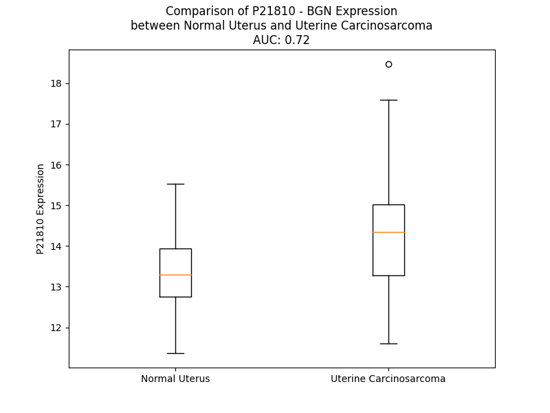

# Detailed Data for P21810

## Introduction to the Detailed Summary

### How to Interpret the Results

- **Summary & Metrics**: This section provides a quick reference to essential protein attributes, including expression changes, family classification, and biomarker applications. Regulation status (upregulated/downregulated) indicates the protein's behavior in a disease context. Some information comes from the original excel file with the proteins selected from literature, while others are derived from the analyses.
- **Expression Comparison**: A visual representation comparing protein expression between normal and disease states. It highlights significant changes in expression levels that might indicate diagnostic or therapeutic relevance. This is data coming from transcriptomics experiments and could not translate similarly to protein levels.
- **Isoform Alignment**: An interactive view of isoform alignments, revealing structural and functional differences between variants of the protein.
- **Interactors & Homologs**: Tables listing known interaction partners and homologous proteins, the more interactors and homologs, the more complex the protein is to design an antibody for.
- **Biological Assemblies**: Information about the structural arrangement of the protein in different assemblies, providing insights into its functional state but also the complexity of the protein to develop antibodies.
- **Combined Per-Residue Information**: A detailed table summarizing residue-level data. This includes predictions for epitope regions, aggregation tendencies, and modifications that might impact the protein's function. Each row corresponds to a residue in the protein, providing insights into specific sites that may be important for research or drug development.
## Summary & Metrics

- **UniProt Accession**: P21810
- **Gene Name**: BGN
- **Protein Name**: biglycan
- **Swiss Prot**: PGS1_HUMAN
- **Family**: nan
- **Biomarker Application**: nan
- **Number of Isoforms**: 0
- **Regulation**: 2
- **(transcriptomics) AUC**: 0.31
- **(transcriptomics) Fold Change**: 1.07
- **(transcriptomics) Regulation**: Downregulated
- **Discotope Epitope Count**: 81
- **Max n_uniprots (Homo)**: N/A
- **Max n_uniprots (Hetero)**: N/A

## Expression Comparison

## Interactors

| preferredName_A   | preferredName_B   |   score |
|:------------------|:------------------|--------:|
| BGN               | HSPG2             |   0.997 |
| BGN               | FN1               |   0.995 |
| BGN               | TLR4              |   0.994 |
| BGN               | ELN               |   0.99  |
| BGN               | DCN               |   0.989 |
| BGN               | TLR2              |   0.989 |
| BGN               | TGFB1             |   0.978 |
| BGN               | FMOD              |   0.976 |
| BGN               | COL1A1            |   0.974 |
| BGN               | CCN4              |   0.962 |
| BGN               | VCAN              |   0.951 |
| BGN               | SDC1              |   0.943 |
| BGN               | TNF               |   0.94  |
| BGN               | COL1A2            |   0.938 |
| BGN               | ACAN              |   0.928 |
| BGN               | AGRN              |   0.922 |
| BGN               | LUM               |   0.918 |

## Homologs

| uniprot_id   | gene_id   |
|:-------------|:----------|
| Q9HBW1       | LRRC4     |
| G3V1D7       | RTN4RL2   |
| Q5TBF2       | ASPN      |
| Q9NT99       | LRRC4B    |
| P07359       | GP1BA     |
| Q9GZU5       | NYX       |
| Q86VH5       | LRRTM3    |
| Q86UE6       | LRRTM1    |
| O43155       | FLRT2     |
| F8VXZ8       | DCN       |
| Q68CR7       | LRRC66    |
| B7Z3M0       | PODNL1    |
| Q9BZR6       | RTN4R     |
| Q86UN2       | RTN4RL1   |
| Q9HBL6       | LRTM1     |
| Q9NZU0       | FLRT3     |
| Q7Z5L7       | PODN      |
| Q8TF66       | LRRC15    |
| Q9HCJ2       | LRRC4C    |
| Q4KMX1       | LRRTM4    |
| Q9NZU1       | FLRT1     |
| Q9H756       | LRRC19    |

## Combined Per-Residue Information

|   res | aa   |   epitope_score | epitope   |   relative_surface_accessibility |   modeling_confidence |   Aggregation | modification   | glycosylation                                |
|------:|:-----|----------------:|:----------|---------------------------------:|----------------------:|--------------:|:---------------|:---------------------------------------------|
|     1 | M    |         0.2016  | False     |                          1.31116 |                 40.02 |         0     | N/A            | N/A                                          |
|     2 | W    |         0.3236  | True      |                          1.06377 |                 33.26 |         0     | N/A            | N/A                                          |
|     3 | P    |         0.20901 | True      |                          0.64282 |                 46.63 |         0     | N/A            | N/A                                          |
|     4 | L    |         0.16705 | False     |                          0.8161  |                 35.84 |         0     | N/A            | N/A                                          |
|     5 | W    |         0.34683 | True      |                          1.09147 |                 39.1  |         0     | N/A            | N/A                                          |
|     6 | R    |         0.18003 | False     |                          0.80656 |                 34.65 |         0     | N/A            | N/A                                          |
|     7 | L    |         0.23019 | True      |                          1.095   |                 37.39 |        25.89  | N/A            | N/A                                          |
|     8 | V    |         0.15286 | False     |                          0.82831 |                 33.9  |        29.96  | N/A            | N/A                                          |
|     9 | S    |         0.17449 | False     |                          0.78873 |                 36.86 |        30.775 | N/A            | N/A                                          |
|    10 | L    |         0.15971 | False     |                          1.03418 |                 35.65 |        31.5   | N/A            | N/A                                          |
|    11 | L    |         0.21667 | True      |                          0.99378 |                 35.1  |        31.5   | N/A            | N/A                                          |
|    12 | A    |         0.20146 | False     |                          0.97626 |                 38.23 |        27.82  | N/A            | N/A                                          |
|    13 | L    |         0.21661 | True      |                          0.89617 |                 35.66 |        24.139 | N/A            | N/A                                          |
|    14 | S    |         0.2192  | True      |                          0.85947 |                 32.41 |         3.309 | N/A            | N/A                                          |
|    15 | Q    |         0.21135 | True      |                          0.7592  |                 31.41 |         0     | N/A            | N/A                                          |
|    16 | A    |         0.14774 | False     |                          0.64539 |                 37.78 |         0     | N/A            | N/A                                          |
|    17 | L    |         0.1962  | False     |                          0.95282 |                 32.89 |         0     | N/A            | N/A                                          |
|    18 | P    |         0.24236 | True      |                          0.73626 |                 37.99 |         0     | N/A            | N/A                                          |
|    19 | F    |         0.15652 | False     |                          0.50136 |                 36.88 |         0     | N/A            | N/A                                          |
|    20 | E    |         0.30229 | True      |                          0.7733  |                 30.69 |         0     | N/A            | N/A                                          |
|    21 | Q    |         0.11405 | False     |                          0.39193 |                 39.71 |         0     | N/A            | N/A                                          |
|    22 | R    |         0.24499 | True      |                          0.90701 |                 34.52 |         0     | N/A            | N/A                                          |
|    23 | G    |         0.26832 | True      |                          0.71372 |                 32.68 |         0     | N/A            | N/A                                          |
|    24 | F    |         0.20448 | False     |                          0.33751 |                 41.54 |         0     | N/A            | N/A                                          |
|    25 | W    |         0.30945 | True      |                          1.01394 |                 36.44 |         0     | N/A            | N/A                                          |
|    26 | D    |         0.27142 | True      |                          0.72242 |                 38.41 |         0     | N/A            | N/A                                          |
|    27 | F    |         0.24411 | True      |                          0.43111 |                 41.22 |         0     | N/A            | N/A                                          |
|    28 | T    |         0.29963 | True      |                          0.83487 |                 36.47 |         0     | N/A            | N/A                                          |
|    29 | L    |         0.3342  | True      |                          0.91482 |                 35.68 |         0     | N/A            | N/A                                          |
|    30 | D    |         0.26048 | True      |                          0.92126 |                 34.67 |         0     | N/A            | N/A                                          |
|    31 | D    |         0.30718 | True      |                          0.91458 |                 35.08 |         0     | N/A            | N/A                                          |
|    32 | G    |         0.2666  | True      |                          0.6156  |                 32.34 |         0     | N/A            | N/A                                          |
|    33 | P    |         0.20248 | False     |                          0.95332 |                 28.93 |         0     | N/A            | N/A                                          |
|    34 | F    |         0.27284 | True      |                          0.93009 |                 32.76 |         0     | N/A            | N/A                                          |
|    35 | M    |         0.21885 | True      |                          0.90881 |                 32.63 |         0     | N/A            | N/A                                          |
|    36 | M    |         0.16979 | False     |                          0.96789 |                 30.53 |         0     | N/A            | N/A                                          |
|    37 | N    |         0.25132 | True      |                          0.96331 |                 38.26 |         0     | N/A            | N/A                                          |
|    38 | D    |         0.23076 | True      |                          0.78967 |                 33.04 |         0     | N/A            | N/A                                          |
|    39 | E    |         0.30961 | True      |                          0.9177  |                 39.8  |         0     | N/A            | N/A                                          |
|    40 | E    |         0.25183 | True      |                          0.92087 |                 34.84 |         0     | N/A            | N/A                                          |
|    41 | A    |         0.26828 | True      |                          0.99993 |                 40.64 |         0     | N/A            | N/A                                          |
|    42 | S    |         0.27064 | True      |                          0.92924 |                 36.31 |         0     | N/A            | O-linked (Xyl...) (glycosaminoglycan) serine |
|    43 | G    |         0.31368 | True      |                          0.87595 |                 38.73 |         0     | N/A            | N/A                                          |
|    44 | A    |         0.28436 | True      |                          0.95924 |                 40.75 |         0     | N/A            | N/A                                          |
|    45 | D    |         0.17652 | False     |                          0.86595 |                 34.11 |         0     | N/A            | N/A                                          |
|    46 | T    |         0.22274 | True      |                          0.96469 |                 43.65 |         0     | N/A            | N/A                                          |
|    47 | S    |         0.16092 | False     |                          0.93461 |                 36.63 |         0     | N/A            | O-linked (Xyl...) (glycosaminoglycan) serine |
|    48 | G    |         0.26787 | True      |                          0.83168 |                 41.59 |         0     | N/A            | N/A                                          |
|    49 | V    |         0.21861 | True      |                          1.02956 |                 46.24 |         0     | N/A            | N/A                                          |
|    50 | L    |         0.20931 | True      |                          1.05924 |                 40.14 |         0     | N/A            | N/A                                          |
|    51 | D    |         0.19166 | False     |                          0.72497 |                 45.63 |         0     | N/A            | N/A                                          |
|    52 | P    |         0.16846 | False     |                          0.89698 |                 44.76 |         0     | N/A            | N/A                                          |
|    53 | D    |         0.29332 | True      |                          0.77724 |                 45.58 |         0     | N/A            | N/A                                          |
|    54 | S    |         0.18683 | False     |                          0.71905 |                 38.79 |         0     | N/A            | N/A                                          |
|    55 | V    |         0.15557 | False     |                          0.92478 |                 39.05 |         0     | N/A            | N/A                                          |
|    56 | T    |         0.18179 | False     |                          0.70461 |                 36.64 |         0     | N/A            | N/A                                          |
|    57 | P    |         0.10759 | False     |                          0.6854  |                 38.76 |         0     | N/A            | N/A                                          |
|    58 | T    |         0.13062 | False     |                          0.83653 |                 38.22 |         0     | N/A            | N/A                                          |
|    59 | Y    |         0.18752 | False     |                          0.63367 |                 48.03 |         0     | N/A            | N/A                                          |
|    60 | S    |         0.16618 | False     |                          0.69116 |                 49.99 |         0     | N/A            | N/A                                          |
|    61 | A    |         0.17513 | False     |                          0.90433 |                 60.54 |         0     | N/A            | N/A                                          |
|    62 | M    |         0.12527 | False     |                          0.3796  |                 77.18 |         0     | N/A            | N/A                                          |
|    63 | C    |         0.15781 | False     |                          0.32062 |                 89.98 |         0     | N/A            | N/A                                          |
|    64 | P    |         0.04959 | False     |                          0.08152 |                 92.17 |         0     | N/A            | N/A                                          |
|    65 | F    |         0.2529  | True      |                          1.02699 |                 91.87 |         0     | N/A            | N/A                                          |
|    66 | G    |         0.20761 | False     |                          0.58602 |                 92.05 |         0     | N/A            | N/A                                          |
|    67 | C    |         0.11816 | False     |                          0.14052 |                 96.33 |         0     | N/A            | N/A                                          |
|    68 | H    |         0.18252 | False     |                          0.68134 |                 95.15 |         0     | N/A            | N/A                                          |
|    69 | C    |         0.05162 | False     |                          0.32225 |                 94.86 |         0     | N/A            | N/A                                          |
|    70 | H    |         0.20471 | False     |                          0.62368 |                 93.45 |         0     | N/A            | N/A                                          |
|    71 | L    |         0.25287 | True      |                          0.89894 |                 92.49 |         0     | N/A            | N/A                                          |
|    72 | R    |         0.18113 | False     |                          0.59082 |                 95.11 |         0     | N/A            | N/A                                          |
|    73 | V    |         0.10456 | False     |                          0.39577 |                 97.09 |         0     | N/A            | N/A                                          |
|    74 | V    |         0.01798 | False     |                          0.02285 |                 97.28 |         0     | N/A            | N/A                                          |
|    75 | Q    |         0.19464 | False     |                          0.33634 |                 97.62 |         0     | N/A            | N/A                                          |
|    76 | C    |         0.0132  | False     |                          0.00401 |                 97.92 |         0     | N/A            | N/A                                          |
|    77 | S    |         0.18153 | False     |                          0.14642 |                 97.33 |         0     | N/A            | N/A                                          |
|    78 | D    |         0.26194 | True      |                          0.58939 |                 97.98 |         0     | N/A            | N/A                                          |
|    79 | L    |         0.16533 | False     |                          0.42542 |                 97.53 |         0     | N/A            | N/A                                          |
|    80 | G    |         0.10604 | False     |                          0.44696 |                 97.21 |         0     | N/A            | N/A                                          |
|    81 | L    |         0.13393 | False     |                          0.21845 |                 97.68 |         0     | N/A            | N/A                                          |
|    82 | K    |         0.11878 | False     |                          0.82423 |                 97.25 |         0     | N/A            | N/A                                          |
|    83 | S    |         0.16964 | False     |                          0.41544 |                 97.6  |         0     | N/A            | N/A                                          |
|    84 | V    |         0.01903 | False     |                          0.0467  |                 97.66 |         0     | N/A            | N/A                                          |
|    85 | P    |         0.0876  | False     |                          0.13558 |                 95.93 |         0     | N/A            | N/A                                          |
|    86 | K    |         0.14354 | False     |                          0.9309  |                 91.56 |         0     | N/A            | N/A                                          |
|    87 | E    |         0.09447 | False     |                          0.47343 |                 90.23 |         0     | N/A            | N/A                                          |
|    88 | I    |         0.04611 | False     |                          0.07722 |                 94.48 |         0     | N/A            | N/A                                          |
|    89 | S    |         0.05434 | False     |                          0.13837 |                 94.43 |         0     | N/A            | N/A                                          |
|    90 | P    |         0.16169 | False     |                          0.33433 |                 94.79 |         0     | N/A            | N/A                                          |
|    91 | D    |         0.08874 | False     |                          0.42452 |                 94.91 |         0     | N/A            | N/A                                          |
|    92 | T    |         0.00947 | False     |                          0.00434 |                 96.92 |         0     | N/A            | N/A                                          |
|    93 | T    |         0.03705 | False     |                          0.29805 |                 98.01 |         0     | N/A            | N/A                                          |
|    94 | L    |         0.05602 | False     |                          0.1319  |                 98.29 |         0     | N/A            | N/A                                          |
|    95 | L    |         0.00421 | False     |                          0       |                 98.31 |         0     | N/A            | N/A                                          |
|    96 | D    |         0.03498 | False     |                          0.02015 |                 98.52 |         0     | N/A            | N/A                                          |
|    97 | L    |         0.00667 | False     |                          0       |                 98.36 |         0     | N/A            | N/A                                          |
|    98 | Q    |         0.27159 | True      |                          0.32256 |                 98.25 |         0     | N/A            | N/A                                          |
|    99 | N    |         0.15507 | False     |                          0.4478  |                 98.45 |         0     | N/A            | N/A                                          |
|   100 | N    |         0.15291 | False     |                          0.05264 |                 98.52 |         0     | N/A            | N/A                                          |
|   101 | D    |         0.11409 | False     |                          0.323   |                 98.45 |         0     | N/A            | N/A                                          |
|   102 | I    |         0.00794 | False     |                          0       |                 98.56 |         0     | N/A            | N/A                                          |
|   103 | S    |         0.05186 | False     |                          0.41793 |                 98.18 |         0     | N/A            | N/A                                          |
|   104 | E    |         0.0979  | False     |                          0.30428 |                 98.12 |         0     | N/A            | N/A                                          |
|   105 | L    |         0.01741 | False     |                          0.01523 |                 98.3  |         0     | N/A            | N/A                                          |
|   106 | R    |         0.2315  | True      |                          0.56588 |                 97.69 |         0     | N/A            | N/A                                          |
|   107 | K    |         0.1938  | False     |                          0.50938 |                 96.81 |         0     | N/A            | N/A                                          |
|   108 | D    |         0.14105 | False     |                          0.51473 |                 96.29 |         0     | N/A            | N/A                                          |
|   109 | D    |         0.16379 | False     |                          0.18358 |                 97.14 |         0     | N/A            | N/A                                          |
|   110 | F    |         0.0044  | False     |                          0.00137 |                 97.2  |         0     | N/A            | N/A                                          |
|   111 | K    |         0.18849 | False     |                          0.74738 |                 95.94 |         0     | N/A            | N/A                                          |
|   112 | G    |         0.08339 | False     |                          0.34176 |                 93.92 |         0.011 | N/A            | N/A                                          |
|   113 | L    |         0.01631 | False     |                          0.01814 |                 96.88 |         0.143 | N/A            | N/A                                          |
|   114 | Q    |         0.1522  | False     |                          0.43773 |                 96.36 |         0.21  | N/A            | N/A                                          |
|   115 | H    |         0.08124 | False     |                          0.49316 |                 97.09 |         1.953 | N/A            | N/A                                          |
|   116 | L    |         0.00364 | False     |                          0.00061 |                 98.35 |        79.771 | N/A            | N/A                                          |
|   117 | Y    |         0.09867 | False     |                          0.3496  |                 98.56 |        93.822 | N/A            | N/A                                          |
|   118 | A    |         0.0096  | False     |                          0.00128 |                 98.67 |        98.028 | N/A            | N/A                                          |
|   119 | L    |         0.00239 | False     |                          0.00132 |                 98.69 |        98.103 | N/A            | N/A                                          |
|   120 | V    |         0.08467 | False     |                          0.03713 |                 98.76 |        98.103 | N/A            | N/A                                          |
|   121 | L    |         0.00416 | False     |                          0       |                 98.65 |        96.993 | N/A            | N/A                                          |
|   122 | V    |         0.18705 | False     |                          0.15709 |                 98.7  |        89.831 | N/A            | N/A                                          |
|   123 | N    |         0.17647 | False     |                          0.43088 |                 98.57 |         1.378 | N/A            | N/A                                          |
|   124 | N    |         0.11039 | False     |                          0.04704 |                 98.7  |         0.049 | N/A            | N/A                                          |
|   125 | K    |         0.16387 | False     |                          0.52667 |                 98.39 |         0     | N/A            | N/A                                          |
|   126 | I    |         0.00936 | False     |                          0       |                 98.6  |         0     | N/A            | N/A                                          |
|   127 | S    |         0.08996 | False     |                          0.36577 |                 97.93 |         0     | N/A            | N/A                                          |
|   128 | K    |         0.24792 | True      |                          0.6971  |                 96.82 |         0     | N/A            | N/A                                          |
|   129 | I    |         0.12032 | False     |                          0.16528 |                 97.86 |         0     | N/A            | N/A                                          |
|   130 | H    |         0.1284  | False     |                          0.45498 |                 97.61 |         0     | N/A            | N/A                                          |
|   131 | E    |         0.11784 | False     |                          0.57587 |                 94.69 |         0     | N/A            | N/A                                          |
|   132 | K    |         0.12204 | False     |                          0.57092 |                 96.03 |         0     | N/A            | N/A                                          |
|   133 | A    |         0.00306 | False     |                          0       |                 97.51 |         0     | N/A            | N/A                                          |
|   134 | F    |         0.01156 | False     |                          0.0182  |                 97.44 |         0     | N/A            | N/A                                          |
|   135 | S    |         0.20429 | False     |                          0.50715 |                 95.91 |         0     | N/A            | N/A                                          |
|   136 | P    |         0.16194 | False     |                          0.22724 |                 96.49 |         0     | N/A            | N/A                                          |
|   137 | L    |         0.00712 | False     |                          0.00291 |                 97.79 |         0     | N/A            | N/A                                          |
|   138 | R    |         0.3141  | True      |                          0.72715 |                 96.23 |         0     | N/A            | N/A                                          |
|   139 | K    |         0.05473 | False     |                          0.57386 |                 97.87 |         0     | N/A            | N/A                                          |
|   140 | L    |         0.00376 | False     |                          0       |                 98.38 |         0     | N/A            | N/A                                          |
|   141 | Q    |         0.058   | False     |                          0.34213 |                 98.56 |         0     | N/A            | N/A                                          |
|   142 | K    |         0.11386 | False     |                          0.20512 |                 98.64 |         0     | N/A            | N/A                                          |
|   143 | L    |         0.00293 | False     |                          0       |                 98.65 |         0     | N/A            | N/A                                          |
|   144 | Y    |         0.04541 | False     |                          0.04    |                 98.75 |         0     | N/A            | N/A                                          |
|   145 | I    |         0.00709 | False     |                          0       |                 98.43 |         0     | N/A            | N/A                                          |
|   146 | S    |         0.16936 | False     |                          0.0991  |                 98.59 |         0     | N/A            | N/A                                          |
|   147 | K    |         0.14169 | False     |                          0.45745 |                 98.54 |         0     | N/A            | N/A                                          |
|   148 | N    |         0.09706 | False     |                          0.04837 |                 98.71 |         0     | N/A            | N/A                                          |
|   149 | H    |         0.09067 | False     |                          0.28887 |                 98.47 |         0     | N/A            | N/A                                          |
|   150 | L    |         0.01583 | False     |                          0.03215 |                 98.33 |         0     | N/A            | N/A                                          |
|   151 | V    |         0.10762 | False     |                          0.63988 |                 97.11 |         0     | N/A            | N/A                                          |
|   152 | E    |         0.18812 | False     |                          0.52457 |                 96.38 |         0     | N/A            | N/A                                          |
|   153 | I    |         0.03161 | False     |                          0.03117 |                 96.38 |         0     | N/A            | N/A                                          |
|   154 | P    |         0.02103 | False     |                          0.01789 |                 94.95 |         0     | N/A            | N/A                                          |
|   155 | P    |         0.16358 | False     |                          0.34892 |                 90.49 |         0     | N/A            | N/A                                          |
|   156 | N    |         0.12847 | False     |                          0.5703  |                 93.12 |         0     | N/A            | N/A                                          |
|   157 | L    |         0.0355  | False     |                          0.08968 |                 96.08 |         0     | N/A            | N/A                                          |
|   158 | P    |         0.02759 | False     |                          0.09444 |                 95.95 |         0     | N/A            | N/A                                          |
|   159 | S    |         0.18062 | False     |                          0.57285 |                 95.94 |         0     | N/A            | N/A                                          |
|   160 | S    |         0.05256 | False     |                          0.16733 |                 97.25 |         0     | N/A            | N/A                                          |
|   161 | L    |         0.0034  | False     |                          0       |                 97.87 |         0     | N/A            | N/A                                          |
|   162 | V    |         0.05967 | False     |                          0.29895 |                 98.21 |         0     | N/A            | N/A                                          |
|   163 | E    |         0.08569 | False     |                          0.10933 |                 98.47 |         0     | N/A            | N/A                                          |
|   164 | L    |         0.00298 | False     |                          0.00165 |                 98.33 |         0     | N/A            | N/A                                          |
|   165 | R    |         0.18289 | False     |                          0.18952 |                 98.63 |         0     | N/A            | N/A                                          |
|   166 | I    |         0.01451 | False     |                          0.004   |                 98.26 |         0     | N/A            | N/A                                          |
|   167 | H    |         0.1328  | False     |                          0.10791 |                 96.45 |         0     | N/A            | N/A                                          |
|   168 | D    |         0.12698 | False     |                          0.31949 |                 98.12 |         0     | N/A            | N/A                                          |
|   169 | N    |         0.12148 | False     |                          0.05523 |                 98.61 |         0     | N/A            | N/A                                          |
|   170 | R    |         0.15098 | False     |                          0.51213 |                 98.29 |         0     | N/A            | N/A                                          |
|   171 | I    |         0.00627 | False     |                          0       |                 98.07 |         0     | N/A            | N/A                                          |
|   172 | R    |         0.11227 | False     |                          0.60485 |                 97.2  |         0     | N/A            | N/A                                          |
|   173 | K    |         0.21284 | True      |                          0.61885 |                 96.85 |         0     | N/A            | N/A                                          |
|   174 | V    |         0.0071  | False     |                          0       |                 97.03 |         0     | N/A            | N/A                                          |
|   175 | P    |         0.11175 | False     |                          0.38073 |                 95.5  |         0     | N/A            | N/A                                          |
|   176 | K    |         0.22414 | True      |                          0.66848 |                 94.62 |         0     | N/A            | N/A                                          |
|   177 | G    |         0.10039 | False     |                          0.3494  |                 90.16 |         0     | N/A            | N/A                                          |
|   178 | V    |         0.13513 | False     |                          0.16979 |                 93.75 |         0     | N/A            | N/A                                          |
|   179 | F    |         0.01235 | False     |                          0.01197 |                 94.87 |         0     | N/A            | N/A                                          |
|   180 | S    |         0.17201 | False     |                          0.62912 |                 91.28 |         0     | N/A            | O-linked (Xyl...) (glycosaminoglycan) serine |
|   181 | G    |         0.10092 | False     |                          0.5205  |                 90.52 |         0     | N/A            | N/A                                          |
|   182 | L    |         0.02682 | False     |                          0.03572 |                 95.49 |         0     | N/A            | N/A                                          |
|   183 | R    |         0.34509 | True      |                          0.81236 |                 93.6  |         0     | N/A            | N/A                                          |
|   184 | N    |         0.11669 | False     |                          0.53201 |                 94.41 |         0     | N/A            | N/A                                          |
|   185 | M    |         0.03797 | False     |                          0.04571 |                 96.43 |         0     | N/A            | N/A                                          |
|   186 | N    |         0.06704 | False     |                          0.38376 |                 94.89 |         0     | N/A            | N/A                                          |
|   187 | C    |         0.10299 | False     |                          0.12269 |                 98.14 |         0     | N/A            | N/A                                          |
|   188 | I    |         0.0122  | False     |                          0.0016  |                 97.97 |         0     | N/A            | N/A                                          |
|   189 | E    |         0.11098 | False     |                          0.08642 |                 98.15 |         0     | N/A            | N/A                                          |
|   190 | M    |         0.00903 | False     |                          0.00144 |                 97.31 |         0     | N/A            | N/A                                          |
|   191 | G    |         0.01223 | False     |                          0       |                 97.33 |         0     | N/A            | N/A                                          |
|   192 | G    |         0.15006 | False     |                          0.2225  |                 97.74 |         0     | N/A            | N/A                                          |
|   193 | N    |         0.0561  | False     |                          0.00989 |                 98.35 |         0     | N/A            | N/A                                          |
|   194 | P    |         0.1507  | False     |                          0.22993 |                 97.57 |         0     | N/A            | N/A                                          |
|   195 | L    |         0.00634 | False     |                          0       |                 96.39 |         0     | N/A            | N/A                                          |
|   196 | E    |         0.23368 | True      |                          0.40608 |                 97.2  |         0     | N/A            | N/A                                          |
|   197 | N    |         0.21531 | True      |                          0.31158 |                 96.4  |         0     | N/A            | N/A                                          |
|   198 | S    |         0.19511 | False     |                          0.78709 |                 95.99 |         0     | N/A            | O-linked (Xyl...) (glycosaminoglycan) serine |
|   199 | G    |         0.0722  | False     |                          0.05117 |                 95.34 |         0     | N/A            | N/A                                          |
|   200 | F    |         0.07519 | False     |                          0.15831 |                 96.37 |         0     | N/A            | N/A                                          |
|   201 | E    |         0.22651 | True      |                          0.37563 |                 95.67 |         0     | N/A            | N/A                                          |
|   202 | P    |         0.24906 | True      |                          0.81441 |                 93.39 |         0     | N/A            | N/A                                          |
|   203 | G    |         0.07833 | False     |                          0.13187 |                 91.1  |         0     | N/A            | N/A                                          |
|   204 | A    |         0.04201 | False     |                          0.0271  |                 95.06 |         0     | N/A            | N/A                                          |
|   205 | F    |         0.04504 | False     |                          0.04543 |                 94.27 |         0     | N/A            | N/A                                          |
|   206 | D    |         0.3055  | True      |                          0.50156 |                 89.89 |         0     | N/A            | N/A                                          |
|   207 | G    |         0.15859 | False     |                          0.98656 |                 86.35 |         0     | N/A            | N/A                                          |
|   208 | L    |         0.08844 | False     |                          0.05745 |                 93.78 |         0     | N/A            | N/A                                          |
|   209 | K    |         0.14739 | False     |                          0.68362 |                 93.55 |         0     | N/A            | N/A                                          |
|   210 | L    |         0.01572 | False     |                          0.00531 |                 95.44 |         0     | N/A            | N/A                                          |
|   211 | N    |         0.10498 | False     |                          0.38802 |                 96.73 |         0     | N/A            | N/A                                          |
|   212 | Y    |         0.15208 | False     |                          0.23488 |                 98.43 |         0     | N/A            | N/A                                          |
|   213 | L    |         0.00305 | False     |                          0       |                 98.15 |         0     | N/A            | N/A                                          |
|   214 | R    |         0.08768 | False     |                          0.16607 |                 98.53 |         0     | N/A            | N/A                                          |
|   215 | I    |         0.00583 | False     |                          0       |                 97.78 |         0     | N/A            | N/A                                          |
|   216 | S    |         0.01963 | False     |                          0       |                 97.38 |         0     | N/A            | N/A                                          |
|   217 | E    |         0.20234 | False     |                          0.39266 |                 97.72 |         0     | N/A            | N/A                                          |
|   218 | A    |         0.11768 | False     |                          0.09688 |                 97.5  |         0     | N/A            | N/A                                          |
|   219 | K    |         0.19102 | False     |                          0.36809 |                 97.7  |         0     | N/A            | N/A                                          |
|   220 | L    |         0.00367 | False     |                          0       |                 98.19 |         0     | N/A            | N/A                                          |
|   221 | T    |         0.11375 | False     |                          0.50898 |                 97.84 |         0     | N/A            | N/A                                          |
|   222 | G    |         0.14299 | False     |                          0.24557 |                 97.65 |         0     | N/A            | N/A                                          |
|   223 | I    |         0.04253 | False     |                          0.03508 |                 97.78 |         0     | N/A            | N/A                                          |
|   224 | P    |         0.05323 | False     |                          0.08847 |                 96.18 |         0     | N/A            | N/A                                          |
|   225 | K    |         0.16116 | False     |                          0.44749 |                 94.56 |         0     | N/A            | N/A                                          |
|   226 | D    |         0.20263 | False     |                          0.4968  |                 92.63 |         0     | N/A            | N/A                                          |
|   227 | L    |         0.02823 | False     |                          0.02146 |                 95.07 |         0     | N/A            | N/A                                          |
|   228 | P    |         0.0372  | False     |                          0.06163 |                 94.83 |         0     | N/A            | N/A                                          |
|   229 | E    |         0.20183 | False     |                          0.44612 |                 94.82 |         0     | N/A            | N/A                                          |
|   230 | T    |         0.1305  | False     |                          0.26844 |                 96.14 |         0     | N/A            | N/A                                          |
|   231 | L    |         0.00512 | False     |                          0.00082 |                 97.49 |         0     | N/A            | N/A                                          |
|   232 | N    |         0.13079 | False     |                          0.29361 |                 98.14 |         0     | N/A            | N/A                                          |
|   233 | E    |         0.1088  | False     |                          0.17161 |                 98.57 |         0     | N/A            | N/A                                          |
|   234 | L    |         0.00266 | False     |                          0       |                 98.51 |         0     | N/A            | N/A                                          |
|   235 | H    |         0.11398 | False     |                          0.18466 |                 98.7  |         0     | N/A            | N/A                                          |
|   236 | L    |         0.00552 | False     |                          0       |                 98.6  |         0     | N/A            | N/A                                          |
|   237 | D    |         0.21254 | True      |                          0.10363 |                 98.4  |         0     | N/A            | N/A                                          |
|   238 | H    |         0.14358 | False     |                          0.33881 |                 98.55 |         0     | N/A            | N/A                                          |
|   239 | N    |         0.15002 | False     |                          0.05977 |                 98.63 |         0     | N/A            | N/A                                          |
|   240 | K    |         0.19761 | False     |                          0.49913 |                 98.39 |         0     | N/A            | N/A                                          |
|   241 | I    |         0.01811 | False     |                          0       |                 98.56 |         0     | N/A            | N/A                                          |
|   242 | Q    |         0.11161 | False     |                          0.501   |                 97.78 |         0     | N/A            | N/A                                          |
|   243 | A    |         0.14976 | False     |                          0.24565 |                 98.03 |         0     | N/A            | N/A                                          |
|   244 | I    |         0.0215  | False     |                          0.00532 |                 98.35 |         0     | N/A            | N/A                                          |
|   245 | E    |         0.18918 | False     |                          0.47636 |                 97.61 |         0     | N/A            | N/A                                          |
|   246 | L    |         0.23302 | True      |                          0.3858  |                 96.99 |         0     | N/A            | N/A                                          |
|   247 | E    |         0.16155 | False     |                          0.42844 |                 96.43 |         0     | N/A            | N/A                                          |
|   248 | D    |         0.04587 | False     |                          0.0415  |                 97.41 |         0     | N/A            | N/A                                          |
|   249 | L    |         0.00585 | False     |                          0       |                 97.13 |         0     | N/A            | N/A                                          |
|   250 | L    |         0.24085 | True      |                          0.54278 |                 96.59 |         0     | N/A            | N/A                                          |
|   251 | R    |         0.15506 | False     |                          0.40266 |                 94.77 |         0     | N/A            | N/A                                          |
|   252 | Y    |         0.00888 | False     |                          0.00113 |                 96.8  |         0     | N/A            | N/A                                          |
|   253 | S    |         0.25969 | True      |                          0.39281 |                 96.88 |         0     | N/A            | N/A                                          |
|   254 | K    |         0.12181 | False     |                          0.53447 |                 97.65 |         0     | N/A            | N/A                                          |
|   255 | L    |         0.00273 | False     |                          0       |                 98.39 |         0     | N/A            | N/A                                          |
|   256 | Y    |         0.12577 | False     |                          0.40886 |                 98.17 |         0     | N/A            | N/A                                          |
|   257 | R    |         0.24265 | True      |                          0.33274 |                 98.7  |         0     | N/A            | N/A                                          |
|   258 | L    |         0.00732 | False     |                          0.00802 |                 98.68 |         0     | N/A            | N/A                                          |
|   259 | G    |         0.10364 | False     |                          0.04944 |                 98.7  |         0     | N/A            | N/A                                          |
|   260 | L    |         0.00528 | False     |                          0       |                 98.73 |         0     | N/A            | N/A                                          |
|   261 | G    |         0.12652 | False     |                          0.05427 |                 98.45 |         0     | N/A            | N/A                                          |
|   262 | H    |         0.14834 | False     |                          0.41507 |                 98.67 |         0     | N/A            | N/A                                          |
|   263 | N    |         0.17854 | False     |                          0.06668 |                 98.79 |         0     | N/A            | N/A                                          |
|   264 | Q    |         0.18268 | False     |                          0.32547 |                 98.48 |         0     | N/A            | N/A                                          |
|   265 | I    |         0.01481 | False     |                          0       |                 98.67 |         0     | N/A            | N/A                                          |
|   266 | R    |         0.17926 | False     |                          0.59862 |                 98.03 |         0     | N/A            | N/A                                          |
|   267 | M    |         0.35362 | True      |                          0.6907  |                 96.58 |         0     | N/A            | N/A                                          |
|   268 | I    |         0.0782  | False     |                          0.06382 |                 98.19 |         0     | N/A            | N/A                                          |
|   269 | E    |         0.14334 | False     |                          0.42851 |                 97.63 |         0     | N/A            | N/A                                          |
|   270 | N    |         0.17815 | False     |                          0.5951  |                 96.19 |         0     | N/A            | N-linked (GlcNAc...) asparagine              |
|   271 | G    |         0.08357 | False     |                          0.3835  |                 96.42 |         0     | N/A            | N/A                                          |
|   272 | S    |         0.00388 | False     |                          0.00079 |                 97.65 |         0     | N/A            | N/A                                          |
|   273 | L    |         0.01724 | False     |                          0.01213 |                 97.75 |         0     | N/A            | N/A                                          |
|   274 | S    |         0.14714 | False     |                          0.55331 |                 96.9  |         0     | N/A            | N/A                                          |
|   275 | F    |         0.08121 | False     |                          0.30299 |                 97.35 |         0     | N/A            | N/A                                          |
|   276 | L    |         0.00321 | False     |                          0       |                 97.9  |         0     | N/A            | N/A                                          |
|   277 | P    |         0.16603 | False     |                          0.56027 |                 96.42 |         0     | N/A            | N/A                                          |
|   278 | T    |         0.06182 | False     |                          0.26468 |                 97.21 |         0     | N/A            | N/A                                          |
|   279 | L    |         0.00635 | False     |                          0.00315 |                 98.33 |         0     | N/A            | N/A                                          |
|   280 | R    |         0.05165 | False     |                          0.39079 |                 98.3  |         0     | N/A            | N/A                                          |
|   281 | E    |         0.19237 | False     |                          0.21068 |                 98.6  |         0     | N/A            | N/A                                          |
|   282 | L    |         0.00316 | False     |                          0       |                 98.64 |         0     | N/A            | N/A                                          |
|   283 | H    |         0.18065 | False     |                          0.31392 |                 98.73 |         0     | N/A            | N/A                                          |
|   284 | L    |         0.00385 | False     |                          0       |                 98.66 |         0     | N/A            | N/A                                          |
|   285 | D    |         0.13009 | False     |                          0.0717  |                 98.56 |         0     | N/A            | N/A                                          |
|   286 | N    |         0.1385  | False     |                          0.27758 |                 98.64 |         0     | N/A            | N/A                                          |
|   287 | N    |         0.16023 | False     |                          0.07923 |                 98.75 |         0     | N/A            | N/A                                          |
|   288 | K    |         0.13883 | False     |                          0.47586 |                 98.38 |         0     | N/A            | N/A                                          |
|   289 | L    |         0.02022 | False     |                          0.02638 |                 98.46 |         0     | N/A            | N/A                                          |
|   290 | A    |         0.11931 | False     |                          0.52284 |                 97.41 |         0     | N/A            | N/A                                          |
|   291 | R    |         0.2256  | True      |                          0.61117 |                 97.5  |         0     | N/A            | N/A                                          |
|   292 | V    |         0.01788 | False     |                          0.05514 |                 97.89 |         0     | N/A            | N/A                                          |
|   293 | P    |         0.02738 | False     |                          0.04603 |                 97.5  |         0     | N/A            | N/A                                          |
|   294 | S    |         0.089   | False     |                          0.30657 |                 95.52 |         0     | N/A            | N/A                                          |
|   295 | G    |         0.14521 | False     |                          0.27777 |                 95.18 |         0     | N/A            | N/A                                          |
|   296 | L    |         0.00598 | False     |                          0       |                 96.83 |         0     | N/A            | N/A                                          |
|   297 | P    |         0.08624 | False     |                          0.18347 |                 94.73 |         0     | N/A            | N/A                                          |
|   298 | D    |         0.1786  | False     |                          0.62829 |                 93.56 |         0.907 | N/A            | N/A                                          |
|   299 | L    |         0.02343 | False     |                          0.0272  |                 95.69 |         0.907 | N/A            | N/A                                          |
|   300 | K    |         0.15435 | False     |                          0.59388 |                 94.16 |         0.907 | N/A            | N/A                                          |
|   301 | L    |         0.06694 | False     |                          0.48955 |                 96.39 |        40.685 | N/A            | N/A                                          |
|   302 | L    |         0.00552 | False     |                          0       |                 97.63 |        47.662 | N/A            | N/A                                          |
|   303 | Q    |         0.05117 | False     |                          0.17806 |                 97    |        50.57  | N/A            | N/A                                          |
|   304 | V    |         0.25211 | True      |                          0.15995 |                 98.11 |        52.241 | N/A            | N/A                                          |
|   305 | V    |         0.00274 | False     |                          0       |                 98.38 |        52.241 | N/A            | N/A                                          |
|   306 | Y    |         0.28272 | True      |                          0.30131 |                 98.54 |        50.507 | N/A            | N/A                                          |
|   307 | L    |         0.00422 | False     |                          0       |                 98.47 |        43.517 | N/A            | N/A                                          |
|   308 | H    |         0.19289 | False     |                          0.17649 |                 97.85 |         2.496 | N/A            | N/A                                          |
|   309 | S    |         0.14235 | False     |                          0.2392  |                 97.95 |         0.263 | N/A            | N/A                                          |
|   310 | N    |         0.2316  | True      |                          0.08406 |                 98.29 |         0     | N/A            | N/A                                          |
|   311 | N    |         0.13487 | False     |                          0.5081  |                 97.78 |         0     | N/A            | N-linked (GlcNAc...) asparagine              |
|   312 | I    |         0.00712 | False     |                          0       |                 97.65 |         0     | N/A            | N/A                                          |
|   313 | T    |         0.15977 | False     |                          0.56004 |                 96.06 |         0     | N/A            | N/A                                          |
|   314 | K    |         0.22734 | True      |                          0.76313 |                 96.01 |         0     | N/A            | N/A                                          |
|   315 | V    |         0.07756 | False     |                          0.08546 |                 97.39 |         0     | N/A            | N/A                                          |
|   316 | G    |         0.06654 | False     |                          0.28056 |                 96.44 |         0     | N/A            | N/A                                          |
|   317 | V    |         0.10883 | False     |                          0.35844 |                 95.75 |         0     | N/A            | N/A                                          |
|   318 | N    |         0.11832 | False     |                          0.35904 |                 95.34 |         0     | N/A            | N/A                                          |
|   319 | D    |         0.12288 | False     |                          0.24289 |                 96.83 |         0     | N/A            | N/A                                          |
|   320 | F    |         0.0018  | False     |                          0       |                 96.02 |         0     | N/A            | N/A                                          |
|   321 | C    |         0.01224 | False     |                          0.002   |                 94.68 |         0     | N/A            | N/A                                          |
|   322 | P    |         0.12306 | False     |                          0.1941  |                 91.94 |         0     | N/A            | N/A                                          |
|   323 | M    |         0.37877 | True      |                          0.86877 |                 86.47 |         0     | N/A            | N/A                                          |
|   324 | G    |         0.38464 | True      |                          0.48752 |                 75.99 |         0     | N/A            | N/A                                          |
|   325 | F    |         0.2334  | True      |                          0.99495 |                 62.54 |         0     | N/A            | N/A                                          |
|   326 | G    |         0.43524 | True      |                          0.92736 |                 64.04 |         0     | N/A            | N/A                                          |
|   327 | V    |         0.21243 | True      |                          0.5469  |                 68.78 |         0     | N/A            | N/A                                          |
|   328 | K    |         0.25886 | True      |                          0.94981 |                 75.96 |         0     | N/A            | N/A                                          |
|   329 | R    |         0.2265  | True      |                          0.12854 |                 88.38 |         0     | N/A            | N/A                                          |
|   330 | A    |         0.10178 | False     |                          0.22321 |                 91.4  |         0     | N/A            | N/A                                          |
|   331 | Y    |         0.20753 | False     |                          0.5973  |                 93.79 |         0     | N/A            | N/A                                          |
|   332 | Y    |         0.0044  | False     |                          0       |                 95.91 |         0     | N/A            | N/A                                          |
|   333 | N    |         0.16411 | False     |                          0.51978 |                 94.33 |         0     | N/A            | N/A                                          |
|   334 | G    |         0.09596 | False     |                          0.12071 |                 95.8  |         0.458 | N/A            | N/A                                          |
|   335 | I    |         0.01495 | False     |                          0.0041  |                 97.26 |         0.659 | N/A            | N/A                                          |
|   336 | S    |         0.02655 | False     |                          0.00312 |                 96.94 |         0.659 | N/A            | N/A                                          |
|   337 | L    |         0.0114  | False     |                          0.00548 |                 96.83 |         0.659 | N/A            | N/A                                          |
|   338 | F    |         0.25316 | True      |                          0.28881 |                 95.74 |         0.659 | N/A            | N/A                                          |
|   339 | N    |         0.29091 | True      |                          0.68945 |                 96.03 |         0.2   | N/A            | N/A                                          |
|   340 | N    |         0.25689 | True      |                          0.13784 |                 96.96 |         0     | N/A            | N/A                                          |
|   341 | P    |         0.19473 | False     |                          0.55019 |                 96.15 |         0     | N/A            | N/A                                          |
|   342 | V    |         0.05521 | False     |                          0.02957 |                 95.06 |         0     | N/A            | N/A                                          |
|   343 | P    |         0.19572 | False     |                          0.22367 |                 92.15 |         0     | N/A            | N/A                                          |
|   344 | Y    |         0.31075 | True      |                          0.5434  |                 90.97 |         0     | N/A            | N/A                                          |
|   345 | W    |         0.34689 | True      |                          0.77518 |                 91.24 |         0     | N/A            | N/A                                          |
|   346 | E    |         0.31436 | True      |                          0.54713 |                 93.56 |         0     | N/A            | N/A                                          |
|   347 | V    |         0.15659 | False     |                          0.08289 |                 94.73 |         0     | N/A            | N/A                                          |
|   348 | Q    |         0.16853 | False     |                          0.52549 |                 94.45 |         0     | N/A            | N/A                                          |
|   349 | P    |         0.20599 | False     |                          0.90707 |                 92.23 |         0     | N/A            | N/A                                          |
|   350 | A    |         0.06936 | False     |                          0.47797 |                 93.62 |         0     | N/A            | N/A                                          |
|   351 | T    |         0.01126 | False     |                          0.00145 |                 95.23 |         0     | N/A            | N/A                                          |
|   352 | F    |         0.09512 | False     |                          0.15498 |                 94.61 |         0     | N/A            | N/A                                          |
|   353 | R    |         0.21193 | True      |                          0.32933 |                 93.03 |         0     | N/A            | N/A                                          |
|   354 | C    |         0.06438 | False     |                          0.10916 |                 92.65 |         0     | N/A            | N/A                                          |
|   355 | V    |         0.08876 | False     |                          0.14551 |                 93.57 |         0     | N/A            | N/A                                          |
|   356 | T    |         0.23556 | True      |                          0.58489 |                 89.8  |         0     | N/A            | N/A                                          |
|   357 | D    |         0.30003 | True      |                          0.47495 |                 88.47 |         0     | N/A            | N/A                                          |
|   358 | R    |         0.22321 | True      |                          0.72272 |                 89.21 |         0     | N/A            | N/A                                          |
|   359 | L    |         0.10614 | False     |                          0.83728 |                 90.66 |         4.178 | N/A            | N/A                                          |
|   360 | A    |         0.0933  | False     |                          0.1205  |                 92.4  |         4.178 | N/A            | N/A                                          |
|   361 | I    |         0.13269 | False     |                          0.15085 |                 93.45 |         4.178 | N/A            | N/A                                          |
|   362 | Q    |         0.13615 | False     |                          0.47904 |                 91.81 |         4.178 | N/A            | N/A                                          |
|   363 | F    |         0.08866 | False     |                          0.15903 |                 86.1  |         4.178 | N/A            | N/A                                          |
|   364 | G    |         0.18421 | False     |                          0.71741 |                 67.56 |         0.342 | N/A            | N/A                                          |
|   365 | N    |         0.21698 | True      |                          0.57235 |                 55.87 |         0     | N/A            | N/A                                          |
|   366 | Y    |         0.27807 | True      |                          0.54892 |                 47.56 |         0     | N/A            | N/A                                          |
|   367 | K    |         0.21305 | True      |                          0.91377 |                 39.02 |         0     | N/A            | N/A                                          |
|   368 | K    |         0.17714 | False     |                          1.29389 |                 32.72 |         0     | N/A            | N/A                                          |

