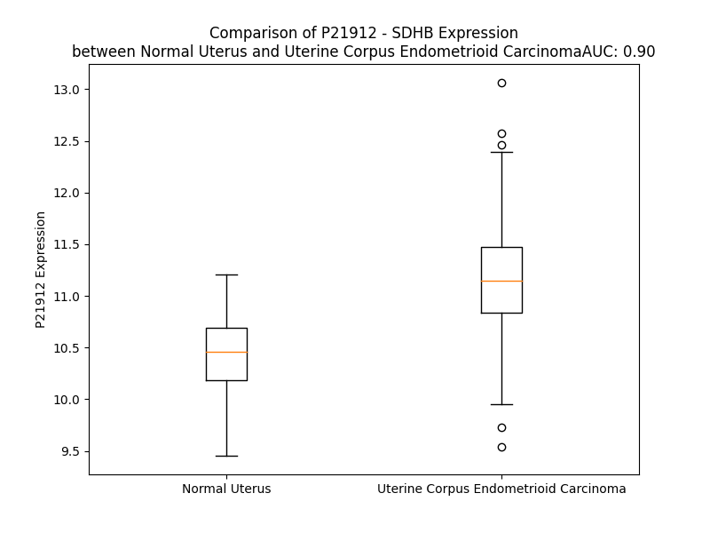

# Detailed Data for P21912

## Introduction to the Detailed Summary

### How to Interpret the Results

- **Summary & Metrics**: This section provides a quick reference to essential protein attributes, including expression changes, family classification, and biomarker applications. Regulation status (upregulated/downregulated) indicates the protein's behavior in a disease context. Some information comes from the original excel file with the proteins selected from literature, while others are derived from the analyses.
- **Expression Comparison**: A visual representation comparing protein expression between normal and disease states. It highlights significant changes in expression levels that might indicate diagnostic or therapeutic relevance. This is data coming from transcriptomics experiments and could not translate similarly to protein levels.
- **Isoform Alignment**: An interactive view of isoform alignments, revealing structural and functional differences between variants of the protein.
- **Interactors & Homologs**: Tables listing known interaction partners and homologous proteins, the more interactors and homologs, the more complex the protein is to design an antibody for.
- **Biological Assemblies**: Information about the structural arrangement of the protein in different assemblies, providing insights into its functional state but also the complexity of the protein to develop antibodies.
- **Combined Per-Residue Information**: A detailed table summarizing residue-level data. This includes predictions for epitope regions, aggregation tendencies, and modifications that might impact the protein's function. Each row corresponds to a residue in the protein, providing insights into specific sites that may be important for research or drug development.
## Summary & Metrics

- **UniProt Accession**: P21912
- **Gene Name**: SDHB
- **Protein Name**: Succinate dehydrogenase (ubiquinone)
- **Swiss Prot**: DHSB_HUMAN
- **Family**: enzyme
- **Biomarker Application**:  
- **Number of Isoforms**: 0
- **Regulation**: 2
- **(transcriptomics) AUC**: 0.9
- **(transcriptomics) Fold Change**: 1.07
- **(transcriptomics) Regulation**: Upregulated
- **Discotope Epitope Count**: 52
- **Max n_uniprots (Homo)**: N/A
- **Max n_uniprots (Hetero)**: 4

## Expression Comparison

## Interactors

| preferredName_A   | preferredName_B   |   score |
|:------------------|:------------------|--------:|
| SDHB              | SDHA              |   0.999 |
| SDHB              | SDHC              |   0.999 |
| SDHB              | FH                |   0.999 |
| SDHB              | SUCLG1            |   0.999 |
| SDHB              | NDUFV2            |   0.999 |
| SDHB              | SDHD              |   0.999 |
| SDHB              | NDUFS8            |   0.998 |
| SDHB              | SDHAF2            |   0.998 |
| SDHB              | UQCRFS1           |   0.998 |
| SDHB              | NDUFB8            |   0.997 |
| SDHB              | NDUFS2            |   0.997 |
| SDHB              | SUCLA2            |   0.997 |
| SDHB              | UQCRC2            |   0.997 |
| SDHB              | NDUFS1            |   0.996 |
| SDHB              | CS                |   0.996 |
| SDHB              | NDUFS3            |   0.996 |
| SDHB              | F5H5T6_HUMAN      |   0.994 |
| SDHB              | NDUFV1            |   0.993 |
| SDHB              | SUCLG2            |   0.993 |
| SDHB              | SDHAF1            |   0.991 |
| SDHB              | MT-CO1            |   0.991 |
| SDHB              | MT-CO3            |   0.982 |
| SDHB              | MT-CO2            |   0.98  |
| SDHB              | NDUFS7            |   0.976 |
| SDHB              | CYC1              |   0.975 |
| SDHB              | COX5B             |   0.972 |
| SDHB              | MT-ND1            |   0.971 |
| SDHB              | MDH2              |   0.971 |
| SDHB              | ATP5F1C           |   0.968 |
| SDHB              | NDUFB9            |   0.966 |
| SDHB              | NDUFA9            |   0.965 |
| SDHB              | MT-ND4            |   0.958 |
| SDHB              | NDUFA2            |   0.958 |
| SDHB              | UQCRB             |   0.957 |
| SDHB              | ACLY              |   0.953 |
| SDHB              | TRAP1             |   0.953 |
| SDHB              | NDUFA8            |   0.952 |
| SDHB              | ATP5F1A           |   0.949 |
| SDHB              | COX5A             |   0.946 |
| SDHB              | MT-CYB            |   0.946 |
| SDHB              | ACO2              |   0.94  |
| SDHB              | UQCRC1            |   0.938 |
| SDHB              | TMEM127           |   0.934 |
| SDHB              | COX4I1            |   0.932 |
| SDHB              | ATP5F1D           |   0.931 |
| SDHB              | NDUFA12           |   0.931 |
| SDHB              | SDHAF3            |   0.93  |
| SDHB              | GPD2              |   0.93  |
| SDHB              | MT-ND5            |   0.928 |
| SDHB              | HTT               |   0.927 |

## Homologs

| uniprot_id   | gene_id   |
|--------------|-----------|

## Biological Assemblies

|   Unnamed: 0 |   assembly |   n_uniprots | composition   | crystal_id   |
|-------------:|-----------:|-------------:|:--------------|:-------------|
|            0 |          1 |            2 | Hetero        | 7klv         |
|            0 |          1 |            4 | Hetero        | 8gs8         |
|            0 |          1 |            3 | Hetero        | 7kcl         |
|            0 |          1 |            3 | Hetero        | 7kcm         |
|            0 |          1 |            4 | Hetero        | 7klu         |

## Combined Per-Residue Information

|   res | aa   |   epitope_score | epitope   |   relative_surface_accessibility |   modeling_confidence |   Aggregation | modification    |
|------:|:-----|----------------:|:----------|---------------------------------:|----------------------:|--------------:|:----------------|
|     1 | M    |         0.15189 | False     |                          1.33504 |                 42.53 |         0     | N/A             |
|     2 | A    |         0.16484 | False     |                          1.03955 |                 43.25 |        27.248 | N/A             |
|     3 | A    |         0.1384  | False     |                          0.94887 |                 36.62 |        38.238 | N/A             |
|     4 | V    |         0.12223 | False     |                          0.96927 |                 43.91 |        41.431 | N/A             |
|     5 | V    |         0.21479 | False     |                          0.96061 |                 45.53 |        41.612 | N/A             |
|     6 | A    |         0.10703 | False     |                          0.8177  |                 39.9  |        41.612 | N/A             |
|     7 | L    |         0.13894 | False     |                          1.04553 |                 46.42 |        37.829 | N/A             |
|     8 | S    |         0.1046  | False     |                          0.75279 |                 44.93 |         7.496 | N/A             |
|     9 | L    |         0.14875 | False     |                          1.03546 |                 53.29 |         5.055 | N/A             |
|    10 | R    |         0.17907 | False     |                          0.85831 |                 45.43 |         0     | N/A             |
|    11 | R    |         0.19465 | False     |                          0.93944 |                 51.57 |         0     | N/A             |
|    12 | R    |         0.17855 | False     |                          0.85897 |                 49.33 |         0     | N/A             |
|    13 | L    |         0.15443 | False     |                          1.02716 |                 55.22 |         0     | N/A             |
|    14 | P    |         0.1551  | False     |                          0.84758 |                 49.16 |         0     | N/A             |
|    15 | A    |         0.09303 | False     |                          0.93509 |                 46.94 |         0     | N/A             |
|    16 | T    |         0.13633 | False     |                          0.91977 |                 52.87 |         0     | N/A             |
|    17 | T    |         0.14988 | False     |                          0.93317 |                 49.99 |         0     | N/A             |
|    18 | L    |         0.16761 | False     |                          1.06008 |                 54.01 |         0     | N/A             |
|    19 | G    |         0.17368 | False     |                          0.88076 |                 46.73 |         0     | N/A             |
|    20 | G    |         0.13125 | False     |                          1.08409 |                 39.96 |         0     | N/A             |
|    21 | A    |         0.09721 | False     |                          0.76661 |                 54.64 |         0     | N/A             |
|    22 | C    |         0.12433 | False     |                          0.95623 |                 49.21 |         0     | N/A             |
|    23 | L    |         0.11257 | False     |                          0.98257 |                 55.04 |         0     | N/A             |
|    24 | Q    |         0.11044 | False     |                          0.83286 |                 54.56 |         0     | N/A             |
|    25 | A    |         0.10331 | False     |                          0.85713 |                 57.28 |         0     | N/A             |
|    26 | S    |         0.08888 | False     |                          0.80946 |                 56.73 |         0     | N/A             |
|    27 | R    |         0.17255 | False     |                          0.93197 |                 53.53 |         0     | N/A             |
|    28 | G    |         0.11695 | False     |                          0.75268 |                 51.25 |         0     | N/A             |
|    29 | A    |         0.1185  | False     |                          0.86377 |                 56.45 |         0     | N/A             |
|    30 | Q    |         0.15374 | False     |                          0.88494 |                 52.13 |         0     | N/A             |
|    31 | T    |         0.14015 | False     |                          0.8747  |                 55.17 |         0     | N/A             |
|    32 | A    |         0.13867 | False     |                          0.9072  |                 61.99 |         0     | N/A             |
|    33 | A    |         0.10265 | False     |                          0.91879 |                 65.26 |         0     | N/A             |
|    34 | A    |         0.08494 | False     |                          0.95043 |                 74.48 |         0     | N/A             |
|    35 | T    |         0.10681 | False     |                          0.77472 |                 84.51 |         0     | N/A             |
|    36 | A    |         0.09755 | False     |                          0.71354 |                 92.3  |         0     | N/A             |
|    37 | P    |         0.1638  | False     |                          0.64637 |                 95.11 |         0     | N/A             |
|    38 | R    |         0.18898 | False     |                          0.38639 |                 97.66 |         0     | N/A             |
|    39 | I    |         0.12948 | False     |                          0.39023 |                 98.28 |         0     | N/A             |
|    40 | K    |         0.02301 | False     |                          0.0017  |                 98.53 |         0     | N/A             |
|    41 | K    |         0.1329  | False     |                          0.41602 |                 98.8  |         0     | N/A             |
|    42 | F    |         0.00494 | False     |                          0.00191 |                 98.89 |         0     | N/A             |
|    43 | A    |         0.09156 | False     |                          0.09821 |                 98.84 |         0     | N/A             |
|    44 | I    |         0.00427 | False     |                          0       |                 98.93 |         0     | N/A             |
|    45 | Y    |         0.2196  | False     |                          0.14279 |                 98.88 |         0     | N/A             |
|    46 | R    |         0.24189 | False     |                          0.08285 |                 98.82 |         0     | N/A             |
|    47 | W    |         0.25817 | True      |                          0.28179 |                 98.72 |         0     | N/A             |
|    48 | D    |         0.2167  | False     |                          0.28109 |                 98.5  |         0     | N/A             |
|    49 | P    |         0.29974 | True      |                          0.46126 |                 97.9  |         0     | N/A             |
|    50 | D    |         0.3317  | True      |                          0.75729 |                 97.9  |         0     | N/A             |
|    51 | K    |         0.36435 | True      |                          0.61045 |                 97.01 |         0     | N6-acetyllysine |
|    52 | A    |         0.27237 | True      |                          1.01213 |                 94.96 |         0     | N/A             |
|    53 | G    |         0.273   | True      |                          0.83556 |                 95.57 |         0     | N/A             |
|    54 | D    |         0.3335  | True      |                          0.15221 |                 96.65 |         0     | N/A             |
|    55 | K    |         0.24633 | False     |                          0.77309 |                 97.82 |         0     | N6-acetyllysine |
|    56 | P    |         0.44346 | True      |                          0.55168 |                 98.45 |         0     | N/A             |
|    57 | H    |         0.26764 | True      |                          0.47485 |                 98.58 |         0     | N/A             |
|    58 | M    |         0.28179 | True      |                          0.39263 |                 98.74 |         0     | N/A             |
|    59 | Q    |         0.13307 | False     |                          0.31525 |                 98.68 |         0     | N/A             |
|    60 | T    |         0.17728 | False     |                          0.5388  |                 98.76 |         0     | N/A             |
|    61 | Y    |         0.05195 | False     |                          0.03436 |                 98.8  |         0     | N/A             |
|    62 | E    |         0.21063 | False     |                          0.48902 |                 98.57 |         0     | N/A             |
|    63 | V    |         0.03012 | False     |                          0.03047 |                 98.55 |         0     | N/A             |
|    64 | D    |         0.0562  | False     |                          0.1346  |                 98.31 |         0     | N/A             |
|    65 | L    |         0.13594 | False     |                          0.13911 |                 98.31 |         0     | N/A             |
|    66 | N    |         0.2175  | False     |                          0.4112  |                 97.57 |         0     | N/A             |
|    67 | K    |         0.25085 | False     |                          0.74382 |                 97.97 |         0     | N/A             |
|    68 | C    |         0.14168 | False     |                          0.19076 |                 98.39 |         0     | N/A             |
|    69 | G    |         0.17295 | False     |                          0.35566 |                 98.23 |         0     | N/A             |
|    70 | P    |         0.18882 | False     |                          0.55978 |                 98.52 |         0     | N/A             |
|    71 | M    |         0.29024 | True      |                          0.2294  |                 98.8  |         1.502 | N/A             |
|    72 | V    |         0.01813 | False     |                          0.01809 |                 98.86 |         2.715 | N/A             |
|    73 | L    |         0.03762 | False     |                          0.02638 |                 98.9  |         2.715 | N/A             |
|    74 | D    |         0.15426 | False     |                          0.27976 |                 98.85 |         2.715 | N/A             |
|    75 | A    |         0.00582 | False     |                          0.00255 |                 98.87 |         2.715 | N/A             |
|    76 | L    |         0.0075  | False     |                          0.00247 |                 98.91 |         2.715 | N/A             |
|    77 | I    |         0.21545 | False     |                          0.36558 |                 98.87 |         2.715 | N/A             |
|    78 | K    |         0.15378 | False     |                          0.17329 |                 98.83 |         2.715 | N/A             |
|    79 | I    |         0.01908 | False     |                          0       |                 98.86 |         2.589 | N/A             |
|    80 | K    |         0.20102 | False     |                          0.33979 |                 98.86 |         0     | N/A             |
|    81 | N    |         0.37067 | True      |                          0.71968 |                 98.74 |         0     | N/A             |
|    82 | E    |         0.28771 | True      |                          0.60094 |                 98.62 |         0     | N/A             |
|    83 | V    |         0.23134 | False     |                          0.68207 |                 98.22 |         0     | N/A             |
|    84 | D    |         0.19932 | False     |                          0.14178 |                 98.59 |         0     | N/A             |
|    85 | S    |         0.20217 | False     |                          0.65193 |                 98.59 |         0.186 | N/A             |
|    86 | T    |         0.23879 | False     |                          0.58723 |                 98.66 |         0.186 | N/A             |
|    87 | L    |         0.00484 | False     |                          0       |                 98.88 |         0.186 | N/A             |
|    88 | T    |         0.16222 | False     |                          0.28084 |                 98.88 |         0.186 | N/A             |
|    89 | F    |         0.19127 | False     |                          0.09829 |                 98.91 |         0.186 | N/A             |
|    90 | R    |         0.32015 | True      |                          0.35485 |                 98.86 |         0     | N/A             |
|    91 | R    |         0.32315 | True      |                          0.52198 |                 98.68 |         0     | N/A             |
|    92 | S    |         0.36209 | True      |                          0.62451 |                 98.7  |         0     | N/A             |
|    93 | C    |         0.11799 | False     |                          0.16625 |                 98.43 |         0     | N/A             |
|    94 | R    |         0.38722 | True      |                          0.64827 |                 97.71 |         0     | N/A             |
|    95 | E    |         0.25593 | True      |                          0.48051 |                 98.45 |         0     | N/A             |
|    96 | G    |         0.0807  | False     |                          0.04612 |                 98.49 |         0     | N/A             |
|    97 | I    |         0.44443 | True      |                          0.59511 |                 98.51 |         0     | N/A             |
|    98 | C    |         0.11216 | False     |                          0.37009 |                 98.41 |         0     | N/A             |
|    99 | G    |         0.07914 | False     |                          0.07672 |                 98.56 |         0     | N/A             |
|   100 | S    |         0.19757 | False     |                          0.31881 |                 98.8  |         0     | N/A             |
|   101 | C    |         0.01626 | False     |                          0.03694 |                 98.86 |         0     | N/A             |
|   102 | A    |         0.03971 | False     |                          0.07963 |                 98.91 |         0     | N/A             |
|   103 | M    |         0.02526 | False     |                          0.01151 |                 98.91 |         0     | N/A             |
|   104 | N    |         0.05204 | False     |                          0.08516 |                 98.92 |         0     | N/A             |
|   105 | I    |         0.05345 | False     |                          0.02518 |                 98.88 |         0     | N/A             |
|   106 | N    |         0.1726  | False     |                          0.45445 |                 98.33 |         0     | N/A             |
|   107 | G    |         0.20224 | False     |                          0.79003 |                 98.12 |         0     | N/A             |
|   108 | G    |         0.16765 | False     |                          0.41054 |                 98.59 |         0     | N/A             |
|   109 | N    |         0.0492  | False     |                          0.05479 |                 98.88 |         0     | N/A             |
|   110 | T    |         0.0837  | False     |                          0.13766 |                 98.86 |         0     | N/A             |
|   111 | L    |         0.03029 | False     |                          0.00989 |                 98.91 |         0     | N/A             |
|   112 | A    |         0.00339 | False     |                          0       |                 98.91 |         0     | N/A             |
|   113 | C    |         0.03563 | False     |                          0.04785 |                 98.79 |         0     | N/A             |
|   114 | T    |         0.18329 | False     |                          0.43548 |                 98.66 |         0     | N/A             |
|   115 | R    |         0.11733 | False     |                          0.43631 |                 98.64 |         0     | N/A             |
|   116 | R    |         0.24924 | False     |                          0.6185  |                 98.64 |         0     | N/A             |
|   117 | I    |         0.10173 | False     |                          0.07134 |                 98.73 |         0     | N/A             |
|   118 | D    |         0.12027 | False     |                          0.32355 |                 97.93 |         0     | N/A             |
|   119 | T    |         0.16324 | False     |                          0.57794 |                 97.6  |         0     | N/A             |
|   120 | N    |         0.22558 | False     |                          0.3986  |                 97.83 |         0     | N/A             |
|   121 | L    |         0.24696 | False     |                          0.40653 |                 97.78 |         0     | N/A             |
|   122 | N    |         0.23795 | False     |                          0.93342 |                 97.48 |         0     | N/A             |
|   123 | K    |         0.17307 | False     |                          0.59353 |                 97.84 |         0     | N/A             |
|   124 | V    |         0.17358 | False     |                          0.4836  |                 98.47 |         0     | N/A             |
|   125 | S    |         0.02541 | False     |                          0.02126 |                 98.7  |         0     | N/A             |
|   126 | K    |         0.13519 | False     |                          0.52968 |                 98.83 |         0     | N/A             |
|   127 | I    |         0.00312 | False     |                          0       |                 98.92 |         0     | N/A             |
|   128 | Y    |         0.14122 | False     |                          0.34961 |                 98.93 |         0     | N/A             |
|   129 | P    |         0.0316  | False     |                          0.06596 |                 98.89 |         0     | N/A             |
|   130 | L    |         0.02037 | False     |                          0.02362 |                 98.87 |         0     | N/A             |
|   131 | P    |         0.16902 | False     |                          0.26166 |                 98.8  |         0     | N/A             |
|   132 | H    |         0.32033 | True      |                          0.66001 |                 98.61 |         1.708 | N/A             |
|   133 | M    |         0.11679 | False     |                          0.18521 |                 98.61 |         1.955 | N/A             |
|   134 | Y    |         0.22311 | False     |                          0.8744  |                 98.49 |         2.172 | N/A             |
|   135 | V    |         0.09837 | False     |                          0.2382  |                 98.69 |         2.172 | N/A             |
|   136 | I    |         0.21263 | False     |                          0.49987 |                 98.58 |         2.172 | N/A             |
|   137 | K    |         0.15921 | False     |                          0.23383 |                 98.71 |         0.464 | N/A             |
|   138 | D    |         0.0331  | False     |                          0.01412 |                 98.8  |         0.464 | N/A             |
|   139 | L    |         0.01047 | False     |                          0.02437 |                 98.92 |         0.464 | N/A             |
|   140 | V    |         0.13904 | False     |                          0.09616 |                 98.9  |         0     | N/A             |
|   141 | P    |         0.05165 | False     |                          0.03678 |                 98.81 |         0     | N/A             |
|   142 | D    |         0.15299 | False     |                          0.3056  |                 98.77 |         0     | N/A             |
|   143 | L    |         0.10988 | False     |                          0.12969 |                 98.75 |         0     | N/A             |
|   144 | S    |         0.28778 | True      |                          0.51342 |                 98.55 |         0     | N/A             |
|   145 | N    |         0.21084 | False     |                          0.4111  |                 98.63 |         0     | N/A             |
|   146 | F    |         0.01235 | False     |                          0.00603 |                 98.82 |         0     | N/A             |
|   147 | Y    |         0.1695  | False     |                          0.50138 |                 98.68 |         0     | N/A             |
|   148 | A    |         0.20692 | False     |                          0.55262 |                 98.73 |         0     | N/A             |
|   149 | Q    |         0.09579 | False     |                          0.06583 |                 98.78 |         0     | N/A             |
|   150 | Y    |         0.18131 | False     |                          0.22775 |                 98.8  |         0     | N/A             |
|   151 | K    |         0.34135 | True      |                          0.78706 |                 98.62 |         0     | N/A             |
|   152 | S    |         0.27345 | True      |                          0.47916 |                 98.43 |         0     | N/A             |
|   153 | I    |         0.15349 | False     |                          0.06602 |                 98.52 |         0     | N/A             |
|   154 | E    |         0.12339 | False     |                          0.22452 |                 98.68 |         0     | N/A             |
|   155 | P    |         0.0702  | False     |                          0.20353 |                 98.71 |         0     | N/A             |
|   156 | Y    |         0.18672 | False     |                          0.52439 |                 98.7  |         0     | N/A             |
|   157 | L    |         0.26963 | True      |                          0.34384 |                 98.48 |         0     | N/A             |
|   158 | K    |         0.17376 | False     |                          0.16318 |                 98.41 |         0     | N/A             |
|   159 | K    |         0.20668 | False     |                          0.23732 |                 97.89 |         0     | N/A             |
|   160 | K    |         0.26422 | True      |                          0.63637 |                 97.1  |         0     | N/A             |
|   161 | D    |         0.27284 | True      |                          0.51971 |                 96.29 |         0     | N/A             |
|   162 | E    |         0.23955 | False     |                          0.49768 |                 94.29 |         0     | N/A             |
|   163 | S    |         0.40094 | True      |                          0.5396  |                 94.23 |         0     | N/A             |
|   164 | Q    |         0.27234 | True      |                          0.46359 |                 91.34 |         0     | N/A             |
|   165 | E    |         0.37046 | True      |                          0.64423 |                 94.65 |         0     | N/A             |
|   166 | G    |         0.43226 | True      |                          0.93953 |                 96.17 |         0     | N/A             |
|   167 | K    |         0.3102  | True      |                          0.6502  |                 96.65 |         0     | N/A             |
|   168 | Q    |         0.32148 | True      |                          0.79222 |                 96.52 |         0     | N/A             |
|   169 | Q    |         0.4108  | True      |                          0.85034 |                 97.34 |         0     | N/A             |
|   170 | Y    |         0.34907 | True      |                          0.34853 |                 97.28 |         0     | N/A             |
|   171 | L    |         0.30845 | True      |                          1.05442 |                 97.65 |         0     | N/A             |
|   172 | Q    |         0.39838 | True      |                          0.2387  |                 98.59 |         0     | N/A             |
|   173 | S    |         0.23282 | False     |                          0.38258 |                 98.53 |         0     | N/A             |
|   174 | I    |         0.35707 | True      |                          0.85924 |                 98.69 |         0     | N/A             |
|   175 | E    |         0.22974 | False     |                          0.59877 |                 98.59 |         0     | N/A             |
|   176 | E    |         0.21338 | False     |                          0.26543 |                 98.55 |         0     | N/A             |
|   177 | R    |         0.28645 | True      |                          0.35327 |                 98.64 |         0     | N/A             |
|   178 | E    |         0.16166 | False     |                          0.57955 |                 98.56 |         0     | N/A             |
|   179 | K    |         0.14114 | False     |                          0.56446 |                 98.52 |         0     | N/A             |
|   180 | L    |         0.05251 | False     |                          0.02391 |                 98.75 |         0     | N/A             |
|   181 | D    |         0.30091 | True      |                          0.47538 |                 98.64 |         0     | N/A             |
|   182 | G    |         0.11877 | False     |                          0.34738 |                 98.41 |         0     | N/A             |
|   183 | L    |         0.10904 | False     |                          0.08491 |                 98.72 |         0     | N/A             |
|   184 | Y    |         0.39993 | True      |                          0.49938 |                 98.55 |         0     | N/A             |
|   185 | E    |         0.2182  | False     |                          0.27472 |                 98.78 |         0     | N/A             |
|   186 | C    |         0.05427 | False     |                          0.19127 |                 98.81 |         0     | N/A             |
|   187 | I    |         0.09802 | False     |                          0.14282 |                 98.82 |         0     | N/A             |
|   188 | L    |         0.11668 | False     |                          0.3036  |                 98.85 |         0     | N/A             |
|   189 | C    |         0.03184 | False     |                          0.09391 |                 98.79 |         0     | N/A             |
|   190 | A    |         0.00933 | False     |                          0.01004 |                 98.89 |         0     | N/A             |
|   191 | C    |         0.00286 | False     |                          0.001   |                 98.91 |         0     | N/A             |
|   192 | C    |         0.05011 | False     |                          0.08703 |                 98.85 |         0     | N/A             |
|   193 | S    |         0.00407 | False     |                          0       |                 98.88 |         0     | N/A             |
|   194 | T    |         0.00593 | False     |                          0.00762 |                 98.86 |         0     | N/A             |
|   195 | S    |         0.05414 | False     |                          0.08835 |                 98.83 |         0     | N/A             |
|   196 | C    |         0.05262 | False     |                          0.08351 |                 98.83 |         0     | N/A             |
|   197 | P    |         0.13682 | False     |                          0.22565 |                 98.67 |         0     | N/A             |
|   198 | S    |         0.06041 | False     |                          0.06134 |                 98.7  |         0     | N/A             |
|   199 | Y    |         0.06128 | False     |                          0.04643 |                 98.8  |         0     | N/A             |
|   200 | W    |         0.24744 | False     |                          0.3327  |                 98.66 |         0     | N/A             |
|   201 | W    |         0.32076 | True      |                          0.83761 |                 98.43 |         0     | N/A             |
|   202 | N    |         0.15084 | False     |                          0.22029 |                 98.31 |         0     | N/A             |
|   203 | G    |         0.07721 | False     |                          0.15343 |                 97.99 |         0     | N/A             |
|   204 | D    |         0.24806 | False     |                          0.65007 |                 97.06 |         0     | N/A             |
|   205 | K    |         0.21621 | False     |                          0.45165 |                 98.17 |         0     | N/A             |
|   206 | Y    |         0.01543 | False     |                          0.00509 |                 98.73 |         0     | N/A             |
|   207 | L    |         0.09627 | False     |                          0.11376 |                 98.78 |         0     | N/A             |
|   208 | G    |         0.00286 | False     |                          0       |                 98.83 |         0     | N/A             |
|   209 | P    |         0.00874 | False     |                          0.00596 |                 98.88 |         0     | N/A             |
|   210 | A    |         0.00669 | False     |                          0.00893 |                 98.9  |         0.31  | N/A             |
|   211 | V    |         0.00218 | False     |                          0       |                 98.89 |         0.499 | N/A             |
|   212 | L    |         0.00299 | False     |                          0       |                 98.92 |         0.499 | N/A             |
|   213 | M    |         0.02495 | False     |                          0.01942 |                 98.9  |         0.499 | N/A             |
|   214 | Q    |         0.06474 | False     |                          0.06391 |                 98.93 |         0.499 | N/A             |
|   215 | A    |         0.02486 | False     |                          0.04464 |                 98.85 |         0.349 | N/A             |
|   216 | Y    |         0.11111 | False     |                          0.13793 |                 98.86 |         0.349 | N/A             |
|   217 | R    |         0.16745 | False     |                          0.12432 |                 98.87 |         0     | N/A             |
|   218 | W    |         0.12637 | False     |                          0.1175  |                 98.87 |         0     | N/A             |
|   219 | M    |         0.11383 | False     |                          0.03721 |                 98.63 |         0     | N/A             |
|   220 | I    |         0.38081 | True      |                          0.20635 |                 98.56 |         0     | N/A             |
|   221 | D    |         0.04833 | False     |                          0.01655 |                 98.81 |         0     | N/A             |
|   222 | S    |         0.16778 | False     |                          0.41744 |                 98.55 |         0     | N/A             |
|   223 | R    |         0.24518 | False     |                          0.26381 |                 98.25 |         0     | N/A             |
|   224 | D    |         0.09047 | False     |                          0.06376 |                 98.61 |         0     | N/A             |
|   225 | D    |         0.19837 | False     |                          0.33827 |                 98.2  |         0     | N/A             |
|   226 | F    |         0.16565 | False     |                          0.18928 |                 97.96 |         0     | N/A             |
|   227 | T    |         0.12457 | False     |                          0.26833 |                 98.05 |         0     | N/A             |
|   228 | E    |         0.14957 | False     |                          0.46251 |                 96.77 |         0     | N/A             |
|   229 | E    |         0.31297 | True      |                          0.34276 |                 97.6  |         0     | N/A             |
|   230 | R    |         0.08441 | False     |                          0.05286 |                 98.4  |         0     | N/A             |
|   231 | L    |         0.02555 | False     |                          0.01154 |                 98.1  |         0     | N/A             |
|   232 | A    |         0.14507 | False     |                          0.51207 |                 96.99 |         0     | N/A             |
|   233 | K    |         0.2017  | False     |                          0.47138 |                 97.05 |         0     | N/A             |
|   234 | L    |         0.02832 | False     |                          0.01566 |                 97.81 |         0     | N/A             |
|   235 | Q    |         0.22228 | False     |                          0.40239 |                 95.98 |         0     | N/A             |
|   236 | D    |         0.15727 | False     |                          0.30755 |                 97.2  |         0     | N/A             |
|   237 | P    |         0.19138 | False     |                          0.65964 |                 97.44 |         0     | N/A             |
|   238 | F    |         0.1609  | False     |                          0.30825 |                 98.42 |         0     | N/A             |
|   239 | S    |         0.19266 | False     |                          0.12043 |                 97.97 |         0     | N/A             |
|   240 | L    |         0.00623 | False     |                          0       |                 98.47 |         0     | N/A             |
|   241 | Y    |         0.26279 | True      |                          0.36369 |                 98.21 |         0     | N/A             |
|   242 | R    |         0.26488 | True      |                          0.29743 |                 98.29 |         0     | N/A             |
|   243 | C    |         0.05792 | False     |                          0.12902 |                 98.69 |         0     | N/A             |
|   244 | H    |         0.20133 | False     |                          0.60403 |                 98.36 |         0     | N/A             |
|   245 | T    |         0.16242 | False     |                          0.67593 |                 98.31 |         0     | N/A             |
|   246 | I    |         0.14648 | False     |                          0.44875 |                 98.53 |         0     | N/A             |
|   247 | M    |         0.1479  | False     |                          0.39831 |                 98.54 |         0     | N/A             |
|   248 | N    |         0.22516 | False     |                          0.3087  |                 98.67 |         0     | N/A             |
|   249 | C    |         0.04568 | False     |                          0.07365 |                 98.74 |         0     | N/A             |
|   250 | T    |         0.24743 | False     |                          0.26149 |                 98.74 |         0     | N/A             |
|   251 | R    |         0.46924 | True      |                          0.85828 |                 98.68 |         0     | N/A             |
|   252 | T    |         0.13876 | False     |                          0.1408  |                 98.74 |         0     | N/A             |
|   253 | C    |         0.06281 | False     |                          0.16561 |                 98.83 |         0     | N/A             |
|   254 | P    |         0.14532 | False     |                          0.30933 |                 98.65 |         0     | N/A             |
|   255 | K    |         0.24291 | False     |                          0.38338 |                 98.72 |         0     | N/A             |
|   256 | G    |         0.29341 | True      |                          0.84269 |                 98.47 |         0     | N/A             |
|   257 | L    |         0.16704 | False     |                          0.08487 |                 98.75 |         0     | N/A             |
|   258 | N    |         0.12384 | False     |                          0.36854 |                 98.8  |         0     | N/A             |
|   259 | P    |         0.00782 | False     |                          0.00596 |                 98.81 |         0     | N/A             |
|   260 | G    |         0.07631 | False     |                          0.10823 |                 98.79 |         0     | N/A             |
|   261 | K    |         0.32629 | True      |                          0.59622 |                 98.72 |         0     | N/A             |
|   262 | A    |         0.04559 | False     |                          0.02826 |                 98.81 |         0     | N/A             |
|   263 | I    |         0.05034 | False     |                          0.0128  |                 98.83 |         0     | N/A             |
|   264 | A    |         0.23331 | False     |                          0.42164 |                 98.73 |         0     | N/A             |
|   265 | E    |         0.18372 | False     |                          0.17623 |                 98.68 |         0     | N/A             |
|   266 | I    |         0.00753 | False     |                          0       |                 98.58 |         0     | N/A             |
|   267 | K    |         0.17343 | False     |                          0.31205 |                 98.28 |         0     | N/A             |
|   268 | K    |         0.37573 | True      |                          0.59648 |                 98.08 |         0     | N/A             |
|   269 | M    |         0.21648 | False     |                          0.23626 |                 97.81 |         0     | N/A             |
|   270 | M    |         0.12792 | False     |                          0.0632  |                 97.05 |         0     | N/A             |
|   271 | A    |         0.1979  | False     |                          0.7186  |                 95.63 |         0     | N/A             |
|   272 | T    |         0.18833 | False     |                          0.4508  |                 93.72 |         0     | N/A             |
|   273 | Y    |         0.25783 | True      |                          0.12616 |                 89.22 |         0     | N/A             |
|   274 | K    |         0.29053 | True      |                          0.62775 |                 73.03 |         0     | N/A             |
|   275 | E    |         0.17306 | False     |                          0.6146  |                 62.49 |         0     | N/A             |
|   276 | K    |         0.2575  | True      |                          0.7004  |                 58.88 |         0     | N/A             |
|   277 | K    |         0.2357  | False     |                          0.74308 |                 57.64 |         0     | N/A             |
|   278 | A    |         0.15794 | False     |                          0.87806 |                 58.85 |         0     | N/A             |
|   279 | S    |         0.14103 | False     |                          0.71493 |                 56.37 |         0     | N/A             |
|   280 | V    |         0.09428 | False     |                          1.25041 |                 46.1  |         0     | N/A             |

