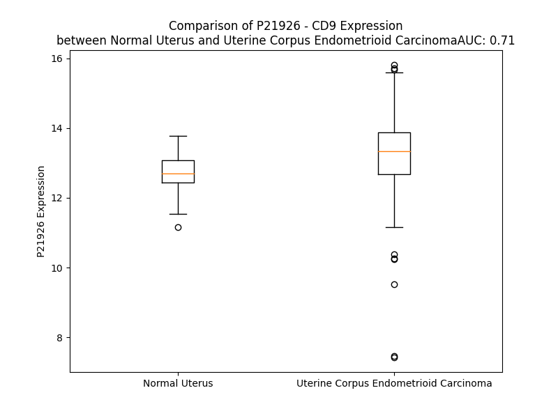

# Detailed Data for P21926

## Introduction to the Detailed Summary

### How to Interpret the Results

- **Summary & Metrics**: This section provides a quick reference to essential protein attributes, including expression changes, family classification, and biomarker applications. Regulation status (upregulated/downregulated) indicates the protein's behavior in a disease context. Some information comes from the original excel file with the proteins selected from literature, while others are derived from the analyses.
- **Expression Comparison**: A visual representation comparing protein expression between normal and disease states. It highlights significant changes in expression levels that might indicate diagnostic or therapeutic relevance. This is data coming from transcriptomics experiments and could not translate similarly to protein levels.
- **Isoform Alignment**: An interactive view of isoform alignments, revealing structural and functional differences between variants of the protein.
- **Interactors & Homologs**: Tables listing known interaction partners and homologous proteins, the more interactors and homologs, the more complex the protein is to design an antibody for.
- **Biological Assemblies**: Information about the structural arrangement of the protein in different assemblies, providing insights into its functional state but also the complexity of the protein to develop antibodies.
- **Combined Per-Residue Information**: A detailed table summarizing residue-level data. This includes predictions for epitope regions, aggregation tendencies, and modifications that might impact the protein's function. Each row corresponds to a residue in the protein, providing insights into specific sites that may be important for research or drug development.
## Summary & Metrics

- **UniProt Accession**: P21926
- **Gene Name**: CD9
- **Protein Name**: CD9 antigen
- **Swiss Prot**: CD9_HUMAN
- **Family**: other
- **Biomarker Application**: efficacy
- **Number of Isoforms**: 0
- **Regulation**: -1
- **(transcriptomics) AUC**: 0.29
- **(transcriptomics) Fold Change**: 1.06
- **(transcriptomics) Regulation**: Downregulated
- **Discotope Epitope Count**: 55
- **Max n_uniprots (Homo)**: 4
- **Max n_uniprots (Hetero)**: N/A

## Expression Comparison

## Interactors

| preferredName_A   | preferredName_B   |   score |
|:------------------|:------------------|--------:|
| CD9               | PTGFRN            |   0.999 |
| CD9               | IGSF8             |   0.999 |
| CD9               | CD81              |   0.997 |
| CD9               | TSG101            |   0.995 |
| CD9               | CD63              |   0.994 |
| CD9               | ITGB1             |   0.989 |
| CD9               | CD44              |   0.985 |
| CD9               | CD82              |   0.983 |
| CD9               | HBEGF             |   0.98  |
| CD9               | ITGA3             |   0.969 |
| CD9               | HSPA4             |   0.947 |
| CD9               | EPCAM             |   0.943 |
| CD9               | CD151             |   0.923 |
| CD9               | CD19              |   0.912 |
| CD9               | ICAM1             |   0.912 |
| CD9               | CD36              |   0.902 |

## Homologs

| uniprot_id   | gene_id   |
|:-------------|:----------|
| E9PLZ6       | CD151     |
| B5MD23       | TSPAN9    |
| A1L157       | TSPAN11   |
| E9PJ59       | CD82      |
| F8VV56       | CD63      |
| E9PS24       | ROM1      |
| D6RBT5       | TSPAN5    |
| K7EMI8       | TSPAN16   |
| O60635       | TSPAN1    |
| H0YKJ9       | TSPAN3    |
| F8WC96       | TSPAN7    |
| O00322       | UPK1A     |
| E7ETN9       | UPK1B     |
| H7BXY6       | TSPAN14   |
| O60636       | TSPAN2    |
| M0R083       | CD37      |
| P19397       | CD53      |
| O43657       | TSPAN6    |
| P23942       | PRPH2     |
| E9PPX8       | TSPAN4    |
| Q6FGK0       | TM4SF13   |
| Q86UF1       | TSPAN33   |
| A6NMH8       | CD81      |
| O95858       | TSPAN15   |
| P19075       | TSPAN8    |
| F8VZ36       | TSPAN19   |
| A0A087X235   | TSPAN10   |
| Q12999       | TSPAN31   |
| D6RDX8       | TSPAN17   |
| Q96SJ8       | TSPAN18   |
| G3XAG6       | TSPAN32   |
| O95859       | TSPAN12   |

## Biological Assemblies

|   Unnamed: 0 |   assembly |   n_uniprots | composition   | crystal_id   |
|-------------:|-----------:|-------------:|:--------------|:-------------|
|            0 |          1 |            2 | Homo          | 6z1v         |
|            0 |          1 |            3 | Homo          | 6rlo         |
|            1 |          2 |            3 | Homo          | 6rlo         |
|            2 |          3 |            3 | Homo          | 6rlo         |
|            3 |          4 |            3 | Homo          | 6rlo         |
|            0 |          1 |            1 | Homo          | 6k4j         |
|            0 |          1 |            4 | Homo          | 6rlr         |
|            0 |          1 |            2 | Homo          | 6z20         |
|            1 |          2 |            2 | Homo          | 6z20         |

## Combined Per-Residue Information

|   res | aa   |   epitope_score | epitope   |   relative_surface_accessibility |   modeling_confidence |   Aggregation | modification   | glycosylation                   |
|------:|:-----|----------------:|:----------|---------------------------------:|----------------------:|--------------:|:---------------|:--------------------------------|
|     1 | M    |         0.19581 | False     |                          0.95292 |                 57.44 |         0     | N/A            | N/A                             |
|     2 | P    |         0.22848 | False     |                          0.87368 |                 65.86 |         0     | N/A            | N/A                             |
|     3 | V    |         0.0975  | False     |                          0.07169 |                 65.08 |         0     | N/A            | N/A                             |
|     4 | K    |         0.3282  | True      |                          0.71795 |                 74.95 |         0     | N/A            | N/A                             |
|     5 | G    |         0.30282 | True      |                          0.72207 |                 76.31 |         0     | N/A            | N/A                             |
|     6 | G    |         0.21358 | False     |                          0.6791  |                 79.84 |         0     | N/A            | N/A                             |
|     7 | T    |         0.17139 | False     |                          0.16427 |                 83.38 |         0     | N/A            | N/A                             |
|     8 | K    |         0.15639 | False     |                          0.47361 |                 86.41 |         0     | N/A            | N/A                             |
|     9 | C    |         0.15567 | False     |                          0.53015 |                 89.86 |         0     | N/A            | N/A                             |
|    10 | I    |         0.1494  | False     |                          0.17679 |                 89.77 |         0     | N/A            | N/A                             |
|    11 | K    |         0.10918 | False     |                          0.16686 |                 90.9  |         0     | N/A            | N/A                             |
|    12 | Y    |         0.26155 | False     |                          0.59394 |                 91.79 |        28.678 | N/A            | N/A                             |
|    13 | L    |         0.10655 | False     |                          0.46482 |                 92.11 |        35.348 | N/A            | N/A                             |
|    14 | L    |         0.01573 | False     |                          0.02473 |                 92.99 |        52.864 | N/A            | N/A                             |
|    15 | F    |         0.16624 | False     |                          0.3783  |                 94.23 |        56.341 | N/A            | N/A                             |
|    16 | G    |         0.22029 | False     |                          0.34275 |                 94.05 |        56.73  | N/A            | N/A                             |
|    17 | F    |         0.10783 | False     |                          0.67809 |                 93.89 |        62.82  | N/A            | N/A                             |
|    18 | N    |         0.06102 | False     |                          0.0899  |                 95.69 |        64.103 | N/A            | N/A                             |
|    19 | F    |         0.1875  | False     |                          0.40144 |                 95.68 |        97.027 | N/A            | N/A                             |
|    20 | I    |         0.28862 | True      |                          0.68091 |                 95.87 |        99.71  | N/A            | N/A                             |
|    21 | F    |         0.05072 | False     |                          0.42235 |                 95.54 |        99.957 | N/A            | N/A                             |
|    22 | W    |         0.13756 | False     |                          0.29145 |                 97.44 |        99.962 | N/A            | N/A                             |
|    23 | L    |         0.31521 | True      |                          0.51909 |                 97.29 |        99.854 | N/A            | N/A                             |
|    24 | A    |         0.1909  | False     |                          0.37302 |                 97.22 |        99.224 | N/A            | N/A                             |
|    25 | G    |         0.00489 | False     |                          0       |                 97.76 |        98.691 | N/A            | N/A                             |
|    26 | I    |         0.26641 | False     |                          0.39014 |                 98.02 |        98.655 | N/A            | N/A                             |
|    27 | A    |         0.28292 | False     |                          0.49904 |                 97.38 |        98.131 | N/A            | N/A                             |
|    28 | V    |         0.08862 | False     |                          0.26372 |                 96.57 |        97.688 | N/A            | N/A                             |
|    29 | L    |         0.17042 | False     |                          0.16405 |                 97.38 |        92.457 | N/A            | N/A                             |
|    30 | A    |         0.26822 | False     |                          0.50208 |                 96.8  |        63.89  | N/A            | N/A                             |
|    31 | I    |         0.21717 | False     |                          0.48764 |                 93.28 |        58.916 | N/A            | N/A                             |
|    32 | G    |         0.00597 | False     |                          0       |                 94.09 |        33.772 | N/A            | N/A                             |
|    33 | L    |         0.19619 | False     |                          0.42373 |                 94.8  |        32.792 | N/A            | N/A                             |
|    34 | W    |         0.33874 | True      |                          0.47298 |                 93.27 |        28.738 | N/A            | N/A                             |
|    35 | L    |         0.12475 | False     |                          0.10717 |                 88.44 |        22.798 | N/A            | N/A                             |
|    36 | R    |         0.40903 | True      |                          0.1776  |                 88.31 |         0.003 | N/A            | N/A                             |
|    37 | F    |         0.33534 | True      |                          0.65876 |                 90.1  |         0.003 | N/A            | N/A                             |
|    38 | D    |         0.20776 | False     |                          0.17513 |                 88.4  |         0.003 | N/A            | N/A                             |
|    39 | S    |         0.34288 | True      |                          0.72616 |                 84.6  |         0     | N/A            | N/A                             |
|    40 | Q    |         0.46381 | True      |                          0.27276 |                 81.4  |         0     | N/A            | N/A                             |
|    41 | T    |         0.01562 | False     |                          0.0019  |                 80.48 |         0     | N/A            | N/A                             |
|    42 | K    |         0.33046 | True      |                          0.39773 |                 80.79 |         0     | N/A            | N/A                             |
|    43 | S    |         0.24065 | False     |                          0.37343 |                 79.14 |         0     | N/A            | N/A                             |
|    44 | I    |         0.19723 | False     |                          0.1019  |                 77.24 |         0     | N/A            | N/A                             |
|    45 | F    |         0.22826 | False     |                          0.05956 |                 76.73 |         0     | N/A            | N/A                             |
|    46 | E    |         0.28526 | False     |                          0.4771  |                 72.57 |         0     | N/A            | N/A                             |
|    47 | Q    |         0.31106 | True      |                          0.77856 |                 63.64 |         0     | N/A            | N/A                             |
|    48 | E    |         0.19402 | False     |                          0.42069 |                 61.74 |         0     | N/A            | N/A                             |
|    49 | T    |         0.26906 | False     |                          0.75922 |                 56.84 |         0     | N/A            | N/A                             |
|    50 | N    |         0.33378 | True      |                          0.93364 |                 55.12 |         0     | N/A            | N/A                             |
|    51 | N    |         0.21317 | False     |                          0.78561 |                 56.37 |         0     | N/A            | N/A                             |
|    52 | N    |         0.26135 | False     |                          0.87882 |                 55.76 |         0     | N/A            | N-linked (GlcNAc...) asparagine |
|    53 | N    |         0.16913 | False     |                          1.01456 |                 58.7  |         0.004 | N/A            | N-linked (GlcNAc...) asparagine |
|    54 | S    |         0.20002 | False     |                          0.18527 |                 72.45 |         0.127 | N/A            | N/A                             |
|    55 | S    |         0.09482 | False     |                          0.17612 |                 79.43 |         1.274 | N/A            | N/A                             |
|    56 | F    |         0.04563 | False     |                          0.0172  |                 81.19 |        25.51  | N/A            | N/A                             |
|    57 | Y    |         0.38876 | True      |                          0.41051 |                 83.59 |        27.596 | N/A            | N/A                             |
|    58 | T    |         0.17864 | False     |                          0.50936 |                 86.16 |        28.591 | N/A            | N/A                             |
|    59 | G    |         0.07338 | False     |                          0.16802 |                 88.89 |        33.596 | N/A            | N/A                             |
|    60 | V    |         0.04182 | False     |                          0.02557 |                 90.99 |        92.643 | N/A            | N/A                             |
|    61 | Y    |         0.16447 | False     |                          0.39551 |                 92.07 |        97.496 | N/A            | N/A                             |
|    62 | I    |         0.17451 | False     |                          0.6651  |                 93.69 |        98.891 | N/A            | N/A                             |
|    63 | L    |         0.06734 | False     |                          0.34293 |                 93.72 |        98.9   | N/A            | N/A                             |
|    64 | I    |         0.20676 | False     |                          0.18399 |                 96.15 |        98.253 | N/A            | N/A                             |
|    65 | G    |         0.36361 | True      |                          0.4655  |                 96.95 |        88.383 | N/A            | N/A                             |
|    66 | A    |         0.15439 | False     |                          0.39601 |                 96.51 |        87.499 | N/A            | N/A                             |
|    67 | G    |         0.00372 | False     |                          0       |                 97.94 |        86.76  | N/A            | N/A                             |
|    68 | A    |         0.23086 | False     |                          0.36027 |                 98.01 |        87.047 | N/A            | N/A                             |
|    69 | L    |         0.1989  | False     |                          0.44281 |                 97.23 |        87.409 | N/A            | N/A                             |
|    70 | M    |         0.04715 | False     |                          0.24538 |                 96.94 |        87.158 | N/A            | N/A                             |
|    71 | M    |         0.18327 | False     |                          0.33517 |                 97.24 |        86.852 | N/A            | N/A                             |
|    72 | L    |         0.3801  | True      |                          0.47565 |                 97.13 |        86.481 | N/A            | N/A                             |
|    73 | V    |         0.02714 | False     |                          0.02951 |                 97.1  |        84.23  | N/A            | N/A                             |
|    74 | G    |         0.00303 | False     |                          0       |                 96.96 |        59.532 | N/A            | N/A                             |
|    75 | F    |         0.25235 | False     |                          0.4578  |                 96.53 |        58.657 | N/A            | N/A                             |
|    76 | L    |         0.06919 | False     |                          0.08656 |                 96.32 |        49.275 | N/A            | N/A                             |
|    77 | G    |         0.00298 | False     |                          0       |                 95.64 |         3.63  | N/A            | N/A                             |
|    78 | C    |         0.06243 | False     |                          0.05323 |                 94.26 |         0.092 | N/A            | N/A                             |
|    79 | C    |         0.06663 | False     |                          0.16202 |                 94.24 |         0.006 | N/A            | N/A                             |
|    80 | G    |         0.00488 | False     |                          0       |                 93.12 |         0.001 | N/A            | N/A                             |
|    81 | A    |         0.00181 | False     |                          0       |                 92.82 |         0.001 | N/A            | N/A                             |
|    82 | V    |         0.17566 | False     |                          0.55722 |                 91.7  |         0.001 | N/A            | N/A                             |
|    83 | Q    |         0.13619 | False     |                          0.61947 |                 91.72 |         0     | N/A            | N/A                             |
|    84 | E    |         0.16643 | False     |                          0.22414 |                 89.37 |         0     | N/A            | N/A                             |
|    85 | S    |         0.19803 | False     |                          0.24211 |                 92.12 |         0.008 | N/A            | N/A                             |
|    86 | Q    |         0.24128 | False     |                          0.25758 |                 91.6  |         0.074 | N/A            | N/A                             |
|    87 | C    |         0.14399 | False     |                          0.67373 |                 94.41 |         4.663 | N/A            | N/A                             |
|    88 | M    |         0.13598 | False     |                          0.18174 |                 94.76 |        26.432 | N/A            | N/A                             |
|    89 | L    |         0.0068  | False     |                          0.00061 |                 94.41 |        45.507 | N/A            | N/A                             |
|    90 | G    |         0.17965 | False     |                          0.42551 |                 94.86 |        49.269 | N/A            | N/A                             |
|    91 | L    |         0.09995 | False     |                          0.55147 |                 96.14 |        91.056 | N/A            | N/A                             |
|    92 | F    |         0.0223  | False     |                          0.02357 |                 96.59 |        98.708 | N/A            | N/A                             |
|    93 | F    |         0.14327 | False     |                          0.26646 |                 96.61 |        99.332 | N/A            | N/A                             |
|    94 | G    |         0.2446  | False     |                          0.34841 |                 96.56 |        99.382 | N/A            | N/A                             |
|    95 | F    |         0.09366 | False     |                          0.34168 |                 97.1  |        99.947 | N/A            | N/A                             |
|    96 | L    |         0.04264 | False     |                          0.08738 |                 96.7  |        99.991 | N/A            | N/A                             |
|    97 | L    |         0.26332 | False     |                          0.54174 |                 97.15 |        99.996 | N/A            | N/A                             |
|    98 | V    |         0.26179 | False     |                          0.5741  |                 97.5  |        99.983 | N/A            | N/A                             |
|    99 | I    |         0.1595  | False     |                          0.21039 |                 96.86 |        99.828 | N/A            | N/A                             |
|   100 | F    |         0.1594  | False     |                          0.24651 |                 97.04 |        98.122 | N/A            | N/A                             |
|   101 | A    |         0.24064 | False     |                          0.51953 |                 97.4  |        77.187 | N/A            | N/A                             |
|   102 | I    |         0.2903  | True      |                          0.64815 |                 97.3  |        70.718 | N/A            | N/A                             |
|   103 | E    |         0.09372 | False     |                          0.32009 |                 95.93 |         0.001 | N/A            | N/A                             |
|   104 | I    |         0.18721 | False     |                          0.48878 |                 96.25 |         0.001 | N/A            | N/A                             |
|   105 | A    |         0.23881 | False     |                          0.56613 |                 96.97 |         0.265 | N/A            | N/A                             |
|   106 | A    |         0.16713 | False     |                          0.52223 |                 95.75 |         0.548 | N/A            | N/A                             |
|   107 | A    |         0.14722 | False     |                          0.62666 |                 95.09 |         0.856 | N/A            | N/A                             |
|   108 | I    |         0.23357 | False     |                          0.69821 |                 95.55 |         0.856 | N/A            | N/A                             |
|   109 | W    |         0.40323 | True      |                          0.64209 |                 96.43 |         0.856 | N/A            | N/A                             |
|   110 | G    |         0.15017 | False     |                          0.20828 |                 94.71 |         0.74  | N/A            | N/A                             |
|   111 | Y    |         0.30814 | True      |                          0.63305 |                 91.7  |         0.706 | N/A            | N/A                             |
|   112 | S    |         0.36288 | True      |                          0.61739 |                 94.69 |         0.071 | N/A            | N/A                             |
|   113 | H    |         0.27706 | False     |                          0.39043 |                 94.85 |         0     | N/A            | N/A                             |
|   114 | K    |         0.23404 | False     |                          0.32645 |                 92.2  |         0     | N/A            | N/A                             |
|   115 | D    |         0.48041 | True      |                          0.6904  |                 93.46 |         0     | N/A            | N/A                             |
|   116 | E    |         0.35489 | True      |                          0.45526 |                 94.74 |         0     | N/A            | N/A                             |
|   117 | V    |         0.09726 | False     |                          0.24335 |                 93.74 |         0     | N/A            | N/A                             |
|   118 | I    |         0.17356 | False     |                          0.0984  |                 94.2  |         0     | N/A            | N/A                             |
|   119 | K    |         0.31736 | True      |                          0.60762 |                 95.2  |         0     | N/A            | N/A                             |
|   120 | E    |         0.17798 | False     |                          0.5268  |                 92.35 |         0     | N/A            | N/A                             |
|   121 | V    |         0.08152 | False     |                          0.39021 |                 93.56 |         0     | N/A            | N/A                             |
|   122 | Q    |         0.28443 | False     |                          0.21489 |                 94.72 |         0     | N/A            | N/A                             |
|   123 | E    |         0.14812 | False     |                          0.37576 |                 93.1  |         0     | N/A            | N/A                             |
|   124 | F    |         0.11857 | False     |                          0.39885 |                 91.27 |         0     | N/A            | N/A                             |
|   125 | Y    |         0.06822 | False     |                          0.03797 |                 93.45 |         0     | N/A            | N/A                             |
|   126 | K    |         0.2866  | False     |                          0.52141 |                 93.17 |         0     | N/A            | N/A                             |
|   127 | D    |         0.13319 | False     |                          0.18477 |                 89.78 |         0     | N/A            | N/A                             |
|   128 | T    |         0.0454  | False     |                          0.0457  |                 89.14 |         0     | N/A            | N/A                             |
|   129 | Y    |         0.17206 | False     |                          0.06795 |                 91.06 |         0     | N/A            | N/A                             |
|   130 | N    |         0.45542 | True      |                          0.38585 |                 88.65 |         0     | N/A            | N/A                             |
|   131 | K    |         0.15623 | False     |                          0.11835 |                 85.15 |         0     | N/A            | N/A                             |
|   132 | L    |         0.02486 | False     |                          0.00907 |                 86.18 |         0     | N/A            | N/A                             |
|   133 | K    |         0.29177 | True      |                          0.31585 |                 86.19 |         0     | N/A            | N/A                             |
|   134 | T    |         0.43557 | True      |                          0.72471 |                 84.75 |         0     | N/A            | N/A                             |
|   135 | K    |         0.30152 | True      |                          0.23058 |                 84.57 |         0     | N/A            | N/A                             |
|   136 | D    |         0.35323 | True      |                          0.45639 |                 85.4  |         0     | N/A            | N/A                             |
|   137 | E    |         0.30789 | True      |                          0.54167 |                 86.73 |         0     | N/A            | N/A                             |
|   138 | P    |         0.21007 | False     |                          0.43977 |                 86.82 |         0     | N/A            | N/A                             |
|   139 | Q    |         0.07799 | False     |                          0.02158 |                 85.15 |         0     | N/A            | N/A                             |
|   140 | R    |         0.18881 | False     |                          0.18244 |                 86.45 |         0     | N/A            | N/A                             |
|   141 | E    |         0.36489 | True      |                          0.42249 |                 87.89 |         0     | N/A            | N/A                             |
|   142 | T    |         0.17702 | False     |                          0.23256 |                 87.06 |         0     | N/A            | N/A                             |
|   143 | L    |         0.00729 | False     |                          0       |                 90.26 |         0     | N/A            | N/A                             |
|   144 | K    |         0.2018  | False     |                          0.17235 |                 90.17 |         0     | N/A            | N/A                             |
|   145 | A    |         0.20355 | False     |                          0.59074 |                 90.1  |         0     | N/A            | N/A                             |
|   146 | I    |         0.10906 | False     |                          0.32307 |                 91.06 |         0     | N/A            | N/A                             |
|   147 | H    |         0.01497 | False     |                          0       |                 91.92 |         0     | N/A            | N/A                             |
|   148 | Y    |         0.35208 | True      |                          0.69945 |                 88.96 |         0     | N/A            | N/A                             |
|   149 | A    |         0.19758 | False     |                          0.74965 |                 89.59 |         0     | N/A            | N/A                             |
|   150 | L    |         0.1795  | False     |                          0.34683 |                 89.24 |         0     | N/A            | N/A                             |
|   151 | N    |         0.27258 | False     |                          0.56427 |                 87.35 |         0     | N/A            | N/A                             |
|   152 | C    |         0.00893 | False     |                          0       |                 91.67 |         0     | N/A            | N/A                             |
|   153 | C    |         0.01007 | False     |                          0       |                 91.63 |         0     | N/A            | N/A                             |
|   154 | G    |         0.0089  | False     |                          0       |                 90.56 |         0     | N/A            | N/A                             |
|   155 | L    |         0.28749 | False     |                          0.37833 |                 91.47 |         0     | N/A            | N/A                             |
|   156 | A    |         0.27775 | False     |                          0.5977  |                 87.63 |         0     | N/A            | N/A                             |
|   157 | G    |         0.1083  | False     |                          0.04024 |                 85.09 |         0     | N/A            | N/A                             |
|   158 | G    |         0.21035 | False     |                          0.12561 |                 74.65 |         0     | N/A            | N/A                             |
|   159 | V    |         0.37973 | True      |                          0.65722 |                 80.51 |         0     | N/A            | N/A                             |
|   160 | E    |         0.17374 | False     |                          0.05218 |                 81.34 |         0     | N/A            | N/A                             |
|   161 | Q    |         0.34805 | True      |                          0.33808 |                 73.35 |         0     | N/A            | N/A                             |
|   162 | F    |         0.4496  | True      |                          0.77244 |                 73.07 |         0     | N/A            | N/A                             |
|   163 | I    |         0.60104 | True      |                          0.81885 |                 78.77 |         0     | N/A            | N/A                             |
|   164 | S    |         0.39395 | True      |                          0.22164 |                 75.06 |         0     | N/A            | N/A                             |
|   165 | D    |         0.27133 | False     |                          0.45707 |                 81.51 |         0     | N/A            | N/A                             |
|   166 | I    |         0.02502 | False     |                          0       |                 82.8  |         0     | N/A            | N/A                             |
|   167 | C    |         0.11938 | False     |                          0.04708 |                 83.34 |         0     | N/A            | N/A                             |
|   168 | P    |         0.15955 | False     |                          0.07823 |                 75.72 |         0     | N/A            | N/A                             |
|   169 | K    |         0.31797 | True      |                          0.97329 |                 69.79 |         0     | N/A            | N/A                             |
|   170 | K    |         0.2996  | True      |                          0.28375 |                 66.52 |         0     | N/A            | N/A                             |
|   171 | D    |         0.37241 | True      |                          0.69118 |                 64.42 |         0     | N/A            | N/A                             |
|   172 | V    |         0.26988 | False     |                          0.8622  |                 62.67 |         1.401 | N/A            | N/A                             |
|   173 | L    |         0.387   | True      |                          0.89954 |                 62.65 |         1.401 | N/A            | N/A                             |
|   174 | E    |         0.29378 | True      |                          0.45597 |                 65.49 |         1.401 | N/A            | N/A                             |
|   175 | T    |         0.11692 | False     |                          0.07727 |                 62.09 |         1.401 | N/A            | N/A                             |
|   176 | F    |         0.35896 | True      |                          0.75352 |                 64.01 |         1.401 | N/A            | N/A                             |
|   177 | T    |         0.218   | False     |                          0.70065 |                 74.79 |         1.401 | N/A            | N/A                             |
|   178 | V    |         0.11244 | False     |                          0.09744 |                 81.48 |         1.401 | N/A            | N/A                             |
|   179 | K    |         0.28845 | True      |                          0.50245 |                 88.94 |         1.401 | N/A            | N/A                             |
|   180 | S    |         0.19576 | False     |                          0.11383 |                 92.19 |         0.155 | N/A            | N/A                             |
|   181 | C    |         0.00556 | False     |                          0       |                 93.88 |         0     | N/A            | N/A                             |
|   182 | P    |         0.19245 | False     |                          0.22367 |                 95.07 |         0     | N/A            | N/A                             |
|   183 | D    |         0.47014 | True      |                          0.51898 |                 93.75 |         0     | N/A            | N/A                             |
|   184 | A    |         0.11281 | False     |                          0.06433 |                 93.15 |         0     | N/A            | N/A                             |
|   185 | I    |         0.05411 | False     |                          0.0368  |                 93.83 |         0     | N/A            | N/A                             |
|   186 | K    |         0.30605 | True      |                          0.51868 |                 94.46 |         0     | N/A            | N/A                             |
|   187 | E    |         0.34391 | True      |                          0.27331 |                 92.8  |         0     | N/A            | N/A                             |
|   188 | V    |         0.19031 | False     |                          0.278   |                 91.69 |         0     | N/A            | N/A                             |
|   189 | F    |         0.20606 | False     |                          0.19785 |                 91.59 |         0     | N/A            | N/A                             |
|   190 | D    |         0.38576 | True      |                          0.53848 |                 90.18 |         0     | N/A            | N/A                             |
|   191 | N    |         0.42775 | True      |                          0.64177 |                 90.42 |         0     | N/A            | N/A                             |
|   192 | K    |         0.34381 | True      |                          0.46418 |                 88.91 |         0     | N/A            | N/A                             |
|   193 | F    |         0.22501 | False     |                          0.33788 |                 88.47 |         0.077 | N/A            | N/A                             |
|   194 | H    |         0.40399 | True      |                          0.69343 |                 90.75 |         0.084 | N/A            | N/A                             |
|   195 | I    |         0.36444 | True      |                          0.51038 |                 92.13 |         4.316 | N/A            | N/A                             |
|   196 | I    |         0.14468 | False     |                          0.39755 |                 90.69 |         6.913 | N/A            | N/A                             |
|   197 | G    |         0.26156 | False     |                          0.39656 |                 92.61 |         7.207 | N/A            | N/A                             |
|   198 | A    |         0.198   | False     |                          0.61845 |                 95.25 |        10.831 | N/A            | N/A                             |
|   199 | V    |         0.22174 | False     |                          0.62301 |                 94.44 |        19.391 | N/A            | N/A                             |
|   200 | G    |         0.13936 | False     |                          0.42472 |                 95.2  |        21.96  | N/A            | N/A                             |
|   201 | I    |         0.2857  | False     |                          0.70683 |                 95.69 |        54.808 | N/A            | N/A                             |
|   202 | G    |         0.3055  | True      |                          0.39635 |                 96.59 |        57.897 | N/A            | N/A                             |
|   203 | I    |         0.16737 | False     |                          0.48616 |                 95.42 |        92.485 | N/A            | N/A                             |
|   204 | A    |         0.10216 | False     |                          0.20789 |                 96.31 |        95.752 | N/A            | N/A                             |
|   205 | V    |         0.31995 | True      |                          0.47699 |                 96.53 |        99.614 | N/A            | N/A                             |
|   206 | V    |         0.17024 | False     |                          0.75636 |                 95.28 |        99.939 | N/A            | N/A                             |
|   207 | M    |         0.06556 | False     |                          0.0724  |                 96.07 |        99.949 | N/A            | N/A                             |
|   208 | I    |         0.32019 | True      |                          0.41598 |                 96.44 |        99.952 | N/A            | N/A                             |
|   209 | F    |         0.15612 | False     |                          0.53331 |                 95.31 |        99.721 | N/A            | N/A                             |
|   210 | G    |         0.05467 | False     |                          0.15958 |                 95.17 |        96.831 | N/A            | N/A                             |
|   211 | M    |         0.15165 | False     |                          0.13722 |                 96.35 |        96.573 | N/A            | N/A                             |
|   212 | I    |         0.29953 | True      |                          0.47267 |                 95.69 |        96.284 | N/A            | N/A                             |
|   213 | F    |         0.10768 | False     |                          0.2223  |                 93.82 |        93.116 | N/A            | N/A                             |
|   214 | S    |         0.00766 | False     |                          0.00395 |                 93.74 |        78.423 | N/A            | N/A                             |
|   215 | M    |         0.16256 | False     |                          0.48624 |                 93.59 |        76.874 | N/A            | N/A                             |
|   216 | I    |         0.21085 | False     |                          0.43045 |                 92.67 |        75.139 | N/A            | N/A                             |
|   217 | L    |         0.00659 | False     |                          0.00082 |                 91.24 |        61.136 | N/A            | N/A                             |
|   218 | C    |         0.18975 | False     |                          0.19221 |                 90.72 |        11.797 | N/A            | N/A                             |
|   219 | C    |         0.21514 | False     |                          0.50147 |                 90.85 |         1.784 | N/A            | N/A                             |
|   220 | A    |         0.1286  | False     |                          0.09577 |                 89.6  |         0.582 | N/A            | N/A                             |
|   221 | I    |         0.11332 | False     |                          0.11593 |                 87.31 |         0.238 | N/A            | N/A                             |
|   222 | R    |         0.34205 | True      |                          0.59608 |                 89.11 |         0     | N/A            | N/A                             |
|   223 | R    |         0.211   | False     |                          0.53582 |                 87.72 |         0     | N/A            | N/A                             |
|   224 | N    |         0.14929 | False     |                          0.19527 |                 83.45 |         0     | N/A            | N/A                             |
|   225 | R    |         0.24718 | False     |                          0.73621 |                 80.1  |         0     | N/A            | N/A                             |
|   226 | E    |         0.19052 | False     |                          0.63287 |                 78.85 |         0     | N/A            | N/A                             |
|   227 | M    |         0.18961 | False     |                          0.69363 |                 74.02 |         0     | N/A            | N/A                             |
|   228 | V    |         0.12989 | False     |                          1.04893 |                 62.25 |         0     | N/A            | N/A                             |

