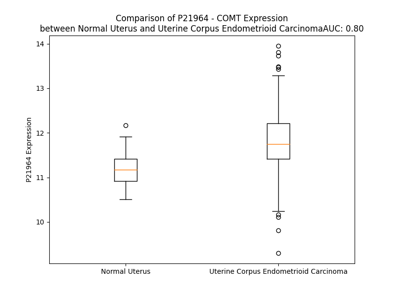

# Detailed Data for P21964

## Introduction to the Detailed Summary

### How to Interpret the Results

- **Summary & Metrics**: This section provides a quick reference to essential protein attributes, including expression changes, family classification, and biomarker applications. Regulation status (upregulated/downregulated) indicates the protein's behavior in a disease context. Some information comes from the original excel file with the proteins selected from literature, while others are derived from the analyses.
- **Expression Comparison**: A visual representation comparing protein expression between normal and disease states. It highlights significant changes in expression levels that might indicate diagnostic or therapeutic relevance. This is data coming from transcriptomics experiments and could not translate similarly to protein levels.
- **Isoform Alignment**: An interactive view of isoform alignments, revealing structural and functional differences between variants of the protein.
- **Interactors & Homologs**: Tables listing known interaction partners and homologous proteins, the more interactors and homologs, the more complex the protein is to design an antibody for.
- **Biological Assemblies**: Information about the structural arrangement of the protein in different assemblies, providing insights into its functional state but also the complexity of the protein to develop antibodies.
- **Combined Per-Residue Information**: A detailed table summarizing residue-level data. This includes predictions for epitope regions, aggregation tendencies, and modifications that might impact the protein's function. Each row corresponds to a residue in the protein, providing insights into specific sites that may be important for research or drug development.
## Summary & Metrics

- **UniProt Accession**: P21964
- **Gene Name**: COMT
- **Protein Name**: Catechol O-methyltransferase
- **Swiss Prot**: COMT_HUMAN
- **Family**: nan
- **Biomarker Application**: nan
- **Number of Isoforms**: 0
- **Regulation**: 2
- **(transcriptomics) AUC**: 0.53
- **(transcriptomics) Fold Change**: 1.01
- **(transcriptomics) Regulation**: Upregulated
- **Discotope Epitope Count**: 50
- **Max n_uniprots (Homo)**: 1
- **Max n_uniprots (Hetero)**: N/A

## Expression Comparison

## Interactors

| preferredName_A   | preferredName_B   |   score |
|:------------------|:------------------|--------:|
| COMT              | MAOB              |   0.996 |
| COMT              | MAOA              |   0.996 |
| COMT              | CYP1A1            |   0.985 |
| COMT              | DDC               |   0.981 |
| COMT              | DBH               |   0.979 |
| COMT              | CYP1B1            |   0.971 |
| COMT              | PNMT              |   0.965 |
| COMT              | ALDH3B1           |   0.951 |
| COMT              | ALDH3A1           |   0.946 |
| COMT              | SLC6A4            |   0.943 |
| COMT              | ADH7              |   0.942 |
| COMT              | DRD4              |   0.942 |
| COMT              | ADH6              |   0.94  |
| COMT              | ADH1B             |   0.936 |
| COMT              | ADH1C             |   0.927 |
| COMT              | DRD2              |   0.924 |
| COMT              | BDNF              |   0.919 |
| COMT              | SLC6A3            |   0.917 |
| COMT              | LRTOMT            |   0.917 |
| COMT              | ALDH3B2           |   0.917 |
| COMT              | ADH4              |   0.916 |
| COMT              | AOC2              |   0.915 |
| COMT              | ADH1A             |   0.913 |
| COMT              | ADH5              |   0.912 |
| COMT              | AOC3              |   0.906 |

## Homologs

| uniprot_id   | gene_id   |
|:-------------|:----------|
| A0A2R8Y5M8   | TOMT      |
| Q86VU5       | COMTD1    |

## Biological Assemblies

|   Unnamed: 0 |   assembly |   n_uniprots | composition   | crystal_id   |
|-------------:|-----------:|-------------:|:--------------|:-------------|
|            0 |          1 |            1 | Homo          | 4xud         |
|            0 |          1 |            1 | Homo          | 3bwm         |
|            0 |          1 |            1 | Homo          | 3bwy         |
|            0 |          1 |            1 | Homo          | 4pyj         |
|            1 |          2 |            1 | Homo          | 4pyj         |
|            0 |          1 |            1 | Homo          | 5lsa         |
|            0 |          1 |            1 | Homo          | 6i3d         |
|            1 |          2 |            1 | Homo          | 6i3d         |
|            0 |          1 |            1 | Homo          | 4xue         |
|            1 |          2 |            1 | Homo          | 4xue         |
|            0 |          1 |            1 | Homo          | 6i3c         |
|            0 |          1 |            1 | Homo          | 4pyi         |
|            0 |          1 |            1 | Homo          | 3a7e         |
|            0 |          1 |            1 | Homo          | 4pyk         |
|            1 |          2 |            1 | Homo          | 4pyk         |
|            0 |          1 |            1 | Homo          | 4xuc         |

## Combined Per-Residue Information

|   res | aa   |   epitope_score | epitope   |   relative_surface_accessibility |   modeling_confidence |   Aggregation | modification   |
|------:|:-----|----------------:|:----------|---------------------------------:|----------------------:|--------------:|:---------------|
|     1 | M    |         0.18255 | False     |                          1.21838 |                 44.79 |         0     | N/A            |
|     2 | P    |         0.23132 | False     |                          1.01845 |                 60.1  |         0     | N/A            |
|     3 | E    |         0.20741 | False     |                          0.87119 |                 68.43 |         0     | N/A            |
|     4 | A    |         0.21105 | False     |                          0.51043 |                 69.94 |         0     | N/A            |
|     5 | P    |         0.2418  | False     |                          0.60937 |                 75.74 |         0     | N/A            |
|     6 | P    |         0.24958 | False     |                          0.82084 |                 84.58 |         0.105 | N/A            |
|     7 | L    |         0.22788 | False     |                          0.92423 |                 85.64 |        46.932 | N/A            |
|     8 | L    |         0.18949 | False     |                          0.61981 |                 87.14 |        69.444 | N/A            |
|     9 | L    |         0.1247  | False     |                          0.6331  |                 89.03 |        87.505 | N/A            |
|    10 | A    |         0.13403 | False     |                          0.52946 |                 90.12 |        90.812 | N/A            |
|    11 | A    |         0.18995 | False     |                          0.58118 |                 91.19 |        94.722 | N/A            |
|    12 | V    |         0.12607 | False     |                          0.56514 |                 92.05 |        99.346 | N/A            |
|    13 | L    |         0.11281 | False     |                          0.60369 |                 93.26 |        99.739 | N/A            |
|    14 | L    |         0.1405  | False     |                          0.67257 |                 93.53 |        99.811 | N/A            |
|    15 | G    |         0.11189 | False     |                          0.43606 |                 91.72 |        99.824 | N/A            |
|    16 | L    |         0.17045 | False     |                          0.58437 |                 93.82 |        99.97  | N/A            |
|    17 | V    |         0.12522 | False     |                          0.62241 |                 92.58 |        99.997 | N/A            |
|    18 | L    |         0.15333 | False     |                          0.65848 |                 91.39 |        99.999 | N/A            |
|    19 | L    |         0.15912 | False     |                          0.53089 |                 89.19 |        99.999 | N/A            |
|    20 | V    |         0.08907 | False     |                          0.57315 |                 89.38 |        99.997 | N/A            |
|    21 | V    |         0.1324  | False     |                          0.49007 |                 86.68 |        99.972 | N/A            |
|    22 | L    |         0.1121  | False     |                          0.53866 |                 83.46 |        99.678 | N/A            |
|    23 | L    |         0.16655 | False     |                          0.59913 |                 86.14 |        98.071 | N/A            |
|    24 | L    |         0.21976 | False     |                          0.63054 |                 84.89 |        89.296 | N/A            |
|    25 | L    |         0.10743 | False     |                          0.43279 |                 80.76 |        41.838 | N/A            |
|    26 | L    |         0.1798  | False     |                          0.22987 |                 80.41 |        23.582 | N/A            |
|    27 | R    |         0.32554 | True      |                          0.84947 |                 79.39 |         0     | N/A            |
|    28 | H    |         0.38816 | True      |                          0.80375 |                 74.02 |         0     | N/A            |
|    29 | W    |         0.41081 | True      |                          0.60843 |                 73.93 |         0.401 | N/A            |
|    30 | G    |         0.20315 | False     |                          0.36654 |                 78.56 |         0.452 | N/A            |
|    31 | W    |         0.36598 | True      |                          0.70357 |                 77.74 |         1.729 | N/A            |
|    32 | G    |         0.12276 | False     |                          0.0813  |                 79.21 |         1.807 | N/A            |
|    33 | L    |         0.30173 | True      |                          0.35619 |                 82.49 |         2.673 | N/A            |
|    34 | C    |         0.17574 | False     |                          0.17938 |                 83.46 |         2.884 | N/A            |
|    35 | L    |         0.28441 | True      |                          0.3875  |                 82.86 |         2.884 | N/A            |
|    36 | I    |         0.45675 | True      |                          0.21416 |                 84.16 |         2.811 | N/A            |
|    37 | G    |         0.27799 | True      |                          0.20249 |                 83.97 |         1.935 | N/A            |
|    38 | W    |         0.23775 | False     |                          0.61728 |                 85.06 |         1.753 | N/A            |
|    39 | N    |         0.19852 | False     |                          0.11513 |                 85.98 |         0.028 | N/A            |
|    40 | E    |         0.2406  | False     |                          0.14845 |                 86.32 |         0     | N/A            |
|    41 | F    |         0.38954 | True      |                          0.79975 |                 86.03 |         0     | N/A            |
|    42 | I    |         0.27276 | True      |                          0.46474 |                 86.37 |         0     | N/A            |
|    43 | L    |         0.2808  | True      |                          0.4554  |                 85.41 |         0     | N/A            |
|    44 | Q    |         0.16859 | False     |                          0.11621 |                 85.06 |         0     | N/A            |
|    45 | P    |         0.24541 | False     |                          0.49517 |                 85.17 |         0     | N/A            |
|    46 | I    |         0.28102 | True      |                          0.53746 |                 85.81 |         0     | N/A            |
|    47 | H    |         0.24389 | False     |                          0.4373  |                 83.49 |         0     | N/A            |
|    48 | N    |         0.2023  | False     |                          0.24749 |                 89.27 |         0     | N/A            |
|    49 | L    |         0.28698 | True      |                          0.92656 |                 87.07 |         0     | N/A            |
|    50 | L    |         0.3283  | True      |                          0.81953 |                 87.09 |         0     | N/A            |
|    51 | M    |         0.31792 | True      |                          0.6523  |                 87.52 |         0     | N/A            |
|    52 | G    |         0.28504 | True      |                          0.86578 |                 88.19 |         0     | N/A            |
|    53 | D    |         0.25966 | True      |                          0.22636 |                 90.6  |         0     | N/A            |
|    54 | T    |         0.22357 | False     |                          0.38457 |                 94.31 |         0     | N/A            |
|    55 | K    |         0.01572 | False     |                          0.00066 |                 94.22 |         0     | N/A            |
|    56 | E    |         0.10152 | False     |                          0.09046 |                 96.8  |         0     | N/A            |
|    57 | Q    |         0.14505 | False     |                          0.39945 |                 97.52 |         0     | N/A            |
|    58 | R    |         0.16179 | False     |                          0.07905 |                 97.53 |         0     | N/A            |
|    59 | I    |         0.02862 | False     |                          0.00619 |                 98.13 |         0     | N/A            |
|    60 | L    |         0.05365 | False     |                          0.01978 |                 98.48 |         0     | N/A            |
|    61 | N    |         0.27455 | True      |                          0.39711 |                 98.19 |         0     | N/A            |
|    62 | H    |         0.20808 | False     |                          0.07767 |                 98.46 |         0     | N/A            |
|    63 | V    |         0.00713 | False     |                          0.00095 |                 98.72 |         0     | N/A            |
|    64 | L    |         0.27777 | True      |                          0.39345 |                 98.46 |         0     | N/A            |
|    65 | Q    |         0.27634 | True      |                          0.69516 |                 98.2  |         0     | N/A            |
|    66 | H    |         0.30641 | True      |                          0.61184 |                 98.5  |         0     | N/A            |
|    67 | A    |         0.06858 | False     |                          0.10098 |                 98.55 |         0     | N/A            |
|    68 | E    |         0.19215 | False     |                          0.5393  |                 98.53 |         0     | N/A            |
|    69 | P    |         0.20871 | False     |                          0.77946 |                 98.53 |         0     | N/A            |
|    70 | G    |         0.16297 | False     |                          0.65176 |                 98.45 |         0     | N/A            |
|    71 | N    |         0.19153 | False     |                          0.32773 |                 98.6  |         0     | N/A            |
|    72 | A    |         0.03642 | False     |                          0.10612 |                 98.61 |         0     | N/A            |
|    73 | Q    |         0.17947 | False     |                          0.42234 |                 98.58 |         0     | N/A            |
|    74 | S    |         0.16289 | False     |                          0.1339  |                 98.68 |         0     | N/A            |
|    75 | V    |         0.00265 | False     |                          0       |                 98.8  |         0     | N/A            |
|    76 | L    |         0.02195 | False     |                          0.01154 |                 98.72 |         0     | N/A            |
|    77 | E    |         0.20721 | False     |                          0.47947 |                 98.56 |         0     | N/A            |
|    78 | A    |         0.06468 | False     |                          0.07381 |                 98.66 |         0     | N/A            |
|    79 | I    |         0.01349 | False     |                          0.0032  |                 98.58 |         0     | N/A            |
|    80 | D    |         0.14612 | False     |                          0.16069 |                 98.45 |         0     | N/A            |
|    81 | T    |         0.20235 | False     |                          0.39629 |                 98.23 |         0     | N/A            |
|    82 | Y    |         0.14044 | False     |                          0.05752 |                 98.2  |         0     | N/A            |
|    83 | C    |         0.05506 | False     |                          0.02961 |                 97.03 |         0     | N/A            |
|    84 | E    |         0.21101 | False     |                          0.65478 |                 95.55 |         0     | N/A            |
|    85 | Q    |         0.32563 | True      |                          0.65374 |                 95.76 |         0     | N/A            |
|    86 | K    |         0.25015 | False     |                          0.59082 |                 93.64 |         0     | N/A            |
|    87 | E    |         0.15604 | False     |                          0.08675 |                 93.19 |         0     | N/A            |
|    88 | W    |         0.14488 | False     |                          0.07592 |                 93.66 |         0     | N/A            |
|    89 | A    |         0.00736 | False     |                          0       |                 94.07 |         0     | N/A            |
|    90 | M    |         0.2438  | False     |                          0.48353 |                 92.54 |         0     | N/A            |
|    91 | N    |         0.10646 | False     |                          0.05826 |                 95.7  |         0     | N/A            |
|    92 | V    |         0.03806 | False     |                          0.01168 |                 96.92 |         0     | N/A            |
|    93 | G    |         0.051   | False     |                          0.01609 |                 96.51 |         0     | N/A            |
|    94 | D    |         0.15026 | False     |                          0.26792 |                 96.77 |         0     | N/A            |
|    95 | K    |         0.17314 | False     |                          0.39349 |                 97.71 |         0     | N/A            |
|    96 | K    |         0.01642 | False     |                          0.00481 |                 98.27 |         0     | N/A            |
|    97 | G    |         0.0073  | False     |                          0       |                 98.37 |         0     | N/A            |
|    98 | K    |         0.28487 | True      |                          0.64731 |                 98.44 |         3.785 | N/A            |
|    99 | I    |         0.18668 | False     |                          0.17599 |                 98.64 |         3.785 | N/A            |
|   100 | V    |         0.01261 | False     |                          0.00857 |                 98.8  |         3.785 | N/A            |
|   101 | D    |         0.16845 | False     |                          0.09852 |                 98.78 |         3.785 | N/A            |
|   102 | A    |         0.21404 | False     |                          0.51524 |                 98.73 |         3.785 | N/A            |
|   103 | V    |         0.01831 | False     |                          0.01142 |                 98.78 |         3.785 | N/A            |
|   104 | I    |         0.02334 | False     |                          0.01155 |                 98.69 |         3.785 | N/A            |
|   105 | Q    |         0.17247 | False     |                          0.5564  |                 98.49 |         0.143 | N/A            |
|   106 | E    |         0.32057 | True      |                          0.56031 |                 98.4  |         0     | N/A            |
|   107 | H    |         0.19916 | False     |                          0.31239 |                 98.36 |         0     | N/A            |
|   108 | Q    |         0.23648 | False     |                          0.61291 |                 98.41 |         0     | N/A            |
|   109 | P    |         0.02755 | False     |                          0.01755 |                 98.69 |         0     | N/A            |
|   110 | S    |         0.13679 | False     |                          0.50636 |                 98.59 |         0     | N/A            |
|   111 | V    |         0.06958 | False     |                          0.19041 |                 98.77 |         0     | N/A            |
|   112 | L    |         0.00233 | False     |                          0       |                 98.9  |         0     | N/A            |
|   113 | L    |         0.00192 | False     |                          0       |                 98.91 |         0     | N/A            |
|   114 | E    |         0.00561 | False     |                          0       |                 98.9  |         0     | N/A            |
|   115 | L    |         0.00852 | False     |                          0.0033  |                 98.75 |         0     | N/A            |
|   116 | G    |         0.23615 | False     |                          0.14007 |                 97.79 |         0     | N/A            |
|   117 | A    |         0.02903 | False     |                          0.02988 |                 97.86 |         0     | N/A            |
|   118 | Y    |         0.14822 | False     |                          0.15914 |                 97.62 |         0     | N/A            |
|   119 | C    |         0.04241 | False     |                          0.01832 |                 96.51 |         0     | N/A            |
|   120 | G    |         0.00178 | False     |                          0       |                 98.27 |         0     | N/A            |
|   121 | Y    |         0.03959 | False     |                          0.01018 |                 98.79 |         0     | N/A            |
|   122 | S    |         0.04002 | False     |                          0.05213 |                 98.72 |         0     | N/A            |
|   123 | A    |         0.00155 | False     |                          0       |                 98.84 |         0     | N/A            |
|   124 | V    |         0.0037  | False     |                          0       |                 98.87 |         0     | N/A            |
|   125 | R    |         0.08371 | False     |                          0.05244 |                 98.77 |         0     | N/A            |
|   126 | M    |         0.0047  | False     |                          0       |                 98.82 |         0     | N/A            |
|   127 | A    |         0.00199 | False     |                          0       |                 98.77 |         0     | N/A            |
|   128 | R    |         0.17322 | False     |                          0.23929 |                 98.44 |         0     | N/A            |
|   129 | L    |         0.18451 | False     |                          0.30936 |                 98.6  |         0     | N/A            |
|   130 | L    |         0.0387  | False     |                          0.04093 |                 98.69 |         0     | N/A            |
|   131 | S    |         0.10495 | False     |                          0.35909 |                 97.96 |         0     | N/A            |
|   132 | P    |         0.36145 | True      |                          0.98898 |                 96.89 |         0     | N/A            |
|   133 | G    |         0.1519  | False     |                          0.99936 |                 97.02 |         0     | N/A            |
|   134 | A    |         0.06032 | False     |                          0.06887 |                 98.53 |         0.152 | N/A            |
|   135 | R    |         0.26244 | True      |                          0.29528 |                 98.29 |         0.331 | N/A            |
|   136 | L    |         0.00362 | False     |                          0       |                 98.88 |         0.331 | N/A            |
|   137 | I    |         0.0141  | False     |                          0.0056  |                 98.84 |         0.331 | N/A            |
|   138 | T    |         0.00279 | False     |                          0       |                 98.81 |         0.331 | N/A            |
|   139 | I    |         0.03554 | False     |                          0.02435 |                 98.7  |         0.331 | N/A            |
|   140 | E    |         0.05437 | False     |                          0.06574 |                 98.42 |         0.331 | N/A            |
|   141 | I    |         0.21787 | False     |                          0.71365 |                 98.07 |         0.331 | N/A            |
|   142 | N    |         0.27598 | True      |                          0.39493 |                 97.29 |         0     | N/A            |
|   143 | P    |         0.24985 | False     |                          0.64988 |                 97.98 |         0     | N/A            |
|   144 | D    |         0.22156 | False     |                          0.64946 |                 97.34 |         0     | N/A            |
|   145 | C    |         0.17024 | False     |                          0.11692 |                 98.1  |         0.133 | N/A            |
|   146 | A    |         0.01658 | False     |                          0.0151  |                 98.55 |         0.133 | N/A            |
|   147 | A    |         0.12702 | False     |                          0.53872 |                 98.53 |         0.133 | N/A            |
|   148 | I    |         0.10148 | False     |                          0.0752  |                 98.61 |         0.133 | N/A            |
|   149 | T    |         0.00406 | False     |                          0.00095 |                 98.68 |         0.133 | N/A            |
|   150 | Q    |         0.19198 | False     |                          0.35303 |                 98.7  |         0     | N/A            |
|   151 | R    |         0.302   | True      |                          0.50586 |                 98.65 |         0     | N/A            |
|   152 | M    |         0.00468 | False     |                          0       |                 98.68 |         0     | N/A            |
|   153 | V    |         0.02359 | False     |                          0.01714 |                 98.7  |         0     | N/A            |
|   154 | D    |         0.18904 | False     |                          0.39578 |                 98.68 |         0     | N/A            |
|   155 | F    |         0.23225 | False     |                          0.17748 |                 98.8  |         0     | N/A            |
|   156 | A    |         0.01748 | False     |                          0.01226 |                 98.75 |         0     | N/A            |
|   157 | G    |         0.22664 | False     |                          0.49448 |                 98.47 |         0     | N/A            |
|   158 | V    |         0.07067 | False     |                          0.06664 |                 98.5  |         0     | N/A            |
|   159 | K    |         0.16669 | False     |                          0.63007 |                 98.12 |         0     | N/A            |
|   160 | D    |         0.21289 | False     |                          0.74185 |                 97.88 |         0.017 | N/A            |
|   161 | K    |         0.2206  | False     |                          0.22121 |                 98.42 |         0.017 | N/A            |
|   162 | V    |         0.10283 | False     |                          0.12587 |                 98.72 |        90.782 | N/A            |
|   163 | T    |         0.19124 | False     |                          0.39769 |                 98.56 |        90.991 | N/A            |
|   164 | L    |         0.15273 | False     |                          0.2361  |                 98.71 |        91.315 | N/A            |
|   165 | V    |         0.12403 | False     |                          0.07521 |                 98.62 |        91.315 | N/A            |
|   166 | V    |         0.12917 | False     |                          0.54911 |                 98.57 |        91.315 | N/A            |
|   167 | G    |         0.09786 | False     |                          0.23211 |                 98.06 |        13.682 | N/A            |
|   168 | A    |         0.24348 | False     |                          0.13873 |                 98.11 |         6.623 | N/A            |
|   169 | S    |         0.05736 | False     |                          0.0787  |                 98.19 |         0.344 | N/A            |
|   170 | Q    |         0.2499  | False     |                          0.38726 |                 98.07 |         0     | N/A            |
|   171 | D    |         0.32511 | True      |                          0.50001 |                 98.35 |         0     | N/A            |
|   172 | I    |         0.15338 | False     |                          0.0696  |                 98.62 |         0     | N/A            |
|   173 | I    |         0.02387 | False     |                          0.00591 |                 98.75 |         0     | N/A            |
|   174 | P    |         0.22897 | False     |                          0.47915 |                 98.43 |         0     | N/A            |
|   175 | Q    |         0.24113 | False     |                          0.32122 |                 98.19 |         0     | N/A            |
|   176 | L    |         0.00712 | False     |                          0       |                 98.57 |         0     | N/A            |
|   177 | K    |         0.17921 | False     |                          0.39245 |                 97.53 |         0     | N/A            |
|   178 | K    |         0.29871 | True      |                          0.96201 |                 96.25 |         0     | N/A            |
|   179 | K    |         0.31846 | True      |                          0.63542 |                 97.53 |         0     | N/A            |
|   180 | Y    |         0.33905 | True      |                          0.14665 |                 97.36 |         0     | N/A            |
|   181 | D    |         0.33843 | True      |                          0.75754 |                 96.68 |         0     | N/A            |
|   182 | V    |         0.04284 | False     |                          0.01209 |                 98.04 |         0     | N/A            |
|   183 | D    |         0.19188 | False     |                          0.65382 |                 97.54 |         0     | N/A            |
|   184 | T    |         0.11978 | False     |                          0.27897 |                 98.28 |         0     | N/A            |
|   185 | L    |         0.00484 | False     |                          0       |                 98.79 |         0     | N/A            |
|   186 | D    |         0.05044 | False     |                          0.14938 |                 98.81 |         0     | N/A            |
|   187 | M    |         0.0017  | False     |                          0       |                 98.92 |         0     | N/A            |
|   188 | V    |         0.00253 | False     |                          0       |                 98.93 |         0     | N/A            |
|   189 | F    |         0.00469 | False     |                          0       |                 98.91 |         0     | N/A            |
|   190 | L    |         0.00657 | False     |                          0       |                 98.81 |         0     | N/A            |
|   191 | D    |         0.35813 | True      |                          0.14682 |                 97.66 |         0     | N/A            |
|   192 | H    |         0.21701 | False     |                          0.18546 |                 96.37 |         0     | N/A            |
|   193 | W    |         0.32306 | True      |                          0.79056 |                 94.12 |         0     | N/A            |
|   194 | K    |         0.17238 | False     |                          0.16342 |                 94.7  |         0     | N/A            |
|   195 | D    |         0.36526 | True      |                          0.65948 |                 95.16 |         0     | N/A            |
|   196 | R    |         0.22533 | False     |                          0.26547 |                 97.84 |         0     | N/A            |
|   197 | Y    |         0.00583 | False     |                          0       |                 98.68 |         0     | N/A            |
|   198 | L    |         0.29212 | True      |                          0.26086 |                 98.66 |         0     | N/A            |
|   199 | P    |         0.23327 | False     |                          0.32666 |                 98.49 |         0     | N/A            |
|   200 | D    |         0.0069  | False     |                          0       |                 98.77 |         0     | N/A            |
|   201 | T    |         0.00435 | False     |                          0       |                 98.58 |         0     | N/A            |
|   202 | L    |         0.39252 | True      |                          0.40476 |                 98.3  |         0     | N/A            |
|   203 | L    |         0.17235 | False     |                          0.21328 |                 98.52 |         0     | N/A            |
|   204 | L    |         0.00474 | False     |                          0       |                 98.56 |         0     | N/A            |
|   205 | E    |         0.22633 | False     |                          0.23011 |                 96.7  |         0     | N/A            |
|   206 | E    |         0.27075 | True      |                          0.72584 |                 97.02 |         0     | N/A            |
|   207 | C    |         0.14501 | False     |                          0.2557  |                 97.86 |         0     | N/A            |
|   208 | G    |         0.23148 | False     |                          0.39626 |                 97.2  |         0     | N/A            |
|   209 | L    |         0.01046 | False     |                          0.00247 |                 98.55 |         0     | N/A            |
|   210 | L    |         0.08948 | False     |                          0.08613 |                 98.32 |         0     | N/A            |
|   211 | R    |         0.19503 | False     |                          0.40097 |                 97.26 |         0     | N/A            |
|   212 | K    |         0.14281 | False     |                          0.73098 |                 97.87 |         0     | N/A            |
|   213 | G    |         0.09511 | False     |                          0.38281 |                 98.18 |         1.605 | N/A            |
|   214 | T    |         0.00317 | False     |                          0       |                 98.77 |        24.014 | N/A            |
|   215 | V    |         0.01875 | False     |                          0.00476 |                 98.89 |        24.014 | N/A            |
|   216 | L    |         0.00414 | False     |                          0       |                 98.89 |        24.014 | N/A            |
|   217 | L    |         0.00414 | False     |                          0       |                 98.89 |        24.014 | N/A            |
|   218 | A    |         0.00381 | False     |                          0       |                 98.81 |        23.144 | N/A            |
|   219 | D    |         0.00693 | False     |                          0.00063 |                 98.48 |         0     | N/A            |
|   220 | N    |         0.23869 | False     |                          0.07093 |                 96.95 |         0     | N/A            |
|   221 | V    |         0.04745 | False     |                          0.03262 |                 97.15 |         0     | N/A            |
|   222 | I    |         0.23497 | False     |                          0.47338 |                 94.83 |         0     | N/A            |
|   223 | C    |         0.16414 | False     |                          0.09183 |                 92.16 |         0     | N/A            |
|   224 | P    |         0.3037  | True      |                          0.43541 |                 91.19 |         0     | N/A            |
|   225 | G    |         0.32769 | True      |                          0.15661 |                 93.62 |         0     | N/A            |
|   226 | A    |         0.09549 | False     |                          0.03772 |                 96.67 |         0     | N/A            |
|   227 | P    |         0.40122 | True      |                          0.72575 |                 97.08 |         0     | N/A            |
|   228 | D    |         0.25934 | True      |                          0.58148 |                 98.13 |         0     | N/A            |
|   229 | F    |         0.0322  | False     |                          0.01001 |                 98.58 |         0.822 | N/A            |
|   230 | L    |         0.12155 | False     |                          0.13506 |                 98.59 |         0.822 | N/A            |
|   231 | A    |         0.29627 | True      |                          0.66262 |                 98.24 |         0.822 | N/A            |
|   232 | H    |         0.31708 | True      |                          0.26095 |                 98    |         0.822 | N/A            |
|   233 | V    |         0.00537 | False     |                          0.00211 |                 98.16 |         0.822 | N/A            |
|   234 | R    |         0.41092 | True      |                          0.49785 |                 97.84 |         0     | N/A            |
|   235 | G    |         0.2564  | False     |                          0.83148 |                 97.07 |         0     | N/A            |
|   236 | S    |         0.17529 | False     |                          0.21605 |                 95.22 |         0     | N/A            |
|   237 | S    |         0.13961 | False     |                          0.6302  |                 95.67 |         0     | N/A            |
|   238 | C    |         0.26043 | True      |                          0.15073 |                 97.2  |         0     | N/A            |
|   239 | F    |         0.12485 | False     |                          0.0818  |                 98.2  |         0     | N/A            |
|   240 | E    |         0.17743 | False     |                          0.47656 |                 98.17 |         0     | N/A            |
|   241 | C    |         0.15636 | False     |                          0.32745 |                 98.53 |         0     | N/A            |
|   242 | T    |         0.21077 | False     |                          0.41698 |                 98.62 |         0     | N/A            |
|   243 | H    |         0.23712 | False     |                          0.4021  |                 98.5  |         0     | N/A            |
|   244 | Y    |         0.14722 | False     |                          0.25486 |                 98.49 |         0     | N/A            |
|   245 | Q    |         0.26937 | True      |                          0.64867 |                 97.65 |         0     | N/A            |
|   246 | S    |         0.04778 | False     |                          0.07205 |                 97.37 |         0     | N/A            |
|   247 | F    |         0.24164 | False     |                          0.34555 |                 96    |         0     | N/A            |
|   248 | L    |         0.0943  | False     |                          0.03018 |                 93.36 |         0     | N/A            |
|   249 | E    |         0.07115 | False     |                          0.02798 |                 92.95 |         0     | N/A            |
|   250 | Y    |         0.15047 | False     |                          0.19278 |                 93.96 |         0     | N/A            |
|   251 | R    |         0.43488 | True      |                          0.45298 |                 90.43 |         0     | N/A            |
|   252 | E    |         0.3394  | True      |                          0.7065  |                 90.72 |         0     | N/A            |
|   253 | V    |         0.18826 | False     |                          0.17518 |                 91.51 |         0     | N/A            |
|   254 | V    |         0.2307  | False     |                          0.54537 |                 94.47 |         0     | N/A            |
|   255 | D    |         0.00626 | False     |                          0       |                 95.87 |         0     | N/A            |
|   256 | G    |         0.00542 | False     |                          0       |                 97.29 |         0     | N/A            |
|   257 | L    |         0.0075  | False     |                          0       |                 98.72 |         0     | N/A            |
|   258 | E    |         0.02027 | False     |                          0.00618 |                 98.77 |         0     | N/A            |
|   259 | K    |         0.07677 | False     |                          0.04937 |                 98.79 |         0     | N/A            |
|   260 | A    |         0.00512 | False     |                          0       |                 98.71 |         0     | N/A            |
|   261 | I    |         0.08851 | False     |                          0.22639 |                 98.69 |         0     | N/A            |
|   262 | Y    |         0.07154 | False     |                          0.08906 |                 98.57 |         0     | N/A            |
|   263 | K    |         0.16982 | False     |                          0.43252 |                 97.75 |         0     | N/A            |
|   264 | G    |         0.11517 | False     |                          0.11651 |                 93.5  |         0     | N/A            |
|   265 | P    |         0.22854 | False     |                          0.8875  |                 86.85 |         0     | N/A            |
|   266 | G    |         0.21563 | False     |                          0.35016 |                 76.68 |         0     | N/A            |
|   267 | S    |         0.15006 | False     |                          0.76932 |                 63.59 |         0     | Phosphoserine  |
|   268 | E    |         0.19147 | False     |                          0.86878 |                 48.86 |         0     | N/A            |
|   269 | A    |         0.19556 | False     |                          0.96678 |                 47.46 |         0     | N/A            |
|   270 | G    |         0.21771 | False     |                          0.67029 |                 37.66 |         0     | N/A            |
|   271 | P    |         0.22183 | False     |                          1.49905 |                 41.28 |         0     | N/A            |

