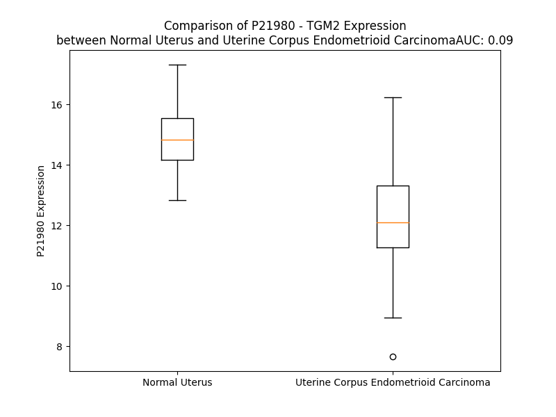

# Detailed Data for P21980

## Introduction to the Detailed Summary

### How to Interpret the Results

- **Summary & Metrics**: This section provides a quick reference to essential protein attributes, including expression changes, family classification, and biomarker applications. Regulation status (upregulated/downregulated) indicates the protein's behavior in a disease context. Some information comes from the original excel file with the proteins selected from literature, while others are derived from the analyses.
- **Expression Comparison**: A visual representation comparing protein expression between normal and disease states. It highlights significant changes in expression levels that might indicate diagnostic or therapeutic relevance. This is data coming from transcriptomics experiments and could not translate similarly to protein levels.
- **Isoform Alignment**: An interactive view of isoform alignments, revealing structural and functional differences between variants of the protein.
- **Interactors & Homologs**: Tables listing known interaction partners and homologous proteins, the more interactors and homologs, the more complex the protein is to design an antibody for.
- **Biological Assemblies**: Information about the structural arrangement of the protein in different assemblies, providing insights into its functional state but also the complexity of the protein to develop antibodies.
- **Combined Per-Residue Information**: A detailed table summarizing residue-level data. This includes predictions for epitope regions, aggregation tendencies, and modifications that might impact the protein's function. Each row corresponds to a residue in the protein, providing insights into specific sites that may be important for research or drug development.
## Summary & Metrics

- **UniProt Accession**: P21980
- **Gene Name**: TGM2
- **Protein Name**: Protein-glutamine gamma-glutamyltransferase 2
- **Swiss Prot**: TGM2_HUMAN
- **Family**: enzyme
- **Biomarker Application**:  
- **Number of Isoforms**: 3
- **Regulation**: 2
- **(transcriptomics) AUC**: 0.02
- **(transcriptomics) Fold Change**: 1.29
- **(transcriptomics) Regulation**: Downregulated
- **Discotope Epitope Count**: 125
- **Max n_uniprots (Homo)**: 2
- **Max n_uniprots (Hetero)**: N/A

## Expression Comparison

## Isoform Alignment

<pre style='font-size:14px; font-family:monospace;'>P21980-1 MAEELVLERCDLELETNGRDHHTADLCREKLVVRRGQPFWLTLHFEGRNYEASVDSLTFSVVTGPAPSQEAGTKARFPLRDAVEEGDWTATVVDQQDCTLSLQLTTPANAPIGLYRLSLEASTGYQGSSFVLGHFILLFNAWCPADAVYLDSEEERQEYVLTQQGFIYQGSAKFIKNIPWNFGQFEDGILDICLILLDVNPKFLKNAGRDCSRRSSPVYVGRVVSGMVNCNDDQGVLLGRWDNNYGDGVSPMSWIGSVDILRRWKNHGCQRVKYGQCWVFAAVACTVLRCLGIPTRVVTNYNSAHDQNSNLLIEYFRNEFGEIQGDKSEMIWNFHCWVESWMTRPDLQPGYEGWQALDPTPQEKSEGTYCCGPVPVRAIKEGDLSTKYDAPFVFAEVNADVVDWIQQDDGSVHKSINRSLIVGLKISTKSVGRDEREDITHTYKYPEGSSEEREAFTRANHLNKLAEKEETGMAMRIRVGQSMNMGSDFDVFAHITNNTAEEYVCRLLLCARTVSYNGILGPECGTKYLLNLNLEPFSEKSVPLCILYEKYRDCLTESNLIKVRALLVEPVINSYLLAERDLYLENPEIKIRILGEPKQKRKLVAEVSLQNPLPVALEGCTFTVEGAGLTEEQKTVEIPDPVEAGEEVKVRMDLLPLHMGLHKLVVNFESDKLKAVKGFRNVIIGPA
P21980-2 MAEELVLERCDLELETNGRDHHTADLCREKLVVRRGQPFWLTLHFEGRNYEASVDSLTFSVVTGPAPSQEAGTKARFPLRDAVEEGDWTATVVDQQDCTLSLQLTTPANAPIGLYRLSLEASTGYQGSSFVLGHFILLFNAWCPADAVYLDSEEERQEYVLTQQGFIYQGSAKFIKNIPWNFGQFEDGILDICLILLDVNPKFLKNAGRDCSRRSSPVYVGRVVSGMVNCNDDQGVLLGRWDNNYGDGVSPMSWIGSVDILRRWKNHGCQRVKYGQCWVFAAVACTVLRCLGIPTRVVTNYNSAHDQNSNLLIEYFRNEFGEIQGDKSEMIWNFHCWVESWMTRPDLQPGYEGWQALDPTPQEKSEGTYCCGPVPVRAIKEGDLSTKYDAPFVFAEVNADVVDWIQQDDGSVHKSINRSLIVGLKISTKSVGRDEREDITHTYKYPEGSSEEREAFTRANHLNKLAEKEETGMAMRIRVGQSMNMGSDFDVFAHITNNTAEEYVCRLLLCARTVSYNGILGPECGTKYLLNLNLEPFSGKALCSWSIC-------------------------------------------------------------------------------------------------------------------------------------------
P21980-3 MAEELVLERCDLELETNGRDHHTADLCREKLVVRRGQPFWLTLHFEGRNYEASVDSLTFSVVTGPAPSQEAGTKARFPLRDAVEEGDWTATVVDQQDCTLSLQLTTPANAPIGLYRLSLEASTGYQGSSFVLGHFILLFNAWCPADAVYLDSEEERQEYVLTQQGFIYQGSAKFIKNIPWNFGQFEDGILDICLILLDVNPKFLKNAGRDCSRRSSPVYVGRVVSGMVNCNDDQGVLLGRWDNNYGDGVSPMSWIGSVDILRRWKNHGCQRVKYGQCWVFAAVACTGELHAGMWVMSPG--------------------------RGHEEHWS---------RNQDIP-------A-LVLPPATNTLNALCGLEPVTTLS-GPLSNSHPSSGC------------------------------------------------------------------------------------------------------------------------------------------------------------------------------------------------------------------------------------------------------------------------------------------------------
</pre>

## Interactors

| preferredName_A   | preferredName_B   |   score |
|:------------------|:------------------|--------:|
| TGM2              | FN1               |   0.997 |
| TGM2              | TOR1A             |   0.927 |

## Homologs

| uniprot_id   | gene_id   |
|:-------------|:----------|
| P49221       | TGM4      |
| H0YMQ8       | TGM1      |
| Q9NQP5       | F13A1     |
| O43548       | TGM5      |
| Q96PF1       | TGM7      |
| O95932       | TGM6      |
| H3BPV8       | EPB42     |
| Q08188       | TGM3      |

## Biological Assemblies

|   Unnamed: 0 |   assembly |   n_uniprots | composition   | crystal_id   |
|-------------:|-----------:|-------------:|:--------------|:-------------|
|            0 |          1 |            1 | Homo          | 3ly6         |
|            1 |          2 |            1 | Homo          | 3ly6         |
|            2 |          3 |            1 | Homo          | 3ly6         |
|            0 |          1 |            2 | Homo          | 2q3z         |
|            1 |          2 |            2 | Homo          | 2q3z         |
|            0 |          1 |            2 | Homo          | 1kv3         |
|            1 |          2 |            2 | Homo          | 1kv3         |
|            2 |          3 |            2 | Homo          | 1kv3         |
|            0 |          1 |            1 | Homo          | 4pyg         |
|            1 |          2 |            1 | Homo          | 4pyg         |
|            2 |          3 |            1 | Homo          | 4pyg         |
|            0 |          1 |            1 | Homo          | 6a8p         |
|            1 |          2 |            1 | Homo          | 6a8p         |
|            2 |          3 |            1 | Homo          | 6a8p         |
|            0 |          1 |            2 | Homo          | 3s3p         |
|            0 |          1 |            2 | Homo          | 3s3s         |
|            0 |          1 |            2 | Homo          | 3s3j         |
|            0 |          1 |            1 | Homo          | 6kzb         |
|            1 |          2 |            2 | Homo          | 6kzb         |

## Combined Per-Residue Information

|   res | aa   |   epitope_score | epitope   |   relative_surface_accessibility |   modeling_confidence |   Aggregation | modification    |
|------:|:-----|----------------:|:----------|---------------------------------:|----------------------:|--------------:|:----------------|
|     1 | M    |         0.16293 | True      |                          1.27479 |                 59.53 |         0     | N/A             |
|     2 | A    |         0.12449 | False     |                          0.50695 |                 66.45 |         0     | N-acetylalanine |
|     3 | E    |         0.12957 | True      |                          0.66668 |                 77.99 |         0     | N/A             |
|     4 | E    |         0.09042 | False     |                          0.31294 |                 86.01 |         0     | N/A             |
|     5 | L    |         0.00686 | False     |                          0.00806 |                 89.28 |         0     | N/A             |
|     6 | V    |         0.04715 | False     |                          0.4132  |                 90.45 |         0     | N/A             |
|     7 | L    |         0.05092 | False     |                          0.12451 |                 93.87 |         0     | N/A             |
|     8 | E    |         0.1045  | False     |                          0.61398 |                 94.01 |         0     | N/A             |
|     9 | R    |         0.25563 | True      |                          0.48943 |                 94.99 |         0     | N/A             |
|    10 | C    |         0.0377  | False     |                          0.21078 |                 96.34 |         0     | N/A             |
|    11 | D    |         0.05108 | False     |                          0.27879 |                 96.26 |         0     | N/A             |
|    12 | L    |         0.04524 | False     |                          0.20227 |                 96.15 |         0     | N/A             |
|    13 | E    |         0.0509  | False     |                          0.29887 |                 96.29 |         0     | N/A             |
|    14 | L    |         0.07205 | False     |                          0.32592 |                 96.1  |         0     | N/A             |
|    15 | E    |         0.10856 | False     |                          0.76625 |                 94.78 |         0     | N/A             |
|    16 | T    |         0.11167 | False     |                          0.31223 |                 96.04 |         0     | N/A             |
|    17 | N    |         0.01065 | False     |                          0.00127 |                 97.84 |         0     | N/A             |
|    18 | G    |         0.00339 | False     |                          0.00161 |                 96.87 |         0     | N/A             |
|    19 | R    |         0.33105 | True      |                          0.57861 |                 96.11 |         0     | N/A             |
|    20 | D    |         0.08347 | False     |                          0.32295 |                 97.37 |         0     | N/A             |
|    21 | H    |         0.0099  | False     |                          0.00205 |                 98.12 |         0     | N/A             |
|    22 | H    |         0.09375 | False     |                          0.33927 |                 97.17 |         0     | N/A             |
|    23 | T    |         0.01456 | False     |                          0.01904 |                 96.86 |         0     | N/A             |
|    24 | A    |         0.1353  | True      |                          0.57392 |                 93.1  |         0     | N/A             |
|    25 | D    |         0.0601  | False     |                          0.33196 |                 88.22 |         0     | N/A             |
|    26 | L    |         0.05204 | False     |                          0.14319 |                 91.65 |         0     | N/A             |
|    27 | C    |         0.03197 | False     |                          0.08696 |                 84.39 |         0     | N/A             |
|    28 | R    |         0.1199  | False     |                          0.5728  |                 80.79 |         0     | N/A             |
|    29 | E    |         0.18139 | True      |                          0.81005 |                 85.92 |         0     | N/A             |
|    30 | K    |         0.12428 | False     |                          0.46185 |                 92.84 |         0     | N/A             |
|    31 | L    |         0.00456 | False     |                          0.00366 |                 97.57 |         0     | N/A             |
|    32 | V    |         0.00581 | False     |                          0.00762 |                 98.36 |         0     | N/A             |
|    33 | V    |         0.00256 | False     |                          0.00286 |                 98.61 |         0     | N/A             |
|    34 | R    |         0.01604 | False     |                          0.0083  |                 98.77 |         0     | N/A             |
|    35 | R    |         0.01026 | False     |                          0.00609 |                 98.59 |         0     | N/A             |
|    36 | G    |         0.03122 | False     |                          0.24878 |                 97.32 |         0     | N/A             |
|    37 | Q    |         0.10077 | False     |                          0.19725 |                 96.89 |         0     | N/A             |
|    38 | P    |         0.04527 | False     |                          0.36345 |                 96.35 |         0.435 | N/A             |
|    39 | F    |         0.00625 | False     |                          0.00064 |                 97.74 |        37.206 | N/A             |
|    40 | W    |         0.1213  | False     |                          0.34673 |                 97.51 |        37.301 | N/A             |
|    41 | L    |         0.01139 | False     |                          0.00567 |                 97.03 |        37.301 | N/A             |
|    42 | T    |         0.04991 | False     |                          0.10277 |                 97.67 |        37.301 | N/A             |
|    43 | L    |         0.00363 | False     |                          0       |                 97.44 |        37.301 | N/A             |
|    44 | H    |         0.03949 | False     |                          0.15668 |                 97.11 |         1.364 | N/A             |
|    45 | F    |         0.0201  | False     |                          0.03096 |                 94.91 |         1.268 | N/A             |
|    46 | E    |         0.18737 | True      |                          0.54802 |                 92.84 |         0     | N/A             |
|    47 | G    |         0.1495  | True      |                          0.88623 |                 89.78 |         0     | N/A             |
|    48 | R    |         0.26162 | True      |                          0.15577 |                 92.39 |         0     | N/A             |
|    49 | N    |         0.11692 | False     |                          0.37451 |                 92.35 |         0     | N/A             |
|    50 | Y    |         0.06315 | False     |                          0.08835 |                 93.17 |         0     | N/A             |
|    51 | E    |         0.10605 | False     |                          0.46558 |                 92.42 |         0     | N/A             |
|    52 | A    |         0.06539 | False     |                          0.77702 |                 89.96 |         0     | N/A             |
|    53 | S    |         0.15191 | True      |                          0.84822 |                 89.94 |         0     | N/A             |
|    54 | V    |         0.09933 | False     |                          0.41339 |                 91.07 |         0     | N/A             |
|    55 | D    |         0.04416 | False     |                          0.03476 |                 93    |         0     | N/A             |
|    56 | S    |         0.06897 | False     |                          0.46608 |                 93.63 |         2.186 | N/A             |
|    57 | L    |         0.01458 | False     |                          0.0152  |                 95.9  |        19.806 | N/A             |
|    58 | T    |         0.0628  | False     |                          0.10594 |                 96.34 |        28.184 | N/A             |
|    59 | F    |         0.00245 | False     |                          0       |                 97.84 |        33.45  | N/A             |
|    60 | S    |         0.05924 | False     |                          0.15782 |                 97.89 |        33.45  | Phosphoserine   |
|    61 | V    |         0.01316 | False     |                          0.00571 |                 98.34 |        33.45  | N/A             |
|    62 | V    |         0.08125 | False     |                          0.25189 |                 98.44 |        32.448 | N/A             |
|    63 | T    |         0.07745 | False     |                          0.06906 |                 98.33 |        15.405 | N/A             |
|    64 | G    |         0.05946 | False     |                          0.41392 |                 96.66 |         0     | N/A             |
|    65 | P    |         0.17113 | True      |                          0.67387 |                 95.81 |         0     | N/A             |
|    66 | A    |         0.17901 | True      |                          0.58169 |                 95.15 |         0     | N/A             |
|    67 | P    |         0.07337 | False     |                          0.37339 |                 96.38 |         0     | N/A             |
|    68 | S    |         0.1423  | True      |                          0.29038 |                 96.91 |         0     | N/A             |
|    69 | Q    |         0.13849 | True      |                          0.556   |                 95.22 |         0     | N/A             |
|    70 | E    |         0.23414 | True      |                          0.84595 |                 93.81 |         0     | N/A             |
|    71 | A    |         0.21657 | True      |                          0.32657 |                 94.48 |         0     | N/A             |
|    72 | G    |         0.11573 | False     |                          0.42867 |                 95.79 |         0     | N/A             |
|    73 | T    |         0.00994 | False     |                          0.00796 |                 97.95 |         0     | N/A             |
|    74 | K    |         0.16479 | True      |                          0.38721 |                 98.18 |         0     | N/A             |
|    75 | A    |         0.07265 | False     |                          0.17037 |                 97.3  |         0     | N/A             |
|    76 | R    |         0.2805  | True      |                          0.52668 |                 96.67 |         0     | N/A             |
|    77 | F    |         0.11592 | False     |                          0.05696 |                 95.9  |         0     | N/A             |
|    78 | P    |         0.10471 | False     |                          0.40424 |                 95.39 |         0     | N/A             |
|    79 | L    |         0.07897 | False     |                          0.15918 |                 94.9  |         0     | N/A             |
|    80 | R    |         0.16393 | True      |                          0.43624 |                 88.52 |         0     | N/A             |
|    81 | D    |         0.2101  | True      |                          0.91425 |                 78.2  |         0     | N/A             |
|    82 | A    |         0.14431 | True      |                          0.64721 |                 75.99 |         0     | N/A             |
|    83 | V    |         0.25972 | True      |                          0.5615  |                 75.51 |         0     | N/A             |
|    84 | E    |         0.17566 | True      |                          0.49064 |                 77.48 |         0     | N/A             |
|    85 | E    |         0.18255 | True      |                          0.89056 |                 79.43 |         0     | N/A             |
|    86 | G    |         0.09925 | False     |                          0.70438 |                 84.74 |         0     | N/A             |
|    87 | D    |         0.24333 | True      |                          0.52504 |                 90.95 |         0     | N/A             |
|    88 | W    |         0.03902 | False     |                          0.09938 |                 95.47 |         1.415 | N/A             |
|    89 | T    |         0.05152 | False     |                          0.05549 |                 95.85 |         1.758 | N/A             |
|    90 | A    |         0.00423 | False     |                          0.00219 |                 96.51 |         1.758 | N/A             |
|    91 | T    |         0.05968 | False     |                          0.09069 |                 95.5  |         1.758 | N/A             |
|    92 | V    |         0.10851 | False     |                          0.40794 |                 94.61 |         1.758 | N/A             |
|    93 | V    |         0.1818  | True      |                          0.51303 |                 93.56 |         1.758 | N/A             |
|    94 | D    |         0.12665 | True      |                          0.38413 |                 93.99 |         0     | N/A             |
|    95 | Q    |         0.10311 | False     |                          0.38276 |                 93.62 |         0     | N/A             |
|    96 | Q    |         0.09167 | False     |                          0.61059 |                 92.97 |         0     | N/A             |
|    97 | D    |         0.14151 | True      |                          0.70737 |                 89.87 |         0     | N/A             |
|    98 | C    |         0.06183 | False     |                          0.29618 |                 93.75 |         0     | N/A             |
|    99 | T    |         0.05284 | False     |                          0.2801  |                 96.65 |         0     | N/A             |
|   100 | L    |         0.00579 | False     |                          0.0033  |                 96.55 |         0     | N/A             |
|   101 | S    |         0.09219 | False     |                          0.20993 |                 96.87 |         0     | N/A             |
|   102 | L    |         0.00322 | False     |                          0       |                 96.77 |         0     | N/A             |
|   103 | Q    |         0.08056 | False     |                          0.21904 |                 96.31 |         0     | N/A             |
|   104 | L    |         0.00402 | False     |                          0       |                 96.86 |         0     | N/A             |
|   105 | T    |         0.05603 | False     |                          0.13973 |                 96.2  |         0     | N/A             |
|   106 | T    |         0.0095  | False     |                          0.01292 |                 97.09 |         0     | N/A             |
|   107 | P    |         0.03516 | False     |                          0.09245 |                 96.89 |         0     | N/A             |
|   108 | A    |         0.02608 | False     |                          0.14538 |                 97.63 |         0     | N/A             |
|   109 | N    |         0.14369 | True      |                          0.67895 |                 97.01 |         0     | N/A             |
|   110 | A    |         0.0077  | False     |                          0.02423 |                 98.22 |         0     | N/A             |
|   111 | P    |         0.01143 | False     |                          0.03976 |                 98.6  |         0     | N/A             |
|   112 | I    |         0.01144 | False     |                          0.01124 |                 98.84 |         0     | N/A             |
|   113 | G    |         0.00749 | False     |                          0.02092 |                 98.3  |         0     | N/A             |
|   114 | L    |         0.10145 | False     |                          0.58052 |                 98.03 |         0     | N/A             |
|   115 | Y    |         0.02956 | False     |                          0.00622 |                 98.47 |         0     | N/A             |
|   116 | R    |         0.1425  | True      |                          0.44528 |                 98.22 |         0     | N/A             |
|   117 | L    |         0.0081  | False     |                          0.00495 |                 98.24 |         0     | N/A             |
|   118 | S    |         0.11168 | False     |                          0.09125 |                 98.07 |         0     | N/A             |
|   119 | L    |         0.0088  | False     |                          0.00082 |                 97.7  |         0     | N/A             |
|   120 | E    |         0.05482 | False     |                          0.36394 |                 96.12 |         0     | N/A             |
|   121 | A    |         0.03035 | False     |                          0.02376 |                 94.26 |         0     | N/A             |
|   122 | S    |         0.11183 | False     |                          0.27817 |                 92.23 |         0     | N/A             |
|   123 | T    |         0.09023 | False     |                          0.06802 |                 89.99 |         0     | N/A             |
|   124 | G    |         0.12112 | False     |                          0.74969 |                 83.44 |         0     | N/A             |
|   125 | Y    |         0.21427 | True      |                          1.05953 |                 75.86 |         0.013 | N/A             |
|   126 | Q    |         0.13791 | True      |                          0.53433 |                 76.86 |         0.013 | N/A             |
|   127 | G    |         0.27316 | True      |                          0.66696 |                 84.85 |         0.056 | N/A             |
|   128 | S    |         0.11756 | False     |                          0.28811 |                 90.73 |         0.611 | N/A             |
|   129 | S    |         0.18893 | True      |                          0.65733 |                 93.3  |         4.88  | N/A             |
|   130 | F    |         0.07838 | False     |                          0.20756 |                 94.74 |        39.227 | N/A             |
|   131 | V    |         0.16016 | True      |                          0.61727 |                 95.88 |        42.028 | N/A             |
|   132 | L    |         0.03949 | False     |                          0.08806 |                 96.41 |        42.265 | N/A             |
|   133 | G    |         0.03472 | False     |                          0.21008 |                 95.72 |        42.277 | N/A             |
|   134 | H    |         0.11593 | False     |                          0.5135  |                 96.73 |        42.744 | N/A             |
|   135 | F    |         0.01163 | False     |                          0.01191 |                 98.1  |        97.449 | N/A             |
|   136 | I    |         0.02216 | False     |                          0.0168  |                 98.48 |        98.293 | N/A             |
|   137 | L    |         0.00136 | False     |                          0       |                 98.79 |        98.266 | N/A             |
|   138 | L    |         0.0012  | False     |                          0.00082 |                 98.88 |        97.798 | N/A             |
|   139 | F    |         0.00184 | False     |                          0       |                 98.92 |        95.16  | N/A             |
|   140 | N    |         0.00742 | False     |                          0.00444 |                 98.8  |        18.552 | N/A             |
|   141 | A    |         0.00131 | False     |                          0       |                 98.75 |        15.43  | N/A             |
|   142 | W    |         0.06481 | False     |                          0.1513  |                 98.59 |        12.604 | N/A             |
|   143 | C    |         0.06535 | False     |                          0.10828 |                 97.9  |         0.907 | N/A             |
|   144 | P    |         0.13589 | True      |                          0.76152 |                 97.41 |         0.185 | N/A             |
|   145 | A    |         0.12948 | True      |                          0.78049 |                 97.12 |         0     | N/A             |
|   146 | D    |         0.03262 | False     |                          0.0267  |                 98.58 |         0     | N/A             |
|   147 | A    |         0.05018 | False     |                          0.24611 |                 98.52 |         0     | N/A             |
|   148 | V    |         0.00348 | False     |                          0       |                 98.87 |         0     | N/A             |
|   149 | Y    |         0.06013 | False     |                          0.28336 |                 98.76 |         0     | N/A             |
|   150 | L    |         0.02323 | False     |                          0.02143 |                 98.4  |         0     | N/A             |
|   151 | D    |         0.1912  | True      |                          0.66343 |                 97.96 |         0     | N/A             |
|   152 | S    |         0.14037 | True      |                          0.2753  |                 98.41 |         0     | N/A             |
|   153 | E    |         0.07936 | False     |                          0.36913 |                 98.14 |         0     | N/A             |
|   154 | E    |         0.14223 | True      |                          0.58079 |                 98.15 |         0     | N/A             |
|   155 | E    |         0.08108 | False     |                          0.28343 |                 98.61 |         0     | N/A             |
|   156 | R    |         0.05173 | False     |                          0.1063  |                 98.53 |         0     | N/A             |
|   157 | Q    |         0.10629 | False     |                          0.37809 |                 97.74 |         0     | N/A             |
|   158 | E    |         0.02444 | False     |                          0.03429 |                 98.27 |         0     | N/A             |
|   159 | Y    |         0.01801 | False     |                          0.01599 |                 98.78 |         0.174 | N/A             |
|   160 | V    |         0.00294 | False     |                          0       |                 98.62 |         0.174 | N/A             |
|   161 | L    |         0.06646 | False     |                          0.21334 |                 97.09 |         0.174 | N/A             |
|   162 | T    |         0.05217 | False     |                          0.26295 |                 96.07 |         0.174 | N/A             |
|   163 | Q    |         0.01906 | False     |                          0.12773 |                 95.82 |         0.174 | N/A             |
|   164 | Q    |         0.02444 | False     |                          0.10416 |                 93.58 |         0.174 | N/A             |
|   165 | G    |         0.00998 | False     |                          0.02253 |                 95.91 |         0.174 | N/A             |
|   166 | F    |         0.01618 | False     |                          0.02832 |                 97.34 |         0.174 | N/A             |
|   167 | I    |         0.00159 | False     |                          0.0024  |                 97.89 |         0.174 | N/A             |
|   168 | Y    |         0.00954 | False     |                          0.03233 |                 97.35 |         0.174 | N/A             |
|   169 | Q    |         0.01566 | False     |                          0.04477 |                 94.98 |         0     | N/A             |
|   170 | G    |         0.01378 | False     |                          0.02394 |                 92.39 |         0     | N/A             |
|   171 | S    |         0.02998 | False     |                          0.04555 |                 91.47 |         0     | N/A             |
|   172 | A    |         0.034   | False     |                          0.20124 |                 90.83 |         0     | N/A             |
|   173 | K    |         0.08538 | False     |                          0.80558 |                 89.79 |         0     | N/A             |
|   174 | F    |         0.05889 | False     |                          0.39009 |                 91.82 |         0     | N/A             |
|   175 | I    |         0.05238 | False     |                          0.30029 |                 94.69 |         0     | N/A             |
|   176 | K    |         0.03534 | False     |                          0.26459 |                 93.37 |         0     | N/A             |
|   177 | N    |         0.04085 | False     |                          0.39084 |                 94.83 |         0     | N/A             |
|   178 | I    |         0.02849 | False     |                          0.0576  |                 95.99 |         0     | N/A             |
|   179 | P    |         0.00323 | False     |                          0.02256 |                 97.23 |         0     | N/A             |
|   180 | W    |         0.0052  | False     |                          0.00276 |                 98.02 |         0     | N/A             |
|   181 | N    |         0.0032  | False     |                          0.00678 |                 97.66 |         0     | N/A             |
|   182 | F    |         0.00861 | False     |                          0.02739 |                 98.22 |         0     | N/A             |
|   183 | G    |         0.00145 | False     |                          0       |                 96.29 |         0     | N/A             |
|   184 | Q    |         0.00619 | False     |                          0       |                 96.89 |         0     | N/A             |
|   185 | F    |         0.03136 | False     |                          0.10197 |                 94.85 |         0     | N/A             |
|   186 | E    |         0.02042 | False     |                          0.12542 |                 93.89 |         0     | N/A             |
|   187 | D    |         0.09498 | False     |                          0.69939 |                 91.66 |         0     | N/A             |
|   188 | G    |         0.06    | False     |                          0.28042 |                 94.09 |         0     | N/A             |
|   189 | I    |         0.00329 | False     |                          0.00069 |                 97.02 |         0     | N/A             |
|   190 | L    |         0.03432 | False     |                          0.07102 |                 97.96 |         0     | N/A             |
|   191 | D    |         0.0424  | False     |                          0.25136 |                 97.21 |         0     | N/A             |
|   192 | I    |         0.02083 | False     |                          0.008   |                 98.31 |        26.787 | N/A             |
|   193 | C    |         0.00114 | False     |                          0       |                 98.57 |        28.86  | N/A             |
|   194 | L    |         0.02575 | False     |                          0.10057 |                 98.3  |        28.86  | N/A             |
|   195 | I    |         0.10233 | False     |                          0.31107 |                 97.61 |        28.86  | N/A             |
|   196 | L    |         0.0062  | False     |                          0       |                 98.09 |        28.86  | N/A             |
|   197 | L    |         0.01162 | False     |                          0.01401 |                 98.11 |        24.713 | N/A             |
|   198 | D    |         0.04431 | False     |                          0.32816 |                 97    |         0     | N/A             |
|   199 | V    |         0.14686 | True      |                          0.183   |                 95.95 |         0     | N/A             |
|   200 | N    |         0.04668 | False     |                          0.0163  |                 95.67 |         0     | N/A             |
|   201 | P    |         0.10859 | False     |                          0.43483 |                 95.09 |         0     | N/A             |
|   202 | K    |         0.21985 | True      |                          0.41356 |                 95.23 |         0     | N/A             |
|   203 | F    |         0.11135 | False     |                          0.17449 |                 96.84 |         0     | N/A             |
|   204 | L    |         0.18083 | True      |                          0.70821 |                 95.5  |         0     | N/A             |
|   205 | K    |         0.35725 | True      |                          0.90389 |                 96.16 |         0     | N/A             |
|   206 | N    |         0.25438 | True      |                          0.48971 |                 97.26 |         0     | N/A             |
|   207 | A    |         0.08077 | False     |                          0.20363 |                 97.37 |         0     | N/A             |
|   208 | G    |         0.10155 | False     |                          0.18573 |                 96.8  |         0     | N/A             |
|   209 | R    |         0.30256 | True      |                          0.65159 |                 97.44 |         0     | N/A             |
|   210 | D    |         0.01202 | False     |                          0.019   |                 98.19 |         0     | N/A             |
|   211 | C    |         0.01979 | False     |                          0.03941 |                 98.25 |         0     | N/A             |
|   212 | S    |         0.09173 | False     |                          0.2081  |                 97.58 |         0     | N/A             |
|   213 | R    |         0.1343  | True      |                          0.41936 |                 98.13 |         0     | N/A             |
|   214 | R    |         0.03538 | False     |                          0.05001 |                 98.55 |         0     | N/A             |
|   215 | S    |         0.0862  | False     |                          0.23233 |                 98.18 |         0     | N/A             |
|   216 | S    |         0.08767 | False     |                          0.29272 |                 98.61 |         0     | N/A             |
|   217 | P    |         0.00731 | False     |                          0.03678 |                 98.79 |         0     | N/A             |
|   218 | V    |         0.03144 | False     |                          0.10638 |                 98.67 |         0     | N/A             |
|   219 | Y    |         0.07323 | False     |                          0.05419 |                 98.38 |         0     | N/A             |
|   220 | V    |         0.00272 | False     |                          0.00381 |                 98.76 |         0     | N/A             |
|   221 | G    |         0.0033  | False     |                          0.00357 |                 98.52 |         0     | N/A             |
|   222 | R    |         0.03569 | False     |                          0.05675 |                 97.86 |         0     | N/A             |
|   223 | V    |         0.0151  | False     |                          0.04446 |                 97.9  |         0.548 | N/A             |
|   224 | V    |         0.00175 | False     |                          0.00286 |                 98.47 |         0.548 | N/A             |
|   225 | S    |         0.01172 | False     |                          0.01204 |                 97.78 |         0.548 | N/A             |
|   226 | G    |         0.05693 | False     |                          0.08019 |                 96.6  |         0.548 | N/A             |
|   227 | M    |         0.01487 | False     |                          0.01079 |                 97.81 |         0.548 | N/A             |
|   228 | V    |         0.00205 | False     |                          0       |                 98.21 |         0.548 | N/A             |
|   229 | N    |         0.0214  | False     |                          0.01134 |                 96.69 |         0     | N/A             |
|   230 | C    |         0.06798 | False     |                          0.09592 |                 94.7  |         0     | N/A             |
|   231 | N    |         0.18464 | True      |                          0.42608 |                 90.41 |         0     | N/A             |
|   232 | D    |         0.26875 | True      |                          0.372   |                 87.07 |         0     | N/A             |
|   233 | D    |         0.08456 | False     |                          0.23126 |                 82.52 |         0     | N/A             |
|   234 | Q    |         0.07989 | False     |                          0.45647 |                 87.94 |         0     | N/A             |
|   235 | G    |         0.00397 | False     |                          0.00119 |                 93.9  |         0.474 | N/A             |
|   236 | V    |         0.00141 | False     |                          0       |                 98.31 |         0.474 | N/A             |
|   237 | L    |         0.00291 | False     |                          0       |                 98.37 |         0.474 | N/A             |
|   238 | L    |         0.073   | False     |                          0.23247 |                 97.73 |         0.474 | N/A             |
|   239 | G    |         0.13081 | True      |                          0.21204 |                 96.46 |         0.474 | N/A             |
|   240 | R    |         0.1904  | True      |                          0.24113 |                 94.6  |         0     | N/A             |
|   241 | W    |         0.12187 | False     |                          0.23908 |                 91.03 |         0     | N/A             |
|   242 | D    |         0.32173 | True      |                          0.50509 |                 89.18 |         0     | N/A             |
|   243 | N    |         0.18569 | True      |                          0.40229 |                 84.89 |         0     | N/A             |
|   244 | N    |         0.26422 | True      |                          0.56242 |                 89.99 |         0     | N/A             |
|   245 | Y    |         0.08518 | False     |                          0.10682 |                 92.75 |         0     | N/A             |
|   246 | G    |         0.45797 | True      |                          0.9805  |                 92.6  |         0     | N/A             |
|   247 | D    |         0.37808 | True      |                          0.5121  |                 95.64 |         0     | N/A             |
|   248 | G    |         0.16313 | True      |                          0.43046 |                 95.79 |         0     | N/A             |
|   249 | V    |         0.05384 | False     |                          0.26087 |                 94.82 |         0     | N/A             |
|   250 | S    |         0.09438 | False     |                          0.15835 |                 94.48 |         0     | N/A             |
|   251 | P    |         0.00309 | False     |                          0       |                 96.09 |         0     | N/A             |
|   252 | M    |         0.0417  | False     |                          0.0972  |                 93.16 |         0     | N/A             |
|   253 | S    |         0.0334  | False     |                          0.14416 |                 95.09 |         0     | N/A             |
|   254 | W    |         0.02078 | False     |                          0.03599 |                 96.76 |         0.129 | N/A             |
|   255 | I    |         0.0066  | False     |                          0.00389 |                 97.05 |         0.129 | N/A             |
|   256 | G    |         0.00633 | False     |                          0.01248 |                 97.56 |         0.129 | N/A             |
|   257 | S    |         0.00299 | False     |                          0       |                 98.55 |         0.129 | N/A             |
|   258 | V    |         0.01464 | False     |                          0.04856 |                 97.61 |         0.129 | N/A             |
|   259 | D    |         0.03951 | False     |                          0.15347 |                 96.9  |         0     | N/A             |
|   260 | I    |         0.00386 | False     |                          0       |                 98.32 |         0     | N/A             |
|   261 | L    |         0.00165 | False     |                          0       |                 98.49 |         0     | N/A             |
|   262 | R    |         0.05782 | False     |                          0.18847 |                 97.49 |         0     | N/A             |
|   263 | R    |         0.08417 | False     |                          0.33849 |                 97.14 |         0     | N/A             |
|   264 | W    |         0.00821 | False     |                          0       |                 97.88 |         0     | N/A             |
|   265 | K    |         0.07779 | False     |                          0.36144 |                 97.05 |         0     | N/A             |
|   266 | N    |         0.16409 | True      |                          0.73315 |                 96.3  |         0     | N/A             |
|   267 | H    |         0.13888 | True      |                          0.64194 |                 95.25 |         0     | N/A             |
|   268 | G    |         0.1385  | True      |                          0.69366 |                 94.79 |         0     | N/A             |
|   269 | C    |         0.06224 | False     |                          0.14682 |                 95.05 |         0     | N/A             |
|   270 | Q    |         0.14397 | True      |                          0.61716 |                 93.92 |         0     | N/A             |
|   271 | R    |         0.21709 | True      |                          0.5454  |                 96.76 |         0     | N/A             |
|   272 | V    |         0.03727 | False     |                          0.07712 |                 98.18 |         0     | N/A             |
|   273 | K    |         0.14433 | True      |                          0.31037 |                 97.63 |         0     | N/A             |
|   274 | Y    |         0.0368  | False     |                          0.02916 |                 97.57 |         0.084 | N/A             |
|   275 | G    |         0.00276 | False     |                          0       |                 97.44 |         0.108 | N/A             |
|   276 | Q    |         0.0406  | False     |                          0.03465 |                 96.33 |         0.84  | N/A             |
|   277 | C    |         0.01014 | False     |                          0       |                 97.46 |        19.012 | N/A             |
|   278 | W    |         0.01118 | False     |                          0.02194 |                 98.08 |        93.246 | N/A             |
|   279 | V    |         0.00375 | False     |                          0       |                 98.55 |        98.364 | N/A             |
|   280 | F    |         0.00263 | False     |                          0       |                 98.68 |        98.696 | N/A             |
|   281 | A    |         0.00089 | False     |                          0       |                 98.79 |        98.698 | N/A             |
|   282 | A    |         0.00074 | False     |                          0       |                 98.74 |        98.362 | N/A             |
|   283 | V    |         0.00111 | False     |                          0       |                 98.82 |        97.779 | N/A             |
|   284 | A    |         0.00209 | False     |                          0.01148 |                 98.85 |        90.258 | N/A             |
|   285 | C    |         0.00079 | False     |                          0       |                 98.9  |        83.836 | N/A             |
|   286 | T    |         0.00042 | False     |                          0       |                 98.86 |        80.373 | N/A             |
|   287 | V    |         0.00114 | False     |                          0       |                 98.84 |        78.314 | N/A             |
|   288 | L    |         0.00278 | False     |                          0.00659 |                 98.92 |        67.634 | N/A             |
|   289 | R    |         0.00923 | False     |                          0.02978 |                 98.8  |         0.011 | N/A             |
|   290 | C    |         0.00719 | False     |                          0.00888 |                 98.59 |         0.011 | N/A             |
|   291 | L    |         0.0015  | False     |                          0       |                 98.84 |         0.011 | N/A             |
|   292 | G    |         0.00152 | False     |                          0       |                 98.74 |         0     | N/A             |
|   293 | I    |         0.002   | False     |                          0       |                 98.93 |         0     | N/A             |
|   294 | P    |         0.00101 | False     |                          0       |                 98.93 |         0     | N/A             |
|   295 | T    |         0.00146 | False     |                          0       |                 98.95 |         0     | N/A             |
|   296 | R    |         0.04826 | False     |                          0.0603  |                 98.86 |         0     | N/A             |
|   297 | V    |         0.0129  | False     |                          0.06315 |                 98.86 |         0.251 | N/A             |
|   298 | V    |         0.00367 | False     |                          0.0019  |                 98.86 |         0.251 | N/A             |
|   299 | T    |         0.00565 | False     |                          0.00724 |                 98.79 |         0.251 | N/A             |
|   300 | N    |         0.00234 | False     |                          0       |                 98.37 |         0.251 | N/A             |
|   301 | Y    |         0.00315 | False     |                          0       |                 96.19 |         0.251 | N/A             |
|   302 | N    |         0.01545 | False     |                          0.12212 |                 93.63 |         0     | N/A             |
|   303 | S    |         0.01411 | False     |                          0.01687 |                 94.67 |         0     | N/A             |
|   304 | A    |         0.00481 | False     |                          0.01184 |                 91.21 |         0     | N/A             |
|   305 | H    |         0.06511 | False     |                          0.09843 |                 84.54 |         0     | N/A             |
|   306 | D    |         0.05167 | False     |                          0.0142  |                 77.76 |         0     | N/A             |
|   307 | Q    |         0.18767 | True      |                          0.44744 |                 72.54 |         0     | N/A             |
|   308 | N    |         0.05704 | False     |                          0.5488  |                 74.25 |         0     | N/A             |
|   309 | S    |         0.14011 | True      |                          0.5048  |                 73.05 |         0     | N/A             |
|   310 | N    |         0.05369 | False     |                          0.31891 |                 77.7  |         0     | N/A             |
|   311 | L    |         0.01142 | False     |                          0.03215 |                 81.31 |         0.243 | N/A             |
|   312 | L    |         0.03663 | False     |                          0.10982 |                 81.7  |         0.243 | N/A             |
|   313 | I    |         0.00974 | False     |                          0       |                 82.08 |         0.243 | N/A             |
|   314 | E    |         0.06965 | False     |                          0.32616 |                 84.63 |         0.243 | N/A             |
|   315 | Y    |         0.02767 | False     |                          0.08056 |                 84.67 |         0.243 | N/A             |
|   316 | F    |         0.07117 | False     |                          0.39954 |                 86.42 |         0.243 | N/A             |
|   317 | R    |         0.01755 | False     |                          0.01077 |                 85.79 |         0.243 | N/A             |
|   318 | N    |         0.04089 | False     |                          0.15972 |                 82.42 |         0     | N/A             |
|   319 | E    |         0.0606  | False     |                          0.32265 |                 72.45 |         0     | N/A             |
|   320 | F    |         0.07179 | False     |                          0.59509 |                 69.11 |         0     | N/A             |
|   321 | G    |         0.01126 | False     |                          0.04401 |                 68.73 |         0     | N/A             |
|   322 | E    |         0.07002 | False     |                          0.37947 |                 73.77 |         0     | N/A             |
|   323 | I    |         0.08361 | False     |                          0.26578 |                 76.25 |         0     | N/A             |
|   324 | Q    |         0.17318 | True      |                          0.36684 |                 73.48 |         0     | N/A             |
|   325 | G    |         0.21177 | True      |                          0.78285 |                 67.94 |         0     | N/A             |
|   326 | D    |         0.17124 | True      |                          0.73569 |                 62.07 |         0     | N/A             |
|   327 | K    |         0.17307 | True      |                          0.68216 |                 65.05 |         0     | N/A             |
|   328 | S    |         0.13396 | True      |                          0.25627 |                 61.2  |         0     | N/A             |
|   329 | E    |         0.03366 | False     |                          0.13966 |                 71.27 |         0     | N/A             |
|   330 | M    |         0.10379 | False     |                          0.24534 |                 78.53 |         2.164 | N/A             |
|   331 | I    |         0.0517  | False     |                          0.11965 |                 85.1  |         3.522 | N/A             |
|   332 | W    |         0.09669 | False     |                          0.07827 |                 90.12 |         3.866 | N/A             |
|   333 | N    |         0.01334 | False     |                          0.03818 |                 91.07 |         3.866 | N/A             |
|   334 | F    |         0.01459 | False     |                          0.02994 |                 95.5  |         6.005 | N/A             |
|   335 | H    |         0.01923 | False     |                          0.00927 |                 97.15 |         5.521 | N/A             |
|   336 | C    |         0.00139 | False     |                          0       |                 98.43 |         5.521 | N/A             |
|   337 | W    |         0.00987 | False     |                          0.01436 |                 98.7  |         5.521 | N/A             |
|   338 | V    |         0.00135 | False     |                          0.00286 |                 98.9  |         5.389 | N/A             |
|   339 | E    |         0.0028  | False     |                          0.00155 |                 98.91 |         0     | N/A             |
|   340 | S    |         0.00165 | False     |                          0       |                 98.92 |         0     | N/A             |
|   341 | W    |         0.05532 | False     |                          0.32017 |                 98.89 |         0     | N/A             |
|   342 | M    |         0.01563 | False     |                          0.00303 |                 98.8  |         0     | N/A             |
|   343 | T    |         0.06595 | False     |                          0.41772 |                 98.33 |         0     | N/A             |
|   344 | R    |         0.13738 | True      |                          0.03305 |                 97.8  |         0     | N/A             |
|   345 | P    |         0.17681 | True      |                          0.86873 |                 96.05 |         0     | N/A             |
|   346 | D    |         0.28095 | True      |                          0.49114 |                 95.62 |         0     | N/A             |
|   347 | L    |         0.15447 | True      |                          0.23714 |                 96.68 |         0     | N/A             |
|   348 | Q    |         0.22252 | True      |                          0.56839 |                 94.43 |         0     | N/A             |
|   349 | P    |         0.2707  | True      |                          0.96963 |                 95.89 |         0     | N/A             |
|   350 | G    |         0.06653 | False     |                          0.19512 |                 96.17 |         0     | N/A             |
|   351 | Y    |         0.10076 | False     |                          0.08284 |                 97.7  |         0     | N/A             |
|   352 | E    |         0.0981  | False     |                          0.48584 |                 97.34 |         0     | N/A             |
|   353 | G    |         0.01348 | False     |                          0.05864 |                 98.42 |         0     | N/A             |
|   354 | W    |         0.05233 | False     |                          0.17903 |                 98.82 |         0     | N/A             |
|   355 | Q    |         0.00306 | False     |                          0.00059 |                 98.85 |         0     | N/A             |
|   356 | A    |         0.007   | False     |                          0.02625 |                 98.78 |         0     | N/A             |
|   357 | L    |         0.00906 | False     |                          0.01293 |                 98.63 |         0     | N/A             |
|   358 | D    |         0.0224  | False     |                          0.02623 |                 98.43 |         0     | N/A             |
|   359 | P    |         0.00361 | False     |                          0.00283 |                 97.94 |         0     | N/A             |
|   360 | T    |         0.03235 | False     |                          0.04438 |                 96.82 |         0     | N/A             |
|   361 | P    |         0.07028 | False     |                          0.1547  |                 93.72 |         0     | N/A             |
|   362 | Q    |         0.11274 | False     |                          0.11444 |                 88.55 |         0     | N/A             |
|   363 | E    |         0.10098 | False     |                          0.2944  |                 86    |         0     | N/A             |
|   364 | K    |         0.20926 | True      |                          0.51213 |                 90.03 |         0     | N/A             |
|   365 | S    |         0.13178 | True      |                          0.1143  |                 91.24 |         0     | N/A             |
|   366 | E    |         0.29935 | True      |                          0.75464 |                 88.43 |         0     | N/A             |
|   367 | G    |         0.23445 | True      |                          0.61647 |                 89.91 |         0     | N/A             |
|   368 | T    |         0.13888 | True      |                          0.33883 |                 92.21 |         0     | N/A             |
|   369 | Y    |         0.07885 | False     |                          0.24621 |                 94.29 |         0     | N/A             |
|   370 | C    |         0.06444 | False     |                          0.07646 |                 95.17 |         0     | N/A             |
|   371 | C    |         0.03487 | False     |                          0.05975 |                 96.8  |         0     | N/A             |
|   372 | G    |         0.00747 | False     |                          0       |                 97.29 |         0     | N/A             |
|   373 | P    |         0.01354 | False     |                          0       |                 98.48 |         0     | N/A             |
|   374 | V    |         0.00286 | False     |                          0       |                 97.64 |         0     | N/A             |
|   375 | P    |         0.00465 | False     |                          0.00696 |                 98.6  |         0     | N/A             |
|   376 | V    |         0.0129  | False     |                          0.04842 |                 98.72 |         0     | N/A             |
|   377 | R    |         0.11568 | False     |                          0.51505 |                 97.89 |         0     | N/A             |
|   378 | A    |         0.00534 | False     |                          0       |                 97.3  |         0     | N/A             |
|   379 | I    |         0.00635 | False     |                          0.00118 |                 97.16 |         0     | N/A             |
|   380 | K    |         0.11469 | False     |                          0.24345 |                 97.79 |         0     | N/A             |
|   381 | E    |         0.1145  | False     |                          0.25185 |                 96.3  |         0     | N/A             |
|   382 | G    |         0.00842 | False     |                          0.01071 |                 93.82 |         0     | N/A             |
|   383 | D    |         0.1164  | False     |                          0.2286  |                 93.74 |         0     | N/A             |
|   384 | L    |         0.09715 | False     |                          0.20211 |                 90.8  |         0     | N/A             |
|   385 | S    |         0.26053 | True      |                          0.79638 |                 88.83 |         0     | N/A             |
|   386 | T    |         0.0746  | False     |                          0.09426 |                 89.86 |         0     | N/A             |
|   387 | K    |         0.22869 | True      |                          0.60199 |                 89.35 |         0     | N/A             |
|   388 | Y    |         0.07345 | False     |                          0.1857  |                 93.24 |         0     | N/A             |
|   389 | D    |         0.04975 | False     |                          0.18465 |                 93.25 |         0     | N/A             |
|   390 | A    |         0.0039  | False     |                          0       |                 92.77 |         0     | N/A             |
|   391 | P    |         0.12344 | False     |                          0.37152 |                 90.24 |         0.156 | N/A             |
|   392 | F    |         0.09415 | False     |                          0.0949  |                 90.37 |         0.156 | N/A             |
|   393 | V    |         0.01554 | False     |                          0.02856 |                 94.38 |         0.156 | N/A             |
|   394 | F    |         0.01792 | False     |                          0.00955 |                 94.07 |         0.156 | N/A             |
|   395 | A    |         0.00227 | False     |                          0.00128 |                 91.46 |         0.156 | N/A             |
|   396 | E    |         0.01053 | False     |                          0.01272 |                 94.41 |         0     | N/A             |
|   397 | V    |         0.00105 | False     |                          0       |                 95.2  |         0     | N/A             |
|   398 | N    |         0.0348  | False     |                          0.14354 |                 92.49 |         0     | N/A             |
|   399 | A    |         0.0113  | False     |                          0.0462  |                 88.34 |         0     | N/A             |
|   400 | D    |         0.02865 | False     |                          0.14403 |                 84.99 |         0     | N/A             |
|   401 | V    |         0.02351 | False     |                          0.11691 |                 84.75 |         0     | N/A             |
|   402 | V    |         0.03852 | False     |                          0.04665 |                 83.79 |         0     | N/A             |
|   403 | D    |         0.02938 | False     |                          0.11078 |                 85.74 |         0     | N/A             |
|   404 | W    |         0.09539 | False     |                          0.30541 |                 87.84 |         0     | N/A             |
|   405 | I    |         0.00249 | False     |                          0       |                 87.19 |         0     | N/A             |
|   406 | Q    |         0.17099 | True      |                          0.32445 |                 87.69 |         0     | N/A             |
|   407 | Q    |         0.05892 | False     |                          0.20016 |                 83.1  |         0     | N/A             |
|   408 | D    |         0.13328 | True      |                          0.812   |                 82.35 |         0     | N/A             |
|   409 | D    |         0.28857 | True      |                          0.75386 |                 85.71 |         0     | N/A             |
|   410 | G    |         0.12096 | False     |                          0.50768 |                 84.33 |         0     | N/A             |
|   411 | S    |         0.21034 | True      |                          0.32895 |                 87.97 |         0     | N/A             |
|   412 | V    |         0.13427 | True      |                          0.42703 |                 87.7  |         0     | N/A             |
|   413 | H    |         0.08721 | False     |                          0.2737  |                 86.55 |         0     | N/A             |
|   414 | K    |         0.04113 | False     |                          0.36382 |                 84.46 |         0     | N/A             |
|   415 | S    |         0.02532 | False     |                          0.04644 |                 80.1  |         0     | N/A             |
|   416 | I    |         0.04473 | False     |                          0.31342 |                 72.03 |         0     | N/A             |
|   417 | N    |         0.03532 | False     |                          0.20996 |                 65.83 |         0     | N/A             |
|   418 | R    |         0.06499 | False     |                          0.35112 |                 63.62 |         0     | N/A             |
|   419 | S    |         0.15663 | True      |                          0.46435 |                 60.98 |         0.346 | N/A             |
|   420 | L    |         0.08235 | False     |                          0.29584 |                 76.01 |         3.135 | N/A             |
|   421 | I    |         0.04541 | False     |                          0.4161  |                 82.6  |         3.135 | N/A             |
|   422 | V    |         0.01558 | False     |                          0.03047 |                 91.71 |         3.135 | N/A             |
|   423 | G    |         0.00163 | False     |                          0       |                 95.36 |         3.135 | N/A             |
|   424 | L    |         0.02937 | False     |                          0.28688 |                 94.95 |         3.135 | N/A             |
|   425 | K    |         0.06572 | False     |                          0.4503  |                 96.69 |         0     | N/A             |
|   426 | I    |         0.00338 | False     |                          0       |                 98.61 |         0     | N/A             |
|   427 | S    |         0.01132 | False     |                          0.00154 |                 98.73 |         0     | N/A             |
|   428 | T    |         0.00928 | False     |                          0.01131 |                 98.8  |         0     | N/A             |
|   429 | K    |         0.02201 | False     |                          0.09288 |                 98.52 |         0     | N/A             |
|   430 | S    |         0.07964 | False     |                          0.14245 |                 98.21 |         0     | N/A             |
|   431 | V    |         0.15089 | True      |                          0.29326 |                 98.2  |         0     | N/A             |
|   432 | G    |         0.18627 | True      |                          0.80334 |                 95.63 |         0     | N/A             |
|   433 | R    |         0.20726 | True      |                          0.63475 |                 95.07 |         0     | N/A             |
|   434 | D    |         0.10588 | False     |                          0.34848 |                 95.34 |         0     | N/A             |
|   435 | E    |         0.1479  | True      |                          0.55198 |                 96.92 |         0     | N/A             |
|   436 | R    |         0.06105 | False     |                          0.34574 |                 98.02 |         0     | N/A             |
|   437 | E    |         0.06051 | False     |                          0.31403 |                 98.39 |         0     | N/A             |
|   438 | D    |         0.05925 | False     |                          0.28825 |                 98.46 |         0     | N/A             |
|   439 | I    |         0.03621 | False     |                          0.016   |                 98.73 |         0     | N/A             |
|   440 | T    |         0.05067 | False     |                          0.19933 |                 98.51 |         0     | N/A             |
|   441 | H    |         0.1183  | False     |                          0.62493 |                 98.24 |         0     | N/A             |
|   442 | T    |         0.07569 | False     |                          0.26753 |                 98.53 |         0     | N/A             |
|   443 | Y    |         0.00166 | False     |                          0       |                 98.58 |         0     | N/A             |
|   444 | K    |         0.02823 | False     |                          0.05326 |                 96.99 |         0     | N/A             |
|   445 | Y    |         0.07095 | False     |                          0.22321 |                 96.58 |         0     | N/A             |
|   446 | P    |         0.10544 | False     |                          0.71744 |                 94.51 |         0     | N/A             |
|   447 | E    |         0.12788 | True      |                          0.41687 |                 88.66 |         0     | N/A             |
|   448 | G    |         0.07762 | False     |                          0.79112 |                 85.05 |         0     | N/A             |
|   449 | S    |         0.0839  | False     |                          0.21611 |                 91.8  |         0     | N/A             |
|   450 | S    |         0.18054 | True      |                          0.58291 |                 92.93 |         0     | N/A             |
|   451 | E    |         0.12292 | False     |                          0.40659 |                 95.51 |         0     | N/A             |
|   452 | E    |         0.03303 | False     |                          0.06836 |                 92.23 |         0     | N/A             |
|   453 | R    |         0.10466 | False     |                          0.43675 |                 86.43 |         0     | N/A             |
|   454 | E    |         0.15308 | True      |                          0.48592 |                 92.16 |         0     | N/A             |
|   455 | A    |         0.01533 | False     |                          0.05102 |                 92.5  |         0     | N/A             |
|   456 | F    |         0.02646 | False     |                          0.08786 |                 87.44 |         0     | N/A             |
|   457 | T    |         0.06603 | False     |                          0.63499 |                 87.2  |         0     | N/A             |
|   458 | R    |         0.18324 | True      |                          0.49632 |                 90.71 |         0     | N/A             |
|   459 | A    |         0.05436 | False     |                          0.09005 |                 87.61 |         0     | N/A             |
|   460 | N    |         0.10465 | False     |                          0.7353  |                 77.07 |         0     | N/A             |
|   461 | H    |         0.04114 | False     |                          0.08149 |                 62.38 |         0     | N/A             |
|   462 | L    |         0.20016 | True      |                          0.95129 |                 52.2  |         0     | N/A             |
|   463 | N    |         0.06848 | False     |                          0.44003 |                 51.65 |         0     | N/A             |
|   464 | K    |         0.09755 | False     |                          0.8938  |                 48.66 |         0     | N/A             |
|   465 | L    |         0.08079 | False     |                          0.22153 |                 52.57 |         0     | N/A             |
|   466 | A    |         0.12585 | True      |                          0.66914 |                 47.05 |         0     | N/A             |
|   467 | E    |         0.16831 | True      |                          0.84259 |                 50.91 |         0     | N/A             |
|   468 | K    |         0.13536 | True      |                          0.78204 |                 52.31 |         0     | N6-acetyllysine |
|   469 | E    |         0.14793 | True      |                          0.71946 |                 55.9  |         0     | N/A             |
|   470 | E    |         0.13074 | True      |                          0.90773 |                 57.38 |         0     | N/A             |
|   471 | T    |         0.09483 | False     |                          0.40731 |                 71.71 |         0     | N/A             |
|   472 | G    |         0.10127 | False     |                          0.3098  |                 83.9  |         0     | N/A             |
|   473 | M    |         0.01737 | False     |                          0.09283 |                 88.16 |         0     | N/A             |
|   474 | A    |         0.05209 | False     |                          0.45096 |                 90.35 |         0     | N/A             |
|   475 | M    |         0.02269 | False     |                          0.06732 |                 91.95 |         0     | N/A             |
|   476 | R    |         0.11401 | False     |                          0.45154 |                 92.48 |         0     | N/A             |
|   477 | I    |         0.03057 | False     |                          0.06337 |                 93.89 |         0     | N/A             |
|   478 | R    |         0.18128 | True      |                          0.44332 |                 93.98 |         0     | N/A             |
|   479 | V    |         0.06196 | False     |                          0.29028 |                 92.56 |         0     | N/A             |
|   480 | G    |         0.12075 | False     |                          0.27781 |                 89.52 |         0     | N/A             |
|   481 | Q    |         0.10914 | False     |                          0.98348 |                 82.04 |         0     | N/A             |
|   482 | S    |         0.08581 | False     |                          0.5939  |                 79.42 |         0     | N/A             |
|   483 | M    |         0.04867 | False     |                          0.19914 |                 89.6  |         0     | N/A             |
|   484 | N    |         0.05457 | False     |                          0.57862 |                 85.12 |         0     | N/A             |
|   485 | M    |         0.0241  | False     |                          0.08626 |                 89.12 |         0     | N/A             |
|   486 | G    |         0.02321 | False     |                          0.11996 |                 92.28 |         0     | N/A             |
|   487 | S    |         0.03827 | False     |                          0.29198 |                 92.84 |         0     | N/A             |
|   488 | D    |         0.07564 | False     |                          0.4754  |                 95.02 |         0     | N/A             |
|   489 | F    |         0.02136 | False     |                          0.04667 |                 95.73 |         0     | N/A             |
|   490 | D    |         0.09071 | False     |                          0.35446 |                 95.25 |         0     | N/A             |
|   491 | V    |         0.00323 | False     |                          0       |                 96.28 |         0.361 | N/A             |
|   492 | F    |         0.09076 | False     |                          0.28849 |                 96.67 |         0.361 | N/A             |
|   493 | A    |         0.00151 | False     |                          0       |                 96.16 |         0.361 | N/A             |
|   494 | H    |         0.09148 | False     |                          0.15052 |                 95.94 |         0.361 | N/A             |
|   495 | I    |         0.00543 | False     |                          0.00059 |                 95.32 |         0.361 | N/A             |
|   496 | T    |         0.06049 | False     |                          0.22026 |                 94.51 |         0.134 | N/A             |
|   497 | N    |         0.01768 | False     |                          0.0016  |                 94.55 |         0     | N/A             |
|   498 | N    |         0.12262 | False     |                          0.55248 |                 93.15 |         0     | N/A             |
|   499 | T    |         0.09307 | False     |                          0.22564 |                 92.35 |         0     | N/A             |
|   500 | A    |         0.16553 | True      |                          0.73806 |                 93.33 |         0     | N/A             |
|   501 | E    |         0.10195 | False     |                          0.54429 |                 92.13 |         0     | N/A             |
|   502 | E    |         0.15912 | True      |                          0.52623 |                 93.5  |         0     | N/A             |
|   503 | Y    |         0.04415 | False     |                          0.14011 |                 92.96 |         0     | N/A             |
|   504 | V    |         0.06889 | False     |                          0.51135 |                 94.45 |         0     | N/A             |
|   505 | C    |         0.00198 | False     |                          0       |                 94.2  |         0     | N/A             |
|   506 | R    |         0.07715 | False     |                          0.41407 |                 94.07 |         0     | N/A             |
|   507 | L    |         0.00477 | False     |                          0.00165 |                 94.65 |         0.255 | N/A             |
|   508 | L    |         0.04809 | False     |                          0.13456 |                 93.89 |         0.255 | N/A             |
|   509 | L    |         0.00259 | False     |                          0       |                 94.51 |         0.255 | N/A             |
|   510 | C    |         0.02841 | False     |                          0.14266 |                 94.19 |         0.255 | N/A             |
|   511 | A    |         0.0012  | False     |                          0       |                 94.84 |         0.255 | N/A             |
|   512 | R    |         0.14669 | True      |                          0.23444 |                 93.77 |         0     | N/A             |
|   513 | T    |         0.00529 | False     |                          0.00072 |                 93.03 |         0     | N/A             |
|   514 | V    |         0.00928 | False     |                          0.00286 |                 90.49 |         0     | N/A             |
|   515 | S    |         0.0421  | False     |                          0.05747 |                 89.57 |         0     | N/A             |
|   516 | Y    |         0.03388 | False     |                          0.03305 |                 90.5  |         0     | N/A             |
|   517 | N    |         0.03434 | False     |                          0.03782 |                 86.2  |         0     | N/A             |
|   518 | G    |         0.04304 | False     |                          0.20637 |                 83.31 |         0     | N/A             |
|   519 | I    |         0.18469 | True      |                          0.50203 |                 84.16 |         0     | N/A             |
|   520 | L    |         0.03854 | False     |                          0.26497 |                 86.92 |         0     | N/A             |
|   521 | G    |         0.04979 | False     |                          0.22684 |                 88.57 |         0     | N/A             |
|   522 | P    |         0.08251 | False     |                          0.56706 |                 90.86 |         0     | N/A             |
|   523 | E    |         0.14083 | True      |                          0.47224 |                 93.27 |         0     | N/A             |
|   524 | C    |         0.01603 | False     |                          0.02    |                 94.07 |         0     | N/A             |
|   525 | G    |         0.02294 | False     |                          0.1536  |                 94.45 |         0     | N/A             |
|   526 | T    |         0.05734 | False     |                          0.50447 |                 94.88 |         0     | N/A             |
|   527 | K    |         0.06865 | False     |                          0.30802 |                 95.33 |         0     | N/A             |
|   528 | Y    |         0.07297 | False     |                          0.51962 |                 94.37 |         1.409 | N/A             |
|   529 | L    |         0.06792 | False     |                          0.32067 |                 95.12 |         1.635 | N/A             |
|   530 | L    |         0.13264 | True      |                          0.63341 |                 93.04 |         1.635 | N/A             |
|   531 | N    |         0.11393 | False     |                          0.76669 |                 92.98 |         1.635 | N/A             |
|   532 | L    |         0.02086 | False     |                          0.0305  |                 95.78 |         1.635 | N/A             |
|   533 | N    |         0.09005 | False     |                          0.42408 |                 95.84 |         1.145 | N/A             |
|   534 | L    |         0.00495 | False     |                          0.00659 |                 95.33 |         1.003 | N/A             |
|   535 | E    |         0.08287 | False     |                          0.58438 |                 96.25 |         0     | N/A             |
|   536 | P    |         0.06651 | False     |                          0.40144 |                 95.97 |         0     | N/A             |
|   537 | F    |         0.15554 | True      |                          0.73819 |                 95.53 |         0     | N/A             |
|   538 | S    |         0.06613 | False     |                          0.2456  |                 96.24 |         0     | N/A             |
|   539 | E    |         0.15815 | True      |                          0.44317 |                 96.64 |         0     | N/A             |
|   540 | K    |         0.08185 | False     |                          0.38052 |                 96.9  |         0     | N/A             |
|   541 | S    |         0.12436 | False     |                          0.42458 |                 96.89 |         0     | N/A             |
|   542 | V    |         0.01519 | False     |                          0.04189 |                 97.47 |         0     | N/A             |
|   543 | P    |         0.09731 | False     |                          0.4412  |                 96.51 |         0.332 | N/A             |
|   544 | L    |         0.01836 | False     |                          0.06595 |                 96.77 |        27.672 | N/A             |
|   545 | C    |         0.05607 | False     |                          0.47217 |                 95.84 |        27.672 | N/A             |
|   546 | I    |         0.00208 | False     |                          0       |                 96    |        27.873 | N/A             |
|   547 | L    |         0.0519  | False     |                          0.43997 |                 95.57 |        27.873 | N/A             |
|   548 | Y    |         0.03271 | False     |                          0.10497 |                 94.99 |        27.873 | N/A             |
|   549 | E    |         0.08126 | False     |                          0.62712 |                 95.6  |         0.433 | N/A             |
|   550 | K    |         0.0922  | False     |                          0.58854 |                 95.37 |         0.433 | N/A             |
|   551 | Y    |         0.01126 | False     |                          0.00226 |                 94.88 |         0.433 | N/A             |
|   552 | R    |         0.10926 | False     |                          0.44765 |                 93.11 |         0     | N/A             |
|   553 | D    |         0.17512 | True      |                          0.75922 |                 90.02 |         0     | N/A             |
|   554 | C    |         0.07669 | False     |                          0.20583 |                 90.09 |         0     | N/A             |
|   555 | L    |         0.0204  | False     |                          0.22661 |                 91.6  |         0     | N/A             |
|   556 | T    |         0.03631 | False     |                          0.18047 |                 89.53 |         0     | N/A             |
|   557 | E    |         0.0295  | False     |                          0.0725  |                 89.17 |         0     | N/A             |
|   558 | S    |         0.0348  | False     |                          0.10677 |                 88.69 |         0     | N/A             |
|   559 | N    |         0.01711 | False     |                          0.04624 |                 92.04 |         0     | N/A             |
|   560 | L    |         0.00525 | False     |                          0.00412 |                 93.3  |         0     | N/A             |
|   561 | I    |         0.00397 | False     |                          0       |                 94.2  |         0     | N/A             |
|   562 | K    |         0.03233 | False     |                          0.09617 |                 92.49 |         0     | N/A             |
|   563 | V    |         0.0011  | False     |                          0       |                 93.61 |         0     | N/A             |
|   564 | R    |         0.02407 | False     |                          0.1042  |                 90.96 |         0     | N/A             |
|   565 | A    |         0.00131 | False     |                          0       |                 92.75 |         0     | N/A             |
|   566 | L    |         0.0092  | False     |                          0.02378 |                 92.05 |         0     | N/A             |
|   567 | L    |         0.00509 | False     |                          0.00591 |                 92.54 |         0     | N/A             |
|   568 | V    |         0.03561 | False     |                          0.14376 |                 91.25 |         0     | N/A             |
|   569 | E    |         0.0312  | False     |                          0.02994 |                 90.03 |         0     | N/A             |
|   570 | P    |         0.12628 | True      |                          0.38888 |                 84.76 |         0     | N/A             |
|   571 | V    |         0.08664 | False     |                          0.93747 |                 85.56 |         3.876 | N/A             |
|   572 | I    |         0.1472  | True      |                          0.67039 |                 84.65 |         4.605 | N/A             |
|   573 | N    |         0.10044 | False     |                          0.47562 |                 83    |         4.605 | N/A             |
|   574 | S    |         0.03981 | False     |                          0.0698  |                 86.45 |         6.319 | N/A             |
|   575 | Y    |         0.01124 | False     |                          0.01618 |                 87.82 |         6.319 | N/A             |
|   576 | L    |         0.01155 | False     |                          0.02968 |                 88.8  |         6.319 | N/A             |
|   577 | L    |         0.0144  | False     |                          0.01892 |                 88.63 |         6.071 | N/A             |
|   578 | A    |         0.00871 | False     |                          0.02678 |                 90.01 |         5.575 | N/A             |
|   579 | E    |         0.03452 | False     |                          0.19264 |                 89.06 |         0     | N/A             |
|   580 | R    |         0.03929 | False     |                          0.25764 |                 90.16 |         0     | N/A             |
|   581 | D    |         0.01951 | False     |                          0.16547 |                 90.7  |         0     | N/A             |
|   582 | L    |         0.01386 | False     |                          0.02061 |                 92.71 |         0     | N/A             |
|   583 | Y    |         0.02134 | False     |                          0.09669 |                 92.26 |         0     | N/A             |
|   584 | L    |         0.00201 | False     |                          0       |                 92.41 |         0     | N/A             |
|   585 | E    |         0.03492 | False     |                          0.3735  |                 90.36 |         0     | N/A             |
|   586 | N    |         0.02749 | False     |                          0.08921 |                 92.18 |         0     | N/A             |
|   587 | P    |         0.04101 | False     |                          0.19604 |                 93.6  |         0     | N/A             |
|   588 | E    |         0.08319 | False     |                          0.69532 |                 94.06 |         0     | N/A             |
|   589 | I    |         0.01793 | False     |                          0.04729 |                 97.29 |         0     | N/A             |
|   590 | K    |         0.04168 | False     |                          0.49902 |                 98.02 |         0     | N/A             |
|   591 | I    |         0.02494 | False     |                          0.07319 |                 98.14 |         0     | N/A             |
|   592 | R    |         0.13458 | True      |                          0.60198 |                 97.84 |         0     | N/A             |
|   593 | I    |         0.06156 | False     |                          0.25443 |                 97.41 |         0     | N/A             |
|   594 | L    |         0.08941 | False     |                          0.39887 |                 96.77 |         0     | N/A             |
|   595 | G    |         0.07818 | False     |                          0.70798 |                 94.58 |         0     | N/A             |
|   596 | E    |         0.06081 | False     |                          0.47613 |                 95.23 |         0     | N/A             |
|   597 | P    |         0.03446 | False     |                          0.26754 |                 95.94 |         0     | N/A             |
|   598 | K    |         0.05397 | False     |                          0.25493 |                 96.48 |         0     | N/A             |
|   599 | Q    |         0.10528 | False     |                          0.1963  |                 94.51 |         0     | N/A             |
|   600 | K    |         0.0971  | False     |                          0.75115 |                 93.15 |         0     | N/A             |
|   601 | R    |         0.10671 | False     |                          0.49436 |                 94.88 |         0     | N/A             |
|   602 | K    |         0.11938 | False     |                          0.64923 |                 94.85 |         0     | N/A             |
|   603 | L    |         0.012   | False     |                          0.00989 |                 96.2  |         0     | N/A             |
|   604 | V    |         0.0313  | False     |                          0.2304  |                 96.94 |         0     | N/A             |
|   605 | A    |         0.00242 | False     |                          0       |                 97.43 |         0     | N/A             |
|   606 | E    |         0.04882 | False     |                          0.12671 |                 98.08 |         0     | N/A             |
|   607 | V    |         0.00296 | False     |                          0       |                 98.02 |         0     | N/A             |
|   608 | S    |         0.05264 | False     |                          0.06453 |                 97.66 |         0     | N/A             |
|   609 | L    |         0.0121  | False     |                          0.00577 |                 97.72 |         0     | N/A             |
|   610 | Q    |         0.07733 | False     |                          0.48568 |                 97.27 |         0     | N/A             |
|   611 | N    |         0.0271  | False     |                          0.01018 |                 97.42 |         0     | N/A             |
|   612 | P    |         0.0635  | False     |                          0.38491 |                 94.78 |         0     | N/A             |
|   613 | L    |         0.02039 | False     |                          0.04676 |                 95.85 |         0     | N/A             |
|   614 | P    |         0.15824 | True      |                          0.58112 |                 95.33 |         0     | N/A             |
|   615 | V    |         0.13783 | True      |                          0.31609 |                 95.88 |         0     | N/A             |
|   616 | A    |         0.05526 | False     |                          0.2392  |                 97.16 |         0     | N/A             |
|   617 | L    |         0.00193 | False     |                          0       |                 97.33 |         0     | N/A             |
|   618 | E    |         0.11631 | False     |                          0.49849 |                 97.07 |         0     | N/A             |
|   619 | G    |         0.097   | False     |                          0.73206 |                 95.65 |         0     | N/A             |
|   620 | C    |         0.00967 | False     |                          0.0081  |                 97.16 |         0     | N/A             |
|   621 | T    |         0.03241 | False     |                          0.2104  |                 96.29 |         0     | N/A             |
|   622 | F    |         0.00157 | False     |                          0       |                 97.08 |         0     | N/A             |
|   623 | T    |         0.02182 | False     |                          0.11332 |                 96.72 |         0     | N/A             |
|   624 | V    |         0.00906 | False     |                          0.00381 |                 96.63 |         0     | N/A             |
|   625 | E    |         0.01459 | False     |                          0.03355 |                 95.81 |         0     | N/A             |
|   626 | G    |         0.0027  | False     |                          0.00271 |                 95.01 |         0     | N/A             |
|   627 | A    |         0.0028  | False     |                          0.00765 |                 93.8  |         0     | N/A             |
|   628 | G    |         0.01581 | False     |                          0.03058 |                 91.05 |         0     | N/A             |
|   629 | L    |         0.0011  | False     |                          0       |                 94.62 |         0     | N/A             |
|   630 | T    |         0.01908 | False     |                          0.04209 |                 93.16 |         0     | N/A             |
|   631 | E    |         0.08528 | False     |                          0.5716  |                 87.68 |         0     | N/A             |
|   632 | E    |         0.1409  | True      |                          0.61175 |                 89.89 |         0     | N/A             |
|   633 | Q    |         0.05901 | False     |                          0.26031 |                 93.46 |         0     | N/A             |
|   634 | K    |         0.05063 | False     |                          0.37779 |                 94.23 |         0     | N/A             |
|   635 | T    |         0.06007 | False     |                          0.5534  |                 95.1  |         0     | N/A             |
|   636 | V    |         0.04322 | False     |                          0.33703 |                 96.43 |         0     | N/A             |
|   637 | E    |         0.10709 | False     |                          0.69351 |                 96.69 |         0     | N/A             |
|   638 | I    |         0.04344 | False     |                          0.16114 |                 96.84 |         0     | N/A             |
|   639 | P    |         0.12598 | True      |                          0.92061 |                 94.58 |         0     | N/A             |
|   640 | D    |         0.07075 | False     |                          0.61395 |                 96.23 |         0     | N/A             |
|   641 | P    |         0.16772 | True      |                          0.5183  |                 97.45 |         0     | N/A             |
|   642 | V    |         0.01184 | False     |                          0.02951 |                 98.06 |         0     | N/A             |
|   643 | E    |         0.08981 | False     |                          0.5147  |                 98.15 |         0     | N/A             |
|   644 | A    |         0.05957 | False     |                          0.52675 |                 97.25 |         0     | N/A             |
|   645 | G    |         0.05226 | False     |                          0.50072 |                 96.28 |         0     | N/A             |
|   646 | E    |         0.12457 | False     |                          0.41861 |                 97.72 |         0     | N/A             |
|   647 | E    |         0.0431  | False     |                          0.3377  |                 97.6  |         0     | N/A             |
|   648 | V    |         0.08213 | False     |                          0.10473 |                 97.37 |         0     | N/A             |
|   649 | K    |         0.14564 | True      |                          0.56392 |                 96.97 |         0     | N/A             |
|   650 | V    |         0.06432 | False     |                          0.08283 |                 97.12 |         0     | N/A             |
|   651 | R    |         0.1242  | False     |                          0.6675  |                 96.47 |         0     | N/A             |
|   652 | M    |         0.02646 | False     |                          0.03447 |                 94.39 |         0     | N/A             |
|   653 | D    |         0.06978 | False     |                          0.38583 |                 94.52 |         0     | N/A             |
|   654 | L    |         0.00942 | False     |                          0.01482 |                 95.73 |         0     | N/A             |
|   655 | L    |         0.07277 | False     |                          0.44918 |                 94.16 |         0     | N/A             |
|   656 | P    |         0.00411 | False     |                          0       |                 94.4  |         0     | N/A             |
|   657 | L    |         0.06014 | False     |                          0.3006  |                 89.74 |         0     | N/A             |
|   658 | H    |         0.09001 | False     |                          0.28062 |                 86.8  |         0     | N/A             |
|   659 | M    |         0.20028 | True      |                          0.59617 |                 91.24 |         0     | N/A             |
|   660 | G    |         0.03524 | False     |                          0.37525 |                 92.86 |         0     | N/A             |
|   661 | L    |         0.12255 | False     |                          0.69397 |                 93.9  |         0     | N/A             |
|   662 | H    |         0.06458 | False     |                          0.07385 |                 94.6  |         0     | N/A             |
|   663 | K    |         0.026   | False     |                          0.04018 |                 95.59 |         0     | N/A             |
|   664 | L    |         0.00122 | False     |                          0       |                 97.12 |        31.233 | N/A             |
|   665 | V    |         0.00158 | False     |                          0.00095 |                 97.58 |        31.233 | N/A             |
|   666 | V    |         0.00235 | False     |                          0       |                 97.5  |        31.233 | N/A             |
|   667 | N    |         0.01195 | False     |                          0.01849 |                 97.15 |        31.233 | N/A             |
|   668 | F    |         0.00607 | False     |                          0       |                 97.19 |        31.233 | N/A             |
|   669 | E    |         0.04485 | False     |                          0.236   |                 95.13 |         0     | N/A             |
|   670 | S    |         0.03024 | False     |                          0.07338 |                 95.03 |         0     | N/A             |
|   671 | D    |         0.1135  | False     |                          0.42232 |                 92.58 |         0     | N/A             |
|   672 | K    |         0.07092 | False     |                          0.47199 |                 92.51 |         0     | N/A             |
|   673 | L    |         0.01157 | False     |                          0.01731 |                 91.71 |         0     | N/A             |
|   674 | K    |         0.08366 | False     |                          0.47058 |                 88    |         0     | N/A             |
|   675 | A    |         0.01917 | False     |                          0.0642  |                 85.12 |         0     | N/A             |
|   676 | V    |         0.0036  | False     |                          0.00286 |                 94.98 |         0     | N/A             |
|   677 | K    |         0.05812 | False     |                          0.12085 |                 95.75 |         0     | N/A             |
|   678 | G    |         0.01768 | False     |                          0.1014  |                 96.33 |         0     | N/A             |
|   679 | F    |         0.03459 | False     |                          0.34925 |                 97.15 |         0     | N/A             |
|   680 | R    |         0.10668 | False     |                          0.49645 |                 96.84 |         0     | N/A             |
|   681 | N    |         0.05907 | False     |                          0.38763 |                 96.44 |         0     | N/A             |
|   682 | V    |         0.01556 | False     |                          0.03523 |                 96.26 |         0.149 | N/A             |
|   683 | I    |         0.05015 | False     |                          0.76186 |                 96.23 |         0.149 | N/A             |
|   684 | I    |         0.01498 | False     |                          0.02365 |                 97.03 |         0.149 | N/A             |
|   685 | G    |         0.0441  | False     |                          0.2518  |                 96.07 |         0.149 | N/A             |
|   686 | P    |         0.172   | True      |                          0.68215 |                 93.66 |         0.149 | N/A             |
|   687 | A    |         0.16513 | True      |                          0.97493 |                 87.22 |         0     | N/A             |

