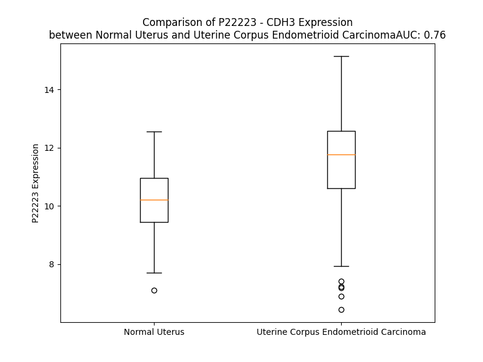

# Detailed Data for P22223

## Introduction to the Detailed Summary

### How to Interpret the Results

- **Summary & Metrics**: This section provides a quick reference to essential protein attributes, including expression changes, family classification, and biomarker applications. Regulation status (upregulated/downregulated) indicates the protein's behavior in a disease context. Some information comes from the original excel file with the proteins selected from literature, while others are derived from the analyses.
- **Expression Comparison**: A visual representation comparing protein expression between normal and disease states. It highlights significant changes in expression levels that might indicate diagnostic or therapeutic relevance. This is data coming from transcriptomics experiments and could not translate similarly to protein levels.
- **Isoform Alignment**: An interactive view of isoform alignments, revealing structural and functional differences between variants of the protein.
- **Interactors & Homologs**: Tables listing known interaction partners and homologous proteins, the more interactors and homologs, the more complex the protein is to design an antibody for.
- **Biological Assemblies**: Information about the structural arrangement of the protein in different assemblies, providing insights into its functional state but also the complexity of the protein to develop antibodies.
- **Combined Per-Residue Information**: A detailed table summarizing residue-level data. This includes predictions for epitope regions, aggregation tendencies, and modifications that might impact the protein's function. Each row corresponds to a residue in the protein, providing insights into specific sites that may be important for research or drug development.
## Summary & Metrics

- **UniProt Accession**: P22223
- **Gene Name**: CDH3
- **Protein Name**: Cadherin-3 /P-cadherin
- **Swiss Prot**: CADH3_HUMAN
- **Family**: other
- **Biomarker Application**: diagnosis,efficacy,prognosis
- **Number of Isoforms**: 2
- **Regulation**: 1
- **(transcriptomics) AUC**: 0.65
- **(transcriptomics) Fold Change**: 1.07
- **(transcriptomics) Regulation**: Upregulated
- **Discotope Epitope Count**: 232
- **Max n_uniprots (Homo)**: 4
- **Max n_uniprots (Hetero)**: N/A

## Expression Comparison

## Isoform Alignment

<pre style='font-size:14px; font-family:monospace;'>P22223-1 MGLPRGPLASLLLLQVCWLQCAASEPCRAVFREAEVTLEAGGAEQEPGQALGKVFMGCPGQEPALFSTDNDDFTVRNGETVQERRSLKERNPLKIFPSKRILRRHKRDWVVAPISVPENGKGPFPQRLNQLKSNKDRDTKIFYSITGPGADSPPEGVFAVEKETGWLLLNKPLDREEIAKYELFGHAVSENGASVEDPMNISIIVTDQNDHKPKFTQDTFRGSVLEGVLPGTSVMQVTATDEDDAIYTYNGVVAYSIHSQEPKDPHDLMFTIHRSTGTISVISSGLDREKVPEYTLTIQATDMDGDGSTTTAVAVVEILDANDNAPMFDPQKYEAHVPENAVGHEVQRLTVTDLDAPNSPAWRATYLIMGGDDGDHFTITTHPESNQGILTTRKGLDFEAKNQHTLYVEVTNEAPFVLKLPTSTATIVVHVEDVNEAPVFVPPSKVVEVQEGIPTGEPVCVYTAEDPDKENQKISYRILRDPAGWLAMDPDSGQVTAVGTLDREDEQFVRNNIYEVMVLAMDNGSPPTTGTGTLLLTLIDVNDHGPVPEPRQITICNQSPVRQVLNITDKDLSPHTSPFQAQLTDDSDIYWTAEVNEEGDTVVLSLKKFLKQDTYDVHLSLSDHGNKEQLTVIRATVCDCHGHVETCPGPWKGGFILPVLGAVLALLFLLLVLLLLVRKKRKIKEPLLLPEDDTRDNVFYYGEEGGGEEDQDYDITQLHRGLEARPEVVLRNDVAPTIIPTPMYRPRPANPDEIGNFIIENLKAANTDPTAPPYDTLLVFDYEGSGSDAASLSSLTSSASDQDQDYDYLNEWGSRFKKLADMYGGGEDD
P22223-2 MGLPRGPLASLLLLQVCWLQCAASEPCRAVFREAEVTLEAGGAEQEPGQALGKVFMGCPGQEPALFSTDNDDFTVRNGETVQERRSLKERNPLKIFPSKRILRRHKRDWVVAPISVPENGKGPFPQRLNQLKSNKDRDTKIFYSITGPGADSPPEGVFAVEKETGWLLLNKPLDREEIAKYELFGHAVSENGASVEDPMNISIIVTDQNDHKPKFTQDTFRGSVLEGVLPGTSVMQVTATDEDDAIYTYNGVVAYSIHSQEPKDPHDLMFTIHRSTGTISVISSGLDREKVPEYTLTIQATDMDGDGSTTTAVAVVEILDANDNAPMFDPQKYEAHVPENAVGHEVQRLTVTDLDAPNSPAWRATYLIMGGDDGDHFTITTHPESNQGILTTRKGLDFEAKNQHTLYVEVTNEAPFVLKLPTSTATIVVHVEDVNEAPVFVPPSKVVEVQEGIPTGEPVCVYTAEDPDKENQKISYRILRDPAGWLAMDPDSGQVTAVGTLDREDEQFVRNNIYEVMVLAMDNGSPPTTGTGTLLLTLIDVNDHGPVPEPRQITICNQSPVRQVLNITDKDLSPHTSPFQAQLTDDSDIYWTAEVNEEGDTVVLSLKKFLKQDTYDVHLSLSDHGNKEQLTVIRATVCDCHGHVETCPGPWKGGFILPVLGAVLALLFLLLVLLLLVRKKRKIKEPLLLPEDDTRDNVFYYGEEGGGEEDQDYDITQLHRGLEARPEVVLRNDVAPTIIPTPMYRPRPANPDEIGNFIIEGRGERGSQRGNGGLQLARGRTRRS---------------------------------------------
</pre>

## Interactors

| preferredName_A   | preferredName_B   |   score |
|:------------------|:------------------|--------:|
| CDH3              | CTNNB1            |   0.995 |
| CDH3              | NPHS1             |   0.985 |
| CDH3              | CTNND1            |   0.975 |
| CDH3              | CDH1              |   0.967 |
| CDH3              | NPHS2             |   0.962 |
| CDH3              | TJP1              |   0.95  |
| CDH3              | CTNNA1            |   0.93  |

## Homologs

| uniprot_id   | gene_id   |
|:-------------|:----------|
| Q96JQ0       | DCHS1     |
| A0A8V8TP37   | PCDH11Y   |
| Q9BZA7       | PCDH11X   |
| H3BUU9       | CDH11     |
| J3QKW5       | CDH8      |
| Q9ULB5       | CDH7      |
| F8WF00       | CDHR3     |
| A0A0U2ZQU7   | CDH1      |
| H3BRL7       | CDH13     |
| E7EN24       | CDH17     |
| P55285       | CDH6      |
| E7EPN0       | CDH9      |
| Q8N5B3       | CDH23     |
| D6RBG2       | PCDH1     |
| A0A0A0MRC0   | DCHS2     |
| P55283       | CDH4      |
| Q5VT82       | PCDH9     |
| D6RJG0       | CDH10     |
| P55289       | CDH12     |
| E9PLX6       | CDHR5     |
| A0A8V8TM73   | PCDH7     |
| Q8N6Y1       | PCDH20    |
| D6RER2       | CDH18     |
| F1T0L2       | CDHR1     |
| Q9BYE9       | CDHR2     |
| P22223       | CDH3      |
| Q86UP0       | CDH24     |
| J3QS15       | CDH19     |
| Q9UJ99       | CDH22     |
| Q8IXH8       | CDH26     |
| H3BR11       | CDH5      |
| P19022       | CDH2      |
| Q9HBT6       | CDH20     |
| Q96JQ0       | DCHS1     |
| P55291       | CDH15     |
| A0A8V8TP37   | PCDH11Y   |
| Q9BZA7       | PCDH11X   |
| H3BUU9       | CDH11     |
| J3QKW5       | CDH8      |
| Q9ULB5       | CDH7      |
| F8WF00       | CDHR3     |
| A0A0U2ZQU7   | CDH1      |
| H3BRL7       | CDH13     |
| E7EN24       | CDH17     |
| P55285       | CDH6      |
| E7EPN0       | CDH9      |
| Q8N5B3       | CDH23     |
| D6RBG2       | PCDH1     |
| A0A0A0MRC0   | DCHS2     |
| P55283       | CDH4      |
| Q5VT82       | PCDH9     |
| D6RJG0       | CDH10     |
| P55289       | CDH12     |
| E9PLX6       | CDHR5     |
| A0A8V8TM73   | PCDH7     |
| Q8N6Y1       | PCDH20    |
| D6RER2       | CDH18     |
| F1T0L2       | CDHR1     |
| Q9BYE9       | CDHR2     |
| Q86UP0       | CDH24     |
| J3QS15       | CDH19     |
| Q9UJ99       | CDH22     |
| Q8IXH8       | CDH26     |
| H3BR11       | CDH5      |
| P19022       | CDH2      |
| Q9HBT6       | CDH20     |

## Biological Assemblies

|   Unnamed: 0 |   assembly |   n_uniprots | composition   | crystal_id   |
|-------------:|-----------:|-------------:|:--------------|:-------------|
|            0 |          1 |            2 | Homo          | 5jyl         |
|            1 |          2 |            2 | Homo          | 5jyl         |
|            0 |          1 |            2 | Homo          | 4zmw         |
|            0 |          1 |            2 | Homo          | 7cme         |
|            0 |          1 |            2 | Homo          | 4zmv         |
|            0 |          1 |            1 | Homo          | 4zmn         |
|            0 |          1 |            1 | Homo          | 4zml         |
|            0 |          1 |            1 | Homo          | 7cmf         |
|            0 |          1 |            1 | Homo          | 6ztb         |
|            0 |          1 |            1 | Homo          | 4zmy         |
|            0 |          1 |            1 | Homo          | 4zmz         |
|            0 |          1 |            2 | Homo          | 8hyi         |
|            0 |          1 |            2 | Homo          | 4zmq         |
|            0 |          1 |            1 | Homo          | 4zmp         |
|            0 |          1 |            1 | Homo          | 4zmo         |
|            0 |          1 |            4 | Homo          | 5jym         |
|            0 |          1 |            2 | Homo          | 4zmx         |
|            0 |          1 |            1 | Homo          | 4oy9         |
|            0 |          1 |            3 | Homo          | 6ztr         |
|            1 |          2 |            3 | Homo          | 6ztr         |
|            0 |          1 |            2 | Homo          | 4zmt         |
|            1 |          2 |            2 | Homo          | 4zmt         |
|            2 |          3 |            2 | Homo          | 4zmt         |

## Combined Per-Residue Information

|   res | aa   |   epitope_score | epitope   |   relative_surface_accessibility |   modeling_confidence |   Aggregation | modification   | glycosylation                   |
|------:|:-----|----------------:|:----------|---------------------------------:|----------------------:|--------------:|:---------------|:--------------------------------|
|     1 | M    |         0.09852 | False     |                          1.36364 |                 38.27 |         0     | N/A            | N/A                             |
|     2 | G    |         0.17846 | True      |                          0.93944 |                 43.91 |         0     | N/A            | N/A                             |
|     3 | L    |         0.12208 | True      |                          1.02824 |                 39.3  |         0     | N/A            | N/A                             |
|     4 | P    |         0.1073  | True      |                          0.692   |                 53.77 |         0     | N/A            | N/A                             |
|     5 | R    |         0.115   | True      |                          0.93841 |                 41.81 |         0     | N/A            | N/A                             |
|     6 | G    |         0.13064 | True      |                          0.84747 |                 41.89 |         0     | N/A            | N/A                             |
|     7 | P    |         0.05263 | False     |                          0.96316 |                 53.02 |         0.134 | N/A            | N/A                             |
|     8 | L    |         0.08416 | False     |                          1.06423 |                 41.48 |        28     | N/A            | N/A                             |
|     9 | A    |         0.07931 | False     |                          0.76895 |                 35.71 |        33.085 | N/A            | N/A                             |
|    10 | S    |         0.11551 | True      |                          0.74094 |                 33.39 |        39.01  | N/A            | N/A                             |
|    11 | L    |         0.09412 | False     |                          0.88895 |                 33.93 |        82.956 | N/A            | N/A                             |
|    12 | L    |         0.15095 | True      |                          0.8385  |                 30.53 |        90.981 | N/A            | N/A                             |
|    13 | L    |         0.11028 | True      |                          0.82877 |                 30.91 |        92.309 | N/A            | N/A                             |
|    14 | L    |         0.07568 | False     |                          0.80168 |                 31.42 |        92.071 | N/A            | N/A                             |
|    15 | Q    |         0.11033 | True      |                          0.78339 |                 29.91 |        88.978 | N/A            | N/A                             |
|    16 | V    |         0.07021 | False     |                          0.90779 |                 33.95 |        88.761 | N/A            | N/A                             |
|    17 | C    |         0.11112 | True      |                          0.74996 |                 28.88 |        85.453 | N/A            | N/A                             |
|    18 | W    |         0.15672 | True      |                          1.03131 |                 32.87 |        84.744 | N/A            | N/A                             |
|    19 | L    |         0.10783 | True      |                          0.79511 |                 29.87 |        71.422 | N/A            | N/A                             |
|    20 | Q    |         0.08326 | False     |                          0.74155 |                 30.2  |         3.814 | N/A            | N/A                             |
|    21 | C    |         0.11164 | True      |                          0.90249 |                 29.06 |         1.143 | N/A            | N/A                             |
|    22 | A    |         0.10901 | True      |                          0.92595 |                 32.13 |         0.588 | N/A            | N/A                             |
|    23 | A    |         0.14097 | True      |                          0.94173 |                 34.37 |         0.126 | N/A            | N/A                             |
|    24 | S    |         0.11356 | True      |                          0.90393 |                 35.99 |         0     | N/A            | N/A                             |
|    25 | E    |         0.14873 | True      |                          0.78179 |                 36.69 |         0     | N/A            | N/A                             |
|    26 | P    |         0.15862 | True      |                          0.98968 |                 36.69 |         0     | N/A            | N/A                             |
|    27 | C    |         0.0974  | False     |                          0.77911 |                 28.81 |         0     | N/A            | N/A                             |
|    28 | R    |         0.15083 | True      |                          0.96413 |                 30.94 |         0     | N/A            | N/A                             |
|    29 | A    |         0.09088 | False     |                          0.78153 |                 32.03 |         0     | N/A            | N/A                             |
|    30 | V    |         0.07954 | False     |                          1.00335 |                 30.11 |         0     | N/A            | N/A                             |
|    31 | F    |         0.09823 | False     |                          0.97696 |                 29.39 |         0     | N/A            | N/A                             |
|    32 | R    |         0.12139 | True      |                          0.90955 |                 31.2  |         0     | N/A            | N/A                             |
|    33 | E    |         0.1365  | True      |                          0.90514 |                 31.91 |         0     | N/A            | N/A                             |
|    34 | A    |         0.06138 | False     |                          0.84505 |                 30.2  |         0     | N/A            | N/A                             |
|    35 | E    |         0.09868 | False     |                          0.8796  |                 28.79 |         0     | N/A            | N/A                             |
|    36 | V    |         0.1048  | True      |                          0.91245 |                 27.97 |         0     | N/A            | N/A                             |
|    37 | T    |         0.08926 | False     |                          0.87263 |                 27.93 |         0     | N/A            | N/A                             |
|    38 | L    |         0.14448 | True      |                          1.0474  |                 28.71 |         0     | N/A            | N/A                             |
|    39 | E    |         0.10629 | True      |                          0.87526 |                 26.88 |         0     | N/A            | N/A                             |
|    40 | A    |         0.12471 | True      |                          1.02254 |                 31.51 |         0     | N/A            | N/A                             |
|    41 | G    |         0.1903  | True      |                          0.9975  |                 30.81 |         0     | N/A            | N/A                             |
|    42 | G    |         0.15745 | True      |                          0.91962 |                 30.82 |         0     | N/A            | N/A                             |
|    43 | A    |         0.12261 | True      |                          1.06271 |                 32.94 |         0     | N/A            | N/A                             |
|    44 | E    |         0.13537 | True      |                          0.89176 |                 28.09 |         0     | N/A            | N/A                             |
|    45 | Q    |         0.14559 | True      |                          0.93634 |                 30.81 |         0     | N/A            | N/A                             |
|    46 | E    |         0.11837 | True      |                          0.85973 |                 34.55 |         0     | N/A            | N/A                             |
|    47 | P    |         0.16215 | True      |                          0.98903 |                 31.68 |         0     | N/A            | N/A                             |
|    48 | G    |         0.11843 | True      |                          0.91993 |                 33.51 |         0     | N/A            | N/A                             |
|    49 | Q    |         0.18058 | True      |                          0.94557 |                 31.85 |         0     | N/A            | N/A                             |
|    50 | A    |         0.15718 | True      |                          0.94793 |                 33.87 |         0     | N/A            | N/A                             |
|    51 | L    |         0.1009  | False     |                          1.13958 |                 30.69 |         0     | N/A            | N/A                             |
|    52 | G    |         0.13937 | True      |                          0.93233 |                 32.67 |         0     | N/A            | N/A                             |
|    53 | K    |         0.10602 | True      |                          1.00714 |                 29.5  |         0     | N/A            | N/A                             |
|    54 | V    |         0.1022  | True      |                          0.97741 |                 31.06 |         0     | N/A            | N/A                             |
|    55 | F    |         0.09829 | False     |                          1.00337 |                 26.04 |         0     | N/A            | N/A                             |
|    56 | M    |         0.14636 | True      |                          0.98756 |                 35.33 |         0     | N/A            | N/A                             |
|    57 | G    |         0.09804 | False     |                          0.80036 |                 30.38 |         0     | N/A            | N/A                             |
|    58 | C    |         0.13147 | True      |                          0.99513 |                 34.91 |         0     | N/A            | N/A                             |
|    59 | P    |         0.09581 | False     |                          0.99022 |                 39.99 |         0     | N/A            | N/A                             |
|    60 | G    |         0.18377 | True      |                          0.87619 |                 33.93 |         0     | N/A            | N/A                             |
|    61 | Q    |         0.1095  | True      |                          0.80916 |                 33.43 |         0     | N/A            | N/A                             |
|    62 | E    |         0.12617 | True      |                          0.78411 |                 34.21 |         0     | N/A            | N/A                             |
|    63 | P    |         0.09348 | False     |                          0.95094 |                 31.72 |         0     | N/A            | N/A                             |
|    64 | A    |         0.13059 | True      |                          1.03475 |                 33.84 |         0     | N/A            | N/A                             |
|    65 | L    |         0.18053 | True      |                          0.99173 |                 29.42 |         0     | N/A            | N/A                             |
|    66 | F    |         0.15876 | True      |                          1.02611 |                 32.09 |         0     | N/A            | N/A                             |
|    67 | S    |         0.11041 | True      |                          0.67135 |                 32.01 |         0     | N/A            | N/A                             |
|    68 | T    |         0.1596  | True      |                          0.79553 |                 31.67 |         0     | N/A            | N/A                             |
|    69 | D    |         0.17656 | True      |                          0.78372 |                 34.5  |         0     | N/A            | N/A                             |
|    70 | N    |         0.09931 | False     |                          0.8548  |                 36.34 |         0     | N/A            | N/A                             |
|    71 | D    |         0.10213 | True      |                          0.8765  |                 33.88 |         0     | N/A            | N/A                             |
|    72 | D    |         0.09592 | False     |                          0.7758  |                 32.22 |         0     | N/A            | N/A                             |
|    73 | F    |         0.10368 | True      |                          0.99251 |                 31.53 |         0     | N/A            | N/A                             |
|    74 | T    |         0.11996 | True      |                          0.86121 |                 33.15 |         0     | N/A            | N/A                             |
|    75 | V    |         0.10731 | True      |                          0.87521 |                 32.8  |         0     | N/A            | N/A                             |
|    76 | R    |         0.1247  | True      |                          0.94758 |                 32.41 |         0     | N/A            | N/A                             |
|    77 | N    |         0.12989 | True      |                          0.86901 |                 36.9  |         0     | N/A            | N/A                             |
|    78 | G    |         0.13143 | True      |                          0.95386 |                 31.46 |         0     | N/A            | N/A                             |
|    79 | E    |         0.17228 | True      |                          0.88943 |                 36.63 |         0     | N/A            | N/A                             |
|    80 | T    |         0.11592 | True      |                          0.96749 |                 33.86 |         0     | N/A            | N/A                             |
|    81 | V    |         0.08837 | False     |                          0.95131 |                 28    |         0     | N/A            | N/A                             |
|    82 | Q    |         0.14901 | True      |                          0.92715 |                 34.16 |         0     | N/A            | N/A                             |
|    83 | E    |         0.12517 | True      |                          0.74412 |                 28.74 |         0     | N/A            | N/A                             |
|    84 | R    |         0.25857 | True      |                          0.96891 |                 31.98 |         0     | N/A            | N/A                             |
|    85 | R    |         0.19604 | True      |                          0.89547 |                 35    |         0     | N/A            | N/A                             |
|    86 | S    |         0.10273 | True      |                          0.78678 |                 29.18 |         0     | N/A            | N/A                             |
|    87 | L    |         0.14316 | True      |                          1.12716 |                 34.72 |         0     | N/A            | N/A                             |
|    88 | K    |         0.15829 | True      |                          0.92433 |                 31.01 |         0     | N/A            | N/A                             |
|    89 | E    |         0.1706  | True      |                          0.74849 |                 34.06 |         0     | N/A            | N/A                             |
|    90 | R    |         0.15138 | True      |                          0.82158 |                 34.51 |         0     | N/A            | N/A                             |
|    91 | N    |         0.10517 | True      |                          0.81723 |                 35.05 |         0     | N/A            | N/A                             |
|    92 | P    |         0.04143 | False     |                          0.92632 |                 32.26 |         0     | N/A            | N/A                             |
|    93 | L    |         0.08098 | False     |                          0.96661 |                 33.73 |         0     | N/A            | N/A                             |
|    94 | K    |         0.12875 | True      |                          0.97603 |                 32.01 |         0     | N/A            | N/A                             |
|    95 | I    |         0.10948 | True      |                          0.85298 |                 33.12 |         0     | N/A            | N/A                             |
|    96 | F    |         0.15079 | True      |                          0.91026 |                 36.01 |         0     | N/A            | N/A                             |
|    97 | P    |         0.08368 | False     |                          0.96202 |                 35.34 |         0     | N/A            | N/A                             |
|    98 | S    |         0.06526 | False     |                          0.64498 |                 39.29 |         0     | N/A            | N/A                             |
|    99 | K    |         0.09203 | False     |                          1.01431 |                 38.43 |         0     | N/A            | N/A                             |
|   100 | R    |         0.12251 | True      |                          0.82211 |                 38.97 |         0     | N/A            | N/A                             |
|   101 | I    |         0.10654 | True      |                          0.93575 |                 39.62 |         0     | N/A            | N/A                             |
|   102 | L    |         0.12141 | True      |                          1.07869 |                 39.07 |         0     | N/A            | N/A                             |
|   103 | R    |         0.13721 | True      |                          0.8547  |                 37.37 |         0     | N/A            | N/A                             |
|   104 | R    |         0.11765 | True      |                          0.95748 |                 35.36 |         0     | N/A            | N/A                             |
|   105 | H    |         0.15002 | True      |                          0.90703 |                 40.09 |         0     | N/A            | N/A                             |
|   106 | K    |         0.09396 | False     |                          0.78074 |                 41.23 |         0     | N/A            | N/A                             |
|   107 | R    |         0.13055 | True      |                          0.90459 |                 45.35 |         0     | N/A            | N/A                             |
|   108 | D    |         0.12876 | True      |                          0.76693 |                 59.72 |         0     | N/A            | N/A                             |
|   109 | W    |         0.11254 | True      |                          0.97518 |                 58.02 |         0.698 | N/A            | N/A                             |
|   110 | V    |         0.13873 | True      |                          0.95707 |                 65.46 |         0.698 | N/A            | N/A                             |
|   111 | V    |         0.04811 | False     |                          0.35147 |                 73.5  |         0.698 | N/A            | N/A                             |
|   112 | A    |         0.07484 | False     |                          0.70355 |                 84.67 |         0.698 | N/A            | N/A                             |
|   113 | P    |         0.06354 | False     |                          0.56399 |                 90.71 |         0.698 | N/A            | N/A                             |
|   114 | I    |         0.03841 | False     |                          0.0864  |                 93.06 |         0     | N/A            | N/A                             |
|   115 | S    |         0.0623  | False     |                          0.58282 |                 92.88 |         0     | N/A            | N/A                             |
|   116 | V    |         0.00674 | False     |                          0.02666 |                 93.52 |         0     | N/A            | N/A                             |
|   117 | P    |         0.09297 | False     |                          0.54073 |                 93.2  |         0     | N/A            | N/A                             |
|   118 | E    |         0.0306  | False     |                          0.0201  |                 95.14 |         0     | N/A            | N/A                             |
|   119 | N    |         0.06265 | False     |                          0.42151 |                 92.53 |         0     | N/A            | N/A                             |
|   120 | G    |         0.08152 | False     |                          0.3076  |                 88.39 |         0     | N/A            | N/A                             |
|   121 | K    |         0.14426 | True      |                          1.0205  |                 86.07 |         0     | N/A            | N/A                             |
|   122 | G    |         0.197   | True      |                          0.41195 |                 82.6  |         0     | N/A            | N/A                             |
|   123 | P    |         0.21221 | True      |                          0.93259 |                 90.7  |         0     | N/A            | N/A                             |
|   124 | F    |         0.17153 | True      |                          0.33362 |                 90.14 |         0     | N/A            | N/A                             |
|   125 | P    |         0.20896 | True      |                          0.62821 |                 92.01 |         0     | N/A            | N/A                             |
|   126 | Q    |         0.04314 | False     |                          0.39388 |                 92.28 |         0     | N/A            | N/A                             |
|   127 | R    |         0.14197 | True      |                          0.56307 |                 93.47 |         0     | N/A            | N/A                             |
|   128 | L    |         0.04532 | False     |                          0.17363 |                 91.83 |         0     | N/A            | N/A                             |
|   129 | N    |         0.0839  | False     |                          0.40728 |                 91.36 |         0     | N/A            | N/A                             |
|   130 | Q    |         0.07287 | False     |                          0.43837 |                 92.37 |         0     | N/A            | N/A                             |
|   131 | L    |         0.01418 | False     |                          0.08509 |                 89.45 |         0     | N/A            | N/A                             |
|   132 | K    |         0.08917 | False     |                          0.70214 |                 90.14 |         0     | N/A            | N/A                             |
|   133 | S    |         0.03319 | False     |                          0.05856 |                 88.9  |         0     | N/A            | N/A                             |
|   134 | N    |         0.08509 | False     |                          0.74989 |                 87.07 |         0     | N/A            | N/A                             |
|   135 | K    |         0.05392 | False     |                          0.40866 |                 85.04 |         0     | N/A            | N/A                             |
|   136 | D    |         0.06228 | False     |                          0.34091 |                 83.86 |         0     | N/A            | N/A                             |
|   137 | R    |         0.18617 | True      |                          0.86877 |                 81.93 |         0     | N/A            | N/A                             |
|   138 | D    |         0.19311 | True      |                          0.75024 |                 82.01 |         0     | N/A            | N/A                             |
|   139 | T    |         0.10424 | True      |                          0.46247 |                 84.89 |         0     | N/A            | N/A                             |
|   140 | K    |         0.05578 | False     |                          0.511   |                 88.76 |         0     | N/A            | N/A                             |
|   141 | I    |         0.02598 | False     |                          0.04963 |                 89.89 |        17.676 | N/A            | N/A                             |
|   142 | F    |         0.05279 | False     |                          0.22379 |                 93.27 |        18.289 | N/A            | N/A                             |
|   143 | Y    |         0.03496 | False     |                          0.0719  |                 94.12 |        18.289 | N/A            | N/A                             |
|   144 | S    |         0.05764 | False     |                          0.38137 |                 94.29 |        18.289 | N/A            | N/A                             |
|   145 | I    |         0.03648 | False     |                          0.10912 |                 94.98 |        18.289 | N/A            | N/A                             |
|   146 | T    |         0.06364 | False     |                          0.32015 |                 95.44 |         7.201 | N/A            | N/A                             |
|   147 | G    |         0.02915 | False     |                          0.13936 |                 93.87 |         0     | N/A            | N/A                             |
|   148 | P    |         0.10506 | True      |                          0.48312 |                 93.34 |         0     | N/A            | N/A                             |
|   149 | G    |         0.00195 | False     |                          0       |                 92.88 |         0     | N/A            | N/A                             |
|   150 | A    |         0.04377 | False     |                          0.13926 |                 93.79 |         0     | N/A            | N/A                             |
|   151 | D    |         0.1198  | True      |                          0.52685 |                 93.18 |         0     | N/A            | N/A                             |
|   152 | S    |         0.05717 | False     |                          0.30927 |                 92.7  |         0     | N/A            | N/A                             |
|   153 | P    |         0.26412 | True      |                          0.76222 |                 92.32 |         0     | N/A            | N/A                             |
|   154 | P    |         0.17921 | True      |                          0.26414 |                 92.32 |         0     | N/A            | N/A                             |
|   155 | E    |         0.18951 | True      |                          0.64053 |                 92.51 |         0     | N/A            | N/A                             |
|   156 | G    |         0.10259 | True      |                          0.45856 |                 91.7  |         7.363 | N/A            | N/A                             |
|   157 | V    |         0.01087 | False     |                          0.00531 |                 95.5  |         7.363 | N/A            | N/A                             |
|   158 | F    |         0.01184 | False     |                          0.02131 |                 95.73 |         7.363 | N/A            | N/A                             |
|   159 | A    |         0.0566  | False     |                          0.3214  |                 95.17 |         7.363 | N/A            | N/A                             |
|   160 | V    |         0.02205 | False     |                          0.18046 |                 95.05 |         7.363 | N/A            | N/A                             |
|   161 | E    |         0.06052 | False     |                          0.236   |                 95.37 |         0     | N/A            | N/A                             |
|   162 | K    |         0.10934 | True      |                          0.59571 |                 92.98 |         0     | N/A            | N/A                             |
|   163 | E    |         0.1006  | False     |                          0.55179 |                 91.27 |         0     | N/A            | N/A                             |
|   164 | T    |         0.06213 | False     |                          0.42256 |                 91.97 |         2.891 | N/A            | N/A                             |
|   165 | G    |         0.00207 | False     |                          0       |                 91.24 |        12.093 | N/A            | N/A                             |
|   166 | W    |         0.07856 | False     |                          0.32311 |                 94.94 |        12.606 | N/A            | N/A                             |
|   167 | L    |         0.00247 | False     |                          0       |                 94.52 |        12.606 | N/A            | N/A                             |
|   168 | L    |         0.05446 | False     |                          0.15086 |                 94.47 |        12.606 | N/A            | N/A                             |
|   169 | L    |         0.02682 | False     |                          0.02391 |                 95.3  |        11.64  | N/A            | N/A                             |
|   170 | N    |         0.12887 | True      |                          0.34281 |                 94.42 |         0.857 | N/A            | N/A                             |
|   171 | K    |         0.13518 | True      |                          0.3871  |                 92.02 |         0     | N/A            | N/A                             |
|   172 | P    |         0.09319 | False     |                          0.48668 |                 94    |         0     | N/A            | N/A                             |
|   173 | L    |         0.01651 | False     |                          0.03509 |                 95.17 |         0     | N/A            | N/A                             |
|   174 | D    |         0.07118 | False     |                          0.38637 |                 95.67 |         0     | N/A            | N/A                             |
|   175 | R    |         0.07804 | False     |                          0.17559 |                 95.43 |         0     | N/A            | N/A                             |
|   176 | E    |         0.05789 | False     |                          0.30133 |                 94.69 |         0     | N/A            | N/A                             |
|   177 | E    |         0.14374 | True      |                          0.57514 |                 93.19 |         0     | N/A            | N/A                             |
|   178 | I    |         0.11178 | True      |                          0.27439 |                 94.53 |         0     | N/A            | N/A                             |
|   179 | A    |         0.04119 | False     |                          0.46047 |                 94.19 |         0     | N/A            | N/A                             |
|   180 | K    |         0.05045 | False     |                          0.5105  |                 95.21 |         0     | N/A            | N/A                             |
|   181 | Y    |         0.00938 | False     |                          0.02126 |                 95.46 |         0     | N/A            | N/A                             |
|   182 | E    |         0.06015 | False     |                          0.39721 |                 94.62 |         0     | N/A            | N/A                             |
|   183 | L    |         0.00298 | False     |                          0       |                 94.54 |         0     | N/A            | N/A                             |
|   184 | F    |         0.07159 | False     |                          0.4252  |                 93.93 |         0     | N/A            | N/A                             |
|   185 | G    |         0.01771 | False     |                          0.06432 |                 92.99 |         0     | N/A            | N/A                             |
|   186 | H    |         0.04977 | False     |                          0.23469 |                 93.54 |         0     | N/A            | N/A                             |
|   187 | A    |         0.0182  | False     |                          0.07144 |                 92.63 |         0     | N/A            | N/A                             |
|   188 | V    |         0.09932 | False     |                          0.30466 |                 92.76 |         0     | N/A            | N/A                             |
|   189 | S    |         0.04352 | False     |                          0.07698 |                 90.24 |         0     | N/A            | N/A                             |
|   190 | E    |         0.21654 | True      |                          0.67142 |                 86.5  |         0     | N/A            | N/A                             |
|   191 | N    |         0.14455 | True      |                          0.79971 |                 83.01 |         0     | N/A            | N/A                             |
|   192 | G    |         0.10569 | True      |                          0.68015 |                 82.9  |         0     | N/A            | N/A                             |
|   193 | A    |         0.06512 | False     |                          0.46754 |                 87.01 |         0     | N/A            | N/A                             |
|   194 | S    |         0.11593 | True      |                          0.61529 |                 90.09 |         0     | N/A            | N/A                             |
|   195 | V    |         0.05362 | False     |                          0.169   |                 87.81 |         0     | N/A            | N/A                             |
|   196 | E    |         0.09753 | False     |                          0.28739 |                 88.24 |         0     | N/A            | N/A                             |
|   197 | D    |         0.06886 | False     |                          0.78702 |                 89.12 |         0     | N/A            | N/A                             |
|   198 | P    |         0.1122  | True      |                          0.56351 |                 90.73 |         0     | N/A            | N/A                             |
|   199 | M    |         0.03937 | False     |                          0.354   |                 90.06 |         0.72  | N/A            | N/A                             |
|   200 | N    |         0.06758 | False     |                          0.43062 |                 92.57 |         2.447 | N/A            | N-linked (GlcNAc...) asparagine |
|   201 | I    |         0.00531 | False     |                          0.0056  |                 92.63 |        41.044 | N/A            | N/A                             |
|   202 | S    |         0.0313  | False     |                          0.1695  |                 94.46 |        42.361 | N/A            | N/A                             |
|   203 | I    |         0.00295 | False     |                          0       |                 94.55 |        42.361 | N/A            | N/A                             |
|   204 | I    |         0.04678 | False     |                          0.39838 |                 94.71 |        42.361 | N/A            | N/A                             |
|   205 | V    |         0.01249 | False     |                          0.04082 |                 95.16 |        42.045 | N/A            | N/A                             |
|   206 | T    |         0.069   | False     |                          0.3628  |                 95.08 |        16.506 | N/A            | N/A                             |
|   207 | D    |         0.0524  | False     |                          0.06709 |                 95.68 |         0     | N/A            | N/A                             |
|   208 | Q    |         0.11522 | True      |                          0.41789 |                 94.44 |         0     | N/A            | N/A                             |
|   209 | N    |         0.12176 | True      |                          0.33111 |                 94.79 |         0     | N/A            | N/A                             |
|   210 | D    |         0.14539 | True      |                          0.48589 |                 94.46 |         0     | N/A            | N/A                             |
|   211 | H    |         0.0927  | False     |                          0.34285 |                 94.64 |         0     | N/A            | N/A                             |
|   212 | K    |         0.07399 | False     |                          0.61272 |                 95.06 |         0     | N/A            | N/A                             |
|   213 | P    |         0.00347 | False     |                          0.00294 |                 96.84 |         0     | N/A            | N/A                             |
|   214 | K    |         0.0931  | False     |                          0.73637 |                 96.82 |         0     | N/A            | N/A                             |
|   215 | F    |         0.03066 | False     |                          0.0975  |                 97.45 |         0     | N/A            | N/A                             |
|   216 | T    |         0.1142  | True      |                          0.5489  |                 96.8  |         0     | N/A            | N/A                             |
|   217 | Q    |         0.09115 | False     |                          0.50069 |                 96.1  |         0     | N/A            | N/A                             |
|   218 | D    |         0.13896 | True      |                          0.81608 |                 93.48 |         0     | N/A            | N/A                             |
|   219 | T    |         0.1159  | True      |                          0.43221 |                 97.1  |         0     | N/A            | N/A                             |
|   220 | F    |         0.03131 | False     |                          0.05773 |                 97.95 |         0     | N/A            | N/A                             |
|   221 | R    |         0.17045 | True      |                          0.71444 |                 97.85 |         0     | N/A            | N/A                             |
|   222 | G    |         0.06223 | False     |                          0.2173  |                 97.27 |         0     | N/A            | N/A                             |
|   223 | S    |         0.06417 | False     |                          0.38187 |                 97.57 |         0     | N/A            | N/A                             |
|   224 | V    |         0.03094 | False     |                          0.06664 |                 96.96 |         0     | N/A            | N/A                             |
|   225 | L    |         0.07902 | False     |                          0.5474  |                 94.99 |         0     | N/A            | N/A                             |
|   226 | E    |         0.03188 | False     |                          0.03883 |                 95.05 |         0     | N/A            | N/A                             |
|   227 | G    |         0.16449 | True      |                          0.7252  |                 89.85 |         0     | N/A            | N/A                             |
|   228 | V    |         0.0471  | False     |                          0.25352 |                 92.66 |         0     | N/A            | N/A                             |
|   229 | L    |         0.11807 | True      |                          0.87731 |                 93.29 |         0     | N/A            | N/A                             |
|   230 | P    |         0.19764 | True      |                          0.51322 |                 94.92 |         0     | N/A            | N/A                             |
|   231 | G    |         0.07048 | False     |                          0.72798 |                 94.98 |         0     | N/A            | N/A                             |
|   232 | T    |         0.04809 | False     |                          0.33392 |                 96.63 |         0     | N/A            | N/A                             |
|   233 | S    |         0.09758 | False     |                          0.5584  |                 97.05 |         0     | N/A            | N/A                             |
|   234 | V    |         0.03566 | False     |                          0.14033 |                 97.35 |         0.227 | N/A            | N/A                             |
|   235 | M    |         0.01624 | False     |                          0.11784 |                 97.15 |         0.227 | N/A            | N/A                             |
|   236 | Q    |         0.09457 | False     |                          0.54281 |                 97.35 |         0.227 | N/A            | N/A                             |
|   237 | V    |         0.0018  | False     |                          0       |                 97.54 |         0.227 | N/A            | N/A                             |
|   238 | T    |         0.04536 | False     |                          0.39799 |                 97.32 |         0.227 | N/A            | N/A                             |
|   239 | A    |         0.0182  | False     |                          0.10559 |                 96.94 |         0     | N/A            | N/A                             |
|   240 | T    |         0.06648 | False     |                          0.58099 |                 95.99 |         0     | N/A            | N/A                             |
|   241 | D    |         0.0331  | False     |                          0.14512 |                 96.73 |         0     | N/A            | N/A                             |
|   242 | E    |         0.09308 | False     |                          0.62718 |                 95.94 |         0     | N/A            | N/A                             |
|   243 | D    |         0.02081 | False     |                          0.04483 |                 96.75 |         0     | N/A            | N/A                             |
|   244 | D    |         0.03921 | False     |                          0.11862 |                 94.03 |         0     | N/A            | N/A                             |
|   245 | A    |         0.0897  | False     |                          0.52894 |                 92.84 |         1.573 | N/A            | N/A                             |
|   246 | I    |         0.18855 | True      |                          0.86818 |                 91.65 |         5.775 | N/A            | N/A                             |
|   247 | Y    |         0.20849 | True      |                          0.8711  |                 90.4  |         6.78  | N/A            | N/A                             |
|   248 | T    |         0.116   | True      |                          0.33599 |                 92.57 |         7.01  | N/A            | N/A                             |
|   249 | Y    |         0.23216 | True      |                          0.66442 |                 94.06 |         7.396 | N/A            | N/A                             |
|   250 | N    |         0.04526 | False     |                          0.10514 |                 94.98 |         7.028 | N/A            | N/A                             |
|   251 | G    |         0.01436 | False     |                          0.10987 |                 93.47 |        10.085 | N/A            | N/A                             |
|   252 | V    |         0.03332 | False     |                          0.29895 |                 95.67 |        31.032 | N/A            | N/A                             |
|   253 | V    |         0.02531 | False     |                          0.14268 |                 96.49 |        32.633 | N/A            | N/A                             |
|   254 | A    |         0.02491 | False     |                          0.06296 |                 97.18 |        31.932 | N/A            | N/A                             |
|   255 | Y    |         0.0338  | False     |                          0.08284 |                 98.18 |        31.339 | N/A            | N/A                             |
|   256 | S    |         0.03511 | False     |                          0.37808 |                 97.7  |        27.799 | N/A            | N/A                             |
|   257 | I    |         0.05074 | False     |                          0.23966 |                 97.32 |        25.759 | N/A            | N/A                             |
|   258 | H    |         0.15399 | True      |                          0.68523 |                 95.56 |         0.518 | N/A            | N/A                             |
|   259 | S    |         0.04675 | False     |                          0.33635 |                 96.84 |         0     | N/A            | N/A                             |
|   260 | Q    |         0.04369 | False     |                          0.05259 |                 97.35 |         0     | N/A            | N/A                             |
|   261 | E    |         0.11704 | True      |                          0.60161 |                 96.68 |         0     | N/A            | N/A                             |
|   262 | P    |         0.13955 | True      |                          0.36214 |                 96.68 |         0     | N/A            | N/A                             |
|   263 | K    |         0.15346 | True      |                          0.64582 |                 93    |         0     | N/A            | N/A                             |
|   264 | D    |         0.19554 | True      |                          0.59599 |                 91.3  |         0     | N/A            | N/A                             |
|   265 | P    |         0.23019 | True      |                          0.49103 |                 93.48 |         0     | N/A            | N/A                             |
|   266 | H    |         0.17328 | True      |                          0.51368 |                 91.46 |         0     | N/A            | N/A                             |
|   267 | D    |         0.19154 | True      |                          0.52593 |                 91.53 |         0     | N/A            | N/A                             |
|   268 | L    |         0.17741 | True      |                          0.71755 |                 93.28 |        42.789 | N/A            | N/A                             |
|   269 | M    |         0.00636 | False     |                          0       |                 96.65 |        42.789 | N/A            | N/A                             |
|   270 | F    |         0.00739 | False     |                          0.01793 |                 97.8  |        42.789 | N/A            | N/A                             |
|   271 | T    |         0.09172 | False     |                          0.39038 |                 97.37 |        42.789 | N/A            | N/A                             |
|   272 | I    |         0.08038 | False     |                          0.11643 |                 98.06 |        42.789 | N/A            | N/A                             |
|   273 | H    |         0.12592 | True      |                          0.55566 |                 97.5  |         0.314 | N/A            | N/A                             |
|   274 | R    |         0.14061 | True      |                          0.48745 |                 97.02 |         0     | N/A            | N/A                             |
|   275 | S    |         0.10693 | True      |                          0.60877 |                 95.2  |         0     | N/A            | N/A                             |
|   276 | T    |         0.07873 | False     |                          0.41768 |                 96.13 |         0     | N/A            | N/A                             |
|   277 | G    |         0.00211 | False     |                          0       |                 96.77 |         0.526 | N/A            | N/A                             |
|   278 | T    |         0.05732 | False     |                          0.25938 |                 98.19 |         7.211 | N/A            | N/A                             |
|   279 | I    |         0.00402 | False     |                          0       |                 98.24 |         8.782 | N/A            | N/A                             |
|   280 | S    |         0.07085 | False     |                          0.15773 |                 97.91 |         8.782 | N/A            | N/A                             |
|   281 | V    |         0.02514 | False     |                          0.01176 |                 97.53 |         8.932 | N/A            | N/A                             |
|   282 | I    |         0.1589  | True      |                          0.54492 |                 96.47 |         8.932 | N/A            | N/A                             |
|   283 | S    |         0.03757 | False     |                          0.21146 |                 94.05 |         2.565 | N/A            | N/A                             |
|   284 | S    |         0.1369  | True      |                          0.54801 |                 92.63 |         0.623 | N/A            | N/A                             |
|   285 | G    |         0.07306 | False     |                          0.44958 |                 92.17 |         0.472 | N/A            | N/A                             |
|   286 | L    |         0.03715 | False     |                          0.05803 |                 95.14 |         0.472 | N/A            | N/A                             |
|   287 | D    |         0.07435 | False     |                          0.19864 |                 95.29 |         0     | N/A            | N/A                             |
|   288 | R    |         0.05231 | False     |                          0.19519 |                 96.16 |         0     | N/A            | N/A                             |
|   289 | E    |         0.1142  | True      |                          0.28211 |                 95.13 |         0     | N/A            | N/A                             |
|   290 | K    |         0.19339 | True      |                          0.76365 |                 94.83 |         0     | N/A            | N/A                             |
|   291 | V    |         0.0808  | False     |                          0.09997 |                 95.58 |         0     | N/A            | N/A                             |
|   292 | P    |         0.05486 | False     |                          0.54186 |                 96.18 |         0     | N/A            | N/A                             |
|   293 | E    |         0.08991 | False     |                          0.4221  |                 97.38 |         0     | N/A            | N/A                             |
|   294 | Y    |         0.00364 | False     |                          0.00139 |                 97.74 |         1.617 | N/A            | N/A                             |
|   295 | T    |         0.07526 | False     |                          0.36166 |                 97.94 |         1.617 | N/A            | N/A                             |
|   296 | L    |         0.00218 | False     |                          0.00165 |                 97.93 |         1.617 | N/A            | N/A                             |
|   297 | T    |         0.05665 | False     |                          0.26982 |                 97.63 |         1.617 | N/A            | N/A                             |
|   298 | I    |         0.00193 | False     |                          0.0008  |                 97.65 |         1.617 | N/A            | N/A                             |
|   299 | Q    |         0.05543 | False     |                          0.18667 |                 97.36 |         0     | N/A            | N/A                             |
|   300 | A    |         0.00181 | False     |                          0       |                 97.9  |         0     | N/A            | N/A                             |
|   301 | T    |         0.05645 | False     |                          0.06295 |                 97.39 |         0     | N/A            | N/A                             |
|   302 | D    |         0.01004 | False     |                          0.00306 |                 96.12 |         0     | N/A            | N/A                             |
|   303 | M    |         0.08489 | False     |                          0.4482  |                 94.98 |         0     | N/A            | N/A                             |
|   304 | D    |         0.08235 | False     |                          0.295   |                 93.41 |         0     | N/A            | N/A                             |
|   305 | G    |         0.07801 | False     |                          0.40904 |                 93.44 |         0     | N/A            | N/A                             |
|   306 | D    |         0.21101 | True      |                          0.8484  |                 94.71 |         0     | N/A            | N/A                             |
|   307 | G    |         0.14632 | True      |                          0.35398 |                 94.44 |         0     | N/A            | N/A                             |
|   308 | S    |         0.07443 | False     |                          0.34767 |                 95.27 |         0.154 | N/A            | N/A                             |
|   309 | T    |         0.14299 | True      |                          0.44363 |                 96.15 |         3.935 | N/A            | N/A                             |
|   310 | T    |         0.05801 | False     |                          0.17709 |                 97.24 |        10.351 | N/A            | N/A                             |
|   311 | T    |         0.16938 | True      |                          0.55463 |                 97.36 |        20.974 | N/A            | N/A                             |
|   312 | A    |         0.02843 | False     |                          0.07632 |                 97.62 |        37.534 | N/A            | N/A                             |
|   313 | V    |         0.05791 | False     |                          0.37797 |                 98    |        37.534 | N/A            | N/A                             |
|   314 | A    |         0.00125 | False     |                          0       |                 98.19 |        37.454 | N/A            | N/A                             |
|   315 | V    |         0.0782  | False     |                          0.08084 |                 98.18 |        37.339 | N/A            | N/A                             |
|   316 | V    |         0.00238 | False     |                          0       |                 97.94 |        35.723 | N/A            | N/A                             |
|   317 | E    |         0.04476 | False     |                          0.48264 |                 97.71 |         0     | N/A            | N/A                             |
|   318 | I    |         0.0125  | False     |                          0.03311 |                 97.09 |         0     | N/A            | N/A                             |
|   319 | L    |         0.0497  | False     |                          0.42866 |                 96.47 |         0     | N/A            | N/A                             |
|   320 | D    |         0.04891 | False     |                          0.23128 |                 96.07 |         0     | N/A            | N/A                             |
|   321 | A    |         0.04682 | False     |                          0.15871 |                 93.85 |         0     | N/A            | N/A                             |
|   322 | N    |         0.01445 | False     |                          0.03252 |                 95.15 |         0     | N/A            | N/A                             |
|   323 | D    |         0.07629 | False     |                          0.2926  |                 93.94 |         0     | N/A            | N/A                             |
|   324 | N    |         0.04991 | False     |                          0.21683 |                 94.11 |         0     | N/A            | N/A                             |
|   325 | A    |         0.03066 | False     |                          0.23553 |                 94.34 |         0     | N/A            | N/A                             |
|   326 | P    |         0.00348 | False     |                          0.00346 |                 96.15 |         0     | N/A            | N/A                             |
|   327 | M    |         0.04759 | False     |                          0.57845 |                 95.58 |         0     | N/A            | N/A                             |
|   328 | F    |         0.01224 | False     |                          0.01877 |                 96.37 |         0     | N/A            | N/A                             |
|   329 | D    |         0.1103  | True      |                          0.57027 |                 91.9  |         0     | N/A            | N/A                             |
|   330 | P    |         0.11758 | True      |                          0.50499 |                 95.63 |         0     | N/A            | N/A                             |
|   331 | Q    |         0.09225 | False     |                          0.5247  |                 94.71 |         0     | N/A            | N/A                             |
|   332 | K    |         0.14081 | True      |                          0.78086 |                 97.29 |         0     | N/A            | N/A                             |
|   333 | Y    |         0.03108 | False     |                          0.08421 |                 97.49 |         0     | N/A            | N/A                             |
|   334 | E    |         0.11004 | True      |                          0.64833 |                 97.25 |         0     | N/A            | N/A                             |
|   335 | A    |         0.01296 | False     |                          0.05612 |                 96.63 |         0     | N/A            | N/A                             |
|   336 | H    |         0.07707 | False     |                          0.56927 |                 96.7  |         0     | N/A            | N/A                             |
|   337 | V    |         0.00298 | False     |                          0.00095 |                 96    |         0     | N/A            | N/A                             |
|   338 | P    |         0.05912 | False     |                          0.32653 |                 94.5  |         0     | N/A            | N/A                             |
|   339 | E    |         0.0459  | False     |                          0.05134 |                 94.11 |         0     | N/A            | N/A                             |
|   340 | N    |         0.10111 | True      |                          0.5554  |                 92.71 |         0     | N/A            | N/A                             |
|   341 | A    |         0.04014 | False     |                          0.22454 |                 91.83 |         0     | N/A            | N/A                             |
|   342 | V    |         0.10408 | True      |                          0.73876 |                 93.67 |         0     | N/A            | N/A                             |
|   343 | G    |         0.07137 | False     |                          0.66614 |                 93.26 |         0     | N/A            | N/A                             |
|   344 | H    |         0.05478 | False     |                          0.39305 |                 94.17 |         0     | N/A            | N/A                             |
|   345 | E    |         0.05007 | False     |                          0.40921 |                 96.43 |         0     | N/A            | N/A                             |
|   346 | V    |         0.01582 | False     |                          0.07962 |                 96.22 |         0     | N/A            | N/A                             |
|   347 | Q    |         0.05593 | False     |                          0.25301 |                 96.15 |         0     | N/A            | N/A                             |
|   348 | R    |         0.15461 | True      |                          0.36889 |                 96.76 |         0     | N/A            | N/A                             |
|   349 | L    |         0.00115 | False     |                          0       |                 97.06 |         0     | N/A            | N/A                             |
|   350 | T    |         0.0444  | False     |                          0.3599  |                 96.18 |         0     | N/A            | N/A                             |
|   351 | V    |         0.044   | False     |                          0.18046 |                 95.69 |         0     | N/A            | N/A                             |
|   352 | T    |         0.09108 | False     |                          0.55879 |                 94.45 |         0     | N/A            | N/A                             |
|   353 | D    |         0.04007 | False     |                          0.11149 |                 95.18 |         0     | N/A            | N/A                             |
|   354 | L    |         0.13992 | True      |                          0.71045 |                 94.8  |         0     | N/A            | N/A                             |
|   355 | D    |         0.01145 | False     |                          0.0049  |                 96.01 |         0     | N/A            | N/A                             |
|   356 | A    |         0.03896 | False     |                          0.23595 |                 94.41 |         0     | N/A            | N/A                             |
|   357 | P    |         0.14908 | True      |                          0.69327 |                 93.51 |         0     | N/A            | N/A                             |
|   358 | N    |         0.12295 | True      |                          0.56664 |                 91.9  |         0     | N/A            | N/A                             |
|   359 | S    |         0.07273 | False     |                          0.18587 |                 94.27 |         0     | N/A            | N/A                             |
|   360 | P    |         0.1256  | True      |                          0.44932 |                 95.29 |         0     | N/A            | N/A                             |
|   361 | A    |         0.01243 | False     |                          0.06743 |                 94.58 |         0     | N/A            | N/A                             |
|   362 | W    |         0.02507 | False     |                          0.18089 |                 95.33 |         0     | N/A            | N/A                             |
|   363 | R    |         0.05937 | False     |                          0.40477 |                 95.72 |         0     | N/A            | N/A                             |
|   364 | A    |         0.00966 | False     |                          0.03017 |                 96.23 |         5.881 | N/A            | N/A                             |
|   365 | T    |         0.06131 | False     |                          0.39658 |                 96.14 |        10.436 | N/A            | N/A                             |
|   366 | Y    |         0.03663 | False     |                          0.10567 |                 96.87 |        10.847 | N/A            | N/A                             |
|   367 | L    |         0.04384 | False     |                          0.63475 |                 96.15 |        10.847 | N/A            | N/A                             |
|   368 | I    |         0.04913 | False     |                          0.23576 |                 96.61 |        10.847 | N/A            | N/A                             |
|   369 | M    |         0.16397 | True      |                          0.60312 |                 93.78 |         8.812 | N/A            | N/A                             |
|   370 | G    |         0.08615 | False     |                          0.33638 |                 94.03 |         3.777 | N/A            | N/A                             |
|   371 | G    |         0.02557 | False     |                          0.25669 |                 91.82 |         0     | N/A            | N/A                             |
|   372 | D    |         0.07672 | False     |                          0.14691 |                 93.01 |         0     | N/A            | N/A                             |
|   373 | D    |         0.12356 | True      |                          0.84561 |                 87.28 |         0     | N/A            | N/A                             |
|   374 | G    |         0.07805 | False     |                          0.31929 |                 89.01 |         0     | N/A            | N/A                             |
|   375 | D    |         0.09978 | False     |                          0.49085 |                 93.08 |         0     | N/A            | N/A                             |
|   376 | H    |         0.0986  | False     |                          0.27052 |                 94.53 |         0     | N/A            | N/A                             |
|   377 | F    |         0.02028 | False     |                          0.04261 |                 97.01 |         0.778 | N/A            | N/A                             |
|   378 | T    |         0.04404 | False     |                          0.3606  |                 96.7  |         0.778 | N/A            | N/A                             |
|   379 | I    |         0.08145 | False     |                          0.14325 |                 97.13 |         0.778 | N/A            | N/A                             |
|   380 | T    |         0.05111 | False     |                          0.54702 |                 96.2  |         0.778 | N/A            | N/A                             |
|   381 | T    |         0.06347 | False     |                          0.35073 |                 96.5  |         0.778 | N/A            | N/A                             |
|   382 | H    |         0.09166 | False     |                          0.28737 |                 94.17 |         0     | N/A            | N/A                             |
|   383 | P    |         0.11154 | True      |                          0.82474 |                 89.86 |         0     | N/A            | N/A                             |
|   384 | E    |         0.08127 | False     |                          0.72492 |                 87.38 |         0     | N/A            | N/A                             |
|   385 | S    |         0.05996 | False     |                          0.42346 |                 91.96 |         0     | N/A            | N/A                             |
|   386 | N    |         0.01533 | False     |                          0.03248 |                 93.57 |         0     | N/A            | N/A                             |
|   387 | Q    |         0.08412 | False     |                          0.20922 |                 96.2  |         0     | N/A            | N/A                             |
|   388 | G    |         0.0015  | False     |                          0       |                 96.61 |         0     | N/A            | N/A                             |
|   389 | I    |         0.04497 | False     |                          0.13078 |                 97.15 |         0     | N/A            | N/A                             |
|   390 | L    |         0.00202 | False     |                          0       |                 97.54 |         0     | N/A            | N/A                             |
|   391 | T    |         0.07708 | False     |                          0.2014  |                 97.23 |         0     | N/A            | N/A                             |
|   392 | T    |         0.01972 | False     |                          0.019   |                 96.49 |         0     | N/A            | N/A                             |
|   393 | R    |         0.08668 | False     |                          0.56267 |                 94.52 |         0     | N/A            | N/A                             |
|   394 | K    |         0.05773 | False     |                          0.45158 |                 93.52 |         0     | N/A            | N/A                             |
|   395 | G    |         0.06308 | False     |                          0.33354 |                 90.74 |         0     | N/A            | N/A                             |
|   396 | L    |         0.01088 | False     |                          0.02055 |                 93.82 |         0     | N/A            | N/A                             |
|   397 | D    |         0.0406  | False     |                          0.46767 |                 93.59 |         0     | N/A            | N/A                             |
|   398 | F    |         0.05193 | False     |                          0.17125 |                 93.73 |         0     | N/A            | N/A                             |
|   399 | E    |         0.11515 | True      |                          0.36263 |                 92.18 |         0     | N/A            | N/A                             |
|   400 | A    |         0.0939  | False     |                          0.75557 |                 91.97 |         0     | N/A            | N/A                             |
|   401 | K    |         0.1074  | True      |                          0.39623 |                 92.24 |         0     | N/A            | N/A                             |
|   402 | N    |         0.08044 | False     |                          0.47107 |                 92.8  |         0     | N/A            | N/A                             |
|   403 | Q    |         0.07503 | False     |                          0.38716 |                 95.3  |         0     | N/A            | N/A                             |
|   404 | H    |         0.02437 | False     |                          0.04207 |                 95.08 |         0     | N/A            | N/A                             |
|   405 | T    |         0.03898 | False     |                          0.32509 |                 96.9  |         0     | N/A            | N/A                             |
|   406 | L    |         0.00131 | False     |                          0       |                 97.06 |         0     | N/A            | N/A                             |
|   407 | Y    |         0.06173 | False     |                          0.49787 |                 96.89 |         0     | N/A            | N/A                             |
|   408 | V    |         0.00218 | False     |                          0       |                 97.37 |         0     | N/A            | N/A                             |
|   409 | E    |         0.06323 | False     |                          0.15629 |                 96.23 |         0     | N/A            | N/A                             |
|   410 | V    |         0.01008 | False     |                          0.00542 |                 96.4  |         0     | N/A            | N/A                             |
|   411 | T    |         0.06048 | False     |                          0.31707 |                 95.57 |         0     | N/A            | N/A                             |
|   412 | N    |         0.03155 | False     |                          0.07901 |                 95.15 |         0     | N/A            | N/A                             |
|   413 | E    |         0.1     | False     |                          0.51156 |                 94.27 |         0     | N/A            | N/A                             |
|   414 | A    |         0.04669 | False     |                          0.25731 |                 93.02 |         0     | N/A            | N/A                             |
|   415 | P    |         0.18644 | True      |                          0.87109 |                 92.68 |         0     | N/A            | N/A                             |
|   416 | F    |         0.04666 | False     |                          0.26882 |                 91.82 |         0     | N/A            | N/A                             |
|   417 | V    |         0.09651 | False     |                          0.66083 |                 87.63 |         0     | N/A            | N/A                             |
|   418 | L    |         0.22118 | True      |                          0.62683 |                 84.43 |         0     | N/A            | N/A                             |
|   419 | K    |         0.24856 | True      |                          1.04762 |                 85.56 |         0     | N/A            | N/A                             |
|   420 | L    |         0.08472 | False     |                          0.30137 |                 86.88 |         0     | N/A            | N/A                             |
|   421 | P    |         0.12931 | True      |                          0.83784 |                 88.59 |         0     | N/A            | N/A                             |
|   422 | T    |         0.10259 | True      |                          0.40339 |                 89.74 |         1.208 | N/A            | N/A                             |
|   423 | S    |         0.03151 | False     |                          0.11463 |                 94    |         3.239 | N/A            | N/A                             |
|   424 | T    |         0.05919 | False     |                          0.53304 |                 95.84 |        19.784 | N/A            | N/A                             |
|   425 | A    |         0.00473 | False     |                          0.00524 |                 97.09 |        45.44  | N/A            | N/A                             |
|   426 | T    |         0.03536 | False     |                          0.255   |                 97.53 |        45.87  | N/A            | N/A                             |
|   427 | I    |         0.00379 | False     |                          0       |                 97.48 |        46.457 | N/A            | N/A                             |
|   428 | V    |         0.05153 | False     |                          0.2542  |                 97.53 |        46.457 | N/A            | N/A                             |
|   429 | V    |         0.00319 | False     |                          0       |                 96.78 |        44.92  | N/A            | N/A                             |
|   430 | H    |         0.03033 | False     |                          0.26608 |                 96.75 |         1.487 | N/A            | N/A                             |
|   431 | V    |         0.00866 | False     |                          0.05208 |                 95.42 |         1.405 | N/A            | N/A                             |
|   432 | E    |         0.08105 | False     |                          0.40715 |                 93.94 |         0     | N/A            | N/A                             |
|   433 | D    |         0.15895 | True      |                          0.39678 |                 92.53 |         0     | N/A            | N/A                             |
|   434 | V    |         0.05868 | False     |                          0.47644 |                 91.88 |         0     | N/A            | N/A                             |
|   435 | N    |         0.06885 | False     |                          0.14452 |                 92.83 |         0     | N/A            | N/A                             |
|   436 | E    |         0.05757 | False     |                          0.30264 |                 92.24 |         0     | N/A            | N/A                             |
|   437 | A    |         0.03681 | False     |                          0.38808 |                 92.89 |         0     | N/A            | N/A                             |
|   438 | P    |         0.00166 | False     |                          0       |                 95.16 |         0     | N/A            | N/A                             |
|   439 | V    |         0.03996 | False     |                          0.58933 |                 94.56 |         0     | N/A            | N/A                             |
|   440 | F    |         0.01861 | False     |                          0.01575 |                 95.82 |         0     | N/A            | N/A                             |
|   441 | V    |         0.1471  | True      |                          0.60706 |                 90.83 |         0     | N/A            | N/A                             |
|   442 | P    |         0.11304 | True      |                          0.47006 |                 95.4  |         0     | N/A            | N/A                             |
|   443 | P    |         0.07092 | False     |                          0.67653 |                 94.21 |         0     | N/A            | N/A                             |
|   444 | S    |         0.1591  | True      |                          0.44864 |                 95.91 |         0     | N/A            | N/A                             |
|   445 | K    |         0.05942 | False     |                          0.26893 |                 96    |         0     | N/A            | N/A                             |
|   446 | V    |         0.10915 | True      |                          0.68915 |                 95.86 |         0     | N/A            | N/A                             |
|   447 | V    |         0.06415 | False     |                          0.16852 |                 95.22 |         0     | N/A            | N/A                             |
|   448 | E    |         0.13752 | True      |                          0.67629 |                 95.07 |         0     | N/A            | N/A                             |
|   449 | V    |         0.02295 | False     |                          0.05332 |                 94.08 |         0     | N/A            | N/A                             |
|   450 | Q    |         0.11625 | True      |                          0.52434 |                 92.03 |         0     | N/A            | N/A                             |
|   451 | E    |         0.04064 | False     |                          0.04916 |                 92.34 |         0     | N/A            | N/A                             |
|   452 | G    |         0.1129  | True      |                          0.66136 |                 88.62 |         0     | N/A            | N/A                             |
|   453 | I    |         0.06223 | False     |                          0.21617 |                 90.99 |         0     | N/A            | N/A                             |
|   454 | P    |         0.11702 | True      |                          0.69983 |                 91.94 |         0     | N/A            | N/A                             |
|   455 | T    |         0.10677 | True      |                          0.62239 |                 91.48 |         0     | N/A            | N/A                             |
|   456 | G    |         0.04029 | False     |                          0.67806 |                 89.76 |         0     | N/A            | N/A                             |
|   457 | E    |         0.11219 | True      |                          0.45397 |                 92.53 |         0     | N/A            | N/A                             |
|   458 | P    |         0.08963 | False     |                          0.51582 |                 93.73 |         0     | N/A            | N/A                             |
|   459 | V    |         0.01847 | False     |                          0.14852 |                 94.09 |         0.577 | N/A            | N/A                             |
|   460 | C    |         0.03603 | False     |                          0.13947 |                 94.65 |         0.577 | N/A            | N/A                             |
|   461 | V    |         0.08402 | False     |                          0.54179 |                 95.27 |         0.577 | N/A            | N/A                             |
|   462 | Y    |         0.01174 | False     |                          0.004   |                 95.75 |         0.577 | N/A            | N/A                             |
|   463 | T    |         0.03611 | False     |                          0.39908 |                 94.87 |         0.577 | N/A            | N/A                             |
|   464 | A    |         0.01116 | False     |                          0.07825 |                 94.43 |         0.12  | N/A            | N/A                             |
|   465 | E    |         0.05239 | False     |                          0.58952 |                 92.6  |         0     | N/A            | N/A                             |
|   466 | D    |         0.04727 | False     |                          0.21739 |                 92.41 |         0     | N/A            | N/A                             |
|   467 | P    |         0.05774 | False     |                          0.3691  |                 90.51 |         0     | N/A            | N/A                             |
|   468 | D    |         0.0368  | False     |                          0.10357 |                 90.49 |         0     | N/A            | N/A                             |
|   469 | K    |         0.07501 | False     |                          0.71781 |                 78.68 |         0     | N/A            | N/A                             |
|   470 | E    |         0.0524  | False     |                          0.68104 |                 77.81 |         0     | N/A            | N/A                             |
|   471 | N    |         0.10909 | True      |                          1.04393 |                 80.07 |         0     | N/A            | N/A                             |
|   472 | Q    |         0.0979  | False     |                          0.20155 |                 87.05 |         0     | N/A            | N/A                             |
|   473 | K    |         0.07158 | False     |                          0.59438 |                 92.04 |         0     | N/A            | N/A                             |
|   474 | I    |         0.02441 | False     |                          0.15582 |                 94.06 |         0     | N/A            | N/A                             |
|   475 | S    |         0.03384 | False     |                          0.30737 |                 95.25 |         0     | N/A            | N/A                             |
|   476 | Y    |         0.0344  | False     |                          0.07053 |                 96.64 |         0     | N/A            | N/A                             |
|   477 | R    |         0.08542 | False     |                          0.49077 |                 95.39 |         0     | N/A            | N/A                             |
|   478 | I    |         0.05203 | False     |                          0.27365 |                 96.25 |         0     | N/A            | N/A                             |
|   479 | L    |         0.17463 | True      |                          0.54118 |                 95.17 |         0     | N/A            | N/A                             |
|   480 | R    |         0.14502 | True      |                          0.51582 |                 95.84 |         0     | N/A            | N/A                             |
|   481 | D    |         0.10831 | True      |                          0.15644 |                 94.96 |         0     | N/A            | N/A                             |
|   482 | P    |         0.0891  | False     |                          0.34491 |                 93.71 |         0     | N/A            | N/A                             |
|   483 | A    |         0.0353  | False     |                          0.25194 |                 93.49 |         0     | N/A            | N/A                             |
|   484 | G    |         0.06328 | False     |                          0.55577 |                 93.66 |         0     | N/A            | N/A                             |
|   485 | W    |         0.04274 | False     |                          0.08958 |                 94.87 |         0     | N/A            | N/A                             |
|   486 | L    |         0.02327 | False     |                          0.0837  |                 96.23 |         0     | N/A            | N/A                             |
|   487 | A    |         0.06074 | False     |                          0.3788  |                 95.19 |         0     | N/A            | N/A                             |
|   488 | M    |         0.07865 | False     |                          0.0979  |                 95.63 |         0     | N/A            | N/A                             |
|   489 | D    |         0.07191 | False     |                          0.38637 |                 95.79 |         0     | N/A            | N/A                             |
|   490 | P    |         0.06114 | False     |                          0.55569 |                 95.22 |         0     | N/A            | N/A                             |
|   491 | D    |         0.05907 | False     |                          0.61861 |                 93.91 |         0     | N/A            | N/A                             |
|   492 | S    |         0.04089 | False     |                          0.40772 |                 93.82 |         0     | N/A            | N/A                             |
|   493 | G    |         0.00167 | False     |                          0       |                 93.76 |         0     | N/A            | N/A                             |
|   494 | Q    |         0.06114 | False     |                          0.33149 |                 96.14 |         0.257 | N/A            | N/A                             |
|   495 | V    |         0.00185 | False     |                          0.00095 |                 96.06 |         3.838 | N/A            | N/A                             |
|   496 | T    |         0.0399  | False     |                          0.25896 |                 95.65 |         4.112 | N/A            | N/A                             |
|   497 | A    |         0.00882 | False     |                          0.00566 |                 95.28 |         4.577 | N/A            | N/A                             |
|   498 | V    |         0.1182  | True      |                          0.61285 |                 93.61 |         4.577 | N/A            | N/A                             |
|   499 | G    |         0.03009 | False     |                          0.20279 |                 89.97 |         4.433 | N/A            | N/A                             |
|   500 | T    |         0.10422 | True      |                          0.6772  |                 91.22 |         4.066 | N/A            | N/A                             |
|   501 | L    |         0.01326 | False     |                          0.01523 |                 92.87 |         4.066 | N/A            | N/A                             |
|   502 | D    |         0.04165 | False     |                          0.28392 |                 93.3  |         0     | N/A            | N/A                             |
|   503 | R    |         0.05248 | False     |                          0.12343 |                 93.92 |         0     | N/A            | N/A                             |
|   504 | E    |         0.04541 | False     |                          0.05973 |                 91.58 |         0     | N/A            | N/A                             |
|   505 | D    |         0.07464 | False     |                          0.23182 |                 91.9  |         0     | N/A            | N/A                             |
|   506 | E    |         0.15808 | True      |                          0.82769 |                 87.77 |         0     | N/A            | N/A                             |
|   507 | Q    |         0.14338 | True      |                          0.69991 |                 91.12 |         0     | N/A            | N/A                             |
|   508 | F    |         0.07344 | False     |                          0.31488 |                 92.29 |         0.108 | N/A            | N/A                             |
|   509 | V    |         0.02605 | False     |                          0.08023 |                 92.35 |         0.108 | N/A            | N/A                             |
|   510 | R    |         0.08678 | False     |                          0.76518 |                 90.75 |         0.108 | N/A            | N/A                             |
|   511 | N    |         0.07082 | False     |                          0.94195 |                 88.64 |         0.108 | N/A            | N/A                             |
|   512 | N    |         0.01588 | False     |                          0.35769 |                 90.82 |         0.108 | N/A            | N/A                             |
|   513 | I    |         0.05006 | False     |                          0.40565 |                 94.45 |         0.108 | N/A            | N/A                             |
|   514 | Y    |         0.00914 | False     |                          0.0017  |                 95.31 |         0.108 | N/A            | N/A                             |
|   515 | E    |         0.05488 | False     |                          0.43762 |                 95.84 |         0.108 | N/A            | N/A                             |
|   516 | V    |         0.00195 | False     |                          0.00286 |                 95.93 |        11.197 | N/A            | N/A                             |
|   517 | M    |         0.06828 | False     |                          0.33543 |                 96.76 |        11.706 | N/A            | N/A                             |
|   518 | V    |         0.00172 | False     |                          0.00095 |                 96.63 |        11.706 | N/A            | N/A                             |
|   519 | L    |         0.05348 | False     |                          0.06595 |                 96.55 |        11.706 | N/A            | N/A                             |
|   520 | A    |         0.00167 | False     |                          0       |                 95.89 |        11.598 | N/A            | N/A                             |
|   521 | M    |         0.03973 | False     |                          0.36618 |                 94.57 |         6.418 | N/A            | N/A                             |
|   522 | D    |         0.01171 | False     |                          0.03495 |                 93.84 |         0     | N/A            | N/A                             |
|   523 | N    |         0.12805 | True      |                          0.62334 |                 91.76 |         0     | N/A            | N/A                             |
|   524 | G    |         0.03068 | False     |                          0.17833 |                 87.67 |         0     | N/A            | N/A                             |
|   525 | S    |         0.08243 | False     |                          0.83374 |                 86.22 |         0     | N/A            | N/A                             |
|   526 | P    |         0.19788 | True      |                          0.68692 |                 88.86 |         0     | N/A            | N/A                             |
|   527 | P    |         0.07244 | False     |                          0.50634 |                 91.74 |         0     | N/A            | N/A                             |
|   528 | T    |         0.01978 | False     |                          0.21802 |                 93.38 |         0.036 | N/A            | N/A                             |
|   529 | T    |         0.04095 | False     |                          0.42459 |                 94.79 |         0.096 | N/A            | N/A                             |
|   530 | G    |         0.01394 | False     |                          0.11266 |                 94.78 |         0.197 | N/A            | N/A                             |
|   531 | T    |         0.05584 | False     |                          0.51043 |                 96.6  |         1.561 | N/A            | N/A                             |
|   532 | G    |         0.00749 | False     |                          0.01449 |                 96.26 |         3.855 | N/A            | N/A                             |
|   533 | T    |         0.02744 | False     |                          0.22038 |                 97.14 |        27.735 | N/A            | N/A                             |
|   534 | L    |         0.0013  | False     |                          0.00165 |                 96.57 |        66.263 | N/A            | N/A                             |
|   535 | L    |         0.05279 | False     |                          0.25802 |                 96.31 |        72.735 | N/A            | N/A                             |
|   536 | L    |         0.00207 | False     |                          0       |                 95.52 |        72.735 | N/A            | N/A                             |
|   537 | T    |         0.03286 | False     |                          0.19706 |                 95.37 |        72.502 | N/A            | N/A                             |
|   538 | L    |         0.00786 | False     |                          0.01889 |                 94.43 |        71.399 | N/A            | N/A                             |
|   539 | I    |         0.04272 | False     |                          0.44558 |                 92.93 |        65.972 | N/A            | N/A                             |
|   540 | D    |         0.03747 | False     |                          0.14898 |                 92.21 |         0     | N/A            | N/A                             |
|   541 | V    |         0.04602 | False     |                          0.41129 |                 90.66 |         0     | N/A            | N/A                             |
|   542 | N    |         0.02546 | False     |                          0.22102 |                 90.6  |         0     | N/A            | N/A                             |
|   543 | D    |         0.04003 | False     |                          0.48207 |                 89.41 |         0     | N/A            | N/A                             |
|   544 | H    |         0.0405  | False     |                          0.27021 |                 88.99 |         0     | N/A            | N/A                             |
|   545 | G    |         0.04321 | False     |                          0.15142 |                 88.6  |         0     | N/A            | N/A                             |
|   546 | P    |         0.00135 | False     |                          0       |                 92.03 |         0     | N/A            | N/A                             |
|   547 | V    |         0.02839 | False     |                          0.26372 |                 91.09 |         0     | N/A            | N/A                             |
|   548 | P    |         0.00515 | False     |                          0       |                 91.46 |         0     | N/A            | N/A                             |
|   549 | E    |         0.03642 | False     |                          0.50883 |                 89.91 |         0     | N/A            | N/A                             |
|   550 | P    |         0.10194 | True      |                          0.51294 |                 90.81 |         0     | N/A            | N/A                             |
|   551 | R    |         0.07094 | False     |                          0.52317 |                 90.34 |         0     | N/A            | N/A                             |
|   552 | Q    |         0.08294 | False     |                          0.65275 |                 91.74 |         0     | N/A            | N/A                             |
|   553 | I    |         0.01177 | False     |                          0.05846 |                 91.39 |         0     | N/A            | N/A                             |
|   554 | T    |         0.03523 | False     |                          0.2583  |                 90.82 |         0     | N/A            | N/A                             |
|   555 | I    |         0.00581 | False     |                          0.0096  |                 91.08 |         0     | N/A            | N/A                             |
|   556 | C    |         0.00467 | False     |                          0.00094 |                 89.68 |         0     | N/A            | N/A                             |
|   557 | N    |         0.02479 | False     |                          0.06    |                 87.12 |         0     | N/A            | N/A                             |
|   558 | Q    |         0.07234 | False     |                          0.35111 |                 81.61 |         0     | N/A            | N/A                             |
|   559 | S    |         0.08443 | False     |                          0.59897 |                 83.95 |         0     | N/A            | N/A                             |
|   560 | P    |         0.02491 | False     |                          0.39263 |                 86.08 |         0     | N/A            | N/A                             |
|   561 | V    |         0.03578 | False     |                          0.44051 |                 88.43 |         0     | N/A            | N/A                             |
|   562 | R    |         0.07569 | False     |                          0.60822 |                 90.81 |         0     | N/A            | N/A                             |
|   563 | Q    |         0.02468 | False     |                          0.17223 |                 91.19 |         0.177 | N/A            | N/A                             |
|   564 | V    |         0.04346 | False     |                          0.60714 |                 91.74 |         1.159 | N/A            | N/A                             |
|   565 | L    |         0.00188 | False     |                          0       |                 92.2  |         1.159 | N/A            | N/A                             |
|   566 | N    |         0.07081 | False     |                          0.54035 |                 91.84 |         1.159 | N/A            | N-linked (GlcNAc...) asparagine |
|   567 | I    |         0.01926 | False     |                          0.08664 |                 90.47 |         1.159 | N/A            | N/A                             |
|   568 | T    |         0.05803 | False     |                          0.47832 |                 89.63 |         0.982 | N/A            | N/A                             |
|   569 | D    |         0.01924 | False     |                          0.18627 |                 90.68 |         0     | N/A            | N/A                             |
|   570 | K    |         0.08305 | False     |                          0.56836 |                 89.21 |         0     | N/A            | N/A                             |
|   571 | D    |         0.02429 | False     |                          0.04542 |                 91.22 |         0     | N/A            | N/A                             |
|   572 | L    |         0.09848 | False     |                          0.55479 |                 89.02 |         0     | N/A            | N/A                             |
|   573 | S    |         0.20455 | True      |                          0.74803 |                 85.41 |         0     | N/A            | N/A                             |
|   574 | P    |         0.25576 | True      |                          0.5636  |                 85.82 |         0     | N/A            | N/A                             |
|   575 | H    |         0.0403  | False     |                          0.24445 |                 86.64 |         0     | N/A            | N/A                             |
|   576 | T    |         0.03185 | False     |                          0.16421 |                 86.33 |         0     | N/A            | N/A                             |
|   577 | S    |         0.0836  | False     |                          0.38249 |                 83.79 |         0     | N/A            | N/A                             |
|   578 | P    |         0.2206  | True      |                          0.55448 |                 88.31 |         0     | N/A            | N/A                             |
|   579 | F    |         0.01358 | False     |                          0.07029 |                 89.99 |         0     | N/A            | N/A                             |
|   580 | Q    |         0.05041 | False     |                          0.55253 |                 89.76 |         0     | N/A            | N/A                             |
|   581 | A    |         0.02863 | False     |                          0.2552  |                 90.83 |         0     | N/A            | N/A                             |
|   582 | Q    |         0.05985 | False     |                          0.61908 |                 91.74 |         0     | N/A            | N/A                             |
|   583 | L    |         0.02041 | False     |                          0.14921 |                 91.65 |         0     | N/A            | N/A                             |
|   584 | T    |         0.08028 | False     |                          0.28753 |                 90.28 |         0     | N/A            | N/A                             |
|   585 | D    |         0.10819 | True      |                          0.59987 |                 87.09 |         0     | N/A            | N/A                             |
|   586 | D    |         0.06511 | False     |                          0.63419 |                 86.48 |         0     | N/A            | N/A                             |
|   587 | S    |         0.03018 | False     |                          0.05317 |                 90.75 |         0     | N/A            | N/A                             |
|   588 | D    |         0.08827 | False     |                          0.43044 |                 89.35 |         0     | N/A            | N/A                             |
|   589 | I    |         0.11637 | True      |                          0.39998 |                 89.35 |         1.332 | N/A            | N/A                             |
|   590 | Y    |         0.09617 | False     |                          0.40473 |                 90.89 |         1.332 | N/A            | N/A                             |
|   591 | W    |         0.01346 | False     |                          0.02829 |                 92.35 |         1.332 | N/A            | N/A                             |
|   592 | T    |         0.05032 | False     |                          0.28102 |                 91.99 |         1.332 | N/A            | N/A                             |
|   593 | A    |         0.02892 | False     |                          0.25143 |                 91.83 |         1.332 | N/A            | N/A                             |
|   594 | E    |         0.0371  | False     |                          0.44014 |                 91.47 |         0     | N/A            | N/A                             |
|   595 | V    |         0.04256 | False     |                          0.40892 |                 90.41 |         0     | N/A            | N/A                             |
|   596 | N    |         0.06558 | False     |                          0.36917 |                 88.77 |         0     | N/A            | N/A                             |
|   597 | E    |         0.08883 | False     |                          0.9493  |                 84.48 |         0     | N/A            | N/A                             |
|   598 | E    |         0.07376 | False     |                          0.69194 |                 81.21 |         0     | N/A            | N/A                             |
|   599 | G    |         0.01915 | False     |                          0.06972 |                 82.49 |         0     | N/A            | N/A                             |
|   600 | D    |         0.06212 | False     |                          0.31973 |                 85.26 |         0     | N/A            | N/A                             |
|   601 | T    |         0.03393 | False     |                          0.14166 |                 91.27 |        16.931 | N/A            | N/A                             |
|   602 | V    |         0.0023  | False     |                          0.0019  |                 91.98 |        35.95  | N/A            | N/A                             |
|   603 | V    |         0.02272 | False     |                          0.18988 |                 92.54 |        35.95  | N/A            | N/A                             |
|   604 | L    |         0.00262 | False     |                          0       |                 92.94 |        35.95  | N/A            | N/A                             |
|   605 | S    |         0.03816 | False     |                          0.20704 |                 90.99 |        35.95  | N/A            | N/A                             |
|   606 | L    |         0.0402  | False     |                          0.11207 |                 91.05 |        30.3   | N/A            | N/A                             |
|   607 | K    |         0.09683 | False     |                          0.54108 |                 89.19 |         0     | N/A            | N/A                             |
|   608 | K    |         0.04684 | False     |                          0.48406 |                 88    |         0     | N/A            | N/A                             |
|   609 | F    |         0.1326  | True      |                          0.65821 |                 88.59 |         0     | N/A            | N/A                             |
|   610 | L    |         0.02255 | False     |                          0.07172 |                 89.14 |         0     | N/A            | N/A                             |
|   611 | K    |         0.06613 | False     |                          0.76346 |                 87.72 |         0     | N/A            | N/A                             |
|   612 | Q    |         0.06782 | False     |                          0.38116 |                 89.36 |         0     | N/A            | N/A                             |
|   613 | D    |         0.09741 | False     |                          0.54557 |                 89.87 |         0     | N/A            | N/A                             |
|   614 | T    |         0.04103 | False     |                          0.56307 |                 91.21 |         0     | N/A            | N/A                             |
|   615 | Y    |         0.06469 | False     |                          0.27307 |                 91.98 |         0     | N/A            | N/A                             |
|   616 | D    |         0.08238 | False     |                          0.49285 |                 93.55 |         0     | N/A            | N/A                             |
|   617 | V    |         0.00223 | False     |                          0.00095 |                 92.33 |         0     | N/A            | N/A                             |
|   618 | H    |         0.0436  | False     |                          0.24757 |                 93.24 |         0     | N/A            | N/A                             |
|   619 | L    |         0.00228 | False     |                          0       |                 92.64 |         0     | N/A            | N/A                             |
|   620 | S    |         0.04826 | False     |                          0.14582 |                 92.64 |         0     | N/A            | N/A                             |
|   621 | L    |         0.00345 | False     |                          0.00499 |                 91.81 |         0     | N/A            | N/A                             |
|   622 | S    |         0.03602 | False     |                          0.11795 |                 91.07 |         0     | N/A            | N/A                             |
|   623 | D    |         0.00473 | False     |                          0.00507 |                 90.41 |         0     | N/A            | N/A                             |
|   624 | H    |         0.02728 | False     |                          0.53995 |                 84.38 |         0     | N/A            | N/A                             |
|   625 | G    |         0.05139 | False     |                          0.46095 |                 80.47 |         0     | N/A            | N/A                             |
|   626 | N    |         0.05295 | False     |                          0.70111 |                 81.7  |         0     | N/A            | N/A                             |
|   627 | K    |         0.04553 | False     |                          0.33955 |                 86.45 |         0     | N/A            | N/A                             |
|   628 | E    |         0.10785 | True      |                          0.70049 |                 87.57 |         0     | N/A            | N/A                             |
|   629 | Q    |         0.05541 | False     |                          0.35922 |                 89.77 |         0.996 | N/A            | N/A                             |
|   630 | L    |         0.06627 | False     |                          0.57663 |                 90.79 |         0.996 | N/A            | N/A                             |
|   631 | T    |         0.03433 | False     |                          0.08093 |                 89.68 |         0.996 | N/A            | N/A                             |
|   632 | V    |         0.06948 | False     |                          0.478   |                 92.45 |         0.996 | N/A            | N/A                             |
|   633 | I    |         0.00174 | False     |                          0       |                 93.28 |         0.996 | N/A            | N/A                             |
|   634 | R    |         0.05212 | False     |                          0.56159 |                 93.29 |         0     | N/A            | N/A                             |
|   635 | A    |         0.00268 | False     |                          0       |                 91.97 |         0     | N/A            | N/A                             |
|   636 | T    |         0.03725 | False     |                          0.33804 |                 92.31 |         0     | N/A            | N/A                             |
|   637 | V    |         0.00183 | False     |                          0.00211 |                 90.81 |         0     | N/A            | N/A                             |
|   638 | C    |         0.00418 | False     |                          0       |                 88.35 |         0     | N/A            | N/A                             |
|   639 | D    |         0.0568  | False     |                          0.47337 |                 86.55 |         0     | N/A            | N/A                             |
|   640 | C    |         0.02215 | False     |                          0.19828 |                 86.21 |         0     | N/A            | N/A                             |
|   641 | H    |         0.07198 | False     |                          0.72645 |                 84.1  |         0     | N/A            | N/A                             |
|   642 | G    |         0.05624 | False     |                          0.24742 |                 81    |         0     | N/A            | N/A                             |
|   643 | H    |         0.11981 | True      |                          0.7502  |                 81.35 |         0     | N/A            | N/A                             |
|   644 | V    |         0.05442 | False     |                          0.1526  |                 80.76 |         0     | N/A            | N/A                             |
|   645 | E    |         0.21127 | True      |                          0.72645 |                 76.14 |         0     | N/A            | N/A                             |
|   646 | T    |         0.1349  | True      |                          0.79481 |                 79.63 |         0     | N/A            | N/A                             |
|   647 | C    |         0.05864 | False     |                          0.26812 |                 77.9  |         0     | N/A            | N/A                             |
|   648 | P    |         0.09763 | False     |                          0.55789 |                 65.82 |         0     | N/A            | N/A                             |
|   649 | G    |         0.10777 | True      |                          0.67504 |                 62.44 |         0     | N/A            | N/A                             |
|   650 | P    |         0.08033 | False     |                          0.79033 |                 52.28 |         0     | N/A            | N/A                             |
|   651 | W    |         0.13499 | True      |                          1.15566 |                 37.44 |         0     | N/A            | N/A                             |
|   652 | K    |         0.08959 | False     |                          0.91771 |                 41.8  |         0     | N/A            | N/A                             |
|   653 | G    |         0.08003 | False     |                          0.78847 |                 39.85 |         0     | N/A            | N/A                             |
|   654 | G    |         0.07272 | False     |                          0.70185 |                 38.96 |         0     | N/A            | N/A                             |
|   655 | F    |         0.07721 | False     |                          0.83659 |                 45.01 |         0     | N/A            | N/A                             |
|   656 | I    |         0.16796 | True      |                          0.81265 |                 51.01 |         0     | N/A            | N/A                             |
|   657 | L    |         0.0903  | False     |                          0.86511 |                 55.6  |         0     | N/A            | N/A                             |
|   658 | P    |         0.11719 | True      |                          0.55948 |                 58.25 |         0.164 | N/A            | N/A                             |
|   659 | V    |         0.08176 | False     |                          0.67692 |                 64.1  |        35.269 | N/A            | N/A                             |
|   660 | L    |         0.05059 | False     |                          0.60923 |                 65.03 |        46.2   | N/A            | N/A                             |
|   661 | G    |         0.03605 | False     |                          0.42147 |                 75.03 |        48.202 | N/A            | N/A                             |
|   662 | A    |         0.08069 | False     |                          0.56253 |                 75.92 |        70.449 | N/A            | N/A                             |
|   663 | V    |         0.04106 | False     |                          0.55696 |                 78.77 |        96.763 | N/A            | N/A                             |
|   664 | L    |         0.04959 | False     |                          0.66493 |                 83.38 |        98.999 | N/A            | N/A                             |
|   665 | A    |         0.02808 | False     |                          0.55347 |                 83.9  |        99.409 | N/A            | N/A                             |
|   666 | L    |         0.05535 | False     |                          0.69669 |                 84.8  |        99.893 | N/A            | N/A                             |
|   667 | L    |         0.04608 | False     |                          0.6314  |                 84.78 |        99.982 | N/A            | N/A                             |
|   668 | F    |         0.07254 | False     |                          0.71135 |                 89.31 |        99.998 | N/A            | N/A                             |
|   669 | L    |         0.05214 | False     |                          0.70118 |                 85.08 |        99.999 | N/A            | N/A                             |
|   670 | L    |         0.04763 | False     |                          0.5614  |                 83.39 |        99.999 | N/A            | N/A                             |
|   671 | L    |         0.05043 | False     |                          0.60308 |                 83.96 |        99.998 | N/A            | N/A                             |
|   672 | V    |         0.03873 | False     |                          0.37988 |                 82.72 |        99.989 | N/A            | N/A                             |
|   673 | L    |         0.05261 | False     |                          0.60412 |                 79.49 |        99.887 | N/A            | N/A                             |
|   674 | L    |         0.04809 | False     |                          0.59474 |                 73.55 |        99.333 | N/A            | N/A                             |
|   675 | L    |         0.0609  | False     |                          0.5979  |                 73.86 |        96.304 | N/A            | N/A                             |
|   676 | L    |         0.08086 | False     |                          0.59428 |                 69.37 |        79.767 | N/A            | N/A                             |
|   677 | V    |         0.04231 | False     |                          0.63903 |                 64.1  |        47.066 | N/A            | N/A                             |
|   678 | R    |         0.05184 | False     |                          0.7968  |                 58.8  |         0     | N/A            | N/A                             |
|   679 | K    |         0.07426 | False     |                          0.86701 |                 56.46 |         0     | N/A            | N/A                             |
|   680 | K    |         0.11917 | True      |                          0.87234 |                 53.34 |         0     | N/A            | N/A                             |
|   681 | R    |         0.08126 | False     |                          0.88862 |                 43.76 |         0     | N/A            | N/A                             |
|   682 | K    |         0.05683 | False     |                          0.95027 |                 34.23 |         0     | N/A            | N/A                             |
|   683 | I    |         0.08023 | False     |                          0.91013 |                 36.5  |         0     | N/A            | N/A                             |
|   684 | K    |         0.0968  | False     |                          0.88825 |                 34.64 |         0     | N/A            | N/A                             |
|   685 | E    |         0.15651 | True      |                          0.84152 |                 39.18 |         0     | N/A            | N/A                             |
|   686 | P    |         0.12239 | True      |                          0.82829 |                 44.28 |         0     | N/A            | N/A                             |
|   687 | L    |         0.16767 | True      |                          0.94902 |                 38.5  |         0     | N/A            | N/A                             |
|   688 | L    |         0.05161 | False     |                          0.89079 |                 40.83 |         0     | N/A            | N/A                             |
|   689 | L    |         0.06772 | False     |                          0.92554 |                 44.34 |         0     | N/A            | N/A                             |
|   690 | P    |         0.06058 | False     |                          0.65219 |                 47.81 |         0     | N/A            | N/A                             |
|   691 | E    |         0.06449 | False     |                          0.77099 |                 42.63 |         0     | N/A            | N/A                             |
|   692 | D    |         0.12679 | True      |                          0.82631 |                 41.31 |         0     | N/A            | N/A                             |
|   693 | D    |         0.10451 | True      |                          0.74204 |                 38.34 |         0     | N/A            | N/A                             |
|   694 | T    |         0.06069 | False     |                          0.7888  |                 38.04 |         0     | N/A            | N/A                             |
|   695 | R    |         0.10793 | True      |                          0.8505  |                 35.41 |         0     | N/A            | N/A                             |
|   696 | D    |         0.07613 | False     |                          0.70847 |                 43.17 |         0     | N/A            | N/A                             |
|   697 | N    |         0.08752 | False     |                          0.9122  |                 36.64 |         3.983 | N/A            | N/A                             |
|   698 | V    |         0.05724 | False     |                          1.00316 |                 40.36 |         4.419 | N/A            | N/A                             |
|   699 | F    |         0.1018  | True      |                          1.00288 |                 38.49 |         4.419 | N/A            | N/A                             |
|   700 | Y    |         0.10967 | True      |                          0.87149 |                 44.74 |         4.419 | N/A            | N/A                             |
|   701 | Y    |         0.05244 | False     |                          0.83885 |                 40.45 |         4.419 | N/A            | N/A                             |
|   702 | G    |         0.07197 | False     |                          0.96099 |                 36.49 |         0.562 | N/A            | N/A                             |
|   703 | E    |         0.04687 | False     |                          0.79343 |                 45.93 |         0     | N/A            | N/A                             |
|   704 | E    |         0.04693 | False     |                          0.92227 |                 42.44 |         0     | N/A            | N/A                             |
|   705 | G    |         0.06643 | False     |                          0.94317 |                 36.01 |         0     | N/A            | N/A                             |
|   706 | G    |         0.07163 | False     |                          1.04645 |                 38.77 |         0     | N/A            | N/A                             |
|   707 | G    |         0.07525 | False     |                          0.87523 |                 43.72 |         0     | N/A            | N/A                             |
|   708 | E    |         0.08181 | False     |                          0.86865 |                 36.87 |         0     | N/A            | N/A                             |
|   709 | E    |         0.06231 | False     |                          0.85302 |                 39.45 |         0     | N/A            | N/A                             |
|   710 | D    |         0.05673 | False     |                          0.84033 |                 41.32 |         0     | N/A            | N/A                             |
|   711 | Q    |         0.04757 | False     |                          0.89637 |                 42.95 |         0     | N/A            | N/A                             |
|   712 | D    |         0.07234 | False     |                          0.87054 |                 48.09 |         0     | N/A            | N/A                             |
|   713 | Y    |         0.08792 | False     |                          0.88094 |                 48.09 |         0     | N/A            | N/A                             |
|   714 | D    |         0.05861 | False     |                          0.60356 |                 48.37 |         0     | N/A            | N/A                             |
|   715 | I    |         0.14654 | True      |                          0.8359  |                 52.29 |         0     | N/A            | N/A                             |
|   716 | T    |         0.09892 | False     |                          0.69079 |                 53.73 |         0     | N/A            | N/A                             |
|   717 | Q    |         0.12827 | True      |                          0.82271 |                 51.47 |         0     | N/A            | N/A                             |
|   718 | L    |         0.10277 | True      |                          0.92762 |                 43.12 |         0     | N/A            | N/A                             |
|   719 | H    |         0.063   | False     |                          0.91818 |                 41.28 |         0     | N/A            | N/A                             |
|   720 | R    |         0.11483 | True      |                          0.97389 |                 35.58 |         0     | N/A            | N/A                             |
|   721 | G    |         0.07461 | False     |                          0.8184  |                 36.51 |         0     | N/A            | N/A                             |
|   722 | L    |         0.0715  | False     |                          1.09604 |                 36.26 |         0     | N/A            | N/A                             |
|   723 | E    |         0.07369 | False     |                          0.94966 |                 38.68 |         0     | N/A            | N/A                             |
|   724 | A    |         0.06188 | False     |                          0.93724 |                 38.02 |         0     | N/A            | N/A                             |
|   725 | R    |         0.07722 | False     |                          0.87889 |                 38.29 |         0     | N/A            | N/A                             |
|   726 | P    |         0.09967 | False     |                          0.85253 |                 38.15 |         0     | N/A            | N/A                             |
|   727 | E    |         0.08794 | False     |                          0.8873  |                 40.23 |         0     | N/A            | N/A                             |
|   728 | V    |         0.08828 | False     |                          0.85847 |                 38.81 |         0     | N/A            | N/A                             |
|   729 | V    |         0.07604 | False     |                          0.97619 |                 37.2  |         0     | N/A            | N/A                             |
|   730 | L    |         0.08849 | False     |                          0.92923 |                 35.76 |         0     | N/A            | N/A                             |
|   731 | R    |         0.08386 | False     |                          0.90184 |                 35.14 |         0     | N/A            | N/A                             |
|   732 | N    |         0.07235 | False     |                          0.91667 |                 40.98 |         0     | N/A            | N/A                             |
|   733 | D    |         0.14841 | True      |                          0.74001 |                 37.52 |         0     | N/A            | N/A                             |
|   734 | V    |         0.05899 | False     |                          0.90441 |                 40.39 |         0     | N/A            | N/A                             |
|   735 | A    |         0.08037 | False     |                          0.99493 |                 44.66 |         0     | N/A            | N/A                             |
|   736 | P    |         0.12263 | True      |                          0.86437 |                 42.02 |         0     | N/A            | N/A                             |
|   737 | T    |         0.09049 | False     |                          0.84238 |                 44.43 |         0     | N/A            | N/A                             |
|   738 | I    |         0.13219 | True      |                          1.04971 |                 46.92 |         0     | N/A            | N/A                             |
|   739 | I    |         0.04009 | False     |                          0.57501 |                 53.98 |         0     | N/A            | N/A                             |
|   740 | P    |         0.06346 | False     |                          0.83926 |                 55.35 |         0     | N/A            | N/A                             |
|   741 | T    |         0.06402 | False     |                          0.69489 |                 57.49 |         0     | N/A            | N/A                             |
|   742 | P    |         0.04433 | False     |                          0.27644 |                 57.22 |         0     | N/A            | N/A                             |
|   743 | M    |         0.10348 | True      |                          0.97934 |                 62.46 |         0     | N/A            | N/A                             |
|   744 | Y    |         0.05067 | False     |                          0.53003 |                 67.02 |         0     | N/A            | N/A                             |
|   745 | R    |         0.12247 | True      |                          0.63467 |                 68.59 |         0     | N/A            | N/A                             |
|   746 | P    |         0.10041 | False     |                          0.86763 |                 71.32 |         0     | N/A            | N/A                             |
|   747 | R    |         0.11143 | True      |                          0.80013 |                 76.44 |         0     | N/A            | N/A                             |
|   748 | P    |         0.03771 | False     |                          0.2719  |                 76.74 |         0     | N/A            | N/A                             |
|   749 | A    |         0.09984 | False     |                          1.0796  |                 74.63 |         0     | N/A            | N/A                             |
|   750 | N    |         0.08356 | False     |                          0.39013 |                 73.84 |         0     | N/A            | N/A                             |
|   751 | P    |         0.11752 | True      |                          0.74281 |                 74.17 |         0     | N/A            | N/A                             |
|   752 | D    |         0.14968 | True      |                          0.78338 |                 76.6  |         0     | N/A            | N/A                             |
|   753 | E    |         0.06635 | False     |                          0.41062 |                 76.89 |         0     | N/A            | N/A                             |
|   754 | I    |         0.09077 | False     |                          0.46398 |                 75.08 |         0.149 | N/A            | N/A                             |
|   755 | G    |         0.08262 | False     |                          0.48046 |                 77.85 |         0.149 | N/A            | N/A                             |
|   756 | N    |         0.08304 | False     |                          0.63806 |                 80.31 |         0.149 | N/A            | N/A                             |
|   757 | F    |         0.0717  | False     |                          0.2436  |                 81.86 |         0.149 | N/A            | N/A                             |
|   758 | I    |         0.06034 | False     |                          0.58248 |                 78.08 |         0.149 | N/A            | N/A                             |
|   759 | I    |         0.05373 | False     |                          0.6767  |                 79.87 |         0.149 | N/A            | N/A                             |
|   760 | E    |         0.04719 | False     |                          0.42265 |                 79.97 |         0     | N/A            | N/A                             |
|   761 | N    |         0.05288 | False     |                          0.17545 |                 78.1  |         0     | N/A            | N/A                             |
|   762 | L    |         0.05653 | False     |                          0.67223 |                 79.61 |         0     | N/A            | N/A                             |
|   763 | K    |         0.08882 | False     |                          0.69165 |                 79.73 |         0     | N/A            | N/A                             |
|   764 | A    |         0.04298 | False     |                          0.16746 |                 77.96 |         0     | N/A            | N/A                             |
|   765 | A    |         0.06807 | False     |                          0.45402 |                 71.38 |         0     | N/A            | N/A                             |
|   766 | N    |         0.12217 | True      |                          0.73736 |                 71.2  |         0     | N/A            | N/A                             |
|   767 | T    |         0.08283 | False     |                          0.68313 |                 71.09 |         0     | N/A            | N/A                             |
|   768 | D    |         0.05061 | False     |                          0.17989 |                 71.65 |         0     | N/A            | N/A                             |
|   769 | P    |         0.09311 | False     |                          0.56971 |                 65.76 |         0     | N/A            | N/A                             |
|   770 | T    |         0.11374 | True      |                          0.61353 |                 68.26 |         0     | N/A            | N/A                             |
|   771 | A    |         0.04019 | False     |                          0.48822 |                 62.5  |         0     | N/A            | N/A                             |
|   772 | P    |         0.06519 | False     |                          0.78433 |                 56.91 |         0     | N/A            | N/A                             |
|   773 | P    |         0.08983 | False     |                          0.75022 |                 52.67 |         0     | N/A            | N/A                             |
|   774 | Y    |         0.17031 | True      |                          0.94874 |                 47.8  |         0     | N/A            | N/A                             |
|   775 | D    |         0.06154 | False     |                          0.88501 |                 41.73 |         0     | N/A            | N/A                             |
|   776 | T    |         0.04905 | False     |                          0.59893 |                 44.94 |        17.104 | N/A            | N/A                             |
|   777 | L    |         0.12322 | True      |                          1.00445 |                 45.78 |        17.104 | N/A            | N/A                             |
|   778 | L    |         0.11123 | True      |                          1.00273 |                 44.31 |        17.104 | N/A            | N/A                             |
|   779 | V    |         0.04196 | False     |                          0.87171 |                 45.51 |        17.104 | N/A            | N/A                             |
|   780 | F    |         0.05803 | False     |                          0.93825 |                 35.97 |        17.104 | N/A            | N/A                             |
|   781 | D    |         0.06068 | False     |                          0.91078 |                 42.02 |         0     | N/A            | N/A                             |
|   782 | Y    |         0.06991 | False     |                          0.92273 |                 36.28 |         0     | N/A            | N/A                             |
|   783 | E    |         0.06616 | False     |                          0.84983 |                 38.8  |         0     | N/A            | N/A                             |
|   784 | G    |         0.08698 | False     |                          0.78854 |                 40.17 |         0     | N/A            | N/A                             |
|   785 | S    |         0.07318 | False     |                          0.98987 |                 35.92 |         0     | N/A            | N/A                             |
|   786 | G    |         0.08878 | False     |                          0.90013 |                 33.31 |         0     | N/A            | N/A                             |
|   787 | S    |         0.08272 | False     |                          0.80146 |                 34.75 |         0     | N/A            | N/A                             |
|   788 | D    |         0.13076 | True      |                          1.02796 |                 35.37 |         0     | N/A            | N/A                             |
|   789 | A    |         0.04701 | False     |                          0.75419 |                 37.65 |         0     | N/A            | N/A                             |
|   790 | A    |         0.07946 | False     |                          0.98025 |                 32.67 |         0     | N/A            | N/A                             |
|   791 | S    |         0.07387 | False     |                          0.78031 |                 35.83 |         0     | N/A            | N/A                             |
|   792 | L    |         0.08845 | False     |                          1.10994 |                 31.99 |         0     | N/A            | N/A                             |
|   793 | S    |         0.07258 | False     |                          0.80661 |                 33.64 |         0     | N/A            | N/A                             |
|   794 | S    |         0.07512 | False     |                          0.74565 |                 35.09 |         0     | N/A            | N/A                             |
|   795 | L    |         0.08681 | False     |                          1.04123 |                 33.03 |         0     | N/A            | N/A                             |
|   796 | T    |         0.06271 | False     |                          0.86173 |                 35.45 |         0     | N/A            | N/A                             |
|   797 | S    |         0.07667 | False     |                          0.87785 |                 31.56 |         0     | N/A            | N/A                             |
|   798 | S    |         0.03753 | False     |                          0.82805 |                 35.95 |         0     | N/A            | N/A                             |
|   799 | A    |         0.10309 | True      |                          1.04737 |                 33.65 |         0     | N/A            | N/A                             |
|   800 | S    |         0.06167 | False     |                          0.80165 |                 39.37 |         0     | N/A            | N/A                             |
|   801 | D    |         0.08585 | False     |                          0.87793 |                 36.34 |         0     | N/A            | N/A                             |
|   802 | Q    |         0.06988 | False     |                          0.86384 |                 43.87 |         0     | N/A            | N/A                             |
|   803 | D    |         0.05707 | False     |                          0.83732 |                 43.7  |         0     | N/A            | N/A                             |
|   804 | Q    |         0.06133 | False     |                          0.67284 |                 51.61 |         0     | N/A            | N/A                             |
|   805 | D    |         0.06799 | False     |                          0.59789 |                 59.65 |         0     | N/A            | N/A                             |
|   806 | Y    |         0.03087 | False     |                          0.24914 |                 66.21 |         0     | N/A            | N/A                             |
|   807 | D    |         0.15064 | True      |                          0.48625 |                 68.42 |         0     | N/A            | N/A                             |
|   808 | Y    |         0.12806 | True      |                          0.46396 |                 71.76 |         0     | N/A            | N/A                             |
|   809 | L    |         0.03332 | False     |                          0.12118 |                 68.42 |         0     | N/A            | N/A                             |
|   810 | N    |         0.07831 | False     |                          0.42147 |                 70.35 |         0     | N/A            | N/A                             |
|   811 | E    |         0.08189 | False     |                          0.77484 |                 72.56 |         0     | N/A            | N/A                             |
|   812 | W    |         0.09247 | False     |                          0.68813 |                 71.23 |         0     | N/A            | N/A                             |
|   813 | G    |         0.05493 | False     |                          0.38653 |                 72    |         0     | N/A            | N/A                             |
|   814 | S    |         0.09887 | False     |                          0.86897 |                 77.19 |         0     | N/A            | N/A                             |
|   815 | R    |         0.10943 | True      |                          0.87802 |                 77.52 |         0     | N/A            | N/A                             |
|   816 | F    |         0.09242 | False     |                          0.35352 |                 74.62 |         0     | N/A            | N/A                             |
|   817 | K    |         0.12449 | True      |                          0.57272 |                 72.84 |         0     | N/A            | N/A                             |
|   818 | K    |         0.1767  | True      |                          0.74121 |                 71.89 |         0     | N/A            | N/A                             |
|   819 | L    |         0.04798 | False     |                          0.41465 |                 69.41 |         0     | N/A            | N/A                             |
|   820 | A    |         0.00915 | False     |                          0       |                 72.71 |         0     | N/A            | N/A                             |
|   821 | D    |         0.0806  | False     |                          0.50252 |                 72.05 |         0     | N/A            | N/A                             |
|   822 | M    |         0.07891 | False     |                          0.6649  |                 70.41 |         0     | N/A            | N/A                             |
|   823 | Y    |         0.0734  | False     |                          0.59171 |                 66.26 |         0     | N/A            | N/A                             |
|   824 | G    |         0.07494 | False     |                          0.74893 |                 63.51 |         0     | N/A            | N/A                             |
|   825 | G    |         0.01885 | False     |                          0.11189 |                 49.19 |         0     | N/A            | N/A                             |
|   826 | G    |         0.05952 | False     |                          0.60101 |                 46.77 |         0     | N/A            | N/A                             |
|   827 | E    |         0.13832 | True      |                          0.97513 |                 49.04 |         0     | N/A            | N/A                             |
|   828 | D    |         0.11789 | True      |                          0.88244 |                 43.75 |         0     | N/A            | N/A                             |
|   829 | D    |         0.06365 | False     |                          1.34907 |                 37.68 |         0     | N/A            | N/A                             |

