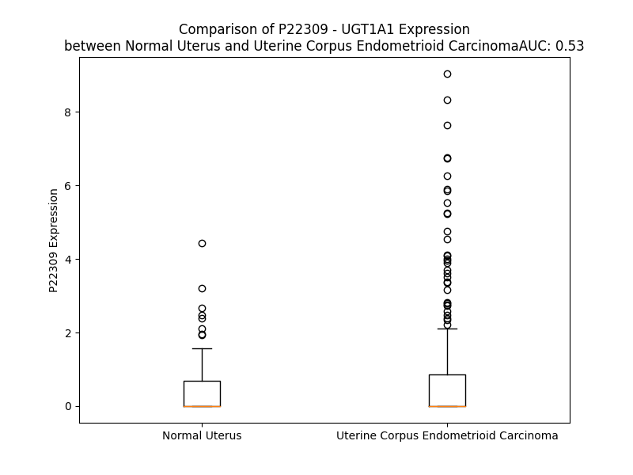

# Detailed Data for P22309

## Introduction to the Detailed Summary

### How to Interpret the Results

- **Summary & Metrics**: This section provides a quick reference to essential protein attributes, including expression changes, family classification, and biomarker applications. Regulation status (upregulated/downregulated) indicates the protein's behavior in a disease context. Some information comes from the original excel file with the proteins selected from literature, while others are derived from the analyses.
- **Expression Comparison**: A visual representation comparing protein expression between normal and disease states. It highlights significant changes in expression levels that might indicate diagnostic or therapeutic relevance. This is data coming from transcriptomics experiments and could not translate similarly to protein levels.
- **Isoform Alignment**: An interactive view of isoform alignments, revealing structural and functional differences between variants of the protein.
- **Interactors & Homologs**: Tables listing known interaction partners and homologous proteins, the more interactors and homologs, the more complex the protein is to design an antibody for.
- **Biological Assemblies**: Information about the structural arrangement of the protein in different assemblies, providing insights into its functional state but also the complexity of the protein to develop antibodies.
- **Combined Per-Residue Information**: A detailed table summarizing residue-level data. This includes predictions for epitope regions, aggregation tendencies, and modifications that might impact the protein's function. Each row corresponds to a residue in the protein, providing insights into specific sites that may be important for research or drug development.
## Summary & Metrics

- **UniProt Accession**: P22309
- **Gene Name**: UGT1A1
- **Protein Name**: UDP glucuronosyltransferase 1 family, polypeptide A1
- **Swiss Prot**: UD11_HUMAN
- **Family**: enzyme
- **Biomarker Application**: diagnosis,efficacy,response to therapy,safety
- **Number of Isoforms**: 2
- **Regulation**: -1
- **(transcriptomics) AUC**: 0.62
- **(transcriptomics) Fold Change**: 2.72
- **(transcriptomics) Regulation**: Upregulated
- **Discotope Epitope Count**: 107
- **Max n_uniprots (Homo)**: N/A
- **Max n_uniprots (Hetero)**: N/A

## Expression Comparison

## Isoform Alignment

<pre style='font-size:14px; font-family:monospace;'>P22309-1 MAVESQGGRPLVLGLLLCVLGPVVSHAGKILLIPVDGSHWLSMLGAIQQLQQRGHEIVVLAPDASLYIRDGAFYTLKTYPVPFQREDVKESFVSLGHNVFENDSFLQRVIKTYKKIKKDSAMLLSGCSHLLHNKELMASLAESSFDVMLTDPFLPCSPIVAQYLSLPTVFFLHALPCSLEFEATQCPNPFSYVPRPLSSHSDHMTFLQRVKNMLIAFSQNFLCDVVYSPYATLASEFLQREVTVQDLLSSASVWLFRSDFVKDYPRPIMPNMVFVGGINCLHQNPLSQEFEAYINASGEHGIVVFSLGSMVSEIPEKKAMAIADALGKIPQTVLWRYTGTRPSNLANNTILVKWLPQNDLLGHPMTRAFITHAGSHGVYESICNGVPMVMMPLFGDQMDNAKRMETKGAGVTLNVLEMTSEDLENALKAVINDKSYKENIMRLSSLHKDRPVEPLDLAVFWVEFVMRHKGAPHLRPAAHDLTWYQYHSLDVIGFLLAVVLTVAFITFKCCAYGYRKCLGKKGRVKKAHKSKTH
P22309-2 MAVESQGGRPLVLGLLLCVLGPVVSHAGKILLIPVDGSHWLSMLGAIQQLQQRGHEIVVLAPDASLYIRDGAFYTLKTYPVPFQREDVKESFVSLGHNVFENDSFLQRVIKTYKKIKKDSAMLLSGCSHLLHNKELMASLAESSFDVMLTDPFLPCSPIVAQYLSLPTVFFLHALPCSLEFEATQCPNPFSYVPRPLSSHSDHMTFLQRVKNMLIAFSQNFLCDVVYSPYATLASEFLQREVTVQDLLSSASVWLFRSDFVKDYPRPIMPNMVFVGGINCLHQNPLSQEFEAYINASGEHGIVVFSLGSMVSEIPEKKAMAIADALGKIPQTVLWRYTGTRPSNLANNTILVKWLPQNDLLGHPMTRAFITHAGSHGVYESICNGVPMVMMPLFGDQMDNAKRMETKGAGVTLNVLEMTSEDLENALKAVINDKRKKQQSGRQM-----------------------------------------------------------------------------------------
</pre>

## Interactors

| preferredName_A   | preferredName_B   |   score |
|:------------------|:------------------|--------:|
| UGT1A1            | UGT1A3            |   0.998 |
| UGT1A1            | UGT1A9            |   0.998 |
| UGT1A1            | UGT1A6            |   0.998 |
| UGT1A1            | UGT1A8            |   0.996 |
| UGT1A1            | UGT1A10           |   0.995 |
| UGT1A1            | UGT1A7            |   0.994 |
| UGT1A1            | CYP3A4            |   0.994 |
| UGT1A1            | UGT1A4            |   0.994 |
| UGT1A1            | CYP1A1            |   0.985 |
| UGT1A1            | SLC35A2           |   0.984 |
| UGT1A1            | CYP2D6            |   0.979 |
| UGT1A1            | CYP3A5            |   0.974 |
| UGT1A1            | CYP2E1            |   0.97  |
| UGT1A1            | UGDH              |   0.968 |
| UGT1A1            | CYP2A6            |   0.964 |
| UGT1A1            | CYP1B1            |   0.963 |
| UGT1A1            | CYP1A2            |   0.957 |
| UGT1A1            | SULT1E1           |   0.956 |
| UGT1A1            | GUSB              |   0.948 |
| UGT1A1            | AOX1              |   0.941 |
| UGT1A1            | CYP2A13           |   0.94  |
| UGT1A1            | CYP19A1           |   0.94  |
| UGT1A1            | BLVRA             |   0.933 |
| UGT1A1            | CYP2C9            |   0.932 |
| UGT1A1            | AKR1C1            |   0.931 |
| UGT1A1            | AKR1C2            |   0.929 |
| UGT1A1            | AKR1C4            |   0.928 |
| UGT1A1            | SLCO1B1           |   0.927 |
| UGT1A1            | CYP2B6            |   0.926 |
| UGT1A1            | CBR1              |   0.924 |
| UGT1A1            | AKR1C3            |   0.924 |
| UGT1A1            | AKR1D1            |   0.919 |
| UGT1A1            | HSD17B3           |   0.915 |
| UGT1A1            | CYP2C8            |   0.902 |
| UGT1A1            | MIOX              |   0.901 |

## Homologs

| uniprot_id   | gene_id   |
|:-------------|:----------|
| A0A0G2JRR8   | UGT2A3    |
| C9JMY5       | UGT1A6    |
| Q5DSZ5       | UGT1A9    |
| Q5DSZ6       | UGT1A8    |
| Q5DT02       | UGT1A10   |
| Q9HAW7       | UGT1A7    |
| O75795       | UGT2B17   |
| A0A0G2JMZ5   | UGT2B15   |
| D6RHV6       | UGT3A1    |
| Q5DT01       | UGT1A3    |
| Q5DSZ9       | UGT1A5    |
| P22310       | UGT1A4    |
| D6RDU1       | UGT3A2    |
| Q16880       | UGT8      |
| P36537       | UGT2B10   |
| Q9BY64       | UGT2B28   |
| O75310       | UGT2B11   |
| P0DTE5       | UGT2A2    |
| A0A140T9Z0   | UGT2A1    |
| P16662       | UGT2B7    |
| P06133       | UGT2B4    |

## Combined Per-Residue Information

|   res | aa   |   epitope_score | epitope   |   relative_surface_accessibility |   modeling_confidence |   Aggregation | modification   | glycosylation                   |
|------:|:-----|----------------:|:----------|---------------------------------:|----------------------:|--------------:|:---------------|:--------------------------------|
|     1 | M    |         0.13031 | False     |                          1.28219 |                 41.16 |         0     | N/A            | N/A                             |
|     2 | A    |         0.11075 | False     |                          0.95746 |                 41.02 |         0     | N/A            | N/A                             |
|     3 | V    |         0.10389 | False     |                          1.01659 |                 41.9  |         0     | N/A            | N/A                             |
|     4 | E    |         0.17137 | True      |                          0.80804 |                 39.87 |         0     | N/A            | N/A                             |
|     5 | S    |         0.15954 | True      |                          0.69876 |                 43.16 |         0     | N/A            | N/A                             |
|     6 | Q    |         0.21452 | True      |                          0.88188 |                 45.6  |         0     | N/A            | N/A                             |
|     7 | G    |         0.13361 | False     |                          0.75186 |                 48.31 |         0     | N/A            | N/A                             |
|     8 | G    |         0.12345 | False     |                          0.63025 |                 51.59 |         0     | N/A            | N/A                             |
|     9 | R    |         0.1203  | False     |                          0.82553 |                 55.82 |         0     | N/A            | N/A                             |
|    10 | P    |         0.12981 | False     |                          0.73999 |                 56.95 |         0.721 | N/A            | N/A                             |
|    11 | L    |         0.10163 | False     |                          0.78374 |                 59.24 |        59.678 | N/A            | N/A                             |
|    12 | V    |         0.05035 | False     |                          0.63168 |                 64.38 |        88.671 | N/A            | N/A                             |
|    13 | L    |         0.07051 | False     |                          0.69059 |                 60.63 |        91.107 | N/A            | N/A                             |
|    14 | G    |         0.03175 | False     |                          0.40573 |                 59.71 |        91.527 | N/A            | N/A                             |
|    15 | L    |         0.07235 | False     |                          0.66921 |                 61.6  |        96.135 | N/A            | N/A                             |
|    16 | L    |         0.05116 | False     |                          0.54348 |                 56.86 |        96.729 | N/A            | N/A                             |
|    17 | L    |         0.07918 | False     |                          0.72882 |                 56.18 |        95.656 | N/A            | N/A                             |
|    18 | C    |         0.06922 | False     |                          0.76749 |                 54.79 |        89.655 | N/A            | N/A                             |
|    19 | V    |         0.07344 | False     |                          0.88531 |                 55.58 |        88.56  | N/A            | N/A                             |
|    20 | L    |         0.12282 | False     |                          0.76504 |                 51.04 |        74.971 | N/A            | N/A                             |
|    21 | G    |         0.08701 | False     |                          0.44157 |                 46.92 |         0.058 | N/A            | N/A                             |
|    22 | P    |         0.0827  | False     |                          0.8164  |                 44.61 |         0.016 | N/A            | N/A                             |
|    23 | V    |         0.08121 | False     |                          0.99395 |                 48.51 |         0     | N/A            | N/A                             |
|    24 | V    |         0.06392 | False     |                          0.72032 |                 49.06 |         0     | N/A            | N/A                             |
|    25 | S    |         0.07034 | False     |                          0.5872  |                 53.16 |         0     | N/A            | N/A                             |
|    26 | H    |         0.07074 | False     |                          0.61852 |                 67.13 |         0     | N/A            | N/A                             |
|    27 | A    |         0.05699 | False     |                          0.5916  |                 88.8  |         0     | N/A            | N/A                             |
|    28 | G    |         0.0262  | False     |                          0.09581 |                 95    |         0     | N/A            | N/A                             |
|    29 | K    |         0.1042  | False     |                          0.23623 |                 97.54 |         0     | N/A            | N/A                             |
|    30 | I    |         0.00507 | False     |                          0.0024  |                 98.39 |         3.23  | N/A            | N/A                             |
|    31 | L    |         0.00186 | False     |                          0       |                 98.6  |         3.23  | N/A            | N/A                             |
|    32 | L    |         0.00478 | False     |                          0.00165 |                 98.13 |         3.23  | N/A            | N/A                             |
|    33 | I    |         0.02392 | False     |                          0.08974 |                 97.27 |         3.23  | N/A            | N/A                             |
|    34 | P    |         0.0263  | False     |                          0.10371 |                 95.67 |         3.23  | N/A            | N/A                             |
|    35 | V    |         0.0537  | False     |                          0.17804 |                 94.54 |         0     | N/A            | N/A                             |
|    36 | D    |         0.07165 | False     |                          0.12609 |                 92.67 |         0     | N/A            | N/A                             |
|    37 | G    |         0.01481 | False     |                          0.00161 |                 89.37 |         0     | N/A            | N/A                             |
|    38 | S    |         0.05326 | False     |                          0.43532 |                 86.64 |         0     | N/A            | N/A                             |
|    39 | H    |         0.07096 | False     |                          0.21136 |                 91.54 |         0     | N/A            | N/A                             |
|    40 | W    |         0.02753 | False     |                          0.01846 |                 93.84 |         1.702 | N/A            | N/A                             |
|    41 | L    |         0.10532 | False     |                          0.40552 |                 90.85 |         1.889 | N/A            | N/A                             |
|    42 | S    |         0.02571 | False     |                          0.05948 |                 90.76 |         1.889 | N/A            | N/A                             |
|    43 | M    |         0.00765 | False     |                          0.00288 |                 93.49 |         2.2   | N/A            | N/A                             |
|    44 | L    |         0.14733 | True      |                          0.40263 |                 92.81 |         2.2   | N/A            | N/A                             |
|    45 | G    |         0.05291 | False     |                          0.3331  |                 92.04 |         1.271 | N/A            | N/A                             |
|    46 | A    |         0.00807 | False     |                          0.03025 |                 94.68 |         1.271 | N/A            | N/A                             |
|    47 | I    |         0.00962 | False     |                          0.004   |                 95.36 |         1.271 | N/A            | N/A                             |
|    48 | Q    |         0.06177 | False     |                          0.31253 |                 94.54 |         0     | N/A            | N/A                             |
|    49 | Q    |         0.04259 | False     |                          0.20981 |                 94.52 |         0     | N/A            | N/A                             |
|    50 | L    |         0.00541 | False     |                          0.0033  |                 96.71 |         0     | N/A            | N/A                             |
|    51 | Q    |         0.0493  | False     |                          0.34168 |                 96.04 |         0     | N/A            | N/A                             |
|    52 | Q    |         0.13182 | False     |                          0.57736 |                 94.73 |         0     | N/A            | N/A                             |
|    53 | R    |         0.08739 | False     |                          0.4401  |                 95.14 |         0     | N/A            | N/A                             |
|    54 | G    |         0.05004 | False     |                          0.51361 |                 95.81 |         0     | N/A            | N/A                             |
|    55 | H    |         0.02633 | False     |                          0.05208 |                 97.27 |         0     | N/A            | N/A                             |
|    56 | E    |         0.08906 | False     |                          0.45433 |                 97.12 |         0     | N/A            | N/A                             |
|    57 | I    |         0.02472 | False     |                          0.02664 |                 97.94 |         1.082 | N/A            | N/A                             |
|    58 | V    |         0.0302  | False     |                          0.03713 |                 98.22 |         1.082 | N/A            | N/A                             |
|    59 | V    |         0.00235 | False     |                          0       |                 98.24 |         1.082 | N/A            | N/A                             |
|    60 | L    |         0.01085 | False     |                          0.00731 |                 98.08 |         1.082 | N/A            | N/A                             |
|    61 | A    |         0.01194 | False     |                          0.01658 |                 97.58 |         1.082 | N/A            | N/A                             |
|    62 | P    |         0.03184 | False     |                          0.24165 |                 97.44 |         0.596 | N/A            | N/A                             |
|    63 | D    |         0.09922 | False     |                          0.44239 |                 96.45 |         0     | N/A            | N/A                             |
|    64 | A    |         0.01383 | False     |                          0.04701 |                 96.8  |         1.274 | N/A            | N/A                             |
|    65 | S    |         0.02057 | False     |                          0.03713 |                 96    |         1.274 | N/A            | N/A                             |
|    66 | L    |         0.10127 | False     |                          0.14799 |                 92.85 |         1.274 | N/A            | N/A                             |
|    67 | Y    |         0.11413 | False     |                          0.33479 |                 92    |         1.274 | N/A            | N/A                             |
|    68 | I    |         0.03819 | False     |                          0.02557 |                 95.45 |         1.274 | N/A            | N/A                             |
|    69 | R    |         0.12931 | False     |                          0.35038 |                 94.08 |         0     | N/A            | N/A                             |
|    70 | D    |         0.23752 | True      |                          0.77353 |                 93.57 |         0     | N/A            | N/A                             |
|    71 | G    |         0.13797 | False     |                          0.41851 |                 90.1  |         0.534 | N/A            | N/A                             |
|    72 | A    |         0.17028 | True      |                          0.91033 |                 89.78 |        16.75  | N/A            | N/A                             |
|    73 | F    |         0.13351 | False     |                          0.38629 |                 93.27 |        16.75  | N/A            | N/A                             |
|    74 | Y    |         0.12935 | False     |                          0.13736 |                 96.89 |        16.75  | N/A            | N/A                             |
|    75 | T    |         0.0917  | False     |                          0.55146 |                 97.55 |        16.75  | N/A            | N/A                             |
|    76 | L    |         0.07748 | False     |                          0.21515 |                 97.93 |        16.75  | N/A            | N/A                             |
|    77 | K    |         0.11316 | False     |                          0.2907  |                 97.52 |         0     | N/A            | N/A                             |
|    78 | T    |         0.07042 | False     |                          0.51116 |                 97.49 |         0     | N/A            | N/A                             |
|    79 | Y    |         0.09265 | False     |                          0.06219 |                 97.81 |         0     | N/A            | N/A                             |
|    80 | P    |         0.19357 | True      |                          0.63385 |                 97.61 |         0     | N/A            | N/A                             |
|    81 | V    |         0.04136 | False     |                          0.1211  |                 97.8  |         0     | N/A            | N/A                             |
|    82 | P    |         0.16207 | True      |                          0.61328 |                 96.43 |         0     | N/A            | N/A                             |
|    83 | F    |         0.11227 | False     |                          0.11397 |                 96.51 |         0     | N/A            | N/A                             |
|    84 | Q    |         0.18018 | True      |                          0.59847 |                 95.99 |         0     | N/A            | N/A                             |
|    85 | R    |         0.11318 | False     |                          0.41161 |                 94.64 |         0     | N/A            | N/A                             |
|    86 | E    |         0.21289 | True      |                          0.60268 |                 94.61 |         0     | N/A            | N/A                             |
|    87 | D    |         0.17059 | True      |                          0.35807 |                 94.47 |         0     | N/A            | N/A                             |
|    88 | V    |         0.03547 | False     |                          0.11044 |                 93.37 |         0     | N/A            | N/A                             |
|    89 | K    |         0.13449 | False     |                          0.55147 |                 91.67 |         0     | N/A            | N/A                             |
|    90 | E    |         0.18986 | True      |                          0.52076 |                 91.12 |         0     | N/A            | N/A                             |
|    91 | S    |         0.10806 | False     |                          0.14768 |                 89.94 |         2.188 | N/A            | N/A                             |
|    92 | F    |         0.13306 | False     |                          0.20894 |                 86.64 |         2.383 | N/A            | N/A                             |
|    93 | V    |         0.10503 | False     |                          0.36001 |                 85.13 |         2.383 | N/A            | N/A                             |
|    94 | S    |         0.08588 | False     |                          0.21894 |                 85.7  |         2.383 | N/A            | N/A                             |
|    95 | L    |         0.21724 | True      |                          0.40684 |                 79.94 |         2.383 | N/A            | N/A                             |
|    96 | G    |         0.03131 | False     |                          0.04914 |                 77.85 |         0.376 | N/A            | N/A                             |
|    97 | H    |         0.17094 | True      |                          0.44721 |                 79.89 |         0     | N/A            | N/A                             |
|    98 | N    |         0.10727 | False     |                          0.34972 |                 81.25 |         0     | N/A            | N/A                             |
|    99 | V    |         0.07709 | False     |                          0.18383 |                 79.63 |         0     | N/A            | N/A                             |
|   100 | F    |         0.05897 | False     |                          0.14817 |                 82.45 |         0     | N/A            | N/A                             |
|   101 | E    |         0.12552 | False     |                          0.33777 |                 81.88 |         0     | N/A            | N/A                             |
|   102 | N    |         0.20147 | True      |                          0.98541 |                 79.11 |         0     | N/A            | N-linked (GlcNAc...) asparagine |
|   103 | D    |         0.18948 | True      |                          0.17895 |                 84.08 |         0     | N/A            | N/A                             |
|   104 | S    |         0.14594 | True      |                          0.47697 |                 86.51 |         0     | N/A            | N/A                             |
|   105 | F    |         0.1867  | True      |                          0.84351 |                 82.6  |         0     | N/A            | N/A                             |
|   106 | L    |         0.2268  | True      |                          0.73216 |                 86.87 |         0     | N/A            | N/A                             |
|   107 | Q    |         0.13502 | False     |                          0.48205 |                 88.96 |         0     | N/A            | N/A                             |
|   108 | R    |         0.11678 | False     |                          0.36463 |                 85.02 |         0     | N/A            | N/A                             |
|   109 | V    |         0.13707 | False     |                          0.51683 |                 85.06 |         0     | N/A            | N/A                             |
|   110 | I    |         0.17535 | True      |                          0.47198 |                 88.76 |         0     | N/A            | N/A                             |
|   111 | K    |         0.1107  | False     |                          0.43695 |                 88.97 |         0     | N/A            | N/A                             |
|   112 | T    |         0.12131 | False     |                          0.51673 |                 85.22 |         0     | N/A            | N/A                             |
|   113 | Y    |         0.103   | False     |                          0.39307 |                 86.49 |         0     | N/A            | N/A                             |
|   114 | K    |         0.19332 | True      |                          0.66718 |                 89.73 |         0     | N/A            | N/A                             |
|   115 | K    |         0.06716 | False     |                          0.15558 |                 88.35 |         0     | N/A            | N/A                             |
|   116 | I    |         0.07893 | False     |                          0.31039 |                 88.19 |         0     | N/A            | N/A                             |
|   117 | K    |         0.16731 | True      |                          0.58559 |                 89.84 |         0     | N/A            | N/A                             |
|   118 | K    |         0.27141 | True      |                          0.65793 |                 92.2  |         0     | N/A            | N/A                             |
|   119 | D    |         0.06384 | False     |                          0.14469 |                 91.75 |         0     | N/A            | N/A                             |
|   120 | S    |         0.05292 | False     |                          0.11794 |                 92.13 |         0.589 | N/A            | N/A                             |
|   121 | A    |         0.09484 | False     |                          0.53785 |                 93.9  |         0.589 | N/A            | N/A                             |
|   122 | M    |         0.06665 | False     |                          0.16345 |                 95.17 |         0.589 | N/A            | N/A                             |
|   123 | L    |         0.05591 | False     |                          0.40734 |                 94.79 |         0.589 | N/A            | N/A                             |
|   124 | L    |         0.04854 | False     |                          0.24648 |                 96.74 |         0.589 | N/A            | N/A                             |
|   125 | S    |         0.05791 | False     |                          0.25898 |                 97.43 |         0     | N/A            | N/A                             |
|   126 | G    |         0.02095 | False     |                          0.02897 |                 97.6  |         0     | N/A            | N/A                             |
|   127 | C    |         0.00857 | False     |                          0.02793 |                 98.19 |         0     | N/A            | N/A                             |
|   128 | S    |         0.0451  | False     |                          0.23209 |                 98.29 |         0     | N/A            | N/A                             |
|   129 | H    |         0.07477 | False     |                          0.4278  |                 98.36 |         0     | N/A            | N/A                             |
|   130 | L    |         0.00502 | False     |                          0.00742 |                 98.32 |         0     | N/A            | N/A                             |
|   131 | L    |         0.01584 | False     |                          0.01401 |                 98.35 |         0     | N/A            | N/A                             |
|   132 | H    |         0.1334  | False     |                          0.52036 |                 97.42 |         0     | N/A            | N/A                             |
|   133 | N    |         0.09478 | False     |                          0.25771 |                 97.94 |         0     | N/A            | N/A                             |
|   134 | K    |         0.15777 | True      |                          0.85424 |                 97.06 |         0     | N/A            | N/A                             |
|   135 | E    |         0.11306 | False     |                          0.77016 |                 97.82 |         0     | N/A            | N/A                             |
|   136 | L    |         0.08083 | False     |                          0.12978 |                 97.93 |         0.405 | N/A            | N/A                             |
|   137 | M    |         0.01074 | False     |                          0.02373 |                 98    |         0.405 | N/A            | N/A                             |
|   138 | A    |         0.05284 | False     |                          0.42272 |                 97.47 |         0.405 | N/A            | N/A                             |
|   139 | S    |         0.08297 | False     |                          0.27609 |                 97.8  |         0.405 | N/A            | N/A                             |
|   140 | L    |         0.01215 | False     |                          0.01036 |                 98.01 |         0.405 | N/A            | N/A                             |
|   141 | A    |         0.09946 | False     |                          0.50119 |                 96.95 |         0.186 | N/A            | N/A                             |
|   142 | E    |         0.20864 | True      |                          0.73461 |                 96.89 |         0     | N/A            | N/A                             |
|   143 | S    |         0.10882 | False     |                          0.20417 |                 94.96 |         0     | N/A            | N/A                             |
|   144 | S    |         0.16827 | True      |                          0.66287 |                 92.19 |         0     | N/A            | N/A                             |
|   145 | F    |         0.04091 | False     |                          0.0757  |                 98.17 |         0     | N/A            | N/A                             |
|   146 | D    |         0.02686 | False     |                          0.38479 |                 97.83 |         0     | N/A            | N/A                             |
|   147 | V    |         0.00201 | False     |                          0       |                 98.42 |         0     | N/A            | N/A                             |
|   148 | M    |         0.00088 | False     |                          0       |                 98.54 |         0     | N/A            | N/A                             |
|   149 | L    |         0.00596 | False     |                          0.00659 |                 98.55 |         0     | N/A            | N/A                             |
|   150 | T    |         0.00277 | False     |                          0       |                 98.14 |         0     | N/A            | N/A                             |
|   151 | D    |         0.01201 | False     |                          0.01547 |                 97.04 |         0     | N/A            | N/A                             |
|   152 | P    |         0.00435 | False     |                          0.00073 |                 96.51 |         0     | N/A            | N/A                             |
|   153 | F    |         0.07903 | False     |                          0.32981 |                 94.95 |         0     | N/A            | N/A                             |
|   154 | L    |         0.02065 | False     |                          0.13086 |                 91.39 |         0     | N/A            | N/A                             |
|   155 | P    |         0.00228 | False     |                          0       |                 93.56 |         0     | N/A            | N/A                             |
|   156 | C    |         0.01345 | False     |                          0.11217 |                 97.4  |         0     | N/A            | N/A                             |
|   157 | S    |         0.00621 | False     |                          0.01778 |                 97.11 |         0     | N/A            | N/A                             |
|   158 | P    |         0.00339 | False     |                          0.00099 |                 97.87 |         0     | N/A            | N/A                             |
|   159 | I    |         0.00316 | False     |                          0       |                 98.39 |         6.014 | N/A            | N/A                             |
|   160 | V    |         0.001   | False     |                          0       |                 98.31 |         6.437 | N/A            | N/A                             |
|   161 | A    |         0.0086  | False     |                          0.02788 |                 98.03 |         6.437 | N/A            | N/A                             |
|   162 | Q    |         0.02451 | False     |                          0.19487 |                 97.56 |         6.437 | N/A            | N/A                             |
|   163 | Y    |         0.21872 | True      |                          0.42709 |                 97.58 |         6.437 | N/A            | N/A                             |
|   164 | L    |         0.03867 | False     |                          0.15843 |                 97.63 |         5.589 | N/A            | N/A                             |
|   165 | S    |         0.14224 | True      |                          0.75164 |                 96.68 |         0.547 | N/A            | N/A                             |
|   166 | L    |         0.02303 | False     |                          0.13746 |                 98.04 |         0     | N/A            | N/A                             |
|   167 | P    |         0.02211 | False     |                          0.18932 |                 98.19 |         1.089 | N/A            | N/A                             |
|   168 | T    |         0.00337 | False     |                          0.0091  |                 98.58 |        77.221 | N/A            | N/A                             |
|   169 | V    |         0.00213 | False     |                          0       |                 98.75 |        79.002 | N/A            | N/A                             |
|   170 | F    |         0.00107 | False     |                          0       |                 98.58 |        79.069 | N/A            | N/A                             |
|   171 | F    |         0.00556 | False     |                          0.00701 |                 97.97 |        79.069 | N/A            | N/A                             |
|   172 | L    |         0.01439 | False     |                          0.00824 |                 96.36 |        78.901 | N/A            | N/A                             |
|   173 | H    |         0.04465 | False     |                          0.15618 |                 93.44 |         2.874 | N/A            | N/A                             |
|   174 | A    |         0.07009 | False     |                          0.42305 |                 92.01 |         1.384 | N/A            | N/A                             |
|   175 | L    |         0.01264 | False     |                          0.02413 |                 92.9  |         0.056 | N/A            | N/A                             |
|   176 | P    |         0.0663  | False     |                          0.36214 |                 89.68 |         0.029 | N/A            | N/A                             |
|   177 | C    |         0.03233 | False     |                          0.14836 |                 88.81 |         0     | N/A            | N/A                             |
|   178 | S    |         0.0144  | False     |                          0.07792 |                 90.76 |         0     | N/A            | N/A                             |
|   179 | L    |         0.04624 | False     |                          0.1539  |                 93.29 |         0     | N/A            | N/A                             |
|   180 | E    |         0.04215 | False     |                          0.02524 |                 94.95 |         0     | N/A            | N/A                             |
|   181 | F    |         0.02458 | False     |                          0.04283 |                 94.77 |         0     | N/A            | N/A                             |
|   182 | E    |         0.08813 | False     |                          0.48705 |                 92.3  |         0     | N/A            | N/A                             |
|   183 | A    |         0.00919 | False     |                          0.0208  |                 95.31 |         0     | N/A            | N/A                             |
|   184 | T    |         0.00508 | False     |                          0.00762 |                 96.13 |         0     | N/A            | N/A                             |
|   185 | Q    |         0.04782 | False     |                          0.14692 |                 94.9  |         0     | N/A            | N/A                             |
|   186 | C    |         0.03845 | False     |                          0.0496  |                 96.25 |         0     | N/A            | N/A                             |
|   187 | P    |         0.11065 | False     |                          0.41851 |                 95.29 |         0     | N/A            | N/A                             |
|   188 | N    |         0.05017 | False     |                          0.20183 |                 94.34 |         0     | N/A            | N/A                             |
|   189 | P    |         0.0966  | False     |                          0.30319 |                 95.16 |         0     | N/A            | N/A                             |
|   190 | F    |         0.12193 | False     |                          0.41595 |                 93.31 |         0     | N/A            | N/A                             |
|   191 | S    |         0.15112 | True      |                          0.49686 |                 94.6  |         0     | N/A            | N/A                             |
|   192 | Y    |         0.23275 | True      |                          0.3834  |                 95.15 |         0     | N/A            | N/A                             |
|   193 | V    |         0.03577 | False     |                          0.06855 |                 95.72 |         0     | N/A            | N/A                             |
|   194 | P    |         0.01881 | False     |                          0.14332 |                 94.43 |         0     | N/A            | N/A                             |
|   195 | R    |         0.04384 | False     |                          0.0463  |                 92.64 |         0     | N/A            | N/A                             |
|   196 | P    |         0.06648 | False     |                          0.35971 |                 86.15 |         0     | N/A            | N/A                             |
|   197 | L    |         0.16417 | True      |                          0.70759 |                 78.4  |         0     | N/A            | N/A                             |
|   198 | S    |         0.04877 | False     |                          0.02469 |                 86.31 |         0     | N/A            | N/A                             |
|   199 | S    |         0.05237 | False     |                          0.40105 |                 85.41 |         0     | N/A            | N/A                             |
|   200 | H    |         0.13306 | False     |                          0.1209  |                 91.24 |         0     | N/A            | N/A                             |
|   201 | S    |         0.07393 | False     |                          0.17514 |                 92.04 |         0     | N/A            | N/A                             |
|   202 | D    |         0.1561  | True      |                          0.18012 |                 93.28 |         0     | N/A            | N/A                             |
|   203 | H    |         0.17152 | True      |                          0.86637 |                 94.43 |         0     | N/A            | N/A                             |
|   204 | M    |         0.14559 | True      |                          0.08248 |                 95.23 |         0.265 | N/A            | N/A                             |
|   205 | T    |         0.19572 | True      |                          0.61122 |                 96.94 |         0.265 | N/A            | N/A                             |
|   206 | F    |         0.31325 | True      |                          0.68754 |                 97.75 |         0.265 | N/A            | N/A                             |
|   207 | L    |         0.31927 | True      |                          0.82849 |                 97.86 |         0.265 | N/A            | N/A                             |
|   208 | Q    |         0.08697 | False     |                          0.3002  |                 96.67 |         0.265 | N/A            | N/A                             |
|   209 | R    |         0.24242 | True      |                          0.37718 |                 97.35 |         0     | N/A            | N/A                             |
|   210 | V    |         0.08453 | False     |                          0.39103 |                 96.83 |         0     | N/A            | N/A                             |
|   211 | K    |         0.20079 | True      |                          0.4883  |                 95.1  |         0     | N/A            | N/A                             |
|   212 | N    |         0.01508 | False     |                          0       |                 95.2  |         0.489 | N/A            | N/A                             |
|   213 | M    |         0.14648 | True      |                          0.43707 |                 94.11 |        15.919 | N/A            | N/A                             |
|   214 | L    |         0.28605 | True      |                          0.65125 |                 92.95 |        19.927 | N/A            | N/A                             |
|   215 | I    |         0.14888 | True      |                          0.18057 |                 91.23 |        19.927 | N/A            | N/A                             |
|   216 | A    |         0.08202 | False     |                          0.09047 |                 90.37 |        19.927 | N/A            | N/A                             |
|   217 | F    |         0.15201 | True      |                          0.63857 |                 86.42 |        19.927 | N/A            | N/A                             |
|   218 | S    |         0.18335 | True      |                          0.54277 |                 83.82 |         6.896 | N/A            | N/A                             |
|   219 | Q    |         0.09125 | False     |                          0.10365 |                 82.79 |         1.607 | N/A            | N/A                             |
|   220 | N    |         0.13934 | True      |                          0.60375 |                 78.95 |         1.461 | N/A            | N/A                             |
|   221 | F    |         0.19229 | True      |                          0.79145 |                 79.62 |         1.461 | N/A            | N/A                             |
|   222 | L    |         0.15638 | True      |                          0.44103 |                 79.95 |         1.461 | N/A            | N/A                             |
|   223 | C    |         0.03847 | False     |                          0.07021 |                 87.73 |         0.232 | N/A            | N/A                             |
|   224 | D    |         0.11987 | False     |                          0.51424 |                 87.36 |         0     | N/A            | N/A                             |
|   225 | V    |         0.0971  | False     |                          0.3252  |                 85.81 |         0     | N/A            | N/A                             |
|   226 | V    |         0.07242 | False     |                          0.1448  |                 90.94 |         0     | N/A            | N/A                             |
|   227 | Y    |         0.02343 | False     |                          0.03056 |                 94.6  |         0     | N/A            | N/A                             |
|   228 | S    |         0.05993 | False     |                          0.31579 |                 94.39 |         0     | N/A            | N/A                             |
|   229 | P    |         0.07806 | False     |                          0.328   |                 96.39 |         0     | N/A            | N/A                             |
|   230 | Y    |         0.00913 | False     |                          0.00345 |                 97.28 |         0.179 | N/A            | N/A                             |
|   231 | A    |         0.03466 | False     |                          0.13674 |                 97.07 |         0.179 | N/A            | N/A                             |
|   232 | T    |         0.17797 | True      |                          0.66259 |                 97.86 |         0.179 | N/A            | N/A                             |
|   233 | L    |         0.04455 | False     |                          0.10187 |                 98.35 |         0.179 | N/A            | N/A                             |
|   234 | A    |         0.00383 | False     |                          0       |                 98.29 |         0.179 | N/A            | N/A                             |
|   235 | S    |         0.2151  | True      |                          0.23522 |                 98.46 |         0     | N/A            | N/A                             |
|   236 | E    |         0.29575 | True      |                          0.61852 |                 97.89 |         0     | N/A            | N/A                             |
|   237 | F    |         0.1131  | False     |                          0.21232 |                 98.13 |         0     | N/A            | N/A                             |
|   238 | L    |         0.06152 | False     |                          0.1917  |                 97.48 |         0     | N/A            | N/A                             |
|   239 | Q    |         0.3515  | True      |                          0.83518 |                 97.43 |         0     | N/A            | N/A                             |
|   240 | R    |         0.37924 | True      |                          0.49991 |                 97.66 |         0     | N/A            | N/A                             |
|   241 | E    |         0.18291 | True      |                          0.81071 |                 97.4  |         0     | N/A            | N/A                             |
|   242 | V    |         0.0412  | False     |                          0.03026 |                 96.92 |         0     | N/A            | N/A                             |
|   243 | T    |         0.1619  | True      |                          0.45704 |                 95.26 |         0     | N/A            | N/A                             |
|   244 | V    |         0.0147  | False     |                          0.17888 |                 94.94 |         0     | N/A            | N/A                             |
|   245 | Q    |         0.05193 | False     |                          0.34469 |                 93.53 |         0     | N/A            | N/A                             |
|   246 | D    |         0.05366 | False     |                          0.36474 |                 95.03 |         0     | N/A            | N/A                             |
|   247 | L    |         0.00254 | False     |                          0       |                 97.19 |        17.594 | N/A            | N/A                             |
|   248 | L    |         0.00884 | False     |                          0.00989 |                 96.69 |        20.816 | N/A            | N/A                             |
|   249 | S    |         0.03512 | False     |                          0.21878 |                 96.07 |        20.816 | N/A            | N/A                             |
|   250 | S    |         0.09064 | False     |                          0.37004 |                 94.75 |        21.405 | N/A            | N/A                             |
|   251 | A    |         0.01911 | False     |                          0.07448 |                 97.56 |        26.89  | N/A            | N/A                             |
|   252 | S    |         0.0214  | False     |                          0.12032 |                 98.26 |        32.969 | N/A            | N/A                             |
|   253 | V    |         0.00411 | False     |                          0       |                 98.56 |        36.159 | N/A            | N/A                             |
|   254 | W    |         0.00921 | False     |                          0.00614 |                 98.54 |        36.43  | N/A            | N/A                             |
|   255 | L    |         0.00702 | False     |                          0.00495 |                 98.49 |        36.43  | N/A            | N/A                             |
|   256 | F    |         0.00615 | False     |                          0.00382 |                 97.76 |        34.47  | N/A            | N/A                             |
|   257 | R    |         0.04418 | False     |                          0.07251 |                 95.98 |         4.184 | N/A            | N/A                             |
|   258 | S    |         0.0231  | False     |                          0.01756 |                 95.92 |         4.184 | N/A            | N/A                             |
|   259 | D    |         0.0389  | False     |                          0.19079 |                 95.82 |         4.184 | N/A            | N/A                             |
|   260 | F    |         0.05736 | False     |                          0.33788 |                 96.41 |         4.184 | N/A            | N/A                             |
|   261 | V    |         0.09446 | False     |                          0.12894 |                 96.47 |         4.184 | N/A            | N/A                             |
|   262 | K    |         0.01037 | False     |                          0       |                 95.43 |         0     | N/A            | N/A                             |
|   263 | D    |         0.05238 | False     |                          0.12786 |                 94.5  |         0     | N/A            | N/A                             |
|   264 | Y    |         0.04758 | False     |                          0.09307 |                 94.87 |         0     | N/A            | N/A                             |
|   265 | P    |         0.17768 | True      |                          0.66435 |                 95.54 |         0     | N/A            | N/A                             |
|   266 | R    |         0.10952 | False     |                          0.23529 |                 95.87 |         0     | N/A            | N/A                             |
|   267 | P    |         0.08742 | False     |                          0.27551 |                 96.82 |         0     | N/A            | N/A                             |
|   268 | I    |         0.11408 | False     |                          0.44662 |                 97.09 |         0     | N/A            | N/A                             |
|   269 | M    |         0.0487  | False     |                          0.13786 |                 97.1  |         0     | N/A            | N/A                             |
|   270 | P    |         0.10148 | False     |                          0.63104 |                 97.38 |         0     | N/A            | N/A                             |
|   271 | N    |         0.03768 | False     |                          0.05202 |                 97.59 |         3.92  | N/A            | N/A                             |
|   272 | M    |         0.02837 | False     |                          0.0388  |                 98.17 |        19.988 | N/A            | N/A                             |
|   273 | V    |         0.03652 | False     |                          0.10378 |                 98.25 |        27.299 | N/A            | N/A                             |
|   274 | F    |         0.03306 | False     |                          0.17989 |                 97.74 |        27.824 | N/A            | N/A                             |
|   275 | V    |         0.00457 | False     |                          0.0019  |                 97.39 |        27.824 | N/A            | N/A                             |
|   276 | G    |         0.01311 | False     |                          0.02415 |                 96.28 |        24.479 | N/A            | N/A                             |
|   277 | G    |         0.00957 | False     |                          0.02453 |                 94.54 |        16.452 | N/A            | N/A                             |
|   278 | I    |         0.04128 | False     |                          0.06494 |                 94.1  |        15.148 | N/A            | N/A                             |
|   279 | N    |         0.04859 | False     |                          0.20049 |                 89.66 |         1.109 | N/A            | N/A                             |
|   280 | C    |         0.03486 | False     |                          0.1298  |                 89.73 |         0.593 | N/A            | N/A                             |
|   281 | L    |         0.15144 | True      |                          0.55922 |                 72.77 |         0.593 | N/A            | N/A                             |
|   282 | H    |         0.11129 | False     |                          0.5046  |                 65.63 |         0     | N/A            | N/A                             |
|   283 | Q    |         0.12591 | False     |                          0.62383 |                 69.66 |         0     | N/A            | N/A                             |
|   284 | N    |         0.09107 | False     |                          0.58608 |                 84.68 |         0     | N/A            | N/A                             |
|   285 | P    |         0.15144 | True      |                          0.95829 |                 89.79 |         0     | N/A            | N/A                             |
|   286 | L    |         0.04381 | False     |                          0.14168 |                 93.39 |         0     | N/A            | N/A                             |
|   287 | S    |         0.13181 | False     |                          0.47242 |                 95.31 |         0     | N/A            | N/A                             |
|   288 | Q    |         0.1327  | False     |                          0.83547 |                 95.92 |         0     | N/A            | N/A                             |
|   289 | E    |         0.15416 | True      |                          0.49255 |                 96.2  |         0     | N/A            | N/A                             |
|   290 | F    |         0.07571 | False     |                          0.09555 |                 96.67 |         0     | N/A            | N/A                             |
|   291 | E    |         0.08416 | False     |                          0.315   |                 95.82 |         0     | N/A            | N/A                             |
|   292 | A    |         0.11929 | False     |                          0.54286 |                 96.84 |         0     | N/A            | N/A                             |
|   293 | Y    |         0.08393 | False     |                          0.24461 |                 96.79 |         0     | N/A            | N/A                             |
|   294 | I    |         0.05229 | False     |                          0.02946 |                 96.45 |         0     | N/A            | N/A                             |
|   295 | N    |         0.19149 | True      |                          0.72975 |                 95.93 |         0     | N/A            | N-linked (GlcNAc...) asparagine |
|   296 | A    |         0.10255 | False     |                          0.82495 |                 95.31 |         0     | N/A            | N/A                             |
|   297 | S    |         0.04954 | False     |                          0.06039 |                 96.42 |         0     | N/A            | N/A                             |
|   298 | G    |         0.1506  | True      |                          0.50422 |                 94.31 |         0     | N/A            | N/A                             |
|   299 | E    |         0.25437 | True      |                          0.75488 |                 96.11 |         0     | N/A            | N/A                             |
|   300 | H    |         0.10794 | False     |                          0.42267 |                 97.49 |         0.038 | N/A            | N/A                             |
|   301 | G    |         0.00419 | False     |                          0       |                 98.23 |         7.365 | N/A            | N/A                             |
|   302 | I    |         0.0033  | False     |                          0       |                 98.61 |        85.014 | N/A            | N/A                             |
|   303 | V    |         0.00236 | False     |                          0       |                 98.78 |        91.773 | N/A            | N/A                             |
|   304 | V    |         0.00197 | False     |                          0       |                 98.49 |        91.844 | N/A            | N/A                             |
|   305 | F    |         0.00562 | False     |                          0       |                 97.86 |        91.844 | N/A            | N/A                             |
|   306 | S    |         0.04959 | False     |                          0.04229 |                 95.69 |        88.005 | N/A            | N/A                             |
|   307 | L    |         0.02985 | False     |                          0.03855 |                 92.59 |        77.252 | N/A            | N/A                             |
|   308 | G    |         0.04982 | False     |                          0.15425 |                 86.87 |        12.767 | N/A            | N/A                             |
|   309 | S    |         0.07685 | False     |                          0.24292 |                 77.34 |         6.921 | N/A            | N/A                             |
|   310 | M    |         0.0862  | False     |                          0.14041 |                 72.56 |         6.201 | N/A            | N/A                             |
|   311 | V    |         0.07081 | False     |                          0.08238 |                 75.89 |         5.38  | N/A            | N/A                             |
|   312 | S    |         0.16947 | True      |                          0.31322 |                 70    |         0.591 | N/A            | N/A                             |
|   313 | E    |         0.23128 | True      |                          0.47428 |                 73.31 |         0     | N/A            | N/A                             |
|   314 | I    |         0.07926 | False     |                          0.06821 |                 85.37 |         0     | N/A            | N/A                             |
|   315 | P    |         0.08441 | False     |                          0.43939 |                 88.79 |         0     | N/A            | N/A                             |
|   316 | E    |         0.13537 | False     |                          0.58508 |                 91.02 |         0     | N/A            | N/A                             |
|   317 | K    |         0.10647 | False     |                          0.79536 |                 91.43 |         0     | N/A            | N/A                             |
|   318 | K    |         0.04369 | False     |                          0.17804 |                 92.17 |         0     | N/A            | N/A                             |
|   319 | A    |         0.00596 | False     |                          0.00765 |                 94.37 |         0.456 | N/A            | N/A                             |
|   320 | M    |         0.0597  | False     |                          0.33096 |                 96.14 |         0.456 | N/A            | N/A                             |
|   321 | A    |         0.04444 | False     |                          0.28059 |                 96.02 |         0.456 | N/A            | N/A                             |
|   322 | I    |         0.00556 | False     |                          0.00309 |                 97.1  |         0.456 | N/A            | N/A                             |
|   323 | A    |         0.00419 | False     |                          0.00283 |                 97.86 |         0.456 | N/A            | N/A                             |
|   324 | D    |         0.0847  | False     |                          0.34022 |                 98.21 |         0     | N/A            | N/A                             |
|   325 | A    |         0.00306 | False     |                          0       |                 98.45 |         0     | N/A            | N/A                             |
|   326 | L    |         0.00261 | False     |                          0       |                 98.54 |         0     | N/A            | N/A                             |
|   327 | G    |         0.03257 | False     |                          0.39246 |                 98.16 |         0     | N/A            | N/A                             |
|   328 | K    |         0.11257 | False     |                          0.45178 |                 98.18 |         0     | N/A            | N/A                             |
|   329 | I    |         0.03557 | False     |                          0.04012 |                 98.29 |         0     | N/A            | N/A                             |
|   330 | P    |         0.11584 | False     |                          0.58945 |                 97.73 |         0     | N/A            | N/A                             |
|   331 | Q    |         0.06065 | False     |                          0.05691 |                 98.54 |         0.143 | N/A            | N/A                             |
|   332 | T    |         0.04201 | False     |                          0.1186  |                 98.62 |         0.143 | N/A            | N/A                             |
|   333 | V    |         0.00195 | False     |                          0       |                 98.68 |         0.143 | N/A            | N/A                             |
|   334 | L    |         0.00316 | False     |                          0       |                 98.35 |         0.143 | N/A            | N/A                             |
|   335 | W    |         0.01792 | False     |                          0.00512 |                 97.2  |         0.143 | N/A            | N/A                             |
|   336 | R    |         0.04387 | False     |                          0.1227  |                 94.84 |         0     | N/A            | N/A                             |
|   337 | Y    |         0.0471  | False     |                          0.07527 |                 92.74 |         0     | N/A            | N/A                             |
|   338 | T    |         0.11099 | False     |                          0.4786  |                 89.17 |         0     | N/A            | N/A                             |
|   339 | G    |         0.07317 | False     |                          0.25429 |                 88.43 |         0     | N/A            | N/A                             |
|   340 | T    |         0.10113 | False     |                          0.80006 |                 91.5  |         0     | N/A            | N/A                             |
|   341 | R    |         0.09837 | False     |                          0.59276 |                 94.24 |         0     | N/A            | N/A                             |
|   342 | P    |         0.02086 | False     |                          0.02788 |                 95.22 |         0     | N/A            | N/A                             |
|   343 | S    |         0.14788 | True      |                          0.8167  |                 96.1  |         0     | N/A            | N/A                             |
|   344 | N    |         0.20215 | True      |                          0.42318 |                 97.43 |         0     | N/A            | N/A                             |
|   345 | L    |         0.04603 | False     |                          0.11797 |                 97.72 |         0     | N/A            | N/A                             |
|   346 | A    |         0.0241  | False     |                          0.30559 |                 97.68 |         0     | N/A            | N/A                             |
|   347 | N    |         0.15563 | True      |                          0.99083 |                 96.44 |         0     | N/A            | N-linked (GlcNAc...) asparagine |
|   348 | N    |         0.06146 | False     |                          0.22112 |                 97.73 |         0.368 | N/A            | N/A                             |
|   349 | T    |         0.02318 | False     |                          0.0366  |                 98.28 |         0.368 | N/A            | N/A                             |
|   350 | I    |         0.08177 | False     |                          0.23759 |                 97.83 |         0.368 | N/A            | N/A                             |
|   351 | L    |         0.08028 | False     |                          0.25266 |                 96.08 |         0.368 | N/A            | N/A                             |
|   352 | V    |         0.07943 | False     |                          0.10728 |                 94.62 |         0.368 | N/A            | N/A                             |
|   353 | K    |         0.13277 | False     |                          0.83692 |                 91.61 |         0     | N/A            | N/A                             |
|   354 | W    |         0.24383 | True      |                          0.7028  |                 91.55 |         0     | N/A            | N/A                             |
|   355 | L    |         0.04236 | False     |                          0.04514 |                 93.24 |         0     | N/A            | N/A                             |
|   356 | P    |         0.05126 | False     |                          0.26244 |                 93.83 |         0     | N/A            | N/A                             |
|   357 | Q    |         0.03155 | False     |                          0.18375 |                 94.46 |         0     | N/A            | N/A                             |
|   358 | N    |         0.01467 | False     |                          0.11543 |                 94.46 |         0     | N/A            | N/A                             |
|   359 | D    |         0.01425 | False     |                          0.13349 |                 95.08 |         0     | N/A            | N/A                             |
|   360 | L    |         0.00194 | False     |                          0       |                 96.51 |         0     | N/A            | N/A                             |
|   361 | L    |         0.00591 | False     |                          0.01158 |                 96.94 |         0     | N/A            | N/A                             |
|   362 | G    |         0.02159 | False     |                          0.28869 |                 94.79 |         0     | N/A            | N/A                             |
|   363 | H    |         0.03953 | False     |                          0.23974 |                 95.55 |         0     | N/A            | N/A                             |
|   364 | P    |         0.12307 | False     |                          0.8151  |                 94.94 |         0     | N/A            | N/A                             |
|   365 | M    |         0.06021 | False     |                          0.26992 |                 97.04 |         0     | N/A            | N/A                             |
|   366 | T    |         0.01207 | False     |                          0.04082 |                 98.19 |         0     | N/A            | N/A                             |
|   367 | R    |         0.08405 | False     |                          0.34022 |                 98.55 |         0     | N/A            | N/A                             |
|   368 | A    |         0.0015  | False     |                          0       |                 98.81 |         0     | N/A            | N/A                             |
|   369 | F    |         0.01596 | False     |                          0.00637 |                 98.79 |         0     | N/A            | N/A                             |
|   370 | I    |         0.0055  | False     |                          0       |                 98.55 |         0     | N/A            | N/A                             |
|   371 | T    |         0.00846 | False     |                          0.00217 |                 97.72 |         0     | N/A            | N/A                             |
|   372 | H    |         0.02503 | False     |                          0.14646 |                 95.61 |         0     | N/A            | N/A                             |
|   373 | A    |         0.00171 | False     |                          0       |                 96.41 |         0     | N/A            | N/A                             |
|   374 | G    |         0.05089 | False     |                          0.12554 |                 94.08 |         0     | N/A            | N/A                             |
|   375 | S    |         0.01569 | False     |                          0.09804 |                 93.36 |         0     | N/A            | N/A                             |
|   376 | H    |         0.02609 | False     |                          0.26581 |                 92.51 |         0     | N/A            | N/A                             |
|   377 | G    |         0.01851 | False     |                          0.05388 |                 95.26 |         0     | N/A            | N/A                             |
|   378 | V    |         0.00208 | False     |                          0       |                 97.42 |         0     | N/A            | N/A                             |
|   379 | Y    |         0.01387 | False     |                          0.00904 |                 97.09 |         0     | N/A            | N/A                             |
|   380 | E    |         0.01353 | False     |                          0.08293 |                 96.6  |         0     | N/A            | N/A                             |
|   381 | S    |         0.00251 | False     |                          0       |                 97.93 |         0     | N/A            | N/A                             |
|   382 | I    |         0.006   | False     |                          0       |                 98.01 |         0     | N/A            | N/A                             |
|   383 | C    |         0.01013 | False     |                          0.03174 |                 96.72 |         0     | N/A            | N/A                             |
|   384 | N    |         0.02701 | False     |                          0.19882 |                 96.92 |         0     | N/A            | N/A                             |
|   385 | G    |         0.00304 | False     |                          0.00161 |                 97.6  |         0     | N/A            | N/A                             |
|   386 | V    |         0.01939 | False     |                          0.01523 |                 98.43 |         0     | N/A            | N/A                             |
|   387 | P    |         0.00397 | False     |                          0.01292 |                 98.71 |         0     | N/A            | N/A                             |
|   388 | M    |         0.00371 | False     |                          0       |                 98.8  |         0     | N/A            | N/A                             |
|   389 | V    |         0.004   | False     |                          0       |                 98.79 |         0     | N/A            | N/A                             |
|   390 | M    |         0.00417 | False     |                          0       |                 98.45 |         0     | N/A            | N/A                             |
|   391 | M    |         0.01507 | False     |                          0       |                 96.31 |         0     | N/A            | N/A                             |
|   392 | P    |         0.02771 | False     |                          0.12712 |                 94.54 |         0     | N/A            | N/A                             |
|   393 | L    |         0.03931 | False     |                          0.03559 |                 90.49 |         0     | N/A            | N/A                             |
|   394 | F    |         0.10659 | False     |                          0.22515 |                 86.87 |         0     | N/A            | N/A                             |
|   395 | G    |         0.09667 | False     |                          0.54767 |                 86.81 |         0     | N/A            | N/A                             |
|   396 | D    |         0.05537 | False     |                          0.33667 |                 89.69 |         0     | N/A            | N/A                             |
|   397 | Q    |         0.02078 | False     |                          0.04135 |                 93.52 |         0     | N/A            | N/A                             |
|   398 | M    |         0.06494 | False     |                          0.37455 |                 92.86 |         0     | N/A            | N/A                             |
|   399 | D    |         0.06839 | False     |                          0.07969 |                 93.06 |         0     | N/A            | N/A                             |
|   400 | N    |         0.00183 | False     |                          0       |                 95.35 |         0     | N/A            | N/A                             |
|   401 | A    |         0.00344 | False     |                          0       |                 96.36 |         0     | N/A            | N/A                             |
|   402 | K    |         0.08211 | False     |                          0.32117 |                 95.08 |         0     | N/A            | N/A                             |
|   403 | R    |         0.05199 | False     |                          0.1727  |                 95.88 |         0     | N/A            | N/A                             |
|   404 | M    |         0.00196 | False     |                          0       |                 97.62 |         0     | N/A            | N/A                             |
|   405 | E    |         0.06963 | False     |                          0.30862 |                 96.53 |         0     | N/A            | N/A                             |
|   406 | T    |         0.18212 | True      |                          0.48981 |                 95.05 |         0     | N/A            | N/A                             |
|   407 | K    |         0.04659 | False     |                          0.25486 |                 96.58 |         0     | N/A            | N/A                             |
|   408 | G    |         0.05574 | False     |                          0.24807 |                 97.48 |         0     | N/A            | N/A                             |
|   409 | A    |         0.0046  | False     |                          0       |                 98.12 |         1.38  | N/A            | N/A                             |
|   410 | G    |         0.03364 | False     |                          0.02736 |                 98.21 |         1.566 | N/A            | N/A                             |
|   411 | V    |         0.04528 | False     |                          0.22374 |                 98.42 |         4.02  | N/A            | N/A                             |
|   412 | T    |         0.05726 | False     |                          0.30967 |                 97.96 |         4.197 | N/A            | N/A                             |
|   413 | L    |         0.05265 | False     |                          0.14261 |                 97.53 |         4.197 | N/A            | N/A                             |
|   414 | N    |         0.09263 | False     |                          0.43054 |                 92.92 |         4.197 | N/A            | N/A                             |
|   415 | V    |         0.01382 | False     |                          0.01129 |                 89.57 |         4.197 | N/A            | N/A                             |
|   416 | L    |         0.09901 | False     |                          0.3318  |                 86.8  |         3.603 | N/A            | N/A                             |
|   417 | E    |         0.21053 | True      |                          0.68967 |                 91.07 |         0     | N/A            | N/A                             |
|   418 | M    |         0.0462  | False     |                          0.07014 |                 94.62 |         0     | N/A            | N/A                             |
|   419 | T    |         0.12666 | False     |                          0.52496 |                 96.31 |         0     | N/A            | N/A                             |
|   420 | S    |         0.03412 | False     |                          0.12782 |                 97.45 |         0     | N/A            | N/A                             |
|   421 | E    |         0.17279 | True      |                          0.58149 |                 98.25 |         0     | N/A            | N/A                             |
|   422 | D    |         0.14065 | True      |                          0.34887 |                 98.3  |         0     | N/A            | N/A                             |
|   423 | L    |         0.00326 | False     |                          0.0033  |                 98.5  |         0     | N/A            | N/A                             |
|   424 | E    |         0.08578 | False     |                          0.11717 |                 98.57 |         0     | N/A            | N/A                             |
|   425 | N    |         0.16509 | True      |                          0.49448 |                 98.63 |         0     | N/A            | N/A                             |
|   426 | A    |         0.02258 | False     |                          0.05432 |                 98.71 |         0     | N/A            | N/A                             |
|   427 | L    |         0.00224 | False     |                          0       |                 98.75 |         0     | N/A            | N/A                             |
|   428 | K    |         0.09236 | False     |                          0.42545 |                 98.61 |         0     | N/A            | N/A                             |
|   429 | A    |         0.0988  | False     |                          0.33308 |                 98.66 |         0     | N/A            | N/A                             |
|   430 | V    |         0.00521 | False     |                          0.00985 |                 98.64 |         0     | N/A            | N/A                             |
|   431 | I    |         0.07524 | False     |                          0.24424 |                 98.53 |         0     | N/A            | N/A                             |
|   432 | N    |         0.16918 | True      |                          0.67935 |                 98.16 |         0     | N/A            | N/A                             |
|   433 | D    |         0.10693 | False     |                          0.42556 |                 98.36 |         0     | N/A            | N/A                             |
|   434 | K    |         0.1406  | True      |                          0.77458 |                 98.11 |         0     | N/A            | N/A                             |
|   435 | S    |         0.1283  | False     |                          0.37717 |                 98.61 |         0     | N/A            | N/A                             |
|   436 | Y    |         0.05463 | False     |                          0.18909 |                 98.78 |         0     | N/A            | N/A                             |
|   437 | K    |         0.0572  | False     |                          0.4118  |                 98.56 |         0     | N/A            | N/A                             |
|   438 | E    |         0.13356 | False     |                          0.57528 |                 98.72 |         0     | N/A            | N/A                             |
|   439 | N    |         0.05617 | False     |                          0.28417 |                 98.77 |         0     | N/A            | N/A                             |
|   440 | I    |         0.00578 | False     |                          0       |                 98.66 |         0     | N/A            | N/A                             |
|   441 | M    |         0.09355 | False     |                          0.50282 |                 98.48 |         0     | N/A            | N/A                             |
|   442 | R    |         0.18914 | True      |                          0.66692 |                 98.69 |         0     | N/A            | N/A                             |
|   443 | L    |         0.05665 | False     |                          0.08573 |                 98.47 |         0     | N/A            | N/A                             |
|   444 | S    |         0.02498 | False     |                          0.04852 |                 97.98 |         0     | N/A            | N/A                             |
|   445 | S    |         0.14656 | True      |                          0.55227 |                 98.24 |         0     | N/A            | N/A                             |
|   446 | L    |         0.15236 | True      |                          0.60425 |                 98.04 |         0     | N/A            | N/A                             |
|   447 | H    |         0.01981 | False     |                          0.03337 |                 97.27 |         0     | N/A            | N/A                             |
|   448 | K    |         0.10866 | False     |                          0.5591  |                 95.49 |         0     | N/A            | N/A                             |
|   449 | D    |         0.23435 | True      |                          0.78162 |                 96.89 |         0     | N/A            | N/A                             |
|   450 | R    |         0.15825 | True      |                          0.23861 |                 94.47 |         0     | N/A            | N/A                             |
|   451 | P    |         0.27161 | True      |                          1.02396 |                 95.68 |         0     | N/A            | N/A                             |
|   452 | V    |         0.17748 | True      |                          0.47218 |                 96.05 |         0     | N/A            | N/A                             |
|   453 | E    |         0.07686 | False     |                          0.28139 |                 95.01 |         0     | N/A            | N/A                             |
|   454 | P    |         0.01367 | False     |                          0.03082 |                 96.19 |         0     | N/A            | N/A                             |
|   455 | L    |         0.02511 | False     |                          0.10304 |                 95.3  |         0     | N/A            | N/A                             |
|   456 | D    |         0.07672 | False     |                          0.34412 |                 95.76 |         0     | N/A            | N/A                             |
|   457 | L    |         0.0575  | False     |                          0.25143 |                 97.62 |        76.752 | N/A            | N/A                             |
|   458 | A    |         0.00473 | False     |                          0.01    |                 97.79 |        90.489 | N/A            | N/A                             |
|   459 | V    |         0.01073 | False     |                          0.00857 |                 97.16 |        92.081 | N/A            | N/A                             |
|   460 | F    |         0.15683 | True      |                          0.46122 |                 97.73 |        92.215 | N/A            | N/A                             |
|   461 | W    |         0.06041 | False     |                          0.17416 |                 98.43 |        92.226 | N/A            | N/A                             |
|   462 | V    |         0.00687 | False     |                          0.01523 |                 98.39 |        90.507 | N/A            | N/A                             |
|   463 | E    |         0.02874 | False     |                          0.09434 |                 97.87 |        66.567 | N/A            | N/A                             |
|   464 | F    |         0.08383 | False     |                          0.16689 |                 98.08 |        66.567 | N/A            | N/A                             |
|   465 | V    |         0.00277 | False     |                          0       |                 98.34 |        66.567 | N/A            | N/A                             |
|   466 | M    |         0.03757 | False     |                          0.09227 |                 96.75 |        66.558 | N/A            | N/A                             |
|   467 | R    |         0.08572 | False     |                          0.41605 |                 96.64 |        66.546 | N/A            | N/A                             |
|   468 | H    |         0.15708 | True      |                          0.57689 |                 97.2  |         0.488 | N/A            | N/A                             |
|   469 | K    |         0.075   | False     |                          0.87144 |                 96.44 |         0     | N/A            | N/A                             |
|   470 | G    |         0.03289 | False     |                          0.06347 |                 97.55 |         0     | N/A            | N/A                             |
|   471 | A    |         0.05047 | False     |                          0.04439 |                 97.66 |         0     | N/A            | N/A                             |
|   472 | P    |         0.13718 | False     |                          0.77916 |                 96.01 |         0     | N/A            | N/A                             |
|   473 | H    |         0.25639 | True      |                          0.68331 |                 96.62 |         0     | N/A            | N/A                             |
|   474 | L    |         0.0581  | False     |                          0.15561 |                 97.35 |         0     | N/A            | N/A                             |
|   475 | R    |         0.17918 | True      |                          0.4489  |                 94.77 |         0     | N/A            | N/A                             |
|   476 | P    |         0.11928 | False     |                          0.18736 |                 93.87 |         0     | N/A            | N/A                             |
|   477 | A    |         0.17126 | True      |                          0.71195 |                 94.79 |         0     | N/A            | N/A                             |
|   478 | A    |         0.0847  | False     |                          0.14042 |                 94.76 |         0     | N/A            | N/A                             |
|   479 | H    |         0.13785 | False     |                          0.20237 |                 93.07 |         0     | N/A            | N/A                             |
|   480 | D    |         0.16895 | True      |                          0.63192 |                 93.51 |         0     | N/A            | N/A                             |
|   481 | L    |         0.13992 | True      |                          0.50827 |                 94.88 |         0.764 | N/A            | N/A                             |
|   482 | T    |         0.21612 | True      |                          0.40097 |                 94.64 |         0.764 | N/A            | N/A                             |
|   483 | W    |         0.24829 | True      |                          0.7818  |                 92.74 |         0.764 | N/A            | N/A                             |
|   484 | Y    |         0.09407 | False     |                          0.42999 |                 95.91 |         0.764 | N/A            | N/A                             |
|   485 | Q    |         0.10092 | False     |                          0.36578 |                 97.26 |         0.764 | N/A            | N/A                             |
|   486 | Y    |         0.16968 | True      |                          0.3658  |                 94.27 |         0.764 | N/A            | N/A                             |
|   487 | H    |         0.13626 | False     |                          0.5852  |                 94.54 |         0     | N/A            | N/A                             |
|   488 | S    |         0.10566 | False     |                          0.37323 |                 97.44 |         0     | N/A            | N/A                             |
|   489 | L    |         0.17915 | True      |                          0.48358 |                 97.89 |         0     | N/A            | N/A                             |
|   490 | D    |         0.09684 | False     |                          0.3975  |                 97.92 |         0     | N/A            | N/A                             |
|   491 | V    |         0.13466 | False     |                          0.55588 |                 98.25 |        90.318 | N/A            | N/A                             |
|   492 | I    |         0.09015 | False     |                          0.50377 |                 98.38 |        97.992 | N/A            | N/A                             |
|   493 | G    |         0.08244 | False     |                          0.43387 |                 98.31 |        98.144 | N/A            | N/A                             |
|   494 | F    |         0.17299 | True      |                          0.68762 |                 98.41 |        99.827 | N/A            | N/A                             |
|   495 | L    |         0.12579 | False     |                          0.60973 |                 98.48 |        99.964 | N/A            | N/A                             |
|   496 | L    |         0.09709 | False     |                          0.60237 |                 98.23 |        99.989 | N/A            | N/A                             |
|   497 | A    |         0.07519 | False     |                          0.50392 |                 98.32 |        99.994 | N/A            | N/A                             |
|   498 | V    |         0.10809 | False     |                          0.48923 |                 98.4  |        99.999 | N/A            | N/A                             |
|   499 | V    |         0.10124 | False     |                          0.67564 |                 98.15 |       100     | N/A            | N/A                             |
|   500 | L    |         0.13956 | True      |                          0.73452 |                 98.12 |        99.999 | N/A            | N/A                             |
|   501 | T    |         0.08883 | False     |                          0.52732 |                 98.13 |        99.997 | N/A            | N/A                             |
|   502 | V    |         0.05719 | False     |                          0.61123 |                 97.77 |        99.995 | N/A            | N/A                             |
|   503 | A    |         0.07712 | False     |                          0.51623 |                 97.47 |        99.976 | N/A            | N/A                             |
|   504 | F    |         0.09305 | False     |                          0.6061  |                 97.58 |        99.959 | N/A            | N/A                             |
|   505 | I    |         0.07545 | False     |                          0.57277 |                 96.98 |        99.758 | N/A            | N/A                             |
|   506 | T    |         0.06268 | False     |                          0.50716 |                 95.95 |        97.559 | N/A            | N/A                             |
|   507 | F    |         0.11816 | False     |                          0.67194 |                 96.09 |        89.704 | N/A            | N/A                             |
|   508 | K    |         0.10476 | False     |                          0.53067 |                 95.34 |         0     | N/A            | N/A                             |
|   509 | C    |         0.08744 | False     |                          0.59401 |                 93.86 |         0     | N/A            | N/A                             |
|   510 | C    |         0.05721 | False     |                          0.59204 |                 92.76 |         0     | N/A            | N/A                             |
|   511 | A    |         0.04407 | False     |                          0.31703 |                 90.1  |         0     | N/A            | N/A                             |
|   512 | Y    |         0.13371 | False     |                          0.6067  |                 88.7  |         0     | N/A            | N/A                             |
|   513 | G    |         0.13161 | False     |                          0.33282 |                 87.13 |         0     | N/A            | N/A                             |
|   514 | Y    |         0.06702 | False     |                          0.64331 |                 83.13 |         0     | N/A            | N/A                             |
|   515 | R    |         0.09607 | False     |                          0.75583 |                 80.71 |         0     | N/A            | N/A                             |
|   516 | K    |         0.14834 | True      |                          0.70385 |                 78.01 |         0     | N/A            | N/A                             |
|   517 | C    |         0.1262  | False     |                          0.80238 |                 78.08 |         0     | N/A            | N/A                             |
|   518 | L    |         0.13643 | False     |                          0.63192 |                 66.65 |         0     | N/A            | N/A                             |
|   519 | G    |         0.11514 | False     |                          0.66117 |                 59.98 |         0     | N/A            | N/A                             |
|   520 | K    |         0.16528 | True      |                          0.934   |                 56.09 |         0     | N/A            | N/A                             |
|   521 | K    |         0.18308 | True      |                          0.95032 |                 51.18 |         0     | N/A            | N/A                             |
|   522 | G    |         0.20129 | True      |                          0.7813  |                 51.15 |         0     | N/A            | N/A                             |
|   523 | R    |         0.19377 | True      |                          0.97104 |                 48.59 |         0     | N/A            | N/A                             |
|   524 | V    |         0.21718 | True      |                          0.95049 |                 52.92 |         0     | N/A            | N/A                             |
|   525 | K    |         0.15145 | True      |                          0.94978 |                 51.86 |         0     | N/A            | N/A                             |
|   526 | K    |         0.22707 | True      |                          0.97535 |                 49.93 |         0     | N/A            | N/A                             |
|   527 | A    |         0.20496 | True      |                          0.9221  |                 54.43 |         0     | N/A            | N/A                             |
|   528 | H    |         0.19291 | True      |                          1.0178  |                 54.23 |         0     | N/A            | N/A                             |
|   529 | K    |         0.15035 | True      |                          0.93767 |                 55.36 |         0     | N/A            | N/A                             |
|   530 | S    |         0.20952 | True      |                          0.7815  |                 56.74 |         0     | N/A            | N/A                             |
|   531 | K    |         0.13777 | False     |                          0.94756 |                 55.76 |         0     | N/A            | N/A                             |
|   532 | T    |         0.22355 | True      |                          0.92906 |                 60.11 |         0     | N/A            | N/A                             |
|   533 | H    |         0.13272 | False     |                          1.29692 |                 58.26 |         0     | N/A            | N/A                             |

