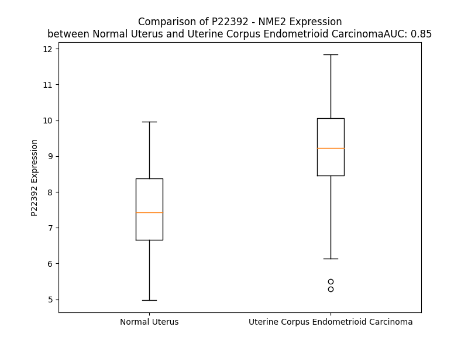

# Detailed Data for P22392

## Introduction to the Detailed Summary

### How to Interpret the Results

- **Summary & Metrics**: This section provides a quick reference to essential protein attributes, including expression changes, family classification, and biomarker applications. Regulation status (upregulated/downregulated) indicates the protein's behavior in a disease context. Some information comes from the original excel file with the proteins selected from literature, while others are derived from the analyses.
- **Expression Comparison**: A visual representation comparing protein expression between normal and disease states. It highlights significant changes in expression levels that might indicate diagnostic or therapeutic relevance. This is data coming from transcriptomics experiments and could not translate similarly to protein levels.
- **Isoform Alignment**: An interactive view of isoform alignments, revealing structural and functional differences between variants of the protein.
- **Interactors & Homologs**: Tables listing known interaction partners and homologous proteins, the more interactors and homologs, the more complex the protein is to design an antibody for.
- **Biological Assemblies**: Information about the structural arrangement of the protein in different assemblies, providing insights into its functional state but also the complexity of the protein to develop antibodies.
- **Combined Per-Residue Information**: A detailed table summarizing residue-level data. This includes predictions for epitope regions, aggregation tendencies, and modifications that might impact the protein's function. Each row corresponds to a residue in the protein, providing insights into specific sites that may be important for research or drug development.
## Summary & Metrics

- **UniProt Accession**: P22392
- **Gene Name**: NME2
- **Protein Name**: Nucleoside diphosphate kinase B
- **Swiss Prot**: NDKB_HUMAN
- **Family**: kinase
- **Biomarker Application**: diagnosis
- **Number of Isoforms**: 2
- **Regulation**: 1
- **(transcriptomics) AUC**: 0.85
- **(transcriptomics) Fold Change**: 1.23
- **(transcriptomics) Regulation**: Upregulated
- **Discotope Epitope Count**: 50
- **Max n_uniprots (Homo)**: 6.0
- **Max n_uniprots (Hetero)**: N/A

## Expression Comparison

## Isoform Alignment

<pre style='font-size:14px; font-family:monospace;'>P22392-1 -------------------------------------------------------------------------------------------------------------------MANLERTFIAIKPDGVQRGLVGEIIKRFEQKGFRLVAMKFLRASEEHLKQHYIDLKDRPFFPGLVKYMNSGPVVAMVWEGLNVVKTGRVMLGETNPADSKPGTIRGDFCIQVGRNIIHGSDSVKSAEKEISLWFKPEELVDYKSCAHDWVYE
P22392-2 MANCERTFIAIKPDGVQRGLVGEIIKRFEQKGFRLVGLKFMQASEDLLKEHYVDLKDRPFFAGLVKYMHSGPVVAMVWEGLNVVKTGRVMLGETNPADSKPGTIRGDFCIQVGRTMANLERTFIAIKPDGVQRGLVGEIIKRFEQKGFRLVAMKFLRASEEHLKQHYIDLKDRPFFPGLVKYMNSGPVVAMVWEGLNVVKTGRVMLGETNPADSKPGTIRGDFCIQVGRNIIHGSDSVKSAEKEISLWFKPEELVDYKSCAHDWVYE
</pre>

## Interactors

| preferredName_A   | preferredName_B   |   score |
|:------------------|:------------------|--------:|
| NME2              | NME1-NME2         |   0.997 |
| NME2              | NME1              |   0.995 |
| NME2              | NME3              |   0.967 |
| NME2              | DTYMK             |   0.958 |
| NME2              | ITPA              |   0.955 |
| NME2              | CTPS1             |   0.951 |
| NME2              | GUK1              |   0.946 |
| NME2              | NTPCR             |   0.946 |
| NME2              | HDDC3             |   0.946 |
| NME2              | NME4              |   0.942 |
| NME2              | AK9               |   0.938 |
| NME2              | DUT               |   0.937 |
| NME2              | CMPK2             |   0.936 |
| NME2              | CTPS2             |   0.936 |
| NME2              | AK3               |   0.935 |
| NME2              | NME6              |   0.934 |
| NME2              | KCNN4             |   0.931 |
| NME2              | ENPP3             |   0.928 |
| NME2              | ENPP1             |   0.927 |
| NME2              | PKM               |   0.925 |
| NME2              | NME7              |   0.918 |
| NME2              | NUDT2             |   0.914 |
| NME2              | DCTPP1            |   0.914 |
| NME2              | NUDT16            |   0.909 |
| NME2              | PKLR              |   0.908 |
| NME2              | ENTPD2            |   0.905 |

## Homologs

| uniprot_id   | gene_id   |
|:-------------|:----------|
| F8WDB2       | NME9      |
| E5RHP0       | NME1      |
| A0A087WVT9   | NME4      |
| P56597       | NME5      |
| A0A2R8Y547   | NME6      |
| B4DXC8       | NME7      |
| H3BMQ7       | NME3      |
| C9JIT0       | NME8      |

## Biological Assemblies

|   Unnamed: 0 |   assembly |   n_uniprots | composition   | crystal_id   |
|-------------:|-----------:|-------------:|:--------------|:-------------|
|            0 |          1 |            6 | Homo          | 3bbb         |
|            0 |          1 |            6 | Homo          | 8pyw         |
|            0 |          1 |            6 | Homo          | 3bbf         |
|            0 |          1 |            6 | Homo          | 7kpf         |
|            0 |          1 |            6 | Homo          | 1nue         |
|            0 |          1 |            6 | Homo          | 3bbc         |

## Combined Per-Residue Information

|   res | aa   |   epitope_score | epitope   |   relative_surface_accessibility |   modeling_confidence |   Aggregation | modification   |
|------:|:-----|----------------:|:----------|---------------------------------:|----------------------:|--------------:|:---------------|
|     1 | M    |         0.28221 | False     |                          1.13144 |                 64.62 |         0     | N/A            |
|     2 | A    |         0.21307 | False     |                          0.66306 |                 84.38 |         0     | N/A            |
|     3 | N    |         0.25513 | False     |                          0.23913 |                 91.89 |         0     | N/A            |
|     4 | L    |         0.30931 | False     |                          0.6384  |                 96.68 |         0     | N/A            |
|     5 | E    |         0.21615 | False     |                          0.21343 |                 98.5  |         0     | N/A            |
|     6 | R    |         0.18866 | False     |                          0.29355 |                 98.71 |         0     | N/A            |
|     7 | T    |         0.01326 | False     |                          0.00507 |                 98.89 |        31.286 | N/A            |
|     8 | F    |         0.00435 | False     |                          0       |                 98.88 |        31.286 | N/A            |
|     9 | I    |         0.01111 | False     |                          0.0056  |                 98.9  |        31.286 | N/A            |
|    10 | A    |         0.05434 | False     |                          0.01148 |                 98.84 |        31.286 | N/A            |
|    11 | I    |         0.00543 | False     |                          0       |                 98.87 |        31.286 | N/A            |
|    12 | K    |         0.16614 | False     |                          0.09234 |                 98.78 |         0     | N/A            |
|    13 | P    |         0.05409 | False     |                          0.03563 |                 98.8  |         0     | N/A            |
|    14 | D    |         0.13975 | False     |                          0.08785 |                 98.8  |         0     | N/A            |
|    15 | G    |         0.00609 | False     |                          0       |                 98.86 |         0     | N/A            |
|    16 | V    |         0.156   | False     |                          0.2023  |                 98.76 |         0     | N/A            |
|    17 | Q    |         0.47227 | True      |                          0.72516 |                 98.71 |         0     | N/A            |
|    18 | R    |         0.59725 | True      |                          0.50277 |                 98.84 |         0     | N/A            |
|    19 | G    |         0.46864 | True      |                          0.75611 |                 98.67 |         0     | N/A            |
|    20 | L    |         0.26672 | False     |                          0.11623 |                 98.89 |         0     | N/A            |
|    21 | V    |         0.22304 | False     |                          0.28834 |                 98.91 |         0     | N/A            |
|    22 | G    |         0.41097 | True      |                          0.57353 |                 98.8  |         0     | N/A            |
|    23 | E    |         0.39979 | True      |                          0.30205 |                 98.86 |         0     | N/A            |
|    24 | I    |         0.00899 | False     |                          0       |                 98.89 |         0     | N/A            |
|    25 | I    |         0.34336 | False     |                          0.14479 |                 98.9  |         0     | N/A            |
|    26 | K    |         0.5341  | True      |                          0.52733 |                 98.9  |         0     | N/A            |
|    27 | R    |         0.34105 | False     |                          0.13873 |                 98.89 |         0     | N/A            |
|    28 | F    |         0.00492 | False     |                          0       |                 98.89 |         0     | N/A            |
|    29 | E    |         0.40021 | True      |                          0.53066 |                 98.87 |         0     | N/A            |
|    30 | Q    |         0.48011 | True      |                          0.6312  |                 98.65 |         0     | N/A            |
|    31 | K    |         0.43227 | True      |                          0.56395 |                 98.57 |         0     | N/A            |
|    32 | G    |         0.22318 | False     |                          0.31053 |                 98.6  |         0     | N/A            |
|    33 | F    |         0.20952 | False     |                          0.09771 |                 98.75 |         0     | N/A            |
|    34 | R    |         0.21322 | False     |                          0.11477 |                 98.7  |         0     | N/A            |
|    35 | L    |         0.25142 | False     |                          0.28572 |                 98.88 |         0     | N/A            |
|    36 | V    |         0.0322  | False     |                          0.01636 |                 98.87 |         0     | N/A            |
|    37 | A    |         0.04563 | False     |                          0.05357 |                 98.87 |         0     | N/A            |
|    38 | M    |         0.39794 | True      |                          0.53184 |                 98.86 |         0     | N/A            |
|    39 | K    |         0.20035 | False     |                          0.2686  |                 98.73 |         0     | N/A            |
|    40 | F    |         0.4004  | True      |                          0.64965 |                 98.86 |         0     | N/A            |
|    41 | L    |         0.33703 | False     |                          0.30336 |                 98.65 |         0     | N/A            |
|    42 | R    |         0.29616 | False     |                          0.63658 |                 98.05 |         0     | N/A            |
|    43 | A    |         0.07673 | False     |                          0.01847 |                 97.26 |         0     | N/A            |
|    44 | S    |         0.25784 | False     |                          0.48707 |                 97.76 |         0     | N/A            |
|    45 | E    |         0.32212 | False     |                          0.43622 |                 97.13 |         0     | N/A            |
|    46 | E    |         0.41432 | True      |                          0.52599 |                 97.63 |         0     | N/A            |
|    47 | H    |         0.29054 | False     |                          0.23809 |                 97.92 |         0     | N/A            |
|    48 | L    |         0.01529 | False     |                          0       |                 97.96 |         0     | N/A            |
|    49 | K    |         0.41245 | True      |                          0.39736 |                 97.7  |         0     | N/A            |
|    50 | Q    |         0.4627  | True      |                          0.40536 |                 97.7  |         0     | N/A            |
|    51 | H    |         0.33871 | False     |                          0.0895  |                 97.1  |         0     | N/A            |
|    52 | Y    |         0.41473 | True      |                          0.08348 |                 94.71 |         0     | N/A            |
|    53 | I    |         0.40701 | True      |                          0.35901 |                 95.08 |         0     | N/A            |
|    54 | D    |         0.66594 | True      |                          0.72532 |                 92.06 |         0     | N/A            |
|    55 | L    |         0.67447 | True      |                          0.34458 |                 92.66 |         0     | N/A            |
|    56 | K    |         0.6041  | True      |                          0.56694 |                 95.25 |         0     | N/A            |
|    57 | D    |         0.54291 | True      |                          0.76636 |                 96.35 |         0     | N/A            |
|    58 | R    |         0.63416 | True      |                          0.55094 |                 94.26 |         0     | N/A            |
|    59 | P    |         0.55772 | True      |                          0.9354  |                 95.19 |         0     | N/A            |
|    60 | F    |         0.67351 | True      |                          0.57597 |                 92.08 |         0     | N/A            |
|    61 | F    |         0.36968 | False     |                          0.11338 |                 95.18 |         0     | N/A            |
|    62 | P    |         0.5323  | True      |                          0.68183 |                 96.1  |         0     | N/A            |
|    63 | G    |         0.57058 | True      |                          0.51359 |                 95.86 |         0     | N/A            |
|    64 | L    |         0.54591 | True      |                          0.18126 |                 95.12 |         0     | N/A            |
|    65 | V    |         0.143   | False     |                          0.03903 |                 97.24 |         0     | N/A            |
|    66 | K    |         0.48686 | True      |                          0.76275 |                 97.11 |         0     | N/A            |
|    67 | Y    |         0.44411 | True      |                          0.11882 |                 97.7  |         0     | N/A            |
|    68 | M    |         0.05216 | False     |                          0.00647 |                 98.03 |         0     | N/A            |
|    69 | N    |         0.37448 | False     |                          0.18748 |                 97.53 |         0     | N/A            |
|    70 | S    |         0.34721 | False     |                          0.59308 |                 97.89 |         0     | N/A            |
|    71 | G    |         0.14065 | False     |                          0.07403 |                 98.32 |         0     | N/A            |
|    72 | P    |         0.48072 | True      |                          0.27834 |                 98.72 |         0.756 | N/A            |
|    73 | V    |         0.00458 | False     |                          0       |                 98.84 |        63.486 | N/A            |
|    74 | V    |         0.09657 | False     |                          0.03999 |                 98.91 |        67.776 | N/A            |
|    75 | A    |         0.00435 | False     |                          0       |                 98.89 |        67.776 | N/A            |
|    76 | M    |         0.01677 | False     |                          0       |                 98.94 |        67.776 | N/A            |
|    77 | V    |         0.00331 | False     |                          0       |                 98.94 |        67.776 | N/A            |
|    78 | W    |         0.00611 | False     |                          0.00166 |                 98.94 |        55.615 | N/A            |
|    79 | E    |         0.091   | False     |                          0.02827 |                 98.85 |         1.185 | N/A            |
|    80 | G    |         0.03739 | False     |                          0.01449 |                 98.57 |         1.356 | N/A            |
|    81 | L    |         0.36719 | False     |                          0.46433 |                 98.42 |         1.356 | N/A            |
|    82 | N    |         0.34172 | False     |                          0.47773 |                 98.38 |         1.356 | N/A            |
|    83 | V    |         0.00474 | False     |                          0       |                 98.8  |         1.356 | N/A            |
|    84 | V    |         0.05277 | False     |                          0.04922 |                 98.69 |         1.356 | N/A            |
|    85 | K    |         0.53833 | True      |                          0.74853 |                 98.48 |         1.185 | N/A            |
|    86 | T    |         0.31196 | False     |                          0.25565 |                 98.72 |         0.198 | N/A            |
|    87 | G    |         0.01172 | False     |                          0.00322 |                 98.75 |         0     | N/A            |
|    88 | R    |         0.35255 | False     |                          0.29131 |                 98.73 |         0     | N/A            |
|    89 | V    |         0.48037 | True      |                          0.71802 |                 98.75 |         0     | N/A            |
|    90 | M    |         0.23401 | False     |                          0.16102 |                 98.88 |         0     | N/A            |
|    91 | L    |         0.01721 | False     |                          0.00082 |                 98.84 |         0     | N/A            |
|    92 | G    |         0.09233 | False     |                          0.10714 |                 98.75 |         0     | N/A            |
|    93 | E    |         0.41112 | True      |                          0.49709 |                 98.58 |         0     | N/A            |
|    94 | T    |         0.56686 | True      |                          0.48724 |                 97.17 |         0     | N/A            |
|    95 | N    |         0.47617 | True      |                          0.34816 |                 98.08 |         0     | N/A            |
|    96 | P    |         0.09337 | False     |                          0.05027 |                 98.52 |         0     | N/A            |
|    97 | A    |         0.42633 | True      |                          0.8022  |                 98.21 |         0     | N/A            |
|    98 | D    |         0.52364 | True      |                          0.48112 |                 98.68 |         0     | N/A            |
|    99 | S    |         0.16606 | False     |                          0.08533 |                 98.6  |         0     | N/A            |
|   100 | K    |         0.31716 | False     |                          0.71197 |                 98.72 |         0     | N/A            |
|   101 | P    |         0.26348 | False     |                          0.90294 |                 98.73 |         0     | N/A            |
|   102 | G    |         0.2159  | False     |                          0.68097 |                 98.49 |         0     | N/A            |
|   103 | T    |         0.21984 | False     |                          0.1371  |                 98.88 |         0     | N/A            |
|   104 | I    |         0.0072  | False     |                          0       |                 98.91 |         0     | N/A            |
|   105 | R    |         0.07231 | False     |                          0.01873 |                 98.86 |         0     | N/A            |
|   106 | G    |         0.20685 | False     |                          0.33822 |                 98.72 |         0     | N/A            |
|   107 | D    |         0.43364 | True      |                          0.3719  |                 98.85 |         0     | N/A            |
|   108 | F    |         0.42029 | True      |                          0.2289  |                 98.82 |         2.269 | N/A            |
|   109 | C    |         0.18485 | False     |                          0.11596 |                 98.46 |         2.269 | N/A            |
|   110 | I    |         0.42247 | True      |                          0.95288 |                 98.65 |         2.269 | N/A            |
|   111 | Q    |         0.60656 | True      |                          0.61415 |                 97.6  |         2.269 | N/A            |
|   112 | V    |         0.6257  | True      |                          0.57345 |                 96.57 |         2.269 | N/A            |
|   113 | G    |         0.60024 | True      |                          0.43378 |                 95.53 |         0.187 | N/A            |
|   114 | R    |         0.37444 | False     |                          0.50497 |                 98.09 |         0     | N/A            |
|   115 | N    |         0.08311 | False     |                          0.02252 |                 98.34 |         0     | N/A            |
|   116 | I    |         0.00507 | False     |                          0       |                 98.56 |         0     | N/A            |
|   117 | I    |         0.00899 | False     |                          0       |                 98.84 |         0     | N/A            |
|   118 | H    |         0.26687 | False     |                          0.17652 |                 98.55 |         0     | N/A            |
|   119 | G    |         0.06215 | False     |                          0.01454 |                 98.53 |         0     | N/A            |
|   120 | S    |         0.02691 | False     |                          0.00411 |                 98.41 |         0     | N/A            |
|   121 | D    |         0.60545 | True      |                          0.64282 |                 97.24 |         0     | N/A            |
|   122 | S    |         0.41855 | True      |                          0.35057 |                 97.84 |         0     | N/A            |
|   123 | V    |         0.26509 | False     |                          0.50096 |                 98.17 |         0     | N/A            |
|   124 | K    |         0.45305 | True      |                          0.82939 |                 97.96 |         0     | N/A            |
|   125 | S    |         0.45211 | True      |                          0.23647 |                 97.54 |         0     | N/A            |
|   126 | A    |         0.0067  | False     |                          0.00128 |                 98.41 |         0     | N/A            |
|   127 | E    |         0.41118 | True      |                          0.55809 |                 98.15 |         0     | N/A            |
|   128 | K    |         0.39609 | True      |                          0.46808 |                 98.08 |         0.134 | N/A            |
|   129 | E    |         0.21958 | False     |                          0.09351 |                 98.63 |         0.134 | N/A            |
|   130 | I    |         0.16447 | False     |                          0.092   |                 98.72 |        19.743 | N/A            |
|   131 | S    |         0.33324 | False     |                          0.67465 |                 98.38 |        19.743 | N/A            |
|   132 | L    |         0.36999 | False     |                          0.34735 |                 98.48 |        19.743 | N/A            |
|   133 | W    |         0.08134 | False     |                          0.03081 |                 98.65 |        19.743 | N/A            |
|   134 | F    |         0.09407 | False     |                          0.04534 |                 98.71 |        19.743 | N/A            |
|   135 | K    |         0.22949 | False     |                          0.63094 |                 98.46 |         0     | N/A            |
|   136 | P    |         0.2848  | False     |                          0.81296 |                 98.33 |         0     | N/A            |
|   137 | E    |         0.32954 | False     |                          0.67502 |                 98.31 |         0     | N/A            |
|   138 | E    |         0.3264  | False     |                          0.30549 |                 98.71 |         0     | N/A            |
|   139 | L    |         0.22539 | False     |                          0.27679 |                 98.73 |         0     | N/A            |
|   140 | V    |         0.31625 | False     |                          0.63934 |                 98.71 |         0     | N/A            |
|   141 | D    |         0.39787 | True      |                          0.70788 |                 97.72 |         0     | N/A            |
|   142 | Y    |         0.37529 | False     |                          0.4667  |                 98.17 |         0     | N/A            |
|   143 | K    |         0.37565 | False     |                          0.7297  |                 96.85 |         0     | N/A            |
|   144 | S    |         0.346   | False     |                          0.28094 |                 98.09 |         0     | N/A            |
|   145 | C    |         0.29728 | False     |                          0.98916 |                 98.37 |         0     | N/A            |
|   146 | A    |         0.20801 | False     |                          0.38625 |                 98.3  |         0     | N/A            |
|   147 | H    |         0.28957 | False     |                          0.34306 |                 97.46 |         0     | N/A            |
|   148 | D    |         0.20415 | False     |                          0.61308 |                 97.3  |         0     | N/A            |
|   149 | W    |         0.39539 | True      |                          0.99785 |                 98.13 |         0     | N/A            |
|   150 | V    |         0.23904 | False     |                          0.47629 |                 97.67 |         0     | N/A            |
|   151 | Y    |         0.2397  | False     |                          0.18063 |                 96.49 |         0     | N/A            |
|   152 | E    |         0.17318 | False     |                          1.21621 |                 92.85 |         0     | N/A            |

