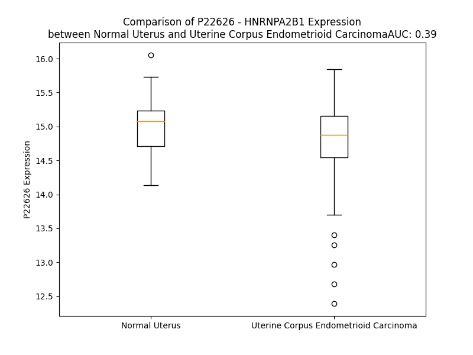

# Detailed Data for P22626

## Introduction to the Detailed Summary

### How to Interpret the Results

- **Summary & Metrics**: This section provides a quick reference to essential protein attributes, including expression changes, family classification, and biomarker applications. Regulation status (upregulated/downregulated) indicates the protein's behavior in a disease context. Some information comes from the original excel file with the proteins selected from literature, while others are derived from the analyses.
- **Expression Comparison**: A visual representation comparing protein expression between normal and disease states. It highlights significant changes in expression levels that might indicate diagnostic or therapeutic relevance. This is data coming from transcriptomics experiments and could not translate similarly to protein levels.
- **Isoform Alignment**: An interactive view of isoform alignments, revealing structural and functional differences between variants of the protein.
- **Interactors & Homologs**: Tables listing known interaction partners and homologous proteins, the more interactors and homologs, the more complex the protein is to design an antibody for.
- **Biological Assemblies**: Information about the structural arrangement of the protein in different assemblies, providing insights into its functional state but also the complexity of the protein to develop antibodies.
- **Combined Per-Residue Information**: A detailed table summarizing residue-level data. This includes predictions for epitope regions, aggregation tendencies, and modifications that might impact the protein's function. Each row corresponds to a residue in the protein, providing insights into specific sites that may be important for research or drug development.
## Summary & Metrics

- **UniProt Accession**: P22626
- **Gene Name**: HNRNPA2B1
- **Protein Name**: heterogenous nuclear ribonucleoprotein A2/B1
- **Swiss Prot**: ROA2_HUMAN
- **Family**: other
- **Biomarker Application**:  
- **Number of Isoforms**: 2
- **Regulation**: 1
- **(transcriptomics) AUC**: 0.38
- **(transcriptomics) Fold Change**: 1.01
- **(transcriptomics) Regulation**: Downregulated
- **Discotope Epitope Count**: 61
- **Max n_uniprots (Homo)**: 11
- **Max n_uniprots (Hetero)**: N/A

## Expression Comparison

## Isoform Alignment

<pre style='font-size:14px; font-family:monospace;'>P22626-1 MEKTLETVPLERKKREKEQFRKLFIGGLSFETTEESLRNYYEQWGKLTDCVVMRDPASKRSRGFGFVTFSSMAEVDAAMAARPHSIDGRVVEPKRAVAREESGKPGAHVTVKKLFVGGIKEDTEEHHLRDYFEEYGKIDTIEIITDRQSGKKRGFGFVTFDDHDPVDKIVLQKYHTINGHNAEVRKALSRQEMQEVQSSRSGRGGNFGFGDSRGGGGNFGPGPGSNFRGGSDGYGSGRGFGDGYNGYGGGPGGGNFGGSPGYGGGRGGYGGGGPGYGNQGGGYGGGYDNYGGGNYGSGNYNDFGNYNQQPSNYGPMKSGNFGGSRNMGGPYGGGNYGPGGSGGSGGYGGRSRY
P22626-2 ------------MEREKEQFRKLFIGGLSFETTEESLRNYYEQWGKLTDCVVMRDPASKRSRGFGFVTFSSMAEVDAAMAARPHSIDGRVVEPKRAVAREESGKPGAHVTVKKLFVGGIKEDTEEHHLRDYFEEYGKIDTIEIITDRQSGKKRGFGFVTFDDHDPVDKIVLQKYHTINGHNAEVRKALSRQEMQEVQSSRSGRGGNFGFGDSRGGGGNFGPGPGSNFRGGSDGYGSGRGFGDGYNGYGGGPGGGNFGGSPGYGGGRGGYGGGGPGYGNQGGGYGGGYDNYGGGNYGSGNYNDFGNYNQQPSNYGPMKSGNFGGSRNMGGPYGGGNYGPGGSGGSGGYGGRSRY
</pre>

## Interactors

| preferredName_A   | preferredName_B   |   score |
|:------------------|:------------------|--------:|
| HNRNPA2B1         | HNRNPC            |   0.999 |
| HNRNPA2B1         | HNRNPL            |   0.999 |
| HNRNPA2B1         | TARDBP            |   0.998 |
| HNRNPA2B1         | HNRNPA1           |   0.998 |
| HNRNPA2B1         | ILF3              |   0.994 |
| HNRNPA2B1         | PTBP1             |   0.993 |
| HNRNPA2B1         | DGCR8             |   0.991 |
| HNRNPA2B1         | HNRNPH1           |   0.991 |
| HNRNPA2B1         | FUS               |   0.99  |
| HNRNPA2B1         | HNRNPM            |   0.987 |
| HNRNPA2B1         | HNRNPF            |   0.985 |
| HNRNPA2B1         | HNRNPK            |   0.983 |
| HNRNPA2B1         | HNRNPU            |   0.979 |
| HNRNPA2B1         | SRSF3             |   0.976 |
| HNRNPA2B1         | SRSF1             |   0.972 |
| HNRNPA2B1         | HNRNPH3           |   0.968 |
| HNRNPA2B1         | HNRNPA3           |   0.968 |
| HNRNPA2B1         | PCBP1             |   0.961 |
| HNRNPA2B1         | RBMX              |   0.96  |
| HNRNPA2B1         | SRSF2             |   0.954 |
| HNRNPA2B1         | TRA2B             |   0.953 |
| HNRNPA2B1         | SRSF7             |   0.947 |
| HNRNPA2B1         | HNRNPD            |   0.947 |
| HNRNPA2B1         | SLC25A15          |   0.942 |
| HNRNPA2B1         | MATR3-2           |   0.941 |
| HNRNPA2B1         | SFPQ              |   0.939 |
| HNRNPA2B1         | IGF2BP1           |   0.938 |
| HNRNPA2B1         | YTHDC1            |   0.935 |
| HNRNPA2B1         | ELAVL1            |   0.934 |
| HNRNPA2B1         | DHX9              |   0.932 |
| HNRNPA2B1         | IGF2BP3           |   0.925 |
| HNRNPA2B1         | YTHDF1            |   0.925 |
| HNRNPA2B1         | HNRNPR            |   0.923 |
| HNRNPA2B1         | HNRNPAB           |   0.915 |
| HNRNPA2B1         | SYNCRIP           |   0.913 |
| HNRNPA2B1         | NCL               |   0.913 |
| HNRNPA2B1         | NONO              |   0.913 |
| HNRNPA2B1         | HNRNPDL           |   0.909 |
| HNRNPA2B1         | YBX1              |   0.905 |
| HNRNPA2B1         | KHDRBS1           |   0.904 |
| HNRNPA2B1         | MBNL1             |   0.901 |

## Homologs

| uniprot_id   | gene_id   |
|:-------------|:----------|
| A0A7I2V5D8   | HNRNPA3   |
| E9PLB0       | RBM4B     |
| D6R9K7       | RBM4      |
| Q8TBY0       | RBM46     |
| F8WE16       | TIA1      |
| Q9NQ94       | A1CF      |
| F2Z2U1       | RBMY1B    |
| Q15415       | RBMY1F    |
| F2Z2U1       | RBMY1B    |
| F2Z2U1       | RBMY1B    |
| F2Z2U1       | RBMY1B    |
| Q15415       | RBMY1F    |
| Q9Y4C8       | RBM19     |
| D6RCT1       | RBM47     |
| O75526       | RBMXL2    |
| Q8N7X1       | RBMXL3    |
| A0A0S2Z569   | DAZAP1    |
| A0A1B0GUK8   | RBMXL1    |
| H3BT71       | RBMX      |
| Q9NX07       | TRNAU1AP  |
| Q9H5V0       | RBM3      |
| K7ER40       | CIRBP     |
| A0A2R8Y4L2   | HNRNPA1L3 |
| A0A7I2V2Z4   | HNRNPA1   |
| Q32P51       | HNRNPA1L2 |
| D6R9P3       | HNRNPAB   |
| Q8IYX4       | DND1      |
| B4DM51       | MSI2      |
| O43347       | MSI1      |
| Q13151       | HNRNPA0   |
| A0A7I2V699   | NCL       |
| D6RBP9       | HNRNPD    |
| G3XAP0       | RBM23     |
| Q01085       | TIAL1     |
| A0A087WUK2   | HNRNPDL   |
| A0A087X122   | RBM39     |

## Biological Assemblies

|   Unnamed: 0 |   assembly |   n_uniprots | composition   | crystal_id   |
|-------------:|-----------:|-------------:|:--------------|:-------------|
|            0 |          1 |            2 | Homo          | 5ho4         |
|            0 |          1 |           10 | Homo          | 8du2         |
|            0 |          1 |            5 | Homo          | 6wqk         |
|            0 |          1 |            2 | Homo          | 5wwg         |
|            0 |          1 |            1 | Homo          | 6wpq         |
|            0 |          1 |           10 | Homo          | 8duw         |
|            0 |          1 |            2 | Homo          | 5wwf         |
|            1 |          2 |            2 | Homo          | 5wwf         |
|            0 |          1 |            2 | Homo          | 5en1         |
|            0 |          1 |            1 | Homo          | 1x4b         |
|            0 |          1 |            2 | Homo          | 5wwe         |
|            0 |          1 |            4 | Homo          | 7wm3         |
|            1 |          2 |            4 | Homo          | 7wm3         |
|            0 |          1 |           11 | Homo          | 8ec7         |
|            0 |          1 |            4 | Homo          | 8hni         |
|            1 |          2 |            4 | Homo          | 8hni         |
|            2 |          3 |            4 | Homo          | 8hni         |
|            3 |          4 |            4 | Homo          | 8hni         |
|            4 |          5 |            4 | Homo          | 8hni         |
|            5 |          6 |            4 | Homo          | 8hni         |

## Combined Per-Residue Information

|   res | aa   |   epitope_score | epitope   |   relative_surface_accessibility |   modeling_confidence |   Aggregation | modification                           |
|------:|:-----|----------------:|:----------|---------------------------------:|----------------------:|--------------:|:---------------------------------------|
|     1 | M    |         0.09446 | False     |                          1.31746 |                 51.36 |         0     | N-acetylmethionine                     |
|     2 | E    |         0.12181 | False     |                          0.90429 |                 50.1  |         0     | N/A                                    |
|     3 | K    |         0.19615 | False     |                          0.95559 |                 53.74 |         0     | N/A                                    |
|     4 | T    |         0.14119 | False     |                          0.86801 |                 51.39 |         0     | Phosphothreonine                       |
|     5 | L    |         0.13259 | False     |                          1.03177 |                 55.79 |         0     | N/A                                    |
|     6 | E    |         0.10986 | False     |                          0.81275 |                 50.11 |         0     | N/A                                    |
|     7 | T    |         0.15778 | False     |                          0.88043 |                 50.62 |         0     | N/A                                    |
|     8 | V    |         0.11513 | False     |                          0.89965 |                 57.55 |         0     | N/A                                    |
|     9 | P    |         0.13423 | False     |                          0.87246 |                 48.56 |         0     | N/A                                    |
|    10 | L    |         0.12723 | False     |                          1.07804 |                 52.15 |         0     | N/A                                    |
|    11 | E    |         0.1223  | False     |                          0.80054 |                 47.07 |         0     | N/A                                    |
|    12 | R    |         0.22064 | True      |                          0.94766 |                 47.47 |         0     | N/A                                    |
|    13 | K    |         0.15397 | False     |                          0.87386 |                 52.7  |         0     | N/A                                    |
|    14 | K    |         0.19657 | False     |                          0.96652 |                 59.36 |         0     | N/A                                    |
|    15 | R    |         0.21754 | True      |                          0.90351 |                 69.01 |         0     | N/A                                    |
|    16 | E    |         0.11766 | False     |                          0.37792 |                 81.81 |         0     | N/A                                    |
|    17 | K    |         0.17671 | False     |                          0.76033 |                 89.04 |         0     | N/A                                    |
|    18 | E    |         0.11508 | False     |                          0.48201 |                 90.86 |         0     | N/A                                    |
|    19 | Q    |         0.08776 | False     |                          0.23739 |                 90.99 |         0     | N/A                                    |
|    20 | F    |         0.06253 | False     |                          0.22375 |                 92.95 |         0     | N/A                                    |
|    21 | R    |         0.05995 | False     |                          0.12666 |                 95.51 |         0     | N/A                                    |
|    22 | K    |         0.04964 | False     |                          0.15178 |                 96.96 |         0     | N/A                                    |
|    23 | L    |         0.00287 | False     |                          0       |                 97.6  |         3.325 | N/A                                    |
|    24 | F    |         0.04872 | False     |                          0.2504  |                 97.27 |         4.87  | N/A                                    |
|    25 | I    |         0.00302 | False     |                          0       |                 97.52 |         4.87  | N/A                                    |
|    26 | G    |         0.04536 | False     |                          0.07886 |                 96.56 |         4.87  | N/A                                    |
|    27 | G    |         0.04208 | False     |                          0.33727 |                 95.89 |         4.87  | N/A                                    |
|    28 | L    |         0.00732 | False     |                          0.00427 |                 97.09 |         4.87  | N/A                                    |
|    29 | S    |         0.07591 | False     |                          0.11614 |                 95.92 |         4.479 | Phosphoserine                          |
|    30 | F    |         0.23116 | True      |                          0.62256 |                 94.94 |         4.238 | N/A                                    |
|    31 | E    |         0.18032 | False     |                          0.74326 |                 94.13 |         0     | N/A                                    |
|    32 | T    |         0.01002 | False     |                          0.00381 |                 95.66 |         0     | N/A                                    |
|    33 | T    |         0.15421 | False     |                          0.44369 |                 95.97 |         0     | N/A                                    |
|    34 | E    |         0.19423 | False     |                          0.40203 |                 96.41 |         0     | N/A                                    |
|    35 | E    |         0.22459 | True      |                          0.62696 |                 96.48 |         0     | N/A                                    |
|    36 | S    |         0.13375 | False     |                          0.23969 |                 96.46 |         0     | N/A                                    |
|    37 | L    |         0.00293 | False     |                          0       |                 97.32 |         0     | N/A                                    |
|    38 | R    |         0.16191 | False     |                          0.30783 |                 97.7  |         0     | Omega-N-methylarginine                 |
|    39 | N    |         0.19898 | False     |                          0.60792 |                 96.98 |         0     | N/A                                    |
|    40 | Y    |         0.1584  | False     |                          0.24159 |                 97.61 |         0     | N/A                                    |
|    41 | Y    |         0.00322 | False     |                          0       |                 97.64 |         0     | N/A                                    |
|    42 | E    |         0.22262 | True      |                          0.37353 |                 97.03 |         0     | N/A                                    |
|    43 | Q    |         0.34689 | True      |                          0.60634 |                 97.27 |         0     | N/A                                    |
|    44 | W    |         0.18703 | False     |                          0.20219 |                 97.68 |         0     | N/A                                    |
|    45 | G    |         0.04924 | False     |                          0.19693 |                 96.13 |         0     | N/A                                    |
|    46 | K    |         0.13245 | False     |                          0.73078 |                 96.76 |         0     | N/A                                    |
|    47 | L    |         0.06519 | False     |                          0.04936 |                 97.04 |         0     | N/A                                    |
|    48 | T    |         0.11905 | False     |                          0.54904 |                 96.64 |         0     | N/A                                    |
|    49 | D    |         0.10526 | False     |                          0.32681 |                 96.54 |         0     | N/A                                    |
|    50 | C    |         0.13561 | False     |                          0.11934 |                 97.17 |         0     | N/A                                    |
|    51 | V    |         0.10412 | False     |                          0.33418 |                 96.98 |         0     | N/A                                    |
|    52 | V    |         0.02266 | False     |                          0.02674 |                 97.34 |         0     | N/A                                    |
|    53 | M    |         0.12528 | False     |                          0.31621 |                 96.48 |         0     | N/A                                    |
|    54 | R    |         0.22648 | True      |                          0.34149 |                 96.3  |         0     | N/A                                    |
|    55 | D    |         0.21336 | True      |                          0.30866 |                 93.09 |         0     | N/A                                    |
|    56 | P    |         0.26993 | True      |                          0.80889 |                 93.39 |         0     | N/A                                    |
|    57 | A    |         0.24054 | True      |                          0.88783 |                 94.44 |         0     | N/A                                    |
|    58 | S    |         0.21918 | True      |                          0.59309 |                 93.86 |         0     | N/A                                    |
|    59 | K    |         0.17652 | False     |                          0.65251 |                 91.75 |         0     | N/A                                    |
|    60 | R    |         0.31757 | True      |                          0.68368 |                 92.16 |         0     | N/A                                    |
|    61 | S    |         0.05581 | False     |                          0.03254 |                 94.47 |         0     | N/A                                    |
|    62 | R    |         0.31338 | True      |                          0.52596 |                 95.17 |         0     | N/A                                    |
|    63 | G    |         0.10279 | False     |                          0.15136 |                 95.47 |         2.374 | N/A                                    |
|    64 | F    |         0.08791 | False     |                          0.22157 |                 96.64 |        26.742 | N/A                                    |
|    65 | G    |         0.00453 | False     |                          0       |                 97.08 |        30.927 | N/A                                    |
|    66 | F    |         0.07185 | False     |                          0.20956 |                 97.84 |        37.176 | N/A                                    |
|    67 | V    |         0.00512 | False     |                          0       |                 97.94 |        37.176 | N/A                                    |
|    68 | T    |         0.00803 | False     |                          0.00952 |                 97.76 |        36.968 | N/A                                    |
|    69 | F    |         0.00378 | False     |                          0       |                 98.01 |        35.474 | N/A                                    |
|    70 | S    |         0.09461 | False     |                          0.39346 |                 95.89 |        13.568 | N/A                                    |
|    71 | S    |         0.08074 | False     |                          0.24798 |                 95.2  |         5.723 | N/A                                    |
|    72 | M    |         0.10402 | False     |                          0.27668 |                 94.64 |         4.834 | N/A                                    |
|    73 | A    |         0.12619 | False     |                          0.67083 |                 95.37 |         2.212 | N/A                                    |
|    74 | E    |         0.09793 | False     |                          0.15295 |                 97.19 |         0     | N/A                                    |
|    75 | V    |         0.00302 | False     |                          0.00286 |                 97.14 |         0     | N/A                                    |
|    76 | D    |         0.09634 | False     |                          0.25921 |                 96.16 |         0     | N/A                                    |
|    77 | A    |         0.08727 | False     |                          0.41596 |                 96.84 |         0     | N/A                                    |
|    78 | A    |         0.00197 | False     |                          0       |                 97.71 |         0     | N/A                                    |
|    79 | M    |         0.01112 | False     |                          0.00883 |                 96.87 |         0     | N/A                                    |
|    80 | A    |         0.11917 | False     |                          0.83327 |                 96.05 |         0     | N/A                                    |
|    81 | A    |         0.24143 | True      |                          0.42932 |                 96.95 |         0     | N/A                                    |
|    82 | R    |         0.14082 | False     |                          0.29175 |                 96.42 |         0     | N/A                                    |
|    83 | P    |         0.20881 | True      |                          0.86317 |                 96.7  |         0     | N/A                                    |
|    84 | H    |         0.02569 | False     |                          0.00997 |                 97.4  |         0     | N/A                                    |
|    85 | S    |         0.14162 | False     |                          0.43287 |                 96.94 |         0     | Phosphoserine                          |
|    86 | I    |         0.03941 | False     |                          0.028   |                 95.99 |         0     | N/A                                    |
|    87 | D    |         0.19868 | False     |                          0.41692 |                 94.5  |         0     | N/A                                    |
|    88 | G    |         0.17256 | False     |                          1.0074  |                 94.25 |         0     | N/A                                    |
|    89 | R    |         0.32131 | True      |                          0.45209 |                 95.95 |         0     | N/A                                    |
|    90 | V    |         0.14852 | False     |                          0.7384  |                 97.07 |         0     | N/A                                    |
|    91 | V    |         0.02273 | False     |                          0.03308 |                 97.39 |         0     | N/A                                    |
|    92 | E    |         0.10369 | False     |                          0.5076  |                 95.68 |         0     | N/A                                    |
|    93 | P    |         0.02916 | False     |                          0.03592 |                 97.08 |         0     | N/A                                    |
|    94 | K    |         0.04339 | False     |                          0.18446 |                 96.3  |         0     | N/A                                    |
|    95 | R    |         0.05695 | False     |                          0.03796 |                 95.48 |         0     | N/A                                    |
|    96 | A    |         0.01786 | False     |                          0.0188  |                 94.63 |         0     | N/A                                    |
|    97 | V    |         0.07483 | False     |                          0.21452 |                 91.01 |         0     | N/A                                    |
|    98 | A    |         0.07249 | False     |                          0.18386 |                 86.79 |         0     | N/A                                    |
|    99 | R    |         0.26711 | True      |                          0.89164 |                 84.37 |         0     | N/A                                    |
|   100 | E    |         0.26529 | True      |                          0.73727 |                 84.6  |         0     | N/A                                    |
|   101 | E    |         0.15839 | False     |                          0.24151 |                 82.86 |         0     | N/A                                    |
|   102 | S    |         0.11486 | False     |                          0.30781 |                 82.87 |         0     | N/A                                    |
|   103 | G    |         0.18602 | False     |                          0.88292 |                 80.98 |         0     | N/A                                    |
|   104 | K    |         0.11812 | False     |                          0.39881 |                 82.11 |         0     | N6,N6-dimethyllysine; alternate        |
|   105 | P    |         0.18902 | False     |                          0.47572 |                 79.86 |         0     | N/A                                    |
|   106 | G    |         0.06532 | False     |                          0.17827 |                 80.73 |         0     | N/A                                    |
|   107 | A    |         0.04107 | False     |                          0.15683 |                 84.86 |         0     | N/A                                    |
|   108 | H    |         0.18866 | False     |                          0.59996 |                 85.57 |         0     | N/A                                    |
|   109 | V    |         0.13804 | False     |                          0.41185 |                 89.71 |         0     | N/A                                    |
|   110 | T    |         0.10312 | False     |                          0.46959 |                 91.85 |         0     | N/A                                    |
|   111 | V    |         0.09709 | False     |                          0.17848 |                 94.21 |         0     | N/A                                    |
|   112 | K    |         0.1531  | False     |                          0.51535 |                 95.8  |         0     | N/A                                    |
|   113 | K    |         0.07843 | False     |                          0.32629 |                 96.45 |         0     | N/A                                    |
|   114 | L    |         0.00161 | False     |                          0       |                 96.54 |         1.558 | N/A                                    |
|   115 | F    |         0.04006 | False     |                          0.23707 |                 95.44 |         2.339 | N/A                                    |
|   116 | V    |         0.00185 | False     |                          0.00095 |                 96.1  |         2.339 | N/A                                    |
|   117 | G    |         0.07574 | False     |                          0.08513 |                 95.36 |         2.339 | N/A                                    |
|   118 | G    |         0.03973 | False     |                          0.56258 |                 92.41 |         2.339 | N/A                                    |
|   119 | I    |         0.03147 | False     |                          0.03718 |                 92.68 |         2.339 | N/A                                    |
|   120 | K    |         0.30969 | True      |                          0.5691  |                 89.94 |         0     | N/A                                    |
|   121 | E    |         0.27206 | True      |                          0.46598 |                 89.57 |         0     | N/A                                    |
|   122 | D    |         0.14208 | False     |                          0.43804 |                 91.91 |         0     | N/A                                    |
|   123 | T    |         0.00776 | False     |                          0.0007  |                 92.26 |         0     | N/A                                    |
|   124 | E    |         0.17392 | False     |                          0.40441 |                 93.16 |         0     | N/A                                    |
|   125 | E    |         0.21047 | True      |                          0.40714 |                 94.14 |         0     | N/A                                    |
|   126 | H    |         0.24463 | True      |                          0.49461 |                 95.34 |         0     | N/A                                    |
|   127 | H    |         0.17222 | False     |                          0.25669 |                 95.14 |         0     | N/A                                    |
|   128 | L    |         0.00318 | False     |                          0       |                 95.3  |         0     | N/A                                    |
|   129 | R    |         0.1737  | False     |                          0.33348 |                 96.15 |         0     | N/A                                    |
|   130 | D    |         0.17604 | False     |                          0.57156 |                 95.53 |         0     | N/A                                    |
|   131 | Y    |         0.19613 | False     |                          0.25033 |                 95.67 |         0     | N/A                                    |
|   132 | F    |         0.00259 | False     |                          0       |                 96.16 |         0     | N/A                                    |
|   133 | E    |         0.17906 | False     |                          0.52857 |                 95.41 |         0     | N/A                                    |
|   134 | E    |         0.21874 | True      |                          0.62305 |                 94.01 |         0     | N/A                                    |
|   135 | Y    |         0.1015  | False     |                          0.19875 |                 94.38 |         0     | N/A                                    |
|   136 | G    |         0.03693 | False     |                          0.27488 |                 94.07 |         0     | N/A                                    |
|   137 | K    |         0.10023 | False     |                          0.62251 |                 96.15 |         0     | N/A                                    |
|   138 | I    |         0.10651 | False     |                          0.1051  |                 97.2  |         0     | N/A                                    |
|   139 | D    |         0.10044 | False     |                          0.47022 |                 96.65 |         0     | N/A                                    |
|   140 | T    |         0.11133 | False     |                          0.55257 |                 95.95 |         0     | Phosphothreonine                       |
|   141 | I    |         0.17886 | False     |                          0.14587 |                 96.05 |         0     | N/A                                    |
|   142 | E    |         0.14241 | False     |                          0.39664 |                 94.5  |         0     | N/A                                    |
|   143 | I    |         0.17691 | False     |                          0.23242 |                 94.14 |         0     | N/A                                    |
|   144 | I    |         0.09267 | False     |                          0.20719 |                 93.29 |         0     | N/A                                    |
|   145 | T    |         0.22055 | True      |                          0.45873 |                 91.94 |         0     | N/A                                    |
|   146 | D    |         0.19153 | False     |                          0.29278 |                 88.42 |         0     | N/A                                    |
|   147 | R    |         0.44243 | True      |                          0.94738 |                 86.07 |         0     | N/A                                    |
|   148 | Q    |         0.33905 | True      |                          0.90167 |                 85.28 |         0     | N/A                                    |
|   149 | S    |         0.2825  | True      |                          0.53388 |                 88.83 |         0     | Phosphoserine                          |
|   150 | G    |         0.1568  | False     |                          0.62657 |                 86.91 |         0     | N/A                                    |
|   151 | K    |         0.25239 | True      |                          0.55507 |                 88.36 |         0     | N/A                                    |
|   152 | K    |         0.20996 | True      |                          0.25818 |                 90.98 |         0     | N/A                                    |
|   153 | R    |         0.27888 | True      |                          0.57677 |                 90.61 |         0     | N/A                                    |
|   154 | G    |         0.11539 | False     |                          0.2296  |                 92.05 |        20.718 | N/A                                    |
|   155 | F    |         0.0682  | False     |                          0.2105  |                 94.41 |        58.025 | N/A                                    |
|   156 | G    |         0.00567 | False     |                          0       |                 95.11 |        58.358 | N/A                                    |
|   157 | F    |         0.03695 | False     |                          0.15853 |                 96.54 |        58.358 | N/A                                    |
|   158 | V    |         0.00342 | False     |                          0.00095 |                 97.1  |        58.358 | N/A                                    |
|   159 | T    |         0.05189 | False     |                          0.21167 |                 97.3  |        58.358 | Phosphothreonine                       |
|   160 | F    |         0.00581 | False     |                          0.00304 |                 97.66 |        51.319 | N/A                                    |
|   161 | D    |         0.10183 | False     |                          0.3345  |                 95.69 |         0     | N/A                                    |
|   162 | D    |         0.10332 | False     |                          0.2054  |                 95.48 |         0     | N/A                                    |
|   163 | H    |         0.0766  | False     |                          0.12844 |                 95.11 |         0     | N/A                                    |
|   164 | D    |         0.04389 | False     |                          0.0775  |                 95.95 |         0     | N/A                                    |
|   165 | P    |         0.02352 | False     |                          0.07143 |                 96.21 |         0     | N/A                                    |
|   166 | V    |         0.00319 | False     |                          0.00095 |                 95.99 |         2.208 | N/A                                    |
|   167 | D    |         0.02559 | False     |                          0.04935 |                 94.15 |         2.208 | N/A                                    |
|   168 | K    |         0.07157 | False     |                          0.21833 |                 94.29 |         2.208 | N6-acetyllysine; alternate             |
|   169 | I    |         0.00776 | False     |                          0.0024  |                 95.03 |         2.208 | N/A                                    |
|   170 | V    |         0.07305 | False     |                          0.20797 |                 93.41 |         2.208 | N/A                                    |
|   171 | L    |         0.08357 | False     |                          0.21707 |                 90.58 |         2.208 | N/A                                    |
|   172 | Q    |         0.11835 | False     |                          0.43892 |                 90.64 |         0     | N/A                                    |
|   173 | K    |         0.15633 | False     |                          0.36082 |                 89.51 |         0     | N6-acetyllysine; alternate             |
|   174 | Y    |         0.13039 | False     |                          0.47273 |                 94.47 |         0     | N/A                                    |
|   175 | H    |         0.04167 | False     |                          0.01815 |                 95.35 |         0     | N/A                                    |
|   176 | T    |         0.08023 | False     |                          0.64324 |                 94.62 |         0     | Phosphothreonine                       |
|   177 | I    |         0.03814 | False     |                          0.012   |                 93.41 |         0     | N/A                                    |
|   178 | N    |         0.10289 | False     |                          0.36079 |                 91.56 |         0     | N/A                                    |
|   179 | G    |         0.12109 | False     |                          0.82392 |                 91.2  |         0     | N/A                                    |
|   180 | H    |         0.11231 | False     |                          0.12253 |                 92.05 |         0     | N/A                                    |
|   181 | N    |         0.1083  | False     |                          0.59546 |                 94.07 |         0     | N/A                                    |
|   182 | A    |         0.00272 | False     |                          0       |                 95.27 |         0     | N/A                                    |
|   183 | E    |         0.03597 | False     |                          0.25187 |                 95.21 |         0     | N/A                                    |
|   184 | V    |         0.0142  | False     |                          0.01971 |                 94.92 |         0     | N/A                                    |
|   185 | R    |         0.10052 | False     |                          0.36248 |                 92.82 |         0     | N/A                                    |
|   186 | K    |         0.04952 | False     |                          0.14002 |                 94.37 |         0     | N/A                                    |
|   187 | A    |         0.06213 | False     |                          0.10298 |                 92.8  |         0     | N/A                                    |
|   188 | L    |         0.0906  | False     |                          0.13769 |                 87.75 |         0     | N/A                                    |
|   189 | S    |         0.14074 | False     |                          0.44545 |                 82.7  |         0     | Phosphoserine                          |
|   190 | R    |         0.20885 | True      |                          0.81139 |                 80.05 |         0     | N/A                                    |
|   191 | Q    |         0.1573  | False     |                          0.68379 |                 79.39 |         0     | N/A                                    |
|   192 | E    |         0.16474 | False     |                          0.30557 |                 79.45 |         0     | N/A                                    |
|   193 | M    |         0.10604 | False     |                          0.37312 |                 76.51 |         0     | N/A                                    |
|   194 | Q    |         0.17548 | False     |                          0.59559 |                 79.06 |         0     | N/A                                    |
|   195 | E    |         0.13964 | False     |                          0.57612 |                 77.81 |         0     | N/A                                    |
|   196 | V    |         0.08529 | False     |                          0.12663 |                 72.62 |         0     | N/A                                    |
|   197 | Q    |         0.11498 | False     |                          0.54806 |                 70.28 |         0     | N/A                                    |
|   198 | S    |         0.11883 | False     |                          0.55199 |                 67.01 |         0     | N/A                                    |
|   199 | S    |         0.09487 | False     |                          0.51012 |                 62.24 |         0     | N/A                                    |
|   200 | R    |         0.15391 | False     |                          0.58575 |                 57.1  |         0     | N/A                                    |
|   201 | S    |         0.11938 | False     |                          0.67926 |                 52.88 |         0     | Phosphoserine                          |
|   202 | G    |         0.17038 | False     |                          0.69931 |                 51.26 |         0     | N/A                                    |
|   203 | R    |         0.22681 | True      |                          0.88809 |                 47.09 |         0     | Asymmetric dimethylarginine; alternate |
|   203 | R    |         0.22681 | True      |                          0.88809 |                 47.09 |         0     | Dimethylated arginine; alternate       |
|   203 | R    |         0.22681 | True      |                          0.88809 |                 47.09 |         0     | Omega-N-methylarginine; alternate      |
|   204 | G    |         0.18087 | False     |                          0.80173 |                 41.21 |         0     | N/A                                    |
|   205 | G    |         0.14478 | False     |                          0.58508 |                 39.58 |         0     | N/A                                    |
|   206 | N    |         0.17267 | False     |                          0.85988 |                 39.69 |         0     | N/A                                    |
|   207 | F    |         0.16708 | False     |                          1.00733 |                 35.21 |         0     | N/A                                    |
|   208 | G    |         0.13113 | False     |                          0.57813 |                 36.12 |         0     | N/A                                    |
|   209 | F    |         0.20492 | True      |                          1.03339 |                 37.66 |         0     | N/A                                    |
|   210 | G    |         0.14447 | False     |                          0.64651 |                 37.86 |         0     | N/A                                    |
|   211 | D    |         0.19203 | False     |                          0.93113 |                 38.47 |         0     | N/A                                    |
|   212 | S    |         0.11176 | False     |                          0.69033 |                 39.25 |         0     | Phosphoserine                          |
|   213 | R    |         0.23552 | True      |                          0.95983 |                 38.82 |         0     | Asymmetric dimethylarginine; alternate |
|   213 | R    |         0.23552 | True      |                          0.95983 |                 38.82 |         0     | Dimethylated arginine; alternate       |
|   213 | R    |         0.23552 | True      |                          0.95983 |                 38.82 |         0     | Omega-N-methylarginine; alternate      |
|   214 | G    |         0.14499 | False     |                          1.00121 |                 37.31 |         0     | N/A                                    |
|   215 | G    |         0.21297 | True      |                          0.91922 |                 38.34 |         0     | N/A                                    |
|   216 | G    |         0.17656 | False     |                          0.8786  |                 38.71 |         0     | N/A                                    |
|   217 | G    |         0.15924 | False     |                          0.85376 |                 35.47 |         0     | N/A                                    |
|   218 | N    |         0.23272 | True      |                          0.96253 |                 36.08 |         0     | N/A                                    |
|   219 | F    |         0.23977 | True      |                          1.03659 |                 43    |         0     | N/A                                    |
|   220 | G    |         0.2388  | True      |                          0.75986 |                 42.78 |         0     | N/A                                    |
|   221 | P    |         0.19891 | False     |                          1.06986 |                 45.4  |         0     | N/A                                    |
|   222 | G    |         0.32719 | True      |                          0.83891 |                 40.43 |         0     | N/A                                    |
|   223 | P    |         0.19228 | False     |                          0.9956  |                 40.61 |         0     | N/A                                    |
|   224 | G    |         0.24565 | True      |                          0.92713 |                 40.01 |         0     | N/A                                    |
|   225 | S    |         0.15517 | False     |                          0.83527 |                 43.57 |         0     | Phosphoserine                          |
|   226 | N    |         0.14262 | False     |                          0.84019 |                 36.85 |         0     | N/A                                    |
|   227 | F    |         0.12855 | False     |                          0.98756 |                 45.24 |         0     | N/A                                    |
|   228 | R    |         0.27243 | True      |                          0.936   |                 40.84 |         0     | Omega-N-methylarginine                 |
|   229 | G    |         0.11998 | False     |                          0.96066 |                 39.18 |         0     | N/A                                    |
|   230 | G    |         0.17447 | False     |                          0.98938 |                 40    |         0     | N/A                                    |
|   231 | S    |         0.17533 | False     |                          0.74513 |                 45.07 |         0     | Phosphoserine                          |
|   232 | D    |         0.11711 | False     |                          0.87173 |                 42.52 |         0     | N/A                                    |
|   233 | G    |         0.24322 | True      |                          0.751   |                 37.57 |         0     | N/A                                    |
|   234 | Y    |         0.21254 | True      |                          0.99139 |                 42.28 |         0     | N/A                                    |
|   235 | G    |         0.13463 | False     |                          0.76798 |                 39.32 |         0     | N/A                                    |
|   236 | S    |         0.13803 | False     |                          0.95844 |                 35.92 |         0     | Phosphoserine                          |
|   237 | G    |         0.10702 | False     |                          0.96434 |                 39.61 |         0     | N/A                                    |
|   238 | R    |         0.11563 | False     |                          0.95581 |                 34.81 |         0     | Omega-N-methylarginine                 |
|   239 | G    |         0.11181 | False     |                          0.73592 |                 36.62 |         0     | N/A                                    |
|   240 | F    |         0.15772 | False     |                          1.06844 |                 39.13 |         0     | N/A                                    |
|   241 | G    |         0.16016 | False     |                          0.73648 |                 39.06 |         0     | N/A                                    |
|   242 | D    |         0.10879 | False     |                          0.89794 |                 40.65 |         0     | N/A                                    |
|   243 | G    |         0.16573 | False     |                          0.72582 |                 36.31 |         0     | N/A                                    |
|   244 | Y    |         0.19071 | False     |                          0.88743 |                 40.96 |         0     | N/A                                    |
|   245 | N    |         0.14241 | False     |                          0.77354 |                 41.7  |         0     | N/A                                    |
|   246 | G    |         0.16747 | False     |                          0.80642 |                 37.31 |         0     | N/A                                    |
|   247 | Y    |         0.15096 | False     |                          0.89718 |                 40.33 |         0     | N/A                                    |
|   248 | G    |         0.11695 | False     |                          0.98207 |                 38.67 |         0     | N/A                                    |
|   249 | G    |         0.1728  | False     |                          0.98945 |                 38.22 |         0     | N/A                                    |
|   250 | G    |         0.12375 | False     |                          0.92223 |                 40.87 |         0     | N/A                                    |
|   251 | P    |         0.15242 | False     |                          1.04508 |                 46.42 |         0     | N/A                                    |
|   252 | G    |         0.13202 | False     |                          0.9895  |                 40.91 |         0     | N/A                                    |
|   253 | G    |         0.20792 | True      |                          0.99919 |                 41.31 |         0     | N/A                                    |
|   254 | G    |         0.15238 | False     |                          0.92516 |                 41.08 |         0     | N/A                                    |
|   255 | N    |         0.16589 | False     |                          0.79007 |                 39.68 |         0     | N/A                                    |
|   256 | F    |         0.21843 | True      |                          0.97977 |                 40.74 |         0     | N/A                                    |
|   257 | G    |         0.21554 | True      |                          0.95047 |                 40.08 |         0     | N/A                                    |
|   258 | G    |         0.12245 | False     |                          0.92882 |                 40.52 |         0     | N/A                                    |
|   259 | S    |         0.14352 | False     |                          0.89218 |                 43.39 |         0     | Phosphoserine                          |
|   260 | P    |         0.10697 | False     |                          0.91676 |                 50.84 |         0     | N/A                                    |
|   261 | G    |         0.13563 | False     |                          0.87579 |                 40.62 |         0     | N/A                                    |
|   262 | Y    |         0.11864 | False     |                          1.01812 |                 38.42 |         0     | N/A                                    |
|   263 | G    |         0.14386 | False     |                          0.98574 |                 39.52 |         0     | N/A                                    |
|   264 | G    |         0.20645 | True      |                          0.97596 |                 37.65 |         0     | N/A                                    |
|   265 | G    |         0.11962 | False     |                          0.90761 |                 41.13 |         0     | N/A                                    |
|   266 | R    |         0.19542 | False     |                          1.00028 |                 37.93 |         0     | Asymmetric dimethylarginine; alternate |
|   266 | R    |         0.19542 | False     |                          1.00028 |                 37.93 |         0     | Omega-N-methylarginine; alternate      |
|   267 | G    |         0.15382 | False     |                          0.97277 |                 36.28 |         0     | N/A                                    |
|   268 | G    |         0.19008 | False     |                          0.91339 |                 40.28 |         0     | N/A                                    |
|   269 | Y    |         0.13794 | False     |                          0.95733 |                 36.96 |         0     | N/A                                    |
|   270 | G    |         0.15358 | False     |                          0.93966 |                 37.45 |         0     | N/A                                    |
|   271 | G    |         0.26233 | True      |                          1.03555 |                 38.19 |         0     | N/A                                    |
|   272 | G    |         0.21312 | True      |                          0.98802 |                 36.67 |         0     | N/A                                    |
|   273 | G    |         0.22225 | True      |                          0.93033 |                 37.8  |         0     | N/A                                    |
|   274 | P    |         0.09606 | False     |                          0.99441 |                 41.25 |         0     | N/A                                    |
|   275 | G    |         0.14697 | False     |                          0.95721 |                 40.47 |         0     | N/A                                    |
|   276 | Y    |         0.21336 | True      |                          0.98269 |                 36.22 |         0     | N/A                                    |
|   277 | G    |         0.15027 | False     |                          0.98946 |                 41.53 |         0     | N/A                                    |
|   278 | N    |         0.10218 | False     |                          0.87512 |                 35.82 |         0     | N/A                                    |
|   279 | Q    |         0.12509 | False     |                          0.89697 |                 41.86 |         0     | N/A                                    |
|   280 | G    |         0.12676 | False     |                          0.91892 |                 39.25 |         0     | N/A                                    |
|   281 | G    |         0.15934 | False     |                          0.96722 |                 38.04 |         0     | N/A                                    |
|   282 | G    |         0.18687 | False     |                          0.94468 |                 39.3  |         0     | N/A                                    |
|   283 | Y    |         0.143   | False     |                          0.96473 |                 36.41 |         0     | N/A                                    |
|   284 | G    |         0.10748 | False     |                          0.9304  |                 39.26 |         0     | N/A                                    |
|   285 | G    |         0.14401 | False     |                          1.0665  |                 34.75 |         0     | N/A                                    |
|   286 | G    |         0.15235 | False     |                          0.90871 |                 37.77 |         0     | N/A                                    |
|   287 | Y    |         0.10878 | False     |                          0.91451 |                 34.26 |         0     | N/A                                    |
|   288 | D    |         0.1253  | False     |                          0.82326 |                 42.76 |         0     | N/A                                    |
|   289 | N    |         0.13386 | False     |                          0.66041 |                 37.1  |         0     | N/A                                    |
|   290 | Y    |         0.17115 | False     |                          0.96649 |                 34.52 |         0     | N/A                                    |
|   291 | G    |         0.13383 | False     |                          0.97779 |                 38.09 |         0     | N/A                                    |
|   292 | G    |         0.18361 | False     |                          1.06805 |                 32.98 |         0     | N/A                                    |
|   293 | G    |         0.1405  | False     |                          0.81095 |                 37.83 |         0     | N/A                                    |
|   294 | N    |         0.16422 | False     |                          0.97591 |                 32.31 |         0     | N/A                                    |
|   295 | Y    |         0.13059 | False     |                          0.95863 |                 42.11 |         0     | N/A                                    |
|   296 | G    |         0.16989 | False     |                          0.83718 |                 36.46 |         0     | N/A                                    |
|   297 | S    |         0.1283  | False     |                          1.0119  |                 32.45 |         0     | N/A                                    |
|   298 | G    |         0.19459 | False     |                          0.83246 |                 32.42 |         0     | N/A                                    |
|   299 | N    |         0.19355 | False     |                          0.96408 |                 34.27 |         0     | N/A                                    |
|   300 | Y    |         0.20161 | False     |                          0.87451 |                 33.1  |         0     | N/A                                    |
|   301 | N    |         0.2216  | True      |                          0.8254  |                 34.26 |         0     | N/A                                    |
|   302 | D    |         0.17455 | False     |                          0.89782 |                 36.23 |         0     | N/A                                    |
|   303 | F    |         0.16803 | False     |                          1.01132 |                 33.85 |         0     | N/A                                    |
|   304 | G    |         0.14725 | False     |                          0.85333 |                 34.25 |         0     | N/A                                    |
|   305 | N    |         0.13288 | False     |                          0.96306 |                 35.47 |         0     | N/A                                    |
|   306 | Y    |         0.15644 | False     |                          0.91486 |                 31.23 |         0     | N/A                                    |
|   307 | N    |         0.17582 | False     |                          0.95462 |                 36.85 |         0     | N/A                                    |
|   308 | Q    |         0.16363 | False     |                          0.77604 |                 34.31 |         0     | N/A                                    |
|   309 | Q    |         0.18752 | False     |                          0.86998 |                 39.5  |         0     | N/A                                    |
|   310 | P    |         0.17579 | False     |                          0.95235 |                 42.26 |         0     | N/A                                    |
|   311 | S    |         0.1531  | False     |                          0.81461 |                 39.1  |         0     | N/A                                    |
|   312 | N    |         0.27543 | True      |                          0.95783 |                 38.22 |         0     | N/A                                    |
|   313 | Y    |         0.30458 | True      |                          0.96131 |                 37.68 |         0     | N/A                                    |
|   314 | G    |         0.24785 | True      |                          0.64131 |                 41.52 |         0     | N/A                                    |
|   315 | P    |         0.19825 | False     |                          0.94948 |                 45.36 |         0     | N/A                                    |
|   316 | M    |         0.25624 | True      |                          1.04905 |                 44.47 |         0     | N/A                                    |
|   317 | K    |         0.20821 | True      |                          0.94481 |                 44.76 |         0     | N/A                                    |
|   318 | S    |         0.21644 | True      |                          0.86019 |                 41.02 |         0     | N/A                                    |
|   319 | G    |         0.25581 | True      |                          0.84831 |                 38.43 |         0     | N/A                                    |
|   320 | N    |         0.20432 | True      |                          0.90886 |                 40.34 |         0     | N/A                                    |
|   321 | F    |         0.1241  | False     |                          0.99593 |                 42.63 |         0     | N/A                                    |
|   322 | G    |         0.21007 | True      |                          1.0102  |                 37.91 |         0     | N/A                                    |
|   323 | G    |         0.13146 | False     |                          0.93398 |                 40.11 |         0     | N/A                                    |
|   324 | S    |         0.13328 | False     |                          0.81692 |                 40.29 |         0     | Phosphoserine                          |
|   325 | R    |         0.17902 | False     |                          0.92107 |                 40.87 |         0     | Omega-N-methylarginine                 |
|   326 | N    |         0.15656 | False     |                          0.81241 |                 41.73 |         0     | N/A                                    |
|   327 | M    |         0.14916 | False     |                          0.91255 |                 43.53 |         0     | N/A                                    |
|   328 | G    |         0.19625 | False     |                          0.94199 |                 42.85 |         0     | N/A                                    |
|   329 | G    |         0.15101 | False     |                          0.84769 |                 41.33 |         0     | N/A                                    |
|   330 | P    |         0.10888 | False     |                          1.00945 |                 45.26 |         0     | N/A                                    |
|   331 | Y    |         0.19093 | False     |                          0.96676 |                 42.49 |         0     | Phosphotyrosine                        |
|   332 | G    |         0.1712  | False     |                          0.84968 |                 43.64 |         0     | N/A                                    |
|   333 | G    |         0.17788 | False     |                          0.97499 |                 42.14 |         0     | N/A                                    |
|   334 | G    |         0.20089 | False     |                          0.92048 |                 40.5  |         0     | N/A                                    |
|   335 | N    |         0.18375 | False     |                          0.87304 |                 42.36 |         0     | N/A                                    |
|   336 | Y    |         0.07687 | False     |                          0.92221 |                 47.97 |         0     | N/A                                    |
|   337 | G    |         0.08957 | False     |                          0.89271 |                 44.66 |         0     | N/A                                    |
|   338 | P    |         0.10301 | False     |                          0.97352 |                 56.06 |         0     | N/A                                    |
|   339 | G    |         0.0972  | False     |                          0.98067 |                 43.82 |         0     | N/A                                    |
|   340 | G    |         0.13871 | False     |                          0.99297 |                 43.37 |         0     | N/A                                    |
|   341 | S    |         0.11527 | False     |                          0.98972 |                 45.73 |         0     | Phosphoserine                          |
|   342 | G    |         0.12011 | False     |                          0.94383 |                 41.68 |         0     | N/A                                    |
|   343 | G    |         0.18343 | False     |                          0.89126 |                 44.65 |         0     | N/A                                    |
|   344 | S    |         0.10168 | False     |                          0.91559 |                 45.57 |         0     | Phosphoserine                          |
|   345 | G    |         0.11964 | False     |                          0.87413 |                 46.96 |         0     | N/A                                    |
|   346 | G    |         0.13345 | False     |                          0.64358 |                 49.35 |         0     | N/A                                    |
|   347 | Y    |         0.15118 | False     |                          1.0059  |                 54.04 |         0     | Phosphotyrosine                        |
|   348 | G    |         0.08478 | False     |                          1.02923 |                 49.04 |         0     | N/A                                    |
|   349 | G    |         0.10085 | False     |                          0.98341 |                 52.82 |         0     | N/A                                    |
|   350 | R    |         0.09843 | False     |                          0.98921 |                 56.3  |         0     | Omega-N-methylarginine                 |
|   351 | S    |         0.11863 | False     |                          0.73529 |                 48.73 |         0     | N/A                                    |
|   352 | R    |         0.12482 | False     |                          0.86331 |                 60.13 |         0     | N/A                                    |
|   353 | Y    |         0.12102 | False     |                          1.22959 |                 63.76 |         0     | N/A                                    |

