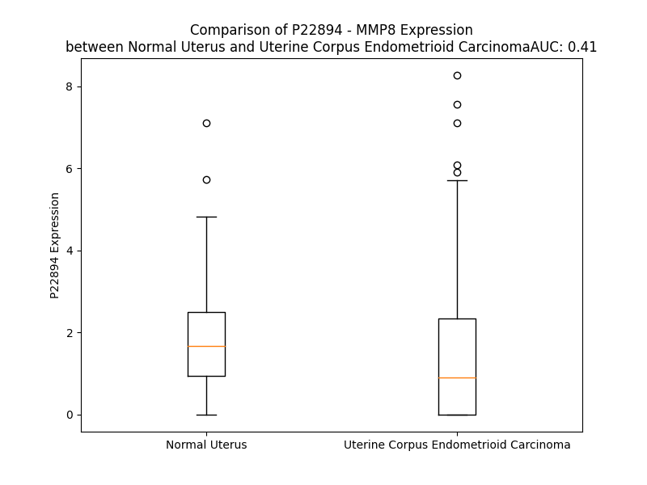

# Detailed Data for P22894

## Introduction to the Detailed Summary

### How to Interpret the Results

- **Summary & Metrics**: This section provides a quick reference to essential protein attributes, including expression changes, family classification, and biomarker applications. Regulation status (upregulated/downregulated) indicates the protein's behavior in a disease context. Some information comes from the original excel file with the proteins selected from literature, while others are derived from the analyses.
- **Expression Comparison**: A visual representation comparing protein expression between normal and disease states. It highlights significant changes in expression levels that might indicate diagnostic or therapeutic relevance. This is data coming from transcriptomics experiments and could not translate similarly to protein levels.
- **Isoform Alignment**: An interactive view of isoform alignments, revealing structural and functional differences between variants of the protein.
- **Interactors & Homologs**: Tables listing known interaction partners and homologous proteins, the more interactors and homologs, the more complex the protein is to design an antibody for.
- **Biological Assemblies**: Information about the structural arrangement of the protein in different assemblies, providing insights into its functional state but also the complexity of the protein to develop antibodies.
- **Combined Per-Residue Information**: A detailed table summarizing residue-level data. This includes predictions for epitope regions, aggregation tendencies, and modifications that might impact the protein's function. Each row corresponds to a residue in the protein, providing insights into specific sites that may be important for research or drug development.
## Summary & Metrics

- **UniProt Accession**: P22894
- **Gene Name**: MMP-8
- **Protein Name**: Neutrophil collagenase
- **Swiss Prot**: MMP8_HUMAN
- **Family**: peptidase
- **Biomarker Application**: efficacy
- **Number of Isoforms**: 0
- **Regulation**: -1
- **(transcriptomics) AUC**: 0.47
- **(transcriptomics) Fold Change**: 1.10
- **(transcriptomics) Regulation**: Downregulated
- **Discotope Epitope Count**: 99
- **Max n_uniprots (Homo)**: 1
- **Max n_uniprots (Hetero)**: N/A

## Expression Comparison

## Interactors

| preferredName_A   | preferredName_B   | score   |
|-------------------|-------------------|---------|

## Homologs

| uniprot_id   | gene_id   |
|:-------------|:----------|
| O60882       | MMP20     |
| P09238       | MMP10     |
| P09237       | MMP7      |
| E5RJA7       | MMP16     |
| P39900       | MMP12     |
| G5E971       | MMP13     |
| P51511       | MMP15     |
| P14780       | MMP9      |
| P50281       | MMP14     |
| Q9NRE1       | MMP26     |
| B4DNP3       | MMP19     |
| A0A087WZS5   | MMP25     |
| Q9ULZ9       | MMP17     |
| B4DMZ6       | MMP23B    |
| Q9Y5R2       | MMP24     |
| P08253       | MMP2      |
| P02790       | HPX       |
| P03956       | MMP1      |
| E9PED7       | MMP11     |
| A0A087X1Y9   | MMP28     |
| Q8N119       | MMP21     |
| P08254       | MMP3      |
| Q9H306       | MMP27     |

## Biological Assemblies

|   Unnamed: 0 |   assembly |   n_uniprots | composition   | crystal_id   |
|-------------:|-----------:|-------------:|:--------------|:-------------|
|            0 |          1 |            1 | Homo          | 1i73         |
|            0 |          1 |            1 | Homo          | 3dpe         |
|            0 |          1 |            1 | Homo          | 1jaq         |
|            0 |          1 |            1 | Homo          | 1bzs         |
|            0 |          1 |            1 | Homo          | 1jan         |
|            0 |          1 |            1 | Homo          | 3dng         |
|            1 |          2 |            1 | Homo          | 3dng         |
|            0 |          1 |            1 | Homo          | 1i76         |
|            0 |          1 |            1 | Homo          | 1a85         |
|            0 |          1 |            1 | Homo          | 1mnc         |
|            0 |          1 |            1 | Homo          | 1jao         |
|            0 |          1 |            1 | Homo          | 1jap         |
|            0 |          1 |            1 | Homo          | 1a86         |
|            0 |          1 |            1 | Homo          | 1kbc         |
|            1 |          2 |            1 | Homo          | 1kbc         |
|            0 |          1 |            1 | Homo          | 5h8x         |
|            0 |          1 |            1 | Homo          | 1jj9         |
|            0 |          1 |            1 | Homo          | 4qkz         |
|            0 |          1 |            1 | Homo          | 3tt4         |
|            0 |          1 |            1 | Homo          | 1zvx         |
|            0 |          1 |            1 | Homo          | 1zp5         |
|            0 |          1 |            1 | Homo          | 2oy4         |
|            1 |          2 |            1 | Homo          | 2oy4         |
|            0 |          1 |            1 | Homo          | 2oy2         |
|            1 |          2 |            1 | Homo          | 2oy2         |
|            0 |          1 |            1 | Homo          | 3dpf         |
|            1 |          2 |            1 | Homo          | 3dpf         |
|            0 |          1 |            1 | Homo          | 1jh1         |
|            0 |          1 |            1 | Homo          | 1zs0         |
|            0 |          1 |            1 | Homo          | 1mmb         |

## Combined Per-Residue Information

|   res | aa   |   epitope_score | epitope   |   relative_surface_accessibility |   modeling_confidence |   Aggregation | modification   | glycosylation                   |
|------:|:-----|----------------:|:----------|---------------------------------:|----------------------:|--------------:|:---------------|:--------------------------------|
|     1 | M    |         0.12722 | False     |                          1.19248 |                 40.18 |         0     | N/A            | N/A                             |
|     2 | F    |         0.11334 | False     |                          0.98004 |                 41.1  |         0     | N/A            | N/A                             |
|     3 | S    |         0.14191 | False     |                          0.68382 |                 39.91 |         0     | N/A            | N/A                             |
|     4 | L    |         0.10337 | False     |                          0.95578 |                 43.92 |         0     | N/A            | N/A                             |
|     5 | K    |         0.11941 | False     |                          1.0082  |                 45.65 |         0     | N/A            | N/A                             |
|     6 | T    |         0.1084  | False     |                          0.74525 |                 40.96 |         0     | N/A            | N/A                             |
|     7 | L    |         0.17203 | True      |                          1.07113 |                 44.81 |         0     | N/A            | N/A                             |
|     8 | P    |         0.13367 | False     |                          0.81068 |                 48.85 |         1.212 | N/A            | N/A                             |
|     9 | F    |         0.10878 | False     |                          1.00606 |                 44.44 |        87.817 | N/A            | N/A                             |
|    10 | L    |         0.09946 | False     |                          0.95842 |                 45.21 |        88.525 | N/A            | N/A                             |
|    11 | L    |         0.12431 | False     |                          0.91994 |                 44.51 |        88.642 | N/A            | N/A                             |
|    12 | L    |         0.11957 | False     |                          0.80039 |                 45.69 |        88.642 | N/A            | N/A                             |
|    13 | L    |         0.12798 | False     |                          0.90106 |                 43.42 |        88.467 | N/A            | N/A                             |
|    14 | H    |         0.08277 | False     |                          0.84045 |                 43.88 |         9.714 | N/A            | N/A                             |
|    15 | V    |         0.07158 | False     |                          0.80139 |                 45.37 |         9.091 | N/A            | N/A                             |
|    16 | Q    |         0.11892 | False     |                          0.83733 |                 44.63 |         1.579 | N/A            | N/A                             |
|    17 | I    |         0.10404 | False     |                          0.8468  |                 47.21 |         1.292 | N/A            | N/A                             |
|    18 | S    |         0.12154 | False     |                          0.78302 |                 45.96 |         0.131 | N/A            | N/A                             |
|    19 | K    |         0.10346 | False     |                          0.79599 |                 45.55 |         0     | N/A            | N/A                             |
|    20 | A    |         0.14964 | False     |                          0.90615 |                 50.47 |         0     | N/A            | N/A                             |
|    21 | F    |         0.16283 | True      |                          0.85552 |                 52.09 |         0     | N/A            | N/A                             |
|    22 | P    |         0.16242 | True      |                          0.91883 |                 49.65 |         0     | N/A            | N/A                             |
|    23 | V    |         0.15521 | False     |                          0.77503 |                 56.51 |         0     | N/A            | N/A                             |
|    24 | S    |         0.15239 | False     |                          0.41157 |                 70.53 |         0     | N/A            | N/A                             |
|    25 | S    |         0.10533 | False     |                          0.68574 |                 75.91 |         0     | N/A            | N/A                             |
|    26 | K    |         0.15814 | False     |                          0.79646 |                 76.47 |         0     | N/A            | N/A                             |
|    27 | E    |         0.18722 | True      |                          0.52844 |                 75.84 |         0     | N/A            | N/A                             |
|    28 | K    |         0.12528 | False     |                          0.68919 |                 82.14 |         0     | N/A            | N/A                             |
|    29 | N    |         0.03506 | False     |                          0.30012 |                 87.35 |         0     | N/A            | N/A                             |
|    30 | T    |         0.11994 | False     |                          0.56033 |                 87.48 |         0     | N/A            | N/A                             |
|    31 | K    |         0.12168 | False     |                          0.66848 |                 88.6  |         0     | N/A            | N/A                             |
|    32 | T    |         0.05576 | False     |                          0.26542 |                 91.46 |         0     | N/A            | N/A                             |
|    33 | V    |         0.02264 | False     |                          0.0457  |                 93.65 |         0     | N/A            | N/A                             |
|    34 | Q    |         0.05907 | False     |                          0.23508 |                 91.75 |         0     | N/A            | N/A                             |
|    35 | D    |         0.05783 | False     |                          0.34595 |                 91.88 |         0     | N/A            | N/A                             |
|    36 | Y    |         0.02732 | False     |                          0.04563 |                 95.08 |         0     | N/A            | N/A                             |
|    37 | L    |         0.00268 | False     |                          0       |                 94.03 |         0     | N/A            | N/A                             |
|    38 | E    |         0.07453 | False     |                          0.23902 |                 91.09 |         0     | N/A            | N/A                             |
|    39 | K    |         0.10149 | False     |                          0.47917 |                 91.56 |         0     | N/A            | N/A                             |
|    40 | F    |         0.06387 | False     |                          0.04712 |                 94.16 |         0     | N/A            | N/A                             |
|    41 | Y    |         0.02316 | False     |                          0.01897 |                 91.73 |         0     | N/A            | N/A                             |
|    42 | Q    |         0.06113 | False     |                          0.62872 |                 87.12 |         0     | N/A            | N/A                             |
|    43 | L    |         0.07928 | False     |                          0.08258 |                 85.55 |         0     | N/A            | N/A                             |
|    44 | P    |         0.09297 | False     |                          0.66487 |                 80.38 |         0     | N/A            | N/A                             |
|    45 | S    |         0.11385 | False     |                          0.49844 |                 73.49 |         0     | N/A            | N/A                             |
|    46 | N    |         0.1476  | False     |                          0.56799 |                 61.99 |         0     | N/A            | N/A                             |
|    47 | Q    |         0.19228 | True      |                          0.82794 |                 52.74 |         0     | N/A            | N/A                             |
|    48 | Y    |         0.14716 | False     |                          0.86694 |                 42.72 |         0     | N/A            | N/A                             |
|    49 | Q    |         0.23676 | True      |                          0.87853 |                 46.41 |         0     | N/A            | N/A                             |
|    50 | S    |         0.14157 | False     |                          0.77945 |                 46.35 |         0     | N/A            | N/A                             |
|    51 | T    |         0.15954 | False     |                          0.54745 |                 50.96 |         0     | N/A            | N/A                             |
|    52 | R    |         0.15108 | False     |                          0.91956 |                 52.17 |         0     | N/A            | N/A                             |
|    53 | K    |         0.17033 | True      |                          0.89822 |                 55.06 |         0     | N/A            | N/A                             |
|    54 | N    |         0.18912 | True      |                          0.55569 |                 58.95 |         0     | N/A            | N-linked (GlcNAc...) asparagine |
|    55 | G    |         0.10067 | False     |                          0.32374 |                 62.1  |         0.169 | N/A            | N/A                             |
|    56 | T    |         0.16638 | True      |                          0.59348 |                 74.71 |         5.321 | N/A            | N/A                             |
|    57 | N    |         0.15834 | False     |                          0.62205 |                 84.27 |         5.439 | N/A            | N/A                             |
|    58 | V    |         0.06285 | False     |                          0.43306 |                 87.93 |         8.492 | N/A            | N/A                             |
|    59 | I    |         0.05419 | False     |                          0.27919 |                 90.58 |         8.757 | N/A            | N/A                             |
|    60 | V    |         0.03795 | False     |                          0.32942 |                 92.1  |         8.757 | N/A            | N/A                             |
|    61 | E    |         0.11379 | False     |                          0.45673 |                 91.82 |         3.436 | N/A            | N/A                             |
|    62 | K    |         0.07434 | False     |                          0.23086 |                 92.07 |         3.436 | N/A            | N/A                             |
|    63 | L    |         0.00625 | False     |                          0.01154 |                 93.8  |         3.436 | N/A            | N/A                             |
|    64 | K    |         0.04993 | False     |                          0.25247 |                 93.33 |         0     | N/A            | N/A                             |
|    65 | E    |         0.04727 | False     |                          0.27545 |                 92.99 |         0     | N/A            | N/A                             |
|    66 | M    |         0.00374 | False     |                          0       |                 94.25 |         0     | N/A            | N/A                             |
|    67 | Q    |         0.00685 | False     |                          0       |                 93.62 |         0     | N/A            | N/A                             |
|    68 | R    |         0.12672 | False     |                          0.55035 |                 91.73 |         0     | N/A            | N/A                             |
|    69 | F    |         0.04108 | False     |                          0.13776 |                 92.77 |         0.908 | N/A            | N/A                             |
|    70 | F    |         0.01593 | False     |                          0.03092 |                 92.18 |         0.908 | N/A            | N/A                             |
|    71 | G    |         0.06401 | False     |                          0.5195  |                 88.62 |         0.908 | N/A            | N/A                             |
|    72 | L    |         0.02785 | False     |                          0.07469 |                 89.2  |         0.908 | N/A            | N/A                             |
|    73 | N    |         0.05307 | False     |                          0.35006 |                 84.37 |         0.908 | N/A            | N-linked (GlcNAc...) asparagine |
|    74 | V    |         0.08824 | False     |                          0.44557 |                 89.92 |         0.908 | N/A            | N/A                             |
|    75 | T    |         0.0682  | False     |                          0.3438  |                 89.95 |         0.161 | N/A            | N/A                             |
|    76 | G    |         0.05066 | False     |                          0.07376 |                 91.04 |         0     | N/A            | N/A                             |
|    77 | K    |         0.16964 | True      |                          0.69533 |                 91.32 |         0     | N/A            | N/A                             |
|    78 | P    |         0.10502 | False     |                          0.41252 |                 91.22 |         0     | N/A            | N/A                             |
|    79 | N    |         0.07309 | False     |                          0.3112  |                 87.29 |         0     | N/A            | N/A                             |
|    80 | E    |         0.10391 | False     |                          0.66059 |                 85.37 |         0     | N/A            | N/A                             |
|    81 | E    |         0.05007 | False     |                          0.22192 |                 84.86 |         0     | N/A            | N/A                             |
|    82 | T    |         0.00396 | False     |                          0.00145 |                 91.51 |         0     | N/A            | N/A                             |
|    83 | L    |         0.0323  | False     |                          0.08244 |                 93.5  |         0     | N/A            | N/A                             |
|    84 | D    |         0.07587 | False     |                          0.17582 |                 90.14 |         0     | N/A            | N/A                             |
|    85 | M    |         0.0119  | False     |                          0.00791 |                 93.29 |         0     | N/A            | N/A                             |
|    86 | M    |         0.03056 | False     |                          0.07017 |                 95.22 |         0     | N/A            | N/A                             |
|    87 | K    |         0.104   | False     |                          0.62839 |                 94.04 |         0     | N/A            | N/A                             |
|    88 | K    |         0.04072 | False     |                          0.09782 |                 94.94 |         0     | N/A            | N/A                             |
|    89 | P    |         0.02732 | False     |                          0.2356  |                 97.43 |         0     | N/A            | N/A                             |
|    90 | R    |         0.03385 | False     |                          0.01799 |                 97.86 |         0     | N/A            | N/A                             |
|    91 | C    |         0.02751 | False     |                          0.04111 |                 98.26 |         0     | N/A            | N/A                             |
|    92 | G    |         0.05032 | False     |                          0.21883 |                 96.84 |         0     | N/A            | N/A                             |
|    93 | V    |         0.02491 | False     |                          0.15519 |                 94.65 |         0     | N/A            | N/A                             |
|    94 | P    |         0.04048 | False     |                          0.416   |                 92.71 |         0     | N/A            | N/A                             |
|    95 | D    |         0.02723 | False     |                          0.02544 |                 91.17 |         0     | N/A            | N/A                             |
|    96 | S    |         0.04693 | False     |                          0.24227 |                 67.75 |         0     | N/A            | N/A                             |
|    97 | G    |         0.15451 | False     |                          0.80863 |                 50.29 |         0     | N/A            | N/A                             |
|    98 | G    |         0.1148  | False     |                          0.39994 |                 48.4  |         0     | N/A            | N/A                             |
|    99 | F    |         0.25171 | True      |                          0.9554  |                 39.87 |         0     | N/A            | N/A                             |
|   100 | M    |         0.04751 | False     |                          0.2699  |                 49.92 |         0     | N/A            | N/A                             |
|   101 | L    |         0.10207 | False     |                          0.39476 |                 47.27 |         0     | N/A            | N/A                             |
|   102 | T    |         0.05448 | False     |                          0.04545 |                 53.44 |         0     | N/A            | N/A                             |
|   103 | P    |         0.19937 | True      |                          0.86435 |                 53.55 |         0     | N/A            | N/A                             |
|   104 | G    |         0.19937 | True      |                          0.90621 |                 60.75 |         0     | N/A            | N/A                             |
|   105 | N    |         0.17296 | True      |                          0.54975 |                 70.82 |         0     | N/A            | N/A                             |
|   106 | P    |         0.08482 | False     |                          0.25824 |                 82.56 |         0     | N/A            | N/A                             |
|   107 | K    |         0.16145 | True      |                          0.47697 |                 92.06 |         0     | N/A            | N/A                             |
|   108 | W    |         0.07126 | False     |                          0.10654 |                 95.86 |         0     | N/A            | N/A                             |
|   109 | E    |         0.16593 | True      |                          0.81281 |                 93.1  |         0     | N/A            | N/A                             |
|   110 | R    |         0.19441 | True      |                          0.52341 |                 94.16 |         0     | N/A            | N/A                             |
|   111 | T    |         0.16821 | True      |                          0.41587 |                 95.59 |         0     | N/A            | N/A                             |
|   112 | N    |         0.14183 | False     |                          0.59246 |                 97.86 |         0     | N/A            | N-linked (GlcNAc...) asparagine |
|   113 | L    |         0.0091  | False     |                          0.00568 |                 98.12 |         0     | N/A            | N/A                             |
|   114 | T    |         0.04743 | False     |                          0.26537 |                 98.21 |         0     | N/A            | N/A                             |
|   115 | Y    |         0.05878 | False     |                          0.04372 |                 98.59 |         0     | N/A            | N/A                             |
|   116 | R    |         0.09225 | False     |                          0.21103 |                 98.31 |         0     | N/A            | N/A                             |
|   117 | I    |         0.04226 | False     |                          0.08557 |                 98.49 |         0     | N/A            | N/A                             |
|   118 | R    |         0.16141 | True      |                          0.51996 |                 97.73 |         0     | N/A            | N/A                             |
|   119 | N    |         0.11366 | False     |                          0.354   |                 97.88 |         0     | N/A            | N/A                             |
|   120 | Y    |         0.10395 | False     |                          0.27986 |                 98.34 |         0     | N/A            | N/A                             |
|   121 | T    |         0.03974 | False     |                          0.01945 |                 97.73 |         0     | N/A            | N/A                             |
|   122 | P    |         0.36188 | True      |                          0.9033  |                 96.1  |         0     | N/A            | N/A                             |
|   123 | Q    |         0.25029 | True      |                          0.36452 |                 96.65 |         0     | N/A            | N/A                             |
|   124 | L    |         0.08386 | False     |                          0.13681 |                 98.13 |         0     | N/A            | N/A                             |
|   125 | S    |         0.23094 | True      |                          0.44864 |                 98.38 |         0     | N/A            | N/A                             |
|   126 | E    |         0.14105 | False     |                          0.53697 |                 98.31 |         0     | N/A            | N/A                             |
|   127 | A    |         0.16129 | True      |                          0.6468  |                 98.53 |         0     | N/A            | N/A                             |
|   128 | E    |         0.08616 | False     |                          0.24331 |                 98.48 |         0     | N/A            | N/A                             |
|   129 | V    |         0.00429 | False     |                          0       |                 98.72 |         0     | N/A            | N/A                             |
|   130 | E    |         0.06744 | False     |                          0.28508 |                 98.6  |         0     | N/A            | N/A                             |
|   131 | R    |         0.21231 | True      |                          0.53162 |                 98.47 |         0     | N/A            | N/A                             |
|   132 | A    |         0.02413 | False     |                          0.09275 |                 98.54 |         0     | N/A            | N/A                             |
|   133 | I    |         0.00386 | False     |                          0       |                 98.81 |         0     | N/A            | N/A                             |
|   134 | K    |         0.12497 | False     |                          0.53157 |                 98.65 |         0     | N/A            | N/A                             |
|   135 | D    |         0.0516  | False     |                          0.31741 |                 98.28 |         0     | N/A            | N/A                             |
|   136 | A    |         0.00352 | False     |                          0       |                 98.71 |         0     | N/A            | N/A                             |
|   137 | F    |         0.01592 | False     |                          0.0151  |                 98.68 |         0     | N/A            | N/A                             |
|   138 | E    |         0.1247  | False     |                          0.41392 |                 97.41 |         0     | N/A            | N/A                             |
|   139 | L    |         0.06469 | False     |                          0.13184 |                 97.87 |         0.621 | N/A            | N/A                             |
|   140 | W    |         0.005   | False     |                          0       |                 98.37 |         0.621 | N/A            | N/A                             |
|   141 | S    |         0.05682 | False     |                          0.24403 |                 97.69 |         0.621 | N/A            | N/A                             |
|   142 | V    |         0.08546 | False     |                          0.46651 |                 97.09 |         0.621 | N/A            | N/A                             |
|   143 | A    |         0.0111  | False     |                          0.0102  |                 97.51 |         0.621 | N/A            | N/A                             |
|   144 | S    |         0.05039 | False     |                          0.01768 |                 97.56 |         0     | N/A            | N/A                             |
|   145 | P    |         0.06811 | False     |                          0.24385 |                 97.68 |         0     | N/A            | N/A                             |
|   146 | L    |         0.01806 | False     |                          0.01767 |                 98    |         0     | N/A            | N/A                             |
|   147 | I    |         0.10982 | False     |                          0.60655 |                 98.11 |         0     | N/A            | N/A                             |
|   148 | F    |         0.05387 | False     |                          0.15852 |                 98.46 |         0     | N/A            | N/A                             |
|   149 | T    |         0.10213 | False     |                          0.50469 |                 98.35 |         0     | N/A            | N/A                             |
|   150 | R    |         0.09986 | False     |                          0.40139 |                 98.35 |         0     | N/A            | N/A                             |
|   151 | I    |         0.22183 | True      |                          0.25891 |                 98.28 |         0     | N/A            | N/A                             |
|   152 | S    |         0.21971 | True      |                          0.65267 |                 95.36 |         0     | N/A            | N/A                             |
|   153 | Q    |         0.25818 | True      |                          0.74623 |                 94.26 |         0     | N/A            | N/A                             |
|   154 | G    |         0.16804 | True      |                          0.55139 |                 93.89 |         0     | N/A            | N/A                             |
|   155 | E    |         0.17183 | True      |                          0.77131 |                 93.78 |         0     | N/A            | N/A                             |
|   156 | A    |         0.04484 | False     |                          0.13788 |                 96.99 |         0     | N/A            | N/A                             |
|   157 | D    |         0.04273 | False     |                          0.1139  |                 97.42 |         0     | N/A            | N/A                             |
|   158 | I    |         0.00307 | False     |                          0.0008  |                 98.38 |        21.374 | N/A            | N/A                             |
|   159 | N    |         0.04106 | False     |                          0.12733 |                 98.37 |        23.232 | N/A            | N/A                             |
|   160 | I    |         0.00432 | False     |                          0       |                 98.75 |        25.093 | N/A            | N/A                             |
|   161 | A    |         0.0273  | False     |                          0.01403 |                 98.46 |        25.093 | N/A            | N/A                             |
|   162 | F    |         0.02602 | False     |                          0.03512 |                 98.7  |        25.093 | N/A            | N/A                             |
|   163 | Y    |         0.12581 | False     |                          0.33752 |                 98.31 |        24.304 | N/A            | N/A                             |
|   164 | Q    |         0.27946 | True      |                          0.59411 |                 97.09 |         2.151 | N/A            | N/A                             |
|   165 | R    |         0.27929 | True      |                          0.44934 |                 96.47 |         0     | N/A            | N/A                             |
|   166 | D    |         0.21684 | True      |                          0.64066 |                 97.33 |         0     | N/A            | N/A                             |
|   167 | H    |         0.16152 | True      |                          0.22822 |                 97.27 |         0     | N/A            | N/A                             |
|   168 | G    |         0.40206 | True      |                          0.84199 |                 94.61 |         0     | N/A            | N/A                             |
|   169 | D    |         0.16925 | True      |                          0.12434 |                 94.08 |         0     | N/A            | N/A                             |
|   170 | N    |         0.37171 | True      |                          0.90355 |                 91.44 |         0     | N/A            | N/A                             |
|   171 | S    |         0.11883 | False     |                          0.32683 |                 93.41 |         0     | N/A            | N/A                             |
|   172 | P    |         0.17401 | True      |                          0.51908 |                 96.05 |         0     | N/A            | N/A                             |
|   173 | F    |         0.05382 | False     |                          0.03399 |                 97.82 |         0     | N/A            | N/A                             |
|   174 | D    |         0.152   | False     |                          0.36918 |                 96.28 |         0     | N/A            | N/A                             |
|   175 | G    |         0.00988 | False     |                          0       |                 96.29 |         0     | N/A            | N/A                             |
|   176 | P    |         0.17764 | True      |                          0.63207 |                 96.88 |         0     | N/A            | N/A                             |
|   177 | N    |         0.12209 | False     |                          0.51369 |                 94.85 |         0     | N/A            | N/A                             |
|   178 | G    |         0.0608  | False     |                          0.27018 |                 96.16 |         0     | N/A            | N/A                             |
|   179 | I    |         0.06271 | False     |                          0.0848  |                 98.02 |         0.23  | N/A            | N/A                             |
|   180 | L    |         0.01215 | False     |                          0.01896 |                 98.63 |         0.23  | N/A            | N/A                             |
|   181 | A    |         0.00718 | False     |                          0       |                 98.77 |         0.23  | N/A            | N/A                             |
|   182 | H    |         0.03382 | False     |                          0.03575 |                 98.07 |         0.23  | N/A            | N/A                             |
|   183 | A    |         0.01539 | False     |                          0.06976 |                 97.62 |         0.23  | N/A            | N/A                             |
|   184 | F    |         0.04426 | False     |                          0.22178 |                 95.22 |         0.23  | N/A            | N/A                             |
|   185 | Q    |         0.0686  | False     |                          0.34922 |                 92.97 |         0     | N/A            | N/A                             |
|   186 | P    |         0.02849 | False     |                          0.08831 |                 95.47 |         0     | N/A            | N/A                             |
|   187 | G    |         0.06003 | False     |                          0.42613 |                 91.36 |         0     | N/A            | N/A                             |
|   188 | Q    |         0.21493 | True      |                          0.91559 |                 89.29 |         0     | N/A            | N/A                             |
|   189 | G    |         0.25852 | True      |                          0.90289 |                 90.56 |         0     | N/A            | N/A                             |
|   190 | I    |         0.12735 | False     |                          0.5264  |                 92.19 |         0     | N/A            | N/A                             |
|   191 | G    |         0.03155 | False     |                          0.09597 |                 93.69 |         0     | N/A            | N/A                             |
|   192 | G    |         0.00207 | False     |                          0       |                 95.67 |         0     | N/A            | N/A                             |
|   193 | D    |         0.04866 | False     |                          0.06928 |                 98.05 |         0     | N/A            | N/A                             |
|   194 | A    |         0.00164 | False     |                          0       |                 98.67 |         0     | N/A            | N/A                             |
|   195 | H    |         0.03407 | False     |                          0.0748  |                 98.73 |         0     | N/A            | N/A                             |
|   196 | F    |         0.00352 | False     |                          0       |                 98.83 |         0     | N/A            | N/A                             |
|   197 | D    |         0.00285 | False     |                          0       |                 98.6  |         0     | N/A            | N/A                             |
|   198 | A    |         0.06493 | False     |                          0.17019 |                 98.24 |         0     | N/A            | N/A                             |
|   199 | E    |         0.17603 | True      |                          0.26404 |                 98    |         0     | N/A            | N/A                             |
|   200 | E    |         0.03567 | False     |                          0.01394 |                 98.23 |         0     | N/A            | N/A                             |
|   201 | T    |         0.17378 | True      |                          0.49289 |                 97.54 |         0     | N/A            | N/A                             |
|   202 | W    |         0.05177 | False     |                          0.01145 |                 98.58 |         0     | N/A            | N/A                             |
|   203 | T    |         0.12803 | False     |                          0.13805 |                 97.88 |         0     | N/A            | N/A                             |
|   204 | N    |         0.12335 | False     |                          0.40915 |                 96.59 |         0     | N/A            | N-linked (GlcNAc...) asparagine |
|   205 | T    |         0.23059 | True      |                          0.50042 |                 94.9  |         0     | N/A            | N/A                             |
|   206 | S    |         0.14169 | False     |                          0.5354  |                 91.54 |         0.028 | N/A            | N/A                             |
|   207 | A    |         0.40258 | True      |                          0.8112  |                 92.05 |         0.509 | N/A            | N/A                             |
|   208 | N    |         0.16159 | True      |                          0.35945 |                 95.09 |         1.077 | N/A            | N/A                             |
|   209 | Y    |         0.0411  | False     |                          0.06826 |                 97.62 |        16.293 | N/A            | N/A                             |
|   210 | N    |         0.01241 | False     |                          0.01068 |                 97.93 |        20.527 | N/A            | N/A                             |
|   211 | L    |         0.00443 | False     |                          0.00412 |                 98.75 |        77.716 | N/A            | N/A                             |
|   212 | F    |         0.03765 | False     |                          0.124   |                 98.65 |        80.222 | N/A            | N/A                             |
|   213 | L    |         0.01963 | False     |                          0.03742 |                 98.57 |        80.222 | N/A            | N/A                             |
|   214 | V    |         0.01752 | False     |                          0.05332 |                 98.82 |        79.633 | N/A            | N/A                             |
|   215 | A    |         0.0017  | False     |                          0       |                 98.9  |        70.171 | N/A            | N/A                             |
|   216 | A    |         0.0024  | False     |                          0       |                 98.85 |        18.593 | N/A            | N/A                             |
|   217 | H    |         0.01493 | False     |                          0.06696 |                 98.68 |         0.136 | N/A            | N/A                             |
|   218 | E    |         0.0132  | False     |                          0.00567 |                 98.76 |         0     | N/A            | N/A                             |
|   219 | F    |         0.00236 | False     |                          0       |                 98.75 |         0     | N/A            | N/A                             |
|   220 | G    |         0.00256 | False     |                          0       |                 97.91 |         0     | N/A            | N/A                             |
|   221 | H    |         0.01352 | False     |                          0.01514 |                 96.7  |         0     | N/A            | N/A                             |
|   222 | S    |         0.00188 | False     |                          0       |                 97.68 |         0     | N/A            | N/A                             |
|   223 | L    |         0.00253 | False     |                          0       |                 96.97 |         0     | N/A            | N/A                             |
|   224 | G    |         0.015   | False     |                          0.01903 |                 94.7  |         0     | N/A            | N/A                             |
|   225 | L    |         0.00736 | False     |                          0.00781 |                 94.95 |         0     | N/A            | N/A                             |
|   226 | A    |         0.03008 | False     |                          0.05335 |                 93.87 |         0     | N/A            | N/A                             |
|   227 | H    |         0.02733 | False     |                          0.06314 |                 95.6  |         0     | N/A            | N/A                             |
|   228 | S    |         0.02199 | False     |                          0.08333 |                 94.99 |         0     | N/A            | N/A                             |
|   229 | S    |         0.07209 | False     |                          0.44139 |                 93.29 |         0     | N/A            | N/A                             |
|   230 | D    |         0.05124 | False     |                          0.2219  |                 93.86 |         0     | N/A            | N/A                             |
|   231 | P    |         0.03786 | False     |                          0.13813 |                 93.45 |         0     | N/A            | N/A                             |
|   232 | G    |         0.01523 | False     |                          0.02672 |                 94.53 |         0     | N/A            | N/A                             |
|   233 | A    |         0.00352 | False     |                          0.00219 |                 96.33 |         0     | N/A            | N/A                             |
|   234 | L    |         0.02092 | False     |                          0.05677 |                 97.58 |         0     | N/A            | N/A                             |
|   235 | M    |         0.01019 | False     |                          0.00935 |                 97.25 |         0     | N/A            | N/A                             |
|   236 | Y    |         0.03542 | False     |                          0.04273 |                 96.26 |         0     | N/A            | N/A                             |
|   237 | P    |         0.01125 | False     |                          0.02057 |                 96.8  |         0     | N/A            | N/A                             |
|   238 | N    |         0.02397 | False     |                          0.03727 |                 97.45 |         0     | N/A            | N/A                             |
|   239 | Y    |         0.11596 | False     |                          0.17129 |                 97.27 |         0     | N/A            | N/A                             |
|   240 | A    |         0.02995 | False     |                          0.09227 |                 94.61 |         0     | N/A            | N/A                             |
|   241 | F    |         0.05257 | False     |                          0.16308 |                 94.14 |         0     | N/A            | N/A                             |
|   242 | R    |         0.08458 | False     |                          0.0659  |                 92.26 |         0     | N/A            | N/A                             |
|   243 | E    |         0.13133 | False     |                          0.62293 |                 91.15 |         0     | N/A            | N/A                             |
|   244 | T    |         0.18962 | True      |                          0.31369 |                 93.45 |         0     | N/A            | N/A                             |
|   245 | S    |         0.31953 | True      |                          0.79128 |                 88.81 |         0     | N/A            | N/A                             |
|   246 | N    |         0.3037  | True      |                          0.90359 |                 88.37 |         0     | N/A            | N-linked (GlcNAc...) asparagine |
|   247 | Y    |         0.08729 | False     |                          0.13483 |                 95.4  |         0     | N/A            | N/A                             |
|   248 | S    |         0.08312 | False     |                          0.38492 |                 95.85 |         0     | N/A            | N/A                             |
|   249 | L    |         0.02447 | False     |                          0.04502 |                 97.51 |         0     | N/A            | N/A                             |
|   250 | P    |         0.01274 | False     |                          0.03579 |                 97.4  |         0     | N/A            | N/A                             |
|   251 | Q    |         0.14736 | False     |                          0.23794 |                 97.56 |         0     | N/A            | N/A                             |
|   252 | D    |         0.02941 | False     |                          0.20435 |                 97.24 |         0     | N/A            | N/A                             |
|   253 | D    |         0.01439 | False     |                          0.00332 |                 98.29 |         0     | N/A            | N/A                             |
|   254 | I    |         0.04917 | False     |                          0.024   |                 98.16 |         0     | N/A            | N/A                             |
|   255 | D    |         0.18859 | True      |                          0.46594 |                 97.46 |         0     | N/A            | N/A                             |
|   256 | G    |         0.01917 | False     |                          0.02008 |                 95.73 |         0     | N/A            | N/A                             |
|   257 | I    |         0.00911 | False     |                          0       |                 96.88 |         0.442 | N/A            | N/A                             |
|   258 | Q    |         0.106   | False     |                          0.15092 |                 97.07 |         0.442 | N/A            | N/A                             |
|   259 | A    |         0.17699 | True      |                          0.72109 |                 95.55 |         1.393 | N/A            | N/A                             |
|   260 | I    |         0.06773 | False     |                          0.1216  |                 94.57 |         1.534 | N/A            | N/A                             |
|   261 | Y    |         0.1099  | False     |                          0.13282 |                 96.13 |         1.534 | N/A            | N/A                             |
|   262 | G    |         0.0992  | False     |                          0.38313 |                 95.92 |         1.237 | N/A            | N/A                             |
|   263 | L    |         0.29703 | True      |                          0.71466 |                 96.98 |         1.237 | N/A            | N/A                             |
|   264 | S    |         0.11572 | False     |                          0.06552 |                 95.55 |         0.14  | N/A            | N/A                             |
|   265 | S    |         0.31963 | True      |                          0.75773 |                 92.62 |         0     | N/A            | N/A                             |
|   266 | N    |         0.22543 | True      |                          0.42162 |                 91.22 |         0     | N/A            | N/A                             |
|   267 | P    |         0.32175 | True      |                          1.04029 |                 91.45 |         0     | N/A            | N/A                             |
|   268 | I    |         0.39247 | True      |                          0.8848  |                 93.97 |         0     | N/A            | N/A                             |
|   269 | Q    |         0.20979 | True      |                          0.31601 |                 96.35 |         0     | N/A            | N/A                             |
|   270 | P    |         0.08957 | False     |                          0.22618 |                 95.71 |         0     | N/A            | N/A                             |
|   271 | T    |         0.23676 | True      |                          0.80344 |                 96.43 |         0     | N/A            | N/A                             |
|   272 | G    |         0.06559 | False     |                          0.18617 |                 95.49 |         0     | N/A            | N/A                             |
|   273 | P    |         0.08373 | False     |                          0.39718 |                 95.22 |         0     | N/A            | N/A                             |
|   274 | S    |         0.13694 | False     |                          0.5699  |                 95.1  |         0     | N/A            | N/A                             |
|   275 | T    |         0.04031 | False     |                          0.18791 |                 94.47 |         0     | N/A            | N/A                             |
|   276 | P    |         0.04566 | False     |                          0.2085  |                 94.39 |         0     | N/A            | N/A                             |
|   277 | K    |         0.11795 | False     |                          0.75105 |                 92.48 |         0     | N/A            | N/A                             |
|   278 | P    |         0.05547 | False     |                          0.34793 |                 90.18 |         0     | N/A            | N/A                             |
|   279 | C    |         0.09689 | False     |                          0.49932 |                 91.26 |         0     | N/A            | N/A                             |
|   280 | D    |         0.12404 | False     |                          0.33912 |                 93.86 |         0     | N/A            | N/A                             |
|   281 | P    |         0.1855  | True      |                          0.56728 |                 93.62 |         0     | N/A            | N/A                             |
|   282 | S    |         0.25237 | True      |                          0.58732 |                 95.44 |         0     | N/A            | N/A                             |
|   283 | L    |         0.06574 | False     |                          0.08841 |                 96.2  |         0     | N/A            | N/A                             |
|   284 | T    |         0.07456 | False     |                          0.26864 |                 96.93 |         0     | N/A            | N/A                             |
|   285 | F    |         0.0124  | False     |                          0.01628 |                 97.85 |         0     | N/A            | N/A                             |
|   286 | D    |         0.0485  | False     |                          0.22143 |                 98.11 |         0     | N/A            | N/A                             |
|   287 | A    |         0.00228 | False     |                          0.0051  |                 98.58 |         3.665 | N/A            | N/A                             |
|   288 | I    |         0.00533 | False     |                          0.00708 |                 98.47 |         4.602 | N/A            | N/A                             |
|   289 | T    |         0.01517 | False     |                          0.01958 |                 97.36 |         4.794 | N/A            | N/A                             |
|   290 | T    |         0.02558 | False     |                          0.12875 |                 95.4  |         5.117 | N/A            | N/A                             |
|   291 | L    |         0.08927 | False     |                          0.12365 |                 91.8  |         5.659 | N/A            | N/A                             |
|   292 | R    |         0.11264 | False     |                          0.59791 |                 88.81 |         2.787 | N/A            | N/A                             |
|   293 | G    |         0.06225 | False     |                          0.63038 |                 89.77 |         2.787 | N/A            | N/A                             |
|   294 | E    |         0.04842 | False     |                          0.0817  |                 92.55 |         4.096 | N/A            | N/A                             |
|   295 | I    |         0.01948 | False     |                          0.0392  |                 95.87 |         6.404 | N/A            | N/A                             |
|   296 | L    |         0.01121 | False     |                          0.01978 |                 96.38 |         6.616 | N/A            | N/A                             |
|   297 | F    |         0.00164 | False     |                          0       |                 97.79 |         6.616 | N/A            | N/A                             |
|   298 | F    |         0.00316 | False     |                          0.00598 |                 97.96 |         6.3   | N/A            | N/A                             |
|   299 | K    |         0.04612 | False     |                          0.17893 |                 97.19 |         3.828 | N/A            | N/A                             |
|   300 | D    |         0.13403 | False     |                          0.42253 |                 94.79 |         2.52  | N/A            | N/A                             |
|   301 | R    |         0.07617 | False     |                          0.24541 |                 95.08 |         0     | N/A            | N/A                             |
|   302 | Y    |         0.02082 | False     |                          0.04811 |                 96.21 |         0     | N/A            | N/A                             |
|   303 | F    |         0.02511 | False     |                          0.03044 |                 96.45 |         0     | N/A            | N/A                             |
|   304 | W    |         0.00981 | False     |                          0.00524 |                 95.8  |         0     | N/A            | N/A                             |
|   305 | R    |         0.05439 | False     |                          0.12613 |                 93.21 |         0     | N/A            | N/A                             |
|   306 | R    |         0.0951  | False     |                          0.20367 |                 93.18 |         0     | N/A            | N/A                             |
|   307 | H    |         0.08795 | False     |                          0.29586 |                 89.24 |         0     | N/A            | N/A                             |
|   308 | P    |         0.1147  | False     |                          0.60925 |                 87.21 |         0     | N/A            | N/A                             |
|   309 | Q    |         0.26681 | True      |                          0.77933 |                 84.41 |         0     | N/A            | N/A                             |
|   310 | L    |         0.13191 | False     |                          0.30867 |                 80.85 |         0     | N/A            | N/A                             |
|   311 | Q    |         0.1901  | True      |                          0.71746 |                 79.94 |         0     | N/A            | N/A                             |
|   312 | R    |         0.23125 | True      |                          0.82044 |                 82.44 |         0     | N/A            | N/A                             |
|   313 | V    |         0.04789 | False     |                          0.16403 |                 89.62 |         0     | N/A            | N/A                             |
|   314 | E    |         0.03093 | False     |                          0.11619 |                 90.5  |         0     | N/A            | N/A                             |
|   315 | M    |         0.06373 | False     |                          0.1289  |                 93.03 |         0.64  | N/A            | N/A                             |
|   316 | N    |         0.00711 | False     |                          0.00655 |                 93.14 |         1.202 | N/A            | N/A                             |
|   317 | F    |         0.01789 | False     |                          0.02734 |                 94.5  |        42.676 | N/A            | N/A                             |
|   318 | I    |         0.00451 | False     |                          0.0016  |                 95.3  |        42.846 | N/A            | N/A                             |
|   319 | S    |         0.02545 | False     |                          0.09083 |                 93.84 |        42.846 | N/A            | N/A                             |
|   320 | L    |         0.03603 | False     |                          0.08122 |                 93.47 |        42.846 | N/A            | N/A                             |
|   321 | F    |         0.05957 | False     |                          0.07266 |                 92.2  |        42.846 | N/A            | N/A                             |
|   322 | W    |         0.01961 | False     |                          0.01412 |                 93.23 |         2.263 | N/A            | N/A                             |
|   323 | P    |         0.09904 | False     |                          0.6988  |                 90.49 |         1.053 | N/A            | N/A                             |
|   324 | S    |         0.10852 | False     |                          0.70388 |                 89.65 |         0     | N/A            | N/A                             |
|   325 | L    |         0.03549 | False     |                          0.049   |                 93.32 |         0     | N/A            | N/A                             |
|   326 | P    |         0.09071 | False     |                          0.24313 |                 93.37 |         0     | N/A            | N/A                             |
|   327 | T    |         0.04544 | False     |                          0.33415 |                 93.83 |         0     | N/A            | N/A                             |
|   328 | G    |         0.06177 | False     |                          0.28572 |                 95.4  |         0     | N/A            | N/A                             |
|   329 | I    |         0.00941 | False     |                          0.00412 |                 98.21 |         0     | N/A            | N/A                             |
|   330 | Q    |         0.04321 | False     |                          0.3395  |                 98.43 |         0     | N/A            | N/A                             |
|   331 | A    |         0.00096 | False     |                          0.00255 |                 98.7  |         0     | N/A            | N/A                             |
|   332 | A    |         0.00394 | False     |                          0.01536 |                 98.51 |         0     | N/A            | N/A                             |
|   333 | Y    |         0.02878 | False     |                          0.02341 |                 97.9  |         0     | N/A            | N/A                             |
|   334 | E    |         0.0129  | False     |                          0.04249 |                 97.02 |         0     | N/A            | N/A                             |
|   335 | D    |         0.01392 | False     |                          0.01189 |                 95.42 |         0     | N/A            | N/A                             |
|   336 | F    |         0.06458 | False     |                          0.519   |                 91.47 |         0     | N/A            | N/A                             |
|   337 | D    |         0.13464 | False     |                          0.61922 |                 91.62 |         0     | N/A            | N/A                             |
|   338 | R    |         0.15497 | False     |                          0.46258 |                 92.39 |         0.148 | N/A            | N/A                             |
|   339 | D    |         0.06661 | False     |                          0.39248 |                 92.81 |         0.622 | N/A            | N/A                             |
|   340 | L    |         0.07484 | False     |                          0.16697 |                 96.13 |        96.613 | N/A            | N/A                             |
|   341 | I    |         0.00501 | False     |                          0.0064  |                 97.16 |        96.613 | N/A            | N/A                             |
|   342 | F    |         0.01885 | False     |                          0.05414 |                 97.98 |        96.613 | N/A            | N/A                             |
|   343 | L    |         0.00186 | False     |                          0.00165 |                 98.34 |        96.613 | N/A            | N/A                             |
|   344 | F    |         0.00399 | False     |                          0.00275 |                 98.58 |        96.602 | N/A            | N/A                             |
|   345 | K    |         0.08323 | False     |                          0.35535 |                 98.27 |         0.481 | N/A            | N/A                             |
|   346 | G    |         0.06958 | False     |                          0.31071 |                 97.98 |         0.054 | N/A            | N/A                             |
|   347 | N    |         0.10919 | False     |                          0.4125  |                 97.81 |         0.015 | N/A            | N/A                             |
|   348 | Q    |         0.0902  | False     |                          0.36782 |                 98.32 |         0.344 | N/A            | N/A                             |
|   349 | Y    |         0.07853 | False     |                          0.06646 |                 98.36 |         1.642 | N/A            | N/A                             |
|   350 | W    |         0.03605 | False     |                          0.0662  |                 98.3  |         1.642 | N/A            | N/A                             |
|   351 | A    |         0.0052  | False     |                          0       |                 97.75 |         1.642 | N/A            | N/A                             |
|   352 | L    |         0.00982 | False     |                          0.00513 |                 96.45 |         1.642 | N/A            | N/A                             |
|   353 | S    |         0.13157 | False     |                          0.32003 |                 93.78 |         1.306 | N/A            | N/A                             |
|   354 | G    |         0.03662 | False     |                          0.14809 |                 88.04 |         0.258 | N/A            | N/A                             |
|   355 | Y    |         0.18291 | True      |                          0.34235 |                 87.22 |         0.258 | N/A            | N/A                             |
|   356 | D    |         0.11986 | False     |                          0.60544 |                 91.57 |         0.007 | N/A            | N/A                             |
|   357 | I    |         0.06397 | False     |                          0.31548 |                 94.35 |         0.007 | N/A            | N/A                             |
|   358 | L    |         0.10625 | False     |                          0.36644 |                 96.78 |         0     | N/A            | N/A                             |
|   359 | Q    |         0.22    | True      |                          0.92147 |                 96.26 |         0     | N/A            | N/A                             |
|   360 | G    |         0.1851  | True      |                          0.62861 |                 96.15 |         0     | N/A            | N/A                             |
|   361 | Y    |         0.21971 | True      |                          0.21133 |                 97.05 |         0     | N/A            | N/A                             |
|   362 | P    |         0.24575 | True      |                          0.45076 |                 97.81 |         0     | N/A            | N/A                             |
|   363 | K    |         0.13147 | False     |                          0.37289 |                 98.11 |         0     | N/A            | N/A                             |
|   364 | D    |         0.14207 | False     |                          0.33734 |                 98.23 |         0     | N/A            | N/A                             |
|   365 | I    |         0.04215 | False     |                          0.02    |                 98.16 |         0     | N/A            | N/A                             |
|   366 | S    |         0.18536 | True      |                          0.49106 |                 97.01 |         0     | N/A            | N/A                             |
|   367 | N    |         0.24787 | True      |                          0.57575 |                 96.9  |         0     | N/A            | N/A                             |
|   368 | Y    |         0.04443 | False     |                          0.06018 |                 97.2  |         0     | N/A            | N/A                             |
|   369 | G    |         0.14172 | False     |                          0.56887 |                 96.28 |         0     | N/A            | N/A                             |
|   370 | F    |         0.04443 | False     |                          0.0589  |                 97.27 |         0     | N/A            | N/A                             |
|   371 | P    |         0.25708 | True      |                          0.49755 |                 95.99 |         0     | N/A            | N/A                             |
|   372 | S    |         0.24672 | True      |                          0.80551 |                 96.12 |         0     | N/A            | N/A                             |
|   373 | S    |         0.37854 | True      |                          0.7486  |                 96.36 |         0     | N/A            | N/A                             |
|   374 | V    |         0.15198 | False     |                          0.10452 |                 97.65 |         0     | N/A            | N/A                             |
|   375 | Q    |         0.17835 | True      |                          0.57443 |                 97.3  |         0     | N/A            | N/A                             |
|   376 | A    |         0.06718 | False     |                          0.26443 |                 98.03 |         0     | N/A            | N/A                             |
|   377 | I    |         0.00832 | False     |                          0.00265 |                 98.37 |         0     | N/A            | N/A                             |
|   378 | D    |         0.05046 | False     |                          0.14003 |                 98.26 |         0     | N/A            | N/A                             |
|   379 | A    |         0.0033  | False     |                          0.00893 |                 98.71 |        37.565 | N/A            | N/A                             |
|   380 | A    |         0.00295 | False     |                          0.01129 |                 98.69 |        37.565 | N/A            | N/A                             |
|   381 | V    |         0.00803 | False     |                          0.03142 |                 98.26 |        37.565 | N/A            | N/A                             |
|   382 | F    |         0.01076 | False     |                          0.06208 |                 97.2  |        37.565 | N/A            | N/A                             |
|   383 | Y    |         0.12757 | False     |                          0.17847 |                 95.6  |        37.565 | N/A            | N/A                             |
|   384 | R    |         0.20169 | True      |                          0.74641 |                 92.9  |         0     | N/A            | N/A                             |
|   385 | S    |         0.0492  | False     |                          0.16872 |                 93.84 |         0     | N/A            | N/A                             |
|   386 | K    |         0.10543 | False     |                          0.24255 |                 96.56 |         0     | N/A            | N/A                             |
|   387 | T    |         0.00222 | False     |                          0       |                 98.07 |        81.957 | N/A            | N/A                             |
|   388 | Y    |         0.03412 | False     |                          0.12449 |                 98.36 |        87.203 | N/A            | N/A                             |
|   389 | F    |         0.00195 | False     |                          0       |                 98.62 |        87.203 | N/A            | N/A                             |
|   390 | F    |         0.00974 | False     |                          0.01235 |                 98.45 |        87.203 | N/A            | N/A                             |
|   391 | V    |         0.0486  | False     |                          0.09238 |                 97.5  |        87.203 | N/A            | N/A                             |
|   392 | N    |         0.13873 | False     |                          0.61241 |                 95.18 |         8.368 | N/A            | N/A                             |
|   393 | D    |         0.1246  | False     |                          0.60815 |                 95.62 |         0.133 | N/A            | N/A                             |
|   394 | Q    |         0.11504 | False     |                          0.34112 |                 96.72 |         0.133 | N/A            | N/A                             |
|   395 | F    |         0.06697 | False     |                          0.03503 |                 97.63 |         0.133 | N/A            | N/A                             |
|   396 | W    |         0.05231 | False     |                          0.05462 |                 98.27 |         0.133 | N/A            | N/A                             |
|   397 | R    |         0.08271 | False     |                          0.29921 |                 97.99 |         0.133 | N/A            | N/A                             |
|   398 | Y    |         0.14369 | False     |                          0.07477 |                 98.3  |         0.133 | N/A            | N/A                             |
|   399 | D    |         0.02338 | False     |                          0.0516  |                 97.19 |         0     | N/A            | N/A                             |
|   400 | N    |         0.06259 | False     |                          0.07453 |                 94.96 |         0     | N/A            | N/A                             |
|   401 | Q    |         0.18626 | True      |                          0.72599 |                 93.35 |         0     | N/A            | N/A                             |
|   402 | R    |         0.38825 | True      |                          0.73472 |                 94.26 |         0     | N/A            | N/A                             |
|   403 | Q    |         0.27103 | True      |                          0.57785 |                 94.42 |         0     | N/A            | N/A                             |
|   404 | F    |         0.20615 | True      |                          0.39086 |                 96.36 |         0     | N/A            | N/A                             |
|   405 | M    |         0.10783 | False     |                          0.16161 |                 97.75 |         0     | N/A            | N/A                             |
|   406 | E    |         0.10104 | False     |                          0.13153 |                 97.33 |         0     | N/A            | N/A                             |
|   407 | P    |         0.34393 | True      |                          0.83381 |                 95.96 |         0     | N/A            | N/A                             |
|   408 | G    |         0.25555 | True      |                          0.69906 |                 95.59 |         0     | N/A            | N/A                             |
|   409 | Y    |         0.23204 | True      |                          0.15449 |                 97.07 |         0     | N/A            | N/A                             |
|   410 | P    |         0.33169 | True      |                          0.42491 |                 97.31 |         0     | N/A            | N/A                             |
|   411 | K    |         0.21681 | True      |                          0.4624  |                 96.74 |         0     | N/A            | N/A                             |
|   412 | S    |         0.13397 | False     |                          0.43848 |                 96.47 |         0     | N/A            | N/A                             |
|   413 | I    |         0.0212  | False     |                          0.0192  |                 96.91 |         0     | N/A            | N/A                             |
|   414 | S    |         0.10709 | False     |                          0.46396 |                 95.06 |         0     | N/A            | N/A                             |
|   415 | G    |         0.3267  | True      |                          0.75664 |                 94.37 |         0     | N/A            | N/A                             |
|   416 | A    |         0.09296 | False     |                          0.39004 |                 95.44 |         0     | N/A            | N/A                             |
|   417 | F    |         0.03932 | False     |                          0.07133 |                 96.52 |         0     | N/A            | N/A                             |
|   418 | P    |         0.21543 | True      |                          0.48552 |                 95.71 |         0     | N/A            | N/A                             |
|   419 | G    |         0.14119 | False     |                          0.49998 |                 94.29 |         0     | N/A            | N/A                             |
|   420 | I    |         0.03669 | False     |                          0.01875 |                 95.06 |         0     | N/A            | N/A                             |
|   421 | E    |         0.20134 | True      |                          0.82744 |                 86.86 |         0     | N/A            | N/A                             |
|   422 | S    |         0.18935 | True      |                          0.38878 |                 83.48 |         0     | N/A            | N/A                             |
|   423 | K    |         0.0987  | False     |                          0.46629 |                 92.62 |         0     | N/A            | N/A                             |
|   424 | V    |         0.00624 | False     |                          0.00329 |                 98.03 |         0     | N/A            | N/A                             |
|   425 | D    |         0.04883 | False     |                          0.24112 |                 97.95 |         0     | N/A            | N/A                             |
|   426 | A    |         0.00209 | False     |                          0.00383 |                 98.53 |         0     | N/A            | N/A                             |
|   427 | V    |         0.00872 | False     |                          0.01065 |                 98.52 |         0     | N/A            | N/A                             |
|   428 | F    |         0.02218 | False     |                          0.02049 |                 97.21 |         0     | N/A            | N/A                             |
|   429 | Q    |         0.0315  | False     |                          0.17277 |                 95.99 |         0     | N/A            | N/A                             |
|   430 | Q    |         0.08924 | False     |                          0.38002 |                 93.71 |         0     | N/A            | N/A                             |
|   431 | E    |         0.1688  | True      |                          0.70452 |                 91.78 |         0     | N/A            | N/A                             |
|   432 | H    |         0.12725 | False     |                          0.3254  |                 94.48 |         0     | N/A            | N/A                             |
|   433 | F    |         0.06937 | False     |                          0.20447 |                 97.63 |         4.944 | N/A            | N/A                             |
|   434 | F    |         0.00424 | False     |                          0.0051  |                 97.96 |         4.944 | N/A            | N/A                             |
|   435 | H    |         0.0196  | False     |                          0.03682 |                 97.97 |         4.944 | N/A            | N/A                             |
|   436 | V    |         0.01457 | False     |                          0.01809 |                 98.25 |         4.944 | N/A            | N/A                             |
|   437 | F    |         0.00177 | False     |                          0.0027  |                 97.96 |         4.944 | N/A            | N/A                             |
|   438 | S    |         0.06575 | False     |                          0.1415  |                 96.94 |         0.546 | N/A            | N/A                             |
|   439 | G    |         0.04629 | False     |                          0.27528 |                 96.16 |         0     | N/A            | N/A                             |
|   440 | P    |         0.1159  | False     |                          0.40502 |                 96.19 |         0     | N/A            | N/A                             |
|   441 | R    |         0.17694 | True      |                          0.54471 |                 96.65 |         0.236 | N/A            | N/A                             |
|   442 | Y    |         0.04468 | False     |                          0.00926 |                 97.05 |         0.236 | N/A            | N/A                             |
|   443 | Y    |         0.04183 | False     |                          0.19678 |                 97.79 |         0.236 | N/A            | N/A                             |
|   444 | A    |         0.02135 | False     |                          0.02423 |                 97.83 |         0.236 | N/A            | N/A                             |
|   445 | F    |         0.04246 | False     |                          0.01911 |                 98.28 |         0.236 | N/A            | N/A                             |
|   446 | D    |         0.05207 | False     |                          0.09585 |                 97.99 |         0.236 | N/A            | N/A                             |
|   447 | L    |         0.07073 | False     |                          0.20901 |                 96.57 |         0.236 | N/A            | N/A                             |
|   448 | I    |         0.21817 | True      |                          0.78905 |                 96.05 |         0.236 | N/A            | N/A                             |
|   449 | A    |         0.16344 | True      |                          0.46939 |                 96.28 |         0     | N/A            | N/A                             |
|   450 | Q    |         0.18792 | True      |                          0.61832 |                 95.96 |         0     | N/A            | N/A                             |
|   451 | R    |         0.26028 | True      |                          0.60477 |                 96.96 |         0     | N/A            | N/A                             |
|   452 | V    |         0.06643 | False     |                          0.2445  |                 97.63 |         0     | N/A            | N/A                             |
|   453 | T    |         0.32665 | True      |                          0.50732 |                 97.25 |         0     | N/A            | N/A                             |
|   454 | R    |         0.25112 | True      |                          0.44997 |                 96.51 |         0     | N/A            | N/A                             |
|   455 | V    |         0.2302  | True      |                          0.53876 |                 96.56 |         0     | N/A            | N/A                             |
|   456 | A    |         0.11975 | False     |                          0.2432  |                 95.99 |         0     | N/A            | N/A                             |
|   457 | R    |         0.17705 | True      |                          0.57611 |                 95.46 |         0     | N/A            | N/A                             |
|   458 | G    |         0.00736 | False     |                          0.00483 |                 94.67 |         0     | N/A            | N/A                             |
|   459 | N    |         0.07628 | False     |                          0.07574 |                 94.05 |         0     | N/A            | N/A                             |
|   460 | K    |         0.14252 | False     |                          0.44351 |                 93.05 |         0     | N/A            | N/A                             |
|   461 | W    |         0.05016 | False     |                          0.11416 |                 93.77 |         0     | N/A            | N/A                             |
|   462 | L    |         0.01507 | False     |                          0.03351 |                 93.45 |         0     | N/A            | N/A                             |
|   463 | N    |         0.0625  | False     |                          0.30034 |                 88.6  |         0     | N/A            | N/A                             |
|   464 | C    |         0.0498  | False     |                          0.20845 |                 85.4  |         0     | N/A            | N/A                             |
|   465 | R    |         0.29805 | True      |                          0.82475 |                 73.79 |         0     | N/A            | N/A                             |
|   466 | Y    |         0.2485  | True      |                          0.86401 |                 57.4  |         0     | N/A            | N/A                             |
|   467 | G    |         0.11027 | False     |                          1.64599 |                 42.77 |         0     | N/A            | N/A                             |

