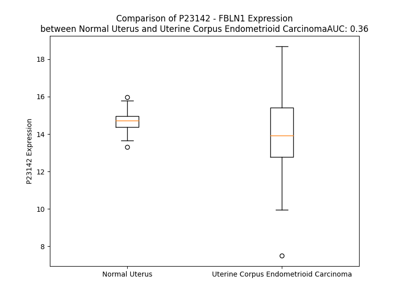

# Detailed Data for P23142

## Introduction to the Detailed Summary

### How to Interpret the Results

- **Summary & Metrics**: This section provides a quick reference to essential protein attributes, including expression changes, family classification, and biomarker applications. Regulation status (upregulated/downregulated) indicates the protein's behavior in a disease context. Some information comes from the original excel file with the proteins selected from literature, while others are derived from the analyses.
- **Expression Comparison**: A visual representation comparing protein expression between normal and disease states. It highlights significant changes in expression levels that might indicate diagnostic or therapeutic relevance. This is data coming from transcriptomics experiments and could not translate similarly to protein levels.
- **Isoform Alignment**: An interactive view of isoform alignments, revealing structural and functional differences between variants of the protein.
- **Interactors & Homologs**: Tables listing known interaction partners and homologous proteins, the more interactors and homologs, the more complex the protein is to design an antibody for.
- **Biological Assemblies**: Information about the structural arrangement of the protein in different assemblies, providing insights into its functional state but also the complexity of the protein to develop antibodies.
- **Combined Per-Residue Information**: A detailed table summarizing residue-level data. This includes predictions for epitope regions, aggregation tendencies, and modifications that might impact the protein's function. Each row corresponds to a residue in the protein, providing insights into specific sites that may be important for research or drug development.
## Summary & Metrics

- **UniProt Accession**: P23142
- **Gene Name**: FBLN1
- **Protein Name**: fibulin 1
- **Swiss Prot**: nan
- **Family**: other
- **Biomarker Application**: unspecified application
- **Number of Isoforms**: 4
- **Regulation**: -1
- **(transcriptomics) AUC**: 0.36
- **(transcriptomics) Fold Change**: 1.05
- **(transcriptomics) Regulation**: Downregulated
- **Discotope Epitope Count**: 184
- **Max n_uniprots (Homo)**: N/A
- **Max n_uniprots (Hetero)**: N/A

## Expression Comparison

## Isoform Alignment

<pre style='font-size:14px; font-family:monospace;'>P23142-1 MERAAPSRRVPLPLLLLGGLALLAAGVDADVLLEACCADGHRMATHQKDCSLPYATESKECRMVQEQCCHSQLEELHCATGISLANEQDRCATPHGDNASLEATFVKRCCHCCLLGRAAQAQGQSCEYSLMVGYQCGQVFQACCVKSQETGDLDVGGLQETDKIIEVEEEQEDPYLNDRCRGGGPCKQQCRDTGDEVVCSCFVGYQLLSDGVSCEDVNECITGSHSCRLGESCINTVGSFRCQRDSSCGTGYELTEDNSCKDIDECESGIHNCLPDFICQNTLGSFRCRPKLQCKSGFIQDALGNCIDINECLSISAPCPIGHTCINTEGSYTCQKNVPNCGRGYHLNEEGTRCVDVDECAPPAEPCGKGHRCVNSPGSFRCECKTGYYFDGISRMCVDVNECQRYPGRLCGHKCENTLGSYLCSCSVGFRLSVDGRSCEDINECSSSPCSQECANVYGSYQCYCRRGYQLSDVDGVTCEDIDECALPTGGHICSYRCINIPGSFQCSCPSSGYRLAPNGRNCQDIDECVTGIHNCSINETCFNIQGGFRCLAFECPENYRRSAATLQQEKTDTVRCIKSCRPNDVTCVFDPVHTI-SHTVISLPTFREFTRPEEIIFLRAITPPHPASQANIIFDITEGNLRDSFDIIKRYMDGMTVGVVRQVRPIVGPFHAVLKLEMNYVVGGVVSHRNVVNVHIFVSEYWF
P23142-2 MERAAPSRRVPLPLLLLGGLALLAAGVDADVLLEACCADGHRMATHQKDCSLPYATESKECRMVQEQCCHSQLEELHCATGISLANEQDRCATPHGDNASLEATFVKRCCHCCLLGRAAQAQGQSCEYSLMVGYQCGQVFQACCVKSQETGDLDVGGLQETDKIIEVEEEQEDPYLNDRCRGGGPCKQQCRDTGDEVVCSCFVGYQLLSDGVSCEDVNECITGSHSCRLGESCINTVGSFRCQRDSSCGTGYELTEDNSCKDIDECESGIHNCLPDFICQNTLGSFRCRPKLQCKSGFIQDALGNCIDINECLSISAPCPIGHTCINTEGSYTCQKNVPNCGRGYHLNEEGTRCVDVDECAPPAEPCGKGHRCVNSPGSFRCECKTGYYFDGISRMCVDVNECQRYPGRLCGHKCENTLGSYLCSCSVGFRLSVDGRSCEDINECSSSPCSQECANVYGSYQCYCRRGYQLSDVDGVTCEDIDECALPTGGHICSYRCINIPGSFQCSCPSSGYRLAPNGRNCQDIDECVTGIHNCSINETCFNIQGGFRCLAFECPENYRRSAAT------------------------------------------------------------------------------------------------------------------------------------------
P23142-3 MERAAPSRRVPLPLLLLGGLALLAAGVDADVLLEACCADGHRMATHQKDCSLPYATESKECRMVQEQCCHSQLEELHCATGISLANEQDRCATPHGDNASLEATFVKRCCHCCLLGRAAQAQGQSCEYSLMVGYQCGQVFQACCVKSQETGDLDVGGLQETDKIIEVEEEQEDPYLNDRCRGGGPCKQQCRDTGDEVVCSCFVGYQLLSDGVSCEDVNECITGSHSCRLGESCINTVGSFRCQRDSSCGTGYELTEDNSCKDIDECESGIHNCLPDFICQNTLGSFRCRPKLQCKSGFIQDALGNCIDINECLSISAPCPIGHTCINTEGSYTCQKNVPNCGRGYHLNEEGTRCVDVDECAPPAEPCGKGHRCVNSPGSFRCECKTGYYFDGISRMCVDVNECQRYPGRLCGHKCENTLGSYLCSCSVGFRLSVDGRSCEDINECSSSPCSQECANVYGSYQCYCRRGYQLSDVDGVTCEDIDECALPTGGHICSYRCINIPGSFQCSCPSSGYRLAPNGRNCQDIDECVTGIHNCSINETCFNIQGGFRCLAFECPENYRRSAATQKSKKGRQNTP---AGSSKEDCRVLPWKQGLEDTHLDA----------------------------------------------------------------------------------------------------
P23142-4 MERAAPSRRVPLPLLLLGGLALLAAGVDADVLLEACCADGHRMATHQKDCSLPYATESKECRMVQEQCCHSQLEELHCATGISLANEQDRCATPHGDNASLEATFVKRCCHCCLLGRAAQAQGQSCEYSLMVGYQCGQVFQACCVKSQETGDLDVGGLQETDKIIEVEEEQEDPYLNDRCRGGGPCKQQCRDTGDEVVCSCFVGYQLLSDGVSCEDVNECITGSHSCRLGESCINTVGSFRCQRDSSCGTGYELTEDNSCKDIDECESGIHNCLPDFICQNTLGSFRCRPKLQCKSGFIQDALGNCIDINECLSISAPCPIGHTCINTEGSYTCQKNVPNCGRGYHLNEEGTRCVDVDECAPPAEPCGKGHRCVNSPGSFRCECKTGYYFDGISRMCVDVNECQRYPGRLCGHKCENTLGSYLCSCSVGFRLSVDGRSCEDINECSSSPCSQECANVYGSYQCYCRRGYQLSDVDGVTCEDIDECALPTGGHICSYRCINIPGSFQCSCPSSGYRLAPNGRNCQDIDECVTGIHNCSINETCFNIQGGFRCLAFECPENYRRSAATRCERLPCH---------ENRECSKLPLRITYYHL--SFP---TNIQAPAVVF--RMGPSSAVPGDSMQLAITGGNEEGFFTTRK---VSPHSGVVALTKPVPEPRDLLLTVKMDLSRHGTVSSF-VAKLFIFVSAEL-
</pre>

## Interactors

| preferredName_A   | preferredName_B   |   score |
|:------------------|:------------------|--------:|
| FBLN1             | FN1               |   0.992 |
| FBLN1             | ACAN              |   0.954 |
| FBLN1             | FBLN2             |   0.948 |
| FBLN1             | RASSF8            |   0.928 |
| FBLN1             | HSPG2             |   0.904 |
| FBLN1             | ELN               |   0.904 |

## Homologs

| uniprot_id   | gene_id   |
|:-------------|:----------|
| C9JQS6       | FBLN2     |
| H0YEU0       | EFEMP2    |
| Q8N2E2       | VWDE      |
| G3V4U0       | FBLN5     |
| C9JUM4       | EFEMP1    |
| F8WDD3       | EYS       |

## Combined Per-Residue Information

|   res | aa   |   epitope_score | epitope   |   relative_surface_accessibility |   modeling_confidence |   Aggregation | modification   | glycosylation                             |
|------:|:-----|----------------:|:----------|---------------------------------:|----------------------:|--------------:|:---------------|:------------------------------------------|
|     1 | M    |         0.13369 | True      |                          1.22321 |                 37.09 |         0     | N/A            | N/A                                       |
|     2 | E    |         0.16704 | True      |                          0.67971 |                 37.03 |         0     | N/A            | N/A                                       |
|     3 | R    |         0.15041 | True      |                          0.83671 |                 39.57 |         0     | N/A            | N/A                                       |
|     4 | A    |         0.1147  | False     |                          0.93752 |                 40.93 |         0     | N/A            | N/A                                       |
|     5 | A    |         0.12288 | True      |                          0.9125  |                 43.8  |         0     | N/A            | N/A                                       |
|     6 | P    |         0.09792 | False     |                          0.98218 |                 47.98 |         0     | N/A            | N/A                                       |
|     7 | S    |         0.08452 | False     |                          0.78681 |                 39.76 |         0     | N/A            | N/A                                       |
|     8 | R    |         0.1787  | True      |                          0.91183 |                 38.99 |         0     | N/A            | N/A                                       |
|     9 | R    |         0.16427 | True      |                          0.94779 |                 34.97 |         0     | N/A            | N/A                                       |
|    10 | V    |         0.06444 | False     |                          0.99336 |                 43.27 |         0     | N/A            | N/A                                       |
|    11 | P    |         0.14194 | True      |                          0.80288 |                 37.76 |         0     | N/A            | N/A                                       |
|    12 | L    |         0.10635 | False     |                          0.89216 |                 32.39 |         0     | N/A            | N/A                                       |
|    13 | P    |         0.12012 | True      |                          0.93006 |                 39.45 |         0.816 | N/A            | N/A                                       |
|    14 | L    |         0.10396 | False     |                          0.83002 |                 34.8  |        54.603 | N/A            | N/A                                       |
|    15 | L    |         0.12019 | True      |                          0.99605 |                 38.67 |        64.181 | N/A            | N/A                                       |
|    16 | L    |         0.23072 | True      |                          0.87001 |                 35.54 |        65.881 | N/A            | N/A                                       |
|    17 | L    |         0.1608  | True      |                          1.04826 |                 38.85 |        66.145 | N/A            | N/A                                       |
|    18 | G    |         0.18019 | True      |                          0.97363 |                 35.84 |        65.951 | N/A            | N/A                                       |
|    19 | G    |         0.22781 | True      |                          0.8059  |                 35.24 |        65.181 | N/A            | N/A                                       |
|    20 | L    |         0.14303 | True      |                          1.07546 |                 36.64 |        69.402 | N/A            | N/A                                       |
|    21 | A    |         0.12793 | True      |                          0.76781 |                 33.63 |        69.044 | N/A            | N/A                                       |
|    22 | L    |         0.13055 | True      |                          1.13038 |                 37.08 |        68.519 | N/A            | N/A                                       |
|    23 | L    |         0.14859 | True      |                          1.0452  |                 33.64 |        64.74  | N/A            | N/A                                       |
|    24 | A    |         0.17526 | True      |                          0.95183 |                 30.8  |        43.796 | N/A            | N/A                                       |
|    25 | A    |         0.23332 | True      |                          1.06306 |                 32.61 |        24.112 | N/A            | N/A                                       |
|    26 | G    |         0.17432 | True      |                          0.81956 |                 33.71 |         7.161 | N/A            | N/A                                       |
|    27 | V    |         0.1431  | True      |                          0.93894 |                 36.36 |         6.642 | N/A            | N/A                                       |
|    28 | D    |         0.15555 | True      |                          0.97163 |                 36.85 |         0     | N/A            | N/A                                       |
|    29 | A    |         0.08949 | False     |                          0.65833 |                 43.83 |         0     | N/A            | N/A                                       |
|    30 | D    |         0.11629 | True      |                          0.83291 |                 48.36 |         0     | N/A            | N/A                                       |
|    31 | V    |         0.09279 | False     |                          0.54673 |                 59.73 |         0     | N/A            | N/A                                       |
|    32 | L    |         0.14301 | True      |                          0.71356 |                 71.75 |         0     | N/A            | N/A                                       |
|    33 | L    |         0.11447 | False     |                          0.67343 |                 80.17 |         0     | N/A            | N/A                                       |
|    34 | E    |         0.09614 | False     |                          0.69707 |                 84.81 |         0     | N/A            | N/A                                       |
|    35 | A    |         0.05686 | False     |                          0.60674 |                 86.19 |         0     | N/A            | N/A                                       |
|    36 | C    |         0.02709 | False     |                          0.04012 |                 87.96 |         0     | N/A            | N/A                                       |
|    37 | C    |         0.0548  | False     |                          0.22204 |                 89.6  |         0     | N/A            | N/A                                       |
|    38 | A    |         0.09169 | False     |                          0.53955 |                 88.38 |         0     | N/A            | N/A                                       |
|    39 | D    |         0.07451 | False     |                          0.30203 |                 86.27 |         0     | N/A            | N/A                                       |
|    40 | G    |         0.02458 | False     |                          0.00805 |                 87.08 |         0     | N/A            | N/A                                       |
|    41 | H    |         0.0478  | False     |                          0.35149 |                 88.55 |         0     | N/A            | N/A                                       |
|    42 | R    |         0.11471 | False     |                          0.60646 |                 87.15 |         0     | N/A            | N/A                                       |
|    43 | M    |         0.03009 | False     |                          0.19459 |                 82.33 |         0     | N/A            | N/A                                       |
|    44 | A    |         0.00502 | False     |                          0.01324 |                 83.94 |         0     | N/A            | N/A                                       |
|    45 | T    |         0.07242 | False     |                          0.52776 |                 83.06 |         0     | N/A            | N/A                                       |
|    46 | H    |         0.15696 | True      |                          0.82337 |                 81.1  |         0     | N/A            | N/A                                       |
|    47 | Q    |         0.15829 | True      |                          0.48026 |                 69.57 |         0     | N/A            | N/A                                       |
|    48 | K    |         0.09922 | False     |                          0.56929 |                 71.55 |         0     | N/A            | N/A                                       |
|    49 | D    |         0.03498 | False     |                          0.38341 |                 73.91 |         0     | N/A            | N/A                                       |
|    50 | C    |         0.02619 | False     |                          0.09047 |                 79.91 |         0     | N/A            | N/A                                       |
|    51 | S    |         0.09157 | False     |                          0.73462 |                 70.42 |         0     | N/A            | N/A                                       |
|    52 | L    |         0.08032 | False     |                          0.53237 |                 63.09 |         0     | N/A            | N/A                                       |
|    53 | P    |         0.07449 | False     |                          0.87455 |                 60.87 |         0     | N/A            | N/A                                       |
|    54 | Y    |         0.05432 | False     |                          0.1458  |                 61.16 |         0     | N/A            | N/A                                       |
|    55 | A    |         0.09225 | False     |                          1.06617 |                 59.88 |         0     | N/A            | N/A                                       |
|    56 | T    |         0.06675 | False     |                          0.38285 |                 63.58 |         0     | N/A            | N/A                                       |
|    57 | E    |         0.09792 | False     |                          0.9459  |                 61.9  |         0     | N/A            | N/A                                       |
|    58 | S    |         0.06652 | False     |                          0.23115 |                 76.95 |         0     | N/A            | N/A                                       |
|    59 | K    |         0.08034 | False     |                          0.65079 |                 81.9  |         0     | N/A            | N/A                                       |
|    60 | E    |         0.1051  | False     |                          0.49861 |                 83.23 |         0     | N/A            | N/A                                       |
|    61 | C    |         0.03045 | False     |                          0.0401  |                 86.64 |         0     | N/A            | N/A                                       |
|    62 | R    |         0.06335 | False     |                          0.47241 |                 85.59 |         0     | N/A            | N/A                                       |
|    63 | M    |         0.07663 | False     |                          0.54456 |                 83.69 |         0     | N/A            | N/A                                       |
|    64 | V    |         0.05966 | False     |                          0.2047  |                 86.96 |         0     | N/A            | N/A                                       |
|    65 | Q    |         0.01268 | False     |                          0.03294 |                 87.61 |         0     | N/A            | N/A                                       |
|    66 | E    |         0.04345 | False     |                          0.4166  |                 86.84 |         0     | N/A            | N/A                                       |
|    67 | Q    |         0.09885 | False     |                          0.65228 |                 87.34 |         0     | N/A            | N/A                                       |
|    68 | C    |         0.03466 | False     |                          0.12494 |                 88.98 |         0     | N/A            | N/A                                       |
|    69 | C    |         0.00302 | False     |                          0       |                 89.17 |         0     | N/A            | N/A                                       |
|    70 | H    |         0.04873 | False     |                          0.31373 |                 87.11 |         0     | N/A            | N/A                                       |
|    71 | S    |         0.04175 | False     |                          0.41215 |                 85.82 |         0     | N/A            | N/A                                       |
|    72 | Q    |         0.04783 | False     |                          0.16696 |                 87.58 |         0     | N/A            | N/A                                       |
|    73 | L    |         0.00942 | False     |                          0.02473 |                 85.72 |         0     | N/A            | N/A                                       |
|    74 | E    |         0.02236 | False     |                          0.1062  |                 83.98 |         0     | N/A            | N/A                                       |
|    75 | E    |         0.08391 | False     |                          0.54398 |                 83.74 |         0     | N/A            | N/A                                       |
|    76 | L    |         0.05135 | False     |                          0.48206 |                 81.96 |         0     | N/A            | N/A                                       |
|    77 | H    |         0.03385 | False     |                          0.10816 |                 86.29 |         0     | N/A            | N/A                                       |
|    78 | C    |         0.02126 | False     |                          0.06431 |                 87.87 |         0     | N/A            | N/A                                       |
|    79 | A    |         0.0823  | False     |                          0.60387 |                 85.9  |         0     | N/A            | N/A                                       |
|    80 | T    |         0.06787 | False     |                          0.53396 |                 86.53 |         0     | N/A            | N/A                                       |
|    81 | G    |         0.00641 | False     |                          0       |                 87.88 |         0     | N/A            | N/A                                       |
|    82 | I    |         0.02569 | False     |                          0.25919 |                 88.17 |         0     | N/A            | N/A                                       |
|    83 | S    |         0.03856 | False     |                          0.38889 |                 87.1  |         0     | N/A            | N/A                                       |
|    84 | L    |         0.03382 | False     |                          0.12495 |                 88.12 |         0     | N/A            | N/A                                       |
|    85 | A    |         0.00298 | False     |                          0.00377 |                 88    |         0     | N/A            | N/A                                       |
|    86 | N    |         0.05515 | False     |                          0.5336  |                 85.32 |         0     | N/A            | N/A                                       |
|    87 | E    |         0.07657 | False     |                          0.70421 |                 83.69 |         0     | N/A            | N/A                                       |
|    88 | Q    |         0.06586 | False     |                          0.43638 |                 75.26 |         0     | N/A            | N/A                                       |
|    89 | D    |         0.07194 | False     |                          0.7517  |                 72.79 |         0     | N/A            | N/A                                       |
|    90 | R    |         0.13391 | True      |                          0.75622 |                 79.8  |         0     | N/A            | N/A                                       |
|    91 | C    |         0.02941 | False     |                          0.08401 |                 83.19 |         0     | N/A            | N/A                                       |
|    92 | A    |         0.10123 | False     |                          0.60695 |                 72.24 |         0     | N/A            | N/A                                       |
|    93 | T    |         0.05947 | False     |                          0.29808 |                 61.51 |         0     | N/A            | N/A                                       |
|    94 | P    |         0.12879 | True      |                          0.88047 |                 55.44 |         0     | N/A            | N/A                                       |
|    95 | H    |         0.1265  | True      |                          0.80698 |                 55.21 |         0     | N/A            | N/A                                       |
|    96 | G    |         0.17699 | True      |                          0.99324 |                 50.45 |         0     | N/A            | N/A                                       |
|    97 | D    |         0.09038 | False     |                          0.65249 |                 48.42 |         0     | N/A            | N/A                                       |
|    98 | N    |         0.16299 | True      |                          0.86142 |                 52.63 |         0     | N/A            | N-linked (GlcNAc...) (complex) asparagine |
|    99 | A    |         0.12581 | True      |                          0.9283  |                 61.25 |         0     | N/A            | N/A                                       |
|   100 | S    |         0.05147 | False     |                          0.37008 |                 73.54 |         0     | N/A            | N/A                                       |
|   101 | L    |         0.06696 | False     |                          0.51484 |                 72.95 |         0     | N/A            | N/A                                       |
|   102 | E    |         0.09273 | False     |                          0.37301 |                 79.14 |         0     | N/A            | N/A                                       |
|   103 | A    |         0.01696 | False     |                          0.17669 |                 81.61 |         0     | N/A            | N/A                                       |
|   104 | T    |         0.07351 | False     |                          0.58874 |                 83.5  |         0     | N/A            | N/A                                       |
|   105 | F    |         0.02406 | False     |                          0.10265 |                 85.78 |         0     | N/A            | N/A                                       |
|   106 | V    |         0.01787 | False     |                          0.12567 |                 87.46 |         0     | N/A            | N/A                                       |
|   107 | K    |         0.03556 | False     |                          0.43461 |                 88.67 |         0     | N/A            | N/A                                       |
|   108 | R    |         0.06644 | False     |                          0.36627 |                 87.98 |         0     | N/A            | N/A                                       |
|   109 | C    |         0.00978 | False     |                          0.00655 |                 90.48 |         0     | N/A            | N/A                                       |
|   110 | C    |         0.00182 | False     |                          0       |                 92.01 |         0     | N/A            | N/A                                       |
|   111 | H    |         0.06407 | False     |                          0.45124 |                 90.94 |         0     | N/A            | N/A                                       |
|   112 | C    |         0.00982 | False     |                          0.01684 |                 91.12 |         0     | N/A            | N/A                                       |
|   113 | C    |         0.00259 | False     |                          0       |                 91.91 |         0     | N/A            | N/A                                       |
|   114 | L    |         0.0415  | False     |                          0.24026 |                 91.75 |         0     | N/A            | N/A                                       |
|   115 | L    |         0.05616 | False     |                          0.48022 |                 88.98 |         0     | N/A            | N/A                                       |
|   116 | G    |         0.00655 | False     |                          0       |                 89.04 |         0     | N/A            | N/A                                       |
|   117 | R    |         0.04021 | False     |                          0.36888 |                 89.99 |         0     | N/A            | N/A                                       |
|   118 | A    |         0.0338  | False     |                          0.40066 |                 87.95 |         0     | N/A            | N/A                                       |
|   119 | A    |         0.02806 | False     |                          0.0596  |                 86.59 |         0     | N/A            | N/A                                       |
|   120 | Q    |         0.02651 | False     |                          0.31327 |                 85.91 |         0     | N/A            | N/A                                       |
|   121 | A    |         0.05451 | False     |                          0.86115 |                 85.93 |         0     | N/A            | N/A                                       |
|   122 | Q    |         0.0801  | False     |                          0.64407 |                 85.57 |         0     | N/A            | N/A                                       |
|   123 | G    |         0.08212 | False     |                          0.86041 |                 80.23 |         0     | N/A            | N/A                                       |
|   124 | Q    |         0.08985 | False     |                          0.5096  |                 80.12 |         0     | N/A            | N/A                                       |
|   125 | S    |         0.12818 | True      |                          0.51244 |                 79.11 |         0     | N/A            | N/A                                       |
|   126 | C    |         0.01478 | False     |                          0.19815 |                 81.03 |         0     | N/A            | N/A                                       |
|   127 | E    |         0.1446  | True      |                          0.7907  |                 72.1  |         0     | N/A            | N/A                                       |
|   128 | Y    |         0.12544 | True      |                          0.66748 |                 58.39 |         0.817 | N/A            | N/A                                       |
|   129 | S    |         0.07242 | False     |                          0.76245 |                 56.51 |         0.817 | N/A            | N/A                                       |
|   130 | L    |         0.06561 | False     |                          0.22032 |                 56.76 |         2.077 | N/A            | N/A                                       |
|   131 | M    |         0.12003 | True      |                          0.89478 |                 59.87 |         2.077 | N/A            | N/A                                       |
|   132 | V    |         0.08274 | False     |                          0.48197 |                 62.14 |         2.077 | N/A            | N/A                                       |
|   133 | G    |         0.12512 | True      |                          0.55772 |                 67.85 |         1.443 | N/A            | N/A                                       |
|   134 | Y    |         0.12141 | True      |                          0.79376 |                 77.21 |         1.443 | N/A            | N/A                                       |
|   135 | Q    |         0.03778 | False     |                          0.14932 |                 80.45 |         0     | N/A            | N/A                                       |
|   136 | C    |         0.01266 | False     |                          0.00466 |                 86.29 |         0     | N/A            | N/A                                       |
|   137 | G    |         0.02501 | False     |                          0.24651 |                 85.35 |         0     | N/A            | N/A                                       |
|   138 | Q    |         0.10117 | False     |                          0.48387 |                 85.82 |         0     | N/A            | N/A                                       |
|   139 | V    |         0.01762 | False     |                          0.05889 |                 88.64 |         0     | N/A            | N/A                                       |
|   140 | F    |         0.02389 | False     |                          0.02803 |                 89.91 |         0     | N/A            | N/A                                       |
|   141 | Q    |         0.04611 | False     |                          0.45578 |                 87.41 |         0     | N/A            | N/A                                       |
|   142 | A    |         0.06528 | False     |                          0.48813 |                 86.93 |         0     | N/A            | N/A                                       |
|   143 | C    |         0.01814 | False     |                          0.04814 |                 90.21 |         0     | N/A            | N/A                                       |
|   144 | C    |         0.00289 | False     |                          0.00148 |                 89.18 |         0     | N/A            | N/A                                       |
|   145 | V    |         0.04595 | False     |                          0.49984 |                 81.63 |         0     | N/A            | N/A                                       |
|   146 | K    |         0.09674 | False     |                          0.68371 |                 67.54 |         0     | N/A            | N/A                                       |
|   147 | S    |         0.03873 | False     |                          0.34436 |                 57.36 |         0     | N/A            | N/A                                       |
|   148 | Q    |         0.09695 | False     |                          0.64596 |                 51.04 |         0     | N/A            | N/A                                       |
|   149 | E    |         0.14503 | True      |                          0.76021 |                 48.9  |         0     | N/A            | N/A                                       |
|   150 | T    |         0.19997 | True      |                          0.89794 |                 42.09 |         0     | N/A            | N/A                                       |
|   151 | G    |         0.12375 | True      |                          0.67523 |                 33.83 |         0     | N/A            | N/A                                       |
|   152 | D    |         0.14964 | True      |                          0.9327  |                 32.75 |         0     | N/A            | N/A                                       |
|   153 | L    |         0.16174 | True      |                          1.13417 |                 28.79 |         0     | N/A            | N/A                                       |
|   154 | D    |         0.20428 | True      |                          0.81145 |                 29.95 |         0     | N/A            | N/A                                       |
|   155 | V    |         0.18261 | True      |                          1.01882 |                 30.47 |         0     | N/A            | N/A                                       |
|   156 | G    |         0.17133 | True      |                          0.94692 |                 30.87 |         0     | N/A            | N/A                                       |
|   157 | G    |         0.17721 | True      |                          0.84447 |                 27.97 |         0     | N/A            | N/A                                       |
|   158 | L    |         0.20537 | True      |                          1.1367  |                 31.73 |         0     | N/A            | N/A                                       |
|   159 | Q    |         0.11315 | False     |                          0.86322 |                 26.31 |         0     | N/A            | N/A                                       |
|   160 | E    |         0.16264 | True      |                          0.91623 |                 33.32 |         0     | N/A            | N/A                                       |
|   161 | T    |         0.11172 | False     |                          0.86851 |                 27.25 |         0     | N/A            | N/A                                       |
|   162 | D    |         0.18996 | True      |                          0.70307 |                 32.74 |         0     | N/A            | N/A                                       |
|   163 | K    |         0.08899 | False     |                          0.84505 |                 30.97 |         0     | N/A            | N/A                                       |
|   164 | I    |         0.10799 | False     |                          1.01041 |                 32.6  |         0     | N/A            | N/A                                       |
|   165 | I    |         0.08491 | False     |                          0.86532 |                 29.89 |         0     | N/A            | N/A                                       |
|   166 | E    |         0.11998 | True      |                          0.88411 |                 32.54 |         0     | N/A            | N/A                                       |
|   167 | V    |         0.06978 | False     |                          0.88352 |                 34.59 |         0     | N/A            | N/A                                       |
|   168 | E    |         0.1052  | False     |                          0.8629  |                 34.44 |         0     | N/A            | N/A                                       |
|   169 | E    |         0.18052 | True      |                          0.87708 |                 35.69 |         0     | N/A            | N/A                                       |
|   170 | E    |         0.18618 | True      |                          0.86074 |                 37.8  |         0     | N/A            | N/A                                       |
|   171 | Q    |         0.1347  | True      |                          0.93322 |                 43.33 |         0     | N/A            | N/A                                       |
|   172 | E    |         0.12925 | True      |                          0.75422 |                 44.3  |         0     | N/A            | N/A                                       |
|   173 | D    |         0.12633 | True      |                          0.45681 |                 50.09 |         0     | N/A            | N/A                                       |
|   174 | P    |         0.1949  | True      |                          0.89995 |                 56.78 |         0     | N/A            | N/A                                       |
|   175 | Y    |         0.17803 | True      |                          0.69154 |                 54.68 |         0     | N/A            | N/A                                       |
|   176 | L    |         0.25831 | True      |                          0.70828 |                 56.35 |         0     | N/A            | N/A                                       |
|   177 | N    |         0.12616 | True      |                          0.86849 |                 60.66 |         0     | N/A            | N/A                                       |
|   178 | D    |         0.09137 | False     |                          0.36813 |                 70.24 |         0     | N/A            | N/A                                       |
|   179 | R    |         0.13322 | True      |                          0.4344  |                 77.34 |         0     | N/A            | N/A                                       |
|   180 | C    |         0.03273 | False     |                          0.148   |                 82.51 |         0     | N/A            | N/A                                       |
|   181 | R    |         0.18639 | True      |                          0.73382 |                 70.59 |         0     | N/A            | N/A                                       |
|   182 | G    |         0.15272 | True      |                          1.04079 |                 68.89 |         0     | N/A            | N/A                                       |
|   183 | G    |         0.14399 | True      |                          0.52873 |                 66.61 |         0     | N/A            | N/A                                       |
|   184 | G    |         0.08855 | False     |                          0.40089 |                 77.51 |         0     | N/A            | N/A                                       |
|   185 | P    |         0.10737 | False     |                          0.57203 |                 85.07 |         0     | N/A            | N/A                                       |
|   186 | C    |         0.06384 | False     |                          0.10934 |                 87.7  |         0     | N/A            | N/A                                       |
|   187 | K    |         0.12846 | True      |                          0.76549 |                 87.44 |         0     | N/A            | N/A                                       |
|   188 | Q    |         0.05175 | False     |                          0.25136 |                 87.46 |         0     | N/A            | N/A                                       |
|   189 | Q    |         0.04224 | False     |                          0.32591 |                 88.94 |         0     | N/A            | N/A                                       |
|   190 | C    |         0.04387 | False     |                          0.25834 |                 89.91 |         0     | N/A            | N/A                                       |
|   191 | R    |         0.08386 | False     |                          0.70405 |                 86.87 |         0     | N/A            | N/A                                       |
|   192 | D    |         0.0866  | False     |                          0.23777 |                 84.57 |         0     | N/A            | N/A                                       |
|   193 | T    |         0.12363 | True      |                          0.52146 |                 80.28 |         0     | N/A            | N/A                                       |
|   194 | G    |         0.22965 | True      |                          0.76413 |                 75.86 |         0     | N/A            | N/A                                       |
|   195 | D    |         0.11587 | True      |                          0.84449 |                 79.68 |         0     | N/A            | N/A                                       |
|   196 | E    |         0.15854 | True      |                          0.55324 |                 84    |         0     | N/A            | N/A                                       |
|   197 | V    |         0.10336 | False     |                          0.29514 |                 85.48 |         0.978 | N/A            | N/A                                       |
|   198 | V    |         0.0841  | False     |                          0.46188 |                 88.94 |         1.151 | N/A            | N/A                                       |
|   199 | C    |         0.04778 | False     |                          0.08769 |                 90.67 |         1.151 | N/A            | N/A                                       |
|   200 | S    |         0.04481 | False     |                          0.3961  |                 90.7  |         1.151 | N/A            | N/A                                       |
|   201 | C    |         0.05782 | False     |                          0.1971  |                 90.97 |         1.84  | N/A            | N/A                                       |
|   202 | F    |         0.08681 | False     |                          0.57016 |                 89.5  |         3.537 | N/A            | N/A                                       |
|   203 | V    |         0.09874 | False     |                          1.07521 |                 87.49 |         3.537 | N/A            | N/A                                       |
|   204 | G    |         0.03519 | False     |                          0.20343 |                 84.11 |         2.617 | N/A            | N/A                                       |
|   205 | Y    |         0.08487 | False     |                          0.27409 |                 91.24 |         2.617 | N/A            | N/A                                       |
|   206 | Q    |         0.08722 | False     |                          0.53929 |                 89.62 |         1.902 | N/A            | N/A                                       |
|   207 | L    |         0.06359 | False     |                          0.40912 |                 91.38 |         1.902 | N/A            | N/A                                       |
|   208 | L    |         0.06773 | False     |                          0.43768 |                 90.06 |         1.379 | N/A            | N/A                                       |
|   209 | S    |         0.14442 | True      |                          0.99732 |                 88.22 |         0.13  | N/A            | N/A                                       |
|   210 | D    |         0.08249 | False     |                          0.5148  |                 85.91 |         0     | N/A            | N/A                                       |
|   211 | G    |         0.10573 | False     |                          0.38563 |                 84.46 |         0     | N/A            | N/A                                       |
|   212 | V    |         0.07356 | False     |                          0.33153 |                 87.26 |         0     | N/A            | N/A                                       |
|   213 | S    |         0.10962 | False     |                          0.22015 |                 88.99 |         0     | N/A            | N/A                                       |
|   214 | C    |         0.07587 | False     |                          0.18458 |                 90.58 |         0     | N/A            | N/A                                       |
|   215 | E    |         0.09925 | False     |                          0.42344 |                 90.43 |         0     | N/A            | N/A                                       |
|   216 | D    |         0.11134 | False     |                          0.29232 |                 90.59 |         0     | N/A            | N/A                                       |
|   217 | V    |         0.06146 | False     |                          0.28657 |                 89.82 |         0     | N/A            | N/A                                       |
|   218 | N    |         0.05263 | False     |                          0.26843 |                 88.9  |         0     | N/A            | N/A                                       |
|   219 | E    |         0.04922 | False     |                          0.10008 |                 90.67 |         0     | N/A            | N/A                                       |
|   220 | C    |         0.04089 | False     |                          0.28464 |                 88.94 |         0     | N/A            | N/A                                       |
|   221 | I    |         0.11662 | True      |                          0.84762 |                 88.04 |         0     | N/A            | N/A                                       |
|   222 | T    |         0.14906 | True      |                          0.61906 |                 85.23 |         0     | N/A            | N/A                                       |
|   223 | G    |         0.1478  | True      |                          0.63748 |                 82.45 |         0     | N/A            | N/A                                       |
|   224 | S    |         0.12178 | True      |                          0.58236 |                 84.7  |         0     | N/A            | N/A                                       |
|   225 | H    |         0.09671 | False     |                          0.36571 |                 84.47 |         0     | N/A            | N/A                                       |
|   226 | S    |         0.18218 | True      |                          0.74071 |                 86.17 |         0     | N/A            | N/A                                       |
|   227 | C    |         0.06942 | False     |                          0.17583 |                 82.21 |         0     | N/A            | N/A                                       |
|   228 | R    |         0.1494  | True      |                          0.76101 |                 76.06 |         0     | N/A            | N/A                                       |
|   229 | L    |         0.10232 | False     |                          1.18137 |                 68.48 |         0     | N/A            | N/A                                       |
|   230 | G    |         0.04353 | False     |                          0.49641 |                 65.17 |         0     | N/A            | N/A                                       |
|   231 | E    |         0.11141 | False     |                          0.2483  |                 74.24 |         0     | N/A            | N/A                                       |
|   232 | S    |         0.03948 | False     |                          0.3384  |                 83.1  |         0     | N/A            | N/A                                       |
|   233 | C    |         0.02965 | False     |                          0.226   |                 86.65 |         0     | N/A            | N/A                                       |
|   234 | I    |         0.04423 | False     |                          0.36078 |                 88.16 |         0     | N/A            | N/A                                       |
|   235 | N    |         0.05338 | False     |                          0.31242 |                 86.73 |         0     | N/A            | N/A                                       |
|   236 | T    |         0.08732 | False     |                          0.36268 |                 86.59 |         0     | N/A            | N/A                                       |
|   237 | V    |         0.12517 | True      |                          0.92255 |                 87.36 |         0     | N/A            | N/A                                       |
|   238 | G    |         0.0834  | False     |                          0.25902 |                 83.48 |         0     | N/A            | N/A                                       |
|   239 | S    |         0.11597 | True      |                          0.4129  |                 88.62 |         0     | N/A            | N/A                                       |
|   240 | F    |         0.11991 | True      |                          0.26688 |                 90.08 |         0     | N/A            | N/A                                       |
|   241 | R    |         0.17845 | True      |                          0.59316 |                 89.36 |         0     | N/A            | N/A                                       |
|   242 | C    |         0.05848 | False     |                          0.38928 |                 85.14 |         0     | N/A            | N/A                                       |
|   243 | Q    |         0.07999 | False     |                          0.49759 |                 77.79 |         0     | N/A            | N/A                                       |
|   244 | R    |         0.08815 | False     |                          0.78143 |                 66.15 |         0     | N/A            | N/A                                       |
|   245 | D    |         0.09527 | False     |                          0.56852 |                 58.96 |         0     | N/A            | N/A                                       |
|   246 | S    |         0.08059 | False     |                          0.60229 |                 60.53 |         0     | N/A            | N/A                                       |
|   247 | S    |         0.11321 | False     |                          0.82042 |                 58.17 |         0     | N/A            | N/A                                       |
|   248 | C    |         0.0773  | False     |                          0.20839 |                 61.74 |         0     | N/A            | N/A                                       |
|   249 | G    |         0.12213 | True      |                          0.56269 |                 63.62 |         0     | N/A            | N/A                                       |
|   250 | T    |         0.15    | True      |                          0.98567 |                 69.95 |         0     | N/A            | N/A                                       |
|   251 | G    |         0.03555 | False     |                          0.218   |                 73.45 |         0     | N/A            | N/A                                       |
|   252 | Y    |         0.10895 | False     |                          0.3605  |                 80.41 |         0     | N/A            | N/A                                       |
|   253 | E    |         0.11452 | False     |                          0.40994 |                 80.42 |         0     | N/A            | N/A                                       |
|   254 | L    |         0.0663  | False     |                          0.57528 |                 69.03 |         0     | N/A            | N/A                                       |
|   255 | T    |         0.13579 | True      |                          0.28793 |                 71.25 |         0     | N/A            | N/A                                       |
|   256 | E    |         0.19587 | True      |                          0.97243 |                 71.25 |         0     | N/A            | N/A                                       |
|   257 | D    |         0.14382 | True      |                          0.80552 |                 72.08 |         0     | N/A            | N/A                                       |
|   258 | N    |         0.1066  | False     |                          0.79532 |                 63.82 |         0     | N/A            | N/A                                       |
|   259 | S    |         0.09536 | False     |                          0.44532 |                 66.27 |         0     | N/A            | N/A                                       |
|   260 | C    |         0.11778 | True      |                          0.51514 |                 73.52 |         0     | N/A            | N/A                                       |
|   261 | K    |         0.15252 | True      |                          0.57225 |                 82.99 |         0     | N/A            | N/A                                       |
|   262 | D    |         0.10445 | False     |                          0.18314 |                 85.52 |         0     | N/A            | N/A                                       |
|   263 | I    |         0.1     | False     |                          0.29759 |                 85.45 |         0     | N/A            | N/A                                       |
|   264 | D    |         0.05015 | False     |                          0.29167 |                 88.2  |         0     | N/A            | N/A                                       |
|   265 | E    |         0.04207 | False     |                          0.07411 |                 88.22 |         0     | N/A            | N/A                                       |
|   266 | C    |         0.03761 | False     |                          0.28387 |                 88.45 |         0     | N/A            | N/A                                       |
|   267 | E    |         0.13744 | True      |                          0.80104 |                 87.98 |         0     | N/A            | N/A                                       |
|   268 | S    |         0.1374  | True      |                          0.50055 |                 83.15 |         0     | N/A            | N/A                                       |
|   269 | G    |         0.11737 | True      |                          0.6487  |                 82.25 |         0     | N/A            | N/A                                       |
|   270 | I    |         0.14527 | True      |                          0.65111 |                 85.05 |         0     | N/A            | N/A                                       |
|   271 | H    |         0.09296 | False     |                          0.3288  |                 85.32 |         0     | N/A            | N/A                                       |
|   272 | N    |         0.18317 | True      |                          0.7878  |                 85.46 |         0     | N/A            | N/A                                       |
|   273 | C    |         0.07459 | False     |                          0.14043 |                 82.02 |         0     | N/A            | N/A                                       |
|   274 | L    |         0.09321 | False     |                          0.50406 |                 76.45 |         0     | N/A            | N/A                                       |
|   275 | P    |         0.16564 | True      |                          0.83415 |                 79.04 |         0     | N/A            | N/A                                       |
|   276 | D    |         0.09249 | False     |                          0.61967 |                 71.41 |         0     | N/A            | N/A                                       |
|   277 | F    |         0.07224 | False     |                          0.10797 |                 75.65 |         0     | N/A            | N/A                                       |
|   278 | I    |         0.08829 | False     |                          0.59716 |                 84.33 |         0     | N/A            | N/A                                       |
|   279 | C    |         0.03432 | False     |                          0.22616 |                 87.78 |         0     | N/A            | N/A                                       |
|   280 | Q    |         0.03835 | False     |                          0.36681 |                 88.57 |         0     | N/A            | N/A                                       |
|   281 | N    |         0.05118 | False     |                          0.31426 |                 83.88 |         0     | N/A            | N/A                                       |
|   282 | T    |         0.08187 | False     |                          0.3556  |                 83.88 |         0     | N/A            | N/A                                       |
|   283 | L    |         0.17652 | True      |                          0.9442  |                 83.18 |         0     | N/A            | N/A                                       |
|   284 | G    |         0.07817 | False     |                          0.22686 |                 77.98 |         0     | N/A            | N/A                                       |
|   285 | S    |         0.10125 | False     |                          0.40765 |                 84.28 |         0     | N/A            | N/A                                       |
|   286 | F    |         0.12049 | True      |                          0.2379  |                 87.76 |         0     | N/A            | N/A                                       |
|   287 | R    |         0.11999 | True      |                          0.40437 |                 84.69 |         0     | N/A            | N/A                                       |
|   288 | C    |         0.05321 | False     |                          0.32327 |                 82.98 |         0     | N/A            | N/A                                       |
|   289 | R    |         0.09405 | False     |                          0.47947 |                 75.36 |         0     | N/A            | N/A                                       |
|   290 | P    |         0.06531 | False     |                          0.37724 |                 68.08 |         0     | N/A            | N/A                                       |
|   291 | K    |         0.27007 | True      |                          0.62851 |                 72.28 |         0     | N/A            | N/A                                       |
|   292 | L    |         0.13128 | True      |                          0.76311 |                 66.8  |         0     | N/A            | N/A                                       |
|   293 | Q    |         0.11796 | True      |                          0.85948 |                 65.63 |         0     | N/A            | N/A                                       |
|   294 | C    |         0.08577 | False     |                          0.28225 |                 68.63 |         0     | N/A            | N/A                                       |
|   295 | K    |         0.18615 | True      |                          0.84464 |                 73.4  |         0     | N/A            | N/A                                       |
|   296 | S    |         0.16515 | True      |                          0.8883  |                 76.06 |         0     | N/A            | N/A                                       |
|   297 | G    |         0.04466 | False     |                          0.21449 |                 75.24 |         0     | N/A            | N/A                                       |
|   298 | F    |         0.08504 | False     |                          0.25934 |                 81.17 |         0     | N/A            | N/A                                       |
|   299 | I    |         0.07878 | False     |                          0.56797 |                 78.23 |         0     | N/A            | N/A                                       |
|   300 | Q    |         0.07445 | False     |                          0.33564 |                 70.98 |         0     | N/A            | N/A                                       |
|   301 | D    |         0.11071 | False     |                          0.23745 |                 69.38 |         0     | N/A            | N/A                                       |
|   302 | A    |         0.1185  | True      |                          0.97617 |                 63.77 |         0     | N/A            | N/A                                       |
|   303 | L    |         0.08946 | False     |                          0.64336 |                 63.15 |         0     | N/A            | N/A                                       |
|   304 | G    |         0.06395 | False     |                          0.14334 |                 65.22 |         0     | N/A            | N/A                                       |
|   305 | N    |         0.10044 | False     |                          0.50093 |                 70.94 |         0     | N/A            | N/A                                       |
|   306 | C    |         0.11677 | True      |                          0.35735 |                 77.28 |         0     | N/A            | N/A                                       |
|   307 | I    |         0.06102 | False     |                          0.44078 |                 81.27 |         0     | N/A            | N/A                                       |
|   308 | D    |         0.07824 | False     |                          0.20096 |                 84.13 |         0     | N/A            | N/A                                       |
|   309 | I    |         0.07707 | False     |                          0.38238 |                 82.28 |         0     | N/A            | N/A                                       |
|   310 | N    |         0.05664 | False     |                          0.37674 |                 81.46 |         0     | N/A            | N/A                                       |
|   311 | E    |         0.05982 | False     |                          0.19834 |                 84.35 |         0     | N/A            | N/A                                       |
|   312 | C    |         0.03472 | False     |                          0.26674 |                 82.56 |         0     | N/A            | N/A                                       |
|   313 | L    |         0.13141 | True      |                          0.88146 |                 80.05 |         0     | N/A            | N/A                                       |
|   314 | S    |         0.17242 | True      |                          0.43603 |                 70.45 |         0     | N/A            | N/A                                       |
|   315 | I    |         0.11868 | True      |                          1.11619 |                 67.93 |         0     | N/A            | N/A                                       |
|   316 | S    |         0.09768 | False     |                          0.60495 |                 69.6  |         0     | N/A            | N/A                                       |
|   317 | A    |         0.08393 | False     |                          0.8541  |                 64.85 |         0     | N/A            | N/A                                       |
|   318 | P    |         0.11174 | False     |                          0.30735 |                 73.61 |         0     | N/A            | N/A                                       |
|   319 | C    |         0.08768 | False     |                          0.13563 |                 77.59 |         0     | N/A            | N/A                                       |
|   320 | P    |         0.14157 | True      |                          0.6489  |                 75.19 |         0     | N/A            | N/A                                       |
|   321 | I    |         0.15488 | True      |                          1.09529 |                 69.11 |         0     | N/A            | N/A                                       |
|   322 | G    |         0.08173 | False     |                          0.54727 |                 68.31 |         0     | N/A            | N/A                                       |
|   323 | H    |         0.13315 | True      |                          0.39073 |                 75.84 |         0     | N/A            | N/A                                       |
|   324 | T    |         0.0452  | False     |                          0.48873 |                 77.2  |         0     | N/A            | N/A                                       |
|   325 | C    |         0.02519 | False     |                          0.20717 |                 83.28 |         0     | N/A            | N/A                                       |
|   326 | I    |         0.05327 | False     |                          0.42558 |                 82.82 |         0     | N/A            | N/A                                       |
|   327 | N    |         0.07512 | False     |                          0.34246 |                 81.92 |         0     | N/A            | N/A                                       |
|   328 | T    |         0.06888 | False     |                          0.33624 |                 81.62 |         0     | N/A            | N/A                                       |
|   329 | E    |         0.14986 | True      |                          0.81553 |                 82.13 |         0     | N/A            | N/A                                       |
|   330 | G    |         0.12711 | True      |                          0.37346 |                 78.47 |         0     | N/A            | N/A                                       |
|   331 | S    |         0.11343 | False     |                          0.42888 |                 82.78 |         0     | N/A            | N/A                                       |
|   332 | Y    |         0.10355 | False     |                          0.37497 |                 84.98 |         0     | N/A            | N/A                                       |
|   333 | T    |         0.13917 | True      |                          0.4919  |                 83.48 |         0     | N/A            | N/A                                       |
|   334 | C    |         0.06081 | False     |                          0.36253 |                 81.06 |         0     | N/A            | N/A                                       |
|   335 | Q    |         0.10071 | False     |                          0.54352 |                 71.19 |         0     | N/A            | N/A                                       |
|   336 | K    |         0.07997 | False     |                          0.75252 |                 63.14 |         0     | N/A            | N/A                                       |
|   337 | N    |         0.11944 | True      |                          0.58774 |                 57.01 |         0     | N/A            | N/A                                       |
|   338 | V    |         0.11692 | True      |                          0.80312 |                 54.76 |         0     | N/A            | N/A                                       |
|   339 | P    |         0.12859 | True      |                          0.62237 |                 56.25 |         0     | N/A            | N/A                                       |
|   340 | N    |         0.13698 | True      |                          0.92343 |                 62.14 |         0     | N/A            | N/A                                       |
|   341 | C    |         0.08094 | False     |                          0.15418 |                 67.87 |         0     | N/A            | N/A                                       |
|   342 | G    |         0.13029 | True      |                          0.55166 |                 74.94 |         0     | N/A            | N/A                                       |
|   343 | R    |         0.18468 | True      |                          0.85293 |                 81.44 |         0     | N/A            | N/A                                       |
|   344 | G    |         0.03034 | False     |                          0.18022 |                 82.08 |         0     | N/A            | N/A                                       |
|   345 | Y    |         0.10113 | False     |                          0.33987 |                 83.85 |         0     | N/A            | N/A                                       |
|   346 | H    |         0.08007 | False     |                          0.52707 |                 82.99 |         0     | N/A            | N/A                                       |
|   347 | L    |         0.08748 | False     |                          0.41801 |                 72.86 |         0     | N/A            | N/A                                       |
|   348 | N    |         0.07076 | False     |                          0.14266 |                 77.33 |         0     | N/A            | N/A                                       |
|   349 | E    |         0.14409 | True      |                          0.98074 |                 73.83 |         0     | N/A            | N/A                                       |
|   350 | E    |         0.0913  | False     |                          0.70886 |                 68.93 |         0     | N/A            | N/A                                       |
|   351 | G    |         0.12553 | True      |                          0.41896 |                 67.38 |         0     | N/A            | N/A                                       |
|   352 | T    |         0.15712 | True      |                          0.68356 |                 67.29 |         0     | N/A            | N/A                                       |
|   353 | R    |         0.23205 | True      |                          0.6425  |                 73.37 |         0     | N/A            | N/A                                       |
|   354 | C    |         0.10904 | False     |                          0.40156 |                 80.3  |         0     | N/A            | N/A                                       |
|   355 | V    |         0.04897 | False     |                          0.31799 |                 84.24 |         0     | N/A            | N/A                                       |
|   356 | D    |         0.11635 | True      |                          0.25324 |                 87.99 |         0     | N/A            | N/A                                       |
|   357 | V    |         0.10316 | False     |                          0.40368 |                 85.84 |         0     | N/A            | N/A                                       |
|   358 | D    |         0.04852 | False     |                          0.47124 |                 87    |         0     | N/A            | N/A                                       |
|   359 | E    |         0.06154 | False     |                          0.21585 |                 87.85 |         0     | N/A            | N/A                                       |
|   360 | C    |         0.03434 | False     |                          0.25608 |                 88.06 |         0     | N/A            | N/A                                       |
|   361 | A    |         0.08954 | False     |                          0.41246 |                 85.34 |         0     | N/A            | N/A                                       |
|   362 | P    |         0.40047 | True      |                          0.9227  |                 80.92 |         0     | N/A            | N/A                                       |
|   363 | P    |         0.27412 | True      |                          1.02665 |                 78.23 |         0     | N/A            | N/A                                       |
|   364 | A    |         0.20045 | True      |                          0.49681 |                 73.93 |         0     | N/A            | N/A                                       |
|   365 | E    |         0.20124 | True      |                          0.56068 |                 81.34 |         0     | N/A            | N/A                                       |
|   366 | P    |         0.08523 | False     |                          0.26209 |                 83.27 |         0     | N/A            | N/A                                       |
|   367 | C    |         0.02046 | False     |                          0.01001 |                 85.1  |         0     | N/A            | N/A                                       |
|   368 | G    |         0.04641 | False     |                          0.26532 |                 83.65 |         0     | N/A            | N/A                                       |
|   369 | K    |         0.12227 | True      |                          0.91366 |                 84.45 |         0     | N/A            | N/A                                       |
|   370 | G    |         0.07627 | False     |                          0.50154 |                 84.59 |         0     | N/A            | N/A                                       |
|   371 | H    |         0.04181 | False     |                          0.16258 |                 88.79 |         0     | N/A            | N/A                                       |
|   372 | R    |         0.09208 | False     |                          0.63828 |                 89.75 |         0     | N/A            | N/A                                       |
|   373 | C    |         0.02141 | False     |                          0.23966 |                 90.17 |         0     | N/A            | N/A                                       |
|   374 | V    |         0.03105 | False     |                          0.23421 |                 89.49 |         0     | N/A            | N/A                                       |
|   375 | N    |         0.063   | False     |                          0.31667 |                 88.07 |         0     | N/A            | N/A                                       |
|   376 | S    |         0.07132 | False     |                          0.23651 |                 86.04 |         0     | N/A            | N/A                                       |
|   377 | P    |         0.14561 | True      |                          0.84964 |                 85.51 |         0     | N/A            | N/A                                       |
|   378 | G    |         0.09927 | False     |                          0.26863 |                 83.26 |         0     | N/A            | N/A                                       |
|   379 | S    |         0.11567 | True      |                          0.41662 |                 86.93 |         0     | N/A            | N/A                                       |
|   380 | F    |         0.11139 | False     |                          0.21059 |                 87.05 |         0     | N/A            | N/A                                       |
|   381 | R    |         0.09607 | False     |                          0.51896 |                 87.22 |         0     | N/A            | N/A                                       |
|   382 | C    |         0.03627 | False     |                          0.10966 |                 89.57 |         0     | N/A            | N/A                                       |
|   383 | E    |         0.05875 | False     |                          0.34488 |                 89.95 |         0     | N/A            | N/A                                       |
|   384 | C    |         0.0502  | False     |                          0.28335 |                 91.14 |         0     | N/A            | N/A                                       |
|   385 | K    |         0.12116 | True      |                          0.57226 |                 90.21 |         0     | N/A            | N/A                                       |
|   386 | T    |         0.15966 | True      |                          0.98264 |                 89.48 |         1.169 | N/A            | N/A                                       |
|   387 | G    |         0.02791 | False     |                          0.21586 |                 89.42 |         1.169 | N/A            | N/A                                       |
|   388 | Y    |         0.07689 | False     |                          0.24604 |                 92.65 |         1.169 | N/A            | N/A                                       |
|   389 | Y    |         0.1065  | False     |                          0.49273 |                 89.91 |         1.169 | N/A            | N/A                                       |
|   390 | F    |         0.05376 | False     |                          0.47492 |                 88.91 |         1.169 | N/A            | N/A                                       |
|   391 | D    |         0.06109 | False     |                          0.20594 |                 89.26 |         0     | N/A            | N/A                                       |
|   392 | G    |         0.16011 | True      |                          0.69518 |                 83.7  |         0     | N/A            | N/A                                       |
|   393 | I    |         0.12587 | True      |                          0.99318 |                 83.76 |         0     | N/A            | N/A                                       |
|   394 | S    |         0.07432 | False     |                          0.34726 |                 85.58 |         0     | N/A            | N/A                                       |
|   395 | R    |         0.14094 | True      |                          0.48547 |                 83.18 |         0     | N/A            | N/A                                       |
|   396 | M    |         0.09419 | False     |                          0.47451 |                 86.29 |         0     | N/A            | N/A                                       |
|   397 | C    |         0.05467 | False     |                          0.09623 |                 89.78 |         0     | N/A            | N/A                                       |
|   398 | V    |         0.06222 | False     |                          0.31133 |                 90.58 |         0     | N/A            | N/A                                       |
|   399 | D    |         0.07328 | False     |                          0.1898  |                 93.08 |         0     | N/A            | N/A                                       |
|   400 | V    |         0.06781 | False     |                          0.14471 |                 91.71 |         0     | N/A            | N/A                                       |
|   401 | N    |         0.03712 | False     |                          0.31428 |                 93.39 |         0     | N/A            | N/A                                       |
|   402 | E    |         0.06075 | False     |                          0.10714 |                 92.75 |         0     | N/A            | N/A                                       |
|   403 | C    |         0.02215 | False     |                          0.18397 |                 93.31 |         0     | N/A            | N/A                                       |
|   404 | Q    |         0.16061 | True      |                          0.72351 |                 92.41 |         0     | N/A            | N/A                                       |
|   405 | R    |         0.16161 | True      |                          0.56944 |                 90.6  |         0     | N/A            | N/A                                       |
|   406 | Y    |         0.16941 | True      |                          0.46756 |                 89.37 |         0     | N/A            | N/A                                       |
|   407 | P    |         0.14598 | True      |                          0.72036 |                 87.03 |         0     | N/A            | N/A                                       |
|   408 | G    |         0.15718 | True      |                          0.96485 |                 82.63 |         0     | N/A            | N/A                                       |
|   409 | R    |         0.26381 | True      |                          0.85869 |                 88.56 |         0     | N/A            | N/A                                       |
|   410 | L    |         0.10127 | False     |                          0.15704 |                 89.41 |         0     | N/A            | N/A                                       |
|   411 | C    |         0.03824 | False     |                          0.0957  |                 92.28 |         0     | N/A            | N/A                                       |
|   412 | G    |         0.0746  | False     |                          0.61442 |                 90.77 |         0     | N/A            | N/A                                       |
|   413 | H    |         0.05107 | False     |                          0.36932 |                 92.09 |         0     | N/A            | N/A                                       |
|   414 | K    |         0.05033 | False     |                          0.56685 |                 93.84 |         0     | N/A            | N/A                                       |
|   415 | C    |         0.024   | False     |                          0.31668 |                 94.97 |         0     | N/A            | N/A                                       |
|   416 | E    |         0.05935 | False     |                          0.51769 |                 94.49 |         0     | N/A            | N/A                                       |
|   417 | N    |         0.056   | False     |                          0.36103 |                 94.05 |         0     | N/A            | N/A                                       |
|   418 | T    |         0.06833 | False     |                          0.42872 |                 92.4  |         0     | N/A            | N/A                                       |
|   419 | L    |         0.13719 | True      |                          0.93405 |                 90.2  |         0     | N/A            | N/A                                       |
|   420 | G    |         0.08015 | False     |                          0.2866  |                 87.82 |         0     | N/A            | N/A                                       |
|   421 | S    |         0.11006 | False     |                          0.4285  |                 91.59 |         0     | N/A            | N/A                                       |
|   422 | Y    |         0.11496 | False     |                          0.1824  |                 92.83 |         0     | N/A            | N/A                                       |
|   423 | L    |         0.19763 | True      |                          0.62031 |                 93.64 |         0     | N/A            | N/A                                       |
|   424 | C    |         0.03731 | False     |                          0.03586 |                 95.32 |         0     | N/A            | N/A                                       |
|   425 | S    |         0.06805 | False     |                          0.28402 |                 94.68 |         0     | N/A            | N/A                                       |
|   426 | C    |         0.05374 | False     |                          0.21164 |                 94.44 |         0     | N/A            | N/A                                       |
|   427 | S    |         0.04743 | False     |                          0.30916 |                 94.36 |         0     | N/A            | N/A                                       |
|   428 | V    |         0.11756 | True      |                          1.05747 |                 92.82 |         0     | N/A            | N/A                                       |
|   429 | G    |         0.02592 | False     |                          0.11737 |                 92.4  |         0     | N/A            | N/A                                       |
|   430 | F    |         0.04526 | False     |                          0.13488 |                 95.61 |         0     | N/A            | N/A                                       |
|   431 | R    |         0.11473 | False     |                          0.57779 |                 93.66 |         0     | N/A            | N/A                                       |
|   432 | L    |         0.05332 | False     |                          0.4407  |                 94.42 |         0     | N/A            | N/A                                       |
|   433 | S    |         0.06864 | False     |                          0.17214 |                 93.02 |         0     | N/A            | N/A                                       |
|   434 | V    |         0.17022 | True      |                          1.12969 |                 91.9  |         0     | N/A            | N/A                                       |
|   435 | D    |         0.09452 | False     |                          0.50836 |                 90.91 |         0     | N/A            | N/A                                       |
|   436 | G    |         0.08562 | False     |                          0.36871 |                 91.4  |         0     | N/A            | N/A                                       |
|   437 | R    |         0.13985 | True      |                          0.50569 |                 91.75 |         0     | N/A            | N/A                                       |
|   438 | S    |         0.08313 | False     |                          0.39281 |                 92.53 |         0     | N/A            | N/A                                       |
|   439 | C    |         0.05568 | False     |                          0.1366  |                 94.14 |         0     | N/A            | N/A                                       |
|   440 | E    |         0.10353 | False     |                          0.35279 |                 93.69 |         0     | N/A            | N/A                                       |
|   441 | D    |         0.10135 | False     |                          0.2413  |                 95.02 |         0     | N/A            | N/A                                       |
|   442 | I    |         0.09418 | False     |                          0.40798 |                 94.28 |         0     | N/A            | N/A                                       |
|   443 | N    |         0.0479  | False     |                          0.48435 |                 93.49 |         0     | N/A            | N/A                                       |
|   444 | E    |         0.08058 | False     |                          0.17977 |                 93.31 |         0     | N/A            | N/A                                       |
|   445 | C    |         0.03982 | False     |                          0.20114 |                 93.87 |         0     | N/A            | N/A                                       |
|   446 | S    |         0.16151 | True      |                          0.74118 |                 92.98 |         0     | N/A            | N/A                                       |
|   447 | S    |         0.17036 | True      |                          0.69709 |                 91.85 |         0     | N/A            | N/A                                       |
|   448 | S    |         0.11416 | False     |                          0.67273 |                 89.66 |         0     | N/A            | N/A                                       |
|   449 | P    |         0.10712 | False     |                          0.29862 |                 91.48 |         0     | N/A            | N/A                                       |
|   450 | C    |         0.0319  | False     |                          0.09092 |                 92.69 |         0     | N/A            | N/A                                       |
|   451 | S    |         0.1005  | False     |                          0.50891 |                 92.3  |         0     | N/A            | N/A                                       |
|   452 | Q    |         0.03437 | False     |                          0.24551 |                 92.69 |         0     | N/A            | N/A                                       |
|   453 | E    |         0.04557 | False     |                          0.46821 |                 93.43 |         0     | N/A            | N/A                                       |
|   454 | C    |         0.03945 | False     |                          0.29297 |                 95.5  |         0     | N/A            | N/A                                       |
|   455 | A    |         0.09404 | False     |                          0.3788  |                 94.3  |         0     | N/A            | N/A                                       |
|   456 | N    |         0.06756 | False     |                          0.35943 |                 93.74 |         0     | N/A            | N/A                                       |
|   457 | V    |         0.08525 | False     |                          0.32831 |                 93.07 |         0     | N/A            | N/A                                       |
|   458 | Y    |         0.11398 | False     |                          0.7567  |                 92.57 |         0     | N/A            | N/A                                       |
|   459 | G    |         0.06761 | False     |                          0.27195 |                 91.5  |         0     | N/A            | N/A                                       |
|   460 | S    |         0.1008  | False     |                          0.40953 |                 92.99 |         0     | N/A            | N/A                                       |
|   461 | Y    |         0.11965 | True      |                          0.31042 |                 93.01 |         0     | N/A            | N/A                                       |
|   462 | Q    |         0.08196 | False     |                          0.44593 |                 92.66 |         0     | N/A            | N/A                                       |
|   463 | C    |         0.03302 | False     |                          0.08376 |                 95.11 |         0     | N/A            | N/A                                       |
|   464 | Y    |         0.09276 | False     |                          0.46171 |                 93.34 |         0     | N/A            | N/A                                       |
|   465 | C    |         0.0467  | False     |                          0.24757 |                 94.69 |         0     | N/A            | N/A                                       |
|   466 | R    |         0.13344 | True      |                          0.60891 |                 94.32 |         0     | N/A            | N/A                                       |
|   467 | R    |         0.1597  | True      |                          0.81625 |                 92.59 |         0     | N/A            | N/A                                       |
|   468 | G    |         0.02245 | False     |                          0.20143 |                 91.72 |         0     | N/A            | N/A                                       |
|   469 | Y    |         0.06585 | False     |                          0.26532 |                 94.65 |         0     | N/A            | N/A                                       |
|   470 | Q    |         0.06515 | False     |                          0.46109 |                 92.81 |         0     | N/A            | N/A                                       |
|   471 | L    |         0.03773 | False     |                          0.39599 |                 93.61 |         0     | N/A            | N/A                                       |
|   472 | S    |         0.03449 | False     |                          0.05959 |                 91.85 |         0     | N/A            | N/A                                       |
|   473 | D    |         0.13798 | True      |                          0.92592 |                 88.51 |         0     | N/A            | N/A                                       |
|   474 | V    |         0.13193 | True      |                          1.02076 |                 88.66 |         0     | N/A            | N/A                                       |
|   475 | D    |         0.05018 | False     |                          0.46077 |                 90.11 |         0     | N/A            | N/A                                       |
|   476 | G    |         0.06777 | False     |                          0.4101  |                 88.11 |         0     | N/A            | N/A                                       |
|   477 | V    |         0.05605 | False     |                          0.2742  |                 91.5  |         0     | N/A            | N/A                                       |
|   478 | T    |         0.07557 | False     |                          0.4091  |                 92.86 |         0     | N/A            | N/A                                       |
|   479 | C    |         0.03844 | False     |                          0.11217 |                 94.59 |         0     | N/A            | N/A                                       |
|   480 | E    |         0.06761 | False     |                          0.40927 |                 94.12 |         0     | N/A            | N/A                                       |
|   481 | D    |         0.08432 | False     |                          0.28341 |                 94.69 |         0     | N/A            | N/A                                       |
|   482 | I    |         0.08196 | False     |                          0.26239 |                 92.36 |         0     | N/A            | N/A                                       |
|   483 | D    |         0.03871 | False     |                          0.37942 |                 91.27 |         0     | N/A            | N/A                                       |
|   484 | E    |         0.06994 | False     |                          0.1069  |                 90.34 |         0     | N/A            | N/A                                       |
|   485 | C    |         0.02386 | False     |                          0.30961 |                 90.26 |         0     | N/A            | N/A                                       |
|   486 | A    |         0.11836 | True      |                          0.72435 |                 88.53 |         0     | N/A            | N/A                                       |
|   487 | L    |         0.14609 | True      |                          0.47609 |                 84.16 |         0     | N/A            | N/A                                       |
|   488 | P    |         0.13795 | True      |                          1.03562 |                 70.62 |         0     | N/A            | N/A                                       |
|   489 | T    |         0.17983 | True      |                          0.77127 |                 62.95 |         0     | N/A            | N/A                                       |
|   490 | G    |         0.05047 | False     |                          0.05235 |                 52.92 |         0     | N/A            | N/A                                       |
|   491 | G    |         0.2464  | True      |                          0.7747  |                 58.44 |         0     | N/A            | N/A                                       |
|   492 | H    |         0.17193 | True      |                          0.90388 |                 69.85 |         0     | N/A            | N/A                                       |
|   493 | I    |         0.06761 | False     |                          0.20604 |                 85.02 |         0     | N/A            | N/A                                       |
|   494 | C    |         0.02917 | False     |                          0.08128 |                 88.05 |         0     | N/A            | N/A                                       |
|   495 | S    |         0.06068 | False     |                          0.1256  |                 86.91 |         0     | N/A            | N/A                                       |
|   496 | Y    |         0.05547 | False     |                          0.48211 |                 88.52 |         0     | N/A            | N/A                                       |
|   497 | R    |         0.08454 | False     |                          0.60713 |                 89.44 |         0     | N/A            | N/A                                       |
|   498 | C    |         0.0277  | False     |                          0.23215 |                 92.24 |         0     | N/A            | N/A                                       |
|   499 | I    |         0.05739 | False     |                          0.44958 |                 92.59 |         0     | N/A            | N/A                                       |
|   500 | N    |         0.05017 | False     |                          0.32788 |                 92.63 |         0     | N/A            | N/A                                       |
|   501 | I    |         0.09542 | False     |                          0.42078 |                 93.52 |         0     | N/A            | N/A                                       |
|   502 | P    |         0.12316 | True      |                          0.84009 |                 93.48 |         0     | N/A            | N/A                                       |
|   503 | G    |         0.06786 | False     |                          0.25256 |                 91.3  |         0     | N/A            | N/A                                       |
|   504 | S    |         0.07097 | False     |                          0.35849 |                 92.15 |         0     | N/A            | N/A                                       |
|   505 | F    |         0.1146  | False     |                          0.22541 |                 91.81 |         0     | N/A            | N/A                                       |
|   506 | Q    |         0.08181 | False     |                          0.51685 |                 92.85 |         0     | N/A            | N/A                                       |
|   507 | C    |         0.03976 | False     |                          0.03365 |                 93.34 |         0     | N/A            | N/A                                       |
|   508 | S    |         0.0449  | False     |                          0.25916 |                 92.41 |         0     | N/A            | N/A                                       |
|   509 | C    |         0.05204 | False     |                          0.16829 |                 92.36 |         0     | N/A            | N/A                                       |
|   510 | P    |         0.02783 | False     |                          0.07931 |                 90.89 |         0     | N/A            | N/A                                       |
|   511 | S    |         0.1344  | True      |                          0.97738 |                 84.83 |         0     | N/A            | N/A                                       |
|   512 | S    |         0.06292 | False     |                          0.65158 |                 87.24 |         0     | N/A            | N/A                                       |
|   513 | G    |         0.02434 | False     |                          0.12092 |                 88.52 |         0     | N/A            | N/A                                       |
|   514 | Y    |         0.01428 | False     |                          0.06002 |                 92.53 |         0     | N/A            | N/A                                       |
|   515 | R    |         0.08409 | False     |                          0.55121 |                 91.77 |         0     | N/A            | N/A                                       |
|   516 | L    |         0.03864 | False     |                          0.42856 |                 91.9  |         0     | N/A            | N/A                                       |
|   517 | A    |         0.04028 | False     |                          0.1698  |                 90.65 |         0     | N/A            | N/A                                       |
|   518 | P    |         0.11765 | True      |                          1.05688 |                 90.08 |         0     | N/A            | N/A                                       |
|   519 | N    |         0.12153 | True      |                          0.53261 |                 88.32 |         0     | N/A            | N/A                                       |
|   520 | G    |         0.054   | False     |                          0.35283 |                 89.69 |         0     | N/A            | N/A                                       |
|   521 | R    |         0.08533 | False     |                          0.46624 |                 90.39 |         0     | N/A            | N/A                                       |
|   522 | N    |         0.08157 | False     |                          0.46736 |                 90.32 |         0     | N/A            | N/A                                       |
|   523 | C    |         0.03227 | False     |                          0.08731 |                 92.17 |         0     | N/A            | N/A                                       |
|   524 | Q    |         0.06204 | False     |                          0.42465 |                 91.36 |         0     | N/A            | N/A                                       |
|   525 | D    |         0.03746 | False     |                          0.21065 |                 92.02 |         0     | N/A            | N/A                                       |
|   526 | I    |         0.06265 | False     |                          0.25999 |                 91.23 |         0     | N/A            | N/A                                       |
|   527 | D    |         0.04521 | False     |                          0.30197 |                 91.39 |         0     | N/A            | N/A                                       |
|   528 | E    |         0.04649 | False     |                          0.07087 |                 91.9  |         0     | N/A            | N/A                                       |
|   529 | C    |         0.01645 | False     |                          0.18362 |                 89.99 |         0     | N/A            | N/A                                       |
|   530 | V    |         0.07449 | False     |                          0.86623 |                 89.65 |         0     | N/A            | N/A                                       |
|   531 | T    |         0.09142 | False     |                          0.51825 |                 87.88 |         0     | N/A            | N/A                                       |
|   532 | G    |         0.05655 | False     |                          0.60673 |                 86.12 |         0     | N/A            | N/A                                       |
|   533 | I    |         0.13891 | True      |                          0.71182 |                 88.08 |         0     | N/A            | N/A                                       |
|   534 | H    |         0.04456 | False     |                          0.29966 |                 89.61 |         0     | N/A            | N/A                                       |
|   535 | N    |         0.13485 | True      |                          0.83879 |                 92.09 |         0     | N/A            | N-linked (GlcNAc...) asparagine           |
|   536 | C    |         0.03493 | False     |                          0.18262 |                 89.48 |         0     | N/A            | N/A                                       |
|   537 | S    |         0.07202 | False     |                          0.47682 |                 89.61 |         0     | N/A            | N/A                                       |
|   538 | I    |         0.12059 | True      |                          1.04257 |                 81.76 |         0     | N/A            | N/A                                       |
|   539 | N    |         0.06211 | False     |                          0.76429 |                 83.07 |         0     | N/A            | N-linked (GlcNAc...) asparagine           |
|   540 | E    |         0.0705  | False     |                          0.33152 |                 86.17 |         0     | N/A            | N/A                                       |
|   541 | T    |         0.01914 | False     |                          0.27427 |                 84.43 |         0     | N/A            | N/A                                       |
|   542 | C    |         0.01615 | False     |                          0.06798 |                 89.15 |         0     | N/A            | N/A                                       |
|   543 | F    |         0.01517 | False     |                          0.03499 |                 89.12 |         0     | N/A            | N/A                                       |
|   544 | N    |         0.03552 | False     |                          0.33209 |                 89.55 |         0     | N/A            | N/A                                       |
|   545 | I    |         0.02443 | False     |                          0.0784  |                 90.43 |         0     | N/A            | N/A                                       |
|   546 | Q    |         0.02786 | False     |                          0.22572 |                 89.79 |         0     | N/A            | N/A                                       |
|   547 | G    |         0.04126 | False     |                          0.37129 |                 88.25 |         0     | N/A            | N/A                                       |
|   548 | G    |         0.04121 | False     |                          0.1191  |                 90.41 |         0     | N/A            | N/A                                       |
|   549 | F    |         0.05021 | False     |                          0.24174 |                 91.31 |         0     | N/A            | N/A                                       |
|   550 | R    |         0.09968 | False     |                          0.42454 |                 91.55 |         0     | N/A            | N/A                                       |
|   551 | C    |         0.03851 | False     |                          0.25078 |                 90.88 |         0     | N/A            | N/A                                       |
|   552 | L    |         0.04059 | False     |                          0.23218 |                 88.48 |         0     | N/A            | N/A                                       |
|   553 | A    |         0.07465 | False     |                          0.53788 |                 86.01 |         0     | N/A            | N/A                                       |
|   554 | F    |         0.04759 | False     |                          0.09638 |                 83.82 |         0     | N/A            | N/A                                       |
|   555 | E    |         0.0754  | False     |                          0.7794  |                 84.4  |         0     | N/A            | N/A                                       |
|   556 | C    |         0.05606 | False     |                          0.21794 |                 87.58 |         0     | N/A            | N/A                                       |
|   557 | P    |         0.06496 | False     |                          0.45814 |                 89.57 |         0     | N/A            | N/A                                       |
|   558 | E    |         0.12895 | True      |                          0.74874 |                 86.64 |         0     | N/A            | N/A                                       |
|   559 | N    |         0.0547  | False     |                          0.25986 |                 89.02 |         0     | N/A            | N/A                                       |
|   560 | Y    |         0.066   | False     |                          0.15192 |                 90.58 |         0     | N/A            | N/A                                       |
|   561 | R    |         0.07499 | False     |                          0.56306 |                 89.05 |         0     | N/A            | N/A                                       |
|   562 | R    |         0.05273 | False     |                          0.45594 |                 83.6  |         0     | N/A            | N/A                                       |
|   563 | S    |         0.03961 | False     |                          0.09213 |                 80.57 |         0     | N/A            | N/A                                       |
|   564 | A    |         0.08739 | False     |                          0.68561 |                 60.94 |         0     | N/A            | N/A                                       |
|   565 | A    |         0.08303 | False     |                          0.77213 |                 54.88 |         0     | N/A            | N/A                                       |
|   566 | T    |         0.0974  | False     |                          0.30293 |                 54.4  |         0     | N/A            | N/A                                       |
|   567 | L    |         0.11739 | True      |                          0.8184  |                 49.05 |         0     | N/A            | N/A                                       |
|   568 | Q    |         0.22055 | True      |                          0.8061  |                 42.11 |         0     | N/A            | N/A                                       |
|   569 | Q    |         0.13944 | True      |                          0.75378 |                 36.07 |         0     | N/A            | N/A                                       |
|   570 | E    |         0.12559 | True      |                          0.83624 |                 44.45 |         0     | N/A            | N/A                                       |
|   571 | K    |         0.04377 | False     |                          0.66354 |                 51.69 |         0     | N/A            | N/A                                       |
|   572 | T    |         0.06327 | False     |                          0.44214 |                 54.71 |         0     | N/A            | N/A                                       |
|   573 | D    |         0.04157 | False     |                          0.5664  |                 63.55 |         0     | N/A            | N/A                                       |
|   574 | T    |         0.04902 | False     |                          0.4535  |                 74.97 |         0     | N/A            | N/A                                       |
|   575 | V    |         0.01221 | False     |                          0.07045 |                 80.89 |         0     | N/A            | N/A                                       |
|   576 | R    |         0.05431 | False     |                          0.45314 |                 87.88 |         0     | N/A            | N/A                                       |
|   577 | C    |         0.00967 | False     |                          0.00655 |                 90.74 |         0     | N/A            | N/A                                       |
|   578 | I    |         0.02131 | False     |                          0.26159 |                 90.56 |         0     | N/A            | N/A                                       |
|   579 | K    |         0.069   | False     |                          0.1674  |                 91.16 |         0     | N/A            | N/A                                       |
|   580 | S    |         0.04376 | False     |                          0.37115 |                 90.73 |         0     | N/A            | N/A                                       |
|   581 | C    |         0.05527 | False     |                          0.29189 |                 89.6  |         0     | N/A            | N/A                                       |
|   582 | R    |         0.09622 | False     |                          0.66093 |                 86.97 |         0     | N/A            | N/A                                       |
|   583 | P    |         0.0946  | False     |                          0.99996 |                 80.98 |         0     | N/A            | N/A                                       |
|   584 | N    |         0.10672 | False     |                          0.89791 |                 83.58 |         0     | N/A            | N/A                                       |
|   585 | D    |         0.06422 | False     |                          0.20282 |                 87.65 |         0     | N/A            | N/A                                       |
|   586 | V    |         0.11243 | False     |                          0.67637 |                 87.32 |         1.608 | N/A            | N/A                                       |
|   587 | T    |         0.09783 | False     |                          0.78371 |                 90.03 |         1.608 | N/A            | N/A                                       |
|   588 | C    |         0.02313 | False     |                          0.08159 |                 89.68 |         1.608 | N/A            | N/A                                       |
|   589 | V    |         0.1158  | True      |                          0.62113 |                 86.49 |         1.608 | N/A            | N/A                                       |
|   590 | F    |         0.16252 | True      |                          0.8505  |                 88.04 |         1.608 | N/A            | N/A                                       |
|   591 | D    |         0.05565 | False     |                          0.34153 |                 89.56 |         0     | N/A            | N/A                                       |
|   592 | P    |         0.0671  | False     |                          0.37187 |                 90.59 |         0     | N/A            | N/A                                       |
|   593 | V    |         0.03426 | False     |                          0.15218 |                 92.19 |         0     | N/A            | N/A                                       |
|   594 | H    |         0.08427 | False     |                          0.45726 |                 89.41 |         0     | N/A            | N/A                                       |
|   595 | T    |         0.02399 | False     |                          0.06528 |                 91.51 |         0     | N/A            | N/A                                       |
|   596 | I    |         0.03438 | False     |                          0.14239 |                 91.94 |         0     | N/A            | N/A                                       |
|   597 | S    |         0.01831 | False     |                          0.11965 |                 91.2  |         0     | N/A            | N/A                                       |
|   598 | H    |         0.03371 | False     |                          0.15309 |                 90.08 |         0     | N/A            | N/A                                       |
|   599 | T    |         0.01771 | False     |                          0.12936 |                 88.45 |         0     | N/A            | N/A                                       |
|   600 | V    |         0.01605 | False     |                          0.12605 |                 89.71 |         0     | N/A            | N/A                                       |
|   601 | I    |         0.0304  | False     |                          0.19119 |                 89.73 |         0     | N/A            | N/A                                       |
|   602 | S    |         0.05543 | False     |                          0.24    |                 90.74 |         0     | N/A            | N/A                                       |
|   603 | L    |         0.01243 | False     |                          0.08656 |                 89.49 |         0     | N/A            | N/A                                       |
|   604 | P    |         0.02101 | False     |                          0.15512 |                 88.39 |         0     | N/A            | N/A                                       |
|   605 | T    |         0.04304 | False     |                          0.12362 |                 87.36 |         0     | N/A            | N/A                                       |
|   606 | F    |         0.09464 | False     |                          0.58253 |                 74.54 |         0     | N/A            | N/A                                       |
|   607 | R    |         0.0883  | False     |                          0.5199  |                 67.87 |         0     | N/A            | N/A                                       |
|   608 | E    |         0.16391 | True      |                          0.81237 |                 69.02 |         0     | N/A            | N/A                                       |
|   609 | F    |         0.08788 | False     |                          0.28993 |                 71    |         0     | N/A            | N/A                                       |
|   610 | T    |         0.16992 | True      |                          1.06798 |                 79.6  |         0     | N/A            | N/A                                       |
|   611 | R    |         0.13983 | True      |                          0.76282 |                 85.16 |         0     | N/A            | N/A                                       |
|   612 | P    |         0.03966 | False     |                          0.41937 |                 86.99 |         0     | N/A            | N/A                                       |
|   613 | E    |         0.04162 | False     |                          0.38012 |                 87.08 |         0     | N/A            | N/A                                       |
|   614 | E    |         0.07204 | False     |                          0.34263 |                 90.49 |         1.468 | N/A            | N/A                                       |
|   615 | I    |         0.03638 | False     |                          0.18059 |                 86.86 |         1.468 | N/A            | N/A                                       |
|   616 | I    |         0.02468 | False     |                          0.1088  |                 86.47 |         1.468 | N/A            | N/A                                       |
|   617 | F    |         0.10598 | False     |                          0.46225 |                 88.63 |         1.468 | N/A            | N/A                                       |
|   618 | L    |         0.02082 | False     |                          0.06925 |                 86.83 |         1.468 | N/A            | N/A                                       |
|   619 | R    |         0.08092 | False     |                          0.69329 |                 83.71 |         1.468 | N/A            | N/A                                       |
|   620 | A    |         0.01887 | False     |                          0.01765 |                 72.72 |         1.325 | N/A            | N/A                                       |
|   621 | I    |         0.07924 | False     |                          0.87017 |                 63.73 |         1.325 | N/A            | N/A                                       |
|   622 | T    |         0.03835 | False     |                          0.30554 |                 55.21 |         0     | N/A            | N/A                                       |
|   623 | P    |         0.05354 | False     |                          0.61106 |                 48.4  |         0     | N/A            | N/A                                       |
|   624 | P    |         0.1049  | False     |                          0.90823 |                 40    |         0     | N/A            | N/A                                       |
|   625 | H    |         0.11576 | True      |                          0.73383 |                 43.81 |         0     | N/A            | N/A                                       |
|   626 | P    |         0.13229 | True      |                          1.0331  |                 44.54 |         0     | N/A            | N/A                                       |
|   627 | A    |         0.15619 | True      |                          0.94384 |                 46.36 |         0     | N/A            | N/A                                       |
|   628 | S    |         0.07545 | False     |                          0.52237 |                 51.89 |         0     | N/A            | N/A                                       |
|   629 | Q    |         0.09875 | False     |                          0.88974 |                 58.72 |         0     | N/A            | N/A                                       |
|   630 | A    |         0.11573 | True      |                          0.27977 |                 65.58 |         1.082 | N/A            | N/A                                       |
|   631 | N    |         0.04972 | False     |                          0.49617 |                 83.28 |         1.082 | N/A            | N/A                                       |
|   632 | I    |         0.01685 | False     |                          0.0277  |                 86.82 |         1.082 | N/A            | N/A                                       |
|   633 | I    |         0.04105 | False     |                          0.44398 |                 89.94 |         1.082 | N/A            | N/A                                       |
|   634 | F    |         0.03248 | False     |                          0.08899 |                 92.7  |         1.082 | N/A            | N/A                                       |
|   635 | D    |         0.05377 | False     |                          0.31201 |                 92.84 |         0     | N/A            | N/A                                       |
|   636 | I    |         0.03394 | False     |                          0.24282 |                 93.52 |         0     | N/A            | N/A                                       |
|   637 | T    |         0.09171 | False     |                          0.42929 |                 92.62 |         0     | N/A            | N/A                                       |
|   638 | E    |         0.0561  | False     |                          0.50157 |                 92.78 |         0     | N/A            | N/A                                       |
|   639 | G    |         0.03184 | False     |                          0.39643 |                 85.75 |         0     | N/A            | N/A                                       |
|   640 | N    |         0.06149 | False     |                          0.27459 |                 89.2  |         0     | N/A            | N/A                                       |
|   641 | L    |         0.05936 | False     |                          0.49956 |                 82.83 |         0     | N/A            | N/A                                       |
|   642 | R    |         0.15051 | True      |                          0.83062 |                 84.11 |         0     | N/A            | N/A                                       |
|   643 | D    |         0.06276 | False     |                          0.57401 |                 88.97 |         0     | N/A            | N/A                                       |
|   644 | S    |         0.01304 | False     |                          0.01581 |                 89.14 |         0     | N/A            | N/A                                       |
|   645 | F    |         0.0048  | False     |                          0.04321 |                 92.57 |         0.38  | N/A            | N/A                                       |
|   646 | D    |         0.04106 | False     |                          0.25456 |                 93.69 |         0.38  | N/A            | N/A                                       |
|   647 | I    |         0.06275 | False     |                          0.2251  |                 93.4  |         0.38  | N/A            | N/A                                       |
|   648 | I    |         0.04346 | False     |                          0.26534 |                 92.74 |         0.38  | N/A            | N/A                                       |
|   649 | K    |         0.04028 | False     |                          0.46646 |                 89.93 |         0.38  | N/A            | N/A                                       |
|   650 | R    |         0.11991 | True      |                          0.33809 |                 87.71 |         0     | N/A            | N/A                                       |
|   651 | Y    |         0.08227 | False     |                          0.685   |                 82.41 |         0     | N/A            | N/A                                       |
|   652 | M    |         0.114   | False     |                          0.46494 |                 72.77 |         0     | N/A            | N/A                                       |
|   653 | D    |         0.19869 | True      |                          0.80559 |                 73.06 |         0     | N/A            | N/A                                       |
|   654 | G    |         0.0895  | False     |                          0.76927 |                 74.03 |         1.236 | N/A            | N/A                                       |
|   655 | M    |         0.09194 | False     |                          0.30335 |                 77.57 |        16.178 | N/A            | N/A                                       |
|   656 | T    |         0.02153 | False     |                          0.01086 |                 83.89 |        17.792 | N/A            | N/A                                       |
|   657 | V    |         0.01368 | False     |                          0.0238  |                 87.91 |        17.792 | N/A            | N/A                                       |
|   658 | G    |         0.00386 | False     |                          0       |                 90.49 |        17.792 | N/A            | N/A                                       |
|   659 | V    |         0.00493 | False     |                          0       |                 92.46 |        17.792 | N/A            | N/A                                       |
|   660 | V    |         0.00329 | False     |                          0       |                 92.81 |        16.622 | N/A            | N/A                                       |
|   661 | R    |         0.05961 | False     |                          0.2058  |                 92.9  |         0     | N/A            | N/A                                       |
|   662 | Q    |         0.02559 | False     |                          0.06808 |                 90.21 |         0     | N/A            | N/A                                       |
|   663 | V    |         0.03992 | False     |                          0.31386 |                 90.68 |         0     | N/A            | N/A                                       |
|   664 | R    |         0.05351 | False     |                          0.49684 |                 88.61 |         0     | N/A            | N/A                                       |
|   665 | P    |         0.05859 | False     |                          0.4336  |                 86.22 |         0     | N/A            | N/A                                       |
|   666 | I    |         0.02751 | False     |                          0.10631 |                 87.31 |         0     | N/A            | N/A                                       |
|   667 | V    |         0.05807 | False     |                          0.68799 |                 87.71 |         0     | N/A            | N/A                                       |
|   668 | G    |         0.05054 | False     |                          0.17178 |                 85.35 |         0     | N/A            | N/A                                       |
|   669 | P    |         0.11871 | True      |                          0.71958 |                 89.61 |         0     | N/A            | N/A                                       |
|   670 | F    |         0.04754 | False     |                          0.24914 |                 88.51 |         0.32  | N/A            | N/A                                       |
|   671 | H    |         0.05595 | False     |                          0.52105 |                 90.65 |         0.32  | N/A            | N/A                                       |
|   672 | A    |         0.02424 | False     |                          0.13519 |                 91.05 |         1.488 | N/A            | N/A                                       |
|   673 | V    |         0.04291 | False     |                          0.39528 |                 92.96 |         2.872 | N/A            | N/A                                       |
|   674 | L    |         0.00192 | False     |                          0       |                 94.05 |         2.872 | N/A            | N/A                                       |
|   675 | K    |         0.0553  | False     |                          0.26767 |                 95.26 |         2.872 | N/A            | N/A                                       |
|   676 | L    |         0.00232 | False     |                          0       |                 94.6  |         2.872 | N/A            | N/A                                       |
|   677 | E    |         0.04    | False     |                          0.08445 |                 93.75 |         2.872 | N/A            | N/A                                       |
|   678 | M    |         0.01695 | False     |                          0.0532  |                 92.24 |         3.828 | N/A            | N/A                                       |
|   679 | N    |         0.03414 | False     |                          0.06901 |                 91.43 |         4.4   | N/A            | N/A                                       |
|   680 | Y    |         0.02744 | False     |                          0.15379 |                 89.27 |        28.127 | N/A            | N/A                                       |
|   681 | V    |         0.06175 | False     |                          0.15316 |                 88.05 |        34.973 | N/A            | N/A                                       |
|   682 | V    |         0.0384  | False     |                          0.45319 |                 84.35 |        35.487 | N/A            | N/A                                       |
|   683 | G    |         0.0811  | False     |                          0.9653  |                 79.63 |        33.828 | N/A            | N/A                                       |
|   684 | G    |         0.09436 | False     |                          0.83237 |                 81.75 |        33.828 | N/A            | N/A                                       |
|   685 | V    |         0.07443 | False     |                          0.75425 |                 85.33 |        33.677 | N/A            | N/A                                       |
|   686 | V    |         0.083   | False     |                          0.35115 |                 86.15 |        31.386 | N/A            | N/A                                       |
|   687 | S    |         0.06841 | False     |                          0.39095 |                 86.53 |         1.815 | N/A            | N/A                                       |
|   688 | H    |         0.08111 | False     |                          0.51206 |                 87.55 |         0     | N/A            | N/A                                       |
|   689 | R    |         0.03163 | False     |                          0.2407  |                 91.6  |         0     | N/A            | N/A                                       |
|   690 | N    |         0.01519 | False     |                          0.12713 |                 91.96 |         1.948 | N/A            | N/A                                       |
|   691 | V    |         0.02547 | False     |                          0.05998 |                 93.7  |        58.31  | N/A            | N/A                                       |
|   692 | V    |         0.01343 | False     |                          0.11806 |                 92.95 |        59.077 | N/A            | N/A                                       |
|   693 | N    |         0.04426 | False     |                          0.13708 |                 93.33 |        59.077 | N/A            | N/A                                       |
|   694 | V    |         0.00113 | False     |                          0       |                 92.53 |        60.466 | N/A            | N/A                                       |
|   695 | H    |         0.03804 | False     |                          0.10259 |                 92.52 |        60.466 | N/A            | N/A                                       |
|   696 | I    |         0.00423 | False     |                          0.008   |                 91.47 |        60.466 | N/A            | N/A                                       |
|   697 | F    |         0.02967 | False     |                          0.07599 |                 92.62 |        60.466 | N/A            | N/A                                       |
|   698 | V    |         0.01066 | False     |                          0.05076 |                 91.19 |        59.769 | N/A            | N/A                                       |
|   699 | S    |         0.02142 | False     |                          0.07609 |                 90.63 |         6.555 | N/A            | N/A                                       |
|   700 | E    |         0.10429 | False     |                          0.56159 |                 89.34 |         0     | N/A            | N/A                                       |
|   701 | Y    |         0.05263 | False     |                          0.24506 |                 87.62 |         0     | N/A            | N/A                                       |
|   702 | W    |         0.08662 | False     |                          0.5764  |                 82.24 |         0     | N/A            | N/A                                       |
|   703 | F    |         0.03764 | False     |                          0.237   |                 78.29 |         0     | N/A            | N/A                                       |

