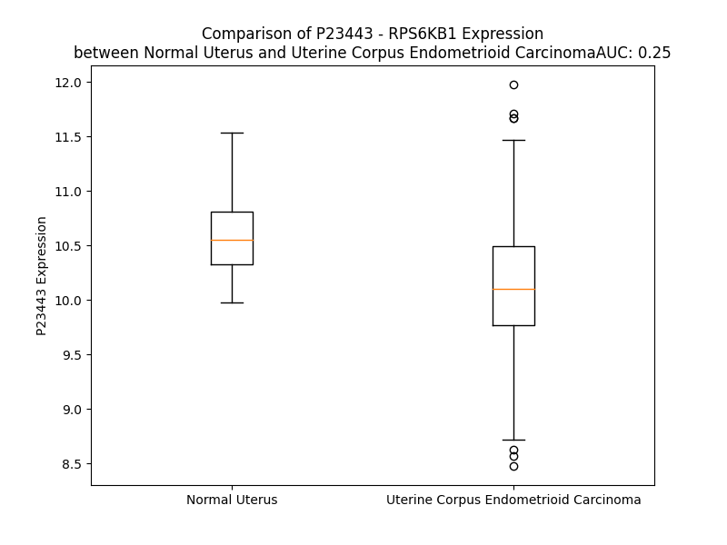

# Detailed Data for P23443

## Introduction to the Detailed Summary

### How to Interpret the Results

- **Summary & Metrics**: This section provides a quick reference to essential protein attributes, including expression changes, family classification, and biomarker applications. Regulation status (upregulated/downregulated) indicates the protein's behavior in a disease context. Some information comes from the original excel file with the proteins selected from literature, while others are derived from the analyses.
- **Expression Comparison**: A visual representation comparing protein expression between normal and disease states. It highlights significant changes in expression levels that might indicate diagnostic or therapeutic relevance. This is data coming from transcriptomics experiments and could not translate similarly to protein levels.
- **Isoform Alignment**: An interactive view of isoform alignments, revealing structural and functional differences between variants of the protein.
- **Interactors & Homologs**: Tables listing known interaction partners and homologous proteins, the more interactors and homologs, the more complex the protein is to design an antibody for.
- **Biological Assemblies**: Information about the structural arrangement of the protein in different assemblies, providing insights into its functional state but also the complexity of the protein to develop antibodies.
- **Combined Per-Residue Information**: A detailed table summarizing residue-level data. This includes predictions for epitope regions, aggregation tendencies, and modifications that might impact the protein's function. Each row corresponds to a residue in the protein, providing insights into specific sites that may be important for research or drug development.
## Summary & Metrics

- **UniProt Accession**: P23443
- **Gene Name**: RPS6KB1
- **Protein Name**: Ribosomal protein S6 kinase beta-1
- **Swiss Prot**: KS6B1_HUMAN
- **Family**: nan
- **Biomarker Application**: nan
- **Number of Isoforms**: 0
- **Regulation**: 2
- **(transcriptomics) AUC**: 0.37
- **(transcriptomics) Fold Change**: 1.02
- **(transcriptomics) Regulation**: Downregulated
- **Discotope Epitope Count**: 112
- **Max n_uniprots (Homo)**: 2
- **Max n_uniprots (Hetero)**: 2

## Expression Comparison

## Interactors

| preferredName_A   | preferredName_B   |   score |
|:------------------|:------------------|--------:|
| RPS6KB1           | RPS6              |   0.999 |
| RPS6KB1           | RPTOR             |   0.999 |
| RPS6KB1           | MTOR              |   0.999 |
| RPS6KB1           | IRS1              |   0.994 |
| RPS6KB1           | DEPTOR            |   0.991 |
| RPS6KB1           | MLST8             |   0.991 |
| RPS6KB1           | EIF4B             |   0.991 |
| RPS6KB1           | AKT1S1            |   0.99  |
| RPS6KB1           | PDPK1             |   0.986 |
| RPS6KB1           | EIF4E             |   0.985 |
| RPS6KB1           | AKT1              |   0.982 |
| RPS6KB1           | RICTOR            |   0.981 |
| RPS6KB1           | PPP2CA            |   0.979 |
| RPS6KB1           | EIF4EBP1          |   0.972 |
| RPS6KB1           | RHEB              |   0.968 |
| RPS6KB1           | EEF2K             |   0.961 |
| RPS6KB1           | JUN               |   0.959 |
| RPS6KB1           | FKBP1A            |   0.956 |
| RPS6KB1           | ESR1              |   0.955 |
| RPS6KB1           | TSC2              |   0.952 |
| RPS6KB1           | EIF4G1            |   0.952 |
| RPS6KB1           | FOS               |   0.946 |
| RPS6KB1           | AKT3              |   0.943 |
| RPS6KB1           | AKT2              |   0.94  |
| RPS6KB1           | MAPK3             |   0.935 |
| RPS6KB1           | PRKACA            |   0.934 |
| RPS6KB1           | PRKACB            |   0.932 |
| RPS6KB1           | NCOA3             |   0.931 |
| RPS6KB1           | PRKACG            |   0.931 |
| RPS6KB1           | ESR2              |   0.928 |
| RPS6KB1           | MAPK1             |   0.927 |
| RPS6KB1           | PPP2R1A           |   0.925 |
| RPS6KB1           | SP1               |   0.925 |
| RPS6KB1           | POLDIP3           |   0.921 |
| RPS6KB1           | PPP2CB            |   0.92  |
| RPS6KB1           | PPP2R1B           |   0.919 |
| RPS6KB1           | FOXA2             |   0.919 |
| RPS6KB1           | TBK1              |   0.917 |
| RPS6KB1           | CARM1             |   0.915 |
| RPS6KB1           | PTEN              |   0.914 |
| RPS6KB1           | RPS6KB2           |   0.913 |
| RPS6KB1           | RRAGB             |   0.913 |
| RPS6KB1           | MED1              |   0.908 |
| RPS6KB1           | TSC1              |   0.906 |

## Homologs

| uniprot_id   | gene_id   |
|:-------------|:----------|
| Q5SVM7       | RPS6KA1   |
| D6RA62       | RPS6KA2   |
| B4DG22       | RPS6KA3   |
| G3V2D1       | RPS6KA5   |
| Q9UK32       | RPS6KA6   |
| Q9UBS0       | RPS6KB2   |
| E9PKU3       | RPS6KA4   |

## Biological Assemblies

|   Unnamed: 0 |   assembly |   n_uniprots | composition   | crystal_id   |
|-------------:|-----------:|-------------:|:--------------|:-------------|
|            0 |          1 |            1 | Homo          | 4l44         |
|            0 |          1 |            2 | Homo          | 3a60         |
|            0 |          1 |            1 | Homo          | 3wf6         |
|            0 |          1 |            2 | Hetero        | 5wbk         |
|            0 |          1 |            1 | Homo          | 3a61         |
|            0 |          1 |            1 | Homo          | 4l3l         |
|            0 |          1 |            1 | Homo          | 4l42         |
|            0 |          1 |            1 | Homo          | 4rlo         |
|            1 |          2 |            1 | Homo          | 4rlo         |
|            2 |          3 |            2 | Homo          | 4rlo         |
|            0 |          1 |            1 | Homo          | 4l45         |
|            0 |          1 |            1 | Homo          | 7n91         |
|            1 |          2 |            1 | Homo          | 7n91         |
|            0 |          1 |            1 | Homo          | 7n93         |
|            1 |          2 |            1 | Homo          | 7n93         |
|            0 |          1 |            1 | Homo          | 3wf8         |
|            1 |          2 |            1 | Homo          | 3wf8         |
|            0 |          1 |            1 | Homo          | 4l46         |
|            0 |          1 |            1 | Homo          | 3wf5         |
|            0 |          1 |            1 | Homo          | 4rlp         |
|            1 |          2 |            1 | Homo          | 4rlp         |
|            0 |          1 |            1 | Homo          | 3a62         |
|            0 |          1 |            1 | Homo          | 3we4         |
|            0 |          1 |            1 | Homo          | 4l3j         |
|            0 |          1 |            1 | Homo          | 3wf7         |
|            0 |          1 |            1 | Homo          | 3wf9         |
|            1 |          2 |            1 | Homo          | 3wf9         |
|            0 |          1 |            1 | Homo          | 4l43         |
|            0 |          1 |            1 | Homo          | 5wbh         |
|            1 |          2 |            1 | Homo          | 5wbh         |
|            2 |          3 |            1 | Homo          | 5wbh         |
|            3 |          4 |            2 | Hetero        | 5wbh         |
|            4 |          5 |            1 | Homo          | 5wbh         |

## Combined Per-Residue Information

|   res | aa   |   epitope_score | epitope   |   relative_surface_accessibility |   modeling_confidence |   Aggregation | modification                             |
|------:|:-----|----------------:|:----------|---------------------------------:|----------------------:|--------------:|:-----------------------------------------|
|     1 | M    |         0.08905 | False     |                          1.32252 |                 33.19 |         0     | N/A                                      |
|     2 | R    |         0.14418 | True      |                          0.92767 |                 34.88 |         0     | N/A                                      |
|     3 | R    |         0.14858 | True      |                          0.91591 |                 34.7  |         0     | N/A                                      |
|     4 | R    |         0.13944 | True      |                          0.98197 |                 35.81 |         0     | N/A                                      |
|     5 | R    |         0.09765 | False     |                          0.94242 |                 32.31 |         0     | N/A                                      |
|     6 | R    |         0.10483 | False     |                          0.84925 |                 34.6  |         0     | N/A                                      |
|     7 | R    |         0.12796 | False     |                          0.86252 |                 34.93 |         0     | N/A                                      |
|     8 | D    |         0.09929 | False     |                          0.92423 |                 29    |         0     | N/A                                      |
|     9 | G    |         0.09924 | False     |                          0.76993 |                 32.71 |         0     | N/A                                      |
|    10 | F    |         0.10029 | False     |                          1.07364 |                 27.88 |         0     | N/A                                      |
|    11 | Y    |         0.10716 | False     |                          0.91395 |                 31.3  |         0     | N/A                                      |
|    12 | P    |         0.09311 | False     |                          0.86489 |                 34.13 |         0     | N/A                                      |
|    13 | A    |         0.09575 | False     |                          0.92628 |                 33.25 |         0     | N/A                                      |
|    14 | P    |         0.08068 | False     |                          0.78222 |                 32.16 |         0     | N/A                                      |
|    15 | D    |         0.13598 | False     |                          0.80469 |                 28.69 |         0     | N/A                                      |
|    16 | F    |         0.08434 | False     |                          0.95995 |                 28.76 |         0     | N/A                                      |
|    17 | R    |         0.13705 | True      |                          0.83187 |                 27.52 |         0     | N/A                                      |
|    18 | D    |         0.1166  | False     |                          0.87886 |                 28.21 |         0     | N/A                                      |
|    19 | R    |         0.22482 | True      |                          0.91662 |                 27.86 |         0     | N/A                                      |
|    20 | E    |         0.18068 | True      |                          0.94544 |                 27.96 |         0     | N/A                                      |
|    21 | A    |         0.1813  | True      |                          0.98773 |                 28.08 |         0     | N/A                                      |
|    22 | E    |         0.18801 | True      |                          0.89096 |                 29.33 |         0     | N/A                                      |
|    23 | D    |         0.19186 | True      |                          0.92924 |                 28.89 |         0     | N/A                                      |
|    24 | M    |         0.14052 | True      |                          0.87063 |                 28.25 |         0     | N/A                                      |
|    25 | A    |         0.13026 | False     |                          0.81947 |                 25.57 |         0     | N/A                                      |
|    26 | G    |         0.12941 | False     |                          0.87211 |                 27.14 |         0     | N/A                                      |
|    27 | V    |         0.0758  | False     |                          0.6595  |                 29.79 |         0     | N/A                                      |
|    28 | F    |         0.07396 | False     |                          0.50875 |                 31.01 |         0     | N/A                                      |
|    29 | D    |         0.18858 | True      |                          0.88368 |                 27.22 |         0     | N/A                                      |
|    30 | I    |         0.13741 | True      |                          0.58932 |                 31.53 |         0     | N/A                                      |
|    31 | D    |         0.10236 | False     |                          0.9249  |                 26.88 |         0     | N/A                                      |
|    32 | L    |         0.14786 | True      |                          0.88921 |                 34.83 |         0     | N/A                                      |
|    33 | D    |         0.13989 | True      |                          0.84382 |                 30.94 |         0     | N/A                                      |
|    34 | Q    |         0.09334 | False     |                          0.83542 |                 33.92 |         0     | N/A                                      |
|    35 | P    |         0.06105 | False     |                          0.92391 |                 33.04 |         0     | N/A                                      |
|    36 | E    |         0.0872  | False     |                          0.88809 |                 31.24 |         0     | N/A                                      |
|    37 | D    |         0.08839 | False     |                          0.93159 |                 35.05 |         0     | N/A                                      |
|    38 | A    |         0.14784 | True      |                          0.9458  |                 28.86 |         0     | N/A                                      |
|    39 | G    |         0.13122 | False     |                          0.88035 |                 32.76 |         0     | N/A                                      |
|    40 | S    |         0.13088 | False     |                          0.89568 |                 34.83 |         0     | N/A                                      |
|    41 | E    |         0.10052 | False     |                          0.85518 |                 30.49 |         0     | N/A                                      |
|    42 | D    |         0.11301 | False     |                          0.85573 |                 33.09 |         0     | N/A                                      |
|    43 | E    |         0.14096 | True      |                          0.86162 |                 37.29 |         0     | N/A                                      |
|    44 | L    |         0.10808 | False     |                          1.10369 |                 36.45 |         0     | N/A                                      |
|    45 | E    |         0.11055 | False     |                          0.87378 |                 29.22 |         0     | N/A                                      |
|    46 | E    |         0.11864 | False     |                          0.95264 |                 35.87 |         0     | N/A                                      |
|    47 | G    |         0.14563 | True      |                          0.93229 |                 32.45 |         0     | N/A                                      |
|    48 | G    |         0.19672 | True      |                          1.01945 |                 32.98 |         0     | N/A                                      |
|    49 | Q    |         0.10264 | False     |                          0.87206 |                 28.91 |         0     | N/A                                      |
|    50 | L    |         0.18961 | True      |                          1.03792 |                 34.61 |         0     | N/A                                      |
|    51 | N    |         0.11418 | False     |                          0.75564 |                 32.4  |         0     | N/A                                      |
|    52 | E    |         0.17925 | True      |                          0.7803  |                 31.86 |         0     | N/A                                      |
|    53 | S    |         0.16974 | True      |                          0.83848 |                 33.99 |         0     | N/A                                      |
|    54 | M    |         0.10516 | False     |                          1.03345 |                 31.29 |         0     | N/A                                      |
|    55 | D    |         0.10809 | False     |                          0.84751 |                 34.04 |         0     | N/A                                      |
|    56 | H    |         0.092   | False     |                          0.99651 |                 31.97 |         0     | N/A                                      |
|    57 | G    |         0.1976  | True      |                          0.96047 |                 32.49 |         0     | N/A                                      |
|    58 | G    |         0.07595 | False     |                          0.89137 |                 30.02 |         0     | N/A                                      |
|    59 | V    |         0.06188 | False     |                          1.0671  |                 35.78 |         0     | N/A                                      |
|    60 | G    |         0.09672 | False     |                          0.74237 |                 36.4  |         0     | N/A                                      |
|    61 | P    |         0.14825 | True      |                          0.9034  |                 40    |         0     | N/A                                      |
|    62 | Y    |         0.10683 | False     |                          0.87883 |                 34.55 |         0     | N/A                                      |
|    63 | E    |         0.0702  | False     |                          0.94225 |                 30.97 |         0     | N/A                                      |
|    64 | L    |         0.10906 | False     |                          1.00539 |                 39.22 |         0     | N/A                                      |
|    65 | G    |         0.14237 | True      |                          0.75743 |                 32.82 |         0     | N/A                                      |
|    66 | M    |         0.12993 | False     |                          0.92217 |                 40.24 |         0     | N/A                                      |
|    67 | E    |         0.24603 | True      |                          0.85052 |                 41.66 |         0     | N/A                                      |
|    68 | H    |         0.18655 | True      |                          0.9726  |                 39.77 |         0     | N/A                                      |
|    69 | C    |         0.09823 | False     |                          0.70363 |                 38.94 |         0     | N/A                                      |
|    70 | E    |         0.08752 | False     |                          0.73223 |                 42.11 |         0     | N/A                                      |
|    71 | K    |         0.11126 | False     |                          0.96354 |                 49.09 |         0     | N/A                                      |
|    72 | F    |         0.14553 | True      |                          0.8229  |                 47.21 |         0     | N/A                                      |
|    73 | E    |         0.168   | True      |                          0.77118 |                 43.37 |         0     | N/A                                      |
|    74 | I    |         0.17512 | True      |                          0.57231 |                 46.94 |         0     | N/A                                      |
|    75 | S    |         0.07837 | False     |                          0.33028 |                 53.58 |         0     | N/A                                      |
|    76 | E    |         0.09883 | False     |                          0.58701 |                 49.98 |         0     | N/A                                      |
|    77 | T    |         0.10873 | False     |                          0.65468 |                 50.22 |         0     | N/A                                      |
|    78 | S    |         0.11892 | False     |                          0.37628 |                 52.49 |         0     | N/A                                      |
|    79 | V    |         0.09591 | False     |                          0.65239 |                 52.15 |         0     | N/A                                      |
|    80 | N    |         0.06694 | False     |                          0.16821 |                 50.51 |         0     | N/A                                      |
|    81 | R    |         0.18007 | True      |                          0.87815 |                 48.74 |         0     | N/A                                      |
|    82 | G    |         0.16743 | True      |                          0.49232 |                 53.55 |         0     | N/A                                      |
|    83 | P    |         0.16133 | True      |                          0.98536 |                 55.63 |         0     | N/A                                      |
|    84 | E    |         0.07455 | False     |                          0.24638 |                 65.06 |         0     | N/A                                      |
|    85 | K    |         0.08572 | False     |                          0.55184 |                 77.33 |         0     | N/A                                      |
|    86 | I    |         0.03481 | False     |                          0.08487 |                 87.71 |         0     | N/A                                      |
|    87 | R    |         0.07909 | False     |                          0.54681 |                 88.42 |         0     | N/A                                      |
|    88 | P    |         0.03204 | False     |                          0.24154 |                 89.82 |         0     | N/A                                      |
|    89 | E    |         0.10632 | False     |                          0.58827 |                 91.26 |         0     | N/A                                      |
|    90 | C    |         0.05656 | False     |                          0.09648 |                 92.69 |         0.566 | N/A                                      |
|    91 | F    |         0.02871 | False     |                          0.04395 |                 95.45 |         3.444 | N/A                                      |
|    92 | E    |         0.07041 | False     |                          0.42112 |                 96.34 |         3.444 | N/A                                      |
|    93 | L    |         0.04633 | False     |                          0.3228  |                 96.22 |         3.444 | N/A                                      |
|    94 | L    |         0.03745 | False     |                          0.19835 |                 96.1  |         3.444 | N/A                                      |
|    95 | R    |         0.09624 | False     |                          0.4245  |                 96.31 |         3.444 | N/A                                      |
|    96 | V    |         0.0051  | False     |                          0.00476 |                 95.56 |         3.444 | N/A                                      |
|    97 | L    |         0.02716 | False     |                          0.08936 |                 93.26 |         3.444 | N/A                                      |
|    98 | G    |         0.03392 | False     |                          0.16577 |                 89.64 |         0.238 | N/A                                      |
|    99 | K    |         0.14412 | True      |                          0.63739 |                 85.36 |         0     | N/A                                      |
|   100 | G    |         0.06288 | False     |                          0.50861 |                 74.65 |         0     | N/A                                      |
|   101 | G    |         0.10203 | False     |                          0.80064 |                 71.28 |         0     | N/A                                      |
|   102 | Y    |         0.04968 | False     |                          0.28623 |                 72.1  |         0     | N/A                                      |
|   103 | G    |         0.05547 | False     |                          0.21534 |                 83.58 |         0     | N/A                                      |
|   104 | K    |         0.06062 | False     |                          0.30585 |                 91.64 |         0     | N/A                                      |
|   105 | V    |         0.01591 | False     |                          0.30466 |                 94.4  |         0     | N/A                                      |
|   106 | F    |         0.00322 | False     |                          0.00127 |                 96.45 |         0     | N/A                                      |
|   107 | Q    |         0.005   | False     |                          0.00454 |                 97.38 |         0     | N/A                                      |
|   108 | V    |         0.00401 | False     |                          0       |                 97.62 |         0     | N/A                                      |
|   109 | R    |         0.0903  | False     |                          0.2305  |                 97.39 |         0     | N/A                                      |
|   110 | K    |         0.00773 | False     |                          0.00057 |                 95.49 |         0     | N/A                                      |
|   111 | V    |         0.10337 | False     |                          0.45137 |                 95.12 |         0     | N/A                                      |
|   112 | T    |         0.05913 | False     |                          0.44066 |                 91.66 |         0     | N/A                                      |
|   113 | G    |         0.06038 | False     |                          0.54038 |                 86.92 |         0     | N/A                                      |
|   114 | A    |         0.04086 | False     |                          0.07677 |                 86.23 |         0     | N/A                                      |
|   115 | N    |         0.05304 | False     |                          0.24014 |                 88.16 |         0     | N/A                                      |
|   116 | T    |         0.08479 | False     |                          0.56588 |                 92.81 |         0     | N/A                                      |
|   117 | G    |         0.04357 | False     |                          0.41707 |                 94.14 |         0     | N/A                                      |
|   118 | K    |         0.10213 | False     |                          0.53029 |                 95.51 |         0     | N/A                                      |
|   119 | I    |         0.01709 | False     |                          0.06311 |                 96.93 |         0     | N/A                                      |
|   120 | F    |         0.00511 | False     |                          0.0051  |                 97.14 |         0     | N/A                                      |
|   121 | A    |         0.01629 | False     |                          0.10331 |                 96.57 |         0     | N/A                                      |
|   122 | M    |         0.0105  | False     |                          0.01654 |                 95.99 |         0     | N/A                                      |
|   123 | K    |         0.01411 | False     |                          0.17109 |                 93.79 |         0     | N/A                                      |
|   124 | V    |         0.01117 | False     |                          0.04106 |                 93.84 |         0     | N/A                                      |
|   125 | L    |         0.01661 | False     |                          0.06183 |                 91.1  |         0     | N/A                                      |
|   126 | K    |         0.07476 | False     |                          0.37662 |                 89.66 |         0     | N/A                                      |
|   127 | K    |         0.01806 | False     |                          0.02266 |                 89.37 |         0     | N/A                                      |
|   128 | A    |         0.05429 | False     |                          0.26817 |                 86.16 |         0     | N/A                                      |
|   129 | M    |         0.12923 | False     |                          0.43533 |                 84.45 |         0     | N/A                                      |
|   130 | I    |         0.02122 | False     |                          0.0088  |                 83.93 |         0     | N/A                                      |
|   131 | V    |         0.14896 | True      |                          0.33531 |                 85.61 |         0     | N/A                                      |
|   132 | R    |         0.26231 | True      |                          0.79719 |                 84.21 |         0     | N/A                                      |
|   133 | N    |         0.16996 | True      |                          0.34173 |                 82.73 |         0     | N/A                                      |
|   134 | A    |         0.1012  | False     |                          0.82359 |                 80.91 |         0     | N/A                                      |
|   135 | K    |         0.12764 | False     |                          0.68666 |                 81.35 |         0     | N/A                                      |
|   136 | D    |         0.04892 | False     |                          0.08937 |                 83.23 |         0     | N/A                                      |
|   137 | T    |         0.04659 | False     |                          0.09894 |                 84.67 |         0     | N/A                                      |
|   138 | A    |         0.06342 | False     |                          0.53103 |                 82.16 |         0     | N/A                                      |
|   139 | H    |         0.07273 | False     |                          0.21431 |                 82.91 |         0     | N/A                                      |
|   140 | T    |         0.01466 | False     |                          0.0859  |                 85.8  |         0     | N/A                                      |
|   141 | K    |         0.08378 | False     |                          0.345   |                 84.98 |         0     | N/A                                      |
|   142 | A    |         0.02547 | False     |                          0.23432 |                 85.08 |         0     | N/A                                      |
|   143 | E    |         0.01115 | False     |                          0.04406 |                 88.91 |         0     | N/A                                      |
|   144 | R    |         0.02858 | False     |                          0.10708 |                 89.2  |         0     | N/A                                      |
|   145 | N    |         0.09903 | False     |                          0.39086 |                 88.68 |         0     | N/A                                      |
|   146 | I    |         0.01536 | False     |                          0.012   |                 90.5  |         0     | N/A                                      |
|   147 | L    |         0.0046  | False     |                          0.02061 |                 91.48 |         0     | N/A                                      |
|   148 | E    |         0.05041 | False     |                          0.35946 |                 91.03 |         0     | N/A                                      |
|   149 | E    |         0.07705 | False     |                          0.48452 |                 89.44 |         0     | N/A                                      |
|   150 | V    |         0.01218 | False     |                          0.01341 |                 92.23 |         0     | N/A                                      |
|   151 | K    |         0.06703 | False     |                          0.44329 |                 93.13 |         0     | N/A                                      |
|   152 | H    |         0.0476  | False     |                          0.12685 |                 96.7  |         0     | N/A                                      |
|   153 | P    |         0.02934 | False     |                          0.26617 |                 96.81 |         0     | N/A                                      |
|   154 | F    |         0.00857 | False     |                          0       |                 97.99 |         3.149 | N/A                                      |
|   155 | I    |         0.0063  | False     |                          0.01151 |                 97.44 |         4.268 | N/A                                      |
|   156 | V    |         0.00796 | False     |                          0.03274 |                 96.58 |         4.367 | N/A                                      |
|   157 | D    |         0.01771 | False     |                          0.25421 |                 95.09 |         4.367 | N/A                                      |
|   158 | L    |         0.00157 | False     |                          0.00122 |                 95.23 |        29.437 | N/A                                      |
|   159 | I    |         0.02926 | False     |                          0.1072  |                 94.82 |        29.795 | N/A                                      |
|   160 | Y    |         0.00211 | False     |                          0.0023  |                 93.63 |        29.795 | N/A                                      |
|   161 | A    |         0.00361 | False     |                          0.00848 |                 93.3  |        29.795 | N/A                                      |
|   162 | F    |         0.02218 | False     |                          0.02377 |                 92.22 |        29.795 | N/A                                      |
|   163 | Q    |         0.03292 | False     |                          0.16754 |                 91.09 |         6.732 | N/A                                      |
|   164 | T    |         0.0389  | False     |                          0.22006 |                 88.74 |         5.664 | N/A                                      |
|   165 | G    |         0.09161 | False     |                          0.5365  |                 84.95 |         5.049 | N/A                                      |
|   166 | G    |         0.01214 | False     |                          0.0137  |                 87.94 |         4.844 | N/A                                      |
|   167 | K    |         0.02178 | False     |                          0.02885 |                 91.31 |         6.847 | N/A                                      |
|   168 | L    |         0.00275 | False     |                          0       |                 92    |        91.732 | N/A                                      |
|   169 | Y    |         0.01343 | False     |                          0.02773 |                 93.61 |        91.707 | N/A                                      |
|   170 | L    |         0.00112 | False     |                          0       |                 94.03 |        91.623 | N/A                                      |
|   171 | I    |         0.00187 | False     |                          0       |                 95.6  |        91.12  | N/A                                      |
|   172 | L    |         0.03738 | False     |                          0.13519 |                 95.8  |        88.357 | N/A                                      |
|   173 | E    |         0.0238  | False     |                          0.20252 |                 95.68 |         2.48  | N/A                                      |
|   174 | Y    |         0.02868 | False     |                          0.13291 |                 96.19 |         2.391 | N/A                                      |
|   175 | L    |         0.0113  | False     |                          0.03665 |                 96.03 |         2.059 | N/A                                      |
|   176 | S    |         0.01623 | False     |                          0.04752 |                 94.11 |         0.199 | N/A                                      |
|   177 | G    |         0.01039 | False     |                          0.04878 |                 93.57 |         0     | N/A                                      |
|   178 | G    |         0.0034  | False     |                          0.00322 |                 91.9  |         0     | N/A                                      |
|   179 | E    |         0.07063 | False     |                          0.30391 |                 91.6  |         0     | N/A                                      |
|   180 | L    |         0.00709 | False     |                          0.00742 |                 89.08 |         1.04  | N/A                                      |
|   181 | F    |         0.05998 | False     |                          0.30065 |                 86.56 |         1.04  | N/A                                      |
|   182 | M    |         0.07535 | False     |                          0.30942 |                 85.28 |         1.04  | N/A                                      |
|   183 | Q    |         0.06928 | False     |                          0.06905 |                 85.71 |         1.04  | N/A                                      |
|   184 | L    |         0.03237 | False     |                          0.05315 |                 87.97 |         1.04  | N/A                                      |
|   185 | E    |         0.16792 | True      |                          0.62473 |                 87.4  |         0     | N/A                                      |
|   186 | R    |         0.1212  | False     |                          0.58212 |                 86.94 |         0     | N/A                                      |
|   187 | E    |         0.12306 | False     |                          0.4715  |                 88.54 |         0     | N/A                                      |
|   188 | G    |         0.1127  | False     |                          0.42815 |                 90.83 |         0     | N/A                                      |
|   189 | I    |         0.17778 | True      |                          0.48272 |                 93.99 |         0     | N/A                                      |
|   190 | F    |         0.02089 | False     |                          0.04345 |                 95.25 |         0     | N/A                                      |
|   191 | M    |         0.13347 | False     |                          0.79171 |                 95.9  |         0     | N/A                                      |
|   192 | E    |         0.05085 | False     |                          0.19245 |                 97.45 |         0     | N/A                                      |
|   193 | D    |         0.08883 | False     |                          0.75858 |                 96.67 |         0     | N/A                                      |
|   194 | T    |         0.04201 | False     |                          0.21465 |                 96.35 |         0     | N/A                                      |
|   195 | A    |         0.00138 | False     |                          0       |                 97.21 |         0.598 | N/A                                      |
|   196 | C    |         0.02872 | False     |                          0.09183 |                 98.07 |         1.484 | N/A                                      |
|   197 | F    |         0.03469 | False     |                          0.0622  |                 97.93 |         1.484 | N/A                                      |
|   198 | Y    |         0.0054  | False     |                          0.0017  |                 97.84 |         1.484 | N/A                                      |
|   199 | L    |         0.00454 | False     |                          0.00907 |                 98.33 |         1.484 | N/A                                      |
|   200 | A    |         0.00237 | False     |                          0       |                 98.6  |         1.159 | N/A                                      |
|   201 | E    |         0.00216 | False     |                          0       |                 98.46 |         0     | N/A                                      |
|   202 | I    |         0.00342 | False     |                          0       |                 98.54 |         0.167 | N/A                                      |
|   203 | S    |         0.00157 | False     |                          0       |                 98.48 |         0.167 | N/A                                      |
|   204 | M    |         0.03695 | False     |                          0.11769 |                 98.39 |         0.167 | N/A                                      |
|   205 | A    |         0.0016  | False     |                          0       |                 98.09 |         0.167 | N/A                                      |
|   206 | L    |         0.00328 | False     |                          0       |                 97.71 |         0.167 | N/A                                      |
|   207 | G    |         0.04384 | False     |                          0.14808 |                 96.75 |         0     | N/A                                      |
|   208 | H    |         0.05364 | False     |                          0.20467 |                 96.65 |         0     | N/A                                      |
|   209 | L    |         0.00206 | False     |                          0       |                 95.52 |         0     | N/A                                      |
|   210 | H    |         0.0288  | False     |                          0.09505 |                 95.12 |         0     | N/A                                      |
|   211 | Q    |         0.10585 | False     |                          0.79278 |                 93.78 |         0     | N/A                                      |
|   212 | K    |         0.08    | False     |                          0.37109 |                 92.33 |         0     | N/A                                      |
|   213 | G    |         0.03974 | False     |                          0.23488 |                 91.43 |         0     | N/A                                      |
|   214 | I    |         0.01992 | False     |                          0.01336 |                 92.38 |         0     | N/A                                      |
|   215 | I    |         0.01263 | False     |                          0.0176  |                 93.18 |         0     | N/A                                      |
|   216 | Y    |         0.01316 | False     |                          0.00473 |                 94.23 |         0     | N/A                                      |
|   217 | R    |         0.02018 | False     |                          0.02983 |                 93.18 |         0     | N/A                                      |
|   218 | D    |         0.04807 | False     |                          0.05737 |                 91.7  |         0     | N/A                                      |
|   219 | L    |         0.00605 | False     |                          0.00344 |                 96.02 |         0     | N/A                                      |
|   220 | K    |         0.05505 | False     |                          0.16816 |                 92.67 |         0     | N/A                                      |
|   221 | P    |         0.01203 | False     |                          0.00696 |                 91.87 |         0     | N/A                                      |
|   222 | E    |         0.04266 | False     |                          0.24419 |                 89.61 |         0     | N/A                                      |
|   223 | N    |         0.04796 | False     |                          0.05414 |                 93.73 |         0     | N/A                                      |
|   224 | I    |         0.00329 | False     |                          0       |                 96.32 |         0     | N/A                                      |
|   225 | M    |         0.02098 | False     |                          0.15758 |                 95.99 |         0     | N/A                                      |
|   226 | L    |         0.00391 | False     |                          0.00412 |                 95.97 |         0     | N/A                                      |
|   227 | N    |         0.01324 | False     |                          0.06106 |                 94.97 |         0     | N/A                                      |
|   228 | H    |         0.04935 | False     |                          0.59464 |                 94.18 |         0     | N/A                                      |
|   229 | Q    |         0.08757 | False     |                          0.35586 |                 94.69 |         0     | N/A                                      |
|   230 | G    |         0.00212 | False     |                          0       |                 95.54 |         0     | N/A                                      |
|   231 | H    |         0.01601 | False     |                          0.02409 |                 97.62 |         0     | N/A                                      |
|   232 | V    |         0.00254 | False     |                          0       |                 97.42 |         0     | N/A                                      |
|   233 | K    |         0.01098 | False     |                          0.04784 |                 97.66 |         0     | N/A                                      |
|   234 | L    |         0.00281 | False     |                          0       |                 97.3  |         0     | N/A                                      |
|   235 | T    |         0.02028 | False     |                          0.125   |                 94.09 |         0     | N/A                                      |
|   236 | D    |         0.08151 | False     |                          0.4194  |                 87.16 |         0     | N/A                                      |
|   237 | F    |         0.00959 | False     |                          0.00939 |                 87.15 |         0     | N/A                                      |
|   238 | G    |         0.04169 | False     |                          0.20028 |                 80.01 |         0     | N/A                                      |
|   239 | L    |         0.06278 | False     |                          0.15039 |                 77.46 |         0     | N/A                                      |
|   240 | C    |         0.01657 | False     |                          0.02906 |                 82.25 |         0     | N/A                                      |
|   241 | K    |         0.0418  | False     |                          0.45037 |                 80.77 |         0     | N/A                                      |
|   242 | E    |         0.07304 | False     |                          0.42608 |                 76.73 |         0     | N/A                                      |
|   243 | S    |         0.0777  | False     |                          0.21758 |                 67.78 |         0     | N/A                                      |
|   244 | I    |         0.12286 | False     |                          0.6976  |                 54.11 |         0     | N/A                                      |
|   245 | H    |         0.15804 | True      |                          0.78979 |                 57.35 |         0     | N/A                                      |
|   246 | D    |         0.12902 | False     |                          0.84271 |                 59.2  |         0     | N/A                                      |
|   247 | G    |         0.161   | True      |                          0.81754 |                 64.66 |         0     | N/A                                      |
|   248 | T    |         0.16978 | True      |                          0.46702 |                 71.67 |         0     | N/A                                      |
|   249 | V    |         0.14695 | True      |                          0.52982 |                 79.91 |         0.145 | N/A                                      |
|   250 | T    |         0.04498 | False     |                          0.13326 |                 80.79 |         0.145 | N/A                                      |
|   251 | H    |         0.19848 | True      |                          0.58314 |                 82.29 |         0.145 | N/A                                      |
|   252 | T    |         0.11406 | False     |                          0.34762 |                 79.24 |         0.145 | Phosphothreonine; by PDPK1               |
|   253 | F    |         0.20169 | True      |                          0.3943  |                 81.65 |         0.145 | N/A                                      |
|   254 | C    |         0.02542 | False     |                          0.03705 |                 80.82 |         0.145 | N/A                                      |
|   255 | G    |         0.03446 | False     |                          0.07736 |                 81.02 |         0     | N/A                                      |
|   256 | T    |         0.06951 | False     |                          0.2473  |                 87.75 |         0     | N/A                                      |
|   257 | I    |         0.07901 | False     |                          0.14081 |                 93.73 |         0     | N/A                                      |
|   258 | E    |         0.04559 | False     |                          0.27508 |                 95.69 |         0     | N/A                                      |
|   259 | Y    |         0.05295 | False     |                          0.07244 |                 96.88 |         0     | N/A                                      |
|   260 | M    |         0.02803 | False     |                          0.0338  |                 95.58 |         0     | N/A                                      |
|   261 | A    |         0.00398 | False     |                          0       |                 95.9  |         0     | N/A                                      |
|   262 | P    |         0.01896 | False     |                          0.0328  |                 96.39 |         0     | N/A                                      |
|   263 | E    |         0.05512 | False     |                          0.08023 |                 94.87 |         0     | N/A                                      |
|   264 | I    |         0.02773 | False     |                          0.01972 |                 93.68 |         0     | N/A                                      |
|   265 | L    |         0.11204 | False     |                          0.12065 |                 93.44 |         0     | N/A                                      |
|   266 | M    |         0.17873 | True      |                          0.67101 |                 92.08 |         0     | N/A                                      |
|   267 | R    |         0.29654 | True      |                          0.60908 |                 88.05 |         0     | N/A                                      |
|   268 | S    |         0.17673 | True      |                          0.54288 |                 84.95 |         0     | N/A                                      |
|   269 | G    |         0.05497 | False     |                          0.11778 |                 85.31 |         0     | N/A                                      |
|   270 | H    |         0.02672 | False     |                          0.02871 |                 88.74 |         0     | N/A                                      |
|   271 | N    |         0.05259 | False     |                          0.3784  |                 90.47 |         0     | N/A                                      |
|   272 | R    |         0.04166 | False     |                          0.1835  |                 93.64 |         0     | N/A                                      |
|   273 | A    |         0.0096  | False     |                          0.01658 |                 94.99 |         0     | N/A                                      |
|   274 | V    |         0.00271 | False     |                          0.00476 |                 95.77 |         0     | N/A                                      |
|   275 | D    |         0.00275 | False     |                          0.00061 |                 96.96 |         0     | N/A                                      |
|   276 | W    |         0.00168 | False     |                          0       |                 98.31 |         0.343 | N/A                                      |
|   277 | W    |         0.00603 | False     |                          0.00682 |                 98.28 |         0.343 | N/A                                      |
|   278 | S    |         0.02824 | False     |                          0.04032 |                 98.01 |         0.343 | N/A                                      |
|   279 | L    |         0.00279 | False     |                          0.00824 |                 98.57 |         0.549 | N/A                                      |
|   280 | G    |         0.00176 | False     |                          0       |                 98.57 |         0.549 | N/A                                      |
|   281 | A    |         0.00355 | False     |                          0.00128 |                 98.23 |         0.549 | N/A                                      |
|   282 | L    |         0.00149 | False     |                          0.00082 |                 97.68 |         0.549 | N/A                                      |
|   283 | M    |         0.00104 | False     |                          0.00206 |                 98.24 |         0.549 | N/A                                      |
|   284 | Y    |         0.03271 | False     |                          0.10786 |                 98.18 |         0.549 | N/A                                      |
|   285 | D    |         0.01833 | False     |                          0.03913 |                 96.49 |         0     | N/A                                      |
|   286 | M    |         0.00418 | False     |                          0.00575 |                 97.14 |         0     | N/A                                      |
|   287 | L    |         0.00886 | False     |                          0.01964 |                 97.42 |         0     | N/A                                      |
|   288 | T    |         0.07609 | False     |                          0.21499 |                 96.13 |         0     | N/A                                      |
|   289 | G    |         0.14228 | True      |                          0.46125 |                 93.87 |         0     | N/A                                      |
|   290 | A    |         0.07951 | False     |                          0.42854 |                 94.23 |         0     | N/A                                      |
|   291 | P    |         0.0556  | False     |                          0.17466 |                 95.53 |         0     | N/A                                      |
|   292 | P    |         0.05356 | False     |                          0.15483 |                 97.15 |         0     | N/A                                      |
|   293 | F    |         0.02648 | False     |                          0.03239 |                 97.24 |         0     | N/A                                      |
|   294 | T    |         0.12342 | False     |                          0.43189 |                 94.7  |         0     | N/A                                      |
|   295 | G    |         0.14408 | True      |                          0.34436 |                 93.67 |         0     | N/A                                      |
|   296 | E    |         0.38873 | True      |                          0.77482 |                 93.54 |         0     | N/A                                      |
|   297 | N    |         0.31165 | True      |                          0.48205 |                 94.79 |         0     | N/A                                      |
|   298 | R    |         0.17639 | True      |                          0.59977 |                 92.51 |         0     | N/A                                      |
|   299 | K    |         0.20581 | True      |                          0.76907 |                 94.87 |         0     | N/A                                      |
|   300 | K    |         0.18651 | True      |                          0.42881 |                 96.69 |         0     | N/A                                      |
|   301 | T    |         0.03737 | False     |                          0.02556 |                 96.86 |         0     | N/A                                      |
|   302 | I    |         0.12835 | False     |                          0.26799 |                 96.48 |         0     | N/A                                      |
|   303 | D    |         0.1905  | True      |                          0.32503 |                 96.92 |         0     | N/A                                      |
|   304 | K    |         0.14073 | True      |                          0.42399 |                 97.55 |         0     | N/A                                      |
|   305 | I    |         0.00731 | False     |                          0.0008  |                 97.42 |         0     | N/A                                      |
|   306 | L    |         0.18236 | True      |                          0.29613 |                 96.64 |         0     | N/A                                      |
|   307 | K    |         0.33753 | True      |                          0.75648 |                 95.98 |         0     | N/A                                      |
|   308 | C    |         0.13801 | True      |                          0.3982  |                 95.48 |         0     | N/A                                      |
|   309 | K    |         0.2369  | True      |                          0.88489 |                 95.28 |         0     | N/A                                      |
|   310 | L    |         0.07292 | False     |                          0.21096 |                 96.34 |         0     | N/A                                      |
|   311 | N    |         0.16666 | True      |                          0.73973 |                 96.18 |         0     | N/A                                      |
|   312 | L    |         0.12149 | False     |                          0.17702 |                 97.15 |         0     | N/A                                      |
|   313 | P    |         0.09039 | False     |                          0.17794 |                 95.87 |         0     | N/A                                      |
|   314 | P    |         0.23406 | True      |                          0.88391 |                 96.09 |         0     | N/A                                      |
|   315 | Y    |         0.17733 | True      |                          0.58741 |                 96.74 |         0     | N/A                                      |
|   316 | L    |         0.03327 | False     |                          0.04165 |                 97.91 |         0     | N/A                                      |
|   317 | T    |         0.14922 | True      |                          0.44451 |                 98.19 |         0     | N/A                                      |
|   318 | Q    |         0.13542 | False     |                          0.62227 |                 98.21 |         0     | N/A                                      |
|   319 | E    |         0.06125 | False     |                          0.25747 |                 98.44 |         0     | N/A                                      |
|   320 | A    |         0.00315 | False     |                          0       |                 98.61 |         0     | N/A                                      |
|   321 | R    |         0.06444 | False     |                          0.25073 |                 98.58 |         0     | N/A                                      |
|   322 | D    |         0.05565 | False     |                          0.26148 |                 98.57 |         0     | N/A                                      |
|   323 | L    |         0.00411 | False     |                          0.00577 |                 98.76 |         0     | N/A                                      |
|   324 | L    |         0.00256 | False     |                          0       |                 98.73 |         0     | N/A                                      |
|   325 | K    |         0.10726 | False     |                          0.52835 |                 98.44 |         0     | N/A                                      |
|   326 | K    |         0.06429 | False     |                          0.33822 |                 98.53 |         0     | N/A                                      |
|   327 | L    |         0.00865 | False     |                          0.00495 |                 98.62 |         0     | N/A                                      |
|   328 | L    |         0.01271 | False     |                          0.08269 |                 98.41 |         0     | N/A                                      |
|   329 | K    |         0.10274 | False     |                          0.41652 |                 97.71 |         0     | N/A                                      |
|   330 | R    |         0.09406 | False     |                          0.35305 |                 96.52 |         0     | N/A                                      |
|   331 | N    |         0.14815 | True      |                          0.60699 |                 95.55 |         0     | N/A                                      |
|   332 | A    |         0.04659 | False     |                          0.25218 |                 94.85 |         0     | N/A                                      |
|   333 | A    |         0.14825 | True      |                          0.89196 |                 93.28 |         0     | N/A                                      |
|   334 | S    |         0.09596 | False     |                          0.40478 |                 96.17 |         0     | N/A                                      |
|   335 | R    |         0.09481 | False     |                          0.02182 |                 97.73 |         0     | N/A                                      |
|   336 | L    |         0.08451 | False     |                          0.19185 |                 98.25 |         0     | N/A                                      |
|   337 | G    |         0.00228 | False     |                          0       |                 97.12 |         0     | N/A                                      |
|   338 | A    |         0.04023 | False     |                          0.23872 |                 94.41 |         0     | N/A                                      |
|   339 | G    |         0.0957  | False     |                          0.25131 |                 92.83 |         0     | N/A                                      |
|   340 | P    |         0.14744 | True      |                          1.008   |                 92.1  |         0     | N/A                                      |
|   341 | G    |         0.12128 | False     |                          0.4444  |                 94.87 |         0     | N/A                                      |
|   342 | D    |         0.0432  | False     |                          0.10685 |                 95.76 |         0     | N/A                                      |
|   343 | A    |         0.02145 | False     |                          0.09785 |                 97.34 |         0     | N/A                                      |
|   344 | G    |         0.11357 | False     |                          0.48609 |                 97.79 |         0     | N/A                                      |
|   345 | E    |         0.06651 | False     |                          0.29693 |                 97.85 |         0     | N/A                                      |
|   346 | V    |         0.00253 | False     |                          0       |                 98.56 |         0     | N/A                                      |
|   347 | Q    |         0.0491  | False     |                          0.19147 |                 98.25 |         0     | N/A                                      |
|   348 | A    |         0.11916 | False     |                          0.78928 |                 98.15 |         0     | N/A                                      |
|   349 | H    |         0.05566 | False     |                          0.0461  |                 98.71 |         0     | N/A                                      |
|   350 | P    |         0.22325 | True      |                          0.52029 |                 98.58 |         0     | N/A                                      |
|   351 | F    |         0.03845 | False     |                          0.08929 |                 98.66 |         0     | N/A                                      |
|   352 | F    |         0.01538 | False     |                          0.01974 |                 98.53 |         0     | N/A                                      |
|   353 | R    |         0.36048 | True      |                          0.61929 |                 97.46 |         0     | N/A                                      |
|   354 | H    |         0.11343 | False     |                          0.81832 |                 96.13 |         0     | N/A                                      |
|   355 | I    |         0.08716 | False     |                          0.19991 |                 97.73 |         0     | N/A                                      |
|   356 | N    |         0.08441 | False     |                          0.43998 |                 97.48 |         0     | N/A                                      |
|   357 | W    |         0.05712 | False     |                          0.2704  |                 97.73 |         0     | N/A                                      |
|   358 | E    |         0.16645 | True      |                          0.74986 |                 97.58 |         0     | N/A                                      |
|   359 | E    |         0.13626 | True      |                          0.39231 |                 97.76 |         0     | N/A                                      |
|   360 | L    |         0.00687 | False     |                          0.00082 |                 97.58 |         0     | N/A                                      |
|   361 | L    |         0.07893 | False     |                          0.47458 |                 96.97 |         0     | N/A                                      |
|   362 | A    |         0.08711 | False     |                          0.53135 |                 96.99 |         0     | N/A                                      |
|   363 | R    |         0.10097 | False     |                          0.47571 |                 96.18 |         0     | N/A                                      |
|   364 | K    |         0.2314  | True      |                          0.77132 |                 96.33 |         0     | N/A                                      |
|   365 | V    |         0.07954 | False     |                          0.32142 |                 95.21 |         0     | N/A                                      |
|   366 | E    |         0.07822 | False     |                          0.7551  |                 95.24 |         0     | N/A                                      |
|   367 | P    |         0.02608 | False     |                          0.1266  |                 95.98 |         0     | N/A                                      |
|   368 | P    |         0.11072 | False     |                          0.48212 |                 93.87 |         0     | N/A                                      |
|   369 | F    |         0.10077 | False     |                          0.18278 |                 91.32 |         0     | N/A                                      |
|   370 | K    |         0.08108 | False     |                          0.63641 |                 92.14 |         0     | N/A                                      |
|   371 | P    |         0.0193  | False     |                          0.05511 |                 90.35 |         0     | N/A                                      |
|   372 | L    |         0.16488 | True      |                          0.97285 |                 90.44 |         0     | N/A                                      |
|   373 | L    |         0.0727  | False     |                          0.31612 |                 92.15 |         0     | N/A                                      |
|   374 | Q    |         0.1852  | True      |                          0.88731 |                 92.18 |         0     | N/A                                      |
|   375 | S    |         0.1131  | False     |                          0.46844 |                 93.5  |         0     | N/A                                      |
|   376 | E    |         0.06025 | False     |                          0.67985 |                 90.65 |         0     | N/A                                      |
|   377 | E    |         0.09823 | False     |                          0.35624 |                 92.86 |         0     | N/A                                      |
|   378 | D    |         0.06705 | False     |                          0.09282 |                 93.21 |         0     | N/A                                      |
|   379 | V    |         0.05478 | False     |                          0.1932  |                 92.94 |         0     | N/A                                      |
|   380 | S    |         0.1706  | True      |                          0.59195 |                 91.84 |         0     | N/A                                      |
|   381 | Q    |         0.03924 | False     |                          0.20852 |                 90.72 |         0     | N/A                                      |
|   382 | F    |         0.03099 | False     |                          0.10953 |                 90.49 |         0     | N/A                                      |
|   383 | D    |         0.13343 | False     |                          0.32587 |                 89.63 |         0     | N/A                                      |
|   384 | S    |         0.1698  | True      |                          0.44398 |                 90.92 |         0     | N/A                                      |
|   385 | K    |         0.11891 | False     |                          0.61638 |                 92.15 |         0     | N/A                                      |
|   386 | F    |         0.04112 | False     |                          0.19619 |                 92.22 |         0     | N/A                                      |
|   387 | T    |         0.0671  | False     |                          0.08631 |                 92.63 |         0     | N/A                                      |
|   388 | R    |         0.20994 | True      |                          0.8145  |                 93.15 |         0     | N/A                                      |
|   389 | Q    |         0.15463 | True      |                          0.35697 |                 93.18 |         0     | N/A                                      |
|   390 | T    |         0.22084 | True      |                          0.72741 |                 91.99 |         0     | N/A                                      |
|   391 | P    |         0.08598 | False     |                          0.28064 |                 91.16 |         0     | N/A                                      |
|   392 | V    |         0.12454 | False     |                          0.6383  |                 88.4  |         0     | N/A                                      |
|   393 | D    |         0.08154 | False     |                          0.2291  |                 84.74 |         0     | N/A                                      |
|   394 | S    |         0.13641 | True      |                          0.29907 |                 82.05 |         0     | Phosphoserine                            |
|   395 | P    |         0.15362 | True      |                          0.73173 |                 80.02 |         0     | N/A                                      |
|   396 | D    |         0.23148 | True      |                          0.41007 |                 73.76 |         0     | N/A                                      |
|   397 | D    |         0.25353 | True      |                          0.7432  |                 65.52 |         0     | N/A                                      |
|   398 | S    |         0.19126 | True      |                          0.3276  |                 65.72 |         0     | N/A                                      |
|   399 | T    |         0.22633 | True      |                          1.00959 |                 67.12 |         0     | N/A                                      |
|   400 | L    |         0.1312  | False     |                          0.22404 |                 72.65 |         0     | N/A                                      |
|   401 | S    |         0.21987 | True      |                          0.50765 |                 78.2  |         0     | N/A                                      |
|   402 | E    |         0.15497 | True      |                          0.74257 |                 77.3  |         0     | N/A                                      |
|   403 | S    |         0.20346 | True      |                          0.57643 |                 75.88 |         0     | N/A                                      |
|   404 | A    |         0.09191 | False     |                          0.15215 |                 73.91 |         0.034 | N/A                                      |
|   405 | N    |         0.07627 | False     |                          0.3023  |                 77.97 |         0.153 | N/A                                      |
|   406 | Q    |         0.25468 | True      |                          0.5765  |                 79.46 |         3.437 | N/A                                      |
|   407 | V    |         0.08472 | False     |                          0.35851 |                 79.84 |        87.083 | N/A                                      |
|   408 | F    |         0.02845 | False     |                          0.00887 |                 82.57 |        93.937 | N/A                                      |
|   409 | L    |         0.16807 | True      |                          0.57995 |                 81.71 |        94.478 | N/A                                      |
|   410 | G    |         0.12081 | False     |                          0.64016 |                 82.27 |        94.569 | N/A                                      |
|   411 | F    |         0.01987 | False     |                          0.02098 |                 85.74 |        94.567 | N/A                                      |
|   412 | T    |         0.03135 | False     |                          0.36606 |                 87.31 |        91.475 | Phosphothreonine; by MTOR, NEK6 and NEK7 |
|   413 | Y    |         0.0447  | False     |                          0.10672 |                 89.18 |        89.484 | N/A                                      |
|   414 | V    |         0.03038 | False     |                          0.26741 |                 87.16 |        82.57  | N/A                                      |
|   415 | A    |         0.02618 | False     |                          0.02423 |                 87.05 |         1.061 | N/A                                      |
|   416 | P    |         0.10733 | False     |                          0.54946 |                 86.4  |         0.591 | N/A                                      |
|   417 | S    |         0.13014 | False     |                          0.5351  |                 83.94 |         0     | N/A                                      |
|   418 | V    |         0.03591 | False     |                          0.04557 |                 81.35 |         0     | N/A                                      |
|   419 | L    |         0.18591 | True      |                          0.55508 |                 80.45 |         0     | N/A                                      |
|   420 | E    |         0.13456 | False     |                          0.53592 |                 79.02 |         0     | N/A                                      |
|   421 | S    |         0.10381 | False     |                          0.27148 |                 73.28 |         0     | N/A                                      |
|   422 | V    |         0.15067 | True      |                          0.27134 |                 69.98 |         0     | N/A                                      |
|   423 | K    |         0.15036 | True      |                          0.73207 |                 62.77 |         0     | N/A                                      |
|   424 | E    |         0.09871 | False     |                          0.69962 |                 61.22 |         0     | N/A                                      |
|   425 | K    |         0.13959 | True      |                          0.76916 |                 58.51 |         0     | N/A                                      |
|   426 | F    |         0.13236 | False     |                          0.80976 |                 52.35 |         0     | N/A                                      |
|   427 | S    |         0.09879 | False     |                          0.67616 |                 42.26 |         0     | N/A                                      |
|   428 | F    |         0.10797 | False     |                          0.95101 |                 41.72 |         0     | N/A                                      |
|   429 | E    |         0.11324 | False     |                          0.76519 |                 44.21 |         0     | N/A                                      |
|   430 | P    |         0.09659 | False     |                          0.86489 |                 38.14 |         0     | N/A                                      |
|   431 | K    |         0.07153 | False     |                          0.88283 |                 34.95 |         0     | N/A                                      |
|   432 | I    |         0.11543 | False     |                          0.98194 |                 40.6  |         0     | N/A                                      |
|   433 | R    |         0.15148 | True      |                          0.89657 |                 34.05 |         0     | N/A                                      |
|   434 | S    |         0.13238 | False     |                          0.73037 |                 40.84 |         0     | Phosphoserine                            |
|   435 | P    |         0.1282  | False     |                          0.94265 |                 41.85 |         0     | N/A                                      |
|   436 | R    |         0.13219 | False     |                          0.87747 |                 40.06 |         0     | N/A                                      |
|   437 | R    |         0.11749 | False     |                          0.94329 |                 35.58 |         0     | N/A                                      |
|   438 | F    |         0.14058 | True      |                          0.97722 |                 36.72 |         0     | N/A                                      |
|   439 | I    |         0.17158 | True      |                          1.05495 |                 34.37 |         0     | N/A                                      |
|   440 | G    |         0.17306 | True      |                          0.91201 |                 35.79 |         0     | N/A                                      |
|   441 | S    |         0.15292 | True      |                          0.80513 |                 36.09 |         0     | Phosphoserine                            |
|   442 | P    |         0.10762 | False     |                          0.84219 |                 44.12 |         0     | N/A                                      |
|   443 | R    |         0.16513 | True      |                          0.96967 |                 39.88 |         0     | N/A                                      |
|   444 | T    |         0.11278 | False     |                          0.93539 |                 45.97 |         0     | Phosphothreonine                         |
|   445 | P    |         0.08424 | False     |                          0.88669 |                 39.17 |         0     | N/A                                      |
|   446 | V    |         0.10962 | False     |                          1.02509 |                 40.76 |         0     | N/A                                      |
|   447 | S    |         0.09614 | False     |                          0.76115 |                 40.01 |         0     | Phosphoserine                            |
|   448 | P    |         0.10837 | False     |                          0.84293 |                 38.38 |         0     | N/A                                      |
|   449 | V    |         0.08368 | False     |                          0.84542 |                 37.24 |         0     | N/A                                      |
|   450 | K    |         0.0742  | False     |                          0.9584  |                 29.57 |         0     | N/A                                      |
|   451 | F    |         0.10236 | False     |                          0.98731 |                 34.32 |         0     | N/A                                      |
|   452 | S    |         0.09511 | False     |                          0.76743 |                 35.48 |         0     | Phosphoserine                            |
|   453 | P    |         0.09967 | False     |                          0.98454 |                 42.51 |         0     | N/A                                      |
|   454 | G    |         0.10499 | False     |                          0.75053 |                 33.26 |         0     | N/A                                      |
|   455 | D    |         0.0774  | False     |                          0.79447 |                 30.92 |         0     | N/A                                      |
|   456 | F    |         0.09032 | False     |                          0.97717 |                 32.41 |         0     | N/A                                      |
|   457 | W    |         0.07844 | False     |                          0.99341 |                 33.47 |         0     | N/A                                      |
|   458 | G    |         0.09015 | False     |                          0.85655 |                 35.07 |         0     | N/A                                      |
|   459 | R    |         0.14862 | True      |                          1.03384 |                 34.14 |         0     | N/A                                      |
|   460 | G    |         0.0897  | False     |                          0.84845 |                 34.44 |         0     | N/A                                      |
|   461 | A    |         0.0807  | False     |                          0.99275 |                 34.2  |         0     | N/A                                      |
|   462 | S    |         0.07108 | False     |                          0.83773 |                 38.32 |         0     | N/A                                      |
|   463 | A    |         0.08073 | False     |                          0.99439 |                 35.31 |         0     | N/A                                      |
|   464 | S    |         0.07338 | False     |                          0.88554 |                 38.22 |         0     | N/A                                      |
|   465 | T    |         0.06079 | False     |                          0.93338 |                 40.64 |         0     | N/A                                      |
|   466 | A    |         0.05913 | False     |                          0.8689  |                 33.69 |         0     | N/A                                      |
|   467 | N    |         0.10377 | False     |                          0.90568 |                 37.1  |         0     | N/A                                      |
|   468 | P    |         0.05592 | False     |                          0.75884 |                 43.9  |         0     | N/A                                      |
|   469 | Q    |         0.06958 | False     |                          0.92274 |                 34.84 |         0     | N/A                                      |
|   470 | T    |         0.04016 | False     |                          0.81239 |                 33.97 |         0     | N/A                                      |
|   471 | P    |         0.05887 | False     |                          0.91033 |                 41.22 |         0     | N/A                                      |
|   472 | V    |         0.0527  | False     |                          0.76871 |                 33.27 |         0     | N/A                                      |
|   473 | E    |         0.08601 | False     |                          0.85968 |                 35.47 |         0     | N/A                                      |
|   474 | Y    |         0.07371 | False     |                          0.86593 |                 37.45 |         0     | N/A                                      |
|   475 | P    |         0.07829 | False     |                          0.79094 |                 43.04 |         0     | N/A                                      |
|   476 | M    |         0.08612 | False     |                          0.90521 |                 32.98 |         0     | N/A                                      |
|   477 | E    |         0.10154 | False     |                          0.72406 |                 33.66 |         0     | N/A                                      |
|   478 | T    |         0.11928 | False     |                          0.79463 |                 35.25 |         0     | N/A                                      |
|   479 | S    |         0.07658 | False     |                          0.87741 |                 34.02 |         0     | N/A                                      |
|   480 | G    |         0.11924 | False     |                          0.71973 |                 34.51 |         0     | N/A                                      |
|   481 | I    |         0.11227 | False     |                          0.95695 |                 32.48 |         0     | N/A                                      |
|   482 | E    |         0.07431 | False     |                          0.78384 |                 34.78 |         0     | N/A                                      |
|   483 | Q    |         0.05259 | False     |                          0.84446 |                 27.3  |         0     | N/A                                      |
|   484 | M    |         0.08967 | False     |                          0.96871 |                 32.78 |         0     | N/A                                      |
|   485 | D    |         0.06849 | False     |                          0.88092 |                 26.73 |         0     | N/A                                      |
|   486 | V    |         0.07754 | False     |                          0.90499 |                 32.28 |         0     | N/A                                      |
|   487 | T    |         0.06944 | False     |                          0.84895 |                 26.03 |         0     | N/A                                      |
|   488 | M    |         0.0932  | False     |                          0.99915 |                 30.98 |         0     | N/A                                      |
|   489 | S    |         0.10009 | False     |                          0.89037 |                 26.66 |         0     | N/A                                      |
|   490 | G    |         0.13615 | False     |                          0.88869 |                 29.39 |         0     | N/A                                      |
|   491 | E    |         0.09826 | False     |                          0.89557 |                 30.55 |         0     | N/A                                      |
|   492 | A    |         0.1013  | False     |                          0.92753 |                 29.99 |         0     | N/A                                      |
|   493 | S    |         0.07283 | False     |                          0.82002 |                 30.7  |         0     | N/A                                      |
|   494 | A    |         0.11768 | False     |                          0.94825 |                 30.87 |         0     | N/A                                      |
|   495 | P    |         0.08593 | False     |                          0.83513 |                 32.19 |         0     | N/A                                      |
|   496 | L    |         0.09523 | False     |                          1.01292 |                 25.77 |         0     | N/A                                      |
|   497 | P    |         0.12624 | False     |                          0.736   |                 37.36 |         0     | N/A                                      |
|   498 | I    |         0.09047 | False     |                          0.92037 |                 25.66 |         0     | N/A                                      |
|   499 | R    |         0.13575 | False     |                          0.89542 |                 27.93 |         0     | N/A                                      |
|   500 | Q    |         0.15609 | True      |                          0.7962  |                 31.15 |         0     | N/A                                      |
|   501 | P    |         0.08785 | False     |                          0.94273 |                 31.63 |         0     | N/A                                      |
|   502 | N    |         0.15874 | True      |                          0.87616 |                 32.26 |         0     | N/A                                      |
|   503 | S    |         0.11905 | False     |                          0.91175 |                 28.74 |         0     | N/A                                      |
|   504 | G    |         0.14537 | True      |                          0.57199 |                 31.81 |         0     | N/A                                      |
|   505 | P    |         0.10368 | False     |                          1.01814 |                 31.62 |         0     | N/A                                      |
|   506 | Y    |         0.11226 | False     |                          0.97739 |                 30.75 |         0     | N/A                                      |
|   507 | K    |         0.10048 | False     |                          0.95121 |                 29.63 |         0     | N/A                                      |
|   508 | K    |         0.0973  | False     |                          0.99097 |                 28.66 |         0     | N/A                                      |
|   509 | Q    |         0.13298 | False     |                          0.82107 |                 27.99 |         0     | N/A                                      |
|   510 | A    |         0.11667 | False     |                          0.93718 |                 27.81 |         0     | N/A                                      |
|   511 | F    |         0.14251 | True      |                          0.92799 |                 27.41 |         0     | N/A                                      |
|   512 | P    |         0.11477 | False     |                          0.88542 |                 30.62 |         0     | N/A                                      |
|   513 | M    |         0.13026 | False     |                          0.96628 |                 28.18 |         0     | N/A                                      |
|   514 | I    |         0.10901 | False     |                          0.95345 |                 29.32 |         0     | N/A                                      |
|   515 | S    |         0.12296 | False     |                          0.83174 |                 31.7  |         0     | N/A                                      |
|   516 | K    |         0.13778 | True      |                          0.96782 |                 32.21 |         0     | N6-acetyllysine                          |
|   517 | R    |         0.13775 | True      |                          0.62885 |                 36.49 |         0     | N/A                                      |
|   518 | P    |         0.15987 | True      |                          0.53879 |                 31.66 |         0     | N/A                                      |
|   519 | E    |         0.12833 | False     |                          0.82139 |                 37.08 |         0     | N/A                                      |
|   520 | H    |         0.31928 | True      |                          0.82407 |                 48.6  |         0     | N/A                                      |
|   521 | L    |         0.13722 | True      |                          0.60596 |                 32.51 |         0     | N/A                                      |
|   522 | R    |         0.10274 | False     |                          0.68327 |                 34.68 |         0     | N/A                                      |
|   523 | M    |         0.16073 | True      |                          1.00316 |                 31.56 |         0     | N/A                                      |
|   524 | N    |         0.18153 | True      |                          0.96234 |                 27.28 |         0     | N/A                                      |
|   525 | L    |         0.13194 | False     |                          1.46186 |                 30.77 |         0     | N/A                                      |

