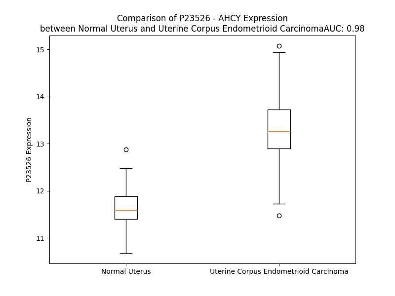

# Detailed Data for P23526

## Introduction to the Detailed Summary

### How to Interpret the Results

- **Summary & Metrics**: This section provides a quick reference to essential protein attributes, including expression changes, family classification, and biomarker applications. Regulation status (upregulated/downregulated) indicates the protein's behavior in a disease context. Some information comes from the original excel file with the proteins selected from literature, while others are derived from the analyses.
- **Expression Comparison**: A visual representation comparing protein expression between normal and disease states. It highlights significant changes in expression levels that might indicate diagnostic or therapeutic relevance. This is data coming from transcriptomics experiments and could not translate similarly to protein levels.
- **Isoform Alignment**: An interactive view of isoform alignments, revealing structural and functional differences between variants of the protein.
- **Interactors & Homologs**: Tables listing known interaction partners and homologous proteins, the more interactors and homologs, the more complex the protein is to design an antibody for.
- **Biological Assemblies**: Information about the structural arrangement of the protein in different assemblies, providing insights into its functional state but also the complexity of the protein to develop antibodies.
- **Combined Per-Residue Information**: A detailed table summarizing residue-level data. This includes predictions for epitope regions, aggregation tendencies, and modifications that might impact the protein's function. Each row corresponds to a residue in the protein, providing insights into specific sites that may be important for research or drug development.
## Summary & Metrics

- **UniProt Accession**: P23526
- **Gene Name**: AHCY
- **Protein Name**: adenosylhomocysteinase
- **Swiss Prot**: SAHH_HUMAN
- **Family**: enzyme
- **Biomarker Application**: unspecified application
- **Number of Isoforms**: 2
- **Regulation**: 1
- **(transcriptomics) AUC**: 0.98
- **(transcriptomics) Fold Change**: 1.14
- **(transcriptomics) Regulation**: Upregulated
- **Discotope Epitope Count**: 74
- **Max n_uniprots (Homo)**: 4.0
- **Max n_uniprots (Hetero)**: N/A

## Expression Comparison

## Isoform Alignment

<pre style='font-size:14px; font-family:monospace;'>P23526-1 MSDKLPYKVADIGLAAWGRKALDIAENEMPGLMRMRERYSASKPLKGARIAGCLHMTVETAVLIETLVTLGAEVQWSSCNIFSTQDHAAAAIAKAGIPVYAWKGETDEEYLWCIEQTLYFKDGPLNMILDDGGDLTNLIHTKYPQLLPGIRGISEETTTGVHNLYKMMANGILKVPAINVNDSVTKSKFDNLYGCRESLIDGIKRATDVMIAGKVAVVAGYGDVGKGCAQALRGFGARVIITEIDPINALQAAMEGYEVTTMDEACQEGNIFVTTTGCIDIILGRHFEQMKDDAIVCNIGHFDVEIDVKWLNENAVEKVNIKPQVDRYRLKNGRRIILLAEGRLVNLGCAMGHPSFVMSNSFTNQVMAQIELWTHPDKYPVGVHFLPKKLDEAVAEAHLGKLNVKLTKLTEKQAQYLGMSCDGPFKPDHYRY
P23526-2 ----------------------------MPGLMRMRERYSASKPLKGARIAGCLHMTVETAVLIETLVTLGAEVQWSSCNIFSTQDHAAAAIAKAGIPVYAWKGETDEEYLWCIEQTLYFKDGPLNMILDDGGDLTNLIHTKYPQLLPGIRGISEETTTGVHNLYKMMANGILKVPAINVNDSVTKSKFDNLYGCRESLIDGIKRATDVMIAGKVAVVAGYGDVGKGCAQALRGFGARVIITEIDPINALQAAMEGYEVTTMDEACQEGNIFVTTTGCIDIILGRHFEQMKDDAIVCNIGHFDVEIDVKWLNENAVEKVNIKPQVDRYRLKNGRRIILLAEGRLVNLGCAMGHPSFVMSNSFTNQVMAQIELWTHPDKYPVGVHFLPKKLDEAVAEAHLGKLNVKLTKLTEKQAQYLGMSCDGPFKPDHYRY
</pre>

## Interactors

| preferredName_A   | preferredName_B   |   score |
|:------------------|:------------------|--------:|
| AHCY              | MTR               |   0.992 |
| AHCY              | BHMT              |   0.988 |
| AHCY              | CBS               |   0.987 |
| AHCY              | CTH               |   0.983 |
| AHCY              | BHMT2             |   0.979 |
| AHCY              | AHCYL1            |   0.968 |
| AHCY              | DNMT1             |   0.952 |
| AHCY              | DNMT3B            |   0.95  |
| AHCY              | DNMT3A            |   0.937 |
| AHCY              | KYAT1             |   0.925 |
| AHCY              | KYAT3             |   0.924 |
| AHCY              | AHCYL2            |   0.921 |

## Homologs

| uniprot_id   | gene_id   |
|:-------------|:----------|
| A0A024R0A8   | AHCYL1    |
| Q96HN2       | AHCYL2    |

## Biological Assemblies

|   Unnamed: 0 |   assembly |   n_uniprots | composition   | crystal_id   |
|-------------:|-----------:|-------------:|:--------------|:-------------|
|            0 |          1 |            2 | Homo          | 4yvf         |
|            0 |          1 |            2 | Homo          | 1a7a         |
|            0 |          1 |            1 | Homo          | 1li4         |
|            0 |          1 |            4 | Homo          | 5w4b         |
|            1 |          2 |            2 | Homo          | 5w4b         |
|            0 |          1 |            2 | Homo          | 4pfj         |
|            0 |          1 |            2 | Homo          | 5w49         |
|            0 |          1 |            2 | Homo          | 4pgf         |

## Combined Per-Residue Information

|   res | aa   |   epitope_score | epitope   |   relative_surface_accessibility |   modeling_confidence |   Aggregation | modification                   |
|------:|:-----|----------------:|:----------|---------------------------------:|----------------------:|--------------:|:-------------------------------|
|     1 | M    |         0.12649 | False     |                          1.30753 |                 43.55 |         0     | N/A                            |
|     2 | S    |         0.15483 | False     |                          0.7542  |                 58.32 |         0     | N-acetylserine                 |
|     3 | D    |         0.17852 | True      |                          0.97617 |                 82.29 |         0     | N/A                            |
|     4 | K    |         0.16369 | False     |                          0.33041 |                 93.68 |         0     | N/A                            |
|     5 | L    |         0.2869  | True      |                          0.54032 |                 97.24 |         0     | N/A                            |
|     6 | P    |         0.12221 | False     |                          0.66655 |                 97.68 |         0     | N/A                            |
|     7 | Y    |         0.0868  | False     |                          0.34068 |                 98.67 |         0     | N/A                            |
|     8 | K    |         0.11179 | False     |                          0.36024 |                 98.84 |         0     | N/A                            |
|     9 | V    |         0.04282 | False     |                          0.14929 |                 98.84 |         0     | N/A                            |
|    10 | A    |         0.19508 | True      |                          0.5927  |                 98.65 |         0     | N/A                            |
|    11 | D    |         0.29063 | True      |                          0.43246 |                 98.78 |         0     | N/A                            |
|    12 | I    |         0.13636 | False     |                          0.38643 |                 98.79 |         2.587 | N/A                            |
|    13 | G    |         0.2274  | True      |                          0.70386 |                 98.74 |         2.824 | N/A                            |
|    14 | L    |         0.11757 | False     |                          0.32562 |                 98.8  |         2.824 | N/A                            |
|    15 | A    |         0.05681 | False     |                          0.09342 |                 98.86 |         2.824 | N/A                            |
|    16 | A    |         0.16122 | False     |                          0.67971 |                 98.76 |         2.824 | N/A                            |
|    17 | W    |         0.28435 | True      |                          0.64271 |                 98.83 |         2.824 | N/A                            |
|    18 | G    |         0.00365 | False     |                          0       |                 98.84 |         0     | N/A                            |
|    19 | R    |         0.13762 | False     |                          0.33038 |                 98.85 |         0     | N/A                            |
|    20 | K    |         0.2401  | True      |                          0.67599 |                 98.86 |         0     | N/A                            |
|    21 | A    |         0.06965 | False     |                          0.19177 |                 98.75 |         0     | N/A                            |
|    22 | L    |         0.00725 | False     |                          0       |                 98.83 |         0     | N/A                            |
|    23 | D    |         0.10421 | False     |                          0.48165 |                 98.76 |         0     | N/A                            |
|    24 | I    |         0.17157 | False     |                          0.74553 |                 98.83 |         0     | N/A                            |
|    25 | A    |         0.02142 | False     |                          0.03043 |                 98.76 |         0     | N/A                            |
|    26 | E    |         0.06466 | False     |                          0.21541 |                 98.81 |         0     | N/A                            |
|    27 | N    |         0.15609 | False     |                          0.65328 |                 98.64 |         0     | N/A                            |
|    28 | E    |         0.08226 | False     |                          0.31269 |                 98.81 |         0     | N/A                            |
|    29 | M    |         0.00736 | False     |                          0       |                 98.87 |         0     | N/A                            |
|    30 | P    |         0.07552 | False     |                          0.20128 |                 98.82 |         0     | N/A                            |
|    31 | G    |         0.00746 | False     |                          0.00595 |                 98.79 |         0     | N/A                            |
|    32 | L    |         0.00361 | False     |                          0       |                 98.82 |         0     | N/A                            |
|    33 | M    |         0.05506 | False     |                          0.26504 |                 98.82 |         0     | N/A                            |
|    34 | R    |         0.16707 | False     |                          0.48422 |                 98.49 |         0     | N/A                            |
|    35 | M    |         0.03057 | False     |                          0.04826 |                 98.62 |         0     | N/A                            |
|    36 | R    |         0.09361 | False     |                          0.1493  |                 98.69 |         0     | N/A                            |
|    37 | E    |         0.32892 | True      |                          0.74383 |                 98.44 |         0     | N/A                            |
|    38 | R    |         0.1974  | True      |                          0.67627 |                 97.7  |         0     | N/A                            |
|    39 | Y    |         0.1024  | False     |                          0.23244 |                 98.29 |         0     | N/A                            |
|    40 | S    |         0.12009 | False     |                          0.29792 |                 97.77 |         0     | N/A                            |
|    41 | A    |         0.15863 | False     |                          0.95532 |                 98.18 |         0     | N/A                            |
|    42 | S    |         0.21695 | True      |                          0.62723 |                 98.49 |         0     | N/A                            |
|    43 | K    |         0.18747 | True      |                          0.45207 |                 98.68 |         0     | N/A                            |
|    44 | P    |         0.1048  | False     |                          0.19696 |                 98.8  |         0     | N/A                            |
|    45 | L    |         0.00342 | False     |                          0.00247 |                 98.89 |         0     | N/A                            |
|    46 | K    |         0.15818 | False     |                          0.77141 |                 98.79 |         0     | N/A                            |
|    47 | G    |         0.06836 | False     |                          0.47596 |                 98.6  |         0     | N/A                            |
|    48 | A    |         0.0027  | False     |                          0.00128 |                 98.89 |         0     | N/A                            |
|    49 | R    |         0.08888 | False     |                          0.17809 |                 98.89 |         0     | N/A                            |
|    50 | I    |         0.00288 | False     |                          0.0008  |                 98.94 |         0.264 | N/A                            |
|    51 | A    |         0.00205 | False     |                          0       |                 98.95 |         0.264 | N/A                            |
|    52 | G    |         0.00146 | False     |                          0       |                 98.92 |         0.264 | N/A                            |
|    53 | C    |         0.00261 | False     |                          0       |                 98.9  |         0.264 | N/A                            |
|    54 | L    |         0.01941 | False     |                          0.01649 |                 98.76 |         0.264 | N/A                            |
|    55 | H    |         0.05631 | False     |                          0.08562 |                 98.83 |         0.264 | N/A                            |
|    56 | M    |         0.00261 | False     |                          0       |                 98.88 |         0.264 | N/A                            |
|    57 | T    |         0.01363 | False     |                          0.04738 |                 98.9  |         0.264 | N/A                            |
|    58 | V    |         0.02471 | False     |                          0.07521 |                 98.87 |         0.264 | N/A                            |
|    59 | E    |         0.02278 | False     |                          0.07667 |                 98.86 |         0     | N/A                            |
|    60 | T    |         0.00434 | False     |                          0.00579 |                 98.9  |         2.829 | N/A                            |
|    61 | A    |         0.00133 | False     |                          0       |                 98.92 |         2.829 | N/A                            |
|    62 | V    |         0.00225 | False     |                          0       |                 98.92 |         2.829 | N/A                            |
|    63 | L    |         0.00153 | False     |                          0       |                 98.89 |         2.829 | N/A                            |
|    64 | I    |         0.00486 | False     |                          0       |                 98.92 |         2.829 | N/A                            |
|    65 | E    |         0.06634 | False     |                          0.12638 |                 98.92 |         0     | N/A                            |
|    66 | T    |         0.00232 | False     |                          0       |                 98.92 |         2.71  | N/A                            |
|    67 | L    |         0.00086 | False     |                          0       |                 98.91 |         2.995 | N/A                            |
|    68 | V    |         0.13479 | False     |                          0.39751 |                 98.85 |         2.995 | N/A                            |
|    69 | T    |         0.04444 | False     |                          0.30581 |                 98.8  |         2.995 | N/A                            |
|    70 | L    |         0.00356 | False     |                          0       |                 98.86 |         2.995 | N/A                            |
|    71 | G    |         0.04612 | False     |                          0.23021 |                 98.7  |         0.285 | N/A                            |
|    72 | A    |         0.04025 | False     |                          0.05575 |                 98.87 |         0.131 | N/A                            |
|    73 | E    |         0.07047 | False     |                          0.39384 |                 98.86 |         0     | N/A                            |
|    74 | V    |         0.02021 | False     |                          0.04529 |                 98.9  |         0     | N/A                            |
|    75 | Q    |         0.02499 | False     |                          0.04314 |                 98.85 |         0     | N/A                            |
|    76 | W    |         0.0042  | False     |                          0       |                 98.94 |         0     | N/A                            |
|    77 | S    |         0.00232 | False     |                          0       |                 98.93 |         0     | N/A                            |
|    78 | S    |         0.01187 | False     |                          0.0064  |                 98.81 |         0     | N/A                            |
|    79 | C    |         0.03179 | False     |                          0.04742 |                 98.54 |         0     | N/A                            |
|    80 | N    |         0.09774 | False     |                          0.0827  |                 98.53 |         0     | N/A                            |
|    81 | I    |         0.10055 | False     |                          0.08663 |                 98.68 |         0     | N/A                            |
|    82 | F    |         0.07228 | False     |                          0.06115 |                 98.68 |         0     | N/A                            |
|    83 | S    |         0.01936 | False     |                          0.0123  |                 98.75 |         0     | N/A                            |
|    84 | T    |         0.01799 | False     |                          0.01408 |                 98.87 |         0     | N/A                            |
|    85 | Q    |         0.0879  | False     |                          0.06636 |                 98.91 |         0     | N/A                            |
|    86 | D    |         0.06382 | False     |                          0.19661 |                 98.91 |         0     | N/A                            |
|    87 | H    |         0.04281 | False     |                          0.0711  |                 98.86 |         0     | N/A                            |
|    88 | A    |         0.00215 | False     |                          0       |                 98.89 |         1.504 | N/A                            |
|    89 | A    |         0.00215 | False     |                          0       |                 98.91 |         1.504 | N/A                            |
|    90 | A    |         0.00208 | False     |                          0       |                 98.93 |         1.504 | N/A                            |
|    91 | A    |         0.02104 | False     |                          0.0244  |                 98.91 |         1.504 | N/A                            |
|    92 | I    |         0.00365 | False     |                          0       |                 98.91 |         1.504 | N/A                            |
|    93 | A    |         0.02393 | False     |                          0.03205 |                 98.84 |         0.689 | N/A                            |
|    94 | K    |         0.14886 | False     |                          0.73174 |                 98.78 |         0     | N/A                            |
|    95 | A    |         0.2049  | True      |                          0.50391 |                 98.68 |         0     | N/A                            |
|    96 | G    |         0.10925 | False     |                          0.7493  |                 98.5  |         0     | N/A                            |
|    97 | I    |         0.13743 | False     |                          0.09655 |                 98.83 |         0     | N/A                            |
|    98 | P    |         0.05563 | False     |                          0.25832 |                 98.81 |         0     | N/A                            |
|    99 | V    |         0.0091  | False     |                          0       |                 98.91 |         0     | N/A                            |
|   100 | Y    |         0.00957 | False     |                          0.00509 |                 98.89 |         0     | N/A                            |
|   101 | A    |         0.00387 | False     |                          0       |                 98.91 |         0     | N/A                            |
|   102 | W    |         0.0762  | False     |                          0.11816 |                 98.89 |         0     | N/A                            |
|   103 | K    |         0.11536 | False     |                          0.3545  |                 98.8  |         0     | N/A                            |
|   104 | G    |         0.09449 | False     |                          0.45304 |                 98.42 |         0     | N/A                            |
|   105 | E    |         0.02737 | False     |                          0.02324 |                 98.61 |         0     | N/A                            |
|   106 | T    |         0.17959 | True      |                          0.55469 |                 98.56 |         0     | N/A                            |
|   107 | D    |         0.18562 | True      |                          0.5764  |                 97.64 |         0     | N/A                            |
|   108 | E    |         0.24154 | True      |                          0.7709  |                 98.41 |         0     | N/A                            |
|   109 | E    |         0.09544 | False     |                          0.27377 |                 98.77 |         0     | N/A                            |
|   110 | Y    |         0.08418 | False     |                          0.1376  |                 98.71 |         2.263 | N/A                            |
|   111 | L    |         0.12879 | False     |                          0.47565 |                 98.6  |         2.263 | N/A                            |
|   112 | W    |         0.13746 | False     |                          0.34674 |                 98.68 |         2.263 | N/A                            |
|   113 | C    |         0.00551 | False     |                          0.002   |                 98.86 |         2.263 | N/A                            |
|   114 | I    |         0.0179  | False     |                          0.0144  |                 98.81 |         2.263 | N/A                            |
|   115 | E    |         0.0881  | False     |                          0.21438 |                 98.54 |         0     | N/A                            |
|   116 | Q    |         0.04693 | False     |                          0.14434 |                 98.61 |         0.326 | N/A                            |
|   117 | T    |         0.00306 | False     |                          0.00072 |                 98.85 |         0.326 | N/A                            |
|   118 | L    |         0.0135  | False     |                          0.00412 |                 98.75 |         0.326 | N/A                            |
|   119 | Y    |         0.13847 | False     |                          0.46477 |                 98.39 |         0.326 | N/A                            |
|   120 | F    |         0.0678  | False     |                          0.12686 |                 98.23 |         0.326 | N/A                            |
|   121 | K    |         0.15253 | False     |                          0.97584 |                 95.99 |         0     | N/A                            |
|   122 | D    |         0.19217 | True      |                          0.65475 |                 95.96 |         0     | N/A                            |
|   123 | G    |         0.06949 | False     |                          0.26897 |                 97.47 |         0     | N/A                            |
|   124 | P    |         0.09557 | False     |                          0.35588 |                 98.62 |         0     | N/A                            |
|   125 | L    |         0.0069  | False     |                          0.00427 |                 98.87 |         0     | N/A                            |
|   126 | N    |         0.03998 | False     |                          0.07105 |                 98.89 |         0     | N/A                            |
|   127 | M    |         0.00217 | False     |                          0.00288 |                 98.95 |         0     | N/A                            |
|   128 | I    |         0.00204 | False     |                          0       |                 98.95 |         0     | N/A                            |
|   129 | L    |         0.00265 | False     |                          0       |                 98.9  |         0     | N/A                            |
|   130 | D    |         0.00782 | False     |                          0       |                 98.83 |         0     | N/A                            |
|   131 | D    |         0.04359 | False     |                          0.05777 |                 98.64 |         0     | N/A                            |
|   132 | G    |         0.02062 | False     |                          0.02659 |                 97.05 |         0     | N/A                            |
|   133 | G    |         0.0041  | False     |                          0.00483 |                 98.09 |         0     | N/A                            |
|   134 | D    |         0.04431 | False     |                          0.22638 |                 98.61 |         0     | N/A                            |
|   135 | L    |         0.00151 | False     |                          0       |                 98.83 |         0.171 | N/A                            |
|   136 | T    |         0.00377 | False     |                          0.00312 |                 98.87 |         0.171 | N/A                            |
|   137 | N    |         0.10518 | False     |                          0.32384 |                 98.69 |         0.171 | N/A                            |
|   138 | L    |         0.04886 | False     |                          0.10683 |                 98.74 |         0.171 | N/A                            |
|   139 | I    |         0.0042  | False     |                          0       |                 98.83 |         0.171 | N/A                            |
|   140 | H    |         0.03101 | False     |                          0.1021  |                 98.7  |         0     | N/A                            |
|   141 | T    |         0.30716 | True      |                          0.7681  |                 98.48 |         0     | N/A                            |
|   142 | K    |         0.23499 | True      |                          0.5415  |                 98.62 |         0     | N/A                            |
|   143 | Y    |         0.08381 | False     |                          0.164   |                 98.71 |         0     | N/A                            |
|   144 | P    |         0.30413 | True      |                          0.49373 |                 98.61 |         0     | N/A                            |
|   145 | Q    |         0.28693 | True      |                          0.60584 |                 98.69 |         0     | N/A                            |
|   146 | L    |         0.05844 | False     |                          0.10545 |                 98.78 |         0     | N/A                            |
|   147 | L    |         0.09187 | False     |                          0.10505 |                 98.82 |         0     | N/A                            |
|   148 | P    |         0.24576 | True      |                          0.91519 |                 98.51 |         0     | N/A                            |
|   149 | G    |         0.1228  | False     |                          0.53198 |                 98.53 |         0     | N/A                            |
|   150 | I    |         0.05496 | False     |                          0.05524 |                 98.9  |         0     | N/A                            |
|   151 | R    |         0.11434 | False     |                          0.37637 |                 98.73 |         0     | N/A                            |
|   152 | G    |         0.00208 | False     |                          0       |                 98.86 |         0     | N/A                            |
|   153 | I    |         0.00223 | False     |                          0       |                 98.94 |         0     | N/A                            |
|   154 | S    |         0.00215 | False     |                          0       |                 98.93 |         0     | N/A                            |
|   155 | E    |         0.01102 | False     |                          0.00212 |                 98.84 |         0     | N/A                            |
|   156 | E    |         0.01941 | False     |                          0.02788 |                 98.27 |         0     | N/A                            |
|   157 | T    |         0.05418 | False     |                          0.15982 |                 94.24 |         0     | N/A                            |
|   158 | T    |         0.06383 | False     |                          0.53392 |                 93.94 |         0     | N/A                            |
|   159 | T    |         0.04915 | False     |                          0.22004 |                 95.16 |         0     | N/A                            |
|   160 | G    |         0.00303 | False     |                          0       |                 97.15 |         0     | N/A                            |
|   161 | V    |         0.02222 | False     |                          0.04189 |                 97.44 |         0     | N/A                            |
|   162 | H    |         0.16029 | False     |                          0.6831  |                 97.32 |         0     | N/A                            |
|   163 | N    |         0.09286 | False     |                          0.19692 |                 98.1  |         0     | N/A                            |
|   164 | L    |         0.00646 | False     |                          0.0033  |                 98.7  |         0     | N/A                            |
|   165 | Y    |         0.09432 | False     |                          0.39227 |                 98.45 |         0     | N/A                            |
|   166 | K    |         0.19815 | True      |                          0.60405 |                 98.2  |         0     | N/A                            |
|   167 | M    |         0.05546 | False     |                          0.06832 |                 98.6  |         0     | N/A                            |
|   168 | M    |         0.11298 | False     |                          0.44124 |                 98.19 |         0     | N/A                            |
|   169 | A    |         0.15385 | False     |                          0.8591  |                 97.99 |         0     | N/A                            |
|   170 | N    |         0.16108 | False     |                          0.58075 |                 98.28 |         0     | N/A                            |
|   171 | G    |         0.17975 | True      |                          0.55253 |                 97.89 |         0     | N/A                            |
|   172 | I    |         0.22904 | True      |                          0.55093 |                 98.33 |         0     | N/A                            |
|   173 | L    |         0.03052 | False     |                          0.03169 |                 98.77 |         0     | N/A                            |
|   174 | K    |         0.11477 | False     |                          0.55755 |                 98.69 |         0     | N/A                            |
|   175 | V    |         0.00766 | False     |                          0.00476 |                 98.79 |         0     | N/A                            |
|   176 | P    |         0.02168 | False     |                          0.14215 |                 98.85 |         0     | N/A                            |
|   177 | A    |         0.00115 | False     |                          0       |                 98.93 |         0     | N/A                            |
|   178 | I    |         0.00533 | False     |                          0       |                 98.91 |         0     | N/A                            |
|   179 | N    |         0.00327 | False     |                          0.00127 |                 98.75 |         0     | N/A                            |
|   180 | V    |         0.00226 | False     |                          0       |                 98.77 |         0     | N/A                            |
|   181 | N    |         0.01785 | False     |                          0.01849 |                 98.34 |         0     | N/A                            |
|   182 | D    |         0.09692 | False     |                          0.38806 |                 98.26 |         0     | N/A                            |
|   183 | S    |         0.00867 | False     |                          0.03917 |                 98.64 |         0     | Phosphoserine                  |
|   184 | V    |         0.02786 | False     |                          0.29324 |                 98.61 |         0     | N/A                            |
|   185 | T    |         0.01049 | False     |                          0.01809 |                 98.62 |         0     | N/A                            |
|   186 | K    |         0.01313 | False     |                          0.03314 |                 98.75 |         0     | N6-(2-hydroxyisobutyryl)lysine |
|   187 | S    |         0.02418 | False     |                          0.02912 |                 97.5  |         0     | N/A                            |
|   188 | K    |         0.04909 | False     |                          0.25424 |                 98.6  |         0     | N/A                            |
|   189 | F    |         0.08132 | False     |                          0.3395  |                 98.63 |         0     | N/A                            |
|   190 | D    |         0.01569 | False     |                          0.04136 |                 98.68 |         0     | N/A                            |
|   191 | N    |         0.03746 | False     |                          0.07061 |                 98.29 |         0     | N/A                            |
|   192 | L    |         0.07643 | False     |                          0.1657  |                 98.62 |         0     | N/A                            |
|   193 | Y    |         0.09372 | False     |                          0.35557 |                 98.74 |         0     | Phosphotyrosine                |
|   194 | G    |         0.00215 | False     |                          0.00161 |                 98.68 |         0     | N/A                            |
|   195 | C    |         0.01045 | False     |                          0.03274 |                 98.72 |         0     | N/A                            |
|   196 | R    |         0.08228 | False     |                          0.36478 |                 98.83 |         0     | N/A                            |
|   197 | E    |         0.07831 | False     |                          0.52173 |                 98.79 |         0     | N/A                            |
|   198 | S    |         0.01013 | False     |                          0.01768 |                 98.82 |         0     | N/A                            |
|   199 | L    |         0.00251 | False     |                          0       |                 98.88 |         0     | N/A                            |
|   200 | I    |         0.05835 | False     |                          0.0752  |                 98.86 |         0     | N/A                            |
|   201 | D    |         0.06452 | False     |                          0.2799  |                 98.84 |         0     | N/A                            |
|   202 | G    |         0.00289 | False     |                          0       |                 98.85 |         0     | N/A                            |
|   203 | I    |         0.00549 | False     |                          0       |                 98.9  |         0     | N/A                            |
|   204 | K    |         0.11391 | False     |                          0.3215  |                 98.87 |         0     | N/A                            |
|   205 | R    |         0.15246 | False     |                          0.46817 |                 98.55 |         0     | N/A                            |
|   206 | A    |         0.02209 | False     |                          0.06627 |                 98.71 |         0.095 | N/A                            |
|   207 | T    |         0.11431 | False     |                          0.23438 |                 98.78 |         0.702 | N/A                            |
|   208 | D    |         0.1999  | True      |                          0.72187 |                 98.59 |         2.191 | N/A                            |
|   209 | V    |         0.15478 | False     |                          0.21802 |                 98.8  |         3.676 | N/A                            |
|   210 | M    |         0.29491 | True      |                          0.68276 |                 98.77 |         3.676 | N/A                            |
|   211 | I    |         0.03088 | False     |                          0.01453 |                 98.89 |         3.676 | N/A                            |
|   212 | A    |         0.11426 | False     |                          0.35307 |                 98.81 |         3.676 | N/A                            |
|   213 | G    |         0.19838 | True      |                          0.88406 |                 98.42 |         3.676 | N/A                            |
|   214 | K    |         0.10856 | False     |                          0.25927 |                 98.84 |         2.738 | N/A                            |
|   215 | V    |         0.05326 | False     |                          0.09126 |                 98.94 |        47.946 | N/A                            |
|   216 | A    |         0.00159 | False     |                          0       |                 98.96 |        50.732 | N/A                            |
|   217 | V    |         0.00329 | False     |                          0.0007  |                 98.97 |        51.125 | N/A                            |
|   218 | V    |         0.00478 | False     |                          0       |                 98.96 |        51.062 | N/A                            |
|   219 | A    |         0.00919 | False     |                          0.00255 |                 98.94 |        50.16  | N/A                            |
|   220 | G    |         0.08404 | False     |                          0.0906  |                 98.81 |        36.622 | N/A                            |
|   221 | Y    |         0.0619  | False     |                          0.03354 |                 98.88 |        35.373 | N/A                            |
|   222 | G    |         0.07658 | False     |                          0.3806  |                 98.31 |         3.348 | N/A                            |
|   223 | D    |         0.05191 | False     |                          0.21524 |                 98.52 |         0.548 | N/A                            |
|   224 | V    |         0.03395 | False     |                          0.22198 |                 98.61 |         0.548 | N/A                            |
|   225 | G    |         0.00276 | False     |                          0       |                 98.83 |         0     | N/A                            |
|   226 | K    |         0.07182 | False     |                          0.19039 |                 98.91 |         0     | N/A                            |
|   227 | G    |         0.00442 | False     |                          0.00161 |                 98.76 |         0     | N/A                            |
|   228 | C    |         0.00205 | False     |                          0       |                 98.9  |         0     | N/A                            |
|   229 | A    |         0.00334 | False     |                          0       |                 98.91 |         0     | N/A                            |
|   230 | Q    |         0.12814 | False     |                          0.4195  |                 98.87 |         0     | N/A                            |
|   231 | A    |         0.01706 | False     |                          0.08717 |                 98.8  |         0     | N/A                            |
|   232 | L    |         0.00331 | False     |                          0       |                 98.9  |         0     | N/A                            |
|   233 | R    |         0.2745  | True      |                          0.35183 |                 98.86 |         0     | N/A                            |
|   234 | G    |         0.21349 | True      |                          0.75344 |                 98.72 |         0     | N/A                            |
|   235 | F    |         0.14733 | False     |                          0.56215 |                 98.67 |         1.103 | N/A                            |
|   236 | G    |         0.1762  | True      |                          0.51917 |                 98.68 |         1.103 | N/A                            |
|   237 | A    |         0.05487 | False     |                          0.07904 |                 98.9  |         1.238 | N/A                            |
|   238 | R    |         0.21844 | True      |                          0.46984 |                 98.93 |         1.398 | N/A                            |
|   239 | V    |         0.03151 | False     |                          0.05244 |                 98.95 |         1.398 | N/A                            |
|   240 | I    |         0.00995 | False     |                          0       |                 98.95 |         1.398 | N/A                            |
|   241 | I    |         0.00794 | False     |                          0       |                 98.95 |         1.398 | N/A                            |
|   242 | T    |         0.06526 | False     |                          0.11497 |                 98.93 |         1.398 | N/A                            |
|   243 | E    |         0.1235  | False     |                          0.22914 |                 98.86 |         1.398 | N/A                            |
|   244 | I    |         0.2119  | True      |                          1.02486 |                 98.76 |         1.398 | N/A                            |
|   245 | D    |         0.12951 | False     |                          0.31731 |                 98.71 |         0     | N/A                            |
|   246 | P    |         0.26157 | True      |                          0.77061 |                 98.7  |         0     | N/A                            |
|   247 | I    |         0.25913 | True      |                          0.73572 |                 98.8  |         0     | N/A                            |
|   248 | N    |         0.09575 | False     |                          0.19776 |                 98.84 |         0     | N/A                            |
|   249 | A    |         0.07681 | False     |                          0.20341 |                 98.87 |         0     | N/A                            |
|   250 | L    |         0.29304 | True      |                          0.69176 |                 98.87 |         0     | N/A                            |
|   251 | Q    |         0.19367 | True      |                          0.38857 |                 98.88 |         0     | N/A                            |
|   252 | A    |         0.00452 | False     |                          0       |                 98.88 |         0     | N/A                            |
|   253 | A    |         0.28744 | True      |                          0.48941 |                 98.78 |         0     | N/A                            |
|   254 | M    |         0.408   | True      |                          0.81996 |                 98.72 |         0     | N/A                            |
|   255 | E    |         0.19264 | True      |                          0.48106 |                 98.81 |         0     | N/A                            |
|   256 | G    |         0.2348  | True      |                          0.81028 |                 98.75 |         0     | N/A                            |
|   257 | Y    |         0.12878 | False     |                          0.0591  |                 98.91 |         0     | N/A                            |
|   258 | E    |         0.23493 | True      |                          0.4082  |                 98.9  |         0     | N/A                            |
|   259 | V    |         0.08848 | False     |                          0.36841 |                 98.92 |         0     | N/A                            |
|   260 | T    |         0.16897 | False     |                          0.26896 |                 98.87 |         0     | N/A                            |
|   261 | T    |         0.1811  | True      |                          0.56177 |                 98.9  |         0     | N/A                            |
|   262 | M    |         0.05766 | False     |                          0.09641 |                 98.91 |         0     | N/A                            |
|   263 | D    |         0.15779 | False     |                          0.40829 |                 98.88 |         0     | N/A                            |
|   264 | E    |         0.33721 | True      |                          0.52087 |                 98.85 |         0     | N/A                            |
|   265 | A    |         0.00209 | False     |                          0       |                 98.88 |         0     | N/A                            |
|   266 | C    |         0.00719 | False     |                          0       |                 98.79 |         0     | N/A                            |
|   267 | Q    |         0.17113 | False     |                          0.45297 |                 98.83 |         0     | N/A                            |
|   268 | E    |         0.13272 | False     |                          0.29357 |                 98.83 |         0     | N/A                            |
|   269 | G    |         0.00513 | False     |                          0       |                 98.86 |         0     | N/A                            |
|   270 | N    |         0.06263 | False     |                          0.22334 |                 98.93 |         1     | N/A                            |
|   271 | I    |         0.0049  | False     |                          0.0032  |                 98.97 |        36.773 | N/A                            |
|   272 | F    |         0.00112 | False     |                          0       |                 98.96 |        38.053 | N/A                            |
|   273 | V    |         0.00797 | False     |                          0.00841 |                 98.97 |        38.053 | N/A                            |
|   274 | T    |         0.00766 | False     |                          0.00095 |                 98.94 |        38.053 | N/A                            |
|   275 | T    |         0.10079 | False     |                          0.10555 |                 98.84 |        37.532 | N/A                            |
|   276 | T    |         0.06565 | False     |                          0.355   |                 98.6  |        15.492 | N/A                            |
|   277 | G    |         0.17272 | True      |                          0.58314 |                 96.81 |         2.248 | N/A                            |
|   278 | C    |         0.13258 | False     |                          0.45283 |                 97.94 |         1.072 | N/A                            |
|   279 | I    |         0.24285 | True      |                          0.64183 |                 97.99 |         0.989 | N/A                            |
|   280 | D    |         0.13346 | False     |                          0.50806 |                 98.57 |         0     | N/A                            |
|   281 | I    |         0.04032 | False     |                          0.18744 |                 98.86 |         0     | N/A                            |
|   282 | I    |         0.00429 | False     |                          0.0008  |                 98.92 |         0     | N/A                            |
|   283 | L    |         0.08465 | False     |                          0.18301 |                 98.9  |         0     | N/A                            |
|   284 | G    |         0.05943 | False     |                          0.07867 |                 98.74 |         0     | N/A                            |
|   285 | R    |         0.17634 | True      |                          0.51018 |                 98.8  |         0     | N/A                            |
|   286 | H    |         0.01399 | False     |                          0.0149  |                 98.92 |         0     | N/A                            |
|   287 | F    |         0.00627 | False     |                          0.00254 |                 98.91 |         0     | N/A                            |
|   288 | E    |         0.10914 | False     |                          0.48449 |                 98.8  |         0     | N/A                            |
|   289 | Q    |         0.09523 | False     |                          0.3861  |                 98.87 |         0     | N/A                            |
|   290 | M    |         0.00811 | False     |                          0.00372 |                 98.87 |         0     | N/A                            |
|   291 | K    |         0.08852 | False     |                          0.39416 |                 98.81 |         0     | N/A                            |
|   292 | D    |         0.14195 | False     |                          0.40179 |                 98.88 |         0     | N/A                            |
|   293 | D    |         0.13698 | False     |                          0.30675 |                 98.86 |         0     | N/A                            |
|   294 | A    |         0.00414 | False     |                          0.00383 |                 98.95 |         0     | N/A                            |
|   295 | I    |         0.02303 | False     |                          0.0344  |                 98.97 |         0.246 | N/A                            |
|   296 | V    |         0.00123 | False     |                          0       |                 98.96 |         0.246 | N/A                            |
|   297 | C    |         0.00284 | False     |                          0       |                 98.94 |         0.246 | N/A                            |
|   298 | N    |         0.00612 | False     |                          0.0016  |                 98.87 |         0.246 | N/A                            |
|   299 | I    |         0.06499 | False     |                          0.04226 |                 98.76 |         0.246 | N/A                            |
|   300 | G    |         0.1138  | False     |                          0.1014  |                 96.59 |         0     | N/A                            |
|   301 | H    |         0.05532 | False     |                          0.08039 |                 92.11 |         0     | N/A                            |
|   302 | F    |         0.17695 | True      |                          0.36256 |                 93.42 |         0     | N/A                            |
|   303 | D    |         0.11636 | False     |                          0.30109 |                 96.05 |         0     | N/A                            |
|   304 | V    |         0.16725 | False     |                          0.5111  |                 97.86 |         0     | N/A                            |
|   305 | E    |         0.01066 | False     |                          0.00433 |                 98.7  |         0     | N/A                            |
|   306 | I    |         0.02654 | False     |                          0.02444 |                 98.89 |         0     | N/A                            |
|   307 | D    |         0.05903 | False     |                          0.27317 |                 98.8  |         0     | N/A                            |
|   308 | V    |         0.04253 | False     |                          0.13956 |                 98.76 |         0     | N/A                            |
|   309 | K    |         0.13115 | False     |                          0.6883  |                 98.68 |         0     | N/A                            |
|   310 | W    |         0.07969 | False     |                          0.2232  |                 98.86 |         0     | N/A                            |
|   311 | L    |         0.00539 | False     |                          0       |                 98.79 |         0     | N/A                            |
|   312 | N    |         0.17869 | True      |                          0.54165 |                 98.69 |         0     | N/A                            |
|   313 | E    |         0.31912 | True      |                          0.60894 |                 98.73 |         0     | N/A                            |
|   314 | N    |         0.10382 | False     |                          0.25045 |                 98.83 |         0     | N/A                            |
|   315 | A    |         0.07869 | False     |                          0.21467 |                 98.56 |         0     | N/A                            |
|   316 | V    |         0.16716 | False     |                          0.53081 |                 98.59 |         0     | N/A                            |
|   317 | E    |         0.21668 | True      |                          0.38325 |                 98.61 |         0     | N/A                            |
|   318 | K    |         0.22679 | True      |                          0.46014 |                 98.75 |         0     | N/A                            |
|   319 | V    |         0.18616 | True      |                          0.46651 |                 98.79 |         0     | N/A                            |
|   320 | N    |         0.22619 | True      |                          0.57335 |                 98.76 |         0     | N/A                            |
|   321 | I    |         0.10371 | False     |                          0.58111 |                 98.76 |         0     | N/A                            |
|   322 | K    |         0.12808 | False     |                          0.3867  |                 98.72 |         0     | N/A                            |
|   323 | P    |         0.19498 | True      |                          0.75809 |                 98.68 |         0     | N/A                            |
|   324 | Q    |         0.07284 | False     |                          0.14795 |                 98.6  |         0     | N/A                            |
|   325 | V    |         0.03733 | False     |                          0.04094 |                 98.9  |         0     | N/A                            |
|   326 | D    |         0.02714 | False     |                          0.02698 |                 98.91 |         0     | N/A                            |
|   327 | R    |         0.1278  | False     |                          0.26481 |                 98.9  |         0     | N/A                            |
|   328 | Y    |         0.00646 | False     |                          0.00303 |                 98.91 |         0     | N/A                            |
|   329 | R    |         0.14805 | False     |                          0.4111  |                 98.87 |         0     | N/A                            |
|   330 | L    |         0.03585 | False     |                          0.03348 |                 98.84 |         0     | N/A                            |
|   331 | K    |         0.15688 | False     |                          0.78817 |                 98.45 |         0     | N/A                            |
|   332 | N    |         0.18964 | True      |                          0.43326 |                 98.37 |         0     | N/A                            |
|   333 | G    |         0.15889 | False     |                          0.54483 |                 98.42 |         0     | N/A                            |
|   334 | R    |         0.23561 | True      |                          0.30886 |                 98.78 |         0     | N/A                            |
|   335 | R    |         0.1509  | False     |                          0.33238 |                 98.87 |         0     | N/A                            |
|   336 | I    |         0.00787 | False     |                          0.0016  |                 98.94 |        63.632 | N/A                            |
|   337 | I    |         0.03465 | False     |                          0.16559 |                 98.96 |        63.632 | N/A                            |
|   338 | L    |         0.00706 | False     |                          0.0057  |                 98.94 |        63.632 | N/A                            |
|   339 | L    |         0.00368 | False     |                          0       |                 98.92 |        63.632 | N/A                            |
|   340 | A    |         0.00386 | False     |                          0       |                 98.72 |        63.632 | N/A                            |
|   341 | E    |         0.04868 | False     |                          0.32164 |                 98.62 |         0     | N/A                            |
|   342 | G    |         0.00169 | False     |                          0       |                 98.6  |         0     | N/A                            |
|   343 | R    |         0.11329 | False     |                          0.15123 |                 98.54 |         0     | N/A                            |
|   344 | L    |         0.03308 | False     |                          0.0758  |                 98.04 |         0     | N/A                            |
|   345 | V    |         0.00208 | False     |                          0       |                 98.84 |         0     | N/A                            |
|   346 | N    |         0.01853 | False     |                          0.03551 |                 98.69 |         0     | N/A                            |
|   347 | L    |         0.06341 | False     |                          0.11297 |                 98.54 |         0     | N/A                            |
|   348 | G    |         0.01516 | False     |                          0.02203 |                 98.31 |         0     | N/A                            |
|   349 | C    |         0.02743 | False     |                          0.14305 |                 98.73 |         0     | N/A                            |
|   350 | A    |         0.03492 | False     |                          0.09078 |                 98.71 |         0     | N/A                            |
|   351 | M    |         0.12062 | False     |                          0.35856 |                 98.76 |         0     | N/A                            |
|   352 | G    |         0.05052 | False     |                          0.08181 |                 98.72 |         0     | N/A                            |
|   353 | H    |         0.04594 | False     |                          0.13327 |                 98.8  |         0     | N/A                            |
|   354 | P    |         0.10896 | False     |                          0.37264 |                 98.68 |         0     | N/A                            |
|   355 | S    |         0.01866 | False     |                          0.13666 |                 98.81 |         0.141 | N/A                            |
|   356 | F    |         0.05799 | False     |                          0.23266 |                 98.88 |         0.141 | N/A                            |
|   357 | V    |         0.02828 | False     |                          0.09684 |                 98.63 |         0.141 | N/A                            |
|   358 | M    |         0.02097 | False     |                          0.12859 |                 98.77 |         0.141 | N/A                            |
|   359 | S    |         0.00249 | False     |                          0       |                 98.89 |         0.141 | N/A                            |
|   360 | N    |         0.01307 | False     |                          0.04681 |                 98.82 |         0     | N/A                            |
|   361 | S    |         0.00216 | False     |                          0       |                 98.74 |         0     | N/A                            |
|   362 | F    |         0.00435 | False     |                          0.00637 |                 98.85 |         0     | N/A                            |
|   363 | T    |         0.00259 | False     |                          0.00857 |                 98.92 |         0     | N/A                            |
|   364 | N    |         0.00111 | False     |                          0       |                 98.87 |         0     | N/A                            |
|   365 | Q    |         0.00229 | False     |                          0       |                 98.82 |         0     | N/A                            |
|   366 | V    |         0.00152 | False     |                          0       |                 98.88 |         0     | N/A                            |
|   367 | M    |         0.01721 | False     |                          0.10262 |                 98.79 |         0     | N/A                            |
|   368 | A    |         0.00104 | False     |                          0       |                 98.88 |         0     | N/A                            |
|   369 | Q    |         0.00123 | False     |                          0       |                 98.9  |         0     | N/A                            |
|   370 | I    |         0.04119 | False     |                          0.1128  |                 98.81 |         0     | N/A                            |
|   371 | E    |         0.04263 | False     |                          0.08951 |                 98.74 |         0     | N/A                            |
|   372 | L    |         0.00253 | False     |                          0.00247 |                 98.81 |         0     | N/A                            |
|   373 | W    |         0.07857 | False     |                          0.12685 |                 98.83 |         0     | N/A                            |
|   374 | T    |         0.09936 | False     |                          0.38648 |                 98.7  |         0     | N/A                            |
|   375 | H    |         0.13214 | False     |                          0.4191  |                 98.58 |         0     | N/A                            |
|   376 | P    |         0.10309 | False     |                          0.36809 |                 98.32 |         0     | N/A                            |
|   377 | D    |         0.2639  | True      |                          0.90468 |                 98.15 |         0     | N/A                            |
|   378 | K    |         0.1881  | True      |                          0.56989 |                 98.27 |         0     | N/A                            |
|   379 | Y    |         0.05741 | False     |                          0.0609  |                 98.56 |         0     | N/A                            |
|   380 | P    |         0.14909 | False     |                          0.65269 |                 98.4  |         0     | N/A                            |
|   381 | V    |         0.19396 | True      |                          0.48234 |                 98.7  |         0     | N/A                            |
|   382 | G    |         0.02584 | False     |                          0.06599 |                 98.65 |         0     | N/A                            |
|   383 | V    |         0.02474 | False     |                          0.16773 |                 98.77 |         0     | N/A                            |
|   384 | H    |         0.09468 | False     |                          0.22301 |                 98.75 |         0     | N/A                            |
|   385 | F    |         0.09679 | False     |                          0.59026 |                 98.39 |         0     | N/A                            |
|   386 | L    |         0.01646 | False     |                          0.07041 |                 97.25 |         0     | N/A                            |
|   387 | P    |         0.07833 | False     |                          0.48312 |                 96.66 |         0     | N/A                            |
|   388 | K    |         0.04142 | False     |                          0.20269 |                 97.16 |         0     | N/A                            |
|   389 | K    |         0.06923 | False     |                          0.4429  |                 97.35 |         0     | N/A                            |
|   390 | L    |         0.03929 | False     |                          0.30666 |                 97.87 |         0     | N/A                            |
|   391 | D    |         0.02317 | False     |                          0.06613 |                 97.7  |         0     | N/A                            |
|   392 | E    |         0.04626 | False     |                          0.21883 |                 98.59 |         0     | N/A                            |
|   393 | A    |         0.04102 | False     |                          0.32601 |                 98.32 |         0     | N/A                            |
|   394 | V    |         0.00257 | False     |                          0       |                 98.57 |         0     | N/A                            |
|   395 | A    |         0.05061 | False     |                          0.3137  |                 98.7  |         0     | N/A                            |
|   396 | E    |         0.06249 | False     |                          0.40139 |                 98.53 |         0     | N/A                            |
|   397 | A    |         0.032   | False     |                          0.13232 |                 98.58 |         0     | N/A                            |
|   398 | H    |         0.02996 | False     |                          0.03821 |                 98.82 |         0     | N/A                            |
|   399 | L    |         0.06455 | False     |                          0.25967 |                 98.67 |         0     | N/A                            |
|   400 | G    |         0.10744 | False     |                          0.67959 |                 98.32 |         0     | N/A                            |
|   401 | K    |         0.13159 | False     |                          0.36678 |                 98.36 |         0     | N/A                            |
|   402 | L    |         0.27906 | True      |                          0.61967 |                 98.57 |         0     | N/A                            |
|   403 | N    |         0.20149 | True      |                          0.79608 |                 98.45 |         0     | N/A                            |
|   404 | V    |         0.14653 | False     |                          0.52667 |                 98.61 |         0     | N/A                            |
|   405 | K    |         0.25481 | True      |                          0.95898 |                 98.57 |         0     | N/A                            |
|   406 | L    |         0.12091 | False     |                          0.59426 |                 98.24 |         0     | N/A                            |
|   407 | T    |         0.22234 | True      |                          0.8431  |                 98.42 |         0     | N/A                            |
|   408 | K    |         0.17322 | True      |                          0.59834 |                 98.21 |         0     | N/A                            |
|   409 | L    |         0.1452  | False     |                          0.26698 |                 97.68 |         0     | N/A                            |
|   410 | T    |         0.23896 | True      |                          0.56329 |                 98.41 |         0     | N/A                            |
|   411 | E    |         0.23766 | True      |                          0.76028 |                 98.33 |         0     | N/A                            |
|   412 | K    |         0.2716  | True      |                          0.8312  |                 98.59 |         0     | N/A                            |
|   413 | Q    |         0.18295 | True      |                          0.43354 |                 98.68 |         0     | N/A                            |
|   414 | A    |         0.02993 | False     |                          0.05908 |                 98.36 |         0     | N/A                            |
|   415 | Q    |         0.31762 | True      |                          0.77877 |                 98.23 |         0     | N/A                            |
|   416 | Y    |         0.28298 | True      |                          0.858   |                 98.47 |         0     | N/A                            |
|   417 | L    |         0.2028  | True      |                          0.55784 |                 98.19 |         0     | N/A                            |
|   418 | G    |         0.19015 | True      |                          0.84303 |                 97.5  |         0     | N/A                            |
|   419 | M    |         0.267   | True      |                          0.34796 |                 96.58 |         0     | N/A                            |
|   420 | S    |         0.12586 | False     |                          0.46504 |                 97.02 |         0     | N/A                            |
|   421 | C    |         0.14655 | False     |                          0.29718 |                 97.09 |         0     | N/A                            |
|   422 | D    |         0.13526 | False     |                          0.57871 |                 96.24 |         0     | N/A                            |
|   423 | G    |         0.0718  | False     |                          0.09432 |                 96.56 |         0     | N/A                            |
|   424 | P    |         0.07937 | False     |                          0.47175 |                 97.99 |         0     | N/A                            |
|   425 | F    |         0.1008  | False     |                          0.31418 |                 98.19 |         0     | N/A                            |
|   426 | K    |         0.11097 | False     |                          0.44236 |                 98.43 |         0     | N/A                            |
|   427 | P    |         0.16783 | False     |                          0.51651 |                 97.31 |         0     | N/A                            |
|   428 | D    |         0.12296 | False     |                          0.78756 |                 97.03 |         0     | N/A                            |
|   429 | H    |         0.18672 | True      |                          0.83318 |                 97.27 |         0     | N/A                            |
|   430 | Y    |         0.14729 | False     |                          0.42707 |                 98.12 |         0     | N/A                            |
|   431 | R    |         0.15476 | False     |                          0.86371 |                 96.76 |         0     | N/A                            |
|   432 | Y    |         0.10332 | False     |                          0.42217 |                 85.96 |         0     | N/A                            |

