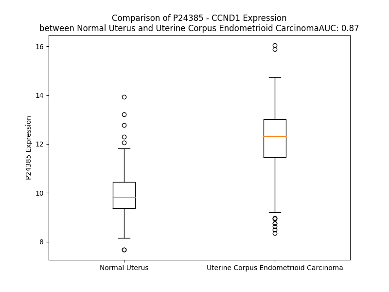

# Detailed Data for P24385

## Introduction to the Detailed Summary

### How to Interpret the Results

- **Summary & Metrics**: This section provides a quick reference to essential protein attributes, including expression changes, family classification, and biomarker applications. Regulation status (upregulated/downregulated) indicates the protein's behavior in a disease context. Some information comes from the original excel file with the proteins selected from literature, while others are derived from the analyses.
- **Expression Comparison**: A visual representation comparing protein expression between normal and disease states. It highlights significant changes in expression levels that might indicate diagnostic or therapeutic relevance. This is data coming from transcriptomics experiments and could not translate similarly to protein levels.
- **Isoform Alignment**: An interactive view of isoform alignments, revealing structural and functional differences between variants of the protein.
- **Interactors & Homologs**: Tables listing known interaction partners and homologous proteins, the more interactors and homologs, the more complex the protein is to design an antibody for.
- **Biological Assemblies**: Information about the structural arrangement of the protein in different assemblies, providing insights into its functional state but also the complexity of the protein to develop antibodies.
- **Combined Per-Residue Information**: A detailed table summarizing residue-level data. This includes predictions for epitope regions, aggregation tendencies, and modifications that might impact the protein's function. Each row corresponds to a residue in the protein, providing insights into specific sites that may be important for research or drug development.
## Summary & Metrics

- **UniProt Accession**: P24385
- **Gene Name**: CCND1
- **Protein Name**: G1/S-specific cyclin-D1
- **Swiss Prot**: CCND1_HUMAN
- **Family**: other
- **Biomarker Application**: diagnosis,efficacy,prognosis,response to therapy,unspecified application
- **Number of Isoforms**: 0
- **Regulation**: 1
- **(transcriptomics) AUC**: 0.87
- **(transcriptomics) Fold Change**: 1.21
- **(transcriptomics) Regulation**: Upregulated
- **Discotope Epitope Count**: 52
- **Max n_uniprots (Homo)**: N/A
- **Max n_uniprots (Hetero)**: 3

## Expression Comparison

## Interactors

| preferredName_A   | preferredName_B   |   score |
|:------------------|:------------------|--------:|
| CCND1             | CDK2              |   0.999 |
| CCND1             | CDKN1B            |   0.999 |
| CCND1             | CDK4              |   0.999 |
| CCND1             | CDK6              |   0.999 |
| CCND1             | CDKN1A            |   0.999 |
| CCND1             | RB1               |   0.998 |
| CCND1             | CDK1              |   0.998 |
| CCND1             | CDKN2A            |   0.998 |
| CCND1             | ESR1              |   0.997 |
| CCND1             | CDKN1C            |   0.994 |
| CCND1             | CDKN2C            |   0.989 |
| CCND1             | PCNA              |   0.989 |
| CCND1             | GSK3B             |   0.987 |
| CCND1             | CREBBP            |   0.986 |
| CCND1             | FBXO31            |   0.985 |
| CCND1             | STAT3             |   0.98  |
| CCND1             | EP300             |   0.974 |
| CCND1             | CDKN2B            |   0.974 |
| CCND1             | CTNNB1            |   0.972 |
| CCND1             | CDC25A            |   0.97  |
| CCND1             | MYC               |   0.969 |
| CCND1             | SKP1              |   0.968 |
| CCND1             | RBL2              |   0.966 |
| CCND1             | YBX3              |   0.961 |
| CCND1             | SKP2              |   0.959 |
| CCND1             | KAT2B             |   0.959 |
| CCND1             | BCL2              |   0.958 |
| CCND1             | FBXO4             |   0.956 |
| CCND1             | AR                |   0.955 |
| CCND1             | CDKN2D            |   0.952 |
| CCND1             | CCNL2             |   0.949 |
| CCND1             | CREB1             |   0.949 |
| CCND1             | TP53              |   0.946 |
| CCND1             | ELAVL1            |   0.946 |
| CCND1             | HSPA8             |   0.945 |
| CCND1             | RASSF1            |   0.945 |
| CCND1             | FOS               |   0.942 |
| CCND1             | CCND2             |   0.942 |
| CCND1             | CCND3             |   0.939 |
| CCND1             | E2F1              |   0.938 |
| CCND1             | RBL1              |   0.935 |
| CCND1             | LEF1              |   0.93  |
| CCND1             | MDM2              |   0.926 |
| CCND1             | CUL1              |   0.924 |
| CCND1             | AKT1              |   0.923 |
| CCND1             | BRCA1             |   0.922 |
| CCND1             | SYMPK             |   0.921 |
| CCND1             | HDAC4             |   0.92  |
| CCND1             | JUN               |   0.919 |
| CCND1             | LOC102723407      |   0.909 |

## Homologs

| uniprot_id   | gene_id   |
|:-------------|:----------|
| P20248       | CCNA2     |
| C9J2U0       | CCNE1     |
| H1UBN3       | CCNB2     |
| Q14094       | CCNI      |
| nan          | nan       |
| P41002       | CCNF      |
| D6RI00       | CCND3     |
| Q8WWL7       | CCNB3     |
| Q6ZMN8       | CCNI2     |
| A0A2R8Y754   | CCNJL     |
| P51959       | CCNG1     |
| M0QZM5       | CCNP      |
| E9PC90       | CCNB1     |
| Q8WUE3       | CCNE2     |
| Q5T5M9       | CCNJ      |
| P30279       | CCND2     |
| Q16589       | CCNG2     |
| P22674       | CCNO      |

## Biological Assemblies

|   Unnamed: 0 |   assembly |   n_uniprots | composition   | crystal_id   |
|-------------:|-----------:|-------------:|:--------------|:-------------|
|            0 |          1 |            2 | Hetero        | 2w9f         |
|            0 |          1 |            2 | Hetero        | 2w9z         |
|            0 |          1 |            3 | Hetero        | 5vzu         |
|            1 |          2 |            3 | Hetero        | 5vzu         |
|            0 |          1 |            3 | Hetero        | 6p8e         |
|            0 |          1 |            3 | Hetero        | 6p8g         |
|            0 |          1 |            2 | Hetero        | 2w99         |
|            0 |          1 |            3 | Hetero        | 6p8f         |
|            0 |          1 |            3 | Hetero        | 6p8h         |
|            0 |          1 |            2 | Hetero        | 2w96         |

## Combined Per-Residue Information

|   res | aa   |   epitope_score | epitope   |   relative_surface_accessibility |   modeling_confidence |   Aggregation | modification     |
|------:|:-----|----------------:|:----------|---------------------------------:|----------------------:|--------------:|:-----------------|
|     1 | M    |         0.19605 | False     |                          1.22648 |                 55.18 |         0     | N/A              |
|     2 | E    |         0.21136 | False     |                          0.88374 |                 51.56 |         0     | N/A              |
|     3 | H    |         0.18456 | False     |                          0.90671 |                 60.7  |         0     | N/A              |
|     4 | Q    |         0.17933 | False     |                          0.80362 |                 59.26 |         0     | N/A              |
|     5 | L    |         0.16319 | False     |                          0.94839 |                 61.57 |         0     | N/A              |
|     6 | L    |         0.15126 | False     |                          0.93844 |                 59.23 |         0     | N/A              |
|     7 | C    |         0.15747 | False     |                          0.73066 |                 57.62 |         0     | N/A              |
|     8 | C    |         0.22358 | False     |                          0.54181 |                 57.67 |         0     | N/A              |
|     9 | E    |         0.22649 | False     |                          0.81774 |                 63.13 |         0     | N/A              |
|    10 | V    |         0.23197 | False     |                          0.58358 |                 62.07 |         0     | N/A              |
|    11 | E    |         0.27544 | True      |                          0.96342 |                 66.81 |         0     | N/A              |
|    12 | T    |         0.28373 | True      |                          0.68918 |                 70.44 |         0     | N/A              |
|    13 | I    |         0.21418 | False     |                          0.53847 |                 74.44 |         0     | N/A              |
|    14 | R    |         0.35576 | True      |                          0.66533 |                 76.15 |         0     | N/A              |
|    15 | R    |         0.37548 | True      |                          0.71747 |                 80.4  |         0     | N/A              |
|    16 | A    |         0.23032 | False     |                          0.93415 |                 83.04 |         0     | N/A              |
|    17 | Y    |         0.31896 | True      |                          0.81331 |                 82.35 |         0     | N/A              |
|    18 | P    |         0.24505 | True      |                          0.92538 |                 82.05 |         0     | N/A              |
|    19 | D    |         0.36631 | True      |                          0.31065 |                 88.43 |         0     | N/A              |
|    20 | A    |         0.21733 | False     |                          0.75506 |                 86.7  |         0     | N/A              |
|    21 | N    |         0.33605 | True      |                          0.67465 |                 90.49 |         0     | N/A              |
|    22 | L    |         0.23472 | False     |                          0.66085 |                 90.45 |         0     | N/A              |
|    23 | L    |         0.19301 | False     |                          0.3055  |                 90.52 |         0     | N/A              |
|    24 | N    |         0.22705 | False     |                          0.35173 |                 92.01 |         0     | N/A              |
|    25 | D    |         0.16767 | False     |                          0.51589 |                 91.69 |         0     | N/A              |
|    26 | R    |         0.26923 | True      |                          0.66662 |                 94.48 |         0     | N/A              |
|    27 | V    |         0.1288  | False     |                          0.21802 |                 94.94 |         0     | N/A              |
|    28 | L    |         0.05439 | False     |                          0.04534 |                 94.31 |         0     | N/A              |
|    29 | R    |         0.32676 | True      |                          0.54099 |                 93.6  |         0     | N/A              |
|    30 | A    |         0.30403 | True      |                          0.53887 |                 94.93 |         0     | N/A              |
|    31 | M    |         0.10121 | False     |                          0.07869 |                 95.1  |         0     | N/A              |
|    32 | L    |         0.10826 | False     |                          0.12711 |                 94.85 |         0     | N/A              |
|    33 | K    |         0.21478 | False     |                          0.73291 |                 93.97 |         0     | N/A              |
|    34 | A    |         0.125   | False     |                          0.33912 |                 93.66 |         0     | N/A              |
|    35 | E    |         0.07688 | False     |                          0.06473 |                 94.85 |         0     | N/A              |
|    36 | E    |         0.13954 | False     |                          0.71168 |                 88.64 |         0     | N/A              |
|    37 | T    |         0.19855 | False     |                          0.66871 |                 90.89 |         0     | N/A              |
|    38 | C    |         0.0396  | False     |                          0.04641 |                 90.68 |         0     | N/A              |
|    39 | A    |         0.09379 | False     |                          0.68038 |                 90.85 |         0     | N/A              |
|    40 | P    |         0.04933 | False     |                          0.18234 |                 90.5  |         0     | N/A              |
|    41 | S    |         0.16469 | False     |                          0.37377 |                 88.03 |         0.205 | N/A              |
|    42 | V    |         0.10544 | False     |                          0.69623 |                 81.82 |         0.205 | N/A              |
|    43 | S    |         0.12201 | False     |                          0.39862 |                 89.26 |         0.205 | N/A              |
|    44 | Y    |         0.01004 | False     |                          0.00057 |                 95.1  |         0.205 | N/A              |
|    45 | F    |         0.10783 | False     |                          0.214   |                 94.96 |         0.205 | N/A              |
|    46 | K    |         0.18232 | False     |                          0.90823 |                 93.71 |         0     | N/A              |
|    47 | C    |         0.203   | False     |                          0.66852 |                 94.18 |         0     | N/A              |
|    48 | V    |         0.14239 | False     |                          0.23557 |                 96.59 |         0     | N/A              |
|    49 | Q    |         0.09045 | False     |                          0.05364 |                 97.09 |         0     | N/A              |
|    50 | K    |         0.15012 | False     |                          0.90135 |                 95.15 |         0     | N/A              |
|    51 | E    |         0.13918 | False     |                          0.3093  |                 95.18 |         0     | N/A              |
|    52 | V    |         0.02169 | False     |                          0.02182 |                 95.59 |         0     | N/A              |
|    53 | L    |         0.11381 | False     |                          0.42124 |                 95.59 |         0     | N/A              |
|    54 | P    |         0.10526 | False     |                          0.42585 |                 95.41 |         0     | N/A              |
|    55 | S    |         0.11099 | False     |                          0.34721 |                 94.78 |         0     | N/A              |
|    56 | M    |         0.02477 | False     |                          0.01942 |                 96.63 |         0     | N/A              |
|    57 | R    |         0.01912 | False     |                          0.01498 |                 96.76 |         0     | N/A              |
|    58 | K    |         0.05997 | False     |                          0.45098 |                 96.14 |         3.99  | N/A              |
|    59 | I    |         0.06512 | False     |                          0.14646 |                 96.51 |        51.317 | N/A              |
|    60 | V    |         0.00252 | False     |                          0       |                 98.02 |        62.991 | N/A              |
|    61 | A    |         0.00245 | False     |                          0       |                 98.12 |        63.103 | N/A              |
|    62 | T    |         0.13632 | False     |                          0.38146 |                 97.06 |        63.103 | N/A              |
|    63 | W    |         0.082   | False     |                          0.08682 |                 97.79 |        63.103 | N/A              |
|    64 | M    |         0.00433 | False     |                          0       |                 98.75 |        62.259 | N/A              |
|    65 | L    |         0.06218 | False     |                          0.19043 |                 98.09 |        53.259 | N/A              |
|    66 | E    |         0.1204  | False     |                          0.50447 |                 97.8  |         3.99  | N/A              |
|    67 | V    |         0.04338 | False     |                          0.02272 |                 98.29 |         3.99  | N/A              |
|    68 | C    |         0.02363 | False     |                          0.05131 |                 98.41 |         1.034 | N/A              |
|    69 | E    |         0.16504 | False     |                          0.58906 |                 97.08 |         0     | N/A              |
|    70 | E    |         0.2493  | True      |                          0.61272 |                 97.48 |         0     | N/A              |
|    71 | Q    |         0.17691 | False     |                          0.27699 |                 96.95 |         0     | N/A              |
|    72 | K    |         0.31535 | True      |                          0.87931 |                 96.12 |         0     | N/A              |
|    73 | C    |         0.05374 | False     |                          0.15071 |                 97.1  |         0     | N/A              |
|    74 | E    |         0.1693  | False     |                          0.24496 |                 94.8  |         0     | N/A              |
|    75 | E    |         0.15499 | False     |                          0.49284 |                 94.52 |         0     | N/A              |
|    76 | E    |         0.04956 | False     |                          0.22454 |                 96.66 |         0     | N/A              |
|    77 | V    |         0.0025  | False     |                          0       |                 98.35 |         0     | N/A              |
|    78 | F    |         0.03761 | False     |                          0.03976 |                 98.59 |         0     | N/A              |
|    79 | P    |         0.01717 | False     |                          0.08433 |                 98.13 |         0     | N/A              |
|    80 | L    |         0.00792 | False     |                          0.01319 |                 98.4  |         0.655 | N/A              |
|    81 | A    |         0.00203 | False     |                          0       |                 98.78 |         0.655 | N/A              |
|    82 | M    |         0.01685 | False     |                          0.02721 |                 98.37 |         0.655 | N/A              |
|    83 | N    |         0.03109 | False     |                          0.13151 |                 97.63 |         0.655 | N/A              |
|    84 | Y    |         0.002   | False     |                          0       |                 98.6  |         0.655 | N/A              |
|    85 | L    |         0.00168 | False     |                          0       |                 98.56 |         0.655 | N/A              |
|    86 | D    |         0.02646 | False     |                          0.04769 |                 97.95 |         0     | N/A              |
|    87 | R    |         0.13205 | False     |                          0.07857 |                 97.7  |         0     | N/A              |
|    88 | F    |         0.04173 | False     |                          0.01529 |                 98.33 |         0     | N/A              |
|    89 | L    |         0.00211 | False     |                          0       |                 98.2  |         0     | N/A              |
|    90 | S    |         0.11914 | False     |                          0.13185 |                 97.07 |         0     | N/A              |
|    91 | L    |         0.12912 | False     |                          0.58397 |                 96.85 |         0     | N/A              |
|    92 | E    |         0.15624 | False     |                          0.22518 |                 97.48 |         0     | N/A              |
|    93 | P    |         0.18645 | False     |                          0.64296 |                 97.24 |         0     | N/A              |
|    94 | V    |         0.06528 | False     |                          0.10139 |                 97.51 |         0     | N/A              |
|    95 | K    |         0.11886 | False     |                          0.62875 |                 96.63 |         0     | N/A              |
|    96 | K    |         0.0761  | False     |                          0.16223 |                 95    |         0     | N/A              |
|    97 | S    |         0.06356 | False     |                          0.35258 |                 94.24 |         0     | N/A              |
|    98 | R    |         0.13724 | False     |                          0.42128 |                 96.96 |         0     | N/A              |
|    99 | L    |         0.00134 | False     |                          0       |                 97.86 |         0.198 | N/A              |
|   100 | Q    |         0.01784 | False     |                          0.01954 |                 98.02 |         0.198 | N/A              |
|   101 | L    |         0.0146  | False     |                          0.03545 |                 98.49 |         3.756 | N/A              |
|   102 | L    |         0.00277 | False     |                          0.00082 |                 98.75 |         4.368 | N/A              |
|   103 | G    |         0.00213 | False     |                          0       |                 98.77 |         4.368 | N/A              |
|   104 | A    |         0.00219 | False     |                          0       |                 98.77 |         5.613 | N/A              |
|   105 | T    |         0.00246 | False     |                          0       |                 98.84 |         7.086 | N/A              |
|   106 | C    |         0.0034  | False     |                          0       |                 98.89 |         7.67  | N/A              |
|   107 | M    |         0.00154 | False     |                          0       |                 98.77 |         8.1   | N/A              |
|   108 | F    |         0.05225 | False     |                          0.0586  |                 98.79 |         8.1   | N/A              |
|   109 | V    |         0.03884 | False     |                          0.02856 |                 98.85 |         7.883 | N/A              |
|   110 | A    |         0.00343 | False     |                          0       |                 98.78 |         2.586 | N/A              |
|   111 | S    |         0.00292 | False     |                          0       |                 98.43 |         0.429 | N/A              |
|   112 | K    |         0.14205 | False     |                          0.44676 |                 98.07 |         0     | N/A              |
|   113 | M    |         0.1296  | False     |                          0.46446 |                 97.37 |         0     | N/A              |
|   114 | K    |         0.14605 | False     |                          0.31205 |                 95.4  |         0     | N/A              |
|   115 | E    |         0.10814 | False     |                          0.1895  |                 93.59 |         0     | N/A              |
|   116 | T    |         0.29013 | True      |                          0.65641 |                 91.6  |         0     | N/A              |
|   117 | I    |         0.26457 | True      |                          0.71168 |                 93.06 |         0     | N/A              |
|   118 | P    |         0.14113 | False     |                          0.35705 |                 96.57 |         0     | N/A              |
|   119 | L    |         0.08606 | False     |                          0.09985 |                 97.66 |         0     | N/A              |
|   120 | T    |         0.29635 | True      |                          0.5003  |                 97.68 |         0     | N/A              |
|   121 | A    |         0.07159 | False     |                          0.07528 |                 97.83 |         0     | N/A              |
|   122 | E    |         0.21481 | False     |                          0.5446  |                 97.77 |         0     | N/A              |
|   123 | K    |         0.17643 | False     |                          0.42554 |                 97.54 |         0     | N/A              |
|   124 | L    |         0.00566 | False     |                          0.00082 |                 98.01 |         1.483 | N/A              |
|   125 | C    |         0.06081 | False     |                          0.04707 |                 97.31 |         1.483 | N/A              |
|   126 | I    |         0.32487 | True      |                          0.65434 |                 97.41 |         1.483 | N/A              |
|   127 | Y    |         0.1888  | False     |                          0.27752 |                 97.39 |         1.483 | N/A              |
|   128 | T    |         0.00866 | False     |                          0.00256 |                 94.92 |         1.483 | N/A              |
|   129 | D    |         0.23878 | False     |                          0.7119  |                 95.04 |         0     | N/A              |
|   130 | N    |         0.36857 | True      |                          0.65565 |                 93.13 |         0     | N/A              |
|   131 | S    |         0.26915 | True      |                          0.26637 |                 93.65 |         0     | N/A              |
|   132 | I    |         0.10147 | False     |                          0.04219 |                 94.68 |         0     | N/A              |
|   133 | R    |         0.41462 | True      |                          0.60379 |                 96.5  |         0     | N/A              |
|   134 | P    |         0.24854 | True      |                          0.28729 |                 97.68 |         0     | N/A              |
|   135 | E    |         0.19674 | False     |                          0.46042 |                 98.06 |         0     | N/A              |
|   136 | E    |         0.17441 | False     |                          0.35946 |                 97.9  |         0     | N/A              |
|   137 | L    |         0.00254 | False     |                          0       |                 98.3  |         0     | N/A              |
|   138 | L    |         0.15536 | False     |                          0.51133 |                 98.53 |         0     | N/A              |
|   139 | Q    |         0.13521 | False     |                          0.62829 |                 98.55 |         0     | N/A              |
|   140 | M    |         0.04266 | False     |                          0.0371  |                 98.56 |         0     | N/A              |
|   141 | E    |         0.09333 | False     |                          0.13465 |                 98.72 |         0     | N/A              |
|   142 | L    |         0.16848 | False     |                          0.702   |                 98.45 |        10.108 | N/A              |
|   143 | L    |         0.24292 | False     |                          0.42208 |                 98.66 |        10.108 | N/A              |
|   144 | L    |         0.0032  | False     |                          0       |                 98.75 |        10.108 | N/A              |
|   145 | V    |         0.07177 | False     |                          0.07426 |                 98.55 |        10.108 | N/A              |
|   146 | N    |         0.19926 | False     |                          0.55703 |                 98.44 |        10.108 | N/A              |
|   147 | K    |         0.20223 | False     |                          0.35478 |                 98.12 |         0     | N/A              |
|   148 | L    |         0.04564 | False     |                          0.03237 |                 97.77 |         0     | N/A              |
|   149 | K    |         0.31017 | True      |                          0.85492 |                 97.31 |         0     | N/A              |
|   150 | W    |         0.30228 | True      |                          0.79804 |                 97.29 |         0     | N/A              |
|   151 | N    |         0.16439 | False     |                          0.35357 |                 96.52 |         0     | N/A              |
|   152 | L    |         0.0812  | False     |                          0.09681 |                 96.85 |         0     | N/A              |
|   153 | A    |         0.16679 | False     |                          0.74845 |                 94.87 |         0     | N/A              |
|   154 | A    |         0.0377  | False     |                          0.05884 |                 96.07 |         0     | N/A              |
|   155 | M    |         0.06983 | False     |                          0.16518 |                 95.65 |         0     | N/A              |
|   156 | T    |         0.02462 | False     |                          0.01238 |                 96.56 |         0     | N/A              |
|   157 | P    |         0.02194 | False     |                          0.1004  |                 97.93 |         0     | N/A              |
|   158 | H    |         0.07335 | False     |                          0.07628 |                 96.01 |         0     | N/A              |
|   159 | D    |         0.06315 | False     |                          0.20166 |                 94.17 |         0     | N/A              |
|   160 | F    |         0.0025  | False     |                          0       |                 97.25 |         0     | N/A              |
|   161 | I    |         0.0108  | False     |                          0.0048  |                 97.19 |         0     | N/A              |
|   162 | E    |         0.19352 | False     |                          0.31914 |                 94.68 |         0     | N/A              |
|   163 | H    |         0.03636 | False     |                          0.02227 |                 94.26 |         0     | N/A              |
|   164 | F    |         0.01092 | False     |                          0       |                 94.69 |         0     | N/A              |
|   165 | L    |         0.01792 | False     |                          0.00742 |                 93.92 |         0     | N/A              |
|   166 | S    |         0.16691 | False     |                          0.38456 |                 92.05 |         0     | N/A              |
|   167 | K    |         0.22186 | False     |                          0.32203 |                 90.11 |         0     | N/A              |
|   168 | M    |         0.03776 | False     |                          0.01822 |                 88.7  |         0     | N/A              |
|   169 | P    |         0.30281 | True      |                          0.51519 |                 88.24 |         0     | N/A              |
|   170 | E    |         0.11885 | False     |                          0.09238 |                 87.34 |         0     | N/A              |
|   171 | A    |         0.2823  | True      |                          0.57989 |                 89.57 |         0     | N/A              |
|   172 | E    |         0.27056 | True      |                          0.5143  |                 90.39 |         0     | N/A              |
|   173 | E    |         0.20055 | False     |                          0.70736 |                 90.56 |         0     | N/A              |
|   174 | N    |         0.24653 | True      |                          0.19561 |                 90.73 |         0     | N/A              |
|   175 | K    |         0.21985 | False     |                          0.12439 |                 93.33 |         0     | N/A              |
|   176 | Q    |         0.1678  | False     |                          0.46028 |                 94.37 |         0     | N/A              |
|   177 | I    |         0.19586 | False     |                          0.43587 |                 94.34 |         0     | N/A              |
|   178 | I    |         0.00379 | False     |                          0       |                 94.86 |         0     | N/A              |
|   179 | R    |         0.10501 | False     |                          0.16064 |                 96.62 |         0     | N/A              |
|   180 | K    |         0.07728 | False     |                          0.70937 |                 96.17 |         0     | N/A              |
|   181 | H    |         0.05496 | False     |                          0.39316 |                 95.18 |         0     | N/A              |
|   182 | A    |         0.00235 | False     |                          0       |                 97.66 |         0.509 | N/A              |
|   183 | Q    |         0.06939 | False     |                          0.14559 |                 97.39 |         1.472 | N/A              |
|   184 | T    |         0.04747 | False     |                          0.52683 |                 95.79 |        24.556 | N/A              |
|   185 | F    |         0.0196  | False     |                          0.08026 |                 97.48 |        39.764 | N/A              |
|   186 | V    |         0.00687 | False     |                          0.00828 |                 98.29 |        40.411 | N/A              |
|   187 | A    |         0.04128 | False     |                          0.15907 |                 97.21 |        40.411 | N/A              |
|   188 | L    |         0.07904 | False     |                          0.19949 |                 96.37 |        40.299 | N/A              |
|   189 | C    |         0.01383 | False     |                          0.01826 |                 97.83 |        25.458 | N/A              |
|   190 | A    |         0.02959 | False     |                          0.16052 |                 97.2  |        17.42  | N/A              |
|   191 | T    |         0.04764 | False     |                          0.09226 |                 95.86 |        14.645 | N/A              |
|   192 | D    |         0.08125 | False     |                          0.11543 |                 94.96 |        13.194 | N/A              |
|   193 | V    |         0.07621 | False     |                          0.38975 |                 93.85 |        13.194 | N/A              |
|   194 | K    |         0.14709 | False     |                          0.68333 |                 93.01 |        13.194 | N/A              |
|   195 | F    |         0.02561 | False     |                          0.0453  |                 95.1  |        13.194 | N/A              |
|   196 | I    |         0.08809 | False     |                          0.09656 |                 93.26 |        12.26  | N/A              |
|   197 | S    |         0.13538 | False     |                          0.46933 |                 90.64 |         1.264 | N/A              |
|   198 | N    |         0.15637 | False     |                          0.21427 |                 93.97 |         0     | N/A              |
|   199 | P    |         0.099   | False     |                          0.43029 |                 95.4  |         0     | N/A              |
|   200 | P    |         0.01682 | False     |                          0.18987 |                 97.18 |         0     | N/A              |
|   201 | S    |         0.01114 | False     |                          0.03084 |                 97.33 |         0.461 | N/A              |
|   202 | M    |         0.03151 | False     |                          0.11865 |                 97.33 |         5.53  | N/A              |
|   203 | V    |         0.01364 | False     |                          0.0676  |                 97.79 |         9.972 | N/A              |
|   204 | A    |         0.00096 | False     |                          0       |                 98.15 |        10.249 | N/A              |
|   205 | A    |         0.00236 | False     |                          0       |                 97.68 |        10.577 | N/A              |
|   206 | G    |         0.00269 | False     |                          0       |                 97.2  |        10.965 | N/A              |
|   207 | S    |         0.00203 | False     |                          0       |                 97.83 |        15.893 | N/A              |
|   208 | V    |         0.00242 | False     |                          0       |                 96.72 |        52.78  | N/A              |
|   209 | V    |         0.01414 | False     |                          0.01349 |                 94.55 |        52.896 | N/A              |
|   210 | A    |         0.01568 | False     |                          0.01508 |                 94.43 |        52.066 | N/A              |
|   211 | A    |         0.01254 | False     |                          0.01209 |                 94.08 |        51.365 | N/A              |
|   212 | V    |         0.05466 | False     |                          0.0452  |                 91.54 |        50.405 | N/A              |
|   213 | Q    |         0.20447 | False     |                          0.42064 |                 87.73 |         2.927 | N/A              |
|   214 | G    |         0.17289 | False     |                          0.72683 |                 86.17 |         1.009 | N/A              |
|   215 | L    |         0.18911 | False     |                          0.28322 |                 85.1  |         0.886 | N/A              |
|   216 | N    |         0.28229 | True      |                          0.75326 |                 77.58 |         0     | N/A              |
|   217 | L    |         0.36771 | True      |                          0.25587 |                 70.69 |         0     | N/A              |
|   218 | R    |         0.35299 | True      |                          0.93367 |                 66.28 |         0     | N/A              |
|   219 | S    |         0.19371 | False     |                          0.15214 |                 65.23 |         0     | N/A              |
|   220 | P    |         0.3501  | True      |                          0.93399 |                 63.27 |         0     | N/A              |
|   221 | N    |         0.32611 | True      |                          0.57356 |                 66.91 |         0     | N/A              |
|   222 | N    |         0.13235 | False     |                          0.54985 |                 74.13 |         0     | N/A              |
|   223 | F    |         0.21064 | False     |                          0.18477 |                 74.28 |         2.056 | N/A              |
|   224 | L    |         0.0963  | False     |                          0.07898 |                 74.23 |         2.056 | N/A              |
|   225 | S    |         0.1478  | False     |                          0.26345 |                 81.9  |         2.056 | N/A              |
|   226 | Y    |         0.16117 | False     |                          0.29104 |                 80.57 |         2.056 | N/A              |
|   227 | Y    |         0.30352 | True      |                          0.57862 |                 85.44 |         2.056 | N/A              |
|   228 | R    |         0.33126 | True      |                          0.48808 |                 86.81 |         0     | N/A              |
|   229 | L    |         0.00928 | False     |                          0.00412 |                 89.78 |         0     | N/A              |
|   230 | T    |         0.04341 | False     |                          0.02856 |                 90.12 |         0     | N/A              |
|   231 | R    |         0.30291 | True      |                          0.40789 |                 90.85 |         0     | N/A              |
|   232 | F    |         0.37432 | True      |                          0.24457 |                 91.3  |         0     | N/A              |
|   233 | L    |         0.00958 | False     |                          0       |                 93.55 |         0     | N/A              |
|   234 | S    |         0.05131 | False     |                          0.03485 |                 93.54 |         0     | N/A              |
|   235 | R    |         0.31662 | True      |                          0.70159 |                 92.93 |         0     | N/A              |
|   236 | V    |         0.13822 | False     |                          0.15498 |                 91.8  |         0     | N/A              |
|   237 | I    |         0.25409 | True      |                          0.0928  |                 93.52 |         0     | N/A              |
|   238 | K    |         0.23537 | False     |                          0.76869 |                 91.73 |         0     | N/A              |
|   239 | C    |         0.17644 | False     |                          0.23457 |                 92.51 |         0     | N/A              |
|   240 | D    |         0.22089 | False     |                          0.47465 |                 92.87 |         0     | N/A              |
|   241 | P    |         0.17766 | False     |                          0.43938 |                 92.74 |         0     | N/A              |
|   242 | D    |         0.27233 | True      |                          0.52013 |                 93.38 |         0     | N/A              |
|   243 | C    |         0.19356 | False     |                          0.49724 |                 94.26 |         0     | N/A              |
|   244 | L    |         0.00394 | False     |                          0.00082 |                 94.89 |         0     | N/A              |
|   245 | R    |         0.27104 | True      |                          0.34679 |                 93.05 |         0     | N/A              |
|   246 | A    |         0.10944 | False     |                          0.42254 |                 94.46 |         0     | N/A              |
|   247 | C    |         0.02157 | False     |                          0.02677 |                 95.21 |         0     | N/A              |
|   248 | Q    |         0.07222 | False     |                          0.04855 |                 94.36 |         0     | N/A              |
|   249 | E    |         0.18317 | False     |                          0.47013 |                 94.62 |         0     | N/A              |
|   250 | Q    |         0.1931  | False     |                          0.41828 |                 96.34 |         0     | N/A              |
|   251 | I    |         0.00742 | False     |                          0.00477 |                 96.28 |         0     | N/A              |
|   252 | E    |         0.11456 | False     |                          0.31462 |                 94.02 |         0     | N/A              |
|   253 | A    |         0.09871 | False     |                          0.56573 |                 95.01 |         0     | N/A              |
|   254 | L    |         0.08245 | False     |                          0.13438 |                 94.18 |         0     | N/A              |
|   255 | L    |         0.11102 | False     |                          0.33057 |                 92.72 |         0     | N/A              |
|   256 | E    |         0.11678 | False     |                          0.46621 |                 92.69 |         0     | N/A              |
|   257 | S    |         0.20713 | False     |                          0.37469 |                 91.72 |         0     | N/A              |
|   258 | S    |         0.07754 | False     |                          0.25442 |                 89.32 |         0     | N/A              |
|   259 | L    |         0.13565 | False     |                          0.60257 |                 89.69 |         0     | N/A              |
|   260 | R    |         0.23336 | False     |                          0.58315 |                 91.3  |         0     | N/A              |
|   261 | Q    |         0.12009 | False     |                          0.47659 |                 87.06 |         0     | N/A              |
|   262 | A    |         0.08883 | False     |                          0.48989 |                 84.23 |         0     | N/A              |
|   263 | Q    |         0.20477 | False     |                          0.57636 |                 84.6  |         0     | N/A              |
|   264 | Q    |         0.31795 | True      |                          0.41745 |                 82.42 |         0     | N/A              |
|   265 | N    |         0.2668  | True      |                          0.8553  |                 74.9  |         0     | N/A              |
|   266 | M    |         0.22249 | False     |                          0.79834 |                 69.5  |         0     | N/A              |
|   267 | D    |         0.36108 | True      |                          0.57013 |                 59.11 |         0     | N/A              |
|   268 | P    |         0.20587 | False     |                          0.80453 |                 56.45 |         0     | N/A              |
|   269 | K    |         0.32401 | True      |                          0.88253 |                 53.92 |         0     | N/A              |
|   270 | A    |         0.20392 | False     |                          0.33221 |                 49.27 |         0     | N/A              |
|   271 | A    |         0.1641  | False     |                          0.56133 |                 49.31 |         0     | N/A              |
|   272 | E    |         0.21408 | False     |                          0.73673 |                 47    |         0     | N/A              |
|   273 | E    |         0.27513 | True      |                          0.74197 |                 48.31 |         0     | N/A              |
|   274 | E    |         0.18807 | False     |                          0.49771 |                 48.66 |         0     | N/A              |
|   275 | E    |         0.24519 | True      |                          0.68809 |                 44.58 |         0     | N/A              |
|   276 | E    |         0.36332 | True      |                          0.81129 |                 43.88 |         0     | N/A              |
|   277 | E    |         0.38401 | True      |                          0.85032 |                 44.48 |         0     | N/A              |
|   278 | E    |         0.29329 | True      |                          0.71459 |                 41.34 |         0     | N/A              |
|   279 | E    |         0.28651 | True      |                          0.79229 |                 39.55 |         0     | N/A              |
|   280 | E    |         0.29081 | True      |                          0.86724 |                 42.52 |         0     | N/A              |
|   281 | V    |         0.26127 | True      |                          0.90362 |                 47.05 |         0     | N/A              |
|   282 | D    |         0.19555 | False     |                          0.5817  |                 55.23 |         0     | N/A              |
|   283 | L    |         0.18366 | False     |                          0.91045 |                 59.76 |         0     | N/A              |
|   284 | A    |         0.08004 | False     |                          0.07048 |                 68.72 |         0     | N/A              |
|   285 | C    |         0.2323  | False     |                          0.82564 |                 77.81 |         0     | N/A              |
|   286 | T    |         0.21906 | False     |                          0.44783 |                 80.3  |         0     | Phosphothreonine |
|   287 | P    |         0.11466 | False     |                          0.0864  |                 79.86 |         0     | N/A              |
|   288 | T    |         0.15864 | False     |                          0.29864 |                 83.65 |         0     | N/A              |
|   289 | D    |         0.14055 | False     |                          0.28077 |                 80.57 |         0     | N/A              |
|   290 | V    |         0.02076 | False     |                          0.00476 |                 77.51 |         0     | N/A              |
|   291 | R    |         0.21119 | False     |                          0.27391 |                 79.54 |         0     | N/A              |
|   292 | D    |         0.19933 | False     |                          0.68189 |                 74.17 |         0     | N/A              |
|   293 | V    |         0.1176  | False     |                          0.16825 |                 63.57 |         0     | N/A              |
|   294 | D    |         0.14226 | False     |                          0.84986 |                 57.85 |         0     | N/A              |
|   295 | I    |         0.12227 | False     |                          0.99209 |                 51.57 |         0     | N/A              |

