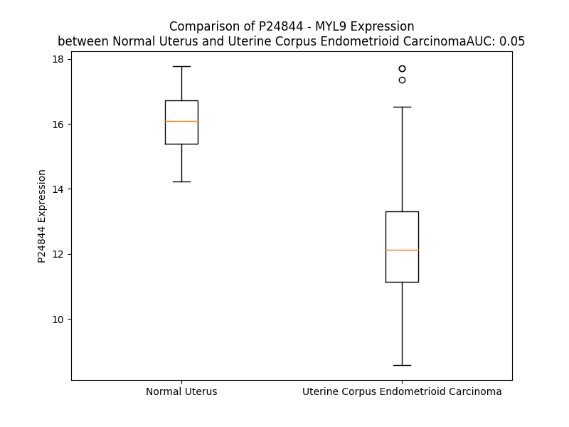

# Detailed Data for P24844

## Introduction to the Detailed Summary

### How to Interpret the Results

- **Summary & Metrics**: This section provides a quick reference to essential protein attributes, including expression changes, family classification, and biomarker applications. Regulation status (upregulated/downregulated) indicates the protein's behavior in a disease context. Some information comes from the original excel file with the proteins selected from literature, while others are derived from the analyses.
- **Expression Comparison**: A visual representation comparing protein expression between normal and disease states. It highlights significant changes in expression levels that might indicate diagnostic or therapeutic relevance. This is data coming from transcriptomics experiments and could not translate similarly to protein levels.
- **Isoform Alignment**: An interactive view of isoform alignments, revealing structural and functional differences between variants of the protein.
- **Interactors & Homologs**: Tables listing known interaction partners and homologous proteins, the more interactors and homologs, the more complex the protein is to design an antibody for.
- **Biological Assemblies**: Information about the structural arrangement of the protein in different assemblies, providing insights into its functional state but also the complexity of the protein to develop antibodies.
- **Combined Per-Residue Information**: A detailed table summarizing residue-level data. This includes predictions for epitope regions, aggregation tendencies, and modifications that might impact the protein's function. Each row corresponds to a residue in the protein, providing insights into specific sites that may be important for research or drug development.
## Summary & Metrics

- **UniProt Accession**: P24844
- **Gene Name**: MYL9
- **Protein Name**: Myosin regulatory light polypeptide 9
- **Swiss Prot**: MYL9_HUMAN
- **Family**: other
- **Biomarker Application**:  
- **Number of Isoforms**: 2
- **Regulation**: 2
- **(transcriptomics) AUC**: 0.05
- **(transcriptomics) Fold Change**: 1.30
- **(transcriptomics) Regulation**: Downregulated
- **Discotope Epitope Count**: 24
- **Max n_uniprots (Homo)**: N/A
- **Max n_uniprots (Hetero)**: N/A

## Expression Comparison

## Isoform Alignment

<pre style='font-size:14px; font-family:monospace;'>P24844-1 MSSKRAKAKTTKKRPQRATSNVFAMFDQSQIQEFKEAFNMIDQNRDGFIDKEDLHDMLASLGKNPTDEYLEGMMSEAPGPINFTMFLTMFGEKLNGTDPEDVIRNAFACFDEEASGFIHEDHLRELLTTMGDRFTDEEVDEMYREAPIDKKGNFNYVEFTRILKHGAKDKDD
P24844-2 MSSKRAKAKTTKKRPQRATSNVFAMFDQSQIQEFKEAFNMIDQNRDGFIDKEDLHDMLASL------------------------------------------------------GFIHEDHLRELLTTMGDRFTDEEVDEMYREAPIDKKGNFNYVEFTRILKHGAKDKDD
</pre>

## Interactors

| preferredName_A   | preferredName_B   |   score |
|:------------------|:------------------|--------:|
| MYL9              | MYH10             |   0.996 |
| MYL9              | MYH9              |   0.99  |
| MYL9              | PPP1R12C          |   0.989 |
| MYL9              | MYLK              |   0.989 |
| MYL9              | MYLK2             |   0.988 |
| MYL9              | MYH11             |   0.986 |
| MYL9              | MYL6              |   0.986 |
| MYL9              | PPP1R12A          |   0.982 |
| MYL9              | MYL6B             |   0.976 |
| MYL9              | ACTG2             |   0.974 |
| MYL9              | PPP1CB            |   0.974 |
| MYL9              | ACTA2             |   0.97  |
| MYL9              | MYL1              |   0.964 |
| MYL9              | MYL12A            |   0.961 |
| MYL9              | MYLK3             |   0.961 |
| MYL9              | MYL12B            |   0.96  |
| MYL9              | ROCK1             |   0.953 |
| MYL9              | ROCK2             |   0.951 |
| MYL9              | MYH14             |   0.946 |
| MYL9              | ACTB              |   0.945 |
| MYL9              | ACTG1             |   0.94  |
| MYL9              | PPP1CC            |   0.939 |
| MYL9              | TAGLN             |   0.929 |
| MYL9              | MYLK4             |   0.925 |
| MYL9              | PPP1CA            |   0.921 |
| MYL9              | MYL2              |   0.909 |

## Homologs

| uniprot_id   | gene_id   |
|:-------------|:----------|
| C9JEG4       | MYL7      |
| A0A590UJU8   | MYL2      |
| O14950       | MYL12B    |
| J3QRS3       | MYL12A    |
| D6RJ91       | MYL5      |
| A0A9L9PXJ4   | MYL10     |
| Q96A32       | MYL11     |

## Combined Per-Residue Information

|   res | aa   |   epitope_score | epitope   |   relative_surface_accessibility |   modeling_confidence |   Aggregation | modification                                                                          |
|------:|:-----|----------------:|:----------|---------------------------------:|----------------------:|--------------:|:--------------------------------------------------------------------------------------|
|     1 | M    |         0.22674 | False     |                          1.32046 |                 43    |         0     | N/A                                                                                   |
|     2 | S    |         0.37378 | True      |                          0.83295 |                 48.78 |         0     | N-acetylserine                                                                        |
|     3 | S    |         0.35277 | True      |                          0.88764 |                 46.77 |         0     | N/A                                                                                   |
|     4 | K    |         0.42026 | True      |                          0.98258 |                 49.74 |         0     | N/A                                                                                   |
|     5 | R    |         0.43348 | True      |                          0.9385  |                 44.74 |         0     | N/A                                                                                   |
|     6 | A    |         0.30125 | False     |                          0.93103 |                 46.69 |         0     | N/A                                                                                   |
|     7 | K    |         0.29213 | False     |                          0.98397 |                 44.31 |         0     | N/A                                                                                   |
|     8 | A    |         0.30018 | False     |                          0.88613 |                 44.38 |         0     | N/A                                                                                   |
|     9 | K    |         0.29692 | False     |                          0.95346 |                 43.79 |         0     | N/A                                                                                   |
|    10 | T    |         0.31471 | False     |                          0.91445 |                 42.98 |         0     | N/A                                                                                   |
|    11 | T    |         0.34145 | False     |                          0.88946 |                 43.75 |         0     | N/A                                                                                   |
|    12 | K    |         0.33904 | False     |                          0.95175 |                 43.35 |         0     | N/A                                                                                   |
|    13 | K    |         0.30829 | False     |                          0.9655  |                 37.76 |         0     | N/A                                                                                   |
|    14 | R    |         0.26883 | False     |                          0.85907 |                 38.77 |         0     | N/A                                                                                   |
|    15 | P    |         0.29476 | False     |                          0.90301 |                 44.24 |         0     | N/A                                                                                   |
|    16 | Q    |         0.38109 | True      |                          0.86231 |                 42.61 |         0     | N/A                                                                                   |
|    17 | R    |         0.40825 | True      |                          0.83235 |                 43.59 |         0     | N/A                                                                                   |
|    18 | A    |         0.27317 | False     |                          0.72889 |                 51.14 |         0.507 | N/A                                                                                   |
|    19 | T    |         0.21946 | False     |                          0.32307 |                 52.85 |         1.106 | Phosphothreonine; by MLCK, CIT and ROCK2                                              |
|    20 | S    |         0.38166 | True      |                          0.65071 |                 54.98 |         1.242 | Phosphoserine; by CDC42BP, CIT, MLCK, PAK1, ROCK1, ROCK2, DAPK1, DAPK2 and ZIPK/DAPK3 |
|    21 | N    |         0.30401 | False     |                          0.66585 |                 68.73 |         2.424 | N/A                                                                                   |
|    22 | V    |         0.04781 | False     |                          0.02721 |                 74.78 |        30.464 | N/A                                                                                   |
|    23 | F    |         0.23123 | False     |                          0.45516 |                 77.64 |        30.464 | N/A                                                                                   |
|    24 | A    |         0.37311 | True      |                          0.87479 |                 78.03 |        30.464 | N/A                                                                                   |
|    25 | M    |         0.29882 | False     |                          0.54032 |                 71.99 |        30.464 | N/A                                                                                   |
|    26 | F    |         0.08788 | False     |                          0.07805 |                 81    |        30.375 | N/A                                                                                   |
|    27 | D    |         0.2844  | False     |                          0.49039 |                 82.48 |         0     | N/A                                                                                   |
|    28 | Q    |         0.31575 | False     |                          0.81465 |                 83.85 |         0     | N/A                                                                                   |
|    29 | S    |         0.27753 | False     |                          0.54262 |                 84.2  |         0     | N/A                                                                                   |
|    30 | Q    |         0.2722  | False     |                          0.36633 |                 84.24 |         0     | N/A                                                                                   |
|    31 | I    |         0.22562 | False     |                          0.22159 |                 88.37 |         0     | N/A                                                                                   |
|    32 | Q    |         0.21183 | False     |                          0.44243 |                 90.04 |         0     | N/A                                                                                   |
|    33 | E    |         0.26807 | False     |                          0.60317 |                 90.25 |         0     | N/A                                                                                   |
|    34 | F    |         0.12281 | False     |                          0.15106 |                 91.61 |         0     | N/A                                                                                   |
|    35 | K    |         0.20327 | False     |                          0.48738 |                 93.02 |         0     | N/A                                                                                   |
|    36 | E    |         0.26722 | False     |                          0.50426 |                 93.76 |         0     | N/A                                                                                   |
|    37 | A    |         0.18347 | False     |                          0.37266 |                 92.4  |         0.32  | N/A                                                                                   |
|    38 | F    |         0.0858  | False     |                          0.03631 |                 94.81 |         0.32  | N/A                                                                                   |
|    39 | N    |         0.15637 | False     |                          0.5307  |                 93.43 |         0.32  | N/A                                                                                   |
|    40 | M    |         0.28324 | False     |                          0.69444 |                 93.08 |         0.32  | N/A                                                                                   |
|    41 | I    |         0.08343 | False     |                          0.14479 |                 94.64 |         0.32  | N/A                                                                                   |
|    42 | D    |         0.25156 | False     |                          0.0304  |                 95.33 |         0     | N/A                                                                                   |
|    43 | Q    |         0.1614  | False     |                          0.52327 |                 90.89 |         0     | N/A                                                                                   |
|    44 | N    |         0.22375 | False     |                          0.56439 |                 92.52 |         0     | N/A                                                                                   |
|    45 | R    |         0.5297  | True      |                          0.83397 |                 92.43 |         0     | N/A                                                                                   |
|    46 | D    |         0.30849 | False     |                          0.55354 |                 95.66 |         0     | N/A                                                                                   |
|    47 | G    |         0.22862 | False     |                          0.36773 |                 94.96 |         0     | N/A                                                                                   |
|    48 | F    |         0.23227 | False     |                          0.46637 |                 96.5  |         0     | N/A                                                                                   |
|    49 | I    |         0.07877 | False     |                          0.03673 |                 96.06 |         0     | N/A                                                                                   |
|    50 | D    |         0.23389 | False     |                          0.33245 |                 95.17 |         0     | N/A                                                                                   |
|    51 | K    |         0.23036 | False     |                          0.31198 |                 95.03 |         0     | N/A                                                                                   |
|    52 | E    |         0.31595 | False     |                          0.6852  |                 94.7  |         0     | N/A                                                                                   |
|    53 | D    |         0.04626 | False     |                          0.02772 |                 95.76 |         0     | N/A                                                                                   |
|    54 | L    |         0.07637 | False     |                          0.06348 |                 94.08 |         0     | N/A                                                                                   |
|    55 | H    |         0.30927 | False     |                          0.37516 |                 94.36 |         0     | N/A                                                                                   |
|    56 | D    |         0.18869 | False     |                          0.44839 |                 93.38 |         0     | N/A                                                                                   |
|    57 | M    |         0.14213 | False     |                          0.15568 |                 93.06 |         0.536 | N/A                                                                                   |
|    58 | L    |         0.18189 | False     |                          0.14921 |                 92.72 |         0.536 | N/A                                                                                   |
|    59 | A    |         0.21642 | False     |                          0.44714 |                 91.75 |         0.536 | N/A                                                                                   |
|    60 | S    |         0.23748 | False     |                          0.72343 |                 90.05 |         0.536 | N/A                                                                                   |
|    61 | L    |         0.33989 | False     |                          0.75543 |                 91.08 |         0.536 | N/A                                                                                   |
|    62 | G    |         0.32794 | False     |                          0.84512 |                 91.27 |         0     | N/A                                                                                   |
|    63 | K    |         0.41769 | True      |                          0.64841 |                 91.09 |         0     | N/A                                                                                   |
|    64 | N    |         0.42074 | True      |                          0.84668 |                 91.47 |         0     | N/A                                                                                   |
|    65 | P    |         0.21128 | False     |                          0.14695 |                 92.16 |         0     | N/A                                                                                   |
|    66 | T    |         0.21568 | False     |                          0.57047 |                 94    |         0     | N/A                                                                                   |
|    67 | D    |         0.33299 | False     |                          0.56839 |                 94.23 |         0     | N/A                                                                                   |
|    68 | E    |         0.31516 | False     |                          0.68122 |                 95.13 |         0     | N/A                                                                                   |
|    69 | Y    |         0.37688 | True      |                          0.56693 |                 92.9  |         0     | N/A                                                                                   |
|    70 | L    |         0.04677 | False     |                          0.01154 |                 94.36 |         0     | N/A                                                                                   |
|    71 | E    |         0.3335  | False     |                          0.52705 |                 93.98 |         0     | N/A                                                                                   |
|    72 | G    |         0.21575 | False     |                          0.40911 |                 92.67 |         0     | N/A                                                                                   |
|    73 | M    |         0.21423 | False     |                          0.30671 |                 90.57 |         0     | N/A                                                                                   |
|    74 | M    |         0.24714 | False     |                          0.25387 |                 92.79 |         0     | N/A                                                                                   |
|    75 | S    |         0.2516  | False     |                          0.66105 |                 91.15 |         0     | N/A                                                                                   |
|    76 | E    |         0.24459 | False     |                          0.66399 |                 87.7  |         0     | N/A                                                                                   |
|    77 | A    |         0.16226 | False     |                          0.11352 |                 86.4  |         0     | N/A                                                                                   |
|    78 | P    |         0.29371 | False     |                          0.82438 |                 84.48 |         0     | N/A                                                                                   |
|    79 | G    |         0.24889 | False     |                          0.31087 |                 88.67 |         0     | N/A                                                                                   |
|    80 | P    |         0.33182 | False     |                          0.75038 |                 92.1  |         0.204 | N/A                                                                                   |
|    81 | I    |         0.10094 | False     |                          0.07943 |                 94.21 |        20.886 | N/A                                                                                   |
|    82 | N    |         0.30488 | False     |                          0.35607 |                 94.87 |        22.771 | N/A                                                                                   |
|    83 | F    |         0.19679 | False     |                          0.20929 |                 93.97 |        70.013 | N/A                                                                                   |
|    84 | T    |         0.11337 | False     |                          0.27047 |                 91.1  |        73.336 | N/A                                                                                   |
|    85 | M    |         0.11845 | False     |                          0.1443  |                 90.16 |        78.395 | N/A                                                                                   |
|    86 | F    |         0.04587 | False     |                          0.07261 |                 90.84 |        82.264 | N/A                                                                                   |
|    87 | L    |         0.00553 | False     |                          0       |                 88.8  |        81.846 | N/A                                                                                   |
|    88 | T    |         0.1088  | False     |                          0.07973 |                 85.05 |        72.422 | N/A                                                                                   |
|    89 | M    |         0.09964 | False     |                          0.25541 |                 84.47 |        66.522 | N/A                                                                                   |
|    90 | F    |         0.16385 | False     |                          0.41437 |                 80.63 |        59.192 | N/A                                                                                   |
|    91 | G    |         0.04022 | False     |                          0.01628 |                 76.09 |        23.847 | N/A                                                                                   |
|    92 | E    |         0.19429 | False     |                          0.55781 |                 71.63 |         0.094 | N/A                                                                                   |
|    93 | K    |         0.1885  | False     |                          0.88808 |                 65.86 |         0.094 | N/A                                                                                   |
|    94 | L    |         0.32282 | False     |                          0.52651 |                 60.5  |         0.094 | N/A                                                                                   |
|    95 | N    |         0.30739 | False     |                          0.33747 |                 60.66 |         0     | N/A                                                                                   |
|    96 | G    |         0.45477 | True      |                          0.77672 |                 62.01 |         0     | N/A                                                                                   |
|    97 | T    |         0.25864 | False     |                          0.3237  |                 66.52 |         0     | N/A                                                                                   |
|    98 | D    |         0.26478 | False     |                          0.53543 |                 79.65 |         0     | N/A                                                                                   |
|    99 | P    |         0.24626 | False     |                          0.58481 |                 79.16 |         0     | N/A                                                                                   |
|   100 | E    |         0.17578 | False     |                          0.30901 |                 84.26 |         0     | N/A                                                                                   |
|   101 | D    |         0.17996 | False     |                          0.42558 |                 87.61 |         0     | N/A                                                                                   |
|   102 | V    |         0.15419 | False     |                          0.48233 |                 88.23 |         0     | N/A                                                                                   |
|   103 | I    |         0.11248 | False     |                          0.1128  |                 89.91 |         0     | N/A                                                                                   |
|   104 | R    |         0.20442 | False     |                          0.32828 |                 91.8  |         0     | N/A                                                                                   |
|   105 | N    |         0.21507 | False     |                          0.52886 |                 91.59 |         0     | N/A                                                                                   |
|   106 | A    |         0.23637 | False     |                          0.53748 |                 91.28 |         1.323 | N/A                                                                                   |
|   107 | F    |         0.07522 | False     |                          0.16052 |                 93.66 |         1.323 | N/A                                                                                   |
|   108 | A    |         0.17542 | False     |                          0.38906 |                 93.45 |         1.323 | N/A                                                                                   |
|   109 | C    |         0.27818 | False     |                          0.7578  |                 92.62 |         1.323 | N/A                                                                                   |
|   110 | F    |         0.23071 | False     |                          0.39941 |                 91.14 |         1.323 | N/A                                                                                   |
|   111 | D    |         0.28549 | False     |                          0.07187 |                 93.15 |         0     | N/A                                                                                   |
|   112 | E    |         0.40444 | True      |                          0.91758 |                 89.73 |         0     | N/A                                                                                   |
|   113 | E    |         0.28997 | False     |                          0.80809 |                 92.27 |         0     | N/A                                                                                   |
|   114 | A    |         0.29805 | False     |                          0.83109 |                 92.18 |         0     | N/A                                                                                   |
|   115 | S    |         0.25707 | False     |                          0.44574 |                 94.88 |         0     | N/A                                                                                   |
|   116 | G    |         0.14526 | False     |                          0.12808 |                 95.44 |         0     | N/A                                                                                   |
|   117 | F    |         0.16045 | False     |                          0.43637 |                 96.89 |         0     | N/A                                                                                   |
|   118 | I    |         0.08757 | False     |                          0.03575 |                 96.06 |         0     | N/A                                                                                   |
|   119 | H    |         0.25522 | False     |                          0.44916 |                 96.46 |         0     | N/A                                                                                   |
|   120 | E    |         0.19975 | False     |                          0.28164 |                 95.78 |         0     | N/A                                                                                   |
|   121 | D    |         0.32034 | False     |                          0.5895  |                 95.69 |         0     | N/A                                                                                   |
|   122 | H    |         0.26016 | False     |                          0.41224 |                 94.77 |         0     | N/A                                                                                   |
|   123 | L    |         0.04467 | False     |                          0.02391 |                 95.42 |         0     | N/A                                                                                   |
|   124 | R    |         0.17454 | False     |                          0.24598 |                 95.91 |         0     | N/A                                                                                   |
|   125 | E    |         0.31141 | False     |                          0.55121 |                 95.92 |         0     | N/A                                                                                   |
|   126 | L    |         0.20441 | False     |                          0.08692 |                 93.65 |         1.272 | N/A                                                                                   |
|   127 | L    |         0.17976 | False     |                          0.21516 |                 94.21 |         1.272 | N/A                                                                                   |
|   128 | T    |         0.26197 | False     |                          0.25317 |                 95.49 |         1.272 | N/A                                                                                   |
|   129 | T    |         0.36962 | True      |                          0.47812 |                 93.19 |         1.272 | N/A                                                                                   |
|   130 | M    |         0.52939 | True      |                          0.55607 |                 87.26 |         1.272 | N/A                                                                                   |
|   131 | G    |         0.37107 | True      |                          0.9033  |                 86.08 |         0.509 | N/A                                                                                   |
|   132 | D    |         0.3505  | True      |                          0.84007 |                 87.12 |         0     | N/A                                                                                   |
|   133 | R    |         0.40702 | True      |                          0.69424 |                 91.27 |         0     | N/A                                                                                   |
|   134 | F    |         0.19602 | False     |                          0.4059  |                 93.13 |         0     | N/A                                                                                   |
|   135 | T    |         0.20746 | False     |                          0.50586 |                 95.83 |         0     | N/A                                                                                   |
|   136 | D    |         0.28359 | False     |                          0.50782 |                 95.13 |         0     | N/A                                                                                   |
|   137 | E    |         0.32376 | False     |                          0.64394 |                 95.71 |         0     | N/A                                                                                   |
|   138 | E    |         0.23656 | False     |                          0.45504 |                 93.57 |         0     | N/A                                                                                   |
|   139 | V    |         0.0048  | False     |                          0       |                 95.38 |         0     | N/A                                                                                   |
|   140 | D    |         0.23653 | False     |                          0.40601 |                 94.71 |         0     | N/A                                                                                   |
|   141 | E    |         0.28063 | False     |                          0.48941 |                 93.97 |         0     | N/A                                                                                   |
|   142 | M    |         0.19774 | False     |                          0.22357 |                 91.46 |         0     | N/A                                                                                   |
|   143 | Y    |         0.20774 | False     |                          0.13613 |                 93.88 |         0     | N/A                                                                                   |
|   144 | R    |         0.39487 | True      |                          0.67014 |                 91.4  |         0     | N/A                                                                                   |
|   145 | E    |         0.35914 | True      |                          0.77963 |                 87.15 |         0     | N/A                                                                                   |
|   146 | A    |         0.09235 | False     |                          0.1401  |                 91.35 |         0     | N/A                                                                                   |
|   147 | P    |         0.11162 | False     |                          0.18455 |                 93.59 |         0     | N/A                                                                                   |
|   148 | I    |         0.26762 | False     |                          0.26756 |                 94.98 |         0     | N/A                                                                                   |
|   149 | D    |         0.2625  | False     |                          0.39687 |                 94.41 |         0     | N/A                                                                                   |
|   150 | K    |         0.39118 | True      |                          1.06204 |                 92.91 |         0     | N/A                                                                                   |
|   151 | K    |         0.31041 | False     |                          0.79786 |                 94.58 |         0     | N/A                                                                                   |
|   152 | G    |         0.15448 | False     |                          0.09089 |                 95.15 |         0     | N/A                                                                                   |
|   153 | N    |         0.22503 | False     |                          0.2585  |                 96.69 |         0.126 | N/A                                                                                   |
|   154 | F    |         0.00639 | False     |                          0       |                 96.72 |         0.276 | N/A                                                                                   |
|   155 | N    |         0.1516  | False     |                          0.19183 |                 96.38 |         0.276 | N/A                                                                                   |
|   156 | Y    |         0.10365 | False     |                          0.03683 |                 95.01 |         0.593 | N/A                                                                                   |
|   157 | V    |         0.10851 | False     |                          0.48042 |                 94.02 |         0.593 | N/A                                                                                   |
|   158 | E    |         0.15339 | False     |                          0.404   |                 93.1  |         0.467 | N/A                                                                                   |
|   159 | F    |         0.11446 | False     |                          0.15096 |                 92.69 |         0.467 | N/A                                                                                   |
|   160 | T    |         0.00873 | False     |                          0.00286 |                 89.79 |         0.467 | N/A                                                                                   |
|   161 | R    |         0.18765 | False     |                          0.43591 |                 86.26 |         0.467 | N/A                                                                                   |
|   162 | I    |         0.32282 | False     |                          0.30166 |                 86.62 |         0.467 | N/A                                                                                   |
|   163 | L    |         0.27955 | False     |                          0.46597 |                 83.76 |         0.467 | N/A                                                                                   |
|   164 | K    |         0.24501 | False     |                          0.1954  |                 79.63 |         0     | N/A                                                                                   |
|   165 | H    |         0.36999 | True      |                          0.70267 |                 79.51 |         0     | N/A                                                                                   |
|   166 | G    |         0.21335 | False     |                          0.47368 |                 74.2  |         0     | N/A                                                                                   |
|   167 | A    |         0.35307 | True      |                          0.74673 |                 71.15 |         0     | N/A                                                                                   |
|   168 | K    |         0.29649 | False     |                          0.71794 |                 60.59 |         0     | N/A                                                                                   |
|   169 | D    |         0.28775 | False     |                          0.77482 |                 53.28 |         0     | N/A                                                                                   |
|   170 | K    |         0.19967 | False     |                          0.99158 |                 50.15 |         0     | N/A                                                                                   |
|   171 | D    |         0.17122 | False     |                          0.79643 |                 40.11 |         0     | N/A                                                                                   |
|   172 | D    |         0.10952 | False     |                          1.30238 |                 37.21 |         0     | N/A                                                                                   |

