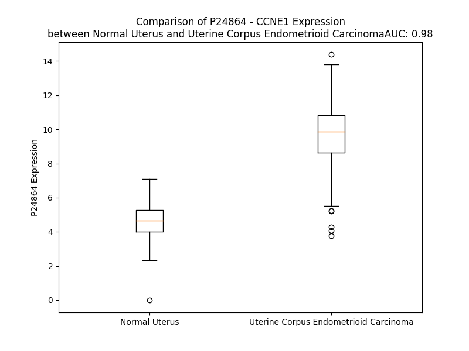

# Detailed Data for P24864

## Introduction to the Detailed Summary

### How to Interpret the Results

- **Summary & Metrics**: This section provides a quick reference to essential protein attributes, including expression changes, family classification, and biomarker applications. Regulation status (upregulated/downregulated) indicates the protein's behavior in a disease context. Some information comes from the original excel file with the proteins selected from literature, while others are derived from the analyses.
- **Expression Comparison**: A visual representation comparing protein expression between normal and disease states. It highlights significant changes in expression levels that might indicate diagnostic or therapeutic relevance. This is data coming from transcriptomics experiments and could not translate similarly to protein levels.
- **Isoform Alignment**: An interactive view of isoform alignments, revealing structural and functional differences between variants of the protein.
- **Interactors & Homologs**: Tables listing known interaction partners and homologous proteins, the more interactors and homologs, the more complex the protein is to design an antibody for.
- **Biological Assemblies**: Information about the structural arrangement of the protein in different assemblies, providing insights into its functional state but also the complexity of the protein to develop antibodies.
- **Combined Per-Residue Information**: A detailed table summarizing residue-level data. This includes predictions for epitope regions, aggregation tendencies, and modifications that might impact the protein's function. Each row corresponds to a residue in the protein, providing insights into specific sites that may be important for research or drug development.
## Summary & Metrics

- **UniProt Accession**: P24864
- **Gene Name**: uniprot_accession
P24864    cyclin E1
P24864        CCNE1
Name: gene_name, dtype: object
- **Protein Name**: uniprot_accession
P24864    G1/S-specific cyclin-E1
P24864    G1/S-specific cyclin-E1
Name: protein_name, dtype: object
- **Swiss Prot**: uniprot_accession
P24864    CCNE1_HUMAN
P24864    CCNE1_HUMAN
Name: swiss_prot, dtype: object
- **Family**: uniprot_accession
P24864    NaN
P24864    NaN
Name: family, dtype: object
- **Biomarker Application**: uniprot_accession
P24864    NaN
P24864    NaN
Name: biomarker_application, dtype: object
- **Number of Isoforms**: 3
- **Regulation**: uniprot_accession
P24864    2
P24864    1
Name: up_down_regulated, dtype: int64
- **(transcriptomics) AUC**: 1.0
- **(transcriptomics) Fold Change**: 2.30
- **(transcriptomics) Regulation**: Upregulated
- **Discotope Epitope Count**: 95
- **Max n_uniprots (Homo)**: N/A
- **Max n_uniprots (Hetero)**: 2.0

## Expression Comparison

## Isoform Alignment

<pre style='font-size:14px; font-family:monospace;'>P24864-1 MPRERRERDAKERDTMKEDGGAEFSARSRKRKANVTVFLQDPDEEMAKIDRTARDQCGSQPWDNNAVCADPCSLIPTPDKEDDDRVYPNSTCKPRIIAPSRGSPLPVLSWANREEVWKIMLNKEKTYLRDQHFLEQHPLLQPKMRAILLDWLMEVCEVYKLHRETFYLAQDFFDRYMATQENVVKTLLQLIGISSLFIAAKLEEIYPPKLHQFAYVTDGACSGDEILTMELMIMKALKWRLSPLTIVSWLNVYMQVAYLNDLHEVLLPQYPQQIFIQIAELLDLCVLDVDCLEFPYGILAASALYHFSSSELMQKVSGYQWCDIENCVKWMVPFAMVIRETGSSKLKHFRGVADEDAHNIQTHRDSLDLLDKARAKKAMLSEQNRASPLPSGLLTPPQSGKKQSSGPEMA
P24864-2 MPRERRERDAKERDTMKEDGGAEFSARSRKRKANVTVFLQDPDEEMAKIDRTARDQCGSQPWDNNAVCADPCSLIPTPDKEDDDRVYPNSTCKPRIIAPSRGSPLPVLSWANREEVWKIMLNKEKTYLRDQHFLEQHPLLQPKMRAILLDWLM-------------------------------------------FIAAKLEEIYPPKLHQFAYVTDGACSGDEILTMELMIMKALKWRLSPLTIVSWLNVYMQVAYLNDLHEVLLPQYPQQIFIQIAELLDLCVLDVDCLEFPYGILAASALYHFSSSELMQKVSGYQWCDIENCVKWMVPFAMVIRETGSSKLKHFRGVADEDAHNIQTHRDSLDLLDKARAKKAMLSEQNRASPLPSGLLTPPQSGKKQSSGPEMA
P24864-3 ---------------MKEDGGAEFSARSRKRKANVTVFLQDPDEEMAKIDRTARDQCGSQPWDNNAVCADPCSLIPTPDKEDDDRVYPNSTCKPRIIAPSRGSPLPVLSWANREEVWKIMLNKEKTYLRDQHFLEQHPLLQPKMRAILLDWLMEVCEVYKLHRETFYLAQDFFDRYMATQENVVKTLLQLIGISSLFIAAKLEEIYPPKLHQFAYVTDGACSGDEILTMELMIMKALKWRLSPLTIVSWLNVYMQVAYLNDLHEVLLPQYPQQIFIQIAELLDLCVLDVDCLEFPYGILAASALYHFSSSELMQKVSGYQWCDIENCVKWMVPFAMVIRETGSSKLKHFRGVADEDAHNIQTHRDSLDLLDKARAKKAMLSEQNRASPLPSGLLTPPQSGKKQSSGPEMA
</pre>

## Interactors

| preferredName_A   | preferredName_B   |   score |
|:------------------|:------------------|--------:|
| CCNE1             | CDK4              |   0.999 |
| CCNE1             | CDK6              |   0.999 |
| CCNE1             | CDKN1A            |   0.999 |
| CCNE1             | CDK2              |   0.999 |
| CCNE1             | CDKN1B            |   0.999 |
| CCNE1             | FBXW7             |   0.998 |
| CCNE1             | RB1               |   0.994 |
| CCNE1             | CDC25A            |   0.991 |
| CCNE1             | SKP1              |   0.991 |
| CCNE1             | SKP2              |   0.99  |
| CCNE1             | RBL2              |   0.99  |
| CCNE1             | CDKN1C            |   0.973 |
| CCNE1             | CDK1              |   0.972 |
| CCNE1             | RBL1              |   0.967 |
| CCNE1             | CUL1              |   0.959 |
| CCNE1             | CCNE2             |   0.956 |
| CCNE1             | E2F1              |   0.942 |
| CCNE1             | RBX1              |   0.93  |
| CCNE1             | TP53              |   0.926 |
| CCNE1             | CDK3              |   0.926 |
| CCNE1             | MYC               |   0.908 |
| CCNE1             | E2F2              |   0.908 |
| CCNE1             | CCNA1             |   0.907 |
| CCNE1             | CCNA2             |   0.903 |
| CCNE1             | CDC6              |   0.902 |

## Homologs

| uniprot_id   | gene_id   |
|:-------------|:----------|
| P20248       | CCNA2     |
| Q6FI00       | CCND1     |
| H1UBN3       | CCNB2     |
| Q14094       | CCNI      |
| nan          | nan       |
| P41002       | CCNF      |
| D6RI00       | CCND3     |
| Q8WWL7       | CCNB3     |
| Q6ZMN8       | CCNI2     |
| A0A2R8Y754   | CCNJL     |
| P51959       | CCNG1     |
| M0QZM5       | CCNP      |
| E9PC90       | CCNB1     |
| Q8WUE3       | CCNE2     |
| Q5T5M9       | CCNJ      |
| P30279       | CCND2     |
| Q16589       | CCNG2     |
| P22674       | CCNO      |

## Biological Assemblies

|   Unnamed: 0 |   assembly |   n_uniprots | composition   | crystal_id   |
|-------------:|-----------:|-------------:|:--------------|:-------------|
|            0 |          1 |            2 | Hetero        | 7kjs         |
|            0 |          1 |            2 | Hetero        | 8h6p         |
|            0 |          1 |            2 | Hetero        | 8h4r         |
|            0 |          1 |            2 | Hetero        | 1w98         |
|            0 |          1 |            2 | Hetero        | 5l2w         |
|            0 |          1 |            2 | Hetero        | 8h6t         |
|            0 |          1 |            2 | Hetero        | 7xqk         |

## Combined Per-Residue Information

|   res | aa   |   epitope_score | epitope   |   relative_surface_accessibility |   modeling_confidence |   Aggregation | modification              |
|------:|:-----|----------------:|:----------|---------------------------------:|----------------------:|--------------:|:--------------------------|
|     1 | M    |         0.16227 | False     |                          1.29524 |                 40.56 |         0     | N/A                       |
|     2 | P    |         0.20382 | True      |                          0.92737 |                 43.22 |         0     | N/A                       |
|     3 | R    |         0.21965 | True      |                          0.90637 |                 41.81 |         0     | N/A                       |
|     4 | E    |         0.18922 | True      |                          0.76022 |                 43.27 |         0     | N/A                       |
|     5 | R    |         0.12385 | False     |                          0.79953 |                 36.16 |         0     | N/A                       |
|     6 | R    |         0.17527 | False     |                          0.82288 |                 46.85 |         0     | N/A                       |
|     7 | E    |         0.15317 | False     |                          0.61421 |                 35.08 |         0     | N/A                       |
|     8 | R    |         0.18566 | True      |                          0.87126 |                 46.59 |         0     | N/A                       |
|     9 | D    |         0.22741 | True      |                          0.82725 |                 35.7  |         0     | N/A                       |
|    10 | A    |         0.1924  | True      |                          0.77259 |                 38.8  |         0     | N/A                       |
|    11 | K    |         0.09512 | False     |                          0.88397 |                 37.6  |         0     | N/A                       |
|    12 | E    |         0.1137  | False     |                          0.51803 |                 37.3  |         0     | N/A                       |
|    13 | R    |         0.11687 | False     |                          0.80322 |                 37.59 |         0     | N/A                       |
|    14 | D    |         0.12991 | False     |                          0.74007 |                 37.33 |         0     | N/A                       |
|    15 | T    |         0.18748 | True      |                          0.80296 |                 38.9  |         0     | N/A                       |
|    16 | M    |         0.11795 | False     |                          0.94122 |                 36.51 |         0     | N/A                       |
|    17 | K    |         0.15159 | False     |                          0.87298 |                 38.61 |         0     | N/A                       |
|    18 | E    |         0.24063 | True      |                          0.78546 |                 35.51 |         0     | N/A                       |
|    19 | D    |         0.22454 | True      |                          0.9193  |                 34.24 |         0     | N/A                       |
|    20 | G    |         0.18101 | False     |                          0.86835 |                 32.86 |         0     | N/A                       |
|    21 | G    |         0.25034 | True      |                          0.92529 |                 31.59 |         0     | N/A                       |
|    22 | A    |         0.13584 | False     |                          0.91013 |                 34.12 |         0     | N/A                       |
|    23 | E    |         0.18543 | True      |                          0.87117 |                 27.59 |         0     | N/A                       |
|    24 | F    |         0.14712 | False     |                          0.9985  |                 31.5  |         0     | N/A                       |
|    25 | S    |         0.15903 | False     |                          0.75201 |                 30.53 |         0     | N/A                       |
|    26 | A    |         0.10563 | False     |                          0.88389 |                 30.89 |         0     | N/A                       |
|    27 | R    |         0.16121 | False     |                          0.87247 |                 29    |         0     | N/A                       |
|    28 | S    |         0.11249 | False     |                          0.79795 |                 31.47 |         0     | N/A                       |
|    29 | R    |         0.13755 | False     |                          0.90643 |                 28.63 |         0     | N/A                       |
|    30 | K    |         0.14918 | False     |                          0.97107 |                 32.92 |         0     | N/A                       |
|    31 | R    |         0.11997 | False     |                          0.87235 |                 34    |         0     | N/A                       |
|    32 | K    |         0.16481 | False     |                          0.94886 |                 32.28 |         0     | N/A                       |
|    33 | A    |         0.11012 | False     |                          0.53195 |                 37.27 |         4.143 | N/A                       |
|    34 | N    |         0.11088 | False     |                          0.97377 |                 35.87 |        17.581 | N/A                       |
|    35 | V    |         0.03306 | False     |                          0.26678 |                 42.61 |        62.776 | N/A                       |
|    36 | T    |         0.08696 | False     |                          0.69701 |                 37    |        62.921 | N/A                       |
|    37 | V    |         0.07062 | False     |                          0.3766  |                 39.46 |        62.921 | N/A                       |
|    38 | F    |         0.09646 | False     |                          0.74477 |                 45.58 |        62.921 | N/A                       |
|    39 | L    |         0.11158 | False     |                          0.58791 |                 44.46 |        62.501 | N/A                       |
|    40 | Q    |         0.05402 | False     |                          0.1761  |                 45.32 |         2.495 | N/A                       |
|    41 | D    |         0.16284 | False     |                          0.47839 |                 47.72 |         0     | N/A                       |
|    42 | P    |         0.09099 | False     |                          0.24627 |                 45.65 |         0     | N/A                       |
|    43 | D    |         0.16551 | False     |                          0.64941 |                 49.73 |         0     | N/A                       |
|    44 | E    |         0.12442 | False     |                          0.4618  |                 59.21 |         0     | N/A                       |
|    45 | E    |         0.03241 | False     |                          0.03465 |                 55.32 |         0     | N/A                       |
|    46 | M    |         0.11048 | False     |                          0.40757 |                 53.28 |         0     | N/A                       |
|    47 | A    |         0.06248 | False     |                          0.43018 |                 57.3  |         0     | N/A                       |
|    48 | K    |         0.10615 | False     |                          0.33338 |                 59.35 |         0     | N/A                       |
|    49 | I    |         0.0425  | False     |                          0.04537 |                 55.83 |         0     | N/A                       |
|    50 | D    |         0.10693 | False     |                          0.57128 |                 49.33 |         0     | N/A                       |
|    51 | R    |         0.21393 | True      |                          0.66454 |                 56.22 |         0     | N/A                       |
|    52 | T    |         0.0911  | False     |                          0.28848 |                 53.75 |         0     | N/A                       |
|    53 | A    |         0.08711 | False     |                          0.32317 |                 44.19 |         0     | N/A                       |
|    54 | R    |         0.14688 | False     |                          0.78012 |                 46.83 |         0     | N/A                       |
|    55 | D    |         0.15255 | False     |                          0.73712 |                 51.68 |         0     | N/A                       |
|    56 | Q    |         0.15613 | False     |                          0.58288 |                 50.61 |         0     | N/A                       |
|    57 | C    |         0.12534 | False     |                          0.83074 |                 37.79 |         0     | N/A                       |
|    58 | G    |         0.25768 | True      |                          0.72561 |                 34.31 |         0     | N/A                       |
|    59 | S    |         0.21287 | True      |                          0.77313 |                 31.43 |         0     | N/A                       |
|    60 | Q    |         0.207   | True      |                          0.85897 |                 29.1  |         0     | N/A                       |
|    61 | P    |         0.21974 | True      |                          0.93462 |                 30.35 |         0     | N/A                       |
|    62 | W    |         0.21023 | True      |                          1.07946 |                 27.79 |         0     | N/A                       |
|    63 | D    |         0.17982 | False     |                          0.89678 |                 31.03 |         0     | N/A                       |
|    64 | N    |         0.25998 | True      |                          0.81611 |                 31.12 |         0     | N/A                       |
|    65 | N    |         0.12752 | False     |                          0.93369 |                 30.46 |         0     | N/A                       |
|    66 | A    |         0.14471 | False     |                          1.01523 |                 34.02 |         0     | N/A                       |
|    67 | V    |         0.10474 | False     |                          1.05176 |                 28.54 |         0     | N/A                       |
|    68 | C    |         0.16731 | False     |                          0.94751 |                 33.49 |         0     | N/A                       |
|    69 | A    |         0.12553 | False     |                          0.87563 |                 31.34 |         0     | N/A                       |
|    70 | D    |         0.23405 | True      |                          0.87919 |                 33.46 |         0     | N/A                       |
|    71 | P    |         0.12292 | False     |                          0.88418 |                 36.98 |         0     | N/A                       |
|    72 | C    |         0.13469 | False     |                          1.04284 |                 37.03 |         0     | N/A                       |
|    73 | S    |         0.24916 | True      |                          0.71581 |                 33.43 |         0     | N/A                       |
|    74 | L    |         0.15381 | False     |                          0.97087 |                 38.23 |         0     | N/A                       |
|    75 | I    |         0.15579 | False     |                          0.80163 |                 36.81 |         0     | N/A                       |
|    76 | P    |         0.16042 | False     |                          0.92225 |                 36.55 |         0     | N/A                       |
|    77 | T    |         0.19975 | True      |                          0.87365 |                 41.83 |         0     | Phosphothreonine          |
|    78 | P    |         0.25566 | True      |                          0.86216 |                 37.78 |         0     | N/A                       |
|    79 | D    |         0.31064 | True      |                          0.81602 |                 43.74 |         0     | N/A                       |
|    80 | K    |         0.23812 | True      |                          1.00055 |                 41.39 |         0     | N/A                       |
|    81 | E    |         0.16057 | False     |                          0.89536 |                 37.52 |         0     | N/A                       |
|    82 | D    |         0.29631 | True      |                          0.95619 |                 39.86 |         0     | N/A                       |
|    83 | D    |         0.27249 | True      |                          0.84598 |                 37.84 |         0     | N/A                       |
|    84 | D    |         0.23377 | True      |                          0.57102 |                 35.02 |         0     | N/A                       |
|    85 | R    |         0.19694 | True      |                          0.76796 |                 36.54 |         0     | N/A                       |
|    86 | V    |         0.16334 | False     |                          1.01027 |                 31.29 |         0     | N/A                       |
|    87 | Y    |         0.1662  | False     |                          0.80904 |                 39.23 |         0     | N/A                       |
|    88 | P    |         0.26836 | True      |                          0.92764 |                 37.76 |         0     | N/A                       |
|    89 | N    |         0.21122 | True      |                          0.87159 |                 38.09 |         0     | N/A                       |
|    90 | S    |         0.15023 | False     |                          0.89421 |                 34.18 |         0     | N/A                       |
|    91 | T    |         0.18611 | True      |                          0.71929 |                 33.45 |         0     | N/A                       |
|    92 | C    |         0.13994 | False     |                          0.87067 |                 29.88 |         0     | N/A                       |
|    93 | K    |         0.13478 | False     |                          0.78023 |                 35.7  |         0     | N/A                       |
|    94 | P    |         0.1321  | False     |                          0.79808 |                 36.99 |         0     | N/A                       |
|    95 | R    |         0.22187 | True      |                          0.86185 |                 35.14 |         0     | N/A                       |
|    96 | I    |         0.14376 | False     |                          0.63239 |                 44.87 |         0     | N/A                       |
|    97 | I    |         0.24293 | True      |                          0.83748 |                 38.41 |         0     | N/A                       |
|    98 | A    |         0.10881 | False     |                          0.53914 |                 46    |         0     | N/A                       |
|    99 | P    |         0.15809 | False     |                          0.55657 |                 46.7  |         0     | N/A                       |
|   100 | S    |         0.17644 | False     |                          0.95309 |                 55.29 |         0     | N/A                       |
|   101 | R    |         0.2057  | True      |                          0.16466 |                 69.05 |         0     | N/A                       |
|   102 | G    |         0.16761 | False     |                          0.63551 |                 78.56 |         0     | N/A                       |
|   103 | S    |         0.09536 | False     |                          0.18149 |                 88.59 |         0     | Phosphoserine             |
|   104 | P    |         0.0342  | False     |                          0.14231 |                 92.87 |         0     | N/A                       |
|   105 | L    |         0.0766  | False     |                          0.0467  |                 93.11 |         0     | N/A                       |
|   106 | P    |         0.10185 | False     |                          0.10225 |                 91.86 |         0     | N/A                       |
|   107 | V    |         0.20897 | True      |                          0.8683  |                 91.6  |         0.743 | N/A                       |
|   108 | L    |         0.12249 | False     |                          0.08559 |                 92.19 |         0.743 | N/A                       |
|   109 | S    |         0.39653 | True      |                          0.91172 |                 91.59 |         0.743 | N/A                       |
|   110 | W    |         0.50528 | True      |                          0.53821 |                 93.22 |         0.743 | N/A                       |
|   111 | A    |         0.30816 | True      |                          0.40754 |                 95.15 |         0.743 | N/A                       |
|   112 | N    |         0.20937 | True      |                          0.53106 |                 95.13 |         0.167 | N/A                       |
|   113 | R    |         0.11545 | False     |                          0.31135 |                 94.06 |         0     | N/A                       |
|   114 | E    |         0.17563 | False     |                          0.44794 |                 94.59 |         0     | N/A                       |
|   115 | E    |         0.19217 | True      |                          0.48562 |                 95.95 |         1.021 | N/A                       |
|   116 | V    |         0.19279 | True      |                          0.23466 |                 96.1  |         1.021 | N/A                       |
|   117 | W    |         0.01652 | False     |                          0.02322 |                 95.24 |         1.021 | N/A                       |
|   118 | K    |         0.06705 | False     |                          0.66254 |                 95.01 |         1.021 | N/A                       |
|   119 | I    |         0.40284 | True      |                          0.61969 |                 96.18 |         1.021 | N/A                       |
|   120 | M    |         0.11121 | False     |                          0.13402 |                 96.52 |         0.82  | N/A                       |
|   121 | L    |         0.05331 | False     |                          0.20143 |                 94.78 |         0.59  | N/A                       |
|   122 | N    |         0.09399 | False     |                          0.40381 |                 95.38 |         0.133 | N/A                       |
|   123 | K    |         0.07444 | False     |                          0.31651 |                 95.63 |         0     | N/A                       |
|   124 | E    |         0.05228 | False     |                          0.12528 |                 92.7  |         0     | N/A                       |
|   125 | K    |         0.04594 | False     |                          0.59846 |                 92.75 |         0     | N/A                       |
|   126 | T    |         0.09829 | False     |                          0.56742 |                 96.1  |         0     | N/A                       |
|   127 | Y    |         0.05037 | False     |                          0.07363 |                 97.28 |         0     | N/A                       |
|   128 | L    |         0.07155 | False     |                          0.84217 |                 95.66 |         0     | N/A                       |
|   129 | R    |         0.05243 | False     |                          0.18723 |                 97.43 |         0     | N/A                       |
|   130 | D    |         0.06879 | False     |                          0.32215 |                 95.76 |         0     | N/A                       |
|   131 | Q    |         0.07023 | False     |                          0.21332 |                 96.68 |         0     | N/A                       |
|   132 | H    |         0.08666 | False     |                          0.5286  |                 97.21 |         0     | N/A                       |
|   133 | F    |         0.00799 | False     |                          0.00255 |                 97.18 |         0     | N/A                       |
|   134 | L    |         0.04479 | False     |                          0.123   |                 96.67 |         0     | N/A                       |
|   135 | E    |         0.1205  | False     |                          0.68124 |                 96.6  |         0     | N/A                       |
|   136 | Q    |         0.06365 | False     |                          0.33388 |                 96.79 |         0     | N/A                       |
|   137 | H    |         0.02032 | False     |                          0.00054 |                 97.93 |         0     | N/A                       |
|   138 | P    |         0.28569 | True      |                          0.75244 |                 96.77 |         0     | N/A                       |
|   139 | L    |         0.18958 | True      |                          0.7165  |                 96.81 |         0     | N/A                       |
|   140 | L    |         0.03408 | False     |                          0.09843 |                 97.87 |         0     | N/A                       |
|   141 | Q    |         0.24613 | True      |                          0.54686 |                 97.14 |         0     | N/A                       |
|   142 | P    |         0.04809 | False     |                          0.4354  |                 97.41 |         0     | N/A                       |
|   143 | K    |         0.12449 | False     |                          0.41769 |                 97.12 |         0     | N/A                       |
|   144 | M    |         0.10789 | False     |                          0.20235 |                 98.29 |         1.357 | N/A                       |
|   145 | R    |         0.00991 | False     |                          0.00865 |                 98.54 |         2.546 | N/A                       |
|   146 | A    |         0.00099 | False     |                          0       |                 98.51 |         2.546 | N/A                       |
|   147 | I    |         0.09127 | False     |                          0.5349  |                 98.5  |         2.546 | N/A                       |
|   148 | L    |         0.01697 | False     |                          0.06336 |                 98.69 |         2.546 | N/A                       |
|   149 | L    |         0.0025  | False     |                          0       |                 98.82 |         2.546 | N/A                       |
|   150 | D    |         0.01945 | False     |                          0.06747 |                 98.75 |         2.546 | N/A                       |
|   151 | W    |         0.06973 | False     |                          0.22095 |                 98.69 |         2.546 | N/A                       |
|   152 | L    |         0.00383 | False     |                          0       |                 98.84 |         2.546 | N/A                       |
|   153 | M    |         0.0046  | False     |                          0.00844 |                 98.77 |         1.355 | N/A                       |
|   154 | E    |         0.08717 | False     |                          0.42036 |                 98.57 |         0     | N/A                       |
|   155 | V    |         0.01501 | False     |                          0.01428 |                 98.55 |         0.219 | N/A                       |
|   156 | C    |         0.00148 | False     |                          0       |                 98.76 |         0.219 | N/A                       |
|   157 | E    |         0.04928 | False     |                          0.19556 |                 98.33 |         0.219 | N/A                       |
|   158 | V    |         0.11165 | False     |                          0.60834 |                 97.84 |         0.219 | N/A                       |
|   159 | Y    |         0.09624 | False     |                          0.22709 |                 98.19 |         0.219 | N/A                       |
|   160 | K    |         0.0671  | False     |                          0.35024 |                 98.38 |         0.219 | N/A                       |
|   161 | L    |         0.01375 | False     |                          0.02143 |                 98.7  |         0.219 | N/A                       |
|   162 | H    |         0.06137 | False     |                          0.28124 |                 98.76 |         0     | N/A                       |
|   163 | R    |         0.00654 | False     |                          0.01176 |                 98.8  |         0     | N/A                       |
|   164 | E    |         0.0235  | False     |                          0.18898 |                 98.81 |         0     | N/A                       |
|   165 | T    |         0.00163 | False     |                          0       |                 98.89 |         7.133 | N/A                       |
|   166 | F    |         0.00145 | False     |                          0       |                 98.92 |         7.133 | N/A                       |
|   167 | Y    |         0.00484 | False     |                          0.00461 |                 98.91 |         7.133 | N/A                       |
|   168 | L    |         0.01704 | False     |                          0.05441 |                 98.92 |         7.133 | N/A                       |
|   169 | A    |         0.00176 | False     |                          0       |                 98.93 |         7.133 | N/A                       |
|   170 | Q    |         0.00151 | False     |                          0       |                 98.87 |         0.269 | N/A                       |
|   171 | D    |         0.0011  | False     |                          0       |                 98.89 |         0     | N/A                       |
|   172 | F    |         0.00208 | False     |                          0       |                 98.87 |         0     | N/A                       |
|   173 | F    |         0.00389 | False     |                          0.00318 |                 98.88 |         0     | N/A                       |
|   174 | D    |         0.00769 | False     |                          0.01875 |                 98.75 |         0     | N/A                       |
|   175 | R    |         0.02816 | False     |                          0.09134 |                 98.67 |         0     | N/A                       |
|   176 | Y    |         0.03155 | False     |                          0.02263 |                 98.73 |         0     | N/A                       |
|   177 | M    |         0.00293 | False     |                          0.00072 |                 98.62 |         0     | N/A                       |
|   178 | A    |         0.02374 | False     |                          0.29286 |                 98.24 |         0     | N/A                       |
|   179 | T    |         0.09324 | False     |                          0.5348  |                 98.07 |         0     | N/A                       |
|   180 | Q    |         0.06353 | False     |                          0.21843 |                 98.24 |         0     | N/A                       |
|   181 | E    |         0.18539 | True      |                          0.69189 |                 97.67 |         0.132 | N/A                       |
|   182 | N    |         0.17486 | False     |                          0.58022 |                 97.15 |         0.132 | N/A                       |
|   183 | V    |         0.03303 | False     |                          0.07306 |                 97.98 |         0.132 | N/A                       |
|   184 | V    |         0.08696 | False     |                          0.42436 |                 97.3  |         0.132 | N/A                       |
|   185 | K    |         0.12178 | False     |                          0.66083 |                 97.42 |         0.132 | N/A                       |
|   186 | T    |         0.28248 | True      |                          0.84467 |                 96.84 |         6.98  | N/A                       |
|   187 | L    |         0.11284 | False     |                          0.43196 |                 98.08 |        18.651 | N/A                       |
|   188 | L    |         0.02436 | False     |                          0.07007 |                 98.52 |        23.917 | N/A                       |
|   189 | Q    |         0.04186 | False     |                          0.2689  |                 98.5  |        24.882 | N/A                       |
|   190 | L    |         0.01278 | False     |                          0.10222 |                 98.82 |        48.508 | N/A                       |
|   191 | I    |         0.01043 | False     |                          0.0112  |                 98.85 |        52.781 | N/A                       |
|   192 | G    |         0.00162 | False     |                          0       |                 98.85 |        52.231 | N/A                       |
|   193 | I    |         0.0023  | False     |                          0       |                 98.83 |        56.545 | N/A                       |
|   194 | S    |         0.00244 | False     |                          0       |                 98.9  |        55.707 | N/A                       |
|   195 | S    |         0.00183 | False     |                          0       |                 98.92 |        56.626 | N/A                       |
|   196 | L    |         0.00072 | False     |                          0       |                 98.93 |        60.949 | N/A                       |
|   197 | F    |         0.03066 | False     |                          0.07325 |                 98.9  |        60.8   | N/A                       |
|   198 | I    |         0.03615 | False     |                          0.01339 |                 98.92 |        57.838 | N/A                       |
|   199 | A    |         0.00305 | False     |                          0       |                 98.92 |        24.877 | N/A                       |
|   200 | A    |         0.00276 | False     |                          0       |                 98.86 |        14.145 | N/A                       |
|   201 | K    |         0.1031  | False     |                          0.43434 |                 98.75 |         0.807 | N/A                       |
|   202 | L    |         0.14064 | False     |                          0.56593 |                 98.68 |         0.807 | N/A                       |
|   203 | E    |         0.11183 | False     |                          0.4047  |                 98.53 |         0.807 | N/A                       |
|   204 | E    |         0.08081 | False     |                          0.12797 |                 98.39 |         0     | N/A                       |
|   205 | I    |         0.27075 | True      |                          0.88781 |                 98.26 |         0     | N/A                       |
|   206 | Y    |         0.23698 | True      |                          0.87212 |                 97.64 |         0     | N/A                       |
|   207 | P    |         0.06475 | False     |                          0.19596 |                 98.05 |         0     | N/A                       |
|   208 | P    |         0.06268 | False     |                          0.10395 |                 98.29 |         0     | N/A                       |
|   209 | K    |         0.24109 | True      |                          0.54316 |                 98.38 |         0     | N/A                       |
|   210 | L    |         0.07186 | False     |                          0.27196 |                 98.58 |         0.459 | N/A                       |
|   211 | H    |         0.26027 | True      |                          0.70322 |                 98.27 |         0.459 | N/A                       |
|   212 | Q    |         0.16852 | False     |                          0.2834  |                 98.45 |         1.164 | N/A                       |
|   213 | F    |         0.00666 | False     |                          0.00196 |                 98.62 |         7.894 | N/A                       |
|   214 | A    |         0.06772 | False     |                          0.15844 |                 98.2  |         7.894 | N/A                       |
|   215 | Y    |         0.26888 | True      |                          0.79284 |                 98.03 |         7.894 | N/A                       |
|   216 | V    |         0.0858  | False     |                          0.24916 |                 97.49 |         7.894 | N/A                       |
|   217 | T    |         0.05916 | False     |                          0.02502 |                 97.01 |         7.164 | N/A                       |
|   218 | D    |         0.40437 | True      |                          0.88825 |                 96.91 |         0     | N/A                       |
|   219 | G    |         0.22238 | True      |                          0.84842 |                 95.39 |         0     | N/A                       |
|   220 | A    |         0.18244 | False     |                          0.64221 |                 97.06 |         0     | N/A                       |
|   221 | C    |         0.08019 | False     |                          0.04562 |                 97.7  |         0     | N/A                       |
|   222 | S    |         0.25677 | True      |                          0.38884 |                 98.32 |         0     | N/A                       |
|   223 | G    |         0.09874 | False     |                          0.21563 |                 98.48 |         0     | N/A                       |
|   224 | D    |         0.17468 | False     |                          0.65904 |                 98.65 |         0     | N/A                       |
|   225 | E    |         0.15154 | False     |                          0.41143 |                 98.67 |         0     | N/A                       |
|   226 | I    |         0.00526 | False     |                          0       |                 98.83 |         1.656 | N/A                       |
|   227 | L    |         0.12383 | False     |                          0.46048 |                 98.81 |         2.007 | N/A                       |
|   228 | T    |         0.18938 | True      |                          0.57098 |                 98.78 |         2.007 | N/A                       |
|   229 | M    |         0.03737 | False     |                          0.06102 |                 98.77 |         2.007 | N/A                       |
|   230 | E    |         0.06683 | False     |                          0.06092 |                 98.69 |         2.007 | N/A                       |
|   231 | L    |         0.14212 | False     |                          0.50437 |                 98.75 |         2.007 | N/A                       |
|   232 | M    |         0.20074 | True      |                          0.47077 |                 98.76 |         2.007 | N/A                       |
|   233 | I    |         0.00444 | False     |                          0       |                 98.86 |         2.007 | N/A                       |
|   234 | M    |         0.07555 | False     |                          0.08935 |                 98.81 |         2.007 | N/A                       |
|   235 | K    |         0.20604 | True      |                          0.62877 |                 98.68 |         2.007 | N/A                       |
|   236 | A    |         0.1555  | False     |                          0.2766  |                 98.55 |         2.007 | N/A                       |
|   237 | L    |         0.04025 | False     |                          0.06109 |                 98.64 |         1.751 | N/A                       |
|   238 | K    |         0.23786 | True      |                          0.81387 |                 98.41 |         0     | N/A                       |
|   239 | W    |         0.32693 | True      |                          0.66624 |                 98.42 |         0     | N/A                       |
|   240 | R    |         0.19543 | True      |                          0.49767 |                 98.39 |         0     | N/A                       |
|   241 | L    |         0.09245 | False     |                          0.10057 |                 98.5  |         0     | N/A                       |
|   242 | S    |         0.17257 | False     |                          0.51839 |                 98.31 |         0     | N/A                       |
|   243 | P    |         0.04956 | False     |                          0.0625  |                 98.35 |         0.777 | N/A                       |
|   244 | L    |         0.09228 | False     |                          0.1775  |                 98.39 |        63.781 | N/A                       |
|   245 | T    |         0.00582 | False     |                          0       |                 98.67 |        75.322 | N/A                       |
|   246 | I    |         0.00899 | False     |                          0.0088  |                 98.74 |        94.639 | N/A                       |
|   247 | V    |         0.01883 | False     |                          0.01714 |                 98.57 |        96.366 | N/A                       |
|   248 | S    |         0.04834 | False     |                          0.16436 |                 98.15 |        96.505 | N/A                       |
|   249 | W    |         0.00395 | False     |                          0.00331 |                 98.37 |        97.613 | N/A                       |
|   250 | L    |         0.00162 | False     |                          0       |                 98.23 |        97.376 | N/A                       |
|   251 | N    |         0.07536 | False     |                          0.29491 |                 97.41 |        95.298 | N/A                       |
|   252 | V    |         0.05246 | False     |                          0.2368  |                 96.46 |        95.488 | N/A                       |
|   253 | Y    |         0.00233 | False     |                          0       |                 97.16 |        94.542 | N/A                       |
|   254 | M    |         0.00429 | False     |                          0.00739 |                 96.79 |        87.308 | N/A                       |
|   255 | Q    |         0.03907 | False     |                          0.0444  |                 95.01 |        79.042 | N/A                       |
|   256 | V    |         0.02854 | False     |                          0.0404  |                 94.46 |        78.723 | N/A                       |
|   257 | A    |         0.03277 | False     |                          0.0874  |                 94.58 |        74.923 | N/A                       |
|   258 | Y    |         0.04008 | False     |                          0.13635 |                 93.32 |        71.71  | N/A                       |
|   259 | L    |         0.07668 | False     |                          0.23846 |                 88.79 |        48.391 | N/A                       |
|   260 | N    |         0.17585 | False     |                          0.33918 |                 86.83 |         1.816 | N/A                       |
|   261 | D    |         0.20661 | True      |                          0.7644  |                 83.62 |         0     | N/A                       |
|   262 | L    |         0.19958 | True      |                          0.80651 |                 81.52 |         0     | N/A                       |
|   263 | H    |         0.30378 | True      |                          0.49833 |                 78.04 |         0     | N/A                       |
|   264 | E    |         0.36335 | True      |                          0.38396 |                 83.81 |         0     | N/A                       |
|   265 | V    |         0.10942 | False     |                          0.18238 |                 85.45 |         0     | N/A                       |
|   266 | L    |         0.49747 | True      |                          0.78321 |                 85.42 |         0     | N/A                       |
|   267 | L    |         0.27574 | True      |                          0.63793 |                 83.75 |         0     | N/A                       |
|   268 | P    |         0.2378  | True      |                          0.70939 |                 87.47 |         0     | N/A                       |
|   269 | Q    |         0.06996 | False     |                          0.33787 |                 87.04 |         0     | N/A                       |
|   270 | Y    |         0.0978  | False     |                          0.09305 |                 94.15 |         0     | N/A                       |
|   271 | P    |         0.14905 | False     |                          0.39749 |                 95.58 |         0     | N/A                       |
|   272 | Q    |         0.08405 | False     |                          0.19036 |                 96.54 |         0.11  | N/A                       |
|   273 | Q    |         0.04876 | False     |                          0.30529 |                 96.09 |         1.047 | N/A                       |
|   274 | I    |         0.04343 | False     |                          0.17519 |                 95.87 |        22.117 | N/A                       |
|   275 | F    |         0.00454 | False     |                          0.00191 |                 97.78 |        23     | N/A                       |
|   276 | I    |         0.01326 | False     |                          0.0288  |                 97.04 |        23     | N/A                       |
|   277 | Q    |         0.0326  | False     |                          0.19444 |                 96.18 |        22.89  | N/A                       |
|   278 | I    |         0.0029  | False     |                          0.0008  |                 97.95 |        22.778 | N/A                       |
|   279 | A    |         0.00367 | False     |                          0.01275 |                 98.29 |        10.915 | N/A                       |
|   280 | E    |         0.0234  | False     |                          0.03503 |                 97.52 |         0     | N/A                       |
|   281 | L    |         0.00137 | False     |                          0.00165 |                 98.09 |         0     | N/A                       |
|   282 | L    |         0.00724 | False     |                          0.01828 |                 98.66 |         0     | N/A                       |
|   283 | D    |         0.01254 | False     |                          0.05531 |                 98.55 |         0     | N/A                       |
|   284 | L    |         0.0085  | False     |                          0.01838 |                 98.22 |         0     | N/A                       |
|   285 | C    |         0.00534 | False     |                          0.01001 |                 98.48 |         0     | N/A                       |
|   286 | V    |         0.0067  | False     |                          0.00843 |                 98.49 |         0     | N/A                       |
|   287 | L    |         0.00301 | False     |                          0.00061 |                 98.5  |         0     | N/A                       |
|   288 | D    |         0.04182 | False     |                          0.05054 |                 97.97 |         0     | N/A                       |
|   289 | V    |         0.01612 | False     |                          0.07617 |                 97.77 |         0     | N/A                       |
|   290 | D    |         0.06914 | False     |                          0.29713 |                 97.45 |         0     | N/A                       |
|   291 | C    |         0.00557 | False     |                          0.002   |                 98.01 |         0     | N/A                       |
|   292 | L    |         0.02343 | False     |                          0.05896 |                 98.14 |         0     | N/A                       |
|   293 | E    |         0.10948 | False     |                          0.48534 |                 97.39 |         0     | N/A                       |
|   294 | F    |         0.05492 | False     |                          0.09709 |                 97.8  |         0     | N/A                       |
|   295 | P    |         0.03478 | False     |                          0.20891 |                 97.54 |         0     | N/A                       |
|   296 | Y    |         0.00313 | False     |                          0.00178 |                 98.49 |         4.409 | N/A                       |
|   297 | G    |         0.00304 | False     |                          0       |                 97.8  |         5.148 | N/A                       |
|   298 | I    |         0.02397 | False     |                          0.12079 |                 98.02 |        12.766 | N/A                       |
|   299 | L    |         0.00579 | False     |                          0.01072 |                 98.62 |        13.309 | N/A                       |
|   300 | A    |         0.00093 | False     |                          0       |                 98.62 |        13.309 | N/A                       |
|   301 | A    |         0.00073 | False     |                          0       |                 98.33 |        12.454 | N/A                       |
|   302 | S    |         0.00128 | False     |                          0       |                 98.52 |        11.523 | N/A                       |
|   303 | A    |         0.00149 | False     |                          0       |                 98.52 |        11.443 | N/A                       |
|   304 | L    |         0.00473 | False     |                          0.02308 |                 97.9  |        11.201 | N/A                       |
|   305 | Y    |         0.02657 | False     |                          0.05292 |                 97.89 |         9.229 | N/A                       |
|   306 | H    |         0.009   | False     |                          0.0137  |                 96.9  |         2.434 | N/A                       |
|   307 | F    |         0.01416 | False     |                          0.03136 |                 95.59 |         2.434 | N/A                       |
|   308 | S    |         0.03736 | False     |                          0.11599 |                 94.59 |         0.244 | N/A                       |
|   309 | S    |         0.05433 | False     |                          0.27158 |                 94.7  |         0     | N/A                       |
|   310 | S    |         0.04581 | False     |                          0.22147 |                 94.15 |         0     | N/A                       |
|   311 | E    |         0.12182 | False     |                          0.64597 |                 94.67 |         0     | N/A                       |
|   312 | L    |         0.032   | False     |                          0.17807 |                 95.42 |         0     | N/A                       |
|   313 | M    |         0.00283 | False     |                          0       |                 95.79 |         0     | N/A                       |
|   314 | Q    |         0.11749 | False     |                          0.44368 |                 94.84 |         0     | N/A                       |
|   315 | K    |         0.14183 | False     |                          0.58159 |                 94.4  |         0     | N/A                       |
|   316 | V    |         0.00386 | False     |                          0       |                 95.29 |         0     | N/A                       |
|   317 | S    |         0.01974 | False     |                          0       |                 95.37 |         0     | N/A                       |
|   318 | G    |         0.05258 | False     |                          0.22029 |                 94.05 |         0     | N/A                       |
|   319 | Y    |         0.04812 | False     |                          0.07252 |                 94.65 |         0     | N/A                       |
|   320 | Q    |         0.17903 | False     |                          0.43907 |                 94.71 |         0     | N/A                       |
|   321 | W    |         0.02353 | False     |                          0.05077 |                 93.82 |         0     | N/A                       |
|   322 | C    |         0.09733 | False     |                          0.63866 |                 94.55 |         0     | N/A                       |
|   323 | D    |         0.05832 | False     |                          0.24351 |                 94.58 |         0     | N/A                       |
|   324 | I    |         0.00516 | False     |                          0       |                 96.22 |         0     | N/A                       |
|   325 | E    |         0.06842 | False     |                          0.14952 |                 96.72 |         0     | N/A                       |
|   326 | N    |         0.07584 | False     |                          0.69758 |                 97.2  |         0     | N/A                       |
|   327 | C    |         0.00836 | False     |                          0.00817 |                 98.16 |         0     | N/A                       |
|   328 | V    |         0.00433 | False     |                          0.00095 |                 97.58 |         0     | N/A                       |
|   329 | K    |         0.0636  | False     |                          0.46171 |                 96.37 |         0     | N/A                       |
|   330 | W    |         0.03294 | False     |                          0.13848 |                 97.16 |         0     | N/A                       |
|   331 | M    |         0.00094 | False     |                          0       |                 98.09 |         0     | N/A                       |
|   332 | V    |         0.01976 | False     |                          0.0683  |                 97.1  |         0     | N/A                       |
|   333 | P    |         0.02848 | False     |                          0.0338  |                 97.34 |         0.885 | N/A                       |
|   334 | F    |         0.0021  | False     |                          0       |                 97.83 |        73.056 | N/A                       |
|   335 | A    |         0.01027 | False     |                          0.04081 |                 96.82 |        73.056 | N/A                       |
|   336 | M    |         0.07092 | False     |                          0.18385 |                 95.82 |        73.056 | N/A                       |
|   337 | V    |         0.01433 | False     |                          0.01904 |                 96.43 |        73.056 | N/A                       |
|   338 | I    |         0.00668 | False     |                          0.004   |                 95.38 |        73.056 | N/A                       |
|   339 | R    |         0.0509  | False     |                          0.1901  |                 93.13 |         0     | N/A                       |
|   340 | E    |         0.20521 | True      |                          0.5918  |                 94.44 |         0     | N/A                       |
|   341 | T    |         0.09302 | False     |                          0.45522 |                 92.79 |         0     | N/A                       |
|   342 | G    |         0.09724 | False     |                          0.42324 |                 90.09 |         0     | N/A                       |
|   343 | S    |         0.05607 | False     |                          0.29257 |                 88.21 |         0     | N/A                       |
|   344 | S    |         0.04376 | False     |                          0.26348 |                 90.8  |         0     | N/A                       |
|   345 | K    |         0.1115  | False     |                          0.85658 |                 94.59 |         0     | N/A                       |
|   346 | L    |         0.08555 | False     |                          0.39974 |                 95.23 |         0     | N/A                       |
|   347 | K    |         0.0859  | False     |                          0.35146 |                 96.42 |         0     | N/A                       |
|   348 | H    |         0.20062 | True      |                          0.69763 |                 96.35 |         0     | N/A                       |
|   349 | F    |         0.06893 | False     |                          0.07377 |                 96.81 |         0     | N/A                       |
|   350 | R    |         0.42418 | True      |                          0.87944 |                 96.6  |         0     | N/A                       |
|   351 | G    |         0.26907 | True      |                          0.99416 |                 95.81 |         0     | N/A                       |
|   352 | V    |         0.13416 | False     |                          0.22617 |                 96.39 |         0     | N/A                       |
|   353 | A    |         0.36063 | True      |                          0.48095 |                 96.52 |         0     | N/A                       |
|   354 | D    |         0.19914 | True      |                          0.54622 |                 94.84 |         0     | N/A                       |
|   355 | E    |         0.28595 | True      |                          0.68871 |                 94.59 |         0     | N/A                       |
|   356 | D    |         0.14048 | False     |                          0.24314 |                 95.98 |         0     | N/A                       |
|   357 | A    |         0.06715 | False     |                          0.02728 |                 97.24 |         0     | N/A                       |
|   358 | H    |         0.04017 | False     |                          0.01904 |                 97.26 |         0     | N/A                       |
|   359 | N    |         0.06392 | False     |                          0.21997 |                 97.97 |         0     | N/A                       |
|   360 | I    |         0.03128 | False     |                          0.01558 |                 98.45 |         0     | N/A                       |
|   361 | Q    |         0.00228 | False     |                          0       |                 98.68 |         0     | N/A                       |
|   362 | T    |         0.03792 | False     |                          0.105   |                 98.13 |         0     | N/A                       |
|   363 | H    |         0.10995 | False     |                          0.28641 |                 97.72 |         0     | N/A                       |
|   364 | R    |         0.0842  | False     |                          0.21735 |                 94.01 |         0     | N/A                       |
|   365 | D    |         0.09077 | False     |                          0.48355 |                 93.2  |         0     | N/A                       |
|   366 | S    |         0.02416 | False     |                          0.04004 |                 93.33 |         0     | N/A                       |
|   367 | L    |         0.09301 | False     |                          0.29118 |                 97    |         0     | N/A                       |
|   368 | D    |         0.12445 | False     |                          0.43256 |                 96.75 |         0     | N/A                       |
|   369 | L    |         0.0048  | False     |                          0.00165 |                 96.53 |         0     | N/A                       |
|   370 | L    |         0.00284 | False     |                          0.00165 |                 96.96 |         0     | N/A                       |
|   371 | D    |         0.08314 | False     |                          0.38252 |                 96.65 |         0     | N/A                       |
|   372 | K    |         0.10698 | False     |                          0.4634  |                 95.97 |         0     | N/A                       |
|   373 | A    |         0.00329 | False     |                          0       |                 95.62 |         0     | N/A                       |
|   374 | R    |         0.07879 | False     |                          0.24111 |                 93.96 |         0     | N/A                       |
|   375 | A    |         0.07523 | False     |                          0.48676 |                 94.62 |         0     | N/A                       |
|   376 | K    |         0.0552  | False     |                          0.21364 |                 93.16 |         0     | N/A                       |
|   377 | K    |         0.08045 | False     |                          0.28488 |                 91.62 |         0     | N/A                       |
|   378 | A    |         0.09399 | False     |                          0.521   |                 90.86 |         0     | N/A                       |
|   379 | M    |         0.12897 | False     |                          0.63596 |                 90.36 |         0     | N/A                       |
|   380 | L    |         0.07979 | False     |                          0.19668 |                 87.19 |         0     | N/A                       |
|   381 | S    |         0.05264 | False     |                          0.40415 |                 84.11 |         0     | N/A                       |
|   382 | E    |         0.14336 | False     |                          0.58671 |                 82.54 |         0     | N/A                       |
|   383 | Q    |         0.15072 | False     |                          0.56092 |                 78.04 |         0     | N/A                       |
|   384 | N    |         0.1662  | False     |                          0.76333 |                 73.42 |         0     | N/A                       |
|   385 | R    |         0.2809  | True      |                          0.81823 |                 73.18 |         0     | N/A                       |
|   386 | A    |         0.20182 | True      |                          0.73333 |                 65.99 |         0     | N/A                       |
|   387 | S    |         0.19902 | True      |                          0.61661 |                 52.74 |         0     | Phosphoserine             |
|   388 | P    |         0.2601  | True      |                          0.88618 |                 49.82 |         0     | N/A                       |
|   389 | L    |         0.19227 | True      |                          0.98246 |                 46.85 |         0     | N/A                       |
|   390 | P    |         0.21668 | True      |                          0.91196 |                 47.04 |         0     | N/A                       |
|   391 | S    |         0.30273 | True      |                          0.89693 |                 43.49 |         0     | N/A                       |
|   392 | G    |         0.23441 | True      |                          0.64944 |                 45.28 |         0     | N/A                       |
|   393 | L    |         0.21964 | True      |                          0.96212 |                 43.83 |         0     | N/A                       |
|   394 | L    |         0.23974 | True      |                          1.04771 |                 51.9  |         0     | N/A                       |
|   395 | T    |         0.22324 | True      |                          0.72075 |                 57.63 |         0     | Phosphothreonine; by GSK3 |
|   396 | P    |         0.21012 | True      |                          0.84817 |                 53.9  |         0     | N/A                       |
|   397 | P    |         0.20345 | True      |                          0.94788 |                 58.39 |         0     | N/A                       |
|   398 | Q    |         0.27427 | True      |                          0.90266 |                 54.48 |         0     | N/A                       |
|   399 | S    |         0.25158 | True      |                          0.99981 |                 55.54 |         0     | Phosphoserine; by CDK2    |
|   400 | G    |         0.32089 | True      |                          0.75614 |                 53.14 |         0     | N/A                       |
|   401 | K    |         0.18576 | True      |                          1.03342 |                 49.26 |         0     | N/A                       |
|   402 | K    |         0.19999 | True      |                          0.99903 |                 43.04 |         0     | N/A                       |
|   403 | Q    |         0.22127 | True      |                          0.86867 |                 51.71 |         0     | N/A                       |
|   404 | S    |         0.12408 | False     |                          0.71339 |                 50.59 |         0     | N/A                       |
|   405 | S    |         0.0832  | False     |                          0.87602 |                 49.82 |         0     | N/A                       |
|   406 | G    |         0.14476 | False     |                          0.83905 |                 48.75 |         0     | N/A                       |
|   407 | P    |         0.11603 | False     |                          1.0141  |                 49.96 |         0     | N/A                       |
|   408 | E    |         0.15493 | False     |                          0.91785 |                 53.36 |         0     | N/A                       |
|   409 | M    |         0.22458 | True      |                          1.00996 |                 52.53 |         0     | N/A                       |
|   410 | A    |         0.12205 | False     |                          1.62285 |                 58.05 |         0     | N/A                       |

