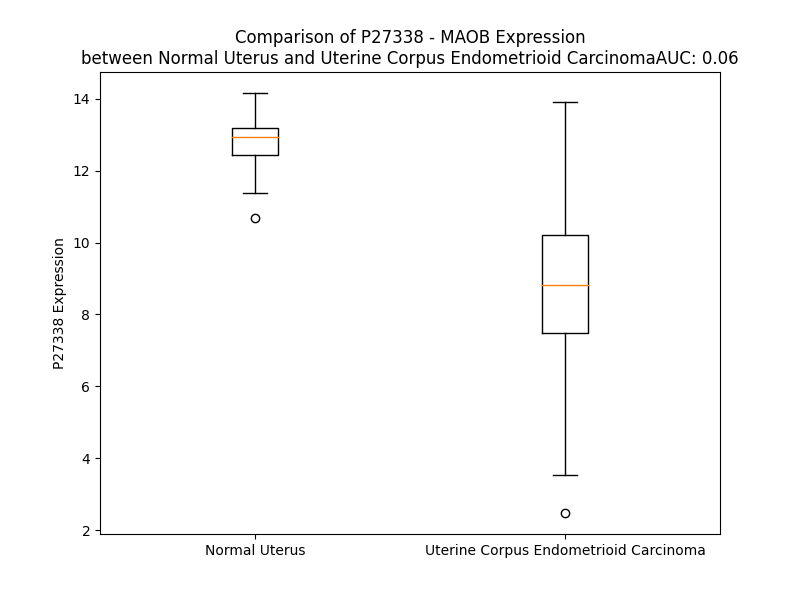

# Detailed Data for P27338

## Introduction to the Detailed Summary

### How to Interpret the Results

- **Summary & Metrics**: This section provides a quick reference to essential protein attributes, including expression changes, family classification, and biomarker applications. Regulation status (upregulated/downregulated) indicates the protein's behavior in a disease context. Some information comes from the original excel file with the proteins selected from literature, while others are derived from the analyses.
- **Expression Comparison**: A visual representation comparing protein expression between normal and disease states. It highlights significant changes in expression levels that might indicate diagnostic or therapeutic relevance. This is data coming from transcriptomics experiments and could not translate similarly to protein levels.
- **Isoform Alignment**: An interactive view of isoform alignments, revealing structural and functional differences between variants of the protein.
- **Interactors & Homologs**: Tables listing known interaction partners and homologous proteins, the more interactors and homologs, the more complex the protein is to design an antibody for.
- **Biological Assemblies**: Information about the structural arrangement of the protein in different assemblies, providing insights into its functional state but also the complexity of the protein to develop antibodies.
- **Combined Per-Residue Information**: A detailed table summarizing residue-level data. This includes predictions for epitope regions, aggregation tendencies, and modifications that might impact the protein's function. Each row corresponds to a residue in the protein, providing insights into specific sites that may be important for research or drug development.
## Summary & Metrics

- **UniProt Accession**: P27338
- **Gene Name**: MAOB
- **Protein Name**: Amine oxidase [flavin-containing] B
- **Swiss Prot**: AOFB_HUMAN
- **Family**: enzyme
- **Biomarker Application**:  
- **Number of Isoforms**: 2
- **Regulation**: 2
- **(transcriptomics) AUC**: 0.0
- **(transcriptomics) Fold Change**: 1.47
- **(transcriptomics) Regulation**: Downregulated
- **Discotope Epitope Count**: 95
- **Max n_uniprots (Homo)**: 2.0
- **Max n_uniprots (Hetero)**: N/A

## Expression Comparison

## Isoform Alignment

<pre style='font-size:14px; font-family:monospace;'>P27338-1 MSNKCDVVVVGGGISGMAAAKLLHDSGLNVVVLEARDRVGGRTYTLRNQKVKYVDLGGSYVGPTQNRILRLAKELGLETYKVNEVERLIHHVKGKSYPFRGPFPPVWNPITYLDHNNFWRTMDDMGREIPSDAPWKAPLAEEWDNMTMKELLDKLCWTESAKQLATLFVNLCVTAETHEVSALWFLWYVKQCGGTTRIISTTNGGQERKFVGGSGQVSERIMDLLGDRVKLERPVIYIDQTRENVLVETLNHEMYEAKYVISAIPPTLGMKIHFNPPLPMMRNQMITRVPLGSVIKCIVYYKEPFWRKKDYCGTMIIDGEEAPVAYTLDDTKPEGNYAAIMGFILAHKARKLARLTKEERLKKLCELYAKVLGSLEALEPVHYEEK--NWCE--------EQYSGGCYTTYFPPGILTQYGRVLRQPVDRIYFAGTETATHWSGYMEGAVEAGERAAREILHAMGKIPEDEIWQSEPESVDVPAQPITTTFLERHLPSVPGLLRLIGLTTIFSATALGFLAHKRGLLVRV
P27338-2 ----------------MAAAKLLHDSGLNVVVLEARDRVGGRTYTLRNQKVKYVDLGGSYVGPTQNRILRLAKELGLETYKVNEVERLIHHVKGKSYPFRGPFPPVWNPITYLDHNNFWRTMDDMGREIPSDAPWKAPLAEEWDNMTMKELLDKLCWTESAKQLATLFVNLCVTAETHEVSALWFLWYVKQCGGTTRIISTTNGGQERKFVGGSGQVSERIMDLLGDRVKLERPVIYIDQTRENVLVETLNHEMYEAKYVISAIPPTLGMKIHFNPPLPMMRNQMITRVPLGSVIKCIVYYKEPFWRKKDYCGTMIIDGEEAPVAYTLDDTKPEGNYAAIMGFILAHKARKLARLTKEERLKKLCELYAKVLGSLEALEGSTPASGQDLLCRHRDCHTLERLHGGGCRGRGESSP------------RDPACHGEDSRG-------------------------------------------------------------------------------------------
</pre>

## Interactors

| preferredName_A   | preferredName_B   |   score |
|:------------------|:------------------|--------:|
| MAOB              | COMT              |   0.996 |
| MAOB              | LRTOMT            |   0.99  |
| MAOB              | DDC               |   0.987 |
| MAOB              | DBH               |   0.984 |
| MAOB              | AOC2              |   0.979 |
| MAOB              | ALDH2             |   0.975 |
| MAOB              | AOC3              |   0.974 |
| MAOB              | AOC1              |   0.971 |
| MAOB              | PRKN              |   0.97  |
| MAOB              | AOX1              |   0.969 |
| MAOB              | MAOA              |   0.965 |
| MAOB              | CYP2D6            |   0.961 |
| MAOB              | ALDH3A2           |   0.959 |
| MAOB              | PNMT              |   0.958 |
| MAOB              | CYP3A4            |   0.953 |
| MAOB              | ALDH3A1           |   0.952 |
| MAOB              | INMT              |   0.95  |
| MAOB              | IL4I1             |   0.95  |
| MAOB              | ALDH3B1           |   0.948 |
| MAOB              | HNMT              |   0.947 |
| MAOB              | ALDH7A1           |   0.945 |
| MAOB              | CYP2C19           |   0.944 |
| MAOB              | ALDH1B1           |   0.941 |
| MAOB              | ALDH9A1           |   0.94  |
| MAOB              | AANAT             |   0.937 |
| MAOB              | IDO1              |   0.936 |
| MAOB              | ALDH3B2           |   0.936 |
| MAOB              | ADH1B             |   0.934 |
| MAOB              | IDO2              |   0.933 |
| MAOB              | ADH1C             |   0.931 |
| MAOB              | ADH1A             |   0.928 |
| MAOB              | ADH5              |   0.923 |
| MAOB              | ADH6              |   0.923 |
| MAOB              | SAT1              |   0.92  |
| MAOB              | ADH4              |   0.919 |
| MAOB              | ADH7              |   0.918 |
| MAOB              | ACHE              |   0.91  |
| MAOB              | SAT2              |   0.904 |

## Homologs

| uniprot_id   | gene_id   |
|:-------------|:----------|
| Q6QHF9       | PAOX      |
| A0A494C134   | PPOX      |
| A0A8I5KUC3   | MAOA      |
| Q96RQ9       | IL4I1     |
| Q08EI0       | KDM1B     |
| Q5TE25       | SMOX      |
| A0A8I5KSH0   | KDM1A     |

## Biological Assemblies

|   Unnamed: 0 |   assembly |   n_uniprots | composition   | crystal_id   |
|-------------:|-----------:|-------------:|:--------------|:-------------|
|            0 |          1 |            2 | Homo          | 4a79         |
|            0 |          1 |            2 | Homo          | 6rle         |
|            0 |          1 |            2 | Homo          | 2xfq         |
|            0 |          1 |            2 | Homo          | 1s2q         |
|            0 |          1 |            2 | Homo          | 2vz2         |
|            0 |          1 |            2 | Homo          | 2c65         |
|            0 |          1 |            2 | Homo          | 2xfo         |
|            0 |          1 |            2 | Homo          | 2c72         |
|            0 |          1 |            2 | Homo          | 2xfp         |
|            0 |          1 |            2 | Homo          | 1gos         |
|            0 |          1 |            2 | Homo          | 1s2y         |
|            0 |          1 |            2 | Homo          | 6fw0         |
|            0 |          1 |            2 | Homo          | 4a7a         |
|            0 |          1 |            2 | Homo          | 2c64         |
|            0 |          1 |            2 | Homo          | 1s3e         |
|            0 |          1 |            2 | Homo          | 2c75         |
|            0 |          1 |            2 | Homo          | 7b0v         |
|            0 |          1 |            2 | Homo          | 2c73         |
|            0 |          1 |            2 | Homo          | 2xfu         |
|            0 |          1 |            2 | Homo          | 2bk4         |
|            0 |          1 |            2 | Homo          | 1oj9         |
|            0 |          1 |            2 | Homo          | 6yt2         |
|            0 |          1 |            2 | Homo          | 1oja         |
|            0 |          1 |            2 | Homo          | 2c70         |
|            0 |          1 |            2 | Homo          | 7b0z         |
|            0 |          1 |            2 | Homo          | 2v60         |
|            0 |          1 |            2 | Homo          | 2bk3         |
|            0 |          1 |            2 | Homo          | 6fwc         |
|            0 |          1 |            2 | Homo          | 2c67         |
|            0 |          1 |            2 | Homo          | 2c76         |
|            0 |          1 |            2 | Homo          | 7p4h         |
|            0 |          1 |            2 | Homo          | 2vrl         |
|            0 |          1 |            2 | Homo          | 2xcg         |
|            1 |          2 |            2 | Homo          | 2xcg         |
|            0 |          1 |            2 | Homo          | 2bk5         |
|            0 |          1 |            2 | Homo          | 2vrm         |
|            0 |          1 |            2 | Homo          | 3zyx         |
|            0 |          1 |            2 | Homo          | 1ojd         |
|            1 |          2 |            2 | Homo          | 1ojd         |
|            2 |          3 |            2 | Homo          | 1ojd         |
|            3 |          4 |            2 | Homo          | 1ojd         |
|            4 |          5 |            2 | Homo          | 1ojd         |
|            0 |          1 |            2 | Homo          | 7p4f         |
|            0 |          1 |            2 | Homo          | 2byb         |
|            0 |          1 |            2 | Homo          | 6fvz         |
|            0 |          1 |            2 | Homo          | 2v5z         |
|            0 |          1 |            2 | Homo          | 5mrl         |
|            0 |          1 |            2 | Homo          | 3po7         |
|            0 |          1 |            2 | Homo          | 2v61         |
|            0 |          1 |            2 | Homo          | 2c66         |
|            0 |          1 |            2 | Homo          | 2xfn         |
|            0 |          1 |            2 | Homo          | 4crt         |
|            0 |          1 |            2 | Homo          | 6rkb         |
|            0 |          1 |            2 | Homo          | 1ojc         |
|            0 |          1 |            2 | Homo          | 6rkp         |
|            0 |          1 |            2 | Homo          | 1s3b         |
|            1 |          2 |            2 | Homo          | 1s3b         |

## Combined Per-Residue Information

|   res | aa   |   epitope_score | epitope   |   relative_surface_accessibility |   modeling_confidence |   Aggregation | modification          |
|------:|:-----|----------------:|:----------|---------------------------------:|----------------------:|--------------:|:----------------------|
|     1 | M    |         0.16    | True      |                          1.21259 |                 46.11 |         0     | N/A                   |
|     2 | S    |         0.12607 | False     |                          0.68748 |                 64.04 |         0     | N-acetylserine        |
|     3 | N    |         0.03539 | False     |                          0.41409 |                 83.82 |         0     | N/A                   |
|     4 | K    |         0.12662 | False     |                          0.60051 |                 94.6  |         0.267 | N/A                   |
|     5 | C    |         0.02663 | False     |                          0.10157 |                 97.45 |         0.267 | N/A                   |
|     6 | D    |         0.06568 | False     |                          0.14583 |                 98.2  |         0.267 | N/A                   |
|     7 | V    |         0.00197 | False     |                          0       |                 98.83 |        31.171 | N/A                   |
|     8 | V    |         0.00119 | False     |                          0       |                 98.87 |        31.586 | N/A                   |
|     9 | V    |         0.00151 | False     |                          0       |                 98.95 |        31.586 | N/A                   |
|    10 | V    |         0.00994 | False     |                          0.03999 |                 98.92 |        31.586 | N/A                   |
|    11 | G    |         0.02939 | False     |                          0.0899  |                 98.89 |        31.319 | N/A                   |
|    12 | G    |         0.00198 | False     |                          0       |                 98.8  |         5.704 | N/A                   |
|    13 | G    |         0.01895 | False     |                          0.17871 |                 98.84 |         3.19  | N/A                   |
|    14 | I    |         0.01761 | False     |                          0.0437  |                 98.91 |         2.984 | N/A                   |
|    15 | S    |         0.00547 | False     |                          0.03641 |                 98.95 |         0.555 | N/A                   |
|    16 | G    |         0.00223 | False     |                          0       |                 98.93 |         0.279 | N/A                   |
|    17 | M    |         0.00227 | False     |                          0       |                 98.9  |         0.279 | N/A                   |
|    18 | A    |         0.00454 | False     |                          0.0193  |                 98.91 |         0.279 | N/A                   |
|    19 | A    |         0.00077 | False     |                          0       |                 98.95 |         0.279 | N/A                   |
|    20 | A    |         0.00153 | False     |                          0       |                 98.93 |         0.128 | N/A                   |
|    21 | K    |         0.04699 | False     |                          0.1868  |                 98.84 |         0     | N/A                   |
|    22 | L    |         0.03266 | False     |                          0.26439 |                 98.81 |         0     | N/A                   |
|    23 | L    |         0.00178 | False     |                          0       |                 98.85 |         0     | N/A                   |
|    24 | H    |         0.09838 | False     |                          0.33849 |                 98.5  |         0     | N/A                   |
|    25 | D    |         0.11114 | False     |                          0.55373 |                 98.15 |         0     | N/A                   |
|    26 | S    |         0.06784 | False     |                          0.30805 |                 98.31 |         0.137 | N/A                   |
|    27 | G    |         0.20647 | True      |                          0.81873 |                 97.9  |         1.183 | N/A                   |
|    28 | L    |         0.09423 | False     |                          0.07749 |                 98.21 |        33.146 | N/A                   |
|    29 | N    |         0.09454 | False     |                          0.43241 |                 97.86 |        38.073 | N/A                   |
|    30 | V    |         0.00383 | False     |                          0       |                 98.55 |        38.713 | N/A                   |
|    31 | V    |         0.04471 | False     |                          0.12663 |                 98.71 |        38.713 | N/A                   |
|    32 | V    |         0.00209 | False     |                          0       |                 98.92 |        38.713 | N/A                   |
|    33 | L    |         0.00365 | False     |                          0.00975 |                 98.9  |        33.619 | N/A                   |
|    34 | E    |         0.0163  | False     |                          0.04097 |                 98.89 |         0.776 | N/A                   |
|    35 | A    |         0.02827 | False     |                          0.20786 |                 98.83 |         0.776 | N/A                   |
|    36 | R    |         0.12345 | False     |                          0.07822 |                 98.73 |         0.776 | N/A                   |
|    37 | D    |         0.14107 | False     |                          0.66632 |                 98.5  |         0     | N/A                   |
|    38 | R    |         0.22961 | True      |                          0.16953 |                 98.76 |         0     | N/A                   |
|    39 | V    |         0.01676 | False     |                          0.06086 |                 98.86 |         0     | N/A                   |
|    40 | G    |         0.01326 | False     |                          0.03373 |                 98.64 |         0     | N/A                   |
|    41 | G    |         0.0178  | False     |                          0.13841 |                 98.49 |         0     | N/A                   |
|    42 | R    |         0.10501 | False     |                          0.17525 |                 98.76 |         0     | N/A                   |
|    43 | T    |         0.03431 | False     |                          0.04113 |                 98.83 |         0     | N/A                   |
|    44 | Y    |         0.07908 | False     |                          0.25636 |                 98.76 |         0     | N/A                   |
|    45 | T    |         0.027   | False     |                          0.04221 |                 98.84 |         0     | N/A                   |
|    46 | L    |         0.07636 | False     |                          0.23329 |                 98.56 |         0     | N/A                   |
|    47 | R    |         0.14507 | True      |                          0.45002 |                 98.34 |         0     | N/A                   |
|    48 | N    |         0.15968 | True      |                          0.36235 |                 97.14 |         0     | N/A                   |
|    49 | Q    |         0.24489 | True      |                          0.86409 |                 96.75 |         0     | N/A                   |
|    50 | K    |         0.18908 | True      |                          0.63665 |                 97.58 |         0     | N/A                   |
|    51 | V    |         0.00852 | False     |                          0       |                 97.98 |         0     | N/A                   |
|    52 | K    |         0.12875 | False     |                          0.39146 |                 97.65 |         0     | N6-acetyllysine       |
|    53 | Y    |         0.07329 | False     |                          0.07615 |                 98.5  |         0     | N/A                   |
|    54 | V    |         0.00961 | False     |                          0.01142 |                 98.72 |         0     | N/A                   |
|    55 | D    |         0.02121 | False     |                          0.0258  |                 98.76 |         0     | N/A                   |
|    56 | L    |         0.0176  | False     |                          0.04616 |                 98.48 |         0     | N/A                   |
|    57 | G    |         0.02737 | False     |                          0.08204 |                 98.32 |         0     | N/A                   |
|    58 | G    |         0.06616 | False     |                          0.33993 |                 97.88 |         0     | N/A                   |
|    59 | S    |         0.01308 | False     |                          0.01161 |                 98.3  |         0     | N/A                   |
|    60 | Y    |         0.06043 | False     |                          0.11064 |                 98.59 |         0     | N/A                   |
|    61 | V    |         0.00354 | False     |                          0       |                 98.82 |         0     | N/A                   |
|    62 | G    |         0.0039  | False     |                          0       |                 98.58 |         0     | N/A                   |
|    63 | P    |         0.00789 | False     |                          0.01491 |                 98.54 |         0     | N/A                   |
|    64 | T    |         0.0668  | False     |                          0.33375 |                 98.52 |         0     | N/A                   |
|    65 | Q    |         0.00727 | False     |                          0.00353 |                 98.8  |         0     | N/A                   |
|    66 | N    |         0.03228 | False     |                          0.13309 |                 98.84 |         0     | N/A                   |
|    67 | R    |         0.05171 | False     |                          0.10162 |                 98.85 |         0     | N/A                   |
|    68 | I    |         0.00396 | False     |                          0       |                 98.88 |         0     | N/A                   |
|    69 | L    |         0.02964 | False     |                          0.07168 |                 98.86 |         0     | N/A                   |
|    70 | R    |         0.10404 | False     |                          0.24703 |                 98.7  |         0     | N/A                   |
|    71 | L    |         0.01052 | False     |                          0.00907 |                 98.71 |         0     | N/A                   |
|    72 | A    |         0.01119 | False     |                          0.01403 |                 98.55 |         0     | N/A                   |
|    73 | K    |         0.08603 | False     |                          0.60237 |                 98.04 |         0     | N/A                   |
|    74 | E    |         0.16321 | True      |                          0.53964 |                 98.01 |         0     | N/A                   |
|    75 | L    |         0.05414 | False     |                          0.09518 |                 98.54 |         0     | N/A                   |
|    76 | G    |         0.15708 | True      |                          0.6199  |                 98.31 |         0     | N/A                   |
|    77 | L    |         0.07094 | False     |                          0.07748 |                 98.48 |         0     | N/A                   |
|    78 | E    |         0.17917 | True      |                          0.65446 |                 97.86 |         0     | N/A                   |
|    79 | T    |         0.05556 | False     |                          0.24871 |                 98.6  |         0     | N/A                   |
|    80 | Y    |         0.20167 | True      |                          0.13475 |                 98.21 |         0     | N/A                   |
|    81 | K    |         0.1398  | False     |                          0.62584 |                 98    |         0     | N/A                   |
|    82 | V    |         0.04662 | False     |                          0.06425 |                 97.55 |         0     | N/A                   |
|    83 | N    |         0.07181 | False     |                          0.16443 |                 96.53 |         0     | N/A                   |
|    84 | E    |         0.05989 | False     |                          0.22838 |                 93.85 |         0     | N/A                   |
|    85 | V    |         0.17762 | True      |                          0.78463 |                 95.4  |         0     | N/A                   |
|    86 | E    |         0.13428 | False     |                          0.15511 |                 96.9  |         0     | N/A                   |
|    87 | R    |         0.16096 | True      |                          0.28299 |                 97.23 |         0     | N/A                   |
|    88 | L    |         0.01704 | False     |                          0.04122 |                 97    |         0     | N/A                   |
|    89 | I    |         0.02905 | False     |                          0.0056  |                 96.78 |         0     | N/A                   |
|    90 | H    |         0.03357 | False     |                          0.16635 |                 94.98 |         0     | N/A                   |
|    91 | H    |         0.03869 | False     |                          0.04407 |                 94.51 |         0     | N/A                   |
|    92 | V    |         0.07093 | False     |                          0.24534 |                 90.74 |         0     | N/A                   |
|    93 | K    |         0.20663 | True      |                          0.96043 |                 88.16 |         0     | N/A                   |
|    94 | G    |         0.14863 | True      |                          0.50188 |                 89.42 |         0     | N/A                   |
|    95 | K    |         0.13489 | False     |                          0.65057 |                 93.75 |         0     | N/A                   |
|    96 | S    |         0.09217 | False     |                          0.31622 |                 96.06 |         0     | N/A                   |
|    97 | Y    |         0.1574  | True      |                          0.45664 |                 95.26 |         0     | N/A                   |
|    98 | P    |         0.14699 | True      |                          0.42491 |                 96.19 |         0     | N/A                   |
|    99 | F    |         0.05821 | False     |                          0.05559 |                 94.78 |         0     | N/A                   |
|   100 | R    |         0.3572  | True      |                          0.65816 |                 91.5  |         0     | N/A                   |
|   101 | G    |         0.09888 | False     |                          0.40284 |                 83.42 |         0     | N/A                   |
|   102 | P    |         0.11833 | False     |                          0.45271 |                 77.61 |         0     | N/A                   |
|   103 | F    |         0.07735 | False     |                          0.26615 |                 80.18 |         0     | N/A                   |
|   104 | P    |         0.0314  | False     |                          0.11592 |                 84.54 |         0     | N/A                   |
|   105 | P    |         0.1953  | True      |                          0.4906  |                 84.29 |         0     | N/A                   |
|   106 | V    |         0.14612 | True      |                          0.26451 |                 87.09 |         0     | N/A                   |
|   107 | W    |         0.17559 | True      |                          0.97071 |                 85.4  |         0     | N/A                   |
|   108 | N    |         0.20505 | True      |                          0.53529 |                 92.97 |         0     | N/A                   |
|   109 | P    |         0.14865 | True      |                          0.71223 |                 93.52 |         0     | N/A                   |
|   110 | I    |         0.09981 | False     |                          0.34558 |                 95.72 |         0     | N/A                   |
|   111 | T    |         0.03692 | False     |                          0.11348 |                 94.53 |         0     | N/A                   |
|   112 | Y    |         0.08309 | False     |                          0.37485 |                 94.61 |         0     | N/A                   |
|   113 | L    |         0.04911 | False     |                          0.09068 |                 96.42 |         0     | N/A                   |
|   114 | D    |         0.01598 | False     |                          0.00736 |                 96.59 |         0     | N/A                   |
|   115 | H    |         0.02544 | False     |                          0.10583 |                 94.99 |         0     | N/A                   |
|   116 | N    |         0.03648 | False     |                          0.08489 |                 94.97 |         0     | N/A                   |
|   117 | N    |         0.03645 | False     |                          0.09498 |                 96.5  |         0     | N/A                   |
|   118 | F    |         0.00567 | False     |                          0.00333 |                 96.41 |         0     | N/A                   |
|   119 | W    |         0.03306 | False     |                          0.1211  |                 95.52 |         0     | N/A                   |
|   120 | R    |         0.09852 | False     |                          0.21188 |                 96.44 |         0     | N/A                   |
|   121 | T    |         0.06237 | False     |                          0.18419 |                 97.46 |         0     | N/A                   |
|   122 | M    |         0.00974 | False     |                          0.00319 |                 97.25 |         0     | N/A                   |
|   123 | D    |         0.0606  | False     |                          0.23335 |                 97.61 |         0     | N/A                   |
|   124 | D    |         0.10476 | False     |                          0.31448 |                 97.71 |         0     | N/A                   |
|   125 | M    |         0.05264 | False     |                          0.13452 |                 98.31 |         0     | N/A                   |
|   126 | G    |         0.00969 | False     |                          0.01288 |                 98.1  |         0     | N/A                   |
|   127 | R    |         0.16269 | True      |                          0.65133 |                 96.96 |         0     | N/A                   |
|   128 | E    |         0.10965 | False     |                          0.45393 |                 97.2  |         0     | N/A                   |
|   129 | I    |         0.00984 | False     |                          0.00337 |                 98.47 |         0     | N/A                   |
|   130 | P    |         0.045   | False     |                          0.34041 |                 97.02 |         0     | N/A                   |
|   131 | S    |         0.04871 | False     |                          0.23657 |                 93.36 |         0     | N/A                   |
|   132 | D    |         0.09821 | False     |                          0.53281 |                 94.42 |         0     | N/A                   |
|   133 | A    |         0.06065 | False     |                          0.09311 |                 97.12 |         0     | N/A                   |
|   134 | P    |         0.01047 | False     |                          0.01292 |                 97.95 |         0     | N/A                   |
|   135 | W    |         0.07885 | False     |                          0.21554 |                 97.68 |         0     | N/A                   |
|   136 | K    |         0.17884 | True      |                          0.72981 |                 97.57 |         0     | N/A                   |
|   137 | A    |         0.04594 | False     |                          0.06505 |                 98.13 |         0     | N/A                   |
|   138 | P    |         0.17826 | True      |                          0.7833  |                 97.96 |         0     | N/A                   |
|   139 | L    |         0.11151 | False     |                          0.47483 |                 97.83 |         0     | N/A                   |
|   140 | A    |         0.03197 | False     |                          0.05286 |                 98.52 |         0     | N/A                   |
|   141 | E    |         0.17607 | True      |                          0.66388 |                 98.34 |         0     | N/A                   |
|   142 | E    |         0.17585 | True      |                          0.49227 |                 98.46 |         0     | N/A                   |
|   143 | W    |         0.04721 | False     |                          0.05565 |                 98.69 |         0     | N/A                   |
|   144 | D    |         0.00934 | False     |                          0       |                 98.77 |         0     | N/A                   |
|   145 | N    |         0.11095 | False     |                          0.68339 |                 98.53 |         0     | N/A                   |
|   146 | M    |         0.04281 | False     |                          0.09205 |                 98.28 |         0     | N/A                   |
|   147 | T    |         0.14126 | False     |                          0.14963 |                 98.88 |         0     | N/A                   |
|   148 | M    |         0.00247 | False     |                          0       |                 98.65 |         0     | N/A                   |
|   149 | K    |         0.05926 | False     |                          0.48432 |                 98.55 |         0     | N/A                   |
|   150 | E    |         0.11115 | False     |                          0.43609 |                 98.65 |         0     | N/A                   |
|   151 | L    |         0.03635 | False     |                          0.05029 |                 98.24 |         0     | N/A                   |
|   152 | L    |         0.02339 | False     |                          0.03215 |                 97.66 |         0     | N/A                   |
|   153 | D    |         0.13156 | False     |                          0.39409 |                 97.15 |         0     | N/A                   |
|   154 | K    |         0.19654 | True      |                          0.69738 |                 96.1  |         0     | N/A                   |
|   155 | L    |         0.07844 | False     |                          0.22048 |                 94.6  |         0     | N/A                   |
|   156 | C    |         0.02534 | False     |                          0.03228 |                 96.6  |         0     | N/A                   |
|   157 | W    |         0.21835 | True      |                          0.69695 |                 95.59 |         0     | N/A                   |
|   158 | T    |         0.12007 | False     |                          0.12187 |                 95.2  |         0     | N/A                   |
|   159 | E    |         0.10052 | False     |                          0.60555 |                 92.43 |         0     | N/A                   |
|   160 | S    |         0.08042 | False     |                          0.37109 |                 91.4  |         0     | N/A                   |
|   161 | A    |         0.00167 | False     |                          0.00128 |                 93.39 |         0     | N/A                   |
|   162 | K    |         0.0608  | False     |                          0.24401 |                 94.35 |         0     | N/A                   |
|   163 | Q    |         0.10708 | False     |                          0.56696 |                 91.46 |         2.117 | N/A                   |
|   164 | L    |         0.03208 | False     |                          0.15252 |                 91.43 |        56.979 | N/A                   |
|   165 | A    |         0.00241 | False     |                          0       |                 95.03 |        66.09  | N/A                   |
|   166 | T    |         0.05878 | False     |                          0.32146 |                 95.01 |        71.384 | N/A                   |
|   167 | L    |         0.03944 | False     |                          0.13544 |                 92.82 |        79.956 | N/A                   |
|   168 | F    |         0.0082  | False     |                          0.00603 |                 94.96 |        81.192 | N/A                   |
|   169 | V    |         0.00255 | False     |                          0       |                 97.37 |        80.441 | N/A                   |
|   170 | N    |         0.03184 | False     |                          0.12899 |                 96.39 |        66.173 | N/A                   |
|   171 | L    |         0.04829 | False     |                          0.15575 |                 95.06 |        65.415 | N/A                   |
|   172 | C    |         0.03265 | False     |                          0.05238 |                 96.72 |        59.206 | N/A                   |
|   173 | V    |         0.01536 | False     |                          0.0007  |                 98.03 |        57.941 | N/A                   |
|   174 | T    |         0.00971 | False     |                          0       |                 97.8  |        42.815 | N/A                   |
|   175 | A    |         0.00502 | False     |                          0.00255 |                 98.27 |        19.621 | N/A                   |
|   176 | E    |         0.07234 | False     |                          0.12951 |                 97.94 |         0     | N/A                   |
|   177 | T    |         0.03212 | False     |                          0.05936 |                 98.34 |         0     | N/A                   |
|   178 | H    |         0.10011 | False     |                          0.57016 |                 98.56 |         0.001 | N/A                   |
|   179 | E    |         0.07558 | False     |                          0.19813 |                 98.66 |         0.081 | N/A                   |
|   180 | V    |         0.0028  | False     |                          0       |                 98.78 |        73.89  | N/A                   |
|   181 | S    |         0.00409 | False     |                          0       |                 98.88 |        80.903 | N/A                   |
|   182 | A    |         0.00168 | False     |                          0.00255 |                 98.83 |        88.732 | N/A                   |
|   183 | L    |         0.00343 | False     |                          0       |                 98.8  |        97.927 | N/A                   |
|   184 | W    |         0.02767 | False     |                          0.02274 |                 98.72 |        99.564 | N/A                   |
|   185 | F    |         0.0012  | False     |                          0       |                 98.82 |        99.928 | N/A                   |
|   186 | L    |         0.00274 | False     |                          0.00122 |                 98.76 |        99.921 | N/A                   |
|   187 | W    |         0.01704 | False     |                          0.02156 |                 98.62 |        99.83  | N/A                   |
|   188 | Y    |         0.00775 | False     |                          0.00432 |                 98.75 |        99.196 | N/A                   |
|   189 | V    |         0.01117 | False     |                          0.00857 |                 98.56 |        91.463 | N/A                   |
|   190 | K    |         0.04711 | False     |                          0.26918 |                 98.41 |         0.081 | N/A                   |
|   191 | Q    |         0.11587 | False     |                          0.03592 |                 97.97 |         0.008 | N/A                   |
|   192 | C    |         0.00771 | False     |                          0       |                 98.44 |         0.005 | N/A                   |
|   193 | G    |         0.05888 | False     |                          0.53825 |                 97.43 |         0     | N/A                   |
|   194 | G    |         0.0347  | False     |                          0.13866 |                 97.37 |         0     | N/A                   |
|   195 | T    |         0.00524 | False     |                          0.01158 |                 96.65 |         0     | N/A                   |
|   196 | T    |         0.03518 | False     |                          0.2725  |                 95.2  |         0     | N/A                   |
|   197 | R    |         0.05637 | False     |                          0.05853 |                 97.18 |         0     | N/A                   |
|   198 | I    |         0.021   | False     |                          0.00988 |                 97.15 |         0     | N/A                   |
|   199 | I    |         0.07975 | False     |                          0.1314  |                 92.81 |         0     | N/A                   |
|   200 | S    |         0.02902 | False     |                          0.05737 |                 93.6  |         0     | N/A                   |
|   201 | T    |         0.06606 | False     |                          0.04162 |                 94.53 |         0     | N/A                   |
|   202 | T    |         0.11129 | False     |                          0.61251 |                 95.3  |         0     | N/A                   |
|   203 | N    |         0.09554 | False     |                          0.15722 |                 96.46 |         0     | N/A                   |
|   204 | G    |         0.00626 | False     |                          0       |                 96.93 |         0     | N/A                   |
|   205 | G    |         0.02042 | False     |                          0.00357 |                 96.68 |         0     | N/A                   |
|   206 | Q    |         0.05493 | False     |                          0.1765  |                 96.69 |         0     | N/A                   |
|   207 | E    |         0.11449 | False     |                          0.08143 |                 97.95 |         0     | N/A                   |
|   208 | R    |         0.19159 | True      |                          0.15125 |                 98.68 |         0     | N/A                   |
|   209 | K    |         0.05553 | False     |                          0.03339 |                 98.72 |         0     | N/A                   |
|   210 | F    |         0.00272 | False     |                          0.00152 |                 98.68 |         0     | N/A                   |
|   211 | V    |         0.05677 | False     |                          0.38841 |                 98.38 |         0     | N/A                   |
|   212 | G    |         0.03799 | False     |                          0.17816 |                 98.1  |         0     | N/A                   |
|   213 | G    |         0.00628 | False     |                          0       |                 98.53 |         0     | N/A                   |
|   214 | S    |         0.00351 | False     |                          0       |                 98.79 |         0     | N/A                   |
|   215 | G    |         0.02217 | False     |                          0.04059 |                 98.7  |         0     | N/A                   |
|   216 | Q    |         0.06925 | False     |                          0.11792 |                 98.86 |         0     | N/A                   |
|   217 | V    |         0.00242 | False     |                          0       |                 98.87 |         0     | N/A                   |
|   218 | S    |         0.0025  | False     |                          0       |                 98.89 |         0     | N/A                   |
|   219 | E    |         0.06743 | False     |                          0.24838 |                 98.87 |         0     | N/A                   |
|   220 | R    |         0.13996 | False     |                          0.33508 |                 98.77 |         0     | N/A                   |
|   221 | I    |         0.00343 | False     |                          0       |                 98.85 |         0     | N/A                   |
|   222 | M    |         0.0667  | False     |                          0.27336 |                 98.77 |         0     | N/A                   |
|   223 | D    |         0.2313  | True      |                          0.6595  |                 98.58 |         0     | N/A                   |
|   224 | L    |         0.11316 | False     |                          0.64332 |                 98.27 |         0     | N/A                   |
|   225 | L    |         0.02066 | False     |                          0.01233 |                 98.54 |         0     | N/A                   |
|   226 | G    |         0.12176 | False     |                          0.45923 |                 98.05 |         0     | N/A                   |
|   227 | D    |         0.13713 | False     |                          0.59606 |                 97.14 |         0     | N/A                   |
|   228 | R    |         0.14104 | False     |                          0.33577 |                 98.27 |         0     | N/A                   |
|   229 | V    |         0.01841 | False     |                          0.09973 |                 98.78 |         0     | N/A                   |
|   230 | K    |         0.04877 | False     |                          0.35846 |                 98.6  |         0     | N/A                   |
|   231 | L    |         0.06322 | False     |                          0.34892 |                 98.79 |         0     | N/A                   |
|   232 | E    |         0.13777 | False     |                          0.56868 |                 98.55 |         0     | N/A                   |
|   233 | R    |         0.0454  | False     |                          0.22879 |                 98.62 |         0     | N/A                   |
|   234 | P    |         0.03827 | False     |                          0.13022 |                 98.76 |         3.547 | N/A                   |
|   235 | V    |         0.01287 | False     |                          0.0975  |                 98.89 |         3.547 | N/A                   |
|   236 | I    |         0.08295 | False     |                          0.25738 |                 98.71 |         3.547 | N/A                   |
|   237 | Y    |         0.09157 | False     |                          0.27267 |                 98.79 |         3.547 | N/A                   |
|   238 | I    |         0.0055  | False     |                          0.00317 |                 98.77 |         3.547 | N/A                   |
|   239 | D    |         0.0307  | False     |                          0.05549 |                 98.63 |         0     | N/A                   |
|   240 | Q    |         0.07546 | False     |                          0.09677 |                 97.94 |         0     | N/A                   |
|   241 | T    |         0.26709 | True      |                          0.58502 |                 96.74 |         0     | N/A                   |
|   242 | R    |         0.23052 | True      |                          0.6081  |                 92.42 |         0     | N/A                   |
|   243 | E    |         0.13544 | False     |                          0.79632 |                 93.26 |         0     | N/A                   |
|   244 | N    |         0.11028 | False     |                          0.2711  |                 96.08 |         0     | N/A                   |
|   245 | V    |         0.00138 | False     |                          0       |                 98.42 |         0     | N/A                   |
|   246 | L    |         0.0436  | False     |                          0.11953 |                 98.4  |         0     | N/A                   |
|   247 | V    |         0.00205 | False     |                          0       |                 98.72 |         0     | N/A                   |
|   248 | E    |         0.0598  | False     |                          0.17126 |                 98.64 |         0     | N/A                   |
|   249 | T    |         0.00387 | False     |                          0       |                 98.71 |         0     | N/A                   |
|   250 | L    |         0.18519 | True      |                          0.64601 |                 98.34 |         0     | N/A                   |
|   251 | N    |         0.13356 | False     |                          0.44102 |                 97.54 |         0     | N/A                   |
|   252 | H    |         0.23624 | True      |                          0.71198 |                 97.82 |         0     | N/A                   |
|   253 | E    |         0.09488 | False     |                          0.27861 |                 98.03 |         0     | N/A                   |
|   254 | M    |         0.08339 | False     |                          0.37003 |                 97.92 |         0     | N/A                   |
|   255 | Y    |         0.02307 | False     |                          0.03054 |                 98.45 |         0     | N/A                   |
|   256 | E    |         0.07682 | False     |                          0.29201 |                 98.23 |         0     | N/A                   |
|   257 | A    |         0.00692 | False     |                          0.00765 |                 98.24 |         0     | N/A                   |
|   258 | K    |         0.08934 | False     |                          0.46534 |                 98.1  |         0     | N/A                   |
|   259 | Y    |         0.0354  | False     |                          0.15628 |                 98.75 |         1.069 | N/A                   |
|   260 | V    |         0.00107 | False     |                          0       |                 98.87 |         1.069 | N/A                   |
|   261 | I    |         0.00195 | False     |                          0       |                 98.95 |         1.069 | N/A                   |
|   262 | S    |         0.0113  | False     |                          0.05646 |                 98.8  |         1.069 | N/A                   |
|   263 | A    |         0.0387  | False     |                          0.09239 |                 98.9  |         1.069 | N/A                   |
|   264 | I    |         0.06191 | False     |                          0.18382 |                 98.77 |         0     | N/A                   |
|   265 | P    |         0.05198 | False     |                          0.07654 |                 98.36 |         0     | N/A                   |
|   266 | P    |         0.04872 | False     |                          0.05169 |                 97.45 |         0     | N/A                   |
|   267 | T    |         0.05771 | False     |                          0.19628 |                 95.53 |         0     | N/A                   |
|   268 | L    |         0.0463  | False     |                          0.08355 |                 97.6  |         0     | N/A                   |
|   269 | G    |         0.0332  | False     |                          0.09286 |                 97.12 |         0     | N/A                   |
|   270 | M    |         0.20448 | True      |                          0.51272 |                 96.24 |         0     | N/A                   |
|   271 | K    |         0.14752 | True      |                          0.56119 |                 97.01 |         0     | N/A                   |
|   272 | I    |         0.04675 | False     |                          0.06553 |                 98.65 |         0     | N/A                   |
|   273 | H    |         0.14903 | True      |                          0.72826 |                 98.54 |         0     | N/A                   |
|   274 | F    |         0.03447 | False     |                          0.14452 |                 98.6  |         0     | N/A                   |
|   275 | N    |         0.10448 | False     |                          0.30105 |                 98.4  |         0     | N/A                   |
|   276 | P    |         0.20835 | True      |                          0.42996 |                 98.1  |         0     | N/A                   |
|   277 | P    |         0.14145 | False     |                          0.80413 |                 97.51 |         0     | N/A                   |
|   278 | L    |         0.0506  | False     |                          0.09848 |                 97.69 |         0     | N/A                   |
|   279 | P    |         0.14113 | False     |                          0.50797 |                 97.9  |         0     | N/A                   |
|   280 | M    |         0.22879 | True      |                          0.73678 |                 97.09 |         0     | N/A                   |
|   281 | M    |         0.12577 | False     |                          0.22665 |                 97.27 |         0     | N/A                   |
|   282 | R    |         0.04827 | False     |                          0.03277 |                 97.23 |         0     | N/A                   |
|   283 | N    |         0.07559 | False     |                          0.42595 |                 96.82 |         0     | N/A                   |
|   284 | Q    |         0.09996 | False     |                          0.28464 |                 97.51 |         0     | N/A                   |
|   285 | M    |         0.00768 | False     |                          0       |                 97.06 |         0     | N/A                   |
|   286 | I    |         0.11474 | False     |                          0.0408  |                 96.19 |         0     | N/A                   |
|   287 | T    |         0.14641 | True      |                          0.4704  |                 96.21 |         0     | N/A                   |
|   288 | R    |         0.2311  | True      |                          0.39234 |                 97.61 |         0     | N/A                   |
|   289 | V    |         0.0134  | False     |                          0.00409 |                 97.49 |         0     | N/A                   |
|   290 | P    |         0.10643 | False     |                          0.3353  |                 97.94 |         0     | N/A                   |
|   291 | L    |         0.08236 | False     |                          0.11025 |                 98.07 |         0.178 | N/A                   |
|   292 | G    |         0.01355 | False     |                          0.01477 |                 98.26 |         0.178 | N/A                   |
|   293 | S    |         0.0429  | False     |                          0.0767  |                 98.28 |         0.178 | N/A                   |
|   294 | V    |         0.0313  | False     |                          0.01238 |                 98.07 |         0.399 | N/A                   |
|   295 | I    |         0.00963 | False     |                          0.0048  |                 98.28 |         0.399 | N/A                   |
|   296 | K    |         0.02994 | False     |                          0.01688 |                 98.22 |         0.22  | N/A                   |
|   297 | C    |         0.00293 | False     |                          0       |                 98.6  |        15.99  | N/A                   |
|   298 | I    |         0.00389 | False     |                          0.0016  |                 98.71 |        15.99  | N/A                   |
|   299 | V    |         0.00322 | False     |                          0       |                 98.83 |        15.99  | N/A                   |
|   300 | Y    |         0.00728 | False     |                          0.00718 |                 98.83 |        15.99  | N/A                   |
|   301 | Y    |         0.02616 | False     |                          0.03674 |                 98.74 |        15.99  | N/A                   |
|   302 | K    |         0.20348 | True      |                          0.81672 |                 97.67 |         0     | N/A                   |
|   303 | E    |         0.22164 | True      |                          0.45099 |                 97    |         0     | N/A                   |
|   304 | P    |         0.06578 | False     |                          0.197   |                 97.9  |         0     | N/A                   |
|   305 | F    |         0.1324  | False     |                          0.02808 |                 98.16 |         0     | N/A                   |
|   306 | W    |         0.01391 | False     |                          0       |                 98.37 |         0     | N/A                   |
|   307 | R    |         0.09606 | False     |                          0.28261 |                 97.43 |         0     | N/A                   |
|   308 | K    |         0.3214  | True      |                          0.75428 |                 96.53 |         0     | N/A                   |
|   309 | K    |         0.21609 | True      |                          0.43577 |                 96.86 |         0     | N/A                   |
|   310 | D    |         0.13176 | False     |                          0.36487 |                 97.68 |         0     | N/A                   |
|   311 | Y    |         0.07742 | False     |                          0.15284 |                 98.23 |         0.307 | N/A                   |
|   312 | C    |         0.00684 | False     |                          0       |                 97.15 |         0.307 | N/A                   |
|   313 | G    |         0.00414 | False     |                          0.00759 |                 96.89 |         0.462 | N/A                   |
|   314 | T    |         0.008   | False     |                          0.0071  |                 96.7  |         0.462 | N/A                   |
|   315 | M    |         0.00472 | False     |                          0.00144 |                 96.23 |         0.462 | N/A                   |
|   316 | I    |         0.0373  | False     |                          0.068   |                 93.78 |         0.462 | N/A                   |
|   317 | I    |         0.01543 | False     |                          0.01304 |                 93.72 |         0.462 | N/A                   |
|   318 | D    |         0.06871 | False     |                          0.26677 |                 87.35 |         0     | N/A                   |
|   319 | G    |         0.0684  | False     |                          0.53392 |                 84.3  |         0     | N/A                   |
|   320 | E    |         0.21327 | True      |                          0.80301 |                 82.5  |         0     | N/A                   |
|   321 | E    |         0.18395 | True      |                          0.78376 |                 86.3  |         0     | N/A                   |
|   322 | A    |         0.02167 | False     |                          0.10287 |                 93.6  |         0     | N/A                   |
|   323 | P    |         0.038   | False     |                          0.05416 |                 93.77 |         0     | N/A                   |
|   324 | V    |         0.00444 | False     |                          0.0019  |                 94.77 |         0.936 | N/A                   |
|   325 | A    |         0.0536  | False     |                          0.10496 |                 87.57 |         0.936 | N/A                   |
|   326 | Y    |         0.051   | False     |                          0.09087 |                 93.44 |         0.936 | N/A                   |
|   327 | T    |         0.006   | False     |                          0       |                 97.33 |         0.936 | N/A                   |
|   328 | L    |         0.01737 | False     |                          0.01072 |                 97.54 |         0.936 | N/A                   |
|   329 | D    |         0.01569 | False     |                          0.03433 |                 98.23 |         0     | N/A                   |
|   330 | D    |         0.01648 | False     |                          0.02049 |                 98.41 |         0     | N/A                   |
|   331 | T    |         0.03829 | False     |                          0.04926 |                 98.46 |         0     | N/A                   |
|   332 | K    |         0.06085 | False     |                          0.02228 |                 97.74 |         0     | N/A                   |
|   333 | P    |         0.12631 | False     |                          0.48634 |                 95.03 |         0     | N/A                   |
|   334 | E    |         0.23165 | True      |                          0.55133 |                 93.74 |         0     | N/A                   |
|   335 | G    |         0.12258 | False     |                          0.46123 |                 93.75 |         0.227 | N/A                   |
|   336 | N    |         0.17659 | True      |                          0.42238 |                 94.95 |         2.861 | N/A                   |
|   337 | Y    |         0.11669 | False     |                          0.31323 |                 98.04 |        40.039 | N/A                   |
|   338 | A    |         0.00753 | False     |                          0.01094 |                 98.46 |        50.736 | N/A                   |
|   339 | A    |         0.00125 | False     |                          0       |                 98.75 |        63.394 | N/A                   |
|   340 | I    |         0.00243 | False     |                          0       |                 98.73 |        78.327 | N/A                   |
|   341 | M    |         0.00465 | False     |                          0.00072 |                 98.44 |        79.525 | N/A                   |
|   342 | G    |         0.00452 | False     |                          0       |                 97.57 |        79.404 | N/A                   |
|   343 | F    |         0.03193 | False     |                          0.09057 |                 95.06 |        79.371 | N/A                   |
|   344 | I    |         0.00723 | False     |                          0.0024  |                 96.64 |        78.707 | N/A                   |
|   345 | L    |         0.03125 | False     |                          0.05185 |                 96.5  |        69.547 | N/A                   |
|   346 | A    |         0.00819 | False     |                          0.00765 |                 96.37 |        18.588 | N/A                   |
|   347 | H    |         0.09136 | False     |                          0.55096 |                 95.57 |         0.194 | N/A                   |
|   348 | K    |         0.05936 | False     |                          0.20562 |                 95.69 |         0     | N/A                   |
|   349 | A    |         0.0048  | False     |                          0.00592 |                 96.88 |         0     | N/A                   |
|   350 | R    |         0.11499 | False     |                          0.36374 |                 95.81 |         0     | N/A                   |
|   351 | K    |         0.19054 | True      |                          0.55086 |                 96.34 |         0     | N/A                   |
|   352 | L    |         0.041   | False     |                          0.10552 |                 96.83 |         0     | N/A                   |
|   353 | A    |         0.07659 | False     |                          0.30858 |                 96.65 |         0     | N/A                   |
|   354 | R    |         0.26469 | True      |                          0.86611 |                 96.94 |         0     | N/A                   |
|   355 | L    |         0.16019 | True      |                          0.33577 |                 97.5  |         0     | N/A                   |
|   356 | T    |         0.14566 | True      |                          0.51331 |                 97.95 |         0     | N/A                   |
|   357 | K    |         0.07248 | False     |                          0.38123 |                 97.88 |         0     | N/A                   |
|   358 | E    |         0.10871 | False     |                          0.61344 |                 98.32 |         0     | N/A                   |
|   359 | E    |         0.12128 | False     |                          0.4168  |                 98.18 |         0     | N/A                   |
|   360 | R    |         0.02893 | False     |                          0.09442 |                 98.09 |         0     | N/A                   |
|   361 | L    |         0.02721 | False     |                          0.22835 |                 98.51 |         0     | N/A                   |
|   362 | K    |         0.08813 | False     |                          0.64172 |                 98.52 |         0     | N/A                   |
|   363 | K    |         0.09624 | False     |                          0.44631 |                 98.09 |         0     | N/A                   |
|   364 | L    |         0.00227 | False     |                          0       |                 98.28 |         0     | N/A                   |
|   365 | C    |         0.04414 | False     |                          0.05035 |                 98.65 |         0     | N/A                   |
|   366 | E    |         0.11772 | False     |                          0.43182 |                 98.06 |         0.102 | N/A                   |
|   367 | L    |         0.02614 | False     |                          0.10635 |                 97.76 |         0.102 | N/A                   |
|   368 | Y    |         0.0027  | False     |                          0       |                 98.36 |         0.102 | N/A                   |
|   369 | A    |         0.07029 | False     |                          0.12144 |                 97.98 |         0.102 | N/A                   |
|   370 | K    |         0.19861 | True      |                          0.60949 |                 96.86 |         0.102 | N/A                   |
|   371 | V    |         0.01926 | False     |                          0.01548 |                 97.66 |         0.636 | N/A                   |
|   372 | L    |         0.02357 | False     |                          0.02231 |                 97.65 |         0.636 | N/A                   |
|   373 | G    |         0.20041 | True      |                          0.64918 |                 96.96 |         0.534 | N/A                   |
|   374 | S    |         0.07257 | False     |                          0.10892 |                 97.73 |         0.534 | N/A                   |
|   375 | L    |         0.16081 | True      |                          0.85155 |                 98.1  |         0.534 | N/A                   |
|   376 | E    |         0.1424  | False     |                          0.46886 |                 98.29 |         0     | N/A                   |
|   377 | A    |         0.00262 | False     |                          0       |                 98.37 |         0     | N/A                   |
|   378 | L    |         0.17337 | True      |                          0.49935 |                 98.66 |         0     | N/A                   |
|   379 | E    |         0.18059 | True      |                          0.60847 |                 98.36 |         0     | N/A                   |
|   380 | P    |         0.13465 | False     |                          0.30277 |                 98.47 |         0     | N/A                   |
|   381 | V    |         0.08831 | False     |                          0.55214 |                 98.43 |         0     | N/A                   |
|   382 | H    |         0.06505 | False     |                          0.17625 |                 98.53 |         0     | N/A                   |
|   383 | Y    |         0.03582 | False     |                          0.06194 |                 98.67 |         0     | N/A                   |
|   384 | E    |         0.09219 | False     |                          0.1055  |                 98.53 |         0     | N/A                   |
|   385 | E    |         0.05915 | False     |                          0.15112 |                 98.13 |         0     | N/A                   |
|   386 | K    |         0.04132 | False     |                          0.20298 |                 98.25 |         0     | N/A                   |
|   387 | N    |         0.03597 | False     |                          0.14374 |                 98.25 |         0     | N/A                   |
|   388 | W    |         0.02615 | False     |                          0.01308 |                 98.34 |         0     | N/A                   |
|   389 | C    |         0.18597 | True      |                          0.37257 |                 97.34 |         0     | N/A                   |
|   390 | E    |         0.18216 | True      |                          0.65149 |                 97.16 |         0     | N/A                   |
|   391 | E    |         0.07804 | False     |                          0.16479 |                 97.96 |         0     | N/A                   |
|   392 | Q    |         0.30276 | True      |                          0.58336 |                 97.83 |         0     | N/A                   |
|   393 | Y    |         0.10338 | False     |                          0.27969 |                 98.49 |         0     | N/A                   |
|   394 | S    |         0.02143 | False     |                          0.00495 |                 98.49 |         0     | N/A                   |
|   395 | G    |         0.12885 | False     |                          0.37733 |                 96.7  |         0     | N/A                   |
|   396 | G    |         0.00759 | False     |                          0       |                 98.22 |         0     | N/A                   |
|   397 | C    |         0.08227 | False     |                          0.03601 |                 98.38 |         0     | S-8alpha-FAD cysteine |
|   398 | Y    |         0.14692 | True      |                          0.24408 |                 97.86 |         0     | N/A                   |
|   399 | T    |         0.03243 | False     |                          0.01236 |                 98.51 |         0     | N/A                   |
|   400 | T    |         0.03237 | False     |                          0.02471 |                 97.88 |         0     | N/A                   |
|   401 | Y    |         0.13258 | False     |                          0.08708 |                 98.24 |         0     | N/A                   |
|   402 | F    |         0.02087 | False     |                          0.02357 |                 98.54 |         0     | N/A                   |
|   403 | P    |         0.06036 | False     |                          0.24752 |                 98.76 |         0     | N/A                   |
|   404 | P    |         0.0686  | False     |                          0.33636 |                 98.76 |         0     | N/A                   |
|   405 | G    |         0.07455 | False     |                          0.10572 |                 98.27 |         0     | N/A                   |
|   406 | I    |         0.05127 | False     |                          0.0856  |                 98.11 |         0     | N/A                   |
|   407 | L    |         0.02059 | False     |                          0.01154 |                 97.77 |         0     | N/A                   |
|   408 | T    |         0.07535 | False     |                          0.21643 |                 98.1  |         0     | N/A                   |
|   409 | Q    |         0.20251 | True      |                          0.46837 |                 97.18 |         0     | N/A                   |
|   410 | Y    |         0.15638 | True      |                          0.09443 |                 96.86 |         0     | N/A                   |
|   411 | G    |         0.0068  | False     |                          0.00238 |                 93.66 |         0     | N/A                   |
|   412 | R    |         0.16109 | True      |                          0.54504 |                 95.13 |         0     | N/A                   |
|   413 | V    |         0.05526 | False     |                          0.11234 |                 97.19 |         0     | N/A                   |
|   414 | L    |         0.0215  | False     |                          0.02803 |                 96.57 |         0     | N/A                   |
|   415 | R    |         0.04256 | False     |                          0.0933  |                 96.97 |         0     | N/A                   |
|   416 | Q    |         0.1272  | False     |                          0.4936  |                 97.7  |         0     | N/A                   |
|   417 | P    |         0.03913 | False     |                          0.34123 |                 98.39 |         0     | N/A                   |
|   418 | V    |         0.07942 | False     |                          0.12567 |                 98.25 |         0.32  | N/A                   |
|   419 | D    |         0.15002 | True      |                          0.65494 |                 97.26 |         0.32  | N/A                   |
|   420 | R    |         0.16948 | True      |                          0.34759 |                 98.31 |         0.32  | N/A                   |
|   421 | I    |         0.00447 | False     |                          0.008   |                 98.71 |         3.735 | N/A                   |
|   422 | Y    |         0.02982 | False     |                          0.09803 |                 98.82 |         4.054 | N/A                   |
|   423 | F    |         0.00947 | False     |                          0.0416  |                 98.78 |         4.054 | N/A                   |
|   424 | A    |         0.00746 | False     |                          0.02451 |                 98.88 |         3.88  | N/A                   |
|   425 | G    |         0.0172  | False     |                          0.02253 |                 98.57 |         3.734 | N/A                   |
|   426 | T    |         0.02525 | False     |                          0.05116 |                 98.81 |         1.593 | N/A                   |
|   427 | E    |         0.02917 | False     |                          0.03562 |                 98.47 |         0     | N/A                   |
|   428 | T    |         0.00516 | False     |                          0.01619 |                 98.42 |         0     | N/A                   |
|   429 | A    |         0.00146 | False     |                          0       |                 98.46 |         0     | N/A                   |
|   430 | T    |         0.03297 | False     |                          0.0494  |                 97.73 |         0     | N/A                   |
|   431 | H    |         0.11057 | False     |                          0.47661 |                 97.97 |         0     | N/A                   |
|   432 | W    |         0.01817 | False     |                          0.02325 |                 98.5  |         0     | N/A                   |
|   433 | S    |         0.03188 | False     |                          0.03242 |                 98.6  |         0     | N/A                   |
|   434 | G    |         0.05119 | False     |                          0.09874 |                 98.38 |         0     | N/A                   |
|   435 | Y    |         0.07287 | False     |                          0.19417 |                 98.8  |         0     | N/A                   |
|   436 | M    |         0.03584 | False     |                          0.08499 |                 98.91 |         0     | N/A                   |
|   437 | E    |         0.02664 | False     |                          0.01254 |                 98.86 |         0     | N/A                   |
|   438 | G    |         0.00225 | False     |                          0       |                 98.8  |         0     | N/A                   |
|   439 | A    |         0.0127  | False     |                          0.09693 |                 98.92 |         0     | N/A                   |
|   440 | V    |         0.00152 | False     |                          0       |                 98.95 |         0     | N/A                   |
|   441 | E    |         0.03959 | False     |                          0.03423 |                 98.85 |         0     | N/A                   |
|   442 | A    |         0.00091 | False     |                          0       |                 98.88 |         0     | N/A                   |
|   443 | G    |         0.00136 | False     |                          0       |                 98.93 |         0     | N/A                   |
|   444 | E    |         0.0332  | False     |                          0.06504 |                 98.93 |         0     | N/A                   |
|   445 | R    |         0.01422 | False     |                          0.01176 |                 98.85 |         0     | N/A                   |
|   446 | A    |         0.00076 | False     |                          0       |                 98.92 |         0     | N/A                   |
|   447 | A    |         0.00102 | False     |                          0       |                 98.93 |         0     | N/A                   |
|   448 | R    |         0.01764 | False     |                          0.15199 |                 98.91 |         0     | N/A                   |
|   449 | E    |         0.02314 | False     |                          0.10257 |                 98.89 |         0     | N/A                   |
|   450 | I    |         0.00332 | False     |                          0       |                 98.82 |         0     | N/A                   |
|   451 | L    |         0.03092 | False     |                          0.04864 |                 98.83 |         0     | N/A                   |
|   452 | H    |         0.14871 | True      |                          0.35998 |                 98.63 |         0     | N/A                   |
|   453 | A    |         0.04737 | False     |                          0.43637 |                 98.2  |         0     | N/A                   |
|   454 | M    |         0.11231 | False     |                          0.29278 |                 97.84 |         0     | N/A                   |
|   455 | G    |         0.18247 | True      |                          0.83267 |                 98    |         0     | N/A                   |
|   456 | K    |         0.20113 | True      |                          0.52387 |                 98.25 |         0     | N/A                   |
|   457 | I    |         0.18392 | True      |                          0.20529 |                 98.39 |         0     | N/A                   |
|   458 | P    |         0.13307 | False     |                          0.51083 |                 98.18 |         0     | N/A                   |
|   459 | E    |         0.22023 | True      |                          0.64024 |                 97.75 |         0     | N/A                   |
|   460 | D    |         0.18537 | True      |                          0.71192 |                 97.26 |         0     | N/A                   |
|   461 | E    |         0.11991 | False     |                          0.3925  |                 97.9  |         0     | N/A                   |
|   462 | I    |         0.0569  | False     |                          0.10076 |                 98.43 |         0     | N/A                   |
|   463 | W    |         0.10328 | False     |                          0.54549 |                 97.42 |         0     | N/A                   |
|   464 | Q    |         0.12813 | False     |                          0.3605  |                 96.17 |         0     | N/A                   |
|   465 | S    |         0.20167 | True      |                          0.78445 |                 95.67 |         0     | N/A                   |
|   466 | E    |         0.07841 | False     |                          0.20227 |                 98.16 |         0     | N/A                   |
|   467 | P    |         0.13734 | False     |                          0.78293 |                 98.03 |         0     | N/A                   |
|   468 | E    |         0.10596 | False     |                          0.49178 |                 98.16 |         0     | N/A                   |
|   469 | S    |         0.07105 | False     |                          0.12375 |                 98.32 |         0     | N/A                   |
|   470 | V    |         0.16622 | True      |                          0.94234 |                 97.4  |         0     | N/A                   |
|   471 | D    |         0.16093 | True      |                          0.50784 |                 97.25 |         0     | N/A                   |
|   472 | V    |         0.05207 | False     |                          0.02546 |                 98.17 |         0     | N/A                   |
|   473 | P    |         0.10395 | False     |                          0.43441 |                 97.71 |         0     | N/A                   |
|   474 | A    |         0.1053  | False     |                          0.24273 |                 97.26 |         0     | N/A                   |
|   475 | Q    |         0.14003 | False     |                          0.52481 |                 95.95 |         0     | N/A                   |
|   476 | P    |         0.24491 | True      |                          0.76864 |                 95.11 |         0.253 | N/A                   |
|   477 | I    |         0.20092 | True      |                          0.3724  |                 93.98 |        21.417 | N/A                   |
|   478 | T    |         0.197   | True      |                          0.82657 |                 93.14 |        23.307 | N/A                   |
|   479 | T    |         0.12688 | False     |                          0.5075  |                 90.88 |        23.307 | N/A                   |
|   480 | T    |         0.13374 | False     |                          0.55721 |                 93.41 |        23.307 | N/A                   |
|   481 | F    |         0.15107 | True      |                          0.69717 |                 96.47 |        23.307 | N/A                   |
|   482 | L    |         0.1584  | True      |                          0.58847 |                 93.4  |        22.8   | N/A                   |
|   483 | E    |         0.09936 | False     |                          0.31796 |                 92.91 |         0     | N/A                   |
|   484 | R    |         0.11507 | False     |                          0.53426 |                 95.13 |         0     | N/A                   |
|   485 | H    |         0.12563 | False     |                          0.63076 |                 95.59 |         0     | N/A                   |
|   486 | L    |         0.1061  | False     |                          0.25605 |                 95.38 |         0     | N/A                   |
|   487 | P    |         0.0793  | False     |                          0.23633 |                 95.38 |         0     | N/A                   |
|   488 | S    |         0.09617 | False     |                          0.19985 |                 95.45 |         0     | N/A                   |
|   489 | V    |         0.03973 | False     |                          0.02652 |                 95.06 |         0     | N/A                   |
|   490 | P    |         0.12117 | False     |                          0.49297 |                 92.27 |         0     | N/A                   |
|   491 | G    |         0.0638  | False     |                          0.22447 |                 93.98 |         0     | N/A                   |
|   492 | L    |         0.08626 | False     |                          0.26709 |                 93.89 |         0     | N/A                   |
|   493 | L    |         0.17981 | True      |                          0.64618 |                 90.63 |         0     | N/A                   |
|   494 | R    |         0.15479 | True      |                          0.739   |                 89.67 |         0     | N/A                   |
|   495 | L    |         0.08562 | False     |                          0.57987 |                 89.12 |        34.832 | N/A                   |
|   496 | I    |         0.06854 | False     |                          0.47907 |                 86.4  |        41.182 | N/A                   |
|   497 | G    |         0.04423 | False     |                          0.25623 |                 79.57 |        42.691 | N/A                   |
|   498 | L    |         0.08055 | False     |                          0.65589 |                 74.54 |        60.038 | N/A                   |
|   499 | T    |         0.09862 | False     |                          0.51654 |                 67.77 |        62.441 | N/A                   |
|   500 | T    |         0.14486 | True      |                          0.60071 |                 61.18 |        66.269 | N/A                   |
|   501 | I    |         0.18833 | True      |                          0.80999 |                 55.12 |        72.597 | N/A                   |
|   502 | F    |         0.08273 | False     |                          0.70308 |                 50.06 |        72.373 | N/A                   |
|   503 | S    |         0.18199 | True      |                          0.48854 |                 56.2  |        58.32  | N/A                   |
|   504 | A    |         0.0925  | False     |                          0.6423  |                 62.98 |        56.824 | N/A                   |
|   505 | T    |         0.08346 | False     |                          0.69877 |                 67.62 |        55.613 | N/A                   |
|   506 | A    |         0.07592 | False     |                          0.47796 |                 71.8  |        55.203 | N/A                   |
|   507 | L    |         0.12454 | False     |                          0.62552 |                 72.48 |        54.47  | N/A                   |
|   508 | G    |         0.06864 | False     |                          0.29058 |                 76.71 |        49.226 | N/A                   |
|   509 | F    |         0.10493 | False     |                          0.68013 |                 80.12 |        48.788 | N/A                   |
|   510 | L    |         0.11638 | False     |                          0.55028 |                 80.5  |        42.903 | N/A                   |
|   511 | A    |         0.05337 | False     |                          0.15817 |                 81.48 |        10.272 | N/A                   |
|   512 | H    |         0.16615 | True      |                          0.66103 |                 82.52 |         0     | N/A                   |
|   513 | K    |         0.1297  | False     |                          0.79235 |                 84.81 |         0     | N/A                   |
|   514 | R    |         0.163   | True      |                          0.71661 |                 85.15 |         0     | N/A                   |
|   515 | G    |         0.16329 | True      |                          0.77509 |                 78.88 |         0     | N/A                   |
|   516 | L    |         0.23736 | True      |                          0.79216 |                 78.94 |         0     | N/A                   |
|   517 | L    |         0.18341 | True      |                          0.59175 |                 74.12 |         0     | N/A                   |
|   518 | V    |         0.17652 | True      |                          0.91555 |                 63.56 |         0     | N/A                   |
|   519 | R    |         0.22998 | True      |                          0.93168 |                 57.62 |         0     | N/A                   |
|   520 | V    |         0.13507 | False     |                          1.3805  |                 53.2  |         0     | N/A                   |

