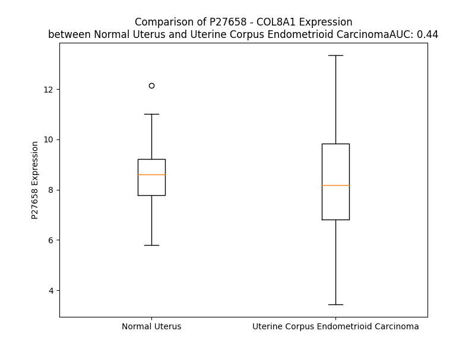

# Detailed Data for P27658

## Introduction to the Detailed Summary

### How to Interpret the Results

- **Summary & Metrics**: This section provides a quick reference to essential protein attributes, including expression changes, family classification, and biomarker applications. Regulation status (upregulated/downregulated) indicates the protein's behavior in a disease context. Some information comes from the original excel file with the proteins selected from literature, while others are derived from the analyses.
- **Expression Comparison**: A visual representation comparing protein expression between normal and disease states. It highlights significant changes in expression levels that might indicate diagnostic or therapeutic relevance. This is data coming from transcriptomics experiments and could not translate similarly to protein levels.
- **Isoform Alignment**: An interactive view of isoform alignments, revealing structural and functional differences between variants of the protein.
- **Interactors & Homologs**: Tables listing known interaction partners and homologous proteins, the more interactors and homologs, the more complex the protein is to design an antibody for.
- **Biological Assemblies**: Information about the structural arrangement of the protein in different assemblies, providing insights into its functional state but also the complexity of the protein to develop antibodies.
- **Combined Per-Residue Information**: A detailed table summarizing residue-level data. This includes predictions for epitope regions, aggregation tendencies, and modifications that might impact the protein's function. Each row corresponds to a residue in the protein, providing insights into specific sites that may be important for research or drug development.
## Summary & Metrics

- **UniProt Accession**: P27658
- **Gene Name**: COL8A1
- **Protein Name**: collagen 8
- **Swiss Prot**: CO8A1_HUMAN
- **Family**: other
- **Biomarker Application**:  
- **Number of Isoforms**: 0
- **Regulation**: 1
- **(transcriptomics) AUC**: 0.44
- **(transcriptomics) Fold Change**: 1.04
- **(transcriptomics) Regulation**: Downregulated
- **Discotope Epitope Count**: 210
- **Max n_uniprots (Homo)**: N/A
- **Max n_uniprots (Hetero)**: N/A

## Expression Comparison

## Interactors

| preferredName_A   | preferredName_B   |   score |
|:------------------|:------------------|--------:|
| COL8A1            | GP6               |   0.945 |
| COL8A1            | COL8A2            |   0.927 |

## Homologs

| uniprot_id   | gene_id   |
|:-------------|:----------|
| A0A499FIM1   | C1QTNF2   |
| Q86Z23       | C1QL4     |
| F8WC87       | C1QTNF6   |
| Q9BXJ4       | C1QTNF3   |
| Q7Z5L3       | C1QL2     |
| P60827       | C1QTNF8   |
| Q6IEG3       | PDCD7     |
| A0A8Q3SI02   | C1QA      |
| A0A8Q3WKR2   | C1QC      |
| O75973       | C1QL1     |
| A6NHN0       | OTOL1     |
| A0A024R3F8   | ADIE      |
| E9PP49       | COL8A2    |
| A0A650AXN9   | COL10A1   |
| P0C862       | C1QTNF9   |
| B2RNN3       | C1QTNF9B  |
| Q15848       | ADIPOQ    |
| Q9BXJ2       | C1QTNF7   |
| D6R934       | C1QB      |
| Q9BXJ3       | C1QTNF4   |
| A0A0C4DFP7   | C1QTNF1   |
| Q5JVU1       | COL19A1   |
| A0A3B0J0F3   | ADIJ      |

## Combined Per-Residue Information

|   res | aa   |   epitope_score | epitope   |   relative_surface_accessibility |   modeling_confidence |   Aggregation | modification   |
|------:|:-----|----------------:|:----------|---------------------------------:|----------------------:|--------------:|:---------------|
|     1 | M    |         0.06206 | False     |                          1.31138 |                 40.59 |         0     | N/A            |
|     2 | A    |         0.04468 | False     |                          0.89831 |                 33.7  |         0     | N/A            |
|     3 | V    |         0.04632 | False     |                          0.88816 |                 35.26 |         0     | N/A            |
|     4 | L    |         0.04342 | False     |                          1.01484 |                 41.9  |         0     | N/A            |
|     5 | P    |         0.06136 | False     |                          0.7939  |                 44.92 |         0     | N/A            |
|     6 | G    |         0.02925 | False     |                          0.47691 |                 41.23 |         0     | N/A            |
|     7 | P    |         0.03257 | False     |                          0.70665 |                 42.1  |         0.113 | N/A            |
|     8 | L    |         0.0291  | False     |                          0.61352 |                 38.04 |        11.182 | N/A            |
|     9 | Q    |         0.03284 | False     |                          0.75452 |                 45.23 |        13.201 | N/A            |
|    10 | L    |         0.0302  | False     |                          0.80008 |                 46.88 |        64.855 | N/A            |
|    11 | L    |         0.04673 | False     |                          0.94555 |                 46.19 |        74.195 | N/A            |
|    12 | G    |         0.02593 | False     |                          0.54504 |                 47.62 |        75.781 | N/A            |
|    13 | V    |         0.02107 | False     |                          0.73355 |                 49.11 |        92.648 | N/A            |
|    14 | L    |         0.04647 | False     |                          0.9283  |                 47.23 |        93.309 | N/A            |
|    15 | L    |         0.02946 | False     |                          0.70916 |                 46.17 |        92.584 | N/A            |
|    16 | T    |         0.04329 | False     |                          0.63667 |                 45.63 |        87.389 | N/A            |
|    17 | I    |         0.03953 | False     |                          0.76783 |                 46.94 |        84.234 | N/A            |
|    18 | S    |         0.0371  | False     |                          0.50946 |                 44.16 |        40.968 | N/A            |
|    19 | L    |         0.08443 | False     |                          0.85087 |                 41.67 |        35.523 | N/A            |
|    20 | S    |         0.06965 | False     |                          0.73133 |                 40.68 |         5.68  | N/A            |
|    21 | S    |         0.08478 | False     |                          0.73097 |                 45.95 |         1.984 | N/A            |
|    22 | I    |         0.0535  | False     |                          0.85441 |                 41.79 |         1.826 | N/A            |
|    23 | R    |         0.0683  | False     |                          0.95095 |                 36.51 |         0     | N/A            |
|    24 | L    |         0.05746 | False     |                          0.99382 |                 38.07 |         0     | N/A            |
|    25 | I    |         0.07743 | False     |                          0.87053 |                 40.35 |         0     | N/A            |
|    26 | Q    |         0.06616 | False     |                          0.9173  |                 32.44 |         0     | N/A            |
|    27 | A    |         0.04018 | False     |                          0.86072 |                 35.82 |         0     | N/A            |
|    28 | G    |         0.05249 | False     |                          0.92619 |                 32.27 |         0     | N/A            |
|    29 | A    |         0.03559 | False     |                          0.68059 |                 36.43 |         0.205 | N/A            |
|    30 | Y    |         0.07582 | False     |                          0.9977  |                 32.18 |         0.205 | N/A            |
|    31 | Y    |         0.09773 | False     |                          0.90876 |                 34.88 |         0.205 | N/A            |
|    32 | G    |         0.06556 | False     |                          0.68437 |                 35.67 |         0.205 | N/A            |
|    33 | I    |         0.06369 | False     |                          0.9647  |                 37.36 |         0.205 | N/A            |
|    34 | K    |         0.05224 | False     |                          0.8909  |                 35.71 |         0     | N/A            |
|    35 | P    |         0.05629 | False     |                          0.91577 |                 35.02 |         0     | N/A            |
|    36 | L    |         0.13086 | True      |                          1.01676 |                 37.76 |         0     | N/A            |
|    37 | P    |         0.07657 | False     |                          0.79256 |                 36.9  |         0     | N/A            |
|    38 | P    |         0.05101 | False     |                          0.94475 |                 32.59 |         0     | N/A            |
|    39 | Q    |         0.10544 | False     |                          0.85705 |                 38.95 |         0     | N/A            |
|    40 | I    |         0.07638 | False     |                          0.97391 |                 37.99 |         0     | N/A            |
|    41 | P    |         0.04744 | False     |                          0.88594 |                 34.77 |         0     | N/A            |
|    42 | P    |         0.06462 | False     |                          0.92241 |                 41.95 |         0     | N/A            |
|    43 | Q    |         0.05515 | False     |                          0.92327 |                 38.98 |         0     | N/A            |
|    44 | M    |         0.05846 | False     |                          0.98207 |                 36.74 |         0     | N/A            |
|    45 | P    |         0.07081 | False     |                          0.88367 |                 40.91 |         0     | N/A            |
|    46 | P    |         0.08267 | False     |                          0.77086 |                 40.91 |         0     | N/A            |
|    47 | Q    |         0.08805 | False     |                          0.7892  |                 36.38 |         0     | N/A            |
|    48 | I    |         0.11721 | True      |                          0.92596 |                 38.19 |         0     | N/A            |
|    49 | P    |         0.05388 | False     |                          0.85625 |                 36.69 |         0     | N/A            |
|    50 | Q    |         0.05713 | False     |                          0.76398 |                 30.33 |         0     | N/A            |
|    51 | Y    |         0.06646 | False     |                          1.02552 |                 33.81 |         0     | N/A            |
|    52 | Q    |         0.05717 | False     |                          0.80699 |                 35.87 |         0     | N/A            |
|    53 | P    |         0.0405  | False     |                          0.9447  |                 36.17 |         0     | N/A            |
|    54 | L    |         0.06261 | False     |                          1.1326  |                 35.4  |         0     | N/A            |
|    55 | G    |         0.05726 | False     |                          0.69285 |                 35.02 |         0     | N/A            |
|    56 | Q    |         0.06619 | False     |                          0.84658 |                 35.94 |         0     | N/A            |
|    57 | Q    |         0.05814 | False     |                          0.79362 |                 36.05 |         0     | N/A            |
|    58 | V    |         0.03612 | False     |                          0.98137 |                 36.32 |         0     | N/A            |
|    59 | P    |         0.05011 | False     |                          0.73267 |                 39.96 |         0     | N/A            |
|    60 | H    |         0.04143 | False     |                          0.79677 |                 39.28 |         0     | N/A            |
|    61 | M    |         0.08677 | False     |                          0.85881 |                 34.71 |         0     | N/A            |
|    62 | P    |         0.05542 | False     |                          0.75482 |                 39.9  |         0     | N/A            |
|    63 | L    |         0.06625 | False     |                          0.97132 |                 32.66 |         0     | N/A            |
|    64 | A    |         0.05384 | False     |                          0.97952 |                 34.94 |         0     | N/A            |
|    65 | K    |         0.05166 | False     |                          0.86784 |                 34.64 |         0     | N/A            |
|    66 | D    |         0.09944 | False     |                          0.93097 |                 37.46 |         0     | N/A            |
|    67 | G    |         0.0795  | False     |                          0.74383 |                 33.58 |         0     | N/A            |
|    68 | L    |         0.08377 | False     |                          1.12677 |                 32.91 |         0     | N/A            |
|    69 | A    |         0.06601 | False     |                          0.73668 |                 31.52 |         0     | N/A            |
|    70 | M    |         0.12438 | True      |                          1.07486 |                 31.03 |         0     | N/A            |
|    71 | G    |         0.06677 | False     |                          0.77919 |                 33.34 |         0     | N/A            |
|    72 | K    |         0.10461 | False     |                          0.93544 |                 34.06 |         0     | N/A            |
|    73 | E    |         0.06095 | False     |                          0.7467  |                 33.04 |         0     | N/A            |
|    74 | M    |         0.0547  | False     |                          0.93658 |                 32.15 |         0     | N/A            |
|    75 | P    |         0.08516 | False     |                          0.97054 |                 38.27 |         0     | N/A            |
|    76 | H    |         0.0559  | False     |                          0.8834  |                 29.51 |         0     | N/A            |
|    77 | L    |         0.07732 | False     |                          1.05959 |                 31.38 |         0     | N/A            |
|    78 | Q    |         0.07427 | False     |                          0.68053 |                 28.67 |         0     | N/A            |
|    79 | Y    |         0.10833 | False     |                          0.91462 |                 30.01 |         0     | N/A            |
|    80 | G    |         0.06216 | False     |                          0.85556 |                 34.5  |         0     | N/A            |
|    81 | K    |         0.04702 | False     |                          0.92813 |                 34.05 |         0     | N/A            |
|    82 | E    |         0.1025  | False     |                          0.90672 |                 33.99 |         0     | N/A            |
|    83 | Y    |         0.05457 | False     |                          0.74287 |                 40.12 |         0     | N/A            |
|    84 | P    |         0.07375 | False     |                          0.86014 |                 40.72 |         0     | N/A            |
|    85 | H    |         0.07179 | False     |                          0.83965 |                 37.71 |         0     | N/A            |
|    86 | L    |         0.09177 | False     |                          0.85866 |                 34.61 |         0     | N/A            |
|    87 | P    |         0.07721 | False     |                          0.85946 |                 34.25 |         0     | N/A            |
|    88 | Q    |         0.04298 | False     |                          0.76487 |                 30.96 |         0     | N/A            |
|    89 | Y    |         0.08426 | False     |                          1.03235 |                 32.96 |         0     | N/A            |
|    90 | M    |         0.06845 | False     |                          0.95418 |                 30.41 |         0     | N/A            |
|    91 | K    |         0.06491 | False     |                          0.84624 |                 36.81 |         0     | N/A            |
|    92 | E    |         0.09876 | False     |                          0.63426 |                 31.65 |         0     | N/A            |
|    93 | I    |         0.07254 | False     |                          1.05283 |                 36.54 |         0     | N/A            |
|    94 | Q    |         0.08053 | False     |                          0.83409 |                 32.43 |         0     | N/A            |
|    95 | P    |         0.06022 | False     |                          0.97977 |                 33.5  |         0     | N/A            |
|    96 | A    |         0.06069 | False     |                          0.93729 |                 39.12 |         0     | N/A            |
|    97 | P    |         0.05719 | False     |                          0.9853  |                 36.39 |         0     | N/A            |
|    98 | R    |         0.06554 | False     |                          0.98119 |                 33.1  |         0     | N/A            |
|    99 | M    |         0.06868 | False     |                          1.04402 |                 37.69 |         0     | N/A            |
|   100 | G    |         0.06466 | False     |                          0.87046 |                 36.95 |         0     | N/A            |
|   101 | K    |         0.03386 | False     |                          1.01141 |                 35.59 |         0     | N/A            |
|   102 | E    |         0.06052 | False     |                          0.93423 |                 36.86 |         0     | N/A            |
|   103 | A    |         0.05256 | False     |                          0.95739 |                 33.9  |         0     | N/A            |
|   104 | V    |         0.05231 | False     |                          1.04999 |                 39.4  |         0     | N/A            |
|   105 | P    |         0.03825 | False     |                          0.81897 |                 37.1  |         0     | N/A            |
|   106 | K    |         0.04619 | False     |                          0.98829 |                 35.56 |         0     | N/A            |
|   107 | K    |         0.04973 | False     |                          1.04758 |                 37.16 |         0     | N/A            |
|   108 | G    |         0.0485  | False     |                          0.86123 |                 33.64 |         0     | N/A            |
|   109 | K    |         0.06543 | False     |                          1.03523 |                 40.26 |         0     | N/A            |
|   110 | E    |         0.06573 | False     |                          0.82825 |                 36.8  |         0     | N/A            |
|   111 | I    |         0.06852 | False     |                          0.94341 |                 42.95 |         0     | N/A            |
|   112 | P    |         0.03321 | False     |                          0.88226 |                 37.86 |         0     | N/A            |
|   113 | L    |         0.04539 | False     |                          1.1315  |                 33.07 |         0     | N/A            |
|   114 | A    |         0.04057 | False     |                          0.86387 |                 37.33 |         0     | N/A            |
|   115 | S    |         0.03942 | False     |                          0.82312 |                 39.54 |         0     | N/A            |
|   116 | L    |         0.07157 | False     |                          1.14225 |                 44.63 |         0     | N/A            |
|   117 | R    |         0.11031 | True      |                          0.9689  |                 38.18 |         0     | N/A            |
|   118 | G    |         0.10137 | False     |                          0.85213 |                 43.62 |         0     | N/A            |
|   119 | E    |         0.11175 | True      |                          0.94408 |                 46.22 |         0     | N/A            |
|   120 | Q    |         0.09635 | False     |                          0.91976 |                 38.23 |         0     | N/A            |
|   121 | G    |         0.20042 | True      |                          0.67346 |                 49.74 |         0     | N/A            |
|   122 | P    |         0.15124 | True      |                          1.01969 |                 62.85 |         0     | N/A            |
|   123 | R    |         0.16518 | True      |                          0.94832 |                 56.45 |         0     | N/A            |
|   124 | G    |         0.1331  | True      |                          0.77446 |                 50.14 |         0     | N/A            |
|   125 | E    |         0.1882  | True      |                          0.85758 |                 64.79 |         0     | N/A            |
|   126 | P    |         0.14269 | True      |                          0.94555 |                 66    |         0     | N/A            |
|   127 | G    |         0.14569 | True      |                          0.7529  |                 57.7  |         0     | N/A            |
|   128 | P    |         0.13998 | True      |                          1.00359 |                 69.96 |         0     | N/A            |
|   129 | R    |         0.1298  | True      |                          0.95554 |                 66.57 |         0     | N/A            |
|   130 | G    |         0.14113 | True      |                          0.61918 |                 59.43 |         0     | N/A            |
|   131 | P    |         0.14355 | True      |                          0.92865 |                 68.48 |         0     | N/A            |
|   132 | P    |         0.1787  | True      |                          0.95289 |                 70.43 |         0     | N/A            |
|   133 | G    |         0.13222 | True      |                          0.72314 |                 58.03 |         0     | N/A            |
|   134 | P    |         0.09393 | False     |                          0.93089 |                 64.99 |         0     | N/A            |
|   135 | P    |         0.15253 | True      |                          0.94585 |                 64.57 |         0     | N/A            |
|   136 | G    |         0.10658 | False     |                          0.84514 |                 47.32 |         0     | N/A            |
|   137 | L    |         0.07053 | False     |                          1.07296 |                 57.76 |         0     | N/A            |
|   138 | P    |         0.08177 | False     |                          0.75789 |                 53.26 |         0     | N/A            |
|   139 | G    |         0.12069 | True      |                          0.9806  |                 47.2  |         0     | N/A            |
|   140 | H    |         0.12267 | True      |                          0.89222 |                 50.41 |         0     | N/A            |
|   141 | G    |         0.09449 | False     |                          0.893   |                 44.19 |         0     | N/A            |
|   142 | I    |         0.09467 | False     |                          0.96182 |                 50.39 |         0     | N/A            |
|   143 | P    |         0.09929 | False     |                          0.88853 |                 60.39 |         0     | N/A            |
|   144 | G    |         0.10844 | False     |                          0.93896 |                 44.48 |         0     | N/A            |
|   145 | I    |         0.09703 | False     |                          1.05341 |                 54.44 |         0     | N/A            |
|   146 | K    |         0.1062  | False     |                          0.99042 |                 55.62 |         0     | N/A            |
|   147 | G    |         0.07238 | False     |                          0.83978 |                 45.83 |         0     | N/A            |
|   148 | K    |         0.07594 | False     |                          0.95577 |                 52.19 |         0     | N/A            |
|   149 | P    |         0.11945 | True      |                          0.97594 |                 63.5  |         0     | N/A            |
|   150 | G    |         0.09976 | False     |                          0.7702  |                 46.77 |         0     | N/A            |
|   151 | P    |         0.08125 | False     |                          1.02398 |                 56.02 |         0     | N/A            |
|   152 | Q    |         0.09318 | False     |                          0.87969 |                 53.77 |         0     | N/A            |
|   153 | G    |         0.07178 | False     |                          0.80453 |                 45.6  |         0     | N/A            |
|   154 | Y    |         0.09673 | False     |                          0.96813 |                 51.34 |         0     | N/A            |
|   155 | P    |         0.05922 | False     |                          0.919   |                 55.57 |         0     | N/A            |
|   156 | G    |         0.07975 | False     |                          0.94424 |                 45.16 |         0     | N/A            |
|   157 | V    |         0.07655 | False     |                          1.08725 |                 54.39 |         0     | N/A            |
|   158 | G    |         0.05073 | False     |                          0.78486 |                 44.01 |         0     | N/A            |
|   159 | K    |         0.05893 | False     |                          0.99158 |                 49.38 |         0     | N/A            |
|   160 | P    |         0.06344 | False     |                          1.01597 |                 54.72 |         0     | N/A            |
|   161 | G    |         0.04158 | False     |                          0.82722 |                 42.01 |         0     | N/A            |
|   162 | M    |         0.04763 | False     |                          1.02375 |                 47.92 |         0     | N/A            |
|   163 | P    |         0.04182 | False     |                          0.99429 |                 52.05 |         0     | N/A            |
|   164 | G    |         0.08227 | False     |                          0.85153 |                 41.4  |         0     | N/A            |
|   165 | M    |         0.09379 | False     |                          1.00404 |                 49.56 |         0     | N/A            |
|   166 | P    |         0.04253 | False     |                          0.94441 |                 54.33 |         0     | N/A            |
|   167 | G    |         0.06674 | False     |                          0.88953 |                 45.99 |         0     | N/A            |
|   168 | K    |         0.0573  | False     |                          1.00445 |                 52.72 |         0     | N/A            |
|   169 | P    |         0.09375 | False     |                          1.01407 |                 47.44 |         0     | N/A            |
|   170 | G    |         0.11971 | True      |                          0.89276 |                 44.48 |         0     | N/A            |
|   171 | A    |         0.06078 | False     |                          1.0646  |                 50.97 |         0     | N/A            |
|   172 | M    |         0.10552 | False     |                          0.99332 |                 39.64 |         0     | N/A            |
|   173 | G    |         0.09426 | False     |                          0.80899 |                 43.96 |         0     | N/A            |
|   174 | M    |         0.07821 | False     |                          0.97684 |                 51.88 |         0     | N/A            |
|   175 | P    |         0.08786 | False     |                          0.97774 |                 55.77 |         0     | N/A            |
|   176 | G    |         0.10555 | False     |                          0.85801 |                 43.71 |         0     | N/A            |
|   177 | A    |         0.07725 | False     |                          1.03374 |                 50.52 |         0     | N/A            |
|   178 | K    |         0.09822 | False     |                          0.93524 |                 43.58 |         0     | N/A            |
|   179 | G    |         0.08649 | False     |                          0.78678 |                 45.29 |         0     | N/A            |
|   180 | E    |         0.07726 | False     |                          0.88204 |                 48.17 |         0     | N/A            |
|   181 | I    |         0.08835 | False     |                          0.97133 |                 46.03 |         0     | N/A            |
|   182 | G    |         0.10044 | False     |                          0.77614 |                 43.28 |         0     | N/A            |
|   183 | Q    |         0.10469 | False     |                          0.92154 |                 49.63 |         0     | N/A            |
|   184 | K    |         0.11193 | True      |                          0.89537 |                 48.9  |         0     | N/A            |
|   185 | G    |         0.09178 | False     |                          0.77513 |                 47.13 |         0     | N/A            |
|   186 | E    |         0.08206 | False     |                          0.89384 |                 50.9  |         0     | N/A            |
|   187 | I    |         0.09366 | False     |                          0.98558 |                 51.51 |         0     | N/A            |
|   188 | G    |         0.08446 | False     |                          0.62443 |                 46.75 |         0     | N/A            |
|   189 | P    |         0.11605 | True      |                          0.99283 |                 60.11 |         0     | N/A            |
|   190 | M    |         0.10159 | False     |                          0.93382 |                 49.92 |         0     | N/A            |
|   191 | G    |         0.07302 | False     |                          0.72416 |                 47.43 |         0     | N/A            |
|   192 | I    |         0.08895 | False     |                          0.98081 |                 56.9  |         0     | N/A            |
|   193 | P    |         0.15426 | True      |                          0.8212  |                 65.73 |         0     | N/A            |
|   194 | G    |         0.07737 | False     |                          0.72689 |                 58.3  |         0     | N/A            |
|   195 | P    |         0.11373 | True      |                          0.93398 |                 71.8  |         0     | N/A            |
|   196 | Q    |         0.1178  | True      |                          0.89062 |                 65.51 |         0     | N/A            |
|   197 | G    |         0.07958 | False     |                          0.46408 |                 59    |         0     | N/A            |
|   198 | P    |         0.15154 | True      |                          0.90741 |                 70.14 |         0     | N/A            |
|   199 | P    |         0.14732 | True      |                          0.96318 |                 72.54 |         0     | N/A            |
|   200 | G    |         0.07509 | False     |                          0.70999 |                 57.88 |         0     | N/A            |
|   201 | P    |         0.10014 | False     |                          0.99083 |                 68.88 |         0     | N/A            |
|   202 | H    |         0.08901 | False     |                          1.01615 |                 59.82 |         0     | N/A            |
|   203 | G    |         0.09294 | False     |                          0.79862 |                 45.06 |         0     | N/A            |
|   204 | L    |         0.07661 | False     |                          1.06838 |                 54.16 |         0     | N/A            |
|   205 | P    |         0.11873 | True      |                          0.88854 |                 54.25 |         0     | N/A            |
|   206 | G    |         0.10685 | False     |                          0.87666 |                 48.11 |         0     | N/A            |
|   207 | I    |         0.10217 | False     |                          1.01845 |                 54.66 |         0     | N/A            |
|   208 | G    |         0.15384 | True      |                          0.77013 |                 49.71 |         0     | N/A            |
|   209 | K    |         0.07282 | False     |                          0.94524 |                 52.66 |         0     | N/A            |
|   210 | P    |         0.10514 | False     |                          1.06039 |                 55.14 |         0     | N/A            |
|   211 | G    |         0.20303 | True      |                          0.83638 |                 46.45 |         0     | N/A            |
|   212 | G    |         0.2013  | True      |                          0.81606 |                 61.43 |         0     | N/A            |
|   213 | P    |         0.14533 | True      |                          1.07582 |                 58.21 |         0     | N/A            |
|   214 | G    |         0.11219 | True      |                          0.83756 |                 46.88 |         0     | N/A            |
|   215 | L    |         0.1183  | True      |                          1.04844 |                 53.6  |         0     | N/A            |
|   216 | P    |         0.14033 | True      |                          0.92251 |                 60.3  |         0     | N/A            |
|   217 | G    |         0.09297 | False     |                          0.87188 |                 45.91 |         0     | N/A            |
|   218 | Q    |         0.11507 | True      |                          0.86356 |                 59.04 |         0     | N/A            |
|   219 | P    |         0.11887 | True      |                          0.95782 |                 70.71 |         0     | N/A            |
|   220 | G    |         0.0955  | False     |                          0.74095 |                 48.29 |         0     | N/A            |
|   221 | P    |         0.12053 | True      |                          0.99819 |                 67.08 |         0     | N/A            |
|   222 | K    |         0.09584 | False     |                          0.97672 |                 63.67 |         0     | N/A            |
|   223 | G    |         0.08395 | False     |                          0.8216  |                 51.93 |         0     | N/A            |
|   224 | D    |         0.10677 | False     |                          0.89074 |                 65.05 |         0     | N/A            |
|   225 | R    |         0.11171 | True      |                          0.95452 |                 68.12 |         0     | N/A            |
|   226 | G    |         0.10549 | False     |                          0.65029 |                 53.24 |         0     | N/A            |
|   227 | P    |         0.1242  | True      |                          0.98868 |                 64.67 |         0     | N/A            |
|   228 | K    |         0.08168 | False     |                          0.98121 |                 65.95 |         0     | N/A            |
|   229 | G    |         0.07677 | False     |                          0.76726 |                 52.71 |         0     | N/A            |
|   230 | L    |         0.08218 | False     |                          1.03167 |                 60.86 |         0     | N/A            |
|   231 | P    |         0.16289 | True      |                          0.91015 |                 70.57 |         0     | N/A            |
|   232 | G    |         0.10063 | False     |                          0.72695 |                 52.5  |         0     | N/A            |
|   233 | P    |         0.11225 | True      |                          0.99463 |                 62.95 |         0     | N/A            |
|   234 | Q    |         0.07833 | False     |                          0.88944 |                 58.83 |         0     | N/A            |
|   235 | G    |         0.08211 | False     |                          0.78949 |                 47.17 |         0     | N/A            |
|   236 | L    |         0.09453 | False     |                          1.10394 |                 50.04 |         0     | N/A            |
|   237 | R    |         0.13014 | True      |                          0.93316 |                 63    |         0     | N/A            |
|   238 | G    |         0.08477 | False     |                          0.62081 |                 45.39 |         0     | N/A            |
|   239 | P    |         0.10824 | False     |                          1.01041 |                 57.39 |         0     | N/A            |
|   240 | K    |         0.07657 | False     |                          0.91184 |                 56.83 |         0     | N/A            |
|   241 | G    |         0.06278 | False     |                          0.82866 |                 49.79 |         0     | N/A            |
|   242 | D    |         0.0815  | False     |                          0.89452 |                 50.49 |         0     | N/A            |
|   243 | K    |         0.0682  | False     |                          0.97719 |                 47.85 |         0     | N/A            |
|   244 | G    |         0.23843 | True      |                          0.77243 |                 40.92 |         0     | N/A            |
|   245 | F    |         0.06577 | False     |                          1.09821 |                 42.99 |         0     | N/A            |
|   246 | G    |         0.06129 | False     |                          0.87679 |                 39.93 |         0     | N/A            |
|   247 | M    |         0.08044 | False     |                          1.01107 |                 44.1  |         0     | N/A            |
|   248 | P    |         0.05036 | False     |                          0.96015 |                 45.32 |         0     | N/A            |
|   249 | G    |         0.07704 | False     |                          0.94461 |                 33.82 |         0     | N/A            |
|   250 | A    |         0.04704 | False     |                          0.94753 |                 47.66 |         0     | N/A            |
|   251 | P    |         0.07154 | False     |                          1.06036 |                 45.74 |         0     | N/A            |
|   252 | G    |         0.07831 | False     |                          0.84893 |                 37.6  |         0     | N/A            |
|   253 | V    |         0.06686 | False     |                          1.1018  |                 45.58 |         0     | N/A            |
|   254 | K    |         0.08446 | False     |                          0.99485 |                 44.84 |         0     | N/A            |
|   255 | G    |         0.10942 | False     |                          0.67117 |                 43.99 |         0     | N/A            |
|   256 | P    |         0.18254 | True      |                          0.89818 |                 55.83 |         0     | N/A            |
|   257 | P    |         0.11388 | True      |                          0.94332 |                 61.08 |         0     | N/A            |
|   258 | G    |         0.10272 | False     |                          0.83812 |                 44.78 |         0     | N/A            |
|   259 | M    |         0.12715 | True      |                          1.00966 |                 52.63 |         0     | N/A            |
|   260 | H    |         0.11761 | True      |                          0.96577 |                 59.4  |         0     | N/A            |
|   261 | G    |         0.10251 | False     |                          0.71433 |                 51.6  |         0     | N/A            |
|   262 | P    |         0.18088 | True      |                          0.91443 |                 60.1  |         0     | N/A            |
|   263 | P    |         0.14559 | True      |                          0.93578 |                 66.1  |         0     | N/A            |
|   264 | G    |         0.12012 | True      |                          0.69341 |                 56.81 |         0     | N/A            |
|   265 | P    |         0.11928 | True      |                          0.99473 |                 62.83 |         0     | N/A            |
|   266 | V    |         0.08095 | False     |                          0.98914 |                 57.82 |         0     | N/A            |
|   267 | G    |         0.10087 | False     |                          0.74996 |                 45.51 |         0     | N/A            |
|   268 | L    |         0.09371 | False     |                          1.04474 |                 52.55 |         0     | N/A            |
|   269 | P    |         0.10001 | False     |                          0.87172 |                 55.22 |         0     | N/A            |
|   270 | G    |         0.07992 | False     |                          0.941   |                 46.9  |         0     | N/A            |
|   271 | V    |         0.07582 | False     |                          1.07215 |                 45.47 |         0     | N/A            |
|   272 | G    |         0.11867 | True      |                          0.75361 |                 49.03 |         0     | N/A            |
|   273 | K    |         0.09412 | False     |                          0.96426 |                 51.56 |         0     | N/A            |
|   274 | P    |         0.11208 | True      |                          1.00662 |                 51.23 |         0     | N/A            |
|   275 | G    |         0.05853 | False     |                          0.82435 |                 42.56 |         0     | N/A            |
|   276 | V    |         0.06336 | False     |                          1.14325 |                 47.39 |         0     | N/A            |
|   277 | T    |         0.08971 | False     |                          0.93225 |                 42.25 |         0     | N/A            |
|   278 | G    |         0.10396 | False     |                          0.77979 |                 45.22 |         0     | N/A            |
|   279 | F    |         0.09803 | False     |                          1.02617 |                 48.23 |         0     | N/A            |
|   280 | P    |         0.10229 | False     |                          0.93059 |                 55.1  |         0     | N/A            |
|   281 | G    |         0.14906 | True      |                          0.73925 |                 52.57 |         0     | N/A            |
|   282 | P    |         0.11826 | True      |                          1.0238  |                 56.94 |         0     | N/A            |
|   283 | Q    |         0.08511 | False     |                          0.91254 |                 50.03 |         0     | N/A            |
|   284 | G    |         0.10194 | False     |                          0.64669 |                 53.35 |         0     | N/A            |
|   285 | P    |         0.10636 | False     |                          1.00411 |                 55.48 |         0     | N/A            |
|   286 | L    |         0.10337 | False     |                          1.0774  |                 56.38 |         0     | N/A            |
|   287 | G    |         0.09706 | False     |                          0.76385 |                 47.48 |         0     | N/A            |
|   288 | K    |         0.11541 | True      |                          0.94622 |                 52.79 |         0     | N/A            |
|   289 | P    |         0.1304  | True      |                          0.9837  |                 61.09 |         0     | N/A            |
|   290 | G    |         0.1149  | True      |                          0.86041 |                 47.49 |         0     | N/A            |
|   291 | A    |         0.1158  | True      |                          0.91829 |                 48.44 |         0     | N/A            |
|   292 | P    |         0.09254 | False     |                          0.96102 |                 55.04 |         0     | N/A            |
|   293 | G    |         0.10442 | False     |                          0.87048 |                 49.69 |         0     | N/A            |
|   294 | E    |         0.13215 | True      |                          0.87394 |                 45    |         0     | N/A            |
|   295 | P    |         0.09624 | False     |                          0.9589  |                 50.23 |         0     | N/A            |
|   296 | G    |         0.13177 | True      |                          0.76523 |                 50.97 |         0     | N/A            |
|   297 | P    |         0.09569 | False     |                          1.00653 |                 51.5  |         0     | N/A            |
|   298 | Q    |         0.10401 | False     |                          0.90625 |                 50.45 |         0     | N/A            |
|   299 | G    |         0.10556 | False     |                          0.65198 |                 52.47 |         0     | N/A            |
|   300 | P    |         0.07881 | False     |                          0.98354 |                 56.83 |         0     | N/A            |
|   301 | I    |         0.10554 | False     |                          0.99175 |                 59.91 |         0     | N/A            |
|   302 | G    |         0.10892 | False     |                          0.80057 |                 44.16 |         0     | N/A            |
|   303 | V    |         0.08682 | False     |                          0.95158 |                 55.93 |         0     | N/A            |
|   304 | P    |         0.13056 | True      |                          0.90569 |                 57.9  |         0     | N/A            |
|   305 | G    |         0.11366 | True      |                          0.96378 |                 43.72 |         0     | N/A            |
|   306 | V    |         0.08676 | False     |                          1.03003 |                 50.56 |         0     | N/A            |
|   307 | Q    |         0.11873 | True      |                          0.86838 |                 52.28 |         0     | N/A            |
|   308 | G    |         0.13002 | True      |                          0.67143 |                 51.1  |         0     | N/A            |
|   309 | P    |         0.09038 | False     |                          0.92182 |                 54.91 |         0     | N/A            |
|   310 | P    |         0.14001 | True      |                          0.94334 |                 55.56 |         0     | N/A            |
|   311 | G    |         0.12514 | True      |                          0.87763 |                 43.14 |         0     | N/A            |
|   312 | I    |         0.0617  | False     |                          0.99554 |                 57.56 |         0     | N/A            |
|   313 | P    |         0.11585 | True      |                          0.82759 |                 48.2  |         0     | N/A            |
|   314 | G    |         0.13162 | True      |                          1.00365 |                 40.72 |         0     | N/A            |
|   315 | I    |         0.12977 | True      |                          0.89256 |                 53.87 |         0     | N/A            |
|   316 | G    |         0.15289 | True      |                          0.86595 |                 41.49 |         0     | N/A            |
|   317 | K    |         0.09106 | False     |                          0.91726 |                 52.35 |         0     | N/A            |
|   318 | P    |         0.13152 | True      |                          0.94241 |                 51.22 |         0     | N/A            |
|   319 | G    |         0.12177 | True      |                          0.94932 |                 41.13 |         0     | N/A            |
|   320 | Q    |         0.1192  | True      |                          0.93516 |                 50.27 |         0     | N/A            |
|   321 | D    |         0.13873 | True      |                          0.89454 |                 54.99 |         0     | N/A            |
|   322 | G    |         0.11588 | True      |                          0.86909 |                 42.21 |         0     | N/A            |
|   323 | I    |         0.07173 | False     |                          1.02148 |                 50.38 |         0     | N/A            |
|   324 | P    |         0.10991 | True      |                          0.89505 |                 53.67 |         0     | N/A            |
|   325 | G    |         0.09983 | False     |                          0.90773 |                 45    |         0     | N/A            |
|   326 | Q    |         0.07513 | False     |                          0.73677 |                 51.89 |         0     | N/A            |
|   327 | P    |         0.11301 | True      |                          0.93303 |                 59.57 |         0     | N/A            |
|   328 | G    |         0.11922 | True      |                          0.89091 |                 44.44 |         0     | N/A            |
|   329 | F    |         0.07598 | False     |                          1.01602 |                 55.15 |         0     | N/A            |
|   330 | P    |         0.10811 | False     |                          0.96465 |                 61.53 |         0     | N/A            |
|   331 | G    |         0.07912 | False     |                          0.9656  |                 47.68 |         0     | N/A            |
|   332 | G    |         0.10189 | False     |                          0.93988 |                 59.59 |         0     | N/A            |
|   333 | K    |         0.10839 | False     |                          1.00036 |                 57.47 |         0     | N/A            |
|   334 | G    |         0.08189 | False     |                          0.88305 |                 50.23 |         0     | N/A            |
|   335 | E    |         0.10454 | False     |                          0.89938 |                 56.69 |         0     | N/A            |
|   336 | Q    |         0.10392 | False     |                          0.87126 |                 62.78 |         0     | N/A            |
|   337 | G    |         0.1027  | False     |                          0.78701 |                 51.98 |         0     | N/A            |
|   338 | L    |         0.09862 | False     |                          1.04493 |                 62.91 |         0     | N/A            |
|   339 | P    |         0.13711 | True      |                          0.88754 |                 73.01 |         0     | N/A            |
|   340 | G    |         0.11659 | True      |                          0.8534  |                 56.92 |         0     | N/A            |
|   341 | L    |         0.08214 | False     |                          1.05372 |                 64.82 |         0     | N/A            |
|   342 | P    |         0.14317 | True      |                          0.90574 |                 74.67 |         0     | N/A            |
|   343 | G    |         0.13833 | True      |                          0.72375 |                 64.78 |         0     | N/A            |
|   344 | P    |         0.13042 | True      |                          0.92013 |                 71.03 |         0     | N/A            |
|   345 | P    |         0.1204  | True      |                          0.95306 |                 70.64 |         0     | N/A            |
|   346 | G    |         0.10366 | False     |                          0.85018 |                 53.27 |         0     | N/A            |
|   347 | L    |         0.07915 | False     |                          1.0473  |                 61.06 |         0     | N/A            |
|   348 | P    |         0.12655 | True      |                          0.87081 |                 60.49 |         0     | N/A            |
|   349 | G    |         0.09531 | False     |                          0.95257 |                 47.94 |         0     | N/A            |
|   350 | I    |         0.08528 | False     |                          0.92265 |                 50.75 |         0     | N/A            |
|   351 | G    |         0.19867 | True      |                          0.85008 |                 46.06 |         0     | N/A            |
|   352 | K    |         0.10779 | False     |                          0.78713 |                 50.9  |         0     | N/A            |
|   353 | P    |         0.13687 | True      |                          0.93826 |                 70.17 |         0     | N/A            |
|   354 | G    |         0.11267 | True      |                          0.89742 |                 40.9  |         0     | N/A            |
|   355 | F    |         0.10813 | False     |                          1.00782 |                 51.3  |         0     | N/A            |
|   356 | P    |         0.12985 | True      |                          0.93544 |                 71.41 |         0     | N/A            |
|   357 | G    |         0.12852 | True      |                          0.76894 |                 42.17 |         0     | N/A            |
|   358 | P    |         0.09064 | False     |                          1.01565 |                 66.12 |         0     | N/A            |
|   359 | K    |         0.11424 | True      |                          1.00201 |                 56.47 |         0     | N/A            |
|   360 | G    |         0.10867 | False     |                          0.85606 |                 45.84 |         0     | N/A            |
|   361 | D    |         0.10946 | False     |                          0.94046 |                 58.22 |         0     | N/A            |
|   362 | R    |         0.08342 | False     |                          0.95514 |                 49.12 |         0     | N/A            |
|   363 | G    |         0.08477 | False     |                          0.87682 |                 42.46 |         0     | N/A            |
|   364 | M    |         0.1424  | True      |                          1.0374  |                 48.69 |         0     | N/A            |
|   365 | G    |         0.10958 | True      |                          0.96376 |                 48.18 |         0     | N/A            |
|   366 | G    |         0.0803  | False     |                          0.93225 |                 41.16 |         0     | N/A            |
|   367 | V    |         0.06477 | False     |                          1.01071 |                 45.81 |         0     | N/A            |
|   368 | P    |         0.06423 | False     |                          0.98247 |                 50.69 |         0     | N/A            |
|   369 | G    |         0.05246 | False     |                          0.98404 |                 43.07 |         0     | N/A            |
|   370 | A    |         0.06747 | False     |                          1.02898 |                 51.97 |         0     | N/A            |
|   371 | L    |         0.11066 | True      |                          1.12681 |                 55.15 |         0     | N/A            |
|   372 | G    |         0.08311 | False     |                          0.70979 |                 41.53 |         0     | N/A            |
|   373 | P    |         0.10157 | False     |                          1.04499 |                 66.73 |         0     | N/A            |
|   374 | R    |         0.12524 | True      |                          0.95036 |                 60.23 |         0     | N/A            |
|   375 | G    |         0.05723 | False     |                          0.90465 |                 45.23 |         0     | N/A            |
|   376 | E    |         0.10284 | False     |                          0.92843 |                 60.33 |         0     | N/A            |
|   377 | K    |         0.11562 | True      |                          0.99764 |                 60.46 |         0     | N/A            |
|   378 | G    |         0.07279 | False     |                          0.74418 |                 44.85 |         0     | N/A            |
|   379 | P    |         0.15136 | True      |                          1.01558 |                 68.12 |         0     | N/A            |
|   380 | I    |         0.15072 | True      |                          1.04001 |                 63.02 |         0     | N/A            |
|   381 | G    |         0.07576 | False     |                          0.82977 |                 44.14 |         0     | N/A            |
|   382 | A    |         0.10149 | False     |                          0.90973 |                 63.55 |         0     | N/A            |
|   383 | P    |         0.09781 | False     |                          0.92801 |                 67.81 |         0     | N/A            |
|   384 | G    |         0.13743 | True      |                          0.9694  |                 51.65 |         0     | N/A            |
|   385 | I    |         0.14676 | True      |                          1.01983 |                 61.19 |         0     | N/A            |
|   386 | G    |         0.14854 | True      |                          0.84723 |                 58.64 |         0     | N/A            |
|   387 | G    |         0.15353 | True      |                          0.80408 |                 57.38 |         0     | N/A            |
|   388 | P    |         0.17972 | True      |                          0.91542 |                 65.39 |         0     | N/A            |
|   389 | P    |         0.10692 | False     |                          0.96297 |                 69.9  |         0     | N/A            |
|   390 | G    |         0.12544 | True      |                          0.90312 |                 58.3  |         0     | N/A            |
|   391 | E    |         0.11273 | True      |                          0.86871 |                 66.58 |         0     | N/A            |
|   392 | P    |         0.12298 | True      |                          0.94135 |                 68.81 |         0     | N/A            |
|   393 | G    |         0.13482 | True      |                          0.91326 |                 57.94 |         0     | N/A            |
|   394 | L    |         0.11694 | True      |                          1.05081 |                 61.91 |         0     | N/A            |
|   395 | P    |         0.11481 | True      |                          0.89195 |                 71.41 |         0     | N/A            |
|   396 | G    |         0.1398  | True      |                          0.8727  |                 56.44 |         0     | N/A            |
|   397 | I    |         0.09523 | False     |                          0.99001 |                 61.6  |         0     | N/A            |
|   398 | P    |         0.11594 | True      |                          0.88854 |                 69.51 |         0     | N/A            |
|   399 | G    |         0.13835 | True      |                          0.77701 |                 58.63 |         0     | N/A            |
|   400 | P    |         0.12523 | True      |                          1.01824 |                 62.07 |         0     | N/A            |
|   401 | M    |         0.12337 | True      |                          0.99522 |                 56.01 |         0     | N/A            |
|   402 | G    |         0.12152 | True      |                          0.66511 |                 52.15 |         0     | N/A            |
|   403 | P    |         0.1229  | True      |                          0.93422 |                 53.56 |         0     | N/A            |
|   404 | P    |         0.11726 | True      |                          0.99223 |                 49.91 |         0     | N/A            |
|   405 | G    |         0.10885 | False     |                          0.93892 |                 45.61 |         0     | N/A            |
|   406 | A    |         0.08723 | False     |                          0.99686 |                 45.71 |         0     | N/A            |
|   407 | I    |         0.09304 | False     |                          0.88068 |                 44.07 |         0     | N/A            |
|   408 | G    |         0.05403 | False     |                          0.35265 |                 45.74 |         0     | N/A            |
|   409 | F    |         0.03328 | False     |                          0.68293 |                 44.89 |         0     | N/A            |
|   410 | P    |         0.04239 | False     |                          0.32861 |                 49.16 |         0     | N/A            |
|   411 | G    |         0.04887 | False     |                          0.31126 |                 48.25 |         0     | N/A            |
|   412 | P    |         0.06845 | False     |                          0.9522  |                 47.65 |         0     | N/A            |
|   413 | K    |         0.07612 | False     |                          0.9571  |                 43.95 |         0     | N/A            |
|   414 | G    |         0.08836 | False     |                          0.88611 |                 41.65 |         0     | N/A            |
|   415 | E    |         0.14942 | True      |                          0.92007 |                 45    |         0     | N/A            |
|   416 | G    |         0.13558 | True      |                          0.89716 |                 43.76 |         0     | N/A            |
|   417 | G    |         0.10922 | False     |                          0.96345 |                 37.91 |         0     | N/A            |
|   418 | I    |         0.08854 | False     |                          1.04655 |                 43.26 |         0     | N/A            |
|   419 | V    |         0.10529 | False     |                          1.05406 |                 43.03 |         0     | N/A            |
|   420 | G    |         0.10365 | False     |                          0.66984 |                 53.22 |         0     | N/A            |
|   421 | P    |         0.10545 | False     |                          1.00427 |                 47.43 |         0     | N/A            |
|   422 | Q    |         0.08712 | False     |                          0.91788 |                 48.96 |         0     | N/A            |
|   423 | G    |         0.10817 | False     |                          0.66646 |                 59.46 |         0     | N/A            |
|   424 | P    |         0.15212 | True      |                          0.92735 |                 49.4  |         0     | N/A            |
|   425 | P    |         0.13451 | True      |                          0.98483 |                 57.61 |         0     | N/A            |
|   426 | G    |         0.10563 | False     |                          0.77267 |                 56.3  |         0     | N/A            |
|   427 | P    |         0.09649 | False     |                          1.01366 |                 50.85 |         0     | N/A            |
|   428 | K    |         0.08675 | False     |                          0.96857 |                 47.09 |         0     | N/A            |
|   429 | G    |         0.09623 | False     |                          0.8202  |                 44.68 |         0     | N/A            |
|   430 | E    |         0.12707 | True      |                          0.86287 |                 52.72 |         0     | N/A            |
|   431 | P    |         0.10603 | False     |                          0.93616 |                 46.64 |         0     | N/A            |
|   432 | G    |         0.08621 | False     |                          0.96301 |                 42.95 |         0     | N/A            |
|   433 | L    |         0.12573 | True      |                          1.12095 |                 45    |         0     | N/A            |
|   434 | Q    |         0.15235 | True      |                          0.85976 |                 46.26 |         0     | N/A            |
|   435 | G    |         0.08374 | False     |                          0.8805  |                 44.08 |         0     | N/A            |
|   436 | F    |         0.14932 | True      |                          1.02229 |                 49.88 |         0     | N/A            |
|   437 | P    |         0.11839 | True      |                          0.90889 |                 48.95 |         0     | N/A            |
|   438 | G    |         0.11608 | True      |                          0.95428 |                 44.26 |         0     | N/A            |
|   439 | K    |         0.12001 | True      |                          0.96349 |                 60.27 |         0     | N/A            |
|   440 | P    |         0.13554 | True      |                          0.9414  |                 47.91 |         0     | N/A            |
|   441 | G    |         0.08281 | False     |                          0.87353 |                 39.9  |         0     | N/A            |
|   442 | F    |         0.09321 | False     |                          1.06491 |                 54.51 |         0     | N/A            |
|   443 | L    |         0.16165 | True      |                          1.10619 |                 46.32 |         0     | N/A            |
|   444 | G    |         0.07677 | False     |                          0.80394 |                 40.69 |         0     | N/A            |
|   445 | E    |         0.09267 | False     |                          0.94738 |                 56.17 |         0     | N/A            |
|   446 | V    |         0.09868 | False     |                          1.07318 |                 47.27 |         0     | N/A            |
|   447 | G    |         0.12208 | True      |                          0.75463 |                 43.83 |         0     | N/A            |
|   448 | P    |         0.2166  | True      |                          0.92173 |                 65.47 |         0     | N/A            |
|   449 | P    |         0.11889 | True      |                          0.97656 |                 47.08 |         0     | N/A            |
|   450 | G    |         0.10381 | False     |                          0.99366 |                 40.57 |         0     | N/A            |
|   451 | M    |         0.12873 | True      |                          1.00745 |                 54.82 |         0     | N/A            |
|   452 | R    |         0.14558 | True      |                          0.94235 |                 53.5  |         0     | N/A            |
|   453 | G    |         0.13226 | True      |                          0.86007 |                 38.44 |         0     | N/A            |
|   454 | L    |         0.16221 | True      |                          1.03014 |                 54.48 |         0     | N/A            |
|   455 | P    |         0.11706 | True      |                          0.92387 |                 57.16 |         0     | N/A            |
|   456 | G    |         0.13484 | True      |                          0.77356 |                 52.06 |         0     | N/A            |
|   457 | P    |         0.15951 | True      |                          0.98199 |                 61.57 |         0     | N/A            |
|   458 | I    |         0.11847 | True      |                          1.03709 |                 57.6  |         0     | N/A            |
|   459 | G    |         0.12575 | True      |                          0.64011 |                 59.97 |         0     | N/A            |
|   460 | P    |         0.12756 | True      |                          0.97766 |                 62.73 |         0     | N/A            |
|   461 | K    |         0.11833 | True      |                          0.9834  |                 55.45 |         0     | N/A            |
|   462 | G    |         0.09022 | False     |                          0.80074 |                 54.02 |         0     | N/A            |
|   463 | E    |         0.12074 | True      |                          0.88968 |                 58.68 |         0     | N/A            |
|   464 | A    |         0.10718 | False     |                          0.96248 |                 51.76 |         0     | N/A            |
|   465 | G    |         0.0925  | False     |                          0.88146 |                 47.44 |         0     | N/A            |
|   466 | Q    |         0.13138 | True      |                          0.90443 |                 52.83 |         0     | N/A            |
|   467 | K    |         0.09224 | False     |                          0.96737 |                 53.51 |         0     | N/A            |
|   468 | G    |         0.15787 | True      |                          0.74058 |                 46.11 |         0     | N/A            |
|   469 | V    |         0.0931  | False     |                          0.98568 |                 50.12 |         0     | N/A            |
|   470 | P    |         0.11151 | True      |                          0.88071 |                 63.12 |         0     | N/A            |
|   471 | G    |         0.15281 | True      |                          0.83669 |                 49.32 |         0     | N/A            |
|   472 | L    |         0.12584 | True      |                          1.05165 |                 51.23 |         0     | N/A            |
|   473 | P    |         0.11367 | True      |                          0.93327 |                 61.67 |         0     | N/A            |
|   474 | G    |         0.17044 | True      |                          0.82778 |                 46.71 |         0     | N/A            |
|   475 | V    |         0.1041  | False     |                          1.00054 |                 50.01 |         0     | N/A            |
|   476 | P    |         0.1279  | True      |                          0.9251  |                 59.77 |         0     | N/A            |
|   477 | G    |         0.1369  | True      |                          0.85354 |                 44.54 |         0     | N/A            |
|   478 | L    |         0.14509 | True      |                          1.11723 |                 49.71 |         0     | N/A            |
|   479 | L    |         0.10756 | False     |                          1.09647 |                 48.85 |         0     | N/A            |
|   480 | G    |         0.14608 | True      |                          0.60329 |                 45.5  |         0     | N/A            |
|   481 | P    |         0.14576 | True      |                          1.00241 |                 52.33 |         0     | N/A            |
|   482 | K    |         0.07727 | False     |                          0.97975 |                 47    |         0     | N/A            |
|   483 | G    |         0.14503 | True      |                          0.75896 |                 44.06 |         0     | N/A            |
|   484 | E    |         0.14677 | True      |                          0.85567 |                 49.96 |         0     | N/A            |
|   485 | P    |         0.11851 | True      |                          0.97057 |                 51.1  |         0     | N/A            |
|   486 | G    |         0.15816 | True      |                          0.84845 |                 40.69 |         0     | N/A            |
|   487 | I    |         0.11939 | True      |                          0.97636 |                 50.33 |         0     | N/A            |
|   488 | P    |         0.12647 | True      |                          0.90306 |                 58.92 |         0     | N/A            |
|   489 | G    |         0.13258 | True      |                          0.88374 |                 46.79 |         0     | N/A            |
|   490 | D    |         0.14589 | True      |                          0.89428 |                 56.59 |         0     | N/A            |
|   491 | Q    |         0.10131 | False     |                          0.88714 |                 55.09 |         0     | N/A            |
|   492 | G    |         0.08869 | False     |                          0.83101 |                 46.07 |         0     | N/A            |
|   493 | L    |         0.14078 | True      |                          1.09238 |                 55.15 |         0     | N/A            |
|   494 | Q    |         0.15178 | True      |                          0.90687 |                 53.9  |         0     | N/A            |
|   495 | G    |         0.0881  | False     |                          0.6319  |                 57.06 |         0     | N/A            |
|   496 | P    |         0.15727 | True      |                          0.82435 |                 65.44 |         0     | N/A            |
|   497 | P    |         0.1758  | True      |                          0.9436  |                 66.2  |         0     | N/A            |
|   498 | G    |         0.10565 | False     |                          0.60515 |                 53.42 |         0     | N/A            |
|   499 | I    |         0.10645 | False     |                          0.94299 |                 58.59 |         0     | N/A            |
|   500 | P    |         0.11552 | True      |                          0.84367 |                 65.57 |         0     | N/A            |
|   501 | G    |         0.08937 | False     |                          0.8304  |                 44.59 |         0     | N/A            |
|   502 | I    |         0.16105 | True      |                          0.99084 |                 53.72 |         0     | N/A            |
|   503 | G    |         0.09304 | False     |                          0.80733 |                 55.71 |         0     | N/A            |
|   504 | G    |         0.0999  | False     |                          0.71639 |                 46.67 |         0     | N/A            |
|   505 | P    |         0.15477 | True      |                          1.00488 |                 60.65 |         0     | N/A            |
|   506 | S    |         0.09358 | False     |                          0.84491 |                 59.51 |         0     | N/A            |
|   507 | G    |         0.10873 | False     |                          0.66232 |                 51.49 |         0     | N/A            |
|   508 | P    |         0.15704 | True      |                          0.99554 |                 65.91 |         0     | N/A            |
|   509 | I    |         0.09768 | False     |                          1.02169 |                 63    |         0     | N/A            |
|   510 | G    |         0.09435 | False     |                          0.58419 |                 56.33 |         0     | N/A            |
|   511 | P    |         0.1345  | True      |                          0.93563 |                 68.1  |         0     | N/A            |
|   512 | P    |         0.12022 | True      |                          0.94602 |                 68.6  |         0     | N/A            |
|   513 | G    |         0.09904 | False     |                          0.81529 |                 52.88 |         0     | N/A            |
|   514 | I    |         0.10963 | True      |                          0.99141 |                 62.08 |         0     | N/A            |
|   515 | P    |         0.08685 | False     |                          0.89368 |                 71.16 |         0     | N/A            |
|   516 | G    |         0.13639 | True      |                          0.72011 |                 58.43 |         0     | N/A            |
|   517 | P    |         0.1169  | True      |                          1.00246 |                 72.92 |         0     | N/A            |
|   518 | K    |         0.06598 | False     |                          0.92346 |                 62.76 |         0     | N/A            |
|   519 | G    |         0.09828 | False     |                          0.74931 |                 55.18 |         0     | N/A            |
|   520 | E    |         0.06905 | False     |                          0.85357 |                 63.19 |         0     | N/A            |
|   521 | P    |         0.10907 | False     |                          0.89338 |                 67.35 |         0     | N/A            |
|   522 | G    |         0.09912 | False     |                          0.84261 |                 56.66 |         0     | N/A            |
|   523 | L    |         0.08517 | False     |                          1.0475  |                 64.19 |         0     | N/A            |
|   524 | P    |         0.08594 | False     |                          0.92852 |                 69.2  |         0     | N/A            |
|   525 | G    |         0.14025 | True      |                          0.7205  |                 63.1  |         0     | N/A            |
|   526 | P    |         0.13759 | True      |                          0.93483 |                 68.77 |         0     | N/A            |
|   527 | P    |         0.08243 | False     |                          0.97524 |                 67.5  |         0     | N/A            |
|   528 | G    |         0.11518 | True      |                          0.84032 |                 52.36 |         0     | N/A            |
|   529 | F    |         0.08534 | False     |                          1.04959 |                 54.84 |         0     | N/A            |
|   530 | P    |         0.06138 | False     |                          0.98098 |                 56.73 |         0     | N/A            |
|   531 | G    |         0.09638 | False     |                          0.91528 |                 48.56 |         0     | N/A            |
|   532 | I    |         0.11243 | True      |                          1.10923 |                 50.02 |         0     | N/A            |
|   533 | G    |         0.06183 | False     |                          0.76135 |                 46.33 |         0     | N/A            |
|   534 | K    |         0.07085 | False     |                          0.99784 |                 48.64 |         0     | N/A            |
|   535 | P    |         0.08005 | False     |                          1.05071 |                 51.07 |         0     | N/A            |
|   536 | G    |         0.12619 | True      |                          0.89242 |                 50.84 |         0     | N/A            |
|   537 | V    |         0.11616 | True      |                          1.12018 |                 52.6  |         0     | N/A            |
|   538 | A    |         0.10106 | False     |                          0.97439 |                 47.65 |         0     | N/A            |
|   539 | G    |         0.1174  | True      |                          0.90233 |                 47.63 |         0     | N/A            |
|   540 | L    |         0.13613 | True      |                          1.13297 |                 52.04 |         0     | N/A            |
|   541 | H    |         0.13379 | True      |                          1.03894 |                 49.51 |         0     | N/A            |
|   542 | G    |         0.11402 | True      |                          0.68701 |                 52.24 |         0     | N/A            |
|   543 | P    |         0.11114 | True      |                          0.91148 |                 62.98 |         0     | N/A            |
|   544 | P    |         0.11317 | True      |                          0.9553  |                 65.63 |         0     | N/A            |
|   545 | G    |         0.09019 | False     |                          0.85683 |                 47.3  |         0     | N/A            |
|   546 | K    |         0.09033 | False     |                          0.95615 |                 58.71 |         0     | N/A            |
|   547 | P    |         0.09115 | False     |                          0.94459 |                 67.12 |         0     | N/A            |
|   548 | G    |         0.11164 | True      |                          0.84153 |                 49.32 |         0     | N/A            |
|   549 | A    |         0.09083 | False     |                          0.99081 |                 59.81 |         0     | N/A            |
|   550 | L    |         0.09544 | False     |                          1.03406 |                 59.32 |         0     | N/A            |
|   551 | G    |         0.08089 | False     |                          0.60686 |                 52.09 |         0     | N/A            |
|   552 | P    |         0.10216 | False     |                          0.98366 |                 61.86 |         0     | N/A            |
|   553 | Q    |         0.08936 | False     |                          0.80019 |                 58.25 |         0     | N/A            |
|   554 | G    |         0.06052 | False     |                          0.74484 |                 45.59 |         0     | N/A            |
|   555 | Q    |         0.09015 | False     |                          0.86012 |                 57.42 |         0     | N/A            |
|   556 | P    |         0.08294 | False     |                          0.89528 |                 66.47 |         0     | N/A            |
|   557 | G    |         0.09431 | False     |                          0.82476 |                 48.31 |         0     | N/A            |
|   558 | L    |         0.06687 | False     |                          1.03249 |                 63.86 |         0     | N/A            |
|   559 | P    |         0.0868  | False     |                          0.89925 |                 72.29 |         0     | N/A            |
|   560 | G    |         0.12107 | True      |                          0.71727 |                 60.98 |         0     | N/A            |
|   561 | P    |         0.10883 | False     |                          0.90167 |                 70.06 |         0     | N/A            |
|   562 | P    |         0.08262 | False     |                          0.96378 |                 74.54 |         0     | N/A            |
|   563 | G    |         0.11054 | True      |                          0.71701 |                 66.21 |         0     | N/A            |
|   564 | P    |         0.11352 | True      |                          0.90654 |                 68.84 |         0     | N/A            |
|   565 | P    |         0.09868 | False     |                          0.93846 |                 74.35 |         0     | N/A            |
|   566 | G    |         0.10417 | False     |                          0.71098 |                 68.91 |         0     | N/A            |
|   567 | P    |         0.13488 | True      |                          0.90573 |                 69.86 |         0     | N/A            |
|   568 | P    |         0.1063  | False     |                          0.95916 |                 69.49 |         0     | N/A            |
|   569 | G    |         0.09191 | False     |                          0.69693 |                 62.52 |         0     | N/A            |
|   570 | P    |         0.08622 | False     |                          0.92142 |                 70.68 |         0     | N/A            |
|   571 | P    |         0.05779 | False     |                          0.88486 |                 58.55 |         0     | N/A            |
|   572 | A    |         0.05655 | False     |                          0.82423 |                 50.67 |         0     | N/A            |
|   573 | V    |         0.08721 | False     |                          0.82844 |                 55.65 |         0     | N/A            |
|   574 | M    |         0.09196 | False     |                          0.78803 |                 52.82 |         0     | N/A            |
|   575 | P    |         0.09121 | False     |                          0.81164 |                 59.68 |         0     | N/A            |
|   576 | P    |         0.09788 | False     |                          0.97572 |                 57.06 |         0     | N/A            |
|   577 | T    |         0.12964 | True      |                          0.78768 |                 54.5  |         0     | N/A            |
|   578 | P    |         0.07664 | False     |                          0.84977 |                 55.31 |         0     | N/A            |
|   579 | P    |         0.06937 | False     |                          0.89067 |                 48.66 |         0     | N/A            |
|   580 | P    |         0.08593 | False     |                          0.94826 |                 49.2  |         0     | N/A            |
|   581 | Q    |         0.11661 | True      |                          0.91921 |                 42.64 |         0     | N/A            |
|   582 | G    |         0.07114 | False     |                          0.81324 |                 38.88 |         0     | N/A            |
|   583 | E    |         0.0671  | False     |                          0.80123 |                 37.13 |         0     | N/A            |
|   584 | Y    |         0.0537  | False     |                          0.89623 |                 42.03 |         0     | N/A            |
|   585 | L    |         0.04947 | False     |                          1.04369 |                 35.76 |         0     | N/A            |
|   586 | P    |         0.06173 | False     |                          0.85556 |                 39.58 |         0     | N/A            |
|   587 | D    |         0.05807 | False     |                          0.80194 |                 35.64 |         0     | N/A            |
|   588 | M    |         0.0682  | False     |                          1.01008 |                 31.32 |         0     | N/A            |
|   589 | G    |         0.07408 | False     |                          0.80907 |                 30.88 |         0     | N/A            |
|   590 | L    |         0.05363 | False     |                          1.15379 |                 31    |         0     | N/A            |
|   591 | G    |         0.08972 | False     |                          0.87089 |                 30.99 |         0     | N/A            |
|   592 | I    |         0.05905 | False     |                          1.07066 |                 36.28 |         0     | N/A            |
|   593 | D    |         0.04978 | False     |                          0.77872 |                 34.4  |         0     | N/A            |
|   594 | G    |         0.0935  | False     |                          0.90968 |                 30.87 |         0     | N/A            |
|   595 | V    |         0.03777 | False     |                          0.97552 |                 35.47 |         0     | N/A            |
|   596 | K    |         0.0809  | False     |                          0.94482 |                 31.57 |         0     | N/A            |
|   597 | P    |         0.07186 | False     |                          0.61847 |                 40.95 |         0     | N/A            |
|   598 | P    |         0.08024 | False     |                          0.79136 |                 32.1  |         0     | N/A            |
|   599 | H    |         0.09045 | False     |                          0.88911 |                 41.03 |         0     | N/A            |
|   600 | A    |         0.1224  | True      |                          1.00256 |                 31.49 |         0     | N/A            |
|   601 | Y    |         0.10707 | False     |                          0.92599 |                 40.95 |         0     | N/A            |
|   602 | G    |         0.14239 | True      |                          1.02576 |                 34.33 |         0     | N/A            |
|   603 | A    |         0.07059 | False     |                          0.53074 |                 37.54 |         0     | N/A            |
|   604 | K    |         0.07775 | False     |                          0.96508 |                 43.31 |         0     | N/A            |
|   605 | K    |         0.12215 | True      |                          0.98427 |                 38.75 |         0     | N/A            |
|   606 | G    |         0.06458 | False     |                          0.44869 |                 39.41 |         0     | N/A            |
|   607 | K    |         0.10929 | False     |                          0.93413 |                 44.73 |         0     | N/A            |
|   608 | N    |         0.08216 | False     |                          0.86959 |                 41.54 |         0     | N/A            |
|   609 | G    |         0.12361 | True      |                          1.01958 |                 34.16 |         0     | N/A            |
|   610 | G    |         0.05202 | False     |                          0.47034 |                 35.67 |         0     | N/A            |
|   611 | P    |         0.04841 | False     |                          0.62469 |                 41.98 |         0     | N/A            |
|   612 | A    |         0.03567 | False     |                          0.46822 |                 50.97 |         0     | N/A            |
|   613 | Y    |         0.06815 | False     |                          0.61809 |                 63.4  |         0     | N/A            |
|   614 | E    |         0.05721 | False     |                          0.36997 |                 82.5  |         0     | N/A            |
|   615 | M    |         0.03579 | False     |                          0.59892 |                 89.6  |         0     | N/A            |
|   616 | P    |         0.01116 | False     |                          0.02783 |                 94.55 |         0     | N/A            |
|   617 | A    |         0.02601 | False     |                          0.1786  |                 97.43 |         0     | N/A            |
|   618 | F    |         0.00771 | False     |                          0.01659 |                 98.44 |         0     | N/A            |
|   619 | T    |         0.04113 | False     |                          0.26317 |                 98.52 |         0     | N/A            |
|   620 | A    |         0.00184 | False     |                          0       |                 98.33 |         0     | N/A            |
|   621 | E    |         0.02205 | False     |                          0.06877 |                 98.06 |         0     | N/A            |
|   622 | L    |         0.02244 | False     |                          0.05301 |                 97.89 |         0     | N/A            |
|   623 | T    |         0.13499 | True      |                          0.48234 |                 94.98 |         0     | N/A            |
|   624 | A    |         0.03318 | False     |                          0.52192 |                 94.61 |         0     | N/A            |
|   625 | P    |         0.05965 | False     |                          0.39647 |                 96.26 |         0     | N/A            |
|   626 | F    |         0.0757  | False     |                          0.56066 |                 96.64 |         0     | N/A            |
|   627 | P    |         0.01404 | False     |                          0.10892 |                 97.13 |         0     | N/A            |
|   628 | P    |         0.05319 | False     |                          0.6142  |                 96.73 |         0     | N/A            |
|   629 | V    |         0.0324  | False     |                          0.29272 |                 97.19 |         0     | N/A            |
|   630 | G    |         0.067   | False     |                          0.62642 |                 96.3  |         0     | N/A            |
|   631 | A    |         0.0322  | False     |                          0.31248 |                 96.93 |         0     | N/A            |
|   632 | P    |         0.01675 | False     |                          0.23158 |                 98.13 |         0     | N/A            |
|   633 | V    |         0.00167 | False     |                          0.0007  |                 98.24 |         0     | N/A            |
|   634 | K    |         0.06305 | False     |                          0.49182 |                 97.96 |         0     | N/A            |
|   635 | F    |         0.00248 | False     |                          0       |                 98.06 |         0     | N/A            |
|   636 | N    |         0.09178 | False     |                          0.47176 |                 95.71 |         0     | N/A            |
|   637 | K    |         0.12146 | True      |                          0.43807 |                 96.68 |         0     | N/A            |
|   638 | L    |         0.05014 | False     |                          0.45767 |                 97.48 |         0     | N/A            |
|   639 | L    |         0.09937 | False     |                          0.62081 |                 96.99 |         0     | N/A            |
|   640 | Y    |         0.05266 | False     |                          0.41542 |                 97.47 |         0     | N/A            |
|   641 | N    |         0.05261 | False     |                          0.12033 |                 96.58 |         0     | N/A            |
|   642 | G    |         0.04305 | False     |                          0.4457  |                 92.83 |         0     | N/A            |
|   643 | R    |         0.04541 | False     |                          0.34661 |                 93.54 |         0     | N/A            |
|   644 | Q    |         0.12979 | True      |                          0.74214 |                 95.52 |         0     | N/A            |
|   645 | N    |         0.02793 | False     |                          0.04932 |                 96.06 |         0     | N/A            |
|   646 | Y    |         0.01675 | False     |                          0.0054  |                 98.39 |         0     | N/A            |
|   647 | N    |         0.02841 | False     |                          0.38936 |                 97.93 |         0     | N/A            |
|   648 | P    |         0.05227 | False     |                          0.28632 |                 97.15 |         0     | N/A            |
|   649 | Q    |         0.08086 | False     |                          0.71655 |                 96.78 |         0     | N/A            |
|   650 | T    |         0.04302 | False     |                          0.40315 |                 97.48 |         0     | N/A            |
|   651 | G    |         0.00225 | False     |                          0.00119 |                 97.93 |         0     | N/A            |
|   652 | I    |         0.02821 | False     |                          0.08914 |                 98.51 |         0     | N/A            |
|   653 | F    |         0.00338 | False     |                          0       |                 98.62 |         0     | N/A            |
|   654 | T    |         0.02437 | False     |                          0.41462 |                 98.37 |         0     | N/A            |
|   655 | C    |         0.01162 | False     |                          0.01777 |                 97.94 |         0     | N/A            |
|   656 | E    |         0.0346  | False     |                          0.45669 |                 95.85 |         0     | N/A            |
|   657 | V    |         0.02548 | False     |                          0.29609 |                 96.11 |         0     | N/A            |
|   658 | P    |         0.03397 | False     |                          0.34892 |                 97.2  |         0     | N/A            |
|   659 | G    |         0.0028  | False     |                          0.00138 |                 97.33 |         7.733 | N/A            |
|   660 | V    |         0.02064 | False     |                          0.22183 |                 98.32 |        82.762 | N/A            |
|   661 | Y    |         0.00516 | False     |                          0       |                 98.49 |        88.355 | N/A            |
|   662 | Y    |         0.03912 | False     |                          0.30104 |                 98.66 |        88.93  | N/A            |
|   663 | F    |         0.00258 | False     |                          0       |                 98.75 |        88.989 | N/A            |
|   664 | A    |         0.01675 | False     |                          0.14587 |                 98.64 |        88.008 | N/A            |
|   665 | Y    |         0.00216 | False     |                          0.00162 |                 98.67 |        77.963 | N/A            |
|   666 | H    |         0.05149 | False     |                          0.48278 |                 98.41 |        40.629 | N/A            |
|   667 | V    |         0.00126 | False     |                          0       |                 97.99 |        37.611 | N/A            |
|   668 | H    |         0.03353 | False     |                          0.19029 |                 97.85 |         0.761 | N/A            |
|   669 | C    |         0.00244 | False     |                          0       |                 96.17 |         0.559 | N/A            |
|   670 | K    |         0.08069 | False     |                          0.38909 |                 95.49 |         0     | N/A            |
|   671 | G    |         0.07174 | False     |                          0.66992 |                 93.07 |         0     | N/A            |
|   672 | G    |         0.08757 | False     |                          0.35    |                 94.14 |         0.094 | N/A            |
|   673 | N    |         0.0218  | False     |                          0.27292 |                 96.74 |         3.314 | N/A            |
|   674 | V    |         0.00123 | False     |                          0.00286 |                 97.4  |        82.947 | N/A            |
|   675 | W    |         0.08534 | False     |                          0.36076 |                 97.91 |        89.207 | N/A            |
|   676 | V    |         0.00138 | False     |                          0.00095 |                 98.09 |        89.207 | N/A            |
|   677 | A    |         0.00439 | False     |                          0       |                 98.24 |        89.207 | N/A            |
|   678 | L    |         0.00251 | False     |                          0       |                 98.72 |        89.09  | N/A            |
|   679 | F    |         0.02875 | False     |                          0.10191 |                 98.54 |        82.85  | N/A            |
|   680 | K    |         0.0183  | False     |                          0.21921 |                 98.5  |         0     | N/A            |
|   681 | N    |         0.03449 | False     |                          0.473   |                 97.59 |         0     | N/A            |
|   682 | N    |         0.06026 | False     |                          0.65226 |                 96.09 |         0     | N/A            |
|   683 | E    |         0.03169 | False     |                          0.64474 |                 97.32 |         0     | N/A            |
|   684 | P    |         0.04869 | False     |                          0.43248 |                 97.26 |         0     | N/A            |
|   685 | V    |         0.0241  | False     |                          0.44782 |                 97.59 |         0.255 | N/A            |
|   686 | M    |         0.01319 | False     |                          0.32836 |                 98.02 |         0.255 | N/A            |
|   687 | Y    |         0.05769 | False     |                          0.53368 |                 98.04 |         0.255 | N/A            |
|   688 | T    |         0.03042 | False     |                          0.13528 |                 98.24 |         0.255 | N/A            |
|   689 | Y    |         0.08218 | False     |                          0.53224 |                 97.64 |         0.255 | N/A            |
|   690 | D    |         0.01286 | False     |                          0.17694 |                 97.2  |         0     | N/A            |
|   691 | E    |         0.05239 | False     |                          0.49546 |                 96    |         0     | N/A            |
|   692 | Y    |         0.07467 | False     |                          0.23584 |                 94.9  |         0     | N/A            |
|   693 | K    |         0.05236 | False     |                          0.63715 |                 92.72 |         0     | N/A            |
|   694 | K    |         0.06891 | False     |                          0.92598 |                 91.82 |         0     | N/A            |
|   695 | G    |         0.04891 | False     |                          0.81177 |                 90.87 |         0     | N/A            |
|   696 | F    |         0.08225 | False     |                          0.61643 |                 93.09 |         0     | N/A            |
|   697 | L    |         0.07773 | False     |                          0.51458 |                 94    |         0     | N/A            |
|   698 | D    |         0.01767 | False     |                          0.29464 |                 95.86 |         0     | N/A            |
|   699 | Q    |         0.06058 | False     |                          0.41779 |                 96.44 |         0     | N/A            |
|   700 | A    |         0.01538 | False     |                          0.07908 |                 96.55 |         0.213 | N/A            |
|   701 | S    |         0.09713 | False     |                          0.4462  |                 98.04 |         0.213 | N/A            |
|   702 | G    |         0.01303 | False     |                          0.15625 |                 97.84 |         0.484 | N/A            |
|   703 | S    |         0.03034 | False     |                          0.3952  |                 98.21 |         4.061 | N/A            |
|   704 | A    |         0.00907 | False     |                          0.10458 |                 98    |        28.426 | N/A            |
|   705 | V    |         0.05974 | False     |                          0.62413 |                 98.43 |        28.426 | N/A            |
|   706 | L    |         0.01557 | False     |                          0.12613 |                 98.19 |        28.426 | N/A            |
|   707 | L    |         0.03649 | False     |                          0.59427 |                 98.14 |        28.426 | N/A            |
|   708 | L    |         0.00759 | False     |                          0.01036 |                 98.32 |        27.87  | N/A            |
|   709 | R    |         0.03756 | False     |                          0.68411 |                 97.77 |         0     | N/A            |
|   710 | P    |         0.03507 | False     |                          0.65398 |                 97.13 |         0     | N/A            |
|   711 | G    |         0.04186 | False     |                          0.56244 |                 97.08 |         0     | N/A            |
|   712 | D    |         0.03038 | False     |                          0.08287 |                 98.4  |         0     | N/A            |
|   713 | R    |         0.06593 | False     |                          0.42302 |                 98.48 |         0     | N/A            |
|   714 | V    |         0.00113 | False     |                          0       |                 98.74 |         0     | N/A            |
|   715 | F    |         0.02485 | False     |                          0.03694 |                 98.66 |         0     | N/A            |
|   716 | L    |         0.00166 | False     |                          0.00071 |                 98.49 |         0     | N/A            |
|   717 | Q    |         0.03858 | False     |                          0.14227 |                 98.21 |         0     | N/A            |
|   718 | M    |         0.00848 | False     |                          0       |                 97.57 |         0     | N/A            |
|   719 | P    |         0.05601 | False     |                          0.35658 |                 96.13 |         0     | N/A            |
|   720 | S    |         0.03587 | False     |                          0.20728 |                 95.6  |         0     | N/A            |
|   721 | E    |         0.11153 | True      |                          0.75178 |                 94.46 |         0     | N/A            |
|   722 | Q    |         0.09151 | False     |                          0.71362 |                 94.04 |         0     | N/A            |
|   723 | A    |         0.0223  | False     |                          0.05357 |                 95.47 |         0     | N/A            |
|   724 | A    |         0.05238 | False     |                          0.26024 |                 96.4  |         0     | N/A            |
|   725 | G    |         0.01193 | False     |                          0.0428  |                 96.97 |         0     | N/A            |
|   726 | L    |         0.00254 | False     |                          0       |                 97.78 |         0.131 | N/A            |
|   727 | Y    |         0.06554 | False     |                          0.17641 |                 97.62 |         0.131 | N/A            |
|   728 | A    |         0.00253 | False     |                          0.00566 |                 96.92 |         0.131 | N/A            |
|   729 | G    |         0.03165 | False     |                          0.21102 |                 93.19 |         0.131 | N/A            |
|   730 | Q    |         0.0762  | False     |                          0.73079 |                 91.52 |         0.131 | N/A            |
|   731 | Y    |         0.09426 | False     |                          0.80966 |                 92.92 |         0.131 | N/A            |
|   732 | V    |         0.02842 | False     |                          0.24278 |                 94.65 |         0.131 | N/A            |
|   733 | H    |         0.04497 | False     |                          0.39454 |                 94.78 |         0     | N/A            |
|   734 | S    |         0.00505 | False     |                          0       |                 98.12 |         0     | N/A            |
|   735 | S    |         0.02655 | False     |                          0.13631 |                 98.43 |         0     | N/A            |
|   736 | F    |         0.00189 | False     |                          0.00137 |                 98.69 |         0.962 | N/A            |
|   737 | S    |         0.03339 | False     |                          0.20544 |                 98.68 |         0.962 | N/A            |
|   738 | G    |         0.00239 | False     |                          0.00679 |                 98.51 |         0.962 | N/A            |
|   739 | Y    |         0.04593 | False     |                          0.42028 |                 98.01 |         0.962 | N/A            |
|   740 | L    |         0.0193  | False     |                          0.07128 |                 97.79 |         0.962 | N/A            |
|   741 | L    |         0.05846 | False     |                          0.38365 |                 96.9  |         0.813 | N/A            |
|   742 | Y    |         0.08147 | False     |                          0.6411  |                 95.14 |         0     | N/A            |
|   743 | P    |         0.10328 | False     |                          0.59168 |                 94.8  |         0     | N/A            |
|   744 | M    |         0.059   | False     |                          0.85686 |                 89.56 |         0     | N/A            |

