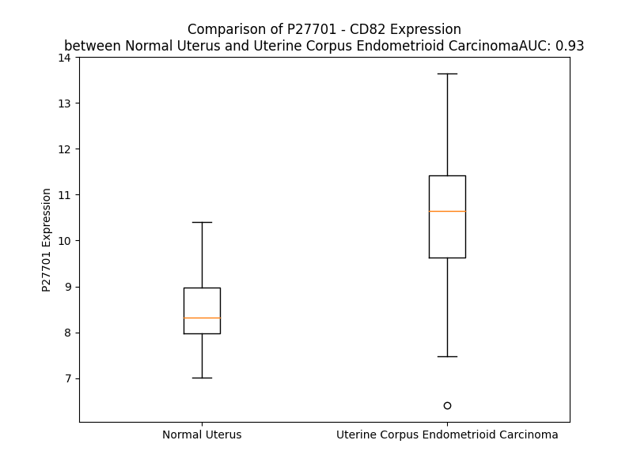

# Detailed Data for P27701

## Introduction to the Detailed Summary

### How to Interpret the Results

- **Summary & Metrics**: This section provides a quick reference to essential protein attributes, including expression changes, family classification, and biomarker applications. Regulation status (upregulated/downregulated) indicates the protein's behavior in a disease context. Some information comes from the original excel file with the proteins selected from literature, while others are derived from the analyses.
- **Expression Comparison**: A visual representation comparing protein expression between normal and disease states. It highlights significant changes in expression levels that might indicate diagnostic or therapeutic relevance. This is data coming from transcriptomics experiments and could not translate similarly to protein levels.
- **Isoform Alignment**: An interactive view of isoform alignments, revealing structural and functional differences between variants of the protein.
- **Interactors & Homologs**: Tables listing known interaction partners and homologous proteins, the more interactors and homologs, the more complex the protein is to design an antibody for.
- **Biological Assemblies**: Information about the structural arrangement of the protein in different assemblies, providing insights into its functional state but also the complexity of the protein to develop antibodies.
- **Combined Per-Residue Information**: A detailed table summarizing residue-level data. This includes predictions for epitope regions, aggregation tendencies, and modifications that might impact the protein's function. Each row corresponds to a residue in the protein, providing insights into specific sites that may be important for research or drug development.
## Summary & Metrics

- **UniProt Accession**: P27701
- **Gene Name**: CD82
- **Protein Name**: CD82 antigen / Kangai-1
- **Swiss Prot**: CD82_HUMAN
- **Family**: other
- **Biomarker Application**:  
- **Number of Isoforms**: 2
- **Regulation**: -1
- **(transcriptomics) AUC**: 0.93
- **(transcriptomics) Fold Change**: 1.25
- **(transcriptomics) Regulation**: Upregulated
- **Discotope Epitope Count**: 50
- **Max n_uniprots (Homo)**: N/A
- **Max n_uniprots (Hetero)**: N/A

## Expression Comparison

## Isoform Alignment

<pre style='font-size:14px; font-family:monospace;'>P27701-1 MGSACIKVTKYFLFLFNLIFFILGAVILGFGVWILADKSSFISVLQTSSSSLRMGAYVFIGVGAVTMLMGFLGCIGAVNEVRCLLGLYFAFLLLILIAQVTAGALFYFNMGKLKQEMGGIVTELIRDYNSSREDSLQDAWDYVQAQVKCCGWVSFYNWTDNAELMNRPEVTYPCSCEVKGEEDNSLSVRKGFCEAPGNRTQSGNHPEDWPVYQEGCMEKVQAWLQENLGIILGVGVGVAIIELLGMVLSICLCRHVHSEDYSKVPKY
P27701-2 MGSACIKVTKYFLFLFNLIFFILGAVILGFGVWILADKSSFISVLQTSSSSLRMGAYVFIGVGAVTMLMGFLGCIGAVNEVRCLLGL-------------------------LKQEMGGIVTELIRDYNSSREDSLQDAWDYVQAQVKCCGWVSFYNWTDNAELMNRPEVTYPCSCEVKGEEDNSLSVRKGFCEAPGNRTQSGNHPEDWPVYQEGCMEKVQAWLQENLGIILGVGVGVAIIELLGMVLSICLCRHVHSEDYSKVPKY
</pre>

## Interactors

| preferredName_A   | preferredName_B   |   score |
|:------------------|:------------------|--------:|
| CD82              | CD63              |   0.987 |
| CD82              | B4E171_HUMAN      |   0.986 |
| CD82              | CD81              |   0.984 |
| CD82              | CD9               |   0.983 |
| CD82              | ACKR1             |   0.973 |
| CD82              | CD4               |   0.968 |
| CD82              | VANGL1            |   0.936 |
| CD82              | CD8A              |   0.913 |

## Homologs

| uniprot_id   | gene_id   |
|:-------------|:----------|
| E9PLZ6       | CD151     |
| B5MD23       | TSPAN9    |
| A1L157       | TSPAN11   |
| F8VV56       | CD63      |
| E9PS24       | ROM1      |
| D6RBT5       | TSPAN5    |
| K7EMI8       | TSPAN16   |
| O60635       | TSPAN1    |
| H0YKJ9       | TSPAN3    |
| F8WC96       | TSPAN7    |
| O00322       | UPK1A     |
| E7ETN9       | UPK1B     |
| H7BXY6       | TSPAN14   |
| O60636       | TSPAN2    |
| M0R083       | CD37      |
| P19397       | CD53      |
| O43657       | TSPAN6    |
| P23942       | PRPH2     |
| A0A7I2V3T0   | CD9       |
| E9PPX8       | TSPAN4    |
| Q6FGK0       | TM4SF13   |
| Q86UF1       | TSPAN33   |
| A6NMH8       | CD81      |
| O95858       | TSPAN15   |
| P19075       | TSPAN8    |
| F8VZ36       | TSPAN19   |
| A0A087X235   | TSPAN10   |
| Q12999       | TSPAN31   |
| D6RDX8       | TSPAN17   |
| Q96SJ8       | TSPAN18   |
| G3XAG6       | TSPAN32   |
| O95859       | TSPAN12   |

## Combined Per-Residue Information

|   res | aa   |   epitope_score | epitope   |   relative_surface_accessibility |   modeling_confidence |   Aggregation | modification   | glycosylation                   |
|------:|:-----|----------------:|:----------|---------------------------------:|----------------------:|--------------:|:---------------|:--------------------------------|
|     1 | M    |         0.13007 | False     |                          1.23546 |                 51.59 |         0     | N/A            | N/A                             |
|     2 | G    |         0.19815 | False     |                          0.54754 |                 72.27 |         0     | N/A            | N/A                             |
|     3 | S    |         0.21813 | False     |                          0.63451 |                 75.42 |         0     | N/A            | N/A                             |
|     4 | A    |         0.13869 | False     |                          0.65611 |                 78.58 |         0     | N/A            | N/A                             |
|     5 | C    |         0.10668 | False     |                          0.60655 |                 81.48 |         0     | N/A            | N/A                             |
|     6 | I    |         0.17665 | False     |                          0.26239 |                 81.23 |         0     | N/A            | N/A                             |
|     7 | K    |         0.17265 | False     |                          0.63531 |                 84.91 |         0     | N/A            | N/A                             |
|     8 | V    |         0.10699 | False     |                          0.72029 |                 87.03 |         0     | N/A            | N/A                             |
|     9 | T    |         0.06225 | False     |                          0.12796 |                 86.57 |         0     | N/A            | N/A                             |
|    10 | K    |         0.09918 | False     |                          0.23181 |                 89.53 |         0     | N/A            | N/A                             |
|    11 | Y    |         0.12776 | False     |                          0.68302 |                 89.82 |        63.264 | N/A            | N/A                             |
|    12 | F    |         0.09547 | False     |                          0.51558 |                 90.41 |        83.552 | N/A            | N/A                             |
|    13 | L    |         0.00955 | False     |                          0.00907 |                 91.32 |        91.657 | N/A            | N/A                             |
|    14 | F    |         0.12265 | False     |                          0.32985 |                 93.34 |        93.217 | N/A            | N/A                             |
|    15 | L    |         0.1718  | False     |                          0.6125  |                 93.18 |        93.404 | N/A            | N/A                             |
|    16 | F    |         0.05559 | False     |                          0.22422 |                 91.62 |        93.482 | N/A            | N/A                             |
|    17 | N    |         0.03881 | False     |                          0.0176  |                 93.78 |        93.529 | N/A            | N/A                             |
|    18 | L    |         0.12983 | False     |                          0.36354 |                 95.16 |        96.76  | N/A            | N/A                             |
|    19 | I    |         0.23612 | False     |                          0.49038 |                 94.72 |        99.706 | N/A            | N/A                             |
|    20 | F    |         0.05364 | False     |                          0.30176 |                 93.86 |        99.975 | N/A            | N/A                             |
|    21 | F    |         0.07849 | False     |                          0.26793 |                 96.71 |        99.995 | N/A            | N/A                             |
|    22 | I    |         0.2109  | False     |                          0.54398 |                 97.21 |        99.975 | N/A            | N/A                             |
|    23 | L    |         0.17661 | False     |                          0.53418 |                 96.38 |        99.731 | N/A            | N/A                             |
|    24 | G    |         0.00342 | False     |                          0       |                 97.21 |        98.402 | N/A            | N/A                             |
|    25 | A    |         0.15568 | False     |                          0.3282  |                 97.61 |        98.282 | N/A            | N/A                             |
|    26 | V    |         0.24546 | False     |                          0.52127 |                 97.39 |        98.181 | N/A            | N/A                             |
|    27 | I    |         0.09059 | False     |                          0.35278 |                 96.6  |        96.99  | N/A            | N/A                             |
|    28 | L    |         0.1534  | False     |                          0.29842 |                 96.62 |        83.97  | N/A            | N/A                             |
|    29 | G    |         0.17229 | False     |                          0.38674 |                 95.38 |        12.869 | N/A            | N/A                             |
|    30 | F    |         0.14666 | False     |                          0.58217 |                 92.5  |        11.116 | N/A            | N/A                             |
|    31 | G    |         0.00543 | False     |                          0       |                 92.37 |         6.642 | N/A            | N/A                             |
|    32 | V    |         0.14633 | False     |                          0.50505 |                 92.95 |         6.572 | N/A            | N/A                             |
|    33 | W    |         0.21147 | False     |                          0.66    |                 90.63 |         6.474 | N/A            | N/A                             |
|    34 | I    |         0.10136 | False     |                          0.09913 |                 85.91 |         6.313 | N/A            | N/A                             |
|    35 | L    |         0.19087 | False     |                          0.25302 |                 85.36 |         5.044 | N/A            | N/A                             |
|    36 | A    |         0.15731 | False     |                          0.8141  |                 86.58 |         2.59  | N/A            | N/A                             |
|    37 | D    |         0.12431 | False     |                          0.265   |                 82.82 |         0     | N/A            | N/A                             |
|    38 | K    |         0.29666 | True      |                          0.39517 |                 71.27 |         0     | N/A            | N/A                             |
|    39 | S    |         0.27485 | True      |                          0.66132 |                 68.07 |         0.238 | N/A            | N/A                             |
|    40 | S    |         0.23534 | False     |                          0.38189 |                 68.35 |         0.496 | N/A            | N/A                             |
|    41 | F    |         0.15543 | False     |                          0.25503 |                 63.49 |        24.368 | N/A            | N/A                             |
|    42 | I    |         0.26759 | True      |                          0.34969 |                 63.95 |        24.443 | N/A            | N/A                             |
|    43 | S    |         0.21742 | False     |                          0.5998  |                 62.24 |        24.443 | N/A            | N/A                             |
|    44 | V    |         0.16321 | False     |                          0.86081 |                 61.92 |        24.443 | N/A            | N/A                             |
|    45 | L    |         0.22426 | False     |                          0.41442 |                 63.38 |        24.367 | N/A            | N/A                             |
|    46 | Q    |         0.28638 | True      |                          0.64931 |                 58.41 |         1.534 | N/A            | N/A                             |
|    47 | T    |         0.21691 | False     |                          0.18772 |                 59    |         0.583 | N/A            | N/A                             |
|    48 | S    |         0.1351  | False     |                          0.24423 |                 60.76 |         0.064 | N/A            | N/A                             |
|    49 | S    |         0.26122 | True      |                          0.31758 |                 66.85 |         0     | N/A            | N/A                             |
|    50 | S    |         0.14412 | False     |                          0.12653 |                 66.44 |         0     | N/A            | N/A                             |
|    51 | S    |         0.14264 | False     |                          0.21204 |                 67.58 |         0     | N/A            | N/A                             |
|    52 | L    |         0.15016 | False     |                          0.16114 |                 75.88 |         0     | N/A            | N/A                             |
|    53 | R    |         0.26932 | True      |                          0.34281 |                 79.62 |         0     | N/A            | N/A                             |
|    54 | M    |         0.19434 | False     |                          0.34344 |                 79.73 |         0.579 | N/A            | N/A                             |
|    55 | G    |         0.05856 | False     |                          0.35978 |                 84.04 |         1.927 | N/A            | N/A                             |
|    56 | A    |         0.01749 | False     |                          0.00548 |                 89.17 |        39.732 | N/A            | N/A                             |
|    57 | Y    |         0.23335 | False     |                          0.58147 |                 90.03 |        83.815 | N/A            | N/A                             |
|    58 | V    |         0.1129  | False     |                          0.59752 |                 92.4  |        98.027 | N/A            | N/A                             |
|    59 | F    |         0.04789 | False     |                          0.48091 |                 93.46 |        99.218 | N/A            | N/A                             |
|    60 | I    |         0.13075 | False     |                          0.26879 |                 95.39 |        99.31  | N/A            | N/A                             |
|    61 | G    |         0.23121 | False     |                          0.41397 |                 95.53 |        98.336 | N/A            | N/A                             |
|    62 | V    |         0.14331 | False     |                          0.56478 |                 95.41 |        98.249 | N/A            | N/A                             |
|    63 | G    |         0.00569 | False     |                          0       |                 97.15 |        95.737 | N/A            | N/A                             |
|    64 | A    |         0.21152 | False     |                          0.37816 |                 96.7  |        95.599 | N/A            | N/A                             |
|    65 | V    |         0.08845 | False     |                          0.57695 |                 94.64 |        95.508 | N/A            | N/A                             |
|    66 | T    |         0.03952 | False     |                          0.18026 |                 95.16 |        93.233 | N/A            | N/A                             |
|    67 | M    |         0.1447  | False     |                          0.32077 |                 95.89 |        91.887 | N/A            | N/A                             |
|    68 | L    |         0.20663 | False     |                          0.58389 |                 94.09 |        90.346 | N/A            | N/A                             |
|    69 | M    |         0.07086 | False     |                          0.1631  |                 93.03 |        81.869 | N/A            | N/A                             |
|    70 | G    |         0.01041 | False     |                          0.00852 |                 94.73 |        72.186 | N/A            | N/A                             |
|    71 | F    |         0.25481 | False     |                          0.4895  |                 93.66 |        71.318 | N/A            | N/A                             |
|    72 | L    |         0.03749 | False     |                          0.13767 |                 93.43 |        60.629 | N/A            | N/A                             |
|    73 | G    |         0.00227 | False     |                          0       |                 93.38 |         7.015 | N/A            | N/A                             |
|    74 | C    |         0.06004 | False     |                          0.09416 |                 93.56 |         2.267 | N/A            | N/A                             |
|    75 | I    |         0.08924 | False     |                          0.31119 |                 93.51 |         1.656 | N/A            | N/A                             |
|    76 | G    |         0.00404 | False     |                          0       |                 91.49 |         0.021 | N/A            | N/A                             |
|    77 | A    |         0.00346 | False     |                          0       |                 91.32 |         0.006 | N/A            | N/A                             |
|    78 | V    |         0.10917 | False     |                          0.49632 |                 90.01 |         0.004 | N/A            | N/A                             |
|    79 | N    |         0.12338 | False     |                          0.59797 |                 89.3  |         0.001 | N/A            | N/A                             |
|    80 | E    |         0.10906 | False     |                          0.29059 |                 87.33 |         0.064 | N/A            | N/A                             |
|    81 | V    |         0.20192 | False     |                          0.41701 |                 90.12 |         0.064 | N/A            | N/A                             |
|    82 | R    |         0.21405 | False     |                          0.26815 |                 89.35 |         0.064 | N/A            | N/A                             |
|    83 | C    |         0.14816 | False     |                          0.65706 |                 91.34 |         5.206 | N/A            | N/A                             |
|    84 | L    |         0.07607 | False     |                          0.24318 |                 92.91 |        38.645 | N/A            | N/A                             |
|    85 | L    |         0.0043  | False     |                          0.00069 |                 91.72 |        53.123 | N/A            | N/A                             |
|    86 | G    |         0.16433 | False     |                          0.38124 |                 92.23 |        55.996 | N/A            | N/A                             |
|    87 | L    |         0.11359 | False     |                          0.48461 |                 93.32 |        88.082 | N/A            | N/A                             |
|    88 | Y    |         0.035   | False     |                          0.03464 |                 94.16 |        94.124 | N/A            | N/A                             |
|    89 | F    |         0.11011 | False     |                          0.27051 |                 94.73 |        96.47  | N/A            | N/A                             |
|    90 | A    |         0.17545 | False     |                          0.39438 |                 95.07 |        96.829 | N/A            | N/A                             |
|    91 | F    |         0.08704 | False     |                          0.43309 |                 94.19 |        99.703 | N/A            | N/A                             |
|    92 | L    |         0.041   | False     |                          0.07749 |                 94.72 |        99.945 | N/A            | N/A                             |
|    93 | L    |         0.16629 | False     |                          0.41712 |                 96.38 |        99.988 | N/A            | N/A                             |
|    94 | L    |         0.14055 | False     |                          0.67574 |                 96.07 |        99.986 | N/A            | N/A                             |
|    95 | I    |         0.08148 | False     |                          0.34618 |                 94.66 |        99.934 | N/A            | N/A                             |
|    96 | L    |         0.05835 | False     |                          0.15745 |                 96.67 |        99.342 | N/A            | N/A                             |
|    97 | I    |         0.24608 | False     |                          0.55556 |                 97.53 |        96.113 | N/A            | N/A                             |
|    98 | A    |         0.14985 | False     |                          0.55309 |                 96.63 |        60.829 | N/A            | N/A                             |
|    99 | Q    |         0.0703  | False     |                          0.25879 |                 95.41 |        31.039 | N/A            | N/A                             |
|   100 | V    |         0.18753 | False     |                          0.68106 |                 95.86 |        29.873 | N/A            | N/A                             |
|   101 | T    |         0.20771 | False     |                          0.45677 |                 96.18 |        16.139 | N/A            | N/A                             |
|   102 | A    |         0.04717 | False     |                          0.56361 |                 94.39 |         8.469 | N/A            | N/A                             |
|   103 | G    |         0.10632 | False     |                          0.4874  |                 93.82 |         4.495 | N/A            | N/A                             |
|   104 | A    |         0.18729 | False     |                          0.37881 |                 94.65 |         4.23  | N/A            | N/A                             |
|   105 | L    |         0.06089 | False     |                          0.61813 |                 93.84 |         4.02  | N/A            | N/A                             |
|   106 | F    |         0.10303 | False     |                          0.42255 |                 91.64 |         3.795 | N/A            | N/A                             |
|   107 | Y    |         0.36136 | True      |                          0.75707 |                 91.05 |         3.089 | N/A            | N/A                             |
|   108 | F    |         0.28619 | True      |                          0.80188 |                 94.48 |         2.703 | N/A            | N/A                             |
|   109 | N    |         0.2306  | False     |                          0.37399 |                 93.27 |         0.01  | N/A            | N/A                             |
|   110 | M    |         0.15478 | False     |                          0.35394 |                 89.01 |         0.001 | N/A            | N/A                             |
|   111 | G    |         0.22647 | False     |                          0.64581 |                 91.5  |         0     | N/A            | N/A                             |
|   112 | K    |         0.24338 | False     |                          0.61923 |                 93.1  |         0     | N/A            | N/A                             |
|   113 | L    |         0.0765  | False     |                          0.36143 |                 90.77 |         0     | N/A            | N/A                             |
|   114 | K    |         0.16118 | False     |                          0.35849 |                 91.88 |         0     | N/A            | N/A                             |
|   115 | Q    |         0.35706 | True      |                          0.7218  |                 93.41 |         0     | N/A            | N/A                             |
|   116 | E    |         0.11466 | False     |                          0.45591 |                 93.51 |         0     | N/A            | N/A                             |
|   117 | M    |         0.08233 | False     |                          0.44646 |                 92.65 |         0     | N/A            | N/A                             |
|   118 | G    |         0.17011 | False     |                          0.09081 |                 95.07 |         0     | N/A            | N/A                             |
|   119 | G    |         0.29273 | True      |                          0.52276 |                 95.12 |         0     | N/A            | N/A                             |
|   120 | I    |         0.16479 | False     |                          0.60884 |                 94.59 |         0     | N/A            | N/A                             |
|   121 | V    |         0.06887 | False     |                          0.08854 |                 95.34 |         0     | N/A            | N/A                             |
|   122 | T    |         0.2146  | False     |                          0.3334  |                 95.1  |         0     | N/A            | N/A                             |
|   123 | E    |         0.27028 | True      |                          0.51497 |                 95.17 |         0     | N/A            | N/A                             |
|   124 | L    |         0.0902  | False     |                          0.17347 |                 94.89 |         0     | N/A            | N/A                             |
|   125 | I    |         0.0104  | False     |                          0.0008  |                 95.83 |         0     | N/A            | N/A                             |
|   126 | R    |         0.37122 | True      |                          0.54635 |                 95.6  |         0     | N/A            | N/A                             |
|   127 | D    |         0.1898  | False     |                          0.47598 |                 94.06 |         0     | N/A            | N/A                             |
|   128 | Y    |         0.062   | False     |                          0.03281 |                 94.51 |         0     | N/A            | N/A                             |
|   129 | N    |         0.25416 | False     |                          0.30189 |                 91.84 |         0     | N/A            | N-linked (GlcNAc...) asparagine |
|   130 | S    |         0.32014 | True      |                          0.42358 |                 85.04 |         0     | N/A            | N/A                             |
|   131 | S    |         0.38493 | True      |                          0.7642  |                 84.2  |         0     | N/A            | N/A                             |
|   132 | R    |         0.39246 | True      |                          0.59141 |                 81.97 |         0     | N/A            | N/A                             |
|   133 | E    |         0.24894 | False     |                          0.74308 |                 77.44 |         0     | N/A            | N/A                             |
|   134 | D    |         0.2     | False     |                          0.14083 |                 83.02 |         0     | N/A            | N/A                             |
|   135 | S    |         0.2381  | False     |                          0.39754 |                 82    |         0     | N/A            | N/A                             |
|   136 | L    |         0.14285 | False     |                          0.66081 |                 86.71 |         0     | N/A            | N/A                             |
|   137 | Q    |         0.07339 | False     |                          0.03861 |                 90.67 |         0     | N/A            | N/A                             |
|   138 | D    |         0.09929 | False     |                          0.06325 |                 84.63 |         0     | N/A            | N/A                             |
|   139 | A    |         0.06228 | False     |                          0.32612 |                 86.75 |         0     | N/A            | N/A                             |
|   140 | W    |         0.05342 | False     |                          0.06464 |                 91.9  |         0     | N/A            | N/A                             |
|   141 | D    |         0.01999 | False     |                          0.00622 |                 90.87 |         0     | N/A            | N/A                             |
|   142 | Y    |         0.22307 | False     |                          0.50551 |                 87.27 |         0     | N/A            | N/A                             |
|   143 | V    |         0.05379 | False     |                          0.3437  |                 90.55 |         0     | N/A            | N/A                             |
|   144 | Q    |         0.00931 | False     |                          0       |                 94.06 |         0     | N/A            | N/A                             |
|   145 | A    |         0.12621 | False     |                          0.24148 |                 88.75 |         0     | N/A            | N/A                             |
|   146 | Q    |         0.17685 | False     |                          0.55572 |                 86.32 |         0     | N/A            | N/A                             |
|   147 | V    |         0.11984 | False     |                          0.2586  |                 89.75 |         0     | N/A            | N/A                             |
|   148 | K    |         0.19913 | False     |                          0.60499 |                 92.28 |         0     | N/A            | N/A                             |
|   149 | C    |         0.00925 | False     |                          0       |                 95.25 |         0.526 | N/A            | N/A                             |
|   150 | C    |         0.01297 | False     |                          0       |                 95.92 |         3.489 | N/A            | N/A                             |
|   151 | G    |         0.00473 | False     |                          0       |                 95.82 |         5.628 | N/A            | N/A                             |
|   152 | W    |         0.09466 | False     |                          0.14646 |                 95.85 |        29.901 | N/A            | N/A                             |
|   153 | V    |         0.19103 | False     |                          0.6203  |                 95.39 |        30.524 | N/A            | N/A                             |
|   154 | S    |         0.20995 | False     |                          0.22708 |                 94.42 |        30.524 | N/A            | N/A                             |
|   155 | F    |         0.15042 | False     |                          0.07134 |                 94.08 |        30.656 | N/A            | N/A                             |
|   156 | Y    |         0.32247 | True      |                          0.45882 |                 94.94 |        30.306 | N/A            | N/A                             |
|   157 | N    |         0.12829 | False     |                          0.1727  |                 95    |         6.714 | N/A            | N-linked (GlcNAc...) asparagine |
|   158 | W    |         0.0102  | False     |                          0       |                 95.18 |         5.779 | N/A            | N/A                             |
|   159 | T    |         0.36544 | True      |                          0.33387 |                 93.57 |         2.189 | N/A            | N/A                             |
|   160 | D    |         0.19412 | False     |                          0.47997 |                 93.85 |         0     | N/A            | N/A                             |
|   161 | N    |         0.01741 | False     |                          0.00148 |                 94.66 |         0     | N/A            | N/A                             |
|   162 | A    |         0.28189 | True      |                          0.5887  |                 91.98 |         0     | N/A            | N/A                             |
|   163 | E    |         0.20557 | False     |                          0.36787 |                 91.09 |         0     | N/A            | N/A                             |
|   164 | L    |         0.0125  | False     |                          0       |                 92.02 |         0     | N/A            | N/A                             |
|   165 | M    |         0.21581 | False     |                          0.3409  |                 89.8  |         0     | N/A            | N/A                             |
|   166 | N    |         0.33291 | True      |                          0.77422 |                 88.99 |         0     | N/A            | N/A                             |
|   167 | R    |         0.28079 | True      |                          0.32026 |                 85.01 |         0     | N/A            | N/A                             |
|   168 | P    |         0.21382 | False     |                          0.86195 |                 80.51 |         0     | N/A            | N/A                             |
|   169 | E    |         0.32798 | True      |                          0.44582 |                 82.98 |         0     | N/A            | N/A                             |
|   170 | V    |         0.16637 | False     |                          0.1669  |                 86.26 |         0     | N/A            | N/A                             |
|   171 | T    |         0.06877 | False     |                          0.02666 |                 90.78 |         0     | N/A            | N/A                             |
|   172 | Y    |         0.04755 | False     |                          0.01435 |                 92.36 |         0     | N/A            | N/A                             |
|   173 | P    |         0.01149 | False     |                          0.00099 |                 93.71 |         0     | N/A            | N/A                             |
|   174 | C    |         0.12608 | False     |                          0.06289 |                 92.01 |         0     | N/A            | N/A                             |
|   175 | S    |         0.0225  | False     |                          0.02347 |                 91.54 |         0     | N/A            | N/A                             |
|   176 | C    |         0.00797 | False     |                          0       |                 94.28 |         0     | N/A            | N/A                             |
|   177 | E    |         0.14272 | False     |                          0.21032 |                 91.45 |         0     | N/A            | N/A                             |
|   178 | V    |         0.26137 | True      |                          0.56285 |                 89.03 |         0     | N/A            | N/A                             |
|   179 | K    |         0.19402 | False     |                          0.30724 |                 80.96 |         0     | N/A            | N/A                             |
|   180 | G    |         0.33229 | True      |                          0.59763 |                 69.08 |         0     | N/A            | N/A                             |
|   181 | E    |         0.2581  | True      |                          0.91145 |                 59.85 |         0     | N/A            | N/A                             |
|   182 | E    |         0.35203 | True      |                          0.9044  |                 57.45 |         0     | N/A            | N/A                             |
|   183 | D    |         0.28249 | True      |                          0.41663 |                 57.56 |         0     | N/A            | N/A                             |
|   184 | N    |         0.29597 | True      |                          0.90574 |                 53.5  |         0     | N/A            | N/A                             |
|   185 | S    |         0.1471  | False     |                          0.35283 |                 54.96 |         0     | N/A            | N/A                             |
|   186 | L    |         0.20747 | False     |                          0.88324 |                 57.42 |         0     | N/A            | N/A                             |
|   187 | S    |         0.17986 | False     |                          0.16884 |                 63.31 |         0     | N/A            | N/A                             |
|   188 | V    |         0.10115 | False     |                          0.1763  |                 73.25 |         0     | N/A            | N/A                             |
|   189 | R    |         0.30041 | True      |                          0.48388 |                 80.59 |         0     | N/A            | N/A                             |
|   190 | K    |         0.17951 | False     |                          0.28586 |                 81.88 |         0     | N/A            | N/A                             |
|   191 | G    |         0.1139  | False     |                          0.08046 |                 88.76 |         0     | N/A            | N/A                             |
|   192 | F    |         0.1444  | False     |                          0.13406 |                 92.03 |         0     | N/A            | N/A                             |
|   193 | C    |         0.10878 | False     |                          0.05402 |                 90.72 |         0     | N/A            | N/A                             |
|   194 | E    |         0.24978 | False     |                          0.62773 |                 88.01 |         0     | N/A            | N/A                             |
|   195 | A    |         0.27267 | True      |                          0.20277 |                 84.3  |         0     | N/A            | N/A                             |
|   196 | P    |         0.22435 | False     |                          0.9056  |                 72.6  |         0     | N/A            | N/A                             |
|   197 | G    |         0.52504 | True      |                          0.73445 |                 65.48 |         0     | N/A            | N/A                             |
|   198 | N    |         0.24348 | False     |                          0.84027 |                 56.29 |         0     | N/A            | N-linked (GlcNAc...) asparagine |
|   199 | R    |         0.2558  | True      |                          0.99605 |                 56.35 |         0     | N/A            | N/A                             |
|   200 | T    |         0.24416 | False     |                          0.88734 |                 57.39 |         0     | N/A            | N/A                             |
|   201 | Q    |         0.36741 | True      |                          0.58103 |                 57.75 |         0     | N/A            | N/A                             |
|   202 | S    |         0.23286 | False     |                          0.85825 |                 57.4  |         0     | N/A            | N/A                             |
|   203 | G    |         0.22768 | False     |                          0.36649 |                 65.09 |         0     | N/A            | N/A                             |
|   204 | N    |         0.13666 | False     |                          0.0921  |                 75    |         0     | N/A            | N/A                             |
|   205 | H    |         0.42365 | True      |                          0.55708 |                 83.04 |         0     | N/A            | N/A                             |
|   206 | P    |         0.18762 | False     |                          0.14237 |                 85.84 |         0     | N/A            | N/A                             |
|   207 | E    |         0.45572 | True      |                          0.73033 |                 85.97 |         0     | N/A            | N/A                             |
|   208 | D    |         0.40455 | True      |                          0.42757 |                 85.29 |         0     | N/A            | N/A                             |
|   209 | W    |         0.12945 | False     |                          0.0315  |                 90.36 |         0     | N/A            | N/A                             |
|   210 | P    |         0.30112 | True      |                          0.34395 |                 90.7  |         0     | N/A            | N/A                             |
|   211 | V    |         0.08816 | False     |                          0.02427 |                 93.78 |         0     | N/A            | N/A                             |
|   212 | Y    |         0.22177 | False     |                          0.13867 |                 93.11 |         0     | N/A            | N/A                             |
|   213 | Q    |         0.41329 | True      |                          0.53001 |                 91.36 |         0     | N/A            | N/A                             |
|   214 | E    |         0.30447 | True      |                          0.44412 |                 93.15 |         0     | N/A            | N/A                             |
|   215 | G    |         0.04966 | False     |                          0.02489 |                 95.34 |         0     | N/A            | N/A                             |
|   216 | C    |         0.01203 | False     |                          0.003   |                 96.16 |         0     | N/A            | N/A                             |
|   217 | M    |         0.14021 | False     |                          0.17298 |                 95.02 |         0     | N/A            | N/A                             |
|   218 | E    |         0.36094 | True      |                          0.55104 |                 93.75 |         0     | N/A            | N/A                             |
|   219 | K    |         0.32492 | True      |                          0.28948 |                 93.93 |         0     | N/A            | N/A                             |
|   220 | V    |         0.16141 | False     |                          0.40558 |                 92.1  |         0.521 | N/A            | N/A                             |
|   221 | Q    |         0.17397 | False     |                          0.28873 |                 92.12 |         0.521 | N/A            | N/A                             |
|   222 | A    |         0.30783 | True      |                          0.40596 |                 93.4  |         0.521 | N/A            | N/A                             |
|   223 | W    |         0.25263 | False     |                          0.59325 |                 90.66 |         0.521 | N/A            | N/A                             |
|   224 | L    |         0.10381 | False     |                          0.15828 |                 90.61 |         0.521 | N/A            | N/A                             |
|   225 | Q    |         0.36937 | True      |                          0.57969 |                 91.98 |         0     | N/A            | N/A                             |
|   226 | E    |         0.3683  | True      |                          0.74134 |                 93.97 |         0     | N/A            | N/A                             |
|   227 | N    |         0.16004 | False     |                          0.23006 |                 93    |         0.476 | N/A            | N/A                             |
|   228 | L    |         0.29586 | True      |                          0.47895 |                 91.91 |        12.751 | N/A            | N/A                             |
|   229 | G    |         0.26304 | True      |                          0.64642 |                 93.02 |        18.777 | N/A            | N/A                             |
|   230 | I    |         0.29325 | True      |                          0.6966  |                 94.64 |        85.627 | N/A            | N/A                             |
|   231 | I    |         0.15042 | False     |                          0.43146 |                 92.46 |        91.618 | N/A            | N/A                             |
|   232 | L    |         0.289   | True      |                          0.65086 |                 93.41 |        92.164 | N/A            | N/A                             |
|   233 | G    |         0.2611  | True      |                          0.51275 |                 95.57 |        92.011 | N/A            | N/A                             |
|   234 | V    |         0.13441 | False     |                          0.66802 |                 95.49 |        93.066 | N/A            | N/A                             |
|   235 | G    |         0.03891 | False     |                          0.25632 |                 95.05 |        91.392 | N/A            | N/A                             |
|   236 | V    |         0.19598 | False     |                          0.62499 |                 95.76 |        92.207 | N/A            | N/A                             |
|   237 | G    |         0.18915 | False     |                          0.32903 |                 95.99 |        90.289 | N/A            | N/A                             |
|   238 | V    |         0.0872  | False     |                          0.44177 |                 94.49 |        90.275 | N/A            | N/A                             |
|   239 | A    |         0.06495 | False     |                          0.16835 |                 96.09 |        88.196 | N/A            | N/A                             |
|   240 | I    |         0.27889 | True      |                          0.54638 |                 95.8  |        86.461 | N/A            | N/A                             |
|   241 | I    |         0.09904 | False     |                          0.41515 |                 92.97 |        79.111 | N/A            | N/A                             |
|   242 | E    |         0.05775 | False     |                          0.05327 |                 94.96 |         0.326 | N/A            | N/A                             |
|   243 | L    |         0.22218 | False     |                          0.52663 |                 95.43 |         2.777 | N/A            | N/A                             |
|   244 | L    |         0.1114  | False     |                          0.53642 |                 93.68 |         8.472 | N/A            | N/A                             |
|   245 | G    |         0.01342 | False     |                          0.01886 |                 93.42 |         8.837 | N/A            | N/A                             |
|   246 | M    |         0.05817 | False     |                          0.04901 |                 94.61 |        13.647 | N/A            | N/A                             |
|   247 | V    |         0.22853 | False     |                          0.58895 |                 93.78 |        15.474 | N/A            | N/A                             |
|   248 | L    |         0.0577  | False     |                          0.16982 |                 92.23 |        15.544 | N/A            | N/A                             |
|   249 | S    |         0.00918 | False     |                          0.00878 |                 92.07 |        14.991 | N/A            | N/A                             |
|   250 | I    |         0.12012 | False     |                          0.37598 |                 91.61 |        14.972 | N/A            | N/A                             |
|   251 | C    |         0.07634 | False     |                          0.49322 |                 90.41 |        11.303 | N/A            | N/A                             |
|   252 | L    |         0.0193  | False     |                          0.00989 |                 89.72 |        10.165 | N/A            | N/A                             |
|   253 | C    |         0.12259 | False     |                          0.26275 |                 88.71 |         1.913 | N/A            | N/A                             |
|   254 | R    |         0.27146 | True      |                          0.71556 |                 88.12 |         0.326 | N/A            | N/A                             |
|   255 | H    |         0.18192 | False     |                          0.2519  |                 85.34 |         0.191 | N/A            | N/A                             |
|   256 | V    |         0.11393 | False     |                          0.08569 |                 83.74 |         0.122 | N/A            | N/A                             |
|   257 | H    |         0.13854 | False     |                          0.45071 |                 83.58 |         0     | N/A            | N/A                             |
|   258 | S    |         0.18155 | False     |                          0.51823 |                 81.53 |         0     | N/A            | N/A                             |
|   259 | E    |         0.19509 | False     |                          0.33069 |                 79.24 |         0     | N/A            | N/A                             |
|   260 | D    |         0.20749 | False     |                          0.38176 |                 77.34 |         0     | N/A            | N/A                             |
|   261 | Y    |         0.20155 | False     |                          0.65432 |                 74.33 |         0     | N/A            | N/A                             |
|   262 | S    |         0.20268 | False     |                          0.70894 |                 76.84 |         0     | N/A            | N/A                             |
|   263 | K    |         0.23435 | False     |                          0.70563 |                 76.5  |         0     | N/A            | N/A                             |
|   264 | V    |         0.20615 | False     |                          0.66386 |                 73.36 |         0     | N/A            | N/A                             |
|   265 | P    |         0.22452 | False     |                          0.63396 |                 68.58 |         0     | N/A            | N/A                             |
|   266 | K    |         0.20803 | False     |                          1.02677 |                 72.81 |         0     | N/A            | N/A                             |
|   267 | Y    |         0.15983 | False     |                          1.15896 |                 65.7  |         0     | N/A            | N/A                             |

