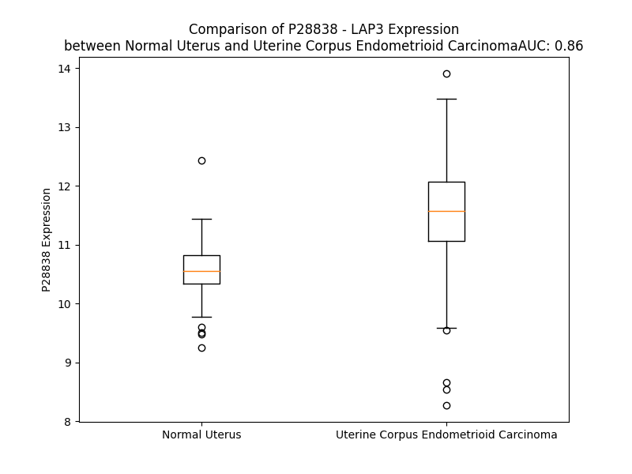

# Detailed Data for P28838

## Introduction to the Detailed Summary

### How to Interpret the Results

- **Summary & Metrics**: This section provides a quick reference to essential protein attributes, including expression changes, family classification, and biomarker applications. Regulation status (upregulated/downregulated) indicates the protein's behavior in a disease context. Some information comes from the original excel file with the proteins selected from literature, while others are derived from the analyses.
- **Expression Comparison**: A visual representation comparing protein expression between normal and disease states. It highlights significant changes in expression levels that might indicate diagnostic or therapeutic relevance. This is data coming from transcriptomics experiments and could not translate similarly to protein levels.
- **Isoform Alignment**: An interactive view of isoform alignments, revealing structural and functional differences between variants of the protein.
- **Interactors & Homologs**: Tables listing known interaction partners and homologous proteins, the more interactors and homologs, the more complex the protein is to design an antibody for.
- **Biological Assemblies**: Information about the structural arrangement of the protein in different assemblies, providing insights into its functional state but also the complexity of the protein to develop antibodies.
- **Combined Per-Residue Information**: A detailed table summarizing residue-level data. This includes predictions for epitope regions, aggregation tendencies, and modifications that might impact the protein's function. Each row corresponds to a residue in the protein, providing insights into specific sites that may be important for research or drug development.
## Summary & Metrics

- **UniProt Accession**: P28838
- **Gene Name**: LAP3
- **Protein Name**: leucine aminopeptidase 3
- **Swiss Prot**: AMPL_HUMAN
- **Family**: peptidase
- **Biomarker Application**: safety
- **Number of Isoforms**: 0
- **Regulation**: 1
- **(transcriptomics) AUC**: 0.86
- **(transcriptomics) Fold Change**: 1.09
- **(transcriptomics) Regulation**: Upregulated
- **Discotope Epitope Count**: 109
- **Max n_uniprots (Homo)**: N/A
- **Max n_uniprots (Hetero)**: N/A

## Expression Comparison

## Interactors

| preferredName_A   | preferredName_B   |   score |
|:------------------|:------------------|--------:|
| LAP3              | ANPEP             |   0.965 |
| LAP3              | XPNPEP1           |   0.959 |
| LAP3              | GGT5              |   0.932 |
| LAP3              | GGT6              |   0.931 |
| LAP3              | GGT7              |   0.93  |
| LAP3              | GGT1              |   0.924 |
| LAP3              | PRODH             |   0.912 |
| LAP3              | GSS               |   0.911 |
| LAP3              | CHAC2             |   0.906 |
| LAP3              | CHAC1             |   0.906 |
| LAP3              | GGCT              |   0.905 |
| LAP3              | GCLM              |   0.903 |
| LAP3              | P4HA2             |   0.902 |
| LAP3              | P4HA1             |   0.902 |
| LAP3              | PYCR1             |   0.902 |
| LAP3              | PYCR3             |   0.901 |

## Homologs

| uniprot_id   | gene_id   |
|:-------------|:----------|
| Q8NDH3       | NPEPL1    |

## Combined Per-Residue Information

|   res | aa   |   epitope_score | epitope   |   relative_surface_accessibility |   modeling_confidence |   Aggregation | modification                 |
|------:|:-----|----------------:|:----------|---------------------------------:|----------------------:|--------------:|:-----------------------------|
|     1 | M    |         0.08315 | False     |                          1.28679 |                 41.23 |         0     | N/A                          |
|     2 | F    |         0.14951 | False     |                          1.05905 |                 49.43 |         0     | N/A                          |
|     3 | L    |         0.14523 | False     |                          0.96891 |                 33.41 |         0     | N/A                          |
|     4 | L    |         0.18854 | True      |                          0.94093 |                 41.86 |         0     | N/A                          |
|     5 | P    |         0.16916 | True      |                          0.81547 |                 40.71 |         0     | N/A                          |
|     6 | L    |         0.14629 | False     |                          1.0283  |                 40.52 |         0     | N/A                          |
|     7 | P    |         0.17143 | True      |                          0.92261 |                 42.81 |         0     | N/A                          |
|     8 | A    |         0.11168 | False     |                          0.91509 |                 45.15 |         0     | N/A                          |
|     9 | A    |         0.18994 | True      |                          1.07204 |                 39.35 |         0     | N/A                          |
|    10 | G    |         0.11851 | False     |                          1.02104 |                 45.38 |         0     | N/A                          |
|    11 | R    |         0.1551  | True      |                          0.92146 |                 35.75 |         0     | N/A                          |
|    12 | V    |         0.16747 | True      |                          1.1157  |                 41.73 |         0     | N/A                          |
|    13 | V    |         0.09669 | False     |                          0.84141 |                 38.29 |         0     | N/A                          |
|    14 | V    |         0.10255 | False     |                          0.84245 |                 34.46 |         0     | N/A                          |
|    15 | R    |         0.12126 | False     |                          0.98408 |                 36.8  |         0     | N/A                          |
|    16 | R    |         0.13002 | False     |                          0.91322 |                 34.19 |         0     | N/A                          |
|    17 | L    |         0.1262  | False     |                          1.10428 |                 37.63 |         0     | N/A                          |
|    18 | A    |         0.15662 | True      |                          0.92867 |                 34.43 |         0     | N/A                          |
|    19 | V    |         0.1737  | True      |                          1.05968 |                 37.35 |         0     | N/A                          |
|    20 | R    |         0.23478 | True      |                          0.92326 |                 35.74 |         0     | N/A                          |
|    21 | R    |         0.15067 | False     |                          0.94196 |                 31.74 |         0     | N/A                          |
|    22 | F    |         0.12824 | False     |                          1.05069 |                 39.26 |         0     | N/A                          |
|    23 | G    |         0.12688 | False     |                          0.9861  |                 31.54 |         0     | N/A                          |
|    24 | S    |         0.0903  | False     |                          0.84024 |                 37.03 |         0     | N/A                          |
|    25 | R    |         0.09848 | False     |                          0.92724 |                 37.6  |         0     | N/A                          |
|    26 | S    |         0.09213 | False     |                          0.83249 |                 32.3  |         0     | N/A                          |
|    27 | L    |         0.09105 | False     |                          1.0225  |                 37.08 |         0     | N/A                          |
|    28 | S    |         0.09977 | False     |                          0.67238 |                 36.87 |         0     | N/A                          |
|    29 | T    |         0.13618 | False     |                          0.98489 |                 40.13 |         0     | N/A                          |
|    30 | A    |         0.06991 | False     |                          0.49917 |                 42.89 |         0     | N/A                          |
|    31 | D    |         0.07672 | False     |                          0.60655 |                 52.42 |         0     | N/A                          |
|    32 | M    |         0.10855 | False     |                          0.74582 |                 57.6  |         0     | N/A                          |
|    33 | T    |         0.06899 | False     |                          0.40133 |                 74.38 |         0     | N/A                          |
|    34 | K    |         0.04653 | False     |                          0.24437 |                 92.11 |         0     | N/A                          |
|    35 | G    |         0.00123 | False     |                          0       |                 97.65 |         1.732 | N/A                          |
|    36 | L    |         0.00137 | False     |                          0       |                 98.39 |        20.972 | N/A                          |
|    37 | V    |         0.00075 | False     |                          0       |                 98.73 |        27.755 | N/A                          |
|    38 | L    |         0.00303 | False     |                          0       |                 98.73 |        28.036 | N/A                          |
|    39 | G    |         0.00253 | False     |                          0       |                 98.59 |        28.036 | N/A                          |
|    40 | I    |         0.04081 | False     |                          0.0168  |                 98.64 |        28.036 | N/A                          |
|    41 | Y    |         0.02607 | False     |                          0.08456 |                 98.41 |        21.786 | N/A                          |
|    42 | S    |         0.07857 | False     |                          0.27981 |                 96.63 |        10.614 | Phosphoserine                |
|    43 | K    |         0.20519 | True      |                          0.53082 |                 95.46 |         0     | N/A                          |
|    44 | E    |         0.15672 | True      |                          0.37256 |                 92.49 |         0     | N/A                          |
|    45 | K    |         0.281   | True      |                          0.98148 |                 90.53 |         0     | N6-succinyllysine            |
|    46 | E    |         0.40666 | True      |                          0.87195 |                 90.44 |         0     | N/A                          |
|    47 | D    |         0.20651 | True      |                          0.23976 |                 90.11 |         0     | N/A                          |
|    48 | D    |         0.22763 | True      |                          0.80638 |                 90.96 |         0     | N/A                          |
|    49 | V    |         0.19136 | True      |                          0.43319 |                 93.12 |         0     | N/A                          |
|    50 | P    |         0.07711 | False     |                          0.18987 |                 95.63 |         0     | N/A                          |
|    51 | Q    |         0.18113 | True      |                          0.29463 |                 97.46 |         0     | N/A                          |
|    52 | F    |         0.02511 | False     |                          0.0216  |                 98.09 |         0     | N/A                          |
|    53 | T    |         0.05762 | False     |                          0.03999 |                 97.86 |         0     | N/A                          |
|    54 | S    |         0.14409 | False     |                          0.69057 |                 97.14 |         0     | Phosphoserine                |
|    55 | A    |         0.06846 | False     |                          0.11575 |                 97.68 |         0     | N/A                          |
|    56 | G    |         0.00571 | False     |                          0       |                 97.74 |         0     | N/A                          |
|    57 | E    |         0.16089 | True      |                          0.33424 |                 97.58 |         0     | N/A                          |
|    58 | N    |         0.15691 | True      |                          0.563   |                 97.18 |         0     | N/A                          |
|    59 | F    |         0.01566 | False     |                          0.00466 |                 97.41 |         0     | N/A                          |
|    60 | D    |         0.0965  | False     |                          0.11387 |                 98.1  |         0     | N/A                          |
|    61 | K    |         0.26842 | True      |                          0.69926 |                 97.7  |         0     | N6-succinyllysine            |
|    62 | L    |         0.25541 | True      |                          0.69785 |                 97.01 |         0     | N/A                          |
|    63 | L    |         0.08072 | False     |                          0.13194 |                 96.91 |         0     | N/A                          |
|    64 | A    |         0.2939  | True      |                          0.95228 |                 96.8  |         0     | N/A                          |
|    65 | G    |         0.1249  | False     |                          0.3449  |                 96.33 |         0     | N/A                          |
|    66 | K    |         0.18555 | True      |                          0.44824 |                 96.96 |         0     | N/A                          |
|    67 | L    |         0.00571 | False     |                          0       |                 97.86 |         0     | N/A                          |
|    68 | R    |         0.13765 | False     |                          0.17513 |                 97.69 |         0     | N/A                          |
|    69 | E    |         0.30615 | True      |                          0.54397 |                 97.37 |         0     | N/A                          |
|    70 | T    |         0.11386 | False     |                          0.28368 |                 96.85 |         0     | N/A                          |
|    71 | L    |         0.0546  | False     |                          0.07208 |                 97.55 |         0     | N/A                          |
|    72 | N    |         0.24348 | True      |                          0.59639 |                 96.58 |         0     | N/A                          |
|    73 | I    |         0.31764 | True      |                          0.80716 |                 97.53 |         0     | N/A                          |
|    74 | S    |         0.18943 | True      |                          0.3407  |                 97.13 |         0     | N/A                          |
|    75 | G    |         0.15135 | False     |                          0.50075 |                 96.15 |         0     | N/A                          |
|    76 | P    |         0.22544 | True      |                          0.74002 |                 96.3  |         0     | N/A                          |
|    77 | P    |         0.2052  | True      |                          0.66447 |                 96.03 |         0     | N/A                          |
|    78 | L    |         0.04698 | False     |                          0.06826 |                 97.64 |         0     | N/A                          |
|    79 | K    |         0.07524 | False     |                          0.73669 |                 97.2  |         0     | N/A                          |
|    80 | A    |         0.10791 | False     |                          0.45258 |                 97.68 |         0     | N/A                          |
|    81 | G    |         0.05662 | False     |                          0.32448 |                 97.13 |         0     | N/A                          |
|    82 | K    |         0.11526 | False     |                          0.63456 |                 98.38 |         0     | N/A                          |
|    83 | T    |         0.09097 | False     |                          0.32081 |                 98.53 |         0     | N/A                          |
|    84 | R    |         0.14541 | False     |                          0.21721 |                 98.56 |         0     | N/A                          |
|    85 | T    |         0.05058 | False     |                          0.19368 |                 98.47 |         0.282 | N/A                          |
|    86 | F    |         0.08016 | False     |                          0.05013 |                 98.12 |         0.282 | N/A                          |
|    87 | Y    |         0.16191 | True      |                          0.61565 |                 97.21 |         0.282 | N/A                          |
|    88 | G    |         0.12734 | False     |                          0.62801 |                 94.93 |         0.282 | N/A                          |
|    89 | L    |         0.08646 | False     |                          0.0842  |                 95.47 |         0.282 | N/A                          |
|    90 | H    |         0.15807 | True      |                          0.21224 |                 94.97 |         0     | N/A                          |
|    91 | Q    |         0.08701 | False     |                          0.69977 |                 93.12 |         0     | N/A                          |
|    92 | D    |         0.23095 | True      |                          0.38126 |                 94.22 |         0     | N/A                          |
|    93 | F    |         0.09373 | False     |                          0.07185 |                 96.2  |         0     | N/A                          |
|    94 | P    |         0.02995 | False     |                          0.18438 |                 94.8  |         0.41  | N/A                          |
|    95 | S    |         0.05613 | False     |                          0.07274 |                 97.48 |        25.424 | N/A                          |
|    96 | V    |         0.00509 | False     |                          0       |                 98.29 |        69.031 | N/A                          |
|    97 | V    |         0.0042  | False     |                          0       |                 98.64 |        71.527 | N/A                          |
|    98 | L    |         0.00374 | False     |                          0       |                 98.59 |        71.527 | N/A                          |
|    99 | V    |         0.00207 | False     |                          0       |                 98.77 |        71.527 | N/A                          |
|   100 | G    |         0.00196 | False     |                          0       |                 98.66 |        51.826 | N/A                          |
|   101 | L    |         0.01331 | False     |                          0.01881 |                 98.63 |        35.827 | N/A                          |
|   102 | G    |         0.02329 | False     |                          0.06553 |                 97.81 |         1.132 | N/A                          |
|   103 | K    |         0.18017 | True      |                          0.63764 |                 97.3  |         0     | N6-succinyllysine            |
|   104 | K    |         0.29272 | True      |                          0.67394 |                 96.77 |         0     | N/A                          |
|   105 | A    |         0.28255 | True      |                          0.93368 |                 95.68 |         0     | N/A                          |
|   106 | A    |         0.10634 | False     |                          0.12208 |                 97.09 |         0     | N/A                          |
|   107 | G    |         0.17705 | True      |                          0.39347 |                 97.68 |         0     | N/A                          |
|   108 | I    |         0.29331 | True      |                          0.66881 |                 98.14 |         0     | N/A                          |
|   109 | D    |         0.1456  | False     |                          0.25261 |                 98.06 |         0     | N/A                          |
|   110 | E    |         0.33859 | True      |                          0.8058  |                 96.81 |         0     | N/A                          |
|   111 | Q    |         0.27255 | True      |                          0.84622 |                 97.68 |         0     | N/A                          |
|   112 | E    |         0.24277 | True      |                          0.37461 |                 98    |         0     | N/A                          |
|   113 | N    |         0.1067  | False     |                          0.24423 |                 98.3  |         0     | N/A                          |
|   114 | W    |         0.09303 | False     |                          0.23027 |                 98.39 |         0     | N/A                          |
|   115 | H    |         0.15042 | False     |                          0.2465  |                 98.51 |         0     | N/A                          |
|   116 | E    |         0.09817 | False     |                          0.31791 |                 98.57 |         0     | N/A                          |
|   117 | G    |         0.06304 | False     |                          0.13842 |                 98.32 |         0     | N/A                          |
|   118 | K    |         0.07849 | False     |                          0.14624 |                 98.78 |         0     | N/A                          |
|   119 | E    |         0.05782 | False     |                          0.07731 |                 98.8  |         0     | N/A                          |
|   120 | N    |         0.03231 | False     |                          0.14882 |                 98.67 |         0     | N/A                          |
|   121 | I    |         0.02149 | False     |                          0.0816  |                 98.83 |         0     | N/A                          |
|   122 | R    |         0.01079 | False     |                          0.01545 |                 98.86 |         0     | N/A                          |
|   123 | A    |         0.0185  | False     |                          0.14135 |                 98.8  |         0.158 | N/A                          |
|   124 | A    |         0.00093 | False     |                          0       |                 98.81 |         0.158 | N/A                          |
|   125 | V    |         0.0016  | False     |                          0       |                 98.89 |         0.158 | N/A                          |
|   126 | A    |         0.00137 | False     |                          0       |                 98.84 |         0.158 | N/A                          |
|   127 | A    |         0.01193 | False     |                          0.19303 |                 98.78 |         0.158 | N/A                          |
|   128 | G    |         0.00176 | False     |                          0       |                 98.69 |         0     | N/A                          |
|   129 | C    |         0.00153 | False     |                          0       |                 98.69 |         0     | N/A                          |
|   130 | R    |         0.0746  | False     |                          0.21065 |                 98.53 |         0     | N/A                          |
|   131 | Q    |         0.04888 | False     |                          0.29043 |                 98.3  |         0     | N/A                          |
|   132 | I    |         0.00299 | False     |                          0       |                 98.08 |         0     | N/A                          |
|   133 | Q    |         0.03409 | False     |                          0.0676  |                 97.76 |         0     | N/A                          |
|   134 | D    |         0.07233 | False     |                          0.57757 |                 97.6  |         0     | N/A                          |
|   135 | L    |         0.07247 | False     |                          0.35083 |                 96.88 |         0     | N/A                          |
|   136 | E    |         0.11027 | False     |                          0.6612  |                 96.09 |         0     | N/A                          |
|   137 | L    |         0.03505 | False     |                          0.10469 |                 95.61 |         0     | N/A                          |
|   138 | S    |         0.07342 | False     |                          0.3505  |                 95.36 |         0     | N/A                          |
|   139 | S    |         0.02657 | False     |                          0.22494 |                 97.09 |         0     | N/A                          |
|   140 | V    |         0.00423 | False     |                          0.00884 |                 98.08 |         0     | N/A                          |
|   141 | E    |         0.05207 | False     |                          0.165   |                 98.29 |         0     | N/A                          |
|   142 | V    |         0.00079 | False     |                          0       |                 98.71 |         0     | N/A                          |
|   143 | D    |         0.00903 | False     |                          0.0049  |                 98.42 |         0     | N/A                          |
|   144 | P    |         0.02571 | False     |                          0.17098 |                 98.01 |         0     | N/A                          |
|   145 | C    |         0.00793 | False     |                          0.00962 |                 98.02 |         0     | N/A                          |
|   146 | G    |         0.16164 | True      |                          0.9242  |                 96.67 |         0     | N/A                          |
|   147 | D    |         0.07668 | False     |                          0.1837  |                 97.94 |         0     | N/A                          |
|   148 | A    |         0.01578 | False     |                          0.0409  |                 98.49 |         0     | N/A                          |
|   149 | Q    |         0.02874 | False     |                          0.09382 |                 98.59 |         0     | N/A                          |
|   150 | A    |         0.00394 | False     |                          0.00948 |                 98.78 |         0     | N/A                          |
|   151 | A    |         0.00115 | False     |                          0       |                 98.83 |         0     | N/A                          |
|   152 | A    |         0.00195 | False     |                          0       |                 98.85 |         0     | N/A                          |
|   153 | E    |         0.00198 | False     |                          0.00155 |                 98.91 |         0     | N/A                          |
|   154 | G    |         0.00185 | False     |                          0       |                 98.86 |         0     | N/A                          |
|   155 | A    |         0.00096 | False     |                          0       |                 98.82 |         0.926 | N/A                          |
|   156 | V    |         0.03496 | False     |                          0.21803 |                 98.83 |         3.259 | N/A                          |
|   157 | L    |         0.0029  | False     |                          0       |                 98.89 |         3.259 | N/A                          |
|   158 | G    |         0.00172 | False     |                          0       |                 98.72 |         3.259 | N/A                          |
|   159 | L    |         0.03727 | False     |                          0.13834 |                 98.71 |         3.259 | N/A                          |
|   160 | Y    |         0.1492  | False     |                          0.19991 |                 98.58 |         3.047 | N/A                          |
|   161 | E    |         0.0839  | False     |                          0.28753 |                 97.99 |         0     | N/A                          |
|   162 | Y    |         0.1401  | False     |                          0.17195 |                 98.22 |         0     | N/A                          |
|   163 | D    |         0.09558 | False     |                          0.14731 |                 97.86 |         0     | N/A                          |
|   164 | D    |         0.26015 | True      |                          0.56721 |                 97.44 |         0     | N/A                          |
|   165 | L    |         0.32647 | True      |                          0.7012  |                 97.77 |         0     | N/A                          |
|   166 | K    |         0.29149 | True      |                          0.50879 |                 97.76 |         0     | N/A                          |
|   167 | Q    |         0.34399 | True      |                          0.95185 |                 97.5  |         0     | N/A                          |
|   168 | K    |         0.23689 | True      |                          0.92839 |                 96.72 |         0     | N/A                          |
|   169 | K    |         0.24554 | True      |                          0.52983 |                 96.31 |         0     | N/A                          |
|   170 | K    |         0.12556 | False     |                          0.46427 |                 94.65 |         0     | N/A                          |
|   171 | M    |         0.08294 | False     |                          0.44009 |                 94.05 |         0     | N/A                          |
|   172 | A    |         0.14469 | False     |                          0.81335 |                 94.8  |         0     | N/A                          |
|   173 | V    |         0.03087 | False     |                          0.17302 |                 96.65 |         0     | N/A                          |
|   174 | S    |         0.08573 | False     |                          0.43173 |                 96.68 |         0     | N/A                          |
|   175 | A    |         0.02125 | False     |                          0.23998 |                 97.65 |         0     | N/A                          |
|   176 | K    |         0.1293  | False     |                          0.6078  |                 97.45 |         0     | N/A                          |
|   177 | L    |         0.03592 | False     |                          0.12363 |                 97.82 |         0     | N/A                          |
|   178 | Y    |         0.15305 | False     |                          0.20392 |                 97.15 |         0     | N/A                          |
|   179 | G    |         0.1788  | True      |                          0.64784 |                 92.14 |         0     | N/A                          |
|   180 | S    |         0.21575 | True      |                          0.72373 |                 83.4  |         0     | Phosphoserine                |
|   181 | G    |         0.19111 | True      |                          0.57997 |                 87.88 |         0     | N/A                          |
|   182 | D    |         0.1179  | False     |                          0.5232  |                 92.31 |         0     | N/A                          |
|   183 | Q    |         0.19757 | True      |                          0.54963 |                 95.83 |         0     | N/A                          |
|   184 | E    |         0.21206 | True      |                          0.79724 |                 96.52 |         0     | N/A                          |
|   185 | A    |         0.05713 | False     |                          0.36899 |                 97.73 |         0     | N/A                          |
|   186 | W    |         0.01236 | False     |                          0.03152 |                 98.48 |         0     | N/A                          |
|   187 | Q    |         0.13441 | False     |                          0.54557 |                 98.03 |         0     | N/A                          |
|   188 | K    |         0.05499 | False     |                          0.29283 |                 98.04 |         0     | N/A                          |
|   189 | G    |         0.00261 | False     |                          0       |                 98.69 |         1.453 | N/A                          |
|   190 | V    |         0.02659 | False     |                          0.27896 |                 98.69 |         3.403 | N/A                          |
|   191 | L    |         0.03869 | False     |                          0.18877 |                 98.67 |         3.403 | N/A                          |
|   192 | F    |         0.00518 | False     |                          0       |                 98.83 |         3.403 | N/A                          |
|   193 | A    |         0.00142 | False     |                          0       |                 98.9  |         3.403 | N/A                          |
|   194 | S    |         0.0426  | False     |                          0.32033 |                 98.77 |         2.111 | Phosphoserine                |
|   195 | G    |         0.01436 | False     |                          0.06027 |                 98.81 |         0.16  | N/A                          |
|   196 | Q    |         0.00249 | False     |                          0.00293 |                 98.94 |         0     | N/A                          |
|   197 | N    |         0.0309  | False     |                          0.09212 |                 98.89 |         0     | N/A                          |
|   198 | L    |         0.03188 | False     |                          0.11401 |                 98.87 |         0     | N/A                          |
|   199 | A    |         0.00106 | False     |                          0       |                 98.92 |         0     | N/A                          |
|   200 | R    |         0.01605 | False     |                          0.02747 |                 98.87 |         0     | N/A                          |
|   201 | Q    |         0.07052 | False     |                          0.32215 |                 98.82 |         0     | N/A                          |
|   202 | L    |         0.00271 | False     |                          0.00082 |                 98.88 |         0     | N/A                          |
|   203 | M    |         0.00358 | False     |                          0.00072 |                 98.9  |         0     | N/A                          |
|   204 | E    |         0.03521 | False     |                          0.16219 |                 98.8  |         0     | N/A                          |
|   205 | T    |         0.03991 | False     |                          0.08325 |                 98.82 |         0     | N/A                          |
|   206 | P    |         0.17023 | True      |                          0.27436 |                 98.8  |         0     | N/A                          |
|   207 | A    |         0.15754 | True      |                          0.11794 |                 98.77 |         0     | N/A                          |
|   208 | N    |         0.38294 | True      |                          0.74772 |                 98.64 |         0     | N/A                          |
|   209 | E    |         0.22944 | True      |                          0.46758 |                 98.68 |         0     | N/A                          |
|   210 | M    |         0.02041 | False     |                          0.02157 |                 98.83 |         0     | N/A                          |
|   211 | T    |         0.05461 | False     |                          0.16187 |                 98.89 |         0     | N/A                          |
|   212 | P    |         0.00367 | False     |                          0       |                 98.92 |         0     | N/A                          |
|   213 | T    |         0.09122 | False     |                          0.36219 |                 98.86 |         0     | N/A                          |
|   214 | R    |         0.16461 | True      |                          0.46595 |                 98.8  |         0.17  | N/A                          |
|   215 | F    |         0.0052  | False     |                          0       |                 98.9  |         0.17  | N/A                          |
|   216 | A    |         0.00287 | False     |                          0       |                 98.89 |         0.17  | N/A                          |
|   217 | E    |         0.17162 | True      |                          0.35891 |                 98.81 |         0.17  | N/A                          |
|   218 | I    |         0.06859 | False     |                          0.16319 |                 98.8  |         0.17  | N/A                          |
|   219 | I    |         0.00393 | False     |                          0       |                 98.81 |         0.17  | N/A                          |
|   220 | E    |         0.05624 | False     |                          0.21242 |                 98.82 |         0     | N/A                          |
|   221 | K    |         0.30355 | True      |                          0.74063 |                 98.67 |         0     | N6-acetyllysine; alternate   |
|   221 | K    |         0.30355 | True      |                          0.74063 |                 98.67 |         0     | N6-succinyllysine; alternate |
|   222 | N    |         0.06198 | False     |                          0.24724 |                 98.72 |         0     | N/A                          |
|   223 | L    |         0.00419 | False     |                          0       |                 98.53 |         0     | N/A                          |
|   224 | K    |         0.18491 | True      |                          0.55578 |                 98.31 |         0     | N/A                          |
|   225 | S    |         0.16269 | True      |                          0.70175 |                 98.2  |         0     | N/A                          |
|   226 | A    |         0.03336 | False     |                          0.16628 |                 98.15 |         0     | N/A                          |
|   227 | S    |         0.08076 | False     |                          0.109   |                 97.71 |         0     | N/A                          |
|   228 | S    |         0.236   | True      |                          0.90562 |                 97.21 |         0     | N/A                          |
|   229 | K    |         0.14323 | False     |                          0.54824 |                 98.01 |         0     | N/A                          |
|   230 | T    |         0.06522 | False     |                          0.13373 |                 98.42 |         0     | N/A                          |
|   231 | E    |         0.14846 | False     |                          0.38192 |                 98.4  |         0     | N/A                          |
|   232 | V    |         0.04362 | False     |                          0.14701 |                 98.78 |         0     | N/A                          |
|   233 | H    |         0.10793 | False     |                          0.32069 |                 98.81 |         0     | N/A                          |
|   234 | I    |         0.13948 | False     |                          0.32584 |                 98.77 |         0     | N/A                          |
|   235 | R    |         0.16479 | True      |                          0.2188  |                 98.84 |         0     | N/A                          |
|   236 | P    |         0.14785 | False     |                          0.53481 |                 98.78 |         0     | N/A                          |
|   237 | K    |         0.11143 | False     |                          0.4815  |                 98.8  |         0     | N/A                          |
|   238 | S    |         0.18166 | True      |                          0.47964 |                 98.68 |         0     | Phosphoserine                |
|   239 | W    |         0.12907 | False     |                          0.15152 |                 98.85 |         0     | N/A                          |
|   240 | I    |         0.01878 | False     |                          0.0008  |                 98.86 |         0     | N/A                          |
|   241 | E    |         0.27448 | True      |                          0.45554 |                 98.76 |         0     | N/A                          |
|   242 | E    |         0.30596 | True      |                          0.7065  |                 98.7  |         0     | N/A                          |
|   243 | Q    |         0.13772 | False     |                          0.24099 |                 98.78 |         0     | N/A                          |
|   244 | A    |         0.16717 | True      |                          0.58958 |                 98.62 |         0.317 | N/A                          |
|   245 | M    |         0.00399 | False     |                          0.00067 |                 98.85 |         0.317 | N/A                          |
|   246 | G    |         0.07497 | False     |                          0.30741 |                 98.82 |         0.317 | N/A                          |
|   247 | S    |         0.00261 | False     |                          0       |                 98.89 |         0.81  | N/A                          |
|   248 | F    |         0.00427 | False     |                          0.00382 |                 98.91 |         2.642 | N/A                          |
|   249 | L    |         0.06498 | False     |                          0.19081 |                 98.89 |         2.642 | N/A                          |
|   250 | S    |         0.08878 | False     |                          0.04725 |                 98.89 |         2.642 | N/A                          |
|   251 | V    |         0.01681 | False     |                          0.03473 |                 98.89 |         2.642 | N/A                          |
|   252 | A    |         0.02004 | False     |                          0.03462 |                 98.83 |         2.202 | N/A                          |
|   253 | K    |         0.20692 | True      |                          0.38277 |                 98.62 |         0     | N/A                          |
|   254 | G    |         0.05208 | False     |                          0.03702 |                 98.49 |         0     | N/A                          |
|   255 | S    |         0.11103 | False     |                          0.11478 |                 98.71 |         0     | N/A                          |
|   256 | D    |         0.3343  | True      |                          0.77945 |                 98.66 |         0     | N/A                          |
|   257 | E    |         0.14863 | False     |                          0.2479  |                 98.8  |         0     | N/A                          |
|   258 | P    |         0.13944 | False     |                          0.57259 |                 98.73 |         0     | N/A                          |
|   259 | P    |         0.04037 | False     |                          0.07244 |                 98.9  |         0     | N/A                          |
|   260 | V    |         0.04041 | False     |                          0.06569 |                 98.93 |         0     | N/A                          |
|   261 | F    |         0.0058  | False     |                          0.00064 |                 98.94 |         0     | N/A                          |
|   262 | L    |         0.00389 | False     |                          0.00247 |                 98.93 |         0     | N/A                          |
|   263 | E    |         0.01797 | False     |                          0.02576 |                 98.91 |         0     | N/A                          |
|   264 | I    |         0.00312 | False     |                          0.0008  |                 98.85 |         0     | N/A                          |
|   265 | H    |         0.07882 | False     |                          0.14387 |                 98.81 |         0     | N/A                          |
|   266 | Y    |         0.0283  | False     |                          0.01475 |                 98.76 |         0     | N/A                          |
|   267 | K    |         0.12626 | False     |                          0.4333  |                 98.44 |         0     | N/A                          |
|   268 | G    |         0.02197 | False     |                          0.0599  |                 98.03 |         0     | N/A                          |
|   269 | S    |         0.05647 | False     |                          0.08781 |                 97.68 |         0     | N/A                          |
|   270 | P    |         0.11087 | False     |                          0.94754 |                 95.45 |         0     | N/A                          |
|   271 | N    |         0.17673 | True      |                          0.52935 |                 96.42 |         0     | N/A                          |
|   272 | A    |         0.09925 | False     |                          0.85843 |                 95.26 |         0     | N/A                          |
|   273 | N    |         0.2035  | True      |                          0.86396 |                 95.83 |         0     | N/A                          |
|   274 | E    |         0.1149  | False     |                          0.20838 |                 96.96 |         0     | N/A                          |
|   275 | P    |         0.14587 | False     |                          0.46013 |                 98.14 |         0     | N/A                          |
|   276 | P    |         0.03107 | False     |                          0.11631 |                 98.65 |        14.891 | N/A                          |
|   277 | L    |         0.00804 | False     |                          0.01319 |                 98.81 |        29.009 | N/A                          |
|   278 | V    |         0.00156 | False     |                          0.00211 |                 98.91 |        29.009 | N/A                          |
|   279 | F    |         0.00114 | False     |                          0.00191 |                 98.92 |        29.009 | N/A                          |
|   280 | V    |         0.00075 | False     |                          0       |                 98.95 |        29.009 | N/A                          |
|   281 | G    |         0.00227 | False     |                          0       |                 98.93 |        15.348 | N/A                          |
|   282 | K    |         0.01037 | False     |                          0.02266 |                 98.93 |         0.432 | N/A                          |
|   283 | G    |         0.00118 | False     |                          0       |                 98.9  |         0.432 | N/A                          |
|   284 | I    |         0.00229 | False     |                          0       |                 98.93 |         0.432 | N/A                          |
|   285 | T    |         0.00254 | False     |                          0.00282 |                 98.89 |         0.432 | N/A                          |
|   286 | F    |         0.06435 | False     |                          0.22539 |                 98.89 |         0.432 | N/A                          |
|   287 | D    |         0.02536 | False     |                          0.01577 |                 98.81 |         0.432 | N/A                          |
|   288 | S    |         0.06464 | False     |                          0.052   |                 98.63 |         0     | N/A                          |
|   289 | G    |         0.00516 | False     |                          0       |                 98.41 |         0     | N/A                          |
|   290 | G    |         0.02028 | False     |                          0.01449 |                 98.61 |         0     | N/A                          |
|   291 | I    |         0.26541 | True      |                          0.47174 |                 98.73 |         0     | N/A                          |
|   292 | S    |         0.12908 | False     |                          0.2376  |                 98.35 |         0     | N/A                          |
|   293 | I    |         0.27979 | True      |                          0.66276 |                 98.42 |         0     | N/A                          |
|   294 | K    |         0.22377 | True      |                          0.25593 |                 98.3  |         0     | N/A                          |
|   295 | A    |         0.27945 | True      |                          0.77566 |                 98.13 |         0     | N/A                          |
|   296 | S    |         0.31871 | True      |                          0.79138 |                 98.1  |         0     | N/A                          |
|   297 | A    |         0.39791 | True      |                          0.79323 |                 98    |         0     | N/A                          |
|   298 | N    |         0.29859 | True      |                          0.67103 |                 97.19 |         0     | N/A                          |
|   299 | M    |         0.16245 | True      |                          0.20725 |                 98.53 |         0     | N/A                          |
|   300 | D    |         0.28676 | True      |                          0.50998 |                 98.66 |         0     | N/A                          |
|   301 | L    |         0.24608 | True      |                          0.34211 |                 98.59 |         0     | N/A                          |
|   302 | M    |         0.05332 | False     |                          0.19074 |                 98.67 |         0     | N/A                          |
|   303 | R    |         0.10126 | False     |                          0.17108 |                 98.83 |         0     | N/A                          |
|   304 | A    |         0.00195 | False     |                          0       |                 98.76 |         0     | N/A                          |
|   305 | D    |         0.02531 | False     |                          0.0282  |                 98.8  |         0     | N/A                          |
|   306 | M    |         0.00222 | False     |                          0.00072 |                 98.8  |         0     | N/A                          |
|   307 | G    |         0.00171 | False     |                          0       |                 98.85 |         0     | N/A                          |
|   308 | G    |         0.00129 | False     |                          0       |                 98.85 |         0     | N/A                          |
|   309 | A    |         0.00094 | False     |                          0       |                 98.95 |         0.722 | N/A                          |
|   310 | A    |         0.00106 | False     |                          0       |                 98.94 |         1.579 | N/A                          |
|   311 | T    |         0.00089 | False     |                          0       |                 98.94 |         2.72  | N/A                          |
|   312 | I    |         0.00167 | False     |                          0       |                 98.89 |         4.787 | N/A                          |
|   313 | C    |         0.00187 | False     |                          0.00374 |                 98.93 |         4.944 | N/A                          |
|   314 | S    |         0.00082 | False     |                          0       |                 98.92 |         4.944 | N/A                          |
|   315 | A    |         0.00056 | False     |                          0       |                 98.92 |         5.473 | N/A                          |
|   316 | I    |         0.00159 | False     |                          0       |                 98.87 |         5.721 | N/A                          |
|   317 | V    |         0.0074  | False     |                          0.01999 |                 98.87 |         5.576 | N/A                          |
|   318 | S    |         0.00465 | False     |                          0.01265 |                 98.79 |         1.115 | N/A                          |
|   319 | A    |         0.0013  | False     |                          0       |                 98.69 |         0.777 | N/A                          |
|   320 | A    |         0.00191 | False     |                          0       |                 98.7  |         0.491 | N/A                          |
|   321 | K    |         0.06932 | False     |                          0.44877 |                 98.41 |         0     | N/A                          |
|   322 | L    |         0.06349 | False     |                          0.27566 |                 97.75 |         0     | N/A                          |
|   323 | N    |         0.13824 | False     |                          0.62331 |                 97.73 |         0     | N/A                          |
|   324 | L    |         0.03154 | False     |                          0.04452 |                 98.17 |         0     | N/A                          |
|   325 | P    |         0.06306 | False     |                          0.40714 |                 97.94 |         0     | N/A                          |
|   326 | I    |         0.02311 | False     |                          0.0296  |                 98.34 |         1.842 | N/A                          |
|   327 | N    |         0.01951 | False     |                          0.08405 |                 98.61 |         1.986 | N/A                          |
|   328 | I    |         0.00202 | False     |                          0.00424 |                 98.83 |         1.986 | N/A                          |
|   329 | I    |         0.02087 | False     |                          0.0576  |                 98.87 |         1.986 | N/A                          |
|   330 | G    |         0.00166 | False     |                          0.00509 |                 98.92 |         1.986 | N/A                          |
|   331 | L    |         0.002   | False     |                          0       |                 98.96 |         1.7   | N/A                          |
|   332 | A    |         0.004   | False     |                          0.00365 |                 98.93 |         0     | N/A                          |
|   333 | P    |         0.003   | False     |                          0.00099 |                 98.93 |         0     | N/A                          |
|   334 | L    |         0.0026  | False     |                          0       |                 98.95 |         0     | N/A                          |
|   335 | C    |         0.00349 | False     |                          0.001   |                 98.88 |         0     | N/A                          |
|   336 | E    |         0.04018 | False     |                          0.1159  |                 98.92 |         0     | N/A                          |
|   337 | N    |         0.02404 | False     |                          0.04456 |                 98.87 |         0     | N/A                          |
|   338 | M    |         0.18879 | True      |                          0.34679 |                 98.8  |         0     | N/A                          |
|   339 | P    |         0.2488  | True      |                          0.39515 |                 98.67 |         0     | N/A                          |
|   340 | S    |         0.17616 | True      |                          0.33509 |                 98.67 |         0     | N/A                          |
|   341 | G    |         0.3163  | True      |                          1.15396 |                 98.53 |         0     | N/A                          |
|   342 | K    |         0.21955 | True      |                          0.54877 |                 98.67 |         0     | N/A                          |
|   343 | A    |         0.06708 | False     |                          0.08281 |                 98.69 |         0     | N/A                          |
|   344 | N    |         0.05353 | False     |                          0.05396 |                 98.66 |         0     | N/A                          |
|   345 | K    |         0.2981  | True      |                          0.56674 |                 98.81 |         0     | N/A                          |
|   346 | P    |         0.20153 | True      |                          0.5164  |                 98.74 |         0     | N/A                          |
|   347 | G    |         0.13339 | False     |                          0.36063 |                 98.41 |         0     | N/A                          |
|   348 | D    |         0.10721 | False     |                          0.19896 |                 98.8  |         0     | N/A                          |
|   349 | V    |         0.19379 | True      |                          0.46768 |                 98.84 |         0     | N/A                          |
|   350 | V    |         0.04388 | False     |                          0.12031 |                 98.83 |         0     | N/A                          |
|   351 | R    |         0.13292 | False     |                          0.60407 |                 98.86 |         0     | N/A                          |
|   352 | A    |         0.00947 | False     |                          0.02168 |                 98.84 |         0     | N/A                          |
|   353 | K    |         0.05654 | False     |                          0.26451 |                 98.58 |         0     | N/A                          |
|   354 | N    |         0.05927 | False     |                          0.45894 |                 98.29 |         0     | N/A                          |
|   355 | G    |         0.05391 | False     |                          0.23558 |                 98.54 |         0     | N/A                          |
|   356 | K    |         0.08976 | False     |                          0.30616 |                 98.68 |         0     | N/A                          |
|   357 | T    |         0.08185 | False     |                          0.22787 |                 98.85 |         0     | N/A                          |
|   358 | I    |         0.00381 | False     |                          0       |                 98.91 |         0     | N/A                          |
|   359 | Q    |         0.05012 | False     |                          0.06686 |                 98.85 |         0     | N/A                          |
|   360 | V    |         0.00255 | False     |                          0       |                 98.81 |         0     | N/A                          |
|   361 | D    |         0.13381 | False     |                          0.29612 |                 98.52 |         0     | N/A                          |
|   362 | N    |         0.14369 | False     |                          0.31568 |                 98.48 |         0     | N/A                          |
|   363 | T    |         0.01658 | False     |                          0.02393 |                 98.58 |         0     | N/A                          |
|   364 | D    |         0.06704 | False     |                          0.29434 |                 98.38 |         0     | N/A                          |
|   365 | A    |         0.05057 | False     |                          0.09693 |                 98.27 |         0     | N/A                          |
|   366 | E    |         0.01055 | False     |                          0.01382 |                 98.66 |         0     | N/A                          |
|   367 | G    |         0.01035 | False     |                          0.01521 |                 98.53 |         0     | N/A                          |
|   368 | R    |         0.03638 | False     |                          0.06509 |                 98.61 |         0     | N/A                          |
|   369 | L    |         0.00222 | False     |                          0.00165 |                 98.88 |         0     | N/A                          |
|   370 | I    |         0.00239 | False     |                          0.00059 |                 98.88 |         0     | N/A                          |
|   371 | L    |         0.0015  | False     |                          0       |                 98.92 |         0     | N/A                          |
|   372 | A    |         0.00085 | False     |                          0       |                 98.88 |         0     | N/A                          |
|   373 | D    |         0.00714 | False     |                          0.00166 |                 98.92 |         0     | N/A                          |
|   374 | A    |         0.00188 | False     |                          0.0011  |                 98.91 |         0     | N/A                          |
|   375 | L    |         0.00146 | False     |                          0       |                 98.91 |         0.146 | N/A                          |
|   376 | C    |         0.02326 | False     |                          0.12193 |                 98.76 |         0.146 | N/A                          |
|   377 | Y    |         0.07485 | False     |                          0.09652 |                 98.85 |         0.146 | N/A                          |
|   378 | A    |         0.0016  | False     |                          0       |                 98.86 |         0.146 | N/A                          |
|   379 | H    |         0.03366 | False     |                          0.24761 |                 98.67 |         0.146 | N/A                          |
|   380 | T    |         0.20357 | True      |                          0.56683 |                 98.55 |         0.146 | N/A                          |
|   381 | F    |         0.08999 | False     |                          0.21099 |                 98.5  |         0.146 | N/A                          |
|   382 | N    |         0.19695 | True      |                          0.73739 |                 98.31 |         0     | N/A                          |
|   383 | P    |         0.0397  | False     |                          0.09064 |                 98.59 |         0     | N/A                          |
|   384 | K    |         0.07004 | False     |                          0.27981 |                 98.31 |         0     | N/A                          |
|   385 | V    |         0.01054 | False     |                          0.01022 |                 98.67 |         4.36  | N/A                          |
|   386 | I    |         0.0008  | False     |                          0       |                 98.89 |         4.36  | N/A                          |
|   387 | L    |         0.00076 | False     |                          0       |                 98.84 |         4.36  | N/A                          |
|   388 | N    |         0.00125 | False     |                          0       |                 98.89 |         4.36  | N/A                          |
|   389 | A    |         0.00086 | False     |                          0       |                 98.88 |         4.36  | N/A                          |
|   390 | A    |         0.00354 | False     |                          0       |                 98.8  |         3.858 | N/A                          |
|   391 | T    |         0.02773 | False     |                          0.06276 |                 98.44 |         3.434 | N/A                          |
|   392 | L    |         0.0273  | False     |                          0.11651 |                 98.2  |         3.183 | N/A                          |
|   393 | T    |         0.07768 | False     |                          0.09616 |                 96.92 |         1.808 | N/A                          |
|   394 | G    |         0.14956 | False     |                          0.67332 |                 96.36 |         0.991 | N/A                          |
|   395 | A    |         0.05903 | False     |                          0.35339 |                 98    |         0.991 | N/A                          |
|   396 | M    |         0.01022 | False     |                          0.00863 |                 98.67 |         0.528 | N/A                          |
|   397 | D    |         0.15952 | True      |                          0.44007 |                 98.22 |         0     | N/A                          |
|   398 | V    |         0.20719 | True      |                          0.94397 |                 98.34 |         0     | N/A                          |
|   399 | A    |         0.17424 | True      |                          0.53252 |                 98.52 |         0     | N/A                          |
|   400 | L    |         0.11452 | False     |                          0.30477 |                 98.64 |         0     | N/A                          |
|   401 | G    |         0.08664 | False     |                          0.2922  |                 98.32 |         0     | N/A                          |
|   402 | S    |         0.05621 | False     |                          0.17905 |                 98.52 |         0     | N/A                          |
|   403 | G    |         0.14551 | False     |                          0.40818 |                 98.59 |         0     | N/A                          |
|   404 | A    |         0.04881 | False     |                          0.11469 |                 98.8  |         0.64  | N/A                          |
|   405 | T    |         0.00398 | False     |                          0.00381 |                 98.91 |         0.923 | N/A                          |
|   406 | G    |         0.00325 | False     |                          0       |                 98.89 |         0.923 | N/A                          |
|   407 | V    |         0.00303 | False     |                          0       |                 98.94 |         0.923 | N/A                          |
|   408 | F    |         0.00372 | False     |                          0       |                 98.91 |         0.923 | N/A                          |
|   409 | T    |         0.03298 | False     |                          0.04715 |                 98.88 |         0.522 | N/A                          |
|   410 | N    |         0.06829 | False     |                          0.45176 |                 98.65 |         0     | N/A                          |
|   411 | S    |         0.06561 | False     |                          0.09216 |                 98.7  |         0     | N/A                          |
|   412 | S    |         0.11009 | False     |                          0.48985 |                 98.62 |         0     | N/A                          |
|   413 | W    |         0.12006 | False     |                          0.43897 |                 98.53 |         0     | N/A                          |
|   414 | L    |         0.00451 | False     |                          0       |                 98.53 |         0     | N/A                          |
|   415 | W    |         0.11142 | False     |                          0.13536 |                 98.8  |         0     | N/A                          |
|   416 | N    |         0.1455  | False     |                          0.44782 |                 98.68 |         0     | N/A                          |
|   417 | K    |         0.07394 | False     |                          0.21807 |                 98.56 |         0     | N/A                          |
|   418 | L    |         0.00207 | False     |                          0       |                 98.76 |         0     | N/A                          |
|   419 | F    |         0.09043 | False     |                          0.23759 |                 98.81 |         0     | N/A                          |
|   420 | E    |         0.10244 | False     |                          0.36639 |                 98.54 |         0     | N/A                          |
|   421 | A    |         0.0032  | False     |                          0       |                 98.75 |         0     | N/A                          |
|   422 | S    |         0.0086  | False     |                          0.00395 |                 98.78 |         0     | N/A                          |
|   423 | I    |         0.1426  | False     |                          0.17418 |                 98.76 |         0     | N/A                          |
|   424 | E    |         0.04098 | False     |                          0.19829 |                 98.58 |         0     | N/A                          |
|   425 | T    |         0.01762 | False     |                          0.01428 |                 98.76 |         0     | N/A                          |
|   426 | G    |         0.02805 | False     |                          0.07199 |                 98.58 |         0     | N/A                          |
|   427 | D    |         0.01366 | False     |                          0.01726 |                 98.79 |         0     | N/A                          |
|   428 | R    |         0.12055 | False     |                          0.21145 |                 98.84 |         0     | N/A                          |
|   429 | V    |         0.0101  | False     |                          0.019   |                 98.9  |         0     | N/A                          |
|   430 | W    |         0.16257 | True      |                          0.56303 |                 98.87 |         0     | N/A                          |
|   431 | R    |         0.07754 | False     |                          0.36886 |                 98.82 |         0     | N/A                          |
|   432 | M    |         0.09348 | False     |                          0.14651 |                 98.87 |         0     | N/A                          |
|   433 | P    |         0.06795 | False     |                          0.28687 |                 98.69 |         0     | N/A                          |
|   434 | L    |         0.04605 | False     |                          0.20405 |                 98.53 |         0     | N/A                          |
|   435 | F    |         0.17512 | True      |                          0.61736 |                 98.72 |         0     | N/A                          |
|   436 | E    |         0.11599 | False     |                          0.44756 |                 98.48 |         0     | N/A                          |
|   437 | H    |         0.21237 | True      |                          0.6247  |                 98.59 |         0     | N/A                          |
|   438 | Y    |         0.0575  | False     |                          0.12947 |                 98.64 |         0     | N/A                          |
|   439 | T    |         0.05951 | False     |                          0.09521 |                 98.6  |         0     | N/A                          |
|   440 | R    |         0.26437 | True      |                          0.62367 |                 98.18 |         0     | N/A                          |
|   441 | Q    |         0.06136 | False     |                          0.09586 |                 98.21 |         0     | N/A                          |
|   442 | V    |         0.00586 | False     |                          0       |                 98.33 |         0     | N/A                          |
|   443 | V    |         0.11824 | False     |                          0.41292 |                 97.82 |         0     | N/A                          |
|   444 | D    |         0.14852 | False     |                          0.51477 |                 95.92 |         0     | N/A                          |
|   445 | C    |         0.1367  | False     |                          0.1888  |                 96.97 |         0     | N/A                          |
|   446 | Q    |         0.36365 | True      |                          0.7913  |                 97.29 |         0     | N/A                          |
|   447 | L    |         0.3679  | True      |                          0.6446  |                 98    |         0     | N/A                          |
|   448 | A    |         0.09841 | False     |                          0.16995 |                 98.25 |         0     | N/A                          |
|   449 | D    |         0.08066 | False     |                          0.45882 |                 98.61 |         0     | N/A                          |
|   450 | V    |         0.01134 | False     |                          0.01047 |                 98.6  |         0     | N/A                          |
|   451 | N    |         0.04997 | False     |                          0.09474 |                 98.74 |         0     | N/A                          |
|   452 | N    |         0.00167 | False     |                          0       |                 98.61 |         0     | N/A                          |
|   453 | I    |         0.2146  | True      |                          0.36548 |                 97.93 |         0     | N/A                          |
|   454 | G    |         0.07039 | False     |                          0.16016 |                 96.11 |         0     | N/A                          |
|   455 | K    |         0.2528  | True      |                          0.50826 |                 95.79 |         0     | N6-succinyllysine; alternate |
|   455 | K    |         0.2528  | True      |                          0.50826 |                 95.79 |         0     | N6-acetyllysine; alternate   |
|   456 | Y    |         0.29448 | True      |                          0.63217 |                 96.42 |         0     | N/A                          |
|   457 | R    |         0.28935 | True      |                          0.96206 |                 95.34 |         0     | N/A                          |
|   458 | S    |         0.3181  | True      |                          0.55108 |                 97.38 |         0     | N/A                          |
|   459 | A    |         0.11842 | False     |                          0.43734 |                 97.51 |         0     | N/A                          |
|   460 | G    |         0.07577 | False     |                          0.23058 |                 97.81 |         0     | N/A                          |
|   461 | A    |         0.01615 | False     |                          0.03453 |                 98.62 |         0.561 | N/A                          |
|   462 | C    |         0.02808 | False     |                          0.05554 |                 98.77 |         1.224 | N/A                          |
|   463 | T    |         0.01911 | False     |                          0.02027 |                 98.65 |         5.041 | N/A                          |
|   464 | A    |         0.00266 | False     |                          0.00128 |                 98.72 |        11.489 | N/A                          |
|   465 | A    |         0.00112 | False     |                          0       |                 98.8  |        12.922 | N/A                          |
|   466 | A    |         0.00674 | False     |                          0.0153  |                 98.74 |        14.617 | N/A                          |
|   467 | F    |         0.00243 | False     |                          0       |                 98.85 |        16.729 | N/A                          |
|   468 | L    |         0.0015  | False     |                          0       |                 98.88 |        16.729 | N/A                          |
|   469 | K    |         0.03549 | False     |                          0.27812 |                 98.73 |         7.03  | N/A                          |
|   470 | E    |         0.03306 | False     |                          0.18256 |                 98.75 |         7.03  | N/A                          |
|   471 | F    |         0.01493 | False     |                          0.03322 |                 98.84 |         7.03  | N/A                          |
|   472 | V    |         0.01491 | False     |                          0.113   |                 98.75 |         6.923 | N/A                          |
|   473 | T    |         0.06345 | False     |                          0.89411 |                 98.27 |         2.583 | N/A                          |
|   474 | H    |         0.05828 | False     |                          0.12201 |                 98.61 |         0     | N/A                          |
|   475 | P    |         0.15282 | False     |                          0.69331 |                 98.33 |         0     | N/A                          |
|   476 | K    |         0.05835 | False     |                          0.38148 |                 98.61 |         0     | N6-succinyllysine            |
|   477 | W    |         0.00241 | False     |                          0       |                 98.88 |         0     | N/A                          |
|   478 | A    |         0.00091 | False     |                          0       |                 98.9  |         0     | N/A                          |
|   479 | H    |         0.00395 | False     |                          0.00189 |                 98.92 |         0     | N/A                          |
|   480 | L    |         0.00128 | False     |                          0       |                 98.93 |         0     | N/A                          |
|   481 | D    |         0.00907 | False     |                          0.00557 |                 98.88 |         0     | N/A                          |
|   482 | I    |         0.00959 | False     |                          0.0032  |                 98.87 |         1.359 | N/A                          |
|   483 | A    |         0.0594  | False     |                          0.19448 |                 98.51 |         1.359 | N/A                          |
|   484 | G    |         0.02228 | False     |                          0.09162 |                 98.32 |         1.359 | N/A                          |
|   485 | V    |         0.00439 | False     |                          0.00544 |                 98.74 |         1.359 | N/A                          |
|   486 | M    |         0.04701 | False     |                          0.0898  |                 98.8  |         1.359 | N/A                          |
|   487 | T    |         0.1336  | False     |                          0.2565  |                 98.68 |         1.109 | N/A                          |
|   488 | N    |         0.01768 | False     |                          0.02175 |                 98.64 |         0     | N/A                          |
|   489 | K    |         0.21296 | True      |                          0.70964 |                 97.91 |         0     | N6-acetyllysine; alternate   |
|   489 | K    |         0.21296 | True      |                          0.70964 |                 97.91 |         0     | N6-succinyllysine; alternate |
|   490 | D    |         0.30037 | True      |                          0.71251 |                 97.65 |         0     | N/A                          |
|   491 | E    |         0.1696  | True      |                          0.4648  |                 98.42 |         0     | N/A                          |
|   492 | V    |         0.05861 | False     |                          0.13043 |                 98.6  |         0     | N/A                          |
|   493 | P    |         0.12065 | False     |                          0.51316 |                 98.52 |         0     | N/A                          |
|   494 | Y    |         0.0432  | False     |                          0.02556 |                 98.7  |         0     | N/A                          |
|   495 | L    |         0.02386 | False     |                          0.0476  |                 98.82 |         0     | N/A                          |
|   496 | R    |         0.09886 | False     |                          0.15105 |                 98.58 |         0     | N/A                          |
|   497 | K    |         0.20786 | True      |                          0.8444  |                 98.53 |         0     | N/A                          |
|   498 | G    |         0.05762 | False     |                          0.21338 |                 98.58 |         0     | N/A                          |
|   499 | M    |         0.0398  | False     |                          0.01638 |                 98.81 |         0     | N/A                          |
|   500 | T    |         0.00834 | False     |                          0.00548 |                 98.84 |         0     | N/A                          |
|   501 | G    |         0.00182 | False     |                          0       |                 98.81 |         0     | N/A                          |
|   502 | R    |         0.03658 | False     |                          0.04508 |                 98.92 |         0     | N/A                          |
|   503 | P    |         0.00766 | False     |                          0       |                 98.86 |         0     | N/A                          |
|   504 | T    |         0.00129 | False     |                          0       |                 98.95 |         0     | N/A                          |
|   505 | R    |         0.0055  | False     |                          0.00562 |                 98.91 |         0.167 | N/A                          |
|   506 | T    |         0.00113 | False     |                          0       |                 98.94 |         4.223 | N/A                          |
|   507 | L    |         0.001   | False     |                          0       |                 98.91 |        11.164 | N/A                          |
|   508 | I    |         0.00133 | False     |                          0       |                 98.83 |        13.007 | N/A                          |
|   509 | E    |         0.03384 | False     |                          0.04384 |                 98.78 |        13.163 | N/A                          |
|   510 | F    |         0.00868 | False     |                          0.01008 |                 98.74 |        13.163 | N/A                          |
|   511 | L    |         0.0015  | False     |                          0       |                 98.71 |        13.163 | N/A                          |
|   512 | L    |         0.03263 | False     |                          0.14014 |                 98.23 |        13.163 | N/A                          |
|   513 | R    |         0.07737 | False     |                          0.25777 |                 98.08 |        12.996 | N/A                          |
|   514 | F    |         0.02326 | False     |                          0.05621 |                 97.55 |        12.415 | N/A                          |
|   515 | S    |         0.01826 | False     |                          0.02824 |                 96.85 |         5.138 | N/A                          |
|   516 | Q    |         0.10861 | False     |                          0.57904 |                 94.31 |         0.123 | N/A                          |
|   517 | D    |         0.11173 | False     |                          0.54394 |                 82.08 |         0     | N/A                          |
|   518 | N    |         0.04519 | False     |                          0.48738 |                 68.06 |         0     | N/A                          |
|   519 | A    |         0.06496 | False     |                          1.17041 |                 52.7  |         0     | N/A                          |

