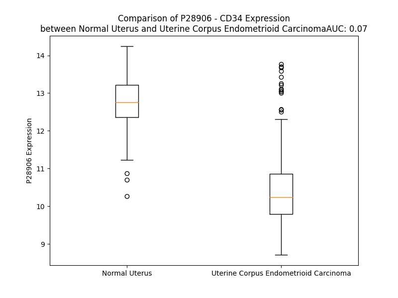

# Detailed Data for P28906

## Introduction to the Detailed Summary

### How to Interpret the Results

- **Summary & Metrics**: This section provides a quick reference to essential protein attributes, including expression changes, family classification, and biomarker applications. Regulation status (upregulated/downregulated) indicates the protein's behavior in a disease context. Some information comes from the original excel file with the proteins selected from literature, while others are derived from the analyses.
- **Expression Comparison**: A visual representation comparing protein expression between normal and disease states. It highlights significant changes in expression levels that might indicate diagnostic or therapeutic relevance. This is data coming from transcriptomics experiments and could not translate similarly to protein levels.
- **Isoform Alignment**: An interactive view of isoform alignments, revealing structural and functional differences between variants of the protein.
- **Interactors & Homologs**: Tables listing known interaction partners and homologous proteins, the more interactors and homologs, the more complex the protein is to design an antibody for.
- **Biological Assemblies**: Information about the structural arrangement of the protein in different assemblies, providing insights into its functional state but also the complexity of the protein to develop antibodies.
- **Combined Per-Residue Information**: A detailed table summarizing residue-level data. This includes predictions for epitope regions, aggregation tendencies, and modifications that might impact the protein's function. Each row corresponds to a residue in the protein, providing insights into specific sites that may be important for research or drug development.
## Summary & Metrics

- **UniProt Accession**: P28906
- **Gene Name**: CD34
- **Protein Name**: Hematopoietic progenitor cell antigen CD34
- **Swiss Prot**: CD34_HUMAN
- **Family**: other
- **Biomarker Application**: efficacy,prognosis
- **Number of Isoforms**: 2
- **Regulation**: 2
- **(transcriptomics) AUC**: 0.07
- **(transcriptomics) Fold Change**: 1.21
- **(transcriptomics) Regulation**: Downregulated
- **Discotope Epitope Count**: 46
- **Max n_uniprots (Homo)**: N/A
- **Max n_uniprots (Hetero)**: N/A

## Expression Comparison

## Isoform Alignment

<pre style='font-size:14px; font-family:monospace;'>P28906-1 MLVRRGARAGPRMPRGWTALCLLSLLPSGFMSLDNNGTATPELPTQGTFSNVSTNVSYQETTTPSTLGSTSLHPVSQHGNEATTNITETTVKFTSTSVITSVYGNTNSSVQSQTSVISTVFTTPANVSTPETTLKPSLSPGNVSDLSTTSTSLATSPTKPYTSSSPILSDIKAEIKCSGIREVKLTQGICLEQNKTSSCAEFKKDRGEGLARVLCGEEQADADAGAQVCSLLLAQSEVRPQCLLLVLANRTEISSKLQLMKKHQSDLKKLGILDFTEQDVASHQSYSQKTLIALVTSGALLAVLGITGYFLMNRRSWSPTGERLGEDPYYTENGGGQGYSSGPGTSPEAQGKASVNRGAQENGTGQATSRNGHSARQHVVADTEL
P28906-2 MLVRRGARAGPRMPRGWTALCLLSLLPSGFMSLDNNGTATPELPTQGTFSNVSTNVSYQETTTPSTLGSTSLHPVSQHGNEATTNITETTVKFTSTSVITSVYGNTNSSVQSQTSVISTVFTTPANVSTPETTLKPSLSPGNVSDLSTTSTSLATSPTKPYTSSSPILSDIKAEIKCSGIREVKLTQGICLEQNKTSSCAEFKKDRGEGLARVLCGEEQADADAGAQVCSLLLAQSEVRPQCLLLVLANRTEISSKLQLMKKHQSDLKKLGILDFTEQDVASHQSYSQKTLIALVTSGALLAVLGITGYFLMNRRSWSPTGERLELEP---------------------------------------------------------
</pre>

## Interactors

| preferredName_A   | preferredName_B   |   score |
|:------------------|:------------------|--------:|
| CD34              | SELL              |   0.999 |
| CD34              | CD38              |   0.964 |
| CD34              | FN1               |   0.96  |
| CD34              | KIT               |   0.956 |
| CD34              | SELE              |   0.953 |
| CD34              | CD33              |   0.951 |
| CD34              | BCL2              |   0.945 |
| CD34              | CSF3              |   0.94  |
| CD34              | PECAM1            |   0.94  |
| CD34              | KITLG             |   0.934 |
| CD34              | PROM1             |   0.928 |
| CD34              | ENG               |   0.919 |
| CD34              | PTPRC             |   0.919 |
| CD34              | THY1              |   0.915 |
| CD34              | CD44              |   0.912 |
| CD34              | KDR               |   0.906 |
| CD34              | NT5E              |   0.905 |
| CD34              | IL3               |   0.904 |
| CD34              | THPO              |   0.904 |

## Homologs

| uniprot_id   | gene_id   |
|--------------|-----------|

## Combined Per-Residue Information

|   res | aa   |   epitope_score | epitope   |   relative_surface_accessibility |   modeling_confidence |   Aggregation | modification    | glycosylation                   |
|------:|:-----|----------------:|:----------|---------------------------------:|----------------------:|--------------:|:----------------|:--------------------------------|
|     1 | M    |         0.11201 | False     |                          1.28011 |                 43.83 |         0     | N/A             | N/A                             |
|     2 | L    |         0.1022  | False     |                          1.11892 |                 45.6  |         0     | N/A             | N/A                             |
|     3 | V    |         0.10782 | False     |                          1.09766 |                 47.14 |         0     | N/A             | N/A                             |
|     4 | R    |         0.16374 | False     |                          0.96328 |                 46.88 |         0     | N/A             | N/A                             |
|     5 | R    |         0.16561 | False     |                          0.97648 |                 50.43 |         0     | N/A             | N/A                             |
|     6 | G    |         0.07879 | False     |                          0.8709  |                 44.36 |         0     | N/A             | N/A                             |
|     7 | A    |         0.09561 | False     |                          1.05834 |                 49.32 |         0     | N/A             | N/A                             |
|     8 | R    |         0.14278 | False     |                          0.94584 |                 47.95 |         0     | N/A             | N/A                             |
|     9 | A    |         0.10081 | False     |                          0.97825 |                 51.18 |         0     | N/A             | N/A                             |
|    10 | G    |         0.10153 | False     |                          0.718   |                 53.29 |         0     | N/A             | N/A                             |
|    11 | P    |         0.0926  | False     |                          0.98919 |                 59.27 |         0     | N/A             | N/A                             |
|    12 | R    |         0.12973 | False     |                          0.94843 |                 54.97 |         0     | N/A             | N/A                             |
|    13 | M    |         0.10263 | False     |                          0.89897 |                 59.67 |         0     | N/A             | N/A                             |
|    14 | P    |         0.13598 | False     |                          0.75037 |                 60.8  |         0     | N/A             | N/A                             |
|    15 | R    |         0.16846 | False     |                          0.97532 |                 63.02 |         0     | N/A             | N/A                             |
|    16 | G    |         0.07834 | False     |                          0.53496 |                 59.56 |         0.824 | N/A             | N/A                             |
|    17 | W    |         0.09222 | False     |                          0.83677 |                 60.95 |        12.13  | N/A             | N/A                             |
|    18 | T    |         0.08062 | False     |                          0.72395 |                 61.03 |        13.62  | N/A             | N/A                             |
|    19 | A    |         0.06037 | False     |                          0.55797 |                 62.88 |        16.053 | N/A             | N/A                             |
|    20 | L    |         0.07304 | False     |                          0.72085 |                 62.11 |        17.327 | N/A             | N/A                             |
|    21 | C    |         0.07675 | False     |                          0.61228 |                 63.39 |        17.524 | N/A             | N/A                             |
|    22 | L    |         0.07231 | False     |                          0.73838 |                 61.78 |        17.34  | N/A             | N/A                             |
|    23 | L    |         0.15698 | False     |                          0.7893  |                 62.68 |        16.188 | N/A             | N/A                             |
|    24 | S    |         0.08435 | False     |                          0.70473 |                 61.53 |         8.046 | N/A             | N/A                             |
|    25 | L    |         0.07216 | False     |                          0.85753 |                 57.98 |         7.007 | N/A             | N/A                             |
|    26 | L    |         0.08795 | False     |                          0.72037 |                 59.44 |         0.282 | N/A             | N/A                             |
|    27 | P    |         0.0925  | False     |                          0.8942  |                 59.41 |         0.144 | N/A             | N/A                             |
|    28 | S    |         0.13788 | False     |                          0.94447 |                 46.84 |         0     | N/A             | N/A                             |
|    29 | G    |         0.1501  | False     |                          0.6777  |                 40.61 |         0     | N/A             | N/A                             |
|    30 | F    |         0.10127 | False     |                          0.99087 |                 38.62 |         0     | N/A             | N/A                             |
|    31 | M    |         0.10852 | False     |                          1.0134  |                 39.4  |         0     | N/A             | N/A                             |
|    32 | S    |         0.08565 | False     |                          0.77001 |                 38.99 |         0     | N/A             | N/A                             |
|    33 | L    |         0.09865 | False     |                          1.06332 |                 37.03 |         0     | N/A             | N/A                             |
|    34 | D    |         0.10623 | False     |                          0.76665 |                 42.65 |         0     | N/A             | N/A                             |
|    35 | N    |         0.09582 | False     |                          0.89831 |                 38.7  |         0     | N/A             | N/A                             |
|    36 | N    |         0.16182 | False     |                          0.97895 |                 37.53 |         0     | N/A             | N-linked (GlcNAc...) asparagine |
|    37 | G    |         0.11162 | False     |                          0.71265 |                 36.42 |         0     | N/A             | N/A                             |
|    38 | T    |         0.12264 | False     |                          1.01925 |                 31.48 |         0     | N/A             | N/A                             |
|    39 | A    |         0.1014  | False     |                          0.92912 |                 40.99 |         0     | N/A             | N/A                             |
|    40 | T    |         0.13992 | False     |                          0.88432 |                 37.95 |         0     | N/A             | N/A                             |
|    41 | P    |         0.11313 | False     |                          0.88623 |                 38    |         0     | N/A             | N/A                             |
|    42 | E    |         0.10372 | False     |                          0.92034 |                 46.47 |         0     | N/A             | N/A                             |
|    43 | L    |         0.11747 | False     |                          0.99155 |                 37.31 |         0     | N/A             | N/A                             |
|    44 | P    |         0.10749 | False     |                          0.88374 |                 42.86 |         0     | N/A             | N/A                             |
|    45 | T    |         0.12096 | False     |                          0.73525 |                 38.17 |         0     | N/A             | N/A                             |
|    46 | Q    |         0.12459 | False     |                          0.87264 |                 40.65 |         0     | N/A             | N/A                             |
|    47 | G    |         0.10043 | False     |                          0.94678 |                 44.06 |         0     | N/A             | N/A                             |
|    48 | T    |         0.0971  | False     |                          0.86165 |                 40.07 |         0     | N/A             | N/A                             |
|    49 | F    |         0.1164  | False     |                          0.97193 |                 34.94 |         0     | N/A             | N/A                             |
|    50 | S    |         0.14461 | False     |                          0.86431 |                 40.49 |         0     | N/A             | N/A                             |
|    51 | N    |         0.13379 | False     |                          0.88996 |                 38.5  |         0     | N/A             | N-linked (GlcNAc...) asparagine |
|    52 | V    |         0.15363 | False     |                          0.90442 |                 41    |         0     | N/A             | N/A                             |
|    53 | S    |         0.10504 | False     |                          0.76437 |                 33.86 |         0     | N/A             | N/A                             |
|    54 | T    |         0.12673 | False     |                          0.8911  |                 40.66 |         0     | N/A             | N/A                             |
|    55 | N    |         0.11625 | False     |                          0.89881 |                 37.37 |         0     | N/A             | N-linked (GlcNAc...) asparagine |
|    56 | V    |         0.10353 | False     |                          1.01298 |                 47.77 |         0     | N/A             | N/A                             |
|    57 | S    |         0.0905  | False     |                          0.62384 |                 39.77 |         0     | N/A             | N/A                             |
|    58 | Y    |         0.07081 | False     |                          0.9642  |                 36.56 |         0     | N/A             | N/A                             |
|    59 | Q    |         0.12185 | False     |                          0.92349 |                 41.21 |         0     | N/A             | N/A                             |
|    60 | E    |         0.09371 | False     |                          0.78287 |                 37.5  |         0     | N/A             | N/A                             |
|    61 | T    |         0.10829 | False     |                          0.96975 |                 43.34 |         0     | N/A             | N/A                             |
|    62 | T    |         0.13866 | False     |                          0.72755 |                 37.49 |         0     | N/A             | N/A                             |
|    63 | T    |         0.13457 | False     |                          0.93356 |                 42.37 |         0     | N/A             | N/A                             |
|    64 | P    |         0.14512 | False     |                          0.8544  |                 37.83 |         0     | N/A             | N/A                             |
|    65 | S    |         0.10262 | False     |                          0.91545 |                 46.36 |         0     | N/A             | N/A                             |
|    66 | T    |         0.12636 | False     |                          0.84332 |                 37.01 |         0     | N/A             | N/A                             |
|    67 | L    |         0.10146 | False     |                          1.07008 |                 44.76 |         0     | N/A             | N/A                             |
|    68 | G    |         0.08791 | False     |                          0.95164 |                 34.58 |         0     | N/A             | N/A                             |
|    69 | S    |         0.08068 | False     |                          0.90664 |                 35.09 |         0     | N/A             | N/A                             |
|    70 | T    |         0.08811 | False     |                          0.91492 |                 36.86 |         0     | N/A             | N/A                             |
|    71 | S    |         0.11097 | False     |                          0.6812  |                 36.33 |         0     | N/A             | N/A                             |
|    72 | L    |         0.15292 | False     |                          0.9861  |                 40.64 |         0     | N/A             | N/A                             |
|    73 | H    |         0.13586 | False     |                          0.89043 |                 35.02 |         0     | N/A             | N/A                             |
|    74 | P    |         0.15102 | False     |                          0.94728 |                 49.87 |         0     | N/A             | N/A                             |
|    75 | V    |         0.12141 | False     |                          0.94313 |                 44.68 |         0     | N/A             | N/A                             |
|    76 | S    |         0.14005 | False     |                          0.83007 |                 36.4  |         0     | N/A             | N/A                             |
|    77 | Q    |         0.15769 | False     |                          0.89412 |                 48.18 |         0     | N/A             | N/A                             |
|    78 | H    |         0.24612 | True      |                          0.98296 |                 33.66 |         0     | N/A             | N/A                             |
|    79 | G    |         0.14334 | False     |                          0.85064 |                 39    |         0     | N/A             | N/A                             |
|    80 | N    |         0.14899 | False     |                          0.81382 |                 41.22 |         0     | N/A             | N/A                             |
|    81 | E    |         0.17535 | True      |                          0.87956 |                 38.77 |         0     | N/A             | N/A                             |
|    82 | A    |         0.14079 | False     |                          0.946   |                 35.65 |         0     | N/A             | N/A                             |
|    83 | T    |         0.14324 | False     |                          0.8666  |                 35.81 |         0     | N/A             | N/A                             |
|    84 | T    |         0.16081 | False     |                          0.94051 |                 36.79 |         0     | N/A             | N/A                             |
|    85 | N    |         0.11399 | False     |                          0.84143 |                 34.23 |         0     | N/A             | N-linked (GlcNAc...) asparagine |
|    86 | I    |         0.14778 | False     |                          0.99417 |                 40.76 |         0     | N/A             | N/A                             |
|    87 | T    |         0.08143 | False     |                          0.88441 |                 36.42 |         0     | N/A             | N/A                             |
|    88 | E    |         0.11055 | False     |                          0.91525 |                 41.14 |         0     | N/A             | N/A                             |
|    89 | T    |         0.09139 | False     |                          0.8622  |                 38.68 |         0     | N/A             | N/A                             |
|    90 | T    |         0.09132 | False     |                          0.70961 |                 36.85 |         0     | N/A             | N/A                             |
|    91 | V    |         0.08146 | False     |                          0.79947 |                 41.9  |         0     | N/A             | N/A                             |
|    92 | K    |         0.11396 | False     |                          0.85921 |                 35.72 |         0     | N/A             | N/A                             |
|    93 | F    |         0.10098 | False     |                          0.945   |                 39.95 |         0.637 | N/A             | N/A                             |
|    94 | T    |         0.10673 | False     |                          0.79448 |                 34.69 |         0.637 | N/A             | N/A                             |
|    95 | S    |         0.10912 | False     |                          0.85799 |                 40.2  |         0.781 | N/A             | N/A                             |
|    96 | T    |         0.11254 | False     |                          0.73219 |                 37.3  |         2.639 | N/A             | N/A                             |
|    97 | S    |         0.08636 | False     |                          0.76522 |                 45.56 |         5.348 | N/A             | N/A                             |
|    98 | V    |         0.11565 | False     |                          0.82094 |                 36.86 |        27.189 | N/A             | N/A                             |
|    99 | I    |         0.12581 | False     |                          0.94788 |                 44.81 |        28.653 | N/A             | N/A                             |
|   100 | T    |         0.10614 | False     |                          0.74473 |                 35.99 |        28.517 | N/A             | N/A                             |
|   101 | S    |         0.07686 | False     |                          0.81332 |                 33.01 |        28.272 | N/A             | N/A                             |
|   102 | V    |         0.1161  | False     |                          0.93673 |                 38.89 |        28.272 | N/A             | N/A                             |
|   103 | Y    |         0.14835 | False     |                          0.97306 |                 35.55 |        22.641 | N/A             | N/A                             |
|   104 | G    |         0.10625 | False     |                          0.85716 |                 43.07 |         1.825 | N/A             | N/A                             |
|   105 | N    |         0.14558 | False     |                          0.80349 |                 31.47 |         0     | N/A             | N/A                             |
|   106 | T    |         0.12266 | False     |                          0.93381 |                 46.24 |         0     | N/A             | N/A                             |
|   107 | N    |         0.1776  | True      |                          0.85769 |                 35.92 |         0     | N/A             | N-linked (GlcNAc...) asparagine |
|   108 | S    |         0.12918 | False     |                          0.84346 |                 38.68 |         0     | N/A             | N/A                             |
|   109 | S    |         0.11968 | False     |                          0.82401 |                 36.77 |         0     | N/A             | N/A                             |
|   110 | V    |         0.10561 | False     |                          1.03259 |                 42.78 |         0     | N/A             | N/A                             |
|   111 | Q    |         0.14944 | False     |                          0.83135 |                 35.65 |         0     | N/A             | N/A                             |
|   112 | S    |         0.12116 | False     |                          0.71797 |                 37.76 |         0     | N/A             | N/A                             |
|   113 | Q    |         0.07643 | False     |                          0.83442 |                 41.75 |         0.138 | N/A             | N/A                             |
|   114 | T    |         0.10717 | False     |                          0.88665 |                 32.45 |         3.851 | N/A             | N/A                             |
|   115 | S    |         0.07341 | False     |                          0.82183 |                 36.38 |        10.091 | N/A             | N/A                             |
|   116 | V    |         0.07741 | False     |                          0.94623 |                 32.64 |        60.53  | N/A             | N/A                             |
|   117 | I    |         0.0897  | False     |                          0.94705 |                 38.84 |        64.597 | N/A             | N/A                             |
|   118 | S    |         0.09521 | False     |                          0.6877  |                 35.97 |        64.736 | N/A             | N/A                             |
|   119 | T    |         0.08314 | False     |                          0.74054 |                 37.24 |        64.736 | N/A             | N/A                             |
|   120 | V    |         0.10388 | False     |                          0.82635 |                 38.91 |        64.736 | N/A             | N/A                             |
|   121 | F    |         0.09048 | False     |                          0.95594 |                 35.91 |        61.803 | N/A             | N/A                             |
|   122 | T    |         0.1105  | False     |                          0.83904 |                 38.9  |        23.206 | N/A             | N/A                             |
|   123 | T    |         0.08625 | False     |                          0.95028 |                 46.53 |         0.13  | N/A             | N/A                             |
|   124 | P    |         0.11726 | False     |                          0.89226 |                 42.1  |         0.057 | N/A             | N/A                             |
|   125 | A    |         0.12238 | False     |                          0.94734 |                 33.81 |         0     | N/A             | N/A                             |
|   126 | N    |         0.19402 | True      |                          0.90308 |                 36.5  |         0     | N/A             | N-linked (GlcNAc...) asparagine |
|   127 | V    |         0.12454 | False     |                          1.03211 |                 38.55 |         0     | N/A             | N/A                             |
|   128 | S    |         0.11028 | False     |                          0.76414 |                 38.24 |         0     | N/A             | N/A                             |
|   129 | T    |         0.10346 | False     |                          0.85979 |                 33.37 |         0     | N/A             | N/A                             |
|   130 | P    |         0.09963 | False     |                          0.95337 |                 46.86 |         0     | N/A             | N/A                             |
|   131 | E    |         0.13544 | False     |                          0.81098 |                 39.98 |         0     | N/A             | N/A                             |
|   132 | T    |         0.1335  | False     |                          0.97646 |                 47.32 |         0     | N/A             | N/A                             |
|   133 | T    |         0.11199 | False     |                          0.74035 |                 39.72 |         0     | N/A             | N/A                             |
|   134 | L    |         0.12945 | False     |                          1.05832 |                 44.68 |         0     | N/A             | N/A                             |
|   135 | K    |         0.0803  | False     |                          0.93366 |                 39.36 |         0     | N/A             | N/A                             |
|   136 | P    |         0.09434 | False     |                          0.7518  |                 39.22 |         0     | N/A             | N/A                             |
|   137 | S    |         0.15168 | False     |                          0.70368 |                 34.17 |         0     | N/A             | N/A                             |
|   138 | L    |         0.13024 | False     |                          1.03507 |                 37.71 |         0     | N/A             | N/A                             |
|   139 | S    |         0.10572 | False     |                          0.81549 |                 35.27 |         0     | N/A             | N/A                             |
|   140 | P    |         0.0988  | False     |                          0.96906 |                 38.34 |         0     | N/A             | N/A                             |
|   141 | G    |         0.09171 | False     |                          0.9701  |                 39.34 |         0     | N/A             | N/A                             |
|   142 | N    |         0.153   | False     |                          0.97087 |                 36.53 |         0     | N/A             | N-linked (GlcNAc...) asparagine |
|   143 | V    |         0.08517 | False     |                          1.03229 |                 44.23 |         0     | N/A             | N/A                             |
|   144 | S    |         0.08914 | False     |                          0.7982  |                 44.3  |         0     | N/A             | N/A                             |
|   145 | D    |         0.10942 | False     |                          0.86804 |                 37.56 |         0     | N/A             | N/A                             |
|   146 | L    |         0.11565 | False     |                          1.02584 |                 40.55 |         0     | N/A             | N/A                             |
|   147 | S    |         0.12081 | False     |                          0.70072 |                 37.45 |         0     | N/A             | N/A                             |
|   148 | T    |         0.16453 | False     |                          0.87817 |                 34.66 |         0     | N/A             | N/A                             |
|   149 | T    |         0.11693 | False     |                          0.94336 |                 40.2  |         0     | N/A             | N/A                             |
|   150 | S    |         0.17495 | True      |                          0.77998 |                 36.65 |         0     | N/A             | N/A                             |
|   151 | T    |         0.1619  | False     |                          0.91467 |                 42.29 |         0     | N/A             | N/A                             |
|   152 | S    |         0.07841 | False     |                          0.68215 |                 38.09 |         0     | N/A             | N/A                             |
|   153 | L    |         0.13456 | False     |                          1.05779 |                 34.76 |         0     | N/A             | N/A                             |
|   154 | A    |         0.10063 | False     |                          0.97566 |                 42.1  |         0     | N/A             | N/A                             |
|   155 | T    |         0.09968 | False     |                          0.95475 |                 36.21 |         0     | N/A             | N/A                             |
|   156 | S    |         0.11326 | False     |                          0.67893 |                 42.85 |         0     | N/A             | N/A                             |
|   157 | P    |         0.1198  | False     |                          0.90608 |                 47.58 |         0     | N/A             | N/A                             |
|   158 | T    |         0.08942 | False     |                          0.87285 |                 38.91 |         0     | N/A             | N/A                             |
|   159 | K    |         0.10323 | False     |                          0.80249 |                 45.15 |         0     | N/A             | N/A                             |
|   160 | P    |         0.09398 | False     |                          0.82911 |                 45.09 |         0     | N/A             | N/A                             |
|   161 | Y    |         0.12338 | False     |                          0.96278 |                 42.17 |         0     | N/A             | N/A                             |
|   162 | T    |         0.13773 | False     |                          0.75248 |                 35.31 |         0     | N/A             | N/A                             |
|   163 | S    |         0.09632 | False     |                          0.80167 |                 33.95 |         0     | N/A             | N/A                             |
|   164 | S    |         0.11274 | False     |                          0.71198 |                 33.65 |         0     | N/A             | N/A                             |
|   165 | S    |         0.10373 | False     |                          0.67027 |                 35.4  |         0     | N/A             | N/A                             |
|   166 | P    |         0.12799 | False     |                          0.92199 |                 43.35 |         0     | N/A             | N/A                             |
|   167 | I    |         0.11476 | False     |                          0.95566 |                 35.62 |         0     | N/A             | N/A                             |
|   168 | L    |         0.15302 | False     |                          0.82882 |                 42.86 |         0     | N/A             | N/A                             |
|   169 | S    |         0.06492 | False     |                          0.50696 |                 48.51 |         0     | N/A             | N/A                             |
|   170 | D    |         0.12164 | False     |                          0.84692 |                 52.97 |         0     | N/A             | N/A                             |
|   171 | I    |         0.05246 | False     |                          0.32022 |                 58.27 |         0     | N/A             | N/A                             |
|   172 | K    |         0.11722 | False     |                          0.77166 |                 76.45 |         0     | N/A             | N/A                             |
|   173 | A    |         0.04533 | False     |                          0.35413 |                 83.98 |         0     | N/A             | N/A                             |
|   174 | E    |         0.09219 | False     |                          0.37346 |                 90.71 |         0     | N/A             | N/A                             |
|   175 | I    |         0.04249 | False     |                          0.06684 |                 92.95 |         0     | N/A             | N/A                             |
|   176 | K    |         0.14474 | False     |                          0.50436 |                 94.85 |         0     | N/A             | N/A                             |
|   177 | C    |         0.1067  | False     |                          0.3855  |                 95.75 |         0     | N/A             | N/A                             |
|   178 | S    |         0.11641 | False     |                          0.23777 |                 94.02 |         0     | N/A             | N/A                             |
|   179 | G    |         0.11994 | False     |                          0.43218 |                 91.94 |         0     | N/A             | N/A                             |
|   180 | I    |         0.03254 | False     |                          0.01659 |                 92.21 |         0     | N/A             | N/A                             |
|   181 | R    |         0.25385 | True      |                          0.58191 |                 89.17 |         0     | N/A             | N/A                             |
|   182 | E    |         0.20294 | True      |                          0.66607 |                 90.29 |         0     | N/A             | N/A                             |
|   183 | V    |         0.06288 | False     |                          0.10028 |                 90.85 |         0     | N/A             | N/A                             |
|   184 | K    |         0.242   | True      |                          0.97237 |                 90.17 |         0     | N/A             | N/A                             |
|   185 | L    |         0.17202 | False     |                          0.38988 |                 90.34 |         0     | N/A             | N/A                             |
|   186 | T    |         0.13193 | False     |                          0.66659 |                 90.9  |         0     | N/A             | N/A                             |
|   187 | Q    |         0.15806 | False     |                          0.34377 |                 92.31 |         0     | N/A             | N/A                             |
|   188 | G    |         0.00479 | False     |                          0       |                 94.28 |         0     | N/A             | N/A                             |
|   189 | I    |         0.00453 | False     |                          0       |                 96.53 |         0     | N/A             | N/A                             |
|   190 | C    |         0.01423 | False     |                          0.01812 |                 96.63 |         0     | N/A             | N/A                             |
|   191 | L    |         0.00327 | False     |                          0       |                 96.84 |         0     | N/A             | N/A                             |
|   192 | E    |         0.08196 | False     |                          0.35861 |                 96.16 |         0     | N/A             | N/A                             |
|   193 | Q    |         0.03462 | False     |                          0.02984 |                 94.97 |         0     | N/A             | N/A                             |
|   194 | N    |         0.21494 | True      |                          0.64766 |                 93.05 |         0     | N/A             | N-linked (GlcNAc...) asparagine |
|   195 | K    |         0.17701 | True      |                          0.79652 |                 91.34 |         0     | N/A             | N/A                             |
|   196 | T    |         0.31818 | True      |                          0.47485 |                 90.44 |         0     | N/A             | N/A                             |
|   197 | S    |         0.13994 | False     |                          0.16902 |                 91.5  |         0     | N/A             | N/A                             |
|   198 | S    |         0.17485 | True      |                          0.3311  |                 93.81 |         0     | N/A             | N/A                             |
|   199 | C    |         0.05225 | False     |                          0.0704  |                 94.93 |         0     | N/A             | N/A                             |
|   200 | A    |         0.12177 | False     |                          0.64632 |                 94.53 |         0     | N/A             | N/A                             |
|   201 | E    |         0.20424 | True      |                          0.4878  |                 94.8  |         0     | N/A             | N/A                             |
|   202 | F    |         0.00948 | False     |                          0.00598 |                 95.04 |         0     | N/A             | N/A                             |
|   203 | K    |         0.16313 | False     |                          0.45321 |                 94.76 |         0     | N/A             | N/A                             |
|   204 | K    |         0.22272 | True      |                          0.87236 |                 94.32 |         0     | N/A             | N/A                             |
|   205 | D    |         0.32629 | True      |                          0.66859 |                 93.57 |         0     | N/A             | N/A                             |
|   206 | R    |         0.21794 | True      |                          0.34525 |                 93.66 |         0     | N/A             | N/A                             |
|   207 | G    |         0.00929 | False     |                          0.00437 |                 92.43 |         0     | N/A             | N/A                             |
|   208 | E    |         0.06072 | False     |                          0.63793 |                 91.39 |         0     | N/A             | N/A                             |
|   209 | G    |         0.08598 | False     |                          0.24508 |                 93.45 |         0     | N/A             | N/A                             |
|   210 | L    |         0.00298 | False     |                          0       |                 94.12 |         0     | N/A             | N/A                             |
|   211 | A    |         0.01105 | False     |                          0.05223 |                 92.67 |         0     | N/A             | N/A                             |
|   212 | R    |         0.07672 | False     |                          0.61292 |                 90.43 |         0     | N/A             | N/A                             |
|   213 | V    |         0.05802 | False     |                          0.1039  |                 91.62 |         0     | N/A             | N/A                             |
|   214 | L    |         0.01693 | False     |                          0.0128  |                 91.63 |         0     | N/A             | N/A                             |
|   215 | C    |         0.02295 | False     |                          0.02595 |                 89.64 |         0     | N/A             | N/A                             |
|   216 | G    |         0.10012 | False     |                          0.45439 |                 75.93 |         0     | N/A             | N/A                             |
|   217 | E    |         0.13253 | False     |                          0.39962 |                 63.77 |         0     | N/A             | N/A                             |
|   218 | E    |         0.14198 | False     |                          0.46027 |                 58.46 |         0     | N/A             | N/A                             |
|   219 | Q    |         0.13982 | False     |                          0.39289 |                 51.78 |         0     | N/A             | N/A                             |
|   220 | A    |         0.20426 | True      |                          0.87475 |                 50.32 |         0     | N/A             | N/A                             |
|   221 | D    |         0.1688  | False     |                          0.87927 |                 52.34 |         0     | N/A             | N/A                             |
|   222 | A    |         0.12223 | False     |                          0.40128 |                 51.47 |         0     | N/A             | N/A                             |
|   223 | D    |         0.21213 | True      |                          0.95255 |                 49.75 |         0     | N/A             | N/A                             |
|   224 | A    |         0.14511 | False     |                          0.91079 |                 50.42 |         0     | N/A             | N/A                             |
|   225 | G    |         0.16136 | False     |                          0.78556 |                 54.44 |         0     | N/A             | N/A                             |
|   226 | A    |         0.13654 | False     |                          0.99404 |                 60.81 |         0     | N/A             | N/A                             |
|   227 | Q    |         0.2767  | True      |                          0.3655  |                 64.64 |         0     | N/A             | N/A                             |
|   228 | V    |         0.19701 | True      |                          0.52069 |                 79.4  |         5.342 | N/A             | N/A                             |
|   229 | C    |         0.03938 | False     |                          0.10184 |                 87.33 |         5.759 | N/A             | N/A                             |
|   230 | S    |         0.17191 | False     |                          0.54352 |                 89.33 |         6.668 | N/A             | N/A                             |
|   231 | L    |         0.01641 | False     |                          0.0169  |                 93.65 |         6.668 | N/A             | N/A                             |
|   232 | L    |         0.08759 | False     |                          0.30811 |                 95.06 |         6.668 | N/A             | N/A                             |
|   233 | L    |         0.00409 | False     |                          0       |                 95.87 |         6.185 | N/A             | N/A                             |
|   234 | A    |         0.00427 | False     |                          0       |                 95.34 |         3.326 | N/A             | N/A                             |
|   235 | Q    |         0.12077 | False     |                          0.30584 |                 94.34 |         0     | N/A             | N/A                             |
|   236 | S    |         0.03636 | False     |                          0.04316 |                 94.11 |         0     | N/A             | N/A                             |
|   237 | E    |         0.13803 | False     |                          0.37386 |                 91.64 |         0     | N/A             | N/A                             |
|   238 | V    |         0.17943 | True      |                          0.56612 |                 90.9  |         0     | N/A             | N/A                             |
|   239 | R    |         0.25574 | True      |                          0.42977 |                 93.13 |         0     | N/A             | N/A                             |
|   240 | P    |         0.20111 | True      |                          0.5457  |                 92.38 |         0     | N/A             | N/A                             |
|   241 | Q    |         0.15147 | False     |                          0.45226 |                 94.09 |         0.228 | N/A             | N/A                             |
|   242 | C    |         0.02087 | False     |                          0.02123 |                 96.11 |        16.355 | N/A             | N/A                             |
|   243 | L    |         0.00287 | False     |                          0.00165 |                 96.03 |        87.607 | N/A             | N/A                             |
|   244 | L    |         0.00453 | False     |                          0       |                 96.02 |        91.335 | N/A             | N/A                             |
|   245 | L    |         0.00711 | False     |                          0.00495 |                 96.32 |        91.357 | N/A             | N/A                             |
|   246 | V    |         0.02447 | False     |                          0.06263 |                 95.2  |        91.357 | N/A             | N/A                             |
|   247 | L    |         0.04637 | False     |                          0.03079 |                 92.67 |        89.365 | N/A             | N/A                             |
|   248 | A    |         0.20774 | True      |                          0.75743 |                 87.9  |        27.59  | N/A             | N/A                             |
|   249 | N    |         0.20065 | True      |                          0.51414 |                 88.09 |         1.054 | N/A             | N-linked (GlcNAc...) asparagine |
|   250 | R    |         0.33656 | True      |                          0.6978  |                 88.88 |         0     | N/A             | N/A                             |
|   251 | T    |         0.18024 | True      |                          0.68929 |                 89.25 |         0     | N/A             | N/A                             |
|   252 | E    |         0.10391 | False     |                          0.30672 |                 89.94 |         0     | N/A             | N/A                             |
|   253 | I    |         0.0176  | False     |                          0.0056  |                 92.09 |         0     | N/A             | N/A                             |
|   254 | S    |         0.20933 | True      |                          0.53462 |                 92.67 |         0     | N/A             | N/A                             |
|   255 | S    |         0.12456 | False     |                          0.49685 |                 90.94 |         0     | N/A             | N/A                             |
|   256 | K    |         0.03682 | False     |                          0.08583 |                 92.06 |         0     | N/A             | N/A                             |
|   257 | L    |         0.1612  | False     |                          0.32628 |                 93.81 |         0     | N/A             | N/A                             |
|   258 | Q    |         0.13554 | False     |                          0.69146 |                 93.54 |         0     | N/A             | N/A                             |
|   259 | L    |         0.06294 | False     |                          0.12543 |                 92.87 |         0     | N/A             | N/A                             |
|   260 | M    |         0.00357 | False     |                          0       |                 94.63 |         0     | N/A             | N/A                             |
|   261 | K    |         0.31119 | True      |                          0.75181 |                 95    |         0     | N/A             | N/A                             |
|   262 | K    |         0.23409 | True      |                          0.70297 |                 94.31 |         0     | N/A             | N/A                             |
|   263 | H    |         0.08404 | False     |                          0.2445  |                 94.2  |         0     | N/A             | N/A                             |
|   264 | Q    |         0.22927 | True      |                          0.36394 |                 94.53 |         0     | N/A             | N/A                             |
|   265 | S    |         0.12134 | False     |                          0.54964 |                 94.44 |         0     | N/A             | N/A                             |
|   266 | D    |         0.11826 | False     |                          0.30211 |                 94.36 |         0     | N/A             | N/A                             |
|   267 | L    |         0.00894 | False     |                          0.00659 |                 95.22 |         0     | N/A             | N/A                             |
|   268 | K    |         0.16651 | False     |                          0.54914 |                 95.73 |         0     | N/A             | N/A                             |
|   269 | K    |         0.21098 | True      |                          0.8034  |                 94.86 |         0     | N/A             | N/A                             |
|   270 | L    |         0.10835 | False     |                          0.19494 |                 93.66 |         0     | N/A             | N/A                             |
|   271 | G    |         0.09284 | False     |                          0.17558 |                 93.94 |         0     | N/A             | N/A                             |
|   272 | I    |         0.02991 | False     |                          0.00929 |                 96.21 |         0     | N/A             | N/A                             |
|   273 | L    |         0.20845 | True      |                          0.56097 |                 94.6  |         0     | N/A             | N/A                             |
|   274 | D    |         0.15839 | False     |                          0.39304 |                 94.9  |         0     | N/A             | N/A                             |
|   275 | F    |         0.14324 | False     |                          0.12874 |                 96.23 |         0     | N/A             | N/A                             |
|   276 | T    |         0.21402 | True      |                          0.41741 |                 95.5  |         0     | N/A             | N/A                             |
|   277 | E    |         0.23483 | True      |                          0.4279  |                 95.43 |         0     | N/A             | N/A                             |
|   278 | Q    |         0.18069 | True      |                          0.19936 |                 94.05 |         0     | N/A             | N/A                             |
|   279 | D    |         0.1435  | False     |                          0.4408  |                 92.76 |         0     | N/A             | N/A                             |
|   280 | V    |         0.0196  | False     |                          0.01809 |                 92.63 |         0     | N/A             | N/A                             |
|   281 | A    |         0.19246 | True      |                          0.44794 |                 90.03 |         0     | N/A             | N/A                             |
|   282 | S    |         0.19602 | True      |                          0.53104 |                 89.81 |         0     | N/A             | N/A                             |
|   283 | H    |         0.00974 | False     |                          0.00331 |                 92.28 |         0     | N/A             | N/A                             |
|   284 | Q    |         0.10636 | False     |                          0.16971 |                 89.99 |         0     | N/A             | N/A                             |
|   285 | S    |         0.18791 | True      |                          0.33314 |                 83.43 |         0     | N/A             | N/A                             |
|   286 | Y    |         0.20071 | True      |                          0.6697  |                 78.31 |         0     | N/A             | N/A                             |
|   287 | S    |         0.22742 | True      |                          0.42665 |                 71.14 |         0     | N/A             | N/A                             |
|   288 | Q    |         0.1971  | True      |                          0.72617 |                 72.33 |         0     | N/A             | N/A                             |
|   289 | K    |         0.14446 | False     |                          0.81918 |                 75.68 |         0     | N/A             | N/A                             |
|   290 | T    |         0.09306 | False     |                          0.53569 |                 83.16 |        12.497 | N/A             | N/A                             |
|   291 | L    |         0.05805 | False     |                          0.65973 |                 83.47 |        33.734 | N/A             | N/A                             |
|   292 | I    |         0.07658 | False     |                          0.59917 |                 85.21 |        44.241 | N/A             | N/A                             |
|   293 | A    |         0.06214 | False     |                          0.52298 |                 88.49 |        45.821 | N/A             | N/A                             |
|   294 | L    |         0.03352 | False     |                          0.74931 |                 90.28 |        51.912 | N/A             | N/A                             |
|   295 | V    |         0.0254  | False     |                          0.66264 |                 93.4  |        53.279 | N/A             | N/A                             |
|   296 | T    |         0.03467 | False     |                          0.48204 |                 92.54 |        51.255 | N/A             | N/A                             |
|   297 | S    |         0.04135 | False     |                          0.40997 |                 92.98 |        49.833 | N/A             | N/A                             |
|   298 | G    |         0.02629 | False     |                          0.42095 |                 95.82 |        51.357 | N/A             | N/A                             |
|   299 | A    |         0.03533 | False     |                          0.52907 |                 96.11 |        70.151 | N/A             | N/A                             |
|   300 | L    |         0.06255 | False     |                          0.71994 |                 95.15 |        92.225 | N/A             | N/A                             |
|   301 | L    |         0.02751 | False     |                          0.73918 |                 95.55 |        96.041 | N/A             | N/A                             |
|   302 | A    |         0.01424 | False     |                          0.51268 |                 95.94 |        96.484 | N/A             | N/A                             |
|   303 | V    |         0.02267 | False     |                          0.64762 |                 95.14 |        97.057 | N/A             | N/A                             |
|   304 | L    |         0.02932 | False     |                          0.72144 |                 94.61 |        94.336 | N/A             | N/A                             |
|   305 | G    |         0.02663 | False     |                          0.53198 |                 94.72 |        78.155 | N/A             | N/A                             |
|   306 | I    |         0.02813 | False     |                          0.59187 |                 93.15 |        76.818 | N/A             | N/A                             |
|   307 | T    |         0.02925 | False     |                          0.47067 |                 92.1  |        60.696 | N/A             | N/A                             |
|   308 | G    |         0.03358 | False     |                          0.32146 |                 91.72 |        50.994 | N/A             | N/A                             |
|   309 | Y    |         0.0417  | False     |                          0.61876 |                 90.41 |        50.328 | N/A             | N/A                             |
|   310 | F    |         0.06697 | False     |                          0.66188 |                 87.42 |        49.225 | N/A             | N/A                             |
|   311 | L    |         0.08324 | False     |                          0.67712 |                 86.7  |        42.827 | N/A             | N/A                             |
|   312 | M    |         0.07379 | False     |                          0.83013 |                 83.62 |        11.453 | N/A             | N/A                             |
|   313 | N    |         0.07368 | False     |                          0.33557 |                 78.17 |         0.154 | N/A             | N/A                             |
|   314 | R    |         0.18097 | True      |                          0.72683 |                 67.87 |         0     | N/A             | N/A                             |
|   315 | R    |         0.16524 | False     |                          0.92688 |                 58.33 |         0     | N/A             | N/A                             |
|   316 | S    |         0.11801 | False     |                          0.6646  |                 56.77 |         0     | N/A             | N/A                             |
|   317 | W    |         0.13572 | False     |                          0.82107 |                 54.9  |         0     | N/A             | N/A                             |
|   318 | S    |         0.18683 | True      |                          0.7142  |                 53.67 |         0     | N/A             | N/A                             |
|   319 | P    |         0.12971 | False     |                          0.93496 |                 52.81 |         0     | N/A             | N/A                             |
|   320 | T    |         0.13773 | False     |                          0.9085  |                 51.22 |         0     | N/A             | N/A                             |
|   321 | G    |         0.20451 | True      |                          0.77787 |                 53.13 |         0     | N/A             | N/A                             |
|   322 | E    |         0.10654 | False     |                          0.90988 |                 53.58 |         0     | N/A             | N/A                             |
|   323 | R    |         0.12728 | False     |                          0.89362 |                 51.7  |         0     | N/A             | N/A                             |
|   324 | L    |         0.11473 | False     |                          0.89247 |                 55.46 |         0     | N/A             | N/A                             |
|   325 | G    |         0.13556 | False     |                          0.90207 |                 53.13 |         0     | N/A             | N/A                             |
|   326 | E    |         0.12259 | False     |                          0.75382 |                 56.53 |         0     | N/A             | N/A                             |
|   327 | D    |         0.14392 | False     |                          0.82433 |                 55.8  |         0     | N/A             | N/A                             |
|   328 | P    |         0.13228 | False     |                          0.66491 |                 54.25 |         0     | N/A             | N/A                             |
|   329 | Y    |         0.08108 | False     |                          0.88065 |                 43.41 |         0     | Phosphotyrosine | N/A                             |
|   330 | Y    |         0.08048 | False     |                          0.93364 |                 50.26 |         0     | N/A             | N/A                             |
|   331 | T    |         0.07953 | False     |                          0.66786 |                 53.81 |         0     | N/A             | N/A                             |
|   332 | E    |         0.11713 | False     |                          0.95251 |                 52.88 |         0     | N/A             | N/A                             |
|   333 | N    |         0.11346 | False     |                          0.91631 |                 51.79 |         0     | N/A             | N/A                             |
|   334 | G    |         0.12276 | False     |                          0.99116 |                 50.69 |         0     | N/A             | N/A                             |
|   335 | G    |         0.12041 | False     |                          0.95613 |                 47.27 |         0     | N/A             | N/A                             |
|   336 | G    |         0.12628 | False     |                          0.89482 |                 46.91 |         0     | N/A             | N/A                             |
|   337 | Q    |         0.10836 | False     |                          0.9138  |                 44.85 |         0     | N/A             | N/A                             |
|   338 | G    |         0.09557 | False     |                          0.57214 |                 46.13 |         0     | N/A             | N/A                             |
|   339 | Y    |         0.15976 | False     |                          0.93051 |                 47.29 |         0     | Phosphotyrosine | N/A                             |
|   340 | S    |         0.08275 | False     |                          0.79137 |                 46.87 |         0     | N/A             | N/A                             |
|   341 | S    |         0.11817 | False     |                          0.8897  |                 48.72 |         0     | N/A             | N/A                             |
|   342 | G    |         0.12488 | False     |                          0.91147 |                 41.88 |         0     | N/A             | N/A                             |
|   343 | P    |         0.08471 | False     |                          1.04494 |                 41.43 |         0     | N/A             | N/A                             |
|   344 | G    |         0.18755 | True      |                          0.77762 |                 40.58 |         0     | N/A             | N/A                             |
|   345 | T    |         0.07869 | False     |                          0.99914 |                 43.45 |         0     | N/A             | N/A                             |
|   346 | S    |         0.10209 | False     |                          0.77349 |                 37.17 |         0     | Phosphoserine   | N/A                             |
|   347 | P    |         0.08834 | False     |                          0.90286 |                 42.54 |         0     | N/A             | N/A                             |
|   348 | E    |         0.10048 | False     |                          0.8481  |                 36.01 |         0     | N/A             | N/A                             |
|   349 | A    |         0.06544 | False     |                          1.01141 |                 45.26 |         0     | N/A             | N/A                             |
|   350 | Q    |         0.09879 | False     |                          0.90051 |                 39.54 |         0     | N/A             | N/A                             |
|   351 | G    |         0.13397 | False     |                          0.93624 |                 41.96 |         0     | N/A             | N/A                             |
|   352 | K    |         0.14343 | False     |                          1.03211 |                 38.46 |         0     | N/A             | N/A                             |
|   353 | A    |         0.11419 | False     |                          0.9808  |                 45.18 |         0     | N/A             | N/A                             |
|   354 | S    |         0.13381 | False     |                          0.78408 |                 39.25 |         0     | N/A             | N/A                             |
|   355 | V    |         0.099   | False     |                          0.9488  |                 50.1  |         0     | N/A             | N/A                             |
|   356 | N    |         0.10061 | False     |                          0.87711 |                 43.21 |         0     | N/A             | N/A                             |
|   357 | R    |         0.14968 | False     |                          0.97402 |                 45.68 |         0     | N/A             | N/A                             |
|   358 | G    |         0.08487 | False     |                          0.94712 |                 39.84 |         0     | N/A             | N/A                             |
|   359 | A    |         0.10346 | False     |                          1.0504  |                 42.35 |         0     | N/A             | N/A                             |
|   360 | Q    |         0.07518 | False     |                          0.83855 |                 44.66 |         0     | N/A             | N/A                             |
|   361 | E    |         0.11489 | False     |                          0.90252 |                 50    |         0     | N/A             | N/A                             |
|   362 | N    |         0.16783 | False     |                          0.89364 |                 43.57 |         0     | N/A             | N/A                             |
|   363 | G    |         0.14975 | False     |                          0.85326 |                 43.92 |         0     | N/A             | N/A                             |
|   364 | T    |         0.11638 | False     |                          0.98286 |                 40.05 |         0     | N/A             | N/A                             |
|   365 | G    |         0.13919 | False     |                          1.08674 |                 44.08 |         0     | N/A             | N/A                             |
|   366 | Q    |         0.15097 | False     |                          0.85065 |                 41.57 |         0     | N/A             | N/A                             |
|   367 | A    |         0.11    | False     |                          0.90613 |                 40.18 |         0     | N/A             | N/A                             |
|   368 | T    |         0.12111 | False     |                          0.93532 |                 48.19 |         0     | N/A             | N/A                             |
|   369 | S    |         0.11493 | False     |                          0.84438 |                 44.62 |         0     | N/A             | N/A                             |
|   370 | R    |         0.12834 | False     |                          0.94979 |                 49.87 |         0     | N/A             | N/A                             |
|   371 | N    |         0.09766 | False     |                          0.97951 |                 43.43 |         0     | N/A             | N/A                             |
|   372 | G    |         0.11012 | False     |                          0.74712 |                 41.38 |         0     | N/A             | N/A                             |
|   373 | H    |         0.05579 | False     |                          1.00242 |                 44.15 |         0     | N/A             | N/A                             |
|   374 | S    |         0.07108 | False     |                          0.84598 |                 52.93 |         0     | N/A             | N/A                             |
|   375 | A    |         0.07966 | False     |                          0.89308 |                 47.9  |         0     | N/A             | N/A                             |
|   376 | R    |         0.15258 | False     |                          0.87637 |                 44.79 |         0     | N/A             | N/A                             |
|   377 | Q    |         0.08497 | False     |                          0.77595 |                 50.34 |         0     | N/A             | N/A                             |
|   378 | H    |         0.10071 | False     |                          0.84186 |                 48.68 |         0     | N/A             | N/A                             |
|   379 | V    |         0.06603 | False     |                          0.92657 |                 59.43 |         0     | N/A             | N/A                             |
|   380 | V    |         0.09733 | False     |                          0.83186 |                 52.28 |         0     | N/A             | N/A                             |
|   381 | A    |         0.08495 | False     |                          0.81007 |                 58.92 |         0     | N/A             | N/A                             |
|   382 | D    |         0.09431 | False     |                          0.89968 |                 62.37 |         0     | N/A             | N/A                             |
|   383 | T    |         0.11735 | False     |                          0.76922 |                 57.66 |         0     | N/A             | N/A                             |
|   384 | E    |         0.10034 | False     |                          0.89449 |                 58.39 |         0     | N/A             | N/A                             |
|   385 | L    |         0.06075 | False     |                          1.43014 |                 43.36 |         0     | N/A             | N/A                             |

