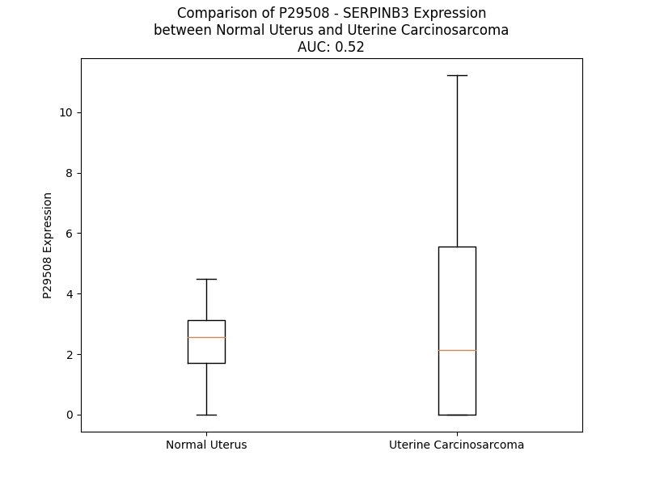

# Detailed Data for P29508

## Introduction to the Detailed Summary

### How to Interpret the Results

- **Summary & Metrics**: This section provides a quick reference to essential protein attributes, including expression changes, family classification, and biomarker applications. Regulation status (upregulated/downregulated) indicates the protein's behavior in a disease context. Some information comes from the original excel file with the proteins selected from literature, while others are derived from the analyses.
- **Expression Comparison**: A visual representation comparing protein expression between normal and disease states. It highlights significant changes in expression levels that might indicate diagnostic or therapeutic relevance. This is data coming from transcriptomics experiments and could not translate similarly to protein levels.
- **Isoform Alignment**: An interactive view of isoform alignments, revealing structural and functional differences between variants of the protein.
- **Interactors & Homologs**: Tables listing known interaction partners and homologous proteins, the more interactors and homologs, the more complex the protein is to design an antibody for.
- **Biological Assemblies**: Information about the structural arrangement of the protein in different assemblies, providing insights into its functional state but also the complexity of the protein to develop antibodies.
- **Combined Per-Residue Information**: A detailed table summarizing residue-level data. This includes predictions for epitope regions, aggregation tendencies, and modifications that might impact the protein's function. Each row corresponds to a residue in the protein, providing insights into specific sites that may be important for research or drug development.
## Summary & Metrics

- **UniProt Accession**: P29508
- **Gene Name**: SERPINB3
- **Protein Name**: Serpin B3
- **Swiss Prot**: SPB3_HUMAN
- **Family**: other
- **Biomarker Application**: diagnosis,prognosis
- **Number of Isoforms**: 2
- **Regulation**: 1
- **(transcriptomics) AUC**: 0.46
- **(transcriptomics) Fold Change**: 1.10
- **(transcriptomics) Regulation**: Upregulated
- **Discotope Epitope Count**: 76
- **Max n_uniprots (Homo)**: 1
- **Max n_uniprots (Hetero)**: N/A

## Expression Comparison

## Isoform Alignment

<pre style='font-size:14px; font-family:monospace;'>P29508-1 MNSLSEANTKFMFDLFQQFRKSKENNIFYSPISITSALGMVLLGAKDNTAQQIKKVLHFDQVTENTTGKAATYHVDRSGNVHHQFQKLLTEFNKSTDAYELKIANKLFGEKTYLFLQEYLDAIKKFYQTSVESVDFANAPEESRKKINSWVESQTNEKIKNLIPEGNIGSNTTLVLVNAIYFKGQWEKKFNKEDTKEEKFWPNKNTYKSIQMMRQYTSFHFASLEDVQAKVLEIPYKGKDLSMIVLLPNEIDGLQKLEEKLTAEKLMEWTSLQNMRETRVDLHLPRFKVEESYDLKDTLRTMGMVDIFNGDADLSGMTGSRGLVLSGVLHKAFVEVTEEGAEAAAATAVVGFGSSPTSTNEEFHCNHPFLFFIRQNKTNSILFYGRFSSP
P29508-2 MNSLSEANTKFMFDLFQQFRKSKENNIFYSPISITSALGMVLLGAKDNTAQQIKKVLHFDQVTENTTGKAATYHVDRSGNVHHQFQKLLTEFNKSTDAYELKIANKLFGEKTYLFLQEYLDAIKKFYQTSVESVDFANAPEESRKKINSWVESQTNEKIKNLIPEGNIGSNTTLVLVNAIYFKGQWEKKFNKEDTKEEKFWPNK----------------------------------------------------LEEKLTAEKLMEWTSLQNMRETRVDLHLPRFKVEESYDLKDTLRTMGMVDIFNGDADLSGMTGSRGLVLSGVLHKAFVEVTEEGAEAAAATAVVGFGSSPTSTNEEFHCNHPFLFFIRQNKTNSILFYGRFSSP
</pre>

## Interactors

| preferredName_A   | preferredName_B   |   score |
|:------------------|:------------------|--------:|
| SERPINB3          | SERPINB4          |   0.999 |
| SERPINB3          | CTSG              |   0.932 |

## Homologs

| uniprot_id   | gene_id   |
|:-------------|:----------|
| P48594       | SERPINB4  |
| P48595       | SERPINB10 |
| E9PMI5       | SERPINH1  |
| A0A024R6N5   | SERPINA1  |
| P20848       | SERPINA2  |
| V9HWH1       | HEL57     |
| A0A1B0GX82   | SERPINB7  |
| Q86U17       | SERPINA11 |
| G3V4B4       | SERPINA5  |
| A8MV23       | SERPINE3  |
| E9PDK7       | SERPINB2  |
| Q96P63       | SERPINB12 |
| Q99574       | SERPINI1  |
| P05121       | SERPINE1  |
| G3V2W1       | SERPINA10 |
| C9J7N5       | SERPINI2  |
| P05546       | SERPIND1  |
| H7BZS9       | SERPINB13 |
| C9JZJ9       | SERPING1  |
| P01008       | SERPINC1  |
| F5GWT8       | SERPINB11 |
| G3V4V7       | SERPINA6  |
| A0A6Q8JH89   | SERPINA9  |
| P05543       | SERPINA7  |
| C9JPV4       | SERPINF2  |
| G3V595       | SERPINA3  |
| P36952       | SERPINB5  |
| P50453       | SERPINB9  |
| A0A2R8Y6N4   | SERPINB6  |
| P0C7T4       | HMSD      |
| Q8IW75       | SERPINA12 |
| C9K031       | SERPINE2  |
| A0A7P0T9S6   | AGT       |
| P50452       | SERPINB8  |
| P29622       | SERPINA4  |
| I3L107       | SERPINF1  |

## Biological Assemblies

|   Unnamed: 0 |   assembly |   n_uniprots | composition   | crystal_id   |
|-------------:|-----------:|-------------:|:--------------|:-------------|
|            0 |          1 |            1 | Homo          | 2zv6         |
|            1 |          2 |            1 | Homo          | 2zv6         |
|            2 |          3 |            1 | Homo          | 2zv6         |
|            0 |          1 |            1 | Homo          | 4zk3         |
|            0 |          1 |            1 | Homo          | 4zk0         |

## Combined Per-Residue Information

|   res | aa   |   epitope_score | epitope   |   relative_surface_accessibility |   modeling_confidence |   Aggregation | modification       |
|------:|:-----|----------------:|:----------|---------------------------------:|----------------------:|--------------:|:-------------------|
|     1 | M    |         0.06213 | False     |                          0.5413  |                 52.4  |         0     | N-acetylmethionine |
|     2 | N    |         0.06777 | False     |                          0.44893 |                 69.93 |         0     | N/A                |
|     3 | S    |         0.03468 | False     |                          0.1805  |                 81.48 |         0     | N/A                |
|     4 | L    |         0.01637 | False     |                          0.03215 |                 88.1  |         0     | N/A                |
|     5 | S    |         0.01122 | False     |                          0.00744 |                 88.3  |         0     | N/A                |
|     6 | E    |         0.08239 | False     |                          0.35507 |                 88.74 |         0     | N/A                |
|     7 | A    |         0.00866 | False     |                          0.02736 |                 91.24 |         0     | N/A                |
|     8 | N    |         0.00261 | False     |                          0       |                 93.13 |         0     | N/A                |
|     9 | T    |         0.00295 | False     |                          0.00168 |                 93.32 |         0.668 | N/A                |
|    10 | K    |         0.07623 | False     |                          0.30955 |                 94.26 |         1.79  | N/A                |
|    11 | F    |         0.00408 | False     |                          0       |                 96.18 |         1.79  | N/A                |
|    12 | M    |         0.00386 | False     |                          0       |                 96.64 |         1.79  | N/A                |
|    13 | F    |         0.0454  | False     |                          0.062   |                 94.91 |         1.79  | N/A                |
|    14 | D    |         0.10541 | False     |                          0.3546  |                 95.4  |         1.79  | N/A                |
|    15 | L    |         0.00315 | False     |                          0       |                 96.46 |         1.79  | N/A                |
|    16 | F    |         0.00578 | False     |                          0.00255 |                 95.59 |         1.79  | N/A                |
|    17 | Q    |         0.17161 | False     |                          0.33371 |                 93.76 |         0     | N/A                |
|    18 | Q    |         0.09072 | False     |                          0.19027 |                 94.89 |         0     | N/A                |
|    19 | F    |         0.03041 | False     |                          0.03822 |                 94.55 |         0     | N/A                |
|    20 | R    |         0.18052 | False     |                          0.21398 |                 90.79 |         0     | N/A                |
|    21 | K    |         0.2239  | True      |                          0.75131 |                 88.63 |         0     | N/A                |
|    22 | S    |         0.27766 | True      |                          0.72641 |                 79.79 |         0     | N/A                |
|    23 | K    |         0.15246 | False     |                          0.26559 |                 73.35 |         0     | N/A                |
|    24 | E    |         0.24542 | True      |                          0.856   |                 73.9  |         0     | N/A                |
|    25 | N    |         0.18192 | False     |                          0.66266 |                 86.86 |         0     | N/A                |
|    26 | N    |         0.04594 | False     |                          0.14918 |                 94.82 |         0     | N/A                |
|    27 | I    |         0.00269 | False     |                          0       |                 96.35 |         0     | N/A                |
|    28 | F    |         0.00299 | False     |                          0       |                 96.68 |         0     | N/A                |
|    29 | Y    |         0.00343 | False     |                          0       |                 97.39 |         0     | N/A                |
|    30 | S    |         0.00158 | False     |                          0       |                 97.49 |         0     | N/A                |
|    31 | P    |         0.00154 | False     |                          0       |                 96.95 |         0.077 | N/A                |
|    32 | I    |         0.00976 | False     |                          0.01883 |                 94.27 |         9.486 | N/A                |
|    33 | S    |         0.00221 | False     |                          0.00728 |                 95.48 |        10.292 | N/A                |
|    34 | I    |         0.00509 | False     |                          0.012   |                 97.99 |        17.23  | N/A                |
|    35 | T    |         0.00292 | False     |                          0       |                 96.78 |        17.825 | N/A                |
|    36 | S    |         0.0063  | False     |                          0.01019 |                 95.62 |        18.823 | N/A                |
|    37 | A    |         0.00341 | False     |                          0.00638 |                 97.42 |        27.258 | N/A                |
|    38 | L    |         0.00266 | False     |                          0.00165 |                 98    |        37.003 | N/A                |
|    39 | G    |         0.0025  | False     |                          0       |                 96.53 |        38.202 | N/A                |
|    40 | M    |         0.0048  | False     |                          0.00202 |                 97.4  |        41.546 | N/A                |
|    41 | V    |         0.00171 | False     |                          0       |                 97.93 |        44.084 | N/A                |
|    42 | L    |         0.01705 | False     |                          0.03075 |                 97.49 |        43.52  | N/A                |
|    43 | L    |         0.04171 | False     |                          0.10197 |                 95.79 |        38.867 | N/A                |
|    44 | G    |         0.00416 | False     |                          0       |                 96.5  |        12.174 | N/A                |
|    45 | A    |         0.02702 | False     |                          0.06128 |                 97.71 |        10.941 | N/A                |
|    46 | K    |         0.23315 | True      |                          0.43525 |                 96.7  |         0     | N/A                |
|    47 | D    |         0.22077 | True      |                          0.58983 |                 95.16 |         0     | N/A                |
|    48 | N    |         0.1966  | False     |                          0.49151 |                 97.06 |         0     | N/A                |
|    49 | T    |         0.0138  | False     |                          0.01154 |                 97.7  |         0     | N/A                |
|    50 | A    |         0.03345 | False     |                          0.09055 |                 97.17 |         0     | N/A                |
|    51 | Q    |         0.1476  | False     |                          0.6008  |                 97.11 |         0     | N/A                |
|    52 | Q    |         0.11367 | False     |                          0.15245 |                 98.23 |         0     | N/A                |
|    53 | I    |         0.00633 | False     |                          0.0024  |                 97.99 |         0     | N/A                |
|    54 | K    |         0.10146 | False     |                          0.25178 |                 96.45 |         0     | N/A                |
|    55 | K    |         0.18702 | False     |                          0.72764 |                 96.53 |         0     | N/A                |
|    56 | V    |         0.05624 | False     |                          0.06329 |                 97.91 |         0     | N/A                |
|    57 | L    |         0.0043  | False     |                          0       |                 96.51 |         0     | N/A                |
|    58 | H    |         0.05283 | False     |                          0.15609 |                 94.45 |         0     | N/A                |
|    59 | F    |         0.02505 | False     |                          0.05756 |                 92.32 |         0     | N/A                |
|    60 | D    |         0.18892 | False     |                          0.5574  |                 85.7  |         0     | N/A                |
|    61 | Q    |         0.15324 | False     |                          0.45568 |                 80.12 |         0     | N/A                |
|    62 | V    |         0.04071 | False     |                          0.09026 |                 74.38 |         0     | N/A                |
|    63 | T    |         0.09902 | False     |                          0.63386 |                 60.42 |         0     | N/A                |
|    64 | E    |         0.1013  | False     |                          0.40665 |                 52.09 |         0     | N/A                |
|    65 | N    |         0.16541 | False     |                          0.90429 |                 40.49 |         0     | N/A                |
|    66 | T    |         0.1592  | False     |                          0.57187 |                 38.76 |         0     | N/A                |
|    67 | T    |         0.15733 | False     |                          1.02366 |                 34.17 |         0     | N/A                |
|    68 | G    |         0.30248 | True      |                          0.72498 |                 30.79 |         0     | N/A                |
|    69 | K    |         0.22574 | True      |                          0.93514 |                 30.88 |         0     | N/A                |
|    70 | A    |         0.26247 | True      |                          0.85662 |                 36.56 |         0     | N/A                |
|    71 | A    |         0.18402 | False     |                          0.99761 |                 37.38 |         0     | N/A                |
|    72 | T    |         0.16986 | False     |                          0.57687 |                 39.24 |         0     | N/A                |
|    73 | Y    |         0.16085 | False     |                          0.68337 |                 40.1  |         0     | N/A                |
|    74 | H    |         0.27176 | True      |                          0.63114 |                 38.33 |         0     | N/A                |
|    75 | V    |         0.11586 | False     |                          0.38211 |                 50.33 |         0     | N/A                |
|    76 | D    |         0.32902 | True      |                          0.64153 |                 40.95 |         0     | N/A                |
|    77 | R    |         0.09683 | False     |                          0.27833 |                 50.01 |         0     | N/A                |
|    78 | S    |         0.13326 | False     |                          0.70756 |                 46.35 |         0     | N/A                |
|    79 | G    |         0.06415 | False     |                          0.27531 |                 55.6  |         0     | N/A                |
|    80 | N    |         0.05821 | False     |                          0.1003  |                 80.68 |         0     | N/A                |
|    81 | V    |         0.02497 | False     |                          0.09933 |                 90.02 |         0     | N/A                |
|    82 | H    |         0.01992 | False     |                          0.03836 |                 93.14 |         0     | N/A                |
|    83 | H    |         0.13324 | False     |                          0.15026 |                 91.03 |         0     | N/A                |
|    84 | Q    |         0.06639 | False     |                          0.13079 |                 90.39 |         0     | N/A                |
|    85 | F    |         0.00282 | False     |                          0       |                 92.4  |         0     | N/A                |
|    86 | Q    |         0.16064 | False     |                          0.24698 |                 93.71 |         0     | N/A                |
|    87 | K    |         0.33836 | True      |                          0.68862 |                 91.03 |         0     | N/A                |
|    88 | L    |         0.03856 | False     |                          0.11236 |                 90.07 |         0     | N/A                |
|    89 | L    |         0.04226 | False     |                          0.06925 |                 91.98 |         0     | N/A                |
|    90 | T    |         0.21292 | True      |                          0.47026 |                 92.22 |         0     | N/A                |
|    91 | E    |         0.18541 | False     |                          0.37097 |                 89.35 |         0     | N/A                |
|    92 | F    |         0.0451  | False     |                          0.03695 |                 87.63 |         0     | N/A                |
|    93 | N    |         0.15011 | False     |                          0.60279 |                 87.05 |         0     | N/A                |
|    94 | K    |         0.33079 | True      |                          0.57228 |                 88.78 |         0     | N/A                |
|    95 | S    |         0.2532  | True      |                          0.91306 |                 83.78 |         0     | N/A                |
|    96 | T    |         0.21393 | True      |                          0.38156 |                 89.03 |         0     | N/A                |
|    97 | D    |         0.41707 | True      |                          0.62709 |                 88.91 |         0     | N/A                |
|    98 | A    |         0.177   | False     |                          0.05357 |                 91.55 |         0     | N/A                |
|    99 | Y    |         0.09603 | False     |                          0.14946 |                 91.15 |         0     | N/A                |
|   100 | E    |         0.09541 | False     |                          0.29938 |                 90.48 |         0     | N/A                |
|   101 | L    |         0.03441 | False     |                          0.10676 |                 91.44 |         0     | N/A                |
|   102 | K    |         0.10136 | False     |                          0.39525 |                 89.95 |         0     | N/A                |
|   103 | I    |         0.04445 | False     |                          0.22648 |                 90.91 |         0     | N/A                |
|   104 | A    |         0.01346 | False     |                          0.03444 |                 89.16 |         0     | N/A                |
|   105 | N    |         0.03036 | False     |                          0.07306 |                 93.32 |         0     | N/A                |
|   106 | K    |         0.0352  | False     |                          0.10872 |                 97.21 |         0     | N/A                |
|   107 | L    |         0.00368 | False     |                          0.00318 |                 97.97 |         1.051 | N/A                |
|   108 | F    |         0.00283 | False     |                          0       |                 98.24 |         1.244 | N/A                |
|   109 | G    |         0.00596 | False     |                          0       |                 97.54 |         1.244 | N/A                |
|   110 | E    |         0.0311  | False     |                          0.02857 |                 97.61 |         1.244 | N/A                |
|   111 | K    |         0.26247 | True      |                          0.48421 |                 96.35 |         1.244 | N/A                |
|   112 | T    |         0.28605 | True      |                          0.69395 |                 95.45 |        27.977 | N/A                |
|   113 | Y    |         0.14838 | False     |                          0.22718 |                 95.4  |        32.526 | N/A                |
|   114 | L    |         0.25846 | True      |                          0.91553 |                 95.51 |        32.526 | N/A                |
|   115 | F    |         0.10972 | False     |                          0.14677 |                 96.92 |        32.526 | N/A                |
|   116 | L    |         0.30536 | True      |                          0.41877 |                 97.55 |        32.526 | N/A                |
|   117 | Q    |         0.20007 | False     |                          0.58221 |                 97.57 |         5.616 | N/A                |
|   118 | E    |         0.28991 | True      |                          0.75561 |                 96.1  |         0.079 | N/A                |
|   119 | Y    |         0.02511 | False     |                          0.03193 |                 97.08 |         0.079 | N/A                |
|   120 | L    |         0.10327 | False     |                          0.31471 |                 97.64 |         0.079 | N/A                |
|   121 | D    |         0.18916 | False     |                          0.46053 |                 97.48 |         0.079 | N/A                |
|   122 | A    |         0.07329 | False     |                          0.15488 |                 95.86 |         0.079 | N/A                |
|   123 | I    |         0.00608 | False     |                          0.0024  |                 96.41 |         0.079 | N/A                |
|   124 | K    |         0.23209 | True      |                          0.72814 |                 96.69 |         0.079 | N/A                |
|   125 | K    |         0.26052 | True      |                          0.44476 |                 95.83 |         0.079 | N/A                |
|   126 | F    |         0.03471 | False     |                          0.01529 |                 94.88 |         0.079 | N/A                |
|   127 | Y    |         0.03127 | False     |                          0.03778 |                 95.86 |         0.079 | N/A                |
|   128 | Q    |         0.13218 | False     |                          0.40308 |                 94.76 |         0     | N/A                |
|   129 | T    |         0.05949 | False     |                          0.17346 |                 95.4  |         0     | N/A                |
|   130 | S    |         0.13295 | False     |                          0.43417 |                 94.54 |         0     | N/A                |
|   131 | V    |         0.06319 | False     |                          0.13454 |                 96.95 |         0     | N/A                |
|   132 | E    |         0.07726 | False     |                          0.18584 |                 97.29 |         0     | N/A                |
|   133 | S    |         0.07053 | False     |                          0.4647  |                 97.46 |         0     | N/A                |
|   134 | V    |         0.0497  | False     |                          0.05332 |                 97.65 |         0     | N/A                |
|   135 | D    |         0.11104 | False     |                          0.19003 |                 97.69 |         0     | N/A                |
|   136 | F    |         0.00627 | False     |                          0       |                 97.83 |         0     | N/A                |
|   137 | A    |         0.09027 | False     |                          0.39505 |                 96.83 |         0     | N/A                |
|   138 | N    |         0.29401 | True      |                          0.72122 |                 97.74 |         0     | N/A                |
|   139 | A    |         0.12695 | False     |                          0.29335 |                 97.25 |         0     | N/A                |
|   140 | P    |         0.0776  | False     |                          0.25846 |                 97.16 |         0     | N/A                |
|   141 | E    |         0.14091 | False     |                          0.34366 |                 97.21 |         0     | N/A                |
|   142 | E    |         0.1336  | False     |                          0.51958 |                 97.68 |         0     | N/A                |
|   143 | S    |         0.02618 | False     |                          0.03919 |                 97.75 |         0     | N/A                |
|   144 | R    |         0.1328  | False     |                          0.0782  |                 97.38 |         0     | N/A                |
|   145 | K    |         0.10317 | False     |                          0.4978  |                 97.68 |         0     | N/A                |
|   146 | K    |         0.14196 | False     |                          0.48527 |                 97.54 |         0     | N/A                |
|   147 | I    |         0.00498 | False     |                          0       |                 97.01 |         0.162 | N/A                |
|   148 | N    |         0.12537 | False     |                          0.07477 |                 96.67 |         0.162 | N/A                |
|   149 | S    |         0.1265  | False     |                          0.51984 |                 97.04 |         0.162 | N/A                |
|   150 | W    |         0.12965 | False     |                          0.17593 |                 96.46 |         0.162 | N/A                |
|   151 | V    |         0.00349 | False     |                          0.00286 |                 94.11 |         0.162 | N/A                |
|   152 | E    |         0.05726 | False     |                          0.25375 |                 94.37 |         0     | N/A                |
|   153 | S    |         0.14123 | False     |                          0.54677 |                 94.38 |         0     | N/A                |
|   154 | Q    |         0.05436 | False     |                          0.40896 |                 89.63 |         0     | N/A                |
|   155 | T    |         0.0156  | False     |                          0       |                 86.89 |         0     | N/A                |
|   156 | N    |         0.21864 | True      |                          0.51487 |                 86.65 |         0     | N/A                |
|   157 | E    |         0.2254  | True      |                          0.5588  |                 90.46 |         0     | N/A                |
|   158 | K    |         0.22446 | True      |                          0.40769 |                 87.87 |         0     | N/A                |
|   159 | I    |         0.01735 | False     |                          0.00059 |                 86.79 |         0     | N/A                |
|   160 | K    |         0.1349  | False     |                          0.45061 |                 91.15 |         0     | N/A                |
|   161 | N    |         0.21197 | True      |                          0.71217 |                 91.8  |         0     | N/A                |
|   162 | L    |         0.03522 | False     |                          0.02704 |                 91.57 |         0     | N/A                |
|   163 | I    |         0.00863 | False     |                          0.00059 |                 92.8  |         0     | N/A                |
|   164 | P    |         0.28757 | True      |                          0.55569 |                 92.63 |         0     | N/A                |
|   165 | E    |         0.27526 | True      |                          0.71285 |                 92.4  |         0     | N/A                |
|   166 | G    |         0.26542 | True      |                          0.79039 |                 89.56 |         0     | N/A                |
|   167 | N    |         0.23875 | True      |                          0.48333 |                 88.99 |         0.018 | N/A                |
|   168 | I    |         0.05793 | False     |                          0.04115 |                 92.4  |         0.099 | N/A                |
|   169 | G    |         0.1355  | False     |                          0.3358  |                 93.41 |         0.104 | N/A                |
|   170 | S    |         0.29486 | True      |                          0.57405 |                 95.59 |         0.186 | N/A                |
|   171 | N    |         0.20788 | True      |                          0.81428 |                 94.98 |         0.861 | N/A                |
|   172 | T    |         0.03935 | False     |                          0.06111 |                 96.82 |        18.236 | N/A                |
|   173 | T    |         0.10563 | False     |                          0.15043 |                 96.65 |        47.108 | N/A                |
|   174 | L    |         0.00228 | False     |                          0       |                 98.2  |        89.066 | N/A                |
|   175 | V    |         0.00765 | False     |                          0.02475 |                 98    |        96.703 | N/A                |
|   176 | L    |         0.00216 | False     |                          0.00247 |                 98.33 |        97.348 | N/A                |
|   177 | V    |         0.00278 | False     |                          0       |                 97.79 |        97.254 | N/A                |
|   178 | N    |         0.0086  | False     |                          0.00861 |                 96.63 |        90.907 | N/A                |
|   179 | A    |         0.00356 | False     |                          0       |                 95.33 |        90.404 | N/A                |
|   180 | I    |         0.00654 | False     |                          0.0016  |                 94.22 |        89.946 | N/A                |
|   181 | Y    |         0.00982 | False     |                          0.00556 |                 92.51 |        84.869 | N/A                |
|   182 | F    |         0.0032  | False     |                          0.00255 |                 93.57 |        78.472 | N/A                |
|   183 | K    |         0.08772 | False     |                          0.28326 |                 92.66 |         0     | N/A                |
|   184 | G    |         0.04249 | False     |                          0.0958  |                 92.4  |         0     | N/A                |
|   185 | Q    |         0.15394 | False     |                          0.27036 |                 95.05 |         0     | N/A                |
|   186 | W    |         0.04124 | False     |                          0.02162 |                 96.38 |         0     | N/A                |
|   187 | E    |         0.12479 | False     |                          0.3341  |                 95.67 |         0     | N/A                |
|   188 | K    |         0.08688 | False     |                          0.42369 |                 95.04 |         0     | N/A                |
|   189 | K    |         0.14375 | False     |                          0.33373 |                 92.19 |         0     | N/A                |
|   190 | F    |         0.01574 | False     |                          0.0279  |                 95.43 |         0     | N/A                |
|   191 | N    |         0.0998  | False     |                          0.45563 |                 94.69 |         0     | N/A                |
|   192 | K    |         0.24743 | True      |                          0.63809 |                 94.4  |         0     | N/A                |
|   193 | E    |         0.25637 | True      |                          0.75824 |                 95.55 |         0     | N/A                |
|   194 | D    |         0.12748 | False     |                          0.40395 |                 96.39 |         0     | N/A                |
|   195 | T    |         0.0669  | False     |                          0.14174 |                 97.66 |         0     | N/A                |
|   196 | K    |         0.29377 | True      |                          0.63455 |                 98.01 |         0     | N/A                |
|   197 | E    |         0.33134 | True      |                          0.59463 |                 98.34 |         0     | N/A                |
|   198 | E    |         0.15144 | False     |                          0.22561 |                 98.17 |         0     | N/A                |
|   199 | K    |         0.2836  | True      |                          0.50201 |                 97.78 |         0     | N/A                |
|   200 | F    |         0.00719 | False     |                          0       |                 98.02 |         0     | N/A                |
|   201 | W    |         0.332   | True      |                          0.30124 |                 97.24 |         0     | N/A                |
|   202 | P    |         0.12545 | False     |                          0.24312 |                 94.8  |         0     | N/A                |
|   203 | N    |         0.23356 | True      |                          0.40941 |                 92.43 |         0     | N/A                |
|   204 | K    |         0.47134 | True      |                          0.55135 |                 92.86 |         0     | N/A                |
|   205 | N    |         0.42873 | True      |                          0.86036 |                 94.38 |         0     | N/A                |
|   206 | T    |         0.52143 | True      |                          0.51775 |                 95.44 |         0     | N/A                |
|   207 | Y    |         0.48147 | True      |                          0.52951 |                 96.06 |         0     | N/A                |
|   208 | K    |         0.40862 | True      |                          0.46415 |                 96.45 |         0     | N/A                |
|   209 | S    |         0.38193 | True      |                          0.49648 |                 97.54 |         0     | N/A                |
|   210 | I    |         0.11821 | False     |                          0.088   |                 97.64 |         0     | N/A                |
|   211 | Q    |         0.13704 | False     |                          0.3045  |                 97.91 |         0     | N/A                |
|   212 | M    |         0.00984 | False     |                          0.00159 |                 98.32 |         0     | N/A                |
|   213 | M    |         0.01166 | False     |                          0       |                 98.11 |         0     | N/A                |
|   214 | R    |         0.17924 | False     |                          0.43401 |                 97.32 |         0     | N/A                |
|   215 | Q    |         0.07625 | False     |                          0.10307 |                 95.58 |         0     | N/A                |
|   216 | Y    |         0.26968 | True      |                          0.48851 |                 95.61 |         0     | N/A                |
|   217 | T    |         0.08674 | False     |                          0.20352 |                 94.21 |         0     | N/A                |
|   218 | S    |         0.12745 | False     |                          0.26064 |                 95.38 |         0     | N/A                |
|   219 | F    |         0.03306 | False     |                          0.04866 |                 96.24 |         0     | N/A                |
|   220 | H    |         0.10138 | False     |                          0.35384 |                 96.75 |         0     | N/A                |
|   221 | F    |         0.05348 | False     |                          0.08354 |                 97.24 |         0     | N/A                |
|   222 | A    |         0.10869 | False     |                          0.09693 |                 96.08 |         0     | N/A                |
|   223 | S    |         0.08057 | False     |                          0.51341 |                 95.37 |         0     | N/A                |
|   224 | L    |         0.07575 | False     |                          0.10626 |                 94.19 |         0     | N/A                |
|   225 | E    |         0.26488 | True      |                          0.78296 |                 91.63 |         0     | N/A                |
|   226 | D    |         0.26553 | True      |                          0.7713  |                 89.33 |         0     | N/A                |
|   227 | V    |         0.10046 | False     |                          0.06174 |                 93.47 |         0     | N/A                |
|   228 | Q    |         0.18231 | False     |                          0.52373 |                 95.59 |         0     | N/A                |
|   229 | A    |         0.00471 | False     |                          0.00377 |                 97.49 |         0     | N/A                |
|   230 | K    |         0.07679 | False     |                          0.22998 |                 97.03 |         0     | N/A                |
|   231 | V    |         0.0039  | False     |                          0       |                 97.76 |         0     | N/A                |
|   232 | L    |         0.00349 | False     |                          0       |                 98.03 |         0     | N/A                |
|   233 | E    |         0.01657 | False     |                          0.03536 |                 97.76 |         0     | N/A                |
|   234 | I    |         0.01411 | False     |                          0.0104  |                 97.03 |         0     | N/A                |
|   235 | P    |         0.07626 | False     |                          0.19972 |                 96.47 |         0     | N/A                |
|   236 | Y    |         0.02616 | False     |                          0.01948 |                 95.53 |         0     | N/A                |
|   237 | K    |         0.17573 | False     |                          0.24648 |                 94.85 |         0     | N/A                |
|   238 | G    |         0.15124 | False     |                          0.65967 |                 92.71 |         0     | N/A                |
|   239 | K    |         0.26441 | True      |                          0.59007 |                 93.29 |         0     | N/A                |
|   240 | D    |         0.17798 | False     |                          0.48723 |                 93.17 |         0     | N/A                |
|   241 | L    |         0.01097 | False     |                          0.00778 |                 94.99 |        51.621 | N/A                |
|   242 | S    |         0.00507 | False     |                          0.00158 |                 96.54 |        52.658 | N/A                |
|   243 | M    |         0.00309 | False     |                          0       |                 97.85 |        53.844 | N/A                |
|   244 | I    |         0.0038  | False     |                          0       |                 97.55 |        54.132 | N/A                |
|   245 | V    |         0.00389 | False     |                          0       |                 98.26 |        54.132 | N/A                |
|   246 | L    |         0.00246 | False     |                          0.00082 |                 97.99 |        46.477 | N/A                |
|   247 | L    |         0.02425 | False     |                          0.04842 |                 98.3  |         3.639 | N/A                |
|   248 | P    |         0.01016 | False     |                          0.00934 |                 97.91 |         1.212 | N/A                |
|   249 | N    |         0.10382 | False     |                          0.4996  |                 97.25 |         0     | N/A                |
|   250 | E    |         0.17731 | False     |                          0.49673 |                 96.51 |         0     | N/A                |
|   251 | I    |         0.22878 | True      |                          0.28502 |                 94.92 |         0     | N/A                |
|   252 | D    |         0.24497 | True      |                          0.47873 |                 92.08 |         0     | N/A                |
|   253 | G    |         0.06841 | False     |                          0.11651 |                 94.14 |         0     | N/A                |
|   254 | L    |         0.05954 | False     |                          0.09551 |                 94.19 |         0     | N/A                |
|   255 | Q    |         0.21503 | True      |                          0.58587 |                 90.73 |         0     | N/A                |
|   256 | K    |         0.17083 | False     |                          0.62808 |                 91.48 |         0     | N/A                |
|   257 | L    |         0.00593 | False     |                          0.00082 |                 94.06 |         0     | N/A                |
|   258 | E    |         0.02716 | False     |                          0.02007 |                 93.72 |         0     | N/A                |
|   259 | E    |         0.22129 | True      |                          0.5825  |                 91.63 |         0     | N/A                |
|   260 | K    |         0.11723 | False     |                          0.48185 |                 91.48 |         0     | N/A                |
|   261 | L    |         0.03165 | False     |                          0.04294 |                 92.64 |         0     | N/A                |
|   262 | T    |         0.14248 | False     |                          0.39371 |                 91.49 |         0     | N/A                |
|   263 | A    |         0.05114 | False     |                          0.0711  |                 88.9  |         0     | N/A                |
|   264 | E    |         0.18717 | False     |                          0.50797 |                 90.42 |         0     | N/A                |
|   265 | K    |         0.11095 | False     |                          0.34018 |                 92.12 |         0     | N/A                |
|   266 | L    |         0.00564 | False     |                          0.01072 |                 92.36 |         0     | N/A                |
|   267 | M    |         0.08946 | False     |                          0.30478 |                 88.44 |         0     | N/A                |
|   268 | E    |         0.2061  | True      |                          0.50934 |                 91.94 |         0     | N/A                |
|   269 | W    |         0.06805 | False     |                          0.1138  |                 92.49 |         0     | N/A                |
|   270 | T    |         0.03064 | False     |                          0.05288 |                 91.34 |         0     | N/A                |
|   271 | S    |         0.09885 | False     |                          0.29958 |                 91.1  |         0     | N/A                |
|   272 | L    |         0.15861 | False     |                          0.6247  |                 86.1  |         0     | N/A                |
|   273 | Q    |         0.32595 | True      |                          0.87409 |                 89.27 |         0     | N/A                |
|   274 | N    |         0.13773 | False     |                          0.4945  |                 91.03 |         0     | N/A                |
|   275 | M    |         0.06739 | False     |                          0.05953 |                 94.3  |         0     | N/A                |
|   276 | R    |         0.22318 | True      |                          0.7745  |                 94.15 |         0     | N/A                |
|   277 | E    |         0.22818 | True      |                          0.69396 |                 94.73 |         0     | N/A                |
|   278 | T    |         0.10227 | False     |                          0.20784 |                 95.22 |         0     | N/A                |
|   279 | R    |         0.14519 | False     |                          0.40406 |                 96.8  |         0     | N/A                |
|   280 | V    |         0.00382 | False     |                          0       |                 97.25 |         0     | N/A                |
|   281 | D    |         0.15628 | False     |                          0.16318 |                 97.63 |         0     | N/A                |
|   282 | L    |         0.00328 | False     |                          0       |                 98.25 |         0     | N/A                |
|   283 | H    |         0.10822 | False     |                          0.10954 |                 98.4  |         0     | N/A                |
|   284 | L    |         0.00376 | False     |                          0       |                 98.18 |         0     | N/A                |
|   285 | P    |         0.004   | False     |                          0       |                 97.51 |         0     | N/A                |
|   286 | R    |         0.1558  | False     |                          0.45542 |                 96.18 |         0     | N/A                |
|   287 | F    |         0.03077 | False     |                          0.05209 |                 94.84 |         0     | N/A                |
|   288 | K    |         0.12568 | False     |                          0.63927 |                 93.09 |         0     | N/A                |
|   289 | V    |         0.04245 | False     |                          0.02475 |                 93.31 |         0     | N/A                |
|   290 | E    |         0.07507 | False     |                          0.39194 |                 92.94 |         0     | N/A                |
|   291 | E    |         0.1604  | False     |                          0.16664 |                 94.73 |         0     | N/A                |
|   292 | S    |         0.07523 | False     |                          0.4076  |                 94.59 |         0     | N/A                |
|   293 | Y    |         0.08635 | False     |                          0.076   |                 94.98 |         0     | N/A                |
|   294 | D    |         0.06756 | False     |                          0.44774 |                 95.35 |         0     | N/A                |
|   295 | L    |         0.00377 | False     |                          0.00082 |                 97.2  |         0     | N/A                |
|   296 | K    |         0.08101 | False     |                          0.30241 |                 96.31 |         0     | N/A                |
|   297 | D    |         0.18522 | False     |                          0.63046 |                 96.15 |         0     | N/A                |
|   298 | T    |         0.11294 | False     |                          0.18666 |                 97.64 |         0     | N/A                |
|   299 | L    |         0.00273 | False     |                          0       |                 98.46 |         0     | N/A                |
|   300 | R    |         0.2153  | True      |                          0.52569 |                 97.8  |         0     | N/A                |
|   301 | T    |         0.18462 | False     |                          0.70628 |                 97.35 |         0.143 | N/A                |
|   302 | M    |         0.15392 | False     |                          0.19143 |                 97.89 |         0.143 | N/A                |
|   303 | G    |         0.1596  | False     |                          0.35982 |                 98.06 |         0.143 | N/A                |
|   304 | M    |         0.00971 | False     |                          0.00067 |                 98.13 |         0.143 | N/A                |
|   305 | V    |         0.17475 | False     |                          0.36936 |                 98.18 |         0.143 | N/A                |
|   306 | D    |         0.1205  | False     |                          0.11098 |                 98.17 |         0     | N/A                |
|   307 | I    |         0.01583 | False     |                          0.008   |                 98.15 |         0     | N/A                |
|   308 | F    |         0.04981 | False     |                          0.09523 |                 97.87 |         0     | N/A                |
|   309 | N    |         0.15555 | False     |                          0.32695 |                 95.86 |         0     | N/A                |
|   310 | G    |         0.29249 | True      |                          0.91159 |                 94.32 |         0     | N/A                |
|   311 | D    |         0.24892 | True      |                          0.59233 |                 96.89 |         0     | N/A                |
|   312 | A    |         0.03381 | False     |                          0.01636 |                 97.9  |         0     | N/A                |
|   313 | D    |         0.10727 | False     |                          0.04961 |                 98.23 |         0     | N/A                |
|   314 | L    |         0.01006 | False     |                          0.0073  |                 97.8  |         0     | N/A                |
|   315 | S    |         0.16887 | False     |                          0.20929 |                 97.57 |         0     | N/A                |
|   316 | G    |         0.07062 | False     |                          0.17437 |                 97.15 |         0     | N/A                |
|   317 | M    |         0.00656 | False     |                          0       |                 97.62 |         0     | N/A                |
|   318 | T    |         0.11389 | False     |                          0.11401 |                 96.43 |         0     | N/A                |
|   319 | G    |         0.36413 | True      |                          0.63615 |                 95.22 |         0     | N/A                |
|   320 | S    |         0.21802 | True      |                          0.45677 |                 93.74 |         0     | N/A                |
|   321 | R    |         0.35311 | True      |                          0.61533 |                 93.22 |         0     | N/A                |
|   322 | G    |         0.16076 | False     |                          0.50787 |                 93.16 |         0.181 | N/A                |
|   323 | L    |         0.01194 | False     |                          0.00466 |                 97.08 |         4.542 | N/A                |
|   324 | V    |         0.10894 | False     |                          0.22183 |                 97.69 |         6.069 | N/A                |
|   325 | L    |         0.00201 | False     |                          0.00082 |                 98    |         6.069 | N/A                |
|   326 | S    |         0.04367 | False     |                          0.18527 |                 97.07 |         6.069 | N/A                |
|   327 | G    |         0.03229 | False     |                          0.09335 |                 95.73 |         6.069 | N/A                |
|   328 | V    |         0.00715 | False     |                          0.01238 |                 97.92 |         6.069 | N/A                |
|   329 | L    |         0.03645 | False     |                          0.06595 |                 97.59 |         4.547 | N/A                |
|   330 | H    |         0.00331 | False     |                          0.00147 |                 97.37 |         1.334 | N/A                |
|   331 | K    |         0.05495 | False     |                          0.09581 |                 96.99 |         1.334 | N/A                |
|   332 | A    |         0.00575 | False     |                          0       |                 95.9  |         1.334 | N/A                |
|   333 | F    |         0.04605 | False     |                          0.08344 |                 93.9  |         1.334 | N/A                |
|   334 | V    |         0.00444 | False     |                          0.00095 |                 94.82 |         1.334 | N/A                |
|   335 | E    |         0.0741  | False     |                          0.11037 |                 93.47 |         1.334 | N/A                |
|   336 | V    |         0.00807 | False     |                          0.01784 |                 95.04 |         1.334 | N/A                |
|   337 | T    |         0.0612  | False     |                          0.15236 |                 94.86 |         0.239 | N/A                |
|   338 | E    |         0.0993  | False     |                          0.06375 |                 94.99 |         0     | N/A                |
|   339 | E    |         0.16964 | False     |                          0.35382 |                 84.98 |         0     | N/A                |
|   340 | G    |         0.05714 | False     |                          0.1273  |                 55.85 |         0     | N/A                |
|   341 | A    |         0.13159 | False     |                          0.26713 |                 32.54 |         0     | N/A                |
|   342 | E    |         0.31421 | True      |                          0.92099 |                 27.68 |         0     | N/A                |
|   343 | A    |         0.14953 | False     |                          0.57898 |                 32.98 |         1.258 | N/A                |
|   344 | A    |         0.28453 | True      |                          0.96607 |                 24.78 |         2.748 | N/A                |
|   345 | A    |         0.2167  | True      |                          1.01296 |                 26.74 |         8.201 | N/A                |
|   346 | A    |         0.26584 | True      |                          0.82454 |                 24.63 |        14.417 | N/A                |
|   347 | T    |         0.13765 | False     |                          0.97801 |                 34.57 |        18.563 | N/A                |
|   348 | A    |         0.15177 | False     |                          0.6521  |                 27.04 |        25.07  | N/A                |
|   349 | V    |         0.13651 | False     |                          1.05086 |                 29.84 |        25.709 | N/A                |
|   350 | V    |         0.14172 | False     |                          0.65198 |                 34.34 |        25.512 | N/A                |
|   351 | G    |         0.2803  | True      |                          0.84629 |                 34.06 |        19.202 | N/A                |
|   352 | F    |         0.21185 | True      |                          0.72778 |                 42.29 |        18.463 | N/A                |
|   353 | G    |         0.38602 | True      |                          0.76232 |                 40.81 |         1.988 | N/A                |
|   354 | S    |         0.29583 | True      |                          0.95835 |                 38.83 |         0     | N/A                |
|   355 | S    |         0.27151 | True      |                          0.73647 |                 38.39 |         0     | N/A                |
|   356 | P    |         0.18655 | False     |                          0.92527 |                 42.22 |         0     | N/A                |
|   357 | T    |         0.20941 | True      |                          0.88553 |                 44.95 |         0     | N/A                |
|   358 | S    |         0.14701 | False     |                          0.58495 |                 52.84 |         0     | N/A                |
|   359 | T    |         0.11352 | False     |                          0.73867 |                 57.5  |         0     | N/A                |
|   360 | N    |         0.10012 | False     |                          0.6543  |                 77.22 |         0     | N/A                |
|   361 | E    |         0.10744 | False     |                          0.2245  |                 93.07 |         0     | N/A                |
|   362 | E    |         0.11391 | False     |                          0.50251 |                 96.5  |         0     | N/A                |
|   363 | F    |         0.00218 | False     |                          0       |                 98.01 |         0     | N/A                |
|   364 | H    |         0.07796 | False     |                          0.19675 |                 98.06 |         0     | N/A                |
|   365 | C    |         0.00325 | False     |                          0       |                 98.04 |         0     | N/A                |
|   366 | N    |         0.09082 | False     |                          0.20111 |                 97.78 |         0     | N/A                |
|   367 | H    |         0.02734 | False     |                          0.05557 |                 97.44 |         0     | N/A                |
|   368 | P    |         0.0202  | False     |                          0.06362 |                 97.09 |         1.267 | N/A                |
|   369 | F    |         0.00584 | False     |                          0       |                 97.34 |        95.884 | N/A                |
|   370 | L    |         0.0039  | False     |                          0.00165 |                 97.31 |        95.884 | N/A                |
|   371 | F    |         0.00406 | False     |                          0       |                 97.34 |        95.884 | N/A                |
|   372 | F    |         0.01279 | False     |                          0.01338 |                 97.41 |        95.884 | N/A                |
|   373 | I    |         0.00419 | False     |                          0       |                 96.67 |        95.778 | N/A                |
|   374 | R    |         0.05765 | False     |                          0.04618 |                 94.15 |         0     | N/A                |
|   375 | Q    |         0.08657 | False     |                          0.07642 |                 92.4  |         0     | N/A                |
|   376 | N    |         0.08292 | False     |                          0.26364 |                 91.7  |         0     | N/A                |
|   377 | K    |         0.25788 | True      |                          0.91948 |                 87.87 |         0     | N/A                |
|   378 | T    |         0.10912 | False     |                          0.27466 |                 85.6  |         0     | N/A                |
|   379 | N    |         0.06313 | False     |                          0.37994 |                 88.55 |         0     | N/A                |
|   380 | S    |         0.02852 | False     |                          0.0427  |                 89.86 |         6.97  | N/A                |
|   381 | I    |         0.01216 | False     |                          0.0376  |                 93.89 |        11.61  | N/A                |
|   382 | L    |         0.00398 | False     |                          0.00165 |                 94.72 |        11.61  | N/A                |
|   383 | F    |         0.00169 | False     |                          0       |                 97.15 |        11.61  | N/A                |
|   384 | Y    |         0.00446 | False     |                          0.00057 |                 97.48 |        11.61  | N/A                |
|   385 | G    |         0.00256 | False     |                          0       |                 95.69 |         5.215 | N/A                |
|   386 | R    |         0.09066 | False     |                          0.06751 |                 96.19 |         0     | N/A                |
|   387 | F    |         0.01002 | False     |                          0.00573 |                 95.76 |         0     | N/A                |
|   388 | S    |         0.06992 | False     |                          0.09173 |                 94.45 |         0     | N/A                |
|   389 | S    |         0.11485 | False     |                          0.14917 |                 88.32 |         0     | N/A                |
|   390 | P    |         0.18758 | False     |                          0.55835 |                 81.46 |         0     | N/A                |

