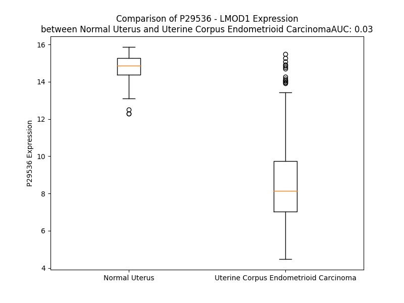

# Detailed Data for P29536

## Introduction to the Detailed Summary

### How to Interpret the Results

- **Summary & Metrics**: This section provides a quick reference to essential protein attributes, including expression changes, family classification, and biomarker applications. Regulation status (upregulated/downregulated) indicates the protein's behavior in a disease context. Some information comes from the original excel file with the proteins selected from literature, while others are derived from the analyses.
- **Expression Comparison**: A visual representation comparing protein expression between normal and disease states. It highlights significant changes in expression levels that might indicate diagnostic or therapeutic relevance. This is data coming from transcriptomics experiments and could not translate similarly to protein levels.
- **Isoform Alignment**: An interactive view of isoform alignments, revealing structural and functional differences between variants of the protein.
- **Interactors & Homologs**: Tables listing known interaction partners and homologous proteins, the more interactors and homologs, the more complex the protein is to design an antibody for.
- **Biological Assemblies**: Information about the structural arrangement of the protein in different assemblies, providing insights into its functional state but also the complexity of the protein to develop antibodies.
- **Combined Per-Residue Information**: A detailed table summarizing residue-level data. This includes predictions for epitope regions, aggregation tendencies, and modifications that might impact the protein's function. Each row corresponds to a residue in the protein, providing insights into specific sites that may be important for research or drug development.
## Summary & Metrics

- **UniProt Accession**: P29536
- **Gene Name**: LMOD1
- **Protein Name**: Leiomodin-1
- **Swiss Prot**: LMOD1_HUMAN
- **Family**: nan
- **Biomarker Application**: nan
- **Number of Isoforms**: 2
- **Regulation**: 1
- **(transcriptomics) AUC**: 0.0
- **(transcriptomics) Fold Change**: 1.86
- **(transcriptomics) Regulation**: Downregulated
- **Discotope Epitope Count**: 105
- **Max n_uniprots (Homo)**: 1
- **Max n_uniprots (Hetero)**: 2

## Expression Comparison

## Isoform Alignment

<pre style='font-size:14px; font-family:monospace;'>P29536-1 MSRVAKYRRQVSEDPDIDSLLETLSPEEMEELEKELDVVDPDGSVPVGLRQRNQTEKQSTGVYNREAMLNFCEKETKKLMQREMSMDESKQVETKTDAKNGEERGRDASKKALGPRRDSDLGKEPKRGGLKKSFSRDRDEAGGKSGEKPKEEKIIRGIDKGRVRAAVDKKEAGKDGRGEERAVATKKEEEKKGSDRNTGLSRDKDKKREEMKEVAKKEDDEKVKGERRNTDTRKEGEKMKRAGGNTDMKKEDEKVKRGTGNTDTKKDDEKVKKNEPLHEKEAKDDSKTKTPEKQTPSGPTKPSEGPAKVEEEAAPSIFDEPLERVKNNDPEMTEVNVNNSDCITNEILVRFTEALEFNTVVKLFALANTRADDHVAFAIAIMLKANKTITSLNLDSNHITGKGILAIFRALLQNNTLTELRFHNQRHICGGKTEMEIAKLLKENTTLLKLGYHFELAGPRMTVTNLLSRNMDKQRQKRLQEQRQAQEAKGEKKDLLEVPKAGAVAKGSPKPSPQPSPKPSPKNSPKKGGAPAAPPPPPPPLAPPLIMENLKNSLSPATQRKMGDKVLPAQEKNSRDQLLAAIRSSNLKQLKKVEVPKLLQ
P29536-2 ----------------------------MEELEKELDVVDPDGSVPVGLRQRNQTEKQSTGVYNREAMLNFCEKETKKLMQREMSMDESKQVETKTDAKNGEERGRDASKKALGPRRDSDLGKEPKRGGLKKSFSRDRDEAGGKSGEKPKEEKIIRGIDKGRVRAAVDKKEAGKDGRGEERAVATKKEEEKKGSDRNTGLSRDKDKKREEMKEVAKKEDDEKVKGERRNTDTRKEGEKMKRAGGNTDMKKEDEKVKRGTGNTDTKKDDEKVKKNEPLHEKEAKDDSKTKTPEKQTPSGPTKPSEGPAKVEEEAAPSIFDEPLERVKNNDPEMTEVNVNNSDCITNEILVRFTEALEFNTVVKLFALANTRADDHVAFAIAIMLKANKTITSLNLDSNHITGKGILAIFRALLQNNTLTELRFHNQRHICGGKTEMEIAKLLKENTTLLKLGYHFELAGPRMTVTNLLSRNMDKQRQKRLQEQRQAQEAKGEKKDLLEVPKAGAVAKGSPKPSPQPSPKPSPKNSPKKGGAPAAPPPPPPPLAPPLIMENLKNSLSPATQRKMGDKVLPAQEKNSRDQLLAAIRSSNLKQLKKVEVPKLLQ
</pre>

## Interactors

| preferredName_A   | preferredName_B   |   score |
|:------------------|:------------------|--------:|
| LMOD1             | MYH11             |   0.951 |
| LMOD1             | ACTA1             |   0.921 |

## Homologs

| uniprot_id   | gene_id   |
|:-------------|:----------|
| Q6P5Q4       | LMOD2     |
| Q0VAK6       | LMOD3     |
| G5EA42       | TMOD2     |
| Q9NYL9       | TMOD3     |
| Q5JR82       | TMOD4     |
| P28289       | TMOD1     |

## Biological Assemblies

|   Unnamed: 0 |   assembly |   n_uniprots | composition   | crystal_id   |
|-------------:|-----------:|-------------:|:--------------|:-------------|
|            0 |          1 |            1 | Homo          | 4z8g         |
|            0 |          1 |            2 | Hetero        | 4z94         |
|            0 |          1 |            1 | Homo          | 4z79         |

## Combined Per-Residue Information

|   res | aa   |   epitope_score | epitope   |   relative_surface_accessibility |   modeling_confidence |   Aggregation | modification   |
|------:|:-----|----------------:|:----------|---------------------------------:|----------------------:|--------------:|:---------------|
|     1 | M    |         0.05657 | False     |                          1.30826 |                 39.22 |         0     | N/A            |
|     2 | S    |         0.05941 | False     |                          0.70457 |                 43.06 |         0     | N/A            |
|     3 | R    |         0.08332 | False     |                          0.97474 |                 44.62 |         0     | N/A            |
|     4 | V    |         0.0698  | False     |                          1.01624 |                 45.38 |         0     | N/A            |
|     5 | A    |         0.11868 | True      |                          0.83567 |                 49.79 |         0     | N/A            |
|     6 | K    |         0.08557 | False     |                          0.94096 |                 50.47 |         0     | N/A            |
|     7 | Y    |         0.11193 | False     |                          1.00169 |                 41.67 |         0     | N/A            |
|     8 | R    |         0.11601 | True      |                          0.92989 |                 43.98 |         0     | N/A            |
|     9 | R    |         0.08144 | False     |                          0.86021 |                 43.43 |         0     | N/A            |
|    10 | Q    |         0.08158 | False     |                          0.84378 |                 45.75 |         0     | N/A            |
|    11 | V    |         0.07406 | False     |                          0.97589 |                 48.85 |         0     | N/A            |
|    12 | S    |         0.07587 | False     |                          0.5109  |                 51.03 |         0     | Phosphoserine  |
|    13 | E    |         0.10215 | False     |                          0.87814 |                 55.09 |         0     | N/A            |
|    14 | D    |         0.09155 | False     |                          0.49091 |                 51.74 |         0     | N/A            |
|    15 | P    |         0.10099 | False     |                          0.77648 |                 65.61 |         0     | N/A            |
|    16 | D    |         0.09749 | False     |                          0.56692 |                 74.08 |         0     | N/A            |
|    17 | I    |         0.04808 | False     |                          0.50558 |                 74.14 |         0     | N/A            |
|    18 | D    |         0.12574 | True      |                          0.59372 |                 77.86 |         0     | N/A            |
|    19 | S    |         0.06485 | False     |                          0.48562 |                 78.08 |         0     | N/A            |
|    20 | L    |         0.07877 | False     |                          0.68834 |                 73.41 |         0     | N/A            |
|    21 | L    |         0.05534 | False     |                          0.57695 |                 75.73 |         0     | N/A            |
|    22 | E    |         0.10966 | False     |                          0.81908 |                 77.07 |         0     | N/A            |
|    23 | T    |         0.04902 | False     |                          0.73353 |                 79.53 |         0     | N/A            |
|    24 | L    |         0.02112 | False     |                          0.32602 |                 73.32 |         0     | N/A            |
|    25 | S    |         0.04775 | False     |                          0.34357 |                 82.09 |         0     | N/A            |
|    26 | P    |         0.05435 | False     |                          0.77098 |                 81.14 |         0     | N/A            |
|    27 | E    |         0.05857 | False     |                          0.72558 |                 81.2  |         0     | N/A            |
|    28 | E    |         0.05004 | False     |                          0.43925 |                 81.37 |         0     | N/A            |
|    29 | M    |         0.04982 | False     |                          0.51949 |                 80.77 |         0     | N/A            |
|    30 | E    |         0.07559 | False     |                          0.50907 |                 78.91 |         0     | N/A            |
|    31 | E    |         0.09022 | False     |                          0.5249  |                 78.68 |         0     | N/A            |
|    32 | L    |         0.05708 | False     |                          0.49382 |                 76.95 |         0     | N/A            |
|    33 | E    |         0.09696 | False     |                          0.61587 |                 78.16 |         0     | N/A            |
|    34 | K    |         0.05958 | False     |                          0.59641 |                 76.88 |         0     | N/A            |
|    35 | E    |         0.07918 | False     |                          0.48145 |                 71.92 |         0     | N/A            |
|    36 | L    |         0.11103 | False     |                          0.8976  |                 67.6  |         0     | N/A            |
|    37 | D    |         0.10352 | False     |                          0.74463 |                 62.75 |         0     | N/A            |
|    38 | V    |         0.07208 | False     |                          0.53805 |                 59.11 |         0     | N/A            |
|    39 | V    |         0.10815 | False     |                          0.89493 |                 55.53 |         0     | N/A            |
|    40 | D    |         0.11709 | True      |                          0.28865 |                 55.57 |         0     | N/A            |
|    41 | P    |         0.12194 | True      |                          1.03062 |                 59.43 |         0     | N/A            |
|    42 | D    |         0.11018 | False     |                          0.43608 |                 60.42 |         0     | N/A            |
|    43 | G    |         0.16472 | True      |                          0.92183 |                 71.76 |         0     | N/A            |
|    44 | S    |         0.1642  | True      |                          0.74348 |                 76.26 |         0     | N/A            |
|    45 | V    |         0.10065 | False     |                          0.35354 |                 65.87 |         0     | N/A            |
|    46 | P    |         0.12148 | True      |                          0.62485 |                 69.02 |         0     | N/A            |
|    47 | V    |         0.12752 | True      |                          0.90034 |                 70.57 |         0     | N/A            |
|    48 | G    |         0.08507 | False     |                          0.95069 |                 72.54 |         0     | N/A            |
|    49 | L    |         0.16518 | True      |                          0.8273  |                 73.2  |         0     | N/A            |
|    50 | R    |         0.10043 | False     |                          0.31094 |                 69.88 |         0     | N/A            |
|    51 | Q    |         0.14431 | True      |                          0.67595 |                 64.81 |         0     | N/A            |
|    52 | R    |         0.09469 | False     |                          0.60257 |                 64.45 |         0     | N/A            |
|    53 | N    |         0.11422 | False     |                          0.82857 |                 66.04 |         0     | N/A            |
|    54 | Q    |         0.16801 | True      |                          0.76125 |                 67.06 |         0     | N/A            |
|    55 | T    |         0.18134 | True      |                          0.58179 |                 57.99 |         0     | N/A            |
|    56 | E    |         0.13201 | True      |                          0.93415 |                 64.74 |         0     | N/A            |
|    57 | K    |         0.11835 | True      |                          0.83391 |                 67.62 |         0     | N/A            |
|    58 | Q    |         0.10094 | False     |                          0.84775 |                 68.45 |         0     | N/A            |
|    59 | S    |         0.14588 | True      |                          0.84135 |                 62.48 |         0     | N/A            |
|    60 | T    |         0.18095 | True      |                          0.97491 |                 65.02 |         0     | N/A            |
|    61 | G    |         0.10357 | False     |                          0.73758 |                 71.19 |         0     | N/A            |
|    62 | V    |         0.11019 | False     |                          1.02909 |                 75.48 |         0     | N/A            |
|    63 | Y    |         0.13725 | True      |                          0.66674 |                 78.57 |         0     | N/A            |
|    64 | N    |         0.09459 | False     |                          0.62223 |                 81.87 |         0     | N/A            |
|    65 | R    |         0.0661  | False     |                          0.44148 |                 84.95 |         0     | N/A            |
|    66 | E    |         0.06077 | False     |                          0.64957 |                 87.42 |         0     | N/A            |
|    67 | A    |         0.04171 | False     |                          0.5711  |                 85.85 |         0.37  | N/A            |
|    68 | M    |         0.05987 | False     |                          0.45294 |                 85.88 |         0.37  | N/A            |
|    69 | L    |         0.04789 | False     |                          0.3858  |                 86.32 |         0.37  | N/A            |
|    70 | N    |         0.05451 | False     |                          0.56705 |                 88.99 |         0.37  | N/A            |
|    71 | F    |         0.05334 | False     |                          0.65895 |                 89.49 |         0.37  | N/A            |
|    72 | C    |         0.04958 | False     |                          0.43943 |                 88.05 |         0.226 | N/A            |
|    73 | E    |         0.05739 | False     |                          0.54871 |                 89.15 |         0     | N/A            |
|    74 | K    |         0.07183 | False     |                          0.67919 |                 90.68 |         0     | N/A            |
|    75 | E    |         0.04571 | False     |                          0.32913 |                 85.52 |         0     | N/A            |
|    76 | T    |         0.0663  | False     |                          0.52583 |                 87.12 |         0     | N/A            |
|    77 | K    |         0.04561 | False     |                          0.7228  |                 88.2  |         0     | N/A            |
|    78 | K    |         0.0489  | False     |                          0.54937 |                 87.68 |         0     | N/A            |
|    79 | L    |         0.08852 | False     |                          0.67409 |                 82.96 |         0     | N/A            |
|    80 | M    |         0.06619 | False     |                          0.59782 |                 80.68 |         0     | N/A            |
|    81 | Q    |         0.07832 | False     |                          0.67326 |                 79.49 |         0     | N/A            |
|    82 | R    |         0.09111 | False     |                          0.67606 |                 80.46 |         0     | N/A            |
|    83 | E    |         0.05964 | False     |                          0.57078 |                 78.35 |         0     | N/A            |
|    84 | M    |         0.06861 | False     |                          0.68783 |                 72.55 |         0     | N/A            |
|    85 | S    |         0.06071 | False     |                          0.4451  |                 74.94 |         0     | Phosphoserine  |
|    86 | M    |         0.10227 | False     |                          0.61113 |                 63.47 |         0     | N/A            |
|    87 | D    |         0.08118 | False     |                          0.46259 |                 61.07 |         0     | N/A            |
|    88 | E    |         0.09669 | False     |                          0.60447 |                 60    |         0     | N/A            |
|    89 | S    |         0.10669 | False     |                          0.48544 |                 57.27 |         0     | N/A            |
|    90 | K    |         0.08267 | False     |                          0.54869 |                 55.42 |         0     | N/A            |
|    91 | Q    |         0.07823 | False     |                          0.50669 |                 53.3  |         0     | N/A            |
|    92 | V    |         0.06996 | False     |                          0.68379 |                 52.4  |         0     | N/A            |
|    93 | E    |         0.07741 | False     |                          0.60314 |                 49.28 |         0     | N/A            |
|    94 | T    |         0.10054 | False     |                          0.67546 |                 49.73 |         0     | N/A            |
|    95 | K    |         0.09409 | False     |                          0.65145 |                 49.6  |         0     | N/A            |
|    96 | T    |         0.0657  | False     |                          0.59288 |                 47.41 |         0     | N/A            |
|    97 | D    |         0.10409 | False     |                          0.75384 |                 46.35 |         0     | N/A            |
|    98 | A    |         0.09916 | False     |                          0.82495 |                 49.07 |         0     | N/A            |
|    99 | K    |         0.09673 | False     |                          0.88926 |                 47.12 |         0     | N/A            |
|   100 | N    |         0.08365 | False     |                          0.90922 |                 38.97 |         0     | N/A            |
|   101 | G    |         0.08905 | False     |                          0.85031 |                 37.3  |         0     | N/A            |
|   102 | E    |         0.07128 | False     |                          0.88542 |                 39.68 |         0     | N/A            |
|   103 | E    |         0.05102 | False     |                          0.86844 |                 41.03 |         0     | N/A            |
|   104 | R    |         0.07567 | False     |                          1.01129 |                 35.62 |         0     | N/A            |
|   105 | G    |         0.10103 | False     |                          0.82099 |                 38.58 |         0     | N/A            |
|   106 | R    |         0.13518 | True      |                          0.939   |                 40.51 |         0     | N/A            |
|   107 | D    |         0.06559 | False     |                          0.82585 |                 39.29 |         0     | N/A            |
|   108 | A    |         0.08767 | False     |                          0.82488 |                 40.51 |         0     | N/A            |
|   109 | S    |         0.05768 | False     |                          0.70554 |                 41.94 |         0     | N/A            |
|   110 | K    |         0.09474 | False     |                          0.88928 |                 49.13 |         0     | N/A            |
|   111 | K    |         0.06003 | False     |                          0.97491 |                 39.45 |         0     | N/A            |
|   112 | A    |         0.05812 | False     |                          0.7437  |                 41.48 |         0     | N/A            |
|   113 | L    |         0.06964 | False     |                          1.09664 |                 42.62 |         0     | N/A            |
|   114 | G    |         0.05195 | False     |                          0.81299 |                 44.84 |         0     | N/A            |
|   115 | P    |         0.05765 | False     |                          0.84474 |                 46.84 |         0     | N/A            |
|   116 | R    |         0.11319 | False     |                          0.79125 |                 38.14 |         0     | N/A            |
|   117 | R    |         0.09512 | False     |                          0.73276 |                 41.28 |         0     | N/A            |
|   118 | D    |         0.11874 | True      |                          0.66009 |                 40.6  |         0     | N/A            |
|   119 | S    |         0.08081 | False     |                          0.83793 |                 44.47 |         0     | N/A            |
|   120 | D    |         0.08094 | False     |                          0.74898 |                 41.89 |         0     | N/A            |
|   121 | L    |         0.08747 | False     |                          1.05018 |                 43.43 |         0     | N/A            |
|   122 | G    |         0.05541 | False     |                          0.88589 |                 39.27 |         0     | N/A            |
|   123 | K    |         0.06588 | False     |                          0.97135 |                 37.95 |         0     | N/A            |
|   124 | E    |         0.09621 | False     |                          0.68771 |                 36.9  |         0     | N/A            |
|   125 | P    |         0.08823 | False     |                          0.6828  |                 43.98 |         0     | N/A            |
|   126 | K    |         0.08975 | False     |                          0.81681 |                 34.62 |         0     | N/A            |
|   127 | R    |         0.10511 | False     |                          0.98703 |                 36.78 |         0     | N/A            |
|   128 | G    |         0.11377 | False     |                          0.97915 |                 30.08 |         0     | N/A            |
|   129 | G    |         0.09736 | False     |                          0.95764 |                 35.99 |         0     | N/A            |
|   130 | L    |         0.06488 | False     |                          1.06323 |                 33.21 |         0     | N/A            |
|   131 | K    |         0.05133 | False     |                          1.02763 |                 39.12 |         0     | N/A            |
|   132 | K    |         0.11632 | True      |                          0.95207 |                 30.6  |         0     | N/A            |
|   133 | S    |         0.08561 | False     |                          0.63313 |                 39.22 |         0     | N/A            |
|   134 | F    |         0.08929 | False     |                          1.0288  |                 31.96 |         0     | N/A            |
|   135 | S    |         0.06483 | False     |                          0.81377 |                 41.77 |         0     | Phosphoserine  |
|   136 | R    |         0.06355 | False     |                          0.85621 |                 33.77 |         0     | N/A            |
|   137 | D    |         0.07195 | False     |                          0.69008 |                 41.51 |         0     | N/A            |
|   138 | R    |         0.10677 | False     |                          0.64016 |                 34.95 |         0     | N/A            |
|   139 | D    |         0.05217 | False     |                          0.83226 |                 42.49 |         0     | N/A            |
|   140 | E    |         0.07348 | False     |                          0.68551 |                 39.88 |         0     | N/A            |
|   141 | A    |         0.05289 | False     |                          0.90548 |                 40.92 |         0     | N/A            |
|   142 | G    |         0.081   | False     |                          0.99455 |                 37.83 |         0     | N/A            |
|   143 | G    |         0.07182 | False     |                          0.89825 |                 36.76 |         0     | N/A            |
|   144 | K    |         0.07472 | False     |                          0.98956 |                 41.24 |         0     | N/A            |
|   145 | S    |         0.07267 | False     |                          0.8996  |                 35.26 |         0     | N/A            |
|   146 | G    |         0.13103 | True      |                          0.85173 |                 35.65 |         0     | N/A            |
|   147 | E    |         0.08954 | False     |                          0.95892 |                 35.56 |         0     | N/A            |
|   148 | K    |         0.05859 | False     |                          0.94764 |                 34.16 |         0     | N/A            |
|   149 | P    |         0.08171 | False     |                          0.78367 |                 38.29 |         0     | N/A            |
|   150 | K    |         0.09644 | False     |                          0.92712 |                 34.86 |         0     | N/A            |
|   151 | E    |         0.05262 | False     |                          0.68815 |                 33.26 |         0     | N/A            |
|   152 | E    |         0.056   | False     |                          0.8576  |                 35.75 |         0     | N/A            |
|   153 | K    |         0.08556 | False     |                          0.74546 |                 38.65 |         0     | N/A            |
|   154 | I    |         0.09323 | False     |                          0.9001  |                 38.64 |         0     | N/A            |
|   155 | I    |         0.07738 | False     |                          0.96959 |                 38.2  |         0     | N/A            |
|   156 | R    |         0.08494 | False     |                          0.68345 |                 32.96 |         0     | N/A            |
|   157 | G    |         0.11129 | False     |                          0.83234 |                 34.52 |         0     | N/A            |
|   158 | I    |         0.08341 | False     |                          0.85507 |                 36.74 |         0     | N/A            |
|   159 | D    |         0.05945 | False     |                          0.8676  |                 36.99 |         0     | N/A            |
|   160 | K    |         0.05348 | False     |                          0.96059 |                 37.71 |         0     | N/A            |
|   161 | G    |         0.05694 | False     |                          0.99415 |                 35.81 |         0     | N/A            |
|   162 | R    |         0.12936 | True      |                          0.90396 |                 33.93 |         0     | N/A            |
|   163 | V    |         0.11243 | False     |                          0.98035 |                 36.69 |         0     | N/A            |
|   164 | R    |         0.13015 | True      |                          0.89799 |                 36.38 |         0     | N/A            |
|   165 | A    |         0.06478 | False     |                          0.91923 |                 32.12 |         0     | N/A            |
|   166 | A    |         0.05609 | False     |                          0.89052 |                 36.41 |         0     | N/A            |
|   167 | V    |         0.07028 | False     |                          0.94423 |                 34.68 |         0     | N/A            |
|   168 | D    |         0.05915 | False     |                          0.92065 |                 40.13 |         0     | N/A            |
|   169 | K    |         0.07969 | False     |                          0.9236  |                 39.57 |         0     | N/A            |
|   170 | K    |         0.09297 | False     |                          0.969   |                 39.27 |         0     | N/A            |
|   171 | E    |         0.09747 | False     |                          0.81593 |                 33.77 |         0     | N/A            |
|   172 | A    |         0.07475 | False     |                          1.06279 |                 37.23 |         0     | N/A            |
|   173 | G    |         0.0968  | False     |                          0.81898 |                 36.08 |         0     | N/A            |
|   174 | K    |         0.10129 | False     |                          0.91984 |                 36.94 |         0     | N/A            |
|   175 | D    |         0.06973 | False     |                          0.75385 |                 37.39 |         0     | N/A            |
|   176 | G    |         0.05892 | False     |                          0.92932 |                 37.59 |         0     | N/A            |
|   177 | R    |         0.10944 | False     |                          0.88857 |                 33.09 |         0     | N/A            |
|   178 | G    |         0.14039 | True      |                          0.76776 |                 36.5  |         0     | N/A            |
|   179 | E    |         0.05532 | False     |                          0.75328 |                 38.15 |         0     | N/A            |
|   180 | E    |         0.06212 | False     |                          0.79186 |                 34.76 |         0     | N/A            |
|   181 | R    |         0.07593 | False     |                          0.97069 |                 36.79 |         0     | N/A            |
|   182 | A    |         0.05052 | False     |                          0.92921 |                 34.12 |         0     | N/A            |
|   183 | V    |         0.06089 | False     |                          0.98715 |                 38.71 |         0     | N/A            |
|   184 | A    |         0.10287 | False     |                          0.75258 |                 36.06 |         0     | N/A            |
|   185 | T    |         0.07362 | False     |                          0.85279 |                 34.55 |         0     | N/A            |
|   186 | K    |         0.0998  | False     |                          0.88945 |                 37.22 |         0     | N/A            |
|   187 | K    |         0.09376 | False     |                          0.82189 |                 34.92 |         0     | N/A            |
|   188 | E    |         0.07443 | False     |                          0.68691 |                 36.11 |         0     | N/A            |
|   189 | E    |         0.07816 | False     |                          0.61329 |                 33.84 |         0     | N/A            |
|   190 | E    |         0.03619 | False     |                          0.68976 |                 35.86 |         0     | N/A            |
|   191 | K    |         0.15135 | True      |                          0.704   |                 33.55 |         0     | N/A            |
|   192 | K    |         0.10422 | False     |                          0.90063 |                 35.16 |         0     | N/A            |
|   193 | G    |         0.08247 | False     |                          0.93893 |                 34.8  |         0     | N/A            |
|   194 | S    |         0.05383 | False     |                          0.76927 |                 30.65 |         0     | N/A            |
|   195 | D    |         0.08187 | False     |                          0.60971 |                 38.07 |         0     | N/A            |
|   196 | R    |         0.08175 | False     |                          0.8435  |                 36.29 |         0     | N/A            |
|   197 | N    |         0.05497 | False     |                          0.94543 |                 35.13 |         0     | N/A            |
|   198 | T    |         0.0608  | False     |                          0.94816 |                 33.82 |         0     | N/A            |
|   199 | G    |         0.0977  | False     |                          0.82166 |                 33.42 |         0     | N/A            |
|   200 | L    |         0.08584 | False     |                          1.07679 |                 39.74 |         0     | N/A            |
|   201 | S    |         0.09885 | False     |                          0.78001 |                 36.18 |         0     | N/A            |
|   202 | R    |         0.09342 | False     |                          0.92149 |                 37.61 |         0     | N/A            |
|   203 | D    |         0.05088 | False     |                          0.77709 |                 39.63 |         0     | N/A            |
|   204 | K    |         0.0481  | False     |                          0.92849 |                 36.46 |         0     | N/A            |
|   205 | D    |         0.04769 | False     |                          0.93454 |                 37.05 |         0     | N/A            |
|   206 | K    |         0.05842 | False     |                          0.93631 |                 34.64 |         0     | N/A            |
|   207 | K    |         0.05956 | False     |                          0.89734 |                 35.38 |         0     | N/A            |
|   208 | R    |         0.09141 | False     |                          0.86308 |                 32.25 |         0     | N/A            |
|   209 | E    |         0.06238 | False     |                          0.69832 |                 31.81 |         0     | N/A            |
|   210 | E    |         0.0716  | False     |                          0.68389 |                 31.96 |         0     | N/A            |
|   211 | M    |         0.0412  | False     |                          0.98202 |                 33.19 |         0     | N/A            |
|   212 | K    |         0.05279 | False     |                          1.01711 |                 32.4  |         0     | N/A            |
|   213 | E    |         0.05717 | False     |                          0.84126 |                 30.72 |         0     | N/A            |
|   214 | V    |         0.05717 | False     |                          0.93055 |                 34.55 |         0     | N/A            |
|   215 | A    |         0.07226 | False     |                          0.71131 |                 34.06 |         0     | N/A            |
|   216 | K    |         0.08482 | False     |                          0.95952 |                 30.68 |         0     | N/A            |
|   217 | K    |         0.06144 | False     |                          0.84753 |                 31.43 |         0     | N/A            |
|   218 | E    |         0.0627  | False     |                          0.82527 |                 34.23 |         0     | N/A            |
|   219 | D    |         0.12616 | True      |                          0.77173 |                 33.56 |         0     | N/A            |
|   220 | D    |         0.11624 | True      |                          0.88715 |                 30.65 |         0     | N/A            |
|   221 | E    |         0.07199 | False     |                          0.7874  |                 29.61 |         0     | N/A            |
|   222 | K    |         0.0608  | False     |                          0.89415 |                 31.28 |         0     | N/A            |
|   223 | V    |         0.04703 | False     |                          0.83878 |                 35.04 |         0     | N/A            |
|   224 | K    |         0.09877 | False     |                          0.94793 |                 28.58 |         0     | N/A            |
|   225 | G    |         0.06792 | False     |                          0.81238 |                 29.41 |         0     | N/A            |
|   226 | E    |         0.08268 | False     |                          0.69601 |                 35.77 |         0     | N/A            |
|   227 | R    |         0.06714 | False     |                          0.7738  |                 35.44 |         0     | N/A            |
|   228 | R    |         0.11175 | False     |                          0.89477 |                 30.59 |         0     | N/A            |
|   229 | N    |         0.06325 | False     |                          0.82586 |                 37.37 |         0     | N/A            |
|   230 | T    |         0.09088 | False     |                          0.85086 |                 36.59 |         0     | N/A            |
|   231 | D    |         0.09684 | False     |                          0.72991 |                 35.42 |         0     | N/A            |
|   232 | T    |         0.11625 | True      |                          0.69463 |                 37.97 |         0     | N/A            |
|   233 | R    |         0.12964 | True      |                          0.82177 |                 36.72 |         0     | N/A            |
|   234 | K    |         0.10418 | False     |                          0.84591 |                 36.36 |         0     | N/A            |
|   235 | E    |         0.09702 | False     |                          0.78127 |                 36.79 |         0     | N/A            |
|   236 | G    |         0.09454 | False     |                          0.80277 |                 38.52 |         0     | N/A            |
|   237 | E    |         0.13547 | True      |                          0.72938 |                 37.96 |         0     | N/A            |
|   238 | K    |         0.09249 | False     |                          0.78372 |                 37.83 |         0     | N/A            |
|   239 | M    |         0.11485 | True      |                          0.77298 |                 39.6  |         0     | N/A            |
|   240 | K    |         0.05973 | False     |                          0.8632  |                 39.56 |         0     | N/A            |
|   241 | R    |         0.06995 | False     |                          0.85088 |                 36.37 |         0     | N/A            |
|   242 | A    |         0.07148 | False     |                          1.02444 |                 37.63 |         0     | N/A            |
|   243 | G    |         0.08661 | False     |                          0.9472  |                 36.02 |         0     | N/A            |
|   244 | G    |         0.10021 | False     |                          0.94188 |                 35.82 |         0     | N/A            |
|   245 | N    |         0.13627 | True      |                          0.88352 |                 35.96 |         0     | N/A            |
|   246 | T    |         0.08222 | False     |                          0.79507 |                 38.27 |         0     | N/A            |
|   247 | D    |         0.06857 | False     |                          0.76118 |                 40.07 |         0     | N/A            |
|   248 | M    |         0.06486 | False     |                          0.90229 |                 39.35 |         0     | N/A            |
|   249 | K    |         0.06302 | False     |                          0.88188 |                 37.32 |         0     | N/A            |
|   250 | K    |         0.08998 | False     |                          0.75734 |                 32.15 |         0     | N/A            |
|   251 | E    |         0.08431 | False     |                          0.7665  |                 36.96 |         0     | N/A            |
|   252 | D    |         0.14027 | True      |                          0.63943 |                 37.14 |         0     | N/A            |
|   253 | E    |         0.08799 | False     |                          0.73913 |                 34.8  |         0     | N/A            |
|   254 | K    |         0.10247 | False     |                          0.78446 |                 34.16 |         0     | N/A            |
|   255 | V    |         0.0504  | False     |                          0.85787 |                 31.91 |         0     | N/A            |
|   256 | K    |         0.05815 | False     |                          1.01177 |                 35.9  |         0     | N/A            |
|   257 | R    |         0.10271 | False     |                          0.94722 |                 28.53 |         0     | N/A            |
|   258 | G    |         0.11653 | True      |                          0.82581 |                 33.2  |         0     | N/A            |
|   259 | T    |         0.12986 | True      |                          0.99522 |                 28.96 |         0     | N/A            |
|   260 | G    |         0.0685  | False     |                          0.81808 |                 29.9  |         0     | N/A            |
|   261 | N    |         0.0453  | False     |                          0.93327 |                 32.44 |         0     | N/A            |
|   262 | T    |         0.07311 | False     |                          0.9178  |                 27.49 |         0     | N/A            |
|   263 | D    |         0.07226 | False     |                          0.87719 |                 34.87 |         0     | N/A            |
|   264 | T    |         0.08709 | False     |                          0.86921 |                 28.21 |         0     | N/A            |
|   265 | K    |         0.11785 | True      |                          0.97279 |                 34.97 |         0     | N/A            |
|   266 | K    |         0.17182 | True      |                          0.84296 |                 28.34 |         0     | N/A            |
|   267 | D    |         0.12084 | True      |                          0.62917 |                 33.26 |         0     | N/A            |
|   268 | D    |         0.09154 | False     |                          0.81424 |                 34.52 |         0     | N/A            |
|   269 | E    |         0.11973 | True      |                          0.78474 |                 31.05 |         0     | N/A            |
|   270 | K    |         0.07448 | False     |                          1.00785 |                 33.69 |         0     | N/A            |
|   271 | V    |         0.06912 | False     |                          0.82142 |                 30.13 |         0     | N/A            |
|   272 | K    |         0.07191 | False     |                          1.01774 |                 35.23 |         0     | N/A            |
|   273 | K    |         0.09675 | False     |                          0.71972 |                 29.2  |         0     | N/A            |
|   274 | N    |         0.11467 | True      |                          0.98585 |                 32.88 |         0     | N/A            |
|   275 | E    |         0.10513 | False     |                          0.69661 |                 32.5  |         0     | N/A            |
|   276 | P    |         0.10074 | False     |                          0.81803 |                 41.03 |         0     | N/A            |
|   277 | L    |         0.11135 | False     |                          0.97987 |                 36.53 |         0     | N/A            |
|   278 | H    |         0.10141 | False     |                          0.65779 |                 38.69 |         0     | N/A            |
|   279 | E    |         0.1316  | True      |                          0.63304 |                 38.69 |         0     | N/A            |
|   280 | K    |         0.09878 | False     |                          0.65211 |                 37.7  |         0     | N/A            |
|   281 | E    |         0.15295 | True      |                          0.82464 |                 34.74 |         0     | N/A            |
|   282 | A    |         0.07114 | False     |                          0.83411 |                 37.36 |         0     | N/A            |
|   283 | K    |         0.12092 | True      |                          0.85934 |                 35.27 |         0     | N/A            |
|   284 | D    |         0.0625  | False     |                          0.68809 |                 37.58 |         0     | N/A            |
|   285 | D    |         0.08346 | False     |                          0.82494 |                 34.6  |         0     | N/A            |
|   286 | S    |         0.08801 | False     |                          0.91741 |                 38.37 |         0     | N/A            |
|   287 | K    |         0.12233 | True      |                          0.91933 |                 33.59 |         0     | N/A            |
|   288 | T    |         0.1267  | True      |                          0.77684 |                 28.49 |         0     | N/A            |
|   289 | K    |         0.16015 | True      |                          0.95493 |                 36.93 |         0     | N/A            |
|   290 | T    |         0.12556 | True      |                          0.90944 |                 30.29 |         0     | N/A            |
|   291 | P    |         0.15228 | True      |                          0.80745 |                 38.28 |         0     | N/A            |
|   292 | E    |         0.12692 | True      |                          0.71552 |                 33.57 |         0     | N/A            |
|   293 | K    |         0.12983 | True      |                          0.7607  |                 33.78 |         0     | N/A            |
|   294 | Q    |         0.10746 | False     |                          0.79025 |                 39.3  |         0     | N/A            |
|   295 | T    |         0.11097 | False     |                          0.8763  |                 34.5  |         0     | N/A            |
|   296 | P    |         0.12394 | True      |                          0.92673 |                 44.97 |         0     | N/A            |
|   297 | S    |         0.09169 | False     |                          0.78413 |                 40.58 |         0     | N/A            |
|   298 | G    |         0.22462 | True      |                          0.81434 |                 41.04 |         0     | N/A            |
|   299 | P    |         0.16657 | True      |                          0.92443 |                 45.27 |         0     | N/A            |
|   300 | T    |         0.11941 | True      |                          0.89015 |                 35    |         0     | N/A            |
|   301 | K    |         0.12648 | True      |                          0.98933 |                 42.58 |         0     | N/A            |
|   302 | P    |         0.09671 | False     |                          0.9144  |                 41.14 |         0     | N/A            |
|   303 | S    |         0.11373 | False     |                          0.84049 |                 34.11 |         0     | N/A            |
|   304 | E    |         0.12046 | True      |                          0.91842 |                 36.91 |         0     | N/A            |
|   305 | G    |         0.05899 | False     |                          0.64419 |                 32.53 |         0     | N/A            |
|   306 | P    |         0.05801 | False     |                          1.07879 |                 38.76 |         0     | N/A            |
|   307 | A    |         0.06364 | False     |                          0.7609  |                 29.82 |         0     | N/A            |
|   308 | K    |         0.06387 | False     |                          0.92812 |                 31.18 |         0     | N/A            |
|   309 | V    |         0.06206 | False     |                          0.90097 |                 33.03 |         0     | N/A            |
|   310 | E    |         0.11722 | True      |                          0.76357 |                 36.11 |         0     | N/A            |
|   311 | E    |         0.12324 | True      |                          0.7877  |                 37.8  |         0     | N/A            |
|   312 | E    |         0.12331 | True      |                          0.874   |                 39.09 |         0     | N/A            |
|   313 | A    |         0.10984 | False     |                          0.72474 |                 51.88 |         0     | N/A            |
|   314 | A    |         0.10823 | False     |                          0.80278 |                 60.92 |         0     | N/A            |
|   315 | P    |         0.13271 | True      |                          0.96797 |                 73.45 |         0     | N/A            |
|   316 | S    |         0.07813 | False     |                          0.33962 |                 81.12 |         0     | N/A            |
|   317 | I    |         0.14756 | True      |                          0.78852 |                 88.94 |         0     | N/A            |
|   318 | F    |         0.02169 | False     |                          0.07794 |                 90.53 |         0     | N/A            |
|   319 | D    |         0.05531 | False     |                          0.39562 |                 90.54 |         0     | N/A            |
|   320 | E    |         0.08996 | False     |                          0.57853 |                 91.88 |         0     | N/A            |
|   321 | P    |         0.02538 | False     |                          0.2515  |                 93.04 |         0     | N/A            |
|   322 | L    |         0.02616 | False     |                          0.07172 |                 94.04 |         0     | N/A            |
|   323 | E    |         0.05853 | False     |                          0.31317 |                 94.22 |         0     | N/A            |
|   324 | R    |         0.03799 | False     |                          0.41343 |                 94.43 |         0     | N/A            |
|   325 | V    |         0.00162 | False     |                          0.00095 |                 95.26 |         0     | N/A            |
|   326 | K    |         0.08247 | False     |                          0.52522 |                 94.62 |         0     | N/A            |
|   327 | N    |         0.07756 | False     |                          0.72992 |                 94.85 |         0     | N/A            |
|   328 | N    |         0.0674  | False     |                          0.30949 |                 93.33 |         0     | N/A            |
|   329 | D    |         0.03437 | False     |                          0.14831 |                 94.98 |         0     | N/A            |
|   330 | P    |         0.12717 | True      |                          0.8041  |                 94.03 |         0     | N/A            |
|   331 | E    |         0.12396 | True      |                          0.77278 |                 94.92 |         0     | N/A            |
|   332 | M    |         0.02565 | False     |                          0.21434 |                 93.05 |         0     | N/A            |
|   333 | T    |         0.02708 | False     |                          0.32532 |                 95.38 |         0     | N/A            |
|   334 | E    |         0.06766 | False     |                          0.52787 |                 95.4  |         0     | N/A            |
|   335 | V    |         0.00798 | False     |                          0.00952 |                 95.51 |         0     | N/A            |
|   336 | N    |         0.11719 | True      |                          0.60017 |                 95.21 |         0     | N/A            |
|   337 | V    |         0.02838 | False     |                          0.07997 |                 94.61 |         0     | N/A            |
|   338 | N    |         0.13996 | True      |                          0.32798 |                 94.73 |         0     | N/A            |
|   339 | N    |         0.16491 | True      |                          0.61663 |                 94.69 |         0     | N/A            |
|   340 | S    |         0.04918 | False     |                          0.15944 |                 91.97 |         0     | N/A            |
|   341 | D    |         0.16563 | True      |                          0.68126 |                 86.75 |         0     | N/A            |
|   342 | C    |         0.11602 | True      |                          0.69858 |                 88.61 |         0     | N/A            |
|   343 | I    |         0.03989 | False     |                          0.04317 |                 90.95 |         0     | N/A            |
|   344 | T    |         0.06755 | False     |                          0.49189 |                 94    |         0     | N/A            |
|   345 | N    |         0.06198 | False     |                          0.32648 |                 94.46 |         0     | N/A            |
|   346 | E    |         0.09553 | False     |                          0.52733 |                 95.01 |         0.16  | N/A            |
|   347 | I    |         0.02472 | False     |                          0.16959 |                 94.9  |         2.562 | N/A            |
|   348 | L    |         0.00114 | False     |                          0       |                 95.89 |         2.918 | N/A            |
|   349 | V    |         0.04013 | False     |                          0.27324 |                 96.66 |         3.462 | N/A            |
|   350 | R    |         0.04734 | False     |                          0.43218 |                 95.88 |         3.462 | N/A            |
|   351 | F    |         0.00137 | False     |                          0.00064 |                 95.85 |         3.462 | N/A            |
|   352 | T    |         0.00242 | False     |                          0.00762 |                 96.47 |         3.302 | N/A            |
|   353 | E    |         0.08227 | False     |                          0.52928 |                 96.03 |         3.302 | N/A            |
|   354 | A    |         0.02501 | False     |                          0.14962 |                 95.85 |         9.637 | N/A            |
|   355 | L    |         0.00116 | False     |                          0       |                 96.52 |        17.13  | N/A            |
|   356 | E    |         0.03695 | False     |                          0.17803 |                 95.64 |        20.208 | N/A            |
|   357 | F    |         0.07112 | False     |                          0.8303  |                 93.66 |        25.222 | N/A            |
|   358 | N    |         0.01248 | False     |                          0.02543 |                 95.7  |        25.222 | N/A            |
|   359 | T    |         0.12704 | True      |                          0.6879  |                 95.28 |        25.222 | N/A            |
|   360 | V    |         0.04266 | False     |                          0.17704 |                 97.25 |        25.222 | N/A            |
|   361 | V    |         0.00131 | False     |                          0       |                 97.26 |        25.222 | N/A            |
|   362 | K    |         0.04529 | False     |                          0.54653 |                 97.09 |        20.208 | N/A            |
|   363 | L    |         0.10997 | False     |                          0.24895 |                 97.39 |        24.679 | N/A            |
|   364 | F    |         0.00136 | False     |                          0       |                 97.24 |        24.507 | N/A            |
|   365 | A    |         0.05386 | False     |                          0.03316 |                 97.28 |        20.665 | N/A            |
|   366 | L    |         0.00681 | False     |                          0       |                 96.42 |        19.28  | N/A            |
|   367 | A    |         0.12248 | True      |                          0.12754 |                 96.16 |        12.16  | N/A            |
|   368 | N    |         0.10577 | False     |                          0.4717  |                 96.12 |         2.046 | N/A            |
|   369 | T    |         0.01592 | False     |                          0.01225 |                 95.43 |         0.763 | N/A            |
|   370 | R    |         0.0622  | False     |                          0.42501 |                 95.4  |         0     | N/A            |
|   371 | A    |         0.00218 | False     |                          0       |                 96.6  |         0     | N/A            |
|   372 | D    |         0.04685 | False     |                          0.20609 |                 96.38 |         0     | N/A            |
|   373 | D    |         0.05919 | False     |                          0.13298 |                 97.33 |         0     | N/A            |
|   374 | H    |         0.06781 | False     |                          0.68417 |                 97.18 |         0.284 | N/A            |
|   375 | V    |         0.00212 | False     |                          0       |                 97.37 |        95.594 | N/A            |
|   376 | A    |         0.00102 | False     |                          0       |                 97.76 |        97.072 | N/A            |
|   377 | F    |         0.04039 | False     |                          0.42415 |                 98.1  |        98.982 | N/A            |
|   378 | A    |         0.02353 | False     |                          0.1512  |                 97.76 |        99.096 | N/A            |
|   379 | I    |         0.00328 | False     |                          0.0008  |                 97.89 |        99.209 | N/A            |
|   380 | A    |         0.01764 | False     |                          0.04209 |                 97.62 |        98.955 | N/A            |
|   381 | I    |         0.07271 | False     |                          0.59973 |                 97.23 |        98.704 | N/A            |
|   382 | M    |         0.00243 | False     |                          0       |                 96.99 |        95.442 | N/A            |
|   383 | L    |         0.00188 | False     |                          0.00247 |                 97.22 |        80.687 | N/A            |
|   384 | K    |         0.06191 | False     |                          0.44546 |                 96.1  |         0     | N/A            |
|   385 | A    |         0.04288 | False     |                          0.39894 |                 95.76 |         0     | N/A            |
|   386 | N    |         0.01602 | False     |                          0.01805 |                 96.59 |         0     | N/A            |
|   387 | K    |         0.1509  | True      |                          0.48328 |                 95.29 |         0     | N/A            |
|   388 | T    |         0.03883 | False     |                          0.24845 |                 96.8  |         0     | N/A            |
|   389 | I    |         0.00376 | False     |                          0.00257 |                 97.45 |         0.164 | N/A            |
|   390 | T    |         0.04546 | False     |                          0.38578 |                 97.48 |         0.164 | N/A            |
|   391 | S    |         0.04934 | False     |                          0.1218  |                 97.8  |         0.164 | N/A            |
|   392 | L    |         0.00202 | False     |                          0       |                 98.05 |         0.164 | N/A            |
|   393 | N    |         0.09167 | False     |                          0.10267 |                 97.93 |         0.164 | N/A            |
|   394 | L    |         0.0068  | False     |                          0.0033  |                 97.44 |         0.164 | N/A            |
|   395 | D    |         0.13989 | True      |                          0.16788 |                 96.88 |         0     | N/A            |
|   396 | S    |         0.09065 | False     |                          0.29403 |                 96.28 |         0     | N/A            |
|   397 | N    |         0.02876 | False     |                          0.00891 |                 97.24 |         0     | N/A            |
|   398 | H    |         0.10783 | False     |                          0.42028 |                 96.65 |         0     | N/A            |
|   399 | I    |         0.01367 | False     |                          0.01047 |                 97.34 |         0     | N/A            |
|   400 | T    |         0.10161 | False     |                          0.34648 |                 96.47 |         0     | N/A            |
|   401 | G    |         0.01932 | False     |                          0.14853 |                 96    |         0     | N/A            |
|   402 | K    |         0.0862  | False     |                          0.72916 |                 96.65 |         0     | N/A            |
|   403 | G    |         0.00201 | False     |                          0       |                 96.98 |         3.501 | N/A            |
|   404 | I    |         0.00618 | False     |                          0.012   |                 97.47 |        39.467 | N/A            |
|   405 | L    |         0.05853 | False     |                          0.14096 |                 97.38 |        39.467 | N/A            |
|   406 | A    |         0.03188 | False     |                          0.16747 |                 97.73 |        39.467 | N/A            |
|   407 | I    |         0.00611 | False     |                          0.0112  |                 97.81 |        39.467 | N/A            |
|   408 | F    |         0.00876 | False     |                          0.00876 |                 97.37 |        39.203 | N/A            |
|   409 | R    |         0.10764 | False     |                          0.48321 |                 97.2  |         0     | N/A            |
|   410 | A    |         0.00157 | False     |                          0       |                 97.21 |         0     | N/A            |
|   411 | L    |         0.00619 | False     |                          0.01828 |                 96.84 |         0     | N/A            |
|   412 | L    |         0.06132 | False     |                          0.52144 |                 95.75 |         0     | N/A            |
|   413 | Q    |         0.06843 | False     |                          0.62536 |                 94.47 |         0     | N/A            |
|   414 | N    |         0.01877 | False     |                          0.03231 |                 95.6  |         0     | N/A            |
|   415 | N    |         0.11432 | False     |                          0.63353 |                 93.86 |         0     | N/A            |
|   416 | T    |         0.03599 | False     |                          0.21039 |                 95.97 |         0     | N/A            |
|   417 | L    |         0.00334 | False     |                          0.00427 |                 97.25 |         0     | N/A            |
|   418 | T    |         0.02708 | False     |                          0.23268 |                 97.11 |         0     | N/A            |
|   419 | E    |         0.06793 | False     |                          0.13607 |                 97.86 |         0     | N/A            |
|   420 | L    |         0.00452 | False     |                          0.00659 |                 98.03 |         0     | N/A            |
|   421 | R    |         0.11941 | True      |                          0.36716 |                 97.62 |         0     | N/A            |
|   422 | F    |         0.01894 | False     |                          0.0099  |                 97.32 |         0     | N/A            |
|   423 | H    |         0.18504 | True      |                          0.41343 |                 95.89 |         0     | N/A            |
|   424 | N    |         0.18998 | True      |                          0.75146 |                 95.28 |         0     | N/A            |
|   425 | Q    |         0.05633 | False     |                          0.11726 |                 96.05 |         0     | N/A            |
|   426 | R    |         0.17162 | True      |                          0.658   |                 92.62 |         0     | N/A            |
|   427 | H    |         0.15577 | True      |                          0.57182 |                 91.14 |         0     | N/A            |
|   428 | I    |         0.12855 | True      |                          0.79735 |                 90.82 |         0     | N/A            |
|   429 | C    |         0.02286 | False     |                          0.08783 |                 89.89 |         0     | N/A            |
|   430 | G    |         0.08192 | False     |                          0.29453 |                 93.16 |         0     | N/A            |
|   431 | G    |         0.06258 | False     |                          0.25136 |                 95.74 |         0     | N/A            |
|   432 | K    |         0.14251 | True      |                          0.88139 |                 95.97 |         0     | N/A            |
|   433 | T    |         0.0375  | False     |                          0.11608 |                 96.62 |         0     | N/A            |
|   434 | E    |         0.00418 | False     |                          0.00052 |                 97.07 |         0     | N/A            |
|   435 | M    |         0.08918 | False     |                          0.5686  |                 96.64 |         0     | N/A            |
|   436 | E    |         0.05757 | False     |                          0.2376  |                 96.96 |         0     | N/A            |
|   437 | I    |         0.00533 | False     |                          0       |                 97.44 |         0     | N/A            |
|   438 | A    |         0.01219 | False     |                          0.06688 |                 96.66 |         0     | N/A            |
|   439 | K    |         0.07448 | False     |                          0.6226  |                 97.07 |         0     | N/A            |
|   440 | L    |         0.04077 | False     |                          0.11368 |                 96.49 |         0     | N/A            |
|   441 | L    |         0.0157  | False     |                          0.00978 |                 95.84 |         0     | N/A            |
|   442 | K    |         0.12411 | True      |                          0.54111 |                 95.85 |         0     | N/A            |
|   443 | E    |         0.10648 | False     |                          0.57473 |                 94.92 |         0     | N/A            |
|   444 | N    |         0.01606 | False     |                          0.05232 |                 95.39 |         0     | N/A            |
|   445 | T    |         0.07165 | False     |                          0.30977 |                 93.94 |         0     | N/A            |
|   446 | T    |         0.0315  | False     |                          0.19997 |                 95.33 |         0     | N/A            |
|   447 | L    |         0.00169 | False     |                          0.00082 |                 96.87 |         0     | N/A            |
|   448 | L    |         0.03465 | False     |                          0.18731 |                 96.76 |         0     | N/A            |
|   449 | K    |         0.11576 | True      |                          0.57514 |                 97.36 |         0     | N/A            |
|   450 | L    |         0.02927 | False     |                          0.1257  |                 97.88 |         0     | N/A            |
|   451 | G    |         0.0525  | False     |                          0.13177 |                 96.55 |         0     | N/A            |
|   452 | Y    |         0.06372 | False     |                          0.14557 |                 97.03 |         0     | N/A            |
|   453 | H    |         0.28572 | True      |                          0.69473 |                 95.59 |         0     | N/A            |
|   454 | F    |         0.01188 | False     |                          0.0348  |                 96.29 |         0     | N/A            |
|   455 | E    |         0.10762 | False     |                          0.42443 |                 95.02 |         0     | N/A            |
|   456 | L    |         0.16341 | True      |                          0.47153 |                 96.23 |         0     | N/A            |
|   457 | A    |         0.10942 | False     |                          0.4713  |                 96.35 |         0     | N/A            |
|   458 | G    |         0.08778 | False     |                          0.45525 |                 96.82 |         0     | N/A            |
|   459 | P    |         0.04016 | False     |                          0.08592 |                 97.18 |         0     | N/A            |
|   460 | R    |         0.14112 | True      |                          0.35842 |                 97.58 |         0     | N/A            |
|   461 | M    |         0.11429 | False     |                          0.63831 |                 97.35 |         0     | N/A            |
|   462 | T    |         0.04506 | False     |                          0.41872 |                 97.67 |         0     | N/A            |
|   463 | V    |         0.01056 | False     |                          0.03903 |                 97.74 |         0.198 | N/A            |
|   464 | T    |         0.1304  | True      |                          0.59161 |                 97.49 |         0.198 | N/A            |
|   465 | N    |         0.12115 | True      |                          0.65229 |                 97.51 |         0.198 | N/A            |
|   466 | L    |         0.05541 | False     |                          0.10634 |                 97.39 |         0.198 | N/A            |
|   467 | L    |         0.03873 | False     |                          0.1253  |                 97.26 |         0.198 | N/A            |
|   468 | S    |         0.05996 | False     |                          0.45062 |                 97.19 |         0     | N/A            |
|   469 | R    |         0.13156 | True      |                          0.39555 |                 97.12 |         0     | N/A            |
|   470 | N    |         0.00246 | False     |                          0.00213 |                 96.64 |         0     | N/A            |
|   471 | M    |         0.05018 | False     |                          0.49319 |                 96.58 |         0     | N/A            |
|   472 | D    |         0.03648 | False     |                          0.31336 |                 96.56 |         0     | N/A            |
|   473 | K    |         0.03117 | False     |                          0.53417 |                 94.77 |         0     | N/A            |
|   474 | Q    |         0.03279 | False     |                          0.2742  |                 91.9  |         0     | N/A            |
|   475 | R    |         0.04891 | False     |                          0.55887 |                 95.11 |         0     | N/A            |
|   476 | Q    |         0.03518 | False     |                          0.53339 |                 95.23 |         0     | N/A            |
|   477 | K    |         0.0342  | False     |                          0.6337  |                 93.84 |         0     | N/A            |
|   478 | R    |         0.04787 | False     |                          0.49609 |                 93.59 |         0     | N/A            |
|   479 | L    |         0.02945 | False     |                          0.49779 |                 94.12 |         0     | N/A            |
|   480 | Q    |         0.02375 | False     |                          0.55452 |                 94.9  |         0     | N/A            |
|   481 | E    |         0.02028 | False     |                          0.39583 |                 94.08 |         0     | N/A            |
|   482 | Q    |         0.05036 | False     |                          0.52328 |                 92.64 |         0     | N/A            |
|   483 | R    |         0.06319 | False     |                          0.57562 |                 93.28 |         0     | N/A            |
|   484 | Q    |         0.04742 | False     |                          0.50369 |                 90.35 |         0     | N/A            |
|   485 | A    |         0.03407 | False     |                          0.47806 |                 89.8  |         0     | N/A            |
|   486 | Q    |         0.03595 | False     |                          0.62702 |                 86.03 |         0     | N/A            |
|   487 | E    |         0.05236 | False     |                          0.52475 |                 85.05 |         0     | N/A            |
|   488 | A    |         0.05474 | False     |                          0.48365 |                 82.69 |         0     | N/A            |
|   489 | K    |         0.10529 | False     |                          0.70538 |                 76.93 |         0     | N/A            |
|   490 | G    |         0.07379 | False     |                          0.39135 |                 64.42 |         0     | N/A            |
|   491 | E    |         0.09884 | False     |                          0.65736 |                 58.56 |         0     | N/A            |
|   492 | K    |         0.08054 | False     |                          0.75498 |                 57.63 |         0     | N/A            |
|   493 | K    |         0.10237 | False     |                          0.78545 |                 52.91 |         0     | N/A            |
|   494 | D    |         0.1424  | True      |                          0.85114 |                 51.91 |         0     | N/A            |
|   495 | L    |         0.12496 | True      |                          0.99194 |                 50.22 |         0     | N/A            |
|   496 | L    |         0.14212 | True      |                          0.81855 |                 48.87 |         0     | N/A            |
|   497 | E    |         0.11572 | True      |                          0.83955 |                 43.38 |         0     | N/A            |
|   498 | V    |         0.08972 | False     |                          0.92313 |                 42.17 |         0     | N/A            |
|   499 | P    |         0.09544 | False     |                          0.93864 |                 48.55 |         0     | N/A            |
|   500 | K    |         0.10788 | False     |                          0.9504  |                 42.54 |         0     | N/A            |
|   501 | A    |         0.09495 | False     |                          0.92717 |                 40.01 |         0     | N/A            |
|   502 | G    |         0.11395 | False     |                          0.99746 |                 40.47 |         0     | N/A            |
|   503 | A    |         0.07361 | False     |                          0.9659  |                 44.59 |         0     | N/A            |
|   504 | V    |         0.0942  | False     |                          1.06168 |                 42.56 |         0     | N/A            |
|   505 | A    |         0.09068 | False     |                          0.9316  |                 47.37 |         0     | N/A            |
|   506 | K    |         0.11291 | False     |                          1.00145 |                 40.99 |         0     | N/A            |
|   507 | G    |         0.12632 | True      |                          0.82464 |                 44.95 |         0     | N/A            |
|   508 | S    |         0.11862 | True      |                          0.86651 |                 47.63 |         0     | N/A            |
|   509 | P    |         0.11378 | False     |                          0.92455 |                 55.77 |         0     | N/A            |
|   510 | K    |         0.11316 | False     |                          0.9321  |                 51.99 |         0     | N/A            |
|   511 | P    |         0.08033 | False     |                          0.90911 |                 48.33 |         0     | N/A            |
|   512 | S    |         0.12468 | True      |                          0.82133 |                 48.75 |         0     | N/A            |
|   513 | P    |         0.08095 | False     |                          0.88208 |                 56.57 |         0     | N/A            |
|   514 | Q    |         0.07629 | False     |                          0.89692 |                 54.7  |         0     | N/A            |
|   515 | P    |         0.08086 | False     |                          0.88965 |                 50.21 |         0     | N/A            |
|   516 | S    |         0.07954 | False     |                          0.77036 |                 50.19 |         0     | N/A            |
|   517 | P    |         0.07374 | False     |                          0.96995 |                 61.69 |         0     | N/A            |
|   518 | K    |         0.13733 | True      |                          0.92408 |                 59.97 |         0     | N/A            |
|   519 | P    |         0.09891 | False     |                          0.95914 |                 46.55 |         0     | N/A            |
|   520 | S    |         0.09855 | False     |                          0.79647 |                 54.25 |         0     | N/A            |
|   521 | P    |         0.1258  | True      |                          0.95812 |                 48.44 |         0     | N/A            |
|   522 | K    |         0.06564 | False     |                          1.01899 |                 38.71 |         0     | N/A            |
|   523 | N    |         0.07479 | False     |                          0.93612 |                 44.21 |         0     | N/A            |
|   524 | S    |         0.10462 | False     |                          0.72053 |                 49.97 |         0     | N/A            |
|   525 | P    |         0.07822 | False     |                          0.97991 |                 43.7  |         0     | N/A            |
|   526 | K    |         0.08519 | False     |                          0.99354 |                 44.36 |         0     | N/A            |
|   527 | K    |         0.10322 | False     |                          1.0067  |                 43.7  |         0     | N/A            |
|   528 | G    |         0.08453 | False     |                          1.04066 |                 34    |         0     | N/A            |
|   529 | G    |         0.04613 | False     |                          0.79892 |                 43.92 |         0     | N/A            |
|   530 | A    |         0.05918 | False     |                          0.97816 |                 51.05 |         0     | N/A            |
|   531 | P    |         0.1157  | True      |                          0.92542 |                 54.81 |         0     | N/A            |
|   532 | A    |         0.06522 | False     |                          0.91424 |                 57.57 |         0     | N/A            |
|   533 | A    |         0.06897 | False     |                          0.85641 |                 65.26 |         0     | N/A            |
|   534 | P    |         0.13804 | True      |                          0.833   |                 73.03 |         0     | N/A            |
|   535 | P    |         0.088   | False     |                          0.84838 |                 77.66 |         0     | N/A            |
|   536 | P    |         0.09206 | False     |                          0.87812 |                 80.78 |         0     | N/A            |
|   537 | P    |         0.09262 | False     |                          0.83775 |                 80.3  |         0     | N/A            |
|   538 | P    |         0.09617 | False     |                          0.86436 |                 78.6  |         0     | N/A            |
|   539 | P    |         0.09691 | False     |                          0.82348 |                 77.05 |         0     | N/A            |
|   540 | P    |         0.05187 | False     |                          0.81886 |                 72.16 |         0     | N/A            |
|   541 | L    |         0.08653 | False     |                          1.04345 |                 64.68 |         0     | N/A            |
|   542 | A    |         0.05819 | False     |                          0.82166 |                 60.61 |         0     | N/A            |
|   543 | P    |         0.08393 | False     |                          0.81203 |                 60.94 |         0     | N/A            |
|   544 | P    |         0.06159 | False     |                          0.81506 |                 61.48 |         0     | N/A            |
|   545 | L    |         0.08539 | False     |                          0.9255  |                 51.66 |         0     | N/A            |
|   546 | I    |         0.13187 | True      |                          0.86729 |                 50.72 |         0     | N/A            |
|   547 | M    |         0.08997 | False     |                          0.71251 |                 48.56 |         0     | N/A            |
|   548 | E    |         0.07716 | False     |                          0.60645 |                 53.02 |         0     | N/A            |
|   549 | N    |         0.06934 | False     |                          0.64413 |                 53.47 |         0     | N/A            |
|   550 | L    |         0.06273 | False     |                          1.05432 |                 51.15 |         0     | N/A            |
|   551 | K    |         0.07714 | False     |                          0.77771 |                 55.68 |         0     | N/A            |
|   552 | N    |         0.09176 | False     |                          0.88508 |                 56.61 |         0     | N/A            |
|   553 | S    |         0.08844 | False     |                          0.62329 |                 54.51 |         0     | N/A            |
|   554 | L    |         0.07116 | False     |                          1.01472 |                 50.54 |         0     | N/A            |
|   555 | S    |         0.05466 | False     |                          0.60653 |                 58.04 |         0     | Phosphoserine  |
|   556 | P    |         0.07752 | False     |                          0.65288 |                 58.19 |         0     | N/A            |
|   557 | A    |         0.0507  | False     |                          0.68117 |                 55.84 |         0     | N/A            |
|   558 | T    |         0.18342 | True      |                          0.93943 |                 64.24 |         0     | N/A            |
|   559 | Q    |         0.07674 | False     |                          0.73432 |                 57.24 |         0     | N/A            |
|   560 | R    |         0.09648 | False     |                          0.71396 |                 56.16 |         0     | N/A            |
|   561 | K    |         0.09026 | False     |                          0.81975 |                 52.67 |         0     | N/A            |
|   562 | M    |         0.06509 | False     |                          0.84826 |                 49.68 |         0     | N/A            |
|   563 | G    |         0.07915 | False     |                          0.87449 |                 53.3  |         0     | N/A            |
|   564 | D    |         0.09757 | False     |                          0.68893 |                 48.9  |         0     | N/A            |
|   565 | K    |         0.12043 | True      |                          0.8774  |                 54.19 |         0     | N/A            |
|   566 | V    |         0.10955 | False     |                          0.99548 |                 52.01 |         0     | N/A            |
|   567 | L    |         0.07557 | False     |                          0.83577 |                 50.73 |         0     | N/A            |
|   568 | P    |         0.11227 | False     |                          0.81692 |                 51.92 |         0     | N/A            |
|   569 | A    |         0.09163 | False     |                          0.75608 |                 54.26 |         0     | N/A            |
|   570 | Q    |         0.13502 | True      |                          0.86902 |                 54.31 |         0     | N/A            |
|   571 | E    |         0.07724 | False     |                          0.81464 |                 54.61 |         0     | N/A            |
|   572 | K    |         0.20837 | True      |                          0.59691 |                 61.57 |         0     | N/A            |
|   573 | N    |         0.07537 | False     |                          0.6441  |                 80.57 |         0     | N/A            |
|   574 | S    |         0.03425 | False     |                          0.68205 |                 88.72 |         0     | N/A            |
|   575 | R    |         0.0433  | False     |                          0.68902 |                 90.02 |         0     | N/A            |
|   576 | D    |         0.04786 | False     |                          0.34215 |                 88.89 |         0     | N/A            |
|   577 | Q    |         0.04747 | False     |                          0.57166 |                 90.78 |         0.4   | N/A            |
|   578 | L    |         0.03002 | False     |                          0.67174 |                 93.23 |        28.327 | N/A            |
|   579 | L    |         0.02848 | False     |                          0.38949 |                 93.48 |        28.327 | N/A            |
|   580 | A    |         0.01988 | False     |                          0.43003 |                 90.25 |        28.327 | N/A            |
|   581 | A    |         0.06833 | False     |                          0.471   |                 91.19 |        28.327 | N/A            |
|   582 | I    |         0.04476 | False     |                          0.62758 |                 93.45 |        28.327 | N/A            |
|   583 | R    |         0.03982 | False     |                          0.69523 |                 91.88 |         0     | N/A            |
|   584 | S    |         0.03563 | False     |                          0.58959 |                 89.51 |         0     | N/A            |
|   585 | S    |         0.0307  | False     |                          0.48087 |                 92.52 |         0     | N/A            |
|   586 | N    |         0.03926 | False     |                          0.49777 |                 90.41 |         0     | N/A            |
|   587 | L    |         0.06441 | False     |                          0.93109 |                 88.03 |         0     | N/A            |
|   588 | K    |         0.1083  | False     |                          0.92673 |                 86.25 |         0     | N/A            |
|   589 | Q    |         0.06755 | False     |                          0.57579 |                 86.14 |         0     | N/A            |
|   590 | L    |         0.06798 | False     |                          0.72042 |                 89.19 |         0     | N/A            |
|   591 | K    |         0.046   | False     |                          0.92826 |                 89.83 |         0     | N/A            |
|   592 | K    |         0.14894 | True      |                          0.93832 |                 86.31 |         0     | N/A            |
|   593 | V    |         0.03509 | False     |                          0.82449 |                 86.05 |         0     | N/A            |
|   594 | E    |         0.06755 | False     |                          0.81732 |                 82.7  |         0     | N/A            |
|   595 | V    |         0.07367 | False     |                          0.90944 |                 76.4  |         0     | N/A            |
|   596 | P    |         0.06018 | False     |                          0.62634 |                 76.6  |         0     | N/A            |
|   597 | K    |         0.0723  | False     |                          0.99794 |                 73.86 |         0     | N/A            |
|   598 | L    |         0.07519 | False     |                          0.89368 |                 71.15 |         0     | N/A            |
|   599 | L    |         0.09785 | False     |                          0.81903 |                 65.55 |         0     | N/A            |
|   600 | Q    |         0.09283 | False     |                          1.20418 |                 58.43 |         0     | N/A            |

