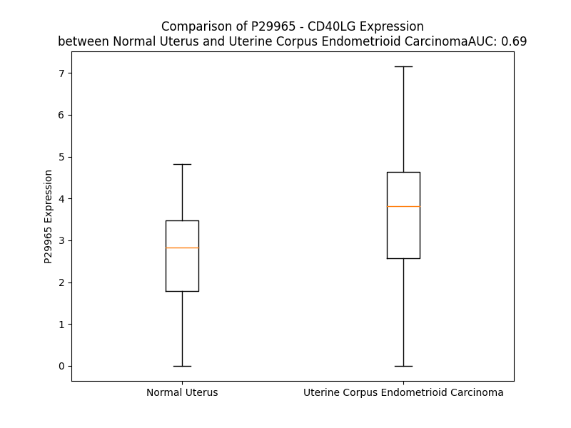

# Detailed Data for P29965

## Introduction to the Detailed Summary

### How to Interpret the Results

- **Summary & Metrics**: This section provides a quick reference to essential protein attributes, including expression changes, family classification, and biomarker applications. Regulation status (upregulated/downregulated) indicates the protein's behavior in a disease context. Some information comes from the original excel file with the proteins selected from literature, while others are derived from the analyses.
- **Expression Comparison**: A visual representation comparing protein expression between normal and disease states. It highlights significant changes in expression levels that might indicate diagnostic or therapeutic relevance. This is data coming from transcriptomics experiments and could not translate similarly to protein levels.
- **Isoform Alignment**: An interactive view of isoform alignments, revealing structural and functional differences between variants of the protein.
- **Interactors & Homologs**: Tables listing known interaction partners and homologous proteins, the more interactors and homologs, the more complex the protein is to design an antibody for.
- **Biological Assemblies**: Information about the structural arrangement of the protein in different assemblies, providing insights into its functional state but also the complexity of the protein to develop antibodies.
- **Combined Per-Residue Information**: A detailed table summarizing residue-level data. This includes predictions for epitope regions, aggregation tendencies, and modifications that might impact the protein's function. Each row corresponds to a residue in the protein, providing insights into specific sites that may be important for research or drug development.
## Summary & Metrics

- **UniProt Accession**: P29965
- **Gene Name**: CD40LG (CD40L)
- **Protein Name**: CD40 ligand
- **Swiss Prot**: CD40L_HUMAN
- **Family**: cytokine
- **Biomarker Application**: diagnosis,efficacy,safety,unspecified application
- **Number of Isoforms**: 0
- **Regulation**: -1
- **(transcriptomics) AUC**: 0.37
- **(transcriptomics) Fold Change**: 1.25
- **(transcriptomics) Regulation**: Downregulated
- **Discotope Epitope Count**: 44
- **Max n_uniprots (Homo)**: 3
- **Max n_uniprots (Hetero)**: 5

## Expression Comparison

## Interactors

| preferredName_A   | preferredName_B   |   score |
|:------------------|:------------------|--------:|
| CD40LG            | ICOS              |   0.999 |
| CD40LG            | CD40              |   0.999 |
| CD40LG            | CD80              |   0.998 |
| CD40LG            | CD28              |   0.998 |
| CD40LG            | CD86              |   0.998 |
| CD40LG            | LOC102723996      |   0.989 |
| CD40LG            | ICOSLG            |   0.988 |
| CD40LG            | SELPLG            |   0.983 |
| CD40LG            | CD4               |   0.983 |
| CD40LG            | CD70              |   0.964 |
| CD40LG            | TNFSF13B          |   0.961 |
| CD40LG            | TNFRSF13C         |   0.959 |
| CD40LG            | TNFSF4            |   0.958 |
| CD40LG            | SELP              |   0.951 |
| CD40LG            | TNF               |   0.942 |
| CD40LG            | TNFRSF4           |   0.938 |
| CD40LG            | TNFRSF13B         |   0.938 |
| CD40LG            | CD276             |   0.935 |
| CD40LG            | ITGA2B            |   0.934 |
| CD40LG            | CD27              |   0.934 |
| CD40LG            | ITGB2             |   0.925 |
| CD40LG            | IL2               |   0.924 |
| CD40LG            | IFNG              |   0.919 |
| CD40LG            | IL4               |   0.914 |
| CD40LG            | TNFRSF9           |   0.909 |
| CD40LG            | CD8A              |   0.907 |

## Homologs

| uniprot_id   | gene_id   |
|:-------------|:----------|
| Q5STB3       | TNF       |
| X6R8I9       | TNFSF15   |
| P48023       | FASLG     |
| Q5STV3       | LTA       |
| O43557       | TNFSF14   |
| Q06643       | LTB       |
| O14788       | TNFSF11   |
| P50591       | TNFSF10   |

## Biological Assemblies

|   Unnamed: 0 |   assembly |   n_uniprots | composition   | crystal_id   |
|-------------:|-----------:|-------------:|:--------------|:-------------|
|            0 |          1 |            3 | Homo          | 6w9g         |
|            0 |          1 |            1 | Homo          | 6brb         |
|            0 |          1 |            5 | Hetero        | 3qd6         |
|            1 |          2 |            5 | Hetero        | 3qd6         |
|            0 |          1 |            1 | Homo          | 1aly         |
|            0 |          1 |            3 | Homo          | 3lkj         |
|            0 |          1 |            3 | Homo          | 7sgm         |
|            0 |          1 |            3 | Homo          | 1i9r         |

## Combined Per-Residue Information

|   res | aa   |   epitope_score | epitope   |   relative_surface_accessibility |   modeling_confidence |   Aggregation | modification   | glycosylation                                             |
|------:|:-----|----------------:|:----------|---------------------------------:|----------------------:|--------------:|:---------------|:----------------------------------------------------------|
|     1 | M    |         0.13269 | False     |                          1.30909 |                 51.78 |         0     | N/A            | N/A                                                       |
|     2 | I    |         0.15185 | False     |                          0.96311 |                 48.39 |         0     | N/A            | N/A                                                       |
|     3 | E    |         0.22467 | False     |                          0.90788 |                 50.81 |         0     | N/A            | N/A                                                       |
|     4 | T    |         0.18776 | False     |                          0.91758 |                 56.85 |         0     | N/A            | N/A                                                       |
|     5 | Y    |         0.25132 | False     |                          0.96667 |                 50.28 |         0     | N/A            | N/A                                                       |
|     6 | N    |         0.1674  | False     |                          0.9744  |                 55.36 |         0     | N/A            | N/A                                                       |
|     7 | Q    |         0.20423 | False     |                          0.85962 |                 57.05 |         0     | N/A            | N/A                                                       |
|     8 | T    |         0.20351 | False     |                          0.92393 |                 54.92 |         0     | N/A            | N/A                                                       |
|     9 | S    |         0.18715 | False     |                          0.75507 |                 54.84 |         0     | N/A            | N/A                                                       |
|    10 | P    |         0.17691 | False     |                          0.90029 |                 55.38 |         0     | N/A            | N/A                                                       |
|    11 | R    |         0.21296 | False     |                          0.96704 |                 45.49 |         0     | N/A            | N/A                                                       |
|    12 | S    |         0.15895 | False     |                          0.85471 |                 50.22 |         0     | N/A            | N/A                                                       |
|    13 | A    |         0.13592 | False     |                          0.8171  |                 49.12 |         0     | N/A            | N/A                                                       |
|    14 | A    |         0.12888 | False     |                          1.0013  |                 45.24 |         0     | N/A            | N/A                                                       |
|    15 | T    |         0.18165 | False     |                          0.92809 |                 48.59 |         0     | N/A            | N/A                                                       |
|    16 | G    |         0.25217 | False     |                          0.72987 |                 53.15 |         0     | N/A            | N/A                                                       |
|    17 | L    |         0.20949 | False     |                          0.53976 |                 58.97 |         0     | N/A            | N/A                                                       |
|    18 | P    |         0.26598 | True      |                          0.59644 |                 67.56 |         0     | N/A            | N/A                                                       |
|    19 | I    |         0.23895 | False     |                          0.83613 |                 70.46 |         0     | N/A            | N/A                                                       |
|    20 | S    |         0.18951 | False     |                          0.60547 |                 74.71 |         0     | N/A            | N/A                                                       |
|    21 | M    |         0.13572 | False     |                          0.44621 |                 78.52 |         0     | N/A            | N/A                                                       |
|    22 | K    |         0.17974 | False     |                          0.63455 |                 78.77 |         0     | N/A            | N/A                                                       |
|    23 | I    |         0.16181 | False     |                          0.60104 |                 84.59 |        86.495 | N/A            | N/A                                                       |
|    24 | F    |         0.11196 | False     |                          0.65136 |                 86.84 |        94.466 | N/A            | N/A                                                       |
|    25 | M    |         0.12354 | False     |                          0.5341  |                 86.74 |        96.398 | N/A            | N/A                                                       |
|    26 | Y    |         0.15571 | False     |                          0.69928 |                 88.01 |        98.206 | N/A            | N/A                                                       |
|    27 | L    |         0.16466 | False     |                          0.66797 |                 91.9  |        99.121 | N/A            | N/A                                                       |
|    28 | L    |         0.11958 | False     |                          0.50028 |                 91.78 |        99.534 | N/A            | N/A                                                       |
|    29 | T    |         0.12185 | False     |                          0.49597 |                 90.48 |        99.692 | N/A            | N/A                                                       |
|    30 | V    |         0.08427 | False     |                          0.48316 |                 92.96 |        99.956 | N/A            | N/A                                                       |
|    31 | F    |         0.11932 | False     |                          0.66785 |                 94.51 |        99.914 | N/A            | N/A                                                       |
|    32 | L    |         0.13649 | False     |                          0.58335 |                 94.53 |        99.124 | N/A            | N/A                                                       |
|    33 | I    |         0.13641 | False     |                          0.54295 |                 93.55 |        94.798 | N/A            | N/A                                                       |
|    34 | T    |         0.09868 | False     |                          0.59753 |                 94.01 |        47.507 | N/A            | N/A                                                       |
|    35 | Q    |         0.11296 | False     |                          0.52473 |                 94.57 |        19.358 | N/A            | N/A                                                       |
|    36 | M    |         0.12157 | False     |                          0.74264 |                 93.66 |        18.258 | N/A            | N/A                                                       |
|    37 | I    |         0.10116 | False     |                          0.59346 |                 93.55 |        17.005 | N/A            | N/A                                                       |
|    38 | G    |         0.09425 | False     |                          0.43582 |                 93.29 |         3.253 | N/A            | N/A                                                       |
|    39 | S    |         0.11149 | False     |                          0.49889 |                 93.34 |         2.022 | N/A            | N/A                                                       |
|    40 | A    |         0.07648 | False     |                          0.55235 |                 93.29 |         2.145 | N/A            | N/A                                                       |
|    41 | L    |         0.12421 | False     |                          0.73118 |                 93.95 |         2.495 | N/A            | N/A                                                       |
|    42 | F    |         0.06856 | False     |                          0.62103 |                 92.37 |         2.474 | N/A            | N/A                                                       |
|    43 | A    |         0.11169 | False     |                          0.55106 |                 91.17 |         2.13  | N/A            | N/A                                                       |
|    44 | V    |         0.06265 | False     |                          0.57156 |                 90.42 |         1.973 | N/A            | N/A                                                       |
|    45 | Y    |         0.0666  | False     |                          0.53765 |                 91.54 |         1.447 | N/A            | N/A                                                       |
|    46 | L    |         0.1019  | False     |                          0.45834 |                 88.1  |         0.823 | N/A            | N/A                                                       |
|    47 | H    |         0.15073 | False     |                          0.64272 |                 86.22 |         0.005 | N/A            | N/A                                                       |
|    48 | R    |         0.1039  | False     |                          0.72068 |                 84.74 |         0     | N/A            | N/A                                                       |
|    49 | R    |         0.08968 | False     |                          0.53513 |                 84.92 |         0     | N/A            | N/A                                                       |
|    50 | L    |         0.12607 | False     |                          0.67791 |                 78.67 |         0     | N/A            | N/A                                                       |
|    51 | D    |         0.10981 | False     |                          0.45659 |                 78.22 |         0     | N/A            | N/A                                                       |
|    52 | K    |         0.07019 | False     |                          0.64618 |                 73.59 |         0     | N/A            | N/A                                                       |
|    53 | I    |         0.09287 | False     |                          0.52972 |                 71.96 |         0     | N/A            | N/A                                                       |
|    54 | E    |         0.16625 | False     |                          0.39856 |                 66.6  |         0     | N/A            | N/A                                                       |
|    55 | D    |         0.13197 | False     |                          0.62637 |                 67.08 |         0     | N/A            | N/A                                                       |
|    56 | E    |         0.09829 | False     |                          0.54229 |                 61.88 |         0     | N/A            | N/A                                                       |
|    57 | R    |         0.1412  | False     |                          0.50697 |                 58.32 |         0     | N/A            | N/A                                                       |
|    58 | N    |         0.13982 | False     |                          0.47347 |                 61.03 |         0     | N/A            | N/A                                                       |
|    59 | L    |         0.06686 | False     |                          0.83769 |                 59.94 |         0     | N/A            | N/A                                                       |
|    60 | H    |         0.10183 | False     |                          0.62566 |                 65.83 |         0     | N/A            | N/A                                                       |
|    61 | E    |         0.09655 | False     |                          0.4839  |                 62.49 |         0     | N/A            | N/A                                                       |
|    62 | D    |         0.1548  | False     |                          0.61619 |                 65.02 |         3.256 | N/A            | N/A                                                       |
|    63 | F    |         0.09506 | False     |                          0.6284  |                 70.29 |         3.256 | N/A            | N/A                                                       |
|    64 | V    |         0.11676 | False     |                          0.48957 |                 70.68 |         3.256 | N/A            | N/A                                                       |
|    65 | F    |         0.16129 | False     |                          0.56915 |                 70.79 |         3.256 | N/A            | N/A                                                       |
|    66 | M    |         0.15035 | False     |                          0.72852 |                 70.67 |         3.256 | N/A            | N/A                                                       |
|    67 | K    |         0.08013 | False     |                          0.4483  |                 74.19 |         3.256 | N/A            | N/A                                                       |
|    68 | T    |         0.1075  | False     |                          0.13782 |                 71.28 |         3.256 | N/A            | N/A                                                       |
|    69 | I    |         0.1411  | False     |                          0.23912 |                 73.13 |         3.256 | N/A            | N/A                                                       |
|    70 | Q    |         0.13351 | False     |                          0.59205 |                 75.59 |         0.141 | N/A            | N/A                                                       |
|    71 | R    |         0.12638 | False     |                          0.42107 |                 71.26 |         0     | N/A            | N/A                                                       |
|    72 | C    |         0.10716 | False     |                          0.25388 |                 72.7  |         0     | N/A            | N/A                                                       |
|    73 | N    |         0.15833 | False     |                          0.84879 |                 71.4  |         0     | N/A            | N/A                                                       |
|    74 | T    |         0.13913 | False     |                          0.67735 |                 67.91 |         0     | N/A            | N/A                                                       |
|    75 | G    |         0.19102 | False     |                          0.72256 |                 63.29 |         0     | N/A            | N/A                                                       |
|    76 | E    |         0.18093 | False     |                          0.5036  |                 56.72 |         0     | N/A            | N/A                                                       |
|    77 | R    |         0.20303 | False     |                          0.99704 |                 54.29 |         0     | N/A            | N/A                                                       |
|    78 | S    |         0.18388 | False     |                          0.76495 |                 51.95 |         0.385 | N/A            | N/A                                                       |
|    79 | L    |         0.17369 | False     |                          0.34556 |                 47.01 |         0.385 | N/A            | N/A                                                       |
|    80 | S    |         0.17285 | False     |                          0.88559 |                 54.7  |         0.385 | N/A            | N/A                                                       |
|    81 | L    |         0.34789 | True      |                          1.06551 |                 56.02 |         0.385 | N/A            | N/A                                                       |
|    82 | L    |         0.21197 | False     |                          0.39352 |                 56.84 |         0.385 | N/A            | N/A                                                       |
|    83 | N    |         0.26552 | True      |                          0.56052 |                 68.75 |         0     | N/A            | N/A                                                       |
|    84 | C    |         0.17617 | False     |                          0.22179 |                 72.21 |         0     | N/A            | N/A                                                       |
|    85 | E    |         0.17687 | False     |                          0.74372 |                 72.44 |         0     | N/A            | N/A                                                       |
|    86 | E    |         0.22447 | False     |                          0.47668 |                 73.33 |         0     | N/A            | N/A                                                       |
|    87 | I    |         0.1844  | False     |                          0.19912 |                 70.52 |         0     | N/A            | N/A                                                       |
|    88 | K    |         0.17284 | False     |                          0.59631 |                 71.95 |         0     | N/A            | N/A                                                       |
|    89 | S    |         0.17813 | False     |                          0.47922 |                 76.46 |         0     | N/A            | N/A                                                       |
|    90 | Q    |         0.21204 | False     |                          0.63064 |                 74.41 |         0     | N/A            | N/A                                                       |
|    91 | F    |         0.19257 | False     |                          0.48333 |                 74.32 |         0     | N/A            | N/A                                                       |
|    92 | E    |         0.12813 | False     |                          0.46582 |                 76.26 |         0     | N/A            | N/A                                                       |
|    93 | G    |         0.08066 | False     |                          0.44647 |                 79.08 |         0.235 | N/A            | N/A                                                       |
|    94 | F    |         0.10093 | False     |                          0.69198 |                 74.56 |         2.856 | N/A            | N/A                                                       |
|    95 | V    |         0.06979 | False     |                          0.38559 |                 76.16 |         2.856 | N/A            | N/A                                                       |
|    96 | K    |         0.118   | False     |                          0.63466 |                 75.86 |         2.856 | N/A            | N/A                                                       |
|    97 | D    |         0.08734 | False     |                          0.57111 |                 72.4  |         2.856 | N/A            | N/A                                                       |
|    98 | I    |         0.07663 | False     |                          0.57378 |                 68.45 |         2.856 | N/A            | N/A                                                       |
|    99 | M    |         0.20901 | False     |                          0.61948 |                 61.51 |         2.856 | N/A            | N/A                                                       |
|   100 | L    |         0.13091 | False     |                          0.62761 |                 58.8  |         2.856 | N/A            | N/A                                                       |
|   101 | N    |         0.09636 | False     |                          0.75622 |                 55.7  |         0     | N/A            | N/A                                                       |
|   102 | K    |         0.09751 | False     |                          0.47109 |                 50.71 |         0     | N/A            | N/A                                                       |
|   103 | E    |         0.21457 | False     |                          0.4958  |                 49.57 |         0     | N/A            | N/A                                                       |
|   104 | E    |         0.17137 | False     |                          0.92955 |                 47.77 |         0     | N/A            | N/A                                                       |
|   105 | T    |         0.17012 | False     |                          0.81355 |                 44.57 |         0     | N/A            | N/A                                                       |
|   106 | K    |         0.15812 | False     |                          0.72213 |                 36.43 |         0     | N/A            | N/A                                                       |
|   107 | K    |         0.22419 | False     |                          0.96814 |                 35.47 |         0     | N/A            | N/A                                                       |
|   108 | E    |         0.23058 | False     |                          0.84039 |                 37.65 |         0     | N/A            | N/A                                                       |
|   109 | N    |         0.32292 | True      |                          0.91207 |                 34.04 |         0     | N/A            | N/A                                                       |
|   110 | S    |         0.24501 | False     |                          0.74842 |                 33.3  |         0     | N/A            | N/A                                                       |
|   111 | F    |         0.278   | True      |                          1.10284 |                 32.5  |         0     | N/A            | N/A                                                       |
|   112 | E    |         0.1367  | False     |                          0.87608 |                 40.21 |         0     | N/A            | N/A                                                       |
|   113 | M    |         0.23992 | False     |                          0.9523  |                 38.52 |         0     | N/A            | N/A                                                       |
|   114 | Q    |         0.16679 | False     |                          0.51545 |                 36.28 |         0     | N/A            | N/A                                                       |
|   115 | K    |         0.19305 | False     |                          0.59765 |                 43.82 |         0     | N/A            | N/A                                                       |
|   116 | G    |         0.19283 | False     |                          0.71717 |                 38.07 |         0     | N/A            | N/A                                                       |
|   117 | D    |         0.27792 | True      |                          0.96816 |                 44.19 |         0     | N/A            | N/A                                                       |
|   118 | Q    |         0.23438 | False     |                          0.71693 |                 60.73 |         0     | N/A            | N/A                                                       |
|   119 | N    |         0.20363 | False     |                          0.79472 |                 72.95 |         0     | N/A            | N/A                                                       |
|   120 | P    |         0.13739 | False     |                          0.22765 |                 85.5  |         0     | N/A            | N/A                                                       |
|   121 | Q    |         0.16308 | False     |                          0.74843 |                 91.18 |         0     | N/A            | N/A                                                       |
|   122 | I    |         0.02178 | False     |                          0.02575 |                 96.22 |         0.169 | N/A            | N/A                                                       |
|   123 | A    |         0.16052 | False     |                          0.27166 |                 97.96 |         0.169 | N/A            | N/A                                                       |
|   124 | A    |         0.01678 | False     |                          0.01844 |                 98.48 |         0.169 | N/A            | N/A                                                       |
|   125 | H    |         0.13512 | False     |                          0.23278 |                 98.58 |         0.169 | N/A            | N/A                                                       |
|   126 | V    |         0.00442 | False     |                          0       |                 98.5  |         0.169 | N/A            | N/A                                                       |
|   127 | I    |         0.17734 | False     |                          0.15999 |                 98.18 |         0.169 | N/A            | N/A                                                       |
|   128 | S    |         0.03372 | False     |                          0.01779 |                 97.63 |         0     | N/A            | N/A                                                       |
|   129 | E    |         0.13824 | False     |                          0.35067 |                 96.05 |         0     | N/A            | N/A                                                       |
|   130 | A    |         0.16552 | False     |                          0.66977 |                 94.22 |         0     | N/A            | N/A                                                       |
|   131 | S    |         0.14061 | False     |                          0.41019 |                 91    |         0     | N/A            | N/A                                                       |
|   132 | S    |         0.26232 | True      |                          0.93291 |                 86.8  |         0     | N/A            | N/A                                                       |
|   133 | K    |         0.27087 | True      |                          0.58445 |                 85.18 |         0     | N/A            | N/A                                                       |
|   134 | T    |         0.2306  | False     |                          1.03339 |                 80.61 |         0     | N/A            | N/A                                                       |
|   135 | T    |         0.27365 | True      |                          0.35376 |                 91.25 |         0.128 | N/A            | N/A                                                       |
|   136 | S    |         0.23116 | False     |                          0.36725 |                 94.82 |         0.31  | N/A            | N/A                                                       |
|   137 | V    |         0.12634 | False     |                          0.20234 |                 97.15 |         1.779 | N/A            | N/A                                                       |
|   138 | L    |         0.01651 | False     |                          0.0272  |                 97.83 |         1.779 | N/A            | N/A                                                       |
|   139 | Q    |         0.21485 | False     |                          0.0848  |                 97.6  |         1.779 | N/A            | N/A                                                       |
|   140 | W    |         0.04895 | False     |                          0.01453 |                 98.1  |         1.779 | N/A            | N/A                                                       |
|   141 | A    |         0.15277 | False     |                          0.1556  |                 97.61 |         1.651 | N/A            | N/A                                                       |
|   142 | E    |         0.26375 | True      |                          0.42849 |                 96.93 |         0     | N/A            | N/A                                                       |
|   143 | K    |         0.25492 | True      |                          0.42372 |                 95.39 |         0     | N/A            | N/A                                                       |
|   144 | G    |         0.30984 | True      |                          0.817   |                 94.77 |         0     | N/A            | N/A                                                       |
|   145 | Y    |         0.35596 | True      |                          0.93569 |                 95.5  |         0     | N/A            | N/A                                                       |
|   146 | Y    |         0.20925 | False     |                          0.42921 |                 97    |         0     | N/A            | N/A                                                       |
|   147 | T    |         0.22311 | False     |                          0.43566 |                 97.58 |         0     | N/A            | N/A                                                       |
|   148 | M    |         0.15704 | False     |                          0.25868 |                 96.44 |         0     | N/A            | N/A                                                       |
|   149 | S    |         0.14062 | False     |                          0.39099 |                 92.76 |         0     | N/A            | N/A                                                       |
|   150 | N    |         0.10467 | False     |                          0.23884 |                 92.67 |         0     | N/A            | N/A                                                       |
|   151 | N    |         0.29433 | True      |                          0.67234 |                 94.34 |         0.17  | N/A            | N/A                                                       |
|   152 | L    |         0.11644 | False     |                          0.1929  |                 96.41 |         0.17  | N/A            | N/A                                                       |
|   153 | V    |         0.00826 | False     |                          0.00352 |                 97.49 |         0.17  | N/A            | N/A                                                       |
|   154 | T    |         0.17521 | False     |                          0.28593 |                 97.95 |         0.17  | N/A            | N/A                                                       |
|   155 | L    |         0.12712 | False     |                          0.20747 |                 98.3  |         0.17  | N/A            | N/A                                                       |
|   156 | E    |         0.15016 | False     |                          0.31295 |                 96.71 |         0     | N/A            | N/A                                                       |
|   157 | N    |         0.30469 | True      |                          0.75302 |                 95.2  |         0     | N/A            | N/A                                                       |
|   158 | G    |         0.22492 | False     |                          0.25401 |                 96.11 |         0     | N/A            | N/A                                                       |
|   159 | K    |         0.20627 | False     |                          0.35866 |                 97.4  |         0     | N/A            | N/A                                                       |
|   160 | Q    |         0.11875 | False     |                          0.11315 |                 97.94 |         0     | N/A            | N/A                                                       |
|   161 | L    |         0.00357 | False     |                          0       |                 98.58 |         0     | N/A            | N/A                                                       |
|   162 | T    |         0.10018 | False     |                          0.08949 |                 98.3  |         0     | N/A            | N/A                                                       |
|   163 | V    |         0.00408 | False     |                          0       |                 97.9  |         0     | N/A            | N/A                                                       |
|   164 | K    |         0.15455 | False     |                          0.51604 |                 97.04 |         0     | N/A            | N/A                                                       |
|   165 | R    |         0.16275 | False     |                          0.35567 |                 96.02 |         0     | N/A            | N/A                                                       |
|   166 | Q    |         0.13372 | False     |                          0.46944 |                 96.64 |         0.02  | N/A            | N/A                                                       |
|   167 | G    |         0.0447  | False     |                          0.19796 |                 96.07 |         2.863 | N/A            | N/A                                                       |
|   168 | L    |         0.11459 | False     |                          0.57108 |                 97.98 |        76.653 | N/A            | N/A                                                       |
|   169 | Y    |         0.00833 | False     |                          0       |                 98.48 |        87.799 | N/A            | N/A                                                       |
|   170 | Y    |         0.10093 | False     |                          0.3191  |                 98.61 |        90.447 | N/A            | N/A                                                       |
|   171 | I    |         0.00412 | False     |                          0       |                 98.67 |        91.203 | N/A            | N/A                                                       |
|   172 | Y    |         0.08647 | False     |                          0.19788 |                 98.7  |        91.124 | N/A            | N/A                                                       |
|   173 | A    |         0.0073  | False     |                          0.00471 |                 98.67 |        77.797 | N/A            | N/A                                                       |
|   174 | Q    |         0.13834 | False     |                          0.28109 |                 98.53 |        64.515 | N/A            | N/A                                                       |
|   175 | V    |         0.00756 | False     |                          0.00571 |                 98.45 |        63.972 | N/A            | N/A                                                       |
|   176 | T    |         0.04993 | False     |                          0.01958 |                 98.3  |        57.502 | N/A            | N/A                                                       |
|   177 | F    |         0.00914 | False     |                          0       |                 97.28 |        53.907 | N/A            | N/A                                                       |
|   178 | C    |         0.19368 | False     |                          0.21566 |                 96    |         9.745 | N/A            | N/A                                                       |
|   179 | S    |         0.05965 | False     |                          0.01768 |                 94.37 |         0.515 | N/A            | N/A                                                       |
|   180 | N    |         0.1612  | False     |                          0.08077 |                 91.12 |         0.112 | N/A            | N/A                                                       |
|   181 | R    |         0.4521  | True      |                          0.63109 |                 85.69 |         0     | N/A            | N/A                                                       |
|   182 | E    |         0.52778 | True      |                          0.7119  |                 83.47 |         0     | N/A            | N/A                                                       |
|   183 | A    |         0.47127 | True      |                          0.88037 |                 78.99 |         0     | N/A            | N/A                                                       |
|   184 | S    |         0.43117 | True      |                          0.17565 |                 77.31 |         0     | N/A            | N/A                                                       |
|   185 | S    |         0.33562 | True      |                          0.60228 |                 78.27 |         0     | N/A            | N/A                                                       |
|   186 | Q    |         0.29228 | True      |                          0.87214 |                 81.81 |         0     | N/A            | N/A                                                       |
|   187 | A    |         0.24827 | False     |                          0.53304 |                 92.13 |         0     | N/A            | N/A                                                       |
|   188 | P    |         0.28804 | True      |                          0.3764  |                 95.16 |         0     | N/A            | N/A                                                       |
|   189 | F    |         0.00572 | False     |                          0.00064 |                 96.66 |         6.219 | N/A            | N/A                                                       |
|   190 | I    |         0.22479 | False     |                          0.32186 |                 97.66 |         6.358 | N/A            | N/A                                                       |
|   191 | A    |         0.00384 | False     |                          0       |                 98.37 |         6.358 | N/A            | N/A                                                       |
|   192 | S    |         0.16048 | False     |                          0.10041 |                 98.51 |         6.358 | N/A            | N/A                                                       |
|   193 | L    |         0.0052  | False     |                          0       |                 98.61 |         6.358 | N/A            | N/A                                                       |
|   194 | C    |         0.17193 | False     |                          0.07135 |                 98.43 |         2.173 | N/A            | N/A                                                       |
|   195 | L    |         0.06266 | False     |                          0.04183 |                 98.29 |         1.85  | N/A            | N/A                                                       |
|   196 | K    |         0.17485 | False     |                          0.44884 |                 97.55 |         0     | N/A            | N/A                                                       |
|   197 | S    |         0.0467  | False     |                          0.04127 |                 95.23 |         0     | N/A            | N/A                                                       |
|   198 | P    |         0.24425 | False     |                          0.60406 |                 93.48 |         0     | N/A            | N/A                                                       |
|   199 | G    |         0.33125 | True      |                          1.09941 |                 92.7  |         0     | N/A            | N/A                                                       |
|   200 | R    |         0.29712 | True      |                          0.61468 |                 92.55 |         0     | N/A            | N/A                                                       |
|   201 | F    |         0.29852 | True      |                          0.98598 |                 94.32 |         0     | N/A            | N/A                                                       |
|   202 | E    |         0.38549 | True      |                          0.49726 |                 95.82 |         0     | N/A            | N/A                                                       |
|   203 | R    |         0.24294 | False     |                          0.40581 |                 96.38 |         0     | N/A            | N/A                                                       |
|   204 | I    |         0.17872 | False     |                          0.51273 |                 98.11 |         0     | N/A            | N/A                                                       |
|   205 | L    |         0.11381 | False     |                          0.20452 |                 97.97 |         0     | N/A            | N/A                                                       |
|   206 | L    |         0.20227 | False     |                          0.26792 |                 98.36 |         0     | N/A            | N/A                                                       |
|   207 | R    |         0.38923 | True      |                          0.63091 |                 98.14 |         0     | N/A            | N/A                                                       |
|   208 | A    |         0.25331 | False     |                          0.26636 |                 97.93 |         0     | N/A            | N/A                                                       |
|   209 | A    |         0.34838 | True      |                          0.57318 |                 97.16 |         0     | N/A            | N/A                                                       |
|   210 | N    |         0.30168 | True      |                          0.28313 |                 96.3  |         0     | N/A            | N/A                                                       |
|   211 | T    |         0.25476 | True      |                          0.7495  |                 94.4  |         0     | N/A            | N/A                                                       |
|   212 | H    |         0.14073 | False     |                          0.1161  |                 92.71 |         0     | N/A            | N/A                                                       |
|   213 | S    |         0.15513 | False     |                          0.16843 |                 91.86 |         0     | N/A            | N/A                                                       |
|   214 | S    |         0.38293 | True      |                          0.7509  |                 91.45 |         0     | N/A            | N/A                                                       |
|   215 | A    |         0.42494 | True      |                          0.43966 |                 92.11 |         0     | N/A            | N/A                                                       |
|   216 | K    |         0.63123 | True      |                          0.74791 |                 90.12 |         0     | N/A            | N/A                                                       |
|   217 | P    |         0.58581 | True      |                          0.91641 |                 91.48 |         0     | N/A            | N/A                                                       |
|   218 | C    |         0.35161 | True      |                          0.33448 |                 94.8  |         0     | N/A            | N/A                                                       |
|   219 | G    |         0.26682 | True      |                          0.11105 |                 94.08 |         0     | N/A            | N/A                                                       |
|   220 | Q    |         0.43402 | True      |                          0.54141 |                 95.82 |         0     | N/A            | N/A                                                       |
|   221 | Q    |         0.3172  | True      |                          0.24345 |                 96.82 |         0     | N/A            | N/A                                                       |
|   222 | S    |         0.30371 | True      |                          0.53138 |                 97.79 |         0     | N/A            | N/A                                                       |
|   223 | I    |         0.14631 | False     |                          0.03255 |                 98.12 |         0     | N/A            | N/A                                                       |
|   224 | H    |         0.24424 | False     |                          0.60455 |                 98.56 |         0     | N/A            | N/A                                                       |
|   225 | L    |         0.11148 | False     |                          0.05853 |                 98.45 |         0.18  | N/A            | N/A                                                       |
|   226 | G    |         0.169   | False     |                          0.39149 |                 98.5  |         0.18  | N/A            | N/A                                                       |
|   227 | G    |         0.15481 | False     |                          0.1706  |                 98.17 |         0.18  | N/A            | N/A                                                       |
|   228 | V    |         0.11062 | False     |                          0.55507 |                 98.46 |         0.18  | N/A            | N/A                                                       |
|   229 | F    |         0.15712 | False     |                          0.21487 |                 98.27 |         0.18  | N/A            | N/A                                                       |
|   230 | E    |         0.11588 | False     |                          0.5005  |                 97.42 |         0     | N/A            | N/A                                                       |
|   231 | L    |         0.00604 | False     |                          0.0033  |                 97.7  |         0     | N/A            | N/A                                                       |
|   232 | Q    |         0.12112 | False     |                          0.33652 |                 96.8  |         0     | N/A            | N/A                                                       |
|   233 | P    |         0.13257 | False     |                          0.52953 |                 96.92 |         0     | N/A            | N/A                                                       |
|   234 | G    |         0.08549 | False     |                          0.39925 |                 97.13 |         0.778 | N/A            | N/A                                                       |
|   235 | A    |         0.0061  | False     |                          0.00222 |                 98.1  |        10.428 | N/A            | N/A                                                       |
|   236 | S    |         0.09006 | False     |                          0.04823 |                 98.3  |        13.042 | N/A            | N/A                                                       |
|   237 | V    |         0.00259 | False     |                          0       |                 98.61 |        31.348 | N/A            | N/A                                                       |
|   238 | F    |         0.14076 | False     |                          0.06238 |                 98.48 |        31.932 | N/A            | N/A                                                       |
|   239 | V    |         0.0029  | False     |                          0       |                 98.56 |        31.932 | N/A            | N/A                                                       |
|   240 | N    |         0.29753 | True      |                          0.23094 |                 97.27 |        23.823 | N/A            | N-linked (GlcNAc...) (complex) asparagine; alternate      |
|   240 | N    |         0.29753 | True      |                          0.23094 |                 97.27 |        23.823 | N/A            | N-linked (GlcNAc...) (high mannose) asparagine; alternate |
|   241 | V    |         0.06364 | False     |                          0.03638 |                 97.43 |        23.19  | N/A            | N/A                                                       |
|   242 | T    |         0.1851  | False     |                          0.5326  |                 95.18 |         8.975 | N/A            | N/A                                                       |
|   243 | D    |         0.35467 | True      |                          0.27872 |                 93.72 |         0     | N/A            | N/A                                                       |
|   244 | P    |         0.14934 | False     |                          0.29819 |                 95.24 |         0     | N/A            | N/A                                                       |
|   245 | S    |         0.26022 | True      |                          0.76458 |                 93.66 |         0     | N/A            | N/A                                                       |
|   246 | Q    |         0.2202  | False     |                          0.14915 |                 94.61 |         0     | N/A            | N/A                                                       |
|   247 | V    |         0.0479  | False     |                          0.07389 |                 97.05 |         0     | N/A            | N/A                                                       |
|   248 | S    |         0.15462 | False     |                          0.14303 |                 97.16 |         0     | N/A            | N/A                                                       |
|   249 | H    |         0.1061  | False     |                          0.33361 |                 96.79 |         0     | N/A            | N/A                                                       |
|   250 | G    |         0.3115  | True      |                          0.43834 |                 94.57 |         0     | N/A            | N/A                                                       |
|   251 | T    |         0.35785 | True      |                          0.9609  |                 95.59 |         0.226 | N/A            | N/A                                                       |
|   252 | G    |         0.21113 | False     |                          0.60093 |                 94.23 |         0.651 | N/A            | N/A                                                       |
|   253 | F    |         0.21421 | False     |                          0.43471 |                 97.43 |         5.373 | N/A            | N/A                                                       |
|   254 | T    |         0.01598 | False     |                          0.00951 |                 98.34 |         5.758 | N/A            | N/A                                                       |
|   255 | S    |         0.12879 | False     |                          0.09675 |                 98.46 |         6.41  | N/A            | N/A                                                       |
|   256 | F    |         0.00806 | False     |                          0       |                 98.74 |         6.41  | N/A            | N/A                                                       |
|   257 | G    |         0.00878 | False     |                          0       |                 98.59 |         6.41  | N/A            | N/A                                                       |
|   258 | L    |         0.00726 | False     |                          0.0067  |                 98.42 |         6.41  | N/A            | N/A                                                       |
|   259 | L    |         0.1046  | False     |                          0.42784 |                 98.11 |         6.41  | N/A            | N/A                                                       |
|   260 | K    |         0.06693 | False     |                          0.31364 |                 97.22 |         0     | N/A            | N/A                                                       |
|   261 | L    |         0.07404 | False     |                          0.72473 |                 94.52 |         0     | N/A            | N/A                                                       |

